# Google サンドボックス環境 完全ガイド 2026

> **対象読者**: 初学者〜中級者
> **最終更新**: 2026-06-12
> **ステータス**: Google Cloud Next '26 / 最新公式情報に基づく

---

## 目次

1. [サンドボックスとは？](#1-サンドボックスとは)
2. [全体マップ：6つのサンドボックス技術](#2-全体マップ6つのサンドボックス技術)
3. [GKE Agent Sandbox](#3-gke-agent-sandbox--aiエージェント向け)
4. [Gemini Code Execution](#4-gemini-code-execution--aiapi向け)
5. [gVisor / GKE Sandbox](#5-gvisor--gke-sandbox--コンテナ向け)
6. [Sandbox2 / SAPI](#6-sandbox2--sapi--cc向け)
7. [V8 Sandbox](#7-v8-sandbox--ブラウザ向け)
8. [Privacy Sandbox](#8-privacy-sandbox--廃止済み--歴史的記録)
9. [ユースケース別 技術選択ガイド](#9-ユースケース別-技術選択ガイド)
10. [セキュリティ原則 共通ベストプラクティス](#10-セキュリティ原則-共通ベストプラクティス)
11. [参考・公式ドキュメント一覧](#11-参考公式ドキュメント一覧)

---

## 1. サンドボックスとは？

**サンドボックス（Sandbox）**とは、プログラムや処理を「砂場」のように隔離された環境で実行し、万が一問題が発生しても他のシステムに影響が及ばないようにする技術です。

子どもが砂場（サンドボックス）で遊ぶとき、砂が外に出ないように囲いがあるのと同じイメージです。

### なぜサンドボックスが必要なのか

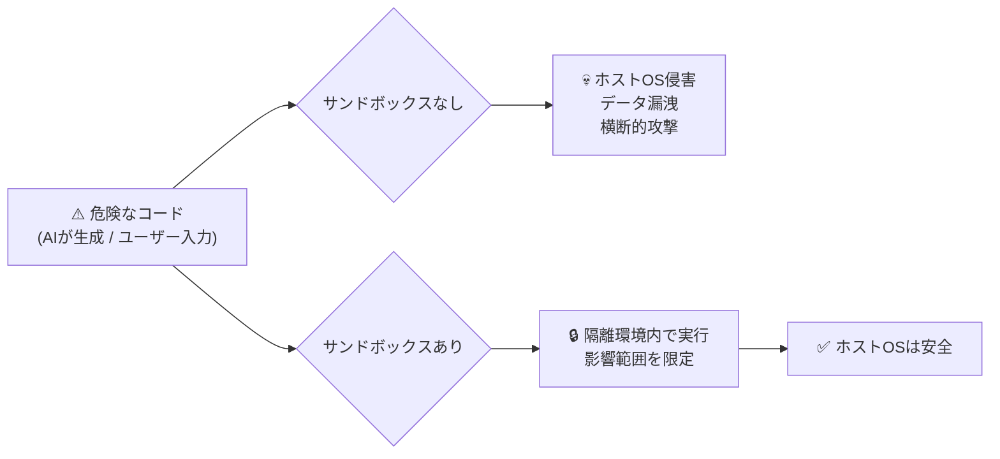

### セキュリティの三層防御モデル

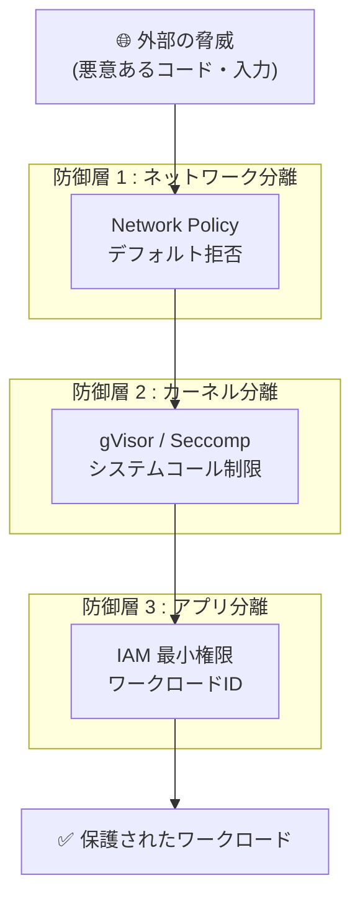

---

## 2. 全体マップ：6つのサンドボックス技術

### クイックリファレンス表

| # | **名称** | **対象領域** | **主要技術** | **現在のステータス** |
|---|---|---|---|---|
| 1 | GKE Agent Sandbox | AIエージェント | gVisor + Pod Snapshot | **GA（2026年5月〜）** |
| 2 | Gemini Code Execution | AI/LLM API | マネージドLinux環境 | **GA** |
| 3 | gVisor / GKE Sandbox | コンテナ | ユーザー空間カーネル | **GA** |
| 4 | Sandbox2 / SAPI | C/C++アプリ | Seccomp-bpf + Namespaces | **GA（OSS）** |
| 5 | V8 Sandbox | ブラウザJS実行 | メモリ空間分離 | **開発継続中** |
| 6 | Privacy Sandbox | Web広告 | デバイス内暗号化API | ⛔ **2025年10月廃止** |

### 技術スタックの位置づけ

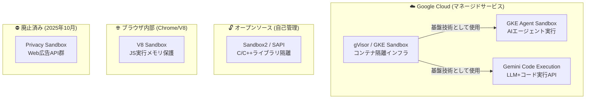

---

## 3. GKE Agent Sandbox — AIエージェント向け

> 🟢 **ステータス**: 一般提供（GA）— 2026年5月20日 Google Cloud Next '26 にて発表

### 3-1. 概念の理解

GKE Agent Sandbox は、AIエージェントが生成した「信頼できないコード」をKubernetes上で安全・高速に実行するための専用インフラです。
LangChain や Google ADK（Agent Development Kit）などのフレームワークと連携し、**1秒未満のレイテンシ**で最大 **300サンドボックス/秒** のスループットを実現します。

### 3-2. アーキテクチャ

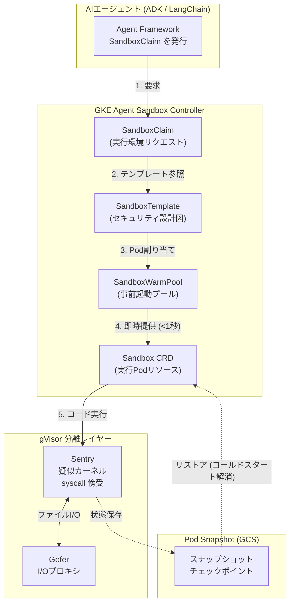

### 3-3. ベストプラクティス

| カテゴリ | ベストプラクティス | 理由 |
|---|---|---|
| **分離** | 信頼できないコードは**必ず** gVisor Pod で実行 | ホストOS侵害 (RCE) を防ぐ |
| **パフォーマンス** | SandboxWarmPool で事前起動Pod を常時確保 | コールドスタートをサブ秒に抑える |
| **コスト** | Pod Snapshot で idle Pod を suspend | GPU/TPUの無駄なアイドルコストを削減 |
| **ID管理** | Workload Identity Federation で Pod ごとに最小権限IAM | 横断的攻撃の抑止 |
| **ネットワーク** | Network Policy を「デフォルト拒否」に設定 | 外部コールバックや横展開を防止 |
| **リソース** | 全コンテナに `resources.limits` を設定 | ノードリソース枯渇を防ぐ |

### 3-4. セットアップ手順（ステップバイステップ）

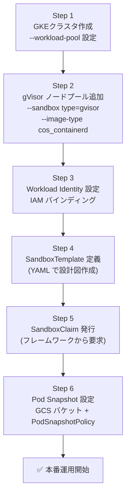

**クラスタ作成の例:**

```bash
# 1. GKE クラスタ作成（Workload Identity 有効）
gcloud container clusters create gke-agent-lab \
  --zone us-central1-a \
  --num-nodes 2 \
  --machine-type e2-standard-4 \
  --workload-pool=${PROJECT_ID}.svc.id.goog

# 2. gVisor ノードプール追加
gcloud container node-pools create sandboxed-pool \
  --cluster gke-agent-lab \
  --zone us-central1-a \
  --num-nodes 1 \
  --machine-type e2-standard-4 \
  --image-type cos_containerd \
  --sandbox type=gvisor
```

**SandboxTemplate の例:**

```yaml
apiVersion: sandbox.gke.io/v1
kind: SandboxTemplate
metadata:
  name: agent-executor-template
spec:
  runtimeClassName: gvisor        # gVisor で実行
  networkPolicy:
    defaultDeny: true             # ネットワーク: デフォルト拒否
  resources:
    limits:
      cpu: "2"
      memory: "4Gi"
```

---

## 4. Gemini Code Execution — AI/API向け

> 🟢 **ステータス**: 一般提供（GA）

### 4-1. 概念の理解

Gemini Code Execution は、Gemini API の「ツール」として提供されるマネージドなコード実行環境です。Gemini モデルが自らPythonコードを生成し、そのコードをサンドボックス環境で実行して結果を確認しながら最終的な回答に到達します。インフラ構築は不要で、**API一行で有効化**できます。

### 4-2. 動作フロー

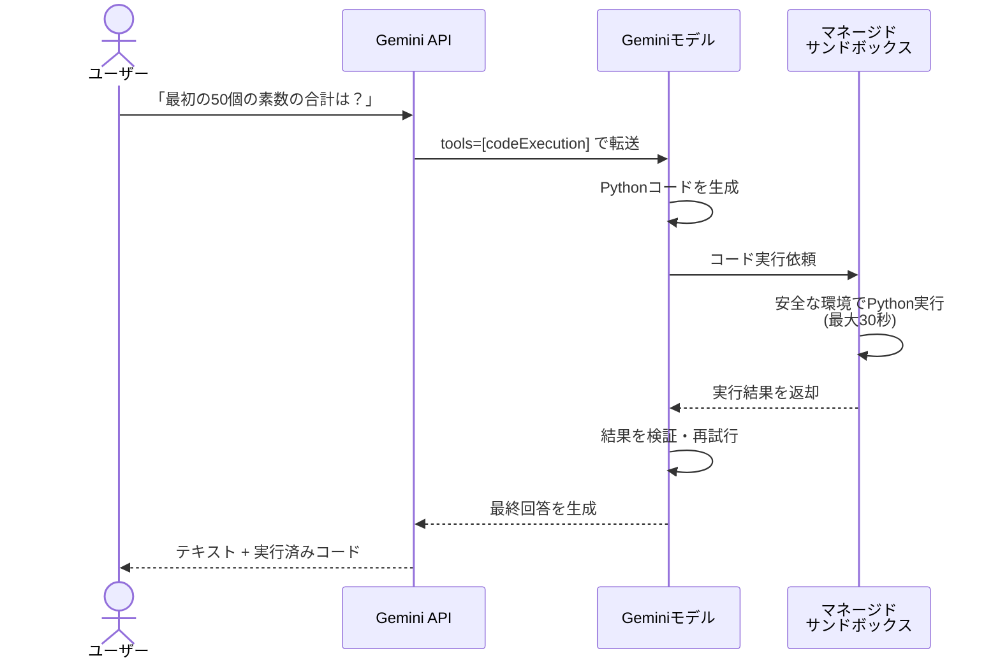

### 4-3. 制約事項と対策

| 制約 | 詳細 | 対処法 |
|---|---|---|
| **タイムアウト** | 最大 30 秒で強制終了 | 処理を分割して複数ターンで実行 |
| **ファイルI/O 不可** | ファイルの読み書きはできない | データはプロンプト内にテキストで埋め込む |
| **外部ネットワーク不可** | 外部API呼び出し不可 | Function Calling と組み合わせる |
| **Python のみ** | 他言語は非対応 | Pythonで記述するか、Function Calling で補完 |

### 4-4. ベストプラクティス

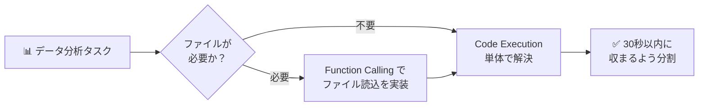

**Python SDKによる実装例:**

```python
from google import genai
from google.genai.types import Tool, ToolCodeExecution, GenerateContentConfig

client = genai.Client()

# Code Execution ツールを有効化
code_execution_tool = Tool(code_execution=ToolCodeExecution())

response = client.models.generate_content(
    model="gemini-2.0-flash-001",
    contents="最初の50個の素数の合計を計算してください",
    config=GenerateContentConfig(tools=[code_execution_tool])
)
print(response.text)
```

---

## 5. gVisor / GKE Sandbox — コンテナ向け

> 🟢 **ステータス**: 一般提供（GA）— GKE Agent Sandbox の基盤技術

### 5-1. 概念の理解

gVisor は Google が開発したオープンソースの「アプリケーションカーネル」です。通常のコンテナがホストOSのカーネルを直接使用するのに対し、gVisor は Linux システムコールをユーザー空間で完全に再実装します。これによりコンテナがホストOSのカーネルに直接触れることなく実行されます。

### 5-2. gVisor の内部アーキテクチャ

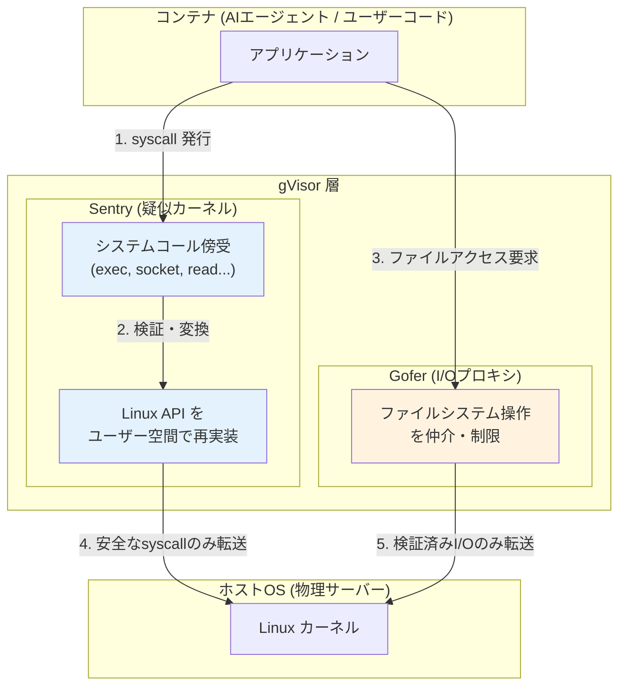

### 5-3. 通常コンテナとの比較

| 比較項目 | 通常のコンテナ | gVisor コンテナ |
|---|---|---|
| **カーネル** | ホストOSカーネルを直接使用 | gVisorが疑似カーネルとして仲介 |
| **隔離強度** | 中（名前空間・cgroup） | 高（ユーザー空間カーネル） |
| **パフォーマンス** | ネイティブに近い | 10〜20%のオーバーヘッド |
| **対応I/O** | 全システムコール | gVisorが実装済みのもののみ |
| **Breakout リスク** | カーネル脆弱性で逃脱可能 | ホストカーネルに直接アクセス不可 |

### 5-4. GKE Sandbox 有効化 ベストプラクティス

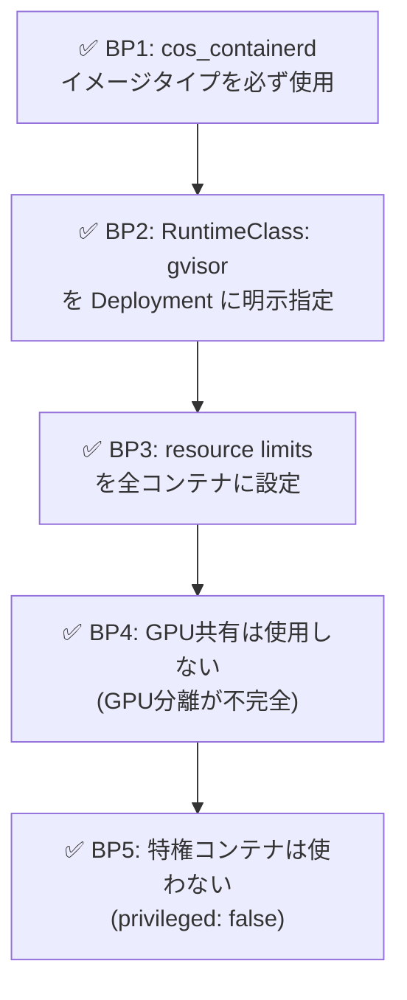

**RuntimeClass の指定例:**

```yaml
apiVersion: apps/v1
kind: Deployment
metadata:
  name: untrusted-workload
spec:
  template:
    spec:
      runtimeClassName: gvisor   # gVisor で実行を明示
      containers:
      - name: app
        image: my-app:latest
        resources:
          limits:
            cpu: "1"
            memory: "512Mi"
      securityContext:
        runAsNonRoot: true        # 非rootで実行
        allowPrivilegeEscalation: false
```

---

## 6. Sandbox2 / SAPI — C/C++向け

> 🟢 **ステータス**: GA（オープンソース）— Google内部プロジェクトでも本番利用中

### 6-1. 概念の理解

Sandbox2 と SAPI（Sandboxed API）は、C/C++で書かれたライブラリやプログラムを安全に実行するためのGoogleのOSSフレームワークです。

- **Sandbox2**: プログラム全体、または一部をサンドボックス化する低レベルなフレームワーク
- **SAPI**: Sandbox2 の上に構築された高レベルラッパー。C/C++ライブラリを「一度サンドボックス化したら、どこでも再利用」できる

### 6-2. 技術的な仕組み

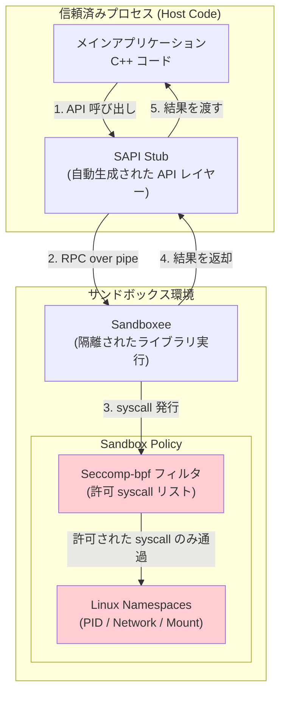

### 6-3. Sandbox2 vs SAPI の使い分け

| 観点 | Sandbox2 | SAPI |
|---|---|---|
| **対象** | プログラム全体、複雑なケース | 特定のC/C++ライブラリ |
| **実装コスト** | 高（ポリシー・RPC 手動設計） | 低（スタブ自動生成） |
| **再利用性** | 低（プロジェクトごとに再実装） | 高（「一度書いたらどこでも」） |
| **推奨場面** | プログラム全体の制御が必要な時 | 古いC/Cライブラリを安全に再利用したい時 |

### 6-4. SAPI の使用ベストプラクティス

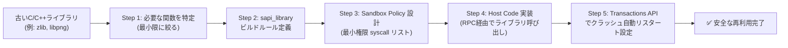

**SAPI sapi_library ビルドルール例（Bazel）:**

```python
# BUILD ファイル
sapi_library(
    name = "zlib-sapi",
    functions = [
        "deflateInit_",
        "deflate",
        "deflateEnd",
    ],
    lib = "@net_zlib//:zlib",
    lib_name = "Zlib",
    namespace = "sapi::zlib",
    # デフォルトポリシーを使用（カスタマイズも可能）
)
```

---

## 7. V8 Sandbox — ブラウザ向け

> 🟡 **ステータス**: 開発継続中（Chrome に段階的に統合）

### 7-1. 概念の理解

V8 Sandbox は、Chrome ブラウザ内部で JavaScript を実行する V8 エンジン専用のメモリ隔離機構です。JavaScriptのバグが V8 ヒープ（メモリ）内に収まり、ブラウザプロセス全体に影響を与えないよう設計されています。

2021〜2023年のChromeのゼロデイ脆弱性のうち、**60%がV8に起因**していたことがこの技術の開発背景です。

### 7-2. V8 Sandbox のメモリ隔離モデル

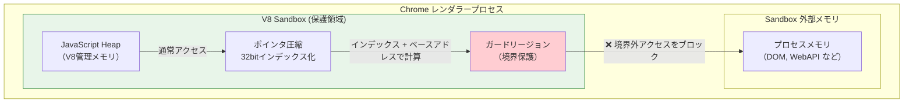

### 7-3. ポインタ圧縮のしくみ（初学者向け）

通常のポインタは64ビットのアドレスを持ちますが、V8 Sandbox ではポインタを **32ビットのインデックス**に圧縮します。実際のメモリアドレスは「サンドボックスのベースアドレス＋インデックス」で計算されます。これにより、攻撃者がポインタを改ざんしても、サンドボックス外のメモリには絶対にアクセスできません。

```
通常ポインタ:  0xABCDEF1234567890  (任意の64bitアドレス → 外部メモリへ到達可能)
V8圧縮ポインタ: 0x00001234          (32bitインデックス → sandbox内のみ参照可能)
実際のアドレス: Sandbox Base + 0x00001234
```

### 7-4. 開発者・運用者向けのポイント

| 対象者 | 対応すべきこと |
|---|---|
| **Webアプリ開発者** | Chromeの最新バージョン維持を徹底（ゼロデイパッチの迅速適用） |
| **企業セキュリティ担当** | Chrome の自動更新ポリシーを組織全体に適用 |
| **Node.js 開発者** | V8 Isolate を使ったサンドボックスの実装（`isolated-vm` パッケージ等） |
| **セキュリティ研究者** | V8 Sandbox の脱出を Security Boundary として扱う（Chromeの脆弱性報奨金対象） |

---

## 8. Privacy Sandbox — ⛔ 廃止済み（歴史的記録）

> ⛔ **ステータス**: **2025年10月17日 Google が正式廃止を発表**

### 8-1. 何が起きたのか

| 時系列 | 出来事 |
|---|---|
| 2019年 | Googleがプライバシーに配慮した広告APIとしてPrivacy Sandbox構想を発表 |
| 2022〜2024年 | サードパーティCookieの廃止期限を繰り返し延期 |
| 2024年7月 | 完全廃止からユーザー選択型モデルへ方針転換 |
| 2025年4月 | 新規プロンプト展開を中止、既存のCookie設定を維持すると発表 |
| **2025年10月17日** | **Topics API、Attribution Reporting、Protected Audience を含む全APIを正式廃止** |

### 8-2. 廃止された理由

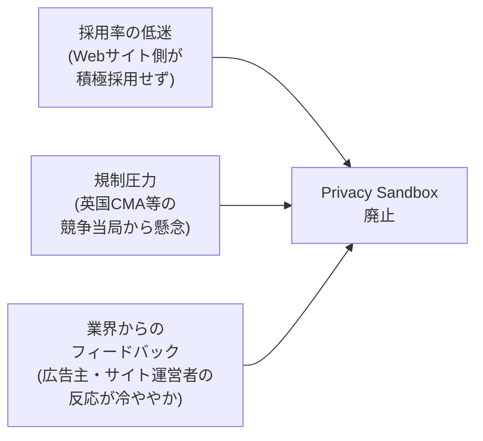

### 8-3. 現在の広告エコシステムへの影響と代替手段

| 領域 | 現在の推奨アプローチ |
|---|---|
| **トラッキング** | サードパーティCookieは **Chrome に残存**（ただし Safari/Firefox は既にブロック） |
| **コンバージョン計測** | サーバーサイド計測 + Google Tag Manager Server-Side |
| **オーディエンス** | ファーストパーティデータ（同意取得済み）+ Customer Match |
| **プライバシー準拠** | GDPR/同意管理は引き続き必須（CMPの維持が必要） |

---

## 9. ユースケース別 技術選択ガイド

### 選択フローチャート

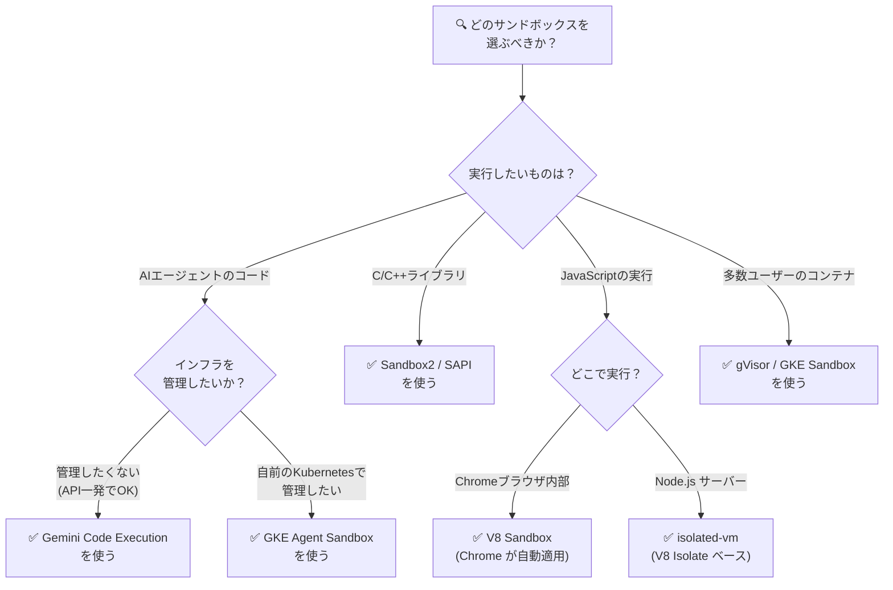

### 技術比較マトリクス

| 比較軸 | GKE Agent Sandbox | Gemini Code Execution | gVisor/GKE | Sandbox2/SAPI |
|---|---|---|---|---|
| **セットアップ難度** | 中 | 低（API 1行） | 中 | 高 |
| **隔離強度** | ◎（カーネル分離） | ◎（マネージド） | ◎（カーネル分離） | ○（syscall制限） |
| **スループット** | 300/秒 | マネージド | ノード依存 | アプリ依存 |
| **対応言語** | 全言語 | Python のみ | 全言語 | C/C++ のみ |
| **ステートフル** | ◎（Pod Snapshot） | ✗ | ○ | ✗ |
| **コスト** | GKE料金 + 使用料 | API 従量課金 | GKE料金 | 無料（OSS） |
| **マネージド度** | 高（GKE管理） | 最高（完全管理） | 高（GKE管理） | 低（自己管理） |

---

## 10. セキュリティ原則 共通ベストプラクティス

Googleが全てのサンドボックス環境に共通して推奨するセキュリティ原則です。

### 最小権限の原則（Principle of Least Privilege）

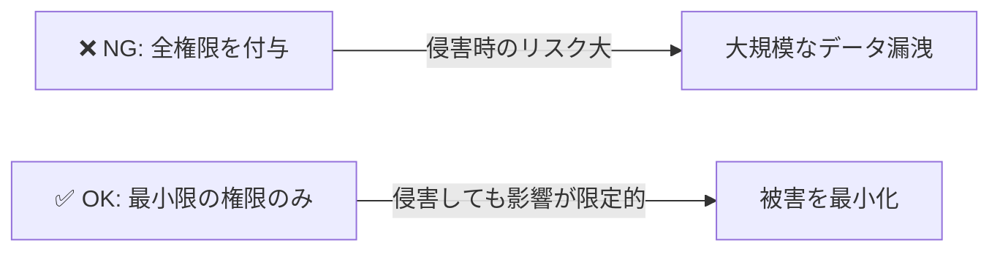

### 多層防御（Defense in Depth）

| 層 | 実装 | 担当技術 |
|---|---|---|
| **L1 ネットワーク** | デフォルト拒否、明示的な許可リスト | GKE Network Policy |
| **L2 カーネル** | syscall 制限、名前空間分離 | gVisor / Seccomp-bpf |
| **L3 アプリ** | 最小権限IAM、Workload Identity | GKE Workload Identity |
| **L4 監視** | 異常検知、ログ収集 | Cloud Monitoring / Security Command Center |

### ゼロトラストモデルの適用

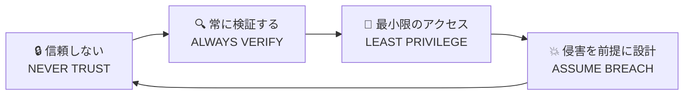

---

## 11. 参考・公式ドキュメント一覧

### GKE Agent Sandbox

| ドキュメント | URL |
|---|---|
| 公式コンセプトドキュメント | https://cloud.google.com/kubernetes-engine/docs/concepts/machine-learning/agent-sandbox |
| Pod Snapshots ハウツー | https://cloud.google.com/kubernetes-engine/docs/how-to/agent-sandbox-pod-snapshots |
| GA 発表 ブログ（2026/05） | https://cloud.google.com/blog/products/containers-kubernetes/bringing-you-agent-sandbox-on-gke-and-agent-substrate |
| Google Codelabs: AI Agents on GKE | https://codelabs.developers.google.com/codelabs/gke/ai-agents-on-gke |

### Gemini Code Execution

| ドキュメント | URL |
|---|---|
| 公式 API リファレンス (generateContent) | https://ai.google.dev/gemini-api/docs/code-execution |
| Gemini Enterprise Agent Platform ドキュメント | https://docs.cloud.google.com/gemini-enterprise-agent-platform/models/tools/code-execution |

### gVisor / GKE Sandbox

| ドキュメント | URL |
|---|---|
| GKE Sandbox 公式ドキュメント | https://cloud.google.com/kubernetes-engine/docs/concepts/sandbox-pods |
| gVisor プロダクションガイド | https://gvisor.dev/docs/user_guide/production/ |
| gVisor 公式サイト | https://gvisor.dev/ |

### Sandbox2 / SAPI

| ドキュメント | URL |
|---|---|
| Google Code Sandboxing 概要 | https://developers.google.com/code-sandboxing |
| SAPI 公式ドキュメント | https://developers.google.com/code-sandboxing/sandboxed-api |
| GitHub リポジトリ | https://github.com/google/sandboxed-api |

### V8 Sandbox

| ドキュメント | URL |
|---|---|
| V8 Sandbox 設計ドキュメント | https://v8.dev/blog/sandbox |
| MoreVMs 2025 論文 | https://2025.programming-conference.org/details/MoreVMs-2025-papers/3/The-V8-Sandbox |

### Privacy Sandbox（廃止済み・歴史的記録）

| ドキュメント | URL |
|---|---|
| 廃止の経緯（Wikipedia） | https://en.wikipedia.org/wiki/Privacy_Sandbox |
| 廃止分析記事 | https://segwise.ai/blog/google-privacy-sandbox-shutdown-reason |

---

## 📖 用語集

| 用語 | 説明 |
|---|---|
| **syscall（システムコール）** | アプリがOSカーネルに機能を要求する命令。ファイル読み書き・ネットワーク通信などが該当 |
| **gVisor** | Googleが開発した、Linux syscallをユーザー空間で再実装するOSSのアプリカーネル |
| **Seccomp-bpf** | Linuxカーネルのセキュリティ機能。許可するsyscallをBPFプログラムで細かく制御できる |
| **Namespaces** | Linuxの機能。PID・ネットワーク・ファイルシステムなどをプロセスごとに分離する仕組み |
| **Pod Snapshot** | GKEでPodの実行状態をまるごと保存・復元できる機能。コールドスタートを解消する |
| **SandboxTemplate** | GKE Agent Sandboxで「どんな設定でサンドボックスを作るか」を定義するYAMLリソース |
| **SandboxClaim** | AIフレームワーク（ADK/LangChain等）がサンドボックス環境を要求するためのKubernetesリソース |
| **Workload Identity** | GKEのPodに個別のGCPサービスアカウントを紐付ける仕組み。最小権限を実現する |
| **RCE (Remote Code Execution)** | 攻撃者がリモートから任意のコードを実行できる脆弱性。サンドボックスが防ぐべき最大の脅威 |
| **CRD (Custom Resource Definition)** | Kubernetesに独自のリソース型を追加するための拡張機能 |

---

*本ドキュメントは 2026年6月12日時点の公式情報に基づいています。最新情報は各公式ドキュメントをご確認ください。*
