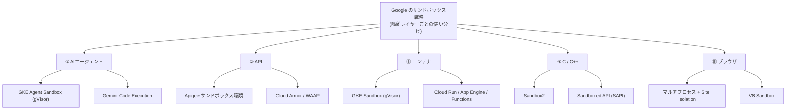
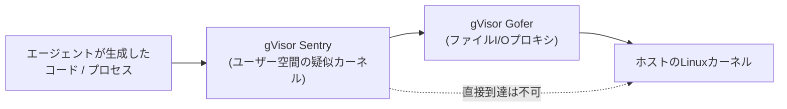
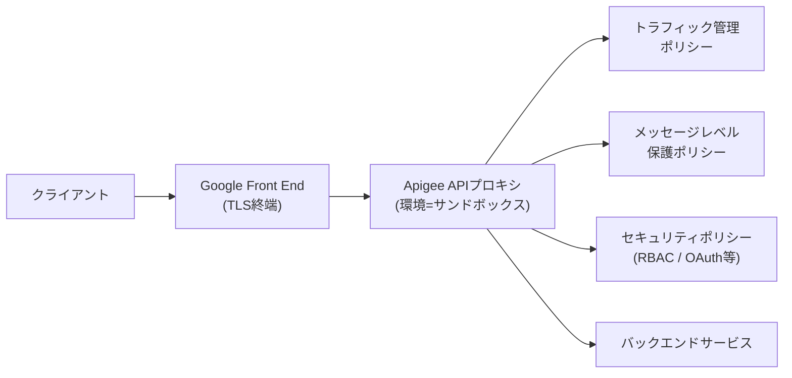
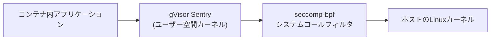
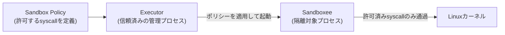
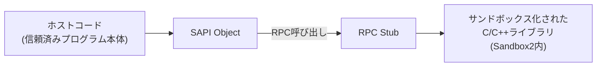
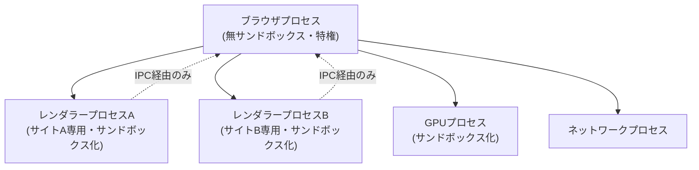
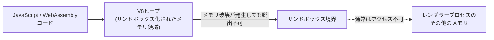
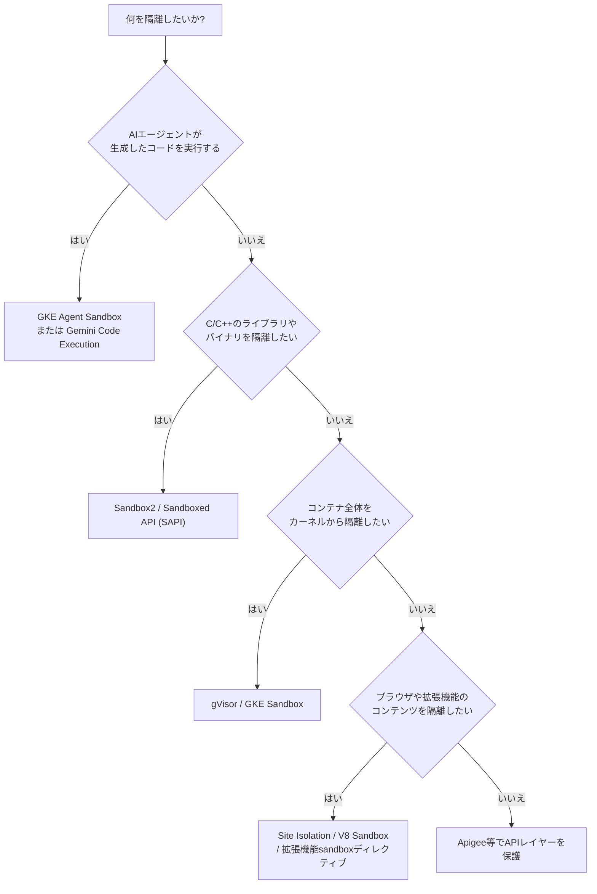

# Google サンドボックス技術 完全ガイド

## AIエージェント・API・コンテナ・C/C++・ブラウザ、5領域のベストプラクティスをステップバイステップで理解する

> 対象読者:サンドボックス技術の初学者〜中級エンジニア
> 情報基準日:2026年7月27日時点(以降の変更は各社公式ドキュメントで要確認)

---

## 目次

1. [はじめに:なぜ「サンドボックス」が必要なのか](#section-1)
2. [全体マップ:Googleの5つのサンドボックス領域](#section-2)
3. [領域① AIエージェントのサンドボックス](#section-3)
4. [領域② APIのサンドボックス](#section-4)
5. [領域③ コンテナのサンドボックス](#section-5)
6. [領域④ C/C++のサンドボックス](#section-6)
7. [領域⑤ ブラウザのサンドボックス](#section-7)
8. [意思決定フロー:自分のケースにはどれを選ぶべきか](#section-8)
9. [横断ベストプラクティス早見表](#section-9)
10. [参考文献・出典URL](#section-10)

---

## 1. はじめに:なぜ「サンドボックス」が必要なのか

「サンドボックス(sandbox)」とは、信頼できないコードやデータを、ホストシステム(OS本体・他のプロセス・他の顧客のデータなど)から隔離された領域の中だけで実行させるための仕組みです。子どもが砂場の外に砂をこぼさないのと同じように、「万が一そのコードが悪意を持っていたり、バグを含んでいたりしても、被害が砂場の外に漏れない」ことを保証するのが目的です。

Googleがサンドボックスを重視する背景には、次の3つの共通した脅威があります。

- **信頼できない入力の実行**:AIエージェントが生成したコード、ユーザーがアップロードしたファイル、サードパーティのライブラリなど、開発者自身がレビューしきれないコードを動かす機会が増え続けている
- **マルチテナンシー**:クラウド上では複数の顧客・複数のワークロードが同じ物理ハードウェアを共有するため、1つのワークロードの侵害が他のワークロードに波及してはならない
- **メモリ安全性が保証できない領域の存在**:C/C++やJavaScriptエンジンのように、言語仕様上メモリ安全性を完全には保証できない領域が、今なお本番システムの中核に存在する

Googleはこの課題に対して、単一の万能な解決策ではなく、**隔離したい対象のレイヤーごとに専用のサンドボックス技術を使い分ける**という設計思想を取っています。本ガイドでは、その中でも特に問い合わせの多い次の5領域を、ステップバイステップのベストプラクティスとして整理します。

---

## 2. 全体マップ:Googleの5つのサンドボックス領域

この図からもわかるとおり、5つの領域の多くが「gVisor」という同一のオープンソース技術を土台にしていることが特徴です。gVisorはGoogle社内で長年本番ワークロードの隔離に使われてきた実績をもとにオープンソース化された、ユーザー空間でLinuxカーネルAPIを再実装する「アプリケーションカーネル」です。まずこの共通基盤を理解しておくと、以降の各領域の理解が格段に速くなります。

---

## 3. 領域① AIエージェントのサンドボックス

### 3-1. なぜAIエージェント専用の隔離が必要か

AIエージェントは、LLMが生成した非決定的なコードをその場で実行したり、外部ツールを自律的に呼び出したりします。これは「常に信頼できない入力を、常に本番同然の権限で実行し続ける」ことに等しく、通常のアプリケーションよりもはるかに広い攻撃対象領域を生み出します。GoogleはこれをGKE(Google Kubernetes Engine)向けの**Agent Sandbox**と、Gemini APIやAgent Platform向けの**Code Execution**という2つの製品ラインで解決しています。

### 3-2. GKE Agent Sandbox:アーキテクチャ

GKE Agent Sandboxは、Kubernetes SIG Apps配下でオープンソース開発されているKubernetesネイティブな拡張機能です。gVisorによるカーネルレベルの隔離を、`Sandbox`・`SandboxTemplate`・`SandboxClaim`という3つの新しいKubernetesカスタムリソースを通じて提供します。

gVisorの内部は「Sentry」と「Gofer」という2つのコンポーネントで構成されます。

Sentryはエージェントが発行するすべてのシステムコール(`exec`や`socket`など)を横取りし、ホストカーネルに直接触れさせない「偽のカーネル」として振る舞います。ファイルシステム操作だけは別プロセスのGoferが仲介するため、たとえSentryに未知の脆弱性があっても、ファイルシステムへの被害範囲を最小化できます。

### 3-3. ステップバイステップ:導入のベストプラクティス

1. **隔離(ISOLATE)**:非決定的なエージェントのコード・ツール実行・ユーザー入力処理はすべてGKE Agent Sandbox(gVisor)上で実行し、RCE(リモートコード実行)攻撃をサンドボックス内に封じ込める
2. **高速化(ACCELERATE)**:サンドボックスの起動レイテンシを隠すため、事前にプロビジョニングされた「ウォームプール」を用意する。さらにコスト削減のため、アイドル状態のエージェントは「コールドプール(サスペンド状態のVM)」に退避させ、Pod Snapshotsで低コストに復元する
3. **権限の制限(RESTRICT・ID)**:Workload Identity Federationを使い、エージェントごとに使い捨ての最小権限IAMアイデンティティを付与する
4. **通信の制限(RESTRICT・Network)**:デフォルト拒否(default-deny)のKubernetes NetworkPolicyを設定し、エージェントが必要とするDNS・メタデータ・APIエンドポイントだけを明示的に許可リスト化する
5. **多層防御を過信しない**:gVisor・Workload Identity・VPC Service Controlsをすべて設定しても、それらは「許可されたチャネルの中で行われる正規の操作」しか防げない。プロンプトインジェクションによって、許可済みのAPI呼び出し経由でデータが持ち出されるリスクは別途モニタリングで検知する必要がある、と複数のセキュリティ研究者が指摘している

### 3-4. Gemini API / Agent Platform の Code Execution

GKE以外にも、Gemini APIおよびGemini Enterprise Agent Platformが提供する**Code Execution**ツールを使えば、GKEにデプロイしなくてもマネージドなサンドボックスでPythonコードを実行できます。特徴は次のとおりです。

| 特徴 | 内容 |
|---|---|
| 起動速度 | 1秒未満でサンドボックスを作成・実行可能 |
| ファイル入出力 | リクエスト/レスポンス全体で最大100MBまで対応 |
| 状態保持 | 実行状態(メモリ)を最大14日間保持(TTLで調整可能) |
| デフォルトのネットワーク | 無効(明示的な許可リストを設定しない限りアウトバウンド通信不可) |
| 対応フレームワーク | 特定のフレームワークに依存せず、任意のエージェント実装・任意のモデルから利用可能 |

Agent Development Kit(ADK)の公式安全設計ドキュメントでも、「コード実行は特にセキュリティ上の影響が大きい特殊なツールであり、モデルが生成したコードがローカル環境を侵害しないよう、必ずサンドボックス化しなければならない」と明記されています。あわせてModel ArmorプラグインやPII redactionプラグインといった、入出力を検査する追加のガードレールも推奨されています。

---

## 4. 領域② APIのサンドボックス

### 4-1. Apigeeにおける「サンドボックス環境」の考え方

API領域での「サンドボックス」は、これまでの実行時隔離とは意味合いが少し異なります。Apigee(Googleのネイティブなフルライフサイクル API管理製品)における「環境(environment)」は、**APIプロキシを実行するための隔離されたコンテキスト**を指し、公式ドキュメントでも「サンドボックス」と表現されています。1つの組織の中に複数の環境(開発用・テスト用・本番用など)を作成し、プロキシのデプロイ先を環境ごとに分離するのが基本設計です。

### 4-2. ステップバイステップ:APIサンドボックスのベストプラクティス

1. **環境を目的別に分離する**:hybrid構成では、1つの環境に大量のプロキシを詰め込まず、複数の環境を作り、環境ごとにデプロイするプロキシ数を絞ることが推奨されている
2. **デフォルトポリシーを有効化する**:Apigeeが提供する3種類の既定ポリシー(トラフィック管理・メッセージレベル保護・セキュリティ)をプロキシ層にアタッチする
3. **IPアドレス/地理情報によるアクセス制御にはCloud Armorを使う**:Apigee自体のポリシーだけでなく、Cloud Armorと組み合わせたWAAP(Web App and API Protection)構成が推奨されている
4. **クライアントIP解決を環境ごとにカスタマイズする**:プロキシ経由のリクエストでは`X-Forwarded-For`ヘッダーの保持設定が必要になるケースがあり、デフォルトのIP解決アルゴリズムが合わない場合は環境単位でカスタマイズできる
5. **開発者向けサンドボックスは60日間の無償トライアルで検証する**:本番導入前に、Apigeeの試用サンドボックス環境でAPI設計を検証してから、本番の環境構成に反映するワークフローが一般的
6. **モックとの併用(一般的なAPIサンドボックス設計のベストプラクティス)**:OpenAPI仕様からモックエンドポイントを自動生成できるAPI管理プラットフォームの機能を活用し、モックとAPI仕様を常に同期させ、成功シナリオだけでなくエラーシナリオも用意し、CI/CDパイプラインに組み込むことが、業界全体のAPIサンドボックス運用における共通ベストプラクティスとして紹介されている

---

## 5. 領域③ コンテナのサンドボックス

### 5-1. gVisorの基本アーキテクチャ(再掲・詳細版)

コンテナ領域におけるGoogleの主力技術は、AIエージェント領域でも登場した**gVisor**そのものです。通常のコンテナはホストカーネルを直接共有するため、1つのコンテナ内のカーネル脆弱性が、ノード全体・他の全コンテナに波及するリスクを抱えます。gVisorは、コンテナが発行するシステムコールをユーザー空間の「Sentry」で受け止め、seccomp-bpfによるシステムコールフィルタリングでさらに一段階の防御を重ねます。

Googleのサーバーレス製品群(App Engine、Cloud Run、Cloud Functions)はいずれも、アプリケーションワークロードの隔離にgVisorを採用しています。Cloud Runの場合、各インスタンスは仮想マシンモニター(VMM)によって他のインスタンスから隔離され、さらにコンテナ境界の強制とseccompによるシステムコールフィルタリングが重ねられる多層防御構成になっています。

### 5-2. ステップバイステップ:GKE Sandboxの有効化手順

1. **専用ノードプールを作成する**:GKE SandboxはデフォルトのノードプールにはEnableできない。Standardクラスタでは、すべてのワークロードをサンドボックス化する場合でも、GKE Sandboxを有効化していないノードプールを最低1つ残す必要がある
2. **イメージタイプを揃える**:ノードプールのイメージタイプは「Container-Optimized OS with Containerd(`cos_containerd`)」のみがサポート対象
3. **RuntimeClassを確認する**:ノードプール作成後、GKEが自動的に`gvisor`という名前のRuntimeClassを作成する。`kubectl get runtimeclass gvisor`で存在を確認する
4. **Podスペックでサンドボックスを指定する**:隔離したいPodのマニフェストに`runtimeClassName: gvisor`を追加する
5. **リソース上限を必ず設定する**:GKE Sandboxを使う場合でも、すべてのコンテナにリソース制限(CPU/メモリ)を指定し、不良コードや悪意あるアプリケーションがノードのリソースを枯渇させないようにする
6. **GPU/TPUワークロードでの注意点**:GKE SandboxはNVIDIAドライバの脆弱性すべてを緩和するわけではないが、Linuxカーネルの脆弱性に対する保護は維持される。またGPUタイムシェアリングはGPUが完全に隔離されないため、GKE Sandboxとの併用は非推奨とされている
7. **ログとモニタリングを有効化する**:必須ではないが、gVisorのメッセージがログに残るよう、クラスタの機能設定でLogging/Monitoringを有効化することが推奨されている
8. **チェックポイント/リストア機能を活用する**:gVisorはコンテナのチェックポイント・リストアに対応しており、ウォームアップ済みサービスのキャッシュ、他マシンでのワークロード再開、実行状態のスナップショット取得、フォレンジック用の状態保存などに活用できる

---

## 6. 領域④ C/C++のサンドボックス

### 6-1. Sandbox2:プログラム全体・一部を隔離する

**Sandbox2**は、Linux向けのオープンソースC++セキュリティサンドボックスで、Google内のセキュリティチームが開発・保守しています。Linuxのnamespace、リソース制限、そしてseccomp-bpfによるシステムコールフィルタを組み合わせて、プログラム全体、あるいはプログラムの一部分だけを隔離できます。

seccomp-bpfは、Secure Computing Mode(seccomp)を拡張したLinuxカーネルの機能です。素のseccompは`exit`・`sigreturn`・`read`・`write`の4つしか許可しませんが、seccomp-bpfはBPF(Berkeley Packet Filter)プログラムでシステムコールごとに柔軟な判定ロジックを書けるようにし、許可・ダミー値を返す・プロセス終了・シグナル送出・トレーサーへの通知、といった細かい制御を可能にします。

### 6-2. Sandboxed API(SAPI):ライブラリ単位でサンドボックス化する

Sandbox2をそのまま使う場合、プロジェクトごとにポリシーやプロセス間のデータ交換の仕組みをゼロから設計し直す必要がありました。**Sandboxed API(SAPI)**はこの負担を解消するために作られたオープンソースプロジェクトで、Sandbox2を基盤にしながら「C/C++の**ライブラリ単位**」でサンドボックス化できるようにします。開発チームのモットーは "Sandbox once, use anywhere"(一度サンドボックス化すれば、どこでも使い回せる)です。

SAPIライブラリはそれぞれ、必要最小限のシステムコール/リソースだけを許可するタイトなセキュリティポリシーを個別に持てる点が、プロジェクト全体で1つの巨大なポリシーを共有する従来型のサンドボックス設計との大きな違いです。

### 6-3. ステップバイステップ:zlibをSAPIでサンドボックス化する例

公式のGetting Startedガイドで紹介されている典型的な流れは次のとおりです。

1. **サンドボックス化したいライブラリの関数を洗い出す**:今回の例ではzlibの`deflate()`など、実際に使う関数だけを対象にする
2. **アンサンドボックス版のホストコードをまず動かす**:ライブラリを直接呼び出す通常のプログラムとして初期実装し、動作を確認する
3. **`sapi_library`ビルドルールを定義する**:Bazel/CMakeのビルドルールでSAPIライブラリを生成する
4. **SAPI ObjectとRPC Stubの自動生成を確認する**:ビルドプロセス中にSAPIが自動生成するため、開発者がRPCの配線を手書きする必要はない
5. **ホストコードをSAPI呼び出しに置き換える**:`sapi::Sandbox`でサンドボックスオブジェクトを作成し、生成されたAPIクラス経由で関数を呼び出すようにホストコードを書き換える
6. **必要に応じて専用のsandbox policyを書く**:デフォルトポリシーで足りない場合は、`sandbox.h`ヘッダーファイルに許可するシステムコール・ファイルアクセス範囲を定義し、`sapi_library`ルールに渡す
7. **Transactionsモジュールで監視・自動再起動を設定する**:セキュリティ違反・クラッシュ・リソース枯渇でライブラリが落ちた場合に自動的に再起動する高レベルAPIも用意されている

### 6-4. C/C++領域における他の選択肢比較

Google Developersの公式ページでは、用途別に複数のサンドボックス技術が一覧化されています。

| 製品 | 概要 | 主な用途 |
|---|---|---|
| Sandbox2 | namespace・リソース制限・seccomp-bpfを用いたLinuxサンドボックス。SAPIの基盤技術 | 汎用サンドボックス |
| gVisor | システムコールをアプリケーションカーネルとして実装。ptraceまたはハードウェア仮想化でインターセプト | 汎用サンドボックス |
| Bubblewrap | user namespaceのサブセットで実装。Flatpakの実行エンジンとしても利用 | CLIツール |
| Minijail | ChromeOS/Androidで使われるサンドボックス・封じ込めツール | CLIツール |
| NSJail | namespace・リソース制限・seccomp-bpfによるプロセス隔離。独自DSLのKafelにも対応 | CLIツール |
| Sandboxed API (SAPI) | Sandbox2を使ったC/C++ライブラリの再利用可能なサンドボックス | C/C++コード |
| Native Client(NaCl) | **非推奨**。x86/LLVMバイトコードの制限されたサブセットにコンパイルして隔離。後継のWebAssembly設計に影響を与えた | C/C++コード(廃止) |
| WebAssembly (WASM) | 移植可能なバイナリフォーマット。隔離された実行環境でモジュールを実行 | C/C++コード |
| RLBox | C++17で書かれたサンドボックスAPI。NaCl・WASM・リモートプロセスなど複数の実行バックエンドを選択可能 | C/C++コード |
| Flatpak | Bubblewrapを土台にしたLinuxデスクトップアプリ向けサンドボックス。パッケージング・配布に重点 | デスクトップアプリ |

---

## 7. 領域⑤ ブラウザのサンドボックス

### 7-1. Chromeのマルチプロセスアーキテクチャ

Chromeのセキュリティ設計の中核は「サンドボックス化されたマルチプロセスアーキテクチャ」です。DOMのレンダリング・スクリプト実行・メディアデコードなど、Web由来の攻撃対象領域の大部分は、権限を持たない「レンダラープロセス」に閉じ込められます。唯一「ブラウザプロセス」だけが、ファイルシステムやネットワークに直接アクセスできる無サンドボックスの特権プロセスとして動作します。

### 7-2. Site Isolation:サイトをまたいだデータ漏洩を防ぐ

Chrome 67(デスクトップ、全サイト対象)およびChrome 77(Android、ログイン済みサイト対象)からデフォルトで有効化されているのが**Site Isolation**です。目的は「1つのレンダラープロセスには、最大でも1つのWebサイト由来のページしか含めない」ことを保証し、レンダラープロセスに脆弱性があっても、他サイトのCookieやデータへのアクセスを遮断することにあります。ブラウザプロセスは、どのサイトが専用プロセスを必要とするかに基づいて、各レンダラープロセスのCookieや他リソースへのアクセスを制限します。

### 7-3. V8 Sandbox:JavaScriptエンジン自体を隔離する

Site Isolationがプロセス間の隔離だとすれば、**V8 Sandbox**はプロセス**内**の隔離です。V8のセキュリティ技術リードであるSamuel Groß氏によれば、今日発見・悪用されるV8の脆弱性のほぼすべてに共通するのは、「コンパイラとランタイムがほぼ例外なくV8のHeapObjectインスタンスだけを操作するため、最終的なメモリ破壊が必ずV8ヒープの内部で発生する」という点です。

V8 Sandboxは、V8が実行するコードを、プロセスの仮想アドレス空間の一部(=サンドボックス、64bit環境で最大1TB分を予約)に限定し、それ以外のメモリ領域からは切り離します。サンドボックス外のメモリにアクセスできるすべてのデータ型を「サンドボックス互換」の代替型に置き換えることで、たとえV8内でメモリ破壊が起きても、サンドボックスの外側には影響が及ばない設計です。Chrome 123から、Android・ChromeOS・Linux・macOS・Windowsの全プラットフォームでデフォルト有効化されており、SpeedometerやJetStreamのベンチマークでは、性能オーバーヘッドは約1%に抑えられています。

### 7-4. Chrome拡張機能開発者向け:sandboxディレクティブのベストプラクティス

ブラウザ本体だけでなく、拡張機能を開発する側にもGoogleが公式に推奨するサンドボックス機構があります。Manifest V3の`sandbox`プロパティを使うと、拡張機能内の特定のページを「一意のオリジンを持つサンドボックス」として動作させられます。

1. **`eval`やインラインスクリプトが必要なページだけをsandbox指定する**:サンドボックス化されたページは拡張機能全体のCSP(コンテンツセキュリティポリシー)の対象外になり、独自のCSPを持てるため、`eval()`やインラインスクリプトの実行が可能になる
2. **拡張機能APIへの直接アクセスはできない前提で設計する**:サンドボックス化ページは拡張機能API・非サンドボックスページへの直接アクセスができず、`postMessage()`経由でのみ通信できる
3. **CSPを絞り込む場合は`sandbox`ディレクティブを外さない**:デフォルトのCSP値は`sandbox allow-scripts allow-forms allow-popups allow-modals; script-src 'self' 'unsafe-inline' 'unsafe-eval'; child-src 'self';`。これをより厳しく絞り込むことは可能だが、`sandbox`ディレクティブ自体は必須で、`allow-same-origin`トークンは指定できない
4. **外部Webコンテンツの読み込みは避ける**:Chrome 57以降、サンドボックス化ページの中に外部Webコンテンツ(埋め込みフレーム・スクリプトを含む)を読み込むことはできない。外部コンテンツが必要な場合は`webview`を使う
5. **通常の拡張機能ページのCSPも最小権限に保つ**:通常のページ(`extension_pages`)側では、Chromeが強制する最小CSP(`script-src 'self' 'wasm-unsafe-eval'; object-src 'self';`)より緩和することはできない仕様になっている

---

## 8. 意思決定フロー:自分のケースにはどのサンドボックス技術を選ぶべきか

ここまでの5領域を踏まえて、「自分は何を隔離したいのか」から逆引きできる意思決定フローにまとめました。

---

## 9. 横断ベストプラクティス早見表

5つの領域を貫く共通原則を、実務でチェックリストとして使える形にまとめました。

| 原則 | AIエージェント | API | コンテナ | C/C++ | ブラウザ |
|---|---|---|---|---|---|
| **最小権限** | Workload Identity Federationで使い捨てIAM | RBAC・OAuthスコープの絞り込み | サンドボックス化ノードプールの分離 | ポリシーで許可syscallを最小化 | 拡張機能CSPを最小権限に |
| **デフォルト拒否** | ネットワークポリシーで通信先を許可リスト化 | Cloud Armorでの地理/IP制御 | GPUタイムシェアリングを避ける等の制約順守 | seccomp-bpfでsyscallをデフォルト拒否 | サンドボックス化ページに`allow-same-origin`を付けない |
| **多層防御** | gVisor+ID+ネットワークを重ねても過信しない | トラフィック管理+メッセージ保護+セキュリティポリシー | VMM境界+コンテナ境界+seccomp | namespace+リソース制限+seccomp-bpf | マルチプロセス+Site Isolation+V8 Sandbox |
| **状態管理/リソース制御** | Pod Snapshotsでウォーム/コールドプール | 環境ごとにデプロイ数を制限 | 全コンテナにリソース上限を設定 | Transactionsで異常時に自動再起動 | プロセスクラッシュ時も他タブは継続動作 |
| **監視・可観測性** | トレーシングでツール呼び出しを可視化 | Advanced API Securityでクライアント挙動を分析 | gVisorログのLogging/Monitoring連携 | セキュリティ違反のログ記録 | サンドボックス違反の検知 |

---

## 10. 参考文献・出典URL

本ガイドの作成にあたり、以下のGoogle公式ドキュメント・Google公式ブログ・著名なセキュリティエンジニア/開発者による技術記事を参照しました。

### Google公式:サンドボックス技術全般

- Code Sandboxing(Google for Developers、Sandbox2/SAPI/gVisor等の比較表): https://developers.google.com/code-sandboxing
- Sandbox2 Explained: https://developers.google.com/code-sandboxing/sandbox2/explained
- Sandboxed API (SAPI) 概要: https://developers.google.com/code-sandboxing/sandboxed-api
- SAPI Explained: https://developers.google.com/code-sandboxing/sandboxed-api/explained
- SAPI Getting Started: https://developers.google.com/code-sandboxing/sandboxed-api/getting-started
- google/sandboxed-api (GitHub): https://github.com/google/sandboxed-api

### ① AIエージェント

- GKE Sandbox(GKEセキュリティ公式ドキュメント): https://docs.cloud.google.com/kubernetes-engine/docs/concepts/sandbox-pods
- Isolate AI code execution with Agent Sandbox: https://docs.cloud.google.com/kubernetes-engine/docs/how-to/agent-sandbox
- Bringing you Agent Sandbox on GKE and Agent Substrate(Google Cloud Blog): https://cloud.google.com/blog/products/containers-kubernetes/bringing-you-agent-sandbox-on-gke-and-agent-substrate
- Safety and Security for AI Agents(Agent Development Kit公式): https://google.github.io/adk-docs/safety/
- Code Execution(Gemini Enterprise Agent Platform公式): https://docs.cloud.google.com/gemini-enterprise-agent-platform/scale/sandbox/code-execution-overview
- Sandboxes overview(Gemini Enterprise Agent Platform公式): https://docs.cloud.google.com/gemini-enterprise-agent-platform/scale/sandbox
- Agents Overview(Gemini API公式): https://ai.google.dev/gemini-api/docs/agents
- A Deep Dive into GKE Sandbox for Agents(The New Stack、Darryl K. Taft氏): https://thenewstack.io/google-cloud-a-deep-dive-into-gke-sandbox-for-agents/
- Google Announces GKE Agent Sandbox and Hypercluster at Next '26(InfoQ、Google Cloud AmbassadorのAlex Gkiouros氏の見解を含む): https://www.infoq.com/news/2026/05/gke-agent-sandbox-hypercluster/
- Securing AI Agents on GKE(ARMO、Shauli Rozen氏): https://www.armosec.io/blog/sandboxing-ai-agents-gke-workload-identity/
- GKE Agent SandboxとGKE Pod Snapshots(Rahul Ranganathan氏、Google Cloud Community/Medium ― ISOLATE/ACCELERATE/RESTRICTのフレームワークの出典): https://medium.com/google-cloud/gke-agent-sandbox-and-gke-pod-snapshots-zero-trust-security-for-ai-agents-at-scale-559261ee20b5
- Deploying Secure AI Agents on GKE(Google Codelabs): https://codelabs.developers.google.com/codelabs/gke/ai-agents-on-gke

### ② API

- Apigee API Management(製品ページ): https://cloud.google.com/apigee
- Best practices for securing your applications and APIs using Apigee: https://docs.cloud.google.com/architecture/best-practices-securing-applications-and-apis-using-apigee
- Advanced API Security best practices(Apigee公式): https://docs.cloud.google.com/apigee/docs/api-security/best-practices
- About environments(Apigee hybrid公式、環境=サンドボックスの定義): https://cloud.google.com/apigee/docs/hybrid/v1.9/environments-about
- Top Sandbox Development Environment Best Practices Guide(DigitalAPI): https://www.digitalapi.ai/blogs/what-are-the-best-practices-for-managing-a-sandbox-development-environment

### ③ コンテナ

- GKE Sandbox(概念ドキュメント): https://docs.cloud.google.com/kubernetes-engine/docs/concepts/sandbox-pods
- Harden workload isolation with GKE Sandbox(手順ドキュメント): https://docs.cloud.google.com/kubernetes-engine/docs/how-to/sandbox-pods
- gVisor公式サイト: https://gvisor.dev/
- Security design overview(Cloud Run公式): https://docs.cloud.google.com/run/docs/securing/security
- Improved gVisor file system performance for GKE, Cloud Run, App Engine and Cloud Functions(Google Cloud Blog): https://cloud.google.com/blog/products/containers-kubernetes/gvisor-file-system-improvements-for-gke-and-serverless

### ④ C/C++

- Sandbox2 Explained: https://developers.google.com/code-sandboxing/sandbox2/explained
- Sandboxed API README(GitHub): https://github.com/google/sandboxed-api/blob/main/README.md

### ⑤ ブラウザ

- Site Isolation Design Document(Chromium公式): https://www.chromium.org/developers/design-documents/site-isolation/
- Secure Architecture(Chromium Security公式): https://www.chromium.org/Home/chromium-security/guts/
- The V8 Sandbox(V8公式ブログ、Samuel Groß氏): https://v8.dev/blog/sandbox
- The V8 Heap Sandbox, OffensiveCon 2024講演資料(Samuel Groß氏): https://saelo.github.io/presentations/offensivecon_24_the_v8_heap_sandbox.pdf
- Google Chrome Adds V8 Sandbox(The Hacker News): https://thehackernews.com/2024/04/google-chrome-adds-v8-sandbox-new.html
- Manifest - Sandbox(Chrome Extensions公式、Manifest V3): https://developer.chrome.com/docs/extensions/reference/manifest/sandbox
- Manifest - Content Security Policy(Chrome Extensions公式): https://developer.chrome.com/docs/extensions/reference/manifest/content-security-policy
- Cleanly Escaping the Chrome Sandbox(Theori Blog): https://theori.io/blog/cleanly-escaping-the-chrome-sandbox

---

> **免責事項**:本ガイドは2026年7月27日時点で確認できた公開情報に基づいています。GKE Agent SandboxやGemini Enterprise Agent Platform関連の一部機能はPre-GA(プレビュー)段階の製品を含むため、実際の導入前には必ずGoogle Cloud公式ドキュメントの最新版を確認してください。
