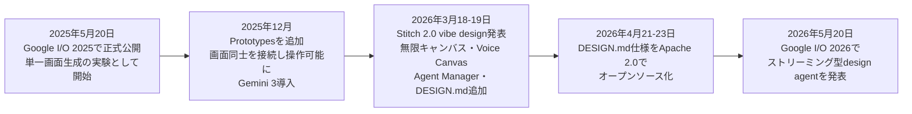
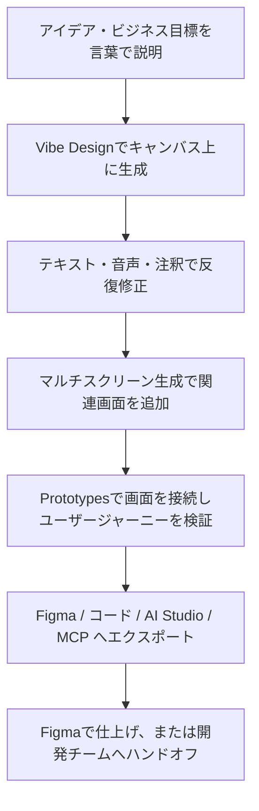
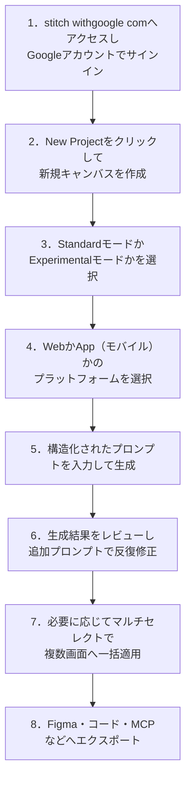
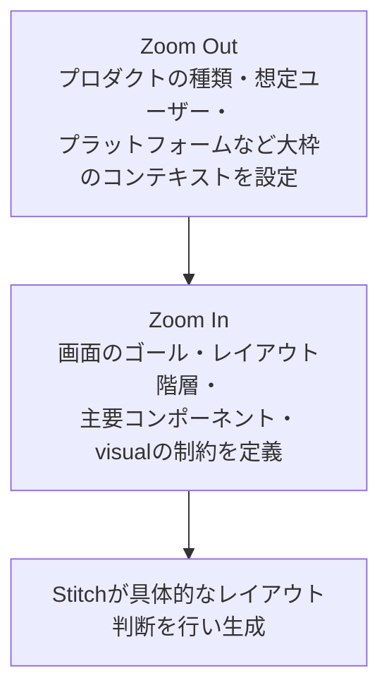
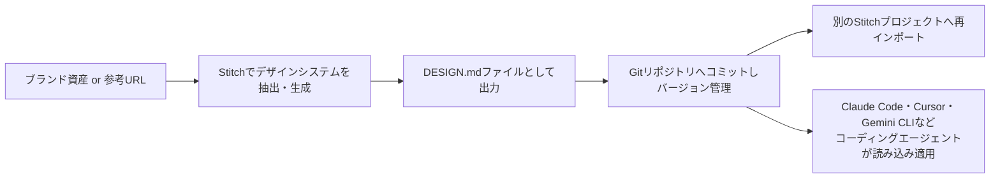
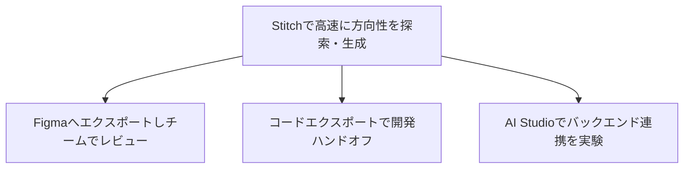
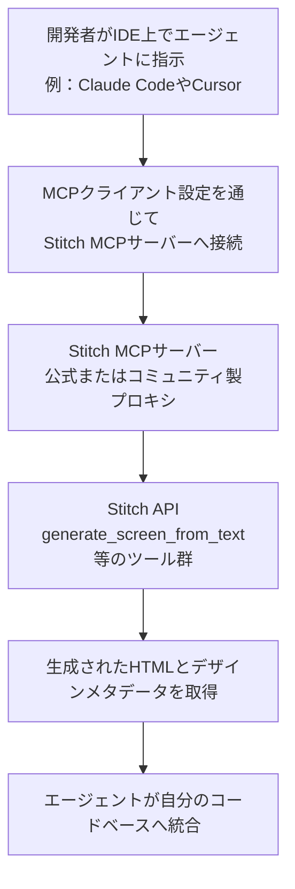

# Google Stitch 実践ガイド：初学者のためのステップバイステップ ベストプラクティス

> 対象読者：UI/UXデザインは初めてだが、AIを使ってアプリやWebサイトの画面デザインを素早く作りたいエンジニア・PM・デザイナー
> 最終確認日：2026年7月11日（記載内容はGoogle Labs実験プロダクトの性質上、頻繁に更新されるため、実際の挙動は都度 [stitch.withgoogle.com](https://stitch.withgoogle.com/) で確認してください）

---

## 目次

1. [Google Stitchとは何か](#1-google-stitchとは何か)
2. [開発の背景と沿革（タイムライン）](#2-開発の背景と沿革タイムライン)
3. [主要機能の全体像](#3-主要機能の全体像)
4. [料金体系と利用制限](#4-料金体系と利用制限)
5. [セットアップとステップバイステップ基本操作](#5-セットアップとステップバイステップ基本操作)
6. [プロンプト設計のベストプラクティス](#6-プロンプト設計のベストプラクティス)
7. [DESIGN.mdによるデザインシステムの一貫性管理](#7-designmdによるデザインシステムの一貫性管理)
8. [マルチスクリーン生成とプロトタイピング](#8-マルチスクリーン生成とプロトタイピング)
9. [Voice CanvasとAgent Managerの活用](#9-voice-canvasとagent-managerの活用)
10. [エクスポートとハンドオフワークフロー](#10-エクスポートとハンドオフワークフロー)
11. [MCP・SDKによる開発者向け統合](#11-mcpsdkによる開発者向け統合)
12. [ベストプラクティス早見表（Do / Don't）](#12-ベストプラクティス早見表do--dont)
13. [既知の制限事項と注意点](#13-既知の制限事項と注意点)
14. [他ツールとの比較](#14-他ツールとの比較)
15. [まとめと次のステップ](#15-まとめと次のステップ)
16. [参考文献（URL一覧）](#16-参考文献url一覧)

---

## 1. Google Stitchとは何か

Google Stitchは、Google Labsが提供する無料のAIデザインツールで、自然言語のプロンプトやスケッチ画像からモバイル／Web向けのUIデザインを生成する（[出典1](https://stitch.withgoogle.com/)）。公式サイトの説明では、モバイルアプリとWebアプリケーション向けのUIを生成し、デザインの発案（ideation）を高速かつ簡単にすることを目的としたツールだと位置づけられている（[出典1](https://stitch.withgoogle.com/)）。

2026年3月の大型アップデート以降、Stitchは単なる「1画面を生成する実験」から、テキストのみならず画像やコードもコンテキストとして扱える「AIネイティブな無限キャンバス」へと進化した（[出典2](https://blog.google/innovation-and-ai/models-and-research/google-labs/stitch-ai-ui-design/)）。Googleはこの新しい体験を「vibe design（バイブデザイン）」と呼んでおり、ワイヤーフレームから始めるのではなく、実現したいビジネス目標やユーザーに与えたい感情を言葉で説明するところから設計を始められる点が特徴だとしている（[出典2](https://blog.google/innovation-and-ai/models-and-research/google-labs/stitch-ai-ui-design/)）。

Stitchが得意なこと・不得意なことを整理すると、次の表のようになる。

| 観点 | 内容 | 出典 |
|---|---|---|
| 得意なこと | テキストや画像から短時間で高品質な最初のドラフト画面を作る、複数の画面をまたいで一貫したトンマナを素早く出す | [出典3](https://tech-insider.org/google-stitch-ai-design-tool-march-2026-update/), [出典2](https://blog.google/innovation-and-ai/models-and-research/google-labs/stitch-ai-ui-design/) |
| 不得意なこと | ピクセル単位の精密な編集、要素単位の細かい選択・修正、ローディングアニメーションなどのマイクロインタラクション設計 | [出典4](https://moda.app/blog/google-stitch-review), [出典5](https://www.nxcode.io/resources/news/google-stitch-complete-guide-vibe-design-2026) |
| 向いていない用途 | プレゼン資料、SNS用画像、マーケティング素材などUI以外のビジュアルコンテンツ制作 | [出典4](https://moda.app/blog/google-stitch-review) |
| 位置づけ | 「探索・プロトタイピングの入口」であり、Figmaなど従来の設計ツールを置き換えるものではない | [出典6](https://gozade.com/blog/google-stitch-review-2026-a-gozade-verdict-on-the-ai-ui-design-tool-everyone-is-talking-about), [出典7](https://www.nxcode.io/resources/news/google-stitch-complete-guide-vibe-design-2026) |

---

## 2. 開発の背景と沿革（タイムライン）

Stitchの前身は、2022年に登場したプロンプトからUIモックアップを生成するツール「Galileo AI」である。Googleは2025年初頭にGalileo AIを買収し、Gemini系モデルと統合したうえで「Stitch」としてGoogle Labsからリブランド発表した（[出典8](https://gozade.com/blog/google-stitch-review-2026-a-gozade-verdict-on-the-ai-ui-design-tool-everyone-is-talking-about), [出典9](https://almcorp.com/blog/google-stitch-complete-guide-ai-ui-design-tool-2026/)）。

主な出来事を時系列でまとめると以下のとおり。



注：ノード内の改行は表示上の折り返しのためであり、実際のMermaid記法では改行タグを使わず1行の文字列として記述することを推奨する（レンダラーによっては`<br/>`非対応のため）。

- 2025年5月20日：Google I/Oにて、単一画面をテキストプロンプトまたは画像アップロードから生成するシンプルな実験としてスタート（[出典3](https://tech-insider.org/google-stitch-ai-design-tool-march-2026-update/)）。
- 2025年12月：複数画面を接続してインタラクティブなプロトタイプとして体験できる「Prototypes」機能が追加され、Gemini 3がStitchに導入された（[出典9](https://almcorp.com/blog/google-stitch-complete-guide-ai-ui-design-tool-2026/), [出典10](https://www.nxcode.io/resources/news/google-stitch-complete-guide-vibe-design-2026)）。
- 2026年3月18〜19日：「vibe design」と名付けられた大型アップデートが発表され、AIネイティブな無限キャンバス、Voice Canvas、Agent Manager、DESIGN.mdが同時に導入された（[出典2](https://blog.google/innovation-and-ai/models-and-research/google-labs/stitch-ai-ui-design/)）。このアップデート発表後、競合であるFigmaの株価が数日間で下落したと複数メディアが報じている（[出典3](https://tech-insider.org/google-stitch-ai-design-tool-march-2026-update/), [出典11](https://www.the-ai-corner.com/p/google-stitch-ai-design-tool-guide-2026)）。
- 2026年4月21〜23日：DESIGN.mdの草案仕様がApache 2.0ライセンスでオープンソース化され、Stitch以外のツールでも利用可能になった（[出典12](https://blog.google/innovation-and-ai/models-and-research/google-labs/stitch-design-md/)）。
- 2026年5月20日：Google I/O 2026にて、画面を生成しながらリアルタイムに描画するストリーミング型design agentが発表された（[出典13](https://techlogstack.com/explore/google-stitch-ai-design-tool-2026/)）。

Stitchは現在もGoogle Labsの実験的プロダクトという位置づけであり、正式な稼働保証（SLA）やエンタープライズ向けの長期コミットメントは公表されていない点には留意したい（[出典4](https://moda.app/blog/google-stitch-review), [出典14](https://computertech.co/google-stitch-review/)）。

---

## 3. 主要機能の全体像

2026年3月のアップデート以降、Stitchが提供する主な機能は次のとおりである（[出典2](https://blog.google/innovation-and-ai/models-and-research/google-labs/stitch-ai-ui-design/)）。

| 機能 | 概要 | 出典 |
|---|---|---|
| Vibe Design | ワイヤーフレームではなく、達成したいビジネス目標やユーザーに与えたい感情を言葉で説明することから設計を始めるアプローチ | [出典2](https://blog.google/innovation-and-ai/models-and-research/google-labs/stitch-ai-ui-design/) |
| AIネイティブな無限キャンバス | 画像・テキスト・コードをそのままコンテキストとしてキャンバスに置ける、発散と収束を繰り返すためのワークスペース | [出典2](https://blog.google/innovation-and-ai/models-and-research/google-labs/stitch-ai-ui-design/) |
| Design agent / Agent manager | プロジェクト全体の変遷を踏まえて提案するエージェントと、複数案を並行して整理しながら進捗を追跡する管理機能 | [出典2](https://blog.google/innovation-and-ai/models-and-research/google-labs/stitch-ai-ui-design/) |
| DESIGN.md | デザインルールをエクスポート・インポートできるagent-friendlyなMarkdown形式のファイル | [出典2](https://blog.google/innovation-and-ai/models-and-research/google-labs/stitch-ai-ui-design/), [出典12](https://blog.google/innovation-and-ai/models-and-research/google-labs/stitch-design-md/) |
| Prototypes（画面接続） | 画面同士を数秒で接続し、Playボタンでユーザージャーニーをプレビューできる。クリックに応じて次の論理的な画面を自動生成することも可能 | [出典2](https://blog.google/innovation-and-ai/models-and-research/google-labs/stitch-ai-ui-design/) |
| Voice Canvas（音声操作） | キャンバスに直接話しかけ、リアルタイムのデザイン批評や更新（例：メニュー案を3パターン出して、など）を受けられる | [出典2](https://blog.google/innovation-and-ai/models-and-research/google-labs/stitch-ai-ui-design/) |
| マルチスクリーン生成 | 1回のプロンプトで最大5画面程度の相互接続された画面をまとめて生成できる | [出典3](https://tech-insider.org/google-stitch-ai-design-tool-march-2026-update/) |
| MCPサーバー・SDK・Skills | Stitchの機能をAIコーディングエージェント（Claude Code、Cursor、Gemini CLIなど）から呼び出せるようにする開発者向けの仕組み | [出典2](https://blog.google/innovation-and-ai/models-and-research/google-labs/stitch-ai-ui-design/), [出典15](https://github.com/google-labs-code/stitch-sdk) |
| Figma / AI Studio / Antigravityへのエクスポート | 編集可能なレイヤーとAuto Layout付きでFigmaへ、あるいは開発ツールであるAI StudioやAntigravityへデザインを渡せる | [出典2](https://blog.google/innovation-and-ai/models-and-research/google-labs/stitch-ai-ui-design/) |

全体のワークフローをMermaidで俯瞰すると、次のようになる。



---

## 4. 料金体系と利用制限

Stitchは2026年7月時点でも引き続きGoogle Labsの実験プロダクトとして無料で提供されており、クレジットカード登録なしでGoogleアカウントのみでサインインできる（[出典16](https://www.nxcode.io/resources/news/google-stitch-pricing-plans-complete-guide-2026), [出典4](https://moda.app/blog/google-stitch-review)）。

ただし、利用上限（生成回数の上限）についてはメディアごとに報告内容が異なり、2026年内でも変遷している点に注意が必要である。

| 報告時期 | Standardモード上限 | Experimental / Proモード上限 | 出典 |
|---|---|---|---|
| 2026年1〜2月頃 | 月350回（Gemini 2.5 Flash） | 月50回（Gemini 2.5 Pro） | [出典17](https://www.toolworthy.ai/tool/stitch-by-google), [出典9](https://almcorp.com/blog/google-stitch-complete-guide-ai-ui-design-tool-2026/) |
| 2026年3〜4月頃（vibe designアップデート後） | 月350回 | 月200回に拡大 | [出典16](https://www.nxcode.io/resources/news/google-stitch-pricing-plans-complete-guide-2026), [出典4](https://moda.app/blog/google-stitch-review), [出典18](https://www.aipedia.wiki/tools/google-stitch/) |
| 2026年4月以降の一部報告 | 1日あたり設計クレジット400・redesignクレジット15の日次制へ移行との報告あり | ― | [出典19](https://www.banani.co/blog/google-stitch-pricing-and-credits) |

現時点（2026年7月）でも、有料プランや追加クレジットの購入手段は公式に案内されていない（[出典16](https://www.nxcite.io/) ※要再確認、[出典14](https://computertech.co/google-stitch-review/)）。上限に達した場合はビジュアルエディタでの微調整（テキストや配色スウォッチのクリック編集など、AI生成を伴わない操作）は引き続き利用できるという報告もある（[出典20](https://justinmckelvey.com/blog/how-to-use-google-stitch)）。

> **実務上のポイント**：数値は変動するため、本ガイドの数字を鵜呑みにせず、実際にサインインした際のアカウント設定画面や利用状況表示で最新の上限を確認することを強く推奨する。

---

## 5. セットアップとステップバイステップ基本操作

初めてStitchを使う場合の手順は次のとおりである（[出典21](https://www.nxcode.io/resources/news/google-stitch-tutorial-design-first-app-2026), [出典22](https://uithings.com/what-is-google-stitch)）。



注：ノードラベル中の改行は説明の都合上の表示であり、実際のMermaidコードでは半角の1行テキストとして記述する（全角記号や`<br/>`タグの使用は環境によって描画が崩れる原因になるため避けるのがベストプラクティス）。

各ステップの補足は以下のとおり。

1. **サインイン**：[stitch.withgoogle.com](https://stitch.withgoogle.com/)にアクセスし、個人のGoogleアカウントでサインインすればよい。ウェイトリストやクレジットカード登録は不要である（[出典21](https://www.nxcode.io/resources/news/google-stitch-tutorial-design-first-app-2026)）。なお、Google Workspaceアカウントを利用する場合は、管理者側で「Google Workspace Experiments」を有効化しておく必要があるとの報告があるため、組織アカウントで表示されない場合はまずこの設定を確認するとよい（[出典23](https://marketingagent.blog/2026/03/26/tutorial-build-app-prototypes-with-google-stitch/)、ただし同記事はこの点を公式ドキュメント未確認の情報としている点に留意）。
2. **新規プロジェクト作成**：ダッシュボードから新規プロジェクトを開始すると、中央に無限キャンバス、左下にチャット入力欄、上部にモード切り替えが表示される（[出典21](https://www.nxcode.io/resources/news/google-stitch-tutorial-design-first-app-2026)）。
3. **モード選択**：探索段階の速さを優先するか、画像入力や高精細な仕上がりを優先するかで、StandardモードとExperimentalモードを使い分ける（詳細は次項）。
4. **プラットフォーム選択**：モバイルアプリを想定するか、Webサイト・Webアプリを想定するかをトグルで指定する（[出典24](https://marketingagent.blog/2026/03/26/tutorial-build-app-prototypes-with-google-stitch/)）。
5. **プロンプト入力**：具体性が高いほど良い結果につながる。詳細は第6章で扱う。
6. **反復修正**：生成後は会話形式で「見出しの背景をダークネイビーからグラデーションに変更して」のように追加指示を出し、微調整を重ねる（[出典21](https://www.nxcode.io/resources/news/google-stitch-tutorial-design-first-app-2026)）。
7. **マルチセレクト一括編集**：Shiftキーを押しながら複数画面を選択し、1つのプロンプトやテーマ変更を一括適用することで、画面間の一貫性を保ちやすくなる（[出典22](https://uithings.com/what-is-google-stitch)）。
8. **エクスポート**：詳細は第10章で扱う。

### StandardモードとExperimentalモードの使い分け

| 項目 | Standardモード | Experimental / Proモード |
|---|---|---|
| ベースモデル | Gemini 2.5 Flash系 | Gemini 2.5 Pro系（最新ではGemini 3系の報告もあり） | 
| 向いている場面 | 素早い反復・複数案の探索・アイデア出し | 高精細な仕上がり・画像入力を使った検討 |
| 入力形式 | テキストが中心 | テキストに加え画像・スケッチも活用可能 |
| Figmaへのエクスポート | 対応（テキストプロンプトから生成した場合） | 一部レポートでは非対応、または制限ありと報告 |
| 出典 | [出典9](https://almcorp.com/blog/google-stitch-complete-guide-ai-ui-design-tool-2026/), [出典25](https://uxpilot.ai/blogs/google-stitch-ai) | [出典9](https://almcorp.com/blog/google-stitch-complete-guide-ai-ui-design-tool-2026/), [出典22](https://uithings.com/what-is-google-stitch) |

> 実務Tips：アイデア出しの段階ではStandardモードで数多くの方向性を素早く試し、方向性が固まった段階でExperimentalモードに切り替えて仕上げの精度を上げる、という使い分けが複数の解説記事で推奨されている（[出典14](https://computertech.co/google-stitch-review/)）。

---

## 6. プロンプト設計のベストプラクティス

Stitchの出力品質を左右する最大の変数はプロンプトの質である。曖昧なプロンプトは汎用的なレイアウトしか生まないが、具体的なプロンプトは実際に使えるものを生む、と複数の実践記事が指摘している（[出典26](https://blog.openreplay.com/prompt-ui-google-stitch/)）。

### 6.1 Zoom-Out-Zoom-Inフレームワーク

実践者コミュニティで有効とされているのが「Zoom-Out-Zoom-In」というフレームワークである（[出典26](https://blog.openreplay.com/prompt-ui-google-stitch/)）。



具体的なプロンプト例（SaaSダッシュボードの場合）を要素分解すると次のようになる。

| 要素 | 記述内容の例 |
|---|---|
| Context（背景） | チーム運用状況を毎日確認するB2Bプロジェクト管理SaaSの管理者ダッシュボードである、という前提 |
| Screen goal（画面の目的） | アクティブなプロジェクト数、チームの稼働状況、遅延タスクを一目で把握できるようにする |
| Layout（構造） | 上部固定ナビ、KPIカードの並び、稼働状況を示す横棒グラフ、その下に遅延タスク一覧 |
| Visual direction（見た目の方向性） | 装飾を排したクリーンでデータ密度の高い配色 |
| Constraints（制約） | デスクトップファースト、アクセシブルな文字サイズ、[WCAG 2.1](https://www.w3.org/TR/WCAG21/)のコントラスト基準準拠 |

このように「背景 → 目的 → 構造 → 見た目 → 制約」の順で言語化すると、AIが単なる汎用テンプレートではなく実際のレイアウト判断を行いやすくなる（[出典26](https://blog.openreplay.com/prompt-ui-google-stitch/)）。

### 6.2 プロンプトを構成する5つの要素

別の実践記事では、出力品質を大きく左右する要素として次の5点を挙げている（[出典27](https://www.allaboutai.com/ai-how-to/use-google-stitch-for-ui-design/)）。

1. **プラットフォーム指定**：「モバイルアプリを作って」「Webダッシュボードをデザインして」など
2. **目的・機能の明示**：何のためのアプリ・画面かを明確にする
3. **レイアウトスタイル**：カード形式か、リスト形式か、といった構造の指定
4. **カラーテーマ**：具体的な色味や雰囲気（例：スカイブルーのテーマ、ダークネイビーのヒーローセクションなど）
5. **主要な操作要素**：検索バー、お気に入りボタンなど、含めたいUI部品を具体的に列挙する

### 6.3 Skillsリポジトリが推奨するプロンプト構造

Google Labsが公開しているStitch Skillsのenhance-promptスキルでは、次のような構造化テンプレートを推奨している（[出典28](https://agentskills.so/skills/google-labs-code-stitch-skills-enhance-prompt)）。

- 見出し（ナビゲーションとロゴ、メニュー項目）
- ヒーローセクション（見出し・補足文・主要CTA）
- コンテンツエリア（主要コンテンツの説明）
- フッター（リンク・SNSアイコン・著作権表記）

さらに、番号付きセクションで階層構造を明示すること、複数ページにまたがるプロジェクトではデザインシステム（DESIGN.md）を明示的に含めることが推奨されている（[出典28](https://agentskills.so/skills/google-labs-code-stitch-skills-enhance-prompt)）。同スキルは、最新のベストプラクティスは公式ドキュメントの[Stitch Effective Prompting Guide](https://stitch.withgoogle.com/docs/learn/prompting/)を優先して参照するよう案内している（[出典28](https://agentskills.so/skills/google-labs-code-stitch-skills-enhance-prompt)）。

### 6.4 反復修正（イテレーション）のコツ

- 1回の生成がAI生成のクレジットを消費するため、テキストの文言変更や配色スウォッチの変更程度であれば、キャンバス上の直接編集（クレジットを消費しない操作）を活用する（[出典20](https://justinmckelvey.com/blog/how-to-use-google-stitch)）。
- AI生成のクレジットは、新規画面の追加、レイアウトの大幅な変更、デザイン方向性の刷新など、構造的な変更のために温存するとよい（[出典20](https://justinmckelvey.com/blog/how-to-use-google-stitch)）。
- 修正を依頼する際も「KPIカードをもっとコンパクトにして、背景をダークにして」のように具体的に伝えると、これまでの文脈を踏まえた一貫性のある変更が適用されやすい（[出典26](https://blog.openreplay.com/prompt-ui-google-stitch/)）。

---

## 7. DESIGN.mdによるデザインシステムの一貫性管理

DESIGN.mdは、Stitchで生まれた「デザインシステムのルールをプロジェクト間で持ち運ぶ」ためのMarkdown形式のファイルであり、2026年4月にApache 2.0ライセンスでオープンソース化された（[出典12](https://blog.google/innovation-and-ai/models-and-research/google-labs/stitch-design-md/), [出典29](https://www.creativeainews.com/blog/google-design-md-open-source-ai-brand-design-stitch/)）。

DESIGN.mdの狙いは、色や文字などの「値」だけでなく、その色が何のためにあるのか（primaryなのか、accentなのか等）という「意図」までAIエージェントに伝えることで、AIが推測に頼らずに済むようにする点にある（[出典12](https://blog.google/innovation-and-ai/models-and-research/google-labs/stitch-design-md/)）。あわせて、生成された配色案がWCAGのアクセシビリティ基準を満たしているかを検証できる仕組みも含まれている（[出典12](https://blog.google/innovation-and-ai/models-and-research/google-labs/stitch-design-md/)）。

### 7.1 DESIGN.mdの取得方法

DESIGN.mdファイルは主に3つの方法で作成できる（[出典30](https://www.newsdefused.com/googles-stitch-open-sources-design-md-specification-to-make-brand-rules-portable-for-ai-agents/)）。

| 作成方法 | 内容 |
|---|---|
| URLからの自動抽出 | 既存のWebサイトのURLを指定し、デザインシステムを自動的に抽出する |
| ブランド資産のアップロード | ロゴやビジュアルアイデンティティの資料をアップロードし、AIに解析させる |
| ゼロから作成 | Stitchのインターフェース上で直接記述して作成する |

### 7.2 DESIGN.mdの構成セクション

草案仕様では、9つの定義済みセクションからなるMarkdown構造が提案されている（[出典31](https://pasqualepillitteri.it/en/news/1251/google-stitch-design-md-open-source-spec-2026)）。代表的なセクションの例は次のとおり。

| セクション例 | 内容 |
|---|---|
| Visual Theme & Atmosphere | 全体的なビジュアルのトーンやブランドが意図する審美的な方向性 |
| Color Palette & Roles | primary・surface・accent・errorなど、意味的な役割を持たせた色定義 |
| Typography | 見出しや本文で使うフォントファミリー・サイズなどの階層 |
| Spacing / Radius | 余白や角丸のトークン |
| Component Patterns | ボタンやカードなど代表的なコンポーネントの振る舞い |
| Tool-specific Notes（任意） | Gemini CLIやClaude Code、Cursorなど特定エージェント向けの補足指示 |

（構成の全体像は複数の二次情報から要約したものであり、正式な全項目は[公式リポジトリ](https://github.com/google-labs-code/design.md)を参照されたい。）

### 7.3 DESIGN.mdを使った運用フロー



注：実際のMermaidソースでは`<br/>`は使わず1行のテキストにまとめること。

DESIGN.mdはプレーンなMarkdownファイルとしてリポジトリに置けるため、READMEと同じ感覚でGit管理・レビュー・差分確認ができる点が特徴である（[出典32](https://notes.nicolasdeville.com/ai/design-md/)）。また、トークンはW3C Design Token Format（DTCG）と互換性を持たせる設計になっており、Tailwind設定ファイルなどへのエクスポートも想定されている（[出典33](https://medium.com/design-bootcamp/google-makes-design-md-open-source-on-its-way-to-become-a-industry-standard-16119f2368dd)）。

> **注意点**：2026年7月時点でDESIGN.mdの仕様はまだ「alpha」段階であり、破壊的変更が入る可能性がある。金融・医療など規制対象のプロジェクトでの本番利用は時期尚早との指摘もある（[出典34](https://vibecoding.app/blog/design-md-review)）。またガバナンス面では、Apache 2.0ライセンスではあるものの、現状は主にGoogle Labsが仕様策定を主導しており、W3CやOpenAPI Initiativeのような独立した標準化団体はまだ存在しない（[出典31](https://pasqualepillitteri.it/en/news/1251/google-stitch-design-md-open-source-spec-2026)）。

---

## 8. マルチスクリーン生成とプロトタイピング

2026年3月のアップデートにより、1回のプロンプトで最大5画面程度の相互接続された画面をまとめて生成できるようになった（[出典3](https://tech-insider.org/google-stitch-ai-design-tool-march-2026-update/)）。例えば「チェックアウトフロー」と指示するだけで、カート画面・配送先入力・決済画面・注文完了画面・配送状況確認画面までを、統一されたタイポグラフィと配色で一括生成できる（[出典3](https://tech-insider.org/google-stitch-ai-design-tool-march-2026-update/)）。

Prototypes機能を使うと、生成済みの画面同士を数秒で接続し、Playボタンを押すだけでアプリ内遷移を体験できる。さらに、あるボタンをクリックした際に遷移すべき「論理的に妥当な次の画面」をStitch自身が自動生成することも可能である（[出典2](https://blog.google/innovation-and-ai/models-and-research/google-labs/stitch-ai-ui-design/)）。

一方で、長いフローを扱うと画面ごとにトーンがわずかにズレる（1画面目は洗練されているが4画面目で余白や配色が微妙に変化するなど）という指摘も複数のレビューで挙がっている（[出典6](https://gozade.com/blog/google-stitch-review-2026-a-gozade-verdict-on-the-ai-ui-design-tool-everyone-is-talking-about)）。DESIGN.mdの活用はこの問題を緩和する手段の一つとされているが、完全には解決しないとの評価もある（[出典6](https://gozade.com/blog/google-stitch-review-2026-a-gozade-verdict-on-the-ai-ui-design-tool-everyone-is-talking-about)）。

**実務Tips**：複数画面の一貫性を担保したい場合は、次の順序で進めると良い（[出典35](https://www.sotaaz.com/post/stitch-mcp-guide-en)）。

1. まず1つの基準となる画面（例：ダッシュボード）を生成する
2. その画面から「デザインDNA」（配色・タイポグラフィ・コンポーネントパターン）を抽出する
3. 抽出したデザインDNAを参照しながら、2画面目以降を生成する
4. 画面同士を比較し、不整合があれば個別に調整する

---

## 9. Voice CanvasとAgent Managerの活用

Voice Canvasは、キャンバスに直接話しかけることでデザインを操作できる機能である。エージェントは会話をリアルタイムに解析し、「メニュー案を3パターン出して」「この画面を別のカラーパレットで見せて」といった発話に応じてキャンバスをその場で更新する（[出典2](https://blog.google/innovation-and-ai/models-and-research/google-labs/stitch-ai-ui-design/)）。エージェントはランディングページの設計時にヒアリング形式で質問を投げかけたり、リアルタイムでデザイン批評を行ったりすることもできるとされている（[出典2](https://blog.google/innovation-and-ai/models-and-research/google-labs/stitch-ai-ui-design/)）。

Agent Managerは、複数の方向性を並行して探索する際に進捗を管理するための機能である。デザインの発散と収束を繰り返すプロセスにおいて、どの案がどこまで進んでいるかを俯瞰しやすくする役割を持つ（[出典2](https://blog.google/innovation-and-ai/models-and-research/google-labs/stitch-ai-ui-design/)）。

初学者向けの活用手順としては、次のような流れが実践的である。

1. まずテキストプロンプトで大枠のレイアウトを生成する
2. Voice Canvasを使い、口頭で「もっとミニマルに」「アクセントカラーをコーラルに」など細かい調整を重ねる
3. 気に入った方向性が複数出てきたら、Agent Managerで並行管理しながら比較検討する
4. 最終的な1案に絞り込んだら、次章のエクスポート手順に進む

---

## 10. エクスポートとハンドオフワークフロー

Stitchのエクスポート経路は、大きく分けて「デザイナー向け（Figma）」「開発者向け（コード）」「Google生態系向け（AI Studio / Antigravity / Firebase Studio）」の3方向を想定して設計されている（[出典13](https://techlogstack.com/explore/google-stitch-ai-design-tool-2026/)）。

| エクスポート先 | 用途 | 出典 |
|---|---|---|
| Figma | 編集可能なレイヤーとAuto Layout付きでデザインを渡し、デザインチームでのレビュー・仕上げに使う | [出典2](https://blog.google/innovation-and-ai/models-and-research/google-labs/stitch-ai-ui-design/), [出典22](https://uithings.com/what-is-google-stitch) |
| HTML / CSS・Tailwind CSS | そのまま実装のたたき台として使えるフロントエンドコードを出力する | [出典26](https://blog.openreplay.com/prompt-ui-google-stitch/) |
| React / Vue / Angular / Flutter / SwiftUIなど | 主要フロントエンドフレームワーク向けのコード出力（対応状況はアップデートにより変化） | [出典3](https://tech-insider.org/google-stitch-ai-design-tool-march-2026-update/) |
| Google AI Studio | デザインをバックエンドロジックと組み合わせてフルスタックで実験するための連携先 | [出典13](https://techlogstack.com/explore/google-stitch-ai-design-tool-2026/) |
| Antigravity | Googleのコーディングエージェントへデザインを引き渡し、開発ワークフローへ接続する | [出典2](https://blog.google/innovation-and-ai/models-and-research/google-labs/stitch-ai-ui-design/) |
| Firebase Studio | Google製のクラウド開発環境へエクスポートし、デプロイ可能なコードへの道筋を作る | [出典36](https://www.uxpin.com/studio/blog/google-stitch-ai-design-tool-updates-ui-ux/) |
| MCPサーバー / Instant Prototype共有リンク | 開発エージェントからの直接呼び出し、または閲覧用の共有プレビューURLの発行 | [出典37](https://marketingagent.blog/2026/03/26/tutorial-build-app-prototypes-with-google-stitch/) |

パワーユーザーがよく採用する統合的なハンドオフの流れは次のとおりである（[出典38](https://techlogstack.com/explore/google-stitch-ai-design-tool-2026/)）。



> **注意点**：画像入力を使うExperimentalモードで作成したデザインは、Figmaへのエクスポートに対応していない、または制限があるとの報告がある（[出典22](https://uithings.com/what-is-google-stitch)）。Figma連携を業務フローの前提にする場合は、テキストプロンプトから生成する経路を基本とするか、事前に自分のアカウントで挙動を確認しておくとよい。また、AI Studioへのエクスポートでは一部のStitch固有機能が引き継がれない場合があるとの指摘もある（[出典37](https://marketingagent.blog/2026/03/26/tutorial-build-app-prototypes-with-google-stitch/)）。

---

## 11. MCP・SDKによる開発者向け統合

Stitchは、Model Context Protocol（MCP）を通じてIDEやCLIから呼び出せる公式のMCPサーバーと、Node.js向けの公式SDK（`@google/stitch-sdk`）を提供している（[出典2](https://blog.google/innovation-and-ai/models-and-research/google-labs/stitch-ai-ui-design/), [出典15](https://github.com/google-labs-code/stitch-sdk)）。あわせて、Claude Code・Cursor・Gemini CLI・Antigravityなど、Agent Skillsのオープン標準に対応したコーディングエージェント向けの「Stitch Skills」ライブラリも公開されている（[出典39](https://github.com/google-labs-code/stitch-skills)）。

### 11.1 公式SDKの基本的な使い方

公式SDKには、低レベルのツールクライアント、Vercel AI SDK向けのツール定義、環境変数から自動初期化される簡易インスタンスなど複数のレイヤーが用意されている（[出典15](https://github.com/google-labs-code/stitch-sdk)）。認証には`STITCH_API_KEY`（APIキー）または`STITCH_ACCESS_TOKEN`（OAuthアクセストークン）のいずれかを使用する（[出典15](https://github.com/google-labs-code/stitch-sdk)）。

```javascript
import { StitchToolClient } from "@google/stitch-sdk";

const client = new StitchToolClient({
  apiKey: "your-api-key",
  baseUrl: "https://stitch.googleapis.com/mcp",
  timeout: 300000,
});

const result = await client.callTool("generate_screen_from_text", {
  prompt: "ダークモードのダッシュボード画面。カード形式で統計サマリーを上部に配置し、下部にグラフを表示する。",
});
```

### 11.2 コミュニティ製MCPサーバーの選択肢

公式SDK・MCPサーバーに加えて、コミュニティによって複数のMCPサーバー実装が公開されている。それぞれ思想や機能範囲が異なるため、用途に応じて選ぶとよい。

| プロジェクト | 特徴 | 認証方式 | 出典 |
|---|---|---|---|
| `@_davideast/stitch-mcp` | ローカルプレビューやAstroサイト生成など、開発者の実務動線に寄せたCLI一体型MCPサーバー | gcloud CLI経由のOAuth | [出典40](https://github.com/davideast/stitch-mcp) |
| `stitch-mcp`（Kargatharaakash） | ゼロコンフィグを重視したユニバーサルMCPサーバー。Windows/Mac/Linux対応 | Google Cloud CLI経由 | [出典41](https://github.com/Kargatharaakash/stitch-mcp) |
| `stitch-mcp`（piyushcreates） | 公式Stitch APIへ直接接続する透過的な実装で、サードパーティのプロキシを挟まない | APIキー | [出典42](https://github.com/piyushcreates/stitch-mcp) |
| `stitch-mcp-server`（oogleyskr） | アクセシビリティチェックやデザイン差分比較など、25個のツールを備えた統合型MCPサーバー | APIキー / アクセストークン / gcloud CLI | [出典43](https://github.com/oogleyskr/stitch-mcp-server) |

> コミュニティ製ツールは公式のGoogleプロダクトではないため、導入前にリポジトリの内容とメンテナンス状況を確認することを推奨する。

### 11.3 開発ワークフローのイメージ



注：実際のコードでは改行タグを使わず1行の文字列にする。

### 11.4 Stitch Skillsで代表的にできること

Stitch Skillsライブラリでは、既存のフロントエンドコード（React、Vueなど）をHTML抽出とデザインシステム化を経てStitchプロジェクトへ取り込む、生成済み画面をReactやReact Nativeのコンポーネントへ変換する、複数画面のデザイン一貫性を検証する、といったワークフローがスキルとして提供されている（[出典39](https://github.com/google-labs-code/stitch-skills)）。

---

## 12. ベストプラクティス早見表（Do / Don't）

| 観点 | Do（推奨） | Don't（避けたい） |
|---|---|---|
| プロンプトの粒度 | 背景・目的・レイアウト構造・見た目・制約を順に言語化する（Zoom-Out-Zoom-In） | 「いい感じにして」のような曖昧な一言で済ませる |
| モード選択 | 探索段階はStandard、仕上げ段階はExperimentalと使い分ける | 最初から高精細モードだけで大量に試行し、上限を早期に使い切る |
| 一貫性の担保 | DESIGN.mdを作成し、複数プロジェクト・複数画面で再利用する | 画面ごとに毎回ゼロから配色やフォントを指定する |
| クレジット管理 | 文言修正や配色スウォッチの変更はビジュアルエディタの直接編集で行う | 些細な修正のたびにAI再生成を行い、クレジットを浪費する |
| マルチスクリーン | 基準画面のデザインDNAを抽出してから追加画面を生成する | 各画面を独立したプロンプトでバラバラに生成し、後から統一しようとする |
| Figma連携 | テキストプロンプト由来のデザインをFigmaへエクスポートして仕上げる | 画像入力（Experimentalモード）由来のデザインでFigmaエクスポートを前提にする |
| 本番利用 | 生成コードは「たたき台」として扱い、開発者がレビュー・調整してから使う | 生成されたコードをそのまま無検証で本番環境にデプロイする |
| 開発者統合 | MCP・SDK・Skillsを使い、DESIGN.mdをリポジトリで版管理する | プロンプトのたびに口頭でブランドルールを説明し直す |
| 情報の鮮度 | 料金・上限・対応フレームワークなどは公式サイトや自分のアカウントで都度確認する | 過去に読んだ数値（生成回数の上限など）を恒久的な仕様だと思い込む |

---

## 13. 既知の制限事項と注意点

Stitchを業務フローに組み込む前に把握しておきたい制限事項を整理する。

| 制限事項 | 内容 | 出典 |
|---|---|---|
| ピクセル単位の精密編集が弱い | 要素を個別に選択して細かく調整するような、Figma的なワークフローには向いていない | [出典4](https://moda.app/blog/google-stitch-review) |
| 実験プロダクトゆえの継続性リスク | SLAや長期運用の保証がなく、Google Labsの過去の実績を踏まえると打ち切りの可能性もゼロではない | [出典4](https://moda.app/blog/google-stitch-review), [出典14](https://computertech.co/google-stitch-review/) |
| 生成結果の非決定性 | 同じプロンプトでも毎回異なる結果が出ることがあり、複雑な複合レイアウトでは複数回の反復が必要になりやすい | [出典5](https://www.nxcode.io/resources/news/google-stitch-complete-guide-vibe-design-2026) |
| マイクロインタラクション非対応 | ローディングアニメーション、ホバー効果、スクロール演出などはStitch内では設計できない | [出典5](https://www.nxcode.io/resources/news/google-stitch-complete-guide-vibe-design-2026) |
| 長いフローでの一貫性のブレ | 画面数が増えるにつれ、余白やコンポーネントスタイルが微妙にズレていくことがある | [出典6](https://gozade.com/blog/google-stitch-review-2026-a-gozade-verdict-on-the-ai-ui-design-tool-everyone-is-talking-about) |
| 汎用的な出力になりやすい | 独自のプロダクション用コンポーネントライブラリからではなく、Stitch自身のモデルからUIを生成するため、ブランド固有の要素は反映されにくい | [出典36](https://www.uxpin.com/studio/blog/google-stitch-ai-design-tool-updates-ui-ux/) |
| DESIGN.mdはalpha仕様 | フォーマットやCLIが今後変更される可能性があり、規制対象領域での本番利用には時期尚早との指摘がある | [出典34](https://vibecoding.app/blog/design-md-review) |
| 利用上限に達すると新規生成が停止 | 上限に達すると翌月（または翌日）までAI生成そのものは待つ必要がある | [出典14](https://computertech.co/google-stitch-review/), [出典19](https://www.banani.co/blog/google-stitch-pricing-and-credits) |

---

## 14. 他ツールとの比較

Stitchの位置づけを理解するために、Figmaとの比較を整理する。あくまで一般的な傾向であり、両ツールとも継続的にアップデートされている点に留意されたい。

| 観点 | Google Stitch | Figma |
|---|---|---|
| 得意な段階 | 初期アイデア出し・素早いプロトタイピング | 精密な仕上げ・チームコラボレーション・本番デザインシステム管理 |
| 入力方法 | 自然言語プロンプト、画像・スケッチ、音声 | マニュアル操作、プラグイン、一部AI機能 |
| コスト | 無料（Google Labs実験、上限あり） | 有料プランが中心（無料枠は限定的） |
| 学習コスト | 低い（デザイン未経験でも扱える） | 中〜高（レイヤー操作やAuto Layoutの理解が必要） |
| チームコラボレーション | 2026年5月時点で複数人同時編集機能が報告されているが、Figmaほど成熟していない | リアルタイム共同編集、コメント、権限管理が成熟 |
| 出典 | [出典20](https://justinmckelvey.com/blog/how-to-use-google-stitch), [出典11](https://www.the-ai-corner.com/p/google-stitch-ai-design-tool-guide-2026) | [出典11](https://www.the-ai-corner.com/p/google-stitch-ai-design-tool-guide-2026) |

複数のレビュー記事が共通して勧める現実的なワークフローは、「Stitchで探索し、Figmaで仕上げ、開発ツール（Antigravity・AI Studio・Claude Codeなど）でビルドする」というハイブリッド構成である（[出典5](https://www.nxcode.io/resources/news/google-stitch-complete-guide-vibe-design-2026)）。

---

## 15. まとめと次のステップ

Google Stitchは、2025年5月の単一画面生成という小さな実験から、2026年3月のvibe designアップデートを経て、無限キャンバス・Voice Canvas・DESIGN.md・MCP統合までを備えたAIネイティブなデザインキャンバスへと急速に進化してきた（[出典2](https://blog.google/innovation-and-ai/models-and-research/google-labs/stitch-ai-ui-design/)）。初学者がまず押さえるべきポイントは次の3つに集約できる。

1. **プロンプトは構造化する**：Zoom-Out-Zoom-Inフレームワークのように、背景・目的・構造・見た目・制約の順で言語化する。
2. **一貫性はDESIGN.mdで担保する**：複数画面・複数プロジェクトにまたがる場合は、デザインシステムをMarkdownファイルとして持ち運ぶ。
3. **Stitchはゴールではなくスタート地点と捉える**：生成された画面やコードは「たたき台」であり、Figmaでの仕上げや開発者によるレビューを経て初めて本番品質に近づく。

次のステップとしては、まず小さな1画面（ログイン画面やダッシュボードなど）から試作を始め、慣れてきたらDESIGN.mdの作成、続いてMCP経由でのコーディングエージェントとの連携という順に発展させていくのが無理のない学習パスといえる。

---

## 16. 参考文献（URL一覧）

1. Stitch 公式サイト：[https://stitch.withgoogle.com/](https://stitch.withgoogle.com/)
2. Google公式ブログ「Introducing "vibe design" with Stitch」：[https://blog.google/innovation-and-ai/models-and-research/google-labs/stitch-ai-ui-design/](https://blog.google/innovation-and-ai/models-and-research/google-labs/stitch-ai-ui-design/)
3. Tech Insider「Google Stitch AI: Vibe Design and 5-Screen Canvas」：[https://tech-insider.org/google-stitch-ai-design-tool-march-2026-update/](https://tech-insider.org/google-stitch-ai-design-tool-march-2026-update/)
4. Moda「Google Stitch Review: Honest Look at the AI Design Tool」：[https://moda.app/blog/google-stitch-review](https://moda.app/blog/google-stitch-review)
5. NxCode「Google Stitch Complete Guide: Vibe Design, Voice Canvas & Free AI UI Tool」：[https://www.nxcode.io/resources/news/google-stitch-complete-guide-vibe-design-2026](https://www.nxcode.io/resources/news/google-stitch-complete-guide-vibe-design-2026)
6. Gozade「Google Stitch Review 2026」：[https://gozade.com/blog/google-stitch-review-2026-a-gozade-verdict-on-the-ai-ui-design-tool-everyone-is-talking-about](https://gozade.com/blog/google-stitch-review-2026-a-gozade-verdict-on-the-ai-ui-design-tool-everyone-is-talking-about)
7. NxCode「Google Stitch Complete Guide」（同上URL、機能セクション引用）
8. Gozade（沿革に関する記述、同上URL）
9. ALM Corp「Google Stitch: The Complete Guide to AI-Powered UI Design」：[https://almcorp.com/blog/google-stitch-complete-guide-ai-ui-design-tool-2026/](https://almcorp.com/blog/google-stitch-complete-guide-ai-ui-design-tool-2026/)
10. NxCode「Google Stitch Complete Guide」（Prototypes/Gemini 3の記述、同上URL）
11. The AI Corner「Google Stitch: The Free AI Design Tool Killing Figma」：[https://www.the-ai-corner.com/p/google-stitch-ai-design-tool-guide-2026](https://www.the-ai-corner.com/p/google-stitch-ai-design-tool-guide-2026)
12. Google公式ブログ「Stitch's DESIGN.md format is now open-source」：[https://blog.google/innovation-and-ai/models-and-research/google-labs/stitch-design-md/](https://blog.google/innovation-and-ai/models-and-research/google-labs/stitch-design-md/)
13. TechLogStack「Google Stitch 2026: How Google Built a Free AI Design Tool」：[https://techlogstack.com/explore/google-stitch-ai-design-tool-2026/](https://techlogstack.com/explore/google-stitch-ai-design-tool-2026/)
14. ComputerTech「Google Stitch 2.0 Review 2026」：[https://computertech.co/google-stitch-review/](https://computertech.co/google-stitch-review/)
15. GitHub「google-labs-code/stitch-sdk」：[https://github.com/google-labs-code/stitch-sdk](https://github.com/google-labs-code/stitch-sdk)
16. NxCode「Google Stitch Pricing 2026」：[https://www.nxcode.io/resources/news/google-stitch-pricing-plans-complete-guide-2026](https://www.nxcode.io/resources/news/google-stitch-pricing-plans-complete-guide-2026)
17. Toolworthy「Stitch by Google: Free AI UI Generator」：[https://www.toolworthy.ai/tool/stitch-by-google](https://www.toolworthy.ai/tool/stitch-by-google)
18. Aipedia「Google Stitch: Features, Pricing & Review」：[https://www.aipedia.wiki/tools/google-stitch/](https://www.aipedia.wiki/tools/google-stitch/)
19. Banani「Google Stitch Pricing: Is it Really Free in 2026?」：[https://www.banani.co/blog/google-stitch-pricing-and-credits](https://www.banani.co/blog/google-stitch-pricing-and-credits)
20. Justin McKelvey「How to Use Google Stitch (2026): The Complete Guide」：[https://justinmckelvey.com/blog/how-to-use-google-stitch](https://justinmckelvey.com/blog/how-to-use-google-stitch)
21. NxCode「Google Stitch Tutorial: Design Your First App in 5 Minutes」：[https://www.nxcode.io/resources/news/google-stitch-tutorial-design-first-app-2026](https://www.nxcode.io/resources/news/google-stitch-tutorial-design-first-app-2026)
22. UIThings「What Is Google Stitch? A Beginner's Guide」：[https://uithings.com/what-is-google-stitch](https://uithings.com/what-is-google-stitch)
23. Marketing Agent Blog「Tutorial: Build App Prototypes with Google Stitch」：[https://marketingagent.blog/2026/03/26/tutorial-build-app-prototypes-with-google-stitch/](https://marketingagent.blog/2026/03/26/tutorial-build-app-prototypes-with-google-stitch/)
24. Marketing Agent Blog（同上URL、プラットフォーム選択の記述）
25. UX Pilot「Google Stitch AI Walkthrough」：[https://uxpilot.ai/blogs/google-stitch-ai](https://uxpilot.ai/blogs/google-stitch-ai)
26. OpenReplay「From Prompt to UI with Google Stitch」：[https://blog.openreplay.com/prompt-ui-google-stitch/](https://blog.openreplay.com/prompt-ui-google-stitch/)
27. All About AI「How to Use Google Stitch for UI Design」：[https://www.allaboutai.com/ai-how-to/use-google-stitch-for-ui-design/](https://www.allaboutai.com/ai-how-to/use-google-stitch-for-ui-design/)
28. Agent Skills「enhance-prompt - Agent Skill by google-labs-code/stitch-skills」：[https://agentskills.so/skills/google-labs-code-stitch-skills-enhance-prompt](https://agentskills.so/skills/google-labs-code-stitch-skills-enhance-prompt)
29. Creative AI News「Google DESIGN.md: AI-Readable Brand Design Format」：[https://www.creativeainews.com/blog/google-design-md-open-source-ai-brand-design-stitch/](https://www.creativeainews.com/blog/google-design-md-open-source-ai-brand-design-stitch/)
30. News Defused「Google's Stitch open-sources DESIGN.md specification」：[https://www.newsdefused.com/googles-stitch-open-sources-design-md-specification-to-make-brand-rules-portable-for-ai-agents/](https://www.newsdefused.com/googles-stitch-open-sources-design-md-specification-to-make-brand-rules-portable-for-ai-agents/)
31. Pasquale Pillitteri「Google Stitch Open-Sources DESIGN.md」：[https://pasqualepillitteri.it/en/news/1251/google-stitch-design-md-open-source-spec-2026](https://pasqualepillitteri.it/en/news/1251/google-stitch-design-md-open-source-spec-2026)
32. Nic's Notes「DESIGN.md - Open-Source Design Specification by Google Stitch」：[https://notes.nicolasdeville.com/ai/design-md/](https://notes.nicolasdeville.com/ai/design-md/)
33. Medium（fernandocomet）「Google makes DESIGN.md open source」：[https://medium.com/design-bootcamp/google-makes-design-md-open-source-on-its-way-to-become-a-industry-standard-16119f2368dd](https://medium.com/design-bootcamp/google-makes-design-md-open-source-on-its-way-to-become-a-industry-standard-16119f2368dd)
34. Vibecoding「DESIGN.md Review 2026」：[https://vibecoding.app/blog/design-md-review](https://vibecoding.app/blog/design-md-review)
35. SOTAAZ Blog「Google Stitch MCP Setup Guide」：[https://www.sotaaz.com/post/stitch-mcp-guide-en](https://www.sotaaz.com/post/stitch-mcp-guide-en)
36. UXPin「Google Stitch AI Design Tool: Features, Updates & Alternatives」：[https://www.uxpin.com/studio/blog/google-stitch-ai-design-tool-updates-ui-ux/](https://www.uxpin.com/studio/blog/google-stitch-ai-design-tool-updates-ui-ux/)
37. Marketing Agent Blog（エクスポート機能の記述、23と同一URL）
38. TechLogStack（統合ワークフローの記述、13と同一URL）
39. GitHub「google-labs-code/stitch-skills」：[https://github.com/google-labs-code/stitch-skills](https://github.com/google-labs-code/stitch-skills)
40. GitHub「davideast/stitch-mcp」：[https://github.com/davideast/stitch-mcp](https://github.com/davideast/stitch-mcp)
41. GitHub「Kargatharaakash/stitch-mcp」：[https://github.com/Kargatharaakash/stitch-mcp](https://github.com/Kargatharaakash/stitch-mcp)
42. GitHub「piyushcreates/stitch-mcp」：[https://github.com/piyushcreates/stitch-mcp](https://github.com/piyushcreates/stitch-mcp)
43. GitHub「oogleyskr/stitch-mcp-server」：[https://github.com/oogleyskr/stitch-mcp-server](https://github.com/oogleyskr/stitch-mcp-server)

参考（Stitch公式ドキュメント、内容取得はJavaScriptレンダリングのため一部制限あり）：
- Stitch MCPセットアップ公式ドキュメント：[https://stitch.withgoogle.com/docs/mcp/setup/](https://stitch.withgoogle.com/docs/mcp/setup/)
- DESIGN.md概要公式ドキュメント：[https://stitch.withgoogle.com/docs/design-md/overview/](https://stitch.withgoogle.com/docs/design-md/overview/)
- Stitch Effective Prompting Guide（公式）：[https://stitch.withgoogle.com/docs/learn/prompting/](https://stitch.withgoogle.com/docs/learn/prompting/)
- DESIGN.md 公式リポジトリ：[https://github.com/google-labs-code/design.md](https://github.com/google-labs-code/design.md)

---

> **免責事項**：本ガイドは2026年7月11日時点でWeb検索により収集した二次情報を基に作成している。Google Stitchは実験段階のプロダクトであり、機能・料金・利用上限・対応フレームワークなどは予告なく変更される可能性が高い。重要な意思決定を行う前には、必ず[stitch.withgoogle.com](https://stitch.withgoogle.com/)および公式ドキュメントで最新情報を確認すること。
