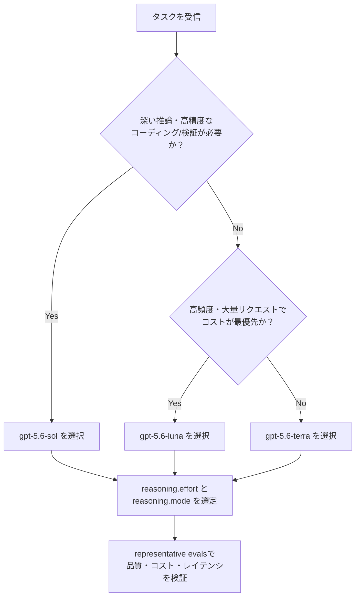
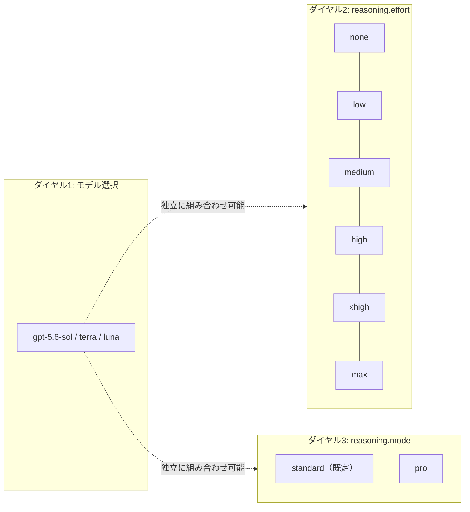
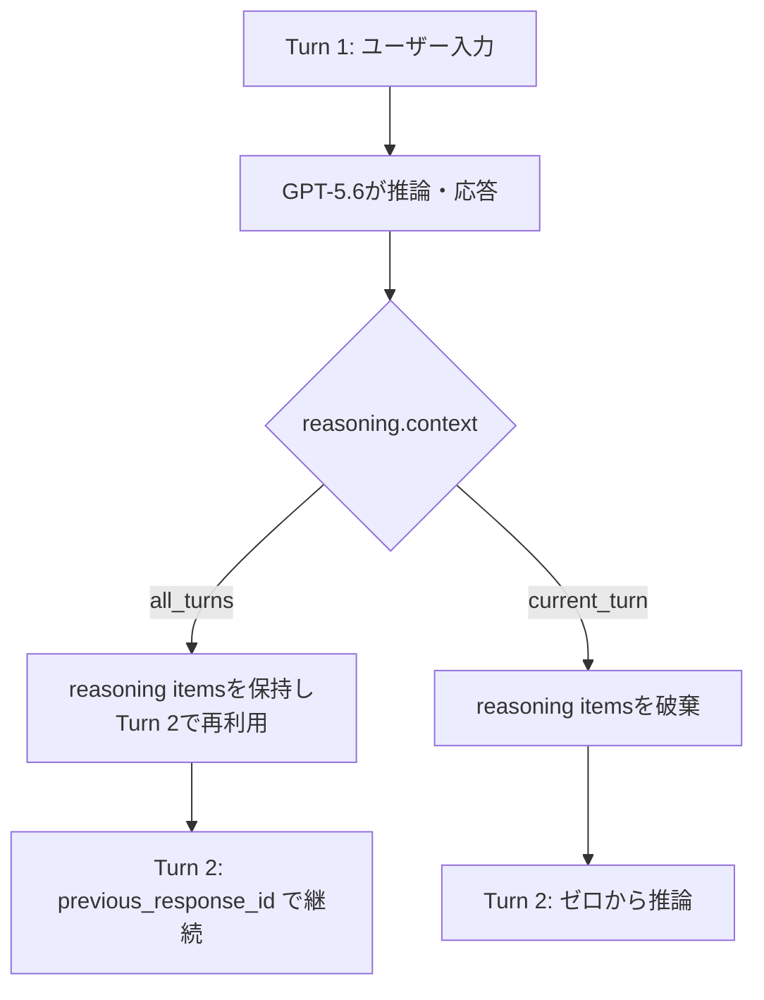
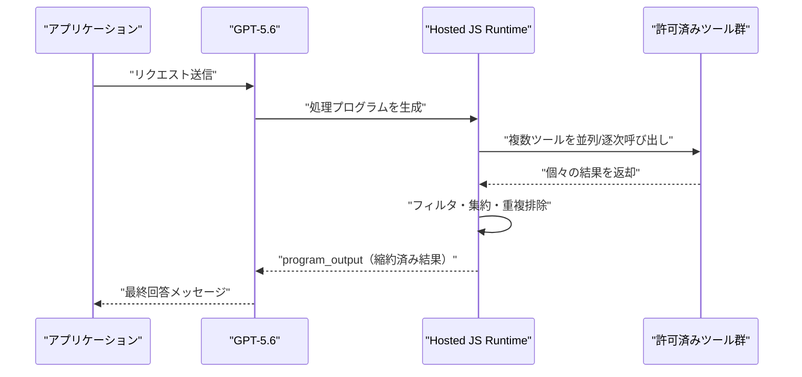
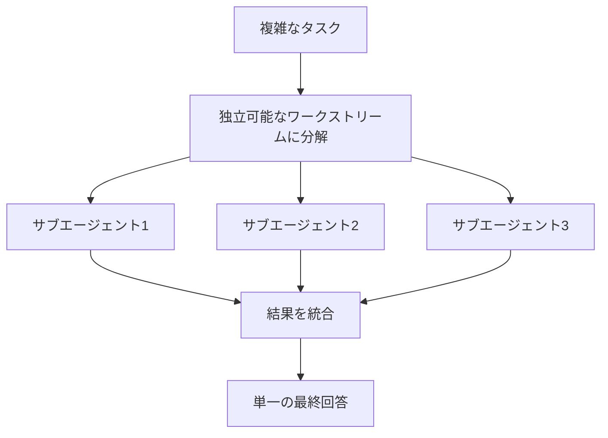
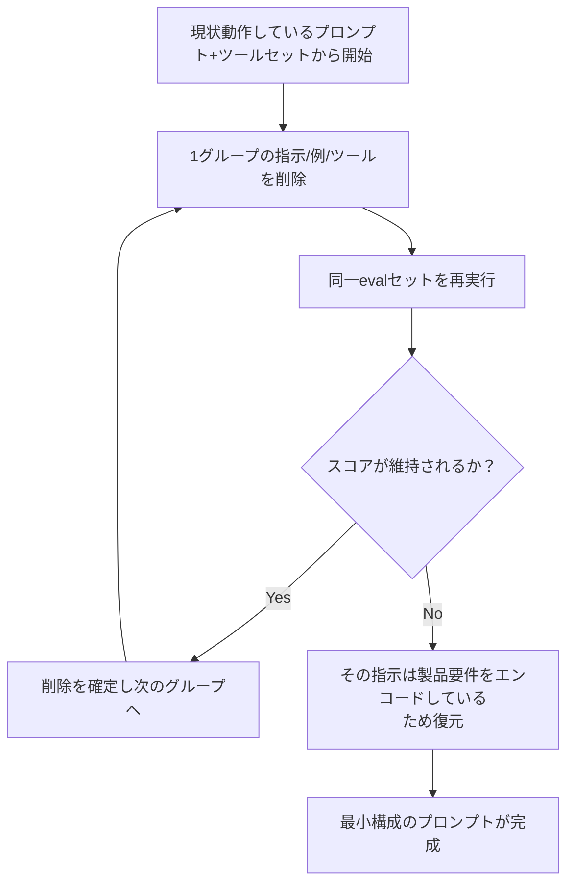
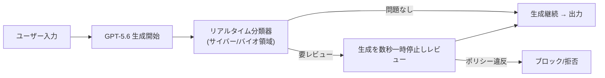
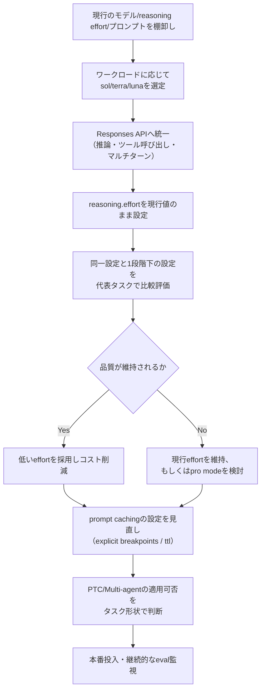

# OpenAI GPT-5.6 完全ガイド：Sol / Terra / Luna 実践ベストプラクティス

> 対象読者：中級〜上級のAIエンジニア・ソフトウェアエンジニア
> 最終更新の前提日：2026年7月16日（GPT-5.6は2026年7月9日にGeneral Availability開始）

---

## 0. このガイドの読み方

GPT-5.6は単なる「性能向上版」ではなく、モデル運用の設計思想そのものを変えるリリースです。本ガイドでは、

1. ファミリー構成とスペック
2. 新機能（Reasoning Mode、Persisted Reasoning、Programmatic Tool Calling、Multi-agentなど）
3. 公式ドキュメントが明示するプロンプト設計のベストプラクティス
4. GPT-5.5/5.4からの移行手順
5. コストとセーフガードの運用ポイント

を、ステップバイステップで解説します。フローチャートはすべてMermaid、比較情報はすべてMarkdownテーブルで表現し、ASCIIアートは使用していません。

---

## 1. GPT-5.6とは何か — ファミリー概要

GPT-5.6は2026年6月26日に限定プレビューとして提供が開始され、米政府によるフロンティアモデルの事前評価プロセス（AI関連大統領令に基づく枠組み）を経て、2026年7月9日に一般提供（GA）となりました。これはAnthropicのClaude Fable 5 / Mythos 5が同様の輸出管理措置を受けた経緯とも重なる、2026年のフロンティアモデル業界全体の共通した流れです。

GPT-5.6は「mini」「nano」という接尾辞を廃止し、3つの命名されたモデルで構成されます。

- **Sol** — フラッグシップモデル。最高難度の推論・コーディング・サイバーセキュリティ・科学タスク向け
- **Terra** — 日常業務向けのバランス型モデル（GPT-5.5相当の品質を約半額で提供）
- **Luna** — 高ボリューム・低コスト向けの効率モデル

いずれのモデルもテキスト・画像入力とテキスト出力に対応し、Responses APIを通じて推論・ツール呼び出し・マルチターンworkflowを扱います。

---

## 2. モデルラインナップ比較表

| モデル | Model ID / Alias | Context Window | Max Output | Input（$/1M tokens） | Output（$/1M tokens） | 主な用途 |
|---|---|---|---|---|---|---|
| Sol | `gpt-5.6-sol`（alias: `gpt-5.6`） | 1,050,000 | 128,000 | $5.00 | $30.00 | 複雑な推論、エージェント型コーディング、サイバーセキュリティ、長時間タスク |
| Terra | `gpt-5.6-terra` | 1,050,000 | 128,000 | $2.50 | $15.00 | 一般業務、カスタマーサポート、社内ツール |
| Luna | `gpt-5.6-luna` | 1,050,000 | 128,000 | $1.00 | $6.00 | 高頻度・低コストのバッチ処理、単純作業 |

補足事項:

- 入力トークンが272,000を超えるリクエストは、そのリクエスト全体に対して **Input 2倍 / Output 1.5倍** の長文コンテキスト料金が適用されます。
- Batch / Flex Processingではさらに割引料金が適用されます（例：Terraのバッチ処理は概ね$1.25/$7.50)。
- `gpt-5.6`エイリアスは常に`gpt-5.6-sol`にルーティングされます。明示的にコストを制御したい場合は、エイリアスではなくモデルIDを直接指定することを推奨します。

---

## 3. モデル選定フロー

タスクの複雑さとコスト制約に応じて、以下の判断フローでモデルを選定します。



**ベストプラクティス**：OpenAIのベンダー公表値ではSolが最上位ベンチマークで優位性を示していますが、これは自社評価であり独立した再現性はまだ限定的です。したがって「Solがデフォルト」という発想ではなく、**Terra/Lunaで要件を満たせるかを先に検証し、満たせない場合のみSolへエスカレーションする**運用が推奨されます。

---

## 4. Reasoning Effort と Reasoning Mode

GPT-5.6を理解する上で最も重要な概念は、「モデルの選択」「reasoning.effort」「reasoning.mode」という**3つの独立したダイヤル**が存在することです。



### 4.1 reasoning.effortの選定基準

| 値 | 特性 | 推奨される使用場面 |
|---|---|---|
| `none` | 推論なし。レイテンシ最優先 | 単純なタスクのベースライン。ツール利用がある場合は`low`も比較検討 |
| `low` | 軽量な推論 | レイテンシに敏感なワークロード |
| `medium` | バランス型（省略時のデフォルト） | ほとんどのタスクの出発点 |
| `high` | より深い推論 | 計測して明確な品質向上が確認できた場合 |
| `xhigh` | さらに深い推論 | 旧世代の最上位設定からの移行先 |
| `max`（GPT-5.6新設） | 最大限の探索・検証を行う | 最難関の品質最優先タスクに限定。`xhigh`との比較評価が必須 |

**移行時の鉄則**：GPT-5.5/5.4から移行する場合は、まず現行のreasoning effortをベースラインとして維持し、その上で「同じ設定」と「1段階下げた設定」の両方を代表的なタスクで比較してください。GPT-5.6はより少ないトークンで同等以上の品質を達成できるケースが多いため、コスト削減の余地があります。

### 4.2 reasoning.mode: standard と pro

`reasoning.mode: "pro"`は、より多くのモデル計算をリクエスト前に投入し、単一の最終回答を返す実行モードです。レイテンシとトークン使用量は増加しますが、次のような高難度タスクで信頼性向上が期待できます。

- 複雑な最適化問題
- 高付加価値なコードレビュー
- 明確な評価基準を持つ深い分析

重要な注意点として、Pro modeは「別モデル」ではなく、既存のSol/Terra/Lunaのいずれにも重ねて適用できる実行モードです。モデルスラッグを切り替える必要はありません。また、プロンプト側で「Pro modeを使って」「もっと深く考えて」と指示する必要もなく、通常のoutcome-focusedなプロンプト（目標・制約・根拠・成功基準・出力形式）をそのまま使えます。

```python
from openai import OpenAI

client = OpenAI()

response = client.responses.create(
    model="gpt-5.6-sol",
    reasoning={"effort": "high", "mode": "pro"},
    input=[
        {
            "role": "user",
            "content": (
                "このデータベース移行計画を精査し、データ損失や"
                "長時間ダウンタイムにつながる失敗モードを洗い出してください。"
                "各指摘には該当ステップの引用、影響度と発生可能性の見積もり、"
                "具体的な緩和策を含め、重大度順に上位5件を返してください。"
            ),
        }
    ],
)

print(response.output_text)
```

**運用ベストプラクティス**：Pro modeはデフォルトでオンにせず、標準モードとの比較評価（成功率・完全性・トークン数・レイテンシ・コスト）を行った上で、明確な品質向上が確認できたワークロードにのみ選択的に適用してください。

---

## 5. Persisted Reasoning（推論の永続化）

マルチターンの会話やエージェント的なワークフローでは、過去のreasoning itemsを再利用できる`reasoning.context`パラメータが導入されました。

| 値 | 動作 | 使用場面 |
|---|---|---|
| `auto`（省略時のデフォルト） | モデルが状況に応じた既定動作を選択 | 特別な要件がない場合 |
| `all_turns` | 過去ターンのreasoning itemsを利用可能にする | タスクのゴール・前提・優先順位が全ターンを通じて安定している場合 |
| `current_turn` | 過去の推論を破棄し、現在のターンのみで推論 | 前のターンの推論がもはや関係ない場合（話題転換など） |

`all_turns`を使う場合は`previous_response_id`を用いて過去のレスポンスを連結します。会話履歴を自前管理する場合（`store: false`やZero Data Retention環境）は、APIが返す暗号化されたreasoning itemsをそのまま再送する必要があります。レスポンスの`reasoning.context`フィールドを確認することで、実際に適用された挙動を検証できます。



---

## 6. Programmatic Tool Calling（PTC）

PTCは、GPT-5.6がホスト型ランタイム上でJavaScriptプログラムを書き、複数ツールを呼び出し・中間結果を処理してから、コンパクトな結果だけをモデルに返す仕組みです。ZDR（Zero Data Retention）互換で、追加のコンテナ課金は発生しません。



### 6.1 PTCが適するタスク形状

| 適している | 適していない |
|---|---|
| 大量ツール結果のフィルタ・結合・ランキング・重複排除・集約・検証 | 1回の呼び出しで完結するタスク |
| 中間出力が大きく、モデルに逐一渡すのが非効率な場合 | 各結果が次の判断に影響を与える対話的なタスク |
| 判断の余地が少ない機械的な処理 | 承認が必要なアクション |
| | 最終出力に引用やネイティブな成果物の保持が必要な場合 |

### 6.2 実装時の注意点

- `programmatic_tool_calling`ツールを追加し、対象ツールを`allowed_callers`で明示的にオプトインします。
- どの段階でPTCを使うか、どのツールを呼べるか、出力スキーマ、並行数・リトライ・停止条件を**タスク固有に明示**してください。「効率的に使って」のような曖昧な指示では期待した経路選択になりません。
- `program_output`と最終的なassistantメッセージは別物です。プログラムが正しいレコードを返していても、メッセージ側で必須フィールドや引用が欠落する場合があるため、**両方を検証**してください。

---

## 7. Multi-agent（ベータ）とUltra Mode

GPT-5.6は単一インスタンスが複数のサブエージェントを並列に調整し、結果を統合する**Multi-agent**機能をResponses APIのベータ機能として提供します（ChatGPT/Codexの"ultra"モードと同様の考え方）。独立したワークストリームに分割できる複雑なタスクにおいて、ウォールクロック時間の短縮に有効です。



**適用判断のポイント**：ワークストリーム間の依存関係が強いタスクでは並列化の恩恵が薄く、統合コストが増える場合があります。分割可能性を事前に評価してから導入してください。

---

## 8. Prompt Cachingの変更点

GPT-5.6では、キャッシュされるプロンプト接頭辞を明示的に指定できる**Explicit Cache Breakpoints**が導入されました。暗黙のキャッシュ（Implicit caching）も引き続き利用できます。

| 項目 | 内容 |
|---|---|
| Cache write（新規キャッシュ書き込み） | 非キャッシュ時のInput単価の **1.25倍** で課金 |
| Cache read（キャッシュ再利用） | 従来通り約90%割引 |
| 最小キャッシュ保持期間 | 30分 |
| 設定方法 | `prompt_cache_options.mode: "explicit"` またはbreakpoint指定 |
| TTL指定 | `prompt_cache_retention`は廃止され`prompt_cache_options.ttl`を使用 |

**運用上の注意**：キャッシュ書き込みが有償化されたため、頻繁に変化するプロンプト接頭辞に対して不要なキャッシュ書き込みが発生しないよう、`cached_tokens`と`cache_write_tokens`の両方をモニタリングし、実質コストを把握することが重要です。

---

## 9. プロンプト設計のベストプラクティス

公式ドキュメントが明示する最重要原則は「**プロンプトを簡潔にする**」ことです。内部の評価では、冗長な指示を削ぎ落とした「リーンな」システムプロンプトにより、評価スコアが約10〜15%向上し、総トークン数が41〜66%、コストが33〜67%削減された事例が報告されています（数値はワークロードに依存するため、自社タスクでの検証が前提です）。

### 9.1 プロンプト簡素化の手順



具体的な指針：

1. **各指示は一度だけ記述する**（重複ルールは削除）
2. **タスクに関連するツールだけを公開**し、説明文を簡潔かつ正確にする
3. 例やスタイルガイドは、製品要件をエンコードしている場合や、計測されたギャップを補正する場合のみ残す
4. セッション開始時と会話が長くなった時の両方でコンテキスト量を追跡する（長時間セッションは重複プロンプト/ツール内容の影響を増幅させる）

### 9.2 意図理解の向上を活かす

GPT-5.6はユーザーの根本的な目的と適切な作業レベルを、より少ない指示から推測できるようになりました。ただし、以下は引き続き明示する必要があります。

- ドメイン固有のコンテキスト
- 明確な制約（ハード制約）
- 承認境界（何をして良いか／悪いか）
- 成功基準
- 「このあいまいさが生じたら質問すべき」というトリガー条件

---

## 10. 自律性と承認境界の定義

GPT-5.6はマルチステップタスクにおいてより能動的・持続的に振る舞うため、**各リクエストがどこまでの行動を許可しているか**を明示することが不可欠です。以下は公式ガイドが示す方針を日本語で再構成したポリシー例です。

```
【回答・説明・レビュー・診断・計画のリクエストの場合】
関連資料を調査し、結果を報告する。変更の実施も求められていない限り、
実際の変更は行わない。

【変更・構築・修正のリクエストの場合】
スコープ内のローカルな変更を実施し、破壊的でない検証（テスト実行など）を
確認なしに行ってよい。

【外部への書き込み、破壊的操作、購入、スコープの大幅な拡張を伴う場合】
必ず事前確認を求める。
```

**注意点**：「まず確認して」「変更しないで」「承認を待って」といった指示をポリシー内で重複して記述すると、安全な想定内の操作にまで不要な承認要求が発生することがあります。ルールは一箇所にまとめ、各規則は一度だけ記述してください。

---

## 11. 応答の長さとスタイル制御

GPT-5.6はGPT-5.5よりデフォルトで簡潔な応答を返す傾向があります。そのため、従来の「簡潔にして」という広範な指示が不要、あるいは逆に応答を短くしすぎる場合があります。

### 11.1 `text.verbosity`によるデフォルト制御

`text.verbosity`に`low` / `medium` / `high`を指定することで、リクエストのデフォルトの詳細度を設定し、タスク固有の要件はプロンプト側に記述する、という役割分担が推奨されます。

### 11.2 短い回答で「何を残すか」を明示する

単に「短くして」と指示するのではなく、保持すべき情報と省略してよい情報を明示します。

```
結論を先に述べる。それを裏付ける根拠、重要な留意点、次のアクションを含める。
副次的な詳細や重複は省略する。

必ず残す：事実、判断、留意点、次のアクション。
優先的に削る：導入文、繰り返し、一般的な安心づけ、任意の背景情報。
```

### 11.3 トーンの定義

「フレンドリーに」「共感的に」といった抽象的なラベルは曖昧になりがちです。どの程度直接的に答えるか、問題発生時にどう言及するか、いつ安心づけを行うかなど、**具体的な書き方のルール**として定義してください。

---

## 12. セーフガードとsafety_identifier

GPT-5.6には、生成中にリアルタイムで動作するサイバー・生物学関連の誤用検知分類器が組み込まれています。



**重要な留意点**：

- これらの分類器は、脆弱性調査・パッチ開発・デバッグ・セキュリティ教育・防御的テストなど、正当な業務に介入してしまう場合があります（デュアルユース領域では攻撃的活動と防御的活動が初期段階で似て見えるため）。
- エンドユーザー向けアプリケーションを運用する場合は、リクエストごとに安定した匿名化済みの`safety_identifier`を送信することが推奨されます。これにより誤用パターンの検知精度向上に寄与します。

---

## 13. GPT-5.5/5.4からGPT-5.6への移行ステップ



### 13.1 コーディングエージェントでの自動移行

Codexを利用している場合、公式の`openai-docs`スキルを用いて自動的に本ガイドの推奨変更を適用できます。

```bash
openai-docs migrate this project to the GPT-5.6 model family
```

このスキルは`openai/skills`リポジトリの`.curated/openai-docs`から他のコーディングエージェントにも導入可能です。

---

## 14. コード実践例

### 14.1 基本的なResponses API呼び出し

```python
from openai import OpenAI

client = OpenAI()

response = client.responses.create(
    model="gpt-5.6-terra",
    reasoning={"effort": "medium"},
    text={"verbosity": "low"},
    input=[
        {
            "role": "user",
            "content": "matrixを文字列'[1,2],[3,4],[5,6]'として受け取り、"
                        "同形式で転置行列を出力するbashスクリプトを書いてください。",
        }
    ],
)

print(response.output_text)
```

### 14.2 curlでのリクエスト例（max reasoning effort）

```bash
curl https://api.openai.com/v1/responses \
  -H "Content-Type: application/json" \
  -H "Authorization: Bearer $OPENAI_API_KEY" \
  -d '{
    "model": "gpt-5.6-sol",
    "reasoning": {"effort": "max"},
    "safety_identifier": "hashed-user-id-xxxx",
    "input": [
      {"role": "user", "content": "本番障害の根本原因を特定するための調査計画を立ててください。"}
    ]
  }'
```

### 14.3 Persisted Reasoningを使ったマルチターン継続

```python
first = client.responses.create(
    model="gpt-5.6-sol",
    reasoning={"effort": "high", "context": "all_turns"},
    input=[{"role": "user", "content": "このリファクタリング計画をレビューして"}],
)

second = client.responses.create(
    model="gpt-5.6-sol",
    reasoning={"effort": "high", "context": "all_turns"},
    previous_response_id=first.id,
    input=[{"role": "user", "content": "先ほどの指摘のうち、優先度が最も高いものを実装して"}],
)
```

---

## 15. ChatGPT / Codex / ChatGPT Workでの利用可能性

| プラン | 標準ChatGPT会話 | Work / Codex |
|---|---|---|
| Free / Go | GPT-5.5 Instantがデフォルト。Solは利用不可 | 一部機能のみ |
| Plus | Medium / High reasoning でSolを利用可 | Terra/Lunaを含め利用可（段階的展開） |
| Pro | Medium / High / Extra High / Proまで利用可 | フルアクセス |
| Business / Enterprise | 全reasoningレベル + 管理者によるモデル制御 | フルアクセス、ワークスペースポリシーで制御可能 |

標準のChatGPT会話では、日常応答のデフォルトは引き続きGPT-5.5 Instantであり、GPT-5.6 SolはMedium以上のreasoningオプションを選択した場合にのみ使用されます。Terra/Lunaは標準チャットでは選択できず、ChatGPT Work・Codex・APIから利用します。

ChatGPT Workは、GPT-5.6を基盤としたエージェント型ワークスペース製品で、ローカルファイル・アプリ・ブラウザを横断したマルチステップタスクの自動実行を目的としています。

---

## 16. コスト最適化チェックリスト

| チェック項目 | 内容 |
|---|---|
| ☐ モデル階層の見直し | まずLuna/Terraで要件を満たせるか検証してからSolへエスカレーション |
| ☐ reasoning effortの再検証 | 旧設定をそのまま引き継がず、1段階下げて品質を比較 |
| ☐ Pro modeの適用範囲 | 高付加価値タスクに限定し、全リクエストへの一律適用を避ける |
| ☐ キャッシュ戦略 | 再利用可能な接頭辞を安定させ、explicit breakpointsで不要な書き込みを抑制 |
| ☐ 272K超過リクエストの分離 | 長文コンテキスト料金（2×/1.5×）が適用される処理を別クラスとして管理 |
| ☐ PTCの適用判断 | 1回の呼び出しで済むタスクにPTCを乱用しない |
| ☐ プロンプトの継続的な簡素化 | 評価結果を見ながら重複指示・不要な例を削減 |

---

## 17. まとめ

GPT-5.6の本質は「モデルが賢くなった」ことよりも、**運用側が持つダイヤル（モデル階層・reasoning effort・reasoning mode・persisted reasoning・prompt caching戦略）が独立して細分化された**ことにあります。ベストプラクティスの核心は一貫しています。

- プロンプトは最小構成から始め、evalで検証しながら足す
- 各ダイヤルは独立して比較評価する（思い込みで最大設定を選ばない）
- 自律性の境界と成功基準を明示し、細かい手順は指示しすぎない
- コストに影響する変更（キャッシュ書き込み、272K超過、Pro mode）は必ず計測する

---

## 18. 参考ソース

| ソース | 内容 | URL |
|---|---|---|
| OpenAI公式リリース | GPT-5.6ファミリー正式発表 | https://openai.com/index/gpt-5-6/ |
| OpenAI公式プレビュー発表 | 限定プレビュー時の告知（政府審査の経緯を含む） | https://openai.com/index/previewing-gpt-5-6-sol/ |
| OpenAI Developers - Model guidance | モデル比較・移行ガイド・プロンプトベストプラクティスの一次情報 | https://developers.openai.com/api/docs/guides/latest-model |
| OpenAI Developers - Reasoning models | reasoning.effort / reasoning.mode の技術仕様 | https://developers.openai.com/api/docs/guides/reasoning |
| OpenAI Developers - Prompting guidance for GPT-5.6 Sol | プロンプト設計の詳細ガイダンス | https://developers.openai.com/api/docs/guides/prompt-guidance-gpt-5p6 |
| OpenAI Developers - Programmatic Tool Calling | PTCの実装ガイド | https://developers.openai.com/api/docs/guides/tools-programmatic-tool-calling |
| OpenAI Developers - Prompt caching | キャッシュ課金体系の詳細 | https://developers.openai.com/api/docs/guides/prompt-caching |
| OpenAI Developers - Multi-agent | Multi-agent（ベータ）の技術詳細 | https://developers.openai.com/api/docs/guides/responses-multi-agent |
| OpenAI Developers - Safety best practices | safety_identifierの実装方法 | https://developers.openai.com/api/docs/guides/safety-best-practices |
| Wikipedia | GPT-5.6の背景情報・Preparedness Framework上の分類 | https://en.wikipedia.org/wiki/GPT-5.6 |
| TechCrunch | 一般提供開始時の報道、価格体系の確認 | https://techcrunch.com/2026/07/09/openai-launches-its-new-family-of-models-with-gpt-5-6/ |
| Axios | GA発表の経緯・政府対応の背景 | https://www.axios.com/2026/07/09/ai-openai-gpt-release |
| MacRumors | ChatGPT Work / プラン別利用可能性 | https://www.macrumors.com/2026/07/09/openai-chatgpt-work/ |

> 補足：価格・提供プラン・ベータ機能の可用性は変更される可能性があるため、本番導入前に必ず上記の一次ソース（developers.openai.com）で最新情報を確認してください。
