# Hands-On Large Language Models 完全読解ガイド ― 初学者のためのステップバイステップ解説

> 本ガイドは、Jay Alammar 氏と Maarten Grootendorst 氏による O'Reilly 刊行書籍 **『Hands-On Large Language Models』**（2024年9月刊、428ページ）の構成・概念を初学者向けに独自の説明と図解で再構成したものです。書籍本文・図版・コードの複製や転載は一切行っておらず、公式目次・著者自身の発信・第三者レビュー・関連する一次情報をWeb検索で確認したうえで、大規模言語モデル（LLM）を体系的に理解するための独自教材として作成しています。

## 本書について

| 項目 | 内容 |
|---|---|
| 原題 | Hands-On Large Language Models: Language Understanding and Generation |
| 著者 | Jay Alammar（Cohere ディレクター兼 Engineering Fellow）、Maarten Grootendorst（臨床データサイエンティスト、BERTopic/KeyBERT/PolyFuzz 作者） |
| 出版社 | O'Reilly Media |
| 刊行 | 2024年9月 |
| ページ数 | 428ページ（対象レベル：初級〜中級） |
| 構成 | 全12章・3部構成、カスタムイラスト約300点 |
| 公式サイト | O'Reilly Online Learning（本ガイド末尾の参考文献を参照） |
| コード | 公式GitHubリポジトリで全章のJupyter Notebookを無料公開（Google Colab上での実行を推奨） |

著者のJay Alammar氏は、Transformer・BERT・GPT-3などを図解した個人ブログ「The Illustrated Transformer」で知られ、NumPyやpandasの公式ドキュメントにもその図解が採用されるなど、機械学習の可視化教育で国際的に高い評価を得ている人物です。共著者のMaarten Grootendorst氏は、トピックモデリングライブラリ「BERTopic」やキーワード抽出ライブラリ「KeyBERT」の作者であり、心理学とデータサイエンスの両方の修士号を持つ経歴を活かし、複雑な機械学習の概念を平易に伝えることを得意としています。

本書はDeepLearning.AI創設者のAndrew Ng氏から「LLMがどのように構築されているかを理解したい人にとって貴重な資料」と評され、統計解説で著名なYouTuberのJosh Starmer氏（StatQuest）や、sentence-transformersの作者でCohereの機械学習ディレクターであるNils Reimers氏からも高い評価を受けています。

## 目次

- [第0部：学習を始める前に](#第0部学習を始める前に)
- [第1部：言語モデルを理解する（原著 Part I）](#第1部言語モデルを理解する原著-part-i)
  - [1章 大規模言語モデル入門](#1章-大規模言語モデル入門)
  - [2章 トークンと埋め込み](#2章-トークンと埋め込み)
  - [3章 大規模言語モデルの内部を覗く](#3章-大規模言語モデルの内部を覗く)
- [第2部：事前学習済み言語モデルを使う（原著 Part II）](#第2部事前学習済み言語モデルを使う原著-part-ii)
  - [4章 テキスト分類](#4章-テキスト分類)
  - [5章 テキストクラスタリングとトピックモデリング](#5章-テキストクラスタリングとトピックモデリング)
  - [6章 プロンプトエンジニアリング](#6章-プロンプトエンジニアリング)
  - [7章 高度なテキスト生成技術とツール](#7章-高度なテキスト生成技術とツール)
  - [8章 セマンティック検索と検索拡張生成（RAG）](#8章-セマンティック検索と検索拡張生成rag)
  - [9章 マルチモーダル大規模言語モデル](#9章-マルチモーダル大規模言語モデル)
- [第3部：言語モデルの訓練とファインチューニング（原著 Part III）](#第3部言語モデルの訓練とファインチューニング原著-part-iii)
  - [10章 テキスト埋め込みモデルの作成](#10章-テキスト埋め込みモデルの作成)
  - [11章 分類のための表現モデルのファインチューニング](#11章-分類のための表現モデルのファインチューニング)
  - [12章 生成モデルのファインチューニング](#12章-生成モデルのファインチューニング)
- [第4部：2026年9月時点の最新動向](#第4部2026年9月時点の最新動向)
- [学習ロードマップ](#学習ロードマップ)
- [実践チェックリスト](#実践チェックリスト)
- [用語集](#用語集)
- [参考文献](#参考文献)

---

## 第0部：学習を始める前に

### 0.1 対象読者と前提知識

本書は「初級〜中級」向けと位置づけられていますが、実際には以下の前提知識があるとスムーズに読み進められます。

- **Python**：基本的な文法、関数、クラスの読み書きができること
- **機械学習の初歩**：教師あり学習・教師なし学習という区分、訓練/検証/テストデータの考え方
- **深層学習のごく基礎**：ニューラルネットワーク、勾配降下法、GPUを使った計算という概念に触れたことがある
- **コマンドライン/Google Colabの操作**：ノートブック環境でセルを実行できること

線形代数の詳細な理解や、Transformerの数式を自力で導出できる必要はありません。著者自身が「直感ファースト」の方針を明言しており、数式よりも図解とアナロジーで理解を積み上げていくスタイルが本書の一貫した特徴です。

### 0.2 深層学習・NLPの基礎用語のおさらい

| 用語 | 意味 |
|---|---|
| ニューラルネットワーク | 入力を重み付き結合を通じて変換し、望ましい出力に近づけるよう重みを調整する計算モデル |
| パラメータ | ニューラルネットワークが学習によって調整する重みの総体。LLMでは数十億〜数千億個に及ぶ |
| 埋め込み（Embedding） | 単語・文・画像などを数値ベクトルとして表現したもの。意味的に近いものほどベクトル空間上で近くに配置される |
| トークン | LLMがテキストを処理する際の最小単位。単語そのものではなく、サブワード（単語の一部）であることが多い |
| ファインチューニング | 事前学習済みモデルを、特定のタスクやドメインのデータで追加学習させること |
| 推論（Inference） | 学習済みモデルに入力を与えて出力を得るプロセス（学習とは区別される） |

### 0.3 開発環境

本書の全コード例は公式GitHubリポジトリでJupyter Notebookとして公開されており、Google Colabでの実行（無料枠でT4 GPU・16GB VRAMを利用可能）が推奨されています。本ガイドはコード再掲を行いませんが、実際に手を動かす際は以下の環境整備が前提になります。

- Python 3.10前後、`transformers` / `sentence-transformers` / `datasets` などHugging Face系ライブラリ
- GPU環境（ローカルGPU、Google Colab、またはクラウドGPUインスタンス）
- `langchain` などLLMアプリケーション構築フレームワーク（7章で使用）

### 0.4 本書全体の地図

本書は「直感ファースト」の哲学のもと、次の3部構成で編まれています。

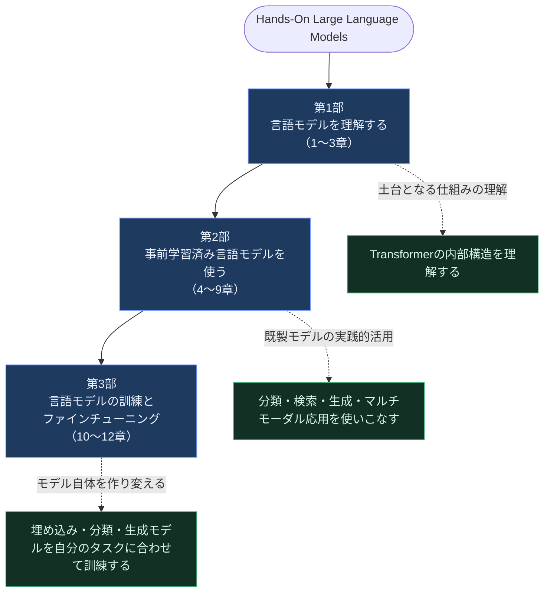

第1部は「エンジンの仕組みを理解する」段階、第2部は「既に作られたエンジンを使いこなす」段階、第3部は「エンジン自体を自分の目的に合わせて調整する」段階、というイメージを持つと全体像が掴みやすくなります。

---

## 第1部：言語モデルを理解する（原著 Part I）

### 1章 大規模言語モデル入門

#### 言語AIとは何か、その歴史

「言語AI」とは、人間の言語を理解・生成するコンピュータシステムの総称です。本書はまず、この分野がどのような技術的な積み重ねの上に成り立っているかを歴史的に整理するところから始まります。

```mermaid
flowchart LR
    subgraph Era1["表現学習以前"]
        A1["Bag-of-Words<br/>単語の出現回数で文書を表現"]
    end
    subgraph Era2["密なベクトル表現の時代"]
        A2["Word2Vec<br/>意味の近さをベクトルの近さで表現"]
    end
    subgraph Era3["文脈化表現の時代"]
        A3["RNN / LSTM<br/>系列を順に処理し文脈を保持"]
        A4["Attention機構の登場<br/>系列内の重要な部分に注目"]
    end
    subgraph Era4["Transformerの時代"]
        A5["Transformer<br/>Attentionのみで並列処理"]
        A6["BERT<br/>エンコーダのみで文脈理解に特化"]
        A7["GPTシリーズ<br/>デコーダのみで文生成に特化"]
    end
    subgraph Era5["生成AIの時代"]
        A8["ChatGPTの登場<br/>指示追従・対話が一般化"]
        A9["オープンモデルの拡大<br/>Llama, Mistral 等"]
    end

    Era1 --> Era2 --> Era3 --> Era4 --> Era5

    classDef oldEra fill:#2a2f3a,stroke:#8a94a6,color:#e6e9ef
    classDef newEra fill:#1e3a5f,stroke:#7c9eff,color:#eaf1ff
    class A1,A2,A3,A4 oldEra
    class A5,A6,A7,A8,A9 newEra
```

この歴史を追うことで、なぜ「Attention Is All You Need」論文（2017年、Vaswani他）がその後のAI全体を変える転換点になったのかが見えてきます。RNN/LSTMは文章を先頭から順番にしか処理できず、長い文脈を保持するのが苦手でした。Attention機構は「系列内のどの部分に注目すべきか」を直接学習できる仕組みであり、Transformerはこれを唯一の主要な仕組みとして採用することで、並列計算による高速な訓練と、長距離の文脈理解を同時に実現しました。

#### 表現の進化：Bag-of-Wordsから密なベクトル埋め込みへ

Bag-of-Wordsは「文書に含まれる単語の出現頻度」だけで文書を表現する古典的な手法です。実装は単純ですが、単語の順序や意味的な近さを一切捉えられません（例えば「良い」と「素晴らしい」は全く別の次元として扱われる）。これに対して密なベクトル埋め込みは、意味的に近い単語ほど高次元空間上で近い位置に配置されるように学習されたベクトル表現です。

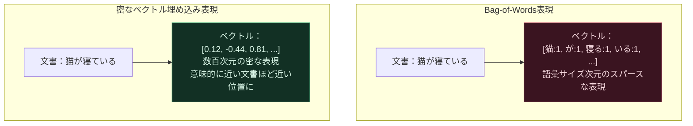

埋め込みには大別して、単語単位の埋め込み（Word2Vecなど）、文・段落・文書単位の埋め込み（Sentence Embeddings）、そしてLLM内部で動的に生成される文脈化トークン埋め込みの3種類があります。これらは2章でさらに深く扱われます。

#### エンコーダのみのモデルとデコーダのみのモデル

Transformerアーキテクチャは、用途に応じて大きく2つの系統に枝分かれしました。

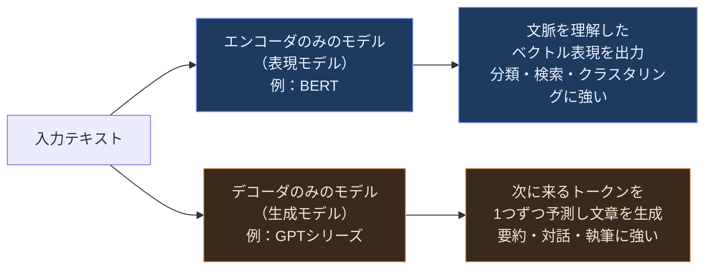

本書のタイトルにもある「Large Language Models」という言葉自体、当初はデコーダのみの生成モデルを指すことが多かったものの、現在ではエンコーダのみの表現モデルを含む、大規模なTransformerベースの言語モデル全般を指す言葉として定着しつつあります。この「LLMという言葉の定義が拡大し続けている」という指摘は、本書の中でも重要な視点として提示されています。

#### LLMの訓練パラダイムと責任ある利用

LLMの訓練は一般に「大量のテキストで次のトークンを予測する事前学習」から始まり、その後「特定の指示に従うように調整する追加学習」を経て実用モデルになります（詳細は12章）。同時に本書は、LLMが誤情報の生成、バイアスの再生産、有害コンテンツの生成といったリスクを伴うことを踏まえ、責任あるLLMの開発・利用の重要性にも触れています。

#### LLMとのインターフェース：プロプライエタリ・プライベート・オープンモデル

LLMを利用する方法は大きく3つに分類できます。

| 分類 | 特徴 | 例 |
|---|---|---|
| プロプライエタリ・プライベートモデル | APIとして提供され、重みは非公開。運用の手間が少ない一方、データが外部送信される | OpenAI GPT系、Anthropic Claude系、Cohere Command系 |
| オープンモデル | 重みが公開されており、自前の環境で実行・改変できる | Llama系、Mistral系、Qwen系など |
| オープンソースフレームワーク | モデルを動かすための周辺ツール群 | Hugging Face Transformers、llama.cpp など |

どの選択肢を取るかは、コスト・レイテンシ・データプライバシー・カスタマイズ性のトレードオフで決まります。この判断軸は2026年現在も変わらぬ実務上の論点であり、第4部で最新動向として改めて扱います。

---

### 2章 トークンと埋め込み

#### LLMのトークン化

LLMは生のテキストを直接扱うのではなく、「トークナイザー」と呼ばれる前処理コンポーネントを通してテキストを数値IDの列に変換します。


#### Word・Subword・Character・Byteトークンの比較

トークン化の粒度にはいくつかの選択肢があり、それぞれにトレードオフがあります。

| 粒度 | 特徴 | 課題 |
|---|---|---|
| Word（単語単位） | 直感的で解釈しやすい | 語彙が膨大になり未知語に弱い |
| Subword（サブワード単位、BPEなど） | 未知語にもある程度対応でき語彙サイズを抑えられる | 言語間で圧縮効率に差が出る（多言語公平性の課題） |
| Character（文字単位） | 語彙が非常に小さい | 系列長が長くなり計算コストが増える |
| Byte（バイト単位） | あらゆる文字・絵文字・バイナリを扱える | 系列長がさらに長くなるため工夫が必要 |

現代の主要LLM（GPTシリーズ、Llamaシリーズなど）の多くは、Byte-Pair Encoding（BPE）に代表されるサブワード単位のトークナイザーを採用しています。異なるLLMのトークナイザーを比較すると、同じ文章でもトークン数（＝APIコストや処理速度に直結する数値）が大きく異なることが本書内で示されています。

#### トークン埋め込みと文脈化埋め込み

言語モデルは、トークナイザーの語彙に含まれる各トークンに対応する埋め込みベクトルを保持しています。ただし、これは「文脈に依存しない」静的な埋め込みです。Transformer内部でAttention機構を通過させることで、同じ単語であっても文脈に応じて異なるベクトル（文脈化埋め込み）が得られるようになります。

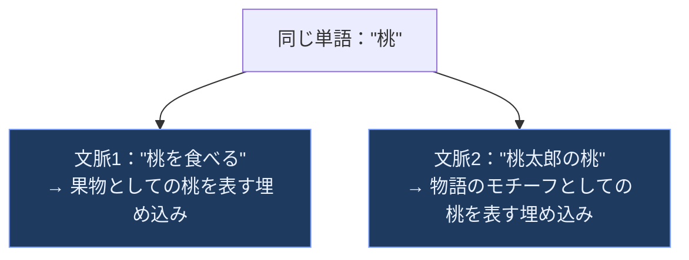

#### Word2Vecと対照学習、推薦システムへの応用

本書は、LLM登場以前から使われてきたWord2Vecアルゴリズムにも触れています。Word2Vecは「周囲に出現する単語が似ている単語は、意味も似ている」という分布仮説に基づき、対照学習（似た文脈の単語ペアを近づけ、無関係な単語ペアを遠ざける学習）によって単語埋め込みを獲得します。この対照学習の考え方は、後の章で登場するテキスト埋め込みモデルの訓練（10章）やCLIPのようなマルチモーダル埋め込み（9章）にも共通する、LLM時代を通じて極めて重要な学習パラダイムです。

本書ではさらに、この埋め込みの考え方を応用して「曲」を埋め込み空間上に配置し、類似した曲を推薦するモデルを構築する例も紹介されており、埋め込みという概念がテキストに限らず汎用的な表現学習の手法であることを示しています。

---

### 3章 大規模言語モデルの内部を覗く

#### Transformerモデルの概観と入出力

3章は、1章で概念的に触れたTransformerの内部構造に踏み込みます。訓練済みTransformer LLMは、トークンID列を入力として受け取り、「次に来る可能性が最も高いトークン」の確率分布を出力します。この「次のトークンを予測する」という単純な仕組みを繰り返し適用することで、一見複雑な文章生成が実現されています。

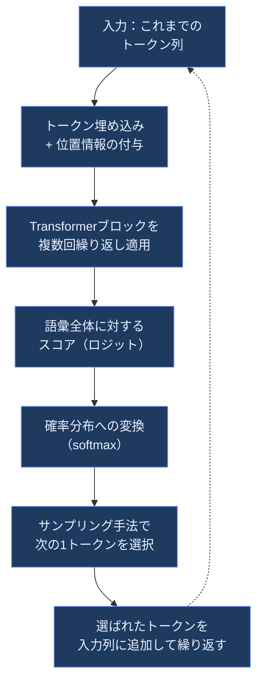

#### Transformerブロックの内部構造

各Transformerブロックは、大きく「Attention機構」と「フィードフォワードネットワーク」という2つのサブレイヤーから構成され、それぞれに残差接続（Residual Connection）と正規化（Layer Normalization）が組み合わされています。

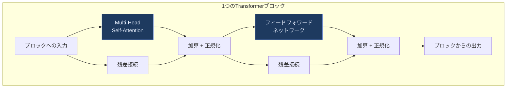

Attention機構は、系列中の各トークンについて「Query（何を探しているか）」「Key（何を提供できるか）」「Value（実際の情報の中身）」という3種類のベクトルを計算し、QueryとKeyの類似度に基づいて他のトークンの情報をどれだけ取り込むかを決定します。これにより、文章中の離れた位置にある単語同士の関係性（例えば代名詞が何を指しているか）を捉えることができます。

#### KVキャッシュによる生成の高速化

生成モデルが1トークンずつ文章を生成する際、毎回すべてのトークンについてKeyとValueを再計算するのは非効率です。そこで実用上は、一度計算したKeyとValueをキャッシュ（KVキャッシュ）しておき、新しいトークンを追加するたびにその分だけ計算を行う最適化が広く使われています。

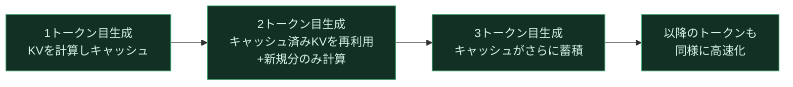

#### アーキテクチャの最近の改善

本書は、より効率的なAttention（クエリ間でKey/Valueを共有するGrouped-Query Attentionなど）や、単語の絶対位置ではなく相対的な位置関係を扱う回転位置埋め込み（RoPE：Rotary Positional Embedding）といった、2024年時点でのTransformer改良の潮流も紹介しています。これらの改良は、より長い文脈長を扱いながら計算・メモリ効率を高めることを目的としています。

---

## 第2部：事前学習済み言語モデルを使う（原著 Part II）

### 4章 テキスト分類

第2部からは、事前学習済みモデルを「そのまま」あるいは「軽い追加処理を加えて」実務に活用する方法が扱われます。4章はその入り口として、映画レビューの感情分析（ポジティブ/ネガティブ分類）を題材に、テキスト分類への3つのアプローチを整理します。

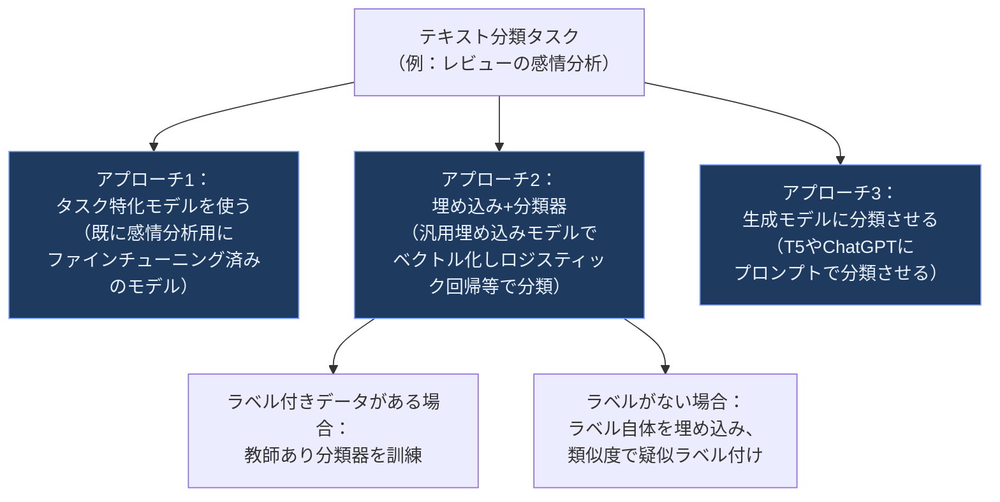

3つのアプローチにはそれぞれ得意不得意があります。タスク特化モデルは手軽で高速ですが、対象ドメインに合ったモデルが存在するとは限りません。埋め込み+分類器は柔軟性が高く、ラベル付きデータが少量でも機能しやすいという特徴があります。生成モデルによる分類は、プロンプトの工夫だけで新しいタスクに対応できる手軽さがある一方、出力の一貫性や再現性の管理が必要になります。この「タスク特化モデル／埋め込み活用／生成モデル活用」という3分類の発想は、5章以降の応用パターンの土台になります。

---

### 5章 テキストクラスタリングとトピックモデリング

5章では、ArXivの計算機科学・言語（cs.CL）分野の論文データを題材に、ラベルなしテキストの構造を発見する「テキストクラスタリング」と「トピックモデリング」を扱います。

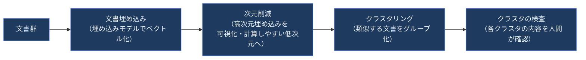

クラスタリングが「文書をグループに分けるだけ」であるのに対し、トピックモデリングはさらに「各グループが何についてのトピックなのか」を、そのグループを特徴づける単語やフレーズとして自動的に抽出しようとする手法です。著者のMaarten Grootendorst氏が開発した**BERTopic**は、この「埋め込み→次元削減→クラスタリング」というパイプラインに、各クラスタからキーワードを抽出する仕組みを「レゴブロック」のように組み合わせるモジュール式フレームワークとして設計されています。

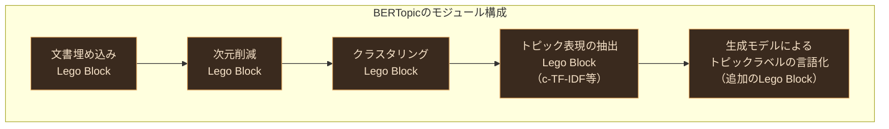

このモジュール性こそがBERTopicの最大の特徴であり、各段階の手法を用途に応じて自由に差し替えられる設計になっています。さらに本書は、抽出したキーワードだけでなく、生成モデル（LLM）を使ってトピックにより自然な説明文を付与する「テキスト生成のレゴブロック」という拡張にも触れており、教師なし学習と生成AIを組み合わせる発想を示しています。

---

### 6章 プロンプトエンジニアリング

6章は、生成モデルの出力をいかにして制御するかという「プロンプトエンジニアリング」を扱います。まずモデルの選定・ロードと、温度（temperature）やtop-pといった出力制御パラメータの基本が説明された後、体系的なプロンプト技法へと進みます。

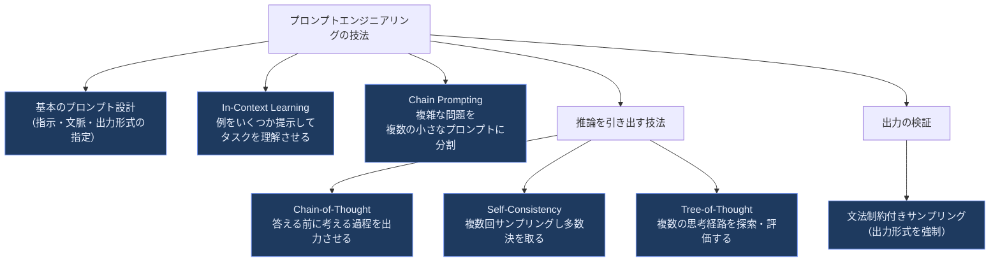

これらの技法のうち、Tree-of-Thought（ToT）は特に興味深い発想です。Chain-of-Thoughtが「1本の思考の連なり」を生成させるのに対し、ToTは複数の思考経路を並行して探索し、有望な経路を評価しながら選び進めるという、探索アルゴリズムに近い枠組みを取ります。

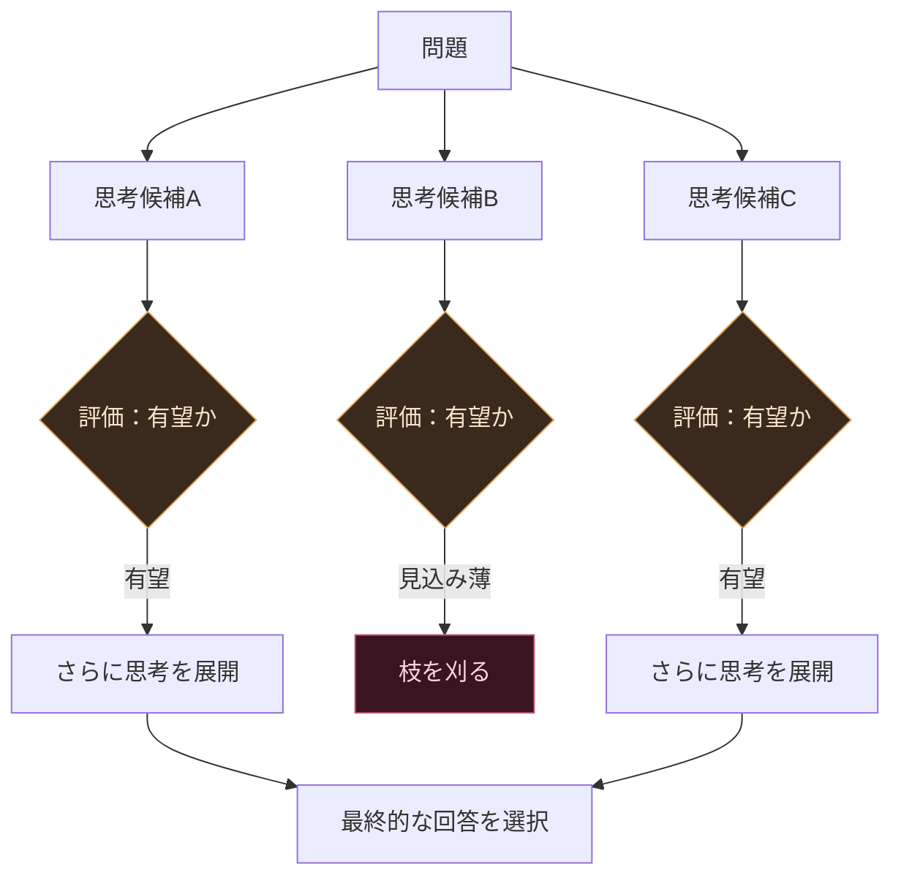

最後に本書は、出力を検証する手段として、模範例を追加で与える方法や、あらかじめ定義した文法（スキーマ）に従うようサンプリング自体を制約する「Grammar：制約付きサンプリング」にも触れています。これはLLMの出力を後段のプログラムで確実にパースしたい場合（JSON出力の強制など）に実務上重要な技術です。

---

### 7章 高度なテキスト生成技術とツール

7章では、単発のプロンプトを超えて、LLMを部品として組み合わせるフレームワークである**LangChain**を用いた構築手法が扱われます。

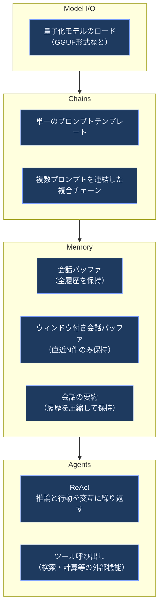

特に「Agents」の節で紹介されるReAct（Reasoning and Acting）は、LLMに「今何を考えているか（Reasoning）」と「次に何をするか（Acting）」を交互に出力させながら、検索エンジンや計算機のような外部ツールを呼び出させる枠組みです。これは後年、より大規模な自律型AIエージェントやマルチエージェントシステムへと発展していく重要な源流の一つであり、本書が2024年の時点で既にこの考え方の基礎を扱っていたことは、その後のエージェント技術の急速な発展を踏まえると先見性のある構成だったと言えます。

---

### 8章 セマンティック検索と検索拡張生成（RAG）

8章は、LLMアプリケーションの中でも実務利用が特に進んでいる技術領域である「セマンティック検索」と「検索拡張生成（Retrieval-Augmented Generation、RAG）」を扱います。

まず、キーワードの一致に頼る従来の検索とは異なり、埋め込みベクトルの意味的な近さで検索する「密検索（Dense Retrieval）」の仕組みが説明されます。密検索だけでは取りこぼしや誤検出が起こり得るため、検索結果の上位候補を、より精密な「リランカー（Reranker）」で並べ替える2段階構成が実務で広く使われています。


この検索結果を、生成モデルへのプロンプトに組み込んで回答を生成させる仕組みがRAGです。RAGの利点は、モデル自体を再訓練することなく、最新の情報や社内固有の情報を回答に反映できる点にあります。

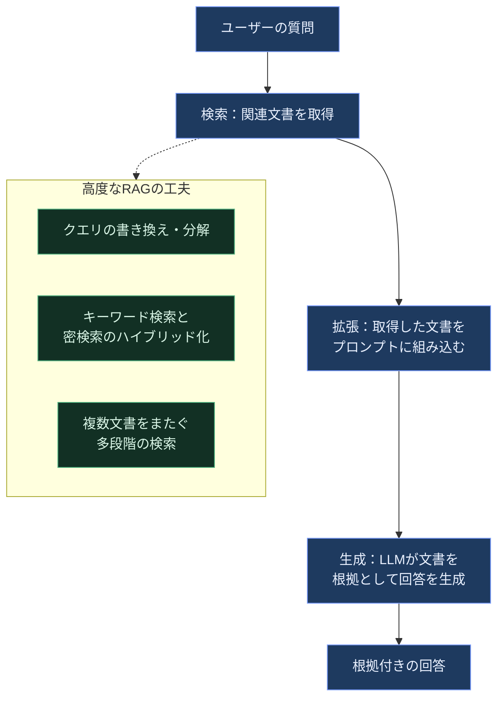

本書はさらに、LLM APIを用いてグラウンディング（根拠付け）を行う例と、ローカルで動かす軽量モデルでRAGを組む例の両方を扱い、RAGの評価指標（検索の正確性、生成された回答の忠実性など）にも触れています。この分野は2024年以降も進化が非常に速く、その最新状況は本ガイド第4部でまとめて扱います。

---

### 9章 マルチモーダル大規模言語モデル

9章は、テキストだけでなく画像も扱える「マルチモーダルLLM」を扱います。中心となるのは、テキストと画像を同じ埋め込み空間にマッピングする**CLIP（Contrastive Language-Image Pretraining）**です。

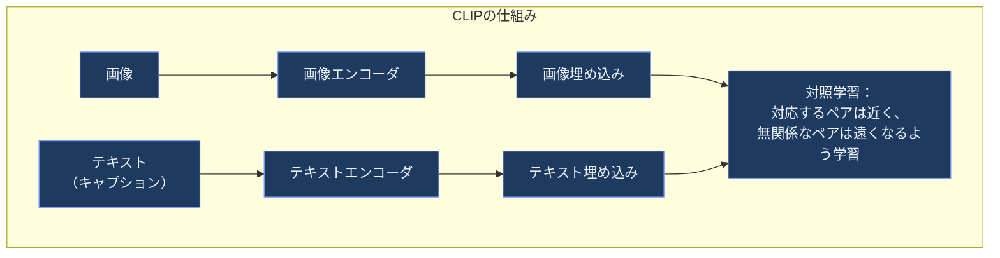

CLIPによって、「画像」と「テキスト」という異なるモダリティが同じ空間上で意味的に比較可能になります。これにより、画像を説明文で検索する、あるいは説明文に合う画像を検索するといった応用が可能になります。本書はさらに、CLIPをオープンソース実装した**OpenCLIP**にも触れています。

一方、テキスト生成モデル自体をマルチモーダル化する手法として、**BLIP-2**が紹介されます。BLIP-2は「Q-Former」と呼ばれる橋渡し役のコンポーネントを使い、画像エンコーダの出力と、既存の言語モデルの入力形式との間のギャップ（モダリティギャップ）を埋めます。

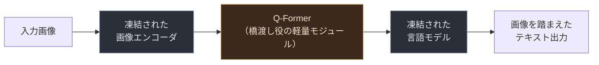

BLIP-2の設計思想の要点は、既に高性能な画像エンコーダと言語モデルをそれぞれ「凍結」（パラメータを更新しない）したまま再利用し、両者をつなぐ軽量なQ-Formerだけを訓練するという効率性にあります。本書はこの仕組みを使い、画像キャプション生成と、画像を踏まえたマルチモーダルなチャット形式のプロンプティングという2つのユースケースを紹介しています。

---

## 第3部：言語モデルの訓練とファインチューニング（原著 Part III）

### 10章 テキスト埋め込みモデルの作成

第3部からは、既製モデルを使うだけでなく、モデル自体を訓練・調整する段階に入ります。10章はまず、2章・9章で繰り返し登場した「対照学習（Contrastive Learning）」を、埋め込みモデルそのものを一から訓練する手法として掘り下げます。

中心となるのは**SBERT（Sentence-BERT）**です。SBERTは、2つの文をそれぞれ同じエンコーダに通し、得られた埋め込み同士の類似度を学習させる「シャム・ネットワーク（Siamese Network）」構成を採用しています。

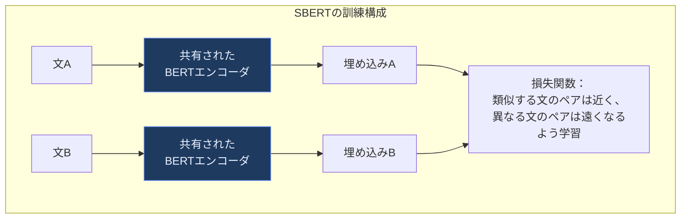

本書では、対照学習用のデータ（似た文のペア／似ていない文のペア）を生成する方法、モデルの訓練、そして訓練後の詳細な評価という一連の流れが示されます。さらに埋め込みモデルのファインチューニング手法として、以下の3系統が整理されています。

| 手法 | データの前提 | 概要 |
|---|---|---|
| 教師ありファインチューニング | ラベル付きペアデータが十分にある | 通常のSBERT訓練と同様の対照学習を、対象ドメインのデータで行う |
| Augmented SBERT | ラベル付きデータが少ない | 少量のラベル付きデータで訓練した高精度だが低速なモデル（Cross-Encoder）を使い、大量の疑似ラベルを生成してSBERTを訓練する |
| TSDAE（教師なし） | ラベルなしデータのみ | 文に意図的にノイズを加え、元の文を復元できるようエンコーダを訓練する「ノイズ除去オートエンコーダ」の考え方をTransformerに適用 |

Augmented SBERTは「高精度だが遅いモデルの知識を、高速な埋め込みモデルに転移する」という発想であり、TSDAEは「ドメイン適応」、つまりラベルが一切ない専門分野のテキスト（医療、法律など）に埋め込みモデルを適応させたい場合に特に有効な手法として紹介されています。

---

### 11章 分類のための表現モデルのファインチューニング

11章は、4章で扱った「テキスト分類」に立ち返り、今度はモデル自体をファインチューニングするアプローチを扱います。まず、事前学習済みBERTモデルの上に分類ヘッドを追加して訓練する標準的な教師ありファインチューニングと、計算コストを抑えるために一部の層を凍結（Freezing Layers）する技法が説明されます。

続いて、ラベル付きデータが極端に少ない状況（Few-Shot）に対応する手法として、**SetFit**が紹介されます。SetFitは、少数の例文から多数の対照学習ペアを効率的に生成することで、わずかな訓練データでも高い分類性能を達成する手法です。

```mermaid
flowchart TB
    Few["各クラス数件程度の<br/>少数の訓練例"] --> Gen["対照学習用ペアを<br/>大量に生成<br/>（同クラス同士は正例、<br/>異クラス間は負例）"]
    Gen --> FineEmb["埋め込みモデルを<br/>この生成ペアで<br/>ファインチューニング"]
    FineEmb --> Head["軽量な分類ヘッドを<br/>埋め込みの上に訓練"]
    Head --> Result["少数データでも<br/>実用的な分類器が完成"]

    classDef setfitStyle fill:#1e3a5f,stroke:#7c9eff,color:#eaf1ff
    class Few,Gen,FineEmb,Head,Result setfitStyle
```

さらに本書は、ラベルなしデータを使った「マスク言語モデリングによる継続事前学習」（対象ドメインのテキストで、BERT本来の事前学習タスクを追加で行い、ドメインへの適応度を高める手法）にも触れています。

最後に扱われるのが**固有表現認識（Named-Entity Recognition、NER）**です。NERは、文中の「人名」「組織名」「地名」といった固有表現を検出・分類するタスクであり、通常の文分類とは異なりトークンごとにラベルを予測する必要があるため、専用のデータ準備とファインチューニングの手順が必要になります。

```mermaid
flowchart LR
    Raw["生テキスト"] --> Tag["トークンごとに<br/>BIOタグ等でラベル付け<br/>（人名の開始/継続、<br/>組織名、その他 等）"]
    Tag --> Align["トークナイザーの<br/>サブワード分割と<br/>ラベルを整合させる"]
    Align --> Train2["トークン分類ヘッド付き<br/>モデルをファインチューニング"]
    Train2 --> NERModel["固有表現認識モデル"]

    classDef nerStyle fill:#1e3a5f,stroke:#7c9eff,color:#eaf1ff
    class Raw,Tag,Align,Train2,NERModel nerStyle
```

---

### 12章 生成モデルのファインチューニング

最終章の12章は、本書全体の集大成として、生成モデル（デコーダのみのLLM）の**ファインチューニングと選好チューニング**を扱います。位置づけを理解するために、まず現代のLLM開発における3段階の訓練パラダイムが示されます。本章が実際に扱うのは、事前学習済みモデルを出発点とする後半の2段階（ステージ2・3）です。

```mermaid
flowchart LR
    Stage1["ステージ1：事前学習<br/>（Pretraining）<br/>大量のテキストで<br/>次トークン予測を学習"] --> Stage2["ステージ2：<br/>教師ありファインチューニング<br/>（SFT）<br/>指示と応答のペアで<br/>指示追従能力を獲得"]
    Stage2 --> Stage3["ステージ3：<br/>選好チューニング<br/>（Preference Tuning）<br/>人間の好みに沿う出力を<br/>強化・調整"]

    classDef stageStyle fill:#1e3a5f,stroke:#7c9eff,color:#eaf1ff
    class Stage1,Stage2,Stage3 stageStyle
```

#### 教師ありファインチューニング（SFT）：フルファインチューニングとPEFT

SFTの実装方法には、モデルの全パラメータを更新する「フルファインチューニング」と、一部の追加パラメータのみを更新する「パラメータ効率的ファインチューニング（PEFT）」があります。本書はPEFTの代表的手法として**QLoRA**を用いた指示チューニングを詳しく扱います。

```mermaid
flowchart TB
    subgraph QLoRA["QLoRAの構成"]
        Base["事前学習済みモデルの重み<br/>（4bitに量子化し凍結）"] --> Frozen["推論時もこの重みは<br/>更新されない"]
        Base --> LoRA_A["低ランク行列A<br/>（訓練対象）"]
        LoRA_A --> LoRA_B["低ランク行列B<br/>（訓練対象）"]
        Frozen --> Combine["元の出力 + 低ランク行列による<br/>差分を加算"]
        LoRA_B --> Combine
        Combine --> FinalOut["ファインチューニング後の出力"]
    end

    classDef frozenStyle fill:#2a2f3a,stroke:#8a94a6,color:#e6e9ef
    classDef trainStyle fill:#123024,stroke:#4caf7d,color:#d9f5e6
    class Base,Frozen frozenStyle
    class LoRA_A,LoRA_B trainStyle
```

QLoRAの要点は、（1）モデル本体を4bitに量子化してメモリ使用量を大幅に削減し、（2）その凍結された本体に対して低ランクの小さな追加パラメータ（LoRAアダプタ）だけを訓練する、という2つの工夫の組み合わせにあります。本書ではさらに、指示データをテンプレートに整形する方法、LoRAの設定（ランク数など）、訓練設定、そして訓練後にLoRAアダプタを元のモデルに統合する「重みのマージ」までの一連の流れが扱われます。

#### 生成モデルの評価

ファインチューニングしたモデルの性能をどう測るかについて、本書は単語レベルの指標（BLEU、ROUGEなど）、標準化されたベンチマーク、リーダーボード、そして自動評価（他のLLMに評価させるLLM-as-a-Judge）と人間評価という複数のレイヤーを整理しています。1つの指標だけでは生成モデルの品質を捉えきれないため、複数の評価軸を組み合わせることが重要だと強調されています。

#### 選好チューニング：RLHFとDPO

3段階目の「選好チューニング」は、SFT済みモデルの出力を、より人間の好みに沿うように調整する工程です。本書は、伝統的な**RLHF（人間のフィードバックからの強化学習）**と、より近年登場した**DPO（Direct Preference Optimization、直接選好最適化）**の両方を比較しながら解説します。

```mermaid
flowchart TB
    subgraph RLHF["RLHFのパイプライン"]
        R1["人間による選好データ収集<br/>（2つの出力のどちらが良いか）"] --> R2["報酬モデルを訓練<br/>（出力の質をスコア化）"]
        R2 --> R3["強化学習で<br/>生成モデルを更新<br/>（報酬を最大化する方向へ）"]
    end
    subgraph DPO["DPOのパイプライン"]
        D1["人間による選好データ収集<br/>（2つの出力のどちらが良いか）"] --> D2["報酬モデルを訓練せず<br/>選好データから直接<br/>分類問題として最適化"]
    end

    classDef rlhfStyle fill:#3a2a1e,stroke:#e0a45c,color:#f7e3c9
    classDef dpoStyle fill:#123024,stroke:#4caf7d,color:#d9f5e6
    class R1,R2,R3 rlhfStyle
    class D1,D2 dpoStyle
```

RLHFは「報酬モデルを訓練し、その報酬を強化学習で最大化する」という2段構えのプロセスであり、実装が複雑で訓練が不安定になりやすいという課題がありました。DPOはこれを、報酬モデルも強化学習のロールアウトも用いずに、選好データそのものから直接ポリシーを最適化する分類問題として再定式化する手法であり、実装のシンプルさと訓練の安定性から急速に普及しました。本書はさらに、報酬モデルの入出力設計や、報酬モデルを使わない選好チューニングの選択肢についても整理しています。この選好チューニング手法の系譜（DPOからその派生手法、そして推論モデル向けの強化学習手法へ）は、2024年以降さらに大きく発展しており、第4部で詳しく取り上げます。

---

## 第4部：2026年9月時点の最新動向

本書は2024年9月刊行であり、LLMという分野の変化の速さを踏まえると、刊行から2年が経過した2026年9月時点では各技術領域がさらに進化しています。ここでは本書の各章に対応させる形で、著名な国際的組織・開発者の一次情報をもとに最新動向を整理します。

```mermaid
flowchart TB
    Ch2["2章 トークンと埋め込み"] --> T1["トークナイザーフリー<br/>バイトレベルLLMの実用化"]
    Ch8["8章 セマンティック検索とRAG"] --> T2["Agentic RAG<br/>Contextual Retrieval<br/>GraphRAGの普及"]
    Ch10["10章 埋め込みモデル作成"] --> T3["MTEB上位モデルの<br/>多言語・長文対応の進化"]
    Ch12["12章 生成モデルの<br/>ファインチューニング"] --> T4["QLoRA+DoRAの標準化<br/>GRPOの台頭"]
    Ch7_9["7章・9章<br/>エージェント/マルチモーダル"] --> T5["マルチエージェントシステムへの<br/>本格的な拡張"]

    classDef chapStyle fill:#2a2f3a,stroke:#8a94a6,color:#e6e9ef
    classDef trendStyle fill:#1e3a5f,stroke:#7c9eff,color:#eaf1ff
    class Ch2,Ch8,Ch10,Ch12,Ch7_9 chapStyle
    class T1,T2,T3,T4,T5 trendStyle
```

### トークナイザーフリー・バイトレベルLLMの台頭（2章関連）

本書2章はサブワードトークナイザーの限界（多言語間の不公平な圧縮効率、未知の文字列への弱さなど）を指摘していましたが、この課題への根本的な解決策として、テキストをトークナイザーを介さず生のバイト列として直接扱う「バイトレベルモデル」の研究が2024年末以降大きく進展しています。Meta社が発表したByte Latent Transformer（BLT）は、バイトのエントロピー（予測の難しさ）に応じて動的に可変長の「パッチ」へグルーピングする仕組みを採用し、同等の計算量で従来のBPEベースモデルと同等以上の性能を達成しつつ、誤字や低リソース言語への頑健性を高めています。2026年に入ってからも、既存のトークン学習済みモデルを蒸留によってバイトレベル化するアプローチなど、BLT以降の研究が継続的に進展しています。ただし、報告されている性能保持率や実運用への適用可能性は論文ごとに前提（対象モデル・評価ベンチマーク・計算予算）が異なるため、「トークナイザーフリーが実用段階に入った」と一般化せず、採用を検討する際は個々の一次文献で実験条件を確認してください。

### 埋め込みモデルとMTEBの現在地（2章・10章関連）

埋め込みモデルの性能を測る標準的なベンチマークがMTEB（Massive Text Embedding Benchmark）です。近年は、Qwen系・Gemini Embedding・NVIDIAのLlama-Embed-Nemotron等、大規模言語モデルをベースに対照学習でファインチューニングした「LLMベース埋め込みモデル」が注目を集めています。ただしMTEBには言語カテゴリ（英語・多言語など）ごとに複数のリーダーボードとタスクセットがあり、順位は更新のたびに入れ替わります。本ガイドでは特定時点の順位を断定せず、**公式リーダーボード（参考文献21）で、自分が対象とする言語カテゴリ・タスクセットと参照日時点のスコアを必ず自分で確認する**ことを推奨します。一方で実務上は、MTEBの総合順位が必ずしも特定ドメイン（法律、金融など）での性能を保証しないという指摘も広がっており、汎用ベンチマークのスコアだけでなく自社データでの評価を重視する運用が2026年の定石になりつつあります。またMatryoshka表現学習により、1つの埋め込みモデルから用途に応じて次元数を柔軟に切り詰められる手法も普及し、ストレージとレイテンシのトレードオフを調整しやすくなっています。

### RAGの高度化：Agentic RAG・Contextual Retrieval・GraphRAG（8章関連）

8章で扱われた基本的なRAGパイプラインは、2026年時点でさらに以下のような方向に発展しています。

| 発展方向 | 概要 |
|---|---|
| ハイブリッド検索の標準化 | 密検索とBM25のようなキーワード検索をReciprocal Rank Fusion等で組み合わせ、単独手法より高い検索精度を得る構成が事実上のデフォルトに |
| Contextual Retrieval | Anthropicが2024年9月に発表した手法で、文書を分割する際に各チャンクへ文書全体を踏まえた説明文を付与することで検索の失敗率を大幅に削減する |
| GraphRAG | Microsoft Researchが公開した、文書からナレッジグラフを構築し、グラフ構造を辿って複数文書にまたがる複雑な質問に答える手法 |
| Agentic RAG | 検索をパイプラインの前段に固定するのではなく、エージェントのループの中に組み込み、検索結果が不十分ならクエリを書き換えて再検索したり、追加の検索ラウンドを自律的に判断させたりする構成 |

これらの発展は、8章で紹介されていた「密検索＋リランキング」という基本形の延長線上にありますが、2026年の実務では「タスクの複雑さに応じて検索パイプラインの複雑さを動的に切り替える」適応的な設計が主流になりつつあります。

### ファインチューニング手法の標準化：QLoRA・DoRA・統合ライブラリ（12章関連）

12章で扱われたQLoRAは、2026年時点でも単一GPUでのファインチューニングにおける事実上のデフォルト手法であり続けていますが、LoRAの改良版である**DoRA（Weight-Decomposed LoRA）**、すなわち重み更新を「大きさ」と「方向」に分解しLoRAを方向成分のみに適用する手法が、多くのフレームワークで標準搭載されるようになりました。またHugging Face社のTRLライブラリが2026年4月にバージョン1.0に到達し、SFT・DPO・KTO・ORPO・GRPOという多様な訓練手法を1つのライブラリに統合したことで、12章で紹介された各種手法を実装レベルで一貫した形で扱える環境が整いました。

### 選好チューニングの多様化とGRPOの台頭（12章関連）

12章で扱われたDPOはその後も「アライメントの実務上のデフォルト」であり続けていますが、SimPOやORPOといった、より計算効率を高めた派生手法も広く使われるようになりました。加えて2024年にDeepSeek社がDeepSeekMath論文（参考文献14）で提案したGroup Relative Policy Optimization（GRPO）は、数学やコード生成のように答えの正誤が機械的に検証できるタスクにおいて、別途の報酬モデルを訓練することなく強化学習で推論能力を直接鍛える手法として注目を集め、2025年以降、いわゆる「推論モデル」の学習手法として急速に普及しました（提案は2024年、普及は2025年以降という時間差がある点に注意してください）。これは12章の「報酬モデルを使わない選好チューニング」という論点の延長線上にある、大きな技術的進展と位置づけられます。

### マルチエージェントシステムへの拡張（7章・9章関連）

7章で紹介されたLangChainのAgents（ReActパターン）は、2026年にかけて単一エージェントの枠を超え、複数のエージェントが役割分担しながら協調する「マルチエージェントシステム」へと発展しました。著者のJay Alammar氏とMaarten Grootendorst氏自身も、本書の続編にあたる著作でAIエージェントを図解のスタイルで解説しており、両氏の関心が「単体の言語モデルの理解」から「言語モデルを組み合わせたシステムの設計」へと広がっていることがうかがえます。マルチエージェント設計における研究知見（オーケストレーター・ワーカー型構成の効果とトークンコストのトレードオフなど）については、Anthropic社が公開している自社の実装知見が参考になります。

---

## 学習ロードマップ

本書を初めて読む場合、以下の順序で進めると無理なく全体像を掴めます。

```mermaid
flowchart TB
    Step0["0. 前提知識の確認<br/>Python・機械学習の基礎"] --> Step1["1. 第1部を通読<br/>（1〜3章）<br/>Transformerの仕組みを理解する"]
    Step1 --> Step2["2. 実際にコードを動かす<br/>公式GitHubのChapter1-3<br/>ノートブックをColabで実行"]
    Step2 --> Step3["3. 第2部を関心のある<br/>章から読む（4〜9章）<br/>分類・クラスタリング・<br/>プロンプト・RAG・マルチモーダル"]
    Step3 --> Step4["4. 第2部のコード例を<br/>自分のデータで試す"]
    Step4 --> Step5["5. 第3部を通読<br/>（10〜12章）<br/>埋め込み・分類・生成モデルの<br/>ファインチューニング"]
    Step5 --> Step6["6. 小規模モデルで<br/>QLoRAファインチューニングを<br/>実際に試す"]
    Step6 --> Step7["7. 第4部（本ガイド独自）で<br/>2026年時点の発展形を確認し<br/>実務でのアップデートを把握する"]

    classDef roadStyle fill:#1e3a5f,stroke:#7c9eff,color:#eaf1ff
    class Step0,Step1,Step2,Step3,Step4,Step5,Step6,Step7 roadStyle
```

第2部の6章（プロンプトエンジニアリング）〜9章（マルチモーダル）は、順番通りでなくても、まず興味のある章や実務で必要な章から読み進めても支障はありません。一方、第1部（Transformerの基礎）と第3部（訓練・ファインチューニング）は、それぞれの章が積み上げ式になっているため、順番通りに読むことを推奨します。

---

## 実践チェックリスト

- [ ] Bag-of-Wordsと密なベクトル埋め込みの違いを、自分の言葉で説明できる
- [ ] エンコーダのみのモデルとデコーダのみのモデルの用途の違いを説明できる
- [ ] トークナイザーがテキストをどのように分割するか、実際に複数のトークナイザーで比較してみた
- [ ] Attention機構におけるQuery・Key・Valueの役割を説明できる
- [ ] KVキャッシュがなぜ生成を高速化するのか説明できる
- [ ] 埋め込み+分類器によるテキスト分類を、実際に手元のデータで試した
- [ ] BERTopicなどでテキストクラスタリング／トピックモデリングを実行した
- [ ] Chain-of-Thought・Self-Consistency・Tree-of-Thoughtの違いを説明できる
- [ ] LangChainでシンプルなChainとMemoryを組んでみた
- [ ] 密検索＋リランキングによるセマンティック検索を構築した
- [ ] 簡単なRAGパイプラインを自分のドキュメントで動かした
- [ ] CLIPを使ってテキストと画像の類似度を計算してみた
- [ ] SBERT形式の対照学習の仕組みを説明できる
- [ ] SetFitで少数データからの分類器を訓練してみた
- [ ] QLoRAを使って小規模モデルの指示チューニングを実行した
- [ ] RLHFとDPOの違いを説明できる
- [ ] 第4部で扱った2026年時点の発展（Agentic RAG、GRPO等）が、どの章のどの概念の延長にあるか説明できる

---

## 用語集

| 用語 | 説明 |
|---|---|
| LLM（大規模言語モデル） | 大量のテキストデータで事前学習された、Transformerベースの大規模なニューラルネットワーク |
| トークン | LLMがテキストを処理する際の最小単位。サブワードであることが多い |
| 埋め込み（Embedding） | テキストや画像などを数値ベクトルとして表現したもの |
| Attention機構 | 系列内のどの部分に注目すべきかを学習する仕組み。Transformerの中核 |
| エンコーダのみのモデル | 文脈理解に特化したモデル（例：BERT）。分類・検索・クラスタリングに強い |
| デコーダのみのモデル | 文章生成に特化したモデル（例：GPTシリーズ）。次のトークンを逐次予測する |
| KVキャッシュ | 生成の各ステップでKeyとValueを再計算せず使い回すことで生成を高速化する仕組み |
| RoPE（回転位置埋め込み） | トークンの相対的な位置関係を回転操作で表現する位置エンコーディング手法 |
| プロンプトエンジニアリング | LLMへの入力（プロンプト）を工夫することで望ましい出力を引き出す技法群 |
| Chain-of-Thought（CoT） | モデルに答えを出す前に思考過程を出力させる手法 |
| Tree-of-Thought（ToT） | 複数の思考経路を並行して探索・評価する手法 |
| ReAct | 推論（Reasoning）と行動（Acting）を交互に行わせるエージェント設計パターン |
| セマンティック検索 | キーワード一致ではなく埋め込みの意味的な近さで行う検索 |
| リランカー（Reranker） | 検索で得られた候補を、より精密なモデルで並べ替えるコンポーネント |
| RAG（検索拡張生成） | 検索した外部情報をプロンプトに組み込んでLLMに回答を生成させる手法 |
| CLIP | テキストと画像を同じ埋め込み空間にマッピングするマルチモーダルモデル |
| BLIP-2 | Q-Formerを介して画像エンコーダと言語モデルを接続するマルチモーダル生成モデル |
| SBERT（Sentence-BERT） | シャム・ネットワーク構成で文埋め込みを対照学習させる手法 |
| 対照学習（Contrastive Learning） | 似たものを近づけ、異なるものを遠ざけるように表現を学習する手法 |
| SetFit | 少数の訓練例から対照学習ペアを大量生成し効率よく分類器を訓練する手法 |
| NER（固有表現認識） | 文中の人名・組織名・地名などの固有表現を検出・分類するタスク |
| PEFT（パラメータ効率的ファインチューニング） | モデル全体ではなく一部の追加パラメータのみを訓練する手法群の総称 |
| LoRA | 低ランク行列を追加してその差分のみを訓練する代表的なPEFT手法 |
| QLoRA | モデル本体を4bit量子化しつつLoRAアダプタを訓練する手法 |
| DoRA | 重み更新を大きさと方向に分解し、方向成分にLoRAを適用する手法 |
| RLHF | 人間のフィードバックで訓練した報酬モデルを使い強化学習でモデルを調整する手法 |
| DPO（直接選好最適化） | 報酬モデルを介さず選好データから直接ポリシーを最適化する手法 |
| GRPO | 検証可能な報酬を用い、報酬モデルなしで推論能力を強化学習で鍛える手法 |
| MTEB | 埋め込みモデルの性能を多言語・多タスクで評価する標準ベンチマーク |

---

## 参考文献

本ガイドの作成にあたり、以下の一次情報・公式情報源を優先的に参照しました。

1. O'Reilly公式書籍ページ「Hands-On Large Language Models」（目次・著者情報・刊行情報） — https://www.oreilly.com/library/view/hands-on-large-language/9781098150952/
2. 公式GitHubリポジトリ「HandsOnLLM/Hands-On-Large-Language-Models」（全章コード、書誌情報、推薦の声） — https://github.com/HandsOnLLM/Hands-On-Large-Language-Models
3. Jay Alammar氏によるニュースレター「Our book, Hands-On Large Language Models, Is Now Out!」（刊行時の著者本人による解説） — https://newsletter.languagemodels.co/p/our-book-hands-on-large-language
4. Maarten Grootendorst氏によるニュースレター「Hands-On Large Language Models」紹介記事 — https://newsletter.maartengrootendorst.com/p/hands-on-large-language-models
5. Jay Alammar氏の個人ブログ「The Illustrated Transformer」（Transformerの視覚的解説の原点） — https://jalammar.github.io/illustrated-transformer/
6. Maarten Grootendorst氏によるBERTopic公式リポジトリ — https://github.com/MaartenGr/BERTopic
7. Nils Reimers氏らによるSentence-BERT論文（Reimers & Gurevych, 2019） — https://arxiv.org/abs/1908.10084
8. Vaswani et al.「Attention Is All You Need」（2017） — https://arxiv.org/abs/1706.03762
9. Mikolov et al.「Efficient Estimation of Word Representations in Vector Space」（Word2Vec原論文） — https://arxiv.org/abs/1301.3781
10. Su et al.「RoFormer: Enhanced Transformer with Rotary Position Embedding」（RoPE原論文） — https://arxiv.org/abs/2104.09864
11. Hu et al.「LoRA: Low-Rank Adaptation of Large Language Models」（2021） — https://arxiv.org/abs/2106.09685
12. Dettmers et al.「QLoRA: Efficient Finetuning of Quantized LLMs」（2023） — https://arxiv.org/abs/2305.14314
13. Rafailov et al.「Direct Preference Optimization」（DPO原論文、2023） — https://arxiv.org/abs/2305.18290
14. Shao et al.（DeepSeekMath論文、GRPO提案） — https://arxiv.org/abs/2402.03300
15. Radford et al.「Learning Transferable Visual Models From Natural Language Supervision」（CLIP原論文） — https://arxiv.org/abs/2103.00020
16. Li et al.「BLIP-2」原論文（2023） — https://arxiv.org/abs/2301.12597
17. Tunstall et al.「SetFit: Efficient Few-Shot Learning Without Prompts」（2022） — https://arxiv.org/abs/2209.11055
18. Asai et al.「Self-RAG」論文（2023） — https://arxiv.org/abs/2310.11511
19. Anthropic公式ブログ「Contextual Retrieval」（2024年9月発表） — https://www.anthropic.com/engineering/contextual-retrieval
20. Muennighoff et al.「MTEB: Massive Text Embedding Benchmark」原論文 — https://arxiv.org/abs/2210.07316
21. MTEB公式リーダーボード/リポジトリ（embeddings-benchmark） — https://github.com/embeddings-benchmark/mteb
22. Pagnoni et al.「Byte Latent Transformer: Patches Scale Better Than Tokens」（Meta、2024） — https://arxiv.org/abs/2412.09871
23. Hugging Face公式TRLライブラリドキュメント（SFT/DPO/KTO/ORPO/GRPOの統合実装） — https://huggingface.co/docs/trl/index
24. O'Reilly公式書籍ページ「An Illustrated Guide to AI Agents」（著者両名による続編、7章のエージェント概念の発展形） — https://www.oreilly.com/library/view/an-illustrated-guide/9798341662681/

---

*本ガイドは初学者の学習支援を目的とした独自の教育コンテンツであり、書籍本文の複製・転載を行うものではありません。実際のコード演習は必ず公式GitHubリポジトリと書籍本体を参照してください。*
