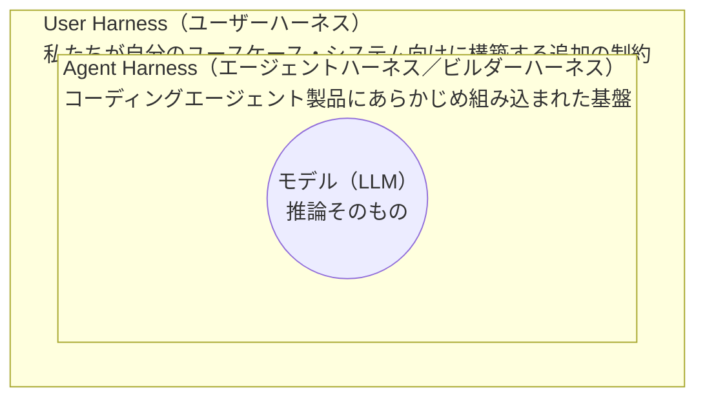
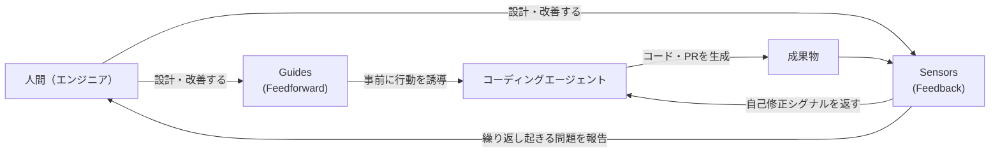
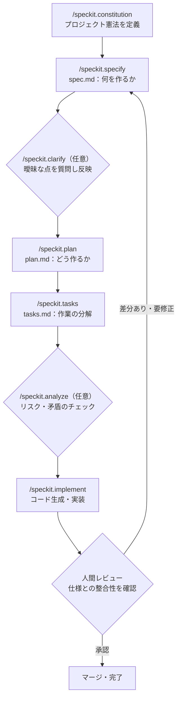
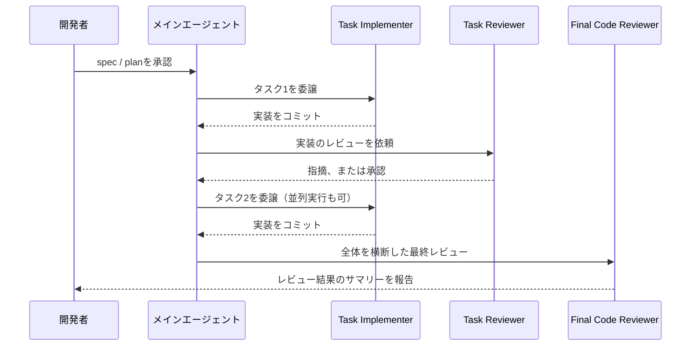
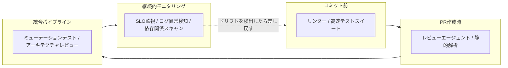

# Googleにおける Harness Engineering 実践ガイド
### ― AI仕様駆動開発(Spec-Driven Development)を支える「制御層」の設計 ―

> 対象読者：AIコーディングエージェント（Antigravity、Gemini CLI、Claude Code、Codex等）を業務で使い始めたばかりのエンジニア・QAエンジニア
> 前提知識：不要（用語はすべて本文中で定義します）

---

## この記事で学べること

- 「Harness Engineering（ハーネスエンジニアリング）」という新しい概念が、なぜ2026年に入って急速に注目されているのか
- ハーネスが具体的に何を指すのか（Guides／Sensors、Computational／Inferential）
- Harness EngineeringとSpec-Driven Development（仕様駆動開発）がどう補完し合うのか
- Googleが自社のエージェント製品（Google Antigravity／ADK／Agent Skills）でこの考え方をどう実装しているか
- 自分のプロジェクトで今日から始められる、ステップバイステップの実践手順

---

## 目次

1. [Harness Engineeringとは何か](#1)
2. [なぜ今ハーネスが必要なのか](#2)
3. [ハーネスの構造 ― Agent HarnessとUser Harness](#3)
4. [Feedforward（Guides）とFeedback（Sensors）](#4)
5. [ComputationalとInferential](#5)
6. [3つの統制次元](#6)
7. [Harness EngineeringとSpec-Driven Developmentの関係](#7)
8. [Googleにおける実践の全体像](#8)
9. [ステップバイステップ実践ガイド](#9)
10. [変更のライフサイクルにおける配置（Keep Quality Left）](#10)
11. [アンチパターンと落とし穴](#11)
12. [業界の広がり ― OpenAIとの比較](#12)
13. [実践チェックリスト](#13)
14. [まとめ](#14)
15. [参考文献](#15)

---

<a id="1"></a>
## 1. Harness Engineeringとは何か

### 1.1 「Agent = Model + Harness」という定式

2026年前半、AIコーディングエージェント界隈で急速に広まった等式があります。

```
Agent（エージェント） = Model（モデル） + Harness（ハーネス）
```

これは「エージェントの性能は、モデル単体の賢さだけでは決まらない。モデルの周りに何を組み立てるかで決まる」という考え方です。ハーネス（harness）はもともと「馬具」「安全ベルト」を意味する英単語で、ここでは「モデルを制御し、方向づけ、安全に走らせるための仕組み一式」を指す比喩として使われています。

具体的には、システムプロンプト、コード検索の仕組み、ツール呼び出しの設計、テストやリンター、レビューの手順、プロジェクトのルール文書など、**モデル本体を除いたエージェントを取り巻くすべて**がハーネスに含まれます。

### 1.2 用語の起源

「Harness Engineering」という言葉自体は、Terraformの生みの親として知られるMitchell Hashimotoが2026年初頭に提唱したとされています。その原則は「エージェントが同じ間違いを一度でも犯したら、二度と同じ間違いをしないよう、その場でハーネス側に修正を組み込む」というものでした。

この考え方はすぐにOpenAI、そしてソフトウェア工学の分野で長年発信を続けてきたMartin Fowler（Thoughtworks）のサイトへと広がります。特に、Thoughtworksのディスティングイッシュト・エンジニアであるBirgitta Böckelerが2026年4月に公開した記事「Harness engineering for coding agent users」は、この概念を体系立てて整理した基礎文献として、以後多くの実践者に引用されています。本ガイドの用語整理も、主にこの記事の枠組みに沿っています。

Googleの文脈では、この考え方は「Google Antigravity」というAIファーストの開発環境や、「Agent Development Kit (ADK)」、そして後述する「Agent Skills」というオープンな仕組みを通じて、非常に具体的なプロダクトの形に落とし込まれています。

---

<a id="2"></a>
## 2. なぜ今ハーネスが必要なのか

### 2.1 Vibe Codingの限界

「Vibe Coding（ヴァイブコーディング）」とは、仕様書を書かずに、その場の感覚（vibe）でAIに指示を出しながらコードを生成させていくスタイルを指す言葉です。プロトタイプや使い捨てスクリプトには向いていますが、次のような理由でプロダクションコードには向きません。

- コードベースが大きくなると、機能同士が干渉し始める
- 数週間後にコードを見返しても、「なぜこの実装にしたのか」という意思決定の記録が残っていない
- AIが生成した内容を「なんとなく動いているから」という理由で受け入れてしまう

このように、動くけれどもチームのアーキテクチャ基準やセキュリティ要件、非機能要件を満たさないコードは、しばしば「AI Slop（AIのゴミ、无秩序に生成された低品質コード）」と呼ばれます。

### 2.2 信頼のギャップ

人間のソフトウェアエンジニアがAI生成コードに対して抱く不信感には、構造的な理由があります。LLMは非決定的であり、チームやプロジェクト固有の文脈を知らず、そしてコードを「理解」しているのではなくトークンの並びとして扱っています。

Böckelerの整理によれば、優れたハーネスは次の2つを実現します。

1. エージェントが**最初の試みで**良い結果を出す確率を高める
2. 問題が人間の目に触れる前に、エージェント自身が**自己修正**できるフィードバックループを提供する

結果として、人間によるレビューの手間が減り、システム全体の品質が上がり、無駄なトークン消費も減らせる、というのがハーネスに投資する動機です。

---

<a id="3"></a>
## 3. ハーネスの構造 ― Agent HarnessとUser Harness

「ハーネス」という言葉は、どの立場で使うかによって指すものが変わります。Böckelerはこれを3つの同心円で説明しています。



- **モデル**：LLM本体。推論エンジンそのもの
- **Agent Harness（ビルダーハーネス）**：Google Antigravity、Claude Code、Codexといった製品自体に組み込まれているシステムプロンプト、コード取得の仕組み、オーケストレーション機構など
- **User Harness（ユーザーハーネス）**：私たちユーザーが、自分たちのリポジトリやユースケースに合わせて追加で組み立てる仕組み（ルール文書、Skill、リンター設定、CIチェックなど）

本ガイドで「Harness Engineering」と呼ぶ場合、主にこの一番外側の**User Harnessをどう設計するか**という実践を指しています。

---

<a id="4"></a>
## 4. Feedforward（Guides）とFeedback（Sensors）

ハーネスを構成する要素は、大きく2つの働きに分類できます。

- **Guides（フィードフォワード制御）**：エージェントが行動を起こす**前に**、望ましくない出力をあらかじめ予測して防ぐ仕組み。例：コーディング規約を書いたルール文書、Skill、テンプレート
- **Sensors（フィードバック制御）**：エージェントが行動を起こした**後に**観察し、自己修正を促す仕組み。例：リンターのエラーメッセージ、自動テスト、レビューエージェントの指摘

重要なのは、この2つはセットで機能するという点です。フィードバックだけに頼ると、エージェントは何度も同じ間違いを繰り返します。逆にフィードフォワードだけでは、そのルールが実際に守られているかどうかを確認する手段がありません。



人間の役割は、このループを**ステアリング（操縦）**することです。同じ問題が2回、3回と繰り返し発生したら、それはハーネス側（GuideかSensorのどちらか、あるいは両方）を改善すべきというサインになります。

---

<a id="5"></a>
## 5. ComputationalとInferential

Guide・Sensorには、それぞれ実行方式による違いもあります。

| 分類 | 特徴 | 実行主体 | 速度・コスト | 具体例 |
|---|---|---|---|---|
| **Computational（計算的）** | 決定的（deterministic）で高速 | CPU | ミリ秒〜秒単位、安価で信頼性が高い | テスト、リンター、型チェッカー、構造解析 |
| **Inferential（推論的）** | 意味的な判断、非決定的 | GPU/NPU（LLM自身） | 数秒〜数十秒、高コストで結果がばらつく | AIによるコードレビュー、"LLM as judge" |

Computationalなセンサーは、あらゆる変更のたびに安価に実行できる一方、意味的な妥当性までは判断できません。Inferentialなセンサーはコストが高く非決定的ですが、豊かな文脈判断ができ、強力なモデルと組み合わせることで信頼性を高められます。

Böckelerの記事にある整理表を、日本語でまとめ直すと次のようになります。

| 対象 | 方向 | 種別 | 実装例 |
|---|---|---|---|
| コーディング規約 | Feedforward | Inferential | AGENTS.md、Skill |
| 新規プロジェクトの初期化手順 | Feedforward | 両方 | 手順を書いたSkill＋ブートストラップスクリプト |
| コード変換（Codemod） | Feedforward | Computational | 自動リファクタリングツール |
| 構造テスト | Feedback | Computational | モジュール境界違反を検出するアーキテクチャテスト |
| レビュー手順 | Feedback | Inferential | レビュー用Skill |

---

<a id="6"></a>
## 6. 3つの統制次元

ハーネスが「何を」規律づけようとしているのかを整理すると、次の3つのカテゴリに分けられます。難易度も大きく異なります。

| 統制次元 | 保証したいこと | Feedforwardの例 | Feedbackの例 | 現在の成熟度 |
|---|---|---|---|---|
| **保守性ハーネス**<br/>(Maintainability) | コードの重複排除・複雑度・スタイルの一貫性 | AGENTS.md、Skill、Lint設定 | 静的解析、カバレッジ計測、循環的複雑度チェック | 高い（既存ツールが豊富） |
| **アーキテクチャ適合性ハーネス**<br/>(Architecture Fitness) | 性能・可観測性など非機能要件の維持 | 性能要件を書いたSkill、ロギング規約 | 性能テスト、ログ品質のレビュー | 中程度 |
| **振る舞いハーネス**<br/>(Behaviour) | 機能仕様どおりに動作しているか | 機能仕様（spec） | テストスイート、手動テスト、承認済みフィクスチャ | 低い（未解決の課題が多い） |

保守性は既存の静的解析ツールが流用できるため比較的簡単ですが、「振る舞いが仕様どおりか」を機械的に判定する方法は、業界全体でまだ発展途上です。AIが生成したテストスイートが本当に正しい振る舞いを検証できているかどうかを、AI自身に評価させることには限界があるためです。

---

<a id="7"></a>
## 7. Harness EngineeringとSpec-Driven Developmentの関係

ここまで見てきたハーネスの仕組みは、**何を規律づけるべきかという「基準」がなければ機能しません**。その基準を提供するのがSpec-Driven Development（SDD、仕様駆動開発）です。

SDDとは、コードを書く前に「何を作るのか」「誰のためか」「成功基準は何か」を明文化した**仕様書（spec）を主たる成果物**として扱う開発手法です。コードは、その仕様から導かれる派生物という位置づけになります。

- **SDDがなければ**：ハーネスが具体的に何を強制すればよいのか、参照する対象がありません
- **ハーネスがなければ**：仕様書を書いても、それが実際に守られているかを確認する手段がありません

つまり、**SDDが「規律の対象」を用意し、ハーネスが「規律を強制する仕組み」を提供する**という、補完関係にあります。この考え方は複数の実践者が独立に強調しており、Harness EngineeringはSpec-Driven Developmentという土台があって初めて実用的になる、という指摘は業界内でも共通認識になりつつあります。

---

<a id="8"></a>
## 8. Googleにおける実践の全体像

ここからは、Googleがこの理論をどう具体的なプロダクトに落とし込んでいるかを見ていきます。

### 8.1 Google Antigravity

Google Antigravityは、Google DeepMindが手がける「エージェントファースト」の開発環境です。エディタ・ターミナル・統合ブラウザを横断してエージェントを動かし、コード変更だけでなく、タスクリストやスクリーンショット、テスト出力といった「Artifacts（証跡）」を生成することで、人間が信頼して検証できるようにする設計思想を持っています。

ターミナル向けの軽量版として、Go言語で書かれたTUI（Terminal User Interface）である **Antigravity CLI（`agy`コマンド）** も提供されています。これはデスクトップ版のAntigravity 2.0と同じエージェントハーネスに接続しています。

### 8.2 Agent Skills（google/skills、Addy Osmaniのagent-skills）

「Skill」とは、エージェントに特定タスクの方法論やドメイン知識を教える、軽量で移植可能な仕組みです。`SKILL.md`というMarkdownファイル1枚（＋任意のスクリプトやテンプレート）で構成されており、次の3段階の「プログレッシブ・ディスクロージャー（段階的開示）」でコンテキストウィンドウを節約します。

1. **Discovery（発見）**：起動時、エージェントはすべてのSkillの名前と説明（メタデータ、数百トークン程度）だけを読み込む
2. **Activation（活性化）**：今のタスクがSkillの説明と一致したときだけ、`SKILL.md`本体（数千トークン程度）を読み込む
3. **Execution（実行）**：必要に応じて、Skillに同梱されたスクリプトや参考資料を読み込む

Googleは2026年のCloud Next（Google Cloudの年次イベント）で、BigQuery・Cloud Run・Firebase・GKE・Gemini APIなどに関する公式Skill集を **`github.com/google/skills`** としてオープンソース公開しました。これにより、エージェントは古い学習データに頼るのではなく、Google製品に関する最新かつ正確な知識を都度読み込めるようになります。

もう一つ重要な取り組みが、Google Chromeのエンジニアリングディレクターであり、フロントエンド分野で国際的に著名な開発者でもある **Addy Osmani** が個人で公開した **`addyosmani/agent-skills`** です。これはGoogle社内のエンジニアリング文化（設計ドキュメント→レビュー→実装→可読性レビュー→リリースチェックリストという一連の流れや、「Software Engineering at Google」に登場するHyrumの法則、テストピラミッド、Beyonceルール、トランクベース開発などの考え方）を、20〜24個の構造化されたSkillとして蒸留し、一般公開したものです。

- `DEFINE → PLAN → BUILD → VERIFY → REVIEW → SHIP` という開発ライフサイクル全体をカバー
- `/spec` `/plan` `/build` `/test` `/review` `/ship` などのスラッシュコマンドで各フェーズを起動
- 各Skillには「アンチ合理化テーブル」が含まれ、「テストは後で書きます」のようなエージェントの言い訳を先回りして封じる設計になっている
- Claude Code、Cursor、Gemini CLI、Windsurf、GitHub Copilot、Kiroなど複数のツールで動作する

### 8.3 Agent Development Kit（ADK）

ADKはGoogleが提供するAIエージェント構築フレームワークです。ADK自体にもSkillの仕組み（`SkillToolset`）が組み込まれており、L1メタデータ（約100トークン）→L2命令本体（5,000トークン未満）→L3リソース、という前述と同様の段階的開示パターンを採用しています。

---

<a id="9"></a>
## 9. ステップバイステップ実践ガイド

ここからは、実際にGoogle Antigravity（またはAntigravity CLI）を題材に、ゼロからハーネスを組み立てていく手順を追っていきます。他のエージェント（Gemini CLI、Claude Code等）でも考え方はそのまま応用できます。

### Step 1：エージェントハーネスを選ぶ

まず、どの製品の上に自分たちのUser Harnessを構築するかを決めます。Antigravityは「タスクのスループット（実装・テスト・検証を一気通貫でこなす力）」に強みがあり、Artifactsによる証跡管理を重視する現場に向いています。比較として、他の代表的な選択肢との違いを整理します。

| 製品 | 強み | 向いている場面 |
|---|---|---|
| **Google Antigravity** | エディタ・ターミナル・ブラウザ横断のオーケストレーションと検証、Artifactsによる証跡管理 | エンドツーエンドのタスク処理能力を重視したい場合 |
| **Cursor** | エディタ内での高速な反復（Tab補完、インライン編集） | エディタでの作業速度そのものを重視したい場合 |
| **Kiro** | 要件・設計・タスクを明示的に前面へ出したSpec-Driven Development、フック機構 | 最初から本番運用を見据えた仕様駆動を徹底したい場合 |

### Step 2：プロジェクトコンテキストをブートストラップする（Rules）

Antigravityには3階層のコンテキストがあります。

| 階層 | 保存場所（例） | 性質 |
|---|---|---|
| **Rules** | `.agents/rules/` | 常時有効。すべての会話で読み込まれる |
| **Skills** | `.agents/skills/` | オンデマンド。タスクが一致したときだけ読み込まれる |
| **Workflows** | `.agents/workflows/` | スラッシュコマンドで手動起動する定型プロセス |

既存のリポジトリ（READMEが古い、ドキュメントが更新されていないなど、よくある現場の状態）を対象にする場合、最初にやるべきことは「今のコードベースを理解したコンテキスト文書」を作ることです。`repo-research`のようなSkillを使い、次のように指示します。

```text
このリポジトリを調査して、プロジェクトコンテキスト文書を作成してください
```

これにより、技術スタック・ディレクトリ構成・データモデル・外部連携などをまとめた`.agents/rules/project-context.md`が生成されます。以後のすべての会話がこの文書を自動的に参照するようになります。

### Step 3：プロジェクト憲法（Constitution）を定義する

次に、「非交渉の原則（non-negotiable principles）」を定めた**プロジェクト憲法**を用意します。これは`.specify/memory/constitution.md`のようなファイルに保存され、後述するSDDサイクルの「計画」フェーズと「分析」フェーズで、この憲法に違反していないかが自動的にチェックされます。

```text
/speckit.constitution
このプロジェクトは1人の開発者が保守する小規模なエージェントです。
以下の3原則を設定してください：
(1) すべてのデータベース操作はツール定義ファイル経由で行い、
    コード内に生SQLやORMを書かない
(2) セッション状態は標準の仕組みだけを使い、独自の状態管理を作らない
(3) シンプルさを最優先し、既存のファイル・命名規則を厳密に踏襲する
```

憲法が空のテンプレートのままだと、計画・分析フェーズのチェックには「照合する対象が何もない」状態になってしまいます。プロジェクトの規模やチーム体制に応じて、原則の数や内容は調整してください（チーム開発であれば、コードレビュー・テスト規律・可観測性・APIバージョニングなどの原則を追加するのが一般的です）。

### Step 4：Skillsでフィードフォワードを設計する

Skillには大きく3つのカテゴリがあります。目的に応じて組み合わせます。

| カテゴリ | 役割 | 例 |
|---|---|---|
| **ドメイン知識** | 特定の技術・APIについての正確な最新知識を与える | `google/skills`（BigQuery、Cloud Run等） |
| **方法論** | 開発の進め方そのものを規律づける（Spec-Driven Developmentを強制する等） | `obra/superpowers` |
| **効率化** | トークン消費を抑え、やり取りを簡潔にする | `JuliusBrussee/caveman` |

Skillなしでエージェントに機能追加を依頼すると、次の2つのギャップが生まれがちです。

1. **プロセスのギャップ**：構造がないと、エージェントはいきなりコードを書き始めてしまう。小さな修正なら問題ありませんが、複数ファイル・複数エンドポイントに影響する機能では、実装がバラバラになり、決定の記録も残りません
2. **知識のギャップ**：学習データが古く、非推奨のAPIやスキーマを使ってしまう

方法論Skillが(1)を、ドメイン知識Skillが(2)を埋める役割を担います。

### Step 5：MCPで知識ギャップを埋める

MCP（Model Context Protocol）は、エージェントが外部システムと接続するための標準プロトコルです。BigQueryを例にすると、MCPサーバーに接続することで、エージェントは学習データにある古いスキーマ情報に頼るのではなく、**実際のテーブル定義をその場で確認しながら**仕様書やコードを生成できます。

```json
{
  "mcpServers": {
    "bigquery": {
      "serverUrl": "https://bigquery.googleapis.com/mcp",
      "transport": "http",
      "authProviderType": "google_credentials"
    }
  }
}
```

> 注意：MCPサーバーは既定で読み取り専用とは限りません。エージェントが生成したSQLをそのまま実行できてしまう場合があるため、本番環境ではIAMによるアクセス制御（読み取り専用の強制など）を必ず設定してください。

### Step 6：Spec-Driven Developmentサイクルを回す

いよいよ「仕様を書いてからコードを生成する」中心のサイクルに入ります。GoogleのAntigravity関連コードラボでは、GitHubの`spec-kit`をベースにした、次の8フェーズのパイプラインが紹介されています。



| フェーズ | コマンド | 生成物 | 目的 |
|---|---|---|---|
| 憲法策定 | `/speckit.constitution` | `constitution.md` | 非交渉の原則を定義（Step 3で実施済み） |
| 仕様化 | `/speckit.specify` | `spec.md` | 「何を作るか」をユーザー視点・技術非依存で記述 |
| 明確化（任意） | `/speckit.clarify` | 更新された`spec.md` | 仕様の曖昧な箇所を質問し、回答を仕様へ反映 |
| 計画 | `/speckit.plan` | `plan.md`、`data-model.md`、`research.md` | 「どう作るか」＝技術的アプローチ・データモデル・調査結果 |
| タスク分解 | `/speckit.tasks` | `tasks.md` | 計画を実行可能な最小単位に分割（優先度・ファイルパス付き） |
| 分析（任意） | `/speckit.analyze` | 分析レポート | タスクの抜け漏れ・矛盾・リスクを事前に検出 |
| 実装 | `/speckit.implement` | コード変更 | タスクを一つずつ実行し、チェックオフしていく |

ポイントは、`spec.md`が「何を」「誰のために」を記述し、実装の詳細（SQLテーブル名やAPI呼び出しの中身など）にはあえて触れない、という点です。実装の詳細は次の`plan.md`フェーズに委ねられます。各成果物はリポジトリに保存され、Gitでバージョン管理されるため、会話が途中で途切れても、あるいは後から見返しても、意思決定の記録が失われません。

### Step 7：Subagent駆動開発で実装する

大きめの機能では、単一のエージェントがすべてを順番にこなすのではなく、役割分担された複数のサブエージェントにタスクを委譲する「Subagent駆動開発」が推奨されています。



- **Task Implementer**：計画中の特定タスクを実装する
- **Task Reviewer**：実装をspecと照らし合わせてレビューする
- **Final Code Reviewer**：全変更を横断した最終確認を行う

サブエージェントは個別のコンテキストウィンドウで作業するため、メインスレッドが実行ログで埋め尽くされることを防ぎ、並列実行も可能になります。

### Step 8：フィードバックセンサーで検証する

実装が完了したら、Step 5で選んだComputational／Inferentialなセンサーを実際に走らせて検証します。

- **Computational**：型チェック、リンター、既存テストスイート、構造テスト（モジュール境界違反の検出など）
- **Inferential**：レビューエージェントによるコード品質判定、意味的な重複やオーバーエンジニアリングの検出

一つのコツとして、Fowlerの記事では「センサーの出力はLLMが読みやすい形にする」ことが推奨されています。たとえば、単に「エラー」とだけ表示するのではなく、「このリンタールールに違反しています。修正するには〇〇してください」という**自己修正の指示を含んだメッセージ**をエージェントに返すと、人間を介さずにその場で直させやすくなります。

### Step 9：ステアリングループでハーネスを継続的に改善する

Harness Engineeringは一度設定して終わりではなく、**継続的なエンジニアリング実践**です。同じ問題が繰り返し発生したら、それはハーネス（Guide・Sensorのどちらか、あるいは両方）を改善すべきサインです。

- 頻発するミスに気づいたら → 新しいルールをRulesやSkillに追記する（Feedforward強化）
- センサーがすり抜けを許した問題があれば → 新しい静的解析やテストを追加する（Feedback強化）
- モデルの性能が上がり、あるルールが不要になったと感じたら → そのハーネス部品を思い切って削除する

最後の点は見落とされがちですが重要です。ハーネスの各部品は「モデルの限界を補うため」に存在しているので、その限界がなくなればハーネスも軽くしてよい、という発想です。

---

<a id="10"></a>
## 10. 変更のライフサイクルにおける配置（Keep Quality Left）

すべてのチェックを同じタイミングで行う必要はありません。コストと速度に応じて、変更のライフサイクルに沿って配置します。



- **速く安いチェック**は、コミット前・統合前のできるだけ左（早い段階）で実行する
- **高価なチェック**（ミューテーションテスト、大局的なアーキテクチャレビューなど）は、統合後のパイプラインで、高速チェックの再実行と合わせて行う
- **継続的なドリフト検知**（デッドコード検出、テストカバレッジの質の分析、依存関係スキャナー）は、変更のたびにではなく、常時バックグラウンドで実行する

問題を見つけるタイミングが早いほど、修正コストは小さくなります。

---

<a id="11"></a>
## 11. アンチパターンと落とし穴

| アンチパターン | 何が起きるか | 対策 |
|---|---|---|
| 巨大な単一ルールファイル | すべてが「重要」だと書かれた結果、実質何も守られない。ファイルはすぐに陳腐化し、機械的な検証もできない | Rules／Skillを機能単位に分割し、常時読み込む部分は「地図」に留める |
| フィードバックのみに依存 | エージェントが同じ間違いを何度も繰り返す | 頻発する間違いはフィードフォワード（ルール）側に反映する |
| フィードフォワードのみに依存 | ルールを書いても、実際に守られているか確認できない | 対応するセンサー（テスト・リンター）を必ずセットで用意する |
| AI生成テストへの過信 | テストが「グリーン」であることと「仕様どおりの振る舞い」であることは別問題 | 承認済みフィクスチャ等のパターンを併用し、人間によるレビューを残す |
| ハーネスを一度作って放置する | モデルが進化しても、不要になった制約が残り続け、逆に足かせになる | ステアリングループを回し、定期的にハーネスを棚卸しする |
| プロジェクト憲法を空テンプレートのまま放置 | 計画・分析フェーズのチェックが「照合対象なし」で機能しなくなる | 最低限の原則（3つ程度でも可）を必ず明文化する |
| すべてを一つのエージェントに任せる | 大きなタスクで実行ログがコンテキストを埋め尽くす | Subagent駆動開発でタスクを分割・並列化する |

---

<a id="12"></a>
## 12. 業界の広がり ― OpenAIとの比較

Googleだけでなく、他社もそれぞれのやり方でハーネスの設計に取り組んでいます。比較のために、OpenAIがCodexエージェントを使い、人間がコードを一切手で書かずに約100万行規模のプロダクトを開発した事例を簡単に紹介します。

- 巨大な単一の指示ファイルではなく、短い案内文書（目次の役割）から、詳細なドキュメント群へのリンクをたどらせる構成にした
- レイヤードアーキテクチャを、独自のリンターと構造テストで機械的に強制した
- 「AIのゴミ（AI Slop）」を人間が毎週手作業で片付けるのは持続不可能だったため、方針をコードに落とし込み、定期的にドリフトを検出して自動でリファクタリングPRを送る仕組み（ゴミ収集になぞらえて「ガベージコレクション」と呼ばれる）を構築した

Googleのアプローチ（Antigravity＋spec-kit＋Agent Skills）と比べると、目指す方向性（仕様を先に固定する、ルールを構造化して機械的に検証する、継続的にドリフトを検出する）には共通点が多く、Harness Engineeringが特定のベンダーに依存しない、業界横断の実践知になりつつあることがうかがえます。

---

<a id="13"></a>
## 13. 実践チェックリスト

導入時に確認したい項目をまとめました。

- [ ] プロジェクトコンテキスト文書（Rules）を用意したか
- [ ] プロジェクト憲法（非交渉の原則）を最低限でも明文化したか
- [ ] 方法論・ドメイン知識・効率化の3種類のSkillをそれぞれ検討したか
- [ ] MCP等で「実際のデータ・スキーマ」にエージェントがアクセスできるようにしたか
- [ ] 仕様（spec）→計画（plan）→タスク分解→実装、というサイクルを踏んでいるか
- [ ] Computationalなセンサー（リンター・テスト・構造チェック）を用意したか
- [ ] Inferentialなセンサー（レビューエージェント）を、コストに見合う範囲で導入したか
- [ ] センサーのメッセージは、エージェントが自己修正しやすい形になっているか
- [ ] 変更のライフサイクル（コミット前／PR／CI／継続監視）に応じてチェックを分散させたか
- [ ] 同じ問題が繰り返し起きていないか、定期的にハーネスを棚卸ししているか

---

<a id="14"></a>
## 14. まとめ

Harness Engineeringは、「AIコーディングエージェントの性能はモデル単体では決まらず、その周りに何を構築するかで決まる」という認識から生まれた、比較的新しいエンジニアリング実践です。

- ハーネスは**Guides（事前の誘導）**と**Sensors（事後の自己修正）**の両輪で成り立つ
- 実行方式には**Computational（決定的）**と**Inferential（推論的）**の2種類があり、コストと信頼性のトレードオフがある
- 規律の対象は**保守性・アーキテクチャ適合性・振る舞い**の3次元に分けられ、難易度はこの順で上がっていく
- ハーネスが機能するには、規律の基準を与える**Spec-Driven Development**が土台として必要になる
- Googleは、この考え方をGoogle Antigravity、Agent Skills（`google/skills`、Addy Osmaniの`agent-skills`）、ADKといった具体的な製品・オープンソースの形に落とし込んでいる
- ハーネスは一度作って終わりではなく、**ステアリングループ**を回しながら継続的に改善し、モデルの進化に応じて不要な部分は削っていく実践である

まずは自分のリポジトリに、小さなプロジェクトコンテキストと2〜3個の原則を書いた憲法を用意するところから始めてみてください。

---

<a id="15"></a>
## 15. 参考文献

### Harness Engineeringの基礎理論

- Birgitta Böckeler（Thoughtworks）, "Harness engineering for coding agent users," martinfowler.com, 2026年4月2日
  https://martinfowler.com/articles/harness-engineering.html
- Loiane Groner, "Harness Engineering: The Missing Layer in Specs-Driven AI Development," 2026年4月14日
  https://loiane.com/2026/04/harness-engineering-missing-layer-specs-driven-ai-development/
- Nestr Blog, "What Is Harness Engineering? How the Newest AI Agent Discipline Maps to Organisational Governance"（Mitchell Hashimotoによる用語提唱の経緯を含む）
  https://nestr.io/blog/harness-engineering-ai-agents

### Googleでの実践

- Addy Osmani（Google Chrome Engineering Director）, "Agent Skills"
  https://addyosmani.com/blog/agent-skills/
- addyosmani/agent-skills（GitHubリポジトリ）
  https://github.com/addyosmani/agent-skills
- Google Cloud Blog, "Level Up Your Agents: Announcing Google's Official Skills Repository," 2026年4月22日
  https://cloud.google.com/blog/topics/developers-practitioners/level-up-your-agents-announcing-googles-official-skills-repository
- Google Developers Blog, "Developer's Guide to Building ADK Agents with Skills"
  https://developers.googleblog.com/developers-guide-to-building-adk-agents-with-skills/
- Google Codelabs, "Spec-Driven Development with Antigravity CLI — Structured Agent Workflows with Skills and MCP"
  https://codelabs.developers.google.com/sdd-agy-cli
- Google Codelabs, "Spec-Driven ADK Agent Development with Antigravity and Spec-kit"
  https://codelabs.developers.google.com/sdd-adk-antigravity
- Giovanni Galloro, "How Google Antigravity is changing spec-driven development," Google Cloud Community (Medium)
  https://medium.com/google-cloud/benefits-and-challenges-of-spec-driven-development-and-how-antigravity-is-changing-the-game-3343a6942330
- Yannipeng, "Mastering Multi-Agent Orchestration in Google Antigravity," Google Cloud Community (Medium), 2026年7月
  https://medium.com/google-cloud/mastering-multi-agent-orchestration-in-google-antigravity-2e73500d25fb
- GitHub, spec-kit（GitHub製のSpec-Driven Developmentフレームワーク）
  https://github.com/github/spec-kit
- Scalable Path, "Google Antigravity Review: DeepMind's Agent-First Bet on Faster, Safer Software Development"
  https://www.scalablepath.com/ai/google-antigravity-review

### 業界の広がり（比較参考）

- Ryan Lopopolo（OpenAI）, "Harness engineering: leveraging Codex in an agent-first world," openai.com, 2026年2月11日
  https://openai.com/index/harness-engineering/
- Addo Zhang, "From Idea to Release: A Complete Harness Engineering Practice," Medium, 2026年5月
  https://addozhang.medium.com/from-idea-to-release-a-complete-harness-engineering-practice-b995180e63e8

---

*本ガイドは2026年7月27日時点で参照可能な一次情報・技術記事をもとに作成しています。Google Antigravity、ADK、Agent Skills等は現在も活発に更新されているプロダクトのため、実際の導入にあたっては上記リンク先の最新版ドキュメントも合わせてご確認ください。*