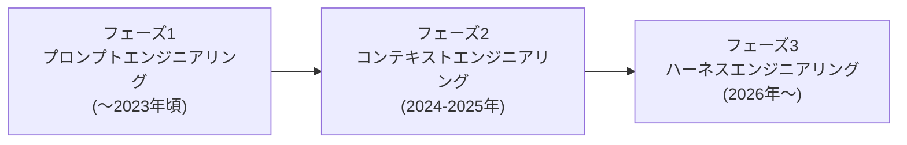
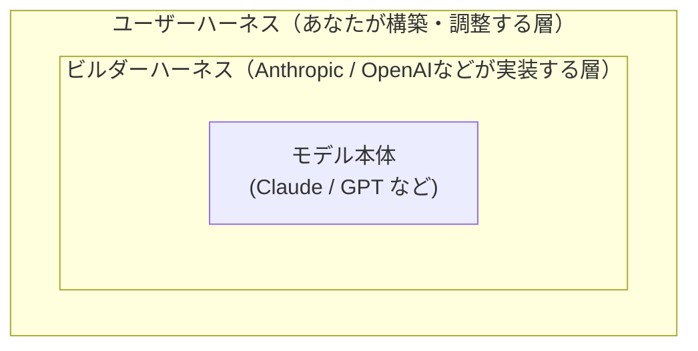
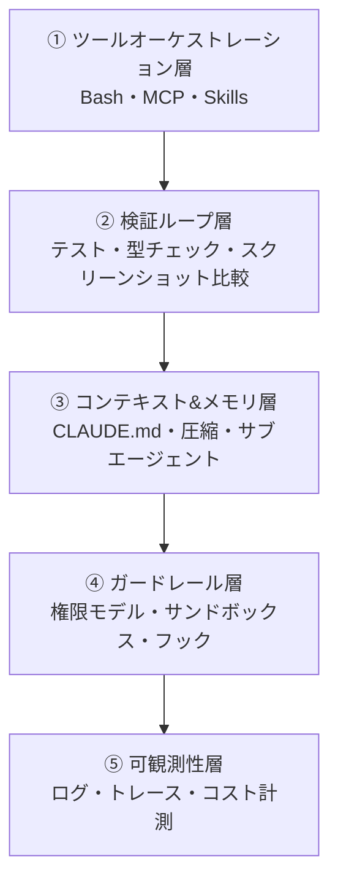
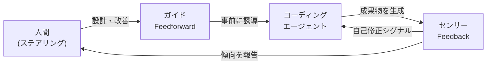
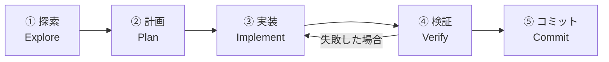
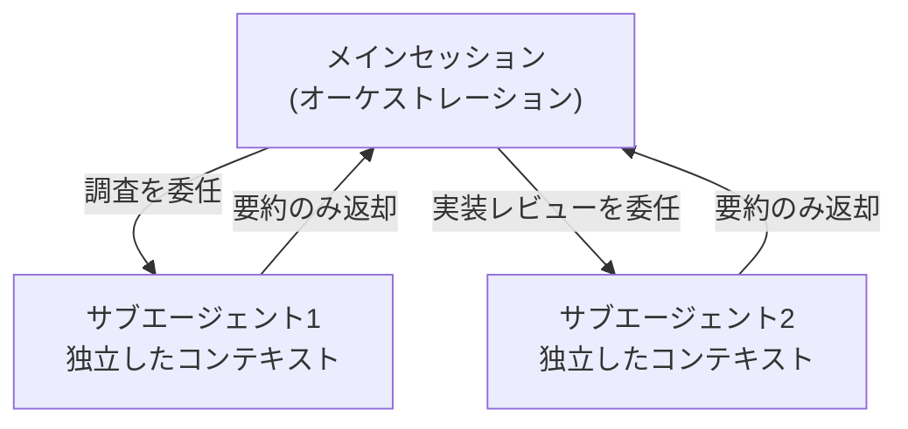
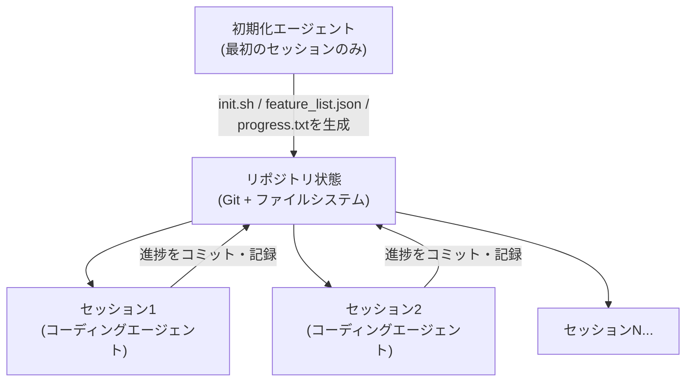
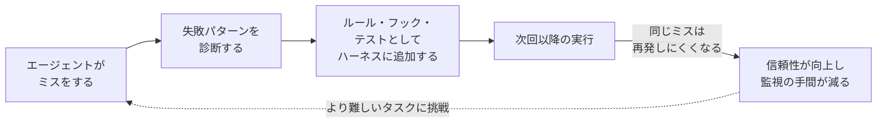

# ハーネスエンジニアリング入門ガイド
### ── AIコーディングエージェントを「信頼できる開発パートナー」に変えるステップバイステップ実践術

> 最終更新: 2026年7月26日
> 対象読者: Claude Code / Codex / Cursor などのAIコーディングエージェントを使い始めたばかりの初学者〜中級エンジニア
> 本ガイドは2026年7月26日時点の公開情報をもとに作成しています。Anthropic公式ドキュメント、Thoughtworks / martinfowler.com、OpenAI、および国際的に著名な独立系エンジニアの記事を調査し、各節の末尾に出典URLを明記しています。

---

## 目次

1. [ハーネスエンジニアリングとは何か](#chapter1)
2. [ハーネスの全体構造](#chapter2)
3. [フィードフォワードとフィードバック — 信頼を設計する](#chapter3)
4. [ステップバイステップ実践ガイド](#chapter4)
5. [よくある失敗パターンと対策](#chapter5)
6. [ハーネス可能性（Harnessability）と今後の展望](#chapter6)
7. [まとめ：良いハーネスの条件](#chapter7)
8. [参考文献・出典](#references)

---

<a id="chapter1"></a>
## 1. ハーネスエンジニアリングとは何か

### 1.1 定義：Agent = Model + Harness

AIコーディングエージェント（Claude Code、Codex、Cursorなど）を実際に使ってみると、同じモデルを使っているはずなのに「あるツールでは驚くほど賢く動くのに、別の環境では簡単なミスを繰り返す」という経験をすることがあります。この差を生んでいるのが、モデルそのものではなく「モデルの周りに組み立てられた仕組み」です。

この仕組み全体を指す言葉が **ハーネス（harness）** です。業界で広く使われるようになった定義はシンプルです。

> **エージェント = モデル + ハーネス**
> （モデル以外のすべて＝プロンプト、ツール、コンテキスト管理、フック、サンドボックス、検証ループ、観測基盤）が「ハーネス」である。

つまり、モデルの巧拙を議論するだけでなく、「モデルをどう縛り、どう導き、どう検証させるか」を設計する行為そのものが **ハーネスエンジニアリング** です。

### 1.2 なぜ2026年に注目されているのか（進化の3フェーズ）

AI活用エンジニアリングの重心は、ここ数年で次のように移り変わってきたと整理されています。



| フェーズ | 主な問い | 中心的な取り組み |
|---|---|---|
| プロンプトエンジニアリング | 「どう言葉を選べば良い出力が出るか」 | 指示文の言い回し、Few-shot例 |
| コンテキストエンジニアリング | 「モデルに何を読ませるべきか」 | 関連ファイル、プロジェクトルール、RAG、MCP |
| ハーネスエンジニアリング | 「エージェントをどう運用し、自律性・精度・制御をどう両立させるか」 | ツールオーケストレーション、検証ループ、ガードレール、可観測性 |

（出典: Faros AI “Harness Engineering: Making AI Coding Agents Work in 2026”）

### 1.3 用語の起源について

「harness engineering」という言葉の起点には複数の系譜があり、単一の発明者に一意に帰属させるのは難しい状況です。

- HashiCorp／Terraformの創業者である **Mitchell Hashimoto** は、自身のAI活用の実践原則として「エージェントが一度ミスをしたら、二度と同じミスをしないように仕組みを作り込む」という考え方を示しました。
- LangChainの **Viv Trivedy** は「Agent = Model + Harness」という定式化と、ハーネスを構成する要素を体系立てて図解した記事を公開し、多くの実務者がこの図式を引用しています。
- ThoughtworksのDistinguished Engineerである **Birgitta Böckeler** は、martinfowler.com上で「ガイド（フィードフォワード）」と「センサー（フィードバック）」からなる体系的なメンタルモデルを発表し、実務者コミュニティで最も引用される整理のひとつになっています。
- OpenAIのエンジニアリングチームは、100万行規模のプロダクトをゼロ行の手書きコードで構築した経験をもとに、この語を一般に広めました。

本ガイドは、これら複数の情報源の共通項を統合し、初学者にもわかりやすい形に再構成したものです。

（出典: Mitchell Hashimoto “My AI adoption journey” https://mitchellh.com/writing/my-ai-adoption-journey ／ LangChain Blog “The Anatomy of an Agent Harness” https://blog.langchain.com/the-anatomy-of-an-agent-harness/ ／ Birgitta Böckeler “Harness engineering for coding agent users” https://martinfowler.com/articles/harness-engineering.html ／ OpenAI “Harness engineering: leveraging Codex in an agent-first world” https://openai.com/index/harness-engineering/）

---

<a id="chapter2"></a>
## 2. ハーネスの全体構造

### 2.1 三層構造で理解する「ハーネス」

Böckelerは、「ハーネス」という言葉が指す範囲は文脈によって異なると指摘しています。モデルを中心に、内側から外側へ次の三層で捉えると混乱が減ります。



- **モデル本体**: 学習済みの言語モデルそのもの。
- **ビルダーハーネス**: Claude CodeやCodexといった製品自体に組み込まれた仕組み（システムプロンプト、標準ツール、オーケストレーションロジックなど）。
- **ユーザーハーネス**: 私たち利用者が `CLAUDE.md`、フック、スキル、サブエージェントなどを通じて外側から組み立てる層。**本ガイドが主に扱うのはこの最外層です。**

（出典: Böckeler, 前掲）

### 2.2 ハーネスを構成する8つの要素

複数の実務者の整理を統合すると、ユーザーハーネスは概ね次の要素から成り立ちます。

| 構成要素 | 役割 | 具体例 |
|---|---|---|
| システムプロンプト／`CLAUDE.md`／`AGENTS.md` | ガイド（事前に誘導） | プロジェクト規約、コマンド一覧、コーディングスタイル |
| ツール／MCPサーバー | 能力の拡張 | ファイルI/O、Bash実行、外部サービス連携（Notion、Figma、DBなど） |
| スキル (Skills) | 知識の段階的開示 | `SKILL.md`、必要な時だけ読み込まれる手順書 |
| サブエージェント | コンテキストの分離（ファイアウォール） | 調査専用・レビュー専用の独立セッション |
| フック (Hooks) | 決定論的な制御フロー | 編集後のLint自動実行、危険コマンドのブロック |
| 権限モデル／サンドボックス | ガードレール | 自動承認の範囲設定、ファイルシステム・ネットワークの隔離 |
| 検証ループ | センサー（事後にチェック） | テスト、型チェック、スクリーンショット比較 |
| 可観測性 | 監視・デバッグ | ログ、トレース、コスト・レイテンシ計測 |

（出典: Addy Osmani “Agent Harness Engineering” https://addyosmani.com/blog/agent-harness-engineering/ ／ HumanLayer “Skill Issue: Harness Engineering for Coding Agents” https://www.humanlayer.dev/blog/skill-issue-harness-engineering-for-coding-agents ／ Anthropic “Best practices for Claude Code” https://code.claude.com/docs/en/best-practices）

### 2.3 5層アーキテクチャで俯瞰する

上記の要素を「積み重なる層」として俯瞰すると、次のようなスタックとして理解できます。下の層ほど基盤的で、上の層ほど運用・信頼性に関わります。



エンジニアリングリーダーがハーネス投資の優先順位を判断する際は、まず「マージ済みPRあたりのコスト」「エージェント支援PRのマージまでの時間」「PRサイズに対するレビュー速度」「開発者あたりの計算コスト」といった既存メトリクスで現状を把握し、そのデータをもとにどの層に投資すべきかを決めることが推奨されています。

（出典: Faros AI “Harness Engineering: Making AI Coding Agents Work in 2026” https://www.faros.ai/blog/harness-engineering）

---

<a id="chapter3"></a>
## 3. フィードフォワードとフィードバック — 信頼を設計する

### 3.1 ガイド（Feedforward）とセンサー（Feedback）

Böckelerのモデルの核心は、ハーネスを「事前の誘導」と「事後の検知」という2つの制御方向に分けて考えることです。

- **ガイド（フィードフォワード制御）**: エージェントの挙動をあらかじめ予測し、行動する**前に**方向づける仕組み。最初の一回で良い結果が出る確率を高める。例: `CLAUDE.md`、アーキテクチャ文書、スキル、コーディング規約。
- **センサー（フィードバック制御）**: エージェントが行動した**後**に観測し、自己修正を助ける仕組み。特に「LLMがそのまま読める形式のシグナル」を返すセンサー（自己修正の指示を含むLintメッセージなど）は効果が高い。例: 静的解析、テスト結果、ログ、ブラウザでの実行結果。

ガイドだけに偏ると「ルールは決めたが、それが機能しているか誰も検証していない」状態になり、センサーだけに偏ると「同じミスを何度も繰り返し、そのたびに人間が指摘する」状態になります。両方が揃って初めて自己修正ループが成立します。



（出典: Böckeler, 前掲）

### 3.2 計算的 (Computational) vs 推論的 (Inferential)

ガイドとセンサーは、さらに「実行方式」でも分類できます。

| 種別 | 特徴 | 速度・コスト | 例 |
|---|---|---|---|
| 計算的 (Computational) | 決定論的、CPUで実行 | 数ミリ秒〜数秒。安価で信頼性が高い | テスト、Linter、型チェッカー、構造解析 |
| 推論的 (Inferential) | 意味的判断、GPU/NPUで実行 | 相対的に低速・高コスト。非決定論的 | AIによるコードレビュー、LLM-as-judge |

計算的な制御は構造的な問題（重複コード、循環的複雑度、テストカバレッジ不足、アーキテクチャの逸脱、スタイル違反）を安価かつ確実に検知できます。一方、意味的な重複や過剰設計、指示の誤解といった「高インパクトだが意味理解を要する問題」は、推論的な制御でも部分的にしか捕捉できません。人間が最初に何を求めているかを明確に伝えることが、依然として最も重要です。

（出典: Böckeler, 前掲）

### 3.3 品質を「左」に寄せる（Shift Left）

継続的インテグレーションの文脈と同様に、チェックはコストと速度に応じてライフサイクルの中に分散配置すべきです。

| タイミング | 想定されるチェック |
|---|---|
| コミット前・統合前 | 高速なLinter、基本的なテストスイート、簡易コードレビューエージェント |
| 統合後（パイプライン） | ミューテーションテスト、より広い視点でのコードレビュー |
| 継続的（変更のたびではなく常時） | デッドコード検知、テストカバレッジの質の分析、依存関係スキャナー |
| ランタイム | SLOの劣化検知、レスポンス品質の継続サンプリング、ログ異常検知 |

（出典: Böckeler, 前掲）

---

<a id="chapter4"></a>
## 4. ステップバイステップ実践ガイド

ここからは、実際にハーネスを組み立てる際の具体的な手順を、初学者でも着手しやすい順番で解説します。

### Step 1: `CLAUDE.md` / `AGENTS.md` を書く

Anthropic公式ガイドによれば、`CLAUDE.md`はエージェントが毎セッション開始時に自動的に読み込む特別なファイルで、コードだけからは推測できない永続的なコンテキストを与える最も費用対効果の高い設定ポイントです。`/init`コマンドでプロジェクト構造を解析した叩き台を生成し、そこから育てていくのが定石です。

**含めるべき内容と、含めるべきでない内容:**

| ✅ 含めるべき | ❌ 含めるべきでない |
|---|---|
| エージェントが推測できないBashコマンド | コードを読めば分かること |
| デフォルトと異なるコードスタイル規約 | 標準的な言語の慣習（既にモデルが知っている） |
| テスト手順と推奨テストランナー | 詳細なAPIドキュメント（リンクで十分） |
| リポジトリのお作法（ブランチ命名、PR規約） | 頻繁に変わる情報 |
| プロジェクト固有のアーキテクチャ上の決定 | 長い説明やチュートリアル |
| 開発環境特有の癖（必須環境変数など） | 「きれいなコードを書く」といった自明な心得 |

**サンプル構成（概念例）:**

```markdown
# コードスタイル
- ES Modules (import/export) を使用し、CommonJS (require) は使わない
- 可能な限り分割代入を使う

# ワークフロー
- 一連のコード変更が完了したら型チェックを実行する
- パフォーマンスのため、テストスイート全体ではなく単体テストを優先する
```

重要なポイントは「短く保つ」ことです。HumanLayerの実践では60行未満に抑えており、ETH Zurichの研究（138のエージェントファイルを検証）では、**AI自身が生成した`AGENTS.md`はむしろ性能を悪化させ、コストを20%以上増やす**という結果も報告されています。人間が丁寧に厳選して書いたファイルでも効果は平均4%程度にとどまり、指示が多すぎるとかえってエージェントは推論トークンを14〜22%多く消費し、手順も増えるのに解決率は上がりませんでした。「各行を削除したらエージェントがミスをするか？」を自問し、答えがNoなら削除する、という運用が推奨されています。

`CLAUDE.md`はホームフォルダ（全セッション共通）、プロジェクトルート（チーム共有、Git管理下）、`CLAUDE.local.md`（個人用、`.gitignore`対象）、親・子ディレクトリ（モノレポ向け）に配置でき、`@path/to/file`構文で他ファイルをインポートできます。

（出典: Anthropic “Best practices for Claude Code” https://code.claude.com/docs/en/best-practices ／ HumanLayer, 前掲 ／ ETH Zurich研究の言及: HumanLayer “Skill Issue” 内での引用）

### Step 2: 「探索 → 計画 → 実装 → 検証 → コミット」のワークフローを徹底する

Anthropicが推奨する基本ワークフローは、調査と計画を実装から明確に分離することです。いきなりコードを書かせると、間違った問題を解決してしまうリスクが高まります。



1. **探索**: Plan Mode（変更を加えずファイル閲覧・質問のみ行うモード）に入り、関連コードを読ませる。
2. **計画**: 実装計画を作成させる。エディタで直接編集して調整することも可能。
3. **実装**: Plan Modeを解除し、計画に沿って実装・テストを書かせる。
4. **検証**: テストを実行し、失敗があれば修正させる。
5. **コミット**: 説明的なコミットメッセージでコミットし、PRを作成させる。

ただし、スコープが明確で変更が小さい作業（タイポ修正、ログ追加、変数名変更など）にまで計画フェーズを強制するとオーバーヘッドになります。「diffを一文で説明できるなら計画は省略してよい」という目安が示されています。

（出典: Anthropic, 前掲）

### Step 3: 検証ループ（テスト・型チェック・スクリーンショット比較）を用意する

エージェントは「完了したように見える」ことを唯一の判断材料にして作業を止めます。実行可能なチェックを与えなければ、すべてのミスを人間が発見するまで気づかれません。合否を返す仕組みを用意すれば、エージェントは自分で実行し、結果を読み、合格するまで反復できます。

| 戦略 | Before（曖昧な指示） | After（検証可能な指示） |
|---|---|---|
| 検証基準を与える | 「メールアドレスを検証する関数を実装して」 | 「`validateEmail`関数を書いて。テストケース例: `user@example.com`はtrue、`invalid`はfalse。実装後にテストを実行して」 |
| UI変更を視覚的に検証する | 「ダッシュボードをもっと良く見せて」 | 「[スクリーンショット添付] このデザイン通りに実装して。結果のスクリーンショットを撮り元画像と比較し、差分をリストアップして修正して」 |
| 根本原因に対処する | 「ビルドが失敗している」 | 「ビルドが次のエラーで失敗する: [エラー内容]。修正しビルド成功を確認して。エラーを握りつぶさず根本原因に対処して」 |

チェックをどの程度厳格に「作業終了のゲート」にするかは、次の4段階から選べます。

- **1回のプロンプト内**: 同じメッセージ内でチェック実行と反復を依頼する。
- **セッションをまたぐ条件**: `/goal`条件として設定し、別の評価者が毎ターン後に再チェックする。
- **決定論的なゲート**: `Stop`フックでチェックをスクリプトとして実行し、合格するまでターン終了をブロックする（Claude Codeでは8回連続ブロックで強制終了）。
- **第三者による評価**: 検証用サブエージェントや、実装したエージェント自身ではなく新鮮なモデルに結果を疑わせる仕組み。

「成功したと主張する」のではなく「テスト出力・実行コマンド・スクリーンショットなどの証拠を提示させる」ことが、監視していないセッションでも結果を信頼するための鍵になります。

（出典: Anthropic, 前掲）

### Step 4: フックで決定論的なガードレールを敷く

`CLAUDE.md`の指示はあくまで「助言」であり、エージェントが読み飛ばす可能性があります。一方 **フック (Hooks)** は、特定のライフサイクルイベント（ツール呼び出し前後、コミット前、セッション開始時など）で自動実行されるスクリプトで、「毎回・例外なく」実行させたい処理に向いています。

代表的なユースケース:

- 編集のたびにLintと型チェックを走らせ、失敗のみをエージェントに伝える（成功時は無音、失敗時のみ詳細を返す「Silent on success, verbose on failure」という原則が推奨されています）
- `rm -rf`や`git push --force`など破壊的なコマンドをブロックする
- PR作成やmainブランチへのプッシュ前に承認を必須にする
- 保存時に自動フォーマットし、エージェントが空白調整にトークンを浪費しないようにする

**概念的なフック例（型チェック＋Lintを実行し、失敗時のみエラーを返す）:**

```bash
#!/bin/bash
set -e
OUTPUT=$(npm run typecheck && npm run lint 2>&1)
if [ $? -ne 0 ]; then
  echo "$OUTPUT" >&2
  exit 2   # 終了コード2でエージェントに再対応を促す
fi
# 成功時は何も出力しない（コンテキストを汚さない）
```

このように「合格時は完全に無音、失敗時のみ簡潔なエラーを返す」設計にすることで、フィードバックループがほぼ無料になり、問題が起きたときだけ確実にエージェントへ届きます。

（出典: HumanLayer, 前掲 ／ Anthropic, 前掲）

### Step 5: サブエージェントでコンテキストを保護する

コンテキストウィンドウは有限であり、埋まるほどモデルの性能は劣化します（いわゆる「コンテキスト・ロット」）。**サブエージェント** は独立したコンテキストウィンドウで動作し、要約された結果だけを親セッションに返す「コンテキスト・ファイアウォール」として機能します。



サブエージェントが向いているタスク:

- コードベース内の特定の定義・実装箇所を探す
- 特定の作業パターンを調査する
- サービス境界をまたぐリクエストの流れを追跡する
- 一般的なコード・ドキュメント・Web調査

Chroma社の「コンテキスト・ロット」研究では、18モデルを対象にしたneedle-in-a-haystackタスクで、コンテキストが長くなるほど性能が劣化し、質問と関連情報の意味的類似度が低いほど劣化が急になることが確認されています。サブエージェントは各タスクに「新鮮で高関連度な」コンテキストウィンドウを与えることで、この劣化を構造的に回避します。

また、実装を書いたセッション自身にレビューさせると評価が甘くなりがちなため、**「実装セッションとは別の、新鮮なコンテキストのサブエージェントにdiffをレビューさせる」** アドバーサリアル・レビューも推奨されています。レビュー担当には「何をチェックすべきか」を明確に絞って伝えないと、些細なスタイル指摘まで大量に報告し、過剰なリファクタリングを誘発するため注意が必要です。

（出典: HumanLayer, 前掲（Chroma研究への言及含む） ／ Anthropic, 前掲）

### Step 6: MCP とスキルで能力と知識を拡張する

- **MCPサーバー**: ファイルI/OやBash以外の能力（外部API、データベース、Issueトラッカーなど）をエージェントに追加する仕組み。接続したMCPサーバーのツール説明はシステムプロンプトに注入されるため、**信頼できないMCPサーバーには接続しないこと**が強く推奨されています。ツール説明文自体がプロンプトインジェクションの経路になり得るためです。
- **スキル (Skills)**: `SKILL.md`という形式で、必要なときだけ読み込まれる知識・手順書。すべてのツールやMCPを常時コンテキストに載せると性能が劣化するため、「プログレッシブ・ディスクロージャー（段階的開示）」の考え方でスキルとして切り出すのが定石です。

MCPサーバーが提供する機能が、既に学習データに含まれる有名なCLI（`gh`、`aws`、`gcloud`など）と重複している場合は、MCPサーバーを使わずCLIを直接使わせたほうが、コンテキスト効率と`grep`・`jq`などとの組み合わせやすさの点で有利になることが多いという報告もあります。

（出典: Anthropic, 前掲 ／ HumanLayer, 前掲）

### Step 7: 権限モデルとサンドボックスでリスクを制御する

デフォルトでは、ファイル書き込みやBash実行など、システムに影響する操作のたびに承認を求められます。安全ですが、10回目の承認あたりから人間は「レビューしているつもり」で実際には確認していない状態になりがちです。これを避けつつ安全性を保つ方法が3つあります。

| 方法 | 概要 |
|---|---|
| Autoモード | 別の分類モデルがコマンドをレビューし、スコープの逸脱・未知のインフラ操作・敵対的コンテンツ由来の操作のみをブロックする |
| 権限アローリスト | `npm run lint`や`git commit`など、安全と分かっている特定のコマンドのみを許可する |
| サンドボックス | OSレベルの隔離を有効にし、ファイルシステム・ネットワークアクセスを制限した上で自由に動かせるようにする |

（出典: Anthropic, 前掲）

### Step 8: 長時間実行タスクのためにステートを橋渡しする

数時間〜数日にまたがるタスクでは、エージェントは複数のコンテキストウィンドウ（＝複数の「シフト」）にまたがって作業することになります。新しいセッションは前のセッションの記憶を一切持たずに始まるため、Anthropicは「初期化エージェント」と「コーディングエージェント」の二段構成を提案しています。



- **初期化エージェント**: 最初のセッションで、`init.sh`（開発サーバー起動スクリプト）、進捗ログファイル、初期Gitコミット、そして「合格/不合格」を持つ機能一覧ファイルをセットアップする。この機能一覧は、AIが誤って上書き・削除しにくいJSON形式で管理するのが有効だと報告されています。
- **コーディングエージェント**: 以降の各セッションは、まず`pwd`で作業ディレクトリを確認し、Gitログと進捗ファイルを読んで状況を把握し、機能一覧から未完了の最優先項目を選んで着手し、セッション終了時にはGitコミットと進捗更新を残す、という定型手順で「引き継ぎ」を行う。

この仕組みで解決される代表的な失敗パターンは次の通りです。

| 問題 | 初期化エージェントの対策 | コーディングエージェントの対策 |
|---|---|---|
| プロジェクト全体の完成を早合点する | 構造化された機能一覧ファイルを用意する | セッション開始時に機能一覧を読み、1つだけ選んで着手する |
| バグや未文書化の進捗を残したまま終える | 初期Gitリポジトリと進捗メモファイルを用意する | 進捗メモとGitログを読んでから開始し、基本テストで未文書化のバグを検知する。終了時にコミットと進捗更新を残す |
| 機能を時期尚早に「完了」と判定する | 機能一覧ファイルを用意する | すべての機能を自己検証し、慎重にテストしてから「合格」とマークする |
| アプリの起動方法を調べるのに時間を使う | 開発サーバーを起動する`init.sh`を書く | セッション開始時に`init.sh`を読む |

さらに、機能が「動いているように見えて実際は動いていない」問題を防ぐため、ブラウザ自動化ツール（PuppeteerなどのMCP）を使い、人間のユーザーとして実際に操作するようなエンドツーエンド検証を明示的に指示することが効果的だと報告されています。

（出典: Anthropic “Effective harnesses for long-running agents” https://www.anthropic.com/engineering/effective-harnesses-for-long-running-agents）

### Step 9: 「ラチェット原則」で継続的にハーネスを改善する

ハーネスは一度作って終わりの設定ファイルではなく、生き続けるシステムです。最も重要な習慣は、**エージェントのミスを「一過性の失敗談」ではなく「恒久的なシグナル」として扱うこと** です。



例えば、コメントアウトされたテストを含んだPRを誤ってマージしてしまったら、それは単なる不運ではなく入力データです。次のバージョンの`AGENTS.md`には「テストをコメントアウトしない。削除するか修正すること」という一文を足し、pre-commitフックには該当パターンを検知するgrepを足し、レビュー用サブエージェントにはコメントアウトされたテストをブロッカーとして検知させる、というように三重に手当てします。

- 制約を追加するのは、**実際に起きた失敗を見たときだけ**。
- 制約を取り除くのは、**モデルの能力向上によってその制約が不要になったと確認できたときだけ**。
- 良い`AGENTS.md`のすべての行は、**特定の過去の失敗にたどり着けるべき**。

裏を返せば、モデルが賢くなるとハーネスが不要になっていく、という単純な話ではありません。Anthropicのレポートが指摘するように「ハーネスの各構成要素は、モデルが単独ではできないことについての“仮説”を体現している」ため、モデルが進化すればある仮説（＝ある種の足場）は不要になりますが、同時にモデルが新しくできるようになった作業には、また新しい種類の足場が必要になります。ハーネスの複雑さは「縮む」のではなく「移動する」と表現されています。

（出典: Addy Osmani, 前掲）

### Step 10: 並列化してスケールする

一人のエンジニアと一つのエージェントの会話、という単位に慣れたら、次はスケールさせる番です。

| 手法 | 概要 |
|---|---|
| Worktree並列実行 | 複数のCLIセッションを独立したGitチェックアウトで実行し、編集の衝突を避ける |
| 非対話モード (`claude -p`) | CI、pre-commitフック、自動化スクリプトにエージェントを組み込む |
| Writer/Reviewerパターン | あるセッションに実装させ、別の新鮮なコンテキストのセッションにレビューさせ、指摘を実装セッションに戻す |
| ファンアウト | 大規模移行などで、タスクリストをスクリプトでループしながら`claude -p`を大量に呼び出し、`--allowedTools`で権限を絞って並列実行する |

Writer/Reviewerパターンが有効なのは、実装したセッション自身がレビューすると自分のコードにバイアスがかかりやすい一方、新しいセッションはその実装に至った思考過程を持たず、結果と基準だけを見て評価できるためです。

（出典: Anthropic, 前掲）

---

<a id="chapter5"></a>
## 5. よくある失敗パターンと対策

初学者が最初につまずきやすいパターンと、その対処法を一覧化します。

| 失敗パターン | 症状 | 対策 |
|---|---|---|
| キッチンシンク・セッション | 1つのタスクから始めたのに無関係な質問を挟み、また元のタスクに戻る。コンテキストが無関係な情報で埋まる | 無関係なタスクの間は`/clear`でコンテキストをリセットする |
| 堂々巡りの修正 | 同じ問題を2回、3回と指摘しても直らない。コンテキストが失敗した試行錯誤で汚染されている | 2回修正しても直らなければ`/clear`し、学んだことを反映したより具体的な初期プロンプトで再開する |
| 肥大化した`CLAUDE.md` | ファイルが長すぎて、重要なルールがノイズに埋もれてエージェントに無視される | 容赦なく刈り込む。指示がなくてもエージェントが正しく動くなら削除するかフックに置き換える |
| 「信頼してから検証する」の逆転 | もっともらしく見える実装がエッジケースを処理できていない | 常にテスト・スクリプト・スクリーンショットなどの検証手段を用意する。検証できないものは出荷しない |
| 際限のない探索 | スコープを絞らずに「調査して」と指示し、何百ものファイルを読んでコンテキストを埋め尽くす | 調査範囲を狭く指定するか、サブエージェントを使ってメインコンテキストを汚染しないようにする |

（出典: Anthropic, 前掲）

---

<a id="chapter6"></a>
## 6. ハーネス可能性（Harnessability）と今後の展望

### 6.1 すべてのコードベースが同じように「ハーネス可能」なわけではない

強い静的型付け言語のコードベースには型チェックというセンサーが自然に備わっており、明確なモジュール境界はアーキテクチャ制約ルールを可能にし、Springのようなフレームワークはエージェントが気にする必要のない詳細を抽象化してくれます。これらの性質がなければ、そもそも構築できる制御の種類が限られてしまいます。Thoughtworksの同僚であるNed Letcherはこれを **「アンビエント・アフォーダンス」**（環境そのものがエージェントにとって読み解きやすく、扱いやすい構造的性質）と呼んでいます。

グリーンフィールド（新規開発）のチームは最初からハーネス可能性を技術選定・設計の段階で織り込めますが、技術的負債を多く抱えたレガシーなチームは「ハーネスが最も必要な場所ほど、構築が最も難しい」というジレンマに直面します。

### 6.2 ハーネステンプレートという発想

多くの企業では、業務APIサービス・イベント処理サービス・データダッシュボードのように、少数のトポロジー（サービス構成の型）が全体の大部分をカバーしています。これらをあらかじめ「ハーネステンプレート」として整備し、ガイドとセンサーのセットをトポロジーごとにインスタンス化できるようにする、という発想が提案されています。これは英国のサイバネティクス学者Ross Ashbyの **「Ashbyの法則（必要多様性の法則）」**（制御装置は制御対象と同等以上の多様性を持たなければならない、逆に言えば対象を絞ることで包括的なハーネスを実現しやすくなる）とも結び付けて説明されています。

### 6.3 まだ答えが出ていない領域：振る舞いハーネス

構造的な保守性（重複、複雑度、カバレッジ）を扱う「保守性ハーネス」や、性能・可観測性要件を扱う「アーキテクチャ適合性ハーネス」に比べ、**「アプリケーションが仕様通りに機能的に振る舞っているか」を保証する“振る舞いハーネス”は依然として未解決の課題**とされています。現状の主流は、機能仕様をフィードフォワードとして与え、AIが生成したテストスイートが緑（合格）であること・カバレッジ・場合によってはミューテーションテストをフィードバックとして確認し、最後に人手のテストで補う、という組み合わせです。しかしAI生成テストへの信頼はまだ十分ではなく、「承認済みフィクスチャ（approved fixtures）」パターンなど部分的な解決策が模索されている段階です。

### 6.4 モデルとハーネスの共進化

もう一つの重要な観測は、コーディングエージェント製品は「ハーネスを内側に組み込んだ状態」で事後学習（post-training）されているという点です。そのため、あるモデルが特定のハーネス内で学習された挙動に最適化されすぎる（オーバーフィットする）ことがあり、同じモデルを別のハーネスに載せ替えるとベンチマーク順位が大きく変わる、という報告があります。これは「新しいモデルを待てば全て解決する」という考え方に対する反例であり、**ハーネス側の設計にも独立した価値がある**ことを示しています。

（出典: Böckeler, 前掲 ／ Addy Osmani, 前掲 ／ LangChain Blog, 前掲）

---

<a id="chapter7"></a>
## 7. まとめ：良いハーネスの条件

人間のエンジニアは、コードベースに対する暗黙の「ハーネス」を自然に持っています。長年の経験で身につけた規約、300行の関数を見たときの美的な違和感、「うちのチームではそうしない」という直感、そしてコミットに自分の名前が載るという社会的な責任感です。エージェントにはこれらが一切ありません。どの規約が本質的でどれが単なる慣習なのか分からず、組織の記憶も持ちません。

ハーネスは、こうした人間の開発経験が暗黙のうちに担っていたものを、明示的で検証可能な形に外部化する試みです。ただし、それにも限界があります。良いハーネスの目的は、人間の入力を完全にゼロにすることではなく、**人間の判断が最も重要な場所にその入力を集中させること**にあります。

最後に、実践上の要点を振り返ります。

- ハーネスは「モデル以外のすべて」であり、あなた自身が設計・改善できる資産である。
- ガイド（事前の誘導）とセンサー（事後の検知）の両輪を揃えて初めて自己修正ループが機能する。
- `CLAUDE.md`/`AGENTS.md`は短く、実際の失敗から逆算して書く。
- 検証可能なチェック（テスト・型チェック・スクリーンショット）を必ず用意する。
- フックは「毎回・例外なく」実行させたい制御に、サブエージェントはコンテキスト保護に使う。
- 一つのミスを見つけたら、それを二度と起きないようにする恒久的な仕組みに変える（ラチェット原則）。
- ハーネスは一度作って終わりではなく、モデルの進化に合わせて絶えず作り直されていくものである。

（出典: Böckeler, 前掲 ／ Addy Osmani, 前掲）

---

<a id="references"></a>
## 8. 参考文献・出典

本ガイドは以下の一次情報源をもとに、2026年7月時点の情報として作成しました。

| 出典 | 著者・組織 | タイトル | URL |
|---|---|---|---|
| Anthropic (公式) | Anthropic Engineering | Best practices for Claude Code | https://code.claude.com/docs/en/best-practices |
| Anthropic (公式) | Justin Young ほか, Anthropic | Effective harnesses for long-running agents | https://www.anthropic.com/engineering/effective-harnesses-for-long-running-agents |
| Anthropic (公式・旧版) | Anthropic Engineering | Claude Code: Best practices for agentic coding | https://www.anthropic.com/engineering/claude-code-best-practices |
| Thoughtworks / martinfowler.com | Birgitta Böckeler | Harness engineering for coding agent users | https://martinfowler.com/articles/harness-engineering.html |
| Thoughtworks / martinfowler.com | Birgitta Böckeler | Maintainability sensors for coding agents（続編） | https://martinfowler.com/articles/sensors-for-coding-agents.html |
| OpenAI (公式) | Ryan Lopopolo ほか, OpenAI | Harness engineering: leveraging Codex in an agent-first world | https://openai.com/index/harness-engineering/ |
| 個人ブログ（著名エンジニア） | Addy Osmani（元Google Chrome/AI DevXディレクター） | Agent Harness Engineering | https://addyosmani.com/blog/agent-harness-engineering/ |
| 個人ブログ（著名エンジニア） | Simon Willison（Django共同開発者） | Designing agentic loops | https://simonwillison.net/2025/Sep/30/designing-agentic-loops/ |
| 企業ブログ | LangChain (Viv Trivedy) | The Anatomy of an Agent Harness | https://blog.langchain.com/the-anatomy-of-an-agent-harness/ |
| 企業ブログ | HumanLayer (Kyle) | Skill Issue: Harness Engineering for Coding Agents | https://www.humanlayer.dev/blog/skill-issue-harness-engineering-for-coding-agents |
| 個人ブログ | Mitchell Hashimoto（HashiCorp/Terraform創業者） | My AI adoption journey | https://mitchellh.com/writing/my-ai-adoption-journey |
| 業界メディア | Thoughtworks Technology Podcast | What is harness engineering? | https://www.thoughtworks.com/insights/podcasts/technology-podcasts/what-harness-engineering |
| 業界メディア | Faros AI | Harness Engineering: Making AI Coding Agents Work in 2026 | https://www.faros.ai/blog/harness-engineering |
| 企業ブログ | Stripe Engineering | Minions: Stripe's one-shot end-to-end coding agents | https://stripe.dev/blog/minions-stripes-one-shot-end-to-end-coding-agents |

> **注記**: 各情報源の内容は要約・言い換えのうえ本ガイドに統合しており、原文からの逐語的な引用は最小限（15語未満）に留めています。より詳細な一次情報や図版はリンク先の原文を直接ご参照ください。また、業界の議論は現在進行形で発展しており、特に第6章で触れた「振る舞いハーネス」や「ハーネステンプレート」は未解決の論点として各情報源でも明言されています。
