# Hermes Agent ベストプラクティスガイド ― 中級者から上級者向け

> Nous Research製オープンソース自己改善型AIエージェント「Hermes Agent」を、実運用レベルで使いこなすためのステップバイステップ解説。
> 対象読者: CLI/エージェント系ツールの利用経験があり、メモリ設計・スキル運用・マルチエージェント委任・本番セキュリティまで踏み込みたい中級〜上級エンジニア。
> 情報基準日: 2026年8月2日（Hermes Agent公式ドキュメント / GitHubリポジトリの内容に基づく）

---

## 目次

1. [Hermes Agentとは何か](#1-hermes-agentとは何か)
2. [アーキテクチャ概観](#2-アーキテクチャ概観)
3. [セットアップとプロファイル運用のベストプラクティス](#3-セットアップとプロファイル運用のベストプラクティス)
4. [メモリシステム設計のベストプラクティス](#4-メモリシステム設計のベストプラクティス)
5. [スキルシステムとProgressive Disclosure](#5-スキルシステムとprogressive-disclosure)
6. [Curatorによるスキルの自動メンテナンス](#6-curatorによるスキルの自動メンテナンス)
7. [コンテキストファイル戦略（AGENTS.md / SOUL.md）](#7-コンテキストファイル戦略agentsmd--soulmd)
8. [サブエージェント委任（Delegation）](#8-サブエージェント委任delegation)
9. [execute_codeによるトークン最適化](#9-execute_codeによるトークン最適化)
10. [Persistent Goals（/goal）― Ralph loopの実践](#10-persistent-goalsgoal-ralph-loopの実践)
11. [Cron自動化のベストプラクティス](#11-cron自動化のベストプラクティス)
12. [MCP統合のベストプラクティス](#12-mcp統合のベストプラクティス)
13. [本番運用のセキュリティ・チェックリスト](#13-本番運用のセキュリティチェックリスト)
14. [コスト最適化とプロンプトキャッシュ](#14-コスト最適化とプロンプトキャッシュ)
15. [トラブルシューティング](#15-トラブルシューティング)
16. [ベストプラクティス総括チェックリスト](#16-ベストプラクティス総括チェックリスト)
17. [参考文献・出典](#17-参考文献出典)

---

## 1. Hermes Agentとは何か

Hermes Agentは、AI基盤研究企業Nous Research（Hermesモデルシリーズ、分散学習フレームワークDisTrO、分散学習ネットワークPsycheなどで知られる）が開発したMITライセンスのオープンソース自律AIエージェントである。GitHubリポジトリ`NousResearch/hermes-agent`は2026年8月時点で20万スターを超える規模に成長しており、公式には「The agent that grows with you（あなたと共に成長するエージェント）」と位置づけられている。

Hermes Agentが他のコーディング特化エージェント（IDE常駐型のコパイロット）や単発のチャットボットラッパーと一線を画す最大の特徴は、**組み込みの学習ループ**を持つ点にある。

- タスク実行の経験から**スキル（procedural memory）**を自律生成する
- 生成したスキルを使用しながら自己改善する
- 過去の会話をFTS5全文検索で横断的に参照する
- ユーザーの好み・環境情報を**メモリ（MEMORY.md / USER.md）**として蓄積する

ローカルのlocalバックエンドはもちろん、Docker・SSH・Singularity・Daytona・Modal・Vercel Sandboxなど6種類のターミナルバックエンドで動作し、$5程度のVPSからGPUクラスタ、アイドル時にほぼ課金されないサーバーレス基盤まで、実行環境を選ばない。Telegram・Discord・Slack・WhatsApp・Signal・Matrix・Mattermost・Email・SMSなど20以上のメッセージングプラットフォームに単一のゲートウェイプロセスから同時接続できる。

### 1.1 業界での位置づけ

2026年前半、Peter Steinberger氏が公開したエージェント「OpenClaw」が爆発的に普及したことを受け、その数週間後にNous ResearchがHermesを競合として投入した経緯がある。両者は設計思想が異なり、OpenClawが多チャンネル対応の中央ゲートウェイ型アーキテクチャを志向するのに対し、Hermesは自己改善ループ（スキル自動生成・メモリ蓄積）に重きを置く。2026年5月時点でOpenRouter上の1日あたりトークン生成量でHermesがOpenClawを上回り首位に立ったと報じられている。同年7月にはNous ResearchがRobot Ventures主導・USV参加のラウンドで評価額15億ドル規模の資金調達を進めていると報じられた。

OpenClawからの移行者向けに`hermes claw migrate`コマンドが用意されており、SOUL.md相当のペルソナファイル、メモリ、スキル、コマンド許可リスト、メッセージング設定、APIキーなどを自動的に取り込める。

### 1.2 全体像を一目で

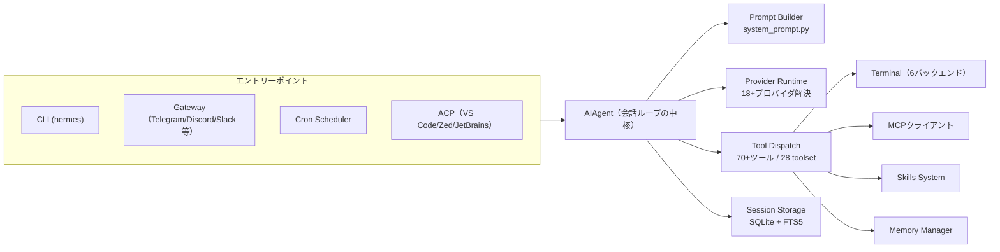

この後の章では、この図の各コンポーネントを実務でどう設定・運用すべきかを順に掘り下げる。

---

## 2. アーキテクチャ概観

### 2.1 ディレクトリ構成の要点

Hermes Agentのソースツリーは大きく分けて次の要素で構成される（実装を読む・パッチを当てる際の道しるべとして把握しておくとよい）。

- `run_agent.py` ― `AIAgent`本体。プロバイダ選択・プロンプト構築・ツール実行・リトライ・フォールバック・圧縮・永続化を司る会話ループ
- `cli.py` ― `HermesCLI`、対話型ターミナルUI
- `agent/` ― プロンプト組み立て（`prompt_builder.py`）、コンテキスト圧縮（`context_compressor.py`）、Anthropicプロンプトキャッシュ（`prompt_caching.py`）など
- `hermes_cli/` ― サブコマンド群、認証・プロバイダ解決、プラグインマネージャ
- `tools/` ― ツール実装。1ファイル1ツールが原則で、インポート時に`registry.register()`を呼んで自己登録する
- `gateway/` ― メッセージングゲートウェイ本体。20種のプラットフォームアダプタを収録
- `cron/` ― スケジューラ
- `skills/` と `optional-skills/` ― バンドル済みスキルと任意インストール可能な公式スキル
- `tests/` ― 約1,250ファイル・25,000件規模のpytestスイート

### 2.2 データフロー

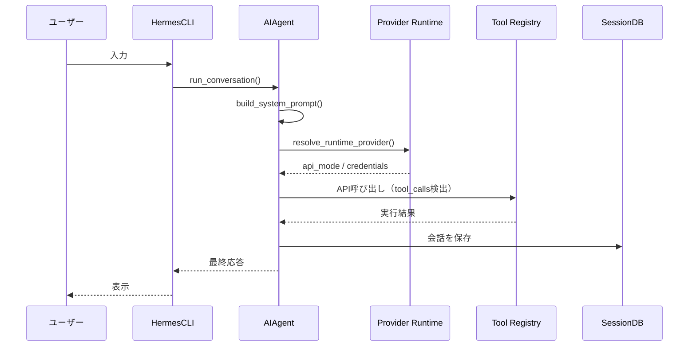

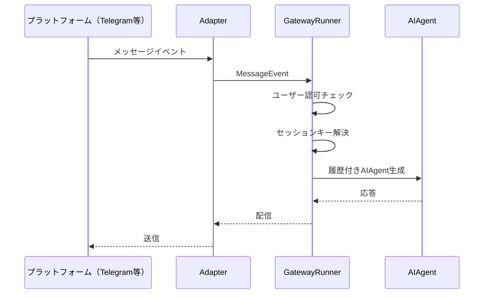

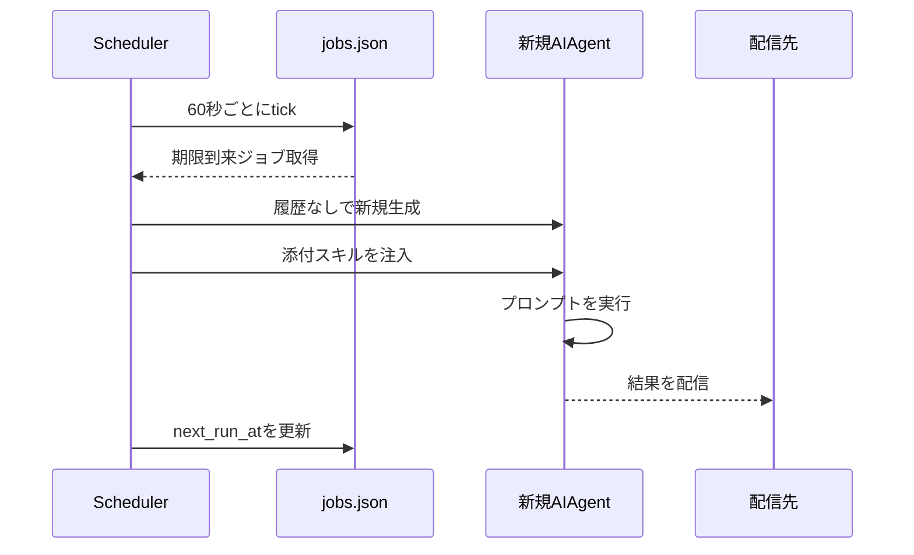

### 2.3 設計原則

公式ドキュメントが明示する設計原則は、カスタマイズや障害対応を行う際の判断基準として有用である。

| 原則 | 実務上の意味 |
|---|---|
| プロンプトの安定性 | システムプロンプトはセッション中に変化しない。`/model`など明示的な操作を除き、キャッシュを破壊する変更は起きない |
| 実行の可観測性 | すべてのツール呼び出しはコールバック経由でユーザーに可視化される（CLIのスピナー、ゲートウェイのチャットメッセージ） |
| 中断可能性 | API呼び出しやツール実行はユーザー入力やシグナルでいつでも中断できる |
| プラットフォーム非依存のコア | `AIAgent`は1クラスでCLI・ゲートウェイ・ACP・バッチ・APIサーバーを兼ねる。差異はエントリーポイント側に閉じ込める |
| 疎結合 | MCP・プラグイン・メモリプロバイダ・RL環境などのオプション機構はレジストリパターンと`check_fn`ゲーティングで実現し、ハード依存にしない |
| プロファイル分離 | `hermes -p <name>`でプロファイルごとにHERMES_HOME・設定・メモリ・セッション・ゲートウェイPIDが独立し、複数プロファイルを同時実行できる |

**実務Tips**: 個人用と業務用、あるいは検証用と本番用のエージェントを分けたい場合は、複数の`.hermes`ディレクトリを作るのではなく`hermes profile create <name>`でプロファイルを切ることを推奨する。プロファイルごとにスキル・メモリ・cronジョブが完全に独立するため、実験的な設定変更が本番プロファイルに波及しない。

---

## 3. セットアップとプロファイル運用のベストプラクティス

### 3.1 インストール

Linux / macOS / WSL2 / Termux（Android）は以下のワンライナーで導入できる。

```bash
curl -fsSL https://hermes-agent.nousresearch.com/install.sh | bash
```

Windowsはネイティブ対応しており、PowerShellで以下を実行する（WSL2を経由する必要はない）。

```powershell
iex (irm https://hermes-agent.nousresearch.com/install.ps1)
```

インストーラはuv・Python 3.11・Node.js・ripgrep・ffmpeg・ポータブルGit Bash（MinGit）まで自動導入する。既存のGitがあればそれを優先利用し、システムのGit環境には干渉しない。

### 3.2 モデルプロバイダの選定

Nous Portal・OpenRouter・OpenAI・Anthropic・Google・その他OpenAI互換エンドポイントまで対応する。プロバイダごとに個別のAPIキーを管理したくない場合は、次の1コマンドでNous Portal経由のOAuthとTool Gateway（Web検索・画像生成・TTS・クラウドブラウザ）を一括有効化できる。

```bash
hermes setup --portal
```

モデルの切り替えはセッション中いつでも`/model`で可能だが、後述するプロンプトキャッシュの観点から、切り替え頻度は最小限にとどめるのがベストプラクティスである。

### 3.3 プロファイル分離とバックアップ

- 検証用スキルをバンドルなしのクリーンな状態で試したい場合は`hermes profile create research --no-skills`で空のプロファイルを作る
- 既存プロファイルをバンドルスキルなしに切り替えたい場合は`hermes skills opt-out`（`--remove`で未編集のバンドルスキルも削除）
- 定期的に`hermes update`でセキュリティパッチを取り込む

---

## 4. メモリシステム設計のベストプラクティス

### 4.1 2つのメモリストア

Hermesのメモリは意図的に**厳格な文字数上限**を持つ2ファイル構成である。

| ファイル | 用途 | 上限 |
|---|---|---|
| `MEMORY.md` | エージェント自身のメモ（環境情報・規約・学んだ教訓） | 約2,200文字（≒800トークン） |
| `USER.md` | ユーザープロファイル（好み・コミュニケーションスタイル） | 約1,375文字（≒500トークン） |

両ファイルは`~/.hermes/memories/`に保存され、セッション開始時に**フローズンスナップショット**としてシステムプロンプトへ注入される。この設計はプロンプトキャッシュを維持するための意図的なトレードオフであり、セッション中にエージェントがメモリを追加・削除しても、その変更はディスクには即時反映される一方、システムプロンプト上の表示は次回セッション開始まで更新されない。

### 4.2 何を保存し、何を保存しないか

**保存すべきもの（エージェントが自動的に行う）**

- ユーザーの技術的な好み（「TypeScriptを使う」など）→ `user`
- 環境事実（OS・ミドルウェアのバージョンなど）→ `memory`
- 訂正（「Dockerコマンドにsudoは不要、ユーザーはdockerグループに所属」など）→ `memory`
- プロジェクト規約（インデント幅・命名規則など）→ `memory`
- 完了した作業の記録 → `memory`

**保存すべきでないもの**

- 曖昧すぎる情報（「Pythonについて質問された」）
- 再検索で容易に得られる一般知識
- 生データダンプ（大きなコードブロック・ログファイル）
- セッション限りの一時的な文脈
- すでにAGENTS.md/SOUL.mdに書かれている内容の重複

### 4.3 容量管理の実務

メモリは自動圧縮されない。上限を超える書き込みはエラーとして拒否され、エージェントは既存エントリを`replace`で統合するか`remove`で削除してから再試行する必要がある。**容量が80%を超えた時点で統合する**運用がベストプラクティスとして明示されている。良いエントリの例は次のように情報密度が高く簡潔である。

```text
このプロジェクト ~/code/api はGo 1.22・sqlcでDBクエリ・chiルータを使用。
テストは 'make test'。CI はGitHub Actions。
```

逆に「ユーザーは1月5日にプロジェクトについて質問し…」のような冗長な記述や、「ユーザーはプロジェクトを持っている」のような曖昧な記述は避けるべきである。

### 4.4 書き込み承認ゲート（`write_approval`）

デフォルトではエージェントはメモリ・スキルへ自由に書き込む。誤った推測を保存されるのを防ぎたい場合は、次のように承認制へ切り替えられる。

```yaml
memory:
  write_approval: true   # true = 保存前に承認が必要
skills:
  write_approval: true
```

有効化すると、対話的CLIではその場でインラインに承認を求められ、メッセージングプラットフォームやバックグラウンドの自己改善レビューからの書き込みは`/memory pending`・`/skills pending`でステージングされ、`approve`/`reject`で個別に判断できる。「エージェントが自分について誤った前提を保存してしまった」という問題への直接的な解決策である。

### 4.5 メモリ vs セッション検索

| 観点 | 永続メモリ | セッション検索（`session_search`） |
|---|---|---|
| 容量 | 約1,300トークン相当 | 無制限（全セッション） |
| 速度 | 即時（システムプロンプト内） | FTS5クエリで約20ms |
| コスト | 毎回のプロンプトにトークンコストが発生 | オンデマンド、LLM呼び出し不要 |
| 用途 | 常に必要な重要事実 | 「先週これについて話したか」の検索 |

**使い分けの指針**: 「常にコンテキストにあるべき事実」はメモリへ、「特定の過去の会話を思い出したい」場合はセッション検索へ、と役割を明確に分離する。

### 4.6 外部メモリプロバイダ

MEMORY.md/USER.mdを超える深いメモリが必要な場合、Honcho・OpenViking・Mem0・Hindsight・Holographic・RetainDB・ByteRover・Supermemoryの8種の外部メモリプロバイダプラグインが用意されている。これらは組み込みメモリを置き換えるのではなく**並行して動作**し、知識グラフ・意味検索・自動事実抽出・セッション横断のユーザーモデリングを追加する。`hermes memory setup`で対話的に選択できる。

---

## 5. スキルシステムとProgressive Disclosure

### 5.1 3段階のロード方式

スキルは[agentskills.io](https://agentskills.io)のオープン標準に準拠した、オンデマンドで読み込まれる知識ドキュメントである。トークン効率を保つため次の3段階で開示される。

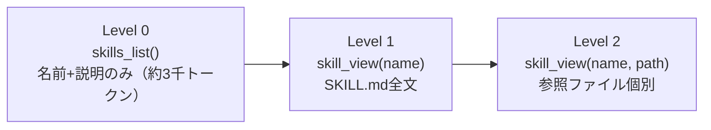

エージェントは実際に必要になった時だけ完全な内容をロードする。すべてのスキルは`~/.hermes/skills/`を単一の情報源として保持され、`external_dirs`設定で共有ディレクトリ（複数ツール共通の`~/.agents/skills/`など）を追加でスキャンさせることもできる。

### 5.2 SKILL.mdフォーマットの要点

```yaml
---
name: my-skill
description: このスキルが何をするかの簡潔な説明
version: 1.0.0
platforms: [macos, linux]
metadata:
  hermes:
    tags: [python, automation]
    category: devops
    fallback_for_toolsets: [web]     # 条件付き活性化：このtoolsetが無い時だけ表示
    requires_toolsets: [terminal]    # 条件付き活性化：このtoolsetがある時だけ表示
---
```

`fallback_for_toolsets`は特に有用なパターンで、有料ツール（例: Web検索）が利用不可の時にだけ無料の代替スキル（DuckDuckGo検索など）を表示させる、というフォールバック設計を宣言的に書ける。

### 5.3 `/learn`でスキルを素早く作る

手作業でSKILL.mdを書く代わりに、`/learn`はエージェントに既存の知識・資料からスキルを自動生成させるコマンドである。

```bash
/learn ~/projects/acme-sdk のRESTクライアントを、認証とページネーションに焦点を当てて
/learn https://docs.example.com/api/quickstart
/learn さっきやったステージングサーバーへのデプロイ手順
```

CLI・ゲートウェイ・TUI・ダッシュボードのいずれからでも同じように動作し、実際に稼働中のエージェントが情報収集からSKILL.md執筆まで行うため、専用の取り込みエンジンは存在しない。

### 5.4 スキルバンドルで複数スキルを1コマンド化

頻繁に組み合わせて使うスキル群は、YAMLベースの「バンドル」として1つのスラッシュコマンドにまとめられる。

```bash
hermes bundles create backend-dev \
  --skill github-code-review \
  --skill test-driven-development \
  --skill github-pr-workflow \
  -d "バックエンド機能開発：レビュー・テスト・PRワークフロー"
```

以後`/backend-dev 認証ミドルウェアをリファクタリングして`と打つだけで、3つのスキルが同時にロードされる。バンドルはスキル名の衝突時に個別スキルより優先される点に注意する。

### 5.5 エージェントによる自己改善（`skill_manage`）

エージェントは複雑なタスク（5回以上のツール呼び出し）を完了した後、エラーから抜け出す方法を発見した後、あるいはユーザーに訂正された後に、自発的にスキルを作成する。`create` / `patch`（推奨・差分のみで効率的）/ `edit` / `delete` / `write_file` / `remove_file`の6アクションがある。

### 5.6 Skills Hubとトラスト・レベル

外部のスキルエコシステムとして、公式オプションスキル・skills.sh（Vercel運営）・well-known エンドポイント（`/.well-known/skills/index.json`）・GitHubタップ（openai/skills、anthropics/skills、huggingface/skills、NVIDIA/skillsなど）・ClawHub・LobeHub・browse.sh（Browserbase運営の200以上のサイト別ブラウザ自動化スキル集）が統合されている。

| トラストレベル | ソース | ポリシー |
|---|---|---|
| `builtin` | Hermes本体に同梱 | 常に信頼 |
| `official` | リポジトリの`optional-skills/` | 組み込み信頼、警告表示なし |
| `trusted` | openai/skills、anthropics/skills等の指定レジストリ | コミュニティより緩やかなポリシー |
| `community` | skills.sh・well-known・カスタムGitHubリポジトリ等 | 危険でない指摘は`--force`で上書き可能。`dangerous`判定は上書き不可 |

すべてのハブ経由インストールは、データ漏洩・プロンプトインジェクション・破壊的コマンド・サプライチェーン兆候を検査するセキュリティスキャナを通過する。**未検証のコミュニティスキルを本番プロファイルにインストールする前には、必ず`hermes skills inspect`でプレビューする**のがベストプラクティスである。

---

## 6. Curatorによるスキルの自動メンテナンス

エージェントが問題を解決するたびにスキルを保存し続けると、似たようなスキルが乱立してカタログを汚染し、トークンを浪費する。Curatorはこれを防ぐバックグラウンドメンテナンス機構である。

### 6.1 ライフサイクル

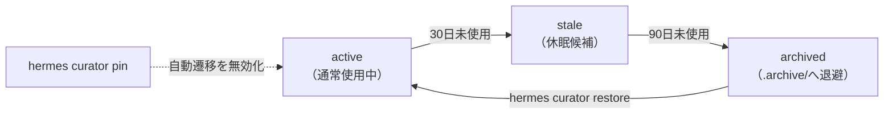

Curatorが管理するのは「**エージェント作成**」と明示的にマークされたスキルのみである。具体的には、バックグラウンドの自己改善レビュー（約10ターンごとに実行）が生成したアンブレラスキルがこれに該当し、ユーザーが手動作成したスキルや、フォアグラウンド会話中にエージェントへ依頼して作らせたスキルは対象外となる。バンドル済み・ハブインストール済みスキルは原則対象外だが、`curator.prune_builtins: true`（デフォルト）の場合のみ、未使用のバンドルスキルが90日後にアーカイブされる（削除ではなく退避）。

### 6.2 実行タイミングと安全策

Curatorはcronデーモンではなく、**非アクティブ検知**によって起動する。CLIセッション開始時、およびゲートウェイのcronティッカー内で、前回実行から`interval_hours`（デフォルト7日）が経過し、かつ`min_idle_hours`（デフォルト2時間）以上アイドルであった場合にのみバックグラウンドフォークとして走る。新規インストール直後は最初の実行が1インターバル分先送りされ、ユーザーがスキルライブラリを確認したりピン留めしたりする猶予が確保される。

実行は2フェーズに分かれる。

1. **自動遷移**（決定的・LLM不使用）: 30日/90日ルールによる`active → stale → archived`の遷移
2. **LLM統合レビュー**（デフォルトOFF、`curator.consolidate: true`で有効化）: 補助モデルが重複スキルの統合・パッチ・アーカイブを提案する

### 6.3 バックアップとロールバック

実際のCurator実行の前には必ず`~/.hermes/skills/.curator_backups/`にtar.gzスナップショットが作成される。想定外の変更があった場合は次の1コマンドで即座に復元できる。

```bash
hermes curator rollback        # 最新スナップショットへ復元（確認あり）
hermes curator rollback --list # スナップショット一覧
```

ロールバック自体も「ロールバック前」のスナップショットを取ってから実行されるため、誤ロールバックすら取り消せる。**本番運用では`curator.backup.enabled`を明示的にtrueのままにしておくこと**、そして`/plan`のようなスラッシュコマンドが依存する保護対象ビルトインスキルは、`prune_builtins`設定に関わらずCuratorの候補リストから常に除外される点も押さえておきたい。

---

## 7. コンテキストファイル戦略（AGENTS.md / SOUL.md）

### 7.1 優先順位システム

プロジェクトコンテキストファイルは**1セッションにつき1種類のみ**ロードされる。優先順位は次の通りで、最初に見つかったものが採用される。

`.hermes.md`（`HERMES.md`も可）→ `AGENTS.md` → `CLAUDE.md` → `.cursorrules`

一方、`SOUL.md`は常に独立してロードされる（Hermesインスタンス全体のペルソナ層）。`HERMES_HOME`直下からのみ読み込まれ、作業ディレクトリは探索しない。

### 7.2 段階的サブディレクトリ発見

モノレポで各サブディレクトリに個別の規約がある場合、起動時にすべてを読み込む必要はない。エージェントが`read_file`や`terminal`でそのディレクトリに触れた瞬間に、該当する`AGENTS.md`が遅延発見されてツール結果に注入される仕組みになっている。

```text
my-project/
  AGENTS.md              ← セッション開始時にロード
  frontend/AGENTS.md     ← frontend/ 配下を読んだ時に発見
  backend/AGENTS.md      ← backend/ 配下を読んだ時に発見
```

この設計には2つの利点がある。第一にシステムプロンプトが肥大化しない。第二にプロンプトキャッシュが維持される（サブディレクトリのヒントは会話履歴に追記されるだけで、システムプロンプト自体は変化しない）。

### 7.3 効果的なAGENTS.mdの書き方

公式のベストプラクティスとして次の5点が挙げられている。

1. **簡潔に保つ** — 設定した`context_file_max_chars`（デフォルト2万文字）以内に収める。毎ターン読み込まれるコストを意識する
2. **見出しで構造化する** — アーキテクチャ・規約・注意事項を`##`セクションで分ける
3. **具体例を含める** — 望ましいコードパターン・API形状・命名規則を示す
4. **やってはいけないことを明記する** — 「マイグレーションファイルを直接編集しない」など
5. **重要なパス・ポート番号を列挙する** — エージェントがターミナルコマンドで使う

### 7.4 プロンプトインジェクション対策

すべてのコンテキストファイルは読み込み前にスキャンされ、「以前の指示を無視しろ」といった指示上書き試行、非表示のHTMLコメント、認証情報の窃取パターン（`curl ... $API_KEY`など）、不可視Unicode文字（ゼロ幅スペース、双方向オーバーライド）が検出されるとブロックされる。**共有リポジトリ内のAGENTS.mdは、この自動スキャンだけに頼らず、自分でも内容を確認する**ことが推奨されている。

---

## 8. サブエージェント委任（Delegation）

### 8.1 サブエージェントは「何も知らない」

`delegate_task`が生成する子エージェントは完全にフレッシュな会話から始まる。親の会話履歴・過去のツール呼び出し・議論内容について一切の知識を持たない。したがって、`goal`と`context`パラメータに**子が必要とするすべて**を明示的に渡す必要がある。

```python
# 悪い例：「そのエラー」が何か子には分からない
delegate_task(goal="そのエラーを直して")

# 良い例：子が必要とする情報を全て含む
delegate_task(
    goal="api/handlers.py の TypeError を修正",
    context="""47行目でTypeError: 'NoneType' object has no attribute 'get'。
    process_request() が parse_body() からNoneを受け取っている。
    プロジェクトは /home/user/myproject、Python 3.11。"""
)
```

### 8.2 単発 vs 並列バッチ

```python
# 単発
delegate_task(goal="テスト失敗の原因を調査", context="...")

# 並列バッチ（デフォルト最大3並列、設定変更可）
delegate_task(tasks=[
    {"goal": "話題Aを調査", "context": "..."},
    {"goal": "話題Bを調査", "context": "..."},
    {"goal": "ビルドを修正", "context": "..."},
])
```

### 8.3 深さ制限とオーケストレーション

デフォルトでは委任は**フラット**（親→子の1階層のみ、子はさらに委任できない）。多段階ワークフロー（調査→統合など）が必要な場合のみ、`role="orchestrator"`の子を作る。

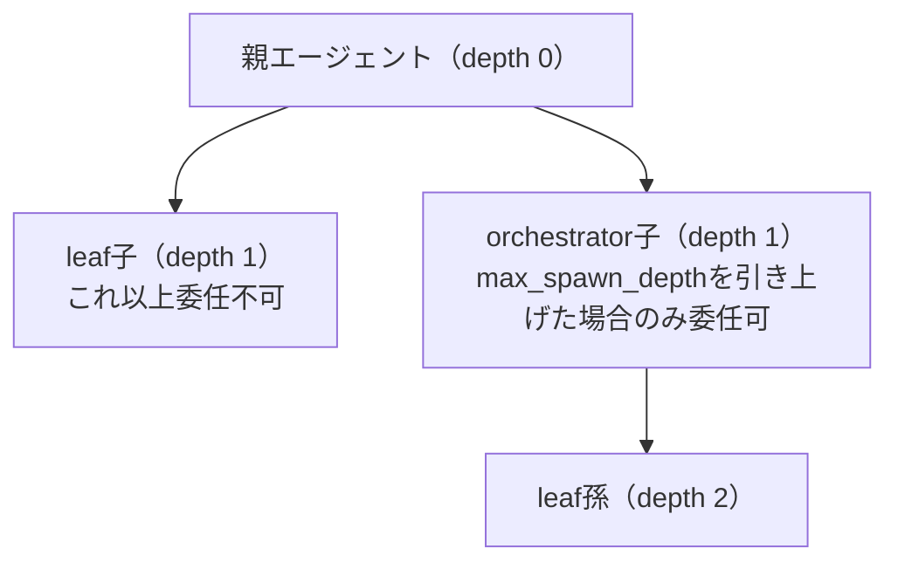

`max_spawn_depth: 3`かつ`max_concurrent_children: 3`を組み合わせると理論上3×3×3=27の並列leafエージェントが生まれうる点はコスト上の注意点として明記されている。深さを上げる際は意図的に行うべきである。

### 8.4 delegate_task と execute_code の使い分け

| 観点 | `delegate_task` | `execute_code` |
|---|---|---|
| 推論 | フルLLM推論ループ | Pythonコード実行のみ（推論なし） |
| コンテキスト | 独立した新規会話 | 会話なし、スクリプトのみ |
| 並列性 | デフォルト3並列 | 単一スクリプト |
| 向いている用途 | 判断・推論を要する複雑なタスク | 機械的な多段パイプライン |
| トークンコスト | 高い（フルLLMループ） | 低い（標準出力のみ返る） |

**判断基準**: サブタスクが推論・判断・多段階の問題解決を要するなら`delegate_task`、機械的なデータ処理やスクリプト化されたワークフローなら`execute_code`を選ぶ。

### 8.5 恒久実行が必要な場合

セッションが閉じられても・プロセスが再起動してもタスクを継続させたい場合、`delegate_task`は不向きである（プロセス再起動後の子は`unknown`扱いになり再開されない）。代わりに以下を使う。

- `cronjob(action="create")` ― 独立したエージェント実行としてスケジュールし、親ターンの中断の影響を受けない
- `terminal(background=True, notify_on_complete=True)` ― 長時間シェルコマンドをバックグラウンドで継続

---

## 9. execute_codeによるトークン最適化

`execute_code`は、Hermesツールをプログラム的に呼び出すPythonスクリプトをエージェントに書かせ、多段階ワークフローを1回のLLMターンに圧縮する仕組みである。スクリプトは子プロセスとして動作し、Unixドメインソケット経由のRPCでツールを呼び出す。**中間結果はコンテキストウィンドウに一切入らず、`print()`の出力のみがLLMに返る**点が最大の利点である。

```python
from hermes_tools import web_search, web_extract
import json

results = web_search("Rust async runtime 比較 2025", limit=5)
summaries = []
for r in results["data"]["web"]:
    page = web_extract([r["url"]])
    for p in page.get("results", []):
        if p.get("content"):
            summaries.append({"title": r["title"], "excerpt": p["content"][:500]})

print(json.dumps(summaries, ensure_ascii=False, indent=2))
```

### 9.1 使うべき場面

- 3回以上のツール呼び出しに処理ロジックが挟まる場合
- 大量データのフィルタリングや条件分岐
- 検索結果に対するループ処理

### 9.2 実行モードとリソース制限

`code_execution.mode`は`project`（デフォルト、アクティブな仮想環境のPythonを使用し作業ディレクトリもセッションと同じ）と`strict`（Hermes自身のPythonを使い、隔離された一時ディレクトリで実行）の2種類がある。再現性を最優先するCI的な用途では`strict`、通常の開発作業では`project`が適する。

| リソース | 上限 |
|---|---|
| タイムアウト | 300秒（SIGTERM→5秒後SIGKILL） |
| 標準出力 | 50KB（超過分は切り詰め） |
| 標準エラー | 10KB（非ゼロ終了時のみ出力に含まれる） |
| ツール呼び出し回数 | 実行あたり50回 |

セキュリティ面では、子プロセスは`KEY` / `TOKEN` / `SECRET` / `PASSWORD` / `CREDENTIAL` / `AUTH`を含む環境変数名をすべて除去した最小権限環境で動く。スキルが`required_environment_variables`を宣言していれば、そのスキルロード後は該当変数のみ自動的に通過する。この仕組みにより「任意コード実行だが秘密情報は漏れない」というバランスを取っている。

**プラットフォーム制限**: Unixドメインソケットに依存するため**Linux/macOSのみ**対応。Windowsでは自動的に無効化され、通常の逐次ツール呼び出しにフォールバックする。

---

## 10. Persistent Goals（/goal）― Ralph loopの実践

### 10.1 概要と出典

`/goal`は、ターンをまたいで生き続ける目標をエージェントに与える機能である。毎ターン後、補助モデル（judge）がゴールが達成されたかを判定し、未達なら継続プロンプトを自動投入して作業を続けさせる。これはOpenAIのCodex CLI 0.128.0（Eric Traut氏実装）が普及させた「Ralph loop」パターンへの、Hermes独自実装によるオマージュである。「ゴールが達成されるまで止まらない」という中核アイデアはCodex由来であることが公式ドキュメントに明記されている。

### 10.2 使うべき場面

「3回も『続けて』と言うことになりそうなタスク」がまさに`/goal`の適用対象である。

- `src/`内のすべてのlintエラーを修正し`ruff check`を通す
- リポジトリYの機能Xをテスト込みで移植し、CIをグリーンにする
- セッションID漂流の原因を調査してレポートを書く

1ターンで完結するタスクには不要である。

### 10.3 動作の仕組み

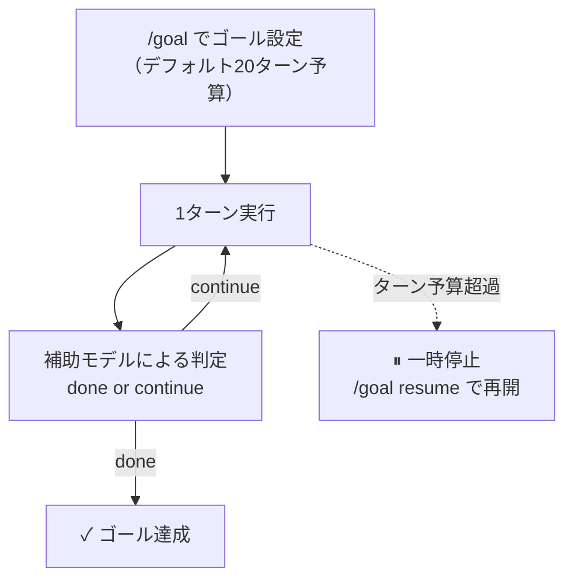

judgeは意図的に保守的に設計されており、「応答が明示的にゴール完了を確認している」「成果物が明確に生成されている」「ゴールが達成不能・ブロックされている」場合のみ`done`と判定する。judge自体がエラーを返した場合は`continue`扱いとなり（フェイルオープン）、暴走を防ぐ最終防波堤はターン予算（デフォルト20、`goals.max_turns`で変更可）である。

### 10.4 実務上の注意点

- ゴール実行中にユーザーが実際にメッセージを送ると、それは継続ループより**常に優先**される
- ゴール実行中に**新しい**ゴールを設定しようとすると拒否される。先に`/stop`してから再設定する
- 継続プロンプトは通常のuser roleメッセージとして追記されるだけで、システムプロンプトを変更しないため、20ターンのゴール実行は20ターンの通常会話と**同じキャッシュコスト**で済む
- judgeの誤判定（早すぎる`done`、または`continue`し続ける）はどちらも起こりうる。前者は追加メッセージで継続させ、後者はターン予算が保険になる

---

## 11. Cron自動化のベストプラクティス

### 11.1 スケジュール形式

```text
30m             → 30分後に1回
every 2h        → 2時間ごとに繰り返し
0 9 * * *       → 毎日9:00（cron式）
0 9 * * 1-5     → 平日9:00
2026-03-15T09:00:00 → 特定日時に1回（ISO形式）
```

### 11.2 自己完結したプロンプトが必須

Cronジョブは**完全にフレッシュなセッション**で実行される。スキルが提供しない情報はすべてプロンプト自体に含める必要がある。

```text
悪い例: 「サーバーの件を確認して」
良い例: 「192.168.1.100にdeployユーザーでSSHし、
        systemctl status nginx でnginxの稼働を確認し、
        https://example.com がHTTP 200を返すか検証して」
```

### 11.3 ジョブの連鎖（`context_from`）

複数ジョブをパイプライン化したい場合、`context_from`で前段ジョブの最新出力を後段ジョブのプロンプトへ自動的に前置できる。

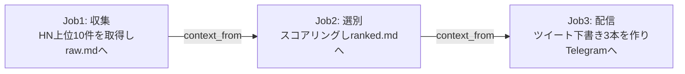

```python
cronjob(action="create", prompt="...", schedule="0 7 * * *", name="AI News Collector")
cronjob(action="create", prompt="...", schedule="30 7 * * *",
        context_from="<job1_id>", name="AI News Triage")
cronjob(action="create", prompt="...", schedule="0 8 * * *",
        context_from="<job2_id>", name="AI News Brief")
```

各ジョブは`context_from`が指す先の**直近の完了済み出力**を読むだけで、他ジョブの完了を待つわけではない点に注意する。

### 11.4 コストゼロのゲート：`wakeAgent`

高頻度（1〜5分おき）のポーリングジョブで、状態に変化がない限りLLMを起動したくない場合、事前チェックスクリプトの最終行に次を出力させることで、そのティックのエージェント起動自体をスキップできる。

```json
{"wakeAgent": false}
```

ファイル変更ゲート・外部フラグゲート・SQL件数ゲートなど、この仕組みで大半の「変化があった時だけ動かす」ユースケースを$0で実現できる。さらに徹底したいなら、LLMを一切介さない**no-agent モード**（`no_agent=True`）でスクリプトの標準出力をそのまま配信するワークドッグ運用も可能である。

### 11.5 モデル・プロバイダのスナップショット

未指定（provider/modelを明示しない）で作成されたジョブは、作成時点のグローバルデフォルトを**スナップショット**する。後でグローバルデフォルトを変更しても、そのジョブは**フェイルクローズ**する（推論を呼ばず、実行をスキップしてアラートを送る）。これは「意図せず有料プロバイダへ切り替わって課金される」事故を防ぐ設計であり、変更を追随させたい場合は明示的にジョブを更新してピン留めし直す必要がある。

### 11.6 ワークディレクトリとAGENTS.md

Cronジョブはデフォルトでどのリポジトリからも切り離されて動く（AGENTS.md等はロードされない）。`workdir`を指定するとそのディレクトリのAGENTS.md/CLAUDE.md/.cursorrulesが注入され、terminal・file系ツールもそのディレクトリを基準に動作する。ただし`workdir`付きジョブは並列プールではなく**シーケンシャル**に実行される点（プロセスグローバルなcwd状態の衝突を避けるため）は把握しておく必要がある。

---

## 12. MCP統合のベストプラクティス

### 12.1 サーバー種別と設定

MCP（Model Context Protocol）は外部ツールサーバーに接続する標準規格である。Hermesはstdioサーバー（ローカルサブプロセス）とHTTPサーバー（リモートエンドポイント）の両方を同じ設定ファイルで扱える。

```yaml
mcp_servers:
  filesystem:
    command: "npx"
    args: ["-y", "@modelcontextprotocol/server-filesystem", "/home/user/projects"]

  linear:
    url: "https://mcp.linear.app/mcp"
    auth: oauth
```

OAuth 2.1が必要なホスト型MCPサーバー（Linear・Sentry・Atlassian・Asana・Figma・Stripeなど）は`auth: oauth`を指定するだけで、Hermesがディスカバリ・動的クライアント登録・PKCE・トークンリフレッシュまで面倒を見る。

### 12.2 ツール単位のフィルタリング

サーバー丸ごとではなく、公開するツールを絞り込むのがセキュリティ上のベストプラクティスである。

```yaml
mcp_servers:
  stripe:
    url: "https://mcp.stripe.com"
    tools:
      exclude: [delete_customer, refund_payment]
```

`include`（ホワイトリスト）と`exclude`（ブラックリスト）が両方指定された場合は`include`が優先される。すべてのツールがフィルタで除外され、かつリソース/プロンプトのユーティリティラッパーも無効化されている場合、Hermesはそのサーバーの空のツールセットを作らない（ツール一覧を汚さない）。

### 12.3 一意名前空間

MCPツールは`mcp_<server名>_<tool名>`の形式で自動的にプレフィックスされ、組み込みツールと衝突しない。例えば`github`サーバーの`create-issue`ツールは`mcp_github_create_issue`として登録される。

### 12.4 並列実行と信頼できる用途のみ許可

読み取り専用の問い合わせなど、同時実行しても安全なツールに限り`supports_parallel_tool_calls: true`を設定すると並列実行が有効になる。書き込みを伴うツールや共有状態に触れるツールでは、競合状態のリスクを検証してから有効化すべきである。

### 12.5 資格情報の分離

stdioサーバーのサブプロセスには、ホストのシェル環境がそのまま渡ることはない。`PATH` / `HOME` / `USER` / `LANG`などの安全な変数と、`env:`で明示的に指定した変数のみが渡される。エラーメッセージ中のGitHub PAT・OpenAI形式キー・Bearerトークンなどは自動的に`[REDACTED]`へ置換される。

### 12.6 カタログ経由インストールの信頼モデル

`hermes mcp catalog` / `hermes mcp install <name>`で導入できる公式カタログエントリはNousのPRレビューを経ているが、それでも**`source:`のリポジトリと`bootstrap`コマンドは自分の目で確認する**ことが推奨されている。マニフェストは`optional-mcps/<name>/manifest.yaml`としてGitHub上で公開されており、インストール前にレビューできる。

---

## 13. 本番運用のセキュリティ・チェックリスト

Hermesのセキュリティモデルは8層の多重防御として設計されている。

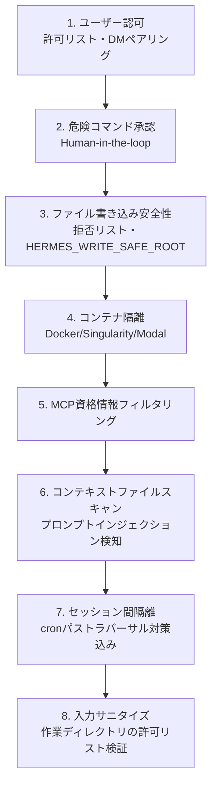

### 13.1 危険コマンド承認

承認モードは`smart`（補助LLMがリスクを判定、低リスクは自動承認・高リスクは自動拒否・不明確なものは人間に確認）、`manual`（常に確認）、`off`（`--yolo`相当、全チェック無効）の3種類。**本番のゲートウェイでは`off`を使わない**のが原則である。

さらに、`--yolo`や`approvals.mode: off`を設定していても絶対に実行されない**ハードラインブロックリスト**が存在する。`rm -rf /`、フォーク爆弾、マウント済みルートデバイスへの`mkfs`、`dd if=/dev/zero of=/dev/sd*`などが該当し、これは承認レイヤーより手前でコマンドを止める、上書き不可能な床（floor）として機能する。

ユーザー定義の拒否ルール`approvals.deny`は、この床の一段上にある編集可能なガードレールで、`--yolo`より先に評価される。

```yaml
approvals:
  deny:
    - "git push --force*"
    - "*curl*|*sh*"
```

### 13.2 コンテナ・バックエンドの選定

| バックエンド | 隔離 | 危険コマンドチェック | 適する用途 |
|---|---|---|---|
| local | なし（ホスト上で実行） | 実施される | 開発・信頼できるユーザー |
| ssh | リモートマシン | 実施される | 別サーバーでの実行 |
| docker | コンテナ | スキップ（コンテナが境界） | 本番ゲートウェイ |
| modal / daytona | クラウドサンドボックス | スキップ | スケーラブルなクラウド隔離 |

本番のメッセージングゲートウェイでは、危険コマンド承認そのものを不要にする**コンテナバックエンド（Docker/Modal/Daytona/Vercel Sandbox）の採用**が推奨されている。コンテナはケイパビリティを`ALL`ドロップした上で必要最小限（`DAC_OVERRIDE`・`CHOWN`・`FOWNER`）のみ再付与し、`no-new-privileges`・プロセス数制限・サイズ制限付き`tmpfs`が既定で適用される。

### 13.3 ゲートウェイ認可

**`GATEWAY_ALLOW_ALL_USERS=true`を本番で使わない**ことが最重要事項である。プラットフォーム別許可リスト（`TELEGRAM_ALLOWED_USERS`など）かDMペアリング（ワンタイムコード＋所有者承認）を使う。認可チェックの優先順位は「プラットフォーム別all-allowフラグ → DMペアリング承認済みリスト → プラットフォーム別許可リスト → グローバル許可リスト → グローバルall-allow → デフォルト拒否」の順である。

### 13.4 SSRF対策とWebアクセス方針

Web検索・抽出・ブラウザ・vision URL取得はすべて、RFC 1918プライベートアドレス・ループバック・リンクローカル（クラウドメタデータ`169.254.169.254`含む）・CGNAT空間へのアクセスをデフォルトでブロックする。DNS解決失敗もfail-closed（ブロック扱い）として扱われ、リダイレクトチェーンもホップごとに再検証される。社内サービスへのアクセスを意図的に許可する必要がある特殊な環境でのみ`security.allow_private_urls: true`を検討する。

### 13.5 Tirithによる実行前スキャン

コマンド実行前に[tirith](https://github.com/sheeki03/tirith)というコンテンツレベルのスキャナが追加で動作し、ホモグラフURLスプーフィング（国際化ドメイン攻撃）やパイプ・トゥ・インタープリタパターン（`curl | bash`など）をパターンマッチだけでは検出できない粒度で検知する。

### 13.6 サプライチェーン・アドバイザリ

既知の侵害されたパッケージバージョン（例として2026年5月の`mistralai 2.4.6`汚染事案が挙げられている）に一致するPythonパッケージがアクティブなvenvにないか、起動時に検査される。`hermes doctor`で詳細な是正手順を確認できる。

### 13.7 本番デプロイ・チェックリスト

1. 明示的な許可リストを設定する（`GATEWAY_ALLOW_ALL_USERS=true`は使わない）
2. コンテナバックエンド（`terminal.backend: docker`等）を使う
3. CPU・メモリ・ディスクのリソース制限を適切に設定する
4. `.env`のパーミッションを`chmod 600`にする
5. DMペアリングを有効化し、ユーザーIDのハードコードを避ける
6. `command_allowlist`を定期的に監査する
7. `terminal.cwd`を機密ディレクトリに設定しない
8. ゲートウェイをrootで実行しない
9. `~/.hermes/logs/`を監視する
10. `hermes update`を定期的に実行する

---

## 14. コスト最適化とプロンプトキャッシュ

### 14.1 プロンプトキャッシュを壊さない

多くのLLMプロバイダは会話プレフィックス（システムプロンプト＋履歴）をキャッシュする。システムプロンプトが安定していれば（同じコンテキストファイル、同じメモリ）、以降のメッセージはキャッシュヒットにより大幅に安価になる。キャッシュはモデルとアカウントに紐づくため、`/model`での明示的切り替え、自動プロバイダフォールバック、資格情報プールのローテーションはいずれも**次のターンで会話全体を通常価格で再読み込みさせる**。長いセッションでの頻繁なモデル切り替えはコストを大きく押し上げる。

### 14.2 実務上のコスト削減パターン

| 手法 | 効果 |
|---|---|
| `/compress`を早めに使う | 会話履歴を要約し、トークン数を大幅に削減 |
| `delegate_task`で並列調査 | 各サブエージェントの最終要約のみが親のコンテキストに戻る |
| `execute_code`でバッチ処理 | 中間ツール結果がコンテキストに入らず、`print()`のみ返る |
| cronの`enabled_toolsets`を絞る | 使わないtoolset（browser・delegationなど）を毎回のツールスキーマから除外 |
| 補助タスク（curator・goal judge・background review）を安価なモデルへ | メイン会話のキャッシュとは独立して低コスト化できる |

### 14.3 補助モデルのルーティング

curator・goal judge・memory/skillのバックグラウンドレビューは、いずれも独立した「補助タスク」スロットとして扱われ、メインモデルとは別のプロバイダ/モデルを指定できる。

```yaml
auxiliary:
  background_review:
    provider: openrouter
    model: google/gemini-3-flash-preview
  goal_judge:
    provider: openrouter
    model: google/gemini-3-pro-preview
```

補助モデルは固定せず、タスクに必要な品質・レイテンシ・コストと、利用中のプロバイダで選択可能なモデルを基準に選ぶ。`background_review`は要約・分類品質と低コストを、`goal_judge`は目標達成を安定して判定できる精度を優先する。

メインモデルと異なるモデルを指定した場合、そのレビューはメインの会話プレフィックスキャッシュを再利用できないため、直近ターン＋古い部分の要約という「ダイジェスト」形式で会話を再現し、新しいキャッシュへの書き込みコストを最小化する設計になっている。

---

## 15. トラブルシューティング

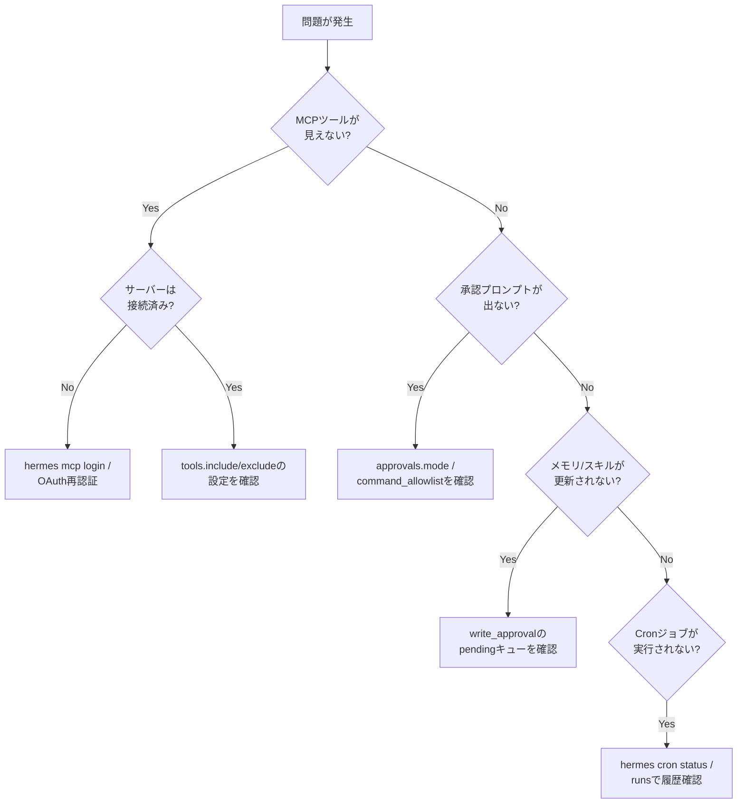

### 15.1 よくある落とし穴

| 症状 | 主な原因 | 対処 |
|---|---|---|
| MCPツールが一覧に出ない | サーバー未接続・フィルタで除外・`enabled: false` | `/reload-mcp`後にログ確認、`tools.include`を見直す |
| Docker内でユーザーがpairing approveできない | `docker exec`がデフォルトでrootになりファイル権限が合わない | `docker exec -u hermes ...`で実行する |
| cronジョブが急に課金モデルに切り替わって驚いた | グローバルデフォルト変更前に作成したジョブがスナップショットを保持 | ジョブは意図通りフェイルクローズしている。明示的に`provider`/`model`をピン留めする |
| OAuth MCPサーバーでトークンが取得できているように見えるが実際は失敗 | 一部プロバイダ（Google Drive等）が動的クライアント登録を拒否しつつ`tools/list`は無認証で応答する | 独自OAuthクライアントを作成し`oauth.client_id`/`client_secret`を設定する |
| 長時間セッションで応答が遅い・高コスト | プロンプトキャッシュが頻繁なモデル切り替えで破棄されている | モデル切り替え頻度を下げる、`/compress`を使う |
| Windowsでexecute_codeが動かない | Unixドメインソケット非対応 | 仕様通り。`terminal`ツールへのフォールバックを前提に設計する |

---

## 16. ベストプラクティス総括チェックリスト

- [ ] プロファイルを用途別（開発／本番／検証）に分離している
- [ ] MEMORY.md/USER.mdの容量が80%を超えたら統合する運用にしている
- [ ] メモリ・スキルの`write_approval`を、信頼度に応じて有効化するか判断済み
- [ ] AGENTS.mdは`context_file_max_chars`以内に収め、やってはいけないことを明記している
- [ ] サブエージェントへの委任では`goal`と`context`に必要な情報を過不足なく詰めている
- [ ] 恒久実行が必要な処理は`delegate_task`ではなく`cronjob`/`background terminal`を使っている
- [ ] Cronジョブのプロンプトは完全に自己完結している
- [ ] 高頻度ポーリングジョブには`wakeAgent`ゲートを設けてLLM起動コストを削減している
- [ ] 本番ゲートウェイは`GATEWAY_ALLOW_ALL_USERS=true`を使わず、許可リストかDMペアリングを使っている
- [ ] 本番ゲートウェイはコンテナバックエンド（Docker/Modal/Daytona）で動かしている
- [ ] MCPサーバーは`tools.include`/`exclude`でツール単位に絞り込んでいる
- [ ] コミュニティ製スキル・MCPは`hermes skills inspect`等でレビューしてから導入している
- [ ] モデル切り替え頻度を抑え、プロンプトキャッシュのヒット率を意識している
- [ ] Curatorのバックアップ（`curator.backup.enabled`）を有効なままにしている
- [ ] `hermes update`を定期的に実行しセキュリティパッチを取り込んでいる

---

## 17. 参考文献・出典

本ガイドは以下の一次情報源（Hermes Agent公式ドキュメント・公式GitHubリポジトリ）および、国際的な技術メディア・著名開発者の発信に基づいて作成した。

**公式ドキュメント・リポジトリ**

- Hermes Agent公式ドキュメント トップ: https://hermes-agent.nousresearch.com/docs/
- GitHubリポジトリ（README）: https://github.com/nousresearch/hermes-agent
- Architecture: https://hermes-agent.nousresearch.com/docs/developer-guide/architecture
- Security: https://hermes-agent.nousresearch.com/docs/user-guide/security
- Skills System: https://hermes-agent.nousresearch.com/docs/user-guide/features/skills
- Curator: https://hermes-agent.nousresearch.com/docs/user-guide/features/curator
- Persistent Memory: https://hermes-agent.nousresearch.com/docs/user-guide/features/memory
- Context Files: https://hermes-agent.nousresearch.com/docs/user-guide/features/context-files
- MCP (Model Context Protocol): https://hermes-agent.nousresearch.com/docs/user-guide/features/mcp
- Subagent Delegation: https://hermes-agent.nousresearch.com/docs/user-guide/features/delegation
- Code Execution: https://hermes-agent.nousresearch.com/docs/user-guide/features/code-execution
- Persistent Goals(/goal): https://hermes-agent.nousresearch.com/docs/user-guide/features/goals
- Scheduled Tasks (Cron): https://hermes-agent.nousresearch.com/docs/user-guide/features/cron
- Tips & Best Practices（公式ベストプラクティス集）: https://hermes-agent.nousresearch.com/docs/guides/tips
- llms.txt（ドキュメント全体の索引）: https://hermes-agent.nousresearch.com/docs/assets/files/llms-faaf9398aa5828403fd56f6be7989c9f.txt

**業界動向・第三者メディア（国際的な技術メディア）**

- TechCrunch「Hermes agent maker Nous Research in talks for new funding at $1.5B valuation」: https://techcrunch.com/2026/07/13/hermes-agent-maker-nous-research-in-talks-for-new-funding-at-1-5b-valuation/
- MarkTechPost「OpenClaw vs Hermes Agent: Why Nous Research's Self-Improving Agent Now Leads OpenRouter's Global Rankings」: https://www.marktechpost.com/2026/05/10/openclaw-vs-hermes-agent-why-nous-researchs-self-improving-agent-now-leads-openrouters-global-rankings/
- Simon Willison（Nous Research関連の継続的な技術解説）: https://simonwillison.net/tags/nous-research/
- Turing Post「Hermes vs OpenClaw」: https://www.turingpost.com/p/hermes

**関連プロジェクト・エコシステム**

- agentskills.io（オープンスキル標準）: https://agentskills.io
- skills.sh（Vercel運営のスキルディレクトリ）: https://skills.sh/
- tirith（実行前セキュリティスキャナ）: https://github.com/sheeki03/tirith
- OpenAI Codex CLI（`/goal`のRalph loop着想元）: https://github.com/openai/codex

---

*本ガイドはHermes Agentの公開ドキュメント（2026年8月2日時点）を基に作成した。Hermesは開発の速いプロジェクトであり、設定キー名やデフォルト値は将来のリリースで変更される可能性がある。最新情報は上記の公式ドキュメントを参照されたい。*
