# ITIL AI Governance (Version 5) 完全学習ガイド
### 初学者向け ステップバイステップ解説 + ベストプラクティス集

---

## この教材について

このガイドは、PeopleCert 認定資格 **ITIL AI Governance (Version 5)** の出題範囲を、初めて AI ガバナンスを学ぶ方にもわかりやすいように、公式カリキュラム（Module 1〜9）の順に沿って解説したものです。各章は次の3部構成になっています。

1. **概念解説** — 専門用語（英語表記を保持）を丁寧に噛み砕いて説明
2. **ベストプラクティス** — 実務でその概念をどう活かすかの具体的な指針
3. **ソース** — 主張の根拠となる一次情報・公式情報源の URL

> **注記:** ITIL AI Governance (Version 5) は PeopleCert が管理する商用資格であり、公式教材（Official eBook / Learning Resource Kit）は有償です。本ガイドは公式サイト・公式認定トレーニングパートナー（ATO）が公開しているシラバス情報をもとに作成した学習補助教材であり、公式教材の代替ではありません。試験直前は必ず公式 eBook を参照してください。

### 資格の基本情報（試験概要）

| 項目 | 内容 |
|---|---|
| 認定団体 | PeopleCert |
| ITIL 資格体系における位置づけ | ITIL (Version 5) の**唯一の拡張モジュール (Extension Module)**。Foundation / Managing Professional / Practice Manager / Strategic Leader のいずれの必須パスウェイにも属さないスタンドアロン資格 |
| 前提条件 | **なし**（ITIL Foundation 未取得でも受験可能） |
| 出題数 | 40問 |
| 出題形式 | 多肢選択式（Multiple Choice）、シナリオベース（"ITIL Car Rental Scenario" と呼ばれる想定シナリオを用いる） |
| 試験時間 | 90分（非英語ネイティブ受験者には追加時間あり） |
| 参照 | オープンブック（公式 eBook・シナリオブックレットの参照可） |
| 合格点 | 70%（40問中28問正解） |
| Bloom's Taxonomy レベル | BL2（理解）、BL3（適用）、BL4（分析）が中心 |
| 資格更新 | 3年ごと。(A) 他の ITIL 試験に合格する、または (B) PeopleCert Plus 会員として CPD ポイントを累積する、のいずれかで更新可能 |

*出典: [PeopleCert 公式製品ページ](https://www.peoplecert.org/browse-certifications/it-governance-and-service-management/ITIL-1/itil-ai-governance-version-5-4234), [ITSM Academy コース概要](https://itsmacademy.com/itil-ai-governance-course), [AGILEPM HUB コース概要](https://agilepmhub.com/itil-ai-governance)*

### 全体像（この資格で学ぶ主要モデル）

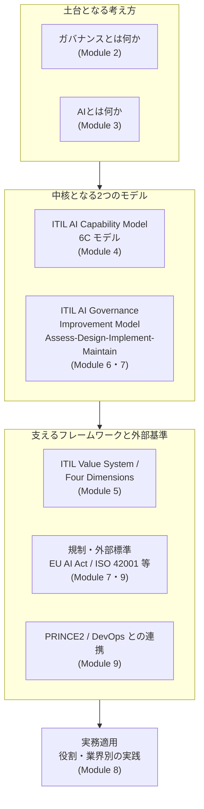

### 目次

1. 第1章: AI の世界と AI ガバナンスの必要性
2. 第2章: ガバナンスの基本概念
3. 第3章: AI の基本概念とガバナンスが必要な理由
4. 第4章: ITIL AI Capability Model（6C）とリスク・戦略
5. 第5章: ガバナンスツールキットとしての ITIL
6. 第6章: ITIL AI Governance Improvement Model — Assess ＆ Design
7. 第7章: ITIL AI Governance Improvement Model — Implement ＆ Maintain
8. 第8章: 自分の役割・業界で AI を活かす
9. 第9章: 他のフレームワーク・規制・標準との連携
10. 第10章: 試験対策まとめと用語集
11. 参考文献・出典一覧

---

## 第1章: AI の世界と AI ガバナンスの必要性
*(Module 1: The AI World and the Need for AI Governance)*

### 1-1. なぜ今 AI ガバナンスが必要なのか

生成AI・エージェント型AIの普及により、組織の意思決定・業務運用・サービス提供の多くの場面で AI が関与するようになりました。PeopleCert の公式紹介ページによれば、GenAI に投資した組織の **95%が投資対効果（ROI）を実感できていない**、専門職の **46%が機密情報や知的財産を一般公開の AI プラットフォームにアップロードしたことがある**、そして仕事の **50%が AI によって形を変える**と見込まれています。一方で AI スキルを持つ専門職には **56%の給与プレミアム**がつくというデータもあります。つまり「AI を使えること」と「AI を安全に統治（ガバナンス）できること」は別の能力であり、後者の需要が急速に高まっているというのが、この資格が新設された背景です。

*出典: [PeopleCert 公式ページ「Why certify now」](https://www.peoplecert.org/browse-certifications/it-governance-and-service-management/ITIL-1/itil-ai-governance-version-5-4234)*

### 1-2. AI がもたらす機会と脅威

Module 1 では、まず「AI opportunities and threats（AIの機会と脅威）」を整理し、AI が職場をどう変えつつあるか、そして実際に **AI が誤作動・誤用された事例（When AI goes wrong）** から何を学ぶべきかを扱います。ここでの狙いは、AI を「魔法の道具」としてではなく、統治対象となる**能力（Capability）の集合体**として捉え直すことです。

### 1-3. AI 統治の成熟度スペクトラムと「ガバナンスギャップ」

多くの組織では、AI 利用は現場主導で先行し、統治（ガバナンス）の整備が後追いになりがちです。この「ガバナンスの空白（governance gap）」こそが、ITIL AI Governance が対応しようとしている中心課題です。AGILEPM HUB のコース資料では、組織における AI の役割は次のように段階的に進化すると説明されています。

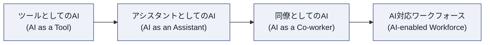

この進行に伴って必要な統治の水準（人間の監督範囲、意思決定権限の委譲範囲など）も段階的に変化していきます。**AI が「同僚」や「ワークフォースの一員」に近づくほど、事前に定義された裁量の境界（decision boundaries）と、逸脱を検知する仕組みが不可欠になる**、というのが本章の重要な着眼点です。

### 1-4. 「良いガバナンス」の6つの特性

Module 1 では「良いAIガバナンスとは何か（What good looks like）」として、6つの特性（six characteristics of good AI governance）が導入されます。文献上、厳密な6項目の公式名称までは一般公開情報からは確認できませんが、複数の公式トレーニングパートナー資料に一貫して現れる要素を整理すると、次の観点で評価されることが分かります。

| 観点 | 説明 |
|---|---|
| 説明責任（Accountability） | 誰が AI の判断・結果に責任を持つかが明確 |
| 透明性（Transparency） | AI がなぜその出力を出したか説明できる |
| 比例性（Proportionality） | リスクの大きさに見合った統制のみを課す（過剰統制も過小統制も避ける） |
| 適応性（Adaptability） | AI 技術の進化・利用状況の変化に合わせて統治を更新できる |
| 人間中心性（Human-centricity） | 重要な判断において人間が実質的な関与を保持する |
| 価値創出との両立（Value alignment） | 統制がイノベーションを不必要に阻害しない |

> **ベストプラクティス**
> - AI 導入の初期段階から「誰が承認するか」「何が失敗の兆候か」を定義し、後追いでガバナンスを足そうとしない。
> - 「AI ポリシーがある」ことと「実効性のあるガバナンスがある」ことは別物と認識する。ポリシー文書の存在は統治の証明にはならない。
> - 過去の AI インシデント事例（自社・他社問わず）を定期的にレビューし、「何が事前にあれば防げたか」を組織の学習材料にする。

*出典: [ITSM Academy コースアウトライン (Module 1)](https://itsmacademy.com/itil-ai-governance-course), [AGILEPM HUB シラバス (Module 1)](https://agilepmhub.com/itil-ai-governance)*

---

## 第2章: ガバナンスの基本概念
*(Module 2: Key Concepts of Governance)*

### 2-1. ガバナンス・マネジメント・リーダーシップの違い

初学者が最も混同しやすいのが「ガバナンス（governance）」「マネジメント（management）」「リーダーシップ（leadership）」の違いです。

- **ガバナンス（Governance）**: 方向性を定め、監督し、説明責任の枠組みを設定する活動。「何をすべきで、何をしてはいけないか」の境界線を引く。
- **マネジメント（Management）**: ガバナンスが定めた方針の範囲内で、日々の計画・実行・統制を行う活動。
- **リーダーシップ（Leadership）**: 人を動機づけ、方向性への共感を生み出す活動。ガバナンスにもマネジメントにも通底する。

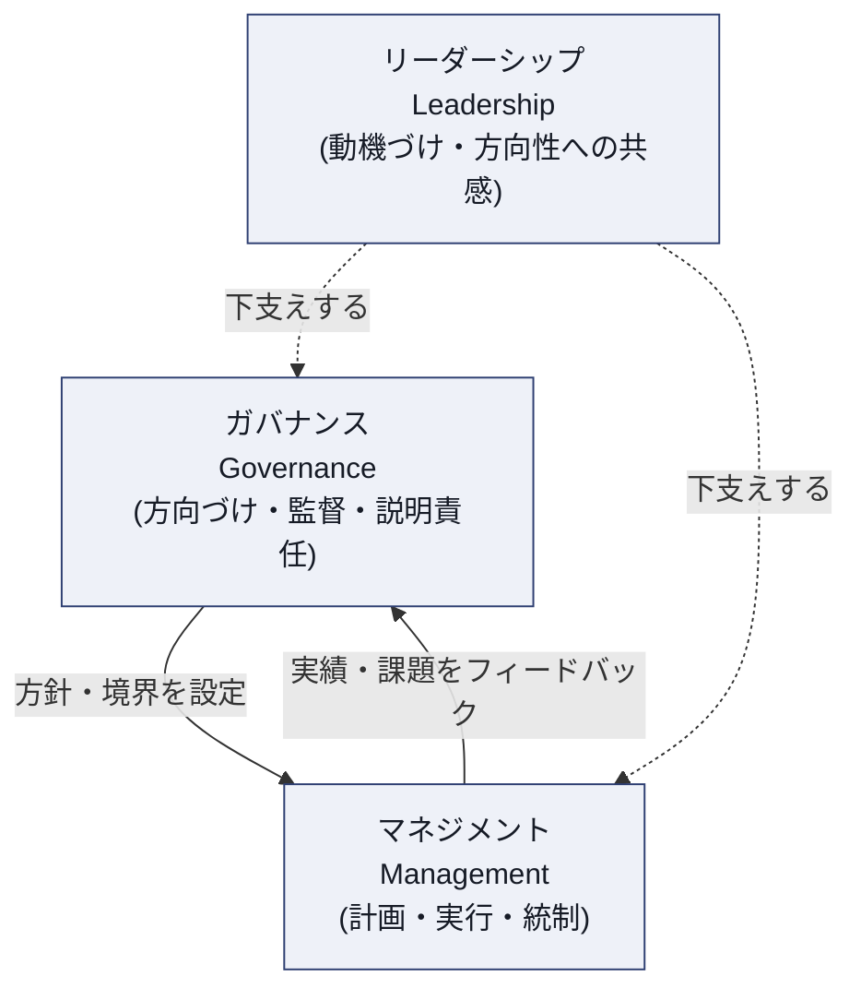

さらに本章では、**コーポレートガバナンス（企業全体の統治）**、**ITガバナンス（IT資源の統治）**、**AIガバナンス（AI能力に特化した統治）** の関係が整理されます。AI ガバナンスは IT ガバナンスの単なる一部ではなく、AI 特有の性質（自律性・学習性・不透明性）に対応する**専用の統治レイヤー**として位置づけられます。これが「なぜ従来の IT ガバナンスだけでは不十分なのか（Why IT governance is insufficient）」という、後の Module 6 につながる重要な伏線です。

### 2-2. AI ガバナンスシステムの6つの構成要素

Module 2 では「AI ガバナンスシステムの6つの構成要素（six components of the AI governance system）」が導入されます。これは、統治を「単発のルール」ではなく「相互に連動する仕組み（システム）」として設計する考え方です。

### 2-3. 4つのガバナンスパターン

ITIL AI Governance のシラバスで特に重要なのが、**4つのガバナンスパターン（four governance patterns）**です。これは「誰が・どの程度の裁量を持って AI の意思決定を行うか」を分類する枠組みで、複数の公式トレーニングパートナー資料で一貫して次の4種類として説明されています。

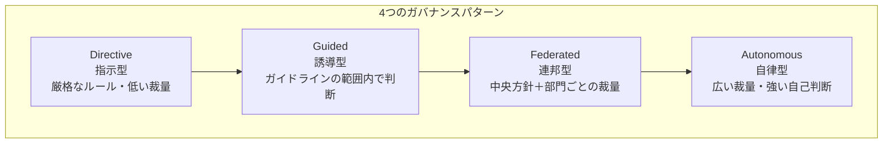

| パターン | 特徴 | 適した状況の例 |
|---|---|---|
| **Directive（指示型）** | 明確なルールと承認プロセスに厳密に従う。裁量の余地が最も小さい | 規制産業・高リスクな意思決定（与信判断など） |
| **Guided（誘導型）** | ガイドラインや原則の範囲内で現場が判断する | 中程度のリスクを伴う定型業務の自動化 |
| **Federated（連邦型）** | 全社共通の方針は中央が設定しつつ、実装や運用の裁量は各部門・各事業単位に委ねる | 複数事業部を持つ大規模組織でのAI展開 |
| **Autonomous（自律型）** | 定義された境界の中で AI／チームが高い自律性を持って判断する | 迅速な意思決定が価値創出に直結する、成熟度の高い領域 |

**エージェント型 AI（Agentic AI）** はこの分類に強い緊張をもたらします。エージェントが自律的に複数ステップの行動を実行できるようになるほど、「委任された権限（delegated authority）」がどこまで安全かをストレステストする必要が生じます（Module 6 で再登場）。

> **ベストプラクティス**
> - 全社で単一のガバナンスパターンに固定するのではなく、**AI ユースケースのリスクレベルに応じてパターンを使い分ける**。
> - Federated パターンを採用する場合は、「中央が譲らない最低限のガードレール」と「現場に委ねる裁量」を文書で明確に切り分ける。
> - Autonomous パターンを許可する前に、必ず Directive／Guided パターンでの運用実績（トラックレコード）を積む段階的アプローチを取る。

### 2-4. ガバナンスが確保するもの

本章の締めくくりとして、「ガバナンスが何を確保するか（What governance ensures）」が次の6要素として整理されます:

- **統制（Control）**
- **リスク管理（Risk management）**
- **コンプライアンス（Compliance）**
- **説明責任（Accountability）**
- **スチュワードシップ（Stewardship）**
- **価値創出（Value creation）**

*出典: [AGILEPM HUB シラバス (Module 2)](https://agilepmhub.com/itil-ai-governance), [ITSM Academy コースアウトライン (Module 2)](https://itsmacademy.com/itil-ai-governance-course)*

---

## 第3章: AI の基本概念とガバナンスが必要な理由
*(Module 3: Key Concepts of AI and Why We Need AI Governance)*

### 3-1. AI の3つのタイプ

ITIL AI Governance では AI を大きく3つのタイプに分類します。

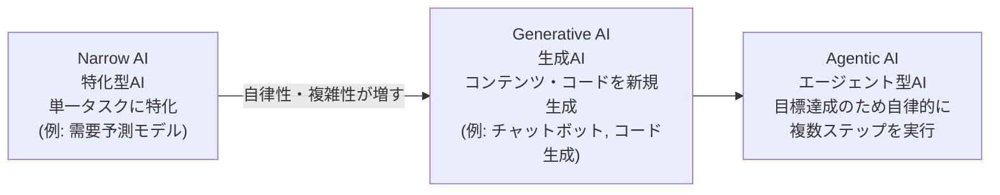

| タイプ | 特徴 | ガバナンス上の主な論点 |
|---|---|---|
| **Narrow AI**（特化型） | 定義された1つのタスクを高精度でこなす。予測・分類など | 精度低下・バイアスの監視 |
| **Generative AI**（生成） | 新しいテキスト・画像・コードなどを生成する | ハルシネーション、著作権、出力の事実確認 |
| **Agentic AI**（エージェント型） | 目標に対して自律的に計画・実行・ツール利用を行う | 権限の逸脱、意図しない連鎖行動、ロールバックの可否 |

### 3-2. AI の主要な特性

AI を統治対象として扱う上で重要な3つの特性が定義されます。

- **自律性（Autonomy）**: 人間の介入なしにどこまで判断・行動できるか
- **学習性・適応性（Learning and adaptability）**: 運用中にモデルやふるまいがどう変化しうるか（モデルドリフトの温床）
- **不透明性（Opacity）**: 内部の意思決定プロセスがどれだけ説明可能か（ブラックボックス性）

この3特性が高くなるほど、統治の難易度は上がります。特に **Agentic AIOps**（AI エージェントを IT オペレーションに組み込む活用）に関しては、次のようなガバナンス上の問いが明示的に検討課題として挙げられます。

- どのアクションを AI に許可するか（permitted actions）
- 何を明示的に除外するか（exclusions）
- 人間による上書き（override）はどのような条件で発動するか
- すべての行動がログに残る仕組みになっているか（logging）
- 結果責任は誰が負うか（accountability）
- 継続的な監視の仕組み（monitoring）
- 想定外の挙動時に安全に後退できるか（rollback）

### 3-3. AI の主なリスクカテゴリ

| リスクカテゴリ | 内容 | 具体例 |
|---|---|---|
| バイアス（Bias） | 学習データや設計に起因する不公平な出力 | 採用選考AIが特定属性を不利に扱う |
| プライバシー（Privacy） | 個人情報・機密情報の不適切な取り扱い | 学習データへの機密情報混入、出力への漏洩 |
| ハルシネーション（Hallucination） | もっともらしいが事実に基づかない出力 | 存在しない社内規定をチャットボットが回答 |
| 不透明性（Opacity） | 判断根拠が説明できない | 与信・人事判断で理由開示ができない |

> **ベストプラクティス**
> - AI 導入前に必ず「この AI はどのタイプか（Narrow / Generative / Agentic）」を明示し、タイプごとに異なる統制セットを適用する。
> - Agentic AI を業務に組み込む際は、上記7つの統治上の問い（許可行動・除外・上書き・ログ・責任・監視・ロールバック）を**導入前チェックリスト**として文書化する。
> - AI の価値評価は「成果（outcomes）」「コスト（costs）」「リスク（risks）」の3軸で行い、性能指標だけで導入判断をしない。

*出典: [AGILEPM HUB シラバス (Module 3)](https://agilepmhub.com/itil-ai-governance), [ITSM Academy コースアウトライン (Module 3)](https://itsmacademy.com/itil-ai-governance-course)*

---

## 第4章: ITIL AI Capability Model（6C）とリスク・戦略
*(Module 4: Risk, Strategy, and the Consequences of Getting It Wrong)*

### 4-1. 6C モデルとは

**ITIL AI Capability Model（通称「6C モデル」）**は、ITIL (Version 5) の Four Dimensions のうち「Information and Technology」次元に新設された枠組みで、AI システムが**何をしているか**を6つの機能カテゴリで分類します。

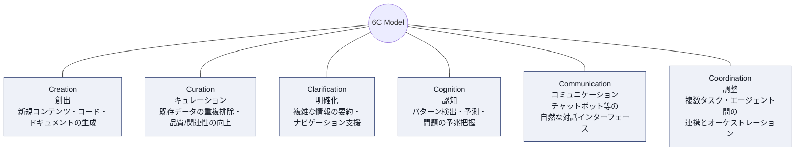

| 能力 (Capability) | 説明 | ITSM での典型例 | 一般的なリスクの傾向 |
|---|---|---|---|
| **Creation**（創出） | 新しいコンテンツ・コード・文書を生成する | コード生成、ナレッジ記事の自動作成 | ハルシネーション、著作権・ライセンス |
| **Curation**（キュレーション） | 既存データの重複排除、品質・関連性の向上 | 重複インシデントのマージ、CMDBのクレンジング | データ品質の誤判定 |
| **Clarification**（明確化） | 複雑な内容を要約し、利用者の理解を助ける | 長大なインシデントチケットの要約 | 要約による重要情報の欠落 |
| **Cognition**（認知） | パターン検出・予測・異常の早期発見 | 障害予兆検知、キャパシティ予測 | 誤検知・見逃し、説明可能性の不足 |
| **Communication**（コミュニケーション） | 自然言語での対話インターフェース | チャットボット、バーチャルアシスタント | 過信を招く擬人化、感情的な誤誘導 |
| **Coordination**（調整） | 複数のタスク・エージェント・システム間の連携 | マルチエージェントによる自動復旧オーケストレーション | 連鎖的な誤動作、権限の意図しない拡大 |

> **なぜ Communication に IEEE 7014-2024 が関係するのか**
> Communication 能力を持つ AI（チャットボット等）が人間の共感を模倣（emulated empathy）する場合、利用者に過剰な信頼や誤解を与えるリスクがあります。この倫理的配慮を扱う外部標準として **IEEE 7014-2024**（自律・知能システムにおける模倣共感の倫理的配慮に関する標準）が、ITIL AI Governance のシラバスで参照標準の一つとして挙げられています（詳細は第7章・第9章）。

### 4-2. 能力がガバナンスの境界をどう形づくるか

6C の各能力は、リスクの種類・大きさが異なるため、**統治の境界線（governance boundaries）**もそれぞれ異なります。例えば、同じ「AIチャットボット」でも、単純な FAQ 回答（Communication のみ）と、そこから自動でチケットをクローズしたりシステム変更を実行したりする機能（Communication + Coordination の組み合わせ）とでは、必要な統制の強度が全く異なります。**複数の能力が組み合わさるほど、リスクは単純な足し算ではなく複合的に増大する**という考え方（combined behavior）が重要です。

### 4-3. 4つの AI ガバナンス視点（Four AI Governance Perspectives）

6C モデルで「何を統治するか」を特定したら、次に「どの側面から統治するか」を定める視点が **4つの AI ガバナンス視点**です。情報源によって表現の粒度に多少の違いがありますが、一貫して次の4テーマとして説明されています。

| 視点 | 主な問い | 具体的な統制の例 |
|---|---|---|
| **意思決定権限とリスク管理** (Decision authority & risk management) | 誰が自律的なAI行動を承認するか | 自動エスカレーション、修復スクリプト実行の承認フロー |
| **倫理原則** (Ethical principles) | バイアス・説明可能性・組織の価値観との整合は取れているか | バイアステスト、判断の説明可能性(explainability)確保 |
| **データガバナンス** (Data governance) | 学習データの妥当性・モデルの劣化をどう監視するか | 学習データの監視、モデルドリフトの追跡、再学習の精度閾値設定 |
| **規制コンプライアンス** (Regulatory compliance) | 適用される規制は何か、リスク分類にどう対応するか | EU AI Act のリスクレベル分類へのマッピング |

これら4つの視点は独立ではなく**相互依存的（interdependent）**です。例えば、倫理原則で定めた透明性要件が、規制コンプライアンス（EU AI Act の説明可能性要件）と直接結びつくように、視点をまたいだ整合性の確保が重要になります。

### 4-4. リスクから対策へ（From risks to countermeasures）

Module 4 では、AI リスクカテゴリ（バイアス・プライバシー・ハルシネーション・不透明性など）を「**AI capability risk heatmap**」として 6C モデルに重ね合わせ、どの能力がどのリスクに特に晒されやすいかを可視化する考え方が導入されます。そのうえで、リスクごとに倫理原則と具体的な対策（countermeasure）を対応づけます。

| リスク | 関連する倫理原則 | 代表的な対策例 |
|---|---|---|
| バイアス | 公平性（Fairness） | 多様なテストデータでのバイアス検証、定期監査 |
| プライバシー | データ最小化・機密保持 | アクセス制御、匿名化、機密情報のマスキング |
| ハルシネーション | 正確性・誠実性 | 根拠提示の強制（RAGなど）、人間によるファクトチェック |
| 不透明性 | 説明可能性 | モデルカードの整備、判断根拠のログ化 |

### 4-5. Shadow AI（シャドーAI）と戦略への影響

現場が正式な承認なしに独自に AI ツールを導入・利用する「**Shadow AI**」は、機密情報漏洩やコンプライアンス違反の温床になります。Module 4 では、Shadow AI が組織の戦略的な整合性（strategy and alignment）をどう損なうかが扱われ、これは Module 6・7 で扱う「Shadow AI 統制の設計」に直結します。

> **ベストプラクティス**
> - 新しい AI ユースケースを評価する際は、必ず「どの 6C 能力を組み合わせているか」を最初に特定し、能力の組み合わせごとにリスクレビューを行う。
> - 4つのガバナンス視点（意思決定権限／倫理／データ／規制）を**チェックリスト化**し、AI 導入の承認プロセスに組み込む。
> - Shadow AI を「禁止」するだけでなく、「なぜ現場が正規プロセス外で AI を使うのか」（速度・使い勝手の不足など）を可視化し、正規ルートを魅力的にする。

*出典: [AGILEPM HUB シラバス (Module 4)](https://agilepmhub.com/itil-ai-governance), [itcko.sk 解説記事](https://itcko.sk/en/itil-v5-ai-governance-module/), [PMG Academy 6C モデル解説](https://www.pmgacademy.com/en/articles/itil/information-and-technology-in-itil-version-5-the-guide-for-the-ai-era-and-data-governance/), [IEEE 7014-2024](https://standards.ieee.org/ieee/7014/7648/)*

---

## 第5章: ガバナンスツールキットとしての ITIL
*(Module 5: ITIL as a Governance Toolkit)*

### 5-1. ITIL Value System と価値の共創

ITIL (Version 5) では、従来の「Service Value System」が **ITIL Value System（ITIL VS）** に発展的に改称されました。プロダクトやサービスの利用を通じて、組織と顧客が共同で価値を生み出す「価値の共創（value co-creation）」という考え方の中に、ガバナンスが明示的に組み込まれています。

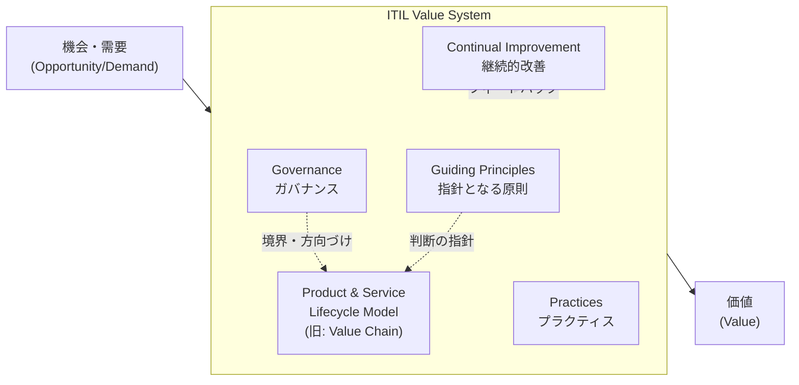

### 5-2. ITIL Product and Service Lifecycle Model と AI

旧来の「Service Value Chain」に相当する概念が、v5 では **ITIL Product and Service Lifecycle Model** として再構成されています。AI（特に 6C の各能力）は、このライフサイクルの**あらゆる段階**を支援しうるとされ、例えば計画段階での需要予測（Cognition）、設計段階でのコード生成（Creation）、運用段階でのインシデント要約（Clarification）などが該当します。重要なのは、**AI ガバナンスはライフサイクルの一部の段階だけでなく、全段階に一貫して適用される**という考え方です。

### 5-3. ITIL Guiding Principles（指針となる7つの原則）

ITIL の7つの指針原則は AI ガバナンスにもそのまま適用されます。

| 原則 | AI ガバナンスへの適用例 |
|---|---|
| 価値に着目する (Focus on value) | 統制の強度を、AIが生む価値とリスクに比例させる |
| 現在地から始める (Start where you are) | 既存の IT ガバナンス資産（変更管理など）を土台に AI 統制を拡張する |
| フィードバックを伴い反復的に進める (Progress iteratively with feedback) | 小規模なパイロットでガバナンスを検証してから全社展開する |
| 協働し、可視性を高める (Collaborate and promote visibility) | Shadow AI を減らすため、AI 利用状況を組織横断で可視化する |
| 全体的に考え、働く (Think and work holistically) | 単一システムだけでなく、サプライヤー・データ・利用者を含めて統治する |
| シンプルかつ実践的に保つ (Keep it simple and practical) | 過剰なプロセスでイノベーションを阻害しない、比例的な統制を選ぶ |
| 最適化し自動化する (Optimize and automate) | ガバナンス自体（監視・監査ログ収集等）も自動化・効率化する |

### 5-4. ITIL Four Dimensions と AI

ITIL (Version 5) では Four Dimensions（4つの側面）のうち、次の2つに AI 関連の内容が明示的に追加されています。

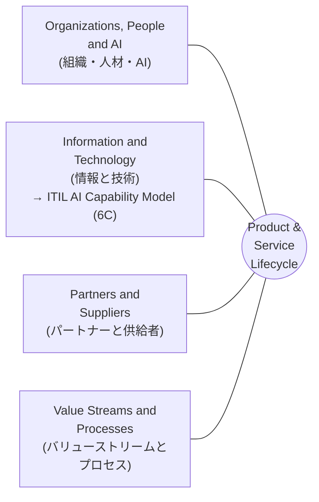

- **Organizations, People and AI**: AI が組織構造・人材のスキルセット・役割分担にどう影響するかを扱う次元。AI ガバナンスの人的側面（誰が何に責任を持つか）はここに位置づけられます。
- **Information and Technology**: 6C モデル（ITIL AI Capability Model）が組み込まれている次元。技術的な能力分類の土台です。

### 5-5. ITIL Maturity Model と AI Governance Maturity Assessment

ITIL Maturity Model は、組織のサービスマネジメント実践の成熟度を評価する仕組みです。Version 5 ではこれを AI に特化させた **AI Governance Maturity Assessment** が導入され、組織が「AI ガバナンスのどの成熟段階にいるか」を診断できるようになっています。この診断結果は、第6章で扱う Improvement Model の「Assess（評価）」ステップの出発点になります。

### 5-6. Continual Improvement Model と Transformation Model

- **ITIL Continual Improvement Model**: 「ビジョンは何か → 現在地はどこか → どこを目指すか → どう到達するか → 行動する → 維持できたか」というサイクルを回す、ITIL 全体で共通の継続的改善の型。AI ガバナンスの成熟度向上にもそのまま適用されます。
- **ITIL Transformation Model**: Version 5 で新設された、組織的な変革（トランスフォーメーション）を扱うモデル。AI 導入がしばしば業務プロセスや組織構造の変革を伴うことから、AI ガバナンスの実装を「変革プロジェクト」として捉える視点を提供します（変革への備え, transformation readiness、を含む）。

### 5-7. サステナビリティと AI の価値

AI の価値評価には、環境負荷（計算資源の消費など）を含む**サステナビリティ（持続可能性）**の観点も明示的に含まれます。AI 導入の ROI を測る際は、経済的価値だけでなく環境・社会的な持続可能性も検討要素とすることが求められます。

> **ベストプラクティス**
> - 新規 AI ユースケースの企画書には、必ず「ITIL Guiding Principles のどれに合致するか」を明記する欄を設け、思考の一貫性を担保する。
> - AI Governance Maturity Assessment を年1回など定期的に実施し、Continual Improvement Model のサイクルに組み込む。
> - AI導入の価値評価に、計算コスト・エネルギー消費などのサステナビリティ指標を KPI として加える。

*出典: [ITSM Academy コースアウトライン (Module 5)](https://itsmacademy.com/itil-ai-governance-course), [AGILEPM HUB シラバス (Module 5)](https://agilepmhub.com/itil-ai-governance), [ITIL (Version 5) の変更点まとめ](https://itsm.tools/itil-version-5-vs-itil-4-key-changes/)*

---

## 第6章: ITIL AI Governance Improvement Model — Assess ＆ Design
*(Module 6)*

### 6-1. なぜ専用モデルが必要か

第2章で触れたとおり、従来の IT ガバナンスの枠組みだけでは AI 特有の自律性・学習性・不透明性に対応しきれません。**ITIL AI Governance Improvement Model** は、AI ガバナンスを一過性の対応ではなく、継続的に評価・調整するための4ステップの改善サイクルとして提供します。

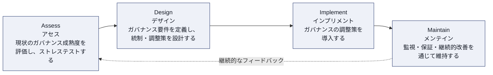

本章（Module 6）では前半の **Assess** と **Design** を扱い、第7章（Module 7）で後半の **Implement** と **Maintain** を扱います。

### 6-2. Assess（評価・ストレステスト）ステップ

このステップの目的は、「現在のガバナンスがどこまで通用し、どこで破綻するか（breaking points）」を明らかにすることです。

- **ガバナンスのベースライン化**: 現行の統制・承認フロー・責任分担を棚卸しする
- **成熟度 vs パフォーマンスの比較**: ガバナンスの「成熟度（整備されているか）」と「実際の運用パフォーマンス（機能しているか）」は別軸であり、両方を評価する
- **ストレステスト**: Agentic AI などの高自律性ケースを想定し、「委任された権限がどこまで安全か」を意図的に限界まで検証する（第2章のガバナンスパターンの議論と直結）

### 6-3. Design（要件定義・設計）ステップ

Assess で明らかになったギャップをもとに、具体的な統制を設計します。

#### 6-3-1. コンテキスト・リスク要因と比例的ガバナンス

すべての AI ユースケースに同じ強度の統制をかけるのは非効率です。**比例的ガバナンス（proportionate governance）**の考え方に基づき、次のようなコンテキスト要因（contextual risk factors）を踏まえてリスクの大きさを判定します。

- 意思決定の対象（人・資金・安全に影響するか）
- 自律性の度合い（人間の承認なしにどこまで進むか）
- 影響範囲（一部門か全社か、社外顧客に及ぶか）
- 可逆性（誤りが発生した場合に取り消せるか）

#### 6-3-2. リスク優先度評価（Risk Priority Rating）

リスクの大きさは「**発生可能性（Likelihood）× 影響度（Impact）**」の掛け算で評価します（Risk Priority Rating）。これをマトリクス表として整理すると次のようになります。

| 発生可能性 ＼ 影響度 | 軽微 (Low) | 中程度 (Medium) | 重大 (High) |
|---|---|---|---|
| **高い (High)** | 中リスク | 高リスク | **最優先で統制** |
| **中程度 (Medium)** | 低リスク | 中リスク | 高リスク |
| **低い (Low)** | 最小限の統制で可 | 低リスク | 中リスク |

> このマトリクスで「最優先で統制」に分類されたユースケース（例: 高自律性のエージェントが顧客への金銭的影響を伴う判断を行う場合）には、後述する preventive（予防的）統制を厚く設計する必要があります。

#### 6-3-3. 統制の3類型（Preventive / Detective / Corrective）

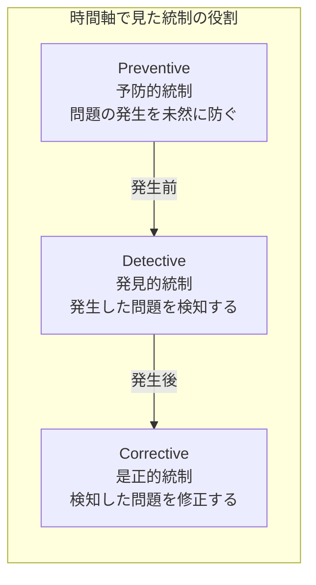

| 統制タイプ | 目的 | AI ガバナンスでの具体例 |
|---|---|---|
| **Preventive（予防的）** | 問題の発生自体を防ぐ | エージェントに実行可能なアクションを許可リストで制限する、承認なしに本番環境を変更できないようにする |
| **Detective（発見的）** | 発生した問題を早期に検知する | 出力の異常検知アラート、モデルドリフトの自動監視 |
| **Corrective（是正的）** | 検知した問題を修正・是正する | 自動ロールバック、人間へのエスカレーションと再学習トリガー |

#### 6-3-4. 意思決定境界・人間の監督・倫理的設計

「決定境界（decision boundaries）」とは、AI が自律的に判断してよい範囲と、必ず人間の承認を要する範囲の線引きです。設計時には次を明文化します。

- どこまでは AI が完結してよいか
- どこからは人間の承認（human-in-the-loop）が必須か
- 倫理原則（公平性・透明性・説明責任など）をどう設計に組み込むか（designing with ethics）

#### 6-3-5. Shadow AI 統制の設計とサステナビリティ要件

Design ステップでは、Shadow AI を「見える化」し、正規の統制下に置くための具体策（許可された AI ツールのカタログ化、利用申請フローの簡素化など）も設計します。あわせて、サステナビリティ要件（計算資源の使用上限など）もこの段階で統制の一部として組み込みます。

> **ベストプラクティス**
> - リスク優先度マトリクスは、担当者の主観に頼らず「発生可能性」「影響度」それぞれに具体的な判定基準（数値・閾値）を事前に定義しておく。
> - すべての AI ユースケースに preventive／detective／corrective の3種類の統制がバランス良く設計されているかをチェックリストで確認する（予防偏重で検知が疎かになるケースが多い）。
> - 決定境界は「文章」だけでなく、可能な限り**システム上の技術的な制約（ハードな境界）**として実装する。人間の運用ルール順守だけに頼らない。

*出典: [ITSM Academy コースアウトライン (Module 6)](https://itsmacademy.com/itil-ai-governance-course), [AGILEPM HUB シラバス (Module 6)](https://agilepmhub.com/itil-ai-governance)*

---

## 第7章: ITIL AI Governance Improvement Model — Implement ＆ Maintain
*(Module 7)*

### 7-1. Implement（実装）ステップ

Design で設計した統制を実際に組織へ導入する段階です。

- **7つの実装経路（seven pathways）**: ポリシー文書化から DevOps パイプラインへの組み込みまで、統制を実装する経路は一つではありません。ポリシー／プロセス／ツール／トレーニング／契約（サプライヤー条項）／技術的ガードレール／パイプライン組み込みなど、複数の経路を組み合わせて実装します。
- **ブリッジング・メカニズム（bridging mechanisms）**: ガバナンス能力が十分に成熟する前でも、AI 運用を安全に続けられるようにするための暫定的な補完策（例: 人手によるダブルチェックを一時的に強化するなど）。
- **ガバナンス運用モデルと実装レディネス**: 統制を「誰が」「どの頻度で」運用するかという運用モデルを定義し、組織が実装に耐えられる状態（readiness）にあるかを確認します。
- **決定境界・Shadow AI 統制の運用化**: 設計した境界やカタログを実際の承認フロー・監視ツールに落とし込みます。

### 7-2. Maintain（維持）ステップ

導入した統制を継続的に機能させ、改善し続ける段階です。

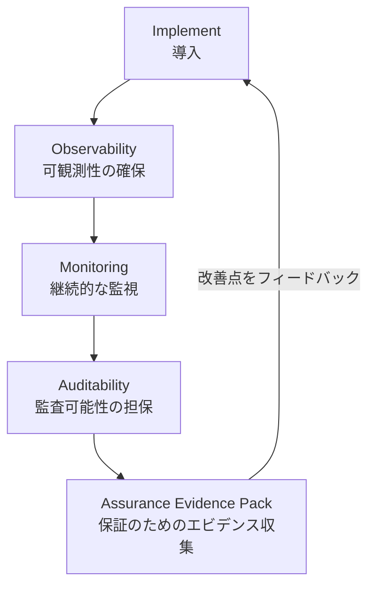

- **可観測性（Observability）・監視（Monitoring）・監査可能性（Auditability）**: AI の挙動を「見える」「追跡できる」「後から検証できる」状態にすることが、統制の実効性を維持する前提条件です。
- **統制（Control）とスチュワードシップ（Stewardship）の違い、そしてガバナンスの姿勢（governance orientation）**: 統制は「禁止・制限」に重心があるのに対し、スチュワードシップは「責任を持って良い方向へ導く」という、より能動的で協働的な姿勢です。成熟した AI ガバナンスは、統制一辺倒からスチュワードシップへと重心を移していく必要があります。
- **保証エビデンスパック（Assurance evidence pack）**: 監査・規制当局・経営層への説明責任を果たすために、統制が実際に機能している証拠（ログ、監査結果、インシデント対応記録など）を体系的に蓄積しておくパッケージです。

### 7-3. コンプライアンス・規制をガバナンスへの入力として扱う

規制・コンプライアンス要件は、統制を設計した"後"に確認するものではなく、**Design・Implement・Maintain 全体を貫く入力（input）**として扱われます。

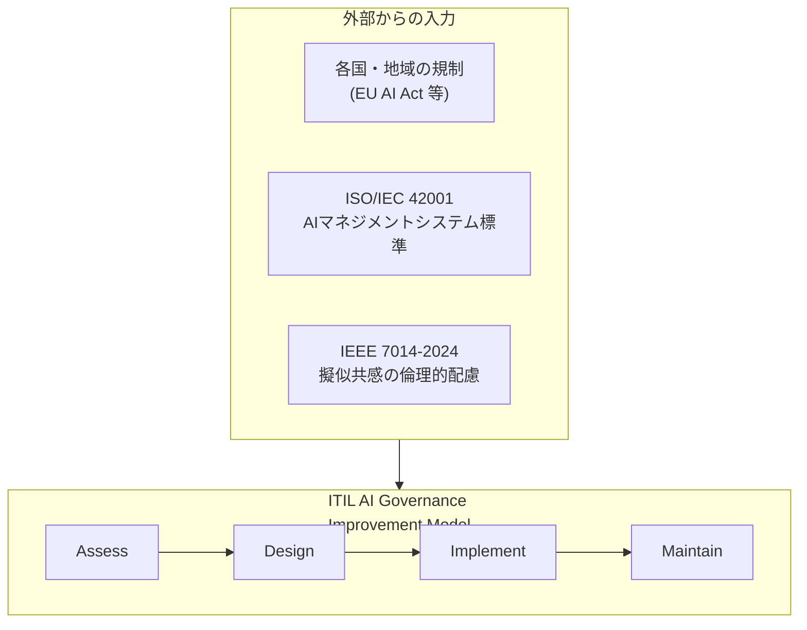

#### 7-3-1. 世界的な規制の潮流（The Global Regulatory Landscape）

- **EU AI Act（EU AI法）**: AI システムをリスクレベル（許容できないリスク／高リスク／限定リスク／最小リスク）に応じて分類し、高リスクシステムには厳格な義務を課す、世界初の包括的な AI 規制。ITIL AI Governance では、この分類手法を組織内のリスク評価にマッピングする方法が扱われます。
- **各国・業界固有の規制**: NIS2（EU のサイバーセキュリティ指令）など、地域・業界ごとの規制も統治の入力として考慮する必要があります。

#### 7-3-2. 外部標準との関係

- **ISO/IEC 42001:2023**: 組織が AI マネジメントシステム（AIMS）を構築・運用するための国際標準。ITIL AI Governance の統制設計は、この標準が求める仕組み（方針・リスク管理・継続的改善）と整合させることができます。
- **IEEE 7014-2024**: 「自律・知能システムにおける模倣共感の倫理的考慮に関する標準」。チャットボット等（6Cの Communication 能力）が人間の共感を模倣する際の倫理的設計・運用・廃止に関する指針を提供します。

#### 7-3-3. サードパーティ・サプライヤー・エンドツーエンドのガバナンス

自社で開発した AI だけでなく、**サードパーティ製 AI（外部ベンダーが提供する AI 機能）やサプライチェーンに組み込まれた AI** も統治の対象です。契約条項（データ利用範囲、説明責任の所在）や、サプライヤー監査を通じて、エンドツーエンド（end-to-end）でガバナンスの一貫性を確保します。

| 標準・規制 | 種別 | 主な役割 |
|---|---|---|
| EU AI Act | 法規制 | AIシステムをリスクベースで分類し、義務を課す |
| ISO/IEC 42001:2023 | 国際標準（マネジメントシステム） | 組織のAIマネジメント体制の認証・整備の枠組み |
| IEEE 7014-2024 | 技術標準（倫理） | AIによる模倣共感の倫理的設計指針 |

> **ベストプラクティス**
> - 規制・標準は「対応すべきチェックリスト」としてではなく、Assess-Design-Implement-Maintain サイクルへの継続的な入力として運用プロセスに組み込む。
> - 保証エビデンスパックは、監査direct前に慌てて作るのではなく、日々の運用ログ・監視結果から自動的に蓄積される仕組みを最初から設計する。
> - サードパーティ AI を調達する際は、契約段階で「説明責任の所在」「インシデント時の通知義務」「監査への協力義務」を明記する。

*出典: [AGILEPM HUB シラバス (Module 7)](https://agilepmhub.com/itil-ai-governance), [itcko.sk 解説記事](https://itcko.sk/en/itil-v5-ai-governance-module/), [ISO/IEC 42001 公式ページ](https://www.iso.org/standard/81230.html), [IEEE 7014-2024 公式ページ](https://standards.ieee.org/ieee/7014/7648/), [EU AI Act 公式情報](https://artificialintelligenceact.eu/)*

---

## 第8章: 自分の役割・業界で AI を活かす
*(Module 8: AI in Your World: Unlock AI in Your Role, Industry, and Organizational Function)*

### 8-1. 価値実現（Value Realization）: 期待価値から実際価値へ

AI 導入プロジェクトの多くは「期待された価値（expected value）」を計画段階で語りますが、実際に運用してみて得られる「実際の価値（actual value）」との間にギャップが生じがちです（本ガイド冒頭で触れた「GenAI投資の95%がROIを実感できていない」という統計はまさにこのギャップの表れです）。Module 8 では、このギャップを構造的に把握し、埋めていく視点を扱います。

### 8-2. 業界・組織機能ごとの AI ユースケース

AI の価値は業界・機能ごとに異なる形で現れます。例えば:

- **ITSM／サービスデスク**: チケットの自動トリアージ（Cognition）、FAQ対応の自動化（Communication）
- **人事機能**: 採用選考の一次スクリーニング（Cognition）※バイアスリスクが高いため統制が特に重要
- **金融・与信**: 与信判断支援（Cognition）※説明可能性・規制対応が必須
- **製造・運用**: 予知保全（Cognition）、マニュアル生成（Creation）

### 8-3. AI ユースケース評価テンプレート

Module 8 では、シナリオを解釈し、AI ユースケースを体系的にアセスメントするための包括的なテンプレート（full AI use-case assessment template）が扱われます。このテンプレートには、少なくとも次の要素が含まれます。

| 評価項目 | 確認すべき内容 |
|---|---|
| ステークホルダー (Stakeholders) | 誰がこのAIの利用者・影響を受ける当事者か（顧客・従業員・規制当局など） |
| サービス特性 (Service characteristics) | どのプロダクト・サービスライフサイクル段階に位置するか |
| 6C 能力の組み合わせ | どの Capability（Creation/Curation/Clarification/Cognition/Communication/Coordination）を使っているか |
| ガバナンス視点 | 意思決定権限／倫理／データ／規制の4視点それぞれの要件 |
| ガバナンスパターン | Directive/Guided/Federated/Autonomous のどれが適切か |
| 期待価値と実際価値 | 想定していた成果と、実際の運用結果のギャップ |
| リスク優先度 | 発生可能性×影響度によるリスクレベル |

> **ベストプラクティス**
> - 新規 AI ユースケースの企画には、必ずこの評価テンプレートを使い、思いつきでの導入を避ける。
> - 「期待価値」を定義する際は、必ず測定可能な指標（KPI）とセットにし、後から「実際価値」と比較できるようにしておく。
> - 業界・機能ごとにベストプラクティス事例を蓄積し、組織内のナレッジベースとして共有する（車輪の再発明を防ぐ）。

*出典: [AGILEPM HUB シラバス (Module 8)](https://agilepmhub.com/itil-ai-governance), [ITSM Academy コースアウトライン (Module 8)](https://itsmacademy.com/itil-ai-governance-course)*

---

## 第9章: 他のフレームワーク・規制・標準との連携
*(Module 9: Connecting AI Governance with Frameworks, Regulations, and Standards)*

### 9-1. なぜフレームワーク同士の連携が必要か

AI ガバナンスは ITIL だけで完結するものではありません。プロジェクト管理の PRINCE2、ソフトウェア開発・運用の DevOps、そして外部の法規制・標準（EU AI Act、ISO/IEC 42001、IEEE 7014-2024）は、それぞれ**異なる問い（question）に答える**ために存在します。Module 9 では、これらが競合するのではなく補完し合う関係にあることを理解します。

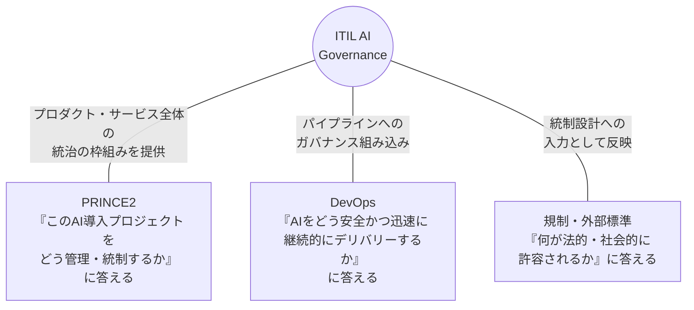

| フレームワーク／標準 | 主に答える問い |
|---|---|
| **ITIL (AI Governance)** | AIをどう責任を持って統治し、価値創出とリスク管理を両立させるか |
| **PRINCE2** | AI導入プロジェクトをどのステージ・意思決定ポイントで統制するか |
| **DevOps** | AIモデル・機能の変更をどう安全かつ継続的にデリバリーするか |
| **ISO/IEC 42001** | 組織のAIマネジメントシステムをどう認証可能な形で構築するか |
| **IEEE 7014-2024** | AIによる模倣共感をどう倫理的に設計・運用するか |
| **各国規制 (EU AI Act 等)** | 何が法的に許容され、何が禁止・制限されるか |

### 9-2. PRINCE2 との連携

PRINCE2 のステージゲート（各ステージの節目にある意思決定ポイント）に、AI ガバナンスの承認プロセスを組み込むことで、プロジェクトの進行と統制を同期させます。例えば、「ビジネスケース承認」のタイミングで AI ユースケース評価テンプレート（第8章）を用いたリスク評価を必須化する、といった連携が考えられます。

### 9-3. DevOps との連携

DevOps の CI/CD パイプラインに、ガバナンス上のチェック（バイアステスト、セキュリティスキャン、決定境界の自動検証など）を**技術的なゲート**として組み込むことで、「ガバナンスがデリバリー速度を落とす」という対立構造を避け、「安全に速く届ける（DevSecOps 的発想の AI 版）」を実現します。第7章で触れた「7つの実装経路」のひとつに、まさにこの「DevOps パイプラインへの組み込み」が含まれています。

### 9-4. 全体像の統合

本ガイドで扱った主要モデル・概念を1枚に統合すると、次のような関係になります（※これは公式シラバスにある "seven key models in one view" というトピックタイトルを踏まえた、本ガイド独自の整理です。実際の7モデルの厳密な定義は公式eBookを参照してください）。

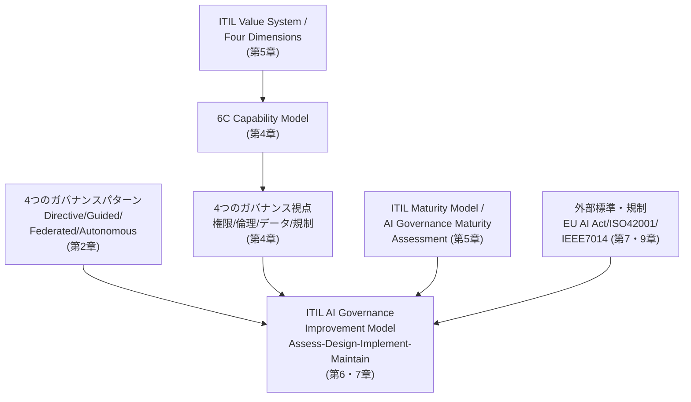

> **ベストプラクティス**
> - AI 導入プロジェクトの立ち上げ時に、PMO（PRINCE2運用チーム）と AI ガバナンス担当を必ず同席させ、ステージゲートへの統制組み込みを最初から設計する。
> - DevOps チームに対しては、ガバナンス要件を「後工程の承認待ち」ではなく「パイプライン内の自動チェック」として提示し、開発速度への影響を最小化する。
> - ISO/IEC 42001 の認証取得を目指す組織は、ITIL AI Governance Improvement Model の Assess ステップの成果物をそのまま ISO 42001 のギャップ分析の入力として再利用する。

*出典: [AGILEPM HUB シラバス (Module 9)](https://agilepmhub.com/itil-ai-governance), [ITSM Academy コースアウトライン (Module 9)](https://itsmacademy.com/itil-ai-governance-course)*

---

## 第10章: 試験対策まとめと用語集

### 10-1. 試験の心構え

- **オープンブックだが時間管理が重要**: 90分・40問はシナリオ読解の時間を含めると決して余裕はありません。eBook の該当箇所をすぐ探せるよう、事前に目次・索引に慣れておく。
- **シナリオベース出題への対策**: 実在の企業を想定した架空シナリオ（"ITIL Car Rental Scenario" など）が提示され、そこに登場する状況にモデル・原則を当てはめる形式の出題が中心です。丸暗記よりも「このシナリオでは、どのガバナンスパターン／統制タイプが適切か」を判断する練習が有効です。
- **Bloom's Taxonomy BL2〜BL4 を意識する**: 単純な用語の暗記（BL1）ではなく、「理解（BL2: 概念を正しく説明できる）」「適用（BL3: シナリオに当てはめられる）」「分析（BL4: 複数要素を比較・統合できる）」のレベルで問われます。

### 10-2. 章ごとの学習チェックリスト

| 章 | 最低限説明できるようになるべきこと |
|---|---|
| 1 | 良いガバナンスの必要性、AIの職場への影響、統治成熟度スペクトラム |
| 2 | ガバナンス/マネジメント/リーダーシップの違い、4つのガバナンスパターン |
| 3 | Narrow/Generative/Agentic AI の違い、AIの主要リスクカテゴリ |
| 4 | 6C モデルの6要素、4つのガバナンス視点、リスクと対策の対応関係 |
| 5 | ITIL Value System、Four Dimensions への AI の組み込まれ方、Guiding Principles |
| 6 | Improvement Model の Assess/Design、リスク優先度評価、preventive/detective/corrective |
| 7 | Improvement Model の Implement/Maintain、EU AI Act・ISO42001・IEEE7014 の役割 |
| 8 | AI ユースケース評価テンプレート、期待価値と実際価値のギャップ |
| 9 | ITIL・PRINCE2・DevOps・外部標準がそれぞれ答える問いの違い |

### 10-3. 用語集（日英対照）

| 日本語 | 英語 | 意味 |
|---|---|---|
| ガバナンス | Governance | 方向づけ・監督・説明責任の枠組み |
| ガバナンスギャップ | Governance gap | AI利用の広がりに統治の整備が追いついていない状態 |
| ガバナンスパターン | Governance pattern | 意思決定の裁量配分を分類する4類型（Directive/Guided/Federated/Autonomous） |
| ガバナンス視点 | Governance perspective | 統治を評価する4つの切り口（権限・倫理・データ・規制） |
| 6Cモデル | ITIL AI Capability Model (6C) | AIの機能を6分類する枠組み |
| シャドーAI | Shadow AI | 正式な承認を経ずに現場が独自導入するAI利用 |
| エージェント型AI | Agentic AI | 目標達成のため自律的に計画・実行するAI |
| ハルシネーション | Hallucination | もっともらしいが誤った内容をAIが生成すること |
| 決定境界 | Decision boundary | AIが自律判断してよい範囲と人間承認が必要な範囲の境界線 |
| 予防的統制 | Preventive control | 問題の発生自体を未然に防ぐ統制 |
| 発見的統制 | Detective control | 発生した問題を検知する統制 |
| 是正的統制 | Corrective control | 検知した問題を修正する統制 |
| リスク優先度評価 | Risk priority rating | 発生可能性×影響度でリスクの大きさを評価する手法 |
| スチュワードシップ | Stewardship | 統制よりも能動的・協働的にAIを良い方向へ導く姿勢 |
| 保証エビデンスパック | Assurance evidence pack | 統制の実効性を証明するための証拠一式 |
| 比例的ガバナンス | Proportionate governance | リスクの大きさに見合った強度の統制のみを課す考え方 |

---

## 参考文献・出典一覧

本ガイドの内容は、以下の一次情報源（PeopleCert 公式サイトおよび PeopleCert 認定トレーニングパートナー各社の公開シラバス、関連標準の公式ページ）をもとに作成しました。特にモジュール構成・学習目標の詳細については、複数の独立したソースで内容が一致していることを確認しています。

1. PeopleCert 公式製品ページ（ユーザー提供URL） — https://www.peoplecert.org/browse-certifications/it-governance-and-service-management/ITIL-1/itil-ai-governance-version-5-4234
2. ITIL.com 公式資格ページ — https://www.itil.com/professionals/certifications/ITIL-AI-Governance-Version-5
3. ITSM Academy（PeopleCert認定ATO）コース詳細・全9モジュールアウトライン — https://itsmacademy.com/itil-ai-governance-course
4. AGILEPM HUB（PeopleCert認定ATO）コース詳細・全9モジュールアウトライン・試験詳細 — https://agilepmhub.com/itil-ai-governance
5. ITčko（PeopleCert認定関連企業）解説記事「ITIL v5 AI Governance: a new module for responsible AI management」 — https://itcko.sk/en/itil-v5-ai-governance-module/
6. GogoTraining ブログ「AI Governance – The ITIL Cert you Can't Live Without!」 — https://gogotraining.com/blog/2026/08/itil-ai-governance-the-itil-certification-you-cant-live-without/
7. Innovative Learning コース概要 — https://www.innovativelearning.eu/products/itil-5/itil-ai-governance-5.html
8. ITIL.org.uk トレーニングコース概要 — https://www.itil.org.uk/training/itil-extension-modules/itil-ai-governance-version-5-training-course
9. itsm.tools「ITIL (Version 5) Changes Explained」（6Cモデル・Four Dimensions の変更点） — https://itsm.tools/itil-version-5-vs-itil-4-key-changes/
10. PMG Academy「Information and Technology in ITIL Version 5」（6Cモデル各要素の説明） — https://www.pmgacademy.com/en/articles/itil/information-and-technology-in-itil-version-5-the-guide-for-the-ai-era-and-data-governance/
11. AXELOS ITIL ベストプラクティスページ — https://www.axelos.com/best-practice-solutions/itil
12. ISO/IEC 42001:2023（AIマネジメントシステム国際標準）公式ページ — https://www.iso.org/standard/81230.html
13. IEEE 7014-2024（模倣共感の倫理的配慮に関する標準）公式ページ — https://standards.ieee.org/ieee/7014/7648/
14. EU AI Act（EU AI法）解説ポータル — https://artificialintelligenceact.eu/

> **免責事項**: 本ガイドは公開情報をもとにした学習補助資料であり、PeopleCert の公式教材・公式見解を代替するものではありません。ITIL® は PeopleCert グループの登録商標です。試験対策の最終確認には、必ず購入した公式 eBook / Learning Resource Kit をご利用ください。また、ITIL AI Governance (Version 5) は比較的新しい資格であるため、シラバスや試験形式が今後改定される可能性があります。受験前に必ず PeopleCert 公式サイトで最新情報をご確認ください。
