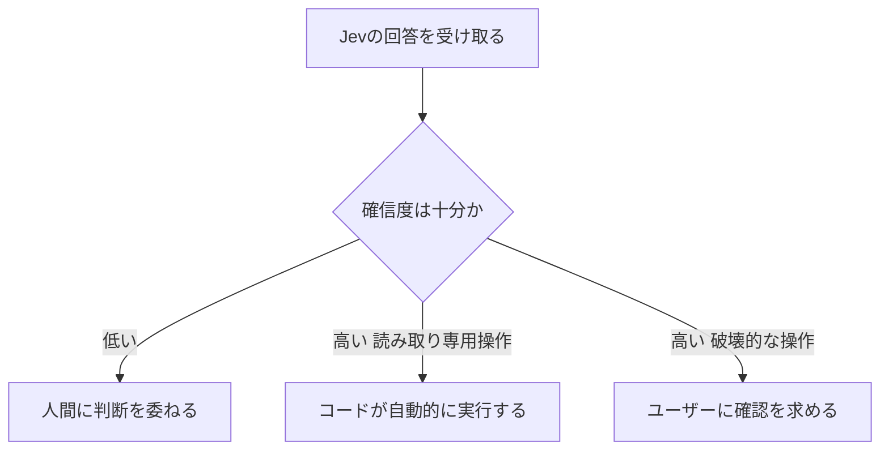
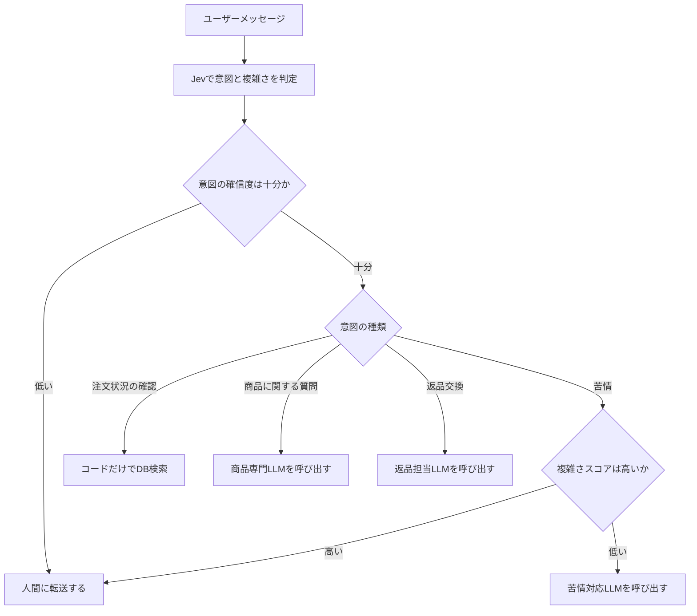

# Jev: TypeScriptで学ぶ System One AI 完全ガイド

> このガイドは、書籍『[Jev: The Definitive Guide to System One AI in TypeScript](https://leanpub.com/Jev)』（著者: Edgar Milvus, Leanpub, 2026年9月21日時点で完成度100%・全20章）の構成をベースに、TypeSafe AI公式ドキュメント、LangChain公式ブログ、および著名な開発者による技術記事（Flavio Copes氏、DEV Community記事など）を2026年9月21日時点でWeb調査した内容を組み合わせ、初学者向けに再構成したものです。Jev（およびSystem One AI）自体が2026年9月15日に発表されたばかりの新しい技術であるため、本ガイドの一次情報の多くはTypeSafe AI公式ドキュメント（`docs.typesafe.ai`）に基づきます。各章末に参照元を明記し、巻末に参考文献一覧を掲載しています。

---

## この記事について

💡 この章では、これから何を学ぶのか、そしてなぜこの技術が生まれたのかを説明します。

これまでソフトウェア工学は「コードは決定的（＝同じ入力なら必ず同じ結果になること）で、型はコンパイル時に検証できる」という暗黙の前提の上に成り立ってきました。しかし大規模言語モデル（LLM＝Large Language Model、大量のテキストで訓練された文章生成AI）が登場すると、開発者は「サポートチケットが"課金"の話か"技術的な"話かを判定する」といった単純な判断のために、数十億パラメータの巨大なテキスト生成モデルを呼び出し、3〜8秒待って150トークン（＝AIがテキストを生成する際の処理単位）の応答を受け取り、それを正規表現でパースする、という重い処理を強いられてきました。

TypeSafe AIという企業が2026年9月15日に発表した**Jev**は、この「重すぎるAI判断」という課題を解決するために生まれた、テキストを生成しない新しいタイプのAIモデルです。本ガイドでは、Jevの仕組みから、TypeScript SDKを使った実装パターン、そして実運用で気をつけるべき落とし穴まで、ステップバイステップで解説します。

📖 このセクションで登場した用語
- LLM：大量のテキストで訓練され、文章や会話を生成できるAIモデルの総称
- トークン：AIがテキストを処理する際に使う最小の処理単位。単語より細かい場合が多い

---

## 第1章: なぜJevが生まれたのか — 「遅くて高いAI」という問題

💡 この章では、Jev登場前のソフトウェア開発者が抱えていた課題を説明します。

ソフトウェアの中には「この画像は猫かどうか」「このメッセージは緊急か」といった、判断に幅がある問いがたくさんあります。こうした判断は人間なら一瞬で行えますが、コードにするのは困難です。従来、開発者はこの種の判断を次の3つの方法のいずれかで解決してきました。

1. `if`文や正規表現、決定木を手書きする — 高速で安価だが、意味の理解が必要な場面では脆くなる
2. 特定のラベル用に分類器（クラシファイア）を訓練する — 高速だが、タスクごとに学習データと訓練工程が必要
3. 汎用LLMに構造化出力（JSON形式など）を頼む — 学習不要で柔軟だが、生成に時間とコストがかかる

TypeSafe AIの創業者Diogo Almeida氏（OpenAIでRLHFとInstructGPTの開発に携わった人物）は、公式ブログ「[Introducing System One Models & Jev](https://typesafe.ai/blog/introducing-system-one-models-and-jev)」の中で、この3つ目の選択肢が抱える性能上の問題を指摘しています。既存のフロンティアモデルの応答時間は3秒から329秒かかる一方、TypeSafeのモデルは70ミリ秒から500ミリ秒で応答するとしており、コードに組み込んで使うには生成AIは「遅すぎる」というのが出発点でした。

この問題を、書籍『Jev: The Definitive Guide to System One AI in TypeScript』は心理学者ダニエル・カーネマンの著書『ファスト＆スロー』にある「システム1（速い・直感的な思考）」と「システム2（遅い・熟考的な思考）」という区分を使って説明しています。多くのソフトウェアの判断は「これはシステム1で十分」なのに、これまでのAI活用は毎回「システム2」の重量級モデルを呼び出していた、というのが本書の核心的な主張です。

📖 このセクションで登場した用語
- 決定木：条件分岐を木構造で表した判断ロジック
- 分類器（クラシファイア）：入力を決められたカテゴリに振り分けるモデル
- RLHF：人間のフィードバックを使ってAIモデルを訓練する手法（Reinforcement Learning from Human Feedback）

---

## 第2章: JevとSystem One AIとは何か

💡 この章では、Jevが技術的に何であり、既存のLLMと何が違うのかを説明します。

**Jev**は、TypeSafe AIが2026年9月15日に発表した最初の公開モデルで、同社が「**System One Model**（システムワンモデル）」と呼ぶ新しいモデル群の第一弾です。最大の特徴は、テキストを一切生成しないという点です。代わりに、あなたのコードが渡した「状態（state）」と「型付きの質問（questions）」を評価し、確率が付いた構造化された答えを返します。

> Jevは実際には従来型のLLMではなく、テキストを生成しません。TypeSafe AIのチームが「System Oneモデル」と呼ぶものです。System Oneモデルは、ソフトウェアが直接利用できる高速で構造化された判断を行うために作られたAIモデルのクラスです。System Oneモデルは状態を評価し、型付きの答えと確率を返します（[LangChain公式ブログ](https://www.langchain.com/blog/building-a-harness-with-jev)より）

Jevは**RLCD（Reinforcement Learning for Calibrated Decisions＝較正された意思決定のための強化学習）**という、RLHFとは異なる手法で訓練されています。TypeSafe AIのブログによれば、既存のLLMが人間の好みや検証可能な報酬を最適化するのに対し、System One + Jevは「較正された判断」、つまりSystem Oneタスクにおいて認識論的に正直な確率を持つ答えを最適化するとしています。「較正されている」とは、Jevが確率0.80である命題を真と答えたとき、実際にその命題が約80％の頻度で真である、という意味です。不確実性が「隠れた失敗」ではなく、ソフトウェアが直接扱える一級のデータになる、というのがこの設計の狙いです。

### Jevと既存LLMの違い（比較表）

TypeSafe AI公式ブログが公開している比較表を、要点を絞って引用します。

| 観点 | 既存のLLM | System One + Jev |
| --- | --- | --- |
| 最適化手法 | RLHF / RLVR（人間の好み・検証可能な報酬） | RLCD（較正された判断） |
| 出力形式 | 自由形式の文字列（生成テキスト） | 型付き構造化データ |
| サンプリング方式 | 逐次的（トークンを1つずつ生成） | 並列（すべての質問を一度に評価） |
| 入力トークン単価 | $0.20〜$10 / 100万トークン | $0.042 / 100万トークン |
| 出力トークン | 入力の約5倍高い | 無料（課金対象外） |
| 応答時間 | 3秒〜329秒 | 70ミリ秒〜500ミリ秒 |

（出典: [TypeSafe AI公式ブログ](https://typesafe.ai/blog/introducing-system-one-models-and-jev)、[DEV Community記事](https://dev.to/valyuai/how-to-use-jev-a-practical-guide-to-typesafes-system-one-model-g5e)）

### Jevと生成AI系の開発ツールとの違い

技術ブロガーのFlavio Copes氏は自身の記事「[A deep dive into Jev](https://flaviocopes.com/jev/)」の中で、JevをChatGPTやCursor、Claude Codeのようなコーディングエージェントと対比し、次のように整理しています。ChatGPTのようなツールでは、AIが主要なインターフェースまたは作業者そのものである一方、Jevはアプリケーション内部にある小さな部品であり、コードが1つの判断を必要とする箇所に追加するもので、製品の残りの部分は通常のコードのままであるという説明が分かりやすいたとえです。

言い換えると、Jevは「賢い`if`文」です。通常のコードは`if (order.total > 100)`のように、計算できる値でしか分岐できません。しかし「このメッセージは怒っているか」「このコードレビューはどれくらい危険か」のように、意味の理解が必要な条件では、この賢い`if`文としてJevを差し込むことができます。

### 名前の由来

TypeSafe AI公式ブログのFAQによると、「System 1思考」という名称はダニエル・カーネマンの著書『ファスト＆スロー』に着想を得ており、速く直感的なSystem 1思考と、遅く熟考的なSystem 2推論の区別に基づいているとしています。また「Jev」という名前は、経済学者ウィリアム・スタンレー・ジェヴォンズ（ジェヴォンズのパラドックスで知られる人物）にちなんでおり、蒸気機関の効率化が石炭消費量を「減らす」のではなく「増やした」ように、知能のコストが1桁下がるたびに新しい用途が桁違いに増える、という同社の賭けを表しています。

📖 このセクションで登場した用語
- 較正（キャリブレーション）：モデルが出す確率が、実際の正解率と一致している度合いのこと
- RLCD：較正された意思決定のための強化学習。Reinforcement Learning for Calibrated Decisionsの略
- RLVR：検証可能な報酬を使った強化学習。Reinforcement Learning with Verifiable Rewardsの略

---

## 第3章: TypeScript環境を整える

💡 この章では、実際にJevをTypeScriptプロジェクトで呼び出すための準備を説明します。

TypeSafe AIは公式のJavaScript / TypeScript SDKとして`@typesafe-ai/sdk`を提供しています。TypeScriptはJevの「自然な言語」だと本書は位置づけています。なぜなら、Jevが返す3つの意味プリミティブ（Choice・Score・Noul）は、TypeScriptの判別可能なユニオン型（discriminated union＝タグ付きで型を見分けられる合併型）やコンパイル時の型検証と相性が良いためです。

このコードの構造：
- Node.js 20以降が必要（ESM・CommonJS・TypeScriptの型定義の3形式を同梱）
- 環境変数`TYPESAFE_API_KEY`にAPIキーを設定する
- `TypeSafeClient`をインスタンス化し、`.systemOne()`メソッドを呼ぶ

```bash
# npm でSDKをインストールする。Node.js 20以上が前提
npm install @typesafe-ai/sdk
```

```bash
# APIキーは環境変数として渡す。コード中に直接書き込まない
export TYPESAFE_API_KEY="sk-..."
```

TypeSafe公式ドキュメントに掲載されている最小のサンプルコードは次の通りです。

```typescript
// choice関数とTypeSafeClientクラスをSDKから読み込む
import { choice, TypeSafeClient } from "@typesafe-ai/sdk";

// クライアントは環境変数 TYPESAFE_API_KEY を自動的に読み取る
const client = new TypeSafeClient();

// systemOne() が実際にJevへリクエストを送るメソッド
const response = await client.systemOne({
  // state は「Jevに何を見せるか」。ここでは単純な文字列オブジェクト
  state: { document: "I was charged twice. Please fix this ASAP." },
  questions: {
    // choice() は「複数の選択肢から1つを選ばせる」質問を組み立てるヘルパー
    category: choice("What is this ticket about?", {
      billing: null,
      technical: null,
      other: null,
    }),
  },
});

// answers.category.choice には選ばれた選択肢のラベルが入る
console.log(response.answers.category.choice);
```

（出典: [TypeSafe AI公式 JavaScript SDKドキュメント](https://docs.typesafe.ai/sdk/javascript)）

動作トレース（入力例での変数の動き）:

```
入力: state.document = "I was charged twice. Please fix this ASAP."
Step 1: client.systemOne() がAPIへリクエストを送信
Step 2: Jevが category 質問を billing / technical / other の3択で評価
Step 3: response.answers.category.choice に最も確率の高い選択肢（例: "billing"）が入る
```

【業務開発版】型安全・可読性優先。TypeScriptの型チェック（`tsc`）が通ることを前提に、`questions`オブジェクトを1つの定数にまとめ、閾値もコード中に明示する書き方が推奨されています（後述の第8章で詳しく扱います）。

📖 このセクションで登場した用語
- ESM／CommonJS：JavaScriptのモジュール読み込み方式の種類。SDKは両方に対応している
- discriminated union（判別可能なユニオン型）：型を後から自由に差し込める仕組みではなく、`type`のようなタグ付きフィールドで、どの型かをTypeScriptに判定させる仕組み

---

## 第4章: 3つの基本プリミティブ — Choice, Score, Noul

💡 この章では、Jevに投げられる質問の型が3種類しかないこと、それぞれの使い分けを説明します。

Jevで扱えるAPIは、突き詰めると3種類の「質問の型（プリミティブ）」だけです。TypeSafe公式ドキュメントの[Primitives（プリミティブ）ページ](https://docs.typesafe.ai/primitives)は次のように整理しています。

| 型 | 何を答えるか | 返ってくる値 |
| --- | --- | --- |
| Choice | この中のどれか？ | 選択された値、各選択肢の確率、確信度 |
| Score | どの段階に位置するか？ | スコア、凡例、各段階の確率、確信度 |
| Noul | これは真か？ | 0から1までの確率 |

（出典: [TypeSafe AI公式ドキュメント Primitives](https://docs.typesafe.ai/primitives)）

質問には必ず「ID（あなたのコードが参照するためのキー）」「type（種類）」「instructions（質問文そのもの）」の3つが必要で、ChoiceとScoreにはさらに`criteria`（選択肢や段階の定義）が必要です。

### Choice: 選択肢から1つを選ぶ

「どのチームが対応すべきか」「この40個のリンクのうちどれが料金ページか」のように、順序のない固定の選択肢から1つを選ばせたいときに使います。最大255個の選択肢を指定できます。

```typescript
// choice() の第1引数が質問文、第2引数がラベルと説明のマップ
const departmentQuestion = choice("Which team should handle this message?", {
  billing: "Payment or subscription issues",
  technical: "Bugs or integration problems",
  sales: "Pricing or account questions",
  // "other" を用意しておくと、どれにも当てはまらない入力でも
  // 無理にどれかへ押し込めずに済む
  other: "None of the above",
});
```

返ってくる答えの形（イメージ）:

```json
{
  "department": {
    "type": "choice",
    "choice": "billing",
    "probabilities": { "billing": 0.84, "technical": 0.15, "sales": 0.0, "other": 0.01 },
    "confidence": 0.6
  }
}
```

`choice`が最も確率の高い選択肢、`probabilities`が全選択肢の確率分布、`confidence`はその分布がどれだけ「一極集中しているか」を1つの数値にまとめたものです。公式ドキュメントとFlavio Copes氏の記事はいずれも、入力がどの選択肢にも当てはまらない可能性がある場合は必ず`other`のような逃げ道の選択肢を用意すべきだと勧めています。理由は、逃げ道がないとモデルは必ずどれかを選ばざるを得ないためです。

### Score: 尺度上の位置を答える

「バグの深刻度」「顧客の苛立ちの度合い」のように、段階的な尺度上の位置を答えさせたいときに使います。段階は2〜10個の範囲で指定できます。

```typescript
// score() の第2引数は「低い順」に並べた段階の配列
const severityQuestion = score("How severe is the reported issue?", [
  "Cosmetic; no impact on functionality",
  "Broken or degraded feature, but a workaround exists",
  "Blocking issue; no workaround exists",
]);
```

Flavio Copes氏の記事によれば、返ってくる`score`は各段階番号を確率で重み付けした平均値であり、段階と段階の間の値になることもあるため、例えば`1.3`は「主に段階1（壊れているが回避策あり）だが、一部段階2（完全にブロック）の重みもある」という意味になります。重要なのは、`probabilities`（各段階の確率分布）を`score`と一緒に読むことです。スコア1.0でも、全ての重みが段階1に集中している場合と、段階0と段階2に半々ずつ分かれている場合とでは全く状況が異なり、この違いを見分けるのが`confidence`の役割です。

### Noul: yes/noを確率で答える

「この顧客は返金を求めているか」「このメッセージには緊急性があるか」のように、単純なyes/noを確率として答えさせたいときに使います。

```typescript
// noul() は最もシンプルな質問。第1引数は質問文のみ
const urgentQuestion = noul("The message conveys urgency or time-sensitivity");
```

返ってくる値は`noul`という1つの数値（0〜1）だけです。1に近いほど「強くyes」、0に近いほど「強くno」、0.5付近は「yesともnoとも言い切れない」ことを意味します。Noulには`confidence`フィールドがありません。理由は、確率そのものがすでに不確実性を表しているためです。

TypeSafe公式ドキュメントは、Noulの質問文は「高い値＝yes」になるように書くことを推奨しています。例えば「顧客は怒っているか」という問いに対し、`true`が「no」を意味するような反転した設計にすると、モデルの精度が落ちるだけでなく、半年後にコードを読む人も混乱します（この点は第12章の「矛盾した指示と基準」でも再度触れます）。

📖 このセクションで登場した用語
- criteria：ChoiceやScoreの選択肢・段階を定義するフィールド
- 凡例（legend）：Scoreの各段階番号が何を意味するかを示す対応表

---

## 第5章: State（状態）の設計 — Jevに何を見せるか

💡 この章では、Jevに渡す「状態（state）」をどう組み立てるかを説明します。

**state**は、質問の対象となるコンテンツそのものです。文字列でも、名前付きフィールドを持つJSONオブジェクトでも、会話やレコードの配列でも構いません。

```typescript
// 名前付きフィールドを持つオブジェクトのstate
const state = {
  message: "My card was charged twice for order A-104.",
  order: { id: "A-104", charges: [49, 49] },
  refund_policy: "Duplicate charges are refunded in full.",
};
```

オブジェクト形式のstateを使う利点は、バッククォートで囲んだドット・インデックス記法（例: `` `order.charges` ``）を使って、質問がstateのどの部分を指しているかを明示できることです。

```typescript
const policyQuestion = noul(
  "Does `refund_policy` cover the situation described in `message`, given `order.charges`?"
);
```

Flavio Copes氏の記事は、このバッククォート記法についてstateのどの部分を質問が指しているかについての曖昧さを取り除くものだと説明しています。

### stateに関する2つの鉄則

1. **質問に必要なものだけを渡す**：TypeSafe公式のjaggednessページ（第12章で詳述）は、判断に関係ない内容がstateに増えるほど精度が落ちると明言しています。顧客の全履歴ではなく、その問い合わせに関係する部分だけを渡しましょう。
2. **テキストのみ対応**：2026年9月時点で、stateとして送れるのはテキストのみです。画像・音声・動画はまだサポートされていません。

### コンテキストの上限

DEV Communityの実践ガイド記事によれば、状態とすべての質問を合わせて64,000トークン、状態と最長の1つの質問を合わせて32,000トークンという制限があるとされています。Jevは状態を一度取り込んで、その上で複数の質問を並列に評価する設計であるため、この制限はLLMのコンテキストウィンドウとは少し性質が異なります。

📖 このセクションで登場した用語
- ドット・インデックス記法：`order.charges[0]`のように、オブジェクトの階層やリストの位置を「.」と添字で表す書き方
- コンテキストウィンドウ：AIモデルが一度に処理できるテキスト量の上限

---

## 第6章: 型安全に結果を受け取る

💡 この章では、TypeScriptの型システムを使ってJevの回答を安全に扱う方法を説明します。

TypeScript SDKでは、質問の作り方に応じて回答の型が自動的に推論されます。これは、ジェネリクス（＝型を後から自由に差し込める仕組み。`Array<number>`の`number`の部分がその一例）を活用した設計です。

```typescript
import { choice, noul, TypeSafeClient } from "@typesafe-ai/sdk";

const client = new TypeSafeClient();

const response = await client.systemOne({
  state: { document: "I was charged twice. Please fix this ASAP." },
  questions: {
    category: choice("What is this ticket about?", {
      billing: "Payment or subscription issues",
      technical: "Bugs or integration problems",
      other: "Anything else",
    }),
    urgent: noul("The message conveys urgency"),
  },
});

// answers.category.choice は 'billing' | 'technical' | 'other' として型推論される
console.log(response.answers.category.choice); // types inferred from your questions
```

（出典: [DEV Community実践ガイド](https://dev.to/valyuai/how-to-use-jev-a-practical-guide-to-typesafes-system-one-model-g5e)）

Flavio Copes氏の解説によれば、こうした型推論のおかげで`answers.category.choice`は`'bug_report' | 'feature_request' | 'billing' | 'other'`のようなリテラル型として扱われ、存在しないラベルを参照しようとするとコンパイル時エラー（＝TypeScriptがJavaScriptに変換される段階で検出するエラー）になります。`switch`文で全パターンを網羅しているかを保証したい場合は、`never`型への代入を使ったチェックを加えることもできます。

【TS固有ポイント】`unknown`型が「`any`より安全な『型不明』の型」であるのと同様に、Jevの回答型は「文字列（string）より安全な『選択肢が限定されたユニオン型』」だと捉えると理解しやすいです。`any`のように何でも受け入れるのではなく、あなたが`criteria`で定義した値だけがコンパイル時に許可されます。

📖 このセクションで登場した用語
- ジェネリクス：型を後から自由に差し込める仕組み
- リテラル型：`'billing'`のように、特定の値そのものを型として扱う仕組み
- コンパイル時エラー：TypeScriptがJavaScriptに変換される段階で検出されるエラー

---

## 第7章: 確信度（confidence）を読み解く

💡 この章では、Jevが返す`confidence`をどうコードの分岐条件に使うかを説明します。

ChoiceとScoreの回答には必ず`confidence`（0〜1）が付いています。TypeSafe公式ブログは、常にすべての出力に確信度と不確実性を伴わせており、較正されている（確信度が高いほど精度が高い）、そして一貫性がある（似た入力には似た答えを返す）ことを特徴として挙げています。

Flavio Copes氏の記事が提案する、確信度を3段階に分けて扱うパターンをTypeScriptで書くと次のようになります。

このコードの構造：
- `action.confidence`が低ければ人間に転送する
- 読み取り専用の操作は確信度の閾値を低めに設定する
- 破壊的な操作（送金の承認など）は確信度の閾値を高めに設定する

```typescript
const { answers } = await client.systemOne({
  state: userMessage,
  questions: {
    action: choice("What is the user trying to do?", {
      check_balance: "View the account balance",
      approve_transfer: "Approve the pending withdrawal",
      support: "Get help with a problem",
    }),
  },
});

const action = answers.action;

if (action.confidence < 0.5) {
  // 確信度が低い = モデルが本当に迷っている状態。無理に自動化しない
  routeToHuman(userMessage);
} else if (action.choice === "check_balance") {
  // 読み取り専用操作なので、確信度のハードルは低くてよい
  showBalance(accountId);
} else if (action.choice === "approve_transfer") {
  // お金が動く操作なので、確信度のハードルを高く設定する
  if (action.confidence > 0.9) {
    confirmThenExecute(accountId);
  } else {
    askUserToConfirm(accountId);
  }
}
```

（出典: [Flavio Copes氏「A deep dive into Jev」](https://flaviocopes.com/jev/)）

以下は確信度に基づく分岐の流れを図にしたものです。上から下へ読み進めてください。



各ノードの意味：
- 「Jevの回答を受け取る」：`systemOne()`の呼び出し結果からChoiceまたはScoreの答えを取り出す段階
- 「確信度は十分か」（ひし形）：`confidence`の値を、その操作のリスクに応じた閾値と比較する分岐
- 「人間に判断を委ねる」：確信度が低いときの安全策。無理に自動判断させない

TypeSafe公式ドキュメントは、確信度の閾値を「例として」0.5（レビューに回すか否かの境界）や0.9（破壊的な操作を確認なしで実行してよいかの境界）と紹介していますが、これらはあくまで出発点です。Flavio Copes氏は「保守的な値から始め、自分のデータで実行し、確信度と精度の関係をプロットしてから閾値を調整すべき」と助言しています。

📖 このセクションで登場した用語
- 閾値（しきいち）：ある行動を取るかどうかを決める境界となる数値

---

## 第8章: 投機的ファンアウト — 質問はまとめて聞く

💡 この章では、Jevならではの「質問はまとめて送るべき」という設計思想を説明します。

通常のLLM呼び出しでは、1回の呼び出しが高コストなので「まず安い質問を1つ送り、必要なら次の質問を送る」という段階的なアプローチが好まれます。しかしJevでは、1つのリクエスト内の質問はすべて**並列に**評価されるため、この直感は逆転します。DEV Community記事は次のように説明しています。

> 質問は並列に評価されるため、10個目の質問はトークン代こそかかるものの、時間はほぼ変わらない。これは「まず安い呼び出しをして、必要なときだけ追加で呼ぶ」という通常の発想を逆転させる。必要になりそうな質問はすべて先に聞いて、どの答えを使うかはコード側で決めればよい。

TypeSafeのクックブック（実践例集）による実測では、13個の質問を1回のリクエストにまとめることで、1問ずつ送る場合に比べて12.2倍安く、10.0倍速くなり、答えの内容は変わらなかったと報告されています。この手法をTypeSafeは「**Speculative Fan-Out（投機的ファンアウト）**」と呼んでいます。

このコードの構造：
- サポートチケットの分類に関わりそうな質問を、条件に関係なくすべて先に定義する
- `category`が`bug_report`のときだけ意味を持つ`bug_severity`も、無条件に聞いておく
- コード側が、実際に使う答えを選んで分岐する

```typescript
import { choice, noul, score, TypeSafeClient } from "@typesafe-ai/sdk";

const client = new TypeSafeClient();

// 質問を1つの定数にまとめておくと、レビュー時にここだけ読めばよくなる
const TRIAGE = {
  category: choice("What kind of ticket is `ticket`?", {
    bug_report: "Something is broken or behaving wrong",
    billing: "Charges, invoices, refunds, subscriptions",
    feature_request: "Asks for something that does not exist yet",
    other: null,
  }),
  // バグでない場合でも意味を持たない質問だが、まとめて聞いてしまう
  bug_severity: score("If `ticket` reports a bug, how severe is it?", [
    "Cosmetic; no impact on functionality",
    "Broken or degraded feature, but a workaround exists",
    "Blocking issue; no workaround exists",
  ]),
  has_repro_steps: noul("Does `ticket` include steps to reproduce a problem?"),
  refund_requested: noul("Does `ticket` ask for money back?"),
};

export async function triage(ticket: string) {
  const { answers } = await client.systemOne({
    state: { ticket },
    questions: TRIAGE,
  });

  const { category, bug_severity, has_repro_steps, refund_requested } = answers;

  // カテゴリの確信度が低ければ、無理に自動分類しない
  if (category.confidence < 0.6) {
    return { route: "human", reason: "unclear category" };
  }

  if (category.choice === "bug_report") {
    // bug_severity は bug_report のときだけ実際に参照される
    if (bug_severity.score > 1.5 && has_repro_steps.noul > 0.6) {
      return { route: "engineering", priority: "high" };
    }
    return { route: "bug_backlog" };
  }

  if (category.choice === "billing") {
    return { route: "billing", refundLikely: refund_requested.noul > 0.7 };
  }

  return { route: "human" };
}
```

（出典: [DEV Community実践ガイド](https://dev.to/valyuai/how-to-use-jev-a-practical-guide-to-typesafes-system-one-model-g5e)、[Flavio Copes氏の記事](https://flaviocopes.com/jev/)）

動作トレース：

```
入力: ticket = "The app crashes when I click save. Happens every time on Safari."
Step 1: TRIAGE 内の4つの質問がすべて同じ state に対して並列評価される
Step 2: category.choice が "bug_report"、confidence が 0.6 を超えると仮定
Step 3: bug_severity.score が 1.7、has_repro_steps.noul が 0.8 と仮定
Step 4: 条件 (1.7 > 1.5) && (0.8 > 0.6) が true なので、
        戻り値は { route: "engineering", priority: "high" }
```

第2の質問を送るべきタイミングについて、Flavio Copes氏は「コードが最初のリクエストを組み立てる時点でまだ持っていない情報が必要な場合（追加でstateを取得する必要がある場合や、最初の答えによって次の質問の選択肢自体が変わる場合）だけ、2回目のリクエストを送るべき」だと述べています。

📖 このセクションで登場した用語
- 投機的ファンアウト（Speculative Fan-Out）：使うかどうか分からない質問も含めて、まとめて1回のリクエストで送る設計パターン

---

## 第9章: コンポジットスコアリング — 判断を分解して合成する

💡 この章では、1つの複雑な判断を複数の単純な質問に分解し、コード側で重み付けして合成するパターンを説明します。

「この候補者はどれくらい優秀か」のように、複数の観点が混ざった曖昧な問いを1つのScoreに詰め込むと、モデルは何を根拠に採点すればよいか分からなくなり、確信度が下がります。Flavio Copes氏の記事は「各Scoreは1つの次元に留めるべき」だとし、TypeSafe公式ドキュメントも同様の注意を促しています。

代わりに、判断を独立した軸に分解し、それぞれをScoreとして尋ね、重みはコード側が持つ、というのが「**コンポジットスコアリング（Composite Scoring）**」パターンです。

このコードの構造：
- 「Python経験の深さ」「チームリーダー経験」「システム設計経験」という3つの独立したScoreを1回のリクエストで尋ねる
- 各Scoreの段階数が異なるため、最高段階の値で割って0〜1に正規化する
- 正規化した値に、コードが管理する重みを掛けて合成する

```typescript
const PRIORITY_QUESTIONS = {
  severity: score("How severe is the issue in `ticket`?", [
    "Cosmetic; no impact on functionality",
    "Broken or degraded feature, but a workaround exists",
    "Blocking issue; no workaround exists",
  ]),
  frustration: score("How frustrated is the author of `ticket`?", [
    "Calm, just stating facts",
    "Frustrated but civil",
    "Very angry or threatening to leave",
  ]),
  report_quality: score("How much does `ticket` give an engineer to work with?", [
    "No detail; just says something is broken",
    "Names the feature but no steps or environment",
    "Steps to reproduce or environment, but not both",
    "Steps to reproduce and environment",
  ]),
};

// 段階数がScoreごとに異なるため、最高段階の番号で割って正規化する
function normalized(answers: typeof PRIORITY_QUESTIONS, id: keyof typeof PRIORITY_QUESTIONS, raw: number) {
  const topLevel = PRIORITY_QUESTIONS[id].criteria.length - 1;
  return raw / topLevel;
}

export async function priority(ticket: string) {
  const { answers } = await client.systemOne({
    state: { ticket },
    questions: PRIORITY_QUESTIONS,
  });

  // 重みはコード側の定数として管理する。プロンプトを書き換えるのではなく
  // ここの数値を変えるだけでランキングの傾向を調整できる
  return (
    0.6 * normalized(PRIORITY_QUESTIONS, "severity", answers.severity.score) +
    0.3 * normalized(PRIORITY_QUESTIONS, "frustration", answers.frustration.score) +
    0.1 * normalized(PRIORITY_QUESTIONS, "report_quality", answers.report_quality.score)
  );
}
```

（出典: [Flavio Copes氏の記事](https://flaviocopes.com/jev/)、[DEV Community実践ガイド](https://dev.to/valyuai/how-to-use-jev-a-practical-guide-to-typesafes-system-one-model-g5e)）

このパターンの利点は、優先順位付けの結果がチームの感覚とズレたときに、プロンプトを書き直すのではなく重み係数（0.6、0.3、0.1の部分）を変えるだけで済むことです。これはA/Bテストの対象にもしやすく、Flavio Copes氏は「これがJevの一番の魅力だ」と述べています。

📖 このセクションで登場した用語
- 正規化（normalization）：異なる尺度の数値を、比較できるように同じ範囲（ここでは0〜1）に揃えること
- コンポジットスコアリング：1つの判断を複数の独立した軸に分解し、コード側で重み付けして合成するパターン

---

## 第10章: Two-Speed Architecture — JevとLLMの二段構え

💡 この章では、Jevと生成LLMをどう組み合わせるかという、本書の中心テーマを説明します。

書籍『Jev: The Definitive Guide to System One AI in TypeScript』の紹介文は、本書が教える設計思想を「**Two-Speed Architecture（二速アーキテクチャ）**」という言葉で表現しています。これは、Jevを稼働量の大部分（本書は目安として80％という数字を挙げています）を決定論的に処理する高速な「意味的なゲートキーパー」として配置し、開かれた合成（オープンエンドな文章生成など）が必要なタスクにだけ高価な生成LLMを温存する、という考え方です。

DEV Communityの実践記事が紹介する「**カスケード（Cascade）**」パターンは、この二速アーキテクチャをそのままコードにしたものです。

このコードの構造：
- まずJevで「意図（intent）」と「複雑さ（complexity）」を判定する
- 意図によって、LLMを呼ばずコードだけで処理する分岐、異なる専門LLMを呼ぶ分岐、人間に転送する分岐に分ける

```typescript
async function handle(message: string) {
  const { answers } = await client.systemOne({
    state: { message },
    questions: {
      intent: choice("What does the author of `message` want?", {
        order_status: "Where is my order, has it shipped, tracking",
        product_question: "How a product works, compatibility, specs",
        return_exchange: "Return, exchange, or replace an item",
        complaint: "Unhappy with service or product, wants a resolution",
      }),
      complexity: score("How much thought does a good answer to `message` need?", [
        "A lookup or a one-line fact",
        "A short explanation using product knowledge",
        "A judgment call with trade-offs or an unhappy customer",
      ]),
    },
  });

  if (answers.intent.confidence < 0.5) {
    return routeToHuman(message);
  }

  switch (answers.intent.choice) {
    case "order_status":
      // 注文状況の確認はLLMを一切使わず、コードだけで処理できる
      return lookupOrder(message);
    case "product_question":
      return answerWithLLM(message, "PRODUCT_SPECIALIST");
    case "return_exchange":
      return answerWithLLM(message, "RETURNS_SPECIALIST");
    case "complaint":
      // 複雑さのスコアが高い苦情だけ人間に転送する
      return answers.complexity.score > 1
        ? routeToHuman(message)
        : answerWithLLM(message, "COMPLAINT_CONTEXT");
  }
}
```

（出典: [DEV Community実践ガイド](https://dev.to/valyuai/how-to-use-jev-a-practical-guide-to-typesafes-system-one-model-g5e)）

この処理の流れを図にすると次のようになります。



各ノードの意味：
- 「Jevで意図と複雑さを判定」：1回の`systemOne()`呼び出しで2つの質問を並列評価する段階（第8章の投機的ファンアウトの応用）
- 「意図の種類」（ひし形）：Choiceの`choice`フィールドによる4分岐
- 「コードだけでDB検索」：LLMを一切呼ばない、最もコストの低い分岐

DEV Community記事は、この設計を実際に100万件のサポートチケットに適用した場合の試算として、TypeSafeが公開しているケースごとの単価を使うと、およそ30,400ドルではなく6,480ドルで済み、約80万件は10秒ではなく0.5秒未満で回答できるという数字を紹介しています。ただし記事自身も断っている通り、これは launch 直後の非独立な試算であり、実際のワークロードで検証すべき数値です。

📖 このセクションで登場した用語
- Two-Speed Architecture（二速アーキテクチャ）：高速で安価なJevを大半の判断に使い、生成が必要な少数のケースだけ生成LLMに回す設計思想
- カスケード（Cascade）：判断を段階的に絞り込み、後段になるほど高価な処理（LLMや人間）に回す設計パターン

---

## 第11章: 実践パターン集 — ルーティング・ガードレール・RAG

💡 この章では、TypeSafeの公式クックブックやLangChain統合で紹介されている、より実践的な活用パターンを紹介します。

### LangChainとの統合

LangChain公式ブログの記事「[Building a Harness with Jev](https://www.langchain.com/blog/building-a-harness-with-jev)」は、`langchain-typesafe`パッケージを通じてJevをLangChainのミドルウェアとして組み込む方法を紹介しています。

**モデルルーティング**：リクエストの複雑さに応じて、使用するLLM自体をJevに選ばせるパターンです。

```python
from langchain.agents import create_agent
from langchain_typesafe.experimental.middleware import (
    ModelChoice,
    ModelRouterMiddleware,
)

router = ModelRouterMiddleware(
    choices={
        "fast": ModelChoice(
            model="openai:luna",
            criteria="Direct lookups, extraction, and localized changes.",
        ),
        "powerful": ModelChoice(
            model="openai:sol",
            criteria="Architecture and high-stakes decisions.",
        ),
    },
    instructions="Choose the least costly model that can complete the task.",
)
```

（出典: [LangChain公式ブログ](https://www.langchain.com/blog/building-a-harness-with-jev)。上記はPython版の例ですが、本書の主題であるTypeScript SDKでも同様の`ModelRouterMiddleware`相当の設計をJevの`choice()`で自作できます。）

**Auto Mode（危険なツール呼び出しのガードレール）**：エージェントがツールを実行する前に、その操作が危険かどうかをJevで分類し、危険と判定された場合は実行をブロックするパターンです。LangChainブログはこれを「コーディングハーネス（claude、codex、cursorなど）はこれまで、危険な操作を実行前に分類する何らかの方法を出荷してきたが、この分類ステップはハーネスのクローズドソース部分に隠されていた」と位置づけ、Jevによって安価で高性能な分類モデルが誰でも使えるようになったことで、同じパターンをあらゆるエージェントに採用できると説明しています。

### ガードレールパターン（TypeScript例）

コーディングエージェントがシェルコマンドを実行する前に、Jevで安全性を判定する例です。

```typescript
const { answers } = await client.systemOne({
  state: { command: shellCommand, cwd: currentDirectory },
  questions: {
    risk: choice("How risky is running `command` in `cwd`?", {
      read_only: "Does not modify any file or system state",
      reversible: "Modifies state, but the change can be undone",
      irreversible: "Deletes data, rewrites history, or affects production",
    }),
    deletes_files: noul("Does `command` delete or overwrite files?"),
  },
});

if (
  answers.risk.choice !== "read_only" ||
  answers.risk.confidence < 0.5 || // read_only 判定でも確信度が低ければ確認する
  answers.deletes_files.noul > 0.5
) {
  // 確信度が低い危険判定ほど、人間の確認を挟むべき
  await askHumanToConfirm(shellCommand);
}
// 注意: Jev の判定は確認を挟むかどうかの目安にすぎない。実際のシェル実行は
// 許可リスト（allowlist）やサンドボックスなど決定論的な制御で必ず制限すること
```

（DEV Community記事が紹介した実例では、曖昧な`rm -rf`コマンドが「irreversible」と判定されたものの確率0.56・確信度0.33と低く出たため、コード側が自動実行せず人間に確認を求める、という挙動が報告されています。）

### Lean RAG（検索拡張生成の前処理）

DEV Community記事は、検索エンジンなどで取得した候補を、生成LLMに渡す前にJevでふるいにかける「**Retrieve, then judge（検索してから判定する）**」パターンを紹介しています。

```python
# 1. 検索: 一次情報源から幅広く取得する
hits = valyu.search(
    "GLP-1 receptor agonists cardiovascular outcomes",
    included_sources=["valyu/valyu-pubmed", "valyu/valyu-arxiv"],
    max_num_results=20,
)

# 2. 判定: 1件あたり約0.0004ドルという安価さで、境界を絞り込む
for paper in hits.results:
    verdict = jev.system_one(
        state={"title": paper.title, "source": paper.url, "content": paper.content},
        questions={
            "is_rct": Noul(instructions="This paper reports a randomised controlled trial"),
            "evidence_strength": Score(
                instructions="How strong is the causal evidence presented",
                criteria=["Anecdotal or preclinical", "Observational",
                          "Single randomised trial", "Meta-analysis of randomised trials"],
            ),
        },
    )
```

（出典: [DEV Community実践ガイド](https://dev.to/valyuai/how-to-use-jev-a-practical-guide-to-typesafes-system-one-model-g5e)）

このパターンは、TypeSafe公式クックブックが公開している「RAGパッセージの分類」や「引用の検証」といった実例と同じ形をしています。検索は広く行い、Jevで1件ずつ関連性を判定してから、高価な処理（生成LLMへの入力）に進ませる、というのが共通の骨格です。

📖 このセクションで登場した用語
- ガードレール：AIやシステムが危険・不適切な操作を行わないようにする安全装置
- RAG（Retrieval-Augmented Generation）：検索で取得した情報をLLMの入力に加えて回答の精度を高める手法

---

## 第12章: Jevが苦手なこと（Jaggedness）

💡 この章では、TypeSafe公式が「jaggedness（ジャギー、＝能力にムラがあること）」と呼ぶ、Jevの既知の弱点を説明します。ここを読まずに実装すると、後で必ずハマります。

TypeSafe公式ドキュメントは、`jev-1.13`向けに[jaggednessページ](https://docs.typesafe.ai/model-jaggedness/jev-1.13)を公開しており、jev-1.13は高速で較正されており常識的な判断は得意だが完璧ではない。System Oneタスクで最も力を発揮する一方、追加の間接的な推論が必要なタスクは苦手で、理解がかなり文字通りになりやすく、数値的な精度が必要なタスクにも弱いと率直に述べています。

| # | 苦手な点 | 代わりにすべきこと |
| --- | --- | --- |
| 1 | 文字通りの解釈しかできない | 条件を正確に書き、境界事例をcriteriaに含める |
| 2 | 数学・数値が苦手 | 算術はコード側で行う |
| 3 | 日付・時刻の比較が苦手 | 構成要素を抽出し、比較はコードで行う |
| 4 | 間接的な推論（プロパティのプロパティなど） | ホップ数を減らし、関連するstateを直接指す |
| 5 | 無関係な情報が多いstate | 先にフィルタリングし、必要なフィールドだけ渡す |
| 6 | 敵対的なコンテンツ | criteriaを精密に書き、事前にテストする |
| 7 | 指示とcriteriaの矛盾 | 両者を一致させる |
| 8 | 常識的な構造的不変性の欠如 | 質問間の算術的な一致を期待しない |
| 9 | 文章生成 | 生成が必要なら別の生成モデルを使う |

（出典: [TypeSafe AI公式 jaggednessページ](https://docs.typesafe.ai/model-jaggedness/jev-1.13)）

以下、特に重要な項目を掘り下げます。

### 1. 文字通りの解釈

Jevは「あなたが書いた通りの質問」に答えるのであって、「あなたが意図した質問」には答えません。公式ドキュメントは間違った答えを見て、自分が本当は何を意味していたのかを説明したくなったら、その説明こそが指示の足りない半分であると表現しています。曖昧さが避けられない場合は、1つの質問に押し込めず、2つの文字通りの質問に分けてコード側で組み合わせるべきです。

### 2. 数学・数値

Jevは電卓ではありません。単語中の文字数や、リスト中の項目数を正確に数えることは苦手で、数える対象が大きくなるほど誤差が広がります。公式ドキュメントが示すTypeScriptでの回避策は、「項目ごとにNoulで1つずつ質問し、合計はコードで計算する」というものです。

```typescript
const items = ["typesafe", "apple", "california", "banana", "orange"];

// 1項目につき1つのNoulを作り、判定はコード側で集計する
const questions = Object.fromEntries(
  items.map((_, i) => [`item_${i}`, noul(`Is \`items[${i}]\` the name of a fruit?`)])
);

const { answers } = await client.systemOne({ state: { items }, questions });

// 合計はコードのfilter/lengthで数える。Jevには数えさせない
const fruitCount = items.filter((_, i) => answers[`item_${i}`].noul > 0.5).length;
```

（出典: [TypeSafe AI公式 jaggednessページ](https://docs.typesafe.ai/model-jaggedness/jev-1.13)）

### 3. 日付・時刻の比較

Jevは日付を「順序を持つ量」ではなく「ただのテキスト」として読みます。どちらの日付が先か、どれくらい離れているか、といった判断は信頼できません。公式ドキュメントの推奨は、月・日・年をそれぞれ列挙された選択肢を持つChoiceとして抽出し（「不明」という選択肢も用意する）、実際の日付オブジェクトの組み立てと比較はコード側で行う、というものです。

### 4〜9. その他の弱点

- **間接的な推論**：二重否定や「プロパティのプロパティ」のような多段の推論はコストが高いため、関連する部分を直接指し示す設計にします。
- **無関係な情報によるコンテキスト汚染**：state内に無関係な情報が多いほど精度が落ちます（第5章で述べた鉄則の裏付けです）。
- **敵対的なコンテンツ**：stateは「データ」として扱われ、既定では「敵対的である可能性がある」ものとしては扱われません。ユーザーが入力した内容をそのままstateに入れる場合は、意図的に分類を誘導しようとする文章に対して脆弱になり得るため、公開前に敵対的な入力でテストすべきです。
- **矛盾した指示とcriteria**：第4章で触れた通り、`true`が「no」を意味するような反転した設計は精度を下げます。
- **構造的な不変性の欠如**：公式ドキュメントは、同じ質問をNoulとChoiceの「yes/no」で尋ねた場合に、数値が単純には対応しないという実例を示しています。閾値をNoulからChoiceへそのまま持ち越したり、別々の質問の答え同士に算術的な整合性を期待したりしないよう注意が必要です。
- **文章生成はできない**：技術的には文字を1つずつChoiceで選ばせて文章を組み立てることも可能ですが、公式ドキュメントは「うまく機能せず、非常に遅い」と明言しています。値を抽出したい場合は、正規表現や生成モデルで候補を挙げ、その中から正しいものをJevに選ばせる、という順序にすべきです。

📖 このセクションで登場した用語
- jaggedness（ジャギーさ）：得意なタスクと苦手なタスクの差が大きく、能力にムラがあること
- コンテキスト汚染（context rot）：無関係な情報がstateに混ざることで、モデルの精度が落ちる現象

---

## 第13章: 運用のポイント — レート制限・バージョン管理・コスト試算

💡 この章では、Jevを本番環境で運用する際に押さえておくべき実務的な注意点をまとめます。

### レート制限とバージョン管理

DEV Community記事によれば、jev-1.13のレート制限は1秒あたり250,000トークン、1分あたり1,200リクエストであり、両SDKとも指数バックオフでリトライし、retry-afterヘッダーを尊重するとされています。また同記事はjev-latestは現在jev-1.13.0を指しているが、新しいリリースが出れば移動し、それによって既存の閾値のもとでの答えが変わる可能性がある。応答のmodelフィールドには実際に答えたバージョン付きのIDが記録されるので、ログに残すべきだと警告しています。閾値をチューニングした場合は、次のようにバージョンを固定すべきです。

```typescript
// jev-latest ではなく、検証済みのバージョンを明示的に固定する
const client = new TypeSafeClient({ defaultModel: "jev-1.13.0" });
```

### コストの考え方

課金は入力トークンのみで、出力トークンは無料です。これが第8章の投機的ファンアウト（質問を増やしてもコストがほとんど変わらない）や、第4章のChoiceで選択肢を増やしてもコストがほとんど変わらない理由です。

Flavio Copes氏の記事は、Jev導入によるAI予算の削減効果について、次のような単純化した計算式を提示しています。

```
総削減額 = 分類系タスクが占める割合 × そのタスクでの削減率
```

例えば月10,000ドルのAI予算のうち6,000ドルが分類・ルーティング・採点・検証に使われていて、Jevへの置き換えでその部分のコストが旧コストの5％まで下がるなら、削減額は5,700ドル（全体の57％）になります。逆に分類系タスクが予算の10％しか占めていなければ、そこをほぼ無料にしても全体の削減効果は最大10％にとどまります。重要なのはパイプライン全体を計測することであり、前処理・リトライ・失敗したリクエスト・人間によるレビュー・Jevの前後に走る生成ステップも含めて考える必要があるという指摘は、コスト試算をする上で見落としがちな点です。

### 評価スコアの読み方に関する注意

DEV Community記事は、TypeSafeが自社で公開している4ワークフロー評価においてJevは67.8％のスコアで、GPT-5.6 Terra（67.9％）と同水準、Sol（74.1％）やOpus 5（73.1％）には及ばないが、コストは約1/200、レイテンシは約1/50であると紹介した上で、次の4点を踏まえて評価すべきだとしています。

1. この数値は「正解率」ではなく「2つのフロンティアモデルの合議結果との一致率」であり、正解の根拠となるラベル自体が存在しない
2. TypeSafe自身が設計・実行した自己評価であり、独立した再現実験は存在しない
3. 「ハルシネーションを起こさない」という主張は、スキーマ違反を起こさないという意味であり、選んだ値が正しいかどうかとは別問題である
4. 価格は変動する可能性がある

自分のワークロードでの実測に勝る評価はない、というのがこの記事の結論です。

📖 このセクションで登場した用語
- 指数バックオフ：リトライのたびに待機時間を指数関数的に伸ばしていく再送信の方式
- バージョン固定（pinning）：モデルのバージョンを明示的に指定し、勝手に新しいバージョンへ切り替わらないようにすること

---

## 第14章: 2026年9月時点のエコシステムと実例

💡 この章では、Jev発表直後の数日間で、著名な開発者たちが実際に何を作ったかを紹介します。ローンチ直後の実験段階の事例であることに留意してください。

DEV Community記事がまとめた「発表から48時間以内に登場した実例」の一部を紹介します。

| 事例 | 制作者 | 内容 |
| --- | --- | --- |
| 1kpapers.com | Hassan El Mghari氏（[X投稿](https://x.com/nutlope/status/2100426999546184123)） | AI研究論文1,018本を24トピックに分類。分類コストは$0.08、1論文あたり中央値256ミリ秒 |
| browser-use/jev-ultrafast | Gregor Zunic氏（Browser Use） | ブラウザ操作エージェント。チューリッヒからロンドンへのフライト予約を実際のGoogle Flights上で7.1秒・$0.0039で完了 |
| awlevin/typesafe-computer-use | — | Mac操作をOCR＋Jevで実行。1判断あたり$0.0002（Opus 5のスクリーンショット方式は$0.032） |
| jarrodwatts/jev-trader | Jarrod Watts氏 | 約300ミリ秒ごとに売買を判断するマーケットメイカーボット |
| RomanSlack/jev-drone | — | 自律ドローンの戦術判断層（2.5Hz、あくまで補助的な位置づけ） |

（出典: [DEV Community実践ガイド](https://dev.to/valyuai/how-to-use-jev-a-practical-guide-to-typesafes-system-one-model-g5e)）

これらの事例に共通するのは、DEV Community記事が指摘する通り、ループ・安全性・算術はすべて通常のコードに残し、コードが表現しにくい狭い範囲の判断だけをJevに任せるという設計です。ドローンの事例では、500Hzで動く飛行制御、50Hzの安全反射、15Hzのカメラ画像解析はすべて古典的なコードが担い、Jevは2.5Hzの「戦術的判断」だけをアドバイザリー（助言的）な立場で担当しています。

📖 このセクションで登場した用語
- アドバイザリー（advisory）：最終決定権を持たず、あくまで助言・参考情報を提供する立場のこと

---

## 第15章: まとめ — Jevをどこに置くべきか

💡 この章では、ここまでの内容を踏まえて、Jevを自分のプロジェクトに導入する際の判断基準をまとめます。

DEV Community記事は「Jevを使うべき場面」と「使うべきでない場面」を次のように整理しています。

- **向いている**：ルーティングやトリアージ、コンテンツモデレーション、高価なコンテキストウィンドウに入れる前の関連性フィルタリング、LLM出力のスコアリングやガードレール、これまで採算が合わなかった規模でのタグ付け、リクエスト処理の中でサブ秒の応答が必要な場面
- **向いていない**：何かを生成する処理全般、算術・カウント・日付計算、監査担当者向けの説明文が必要な判断、1回限りの複雑な推論、選択肢が定義できないほど開かれた問い

同記事が結んでいる言葉を借りるなら、これは安価なLLMではなく、型を返し、どれだけ信頼すべきかまで教えてくれる、知能を持った関数呼び出しという別のプリミティブであるという捉え方が、Jevを既存の設計に組み込む際の最も実用的な心構えだと言えます。

書籍『Jev: The Definitive Guide to System One AI in TypeScript』は、この考え方を軸に、本ガイドでは触れきれなかった階層的な分類（ビームサーチによる深い企業タクソノミーの探索）、SDEカスケード（構造化データ抽出のフォールバック連鎖）、MCP（Model Context Protocol）サーバー向けの段階的開示ルーティング、Vitestを使った決定論的テスト、Vercel・Cloudflare Workers上でのサブ100msデプロイなど、より高度な20章分のトピックを扱っています。TypeScriptでJevを本格的に使い込みたい場合は、同書と公式ドキュメント（[docs.typesafe.ai](https://docs.typesafe.ai/)）を合わせて参照することをお勧めします。

📖 このセクションで登場した用語
- MCP（Model Context Protocol）：AIエージェントが外部ツールやデータソースと連携するための標準プロトコル
- ビームサーチ：探索空間の中から有望な候補だけを絞り込みながら進める探索アルゴリズム

---

## 参考文献

本ガイドの作成にあたり、2026年9月21日時点で以下の情報源をWeb調査しました。

- Edgar Milvus. "Jev: The Definitive Guide to System One AI in TypeScript." Leanpub, 2026年9月21日時点で完成度100%。
  https://leanpub.com/Jev
- Sydney Runkle, Hunter Lovell. "Building a Harness with Jev." LangChain公式ブログ, 2026年9月17日.
  https://www.langchain.com/blog/building-a-harness-with-jev
- Diogo Almeida. "Introducing System One Models & Jev." TypeSafe AI公式ブログ, 2026年9月15日.
  https://typesafe.ai/blog/introducing-system-one-models-and-jev
- TypeSafe AI公式ドキュメント「Quick start」
  https://docs.typesafe.ai/introduction/quickstart
- TypeSafe AI公式ドキュメント「Primitives（プリミティブ）」
  https://docs.typesafe.ai/primitives
- TypeSafe AI公式ドキュメント「JavaScript SDK」
  https://docs.typesafe.ai/sdk/javascript
- TypeSafe AI公式ドキュメント「Jev 1.13 jaggedness」
  https://docs.typesafe.ai/model-jaggedness/jev-1.13
- Prosper Otemuyiwa (Valyu AI). "How to Use Jev: A practical guide to TypeSafe's System One model." DEV Community, 2026年9月17日.
  https://dev.to/valyuai/how-to-use-jev-a-practical-guide-to-typesafes-system-one-model-g5e
- Flavio Copes. "A deep dive into Jev, TypeSafe's System One model." flaviocopes.com, 2026年9月17〜18日更新.
  https://flaviocopes.com/jev/

> 補足: Jevおよびこの書籍は2026年9月15日以降に発表・出版されたばかりの新しい技術・書籍であり、情報は今後のバージョンアップ（`jev-1.13`以降）や書籍の改訂によって変わる可能性があります。実装の際は必ず公式ドキュメント（[docs.typesafe.ai](https://docs.typesafe.ai/)）の最新版を確認してください。
