# Knowledge Graphs and LLMs in Action 完全ガイド

**副題: 接続されたデータ（Connected Data）で AI システムを作る — 初学者向けステップバイステップ解説**

> **調査基準日: 2026年9月21日**
> 本ガイドは、出版社（Manning）・O'Reilly の公開ページ（目次・章概要・FAQ）、著者の GitHub リポジトリ、および関連する一次情報（Microsoft Research、Neo4j 開発者ブログ、LlamaIndex ドキュメント、arXiv 論文など）をウェブ検索で確認したうえで作成しています。出典は文中の `[S1]` などの番号で示し、URL は末尾の「13. 参考文献・ソース URL」にまとめています。

---

## 0. この文書について（必ずお読みください）

### 0.1 根拠の範囲と限界

| 区分 | 内容 |
|---|---|
| **[書籍情報]** | 出版社・O'Reilly の公開ページ（目次、章概要、FAQ、リポジトリ README）から確認できた事実に基づく記述 |
| **[補足]** | 初学者が理解しやすいよう、筆者が一般知識として補った説明、たとえ話、学習用の**独自サンプルコード** |
| **[動向]** | 2026年9月21日時点でウェブ検索により確認した、書籍の外側（GraphRAG など）の最新情報 |

- 書籍の**全文は参照していません**。章ごとの解説は公開されている目次・章概要に沿った「読書ガイド」であり、書籍本文の要約や転載ではありません。
- 本文中のコードは、概念を理解するための**学習用の簡略例**です。書籍の実コードは公式リポジトリ [S8] を参照してください。
- 書籍が想定している環境のバージョン（Neo4j 5.20.0 など）は執筆時点のものです。2026年9月時点の最新版との互換性は未確認のため、必ずリポジトリの README と各章の指示で確認してください。

> **医療事例に関する注意**
> 本書には希少疾患の診断支援や臨床意思決定支援などの医療事例が登場します。本ガイドでの医療関連の記述は**技術学習（KG の構築・活用手法の理解）を目的とした説明**であり、診断・治療・投薬に関する助言ではありません。

### 0.2 このガイドの使い方

1. 先に **第3章の全体マップ**と**第4章の基礎用語**を読み、言葉に慣れる。
2. **第6章**で環境を用意する（手を動かさず読むだけでも可）。
3. **第7章**で書籍の章を順番に追う。各ステップに「やさしい説明」「図」「つまずきポイント」「確認問題」があります。
4. **第11章**で実務での判断基準、**第12章**で確認問題を通して理解度を測る。

---

## 1. 書籍の基本情報

| 項目 | 内容 | 出典 |
|---|---|---|
| タイトル | Knowledge Graphs and LLMs in Action | [S1] |
| 副題 | Build AI systems using connected data | [S1] |
| 著者 | Alessandro Negro（共著: Vlastimil Kůs, Giuseppe Futia, Fabio Montagna） | [S1] |
| 序文 | Maxime Labonne、Khalifeh AlJadda | [S1] |
| 出版社 | Manning Publications | [S1] [S2] |
| 刊行 | 2025年10月 | [S1] [S2] |
| ISBN | 9781633439894 | [S1] [S2] |
| ページ数 | 472 ページ | [S1] [S2] |
| 難易度表記 | Intermediate to advanced（O'Reilly の表記） | [S2] |
| 想定読者 | ML/AI エンジニア、データサイエンティスト、データエンジニア。サンプルは Python | [S1] |
| 翻訳 | ポーランド語、ロシア語、簡体字中国語（Manning のページに記載） | [S1] |
| コード | GitHub リポジトリ `alenegro81/knowledge-graphs-and-llms-in-action` | [S1] [S8] |
| 著者紹介 | Negro 氏は GraphAware の Chief Scientist で、*Graph-Powered Machine Learning* の著者 | [S1] |

> **[補足]** 書籍自体の難易度は「中級〜上級」と表記されています。本ガイドは、その前段として**初学者が全体像と用語をつかみ、読書とハンズオンに入れる状態**になることを目標にしています。

---

## 2. 本書がめざすこと（ひとことで）

**「LLM の弱点（不正確さ・説明できなさ・最新性・社内データを知らない）を、ナレッジグラフ（KG）で補い、信頼できる AI システムを作る方法」** を、理論からコードまで学ぶ本です。

出版社の紹介では、次の 5 点が学習目標として示されています [S1]。

| # | 学習目標（意訳） | 対応する Part |
|---|---|---|
| 1 | ビジネスのニーズから出発し、反復的・トップダウンに KG をモデリングする | Part 1〜2 |
| 2 | オントロジー、タクソノミー、構造化データから KG を作る | Part 2 |
| 3 | LLM を使って、非構造化データ（文章）から KG を作る | Part 3 |
| 4 | 機械学習で KG を補完し、そこから洞察を得る | Part 4 |
| 5 | KG 上で推論し、KG を使った RAG システムを構築する | Part 5 |

さらに書籍では、ヘルスケアや金融犯罪検知など実世界の領域で「アドバイザー型アプリケーション」を作る事例が紹介されています [S1]。

---

## 3. 全体マップ（Part 構成と読み進め方）

### 3.1 Part 構成の図解

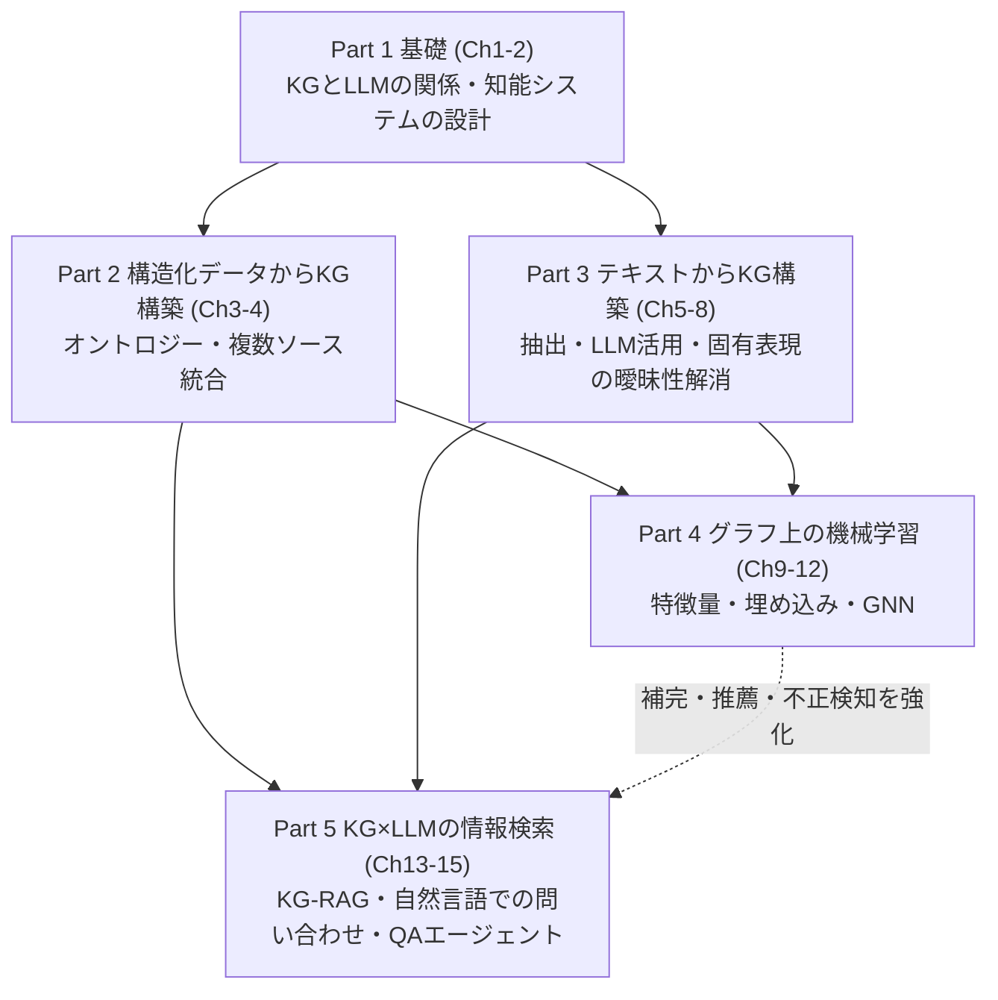

### 3.2 章の一覧と学習の見どころ

| Part | 章 | テーマ | 到達点（できるようになること） |
|---|---|---|---|
| 1 | Ch1 | KG と LLM: 最強の組み合わせ | なぜ組み合わせるのか、KG を使うべきかを説明できる |
| 1 | Ch2 | 知能システム: ハイブリッドアプローチ | 知識表現・推論・推論エンジンの中での LLM の役割を説明できる |
| 2 | Ch3 | オントロジーから最初の KG を作る | RDF と LPG の違いを踏まえ、KG 構築の手順を追える |
| 2 | Ch4 | 単純なネットワークから複数ソース統合へ | 生物医学分野の複数データを統合し、LLM で解釈を補助する流れが分かる |
| 3 | Ch5 | 非構造化データからのドメイン知識抽出 | NER・関係抽出と、LLM によるプロンプト設計の基本が分かる |
| 3 | Ch6 | LLM で KG を作る | 正規化・クレンジング・エンティティ解決を含む構築の全体像が分かる |
| 3 | Ch7 | 固有表現の曖昧性解消（NED） | 認識と曖昧性解消の違い、KG を活用した検索・発見が分かる |
| 3 | Ch8 | オープン LLM とオントロジーによる NED | ローカル LLM（Ollama）で NED を実装する流れが分かる |
| 4 | Ch9 | グラフ上の機械学習入門 | ノード分類・リンク予測・クラスタリングなどのタスクを区別できる |
| 4 | Ch10 | グラフ特徴量エンジニアリング | 次数・PageRank など代表的指標の意味を説明できる |
| 4 | Ch11 | グラフ表現学習と GNN | 埋め込み・メッセージパッシングの考え方が分かる |
| 4 | Ch12 | GNN によるノード分類とリンク予測 | 不正送金検知・映画推薦の 2 事例の設計が分かる |
| 5 | Ch13 | KG を活用した RAG | ベクトル RAG の限界と Graph RAG の設計が分かる |
| 5 | Ch14 | 自然言語で KG に問い合わせる | 意図検出・スキーマ活用・Cypher 生成の設計が分かる |
| 5 | Ch15 | LangGraph による QA エージェント | 状態を持つパイプラインとして実装する流れが分かる |
| 付録 | A〜C | グラフ入門 / Neo4j / 構造化ソースからの KG 構築 | 環境構築と基礎を補える |

出典: 目次 [S2] [S3]。「到達点」は目次と章概要 [S3] [S4] [S5] [S6] を基にした筆者の整理です。

### 3.3 初学者向け 3 つの読み進め方

| ルート | 向いている人 | 読む順番の目安 |
|---|---|---|
| **A: 全体像優先** | まず概念を理解したい | Ch1 → Ch2 → Ch13 → Ch14 → 余裕があれば Ch3 |
| **B: ハンズオン優先** | 手を動かして覚えたい | 付録B → Ch3 → Ch5-6 → Ch13 → Ch14-15 |
| **C: 機械学習重視** | ML/データサイエンス経験者 | Ch1 → Ch9 → Ch10 → Ch11-12 → Ch13 |

---

## 4. まず押さえる基礎用語（Step 0）

### 4.1 グラフとナレッジグラフ（KG）とは

**グラフ**とは「点（ノード）」と「線（エッジ）」でつながりを表すデータ構造です。**ナレッジグラフ（KG）**は、その点と線に「意味」を持たせ、世の中の事実（人・組織・製品・出来事とその関係）を表現したものです。

たとえば「山田さんは Alpha 社で働き、Alpha 社は製品 X を開発している」という知識は、次のように表せます。

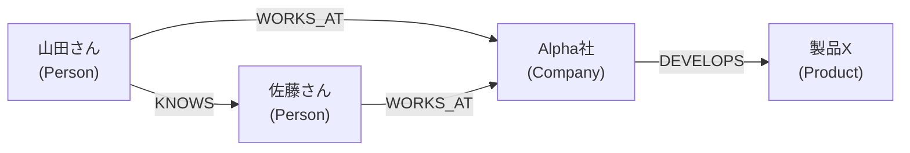

この 1 本 1 本の線は **トリプル（主語・述語・目的語）** として読めます。

| 主語（Subject） | 述語（Predicate） | 目的語（Object） |
|---|---|---|
| 山田さん | WORKS_AT | Alpha社 |
| Alpha社 | DEVELOPS | 製品X |
| 山田さん | KNOWS | 佐藤さん |
| 佐藤さん | WORKS_AT | Alpha社 |

**ポイント:** 表（リレーショナル DB）では「山田さんの同僚の、その同僚が作っている製品は？」のような**関係をたどる問い**が JOIN の連鎖になりがちです。グラフでは、線をたどるだけで答えられます。

### 4.2 用語集（初学者向けのやさしい説明）

| 用語 | やさしい説明 | 主に関係する章 |
|---|---|---|
| ノード | グラフの「点」。人・会社・病気など実体を表す | 全体 |
| エッジ（関係） | 点と点をつなぐ「線」。「働いている」など意味を持つ | 全体 |
| プロパティ | ノードやエッジにつける属性（名前、日付、根拠など） | Ch3 |
| トリプル | 主語・述語・目的語の 3 つ組。事実の最小単位 | Ch3 |
| KG（ナレッジグラフ） | 意味を持つノードとエッジで知識を表したデータ | 全体 |
| タクソノミー | 上位・下位の**階層分類**（例: 哺乳類 → 犬） | Ch1, Ch3 |
| オントロジー | 概念・関係・制約を**形式的に定義した語彙体系**。用語のそろえ役 | Ch1, Ch3 |
| RDF | 標準化されたトリプル中心のデータモデル。オントロジー記述に強い | Ch3 |
| LPG（ラベル付きプロパティグラフ） | ノードとエッジに直接プロパティを持てるモデル。Neo4j が代表例 | Ch3 |
| Cypher | Neo4j などで使うグラフ問い合わせ言語 | 付録B, Ch14 |
| LLM | 大規模言語モデル。文章の理解・生成が得意 | 全体 |
| ハルシネーション | LLM がもっともらしい誤りを出力してしまうこと | Ch13 |
| RAG | 外部の情報を検索して LLM に渡し、根拠に基づいて回答させる方式 | Ch13 |
| ベクトル検索 | 文章を数値ベクトルにして「意味の近さ」で探す検索 | Ch13 |
| Graph RAG | 検索元に KG（グラフ構造）を使う RAG | Ch13 |
| NER | 固有表現認識。文章中の人名・組織名などを見つける | Ch5, Ch7 |
| NED | 固有表現の曖昧性解消。同じ名前でも別物を区別して正しい対象に結びつける | Ch7, Ch8 |
| エンティティ解決 | 別表記・重複したデータを同一の実体に統合する | Ch6 |
| 埋め込み（embedding） | ノードや単語を数値ベクトルで表したもの | Ch11 |
| GNN | グラフ構造を扱うニューラルネットワーク | Ch11, Ch12 |
| エージェント | 目標に向けて道具（検索・DB 問い合わせなど）を選びながら動く LLM ベースの仕組み | Ch13〜15 |
| LangGraph | 状態を持つ複数ステップの LLM アプリを組むためのライブラリ | Ch15 |

### 4.3 タクソノミーとオントロジーの違い

| 観点 | タクソノミー | オントロジー |
|---|---|---|
| 主な構造 | 木構造（親子関係） | 概念・関係・制約のネットワーク |
| 表せること | 「AはBの一種」 | 「AはBの一種」「AはCを持つ」「AとDは同時に成り立たない」など |
| 使いどころ | 分類・カテゴリ整理 | 用語の統一、データ統合、推論の土台 |

### 4.4 RDF と LPG の比較（第3章の中心テーマ）

第3章は、RDF と LPG を「どちらが優れているか」ではなく**目的（ユースケース）で選ぶ**という姿勢で比較しています [S3]。

| 観点 | RDF | LPG（ラベル付きプロパティグラフ） |
|---|---|---|
| 得意なこと | 標準化・相互運用性、豊かな意味表現（推論）、オントロジー記述 | 関係に直接プロパティを持たせられる。効率的なたどり（トラバーサル） |
| 関係へのメタデータ | n 項関係、名前付きグラフ、RDF-star などの工夫が必要 | エッジに直接持たせられる |
| 章での使い分け | ヒト表現型オントロジー（HPO）自体は RDF/OWL 形式 | KG 本体は、根拠・頻度・発症時期などの**関係のメタデータ**が重要なので LPG（Neo4j）を選択 |

出典: 第3章の章概要と FAQ [S3]。

---

## 5. なぜ KG と LLM を組み合わせるのか

### 5.1 LLM 単体の課題と、KG による補い方

第13章の概要は、LLM を本番で使う際の課題として、ハルシネーション、知識のカットオフ、不透明性、プライバシーとアクセス制御、コスト、バイアスを挙げ、その対策として RAG を位置づけています [S4]。さらに、ベクトル検索ベースの RAG には次の限界があると整理されています [S4]。

| ベクトル RAG の限界（[S4] の整理） | KG（Graph RAG）での補い方 |
|---|---|
| 文脈が断片化しやすい | エンティティと関係で文脈を構造的につなぐ |
| 複数ステップ（マルチホップ）の推論が弱い | 関係をたどって答えを組み立てる |
| 埋め込みが固有名詞や細かなドメイン差を取りこぼす | 固有名詞をノードとして正確に指定して検索できる |
| ノイズの混入や、重要情報の検索漏れ | スキーマに沿った問い合わせで精密に取得できる |

また、KG は「管理された・解釈可能な・更新可能な信頼できる情報源」として LLM を補完する役割だと説明されています [S4]。

### 5.2 逆方向: LLM が KG づくりを助ける

KG と LLM の関係は一方通行ではありません。書籍全体で、次のような**相互補完**が描かれています（目次 [S2] から読み取れる構成）。

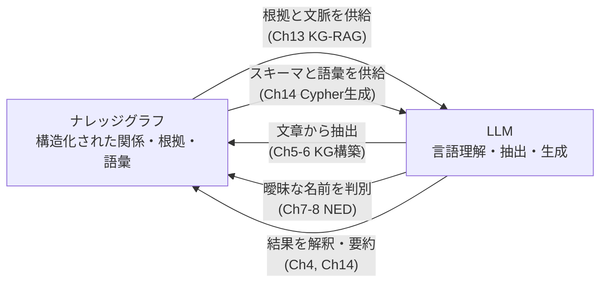

> **[補足] 一言でまとめると:** KG は「事実と関係の正確な地図」、LLM は「言葉を操る通訳兼ガイド」。地図があるから通訳が迷わず、通訳がいるから地図を自然な言葉で読める、という関係です。

### 5.3 KG を使うべきかの判断

第1章には「KG を使うべきか判断する」節（1.5.3）があります [S2]。その詳細は本文を参照してください。本ガイドの**第11章**では、筆者による実務向けの判断フローを補足として示します。

---

## 6. 学習環境の準備（Step-by-Step）

### 6.1 全体の流れ

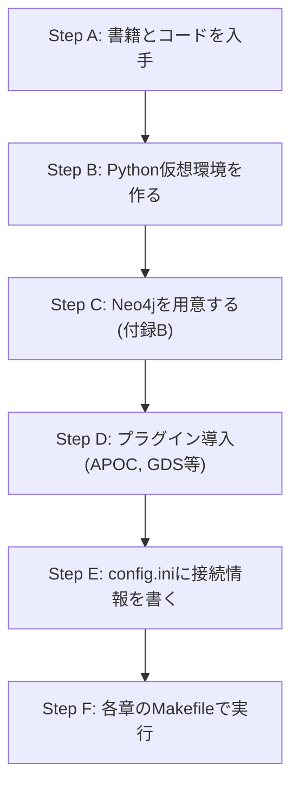

### 6.2 各ステップ

**Step A: 書籍とコードの入手**

- 書籍は Manning の liveBook や O'Reilly から読めます（購読やアカウントが必要）[S1] [S2]。
- コードは公式リポジトリ [S8] から取得します。

```bash
git clone https://github.com/alenegro81/knowledge-graphs-and-llms-in-action.git
cd knowledge-graphs-and-llms-in-action
```

**Step B: Python 仮想環境**

リポジトリの README は、仮想環境の利用を推奨し、コードは Python 3.8 / 3.9 / 3.10 でテストされていると記載しています [S8]。

```bash
python -m venv venv
source venv/bin/activate      # Windows は venv\Scripts\activate
```

> **[補足]** 2026年時点では Python 3.8 はすでにサポート終了しています。README が示す範囲のうち **3.10 を最小バージョン**として選び、動いたら新しい版に上げて検証するのが安全です。
> 本ガイド内のサンプルコードは `list[dict]` や `dict | None` といった 3.10 以降の型注釈構文を使うため、3.8 / 3.9 では動作しません（3.9 以前で動かす場合は `typing.List` / `typing.Dict` / `typing.Optional` へ置き換えてください）。

**Step C: Neo4j の準備**

- Neo4j のインストール手順は**付録B**（サーバー版と Desktop 版）で解説されています [S2]。
- 第3章の FAQ によれば、第3章のサンプルは Neo4j 5.20.0（Enterprise）、APOC 5.20.0、neosemantics（n10s）5.20.0 を前提としています [S3]。

**Step D: プラグインの導入**

付録B.4 で APOC Core と GDS（Graph Data Science）のインストールが扱われます [S2]。APOC は便利なユーティリティ群、GDS は PageRank などのグラフアルゴリズム集です（第10章で使用）。

> **セキュリティ上の注意**（[補足]）: APOC には `apoc.load.json` のように外部 URL を読み込むプロシージャがあります。LLM が生成した Cypher を実行する構成（第13章）では、`neo4j.conf` の `dbms.security.procedures.allowlist` で使うプロシージャだけを許可し、あわせてファイアウォール等で Neo4j サーバーの外向き通信を信頼できる宛先に限定してください。

**Step E: 接続情報の設定**

README は、Neo4j が起動していることを確認し、`config.ini` に認証情報を書くよう指示しています [S8]。

**Step F: Makefile による実行**

各章は Makefile ベースで操作を簡略化しているため、`make` コマンドが使える必要があります [S8]。

```bash
make --version     # インストール確認
```

**第8章で使うローカル LLM（Ollama）**

第8章は Ollama と Llama 3.1 8B でモデルをセットアップします [S2]。一般的な手順は次のとおりです（[補足]）。

```bash
ollama pull llama3.1:8b
ollama run llama3.1:8b "こんにちは"
```

### 6.3 つまずきポイント

| 症状 | よくある原因 | 対処 |
|---|---|---|
| Neo4j に接続できない | サービス未起動、ポート/認証情報の誤り | 起動確認、`config.ini` の URI・ユーザー・パスワードを再確認 |
| `apoc` や `n10s` のプロシージャが見つからない | プラグイン未導入、設定ファイルでの許可漏れ | 付録B.4 の手順に従い、Neo4j の版とプラグインの版をそろえる |
| `make` が無い | OS に未導入 | パッケージマネージャで導入（README に Windows/Debian 系/macOS の例あり）[S8] |
| ライブラリのエラー | Python やライブラリの版の差 | 仮想環境を作り直し、README 記載の版に合わせる |

---

## 7. ステップバイステップ解説（章ごと）

各ステップは次の構成です。

- **[書籍情報]** 公開されている目次・章概要から分かる内容
- **やさしい説明 [補足]** たとえ話や図での理解
- **つまずきポイント** 初学者がつまずきやすい点
- **確認問題** 答えは折りたたみの中にあります

---

### Step 1: 基礎を固める（Part 1 / 第1章・第2章）

#### [書籍情報] 第1章「KG と LLM: 最強の組み合わせ」の構成 [S2]

- 1.1 ナレッジグラフ / 1.2 大規模言語モデル / 1.3 KG と LLM: 一緒だから強い
- 1.4 データ駆動型アプリケーションにおけるパラダイムシフト（1.4.1 KG の 4 本柱）
- 1.5 KG と LLM でデータ駆動型アプリを作る（創薬・顧客サポート向け会話 AI の事例、KG を使うべきかの判断）
- 1.6 KG の技術（タクソノミーとオントロジー）
- 1.7 本書での教え方

#### [書籍情報] 第2章「知能システム: ハイブリッドアプローチ」の構成 [S2]

- 知能とは何か / 知能システムの設計（定義、分類、特徴）
- 知識の獲得と表現 / 推論 / 推論エンジン
- 純粋な演繹推論エンジンの限界、帰納推論と機械学習の活用、**推論エンジンにおける LLM の役割**
- KG によるアプローチ

#### やさしい説明 [補足]

知能システムを「新人コンサルタント」にたとえると分かりやすくなります。

| 構成要素 | たとえ | システムでは |
|---|---|---|
| 知識の獲得 | 資料を読み、担当者に聞き取りをする | データ収集、文章からの抽出 |
| 知識の表現 | 情報を整理したノートを作る | KG・オントロジー |
| 推論 | ノートから結論を導く | ルール推論、機械学習、LLM |
| 出力・説明 | 顧客に報告し根拠も示す | 回答と根拠の提示 |

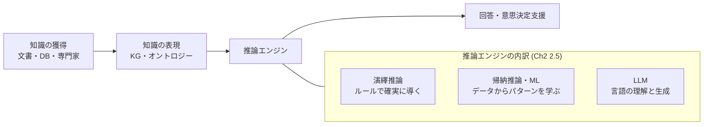

| 推論の種類 | 特徴 | 弱点 |
|---|---|---|
| 演繹（ルール） | 前提が正しければ結論も確実。説明しやすい | ルールを人が書く必要があり、想定外に弱い |
| 帰納（機械学習） | データから傾向を学び、未知にも対応 | 確率的で、根拠の説明が難しい場合がある |
| LLM | 自然な言語で柔軟に対応 | 事実の正確性・再現性・説明性に課題 |

> 第2章の見出しは、これらを組み合わせる**ハイブリッド**なアプローチを示唆しています [S2]。

#### つまずきポイント

- 「KG と LLM のどちらが主役か」と考えがちですが、本書の立場は**相互補完**です。
- 「オントロジーは難しそう」と感じたら、まず「用語の統一ルール表」だと捉えれば十分です。

#### 確認問題

1. タクソノミーとオントロジーの違いを一言で説明してください。
2. 純粋な演繹推論エンジンだけで知能システムを作ると、どんな限界がありますか。

<details>
<summary>答え</summary>

1. タクソノミーは階層的な分類、オントロジーは概念・関係・制約まで形式的に定義した語彙体系。
2. ルールを人手で書き尽くす必要があり、想定外のケースや曖昧なデータに弱い。そのため帰納推論（機械学習）や LLM と組み合わせる（第2章の構成 [S2] に沿った整理）。
</details>

---

### Step 2: 構造化データ・オントロジーから最初の KG を作る（Part 2 / 第3章）

#### [書籍情報] 第3章の要点 [S3]

- KG 構築を、異なる形式・意味を持つデータの**意味的統合**の問題として捉える。
- オントロジーを**参照スキーマ兼統制語彙**として使い、同義語の統一、略語の曖昧性解消、粒度の違いの調整を行う。
- ユースケースは、臨床医が**希少疾患を認識する**のを支援する KG。ヒト表現型オントロジー（HPO）と、疾患と表現型を結びつける注釈データを使う。
- RDF と LPG を比較し、関係ごとのメタデータ（根拠・頻度・発症時期・キュレーター等）が重要なため、**LPG を中核に採用**。
- 手順は、ビジネス理解、データ理解、データ準備、KG モデル作成、クエリという **CRISP-DM を KG 向けに適応した流れ**。
- 使用データは 2 種類: `hp.owl`（HPO 本体、OWL/RDF）と `phenotype.hpoa`（疾患と表現型の注釈、TSV）。
- 環境: Neo4j 5.20.0（Enterprise）、APOC、neosemantics（n10s）。RDF の探索には Python の rdflib も紹介。

#### やさしい説明 [補足]

**KG 構築は「技術選び」ではなく「目的の確認」から始まる**というのが、この章の最大のメッセージです。

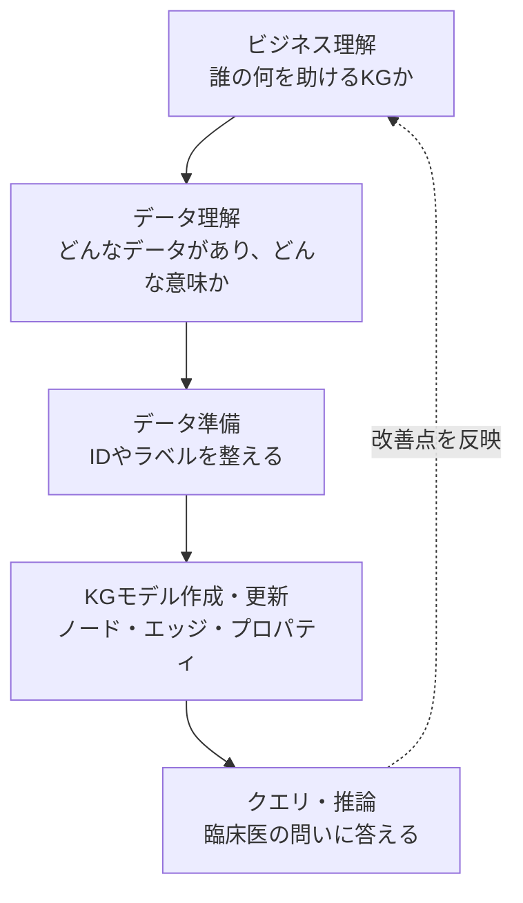

**章の実装ステップ（[S3] の FAQ に基づく整理）**

| # | 手順 | 目的 |
|---|---|---|
| 1 | DB を作り、`Resource.uri` などに制約・インデックスを作成 | 検索と重複防止 |
| 2 | n10s（neosemantics）を設定し、`hp.owl` を取り込む | オントロジーをグラフ化 |
| 3 | `Resource.uri` が `http://purl.obolibrary.org/obo/HP_` で始まるノードに `HpoPhenotype` ラベルを付与し、uri 末尾の `HP_0000001` をコロン形式へ変換した `id`（`HP:0000001`）を設定 | 表現型ノードを扱いやすくする。`phenotype.hpoa` と Cypher で使う ID 表記を `HP:` 形式に統一する |
| 4 | `phenotype.hpoa` を `LOAD CSV` で読み込み、疾患ノード（`HpoDisease`）を `MERGE` | 疾患ノードの作成 |
| 5 | 疾患から表現型への `HAS_PHENOTYPIC_FEATURE` 関係を作り、根拠・頻度・発症時期などをプロパティとして付与 | **関係のメタデータを保持** |
| 6 | クエリ: 疾患の特徴取得、観察された特徴で疾患をランキング、根拠の確認 | 診断支援の探索 |
| 7 | 推論: `SUBCLASSOF` の階層をたどり、上位概念から下位の特徴を展開 | 粒度の異なる概念のつなぎ |

**イメージ図: 疾患と表現型、その階層**

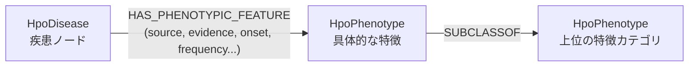

**学習用の独自サンプル（Cypher）** — ID や値はすべてダミーです。書籍の実コードは [S8] を参照してください。

```cypher
// 疾患-表現型の関係に「根拠」をプロパティとして持たせるイメージ
MERGE (d:HpoDisease {id: 'OMIM:000000'})
MERGE (p:HpoPhenotype {id: 'HP:0000000'})
MERGE (d)-[r:HAS_PHENOTYPIC_FEATURE]->(p)
SET r.source = 'PMID:0000000',
    r.evidence = 'dummy-evidence',
    r.frequency = 'dummy-frequency'
```

```cypher
// 観察された特徴(ダミーID)に多く当てはまる疾患を上位から出す
WITH ['HP:0000001', 'HP:0000002', 'HP:0000003'] AS observed
MATCH (d:HpoDisease)-[:HAS_PHENOTYPIC_FEATURE]->(p:HpoPhenotype)
WHERE p.id IN observed
RETURN d.id AS disease, count(DISTINCT p) AS matched
ORDER BY matched DESC
LIMIT 10
```

> LPG の強みは「エッジにそのまま根拠を持てる」ことです。RDF で同じことをするには、関係を表すノードを間に挟む、名前付きグラフを使う、RDF-star を使う、といった工夫が必要になります [S3]。

#### つまずきポイント

| つまずき | 説明 |
|---|---|
| 「RDF と LPG のどちらを覚えるべき？」 | 両方の考え方を知り、**ユースケースで選ぶ**のが本章の結論 [S3] |
| 「オントロジーをそのまま入れると重い」 | 章では、不要なオントロジーの足場を整理（プルーニング）してから使う流れが説明されている [S3] |
| 「ID の扱いが複雑」 | 同じ名称でも文脈により疾患か症状かが異なりうるため、ID 設計が重要（章でも図解あり）[S3] |

#### 確認問題

1. なぜこの章では KG の中核に LPG を選んだのですか。
2. オントロジーを使うと、データ統合でどんな問題が解決しやすくなりますか。

<details>
<summary>答え</summary>

1. 疾患と表現型の**関係ごとに**、根拠・頻度・発症時期などのメタデータを付けたい。LPG ならエッジにプロパティを直接持てて、たどり検索も効率的だから [S3]。
2. 同義語・略語の曖昧さ、粒度の違いを、共通の語彙と構造で調整できる [S3]。
</details>

---

### Step 3: 複数ソースの統合と LLM による解釈（Part 2 / 第4章）

#### [書籍情報] 第4章の構成 [S2]

- 4.1 生物医学 KG とその応用
- 4.2 マルチオミクス応用: PPI（タンパク質間相互作用）ネットワークとタンパク質-疾患ネットワークから KG を作成、全体分析、ドメイン固有の分析
- 4.3 創薬・製薬応用: Hetionet KG の詳細分析、**LLM による経路（パスウェイ）解析結果の解釈支援**
- 4.4 臨床応用: **LLM 主導の臨床意思決定支援分析**

#### やさしい説明 [補足]

第3章が「1 つのデータからの KG」なら、第4章は「**複数の情報源を 1 枚の地図に統合する**」段階です。

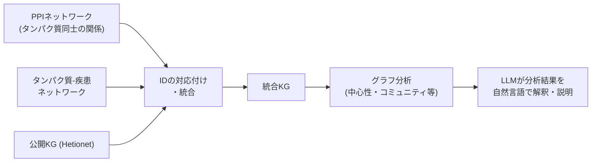

| 観点 | 初学者向けの理解 |
|---|---|
| なぜ統合が必要か | 1 つのデータだけでは見えない、間接的なつながり（薬-標的-疾患）が見えるから |
| LLM の役割 | グラフ分析の**数値結果や一覧を人間が読める説明にする**（構築ではなく解釈側での活用）[S2] |
| 注意点 | LLM の解釈は必ず元データ（KG 上の根拠）と照合する。医療用途では専門家の確認が前提 |

#### つまずきポイント

- 生物医学の専門用語（PPI、オミクスなど）が壁になりがちです。**用語の詳細より「複数データの統合の流れ」**に注目すれば十分です。
- ここでの LLM は KG を作る側ではなく、**分析結果を解釈する側**として登場します。

#### 確認問題

1. 複数のデータソースを KG に統合する利点を 1 つ挙げてください。
2. 第4章で LLM が担う役割は何ですか。

<details>
<summary>答え</summary>

1. 単一データでは見えない間接的な関係（例: 薬・標的・疾患のつながり）を探索できる。
2. パスウェイ解析結果や臨床意思決定支援の分析結果の解釈を助ける [S2]。
</details>

---

### Step 4: テキストから KG を作る（Part 3 / 第5章・第6章）

#### [書籍情報] 第5章「非構造化データからのドメイン知識抽出」 [S2]

- 5.1 アーカイブの課題 / 5.2 知識抽出の基本概念（固有表現認識、関係抽出）
- 5.3 LLM で KG を作る（LLM の使い方、プロンプトエンジニアリングの例とガイドライン、**従来の NLP と LLM のどちらを使うか**）

#### [書籍情報] 第6章「LLM による KG 構築」 [S2]

- 6.1 アーカイブを KG に変換（グラフモデリング、メタグラフ、正規化とクレンジング、**グラフベースのエンティティ解決**）
- 6.2 知的ネットワーク分析: グラフの価値
- 6.3 Rockefeller Archive Center プロジェクトの次のステップ
- 6.4 LLM 時代における KG の価値

#### やさしい説明 [補足]

文章から KG を作る流れは、次のようなパイプラインになります。

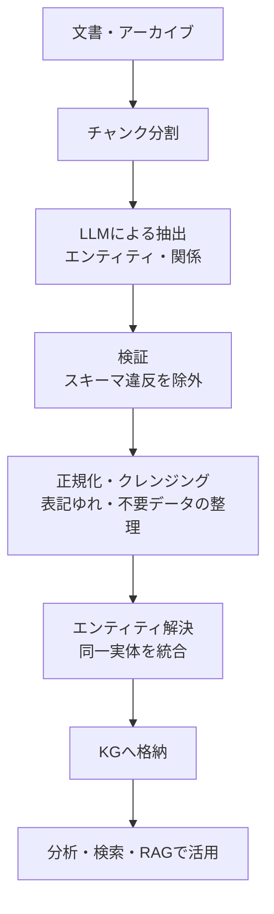

| 用語 | やさしい説明 | 例 |
|---|---|---|
| 固有表現認識（NER） | 文章から人名・組織名・場所などを見つける | 「山田は Alpha 社に入社」→ 山田（人）、Alpha 社（組織）|
| 関係抽出 | 見つけた固有表現同士の関係を見つける | 山田 — WORKS_AT — Alpha 社 |
| エンティティ解決 | 「山田太郎」「山田 T.」「Yamada」を同一人物としてまとめる | ノードの重複を防ぐ |
| メタグラフ | データの構造（どんな種類のノードや関係があるか）を表すグラフ（章の見出しにある概念。詳細は本文で確認）[S2] | — |

**従来 NLP と LLM の比較 [補足]**

| 観点 | 従来 NLP（ルール・専用モデル） | LLM |
|---|---|---|
| 準備 | ドメインごとの学習データやルールが必要 | プロンプトと数例で開始できる |
| 柔軟性 | 想定外の表現に弱い | 多様な表現に対応しやすい |
| 安定性 | 出力が決定的で検証しやすい | 出力が揺れる。検証層が必要 |
| コスト | 推論は軽い | 大量文書では費用・時間がかかる |

> 書籍は「従来の NLP か LLM か」という比較の節を設けています（5.3.4）[S2]。結論は本文で確認してください。

**学習用の独自サンプル（Python）: LLM でトリプルを抽出し、スキーマで検証する**

`llm_call` は「プロンプトを受け取り文字列を返す関数」です。どの LLM の SDK でも差し替えられます。

```python
import json
from typing import Callable

ALLOWED_ENTITY_TYPES = {"Person", "Company", "Product"}
ALLOWED_RELATIONS = {"WORKS_AT", "DEVELOPS", "KNOWS"}

PROMPT_TEMPLATE = """次の文章から、エンティティと関係を抽出してください。
制約:
- エンティティ種別は {entity_types} のいずれか
- 関係種別は {relations} のいずれか
- 文章に明示されていない事実は出力しない
- 出力は JSON のみ:
  {{"triples": [{{"head": "...", "head_type": "...", "relation": "...", "tail": "...", "tail_type": "..."}}]}}

文章:
{text}
"""


def extract_triples(llm_call: Callable[[str], str], text: str) -> list[dict]:
    prompt = PROMPT_TEMPLATE.format(
        entity_types=sorted(ALLOWED_ENTITY_TYPES),
        relations=sorted(ALLOWED_RELATIONS),
        text=text,
    )
    # JSON として読めても、形が期待どおりとは限らない。
    # json.JSONDecodeError はここでは握りつぶさず、呼び出し側のリトライ方針に委ねる。
    data = json.loads(llm_call(prompt))
    if not isinstance(data, dict):
        return []  # トップレベルが辞書でなければ .get() が使えない
    triples = data.get("triples")
    if not isinstance(triples, list):
        return []  # triples がリストでなければ走査できない
    valid = []
    for t in triples:
        if not isinstance(t, dict):
            continue  # 辞書でない要素は .get() が使えないので捨てる
        head_type = t.get("head_type")
        tail_type = t.get("tail_type")
        relation  = t.get("relation")
        # isinstance チェックを先に行い、非文字列値（None・int 等）が
        # 集合の検索に渡されないようにする。
        if (
            isinstance(head_type, str) and head_type in ALLOWED_ENTITY_TYPES
            and isinstance(tail_type, str) and tail_type in ALLOWED_ENTITY_TYPES
            and isinstance(relation,  str) and relation  in ALLOWED_RELATIONS
        ):
            valid.append(t)  # スキーマ外の出力は捨てる
    return valid
```

```python
def upsert_triples(tx, triples: list[dict]) -> None:
    # ラベルや関係名は変数にできないため文字列で埋め込む。
    # 埋め込む前に必ず許可リストで検証する(Cypherインジェクション対策)。
    # 呼び出し側の検証漏れを前提にせず、この関数自身でも弾く。
    for t in triples:
        head, tail = t.get("head"), t.get("tail")
        head_type, tail_type, relation = t.get("head_type"), t.get("tail_type"), t.get("relation")
        if (
            # 非文字列（list 等のハッシュ不能な値）を集合検索に渡すと TypeError になるため先に型を確認する
            not isinstance(head_type, str) or head_type not in ALLOWED_ENTITY_TYPES
            or not isinstance(tail_type, str) or tail_type not in ALLOWED_ENTITY_TYPES
            or not isinstance(relation, str) or relation not in ALLOWED_RELATIONS
            # head / tail が欠けていると、下の tx.run で KeyError になる。
            # 空文字や空白だけの名前は、名前のないノードを作ってしまうのでここで弾く。
            or not isinstance(head, str)
            or not head.strip()
            or not isinstance(tail, str)
            or not tail.strip()
        ):
            raise ValueError(f"検証に通らないトリプルは書き込めません: {t}")
        tx.run(
            f"MERGE (h:{t['head_type']} {{name: $head}}) "
            f"MERGE (t:{t['tail_type']} {{name: $tail}}) "
            f"MERGE (h)-[:{t['relation']}]->(t)",
            head=head,
            tail=tail,
        )

# 使い方(neo4jドライバ 5.x を想定):
# with driver.session() as session:
#     session.execute_write(upsert_triples, triples)
```

#### つまずきポイント

| つまずき | 対処 |
|---|---|
| LLM の出力が JSON にならない | 出力形式を明示し、パース失敗時は再試行。可能なら構造化出力機能を使う |
| 同じ人物のノードが増える | エンティティ解決（第6章）で統合する。`MERGE` だけでは表記ゆれは防げない |
| 事実でない関係が混ざる | 「文章に明示された事実のみ」と指示し、スキーマ検証と人手サンプリングで確認 |

#### 確認問題

1. NER と関係抽出の違いは何ですか。
2. 上のサンプルで、許可リストによる検証を入れる理由を 2 つ挙げてください。

<details>
<summary>答え</summary>

1. NER は文章中の「もの」（人・組織など）を見つけること、関係抽出はそれらの間の「つながり」を見つけること。
2. (1) LLM がスキーマ外の種別や関係を出力してもグラフを汚さないため。(2) ラベルや関係名を Cypher 文字列に埋め込むため、未検証の値を入れるとインジェクションの危険があるため。
</details>

---

### Step 5: 固有表現の曖昧性解消 NED（Part 3 / 第7章・第8章）

#### [書籍情報] 第7章の構成 [S2]

- 7.1 認識から曖昧性解消へ / 7.2 NED とは / 7.3 ドメインベースの NED と LLM
- 7.4〜7.5 ビジネスとデータの理解（非構造化データ、ドメインオントロジー）
- 7.6 **SoHO KG** の構築（スキーマ定義、文書の取り込み、医療エンティティの曖昧性解消と取り込み、オントロジーの処理・マッピング、エンティティの共起生成）
- 7.7 KG を活用したユースケース（概念検索、構造化知識に基づく検索、解釈可能性と発見、新しい知識の発見）

#### [書籍情報] 第8章「オープン LLM とドメインオントロジーによる NED」の構成 [S2]

- 従来の NED システムの限界 / ドメインオントロジーの取り込み
- **Ollama と Llama 3.1 8B** によるモデル設定
- エンドツーエンドの NED: 固有表現認識、**候補選択**、**候補の曖昧性解消**

#### やさしい説明 [補足]

NER は「名前を見つける」、NED は「**それがどの実体を指すかを決める**」作業です。「Apple」が企業なのか果物なのかを、文脈とオントロジーで判断するイメージです。

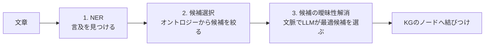

| 観点 | ポイント |
|---|---|
| なぜオントロジーが必要か | 候補の集合と正しい ID を与える「辞書兼地図」になるため |
| なぜ候補選択を挟むか | LLM に全候補を渡すと精度と費用が悪化するため、先に絞り込む（[補足]。章の段階構成 [S2] と整合）|
| なぜオープン LLM（Ollama 等）か | データを外部に出さずにローカルで動かせる、費用を抑えやすい（[補足]。一般的な利点）|

> **[補足] 曖昧性解消の質は KG 全体の質を決める。** 誤った実体に結びつくと、後続の検索・RAG・分析がすべて誤った土台に載ります。近年の研究でも、LLM が生成した KG に対してエンティティ解決と誤りトリプルの除去を行い、エンティティと関係を約 40% 減らしながらグラフベース RAG の性能が向上したという報告があります [S18]。**「KG は大きさより質」**という見方の裏づけとして参考になります。

#### つまずきポイント

- NER と NED の区別: 「見つける」と「特定する」の違いを、必ず具体例（同名異人）で確認しましょう。
- ローカル LLM は PC の性能に依存します。まず小さなデータで動作確認してから拡大しましょう。

#### 確認問題

1. NED の 3 段階を順に答えてください。
2. NED の質が悪いと、KG を使った RAG にどんな影響が出ますか。

<details>
<summary>答え</summary>

1. 固有表現認識、候補選択、候補の曖昧性解消 [S2]。
2. 誤ったノードに結びつくため、関連情報の取り違えや検索漏れが起き、回答の根拠が誤る。
</details>

---

### Step 6: グラフ上の機械学習の基本（Part 4 / 第9章・第10章）

#### [書籍情報] 構成 [S2]

- **第9章**: なぜ（Why）・何を（What）・どう（How）の 3 段構成。タスクは、ノード分類、リンク予測（関係予測）、クラスタリング/コミュニティ検出、グラフ分類。
- **第10章**: 手作業のノード特徴量（次数、三角形、密度、最短経路、近接中心性、媒介中心性、PageRank）、関係の特徴量（ノードベース、パスベース）、半自動の特徴抽出（ReFeX）。

#### やさしい説明 [補足]

**4 つのタスク**

| タスク | 何をするか | 例 |
|---|---|---|
| ノード分類 | 各ノードにラベル（種別）を予測 | 口座が不正かどうか |
| リンク予測（関係予測） | まだ無い関係が存在するかを予測 | ユーザーが好みそうな映画 |
| クラスタリング/コミュニティ検出 | 密につながるグループを見つける | 似た話題の文書群 |
| グラフ分類 | グラフ全体にラベルを予測 | 分子が有効かどうか |

**代表的なノード特徴量（第10章の見出し [S2] にある指標）**

| 指標 | やさしい意味 | たとえ |
|---|---|---|
| 次数（Degree） | つながっている線の数 | 友達の人数 |
| 三角形（Triangles） | 3 者が互いにつながる数 | 友達同士も友達 |
| 密度（Density） | 実際の線 ÷ ありうる線の最大数 | グループの結束の強さ |
| 最短経路（Geodesic） | 2 点間の最短のつながり | 知人を介した最短ルート |
| 近接中心性（Closeness） | 他のノードへの近さ | 街の中心地に近い店 |
| 媒介中心性（Betweenness） | 他ノード間の最短経路上に乗る度合い | 橋渡し役 |
| PageRank | 重要なノードからの参照を重視した重要度 | 影響力のある人に紹介される人 |

**学習用の独自サンプル（Cypher + GDS）: PageRank を計算する**

GDS プラグイン（付録B.4.2 [S2]）が入っている前提の例です。`Person` と `KNOWS` は説明用のラベルです。

```cypher
// 1. 分析用のグラフ投影を作る
CALL gds.graph.project('social', 'Person', 'KNOWS');

// 2. PageRank をストリームで取得して上位を見る
CALL gds.pageRank.stream('social')
YIELD nodeId, score
RETURN gds.util.asNode(nodeId).name AS name, score
ORDER BY score DESC
LIMIT 5;
```

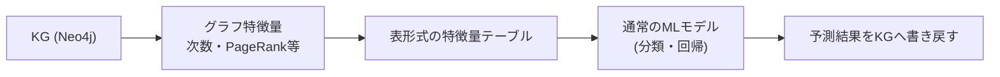

> **[補足]** 特徴量を人が設計する方法（第10章）は、次のステップ（第11章）の「特徴量を自動で学習する」方法の土台になります。

#### つまずきポイント

- 指標が多くて覚えきれない場合は、**「どんな問いに答えるための指標か」**で整理しましょう（人気者を探す = 次数/PageRank、橋渡し役 = 媒介中心性）。

#### 確認問題

1. リンク予測は何を予測するタスクですか。
2. 媒介中心性が高いノードは、ネットワーク上でどんな役割を持ちますか。

<details>
<summary>答え</summary>

1. まだグラフに存在しない（または欠けている）関係が存在するかどうか。
2. 他のノード間の最短経路上によく現れる「橋渡し役」。
</details>

---

### Step 7: 埋め込みと GNN（Part 4 / 第11章・第12章）

#### [書籍情報] 第11章の構成 [S2]

- グラフ埋め込み: 離散から連続へ、実世界の応用
- **エンコーダ-デコーダモデル**（構造をベクトルに変換するエンコーダ、性質を復元するデコーダ、Node2Vec の例）
- **浅い埋め込み**とその限界 / KG における埋め込み（損失関数、マルチリレーションのデコーダ）
- **メッセージパッシングと GNN**（基本モデル、自己ループ）
- 一般化した集約・更新（近傍の正規化、近傍アテンション、マルチヘッドアテンションと Transformer とのつながり、更新の一般化）
- **GNN と LLM の相乗効果**

#### [書籍情報] 第12章の構成 [S2]

- 12.1 **マネーロンダリング対策のためのノード分類**（PyG の同種グラフ、エンコーダ-デコーダ、評価・分析）
- 12.2 **映画推薦のためのリンク予測**（PyG の異種グラフ、エンコーダ-デコーダ、評価・分析）

#### やさしい説明 [補足]

**埋め込み（embedding）**とは、ノードを「意味の近いものは近くに並ぶ」数値ベクトルに変えることです。

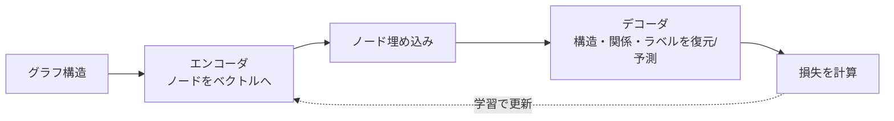

**メッセージパッシング（GNN の核心）:** 各ノードが**隣人から情報（メッセージ）を集め、自分の状態を更新する**ことを繰り返します。「隣人の様子から自分の特徴が見えてくる」というたとえで理解できます。

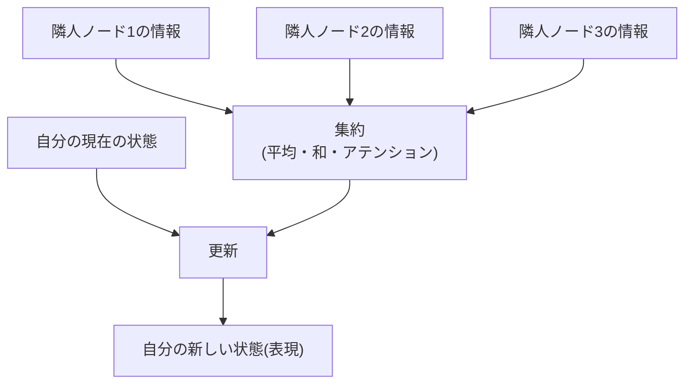

| 方式 | 特徴 | 限界・注意 |
|---|---|---|
| 浅い埋め込み（Node2Vec など） | ノードごとにベクトルを学習。仕組みがシンプル | 一般に、新しいノードへの対応や属性の活用が難しい（章でも限界を扱う）[S2] |
| GNN | 近傍の集約で表現を作る。属性も活用しやすい | 層を深くしすぎると表現が似通う等の課題（[補足]。一般的な知見）|

**第12章の 2 事例の整理**

| 事例 | タスク | グラフの種類 | ポイント |
|---|---|---|---|
| マネーロンダリング対策 | ノード分類 | 同種グラフ（PyG） | 不正の疑いがあるノードを識別 |
| 映画推薦 | リンク予測 | 異種グラフ（PyG） | ユーザーと映画など**種類の違うノード**を扱う |

> 「GNN と LLM の相乗効果」（11.7 [S2]）の中身は本文で確認してください。

#### つまずきポイント

- 数式が難しく感じる場合は、**「集める → 混ぜる → 更新する」**の 3 語で流れを追いましょう。
- 第12章は PyG（PyTorch Geometric）を使うため、PyTorch の基礎があるとスムーズです（[補足]）。

#### 確認問題

1. メッセージパッシングを一言で説明してください。
2. 同種グラフと異種グラフの違いは何ですか。

<details>
<summary>答え</summary>

1. 各ノードが隣接ノードの情報を集約して自分の表現を更新する処理を繰り返すこと。
2. 同種グラフはノード（と関係）の種類が 1 種類。異種グラフはユーザー・映画など複数の種類を含む。
</details>

---

### Step 8: KG を使った RAG（Part 5 / 第13章）

#### [書籍情報] 第13章の要点 [S4]

- LLM を「エージェント」として役立てる文脈から始め、本番運用の課題（ハルシネーション、知識のカットオフ、不透明性、プライバシーとアクセス制御、コスト、バイアス）を整理。
- 従来型の**ベクトル RAG**: 文書を分割・埋め込み・ベクトルストアに索引化し、意味の近いチャンクを検索して LLM に渡す。ただし文脈の断片化、マルチホップ推論の弱さ、拡張性のトレードオフ、埋め込みの盲点、ノイズ/取りこぼしがある。
- **Graph RAG**: KG を「管理された・解釈可能な・最新の真実の源」として LLM を補う。テキスト付きの KG を使い、3 種類のツールを追加する。
  1. **KG Retriever**: スキーマを意識した Cypher でエンティティ・プロパティ・経路・集計を取得
  2. **KG-Enhanced Document Retriever**: 特定のエンティティや関係に言及する文書を正確に取得
  3. **セマンティック Retriever**: バックアップとして意味検索
- **ReAct 型のエージェント**（例: LangChain）が問いを分解し、構造化された事実と根拠文書を取得して回答を構成する。
- 本番向けの改善案: Cypher の自己修正、文書の再ランキング、ツールの拡張。

#### やさしい説明 [補足]

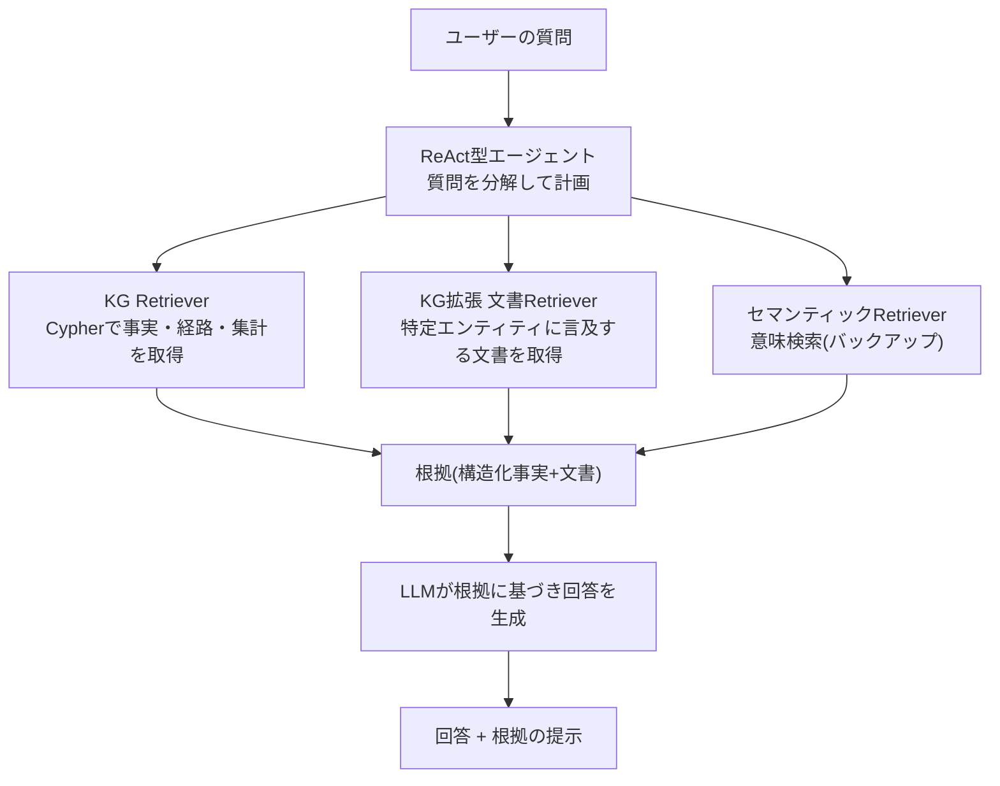

| 観点 | ベクトル RAG | Graph RAG |
|---|---|---|
| 得意な質問 | 「〜について書かれた箇所は？」（意味の近さ） | 「AとBの関係は？」「条件に合うものを集計して」（構造・経路・集計）|
| 根拠の見え方 | 取得チャンク | 関係・経路・元文書へのリンク |
| 弱点 | 断片化、複数ホップ | KG の構築・保守コスト、スキーマ設計 |

> 「ReAct」は、推論（Reason）と行動（Act）を交互に繰り返して道具を使いこなすエージェントの型です（[補足]。用語の一般的な説明）。

**学習用の独自サンプル（Python）: KG Retriever を「道具」として用意する**

```python
import itertools
import re

from neo4j import GraphDatabase

driver = GraphDatabase.driver(
    "bolt://localhost:7687", auth=("neo4j_readonly", "your-password")
)

# 書き込み・管理系の句。LLM が生成した Cypher をそのまま実行しない。
# 単語境界で見るため、dataset のような語に含まれる set では誤検知しない。
WRITE_CLAUSES = re.compile(
    r"\b(create|merge|delete|detach|set|remove|drop|foreach|load\s+csv)\b"
)
# プロシージャ呼び出し。apoc.load.json のような外部 URL 読み込みを防ぐため、
# エージェント経由では CALL を一律に拒否する(必要なら許可リスト方式に切り替える)。
PROCEDURE_CALL = re.compile(r"\bcall\b")
# 文字列リテラル（シングル・ダブル引用符）を取り除く正規表現。
# キーワード検査の前に適用して、リテラル内の delete/set 等による誤検知を防ぐ。
_STRIP_LITERALS = re.compile(r"'[^']*'|\"[^\"]*\"")
QUERY_TIMEOUT_SECONDS = 5
MAX_RECORDS = 100


def _is_write_query(cypher: str) -> bool:
    """文字列リテラルを除いた Cypher に書き込み句またはプロシージャ呼び出しが含まれるか判定する。

    例: MATCH (n {action: 'delete'}) RETURN n  →  リテラル内の delete を無視し False
        MERGE (n:Person {name: 'Alice'})        →  MERGE を検出し True
        CALL apoc.load.json('https://...')      →  CALL を検出し True
    """
    lowered = _STRIP_LITERALS.sub("", cypher).lower()
    return bool(WRITE_CLAUSES.search(lowered) or PROCEDURE_CALL.search(lowered))


def kg_retriever(cypher: str, params: dict | None = None) -> dict[str, list[dict] | bool]:
    """エージェントに渡す道具: Cypherを実行し、結果を辞書で返す。

    戻り値は {"records": 結果行(辞書)のリスト, "truncated": 件数上限で切り捨てたか} の形。

    セッションのアクセスモードは環境によって書き込みの防止を保証しない場合が
    あるため、接続ユーザー自体を読み取り専用ロールにしておくこと。
    下の句の検査は多層防御の一枚目であり、これだけに頼らない。
    """
    if _is_write_query(cypher):
        raise ValueError(f"読み取り専用のクエリだけを実行できます: {cypher}")

    with driver.session() as session:
        # timeout で重いクエリを打ち切り、LIMIT のないクエリでも
        # 取り出す件数を MAX_RECORDS で頭打ちにする(結果の全件展開を防ぐ)。
        # MAX_RECORDS + 1 件を試読みし、101件目が存在するかどうかで
        # 切り捨てが起きたかを検出する。呼び出し側は truncated フラグで判断できる。
        with session.begin_transaction(timeout=QUERY_TIMEOUT_SECONDS) as tx:
            result = tx.run(cypher, params or {})
            rows = [r.data() for r in itertools.islice(result, MAX_RECORDS + 1)]
            truncated = len(rows) > MAX_RECORDS
            return {"records": rows[:MAX_RECORDS], "truncated": truncated}
```

#### つまずきポイント

- 「Graph RAG はベクトル RAG の完全な置き換え」ではありません。本書もセマンティック検索を**バックアップ**として併用する構成です [S4]。
- 質問の種類によって最適な道具が違うため、エージェントが**道具を選べる設計**が重要です。

#### 確認問題

1. ベクトル RAG の限界を 2 つ挙げてください。
2. 第13章の Graph RAG で追加される 3 つのツールを答えてください。

<details>
<summary>答え</summary>

1. 文脈の断片化、マルチホップ推論の弱さ、埋め込みが固有名詞などを取りこぼす、ノイズや取りこぼし、のうち 2 つ [S4]。
2. KG Retriever、KG-Enhanced Document Retriever、セマンティック Retriever [S4]。
</details>

---

### Step 9: 自然言語で KG に問い合わせる（Part 5 / 第14章）

#### [書籍情報] 第14章の要点 [S5]

- 舞台は警察・法執行の領域。ドメインの専門家が KG に直感的にアクセスできる必要性から始まる。
- RAG だけに頼らず、**専門家の振る舞いを模倣する**枠組みを提案。4 本柱:
  1. ユーザーの**意図の検出とルーティング**
  2. **スキーマ/メタデータの抽出と拡張**（LLM が使いやすい形に）
  3. 専門家のような**推論による精密なクエリ構築**
  4. 生の結果を**簡潔で実行可能な要約**に変換
- RAG の弱点: 回答が取得の完全性と粒度に左右され、文脈が欠けたり断片化すると結論が変わりうる。
- 発想の転換: 「答えを生成する」から「**正しい質問をする**」へ。自然言語を、スキーマを意識した制約付きのたどりに変換する。
- 意図は、表示形式（グラフ/表/チャート/地図）と要求の種類（データ関連、システム文書、スキーマ質問、フィードバック）で分類。簡単で検証しやすいプロンプトから始める。
- 技術的なスキーマを、簡潔で概念的な**LLM 向け表現**に変換し、用語・コード・関係の意味などの注釈を **YAML 設定**で管理する。
- クエリ生成は**推論を先に行う構造化プロンプト**: 使いたい関係を列挙し、計画を書き、そのうえで Cypher を出す。

#### やさしい説明 [補足]

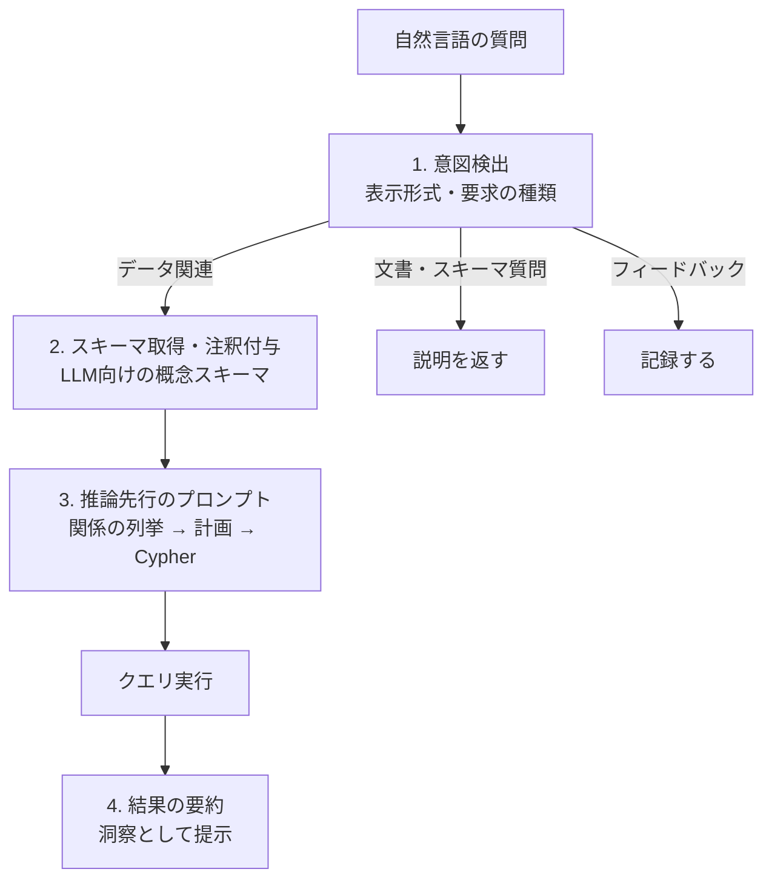

**学習用の独自サンプル: スキーマ注釈（YAML）と推論先行プロンプト**

```yaml
# schema_annotations.yaml (説明用のダミー)
nodes:
  Person:
    description: "人物。氏名と生年月日を持つ"
  Vehicle:
    description: "車両。色とナンバーの一部を持つ"
relationships:
  OWNS:
    description: "人物が車両を所有している"
skip:
  - InternalAuditLog   # ノイズになるため LLM には見せない
```

````python
CYPHER_PROMPT = """あなたはグラフデータベースの専門家です。
以下のスキーマだけを使って、質問に答える読み取り専用の Cypher を作ってください。

# スキーマ
{schema}

# 質問
{question}

# 手順(この順番で出力)
1. 使う予定のノード種別と関係を箇条書きにする
2. クエリの計画を 2〜3 行で書く
3. 最後に Cypher を ```cypher ブロックで 1 つだけ出す

制約: CREATE / MERGE / DELETE / SET は使わない。スキーマに無い名前は使わない。
"""
````

**安全面の注意 [補足]:** LLM が生成した Cypher を実行する場合は、(1) 読み取り専用ユーザーで接続する、(2) スキーマ検証や構文チェックを通す、(3) 件数上限（`LIMIT`）を課す、(4) 失敗時は誤りを伝えて再生成させる、といった対策を併用してください。

**関連研究 [動向]:** テキストから Cypher への変換を評価するベンチマーク CypherBench [S20] など、この分野の研究も進んでいます。

#### つまずきポイント

| つまずき | 対処 |
|---|---|
| 生成された Cypher が存在しない関係名を使う | スキーマを明示し、注釈で語彙を補う。実行前に検証する |
| 質問が曖昧で意図に合わない | 意図検出を独立ステップにして、必要なら聞き返す |
| 結果が大量で読めない | 要約ステップで洞察に変換し、表示形式の意図も活用する |

#### 確認問題

1. 第14章の 4 本柱を挙げてください。
2. なぜ「推論を先に書かせてから Cypher を出させる」のですか。

<details>
<summary>答え</summary>

1. 意図の検出とルーティング、スキーマ/メタデータの抽出と拡張、専門家のような推論によるクエリ構築、結果の要約 [S5]。
2. 使う関係や計画を先に明示させることで、スキーマから外れた誤ったクエリや論理の飛躍を減らせるため（章が推論先行の構造化プロンプトを採る理由 [S5] に沿った整理）。
</details>

---

### Step 10: LangGraph で QA エージェントを実装する（Part 5 / 第15章）

#### [書籍情報] 第15章の要点 [S6] [S7]

- 第14章の考え方を統合し、**LangGraph** でオーケストレーション、**Streamlit** でフロントエンドを作る。
- LangGraph は、状態を持つ複数アクターの LLM アプリを構築するためのライブラリと説明されている [S7]。
- パイプラインは、共有の状態を読み書きする専門エージェント（ノード）のモジュール型。**Configuration Provider** がプロンプト・例・ドメインメモを集約し、**Schema Provider** が Neo4j の技術的スキーマを LLM 向けの概念ビューに変換する。
- エージェントは、意図検出、スキーマ抽出、text-to-Cypher 生成（注釈とユーザーの現在の選択で補強）、エラー処理付きクエリ実行、リトライ/要約への動的ルーティング、最終要約を担う。
- 統合レイヤーは、パイプラインの実行を**型付きのイベントストリーム**として公開し、フロントエンドが進捗と結果を追跡できる。
- Streamlit アプリは会話履歴を保持し、処理の途中経過をリアルタイムに表示する。結果はグラフ・地図・表など最適な形式で出す。
- ハンズオン: 発生中の犯罪から出発し、近くの ANPR（ナンバー自動読取）カメラを探し、色や部分ナンバーの条件に合う車両を絞り込む調査を再現する [S6]。

#### やさしい説明 [補足]

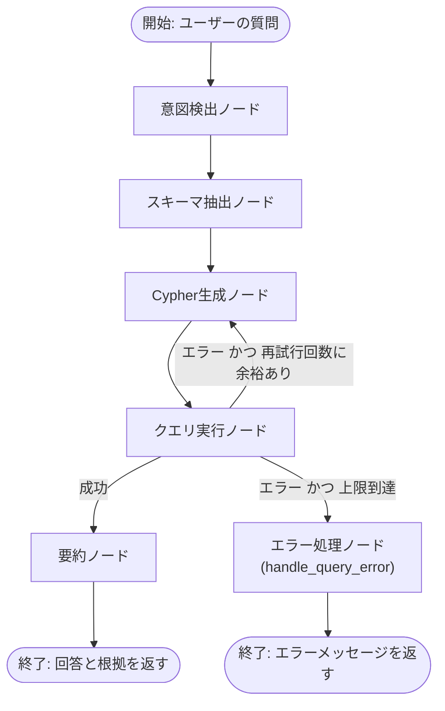

**LangGraph の考え方（[補足]）:** 各ステップを「ノード」、ステップ間の遷移を「エッジ」、全ノードが共有するデータを「状態（State）」として定義します。**条件付きエッジ**を使えば、上図のようなリトライのループも自然に書けます。

**学習用の独自サンプル: 状態とリトライを持つ最小の擬似実装**

```python
from typing import TypedDict
from langgraph.graph import StateGraph, START, END


class State(TypedDict, total=False):
    question: str
    cypher: str
    result: list
    error: str
    summary: str
    retries: int


def generate_cypher(state: State) -> State:
    # LLMでCypherを生成(実際にはスキーマ・注釈を注入する)
    return {"cypher": "MATCH (n) RETURN n LIMIT 1"}


def execute_query(state: State) -> State:
    try:
        # 実際にはDBで実行し、結果を辞書のリストで返す
        return {"result": [], "error": ""}
    except Exception as e:  # noqa: BLE001
        return {"error": str(e), "retries": state.get("retries", 0) + 1}


def summarize(state: State) -> State:
    return {"summary": "結果の要約(LLMで生成)"}


def handle_query_error(state: State) -> State:
    """リトライ上限に達したエラーをユーザー向けのメッセージに変換する。"""
    err = state.get("error") or "不明なエラーが発生しました"
    return {"summary": f"クエリ実行に失敗しました: {err}"}


def route_after_execute(state: State) -> str:
    """実行結果に応じて次のノードを決める。

    - エラーあり かつ リトライ残り → "retry" (generate_cypher に戻る)
    - エラーあり かつ リトライ上限超過 → "error" (handle_query_error へ)
    - エラーなし → "summarize"
    """
    if state.get("error"):
        if state.get("retries", 0) < 2:
            return "retry"
        return "error"
    return "summarize"


graph = StateGraph(State)
graph.add_node("generate_cypher", generate_cypher)
graph.add_node("execute_query", execute_query)
graph.add_node("summarize", summarize)
graph.add_node("handle_query_error", handle_query_error)

graph.add_edge(START, "generate_cypher")
graph.add_edge("generate_cypher", "execute_query")
graph.add_conditional_edges(
    "execute_query",
    route_after_execute,
    {"retry": "generate_cypher", "summarize": "summarize", "error": "handle_query_error"},
)
graph.add_edge("summarize", END)
graph.add_edge("handle_query_error", END)

app = graph.compile()
print(app.invoke({"question": "ダミーの質問", "retries": 0}))
```

> LangGraph の API は更新が続いています。上記は概念を示す簡略例なので、実装時は必ず公式ドキュメントの最新の書き方を確認してください。

#### つまずきポイント

- **状態の設計**が要です。何をどのノードが読み書きするかを最初に決めると、デバッグが容易になります（章にも「状態管理の設計」の節があります [S2]）。
- リトライは**上限を必ず設ける**こと。無限ループはコストと遅延の原因になります。

#### 確認問題

1. LangGraph のノード・エッジ・状態はそれぞれ何を表しますか。
2. 章のパイプラインで「動的ルーティング」は何のために使われますか。

<details>
<summary>答え</summary>

1. ノード = 処理ステップ（エージェント）、エッジ = ステップ間の遷移、状態 = ノード間で共有するデータ。
2. クエリ実行の結果に応じて、リトライか要約かを切り替えるため [S6]。なお上記の独自サンプルでは、リトライ上限に達したエラーはリトライにも要約にも進まず、`handle_query_error` を経てエラー終端（`END`）へ進みます [補足]。
</details>

---

## 8. 付録（A〜C）の使い方

| 付録 | 内容 [S2] | いつ読むか |
|---|---|---|
| **A グラフ入門** | グラフとは、ネットワークのモデルとしてのグラフ、グラフの表現方法 | グラフ理論に不慣れなら Ch1 と並行して |
| **B Neo4j** | Neo4j 入門、インストール（サーバー/Desktop）、Cypher、プラグイン（APOC、GDS）、クリーニング | ハンズオン開始前（Ch3 の前）に必須 |
| **C 構造化ソースからの KG 構築** | microRNA-疾患関連を題材にした KG 構築（ウォームアップ、KG 構築、探索・分析）| Ch3 の理解を補強したいとき |

**Cypher の最初の 3 文（[補足] 学習用）**

```cypher
// 作る
CREATE (a:Person {name: '山田'})-[:WORKS_AT]->(c:Company {name: 'Alpha'});

// 探す
MATCH (p:Person)-[:WORKS_AT]->(c:Company)
RETURN p.name AS person, c.name AS company;

// 全部消す(学習用DBでのみ実行すること)
MATCH (n) DETACH DELETE n;
```

---

## 9. 書籍の外側の最新動向（2026年9月21日時点で確認できた範囲）

書籍が扱う「KG × LLM × RAG」は、書籍刊行（2025年10月）の前後も急速に動いています。国際的に知られた開発者・研究組織の一次情報を中心に整理します。

### 9.1 動向の整理

| # | トピック | 確認できた要点 | 書籍の対応章 | 出典 |
|---|---|---|---|---|
| 1 | **Microsoft GraphRAG** | 2024年4月の論文（Edge, Larson ら）。LLM で文書から**エンティティ KG を作り、関連するエンティティ群（コミュニティ）ごとの要約を事前生成**。質問時は各要約から部分回答を作り、最後に統合する。約 100 万トークン級のデータに対する「全体を俯瞰する質問」で、従来の RAG より包括性と多様性が向上したと報告 | Ch6, Ch13 | [S9] [S10] |
| 2 | **LazyGraphRAG** | Microsoft Research が 2024年11月に発表。**事前の要約生成を不要**にし、索引コストを抑える方式。同社の報告では、索引コストはベクトル RAG と同等で、フル GraphRAG の 0.1% 程度。全体質問でも同等の品質を、クエリ費用 700 倍超の低減で実現とされる（ベンダー自身の報告）。2025年6月の追記で Microsoft Discovery と Azure Local（パブリックプレビュー）への統合が案内されている | Ch13 | [S11] |
| 3 | **LlamaIndex Property Graph Index** | ノードにラベルとプロパティを持つ**本格的なプロパティグラフ**を扱う構成。グラフ構築器と検索器がモジュール化。Neo4j をストアにできる。LlamaIndex 外で作られたグラフには text-to-Cypher や Cypher テンプレートの検索器が有用とドキュメントが説明 | Ch3, Ch13, Ch14 | [S12] [S13] [S14] |
| 4 | **Neo4j 開発者の実践記事**（Tomaž Bratanič ら） | 2025年8月の記事で、LlamaCloud による契約書の情報抽出と Neo4j での KG 構築を紹介。エンティティの重複排除やカスタム検索での GraphRAG 精度向上も扱う。Neo4j の週次ニュースでは、契約書 KG を使った**エージェント型 GraphRAG**も紹介 | Ch5-6, Ch13 | [S12] [S15] [S22] |
| 5 | **KG の質と大きさ** | LLM 生成 KG にエンティティ解決と誤りトリプルの除去を施し、エンティティと関係を約 40% 減らしても、4 種のグラフベース RAG の性能が向上したという研究（DEG-RAG） | Ch6-8 | [S18] |
| 6 | **エージェント型 KG-RAG** | KG への問い合わせをエージェントの中核能力とし、**複数ホップの推論**を行う手法の研究（INRAExplorer） | Ch13-15 | [S19] |
| 7 | **text-to-Cypher の評価** | 現代的な KG に対する精密な検索を評価するベンチマーク CypherBench。GraphRAG の検索部分の評価という位置づけ | Ch14 | [S20] |

### 9.2 読み解くときの注意点

| 注意点 | 説明 |
|---|---|
| **ベンダー自身の数値** | LazyGraphRAG のコスト比較などは提供元による報告です。自社データでの検証が前提です [S11] |
| **評価手法の偏り** | GraphRAG の優位性は「LLM による判定」に依存する評価で示されることが多く、判定の偏り（位置や長さなど）を補正すると差が縮むとの指摘があります。ただし、これは二次的なブログ記事での分析なので、**一次資料（原論文・追試）で確認**してください [S21] |
| **コストの現実** | フル GraphRAG は索引時に多数の LLM 呼び出しが必要になり、コストが大きくなりえます。だからこそ軽量化の動き（LazyGraphRAG など）が出ています [S11] [S21] |
| **書籍の立ち位置** | 書籍は特定の手法（GraphRAG 等）の紹介にとどまらず、**KG の設計・構築・機械学習・問い合わせ**を横断して扱う点が特徴です [S1] |

### 9.3 さらに学ぶための関連書籍・資料

- Manning の書籍ページの関連タイトルに *Essential GraphRAG* などが並んでいます [S1]。Bratanič 氏がこの書籍を題材にしたオンラインイベントも開催されています [S17]。
- Neo4j の 2023年の開発者ブログは、KG が初めての人向けに、Jim Webber・Jesús Barrasa 両氏の無料書籍 *Building Knowledge Graphs: A Practitioner's Guide* を案内しています [S16]。

> 正誤表や改訂情報など、書籍刊行後の更新については本調査では確認していません。Manning の書籍ページと GitHub リポジトリの更新履歴を参照してください [S1] [S8]。

---

## 10. 学習ロードマップ（8 週間の目安）

以下は、筆者の**提案例**です（週 5〜8 時間を想定）。

| 週 | 対象 | ゴール | 成果物 |
|---|---|---|---|
| 1 | 本ガイド第3〜6章、Ch1、付録A・B | 用語に慣れ、Neo4j を動かす | 環境構築完了、小さな KG（10 ノード程度）|
| 2 | Ch2、Ch3 | オントロジーからの KG 構築の流れを理解 | Ch3 のコードを再現 |
| 3 | Ch4、付録C | 複数データ統合と LLM 解釈を体験 | 統合 KG の簡単な分析メモ |
| 4 | Ch5、Ch6 | LLM による抽出パイプラインを作る | 自分の文書 5〜10 件で抽出→格納 |
| 5 | Ch7、Ch8 | NED の 3 段階を実装 | Ollama で NED を試す |
| 6 | Ch9、Ch10（余裕があれば Ch11-12）| グラフ特徴量と機械学習の基礎 | PageRank などの結果の解釈 |
| 7 | Ch13 | KG-RAG の設計を理解 | 3 つのツールを持つ簡単なエージェント |
| 8 | Ch14、Ch15 | 自然言語問い合わせの QA エージェント | LangGraph の最小パイプライン |

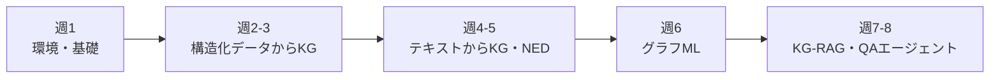

---

## 11. 実務での判断: KG を使うべきか、どう失敗を避けるか

### 11.1 判断フロー（[補足] 筆者の整理）

第1章には「KG を使うべきか判断する」節があります [S2]。以下は、実務でよく使われる観点をまとめた**独自の判断フロー**です。書籍の結論とは異なる可能性があるため、本文と併せて検討してください。

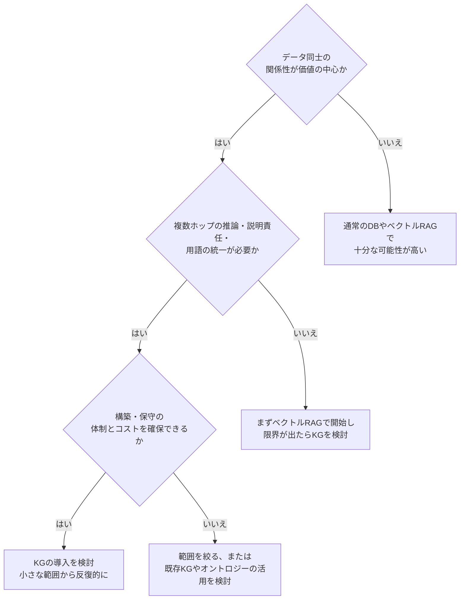

### 11.2 よくある落とし穴と対策

| 落とし穴 | 症状 | 対策 |
|---|---|---|
| ユースケース不明のまま構築 | 誰も使わない大きな KG ができる | 第3章の姿勢どおり、**ビジネス目標と利用者**から始める [S3] |
| エンティティの重複・表記ゆれ | 同一人物が複数ノードに分裂 | エンティティ解決（Ch6）、NED（Ch7-8）で統合 [S18] |
| LLM 抽出の誤り | 存在しない関係がグラフに混入 | スキーマ検証、根拠文の保存、サンプリング確認 |
| 生成 Cypher の誤り・危険 | 存在しない関係名、意図しない書き込み | スキーマ注入、読み取り専用ユーザー、検証、リトライ上限 |
| 更新運用の欠如 | KG が古くなり、RAG の答えがずれる | 更新の担当・頻度・差分取り込みを設計 |
| アクセス制御の見落とし | 機密データが回答に混ざる | ノード/関係単位の権限設計、ユーザー別の問い合わせ制約 |
| コストの見積り不足 | LLM の索引費用が想定超過 | 小規模で試算、軽量手法（LazyGraphRAG 等）も検討 [S11] |

---

## 12. 総合確認問題

<details>
<summary>問題 1: KG と LLM を組み合わせる理由を、「補い合い」の観点で説明してください。</summary>

KG は正確な関係・根拠・統一語彙を提供し、LLM のハルシネーションや不透明性を補う。LLM は文章からの知識抽出、曖昧性解消、自然言語での問い合わせと要約で KG の構築・活用を助ける。
</details>

<details>
<summary>問題 2: RDF と LPG のどちらを選ぶか、判断基準を述べてください。</summary>

用途で決める。標準化・相互運用・推論・オントロジー記述を重視するなら RDF、関係ごとのメタデータや効率的なたどりを重視するなら LPG。第3章は、関係のメタデータが重要な事例で LPG を採用している [S3]。
</details>

<details>
<summary>問題 3: NER と NED の違いを例で説明してください。</summary>

NER は「Apple」が固有表現だと見つけること。NED は、その「Apple」が企業か果物かを文脈とオントロジーで特定し、正しいノードに結びつけること。
</details>

<details>
<summary>問題 4: ベクトル RAG では苦手で、Graph RAG が得意な質問の例を挙げてください。</summary>

「A 社の子会社の、そのまた取引先で、条件を満たす企業を集計して」のような、複数ホップの関係をたどって集計する質問。
</details>

<details>
<summary>問題 5: LLM に Cypher を生成させるとき、精度と安全性を上げる工夫を 3 つ挙げてください。</summary>

スキーマと注釈を渡す、推論を先に書かせてから Cypher を出力させる、読み取り専用ユーザーで実行する、実行前の検証とエラー時の再生成、件数上限の設定、など [S5]（一部は筆者の補足）。
</details>

<details>
<summary>問題 6: GNN のメッセージパッシングを説明してください。</summary>

各ノードが隣接ノードの情報を集約し、自分の表現を更新する処理を繰り返すことで、構造と属性を反映したベクトルを得る。
</details>

<details>
<summary>問題 7: LangGraph で「リトライ付き」のパイプラインを作るとき、必要な要素は？</summary>

共有の状態（エラー・再試行回数を含む）、各処理ノード、条件付きエッジ（成功なら要約、失敗なら再生成、上限到達ならエラー処理ノード経由でエラー終端へ）。
</details>

<details>
<summary>問題 8: GraphRAG 系の手法の効果を評価するときの注意点を述べてください。</summary>

提供元の数値は自社データで検証する。LLM 判定による評価の偏り（位置や長さなど）に留意する。KG の質（重複排除・誤り除去）が性能に影響する [S11] [S18] [S21]。
</details>

---

## 13. 参考文献・ソース URL

以下は本ガイドの作成にあたって確認した情報源です（確認日: 2026年9月21日）。本文の `[S番号]` に対応します。

### A. 書籍の公式情報（出版社・配信元）

- **[S1] Manning 書籍ページ** — 書誌情報、学習目標、著者、序文、価格・関連書籍
  https://www.manning.com/books/knowledge-graphs-and-llms-in-action
- **[S2] O'Reilly 書籍ページ** — 目次（章・節の見出し）、難易度・ページ数
  https://www.oreilly.com/library/view/knowledge-graphs-and/9781633439894/
- **[S3] Manning 第3章プレビュー** — 章概要、FAQ（RDF と LPG、HPO、環境）
  https://www.manning.com/preview/knowledge-graphs-and-llms-in-action/chapter-3
- **[S4] Manning 第13章プレビュー** — KG-RAG、ベクトル RAG の限界、3 つのツール
  https://www.manning.com/preview/knowledge-graphs-and-llms-in-action/chapter-13
- **[S5] Manning 第14章プレビュー** — 自然言語での KG 問い合わせ、4 本柱
  https://www.manning.com/preview/knowledge-graphs-and-llms-in-action/chapter-14
- **[S6] Manning 第15章プレビュー** — LangGraph パイプラインと Streamlit アプリ
  https://www.manning.com/preview/knowledge-graphs-and-llms-in-action/chapter-15
- **[S7] liveBook 第15章** — LangGraph の説明、章の構成
  https://livebook.manning.com/book/knowledge-graphs-and-llms-in-action/chapter-15

### B. 書籍のコード

- **[S8] GitHub: alenegro81/knowledge-graphs-and-llms-in-action** — 各章のコード、README（Python の版、config.ini、make）
  https://github.com/alenegro81/knowledge-graphs-and-llms-in-action

### C. GraphRAG（Microsoft Research）

- **[S9] "From Local to Global: A Graph RAG Approach to Query-Focused Summarization"**（Edge, Trinh, Cheng, Bradley, Chao, Mody, Truitt, Metropolitansky, Ness, Larson）
  https://arxiv.org/pdf/2404.16130
- **[S10] Microsoft Research: Project GraphRAG — Publications**
  https://www.microsoft.com/en-us/research/project/graphrag/publications/
- **[S11] Microsoft Research Blog: LazyGraphRAG: Setting a new standard for quality and cost**（Darren Edge, Ha Trinh, Jonathan Larson）
  https://www.microsoft.com/en-us/research/blog/lazygraphrag-setting-a-new-standard-for-quality-and-cost/

### D. 実装ツールと開発者の実践記事

- **[S12] Neo4j Developer Blog: Customizing property graph index in LlamaIndex**（Tomaž Bratanič）
  https://neo4j.com/blog/developer/property-graph-index-llamaindex/
- **[S13] Neo4j Labs: LlamaIndex 連携**
  https://neo4j.com/labs/genai-ecosystem/llamaindex/
- **[S14] LlamaIndex ドキュメント: Neo4j Property Graph Index**
  https://developers.llamaindex.ai/python/examples/property_graph/property_graph_neo4j/
- **[S15] Tomaž Bratanič: From Legal Documents to Knowledge Graphs**（2025年8月）
  https://medium.com/neo4j/from-legal-documents-to-knowledge-graphs-ccd9cb062320
- **[S16] Neo4j Developer Blog: Knowledge Graphs & LLMs: Real-Time Graph Analytics**（NaLLM プロジェクト、2023年）
  https://neo4j.com/blog/developer/knowledge-graph-llm-analytics/
- **[S17] Neo4j Live: Essential GraphRAG（イベントページ）**
  https://luma.com/27yn94zs
- **[S22] This week in Neo4j: NODES, GraphRAG, agents, knowledge graph and more**
  https://neo4j.com/blog/twin4j/this-week-in-neo4j-graphrag-nodes-agents-knowledgegraph-and-more/

### E. 研究論文・二次資料

- **[S18] "Less is More: Denoising Knowledge Graphs For Retrieval Augmented Generation"（DEG-RAG）**
  https://arxiv.org/pdf/2510.14271
- **[S19] "Agentic RAG with Knowledge Graphs for Complex Multi-Hop Reasoning in Real-World Applications"（INRAExplorer）**
  https://arxiv.org/pdf/2507.16507
- **[S20] "CypherBench: Towards Precise Retrieval over Full-scale Modern Knowledge Graphs in the LLM Era"**
  https://arxiv.org/pdf/2412.18702
- **[S21] Beancount.io Research Log: GraphRAG: From Local to Global Query-Focused Summarization**（二次資料。評価の偏りやコストに関する分析。参考レベルとして扱い、一次資料で確認してください）
  https://beancount.io/bean-labs/research-logs/2026/06/04/graphrag-local-to-global-query-focused-summarization

---

### 付記: 本ガイドの取り扱い

- 書籍の本文は転載していません。章の解説は公開情報に基づく要約と、筆者による補足で構成されています。
- 正確な内容・最新の手順は、書籍本文、公式リポジトリ、各ツールの公式ドキュメントで必ず確認してください。
- 書籍の内容を深く学ぶには、Manning または O'Reilly で書籍を入手して読むことを強く推奨します [S1] [S2]。
