# Knowledge Graphs: Fundamentals, Techniques, and Applications 初学者向けステップバイステップ解説

> 対象書籍：Mayank Kejriwal, Craig A. Knoblock, Pedro Szekely 著 *Knowledge Graphs: Fundamentals, Techniques, and Applications*（MIT Press, 2021）
> 情報の基準日：2026年9月21日
> 想定読者：ナレッジグラフ（Knowledge Graph、以下 KG）を初めて学ぶソフトウェア／AI エンジニア

---

## 0. このガイドの読み方（必ず最初に読んでください）

💡 この章では、ガイドの位置づけ、書籍の全体像、章ごとの読み進め方を説明します。ここを読んでおくと、後の章で「いま全体のどこを学んでいるのか」が分かります。

### 0.1 このガイドは何か

このガイドは、書籍の**公開されている目次・出版社の紹介文・著者らの公開資料**と、W3C や ISO などの**一次情報**を手がかりに作った学習ガイドです。書籍本文の要約や転載ではありません。書籍を読む前の地図、または読みながら手元に置く副読本として使ってください。

情報の確度を区別するため、各章に次の2種類のラベルを付けています。

| ラベル | 意味 | 確度 |
|--------|------|------|
| 【本書の範囲】 | 出版社が公開している目次（節タイトル）に基づく内容 | 高い |
| 【補足】 | 一般的な KG の知識や公開資料に基づく、筆者による補足解説。書籍本文の記述とは限らない | 書籍と一致するとは限らない |

### 0.2 書名についての注記

ご指定の書名は「Knowledge Graphs: Fundamentals and Techniques」ですが、Google ブックスと MIT Press の書誌では、正式な書名は **Knowledge Graphs: Fundamentals, Techniques, and Applications**（基礎・技法・応用）です。同じ書籍（Google ブックス ID `iqvuDwAAQBAJ`）として扱っています。

### 0.3 書誌情報

| 項目 | 内容 |
|------|------|
| 著者 | Mayank Kejriwal, Craig A. Knoblock, Pedro Szekely（いずれも南カリフォルニア大学 USC の関係者） |
| 出版社 | MIT Press（Adaptive Computation and Machine Learning series） |
| 発行日 | 2021年3月30日 |
| ISBN | 978-0-262-04509-4（ハードカバー）、978-0-262-36188-0（電子版） |
| ページ数 | 約560〜568ページ（書店・データベースにより表記が異なる） |
| 構成 | 全17章、演習問題は合計130問。各章末に「Software and Resources」と「Bibliographic Notes」がある |

### 0.4 用語の約束

専門用語は初出時に（＝平易な説明）を付けます。各章末には「📖 このセクションで登場した用語」をまとめています。英語の技術用語は、検索やドキュメント参照のために英語のまま残します。

📖 このセクションで登場した用語
- KG（Knowledge Graph）：現実世界の物事（実体）と、その間の関係を、点と線でつないで表したデータの集まり
- 一次情報：標準化団体の仕様書や、開発元本人の公式ブログなど、情報の出どころそのもの

---

## 0.5 書籍の全体マップ

💡 この章では、17章の構成を5つのパートに分けて俯瞰します。地図を先に見ておくと、細かい話で迷子になりません。

### 0.5.1 なぜ全体マップが必要か

KG の学習範囲は、データの表現方法、文章からの知識抽出、機械学習、データベース、応用事例と、多くの分野にまたがります。全体の流れを先につかんでおくと、各章が「作る」「直す・増やす」「使う」のどこに当たるかを判断できます。

### 0.5.2 5つのパート構成

出版社の紹介文は、本書の流れを「導入と背景 → KG の構築 → 知識の追加・改良 → KG へのアクセス（検索・問い合わせ）→ 具体的なエコシステムと事例」と説明しています。この流れに沿って章を並べると、次の図になります（パート名の一部は紹介文に沿った筆者の整理です）。

この図は、本書の章がどのパートに属し、どの順番で学ぶかを表しています。上から下へ読み進めてください。

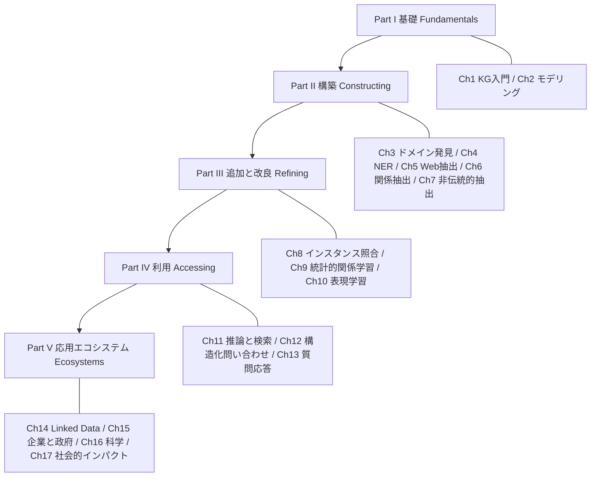

各ノードの意味：
- 「Part I〜V」：本書の大きな流れ。左から右ではなく、上から下へ進みます
- 「Ch○○」：各パートに含まれる章。線（`---`）でパートとつながっています
- Part I と Part IV の名称は目次に明記されています。Part II・III・V の名称は、出版社の紹介文にある「構築」「追加・改良」「エコシステム」に基づく整理です

### 0.5.3 「KG のライフサイクル」で見る全体像

KG は一度作って終わりではありません。作り、直し、使い、その結果をまた作る工程に戻します。

この図は、KG のライフサイクル（＝作成から運用までの一連の流れ）を表しています。時計回りに読んでください。

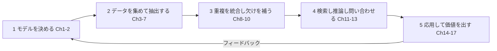

各ノードの意味：
- 「1 モデルを決める」：何を実体とし、どんな関係を持たせるかを設計する
- 「2 データを集めて抽出する」：Web や文章から事実を取り出す
- 「3 重複を統合し欠けを補う」：同じ物の別表記をまとめ、足りない関係を予測する
- 「4 検索し推論し問い合わせる」：作った KG を使って答えを得る
- 「5 応用して価値を出す」：企業、科学、社会課題へ適用する
- 「フィードバック」：応用で見つかった不足を、モデルや抽出へ戻して直す

### 0.5.4 初学者向けの読み進め方

| 学習の目的 | おすすめの順番 |
|-----------|----------------|
| まず概念を理解したい | Ch1 → Ch2 → Ch12 → Ch14 |
| KG を作る実務をしたい | Ch1 → Ch2 → Ch4 → Ch6 → Ch8 |
| 機械学習で KG を扱いたい | Ch1 → Ch2 → Ch10 → Ch11 |
| LLM と組み合わせたい | Ch1 → Ch2 → Ch12 → Ch13 → 本ガイド第18章 |

📖 このセクションで登場した用語
- ライフサイクル：物事が生まれてから使われ、更新されていく一連の流れ
- エコシステム：複数のデータ・ツール・組織が互いに関わり合って成り立つ仕組み全体

---

## 1. 第1章：ナレッジグラフとは何か

💡 この章では、本書の Chapter 1「Introduction to Knowledge Graphs」に相当する内容として、KG の基本イメージ、グラフの基礎、実世界の例を説明します。

### 1.1 【本書の範囲】この章の節

1.1 Graphs、1.2 Representing Knowledge as Graphs、1.3 Examples of Knowledge Graphs、1.4 How to Read This Text

### 1.2 なぜ KG が必要なのか

コンピュータは、文字列（string）をそのままでは「意味」として理解できません。たとえば「Taj Mahal」という文字列は、世界遺産の建物、音楽家、カジノを指すことがあります。Google は2012年に KG を発表したとき、「**things, not strings**（文字列ではなく、物事）」という考え方を掲げ、キーワードの一致から、実世界の物事とその関係の理解へ移ると説明しました。同じ発表によると、発表時点の KG には5億以上のオブジェクトと、35億以上の事実・関係が入っていました。

### 1.3 例え話：地下鉄の路線図

KG は、地下鉄の路線図に似ています。駅（＝点）と、駅をつなぐ線（＝線）があります。路線図があれば「渋谷から東京駅へ行くには、どの駅を通るか」を線をたどって答えられます。KG では、駅の代わりに「人」「場所」「作品」などが並び、線には「生まれた場所」「作った人」などの意味の名前が付きます。

### 1.4 ステップ1：グラフの基礎

グラフとは、**ノード（点）**と**エッジ（線）**でできた構造です。

| 用語 | 意味 | 例 |
|------|------|-----|
| ノード（node） | 点。実体や値を表す | 東京、日本 |
| エッジ（edge） | 点と点をつなぐ線。向きと名前（ラベル）を持てる | 「首都である」 |
| 有向グラフ | 線に向きがあるグラフ | 東京 → 日本 |
| ラベル付きグラフ | 線に意味の名前が付いたグラフ | 「locatedIn」 |

### 1.5 ステップ2：知識をグラフで表す

なぜグラフで表すのかというと、「AはBと関係がある」という**事実（ファクト）**を、そのまま1本の線で書けるからです。事実は「主語 → 関係 → 目的語」の3つ組（トリプル）で書けます。

次の図は、小さな KG の例です。矢印のラベルが関係の名前を表しています。

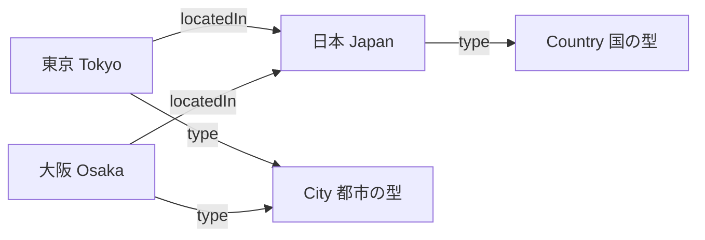

各ノードの意味：
- 「Tokyo」「Osaka」「Japan」：具体的な実体（インスタンス）です
- 「City」「Country」：実体がどの種類（型）に属するかを表す概念です
- 「locatedIn」の矢印：「〜に位置する」という関係です
- 「type」の矢印：「〜という種類である」という関係です

### 1.6 ステップ3：実世界の KG を見る

| KG | 何をするか | 参考にした情報 |
|----|-----------|----------------|
| Google Knowledge Graph | 検索結果に、物事の要点や関連情報を添える | Google 公式ブログ（2012年） |
| Wikidata | Wikipedia の事実を、多言語で共同編集できる「データのための Wikipedia」として管理する | CACM 論文（Vrandečić & Krötzsch, 2014） |
| DBpedia | Wikipedia の内容を構造化データに変換した KG | 【補足】広く知られた公開 KG |

### 1.7 KG とほかのデータ形式の違い

| 観点 | 表（リレーショナルDB） | KG |
|------|------------------------|-----|
| 基本の形 | 行と列 | ノードとエッジ |
| 関係の扱い | 外部キーと結合（JOIN）で表す | 関係そのものが一級の要素 |
| 構造の変更 | 列の追加に設計変更が必要になりやすい | 新しい種類の線を足しやすい |
| 得意な問い | 集計、整合性の高い業務処理 | 「Aとつながる Bの、さらにその先」を追う問い |
| 意味づけ | 列名に頼る | 型（クラス）と関係の定義（オントロジー）で意味を表せる |

### 1.8 ステップ4：KG の「知識」とは何か

Hogan らの論文 *Knowledge Graphs*（ACM Computing Surveys, 第54巻第4号, 2021年）は、KG を包括的に紹介する入門的な調査論文です。Aidan Hogan、Claudia d'Amato、Juan Sequeda、Steffen Staab、Antoine Zimmermann ら、国際的な研究者が共著者に名を連ねています。KG が、多様で変化が速く大規模なデータを活用する場面で、産業界と学術界の両方から注目されている点を出発点にしています。本書の Part I と併読すると、用語の整理に役立ちます。

📖 このセクションで登場した用語
- ノード：グラフの「点」。人や場所などの実体、または値
- エッジ：グラフの「線」。点と点の関係
- トリプル：主語・関係・目的語の3つ組で書いた1つの事実
- インスタンス：具体的な1つ1つの実体（例：東京）
- オントロジー：どんな種類の物事があり、どんな関係が許されるかを定めた「意味の設計図」

---

## 2. 第2章：KG のモデル化と表現（RDF・プロパティグラフ・Wikidata）

💡 この章では、Chapter 2「Modeling and Representing Knowledge Graphs」に相当する内容として、KG をコンピュータで扱うためのデータの書き方（モデル）を説明します。KG を作る際の最初の設計判断がここで決まります。

### 2.1 【本書の範囲】この章の節

2.1 Introduction、2.2 RDF Schema、2.3 Property-Centric Models、2.4 Wikidata Model、2.5 The Semantic Web Layer Cake、2.6 Schema Heterogeneity and Semantic Labeling

### 2.2 なぜモデルが必要か

同じ「東京は日本にある」という事実でも、システムごとに書き方が違うと、データを交換したり統合したりできません。モデルは、KG のデータの書き方を揃える約束事です。

### 2.3 ステップ1：RDF の基本（トリプルと3種類の要素）

RDF（Resource Description Framework）は、W3C が標準化した、KG を表すための代表的なデータモデルです。RDF のグラフは、主語（subject）・述語（predicate）・目的語（object）の3つ組の集まりです。W3C の RDF 1.1 の仕様では、RDF グラフのノードは次の3種類です。

| 要素 | 意味 | 例え話 |
|------|------|--------|
| IRI | 世界で一意になる名前（Web の住所のような識別子） | マイナンバーのように、他と重ならない ID |
| リテラル（literal） | 文字列や数値などの具体的な値。言語タグやデータ型を付けられる | 名札に書かれた文字そのもの |
| 空白ノード（blank node） | 世界共通の名前を付けずに「何かがある」とだけ表すノード | 「誰かは分からないが、絵の背景に木がある」の「木」 |

W3C の RDF Primer では、空白ノードの例として、モナリザの背景にある「名前のない糸杉（cypress tree）」が使われています。

トリプルの各位置には制約があります。主語は IRI か空白ノード、述語は IRI だけ、目的語は IRI・リテラル・空白ノードのいずれかです。

### 2.4 ステップ2：Turtle で実際に書く

次のコードは、第1章の東京と大阪の KG を、RDF の書き方の一つである Turtle 形式で書いたものです。人が読み書きしやすい形式なので、学習用に向いています。

```turtle
# 接頭辞の宣言。長い IRI を毎回書くと読みにくいので、短い別名（ex:）を定義する。
@prefix ex:   <http://example.org/> .
@prefix rdf:  <http://www.w3.org/1999/02/22-rdf-syntax-ns#> .
@prefix rdfs: <http://www.w3.org/2000/01/rdf-schema#> .

# 「東京は City という型である」。rdf:type は、実体（インスタンス）と型（クラス）を結ぶ標準の述語。
# セミコロンは「主語を省略して、同じ主語で次の文を続ける」という記号。
ex:Tokyo   rdf:type ex:City ;
           rdfs:label "Tokyo"@en, "東京"@ja ;   # 言語タグ @en @ja を付け、同じ物の多言語ラベルを区別する
           ex:locatedIn ex:Japan .              # 文の終わりはピリオド

ex:Osaka   rdf:type ex:City ;
           rdfs:label "Osaka"@en ;
           ex:locatedIn ex:Japan .

ex:Japan   rdf:type ex:Country ;
           rdfs:label "Japan"@en .

# 型どうしの関係（スキーマ）。City も Country も Place の一種だと宣言しておくと、
# 「Place を全部探す」という問いに、東京も日本も含められる。
ex:City    rdfs:subClassOf ex:Place .
ex:Country rdfs:subClassOf ex:Place .
```

トリプルの数を数えると、東京4個、大阪3個、日本2個、型の関係2個で、合計11個です（rdflib で読み込んで 11 と確認済みです）。

### 2.5 ステップ3：A-Box と T-Box を区別する

KG の中身は、2層に分けて考えると整理できます。Kejriwal 氏の解説論文（*Knowledge Graphs: A Practical Review of the Research Landscape*）でも、この区別が使われています。

| 層 | 内容 | 例 |
|----|------|-----|
| A-Box（実体の層） | 具体的な事実 | 東京は日本にある |
| T-Box（概念の層） | 型と、許される関係の定義（オントロジー） | City は Place の一種。locatedIn の対象は Place |

`rdf:type` は、A-Box の実体を T-Box の型に結ぶ橋の役割をします。T-Box には制約も書けます。同解説論文は、例として「married_to は最大1つの相手にだけ結べる」という個数の制約（cardinality constraint）を挙げています。

この図は、A-Box と T-Box が rdf:type でつながる様子を表しています。

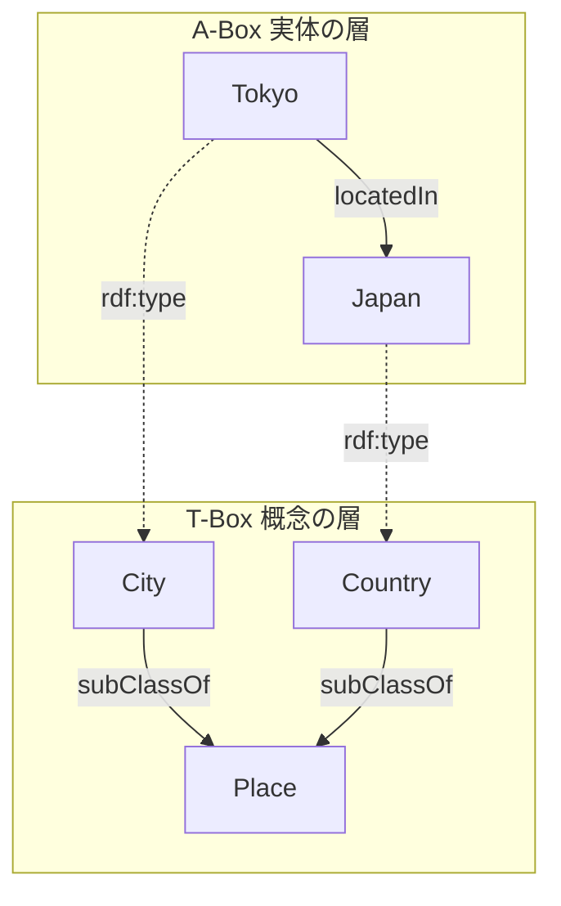

各ノードの意味：
- 上の枠（T-Box）：型と型の関係だけを置く場所です
- 下の枠（A-Box）：具体的な実体と事実を置く場所です
- 点線の矢印（rdf:type）：実体がどの型に属するかを示し、2つの層をつなぎます

### 2.6 ステップ4：RDF Schema でスキーマを表す

RDFS（RDF Schema）は、RDF で型の階層などを書くための語彙です。本書の 2.2 節に対応します。先ほどの `rdfs:subClassOf` が代表例です。RDFS を使うと、「東京は City であり、City は Place の一種である。したがって東京は Place でもある」という推論の材料をデータ自身に持たせられます。推論の詳細は、このガイドの第11章で扱います。

### 2.7 ステップ5：プロパティグラフという別の流儀

本書の 2.3 節は Property-Centric Models（＝プロパティ中心のモデル）を扱っています。ここでは、代表例であるプロパティグラフ（property graph）を補足します。プロパティグラフでは、ノードにもエッジにも、キーと値の組（プロパティ）を直接付けられます。

| 観点 | RDF | プロパティグラフ |
|------|-----|------------------|
| 基本単位 | トリプル | ノードとエッジ（それぞれにプロパティを持てる） |
| 識別子 | IRI で世界的に一意 | データベース内の ID が中心 |
| 意味づけ | RDFS・OWL などの標準 | 標準の意味論は弱く、製品ごとの慣習が多い |
| 問い合わせ言語 | SPARQL | Cypher、GQL（ISO 標準） |
| 得意な場面 | 異なる組織のデータを統合・公開する | 単一システム内で関係をたどる処理 |

【補足】プロパティグラフの問い合わせ言語 GQL は、2024年4月に ISO/IEC 39075:2024 として発行されました。SQL の標準化（1987年）以来、ISO が発行した最初の新しいデータベース問い合わせ言語だと、The New Stack などが報じています。詳しくは、このガイドの第12章で扱います。

### 2.8 ステップ6：Wikidata のモデル

本書の 2.4 節は Wikidata Model を扱います。Wikidata は、プロジェクトの設計者である Vrandečić と Krötzsch が CACM の論文で、多言語の「Wikipedia のためのデータ」として説明しています。論文の見出しには「Simple Data（Properties and Values）」「Not-So-Simple Data」「Citation Needed」があり、Wikidata の設計の特徴を、見出しと一般的な説明で整理すると次のとおりです。

| 特徴 | 説明 |
|------|------|
| プロパティと値 | 「人口」「首都」のような性質と、その値の組で事実を書く |
| 付加情報の付与 | 事実に、いつの値か、といった補足条件を付けられる |
| 出典 | 事実に、根拠となる参照元を付けられる（Citation Needed の思想） |

【補足】付加情報（qualifier）と出典（reference）を事実に付ける仕組みが、素の RDF トリプルでは書きにくい部分を補っています。RDF 1.2 が「トリプル項（triple term）」を導入したのも、事実そのものについて述べる需要に応えるためです（次の2.9節）。

### 2.9 RDF の標準は今どうなっているか（2026年9月時点）

RDF は現在、改訂の途中にあります。私が確認できた範囲の状況は次のとおりです。

| 仕様 | 状況 | 確認元 |
|------|------|--------|
| RDF 1.1 | 2014年に W3C 勧告（安定版） | W3C |
| RDF 1.2 Concepts / Semantics | 2026年4月7日に Candidate Recommendation Snapshot（実装を募る段階） | W3C ニュース（2026-04-07） |
| SPARQL 1.2 | Working Draft（草案）の段階の文書が複数公開されている | W3C |
| RDF 1.2 の主な追加 | ノードの種類に「triple term（トリプルを部品として扱う要素）」が加わる | W3C RDF 1.2 Concepts |

Candidate Recommendation は、勧告（Recommendation）に進む前の段階です。RDF 1.2 の場合、W3C は実装を募る公告の中で「十分な実装経験」を次の段階へ進む条件の一つとして示しています。具体的な出口条件（必要な実装数やテストスイートの合格条件等）は仕様ごとに異なるため、**実装に使う前に W3C の最新ページを確認してください。この状況は変わる可能性があります。**

### 2.10 ステップ7：Semantic Web Layer Cake と、スキーマの不一致

本書の 2.5 節「The Semantic Web Layer Cake」は、Semantic Web の技術（識別子、RDF、RDFS、オントロジー、ルール、論理など）を、下から上へ積み重なる層として示す有名な図です。上の層は下の層に依存します。

2.6 節「Schema Heterogeneity and Semantic Labeling」は、データ源ごとに列名や構造が違うという現実的な問題を扱います。たとえば、ある表では「所在地」、別の表では「place」と書かれていても、同じ「locatedIn」に対応づけたいことがあります。この対応づけを、データの列に意味のラベル（オントロジーの語彙）を付ける作業、すなわちセマンティックラベリングと呼びます。

📖 このセクションで登場した用語
- RDF：主語・述語・目的語の3つ組で知識を表す W3C 標準のデータモデル
- IRI：物事に付ける、世界で一意な識別子（URL に似ているが、Web ページの住所とは限らない）
- リテラル：文字列・数値・日付などの具体的な値
- 空白ノード：識別子を持たない、名前のないノード
- Turtle：RDF を人間が読み書きしやすい形で書く記法
- A-Box / T-Box：実体の層 / 概念（型）の層
- RDFS：RDF で型の階層などを書くための語彙
- プロパティグラフ：ノードとエッジにキーと値のプロパティを付けられるモデル
- Candidate Recommendation：W3C 標準化で「勧告」の前にある、実装を募る段階
- セマンティックラベリング：データの列などに、オントロジーの語彙で意味の名前を付けること

---

## 3. 第3章：ドメイン発見（Domain Discovery）

💡 この章では、Chapter 3 に相当する内容として、KG を作る材料になるデータを、どうやって探し集めるかを説明します。Part II（構築）の入り口です。

### 3.1 【本書の範囲】この章の節

3.1 Introduction、3.2 Focused Crawling、3.3 Influential Systems and Methodologies

### 3.2 なぜドメイン発見が必要か

KG を作るとき、最初の壁は「どのデータを集めればよいか」です。Web 全体は広すぎて、すべてを集めるには時間と費用がかかります。そこで、作りたい KG の**分野（ドメイン）**に関係するページだけを狙って集めます。これがドメイン発見です。

### 3.3 例え話：釣りと底引き網

一般的なクローラ（Web を巡回してページを集めるプログラム）は、海全体を底引き網で引くようなものです。一方、**フォーカスト・クローラ（focused crawler）**は、特定の魚のいる場所だけを狙って釣り糸を垂らす方法です。狙った分野のページだけを集めるので、無駄が少なくなります。

| 観点 | 一般的なクローラ | フォーカスト・クローラ |
|------|------------------|------------------------|
| 集める範囲 | 見つけたリンクを広く辿る | 分野に関係しそうなリンクを優先して辿る |
| 必要な判定 | 少ない | 「このページは分野に合うか」を判定する仕組みが必要 |
| 向いている用途 | 検索エンジンの索引づくり | 特定分野の KG づくり |

### 3.4 ステップ・バイ・ステップ：フォーカスト・クローリングの流れ

1. **種（seed）を決める**：分野に確実に関係する数個のページを用意します
2. **ページを取得する**：種のページをダウンロードします
3. **関連度を判定する**：分類器（＝ページを「関係あり／なし」に振り分けるプログラム）で判定します
4. **リンクの優先度を付ける**：関係ありと判定したページのリンクを、優先度付きの待ち行列（フロンティア）に入れます
5. **繰り返す**：フロンティアから優先度の高いページを取り出して、2に戻ります

この図は、フォーカスト・クローリングの処理の流れを表しています。上から下へ読み進めてください。

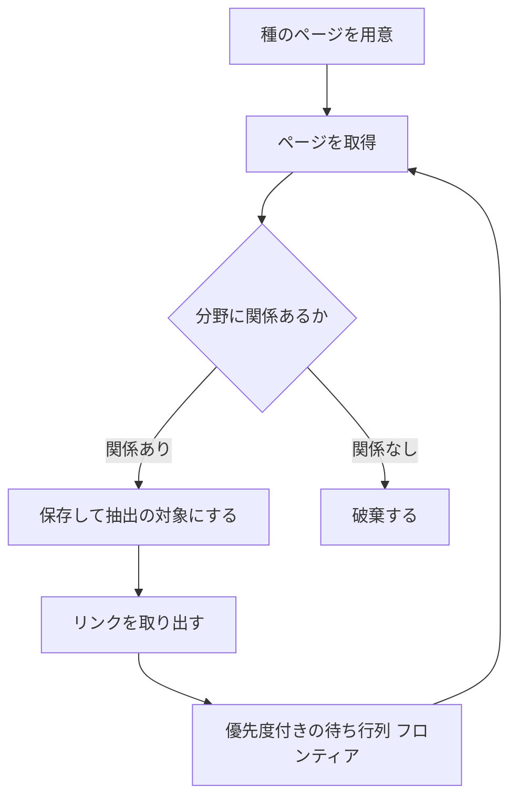

各ノードの意味：
- 「種のページを用意」：処理の開始点。人が選ぶ
- 「分野に関係あるか」（ひし形）：分類器の判定。分岐点
- 「フロンティア」：これから訪れる候補ページの優先順位つきリスト
- 「破棄する」：関係のないページを捨てて、無駄な取得を減らす

### 3.5 現場での注意点

【補足】ページを取得するときは、対象サイトの利用規約と `robots.txt`（＝クローラに許可・禁止する範囲を伝える設定ファイル）を確認してください。アクセス頻度を抑えることも、サイトへの負荷を避けるために必要です。

📖 このセクションで登場した用語
- ドメイン：扱う分野（例：旅行、医療、製品）
- クローラ：Web ページを自動で巡回して集めるプログラム
- フォーカスト・クローラ：特定の分野に関係するページを優先して集めるクローラ
- 種（seed）：巡回の出発点になるページ
- フロンティア：これから訪れるページの候補一覧

---

## 4. 第4章：固有表現認識（Named Entity Recognition, NER）

💡 この章では、Chapter 4 に相当する内容として、文章から「人名」「組織名」「地名」などの名前を見つけ出す技術を説明します。文章を KG のノードに変える最初の一歩です。

### 4.1 【本書の範囲】この章の節

4.1 Introduction、4.2 Why Is Information Extraction Hard?、4.3 Approaches for Named Entity Recognition、4.4 Deep Learning for Named Entity Recognition、4.5 Domain-Specific Named Entity Recognition、4.6 Evaluating Information Extraction Quality

### 4.2 なぜ NER が必要か

KG のノードになるのは、人や組織や場所です。文章の中から、それらの名前の範囲と種類を見つけなければ、ノードを作れません。

### 4.3 ステップ1：NER の入力と出力

入力は文章、出力は「どの範囲の文字が、どの種類の名前か」です。よく使われる書き方が **BIO タグ**（＝各単語に「名前の先頭 B」「名前の続き I」「名前ではない O」を付ける方式）です。

例文：「Tim Berners-Lee proposed the Web at CERN」

| 単語 | Tim | Berners-Lee | proposed | the | Web | at | CERN |
|------|-----|-------------|----------|-----|-----|----|------|
| タグ | B-PER | I-PER | O | O | O | O | B-ORG |

PER は人名、ORG は組織名を表します。「Tim Berners-Lee」が2単語で1つの人名だと、B と I の並びで分かります。

### 4.4 ステップ2：なぜ情報抽出は難しいのか（4.2節）

| 難しさの原因 | 例 |
|--------------|-----|
| 曖昧さ | 「Apple」は果物か、企業か |
| 表記の揺れ | 「東京都」「東京」「Tokyo」 |
| 未知の名前 | 辞書に載っていない新しい会社名や製品名 |
| 文脈への依存 | 「Washington」は人名、都市名、州名のいずれにもなる |

### 4.5 ステップ3：3つのアプローチ（4.3〜4.4節）

| 方式 | 仕組み | 長所 | 短所 |
|------|--------|------|------|
| 辞書・ルール | 名前の一覧や規則（大文字で始まる語など）で照合する | 仕組みが分かりやすい | 未知の名前と表記の揺れに弱い |
| 機械学習（系列ラベリング） | 正解付きの文章から、前後の語を手がかりにタグを予測する | 文脈を使える | 正解付きデータの用意が必要 |
| 深層学習 | ニューラルネットワークが文脈を学習して、タグを予測する | 高い精度を出しやすい | 大量のデータと計算資源が必要になりやすい |

【補足】機械学習の代表例に CRF（Conditional Random Field、＝隣り合うタグの関係も考慮して、文全体で最も自然なタグ列を選ぶ手法）があります。深層学習では、Transformer 系のモデルが広く使われています。

### 4.6 ステップ4：品質の測り方（4.6節）

抽出の品質は、**適合率（precision）**、**再現率（recall）**、**F1 値**で測ります。

- 適合率：見つけたもののうち、正しかった割合
- 再現率：見つけるべきもののうち、実際に見つけられた割合
- F1 値：適合率と再現率のバランスを1つの数字にしたもの（＝2 × 適合率 × 再現率 ÷ 適合率と再現率の和）

数値例：正解の名前が12個ある文章で、システムが10個を出力し、そのうち8個が正解だったとします。

| 数え方 | 値 |
|--------|-----|
| 正しく見つけた数 TP | 8 |
| 間違って出した数 FP | 2（出力10個のうち不正解） |
| 見逃した数 FN | 4（正解12個のうち見つけられなかった） |
| 適合率 | 8 ÷ (8 + 2) = 0.80 |
| 再現率 | 8 ÷ (8 + 4) ≒ 0.67 |
| F1 値 | ≒ 0.73 |

「適合率が高くても、再現率が低い」場合は、慎重すぎて見逃しが多い状態です。KG の目的に合わせて、どちらを重視するかを決めます。

📖 このセクションで登場した用語
- NER：文章から人名・組織名・地名などを見つけて種類を付ける技術
- BIO タグ：名前の範囲を先頭（B）・続き（I）・外（O）で表す書き方
- 適合率：出力のうち正しかった割合
- 再現率：正解のうち見つけられた割合
- F1 値：適合率と再現率のバランスを表す指標

---

## 5. 第5章：Web からの情報抽出（Web Information Extraction）

💡 この章では、Chapter 5 に相当する内容として、Web ページの構造を手がかりにデータを取り出す方法を説明します。文章だけでなく、商品一覧のような「型のあるページ」から効率よく事実を集められます。

### 5.1 【本書の範囲】この章の節

5.1 Introduction、5.2 Wrapper Generation、5.3 Beyond Wrappers: Information Extraction over Structured Data

### 5.2 なぜ Web 用の抽出が必要か

同じサイトのページは、同じテンプレート（ひな型）で作られていることが多いです。ひな型の構造を利用すれば、文章の意味を理解しなくても、価格や名前の場所を特定して取り出せます。

### 5.3 例え話：型抜き

**ラッパー（wrapper）**は、クッキーの型抜きに似ています。生地（＝ページ）のどの位置を抜けば欲しい形（＝価格や商品名）が取れるかを、型として一度作っておけば、同じ形の生地から何枚でも抜けます。

### 5.4 ステップ・バイ・ステップ：ラッパー生成の流れ

1. 同じテンプレートのサンプルページを数枚集めます
2. サンプルの中で、欲しい項目（商品名、価格など）に印を付けます
3. 印の付いた位置から、ルール（例：XPath）を作ります
4. ルールを大量のページに適用して、項目を取り出します
5. 取り出した値を、KG のトリプルに変換します

この図は、ラッパー生成から KG への変換までの流れを表しています。左から右へ読み進めてください。

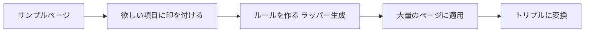

各ノードの意味：
- 「サンプルページ」：同じひな型で作られたページを数枚
- 「ルールを作る」：印の位置から、取り出しルールを自動または手動で作る
- 「トリプルに変換」：取り出した値を「商品 → 価格 → 1200円」のような形にする

### 5.5 XPath の例

XPath とは、HTML の中の位置を指定する書き方です。次の式は、商品ブロックの中にある価格の文字を取り出します。

```text
//div[@class="product"]/span[@class="price"]/text()
```

この式の意味は、「class が product の div の直下にある、class が price の span の文字を取り出す」です。サイトのひな型が変わると動かなくなる、という弱点があります。

### 5.6 ステップ：ラッパーを超えて（5.3節）

【本書の範囲】5.3 節の題名は「Beyond Wrappers: Information Extraction over Structured Data」で、構造化されたデータ（表など）からの抽出を扱います。

【補足】表形式のデータ（CSV、スプレッドシート、JSON など）は、列名の意味を KG の語彙に対応づける作業（第2章のセマンティックラベリング）が要になります。著者らの研究グループ（USC ISI）は、データ源を RDF などの KG に対応づけるツールも公開してきました（例：Karma）。具体的な内容は、各章末の Software and Resources で確認してください。

| 入力の種類 | 主な方法 | 課題 |
|-----------|----------|------|
| ひな型のあるHTML | ラッパー | ひな型の変更に弱い |
| 表・CSV | 列と語彙の対応づけ | 列名の揺れ、単位の違い |
| 文章 | NER と関係抽出（第4・6章） | 曖昧さ、表記の揺れ |

📖 このセクションで登場した用語
- ラッパー：ページの構造から目的の項目を取り出すルール
- XPath：HTML/XML の中の位置を指定する書き方
- テンプレート：同じサイト内で繰り返し使われるページのひな型
- セマンティックラベリング：データの列に、意味を表す語彙（オントロジー）を対応づけること

---

## 6. 第6章：関係抽出（Relation Extraction）

💡 この章では、Chapter 6 に相当する内容として、文章から「AとBはどんな関係か」を取り出す技術を説明します。第4章で見つけた名前どうしを、線でつなぐ工程です。

### 6.1 【本書の範囲】この章の節

6.1 Introduction、6.2 Ontologies and Programs、6.3 Techniques for Relation Extraction、6.4 Recent Research: Deep Learning for Relation Extraction、6.5 Beyond Relation Extraction: Event Extraction and Joint Information Extraction

### 6.2 なぜ関係抽出が必要か

名前だけを集めても、KG にはなりません。KG の価値は「関係」にあります。文章「Tim Berners-Lee proposed the Web at CERN」からは、「Tim Berners-Lee」と「CERN」の間のどのような関係を取り出すかを慎重に考える必要があります。この文が直接支持するのは「提案イベントが CERN で起きた」という `proposedAt` のような関係であり、「勤務・所属」を表す `worksAt` を導くには「CERN で提案した」だけでは不十分です（別途 worksAt を裏付ける情報が必要です）。関係抽出では、文が実際に支持する関係の種類だけを取り出すことが重要です。

### 6.3 ステップ1：オントロジーで「取り出したい関係」を決める（6.2節）

関係抽出は、あらかじめオントロジーで関係の種類を決めておくと、目標が明確になります。たとえば `worksAt`（勤務先）の関係には、「主語は人、目的語は組織」という制約を付けられます。抽出結果がこの制約に合わなければ、誤りとして除外できます。

### 6.4 ステップ2：代表的な手法（6.3〜6.4節）

【補足】関係抽出の代表的な手法は、次の4つに整理できます。各手法の細部は、書籍の 6.3 節で確認してください。

| 手法 | 仕組み | 例 |
|------|--------|-----|
| パターン（ルール） | 文の型を手作業で書く | 「X such as Y」から、Y は X の一種と取り出す |
| 教師あり学習 | 関係にラベルを付けた文章で分類器を学習する | 名前のペアを見て、関係の種類を予測する |
| 遠隔教師あり学習 | 既存の KG の事実を使って、文章に自動でラベルを付ける | 既知の「(A, worksAt, B)」を含む文を正例にする |
| 深層学習 | 文脈全体の表現から関係を予測する | Transformer 系のモデルなど |

遠隔教師あり学習は、手作業でラベルを付ける手間を減らせる一方で、既存の事実を含んでいても関係を表していない文が混ざり、ラベルにノイズ（誤り）が入りやすい点に注意が必要です。

### 6.5 ステップ3：全体の流れ

この図は、文章から関係を取り出して KG に加えるまでの流れを表しています。上から下へ読み進めてください。

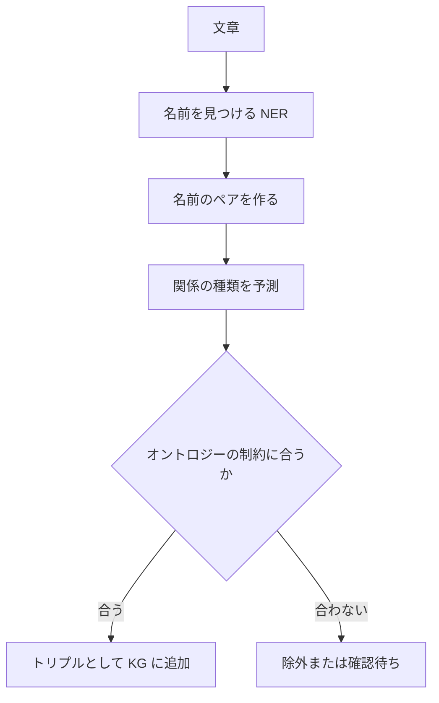

各ノードの意味：
- 「名前のペアを作る」：文の中の名前を2つずつ組み合わせる
- 「関係の種類を予測」：ペアの間の関係を、分類器が選ぶ
- 「オントロジーの制約に合うか」（ひし形）：主語・目的語の型が、関係の定義と合うかを確認する

### 6.6 イベント抽出と共同抽出（6.5節）

関係抽出を超えて、「出来事（イベント）」と、その参加者・日時・場所を取り出す**イベント抽出**があります。また、名前の抽出と関係の抽出を別々にせず一緒に学習する**共同（joint）抽出**は、前段の誤りが後段に伝わる問題を減らす目的で研究されています。

📖 このセクションで登場した用語
- 関係抽出：文章から、実体どうしの関係を取り出す技術
- 遠隔教師あり学習：既存の知識ベースを使って、学習用ラベルを自動生成する方法
- ノイズ：データに混ざった誤り
- イベント抽出：出来事とその参加者・日時・場所を取り出す技術
- 共同抽出：名前と関係の抽出を一緒に行う方法

---

## 7. 第7章：非伝統的な情報抽出（Nontraditional Information Extraction）

💡 この章では、Chapter 7 に相当する内容として、事前に関係の種類を決められない場合や、SNS のような荒れた文章から知識を取り出す方法を説明します。

### 7.1 【本書の範囲】この章の節

7.1 Introduction、7.2 Open Information Extraction、7.3 Social Media Information Extraction、7.4 Other Kinds of Nontraditional Information Extraction

### 7.2 ステップ1：オープン情報抽出（Open IE）

なぜ必要かというと、第6章の方法は、取り出す関係の種類を先に決める必要があるからです。Web 上のあらゆる文章の関係を事前に列挙するのは現実的ではありません。Open IE は、関係の種類を決めずに、文の中の表現をそのまま関係として取り出します。

| 文 | Open IE の出力（主語, 関係の表現, 目的語） |
|----|--------------------------------------------|
| Tokyo is the capital of Japan | (Tokyo, is the capital of, Japan) |
| CERN hosted the first web server | (CERN, hosted, the first web server) |

長所は、事前の設計が要らず、幅広く取れることです。短所は、同じ意味の関係が別の表現で出てくること（例：「is the capital of」と「is Japan's capital」）で、KG に入れる前に、表現の統合が必要になることです。

### 7.3 ステップ2：SNS などからの抽出（7.3節）

SNS の文章には、略語、絵文字、ハッシュタグ、誤字、短さといった特徴があり、新聞記事向けに作られた手法がそのまま働きません。【補足】そのため、SNS 向けの学習データや、表記の正規化（略語や誤字を標準の形に直す処理）が必要になります。

### 7.4 使い分けの目安

| 状況 | 向いている方法 |
|------|----------------|
| 取り出す関係が決まっていて、正解データがある | 第6章の関係抽出 |
| 関係の種類が多様で、事前に決められない | Open IE |
| SNS や口語の文章が中心 | SNS 向けの抽出（表記の正規化を含む） |

📖 このセクションで登場した用語
- Open IE：関係の種類を事前に決めず、文の表現をそのまま関係として取り出す方法
- 正規化：表記の揺れを、標準の形にそろえる処理
- ハッシュタグ：SNS で話題を示す「#」付きの言葉

---

## 8. 第8章：インスタンス照合（Instance Matching）

💡 この章では、Chapter 8 に相当する内容として、別々のデータ源にある「同じ実体を指すレコード」を見つけて結びつける技術を説明します。Part III（知識の追加・改良）の中心です。

### 8.1 【本書の範囲】この章の節

8.1 Introduction、8.2 Formalism、8.3 Why Is Instance Matching Challenging?、8.4 Two-Step Pipeline、8.5 Evaluating the Two-Step Pipeline、8.6 Postsimilarity Steps、8.7 Formalizing Instance Matching: Swoosh、8.8 A Note on Research Frontiers、8.9 Data Cleaning beyond Instance Matching

### 8.2 なぜインスタンス照合が必要か

複数のデータ源から KG を作ると、同じ人が「John Smith」「Jon Smith」「J. Smith」のように別々のノードになります。統合しないと、同じ人の情報が分散し、問い合わせの結果も不完全になります。別名で、エンティティ解決（entity resolution）や名寄せとも呼ばれます。

### 8.3 例え話：名簿の突き合わせ

2つの町内会の名簿を1つにまとめる作業を想像してください。「山田太郎さん」が両方にいても、住所の書き方や漢字が違うと、同じ人か判断が要ります。全員を総当たりで見比べると、人数が多いほど時間がかかります。

### 8.4 ステップ1：なぜ総当たりではだめなのか

レコード数が n 件のとき、すべての組み合わせは n × (n − 1) ÷ 2 組です。1,000件なら 499,500 組、100万件なら約5,000億組になり、現実的な時間で比較できません。

### 8.5 ステップ2：2段階パイプライン（8.4節）

本書は、インスタンス照合を**2段階のパイプライン**として説明します。

| 段階 | 役割 | 考え方 |
|------|------|--------|
| 1. ブロッキング（blocking） | 比較する組を、見込みのあるものだけに絞る | 「同じ郵便番号のレコードだけ」のような粗い条件で、グループ（ブロック）に分ける |
| 2. 類似度計算（similarity） | 絞った組ごとに、同じ実体かを判定する | 名前・住所などの文字列の似ている度合いを数値にする |

この図は、2段階パイプラインの流れを表しています。左から右へ読み進めてください。

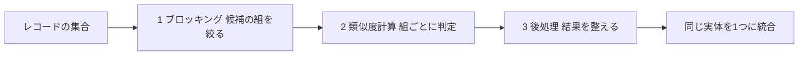

各ノードの意味：
- 「ブロッキング」：総当たりを避けるため、比べる組を減らす
- 「類似度計算」：残った組の似ている度合いを数値にして、一致か不一致かを決める
- 「後処理」：本書の 8.6 節（Postsimilarity Steps）に相当する工程。一致と判定した結果どうしの矛盾などを整える

### 8.6 ステップ3：類似度を実際に計算する

文字列の類似度の代表例に、**Jaccard 係数**があります。2つの集合の「共通の要素数 ÷ 全体の要素数」です。ここでは文字を2文字ずつに区切った集合（バイグラム）で比べます。

計算例（Python で確認した値です）：

| 比べる2つの名前 | Jaccard 係数 | 判断の目安 |
|------------------|--------------|-----------|
| john smith と jon smith | 0.70 | 高い。同じ人の可能性が高い |
| john smith と mary jones | 約 0.06 | 低い。別の人 |
| john smith と jonathan smyth | 約 0.31 | 中間。ほかの情報（住所など）を併用して判断する |

しきい値（例：0.6 以上なら一致）を決めて判定しますが、しきい値の決め方で結果が変わります。中間の値は、複数の属性を組み合わせて判断します。

### 8.7 ステップ4：評価の仕方（8.5節）

【補足】インスタンス照合の評価には、第4章で説明した適合率・再現率・F1 値を、「正しく統合した組」を単位にして使います。ブロッキングについては、「本当は同じ実体の組が、同じブロックに残っているか」（＝再現率に近い指標）と、「比べる組がどれだけ減ったか」を併せて見ます。

### 8.8 Swoosh と、データクリーニング全般

本書の 8.7 節は、インスタンス照合を形式的に定式化する枠組みとして **Swoosh** を扱います。8.9 節「Data Cleaning beyond Instance Matching」は、照合以外のデータの誤り直し（欠損値、形式の不統一など）を扱います。

📖 このセクションで登場した用語
- インスタンス照合：別々のレコードが同じ実体を指すかを判定し、結びつける技術
- ブロッキング：比べる組を、見込みのあるものだけに絞る前処理
- Jaccard 係数：2つの集合の重なり具合を 0〜1 で表す指標
- バイグラム：文字列を2文字ずつ区切った断片
- しきい値：一致とみなす類似度の境目

---

## 9. 第9章：統計的関係学習（Statistical Relational Learning, SRL）

💡 この章では、Chapter 9 に相当する内容として、KG の事実が「確実ではなく、確率的に正しい」という前提で、事実どうしの依存関係を使って正しさを判定する方法を説明します。

### 9.1 【本書の範囲】この章の節

9.1 Introduction、9.2 Modeling Dependencies、9.3 Statistical Relational Learning Frameworks、9.4 Knowledge Graph Identification、9.5 Other Applications、9.6 Advanced Research: Data Programming

### 9.2 なぜ確率を使うのか

第4〜7章で自動抽出した事実には、誤りが混ざります。しかも、事実どうしには関係があります。たとえば、「Aは東京に住んでいる」が正しいなら、「Aは日本に住んでいる」もほぼ正しいはずです。事実をばらばらに判定せず、**依存関係を使って全体で整合する答えを選ぶ**のが SRL の狙いです。

### 9.3 例え話：クロスワード

クロスワードは、縦の言葉と横の言葉が交差する文字を共有します。1つの言葉の自信が低くても、交差する言葉が確実なら、そこから決まります。SRL では、事実どうしが「交差」して、互いの確からしさを支え合います。

### 9.4 ステップ・バイ・ステップ

1. 候補の事実に、抽出システムが付けた確信度（0〜1）を持たせます
2. 事実どうしの依存関係を、ルールで書きます（例：「東京にある → 日本にある」）
3. 全体として、ルールに最も違反しない事実の集合を選びます

### 9.5 KG identification（9.4節）

**Knowledge Graph Identification** は、Pujara らが提案したタスクです。論文の要旨によれば、大規模な情報抽出システムは相互に関連する事実を大量に取り出すものの、その候補を有用な知識に変えるのは難しい課題です。そこで、不確かな抽出結果を1つのグラフ（抽出グラフ）にまとめ、ノイズの除去、欠けた情報の推論、どの候補を KG に入れるかの判断を同時に行います。

この図は、KG identification の考え方を表しています。上から下へ読み進めてください。

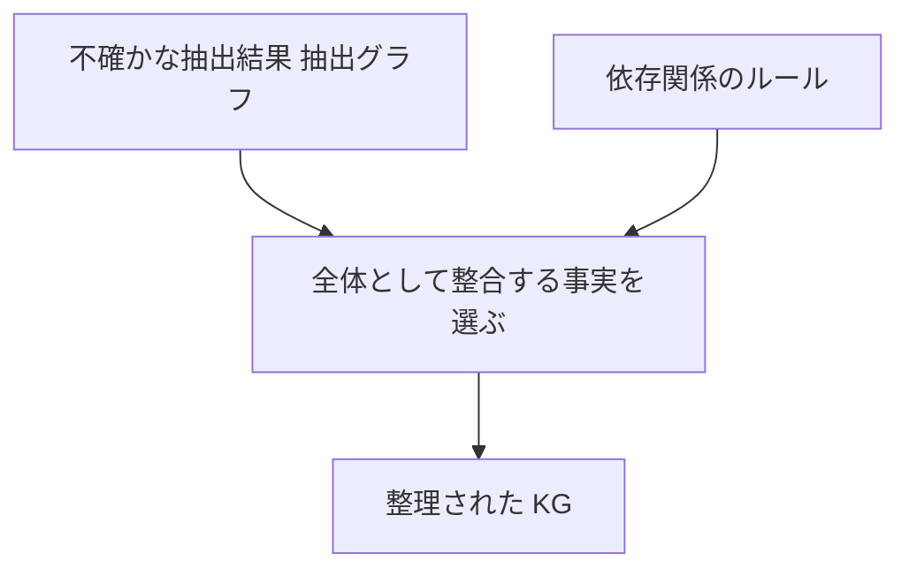

各ノードの意味：
- 「抽出グラフ」：確信度つきの候補の事実の集まり
- 「依存関係のルール」：型の制約や、事実どうしの含意などの規則
- 「整合する事実を選ぶ」：ノイズ除去と欠落の補完を同時に行う推論

### 9.6 代表的な枠組み

【補足】SRL の代表的な枠組みとして、Markov Logic Network（ルールに重みを付けて確率モデルにする方法）や Probabilistic Soft Logic（PSL、真偽を 0〜1 の連続値で扱う方法）が知られています。本書の 9.3 節で、どの枠組みを詳しく扱うかは書籍で確認してください。

### 9.7 データプログラミング（9.6節）

データプログラミング（data programming）は、人手のラベルの代わりに、ルールやヒューリスティック（＝経験則）を複数書いて、それらのノイズを含む出力をまとめて学習用ラベルにする方法です。第6章の遠隔教師あり学習と近い動機（ラベル付けの手間の削減）から使われます。

📖 このセクションで登場した用語
- SRL：事実どうしの関係と、確率を一緒に扱う機械学習の枠組み
- 確信度：抽出した事実がどのくらい正しそうかを表す 0〜1 の数
- KG identification：不確かな抽出結果から、KG に入れる事実を選ぶ作業
- ヒューリスティック：厳密ではないが、経験的に役立つ判断規則

---

## 10. 第10章：KG の表現学習（Knowledge Graph Embeddings）

💡 この章では、Chapter 10 に相当する内容として、KG のノードと関係を数値ベクトルに変換して、機械学習で扱えるようにする方法を説明します。欠けた事実を予測する（リンク予測）ときの土台です。

### 10.1 【本書の範囲】この章の節

10.1 Introduction、10.2 Embedding Architectures: A Primer、10.3 Embeddings beyond Words、10.4 Knowledge Graph Embeddings、10.5 Influential KGE Systems、10.6 Extrafactual Contexts、10.7 Applications

### 10.2 なぜベクトルにするのか

機械学習は数値の計算が得意ですが、「東京」という記号そのものは計算できません。そこで、各実体と関係を、数字の並び（ベクトル）に対応づけます。似た意味のものが近い位置に来るように学習します。

### 10.3 例え話：地図上の座標

地図では、都市に緯度・経度という座標を付けると、「東京と横浜は近い」と距離で分かります。埋め込み（embedding）は、KG の実体に座標を付ける作業です。

### 10.4 ステップ1：TransE の考え方

**TransE** は、Bordes らが NeurIPS（当時は NIPS）2013 で提案した、代表的な KG 埋め込み手法です。論文の要旨によれば、関係を、実体の低次元の埋め込みに作用する「平行移動（translation）」として解釈します。単純な仮定ですが、2つの知識ベースでのリンク予測で、当時の最先端手法を大きく上回ったと報告されています。

考え方は次の式で書けます。

```text
head の座標 + relation のベクトル ≒ tail の座標
```

この式は、「主語の座標に、関係のベクトルを足すと、目的語の座標に近づく」ことを表します。

### 10.5 ステップ2：小さな数値例

次の例では、座標を2次元で置きます。「capital_of（首都である）」は、右へ2進むベクトル (2, 0) です。

| 実体 | 座標 |
|------|------|
| Tokyo | (1, 1) |
| Japan | (3, 1) |
| France | (0, 3) |

- 正しい事実 (Tokyo, capital_of, Japan)：(1, 1) + (2, 0) = (3, 1)。Japan の座標と一致するので、距離は 0
- 誤った事実 (Tokyo, capital_of, France)：(3, 1) と (0, 3) の距離は √13 ≒ 3.61。距離が大きく、誤りらしいと判断

【前提】以下のコード例は **NumPy** を使用します。実行するには事前に `pip install numpy` でインストールしてください。NumPy を使わずに確認したい場合は、`np.array` を `list`、`np.linalg.norm` を手動の距離計算（`pred = [a + b for a, b in zip(entity[h], relation[r])]` を作り、`sum((p - q) ** 2 for p, q in zip(pred, entity[t])) ** 0.5`）に置き換えると標準ライブラリだけで動作します。

```python
import numpy as np

# 実体と関係を2次元ベクトルで表す。実際の学習では、この値をデータから学習で求める。
entity = {
    "Tokyo":  np.array([1.0, 1.0]),
    "Japan":  np.array([3.0, 1.0]),
    "France": np.array([0.0, 3.0]),
}
relation = {"capital_of": np.array([2.0, 0.0])}

def distance(h, r, t):
    # head + relation が tail に近いほど「正しそうな事実」なので、その差の長さを測る。
    # 差が0に近いほど、事実として自然だと判断できる。
    return float(np.linalg.norm(entity[h] + relation[r] - entity[t]))

for cand in ["Japan", "France"]:
    print(cand, round(distance("Tokyo", "capital_of", cand), 2))
# 出力（実行して確認済み）：Japan 0.0 / France 3.61
```

### 10.6 ステップ3：リンク予測

この図は、埋め込みを使った欠けた事実の予測の流れを表しています。左から右へ読み進めてください。

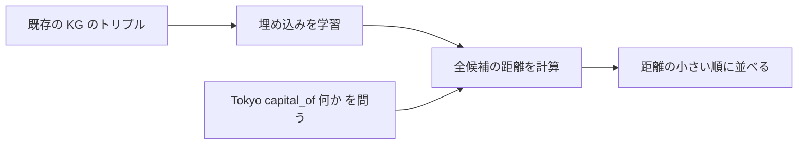

各ノードの意味：
- 「埋め込みを学習」：既存の事実で、head + relation が tail に近づくように座標を調整する
- 「全候補の距離を計算」：欠けている部分に入れる候補すべてで距離を出す
- 「距離の小さい順に並べる」：上位を、欠けた事実の候補として提示する

### 10.7 限界と発展

TransE は単純さが強みですが、【補足】1つの関係に対して多くの相手がいる場合（例：「〜の出身者」）に表現しにくい点が知られています。この課題を扱う TransH、TransR などの発展手法があります。10.5 節の「Influential KGE Systems」で、影響の大きいシステムが整理されています。10.6 節の「Extrafactual Contexts」は、トリプル以外の文脈情報を使う話題です。

📖 このセクションで登場した用語
- 埋め込み（embedding）：実体や関係を、数値ベクトルに変換したもの
- ベクトル：数字の並び（座標のようなもの）
- リンク予測：KG に欠けている事実（線）を予測するタスク
- TransE：関係を「ベクトルの平行移動」として表す代表的な手法

---

## 11. 第11章：推論と検索（Reasoning and Retrieval）

💡 この章では、Chapter 11 に相当する内容として、KG に書かれていない事実を「導き出す」推論と、必要な情報を「探し出す」検索を説明します。Part IV（KG へのアクセス）の入り口です。

### 11.1 【本書の範囲】この章の節

11.1 Introduction、11.2 Reasoning、11.3 Retrieval、11.4 Retrieval versus Reasoning

### 11.2 なぜ推論が必要か

KG にすべての事実を書き込むのは現実的ではありません。「渋谷は東京にあり、東京は日本にある」と書いてあるとき、「locatedIn は推移的である」というルールをオントロジーで宣言しておけば、「渋谷は日本にある」は書かなくても導けます。推論は、こうしたルールを使って、書かれていない事実を補う仕組みです。逆に言えば、ルールを宣言していなければ、この導出は起こりません。

### 11.3 ステップ・バイ・ステップ：2種類の推論

| 推論 | ルール | 例 |
|------|--------|-----|
| 型の階層による推論（RDFS） | City は Place の一種 | Tokyo が City なら、Tokyo は Place でもある |
| 推移性のルール | locatedIn を推移的と宣言する（A→B、B→C なら A→C） | 渋谷→東京、東京→日本 から、渋谷→日本 |

この図は、推移性のルールによる推論を表しています。上から下へ読み進めてください。

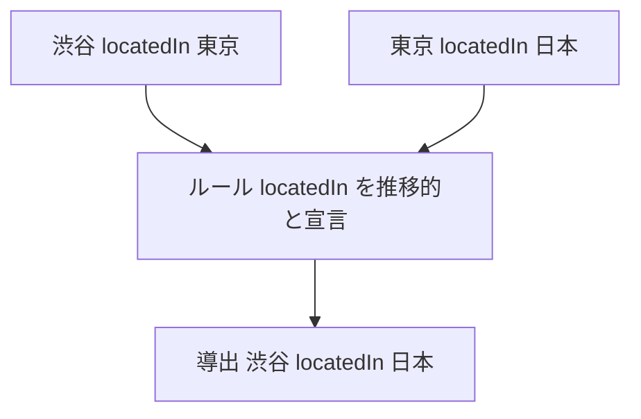

各ノードの意味：
- 上の2つ：KG にすでに書かれている事実
- 「ルール」：推論のもとになる規則
- 「導出」：ルールから新しく導かれた事実。KG に書かれていなくても、答えられる

【補足】推移性は、述語の名前から自動的に適用されるものではありません。2.4節の Turtle データに `@prefix owl: <http://www.w3.org/2002/07/owl#> .` を追加し、`ex:locatedIn a owl:TransitiveProperty .` のように性質を宣言したうえで、それを解釈する推論器（OWL RL などのプロファイルに対応したもの）を動かして初めて、「渋谷 locatedIn 日本」が導出されます。たとえば第12章で使う rdflib は、読み込みと問い合わせだけでは推論を行わないため、宣言だけを書いても導出された事実は返りません。

### 11.4 検索（Retrieval）と推論の違い（11.4節）

| 観点 | 検索（retrieval） | 推論（reasoning） |
|------|-------------------|--------------------|
| 何をするか | 書かれている情報を探して返す | 書かれていない情報をルールで導く |
| 例え | 図書館で本を探す | 本の内容から結論を導く |
| コスト | 索引があれば速い | ルールの数と KG の大きさで重くなりやすい |

【補足】実際のシステムでは、事前に推論結果をすべて計算して保存する方法（先に計算する）と、問い合わせのときに必要な分だけ推論する方法（後で計算する）の、どちらかを選ぶ設計判断があります。

📖 このセクションで登場した用語
- 推論：既存の事実とルールから、新しい事実を導くこと
- 推移性：AがBと、BがCとつながるとき、AがCとつながる性質
- 検索：書かれた情報を探し出すこと

---

## 12. 第12章：構造化問い合わせ（Structured Querying）

💡 この章では、Chapter 12 に相当する内容として、KG から欲しい情報を取り出すための問い合わせ言語（SPARQL、SQL、グラフ DB の言語）を説明します。実務で最もよく使う章です。

### 12.1 【本書の範囲】この章の節

12.1 Introduction、12.2 SPARQL、12.3 Relational Processing of Queries over Knowledge Graphs、12.4 NoSQL

### 12.2 なぜ問い合わせ言語が必要か

KG のデータは、日本語や英語のような自然な文章では取り出せません。「都市であって、日本にあり、英語ラベルを持つものを全部」という条件を、機械が正確に解釈できる形で書く言語が必要です。

### 12.3 ステップ1：SPARQL の基本

SPARQL は、W3C が標準化した RDF 用の問い合わせ言語です。SPARQL 1.1 は2013年3月21日に W3C 勧告になりました。W3C の仕様書は、SELECT 句で結果に出す変数を、WHERE 句で照合するパターン（基本グラフパターン）を指定する、と説明しています。パターンは、トリプルの一部を変数（`?`で始まる名前）にしたものです。

先ほどの Turtle データに対する問い合わせ例です。

```sparql
PREFIX ex:   <http://example.org/>
PREFIX rdfs: <http://www.w3.org/2000/01/rdf-schema#>

# 結果として city と label の2つの変数を返す。
SELECT ?city ?label
WHERE {
  # 「型が City で、日本に位置し、ラベルを持つ」実体を探す。
  # 3つの条件をセミコロンでつなぎ、同じ ?city について条件を重ねている。
  ?city a ex:City ;
        ex:locatedIn ex:Japan ;
        rdfs:label ?label .
  # ラベルが多言語で複数あるので、英語だけに絞る。絞らないと同じ都市が言語の数だけ出る。
  FILTER (lang(?label) = "en")
}
ORDER BY ?label
```

Python の rdflib で実行して確認した結果は、`Osaka` と `Tokyo` の2件でした。

```python
# rdflib は pip install rdflib で入る。このブロックだけで完結して動きます。
from rdflib import Graph

# 2.4 節の Turtle をそのまま文字列として持つ。三重引用符なので改行を含められる。
ttl = """
@prefix ex:   <http://example.org/> .
@prefix rdf:  <http://www.w3.org/1999/02/22-rdf-syntax-ns#> .
@prefix rdfs: <http://www.w3.org/2000/01/rdf-schema#> .

ex:Tokyo   rdf:type ex:City ;
           rdfs:label "Tokyo"@en, "東京"@ja ;
           ex:locatedIn ex:Japan .

ex:Osaka   rdf:type ex:City ;
           rdfs:label "Osaka"@en ;
           ex:locatedIn ex:Japan .

ex:Japan   rdf:type ex:Country ;
           rdfs:label "Japan"@en .

ex:City    rdfs:subClassOf ex:Place .
ex:Country rdfs:subClassOf ex:Place .
"""

# 上の SPARQL も同じように文字列として持つ。
sparql_text = """
PREFIX ex:   <http://example.org/>
PREFIX rdfs: <http://www.w3.org/2000/01/rdf-schema#>

SELECT ?city ?label
WHERE {
  ?city a ex:City ;
        ex:locatedIn ex:Japan ;
        rdfs:label ?label .
  FILTER (lang(?label) = "en")
}
ORDER BY ?label
"""

g = Graph()
g.parse(data=ttl, format="turtle")

# query の引数に、上の SPARQL の文字列を渡す。
for row in g.query(sparql_text):
    print(row.city, row.label)

# 出力:
# http://example.org/Osaka Osaka
# http://example.org/Tokyo Tokyo
```

SPARQL のクエリ形式には SELECT のほかに、ASK（はい・いいえ）、CONSTRUCT（結果を新しいグラフとして作る）、DESCRIBE（実体の説明を得る）があります。

### 12.4 ステップ2：関係データベースで処理する（12.3節）

KG のトリプルを、関係データベースの3列の表（主語、述語、目的語）として保存し、SQL で問い合わせる方法があります。

次の SQL は、そのまま実行できるサンプルではなく、**考え方を示すための概念例**です（特定の SQL 方言を前提にしていません）。読むにあたって、次の前提を置いています。

- 表は `triples(s TEXT, p TEXT, o TEXT)` の3列で、3列とも文字列型とする
- IRI は `<http://example.org/City>` のような完全な形ではなく、`ex:City` のように接頭辞で短縮した名前を**文字列として**格納する
- 言語タグ付きリテラルは、タグを分けずに `"Osaka"@en` という1つの文字列として格納する

実際のトリプルストアは、IRI とリテラルを別の列や別の表に分け、辞書表で整数 ID に置き換えるのが普通です。ここでは比較を分かりやすくするために、すべてを1つの文字列列に潰しています。

```sql
-- 同じ表 triples を3回使う自己結合（セルフジョイン）で、
-- 「型が City」「日本に位置する」「英語ラベルを持つ」の3つの事実を持つ主語を探す。
-- SPARQL の SELECT ?city ?label に合わせ、主語とラベルの2列を返す。
SELECT t1.s AS city, t3.o AS label
FROM triples t1
JOIN triples t2 ON t1.s = t2.s
JOIN triples t3 ON t1.s = t3.s
WHERE t1.p = 'rdf:type'     AND t1.o = 'ex:City'
  AND t2.p = 'ex:locatedIn' AND t2.o = 'ex:Japan'
  -- 言語タグは目的語の列に文字列として埋まっているので、LIKE で英語だけに絞る。
  -- SPARQL の FILTER (lang(?label) = "en") に相当する条件。
  AND t3.p = 'rdfs:label'   AND t3.o LIKE '%@en'
ORDER BY t3.o;
```

この前提のもとでは、結果は SPARQL と同じ Osaka と Tokyo の2件になります。ただし `label` 列には `"Osaka"@en` のように言語タグが付いたままの文字列が入ります。SPARQL では `lang()` 関数が言語タグを構造として扱えるのに対し、3列の表では言語タグをただの文字列として持つしかなく、`LIKE` で文字列を探る必要がある点が違いです。

条件が増えるほど自己結合が増え、処理が重くなる点が、この方式の課題です。

### 12.5 ステップ3：グラフデータベースと NoSQL（12.4節）

プロパティグラフの問い合わせ言語の例として、Cypher 風の書き方を示します。

```text
MATCH (c:City)-[:LOCATED_IN]->(:Country {name: 'Japan'})
RETURN c.name
```

この式は、「City ラベルのノード c から、LOCATED_IN の関係で、名前が Japan の Country ノードにつながるものを探し、c の名前を返す」という意味です。矢印の形でパターンを書くので、関係をたどる問いを直感的に書けます。

### 12.6 【補足】GQL：プロパティグラフの国際標準

GQL（Graph Query Language）は、プロパティグラフのための ISO 標準で、**ISO/IEC 39075:2024** として2024年4月に発行されました。Neo4j の標準化チームのブログは、GQL が openCypher のパターン記法を受け継ぎ、SQL と互換性のあるデータ型を備えることを説明しています。The New Stack は、ISO が SQL を標準化した1987年以来の、最初の新しいデータベース問い合わせ言語だと報じています。SQL の一部として、プロパティグラフの問い合わせを扱う SQL/PGQ（ISO/IEC 9075-16:2023）も別に定められており、Google の Spanner Graph は両方の標準に対応すると説明しています。

| 標準 | 対象 | 状況 |
|------|------|------|
| SPARQL 1.1 | RDF | 2013年 W3C 勧告 |
| SPARQL 1.2 | RDF 1.2 | 草案の段階（2026年9月時点で私が確認できた範囲） |
| GQL（ISO/IEC 39075） | プロパティグラフ | 2024年 ISO 発行 |
| SQL/PGQ（ISO/IEC 9075-16） | SQL 上のプロパティグラフ問い合わせ | 2023年 ISO 発行 |

### 12.7 3つの方式の使い分け

| 方式 | 向いている場面 |
|------|----------------|
| RDF ＋ SPARQL | 公開データとの連携、異なる組織のデータ統合、意味の標準を重視する場面 |
| 関係データベース ＋ SQL | すでに関係データベースの運用資産があり、関係をたどる深さが浅い場面 |
| プロパティグラフ ＋ Cypher / GQL | 関係を何段もたどる処理や、アプリケーション内の関係分析 |

📖 このセクションで登場した用語
- SPARQL：RDF のデータを問い合わせる W3C 標準の言語
- 基本グラフパターン：トリプルの一部を変数にした、照合したい形の集まり
- 自己結合：同じ表を2回以上使って結合すること
- Cypher：プロパティグラフの問い合わせ言語の1つ
- GQL：プロパティグラフ向けの ISO 標準の問い合わせ言語（GraphQL とは別物）
- SQL/PGQ：SQL の中でプロパティグラフを問い合わせる ISO 標準の拡張

---

## 13. 第13章：質問応答（Question Answering, QA）

💡 この章では、Chapter 13 に相当する内容として、自然な言葉の質問に、KG を使って答える仕組みを説明します。第12章の問い合わせ言語を、利用者が意識せずに使えるようにする層です。

### 13.1 【本書の範囲】この章の節

13.1 Introduction、13.2 Question Answering as a Stand-Alone Application、13.3 Question Answering as Knowledge Graph Querying

### 13.2 なぜ QA が必要か

SPARQL や Cypher を書けるのは、一部の技術者だけです。「日本の首都はどこ？」のような質問をそのまま入力できれば、誰でも KG の情報を使えます。

### 13.3 2つの見方（13.2〜13.3節）

本書の節の題名は、QA を2つの見方で説明しています。

| 見方 | 内容 |
|------|------|
| 単独のアプリケーションとしての QA | 質問から答えを返す仕組み全体を、1つの応用として見る |
| KG への問い合わせとしての QA | 質問を、KG への構造化された問い合わせに変換して、答えを取り出す |

### 13.4 ステップ・バイ・ステップ：KG 上の QA

この図は、質問から答えが返るまでの流れを表しています。上から下へ読み進めてください。

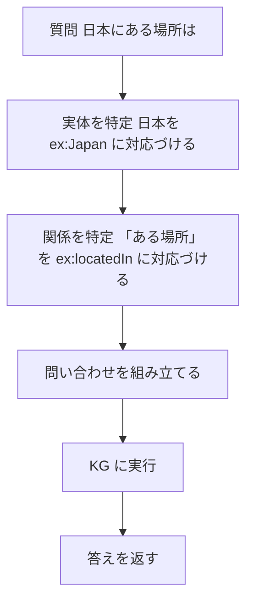

各ノードの意味：
- 「実体を特定」：質問中の言葉を、KG の実体に結びつける（エンティティリンキング）
- 「関係を特定」：質問の表現（「にある場所」）を、KG の関係の名前に結びつける
- 「問い合わせを組み立てる」：次のような SPARQL に変換する

```sparql
PREFIX ex: <http://example.org/>
# ?answer ex:locatedIn ex:Japan → 日本に属するノードを変数 ?answer で受け、それを返す。
SELECT ?answer WHERE { ?answer ex:locatedIn ex:Japan }
```

Turtle データに含まれる `ex:locatedIn` を使う形に変更しました。元の問いの「日本の首都は？」を表現するには、別途 `ex:capital` のトリプル（`ex:Japan ex:capital ex:Tokyo`）をデータに追加する必要があります。ここでは既存の `ex:locatedIn` を使い、「日本に属する場所は？」という問いに変更しています。結果は Tokyo と Osaka の 2 件になります。

### 13.5 難しさ

| 難しさ | 例 |
|--------|-----|
| 言い換え | 「首都は？」「首都はどこ？」「どこが首都？」 |
| 曖昧さ | 「Washington」は州か都市か人か |
| 複数段の質問 | 「東京がある国の、人口が最も多い都市は」 |

📖 このセクションで登場した用語
- QA：質問に対して答えを返す技術
- エンティティリンキング：文中の言葉を、KG の実体に結びつける処理
- セマンティックパーシング：文を、機械が実行できる問い合わせに変換すること

---

## 14. 第14章：Linked Data

💡 この章では、Chapter 14 に相当する内容として、世界中の KG を Web でつなぎ合わせる考え方を説明します。Part V（エコシステム）の最初の章です。

### 14.1 【本書の範囲】この章の節

14.1 Introduction、14.2 Impact and Adoption of Linked Data Principles、14.3 Important Knowledge Graphs in Linked Open Data

### 14.2 なぜ Linked Data か

KG がそれぞれ孤立していると、同じ実体の情報が組織ごとに分断されます。Web ページがリンクでつながって世界規模の情報網になったように、データも IRI とリンクでつなげば、組織を越えて使えます。

### 14.3 4つの原則

【補足】Linked Data は、Tim Berners-Lee が示した次の4つの原則で知られています。

| 原則 | 意味 |
|------|------|
| 1. 物事の名前に IRI を使う | 実体を世界で一意に識別する |
| 2. HTTP の IRI を使う | 誰でも名前から情報を引ける |
| 3. IRI を引いたら、標準（RDF、SPARQL）で有用な情報を返す | 機械が読める形にする |
| 4. 他の IRI へのリンクを含める | さらに情報を発見できるようにする |

### 14.4 データセットどうしのつながり

この図は、複数の公開 KG が、同じ実体を指す IRI どうしをリンクでつなぐ様子を表しています。

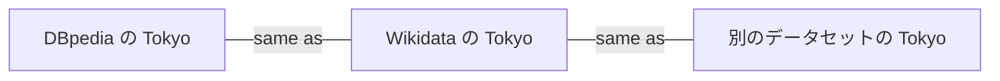

各ノードの意味：
- 3つのノード：別々の KG にある、同じ都市「東京」を指す実体
- 「same as」の線：「同じものを指す」という宣言で、第8章のインスタンス照合の結果を、公開できる形にしたもの

### 14.5 主要な KG（14.3節）

【補足】Linked Open Data には、DBpedia、Wikidata、GeoNames などが含まれます。本書の 14.3 節で、どの KG が取り上げられているかは、書籍で確認してください。Wikidata は第2章で説明したとおり、CACM 論文（Vrandečić & Krötzsch, 2014）が主要な参考文献です。

📖 このセクションで登場した用語
- Linked Data：IRI とリンクで、世界中のデータをつなぐ考え方
- LOD（Linked Open Data）：公開されて自由に使える Linked Data
- same as：2つの IRI が同じ実体を指すという宣言

---

## 15. 第15章：企業と政府（Enterprise and Government）

💡 この章では、Chapter 15 に相当する内容として、企業と政府が KG をどう使うかを説明します。

### 15.1 【本書の範囲】この章の節

15.1 Introduction、15.2 Enterprise、15.3 Governments and Nonprofits、15.4 Where Is the Future Headed?

### 15.2 なぜ組織で KG を使うのか

組織の中では、顧客、商品、契約、文書などのデータが、部署ごとのシステムに分かれています。KG で共通の意味の枠組み（オントロジー）を用意すれば、部署を越えてつなげられます。

### 15.3 使い方の例

【補足】この表は、一般的に知られる利用場面の整理です。書籍の 15.2 節、15.3 節の具体的な事例とは一致しない場合があります。

| 分野 | 使い方の例 | KG が効く理由 |
|------|-----------|----------------|
| 企業（商品情報） | 商品どうしの関係や属性を統合して、検索や推薦に使う | 別々の商品データを、同じ実体としてつなげる（第8章） |
| 企業（社内文書） | 文書・人・プロジェクトの関係を探す | 関係をたどる問いが多い（第12章） |
| 政府・非営利 | 公開データを統合して、公開・分析に使う | データを標準で公開しやすい（第14章） |

### 15.4 導入の進め方

1. 解決したい問い（ユースケース）を先に決める
2. その問いに必要な実体と関係だけで、小さくオントロジーを作る
3. 既存データを取り込み、第8章の名寄せで統合する
4. 問い合わせ（第12章）で価値を確認してから、範囲を広げる

📖 このセクションで登場した用語
- ユースケース：システムをどんな目的でどう使うかを表した具体的な場面
- 名寄せ：同じ実体を指す複数のレコードを、1つにまとめること

---

## 16. 第16章：科学分野の KG とオントロジー

💡 この章では、Chapter 16 に相当する内容として、生物学・化学・地球科学のような科学分野で KG とオントロジーがどう使われるかを説明します。

### 16.1 【本書の範囲】この章の節

16.1 Introduction、16.2 Biology、16.3 Chemistry、16.4 Earth, Environment, and Geosciences

### 16.2 なぜ科学分野で KG か

科学では、遺伝子、化合物、地域などの膨大な実体が、複雑な関係でつながっています。研究グループごとに用語が違うと、論文やデータを横断して調べられません。共通のオントロジーで用語をそろえると、データを統合して探せます。

### 16.3 分野ごとの主な題材

【補足】次は、各分野で KG になりやすい題材の一般的な例です。書籍の具体的な内容は、各節で確認してください。

| 分野 | KG のノードになりやすいもの | 関係の例 |
|------|-----------------------------|----------|
| 生物学 | 遺伝子、タンパク質、疾患 | 「〜を制御する」「〜に関与する」 |
| 化学 | 化合物、反応、物性 | 「〜から生成する」「〜の性質を持つ」 |
| 地球・環境 | 地域、観測点、現象 | 「〜に位置する」「〜を観測した」 |

📖 このセクションで登場した用語
- オントロジー：分野の用語と関係を、共通の定義として整理したもの
- 横断検索：複数のデータ源にまたがって探すこと

---

## 17. 第17章：領域特化の社会的インパクトを目指す KG

💡 この章では、Chapter 17 に相当する内容として、特定の領域の課題に絞って、Web から情報を集めて KG にし、分析に役立てる考え方を説明します。

### 17.1 【本書の範囲】この章の節

17.1 Introduction、17.2 Domain-Specific Insight Graphs、17.3 Alternative System: DeepDive、17.4 Applications and Use-Cases

### 17.2 なぜ領域特化か

汎用の巨大な KG より、対象を絞った KG のほうが、その領域の専門的な問いに、深く答えられます。出版社の紹介文は、KG が、サイバー攻撃の予測、商品の推薦、COVID-19 に関する数千本の論文からの洞察の抽出などに使われていると説明しています。

### 17.3 領域特化の KG の作り方

この図は、領域特化の KG を作り、分析に使うまでの流れを、これまでの章と結びつけて表しています。上から下へ読み進めてください。

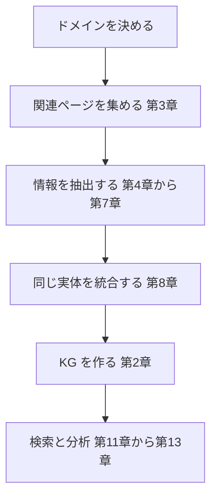

各ノードの意味：
- 「ドメインを決める」：解決したい課題の領域を絞る
- 「関連ページを集める」：第3章のフォーカスト・クローリング
- 「情報を抽出する」：名前、関係、Web ページの構造からの抽出
- 「検索と分析」：第11〜13章の推論・問い合わせ・QA で活用する

### 17.4 DeepDive（17.3節）

DeepDive は、本書が「代替のシステム」として取り上げている情報抽出システムです。詳細は書籍で確認してください。

### 17.5 使うときの注意

【補足】領域特化の KG は、個人に関する情報や、影響の大きい判断（例：捜査、医療）に使われる場合があります。抽出の誤りが人に不利益を与えないよう、精度の評価（第4章）と、人による確認の工程を設けることが必要です。

📖 このセクションで登場した用語
- 領域特化：特定の分野に絞ること
- Insight Graph：特定の領域で、洞察を得るために作る KG（本書の 17.2 節の題名にある語）

---

## 18. 本書のあとの世界：LLM 時代の KG（2026年9月時点）

💡 この章では、本書の出版（2021年）以降に大きく動いた、LLM（大規模言語モデル）と KG の関係、標準の動きを説明します。本書の各章が今どこで役立つかも整理します。

### 18.1 なぜ本書の内容が、いまも役立つのか

LLM は、文章を作る力に優れますが、事実を持たない、あるいは古い、間違った内容を出力する（ハルシネーション）という弱点があります。KG は事実を構造として明示するので、この弱点を補う組み合わせが注目されています。

### 18.2 LLM と KG の3つの組み合わせ方

Shirui Pan らのロードマップ論文（*Unifying Large Language Models and Knowledge Graphs: A Roadmap*、IEEE TKDE 2024）は、次の3つの枠組みで、既存研究を整理しています。

| 枠組み | 意味 |
|--------|------|
| KG-enhanced LLMs | KG で LLM を強化する（外部知識や解釈のしやすさを補う） |
| LLM-augmented KGs | LLM で KG の作成や補完を助ける |
| Synergized LLMs + KGs | 両者が対等に補い合い、データと知識の両方で推論する |

論文は、LLM がブラックボックスで事実の知識を捉えにくいのに対し、KG は事実を明示して蓄えるものの、作成や更新が難しい、という補完関係を出発点にしています。

この図は、3つの枠組みの関係を表しています。

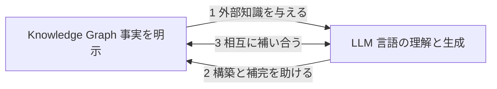

各ノードの意味：
- 「1」の矢印：KG-enhanced LLMs（KG から LLM へ）
- 「2」の矢印：LLM-augmented KGs（LLM から KG へ）
- 「3」の矢印：Synergized LLMs + KGs（双方向）

### 18.3 GraphRAG：文書から KG を作って検索に使う

RAG（Retrieval-Augmented Generation、＝検索で見つけた資料を LLM への入力に加えて答えさせる方法）は、多くの LLM アプリで使われます。Microsoft Research は、2024年2月13日のブログ「GraphRAG: Unlocking LLM discovery on narrative private data」（Jonathan Larson、Steven Truitt）で、**LLM が生成した KG** を使う GraphRAG を紹介しました。ベクトル類似度による通常の RAG が苦手な場面を補う狙いです。2024年7月2日にはオープンソースとして GitHub 公開を発表しています。

公開ドキュメントの説明では、GraphRAG の処理は、生の文章から KG を取り出し、コミュニティ（＝密につながったノードのまとまり）の階層を作り、各コミュニティの要約を作って、それらを RAG に使う、という流れです。

この図は、GraphRAG の処理の流れを表しています。上から下へ読み進めてください。

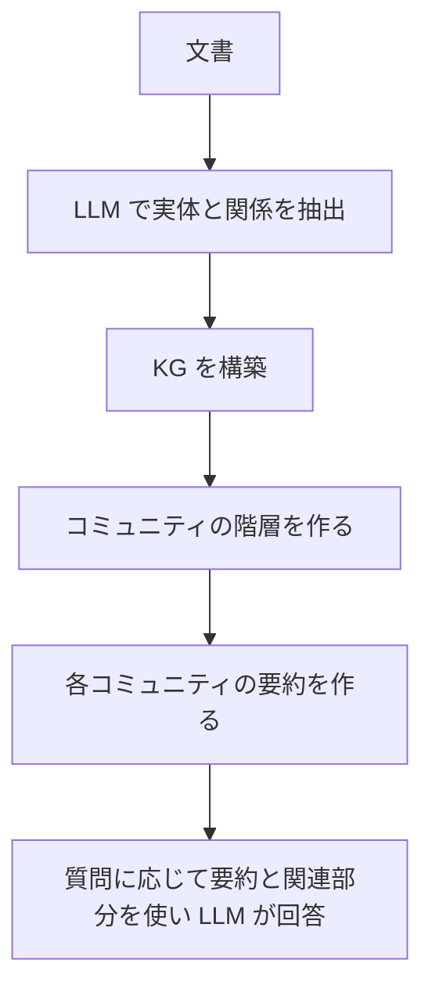

各ノードの意味：
- 「LLM で実体と関係を抽出」：本書の第4〜7章の情報抽出を、LLM が担う部分
- 「コミュニティの階層」：全体の話題の構造をつかむための単位
- 「要約」：文書全体を見渡す質問（「主な論点は何か」など）に答えるための材料

Neo4j のブログ「The GraphRAG manifesto」は、Microsoft の報告として、LLM が生成した KG によって、RAG の検索部分が改善し、より関連性の高い内容がコンテキストに入り、根拠の出どころも捉えられると紹介しています。同ブログは、他の方式と比べてトークン数（＝LLM が処理する量）が26%〜97%少なかったという報告にも触れています。**数値は Neo4j による紹介で、条件により変わるため、採用前に一次資料（Microsoft のブログと論文）で確認してください。**

Microsoft のプロジェクトページは、GraphRAG と LazyGraphRAG が、Azure 上の科学研究向けエージェント基盤「Microsoft Discovery」で利用できると案内しています（2026年9月時点で確認できた記載）。

### 18.4 本書の章と LLM 時代の対応（筆者の整理）

【補足】次の表は、本書の章と、LLM を使った現在の取り組みとの対応を、筆者が整理したものです。書籍が LLM を扱っているという意味ではありません（本書は2021年の出版です）。

| 本書の章 | LLM 時代に対応する話題 | 注意点 |
|----------|------------------------|--------|
| 第2章 モデル化 | LLM で KG を作る場合も、スキーマの設計は必要 | スキーマがないと、LLM の出力の表記が揺れやすい |
| 第4〜7章 情報抽出 | LLM による抽出（GraphRAG の抽出工程など） | 抽出の誤りを、第4章の適合率・再現率で測る |
| 第8章 インスタンス照合 | LLM が抽出した実体の名寄せ | 別表記が別ノードになる問題は残る |
| 第10章 埋め込み | ベクトル検索との併用 | グラフの構造情報は、通常のテキスト埋め込みには入らない |
| 第11章 推論 | 複数段の関係をたどる質問への対応 | ルール推論と LLM の推測を区別して扱う |
| 第12〜13章 問い合わせと QA | 自然言語から SPARQL や Cypher を生成する | 生成した問い合わせを実行する前に検証する |

### 18.5 標準の動き（2026年9月時点で確認できた範囲）

| 動き | 状況 |
|------|------|
| RDF 1.2 | Candidate Recommendation Snapshot（2026年4月7日）。triple term などが加わる |
| SPARQL 1.2 | 草案（Working Draft）の文書が公開されている |
| GQL（ISO/IEC 39075） | 2024年4月に発行。実装は各製品で進行中 |
| SQL/PGQ（ISO/IEC 9075-16） | 2023年に発行 |

**この表は変わる可能性があります。** 実装に使う前に、W3C と ISO の最新の情報を確認してください。

📖 このセクションで登場した用語
- LLM：大量の文章で学習した、文章を理解・生成する AI モデル
- ハルシネーション：もっともらしいが事実でない内容を、LLM が出力すること
- RAG：検索した資料を LLM の入力に加えて答えさせる方法
- GraphRAG：文書から KG を作り、RAG に使う方法（Microsoft Research が提案）
- コミュニティ：グラフの中で、互いに密につながったノードのまとまり
- トークン：LLM が処理する文字の断片の単位

---

## 19. 学習ロードマップと確認問題

💡 この章では、ここまでの内容を、実際の学習の進め方と、理解度の確認問題にまとめます。

### 19.1 4週間の学習プラン

| 週 | 学ぶこと | やってみること |
|----|----------|----------------|
| 1週目 | 第1〜2章（KG の考え方、RDF） | 第2章の Turtle を自分の題材（趣味、職場）で書き換える |
| 2週目 | 第12章（SPARQL） | rdflib で SPARQL を書き、結果を確認する |
| 3週目 | 第4・6・8章（抽出と名寄せ） | 数十件の文章で、名前と関係を手作業で取り出し、適合率・再現率を計算する |
| 4週目 | 第10・18章（埋め込みと LLM） | 第10章の小さな例を、自分のデータに変えて動かす。GraphRAG のドキュメントを読む |

### 19.2 確認問題

1. KG の事実は、どんな形の3つ組で表しますか
2. RDF のノードの3種類は何ですか
3. A-Box と T-Box の違いを説明してください
4. 適合率と再現率の違いを説明してください
5. インスタンス照合で、ブロッキングが必要な理由は何ですか
6. TransE では、どんな条件のとき、事実が正しそうだと判断しますか
7. SPARQL の SELECT 句と WHERE 句の役割を説明してください
8. GraphRAG が、通常のベクトル検索の RAG に加える工夫は何ですか

### 19.3 解答

1. 主語・述語（関係）・目的語の3つ組（トリプル）です
2. IRI、リテラル、空白ノードです（RDF 1.1）
3. A-Box は具体的な事実の層、T-Box は型と関係の定義（オントロジー）の層です
4. 適合率は「出力のうち正しかった割合」、再現率は「正解のうち見つけられた割合」です
5. 全ての組を比べると、組の数が n × (n − 1) ÷ 2 に増えて、現実的な時間で処理できないためです
6. head の座標に relation のベクトルを足した結果が、tail の座標に近いとき（距離が小さいとき）です
7. SELECT 句は結果として返す変数を、WHERE 句は照合するパターンを指定します
8. LLM で文書から KG を作り、コミュニティの階層と要約を作って、検索と回答に使う点です

📖 このセクションで登場した用語
- ロードマップ：目標に至るまでの計画の道筋

---

## 20. 参考文献・根拠となるソース URL

💡 この章では、本ガイドの根拠にした情報源の URL を、種類別にまとめます。確認日はすべて2026年9月21日です。

### 20.1 情報の確度と、このガイドの限界

| 項目 | 内容 |
|------|------|
| 書籍本文 | 書籍本文は確認していません。章の節タイトルは、MIT Press の電子書籍ビューアに掲載された目次に基づきます |
| パート名 | Part I と Part IV の名称は目次に明記されています。Part II・III・V の名称は、出版社紹介文に基づく筆者の整理です |
| 【補足】の記述 | 一般的な知識に基づく解説で、書籍本文の記述と一致するとは限りません |
| 標準の状況 | RDF 1.2 や SPARQL 1.2 は策定中で、変わる可能性があります |
| 図の検証 | Mermaid 図16点は、mermaid v11 の構文チェック（parse）に全て合格しました。ブラウザでの描画の見た目は未確認のため、ご利用の環境で表示を確認してください |

### 20.2 書籍そのものに関する情報

| 情報源 | URL | 使った箇所 |
|--------|-----|-----------|
| Google ブックス（ご指定のページ） | https://books.google.co.jp/books/about/Knowledge_Graphs.html?id=iqvuDwAAQBAJ&redir_esc=y | 正式書名、著者、出版社、ISBN、紹介文 |
| MIT Press 書籍ページ | https://mitpress.mit.edu/9780262045094/knowledge-graphs/ | 書誌情報、紹介文 |
| 目次（MIT Press 電子書籍ビューア） | https://mitpress.ublish.com/book/knowledge-graphs-fundamentals-techniques-and-applications | 全17章の節タイトル、演習130問、章末構成 |
| Kejriwal, *Knowledge Graphs: A Practical Review of the Research Landscape* | https://www.researchgate.net/publication/367745990_Knowledge_Graphs_A_Practical_Review_of_the_Research_Landscape | A-Box と T-Box の説明、個数制約の例 |

### 20.3 著名な研究者・開発元による一次資料と、技術メディアの解説記事

以下は原則として研究者・開発元による一次資料です。ただし The New Stack の記事は技術メディアによる二次資料であり、一次資料（ISO/IEC 39075 と Neo4j 標準化チームの解説）の補足として挙げています。

| 発信者 | 情報源 | URL | 使った箇所 |
|--------|--------|-----|-----------|
| Google（Amit Singhal） | Introducing the Knowledge Graph: things, not strings（2012） | https://blog.google/products/search/introducing-knowledge-graph-things-not/ | 第1章 |
| Aidan Hogan ら | Knowledge Graphs, ACM Computing Surveys（2021） | https://doi.org/10.1145/3447772 | 第1章の参考文献 |
| Denny Vrandečić、Markus Krötzsch | Wikidata: A Free Collaborative Knowledgebase, CACM（2014） | https://cacm.acm.org/research/wikidata/ | 第2章、第14章 |
| Antoine Bordes ら | Translating Embeddings for Modeling Multi-relational Data（NIPS 2013） | https://papers.nips.cc/paper/5071-translating-embeddings-for-modeling-multi-relational-data | 第10章 |
| Pujara ら | Knowledge Graph Identification（ISWC 2013） | https://link.springer.com/chapter/10.1007/978-3-642-41335-3_34 | 第9章 |
| Shirui Pan ら | Unifying Large Language Models and Knowledge Graphs: A Roadmap（IEEE TKDE 2024） | https://arxiv.org/abs/2306.08302 | 第18章 |
| Shirui Pan | 上記論文についての著者本人の投稿（LinkedIn） | https://www.linkedin.com/posts/shirui-pan_unifying-large-language-models-and-knowledge-activity-7075334111829114880-5iQl | 第18章 |
| Microsoft Research（Jonathan Larson、Steven Truitt） | GraphRAG: Unlocking LLM discovery on narrative private data（2024年2月13日） | https://www.microsoft.com/en-us/research/blog/graphrag-unlocking-llm-discovery-on-narrative-private-data/ | 第18章 |
| Microsoft Research | Project GraphRAG | https://www.microsoft.com/en-us/research/project/graphrag/ | 第18章 |
| Microsoft | GraphRAG 公式ドキュメント | https://microsoft.github.io/graphrag/ | 第18章 |
| Microsoft Research | GraphRAG 論文（プレプリント） | https://arxiv.org/abs/2404.16130 | 第18章（一次資料での確認用） |
| Neo4j | The GraphRAG manifesto | https://neo4j.com/blog/genai/graphrag-manifesto/ | 第18章 |
| Neo4j 標準化チーム | Creating the GQL database language standard | https://neo4j.com/blog/cypher-and-gql/gql-database-language-standard/ | 第12章 |
| Stefan Plantikow（Neo4j、GQL 編集者） | NODES 2024 セッション | https://neo4j.com/nodes2024/agenda/a-new-era-for-graph-queries-iso-iec-39075-gql/ | 第12章（補足） |
| The New Stack（二次資料） | GQL: A New ISO Standard for Querying Graph Databases | https://thenewstack.io/gql-a-new-iso-standard-for-querying-graph-databases/ | 第12章 |
| Google Cloud | Spanner Graph and ISO standards | https://docs.cloud.google.com/spanner/docs/graph/iso-standards | 第12章 |

### 20.4 標準化団体の仕様

| 仕様 | URL | 使った箇所 |
|------|-----|-----------|
| RDF 1.1 Primer（W3C） | https://www.w3.org/TR/rdf11-primer/ | 第2章 |
| RDF 1.1 Concepts and Abstract Syntax（W3C） | https://www.w3.org/TR/rdf11-concepts/ | 第2章 |
| RDF 1.2 Concepts and Abstract Data Model（W3C） | https://www.w3.org/TR/rdf12-concepts/ | 第2章、第18章 |
| RDF 1.2 Semantics（W3C、CR Snapshot 2026-04-07） | https://www.w3.org/TR/2026/CR-rdf12-semantics-20260407/ | 第2章 |
| W3C ニュース：RDF 1.2 の実装募集（2026-04-07） | https://www.w3.org/news/2026/w3c-invites-implementations-of-rdf-1-2-concepts-and-abstract-data-model-and-rdf-1-2-semantics/ | 第2章 |
| What's New in RDF 1.2（W3C Group Note Draft・非規範文書） | https://www.w3.org/TR/2026/DNOTE-rdf12-new-20260714/ | 第2章 |
| SPARQL 1.1 Query Language（W3C） | https://www.w3.org/TR/sparql11-query/ | 第12章 |
| SPARQL 1.2 Protocol（W3C） | https://www.w3.org/TR/sparql12-protocol/ | 第12章、第18章 |

### 20.5 さらに学ぶための読み方

1. まず本書の目次（20.2）で、読みたい章を選ぶ
2. 用語の全体像は Hogan らの調査論文で確認する
3. 実装に入るときは、W3C の仕様（20.4）と、各製品のドキュメントで最新の状況を確認する
4. LLM との組み合わせは、Pan らのロードマップ論文と、GraphRAG の公式ドキュメントから読む

📖 このセクションで登場した用語
- 一次資料：情報の出どころ本人が公開した資料（論文、仕様書、公式ブログなど）
- プレプリント：査読前に公開された論文原稿
