# LangChain in your Pocket 徹底解説ガイド

### 初学者のためのステップバイステップ学習マニュアル

> 原著: *LangChain in your Pocket: Beginner's Guide to Building Generative AI Applications using LLMs*
> 著者: Mehul Gupta / 出版: Packt Publishing（O'Reilly収録, 2024年5月, 152ページ）
> 参照元: [O'Reilly 書籍ページ](https://www.oreilly.com/library/view/langchain-in-your/9781836201250/)

---

## この解説ガイドについて

このガイドは、Mehul Gupta 氏の著書 *LangChain in your Pocket* を初学者向けに再構成し、各章の要点をステップバイステップで解説するものです。原著は2024年1月〜5月に刊行されたため、`LLMChain` や `ConversationBufferMemory` のような LangChain 0.1系のAPIを中心に説明しています。

**重要な注意点**: LangChainは2025年10月22日に **LangChain 1.0 / LangGraph 1.0** を同時リリースし、エージェントの実行基盤が根本的に刷新されました（[LangChain公式ドキュメント](https://docs.langchain.com/oss/python/langchain-philosophy)）。本ガイドでは原著の構成・用語をそのまま解説しつつ、各章末に **「2026年9月時点の補足」** を設け、現在の推奨アプローチとの違いを明記しています。これにより、書籍の学習効果を損なわずに、実務で通用する最新知識も同時に得られる構成にしています。

### 本ガイドの読み方（全体マップ）

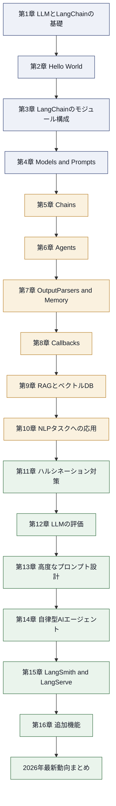

### 書籍の目次（原著全16章）

| 章 | タイトル | 主な内容 |
|---|---|---|
| 1 | Introduction | LLMとは何か、LangChainが必要な理由 |
| 2 | Hello World | セットアップ、Name Generator、Storyteller |
| 3 | Different LangChain Modules | LangChainのモジュール全体像 |
| 4 | Models and Prompts | LLM/ChatModel、PromptTemplate |
| 5 | Chains | LLMChain、Auto-SQL、LCEL |
| 6 | Agents | Chainとの違い、カスタムツール |
| 7 | OutputParsers and Memory | 出力整形、会話記憶 |
| 8 | Callbacks | 実行フックの仕組み |
| 9 | RAG Framework and Vector Databases | RAGとベクトル検索 |
| 10 | LangChain for NLP problems | 要約・分類・NER・Few-Shot |
| 11 | Handling LLM Hallucinations | ハルシネーション対策 |
| 12 | Evaluating LLMs | 評価手法 |
| 13 | Advanced Prompt Engineering | CoT、ReAct、Tree of Thoughts |
| 14 | Autonomous AI agents | AutoGPT、BabyAGI、HuggingGPT |
| 15 | LangSmith and LangServe | 可観測性とデプロイ |
| 16 | Additional Features | Fallback、Safety、デバッグ |

（出典: [O'Reilly収録版 目次](https://www.oreilly.com/library/view/langchain-in-your/9781836201250/)）

---

## 第1章: LLMとLangChainの基礎知識

### 1.1 LLM（大規模言語モデル）とは

LLM（Large Language Model）は、大量のテキストデータから「次に来る単語」を予測することを学習した深層学習モデルです。原著では、ChatGPTが2022年末に登場して以降、AI業界が劇的に変化したことがLangChain誕生の背景として紹介されています。

LLM単体では以下のような制約があります。

- 学習データの時点までの知識しか持たない（最新情報を知らない）
- 外部ツール（検索、計算機、DB）を自分では呼び出せない
- 長い会話の文脈を保持する仕組みがない
- 出力形式（JSON化など）を厳密に制御しづらい

### 1.2 LLMのファミリー（主要な系統）

原著では複数のLLMファミリーが紹介されています。初学者向けに整理すると以下のようになります。

| ファミリー | 提供元 | 特徴 |
|---|---|---|
| GPTシリーズ | OpenAI | 汎用性が高く商用利用の主力 |
| Claudeシリーズ | Anthropic | 長文コンテキスト、安全性重視 |
| Geminiシリーズ | Google | マルチモーダル対応 |
| Llamaシリーズ | Meta | オープンウェイトモデル |
| Mistral / Mixtral | Mistral AI | 軽量・高効率なオープンモデル |

### 1.3 なぜLangChainが必要なのか

LangChainは、LLM単体の弱点を補うための「接着剤（グルーコード）」を提供するフレームワークです。具体的には次の機能を統一的なインターフェースで扱えるようにします。

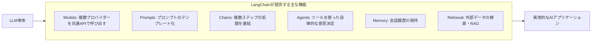

LangChainを使うことで、モデルプロバイダーを切り替えたり、ツール呼び出しやRAGを組み込んだりする際に、アプリケーションのコアロジックを書き換える必要がなくなります。

> **2026年9月時点の補足**: この「モデルを差し替え可能にする」という思想は現在も変わっていません。ただし2025年10月のLangChain 1.0リリース以降、LangChainは「フレームワーク」から「エージェントエンジニアリングプラットフォーム」へと位置づけが進化し、Uber・JPMorgan・LinkedIn・Ciscoなど大企業の本番運用でも採用が進んでいます（[FutureAGI: What is LangChain? 2026](https://futureagi.com/blog/what-is-langchain/)）。

---

## 第2章: Hello World ― 環境構築と最初のアプリ

### 2.1 LangChainのセットアップ

原著のPythonベースの基本セットアップは以下の通りです（書籍刊行時点のAPI）。

```python
# インストール
# pip install langchain langchain-openai

import os
os.environ["OPENAI_API_KEY"] = "sk-..."

from langchain_openai import ChatOpenAI

llm = ChatOpenAI(model="gpt-3.5-turbo")
response = llm.invoke("こんにちは、自己紹介してください")
print(response.content)
```

### 2.2 Name Generator（最初の実践例）

原著の最初のハンズオン例は「商品名を生成するアプリ」です。プロンプトテンプレートを使い、入力（商品カテゴリ）に応じた出力を得る流れを学びます。

```python
from langchain_core.prompts import PromptTemplate

prompt = PromptTemplate.from_template(
    "{category}のブランドに相応しい名前を3つ提案してください。"
)
chain = prompt | llm
result = chain.invoke({"category": "オーガニック紅茶"})
print(result.content)
```

このコードの `|`（パイプ）演算子は **LCEL（LangChain Expression Language）** と呼ばれる書き方で、「プロンプト→モデル」という処理の流れを直感的に表現します。第5章で詳しく扱います。

### 2.3 テキスト前処理／2.4 Storyteller／2.5 ローカルLLM

原著ではこの後、テキストクリーニング（不要な空白・記号の除去）、物語生成（Storyteller）、そして `llama.cpp` や `Ollama` のようなツールを使ったローカルLLM実行にも触れています。ローカルLLMは、APIコストをかけずに検証したい場合や、機密データを外部に送信できない場合に有効な選択肢です。

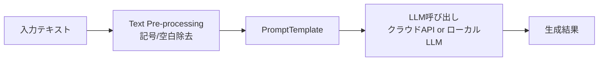

> **2026年9月時点の補足**: ローカルLLM運用は2026年時点でさらに一般化しており、Ollama・LM Studio・vLLMなどのツールがLangChainの `ChatOllama` 等の統合を通じて簡単に接続できます。またAPIキー管理は `.env` ファイルではなく、シークレットマネージャーやLangSmithのプロジェクト単位の環境変数管理を使うのが実務上の標準になっています。

---

## 第3章: LangChainのモジュール構成

原著は第3章で、LangChainを構成する主要モジュールの全体像を提示します。各モジュールは独立して使うことも、組み合わせて使うこともできます。

| モジュール | 役割 | 詳しく学ぶ章 |
|---|---|---|
| Models | LLM/ChatModelの呼び出し | 第4章 |
| Prompts | プロンプトのテンプレート管理 | 第4章 |
| Chains | 複数処理の連結 | 第5章 |
| Agents | ツールを使う自律的な意思決定 | 第6章 |
| OutputParsers | 出力の構造化 | 第7章 |
| Memory | 会話履歴の保持 | 第7章 |
| Callbacks | 実行中のイベントフック | 第8章 |
| Indexes（Retrieval） | 外部ドキュメントの検索 | 第9章 |

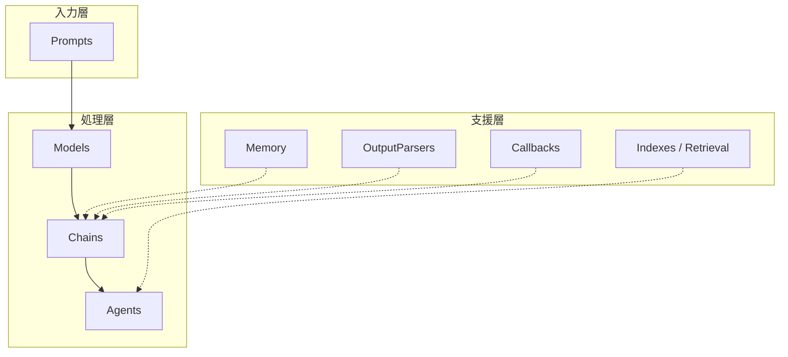

---

## 第4章: Models and Prompts

### 4.1 Models: LLM と ChatModel の違い

原著は2種類のモデルインターフェースを区別しています。

- **LLM**: 文字列を入力し、文字列を返すシンプルなインターフェース（例: `text-davinci-003` のような補完型モデル）
- **ChatModel**: メッセージのリスト（system/human/aiロール）を入出力とする、対話向けのインターフェース（例: `gpt-3.5-turbo`, `gpt-4`）

```python
from langchain_core.messages import HumanMessage, SystemMessage
from langchain_openai import ChatOpenAI

chat = ChatOpenAI(model="gpt-4o-mini")
messages = [
    SystemMessage(content="あなたは丁寧な日本語アシスタントです。"),
    HumanMessage(content="LangChainのChatModelとLLMの違いを教えてください。"),
]
response = chat.invoke(messages)
print(response.content)
```

補完型（純粋なLLM）モデルは現在ではほとんど提供が終了しており、実務ではChatModelインターフェースを使うのが標準です。

### 4.2 Prompts: PromptTemplate と ChatPromptTemplate

`PromptTemplate` は単一の文字列プロンプトに変数を埋め込む仕組み、`ChatPromptTemplate` はロールごとにメッセージを組み立てる仕組みです。

```python
from langchain_core.prompts import ChatPromptTemplate

template = ChatPromptTemplate.from_messages([
    ("system", "あなたは{domain}の専門家です。"),
    ("human", "{question}"),
])
formatted = template.invoke({"domain": "栄養学", "question": "タンパク質摂取の目安は？"})
```

> **2026年9月時点の補足**: `PromptTemplate` / `ChatPromptTemplate` のAPI自体は現在も現役で、`langchain-core` パッケージの安定した基盤機能として維持されています。ただし大規模なプロンプト管理は現在、LangSmithの「Prompt Hub」でバージョン管理・A/Bテストを行うのが一般的です。

---

## 第5章: Chains（チェーン）

### 5.1〜5.4 LLMChain・Auto-SQL Chain・MathsChain・DALL-E連携

原著では `LLMChain` を軸に、プロンプトとモデルを1つの処理単位として結合する方法を学びます。さらに応用例として、自然言語をSQLに変換する **Auto-SQL Chain**、数式を解く **MathsChain**、画像生成モデルと連携する **DALL-E Chain** が紹介されます。

```python
# 原著の書き方（LLMChain、2024年当時の標準）
from langchain.chains import LLMChain

chain = LLMChain(llm=llm, prompt=prompt)
result = chain.run(category="スポーツウェア")
```

### 5.5 Custom Chains using LCEL

原著は本章の後半で **LCEL（LangChain Expression Language）** を紹介し、`|` 演算子でRunnableを連結する新しい書き方を提示しています。これは書籍刊行当時から「今後推奨される書き方」として案内されていました。

```python
# LCELによる書き方
from langchain_core.output_parsers import StrOutputParser

output_parser = StrOutputParser()
chain = prompt | llm | output_parser
result = chain.invoke({"category": "スポーツウェア"})
```


### 5.6 Types of Chains

原著は `SimpleSequentialChain`（単一入出力を順に繋ぐ）、`SequentialChain`（複数の入出力変数を扱う）などのチェーン種別を紹介しています。

> **2026年9月時点の補足**: `LLMChain` は **LangChain 0.1.17で非推奨化され、1.0では本体の `langchain` パッケージから `langchain-classic` パッケージへ移され、そこで非推奨のまま残されて** います。現在は本章で紹介されている `prompt | llm` というLCELの書き方がそのまま標準です（[Aurelio AI: LangChain Expression Language解説](https://www.aurelio.ai/learn/langchain-lcel)）。また `SimpleSequentialChain` 等の旧式チェーンクラスも `langchain_classic` パッケージに後方互換性維持のためだけに残されている状態で、新規開発では非推奨とされています（[LangChain Reference: langchain_classic](https://reference.langchain.com/python/langchain-classic/langchain_classic)）。つまり、原著の5.5節で「これから使うべき書き方」として紹介されたLCELが、2026年現在ではまさに主流になっています。

---

## 第6章: Agents（エージェント）

### 6.1 AgentとChainの違い

Chainは「あらかじめ決められた処理の順序」を実行するのに対し、**Agent（エージェント）はLLM自身が次にどのツールを使うかを都度判断する** 点が根本的に異なります。

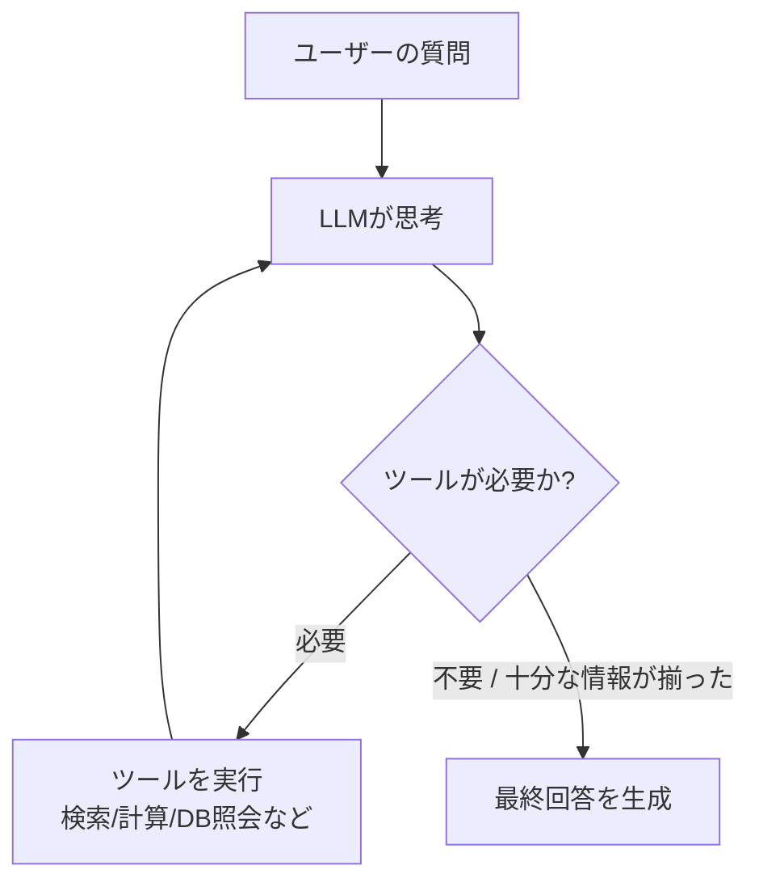

### 6.2〜6.3 Agentの構築とタイプ

原著は `initialize_agent` 関数と、`ZERO_SHOT_REACT_DESCRIPTION` などのエージェントタイプ（推論戦略）を使ったエージェント構築を解説しています。

```python
# 原著の書き方（2024年当時のAgent API）
from langchain.agents import initialize_agent, AgentType, load_tools

tools = load_tools(["serpapi", "llm-math"], llm=llm)
agent = initialize_agent(
    tools, llm, agent=AgentType.ZERO_SHOT_REACT_DESCRIPTION, verbose=True
)
agent.run("2024年のノーベル物理学賞受賞者の年齢を2倍した数値は？")
```

### 6.4 Custom Tools for Agents

エージェントに独自のツール（社内APIやデータベース照会関数など）を追加する方法も紹介されており、`@tool` デコレータを使ってPython関数をエージェントが呼び出せるツールに変換します。

```python
from langchain_core.tools import tool

@tool
def get_shipping_status(order_id: str) -> str:
    """注文IDから配送状況を取得する"""
    return f"注文 {order_id} は配送中です。"
```

> **2026年9月時点の補足**: `initialize_agent` と `AgentExecutor` は **非推奨（deprecated）で、2026年12月までの移行が公式に推奨** されています。現在の標準的なエージェント構築方法は `langchain.agents.create_agent` です。内部的にはLangGraphのランタイム上でエージェントループが動作しており、開発者は高レベルAPI（`create_agent`）のまま使うことも、必要に応じてLangGraphの `StateGraph` まで降りて細かく制御することもできます（[uvik.net: LangChain vs LangGraph 2026年版ガイド](https://uvik.net/blog/langchain-vs-langgraph/)）。

```python
# 2026年時点の推奨される書き方
from langchain.agents import create_agent

agent = create_agent(
    model="openai:gpt-5",
    tools=[get_shipping_status],
    system_prompt="あなたはECサイトのカスタマーサポート担当です。",
)
result = agent.invoke({"messages": [{"role": "user", "content": "注文12345の状況は？"}]})
```

（出典: [Educative: What Is create_agent?](https://www.educative.io/courses/langchain-llm/what-is-create-agent)）

---

## 第7章: OutputParsers and Memory

### 7.1 OutputParsers（出力パーサー）

LLMの出力はデフォルトでは自由形式のテキストです。`OutputParser` はこれを構造化データ（リスト、JSON、独自クラス）に変換する仕組みです。

```python
from langchain_core.output_parsers import CommaSeparatedListOutputParser

parser = CommaSeparatedListOutputParser()
# LLMに「カンマ区切りで答えて」と指示するプロンプトと組み合わせて使う
```

原著では、パース失敗時にLLM自身に修正させる **Magic Output Fixer**（`OutputFixingParser` に相当）というテクニックも紹介されています。これは「出力が期待した形式でない場合、その旨をLLMに伝えて再生成させる」仕組みです。

### 7.2 Memory（会話記憶）

`ConversationBufferMemory` はすべての会話履歴をそのまま保持し、`ConversationSummaryMemory` は履歴が長くなるとLLMを使って要約する仕組みです。

```python
# 原著の書き方（2024年当時のMemory API）
from langchain.memory import ConversationBufferMemory

memory = ConversationBufferMemory()
memory.save_context({"input": "こんにちは"}, {"output": "こんにちは、ご用件は？"})
```

> **2026年9月時点の補足**: `ConversationBufferMemory` を含む旧来のインプロセスMemoryクラス群は、**LangChain 1.0で非推奨** となりました。現在の本番運用では、LangGraphの **チェックポインター（checkpointer）** がスレッド単位で会話状態を永続化する仕組みに置き換わっています。これにより、複雑な状態管理コードを自前で書かずに、会話の途中再開や並行セッション管理が可能になっています（[Atlan: What is LangChain? 2026](https://atlan.com/know/ai-agent/ai-agent-memory/what-is-langchain/)）。構造化出力についても、現在は `create_agent` の `response_format` パラメータでPydanticモデルを直接指定する方法が主流になりつつあります。

---

## 第8章: Callbacks

Callbacksは、チェーンやエージェントの実行中に発生するイベント（開始・終了・トークン生成・エラーなど）をフックして処理を差し込む仕組みです。

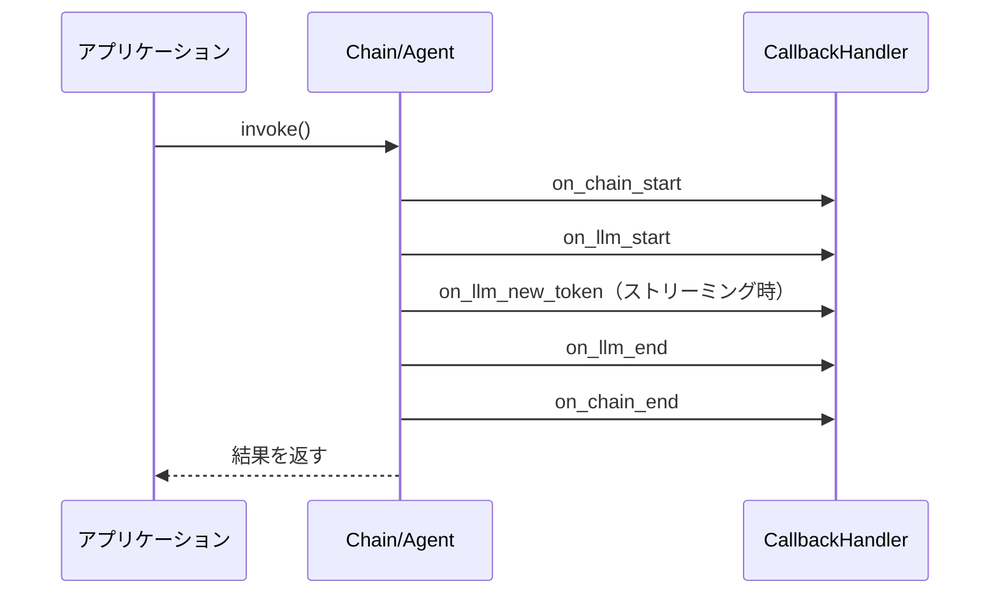

原著では `StdOutputCallbackHandler`（標準出力にログを流す）、`FileCallbackHandler`（ファイルにログを保存する）、そして独自のロジックを実装する **Custom Callbacks** が紹介されています。ログ収集、コスト計測、リアルタイムのトークンストリーミング表示など、実務上のデバッグ・監視用途で重要な機能です。

> **2026年9月時点の補足**: Callbacksの仕組み自体は現在も健在ですが、本番環境でのトレース・監視は自作のCallbackHandlerよりも **LangSmith** のトレーシング機能を使うのが標準的です。LangSmithはトレースの入出力表示のカスタマイズやベースライン比較機能などが2026年に入ってから拡充されています（[LangChain 2026年2月ニュースレター](https://blog.langchain.com/febraury-2026-langchain-newsletter)）。

---

## 第9章: RAGフレームワークとベクトルデータベース

本章は原著の中でも特に実務価値の高いパートです。

### 9.1 RAGとは何か

RAG（Retrieval-Augmented Generation、検索拡張生成）とは、LLMが回答を生成する前に、外部データソースから関連情報を検索し、その情報をプロンプトに含めることで、最新情報や社内固有情報に基づいた回答を可能にする手法です。

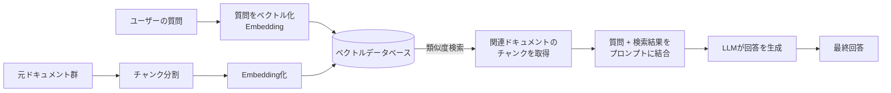

### 9.2〜9.3 RAGの構成要素とLangChainでの実装

RAGパイプラインは主に4つの要素で構成されます。

| 構成要素 | 役割 | 原著で扱われるクラス例 |
|---|---|---|
| Document Loader | 元データ（PDF, Webページ, DB等）を読み込む | `PyPDFLoader`, `WebBaseLoader` |
| Text Splitter | 長い文書を検索しやすい単位に分割 | `RecursiveCharacterTextSplitter` |
| Embeddings | テキストをベクトルに変換 | `OpenAIEmbeddings` |
| Vector Store | ベクトルを保存し類似度検索する | `Chroma`, `FAISS`, `Pinecone` |

```python
from langchain_community.document_loaders import WebBaseLoader
from langchain_text_splitters import RecursiveCharacterTextSplitter
from langchain_openai import OpenAIEmbeddings
from langchain_chroma import Chroma

loader = WebBaseLoader("https://example.com/docs")
docs = loader.load()

splitter = RecursiveCharacterTextSplitter(chunk_size=500, chunk_overlap=50)
chunks = splitter.split_documents(docs)

vectorstore = Chroma.from_documents(chunks, OpenAIEmbeddings())
retriever = vectorstore.as_retriever()

# RAG用プロンプト（context と question を受け取る）
from langchain_core.prompts import ChatPromptTemplate

rag_prompt = ChatPromptTemplate.from_template(
    "次の文脈だけを使って質問に答えてください。\n\n文脈:\n{context}\n\n質問: {question}"
)

# RAGチェーン（LCEL）
rag_chain = {"context": retriever, "question": lambda x: x} | rag_prompt | llm
```

### 9.4〜9.5 Multi-document RAGとレコメンドシステム

原著は複数文書にまたがる検索（Multi-document RAG）と、RAGの応用としてのレコメンドシステム構築にも触れています。複数ドキュメントを扱う際は、メタデータフィルタリング（例: 部署別、日付別）を組み合わせることで検索精度を高めるのが実務上のポイントです。

### 9.6 ベクトルデータベースの選び方

原著執筆時点（2024年）ではPinecone・FAISS・Chromaなどが主に紹介されていましたが、2026年現在のベクトルDBの選択肢は以下のように整理できます。

| データベース | 得意分野 | ホスティング | 2026年の位置づけ |
|---|---|---|---|
| Pinecone | 運用負荷ゼロの本番RAG | フルマネージド | サーバーレス化で運用簡易性No.1 |
| Qdrant | 高性能なセルフホスト | セルフホスト / クラウド | コストパフォーマンスに優れる |
| Weaviate | ハイブリッド検索（BM25+ベクトル） | 両対応 | マルチモーダル検索に強い |
| Chroma | ローカル開発・プロトタイピング | 組込み / セルフホスト | 学習・検証用途で依然人気 |
| pgvector | 既存のPostgreSQL活用 | セルフホスト（拡張機能） | 追加インフラ不要で運用がシンプル |

（出典: [Braintrust: Best Vector Databases for RAG 2026](https://www.braintrust.dev/articles/best-vector-databases-for-rag-2026), [Dupple: Best Vector Databases 2026](https://dupple.com/learn/best-vector-databases)）

> **2026年9月時点の補足**: 2026年時点では「ベクトル検索単体」ではなく、BM25のようなキーワード検索とベクトル検索を組み合わせた **ハイブリッド検索** が本番RAGの標準的な構成になっています。また、ベクトル検索機能がPostgreSQL・MongoDB Atlas・主要クラウドのマネージドDBに標準搭載されるようになり、「専用ベクトルDBを新規導入するかどうか」自体が設計判断のポイントになっています（[Solguruz: Vector Database解説](https://solguruz.com/generative-ai/vector-database/)）。

---

## 第10章: LangChainを使ったNLPタスク

原著は本章で、LangChainを従来型のNLP（自然言語処理）タスクに応用する方法を紹介しています。

| タスク | 説明 |
|---|---|
| 10.1 Summarization | 長文の要約（`load_summarize_chain` 等） |
| 10.2 Text Tagging / Classification | テキストへのラベル付け・分類 |
| 10.3 Named Entity Recognition (NER) | 固有表現抽出（人名・地名・組織名など） |
| 10.4 Text Embeddings | テキストの意味的ベクトル表現 |
| 10.5 Few-Shot Classification | 少数の例示から分類させる手法 |
| 10.6 POS Tagging, Segmentation | 品詞タグ付け・文分割 |

### Few-Shot Learningの考え方

Few-Shot Learningとは、モデルを再学習させることなく、プロンプト内にいくつかの「入力と正解のペア（例示）」を含めることで、望ましい出力形式や分類基準をLLMに理解させる手法です。

```python
from langchain_core.prompts import FewShotPromptTemplate, PromptTemplate

examples = [
    {"text": "このカレーは辛すぎる", "label": "ネガティブ"},
    {"text": "サービスがとても丁寧だった", "label": "ポジティブ"},
]
example_prompt = PromptTemplate.from_template("入力: {text}\n分類: {label}")

few_shot_prompt = FewShotPromptTemplate(
    examples=examples,
    example_prompt=example_prompt,
    suffix="入力: {input}\n分類:",
    input_variables=["input"],
)
```

**Example Selection**（原著10.5.3節）は、大量の例示候補の中から、入力に最も類似した例だけを動的に選んで使う手法で、ベクトル類似度検索（第9章のRAGと同じ仕組み）を応用します。

> **2026年9月時点の補足**: 従来のNLPタスク（分類・NER・要約）は、2026年現在では汎用LLM（GPT-5, Claude Sonnet 4.5等）に直接プロンプトで指示するだけで、専用モデルの訓練なしに高精度な結果が得られるケースが大半です。ただし超高速・低コストが求められる大量バッチ処理では、依然として軽量な専用モデル（spaCy等）とLLMを併用する設計が採られています。

---

## 第11章: LLMのハルシネーション対策

### 11.1〜11.2 ハルシネーションとは、なぜ起きるのか

ハルシネーション（Hallucination）とは、LLMが事実に基づかない内容を、あたかも真実であるかのように生成してしまう現象です。原著では、LLMが確率的に「もっともらしい単語列」を生成する仕組み上、学習データにない情報や、曖昧な質問に対して誤った内容を「自信満々に」出力してしまうことが原因として説明されています。

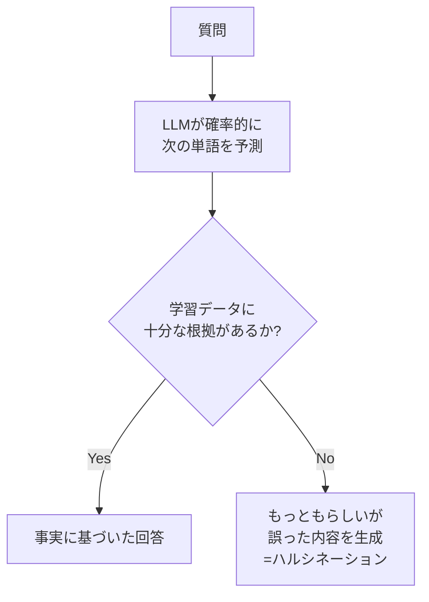

### 11.3〜11.4 LLMCheckerChainとLLMSummarizationChain

原著は、LLM自身に自分の回答の妥当性をチェックさせる `LLMCheckerChain` や、要約結果の正確性を検証する `LLMSummarizationChain` を対策として紹介しています。これは「LLMにLLMの出力を検証させる」というセルフチェック方式です。

### 11.5 RAGによるハルシネーション回避

最も効果的な対策として原著が強調しているのが、第9章で学んだRAGです。回答の根拠となる情報を検索結果としてプロンプトに含めることで、LLMが「知らないことを作り話しする」リスクを大幅に減らせます。

> **2026年9月時点の補足**: ハルシネーション対策は2026年でも生成AI活用の中心課題であり続けています。RAGに加えて、**出典の引用（Citation）を強制する仕組み**、**複数モデルによるクロスチェック**、そして評価パイプライン（第12章）を使った継続的なハルシネーション率のモニタリングが標準的な実務プラクティスとして定着しています。

---

## 第12章: LLMの評価（Evaluating LLMs）

原著は、LLMを使ったアプリケーションの品質を定量的に測るための評価手法を紹介しています。

| 評価手法 | 説明 |
|---|---|
| 12.1 String Evaluators | 出力文字列を基準に評価（正解と完全一致するか等） |
| 12.1.1 Criteria Evaluators | 「簡潔さ」「正確性」等の基準でLLM自身に採点させる |
| 12.1.2 Custom Evaluators | 独自の評価ロジックを実装 |
| 12.2 Comparison Evaluators | 2つの出力のどちらが優れているかを比較評価 |
| 12.3 Trajectory Evaluators | エージェントの意思決定プロセス全体（ツール呼び出しの順序等）を評価 |

```python
# 原著の書き方（Criteria Evaluatorの例）
from langchain.evaluation import load_evaluator

evaluator = load_evaluator("criteria", criteria="conciseness")
eval_result = evaluator.evaluate_strings(
    prediction="LangChainはLLMアプリ開発用のフレームワークです。",
    input="LangChainとは何ですか？",
)
```

> **2026年9月時点の補足**: 評価（Evaluation）はLangChainエコシステムの中でも特に進化が著しい領域です。現在は **LangSmith上のEvaluation/Experiments機能** を使い、データセットに対してチェーンやエージェントをバッチ実行し、複数の評価指標（正確性・レイテンシ・コストなど）を継続的にトラッキングするのが標準です。2026年2月のアップデートでは、実験結果を「ベースラインとしてピン留めし、以降の変更との差分を自動比較する」機能が追加されており、CI/CDパイプラインに評価を組み込む動きが加速しています（[LangChain 2026年2月ニュースレター](https://blog.langchain.com/febraury-2026-langchain-newsletter)）。

---

## 第13章: 高度なプロンプトエンジニアリング

### 13.1 Chain of Thought（思考の連鎖）

**Chain of Thought（CoT）** は、LLMに最終的な答えだけでなく、そこに至る推論過程を段階的に出力させることで、複雑な問題への回答精度を高める手法です。

- **13.1.1 Think Step by Step**: プロンプトに「ステップバイステップで考えてください」という指示を加えるだけの手軽な手法（Zero-shot CoT）
- **13.1.2 Few-Shot Prompting**: 推論過程を含む例示をいくつか与えることで、より安定した推論パターンをLLMに学習させる手法

### 13.2 ReAct（Reasoning + Acting）

**ReAct** は「推論（Reasoning）」と「行動（Acting）」を交互に繰り返すことで、LLMがツールを使いながら段階的に問題を解決していく手法です。第6章のAgentの内部動作の理論的基盤にもなっています。

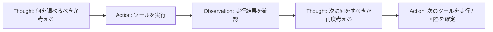

### 13.3 Tree of Thoughts（思考の木）

**Tree of Thoughts（ToT）** は、CoTが一本道の推論であるのに対し、複数の推論経路を並行して探索し、有望な経路を評価・選択しながら最終解に到達する、より高度な推論戦略です。

### 13.4 その他のプロンプトエンジニアリング手法

原著はこのほか、Self-Consistency（複数回生成し多数決を取る）などの手法にも触れています。

> **2026年9月時点の補足**: CoT・ReAct・ToTはいずれも2026年時点でも有効な基礎テクニックですが、GPT-5やClaude Sonnet系のような「推論（reasoning）」に最適化されたモデルでは、モデル自体が内部的に段階的思考を行うため、明示的な「ステップバイステップで考えて」という指示なしでも高い推論性能を発揮するようになっています。とはいえ、エージェントの意思決定プロセスを人間が検証・デバッグしやすくするという観点で、ReAct的な「思考の可視化」は現在も実務上重要な設計パターンです。

---

## 第14章: 自律型AIエージェント（Autonomous AI agents）

### 14.1 AGIとは

原著は本章の導入として、AGI（Artificial General Intelligence、汎用人工知能）という概念と、2023年頃に話題となった「完全自律型エージェント」の実験プロジェクト群を紹介しています。

### 14.2〜14.4 AutoGPT・BabyAGI・HuggingGPT

| プロジェクト | コンセプト |
|---|---|
| AutoGPT | 与えられた大目標を、LLM自身がサブタスクに分解し、ツール（Web検索・ファイル操作等）を使って自律的に達成を目指す |
| BabyAGI | タスクリストを動的に生成・優先順位付け・実行するループ構造で、シンプルな自律エージェントの実装例として知られる |
| HuggingGPT | LLMを「司令塔」とし、Hugging Face上の多数の専門特化モデル（画像認識、音声認識等）をタスクに応じて呼び分ける仕組み |

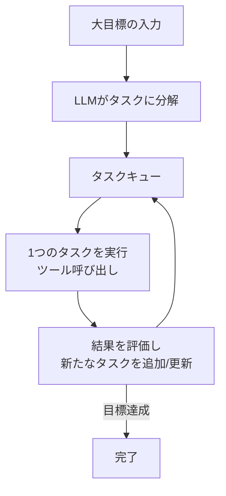

これらのプロジェクトは2023年当時、完全自律型AIの可能性を示す一方で、「無限ループに陥る」「コストが予測不能に膨らむ」といった実務上の課題も広く指摘されました。

> **2026年9月時点の補足**: AutoGPT・BabyAGIのような「完全放任型」の自律エージェントは実務での採用が限定的だった一方、その設計思想は2026年の **LangGraph** による「制御可能な自律性」へと発展的に継承されています。LangGraphでは、エージェントのループ構造をグラフとして明示的に定義し、人間による承認ステップ（Human-in-the-loop）や実行予算の上限設定（`langchain-runcycles` のようなミドルウェアによるツール呼び出し回数の制御等）を組み込めるため、「暴走しない自律エージェント」の実現が進んでいます。また、常時バックグラウンドでイベントを監視し続ける「アンビエントエージェント（Ambient Agents）」という新しい概念も、LangChain CEO Harrison Chase氏によって提唱されています（[Sequoia Capital: Harrison Chase インタビュー](https://sequoiacap.com/?p=17611)）。

---

## 第15章: LangSmith and LangServe

### 15.1 LangSmith

**LangSmith** は、LangChainアプリケーションの実行トレース収集、デバッグ、評価（第12章参照）を行うための観測プラットフォームです。原著刊行時点でも「本番運用に耐えるアプリケーションを作るための必須ツール」として紹介されています。

### 15.2 LangServe

**LangServe** は、LangChainのRunnable（Chain/Agent）をFastAPIベースのREST APIとして即座に公開するためのライブラリです。原著では `/invoke`, `/batch`, `/stream` といった標準エンドポイントが自動生成される点が紹介されています。

```python
# 原著の書き方（LangServeによるデプロイ例）
from fastapi import FastAPI
from langserve import add_routes

app = FastAPI()
add_routes(app, rag_chain, path="/rag")
```

> **2026年9月時点の補足（重要）**: **LangServeは2024年11月18日付で正式に非推奨（deprecated）となり、2026年5月5日にGitHubリポジトリがアーカイブされました。** 公式には新規プロジェクトでの利用は推奨されておらず、後継として **LangSmith Deployment**（旧 LangGraph Platform）への移行が案内されています（[LangServe公式GitHubの非推奨表示](https://github.com/langchain-ai/langserve)）。実務コミュニティの評価では、LangServeは「最初の2〜4週間は非常に便利だが、要件が複雑化する3ヶ月目あたりから抽象化の限界が露呈しやすい」という指摘もありました（[Enterprise DNA: LangServeの実運用レビュー](https://enterprisedna.co/resources/blog/practitioner-langserve-review)）。一方LangSmithは現役かつ主力製品として継続的に機能強化されており、2026年にはAgent Builder（会話からエージェントを直接生成する機能）やInsights Agent（定期レポートの自動生成）などが追加されています。

---

## 第16章: 追加機能（Additional Features）

### 16.1 Fallbacks（フォールバック）

**Fallback** は、あるモデルやチェーンの呼び出しが失敗（レート制限、タイムアウト、エラー等）した際に、代替のモデルやロジックへ自動的に切り替える仕組みです。原著ではLLM単体に対するFallbackと、Chain全体に対するFallbackの両方が紹介されています。

```python
# 原著の書き方（Fallbackの概念例）
primary_llm = ChatOpenAI(model="gpt-4o")
backup_llm = ChatOpenAI(model="gpt-4o-mini")
robust_llm = primary_llm.with_fallbacks([backup_llm])
```

### 16.2 Safety（安全性）

`OpenAIModerationChain`（有害コンテンツの検出）や `ConstitutionalChain`（あらかじめ定義した倫理原則に沿うよう出力を修正する仕組み）が、安全性確保のための機能として紹介されています。

### 16.3〜16.4 Model LaboratoryとDebugging

`ModelLaboratory` は複数モデルの出力を並べて比較する実験用ツール、そして `verbose=True` の設定やデバッグモードは、チェーン・エージェントの内部動作を可視化するための基本的な手段として紹介されています。

> **2026年9月時点の補足**: Fallback機能は2026年現在も現役の重要パターンであり、`create_agent` のミドルウェアシステムを通じてより柔軟に設定できるようになっています。Safety機能についても、単一のModerationChainだけでなく、入力・出力の両方を多層的にガードレール（Guardrails）でチェックする設計が業界標準になりつつあります。デバッグに関しては、`verbose=True` のようなテキストログよりも、LangSmithのトレースビューでツール呼び出し・トークン使用量・レイテンシを可視的に追う方法が主流です。

---

## 2026年9月時点の最新動向まとめ

本書は2024年前半の執筆であり、LangChainは2025年10月22日の **v1.0 / LangGraph v1.0 同時リリース** を境に大きく進化しました。本書で学んだ概念を実務に活かす際は、以下の対応関係を押さえておくと役立ちます。

| 本書（2024年）のAPI・概念 | 2026年9月時点の現行アプローチ |
|---|---|
| `LLMChain` | `prompt \| llm`（LCEL）。ツール呼び出しの実行ループを伴うエージェント動作が必要な場合のみ `create_agent` |
| `initialize_agent` / `AgentExecutor` | `langchain.agents.create_agent`（LangGraphランタイム上で動作） |
| `ConversationBufferMemory` 等の旧Memoryクラス | LangGraphの checkpointer によるスレッド単位の状態永続化 |
| `SimpleSequentialChain` 等の旧チェーン群 | `langchain_classic` に後方互換として残存、新規開発では非推奨 |
| LangServeでのAPI化 | LangSmith Deployment（旧 LangGraph Platform）への移行が公式推奨（LangServeは2026年5月にアーカイブ） |
| 手動での `verbose=True` デバッグ | LangSmithのトレーシング・評価（Evaluation/Experiments）機能 |

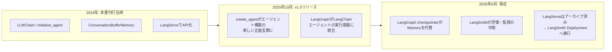

この移行の背景については、LangChain公式の設計思想の変遷が [langchain-philosophy ドキュメント](https://docs.langchain.com/oss/python/langchain-philosophy) で詳しく解説されています。要点は「LangChainは高レベルの使いやすいインターフェースを提供し、より細かい制御が必要になった開発者はLangGraphに降りていける」という二層構造の考え方です。またLangChain 0.3系は2026年12月まで **メンテナンスモード（セキュリティパッチのみ）** として継続サポートされる予定であり、旧APIから急いで移行する必要はないものの、新規プロジェクトでは1.0系の採用が推奨されています（[LangChain公式: リリースポリシー](https://docs.langchain.com/oss/python/release-policy)）。

---

## 参考文献・ソース一覧

本ガイドの作成にあたり、以下の情報源を参照しました。書籍の詳細情報は公式・著者本人の投稿を、2026年時点の技術動向は国際的に著名な開発者・企業の一次情報を優先して参照しています。

1. O'Reilly（Packt Publishing収録）書籍ページ「LangChain in your Pocket」 ― https://www.oreilly.com/library/view/langchain-in-your/9781836201250/
2. 著者 Mehul Gupta 氏によるDEV Community投稿（書籍出版のアナウンス） ― https://dev.to/mehulgupta7991/my-debut-book-langchain-in-your-pocket-is-out--7oc
3. Amazon書籍ページ（目次・Key Features） ― https://www.amazon.com/LangChain-your-Pocket-Generative-Applications-ebook/dp/B0CTHQHT25
4. LangChain公式ドキュメント「LangChain philosophy」（LangGraphへの統合の経緯） ― https://docs.langchain.com/oss/python/langchain-philosophy
5. LangChain公式ドキュメント「Release policy」（LTSとバージョン方針） ― https://docs.langchain.com/oss/python/release-policy
6. LangChain Reference「langchain_classic」（非推奨モジュール一覧） ― https://reference.langchain.com/python/langchain-classic/langchain_classic
7. Aurelio AI「LangChain Expression Language (LCEL)」解説 ― https://www.aurelio.ai/learn/langchain-lcel
8. uvik.net「LangChain vs LangGraph: A Senior Engineer's 2026 Decision Guide」 ― https://uvik.net/blog/langchain-vs-langgraph/
9. Educative「What Is create_agent?」 ― https://www.educative.io/courses/langchain-llm/what-is-create-agent
10. Atlan「What is LangChain? Open-Source AI Framework Explained (2026)」 ― https://atlan.com/know/ai-agent/ai-agent-memory/what-is-langchain/
11. FutureAGI「What is LangChain? A 2026 Production Engineer's Guide」 ― https://futureagi.com/blog/what-is-langchain/
12. LangServe 公式GitHubリポジトリ（非推奨・アーカイブ表示） ― https://github.com/langchain-ai/langserve
13. Enterprise DNA「LangServe: What Engineers Actually Found」実運用レビュー ― https://enterprisedna.co/resources/blog/practitioner-langserve-review
14. LangChain公式ブログ「2026年2月ニュースレター」（LangSmith新機能、Interrupt 2026） ― https://blog.langchain.com/febraury-2026-langchain-newsletter
15. Sequoia Capital「LangChain's Harrison Chase on Building the Orchestration Layer for AI Agents」 ― https://sequoiacap.com/?p=17611
16. Braintrust「Best Vector Databases for RAG in 2026」 ― https://www.braintrust.dev/articles/best-vector-databases-for-rag-2026
17. Dupple「Best Vector Databases in 2026: 8 Options Tested for RAG and Scale」 ― https://dupple.com/learn/best-vector-databases
18. Solguruz「Vector Database解説（2026年時点の市場動向）」 ― https://solguruz.com/generative-ai/vector-database/

---

*本ガイドはPackt Publishing刊行の書籍を要約・解説する二次的な学習資料であり、原著の全文を転載するものではありません。より詳細な内容やコード全文は、上記O'Reilly/Packtの公式書籍でご確認ください。*
