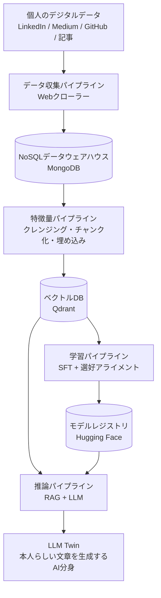
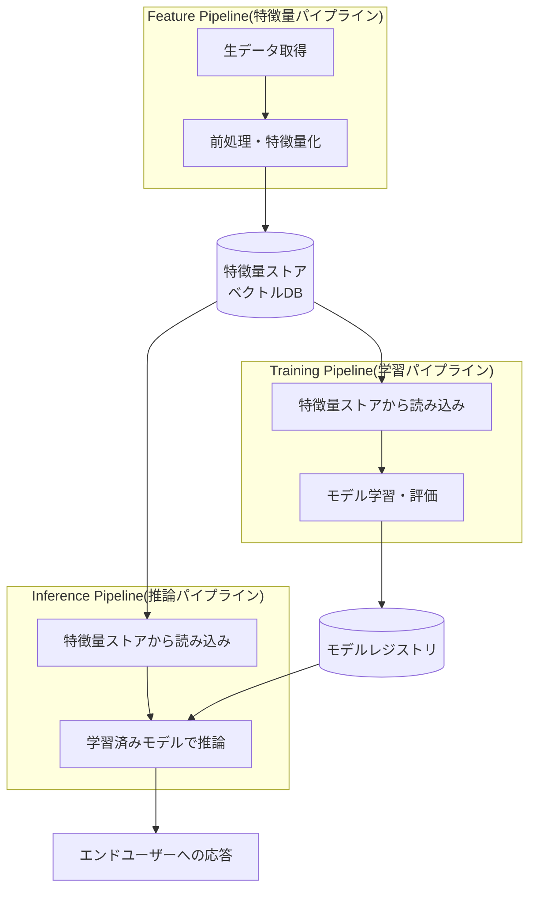
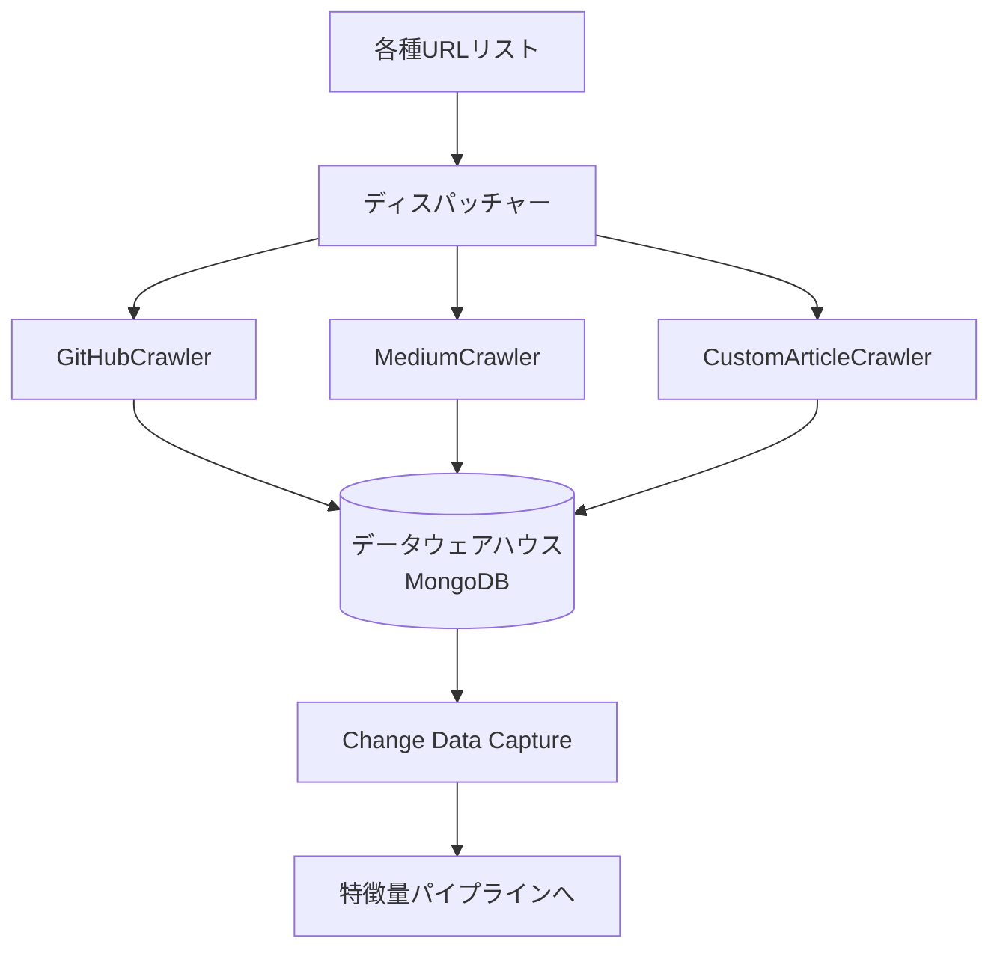
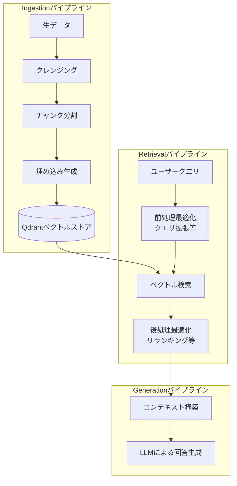
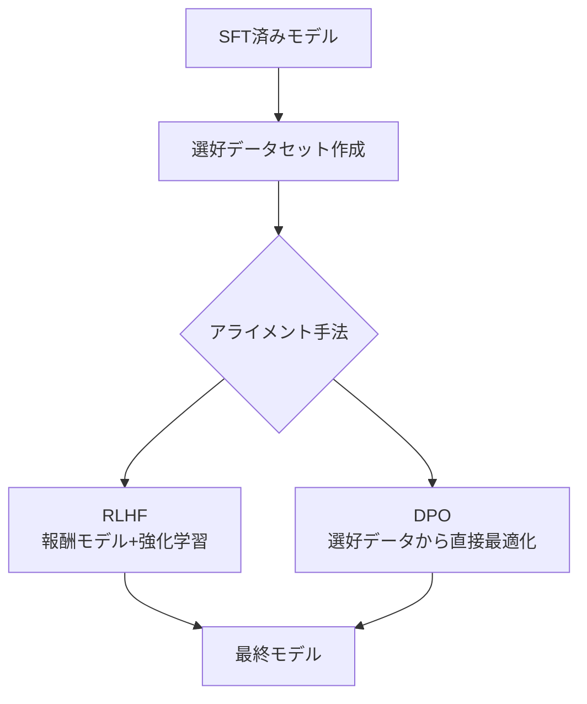
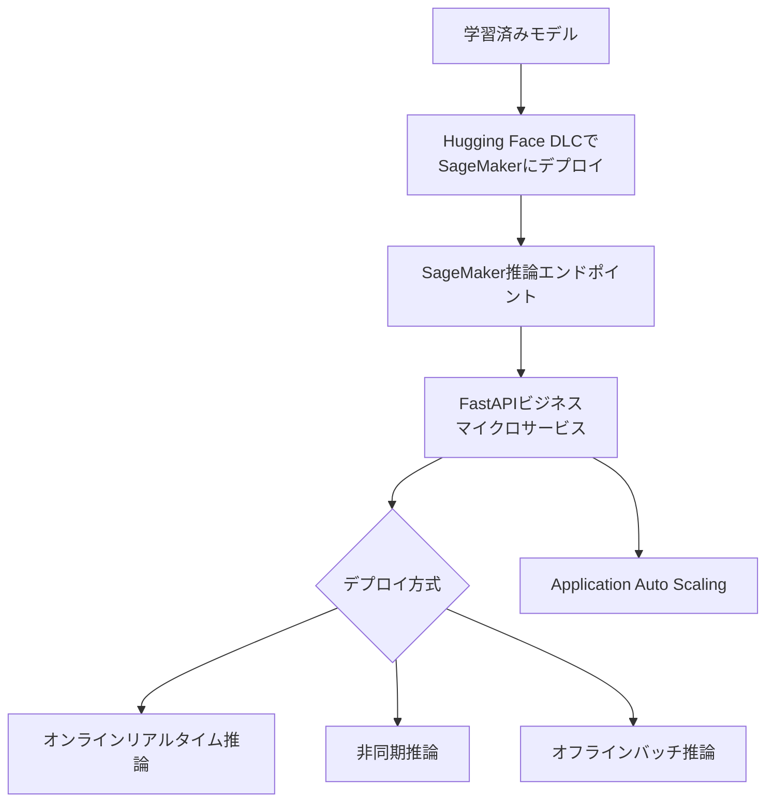
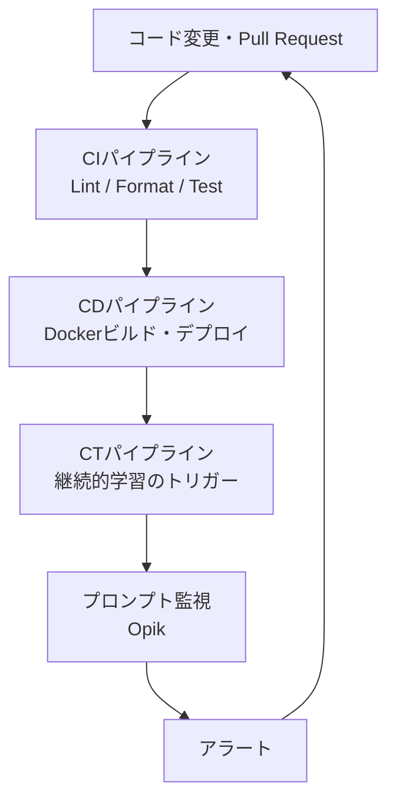
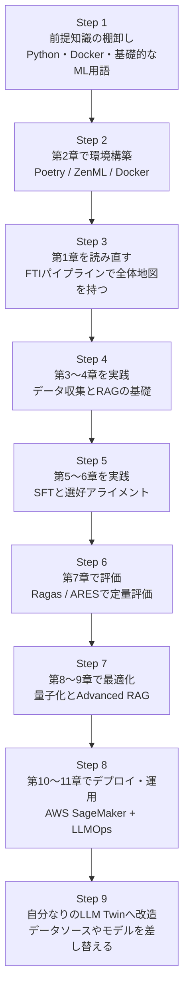

# 「LLM Engineer's Handbook」徹底解説ガイド ― 初学者のためのステップバイステップ入門

> 本書 **"LLM Engineer's Handbook"**(Paul Iusztin、Maxime Labonne 著、Packt Publishing、2024年10月刊)を、LLMエンジニアリングを学び始めたばかりの人でも迷わず全体像をつかめるよう、章立てに沿って噛み砕いて解説するガイドです。2026年9月9日時点の情報をもとに、O'Reilly公式ページ・GitHub公式リポジトリ・国際的に著名な開発者/著者による言及を調査し、末尾に出典URLをまとめています。

---

## 目次

1. [この本は何なのか ― 3行でつかむ](#この本は何なのか--3行でつかむ)
2. [書籍情報まとめ](#書籍情報まとめ)
3. [著者について](#著者について)
4. [なぜ話題になっているのか(評価・レビュー)](#なぜ話題になっているのか評価レビュー)
5. [全体像:「LLM Twin」という教材プロジェクト](#全体像llm-twinという教材プロジェクト)
6. [アーキテクチャの核:FTIパイプライン設計](#アーキテクチャの核ftiパイプライン設計)
7. [章立てで見る本書の構成(全11章+付録)](#章立てで見る本書の構成全11章付録)
8. [初学者向け・学習ロードマップ](#初学者向け学習ロードマップ)
9. [ハンズオン:公式GitHubリポジトリを動かす](#ハンズオン公式githubリポジトリを動かす)
10. [使用される主要ツール・サービス一覧](#使用される主要ツールサービス一覧)
11. [読む前に押さえておきたい前提知識](#読む前に押さえておきたい前提知識)
12. [よくある質問(FAQ)](#よくある質問faq)
13. [まとめ](#まとめ)
14. [参考文献・出典URL一覧](#参考文献出典url一覧)

---

## この本は何なのか ― 3行でつかむ

- **「LLM Twin」**と呼ばれる、自分の文章スタイルを模倣するAIアシスタントを、企画から本番デプロイまで一気通貫で作りながらLLMエンジニアリングを学ぶ実践書です。
- データ収集 → RAG(検索拡張生成) → ファインチューニング → 評価 → 推論最適化 → クラウドデプロイ → MLOps/LLMOps運用まで、**プロダクションレベルのLLMシステム開発の全工程**を1冊でカバーしています。
- 対象読者は「AIエンジニア・NLPエンジニア・LLM実務者」で、O'Reillyの公式ページでは難易度が **Intermediate to advanced(中級〜上級)** に位置づけられています。本ガイドは、その中級〜上級の内容を初学者でも道筋を見失わずに読み進められるよう、要所を補足しながら解説します。

---

## 書籍情報まとめ

| 項目 | 内容 |
|---|---|
| タイトル | *LLM Engineer's Handbook: Master the art of engineering large language models from concept to production* |
| 著者 | Paul Iusztin、Maxime Labonne |
| 出版社 | Packt Publishing |
| 出版年月 | 2024年10月 |
| ページ数 | 522ページ(音声版で約12時間55分) |
| 難易度 | Intermediate to advanced(中級〜上級) |
| 言語 | 英語 |
| ISBN-13 | 978-1-83620-007-9 |
| 公式書籍ページ | [O'Reilly](https://www.oreilly.com/library/view/llm-engineers-handbook/9781836200079/) |
| コード配布 | [GitHub: PacktPublishing/LLM-Engineers-Handbook](https://github.com/PacktPublishing/LLM-Engineers-Handbook)(MITライセンス、本書刊行後も継続的にメンテナンスされている) |
| GitHubスター数の目安 | 5,000+ ⭐ / フォーク1,200+ (Trendshiftでも人気リポジトリとして紹介) |

---

## 著者について

本書の信頼性を測るうえで、著者の実務背景は重要な手がかりです。

| 著者 | プロフィール |
|---|---|
| **Paul Iusztin** | シニアAIエンジニア。ニュースレター/知見発信プラットフォーム **Decoding ML(Decoding AI)** の創設者で、プロダクション品質のML/AIシステムの設計・実装・デプロイについて発信を続けている。本書のベースとなったオープンソース教材「LLM Twin」コースの考案者でもある。10年以上のAI/ソフトウェア実務経験を持つ。 |
| **Maxime Labonne** | Liquid AI の **Head of Post-Training**(Senior Staff Machine Learning Scientist)。パリ理工科大学(Polytechnic Institute of Paris)で機械学習の博士号を取得し、Google Developer Expert(AI/ML分野)にも認定されている。GitHub上で8万スター超を集める人気教材「**LLM Course**」の作者としても国際的に広く知られており、書籍『Hands-On Graph Neural Networks Using Python』(Packt)の著者でもある。 |

両著者とも、単なる理論解説者ではなく、実際に本番運用されるAI/LLMシステムを構築してきた実務家である点が本書の特徴です。

---

## なぜ話題になっているのか(評価・レビュー)

国際的に著名なAI/ML関係者や、影響力のあるテック系メディア・著者による言及を集めました。

- **Hugging Face 共同創業者兼CTO Julien Chaumond** は、本書について「LLMを使うだけでなく、適応・ファインチューニング・量子化し、実世界で効率よく動かせるレベルまで人々を導く一冊」と高く評価するコメントを寄せています(出典:出版社掲載の推薦文)。
- セキュリティ/IT専門メディア **Help Net Security** のレビュー(2025年7月、Mirko Zorz氏執筆)では、本書がFTI(feature/training/inference)パイプライン設計を軸に、現実的な計算リソース制約(小規模チーム・限られたGPU)を前提とした実務的なロードマップを提示している点を評価しつつ、「初心者向けの入門書ではなく、LLM・ベクトルDB・MLOpsパターンにある程度慣れている読者を想定している」と率直に指摘しています。
- テック系ブログメディア **Javarevisited**(35,000人超のフォロワーを持つ著名執筆者 javinpaul 氏)によるレビュー(2025年6月)では、本書が **1万部以上** 販売されている実績を紹介し、「LangChainの使い方を教えるだけでなく、AIプロダクトアーキテクトとしての思考法を教えてくれる」と評しています。
- 学習コミュニティ **DataTalks.Club**(データエンジニアリング/ML教育で著名なAlexey Grigorev氏が運営)では、本書が「Book of the Week」として紹介されています。
- RAG/LLMアプリケーション開発の分野で著名なエンジニア **duarteocarmo** 氏が公開したおすすめリソース集(GitHub Gist)には、Jason Liu氏やSimon Willison氏、Ben Clavié氏といった国際的に著名なLLM/RAG実務者の発信と並んで、本書が実践的リソースの一つとして掲載されています。
- LLM関連リソースのキュレーションリポジトリ **SylphAI-Inc/LLM-engineer-handbook**(READMEで言及)では、本書が Andrej Karpathy氏の講義や Sebastian Raschka氏・Chip Huyen氏の著作と並んで、LLMライフサイクル(学習・提供・ファインチューニング・アプリ構築)を学ぶための代表的な書籍として紹介されています。
- 書評まとめサイト **awesome-llm-books**(Jason Brownlee氏)によると、Amazonレーティングは4.6、Goodreadsレーティングは3.85となっています(2026年9月時点の調査ベース)。

総じて「理論に寄りすぎず、かといって薄いチュートリアルでもない、"本番稼働するLLM製品をどう設計するか"に主眼を置いた実務書」という評価が国際的に一致している点が特徴です。

---

## 全体像:「LLM Twin」という教材プロジェクト

本書は終始一貫して、**「LLM Twin」**(自分の文章スタイルを模倣するAI分身)という1つの具体的プロダクトを題材に進みます。単なるチャットボットのラッパーではなく、「なぜChatGPTをそのまま使うのではダメなのか」という問いから出発し、以下のようなMVP(Minimum Viable Product)を、実際に手を動かしながら構築していく構成です。

このように「個人の書いたもの」を集め、検索可能な形に整え、モデルを微調整し、最終的に本人らしい文章を生成するAPI/サービスとして提供する、というエンドツーエンドの流れそのものが本書の教材になっています。

なお、このデータ収集パイプラインで扱ってよいのは、**自分が著作権を持つコンテンツか、利用許諾を得たコンテンツに限られます**。LLM Twinは「自分の分身」を作る題材であり、他人のアカウントや第三者の投稿を無断で収集する用途を想定していません。実際にクローラーを動かす前に、少なくとも以下を確認してください。

- **各サービスの利用規約（ToS）とrobots.txt**: LinkedInなど、自動収集を規約で明確に禁止・制限しているサービスがあります。自分のアカウントのデータであっても、取得方法（スクレイピング可否、公式APIやデータエクスポート機能の利用）に制約がかかる場合があります
- **レート制限**: 短時間に大量アクセスを行うとサービス側に負荷をかけ、アカウント停止やIPブロックの対象になります。リクエスト間隔を空け、取得件数に上限を設ける
- **保存期間**: 収集した生データをいつまで保持するかをあらかじめ決め、不要になったデータは削除する
- **第三者の個人情報**: 自分の投稿であっても、コメント欄や本文に他人の氏名・連絡先などが含まれることがあります。学習データに混入させない、または取り込み時にマスキングする方針を決めておく

---

## アーキテクチャの核:FTIパイプライン設計

本書の設計思想で最も重要なのが、第1章で導入される **FTI(Feature / Training / Inference)パイプラインアーキテクチャ**です。これは「1つの巨大なMLシステム」を作るのではなく、役割ごとに3種類の独立したパイプラインに分割し、それぞれが疎結合な形でデータをやり取りする設計パターンです。

**FTI設計のメリット**として本書が挙げているのは、大きく以下の点です。

- 各パイプラインを **異なるチーム・異なる言語・異なるインフラで独立して開発・スケールできる**こと
- 「特徴量ストア」と「モデルレジストリ」という共有の受け渡し場所(インターフェース)さえ守れば、内部実装を自由に差し替えられること
- 学習用データと推論用データの取得ロジックを共通化でき、**学習・推論間のデータの不整合(training-serving skew)を防ぎやすい**こと

このFTIパターンは、本書全体を通じて「なぜこの章でこのツールを使うのか」を理解するための地図として繰り返し参照されます。

---

## 章立てで見る本書の構成(全11章+付録)

本書は全11章+付録1本で構成されています。以下、各章の狙いを初学者向けに要約します。

| 章 | タイトル(原題) | この章で学ぶこと |
|---|---|---|
| 1 | Understanding the LLM Twin Concept and Architecture | LLM Twinとは何か、MVPの定義、FTIパイプラインによるシステム設計の全体像 |
| 2 | Tooling and Installation | Poetry・ZenML・Comet ML・Opik・MongoDB・Qdrant・AWSなど、本書全体で使う開発環境のセットアップ |
| 3 | Data Engineering | GitHub/Medium/カスタム記事のクローラー実装、NoSQLデータウェアハウスへの格納 |
| 4 | RAG Feature Pipeline | RAGの基礎理論、埋め込み(embeddings)、ベクトルDBの仕組み、Advanced RAGの前処理・後処理最適化 |
| 5 | Supervised Fine-Tuning | 指示データセット(instruction dataset)の作り方、LoRA/QLoRAなどのPEFT手法 |
| 6 | Fine-Tuning with Preference Alignment | 選好データセットの作り方、RLHFとDPO(Direct Preference Optimization) |
| 7 | Evaluating LLMs | 汎用評価/ドメイン別評価/タスク別評価、RAG評価ツール(Ragas, ARES)を使った実測 |
| 8 | Inference Optimization | KVキャッシュ、Continuous Batching、Speculative Decoding、モデル並列化、量子化(GGUF/GPTQ/EXL2) |
| 9 | RAG Inference Pipeline | クエリ拡張・Self-Querying・フィルタ付きベクトル検索・リランキングによるAdvanced RAGの実装 |
| 10 | Inference Pipeline Deployment | AWS SageMakerへのモデルデプロイ、FastAPIによるマイクロサービス化、オートスケーリング |
| 11 | MLOps and LLMOps | DevOps→MLOps→LLMOpsの発展、CI/CD/CTパイプライン、プロンプト監視、アラート設計 |
| 付録 | MLOps Principles | 自動化・バージョニング・実験管理・テスト・監視・再現性という6原則の総まとめ |

### 第1章:LLM Twinの概念とアーキテクチャ理解

なぜ既存のチャットボット(ChatGPTなど)をそのまま使うのではなく、自分専用のLLMシステムを構築する意味があるのかという「Why」から始まり、MVPの要件定義、そして前述のFTIパイプライン設計に落とし込むまでの思考プロセスを学びます。ここで学ぶ設計原則は、以降のすべての章の土台になります。

### 第2章:ツールとインストール

本書の実装は特定の技術スタックに強く依存しているため、この章で環境を整えることが後続章をスムーズに進める鍵になります。Poetry(依存関係管理)、Poe the Poet(タスクランナー)、ZenML(オーケストレーション)、Comet ML(実験管理)、Opik(プロンプト監視)、MongoDB(NoSQL)、Qdrant(ベクトルDB)、AWS CLI/SageMakerのセットアップまでを一通り扱います。

### 第3章:データエンジニアリング

LinkedIn・Medium・GitHub・個人ブログなど複数ソースから、それぞれ異なる形式のデータをクロールするための「ディスパッチャー + クローラー」パターンを実装します。取得したデータはODM(Object-Document Mapping)パターンを使ってMongoDBに正規化して保存されます。Webクローリング特有のトラブルシューティング(Seleniumのエラー対応など)も扱われます。

### 第4章:RAG特徴量パイプライン

RAG(Retrieval-Augmented Generation)がなぜ必要か(ハルシネーション対策、情報の鮮度対策)という基礎から始まり、埋め込み・ベクトルDBの仕組み、そして「Vanilla RAG」から一段進んだ **Advanced RAG**(前処理・検索・後処理それぞれの最適化)まで体系的に解説されます。実装面では、ZenMLパイプラインでクリーニング→チャンク化→埋め込み→ベクトルDB格納までを行います。

### 第5章:教師ありファインチューニング(SFT)

質の高い指示データセットをどう作るか(データ量・データキュレーション・重複排除・データ汚染除去・データ品質評価)を丁寧に扱ったうえで、いつファインチューニングすべきか、チャットテンプレートの扱い方、そしてLoRA・QLoRAといったパラメータ効率の良いファインチューニング手法(PEFT)を実装します。

| 手法 | 概要 | 特徴 |
|---|---|---|
| フルファインチューニング | モデルの全パラメータを更新 | 表現力は最も高いが、計算・メモリコストが非常に大きい |
| LoRA | 低ランク行列のみを追加学習 | 計算・メモリ効率が良く、元モデルの重みは凍結したまま扱える |
| QLoRA | LoRA + 4bit量子化などを組み合わせ | 非常に限られたVRAMでも学習が可能になる |

### 第6章:選好アライメントによるファインチューニング

SFTだけでは「文法的に正しいが人間の好みに沿わない」出力になりがちな問題に対し、選好データセット(どちらの回答がより好ましいかのペア)を作成し、**RLHF(Reinforcement Learning from Human Feedback)** と **DPO(Direct Preference Optimization)** という2つのアライメント手法を比較しながら、実際にDPOを実装してTwinLlama-3.1-8Bモデルを仕上げます。

### 第7章:LLMの評価

従来のML評価とLLM評価の違いを整理したうえで、汎用LLM評価・ドメイン特化評価・タスク特化評価という3レイヤーで評価手法を体系化しています。RAGパイプラインの評価には **Ragas** や **ARES** といった専用フレームワークを使い、実際に自分たちが作ったTwinLlama-3.1-8Bモデルの回答を生成・評価・分析するところまで実践します。

### 第8章:推論最適化

学習が終わったモデルを、実際に低遅延・高スループットで動かすための最適化技術を扱います。KVキャッシュ、Continuous Batching、Speculative Decoding、そしてデータ並列/パイプライン並列/テンソル並列といったモデル並列化に加え、GGUF(llama.cpp向け)・GPTQ・EXL2という量子化手法を比較します。

| 量子化手法 | 特徴 |
|---|---|
| GGUF + llama.cpp | CPU推論・ローカル実行に強く、汎用性が高い |
| GPTQ | GPU推論向けで、比較的高精度な量子化アルゴリズム |
| EXL2 | 可変ビット量子化。ExLlamaV2エンジン向けに最適化 |

### 第9章:RAG推論パイプライン

第4章で扱ったRAGの基礎を踏まえ、実際の推論時に効くAdvanced RAGテクニックを実装します。前処理側では **クエリ拡張** と **Self-Querying**、検索側では **フィルタ付きベクトル検索**、後処理側では **リランキング** を組み合わせ、それらを1本のRAG推論パイプラインとして統合します。

### 第10章:推論パイプラインのデプロイ

「オンラインのリアルタイム推論」「非同期推論」「オフラインのバッチ推論」という3つのデプロイ方式それぞれの特徴と使い分け、さらに「モノリシック」対「マイクロサービス」というモデル提供アーキテクチャの選び方を整理したうえで、実際に **AWS SageMaker** へLLMマイクロサービスをデプロイし、**FastAPI** でビジネスロジック側のサービスを構築、オートスケーリング設定まで行います。

### 第11章:MLOpsとLLMOps

DevOps→MLOps→LLMOpsという概念の発展の歴史を整理し、人間からのフィードバック・ガードレール・プロンプト監視といったLLMOps特有の要素を導入します。実装面では、LLM Twinの各パイプラインをクラウド(MongoDB・Qdrant・ZenML Cloud・Docker・AWS)にデプロイし、GitHub ActionsでCI(継続的インテグレーション)・CD(継続的デリバリー)・CT(継続的学習トリガー)を組み上げます。

### 付録:MLOpsの原則

自動化(オペレーション化)、バージョニング、実験管理、テスト、監視、再現性という6つの原則を、本編の実装に紐づけながら総まとめする章です。監視についてはログ・メトリクス(システム/モデル)・ドリフト検知・アラートまで細かく整理されています。

---

## 初学者向け・学習ロードマップ

522ページというボリュームと「中級〜上級」という難易度表示に圧倒されず読み進めるための、おすすめの学習順序です。

**ポイント**:第2章(環境構築)を後回しにせず先に済ませておくと、第3章以降の「実際に手を動かす」パートで詰まりにくくなります。また、AWSやOpenAI APIの利用は従量課金のため、GitHub公式リポジトリのREADMEでは一通り実行した場合のコストが**おおよそ25米ドル程度**(主にAWS SageMakerでの学習・推論費用)になると案内されています。予算感を把握したうえで進めることをおすすめします。

---

## ハンズオン:公式GitHubリポジトリを動かす

本書のコードは [PacktPublishing/LLM-Engineers-Handbook](https://github.com/PacktPublishing/LLM-Engineers-Handbook) で公開されており、書籍刊行後も継続的にメンテナンスされています(書籍本文とコードに差異がある場合は、常にこのリポジトリが最新版として優先されます)。

### ローカル環境の依存関係

| ツール | バージョン目安 | 用途 |
|---|---|---|
| pyenv | 2.3.36以上(任意) | 複数のPythonバージョン管理 |
| Python | 3.11 | ランタイム環境 |
| Poetry | 1.8.3以上、2.0未満 | パッケージ管理 |
| Docker | 27.1.1以上 | コンテナ化・ローカルインフラ |
| Google Chrome / Chromium | Seleniumドライバと互換のバージョン | データ収集パイプラインのブラウザ自動操作 |
| AWS CLI | 2.15.42以上 | クラウド管理 |
| Git | 2.44.0以上 | バージョン管理 |

### セットアップの流れ(概要)

1. リポジトリをクローンする:`git clone https://github.com/PacktPublishing/LLM-Engineers-Handbook.git`
2. クローンしたリポジトリへ移動する:`cd LLM-Engineers-Handbook`(以降のPoetryコマンドと`.env`の読み込みは、すべてこのディレクトリ内で実行する)
3. Python 3.11環境を用意する(pyenv推奨)
4. Poetryで依存関係をインストールする:`poetry env use 3.11` → `poetry install --without aws` → `poetry run pre-commit install`
5. `.env.example` を `.env` にコピーし、OpenAI APIキー・Hugging Faceトークン・Comet APIキーなどの認証情報を設定する。**`.env` は `.gitignore` で除外されていることを必ず確認し、コミットも共有も絶対に行わない**(APIキーが第三者に渡ると不正利用や課金事故に直結する)
6. `poetry poe local-infrastructure-up` でMongoDB・Qdrant・ZenMLのローカルインフラを起動する
7. データ収集パイプラインを動かす前に、**Google ChromeまたはChromiumを導入する**。`MediumCrawler` が継承する `BaseSeleniumCrawler` は `webdriver.Chrome` を使うため、対応ブラウザが無いとクロールが起動時に失敗する。なお **`LinkedInCrawler` は非推奨（deprecated）であり、既定では利用できません**。同クラスは `is_deprecated=True` が設定されており、`login()` と `extract()` は `DeprecationWarning` を送出して処理を行いません。LinkedInを収集対象として前提にした手順は組まず、サポートされているデータソース（Medium・GitHub・個人ブログなど）で進めてください（LinkedInの自動収集は利用規約上の制約もあります。前述の「データ収集時の注意」を参照）。
   - ローカルで動かす場合: macOSは `brew install --cask google-chrome`、Debian/Ubuntuは公式パッケージの `google-chrome-stable` を導入する（ChromeDriver自体は手動導入不要。`llm_engineering.application.crawlers.base` の `chromedriver_autoinstaller.install()` が、インストール済みChromeのバージョンに対応するChromeDriverを自動取得する。ただしこの取得は `BaseSeleniumCrawler` の **import 時点** に走り、手元に該当バージョンのChromeDriverが無ければ**外部ネットワークからダウンロードする**。オフライン環境やプロキシで外部通信が制限された環境では import の時点で失敗するため、対応するChromeDriverを事前に配置するか、キャッシュ済みの状態にしておく必要がある）
   - 環境を汚したくない場合: リポジトリ同梱の公式Dockerfile（`google-chrome-stable` を含む）でパイプラインを実行する。`poetry poe build-docker-image` でイメージをビルドし、続けて `poetry poe run-docker-end-to-end-data-pipeline` でエンドツーエンドのデータパイプラインをコンテナ内で実行する（後者は `.env` を読み込むため、手順5を先に済ませておく）
8. データ収集 → 特徴量エンジニアリング → 指示データセット生成 → 選好データセット生成、という順にZenMLパイプラインを実行する
9. AWS SageMakerを使う場合は、`poetry install --with aws` で追加インストールしたうえで、**デプロイ前にAWS側の設定を済ませる**:
   - **ブートストラップ（一時的な管理者権限）**：`aws configure` で管理者相当の認証情報を設定し、SageMakerの実行ロール（execution role）を作成する。この管理者キーの用途はロール作成までに限定する
   - 作成した実行ロールのARNを `.env` の `AWS_ARN_ROLE` に設定し、`AWS_REGION`（例: `eu-central-1`）も設定する
   - **運用用の最小権限ユーザーを別途作成する**：SageMakerの学習・デプロイ・推論に必要な権限のみを付与したIAMユーザーを作成してアクセスキーを発行し、`.env` の `AWS_ACCESS_KEY` と `AWS_SECRET_KEY` をそのユーザーの値に置き換える（管理者キーを `.env` に残さない）
   - **ブートストラップ用の管理者キーは無効化または削除する**。以降の操作は最小権限ユーザーの認証情報だけで行う
   - 手順の詳細は公式リポジトリのセットアップ手順（[README.md](https://github.com/PacktPublishing/LLM-Engineers-Handbook/blob/main/README.md)）を参照する
   - 以上を済ませてから、学習・評価・推論エンドポイントのデプロイに進む

### プロジェクト構成の考え方

コードは **ドメイン駆動設計(DDD)** の思想に基づき、`domain/`(コアなビジネスエンティティ)→`application/`(クローラーやRAGなどのビジネスロジック)→`model/`(学習・推論)→`infrastructure/`(AWS・Qdrant・MongoDB・FastAPIなど外部サービス連携)という層に分割されています。パイプライン全体の入口は `pipelines/` ディレクトリのZenMLパイプライン定義であり、迷ったときはまずここから読むのが公式README推奨のアプローチです。

---

## 使用される主要ツール・サービス一覧

| カテゴリ | ツール/サービス | 役割 |
|---|---|---|
| 依存関係管理 | Poetry | Python仮想環境・パッケージ管理 |
| タスク実行 | Poe the Poet | プロジェクトコマンドのタスクランナー |
| オーケストレーション | ZenML | MLパイプライン・アーティファクト・メタデータの管理 |
| 実験管理 | Comet ML | 学習実験のトラッキング |
| プロンプト監視 | Opik(Comet提供) | LLMアプリのプロンプト・トレース監視 |
| モデルレジストリ | Hugging Face | 学習済みモデル・データセットの保存/共有 |
| NoSQL DB | MongoDB | クロールした生データの格納(データウェアハウス) |
| ベクトルDB | Qdrant | 埋め込みベクトルの格納・検索 |
| クラウド計算基盤 | AWS(SageMaker等) | モデルの学習・推論の計算リソース |
| CI/CD | GitHub Actions | Lint・テスト・ビルド・デプロイの自動化 |

---

## 読む前に押さえておきたい前提知識

O'Reilly公式ページでは「Python・AWS・一般的なAIの概念にある程度慣れていること」が想定読者像として挙げられており、Help Net Securityのレビューでも「LLMの概念・ベクトルDB・MLOpsパターンに一定の土地勘があることを前提にしている」と指摘されています。次の3点に不安がある場合は、並行して基礎を補うことをおすすめします。

- **Python実務経験**:型ヒント、パッケージ管理(Poetry)、非同期処理・REST APIの基礎的な読み書きができるレベル
- **クラウドの基礎**:AWSアカウント作成、IAMユーザー・アクセスキーの概念、従量課金への理解
- **機械学習・LLMの基礎用語**:ファインチューニング、埋め込み(embedding)、ベクトル検索、プロンプトといった用語に一度でも触れたことがある状態

これらの前提知識を補いたい場合、著者の一人であるMaxime Labonne氏が公開している無料の **「LLM Course」**(GitHub上で8万スター超)は、LLMの基礎からファインチューニング・量子化までをロードマップ形式で学べる教材として、本書と併読する形で参照されることが多い教材です。

---

## よくある質問(FAQ)

**Q. プログラミング初心者でもいきなり読めますか?**
A. 本書自体はO'Reillyの表示どおり「中級〜上級」向けであり、Pythonの実務経験がまったくない状態でいきなり全章を実装するのは難易度が高めです。まずはPythonの基礎とAPI/クラウドの基本概念を押さえたうえで、第1〜2章で全体設計とツール群を理解し、写経しながら第3章以降に進むのが挫折しにくい進め方です。

**Q. 高性能なGPUを持っていなくても実践できますか?**
A. 学習・推論はAWS SageMaker上で行う設計になっており、ローカルに強力なGPUがなくても進められます。ただしAWSやOpenAI APIは従量課金のため、公式リポジトリのREADMEでは一通り実行した場合のコスト目安として**約25米ドル**が案内されています。

**Q. 日本語で読めるバージョンはありますか?**
A. 2026年9月時点で調査した範囲では、原著は英語版のみの提供です(O'Reilly上の書誌情報でも言語表示は英語)。

**Q. この本と、実務でよく聞く「LLMOps」はどう関係していますか?**
A. 第11章がまさにLLMOpsの章にあたり、DevOps→MLOps→LLMOpsという発展の流れと、人間フィードバック・ガードレール・プロンプト監視といったLLM特有の運用要素を、本書のLLM Twinプロジェクトに実装する形で学べます。

**Q. 本を読まずにGitHubリポジトリだけ動かすことはできますか?**
A. 技術的には可能ですが、公式READMEでも「Chapter 2で各ツールの解説、Chapter 10・11で環境構築のステップバイステップ手順を説明している」と案内されているとおり、書籍本文がセットアップ手順の解説を兼ねているため、つまずいたときは該当章を参照するのがスムーズです。

---

## まとめ

「LLM Engineer's Handbook」は、単なるプロンプトエンジニアリング入門や理論書ではなく、**「LLM Twin」という1つの具体的な製品を、FTIパイプラインという明確な設計原則のもとで、データ収集からファインチューニング・評価・推論最適化・クラウドデプロイ・LLMOps運用まで一気通貫で作り切る**、非常に実務密着型の一冊です。Hugging Face CTO Julien Chaumond氏の推薦や、著名なLLM/RAG実務者のリソース集への掲載、GitHub公式リポジトリの活発な運用状況などからも、国際的なAI/ML実務者コミュニティで高く評価されていることがうかがえます。

一方で複数のレビューが指摘するとおり、対象読者は中級〜上級エンジニアであり、Python・クラウド・LLM/ベクトルDBの基礎知識がある程度求められます。本ガイドで示したロードマップのように、環境構築(第2章)→全体設計の理解(第1章)→データ・RAG(第3〜4章)→学習(第5〜6章)→評価(第7章)→最適化(第8〜9章)→デプロイ・運用(第10〜11章)という順序で、公式GitHubリポジトリのコードを実際に手元で動かしながら読み進めることで、初学者でも着実に本書の価値を引き出せるはずです。

---

## 参考文献・出典URL一覧

- O'Reilly公式書籍ページ(目次・概要・著者紹介):
  https://www.oreilly.com/library/view/llm-engineers-handbook/9781836200079/
- 公式GitHubリポジトリ(コード・README・セットアップ手順):
  https://github.com/PacktPublishing/LLM-Engineers-Handbook
- Amazon書籍ページ:
  https://www.amazon.com/LLM-Engineers-Handbook-engineering-production/dp/1836200072/
- Packt公式製品ページ:
  https://www.packtpub.com/en-us/product/llm-engineers-handbook-9781836200062
- Help Net Security によるレビュー(Mirko Zorz氏、2025年7月28日):
  https://www.helpnetsecurity.com/2025/07/28/review-llm-engineers-handbook/
- Javarevisited(Medium)によるレビュー(javinpaul氏、2025年6月20日):
  https://medium.com/javarevisited/review-is-the-llm-engineers-handbook-by-paul-iusztin-and-maxime-labonne-worth-it-7d075148c2bc
- awesome-llm-books(Jason Brownlee氏キュレーション、Hugging Face CTO Julien Chaumond氏の推薦文・評価スコアを収録):
  https://github.com/Jason2Brownlee/awesome-llm-books/blob/main/books/llm-engineer's-handbook.md
- SylphAI-Inc/LLM-engineer-handbook(著名開発者の関連リソースと並んでの紹介):
  https://github.com/SylphAI-Inc/LLM-engineer-handbook
- duarteocarmo氏によるLLM/RAGおすすめリソース集(GitHub Gist):
  https://gist.github.com/duarteocarmo/bc9365ac63744234f5030b87f912669e
- DataTalks.Club「Book of the Week」紹介ページ:
  https://datatalks.club/books/20241104-llm-engineer-s-handbook.html
- Paul Iusztin氏 GitHubプロフィール(Decoding ML/Decoding AI創設者としての経歴):
  https://github.com/iusztinpaul
- Maxime Labonne氏 GitHubプロフィール(Liquid AI Head of Post-Training、LLM Courseの作者としての経歴):
  https://github.com/mlabonne
- Maxime Labonne氏「LLM Course」(GitHub、8万スター超):
  https://github.com/mlabonne/llm-course
- 学習済みモデル(TwinLlama-3.1-8B-DPO、Hugging Face):
  https://huggingface.co/mlabonne/TwinLlama-3.1-8B-DPO

*本ガイドは上記ソースの内容を要約・翻訳・再構成したものであり、原文からの長文引用は行っていません。より正確・網羅的な情報は、必ず一次情報源(特にO'Reilly公式ページおよびGitHub公式リポジトリ)をご確認ください。*
