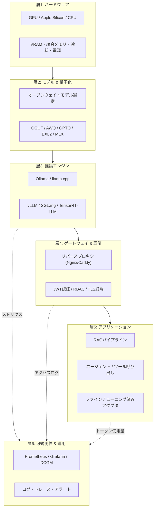
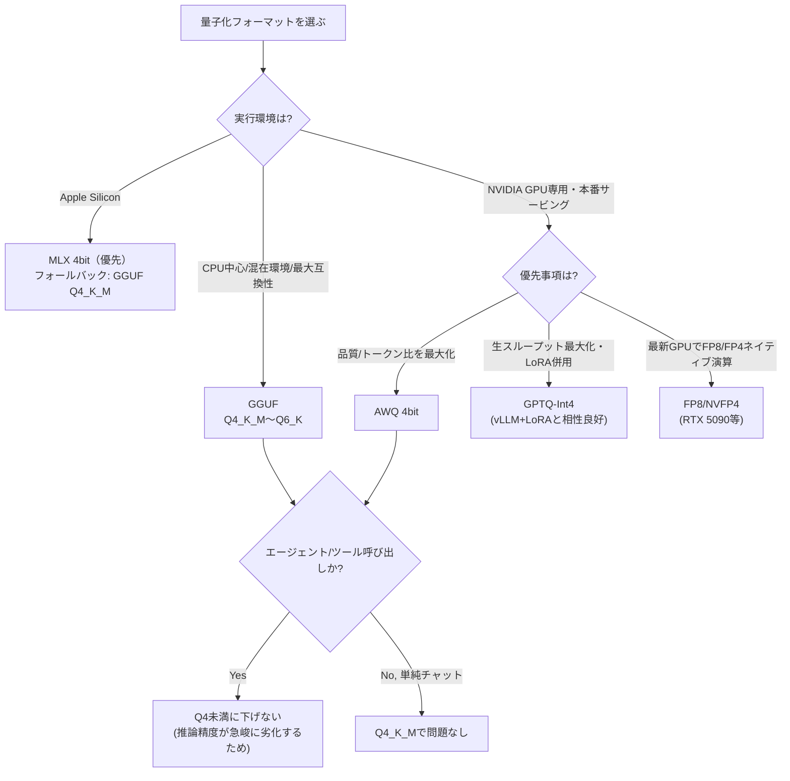
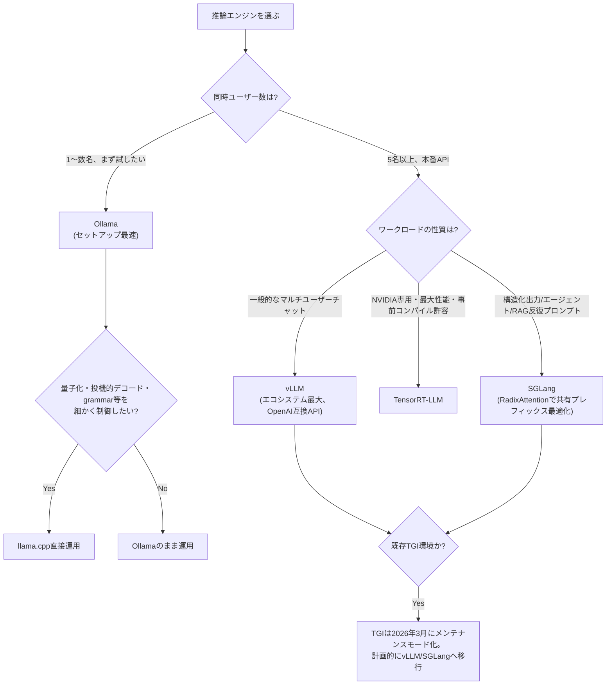
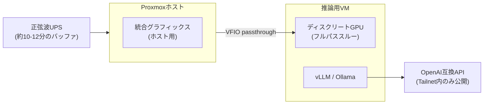
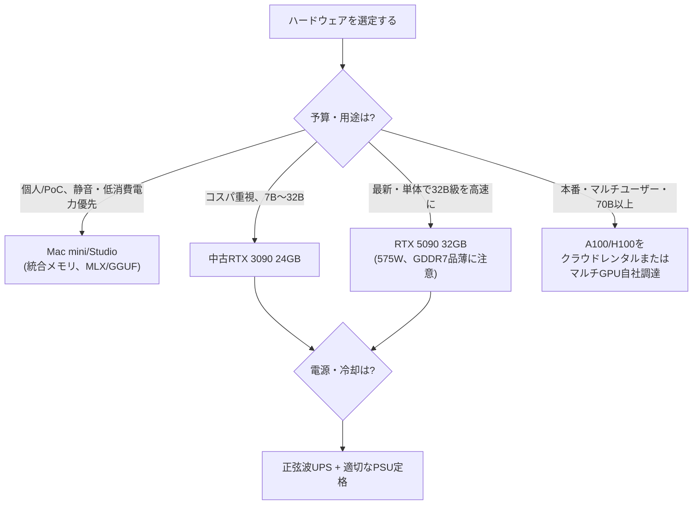
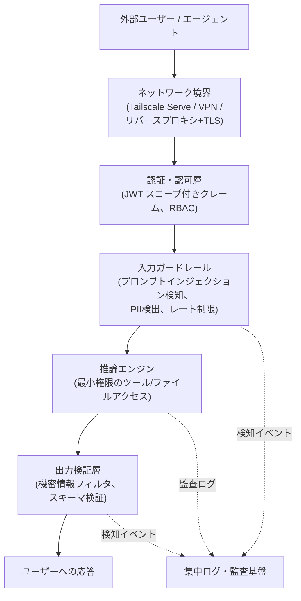
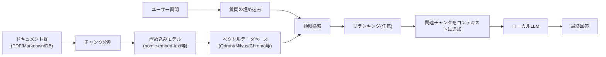
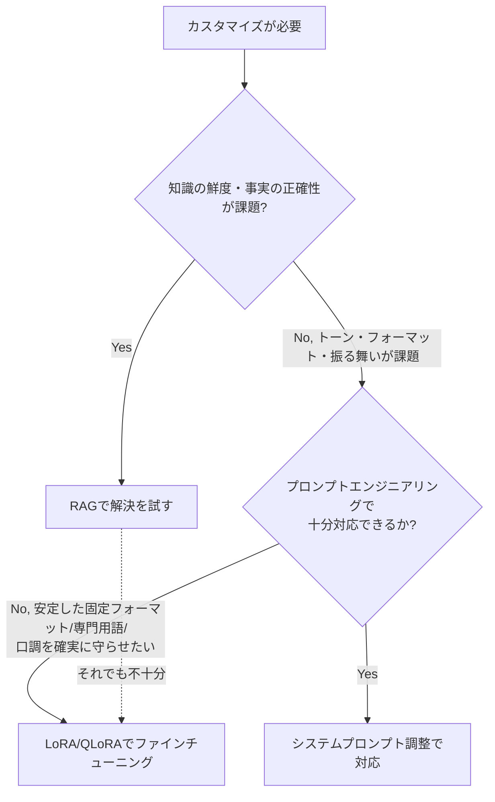
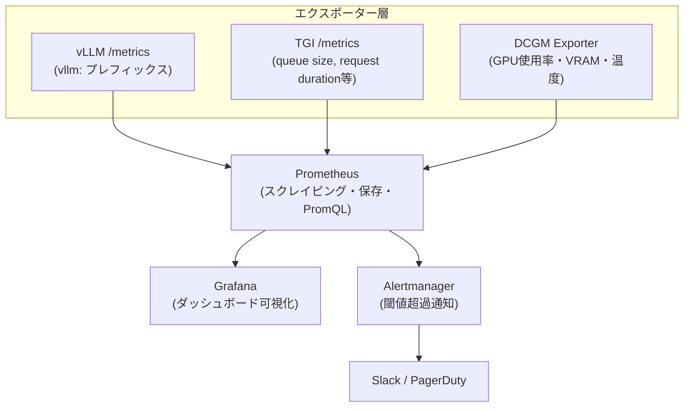
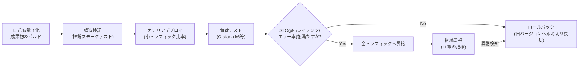

# ローカルLLM／セルフホスティング ベストプラクティスガイド（2026年版）

> 対象読者: 中級〜上級のAIエンジニア・プラットフォームエンジニア・MLOps担当者
> 前提知識: LLM推論の基礎、Linux/Docker操作、GPU/VRAMの基本概念
> 情報基準日: 2026年7月。ローカルLLMのエコシステムは変化が非常に速い分野のため、モデル名・バージョン番号・ベンチマーク数値は必ず一次情報（各プロジェクトの公式リポジトリ／リリースノート）で最新状況を確認してください。

---

## 目次

1. [はじめに：なぜ2026年にローカルLLMなのか](#1-はじめになぜ2026年にローカルllmなのか)
2. [全体アーキテクチャ](#2-全体アーキテクチャ)
3. [モデル選定のベストプラクティス](#3-モデル選定のベストプラクティス)
4. [量子化戦略](#4-量子化戦略)
5. [推論エンジンの選定](#5-推論エンジンの選定)
6. [ハードウェア設計](#6-ハードウェア設計)
7. [パフォーマンスチューニング](#7-パフォーマンスチューニング)
8. [セキュリティベストプラクティス](#8-セキュリティベストプラクティス)
9. [RAGパイプライン構築](#9-ragパイプライン構築)
10. [ファインチューニング（LoRA / QLoRA）](#10-ファインチューニングlora--qlora)
11. [監視・可観測性](#11-監視可観測性)
12. [デプロイメント運用パイプライン](#12-デプロイメント運用パイプライン)
13. [運用チェックリスト](#13-運用チェックリスト)
14. [まとめ](#14-まとめ)
15. [参考文献一覧](#15-参考文献一覧)

---

## 1. はじめに：なぜ2026年にローカルLLMなのか

クラウドAPIとセルフホスティングの間の品質ギャップは、2026年に入って急速に縮小しています。GLM-5.2やKimi K2.6/K2.7、DeepSeek-V4-Pro-Max、Qwen3.5/3.6といったオープンウェイトモデルは、Artificial Analysis Intelligence IndexやSWE-Bench Pro、LiveBenchといった独立系ベンチマークで、プロプライエタリモデルに迫る、あるいは特定タスク（コード生成・エージェント的タスク）では上回るスコアを記録するようになりました。

セルフホスティングを検討する動機は主に3つに整理できます。

- **データ主権・コンプライアンス**：機密データや個人情報を外部APIに送らずに処理したい（医療・金融・法務など規制業種、日本国内では薬機法対応が必要なケースも含む）
- **コスト構造の転換**：クラウドAPIはトークン従量課金のため利用量に比例してコストが増加する一方、セルフホスティングは初期GPU投資後の限界費用が低い。安定した高ボリュームworkloadほど自己ホスト化のメリットが大きい
- **レイテンシとカスタマイズ性**：ネットワーク往復がなくなることによる低遅延、およびLoRA/QLoRAによるドメイン特化

一方で、セルフホスティングは「導入すれば終わり」ではなく、継続的なパッチ適用・監視・チューニングを要する運用責務を伴います。本ガイドは、モデル選定からハードウェア設計、量子化、推論エンジン、セキュリティ、RAG、ファインチューニング、可観測性、デプロイ運用まで、実務で必要となる意思決定を一気通貫でカバーします。

> 実務上の指針：多くの組織にとって最適解は「オールインまたはオールアウト」の二択ではなく、**ハイブリッドアーキテクチャ**です。分類・抽出・機密データ処理などの高頻度・低複雑度タスクはローカルLLMに、複雑な多段推論や創造的タスクで品質が事業クリティカルな場合はフロンティアAPIに、という負荷分散が2026年の実践的な設計パターンとして定着しています。

---

## 2. 全体アーキテクチャ

ローカルLLMスタックは、以下の6層で構成するのが実務上の標準的なメンタルモデルです。



各層の意思決定は独立していません。例えば「層1でApple Siliconを選ぶ」ことは「層2でMLX/GGUFフォーマットに制約される」ことを意味し、「層3でSGLangを選ぶ」ことは「層5でRAG/エージェントワークロードのプレフィックス共有が多い場合に有利」という具合に、上流の選択が下流の選択肢を狭めます。本ガイドはこの層構造に沿って解説します。

参考: [LLM Hosting in 2026: Local, Self-Hosted and Cloud Infrastructure Compared](https://www.glukhov.org/llm-hosting/)

---

## 3. モデル選定のベストプラクティス

### 3.1 「ローカル級」モデルサイズの基準は毎年変わる

2026年時点で重要な認識は、**「ローカルグレード」とされるモデルサイズの基準が年々シフトしている**ことです。適切に量子化された32Bモデルが、2年前に70Bモデルが必要だったタスクをこなせるようになっています。これはMoE（Mixture-of-Experts）アーキテクチャの普及、学習データ・手法の改善、量子化技術の成熟が複合的に効いた結果です。

参考: [Self-Hosted LLM Guide: Costs, Architecture & Breakeven Point](https://alpacked.io/blog/self-hosted-llm-guide/)

### 3.2 VRAM階層別モデル推奨表（2026年中頃時点）

| VRAM階層 | 想定ハードウェア | 推奨モデル例 | 備考 |
|---|---|---|---|
| 8〜16GB | RTX 4060/4070、M-series ラップトップ | Qwen3.5-9B、Gemma 3 4B、Qwen2.5 7B | Qwen3.5-9BはQ4_K_Mで54〜58 tok/s、20万トークン超のコンテキストに対応という報告あり |
| 16〜24GB | RTX 3090/4090、M2 Pro/Max | Mistral Small 3.1 24B、Qwen2.5 Coder 32B(Q4) | 70Bを無理に4bit圧縮するより、24GBに収まる32B級の方が実用速度・品質で有利なケースが多い |
| 24〜48GB | RTX 5090、A6000、Mac Studio M4 Max 128GB | Llama 3.3 70B(量子化)、DeepSeek/Qwenの中型MoE | デュアルGPU構成も選択肢 |
| 48GB以上 | A100/H100、マルチGPU | GLM-5.2、Kimi K2.6/K2.7、DeepSeek-V3.2/V4、MiniMax M2.5/M3 | vLLM/SGLang等でのマルチGPU分散推論が前提 |

> 数値は各ソースのベンチマーク環境（GPU種別・量子化フォーマット・コンテキスト長）に依存するため目安として扱ってください。

参考:
- [Run DeepSeek & Qwen 2.5 Locally: The 2026 Self-Hosted Guide](https://createaiagent.net/self-hosted-llm/)
- [Best Local LLMs in 2026: Which Model Should You Run Locally?](https://whatllm.org/best-local-llm)
- [Self-Hosted LLM Guide: Costs, Architecture & Breakeven Point](https://alpacked.io/blog/self-hosted-llm-guide/)
- [Build a Home AI Server in 2026: Self-Hosted LLM Guide](https://www.digitalapplied.com/blog/home-ai-server-build-self-hosted-llm-2026-guide)

### 3.3 トップティア・オープンウェイトモデルの動向

エンタープライズ用途でトップクラスの性能を狙う場合、2026年前半〜中頃の独立ベンチマーク（Artificial Analysis Intelligence Index、SWE-Bench Pro、LiveBench）で上位に位置するモデル群は以下のような顔ぶれです。

| モデル | パラメータ規模 | 特徴 |
|---|---|---|
| GLM-5.2 | 744B級 | オープンウェイト分野でIntelligence Index・SWE-Bench Pro・LiveBench Coding/Agenticの複数指標で上位 |
| Kimi K2.6 / K2.7 Code | 1T級 | エージェント的安定性（長い試行での回復可能な失敗モード、一貫したツール呼び出し）に強み。Moonshot AIの技術資料ではサブエージェント数百規模の協調ワークフローも想定 |
| DeepSeek V3.2 / V4-Pro-Max | 685B級 | vLLM/SGLang/KTransformers/Transformersでのマルチ GPU 前提のセルフホスティング |
| MiniMax M2.5 / M3 | 230B級 | コーディング・エージェントタスクでのバランス型 |
| Qwen3.5 / Qwen3.6 | 397B〜27B(密) | サイズ展開が広く、9Bクラスの軽量モデルから大規模MoEまでカバー |

> 独立リーダーボードでのスコアが確定していないベンダー報告値も混在するため、意思決定前に必ず複数の独立ベンチマーク（LiveBench、Artificial Analysis等）を横断確認してください。また多くのモデルはApache 2.0またはMITライセンスでHugging Face上に公開され商用利用が可能ですが、モデルごとにライセンス条項（利用制限・帰属表示義務など）が異なるため、商用デプロイ前に必ずライセンス原文を確認してください。

参考:
- [Best Open Source Self-Hosted LLMs for Coding in 2026](https://pinggy.io/blog/best_open_source_self_hosted_llms_for_coding/)
- [Best Self-Hosted LLM Leaderboard 2026](https://onyx.app/self-hosted-llm-leaderboard)

---

## 4. 量子化戦略

### 4.1 「フォーマット」と「アルゴリズム」を混同しない

量子化を語るうえで最も多い誤解は、**GGUFが自己完結型のファイルフォーマットである一方、GPTQ・AWQは量子化アルゴリズムであり、その出力はHugging Face形式のsafetensorsとして保存される**という区別を曖昧にすることです。EXL2・MLXはそれぞれ単一のランタイムに強く紐づいたフォーマットです。この区別を持たずに「どれが一番いいか」を比較すると、ハードウェアに合わないフォーマットを選んでしまいます。

| フォーマット/手法 | 種別 | 対応ランタイム | 得意なハードウェア |
|---|---|---|---|
| GGUF | 自己完結型ファイルフォーマット | llama.cpp、Ollama、LM Studio、kobold.cpp | CPU、CPU+GPU混在、Apple Silicon、幅広い互換性 |
| GPTQ | 量子化アルゴリズム（校正データ使用） | vLLM、ExLlama、text-generation-webui | NVIDIA GPU専用、CUDAテンソルコア活用 |
| AWQ | 量子化アルゴリズム（活性化観測ベース） | vLLM、TGI系 | NVIDIA GPUでの本番推論、指示チューニング済みモデルで高品質 |
| EXL2 / EXL3 | フォーマット | ExLlamaV2/V3 | NVIDIA GPU、可変ビット率 |
| MLX | フォーマット | mlx-lm | Apple Silicon統合メモリ |
| bitsandbytes | 手法 | Transformers | 学習継続（QLoRA等）を可能にする4bit/8bit |

参考: [GGUF vs AWQ vs GPTQ vs MLX: LLM Quant Formats 2026](https://www.digitalapplied.com/blog/gguf-vs-awq-vs-gptq-vs-mlx-llm-quantization-formats-2026)

### 4.2 ビット幅と品質維持率

複数の2026年ベンチマークを総合すると、4bit量子化における品質維持率の相場観は概ね次の通りです（フルプレシジョン=100%とした場合の近似値、モデル・タスクにより変動）。

| 手法（4bit） | 品質維持率の目安 | 主な用途 |
|---|---|---|
| AWQ 4bit | 約95% | GPU本番推論での最高品質/トークン比。2026年時点でGPU本番サービングのデフォルトになりつつある |
| GGUF Q4_K_M | 約92% | Ollama/llama.cpp/LM StudioでのCPU・混在・Apple Silicon推論 |
| GPTQ 4bit | 約90% | ExLlama/text-generation-webUIでの純粋GPU最大スループット重視 |

k-quant（Q4_K_M等の「K」）は、注意層により高いビット、フィードフォワード層により低いビットを割り当てる「混合精度」方式で、単純な一律4bit量子化よりビット当たりの品質を高めています。

**推論の品質劣化はタスクによって非対称**であることに注意してください。パープレキシティ（困惑度）は緩やかに劣化する一方、数学的推論・ツール呼び出しなどのエージェント系タスクはより急峻に劣化する傾向が複数のベンチマークで報告されています。目安として、Q3以下では推論精度の低下がパープレキシティの低下よりも大きくなる報告があり、**エージェント/ツール利用ワークロードではQ4未満に下げない**のが安全側の運用です。

| 用途 | 推奨量子化 |
|---|---|
| シングルユーザーのチャット | GGUF Q4_K_M（速度・品質・可搬性のバランス） |
| 本番エージェント/ツール呼び出し | AWQ 4bit または GGUF Q5_K_M以上 |
| 推論(reasoning)重視タスク | AWQ INT4（GPTQより量子化時間が短く、推論の安定性が高い傾向） |
| メモリ制約（8〜16GB、非推論タスク限定） | Q3_K_M（推論系タスクには非推奨） |
| Apple Silicon | MLX 4bit（入手可能な場合）、なければGGUF Q4_K_M |
| 高VRAM GPU（RTX 5090等）、27B以上 | FP8（最速かつFP16に近い品質） |

参考:
- [LLM Quantization Explained: GGUF vs AWQ vs GPTQ — The Complete 2026 Guide](https://fungies.io/llm-quantization-gguf-awq-gptq-guide-2026/)
- [GGUF vs GPTQ vs AWQ 2026: Which Quantization Should You Use?](https://localaimaster.com/blog/quantization-explained)
- [Quantization Techniques for AI Inference in 2026: GGUF, AWQ, GPTQ, and FP8](https://sesamedisk.com/quantization-techniques-ai-inference-2026/)
- [Local LLM Quantization Quality Benchmarks 2026](https://presenc.ai/research/local-llm-quantization-quality-benchmarks-2026)
- [Quantization Methods Compared: GGUF, AWQ, GPTQ, EXL2, NVFP4](https://ai.rs/ai-developer/quantization-methods-compared)

### 4.3 量子化フォーマット選定の意思決定フロー



### 4.4 ツールチェーンの現状（2026年）

- **AutoGPTQ**は2025年4月にアーカイブ済みで、後継の**GPTQModel v5.8.0**がGPTQ・AWQ・GGUF・FP8・EXL3を統合的にカバーしています。Hugging Face TransformersもAutoGPTQ連携を非推奨化しているため、新規プロジェクトはGPTQModelへの移行を前提に設計してください。
- vLLMでは、AWQ Marlin/TritonカーネルやGPTQ Marlin/BitBLAS等19種の**レガシー量子化カーネルの非推奨化提案（RFC）**が進行中です。本番の量子化スタックを固定する前に、vLLMのGitHub上の関連Issue/RFCを確認することを推奨します。

参考: [GPTQ vs AWQ vs GGUF vs bitsandbytes: Quantization Formats and Their Tradeoffs Explained](https://www.bestaiweb.ai/gptq-vs-awq-vs-gguf-vs-bitsandbytes-quantization-formats-and-their-tradeoffs-explained/)

---

## 5. 推論エンジンの選定

### 5.1 主要エンジンの位置づけ

ローカル/セルフホストLLMの推論エンジンは、大きく4つの陣営に分類できます。

- **ローカルファーストランタイム**: Ollama、LM Studio、GPT4All — セットアップの容易さを最優先
- **本番サービングフレームワーク**: vLLM、SGLang、TGI（現在メンテナンスモード）、LMDeploy — 高スループット・多重ユーザー
- **ハードウェア最適化エンジン**: TensorRT-LLM、llama.cpp（CUDA） — 特定ハードウェアでの最大性能
- **オーケストレーション層**: Ray Serve、Triton Inference Server、NVIDIA Dynamo — 複数エンジン/複数モデルの統合運用

参考: [vLLM vs Ollama vs SGLang vs TensorRT-LLM Serving 2026 Search](https://theaiengineer.substack.com/p/vllm-vs-ollama-vs-sglang-vs-tensorrt)

### 5.2 比較表

| エンジン | 得意領域 | 同時ユーザー数 | 量子化対応 | 備考 |
|---|---|---|---|---|
| Ollama | セットアップの容易さ、単一ユーザー | 少数 | GGUF（llama.cpp基盤） | 一行インストール、モデルライブラリが充実。**組み込み認証機構なし** |
| llama.cpp | 最大限の制御、軽量本番サーバー | 少数〜中規模 | GGUF、量子化オプション豊富 | speculative decoding、カスタムgrammar等の新機能が最速で入る |
| vLLM | 本番API、5〜100+ユーザー規模の同時サービング | 多数 | FP8/FP4/INT8/INT4/GPTQ/AWQ/GGUF等 | v0.21.0（2026年5月、Apache 2.0）。NVIDIAコアに加えAMD ROCm・Google TPU・Intel Gaudi・Apple Siliconをプラグイン対応。コントリビューターベースが大きくエコシステムが厚い |
| SGLang | 構造化出力・エージェントワークフロー | 中〜多数 | vLLMと同等クラス | RadixAttentionで共有プレフィックスの再計算を排除。低同時実行下でのTTFT（Time To First Token）優位 |
| TGI (Text Generation Inference) | レガシー本番サービング | 中規模 | 主要フォーマット対応 | **2026年3月にHugging Faceがメンテナンスモードへ移行を発表。新規プロジェクトはvLLM/SGLang/llama.cppへの移行を公式に推奨** |
| TensorRT-LLM | NVIDIA GPUでの最大性能（要事前コンパイル） | 多数 | TensorRT最適化フォーマット | エンジンのプリコンパイルが必要なためTTFI（Time To First Inference）はvLLMより長い |

参考:
- [vLLM vs Ollama vs llama.cpp vs SGLang vs TensorRT-LLM Serving 2026](https://vrlatech.com/llm-inference-engine-comparison-2026/)
- [Ollama vs llama.cpp vs vLLM vs TGI vs SGLang](https://sesamedisk.com/local-inference-engines-2026-comparison/)
- [Best LLM Inference Engines 2026: vLLM vs SGLang vs TGI vs llama.cpp](https://deploybase.ai/articles/best-llm-inference-engine)
- [vLLM vs TensorRT-LLM vs SGLang: H100 Benchmarks (2026)](https://www.spheron.network/blog/vllm-vs-tensorrt-llm-vs-sglang-benchmarks/)
- [vLLM vs SGLang 2026: H100 Benchmarks Inside](https://techsy.io/en/blog/vllm-vs-sglang)

### 5.3 ベンチマーク傾向

Spheronの H100 SXM5 80GB環境でのLlama 3.3 70B Instruct（FP8）比較では、70Bスケールではエンジン間のスループット差は3〜5%程度に収まる一方、PremAIによるLlama 3.1 8Bでの計測ではSGLangがvLLM比で約29%高いスループット（16,200 tok/s vs 12,500 tok/s）を記録したと報告されています。これは、**SGLangのRadixAttentionは小型モデル・短い出力・prefillの比重が大きいシナリオで特に有利**という構造的な理由によるものです。

参考: [vLLM vs SGLang 2026: H100 Benchmarks Inside](https://techsy.io/en/blog/vllm-vs-sglang)

### 5.4 エンジン選定の意思決定フロー



参考: [In 2026, the Decision Among Local Inference Engines Comes Down to One Question](https://sesamedisk.com/llamacpp-vs-vllm-vs-sglang-vs-ollama-2026/)

---

## 6. ハードウェア設計

### 6.1 VRAM見積もりの基本公式

モデルの重み自体が必要とするVRAMは、パラメータ数と精度から概算できます。

| 精度 | 1パラメータあたりのバイト数 | 70Bモデルの例 |
|---|---|---|
| FP16 / BF16 | 2バイト | 140GB |
| INT8 | 1バイト | 70GB |
| INT4 | 0.5バイト | 35GB |

ただし、これは**重みのみ**の理論値です。実運用ではKVキャッシュ・アクティベーション・フレームワークオーバーヘッドにより、**実際のVRAM使用量は理論値より10〜20%程度高くなる**のが一般的です。OllamaはデフォルトでINT4量子化を用いるため、実運用感覚としてはINT4の数値に近いところで見積もると安全です。

参考: [Best Self-Hosted LLM Leaderboard 2026](https://onyx.app/self-hosted-llm-leaderboard)

### 6.2 GPU/マシン選定表

| ティア | ハードウェア | 目安価格 | 適したモデル規模 |
|---|---|---|---|
| エントリー | 中古RTX 3090 (24GB) | 約$700〜900 | 7B〜32B |
| 定番 | RTX 4090 (24GB) | 約$1,600〜2,000（中古） | 7B〜13Bの快適動作、量子化で32B級 |
| ハイエンド | RTX 5090 (32GB) | MSRP $1,999だがGDDR7不足により実売$3,500〜4,000超 | 32B級、TDP 575Wのため1,200W+電源が必要 |
| Apple省電力 | Mac mini M4 Pro（統合メモリ64GB） | $1,599〜 | 7B〜32B、低消費電力・静音 |
| Apple高メモリ | Mac Studio M4 Max（統合メモリ128GB） | $2,499〜 | 70B級も統合メモリで実行可能 |
| 本番/マルチGPU | A100 80GB、H100 80GB | クラウドレンタルが一般的 | 70B級フル精度、大規模MoEの分散推論 |

GPU選定の指針は「まずVRAMが許す最大サイズのモデルを選び、その後で精度（量子化ビット数）を落とす」の順序です。逆に小さいモデルを高精度で動かすより、大きいモデルを適切に量子化した方が総合品質は高くなる傾向があります。

参考:
- [Build a Home AI Server in 2026: Self-Hosted LLM Guide](https://www.digitalapplied.com/blog/home-ai-server-build-self-hosted-llm-2026-guide)
- [Self-Hosted LLM Guide: Costs, Architecture & Breakeven Point](https://alpacked.io/blog/self-hosted-llm-guide/)

### 6.3 総所有コスト(TCO)で見落としがちな要素

自己ホスティングのコスト評価で最も多い誤りは、**GPU購入費用しか数えないこと**です。実際のTCOは3要素で構成されます。

1. **設備投資（CAPEX）**：GPU本体、冷却システム、適切な定格の電源ユニット。マルチGPU構成では電源分配とサーバーシャーシも追加コスト
2. **電気代**：最も見落とされがちな項目。例えばRTX 5090はロード時575Wを消費し、$0.16/kWhの場合、単体GPUだけで月$65以上かかる計算になります
3. **運用工数**：継続的なパッチ適用、セキュリティ監視、パフォーマンスチューニングの人件費

参考: [Self-Hosted LLM Guide: Costs, Architecture & Breakeven Point](https://alpacked.io/blog/self-hosted-llm-guide/)

### 6.4 GPUパススルーとホームサーバー構成

Proxmox等のハイパーバイザー環境でGPUを推論専用VMに割り当てる場合、2026年時点の推奨プラクティスは以下の通りです。

- BIOSでIOMMU（Intel VT-dまたはAMD-Vi）を有効化し、GPUをvfio-pciにバインドしてからVMに渡す
- **LXCコンテナではなくVMへのフルパススルー**を1GPUにつき1VMで構成する（Proxmoxホスト自体は統合グラフィックスで運用し、ディスクリートGPUは推論専用に確保）
- 電源保護として1500VA相当の正弦波UPSを導入（停電時に安全にシャットダウンするための10〜12分のバッファ）。GPU用電源はActive PFC搭載のため、簡易矩形波ではなく**正弦波UPSが必須**



参考: [Build a Home AI Server in 2026: Self-Hosted LLM Guide](https://www.digitalapplied.com/blog/home-ai-server-build-self-hosted-llm-2026-guide)

### 6.5 ハードウェア選定の意思決定フロー



---

## 7. パフォーマンスチューニング

### 7.1 KVキャッシュとコンテキスト管理

長いマルチターンセッションでは、KVキャッシュの断片化が蓄積し、デコードスループットが低下します。llama.cppには**KVキャッシュのデフラグ機能**があり、断片化したキャッシュブロックを統合することでロングコンテキストでのデコード速度を改善できます。この種の設定は公式READMEやチェンジログで目立つ形では告知されないことがあるため、`llama-server`の開発者向け設定やコミュニティ（例: r/LocalLLaMA）の議論を定期的に確認することを推奨します。

参考: [llama.cpp KV Cache Defrag Boosts Long-Context Speed](https://aiweekly.co/alerts/llamacpp-kv-cache-defrag-boosts-long-context-speed)

### 7.2 投機的デコード（Speculative Decoding）

投機的デコードは、小型の「ドラフトモデル」が複数トークンを高速に提案し、大型の「ターゲットモデル」がそれをバッチで一括検証する手法です。提案が採用されればトークンは即座に確定し、棄却されれば再生成されます。バッチ処理はトークンを1つずつ逐次計算するより効率的であるため、ドラフトの的中率が高い場面では**2〜3倍のスループット改善**が報告されています。

llama.cppでは`llama-speculative`バイナリ、またはllama-serverの`--spec-*`系フラグ・`-md <draft model>`オプションでドラフトモデルを指定します。Apple Silicon上では、Multi-Token Prediction（MTP）対応モデル（例: Qwen3.5/3.6シリーズ）でネイティブに投機的デコードが有効化でき、`--cache-reuse`と併用することでデコード側とプレフィル側の双方を圧縮できます（前者はプレフィルを圧縮、後者はデコードを圧縮するため、置き換えではなく併用が前提）。

> 運用上の注意：DeltaNet層とGated Attention層を組み合わせたハイブリッドアーキテクチャ（Qwen3.5/3.6系）では、ドラフトが棄却された際の内部状態のロールバック処理が2026年5月時点でまだ活発に開発中の領域です。本番運用では、`master`の最新ビルドを追いかけるのではなく、**動作検証済みのコミットハッシュに固定**し、アップグレード前に必ず再検証してください。

参考:
- [llama.cpp/docs/speculative.md](https://github.com/ggml-org/llama.cpp/blob/master/docs/speculative.md)
- [Tuning llama-server on Apple Silicon](https://medium.com/@michael.hannecke/tuning-llama-server-on-apple-silicon-9b3e778ab100)
- [Tune llama.cpp on Apple Silicon: 7 Flags](https://medium.com/@michael.hannecke/tuning-llama-cpp-on-apple-silicon-843f37a6c3dc)
- [llama.cpp: A CPU-First Framework for Running LLaMA Models on Local Hardware](https://www.sandgarden.com/learn/llama-cpp)

### 7.3 主要チューニングフラグ（llama-server）

| フラグ | 役割 |
|---|---|
| `--ctx-size` | コンテキストウィンドウの長さ |
| `--n-gpu-layers` | GPUにオフロードするレイヤー数（VRAMと相談） |
| `--parallel` | 同時処理するスロット数 |
| `--batch-size` / `--ubatch-size` | プロンプト処理・デコードのバッチサイズ |
| `--spec-*` / `-md <model>` | 投機的デコードのドラフトモデル指定 |
| `--cache-reuse` | プレフィックス共有によるプレフィル圧縮 |
| `--no-mmap` | メモリマップ読み込みを無効化（統合メモリ環境での挙動調整に使用されることがある） |

### 7.4 継続的バッチ処理とアテンション最適化

vLLMの**PagedAttention**とSGLangの**RadixAttention**は、いずれもKVキャッシュのメモリ効率を改善する技術ですが、狙いが異なります。PagedAttentionはKVキャッシュをページ単位で管理してメモリ断片化を防ぐことでバッチサイズ（＝同時ユーザー数）を最大化するのに対し、RadixAttentionは同一システムプロンプトや共有コンテキストをトライ木構造でキャッシュし、再計算を避けることでTTFT（初回トークンまでの時間）を短縮します。この違いが、5.4節の意思決定フローで「一般チャット→vLLM」「エージェント/RAG反復プロンプト→SGLang」という切り分けの技術的根拠になっています。

参考: [Best LLM Inference Engines 2026: vLLM vs SGLang vs TGI vs llama.cpp](https://deploybase.ai/articles/best-llm-inference-engine)

### 7.5 ハードウェア/エンジン別チューニングの使い分け

```mermaid
flowchart TD
    A["スループットが伸びない"] --> B{"ボトルネックの種類は?"}
    B -->|プレフィル(初回応答)が遅い| C["--cache-reuse\nRadixAttention (SGLang)"]
    B -->|デコード(トークン生成)が遅い| D["投機的デコード\n(--spec-*, -md)"]
    B -->|同時ユーザー数が増えるとVRAM不足| E["PagedAttention (vLLM)\nKVキャッシュのページ管理"]
    B -->|ロングコンテキストで徐々に劣化| F["KVキャッシュデフラグ\n(llama.cpp)"]
```

---

## 8. セキュリティベストプラクティス

### 8.1 「ローカル」は自動的に「安全」を意味しない

セルフホスティングは外部ベンダーへのデータ送信を止めますが、それ自体がセキュリティを保証するわけではありません。ローカルLLM特有の攻撃対象領域は、従来のWebアプリケーションセキュリティが想定してこなかった領域を含みます。

- **推論APIエンドポイントへの不正アクセス**：ネットワーク境界の設計ミスで最も直接的に露出する経路
- **プロンプトインジェクション**（直接・間接）：モデルにシステムプロンプトを漏洩させたり、安全フィルタを回避させたりする
- **モデル重みの窃取**：ファイルシステムへの不適切なアクセス権限による知的財産の直接的リスク
- **RAG連携ナレッジベース経由のデータ漏洩**：検索対象データに埋め込まれた悪意ある指示（間接プロンプトインジェクション）

参考: [Local LLM Security Best Practices for Enterprise in 2026](https://www.sitepoint.com/local-llm-security-best-practices-2026/)

### 8.2 ネットワーク露出：Ollamaを例にした鉄則

多くの「褒めるだけ」のガイドが省略する、しかし実際に侵害の原因となりやすいポイントとして、**Ollamaには組み込みの認証機構がありません**。ポート11434を公衆インターネットに転送したり、Tailscale Funnel（公開機能）で公開したりすると、発見した第三者はモデル一覧の列挙・推論の実行・ローカル重みの取得までできてしまいます。

安全にリモートアクセスする方法は実質的に3通りに整理できます。

| 方法 | 安全性 | 用途 |
|---|---|---|
| Tailscale **Serve**（プライベート、tailnet内のみ） | ◎ 公衆インターネットに攻撃対象面が一切存在しない | ホームラボ・個人利用のデフォルト推奨 |
| Tailscale **Funnel**（公開） | × 未認証エンドポイントには危険 | 認証を別途実装しない限り非推奨 |
| リバースプロキシ（Nginx/Caddy）+ Basic認証 + 実TLS証明書でTLS終端 | ○ | ドメイン上で公開する必要がある場合の最低ライン |

> Tailscale Serveは自分のTailscaleアカウントに追加したデバイスのみが到達できるプライベート経路であり、Funnelは同機能のうち一般公開用の設定です。未認証のエンドポイントを公開する用途にはFunnelは適さず、Serveを既定とするのが2026年時点のホームラボ運用における推奨パターンです。

参考: [Build a Home AI Server in 2026: Self-Hosted LLM Guide](https://www.digitalapplied.com/blog/home-ai-server-build-self-hosted-llm-2026-guide)

### 8.3 認証・認可・監査ログ

エンタープライズ規模の運用では、以下を最低ラインとして設計してください。

- 推論エンドポイントすべてに**スコープ付きクレームと短い有効期限を持つJWT認証**を実装
- **RBAC（ロールベースアクセス制御）**で、推論利用者・プロンプトエンジニア・モデル管理者・監査者の役割を分離
- モデルファイルへのファイルシステムアクセス権限を最小権限化し、重み窃取のリスクを低減

参考: [Local LLM Security Best Practices for Enterprise in 2026](https://www.sitepoint.com/local-llm-security-best-practices-2026/)

### 8.4 プロンプトインジェクション：OWASPの最大の課題

プロンプトインジェクションは2026年時点でもOWASPのLLMアプリケーション脆弱性ランキングの第1位であり、状況は悪化傾向にあると報告されています。ある調査では本番AIデプロイの73%にプロンプトインジェクション脆弱性が存在するとされ、根本原因は**「LLMは指示とデータを同じチャネル（トークン列）で処理しており、システムプロンプトとユーザー入力の間にアーキテクチャ上の分離がない」**という構造的な問題です。

| 種類 | 説明 |
|---|---|
| 直接プロンプトインジェクション | 攻撃者がユーザー入力欄から直接、システムプロンプトを上書きしようとする指示を注入する |
| 間接プロンプトインジェクション | 攻撃者があらかじめメール・文書・Webページ・DBレコード等、LLMが後で読み込むコンテンツに悪意ある指示を仕込む。ユーザー自身は悪意ある入力を送っていないため、より発見しづらく危険度が高い |

MCP（Model Context Protocol）やエージェント的ワークフロー、ツール使用型LLMの普及により、プロンプトインジェクション成功時の被害範囲は「チャットボットに不適切な発言をさせる」レベルから、**「非公開データの窃取」「未承認アクションの実行」「システム全体の侵害」**まで拡大しています。

参考: [Prompt Injection in 2026: Still OWASP's Number One LLM Vulnerability](https://www.kunalganglani.com/blog/prompt-injection-2026-owasp-llm-vulnerability)

### 8.5 対策の基本姿勢：「いずれ突破される」前提での封じ込め

現時点でプロンプトインジェクションを完全に防ぐアーキテクチャ上の解決策は存在しません。実務上の指針は以下の3点に集約されます。

1. **プロンプトインジェクションはいずれ成功すると想定し、まず封じ込め（コンテインメント）を設計する**：最小権限、出力検証、ログ記録、指示とデータの明確な分離
2. **モデルレベルのガードレールだけに依存しない**：エージェント・API・データストア・ワークフロー・人間のプロセス全体にわたる多層防御が必要
3. **LLMの用途をマッピングする**：どのデータを読めるか、どのツールを呼べるか、どんなアクションを起こせるかを棚卸しすることから始める

参考: [LLM Security Risks in 2026: Prompt Injection, RAG, and Shadow AI](https://sombrainc.com/blog/llm-security-risks-2026)

### 8.6 OWASP LLM Top 10 マッピング（抜粋）

| ID | カテゴリ | ローカルLLM運用での典型的な現れ方 |
|---|---|---|
| LLM01 | プロンプトインジェクション | 直接・間接インジェクションによるシステムプロンプト漏洩・安全フィルタ回避 |
| LLM02 | 機密情報の開示 | RAGパイプライン経由の機密文書漏洩、ログへのプロンプト平文記録 |
| LLM06 | 過剰なエージェンシー | ツール呼び出し権限の過剰付与によるファイル削除・外部送信等の意図しない実行 |
| LLM07 | システムプロンプト漏洩 | 巧妙な質問によるシステムプロンプトの抽出 |

参考: [Top 5 LLM Security Tools for Enterprise AI Applications in 2026](https://www.getmaxim.ai/articles/top-5-llm-security-tools-for-enterprise-ai-applications-in-2026/)

### 8.7 多層防御アーキテクチャ



### 8.8 ランタイム防御ツールの位置づけ

商用/OSSのプロンプトレベル脅威検知ツールも選択肢に入ります。評価軸としては、OWASP LLM Top 10のどのカテゴリをカバーするか、デプロイモデル（SaaS/自己ホスト/VPC内/エアギャップ）、検知レイテンシと精度（本番閾値の目安はサブ100ms・高精度）、統合方式（API/SDK/サイドカー/ゲートウェイ層）で比較してください。規制業種・政府系ワークロードでは自己ホストまたはVPC分離のデプロイモデルが要件となることが一般的です。オープンソースの選択肢としては、ヒューリスティックマッチング・LLMベース分類器・ベクトルDBを組み合わせた検知手法を採る実装も存在します。

参考: [Top 5 LLM Security Tools for Enterprise AI Applications in 2026](https://www.getmaxim.ai/articles/top-5-llm-security-tools-for-enterprise-ai-applications-in-2026/)

### 8.9 組織的リスク：シャドーAI

技術的対策と並行して、従業員が非承認AIツールに機密データを貼り付ける「シャドーAI」も重大なリスクです。ある業界調査では、AIを利用する企業従業員の77%が業務データをチャットボットに貼り付けた経験があり、うち22%は機密性の高い個人情報・財務情報を含んでいたと報告されています。ローカルLLMの導入は、承認された社内ツールへの導線を用意することでシャドーAIのリスクを下げる効果も期待できますが、それには使いやすさとガバナンスの両立が前提となります。

参考: [LLM Security Risks in 2026: Prompt Injection, RAG, and Shadow AI](https://sombrainc.com/blog/llm-security-risks-2026)

---

## 9. RAGパイプライン構築

### 9.1 RAGの基本フロー

RAG（検索拡張生成）は、モデルのファインチューニングなしに最新・独自データをLLMの回答に反映させる、比較的低コストな手法です。



### 9.2 埋め込みモデルの選定

2026年5月時点の実文書ベンチマーク（100クエリ×4文書タイプ）では、モデルごとに強みが分かれます。

| 埋め込みモデル | 強み |
|---|---|
| jina-embeddings-v3 | 検索精度が総合的に最高（retrieval@10で約92%） |
| nomic-embed-text-v2 | CPUスループットが最速（約580チャンク/秒、重い1024次元モデルの約5倍） |
| bge-large-en-v1.5 | 純粋な英語コンテンツ（法務・研究文書）で高精度（約91%） |

プラットフォームによって既定のベクトルストアが異なる点にも注意してください。AnythingLLMはLanceDB、PrivateGPTはQdrantまたはChroma、Open WebUIはChromaDBを標準採用しており、**埋め込みモデルが同一でもメタデータスキーマが異なるため、プラットフォームの切り替えは実質的な再インデックス作業を伴います**。埋め込みモデルは検索精度で選び、プラットフォームはそれ以外の要件（UI、運用性、統合性）で選ぶのが実務的な切り分けです。

参考:
- [Best Embedding Models for Local RAG in 2026 (Tested on Real Documents)](https://www.promptquorum.com/power-local-llm/best-embedding-models-local-rag-2026)
- [The Ultimate Guide to Finding the Best Local Models for RAG in 2026](https://lmsa.app/blog/the-ultimate-guide-to-finding-the-best-local-models-for-rag-in-2026/)

### 9.3 ベクトルデータベースの選定

| DB | 特徴 | 適したユースケース |
|---|---|---|
| Qdrant | Rust製、高速、メタデータフィルタリングが強力 | 本番RAG、PrivateGPT標準 |
| Milvus | 大規模スケール向け分散アーキテクチャ | 数億〜数十億ベクトル規模 |
| Weaviate | クラウドネイティブ、ハイブリッド検索（ベクトル+キーワード）、Go実装で数百万ベクトルでもミリ秒台のクエリ | ハイブリッド検索、マルチモーダル、OpenAI/Cohere/HuggingFace/ローカルモデルへの直接連携モジュール |
| Chroma | 軽量、組み込みやすい | プロトタイピング、Open WebUI標準 |
| LanceDB | 組み込み型、ファイルベース | AnythingLLM標準、小〜中規模ローカル運用 |
| pgvector | PostgreSQL拡張 | 既存Postgres資産を活用したいチーム |
| Faiss | Meta製ライブラリ | 研究・カスタム実装のビルディングブロック |

参考:
- [Best Open-Source Vector Databases for LLMs in 2026](https://www.turingpost.com/p/vector-databases-libraries-resources)
- [Top 10 Vector Databases for LLM Applications in 2026](https://www.secondtalent.com/resources/top-vector-databases-for-llm-applications/)

### 9.4 次元削減によるストレージ最適化（MRL）

Matryoshka Representation Learning（MRL）は、埋め込みベクトルの先頭N次元だけでも単独で意味を保つように学習する手法です。例えば3072次元のベクトルを256次元に切り詰めても意味的な質の大部分を保持でき、**3072→256次元で約12倍のストレージ削減**が可能になります。ベクトルDBのストレージ・メモリコストを大幅に下げられる一方、精度は段階的に低下する（一般的な傾向として3072次元を100%とすると、1024次元で約95%、512次元で約90%、256次元で約85%程度という報告があります）ため、精度要件とコストのトレードオフとして次元数を選定してください。

参考: [Best Embedding Model for RAG 2026: 10 Models Compared](https://milvus.io/blog/choose-embedding-model-rag-2026.md)

### 9.5 RAG向けローカルLLMの選定

RAGで使うLLM自体の選定では、大きなコンテキストウィンドウ・強い指示追従性・コンシューマーハードウェアで動く効率的なアーキテクチャの3点が鍵になります。MoE（Mixture-of-Experts）アーキテクチャのモデル（例: 総パラメータ30B級で実働アクティブパラメータ3B級程度のモデル）は、大きな知識容量を保ちながら推論コストを抑えられるため、ローカルRAGの「スイートスポット」として言及されることが多いアーキテクチャです。

参考: [The Ultimate Guide to Finding the Best Local Models for RAG in 2026](https://lmsa.app/blog/the-ultimate-guide-to-finding-the-best-local-models-for-rag-in-2026/)

---

## 10. ファインチューニング（LoRA / QLoRA）

### 10.1 まず「本当にファインチューニングが必要か」を判断する

2026年時点の実務knowledge として、**「ファインチューニングが必要」という要望の約80%は、実はより良いRAG・プロンプトエンジニアリングで解決できる**という指摘が複数の実務家から共有されています。ファインチューニングは「モデルにどう応答するかを教える」もの、RAGは「モデルに何を答えるべきかの材料を与える」ものという役割分担で捉えると判断しやすくなります。



参考:
- [LLM Fine-Tuning Best Practices 2026 | LoRA, QLoRA, RLHF, DPO](https://hjlabs.in/AIML/blog/post/llm-fine-tuning-best-practices.html)
- [Master LoRA and QLoRA: Fine-Tuning LLMs on Consumer GPUs](https://letsdatascience.com/blog/fine-tuning-llms-with-lora-and-qlora-complete-guide)

### 10.2 LoRA と QLoRA のVRAM要件

| 手法 | VRAM目安（7B〜8Bモデル） | 適したGPU |
|---|---|---|
| フルファインチューニング | 非常に大きい（数十〜100GB超） | 複数A100/H100 |
| LoRA | 16〜24GB | RTX 4090/5090 |
| QLoRA（4bitベース＋LoRAアダプタ） | 8〜12GB | RTX 4070 Ti等のコンシューマーGPU |

ローカルGPUがない場合は、RunPod・Lambda・Vast.ai等のクラウドA100/H100インスタンスをオンデマンドで借りる選択肢もあります。料金はプロバイダ・GPU種別により変動するため、契約前に最新レートを確認してください。

参考: [Fine-Tune Local LLMs 2026 | Practical Guide](https://www.sitepoint.com/fine-tune-local-llms-2026/)

### 10.3 ハイパーパラメータの実務的デフォルト

QLoRAで7B〜13Bモデルを学習する場合の出発点として、以下のLoRAランク（r）が概ね妥当とされています。

| タスクの複雑度 | LoRAランク r |
|---|---|
| シンプルなスタイル調整 | 16 |
| 一般的なSFT（教師ありファインチューニング） | 32 |
| 複雑なマルチターン/コーディングタスク | 64 |

ランクを不必要に高く設定すると、**rsLoRA（rank-stabilized LoRA）を併用しない限り学習が不安定になりやすい**という指摘があるため、高ランクを使う場合はrsLoRAの利用を検討してください。また2026年に注目されている改良手法として**DoRA（Weight-Decomposed LoRA）**があり、重みの更新を大きさ（magnitude）と方向（direction）に分解することで収束が改善するケースが報告されています。

参考:
- [Comprehensive Guide to Fine-Tuning LLMs with LoRA and QLoRA in 2026](https://explore.n1n.ai/blog/fine-tune-llm-lora-qlora-guide-2026-2026-04-17)
- [Master LoRA and QLoRA: Fine-Tuning LLMs on Consumer GPUs](https://letsdatascience.com/blog/fine-tuning-llms-with-lora-and-qlora-complete-guide)

### 10.4 データ品質 > データ量

LIMA論文の知見は2026年でも通用するとされ、**1,000件の丁寧に精選されたサンプルが、10万件のノイズの多いサンプルを上回る**ことが珍しくありません。ファインチューニングに着手する前に、まずデータセットの品質管理に投資することが費用対効果の高い選択です。

### 10.5 学習パイプラインと評価

一般的なパイプラインは「SFT（教師ありファインチューニング）→ DPO（Direct Preference Optimization）」の順で構成され、**DPOは多くの本番チームでRLHFに取って代わりつつあります**（より安価で安定しており、品質面でも遜色ないとされる）。

評価は学習ロスだけに頼らないことが重要です。ロスが下がるだけではデータの単純な暗記（過学習）と区別がつきません。以下を組み合わせて評価してください。

- **パープレキシティ**：保留データセットに対する予測精度
- **MMLU差分**：一般知識の破滅的忘却（catastrophic forgetting）が起きていないか。**3ポイント以上の低下は危険信号**
- **ドメイン評価セット**：MMLU、GSM8K、HumanEvalなど汎用ベンチマークに加え、自社ドメイン固有の評価セット
- **LLM-as-a-Judge**：より強力なモデルにルーブリックで採点させる

参考: [Comprehensive Guide to Fine-Tuning LLMs with LoRA and QLoRA in 2026](https://explore.n1n.ai/blog/fine-tune-llm-lora-qlora-guide-2026-2026-04-17)

### 10.6 複数LoRAアダプタの本番サービング

vLLMの`--enable-lora`オプションを使うと、単一のベースモデルロード上で複数のLoRAアダプタを動的にホットスワップでき、A100 1台上に多数のファインチューン版を無視できるほどの追加オーバーヘッドで同居させられます。5〜10個程度のアダプタであればvLLM・SGLangどちらでも問題なく動作しますが、**50個以上の異種トラフィックパターンを持つアダプタ群を扱う場合はSGLangのネイティブバッチングの方がスケジューリングが洗練されている**という報告があります。

参考:
- [LLM Fine-Tuning Best Practices 2026 | LoRA, QLoRA, RLHF, DPO](https://hjlabs.in/AIML/blog/post/llm-fine-tuning-best-practices.html)
- [vLLM vs SGLang 2026: H100 Benchmarks Inside](https://techsy.io/en/blog/vllm-vs-sglang)

### 10.7 ツールチェーン

| ツール | 役割 |
|---|---|
| Unsloth | 手書きバックプロパゲーションカーネルで2倍高速・メモリ使用量60%削減。単一GPUでの速度最優先ならこれ |
| Axolotl | YAML設定でパイプラインを組む、再現性重視の構成管理 |
| TRL (Transformer Reinforcement Learning) | RLHF/DPO等の選好学習に強い |
| PEFT | LoRA/QLoRA等パラメータ効率的ファインチューニングのコア実装 |

参考: [Fine-Tune LLMs with LoRA and QLoRA: 2026 Guide](https://effloow.com/articles/llm-fine-tuning-lora-qlora-guide-2026)

---

## 11. 監視・可観測性

### 11.1 従来のAPI監視では足りない理由

LLMサービングは通常のREST APIとは異なる力学で動きます。トークン単位の処理、継続的バッチ処理、KVキャッシュの圧力、キュー動態が支配的な要因になるため、**RPS・p95レイテンシ・エラー率だけの伝統的なAPI監視は必要条件ではあっても十分条件ではありません**。

LLM推論特有に追加すべき指標は次の通りです。

| 指標 | 説明 |
|---|---|
| TTFT (Time To First Token) | リクエスト受信から最初のトークンが返るまでの時間 |
| Inter-token Latency | デコード中のトークン間隔（ストリーミングUXに直結） |
| E2Eレイテンシ | リクエスト受信から最終トークンまでの総時間 |
| キュー長・キュー時間 | バッチ処理待ちの深さ |
| KVキャッシュ利用率 | メモリ圧迫の先行指標 |
| バッチサイズ | 同時実行中のシーケンス数 |
| トークン/秒（GPUあたり） | スループットの正規化指標 |
| GPU使用率・VRAM使用率 | ハードウェア飽和度 |

参考: [Observability for LLM Systems: Metrics, Traces, Logs, and Testing in Production](https://www.glukhov.org/observability/observability-for-llm-systems/)

### 11.2 監視スタック構成



vLLMは`vllm:`プレフィックス付きのPrometheus互換`/metrics`エンドポイントを公開し、実行中リクエスト数やKVキャッシュ使用率などのゲージを提供します。TGIも`/metrics`でキューサイズ・リクエスト時間・キュー時間・平均トークン時間等の本番グレードの指標を公開しています。GPU単体の可視性（使用率・VRAM・温度）にはNVIDIA DCGM ExporterをPrometheusと組み合わせるのが標準的です。NVIDIAは主要GPU指標を可視化するGrafanaダッシュボードテンプレート（ダッシュボードID: 12239）を公式に提供しています。

参考:
- [Monitor LLM Inference in Production (2026): Prometheus & Grafana for vLLM, TGI, llama.cpp](https://www.glukhov.org/observability/monitoring-llm-inference-prometheus-grafana/)
- [GPU Monitoring for ML: nvidia-smi, DCGM, and Production Observability Guide](https://www.spheron.network/blog/gpu-monitoring-for-ml/)

### 11.3 アラート設定例

p95レイテンシが3秒を10分間超えた場合にページングするPromQLアラート例（TGIの場合）は次のような形になります。

```yaml
- alert: LLMHighP95Latency
  expr: histogram_quantile(0.95, sum by (le) (rate(tgi_request_duration_bucket[5m]))) > 3
  for: 10m
  labels:
    severity: page
  annotations:
    summary: "TGI p95 latency > 3s (10m)"
```

ラベルのカーディナリティは低く保つことが重要です。`model`、`endpoint`、`method`（prefill/decode）、`status`（success/error）、`instance`程度に留め、`prompt`や`user_id`のような高カーディナリティな値をラベルに含めないようにしてください。

参考: [Monitor LLM Inference in Production (2026)](https://www.glukhov.org/observability/monitoring-llm-inference-prometheus-grafana/)

### 11.4 GPU監視の成熟度段階

| 段階 | 手法 | 適用場面 |
|---|---|---|
| 開発段階 | `nvidia-smi`、`gpustat`での即時確認 | インフラコストゼロ、個人開発 |
| チームスケール | DCGM Exporter + Prometheus + 基本Grafanaダッシュボード | 複数人利用、Slack/PagerDutyアラート |
| 本番スケール | DCGM + Prometheus + Grafana + Kubernetes統合 | マルチGPUクラスタ、SLO管理 |

業界調査では、**75%以上の組織がピーク時でもGPU使用率70%未満で運用**しており、85%以上の使用率を達成しているのはわずか7%と報告されています。可視性の欠如は「高価なGPU容量の無駄」と「防げたはずのクラッシュ」を同時に招くため、監視投資はROIが高い領域です。100GPUクラスタで使用率を10%改善するだけで、年間$175,000規模のコスト削減につながるという試算もあります。

参考: [GPU Monitoring for ML: nvidia-smi, DCGM, and Production Observability Guide](https://www.spheron.network/blog/gpu-monitoring-for-ml/)

### 11.5 プライバシーに配慮した監視設計

監視基盤自体が新たな情報漏洩経路にならないよう、以下を徹底してください。

- **生のプロンプト・応答本文はデフォルトでログに残さない**：トークン数・モデル名・レイテンシ・トレースIDのみを記録
- 収集パイプライン（Collector）レベルで機密属性をリダクション/ドロップする
- ログ・トレースへのRBACと保持期間ポリシーを強制する
- Prometheusのエンドポイント自体を公衆インターネットに公開しない（監視対象システムの内部情報を返してしまうため）

参考: [Observability for LLM Systems: Metrics, Traces, Logs, and Testing in Production](https://www.glukhov.org/observability/observability-for-llm-systems/)

---

## 12. デプロイメント運用パイプライン

### 12.1 コンテナ化とオーケストレーション

本番運用では、Dockerイメージにモデル・推論エンジン・依存関係を固定し、GPU数・モデル種別に応じた設定で起動するのが基本です。Kubernetes環境では、vLLMのカスタムPrometheusメトリクス（実行中リクエスト数等）を基にした**カスタムメトリクスオートスケーリング**により、実際の負荷に応じて推論レプリカ数を自動調整し、GPU使用率と可用性のバランスを取ることができます。

参考: [Reference Architecture: Custom metric autoscaling for LLM inference with vLLM](https://blog.ovhcloud.com/reference-architecture-custom-metric-autoscaling-for-llm-inference-with-vllm-on-ovhcloud-ai-deploy-and-observability-using-mks/)

### 12.2 デプロイパイプライン全体像



負荷テストにはGrafana k6のようなオープンソースツールが利用でき、Grafanaの合成監視機能もk6を基盤としています。SLO判定を自動化し、閾値を割った場合は即座に旧バージョンへロールバックできる仕組みを組み込むことで、モデル更新やエンジンバージョンアップの安全性を担保します。

参考: [Observability for LLM Systems: Metrics, Traces, Logs, and Testing in Production](https://www.glukhov.org/observability/observability-for-llm-systems/)

### 12.3 リバースプロキシ構成

インターネット経由でのアクセスが必要な場合の最低ラインは、Nginx/Caddyによるリバースプロキシで、実TLS証明書によるTLS終端とHTTP Basic認証（またはJWT）を組み合わせる構成です。8.2節で述べた通り、これは「必要に迫られた場合の妥協点」であり、可能であればTailscale等のプライベートネットワークメッシュ内に閉じる設計を優先してください。

参考: [Build a Home AI Server in 2026: Self-Hosted LLM Guide](https://www.digitalapplied.com/blog/home-ai-server-build-self-hosted-llm-2026-guide)

### 12.4 フロントエンド/UI層

推論エンジン単体ではなく、ChatGPT風のUIを社内向けに提供したい場合、任意のOpenAI互換エンドポイントに接続できるセルフホスト型インターフェース（例: LDAP/SSO対応マルチユーザー、会話履歴のセマンティック検索、アップロード文書に対するRAG、音声入出力、MCP対応などを備えたもの）をDockerで1コマンド起動し、Ollama/vLLMサーバーに向けるという構成が一般的です。

参考: [Build a Home AI Server in 2026: Self-Hosted LLM Guide](https://www.digitalapplied.com/blog/home-ai-server-build-self-hosted-llm-2026-guide)

---

## 13. 運用チェックリスト

### 13.1 デプロイ前チェックリスト

| 項目 | 確認内容 |
|---|---|
| □ モデルライセンス | 商用利用条件・帰属表示義務を原文で確認したか |
| □ VRAM見積もり | 理論値に10〜20%のオーバーヘッドを加算して計算したか |
| □ 量子化フォーマット | ハードウェア（CPU/NVIDIA/Apple Silicon）に適合したフォーマットを選んだか |
| □ エンジン選定 | 想定同時ユーザー数・ワークロード特性（チャット/エージェント）に合致しているか |
| □ ネットワーク境界 | 未認証エンドポイントが公衆インターネットに露出していないか（Tailscale Funnel等の誤設定を含む） |
| □ 認証・RBAC | JWT・スコープ・ロール分離が実装されているか |
| □ 電源・冷却 | GPU TDPに見合ったPSU定格・UPS(正弦波)が確保されているか |
| □ バックアップ | モデル重み・LoRAアダプタ・設定ファイルのバックアップ手順があるか |

### 13.2 継続運用チェックリスト

| 項目 | 頻度目安 |
|---|---|
| OSセキュリティパッチ適用 | 定期（月次以上） |
| 推論エンジンのバージョン追従（TGI等メンテナンスモード化情報を含む） | 四半期ごとにエコシステム動向を確認 |
| GPU使用率・VRAM使用率のレビュー | 継続監視＋月次レビュー |
| プロンプトインジェクション検知ログの棚卸し | 週次〜月次 |
| MMLU等の回帰評価（ファインチューニング更新時） | モデル更新の都度 |
| コスト（電気代含むTCO）の再計算 | 四半期ごと |
| ログ・監査記録の保持期間ポリシー遵守確認 | 四半期ごと |

---

## 14. まとめ

ローカルLLM／セルフホスティングは、2026年時点でオープンウェイトモデルの性能向上と量子化・推論エンジン技術の成熟により、実務レベルで通用する選択肢になりました。しかし「動かす」ことと「安全に、監視可能な形で、継続的に運用する」ことの間には大きなギャップがあります。本ガイドで扱った層構造——ハードウェア、量子化、推論エンジン、ゲートウェイ/認証、アプリケーション（RAG/エージェント/ファインチューニング）、可観測性——を意識的に設計し、特にセキュリティ（ネットワーク境界とプロンプトインジェクションへの封じ込め姿勢）と可観測性（LLM特有の指標）を後回しにしないことが、PoCと本番運用を分ける分水嶺になります。

この分野は情報の陳腐化が非常に速いため、本ガイドのモデル名・ベンチマーク数値・バージョン番号は必ず各プロジェクトの公式リポジトリ・リリースノートで再検証したうえで意思決定に用いてください。

---

## 15. 参考文献一覧

### モデル選定
- [Best Open Source Self-Hosted LLMs for Coding in 2026 - Pinggy](https://pinggy.io/blog/best_open_source_self_hosted_llms_for_coding/)
- [Run DeepSeek & Qwen 2.5 Locally: The 2026 Self-Hosted Guide](https://createaiagent.net/self-hosted-llm/)
- [Build a Home AI Server in 2026: Self-Hosted LLM Guide - Digital Applied](https://www.digitalapplied.com/blog/home-ai-server-build-self-hosted-llm-2026-guide)
- [Self-Hosted LLM: Run, Train & Deploy (2026) - Solguruz](https://solguruz.com/blog/how-to-run-llm-locally/)
- [LLM Hosting in 2026: Local, Self-Hosted and Cloud Infrastructure Compared - Rost Glukhov](https://www.glukhov.org/llm-hosting/)
- [Best Self-Hosted LLM Leaderboard 2026 - Onyx](https://onyx.app/self-hosted-llm-leaderboard)
- [Self-Hosted LLM Guide: Costs, Architecture & Breakeven Point - Alpacked](https://alpacked.io/blog/self-hosted-llm-guide/)
- [Self-Hosted LLM Guide 2026: Run AI Locally for Privacy & Savings](https://sanj.dev/post/self-hosted-llm-guide-2026/)
- [Best Local LLMs in 2026: Which Model Should You Run Locally? - WhatLLM.org](https://whatllm.org/best-local-llm)
- [LLM Hosting in 2026 - Medium](https://medium.com/@rosgluk/llm-hosting-in-2026-local-self-hosted-cloud-infrastructure-compared-00cee29eeadd)

### 推論エンジン
- [vLLM vs SGLang 2026: H100 Benchmarks Inside - TECHSY](https://techsy.io/en/blog/vllm-vs-sglang)
- [vLLM vs Ollama vs SGLang vs TensorRT-LLM Serving 2026 Search](https://theaiengineer.substack.com/p/vllm-vs-ollama-vs-sglang-vs-tensorrt)
- [vLLM vs Ollama vs llama.cpp vs SGLang 2026 - VRLA Tech](https://vrlatech.com/llm-inference-engine-comparison-2026/)
- [Ollama vs llama.cpp vs vLLM vs TGI vs SGLang - Sesame Disk](https://sesamedisk.com/local-inference-engines-2026-comparison/)
- [Best LLM Inference Engines 2026 - DeployBase](https://deploybase.ai/articles/best-llm-inference-engine)
- [vLLM vs TensorRT-LLM vs SGLang: H100 Benchmarks (2026) - Spheron](https://www.spheron.network/blog/vllm-vs-tensorrt-llm-vs-sglang-benchmarks/)
- [In 2026, the Decision Among Local Inference Engines Comes Down to One Question - Sesame Disk](https://sesamedisk.com/llamacpp-vs-vllm-vs-sglang-vs-ollama-2026/)
- [llama.cpp Tutorial: Run a Local LLM in 12 Steps [2026]](https://tech-insider.org/llama-cpp-tutorial-2026/)

### 量子化
- [GGUF vs AWQ vs GPTQ vs MLX: LLM Quant Formats 2026 - Digital Applied](https://www.digitalapplied.com/blog/gguf-vs-awq-vs-gptq-vs-mlx-llm-quantization-formats-2026)
- [LLM Quantization Explained: GGUF vs AWQ vs GPTQ — The Complete 2026 Guide - Fungies.io](https://fungies.io/llm-quantization-gguf-awq-gptq-guide-2026/)
- [GGUF vs GPTQ vs AWQ 2026 - Local AI Master](https://localaimaster.com/blog/quantization-explained)
- [Quantization Techniques for AI Inference in 2026 - Sesame Disk](https://sesamedisk.com/quantization-techniques-ai-inference-2026/)
- [Local LLM Quantization Quality Benchmarks 2026 - Presenc AI](https://presenc.ai/research/local-llm-quantization-quality-benchmarks-2026)
- [LLM Quantization Explained: GGUF vs GPTQ vs AWQ (2026 Guide) - TensorRigs](https://tensorrigs.com/blog/llm-quantization-guide/)
- [GPTQ vs AWQ vs GGUF vs bitsandbytes - Best AI Web](https://www.bestaiweb.ai/gptq-vs-awq-vs-gguf-vs-bitsandbytes-quantization-formats-and-their-tradeoffs-explained/)
- [Quantization Methods Compared: GGUF, AWQ, GPTQ, EXL2, NVFP4 - ai.rs](https://ai.rs/ai-developer/quantization-methods-compared)

### セキュリティ
- [Local LLM Security Best Practices for Enterprise in 2026 - SitePoint](https://www.sitepoint.com/local-llm-security-best-practices-2026/)
- [Top 5 LLM Security Tools for Enterprise AI Applications in 2026 - Maxim](https://www.getmaxim.ai/articles/top-5-llm-security-tools-for-enterprise-ai-applications-in-2026/)
- [Open LLM Security Risks and Best Practices - EPAM SolutionsHub](https://solutionshub.epam.com/blog/post/llm-security)
- [LLM Security Risks in 2026: Prompt Injection, RAG, and Shadow AI - Sombra](https://sombrainc.com/blog/llm-security-risks-2026)
- [Prompt Injection in 2026: Still OWASP's Number One LLM Vulnerability](https://www.kunalganglani.com/blog/prompt-injection-2026-owasp-llm-vulnerability)
- [LLM Security 2026: Top Ultimate Guide to Risks & Protection](https://www.asappstudio.com/llm-security-2026/)
- [Prompt Injection in LLMs: Complete Guide for 2026 - Capture The Bug](https://capturethebug.xyz/blogs/Prompt-Injection-in-LLMs-Complete-Guide-for-2026)

### RAG / ベクトルデータベース
- [Best Embedding Models for Local RAG in 2026 - PromptQuorum](https://www.promptquorum.com/power-local-llm/best-embedding-models-local-rag-2026)
- [Best Open-Source Vector Databases for LLMs in 2026 - Turing Post](https://www.turingpost.com/p/vector-databases-libraries-resources)
- [The Ultimate Guide to Finding the Best Local Models for RAG in 2026 - LMSA](https://lmsa.app/blog/the-ultimate-guide-to-finding-the-best-local-models-for-rag-in-2026/)
- [Top 10 Vector Databases for LLM Applications in 2026 - Second Talent](https://www.secondtalent.com/resources/top-vector-databases-for-llm-applications/)
- [Best Embedding Model for RAG 2026: 10 Models Compared - Milvus Blog](https://milvus.io/blog/choose-embedding-model-rag-2026.md)

### ファインチューニング
- [Fine-Tune Local LLMs 2026 | Practical Guide - SitePoint](https://www.sitepoint.com/fine-tune-local-llms-2026/)
- [LLM Fine-Tuning Best Practices 2026 | LoRA, QLoRA, RLHF, DPO - hjLabs](https://hjlabs.in/AIML/blog/post/llm-fine-tuning-best-practices.html)
- [Comprehensive Guide to Fine-Tuning LLMs with LoRA and QLoRA in 2026 - n1n.ai](https://explore.n1n.ai/blog/fine-tune-llm-lora-qlora-guide-2026-2026-04-17)
- [Master LoRA and QLoRA: Fine-Tuning LLMs on Consumer GPUs - Let's Data Science](https://letsdatascience.com/blog/fine-tuning-llms-with-lora-and-qlora-complete-guide)
- [Fine-Tune LLMs with LoRA and QLoRA: 2026 Guide - Effloow](https://effloow.com/articles/llm-fine-tuning-lora-qlora-guide-2026)
- [LoRA & QLoRA Fine-Tuning: Build Custom LLMs on a Single GPU [2026 Guide] - Meta Intelligence](https://www.meta-intelligence.tech/en/insight-lora-finetuning)
- [Fine-Tuning LLMs 2026: LORA, QLORA & When to Bother (June 2026) - AI DEV DAY](https://aidevdayindia.org/blogs/fine-tuning-llms-lora-qlora/fine-tuning-llms-lora-qlora.html)

### パフォーマンス（投機的デコード・KVキャッシュ）
- [llama.cpp KV Cache Defrag Boosts Long-Context Speed - AI Weekly](https://aiweekly.co/alerts/llamacpp-kv-cache-defrag-boosts-long-context-speed)
- [Tuning llama-server on Apple Silicon - Medium](https://medium.com/@michael.hannecke/tuning-llama-server-on-apple-silicon-9b3e778ab100)
- [Tune llama.cpp on Apple Silicon: 7 Flags - Medium](https://medium.com/@michael.hannecke/tuning-llama-cpp-on-apple-silicon-843f37a6c3dc)
- [llama.cpp: A CPU-First Framework for Running LLaMA Models on Local Hardware - Sandgarden](https://www.sandgarden.com/learn/llama-cpp)
- [llama.cpp/docs/speculative.md - GitHub](https://github.com/ggml-org/llama.cpp/blob/master/docs/speculative.md)

### 監視・可観測性
- [Monitor LLM Inference in Production (2026): Prometheus & Grafana for vLLM, TGI, llama.cpp - Rost Glukhov](https://www.glukhov.org/observability/monitoring-llm-inference-prometheus-grafana/)
- [Observability for LLM Systems: Metrics, Traces, Logs, and Testing in Production - Rost Glukhov](https://www.glukhov.org/observability/observability-for-llm-systems/)
- [Observability in Production: Monitoring, Metrics, Prometheus & Grafana Guide (2026) - Rost Glukhov](https://www.glukhov.org/observability/)
- [GPU Monitoring for ML: nvidia-smi, DCGM, and Production Observability Guide - Spheron](https://www.spheron.network/blog/gpu-monitoring-for-ml/)
- [Local GPU Monitoring For LLMs With Prometheus And Grafana - Xebia](https://xebia.com/blog/local-deployment-of-prometheus-and-grafana/)
- [LLM Observability: Monitoring Large Language Models - Cloudraft](https://www.cloudraft.io/blog/llm-observability)
- [GitHub - deepaksatna/LLM-Observability-Stack](https://github.com/deepaksatna/LLM-Observability-Stack)

### デプロイ運用
- [Reference Architecture: Custom metric autoscaling for LLM inference with vLLM on OVHcloud AI Deploy - OVHcloud Blog](https://blog.ovhcloud.com/reference-architecture-custom-metric-autoscaling-for-llm-inference-with-vllm-on-ovhcloud-ai-deploy-and-observability-using-mks/)

---

*本ガイドは2026年7月時点で入手可能な公開情報を基に作成されています。ローカルLLMエコシステムの変化速度を踏まえ、実際の意思決定前には各項目のリンク先で最新情報を再確認してください。*