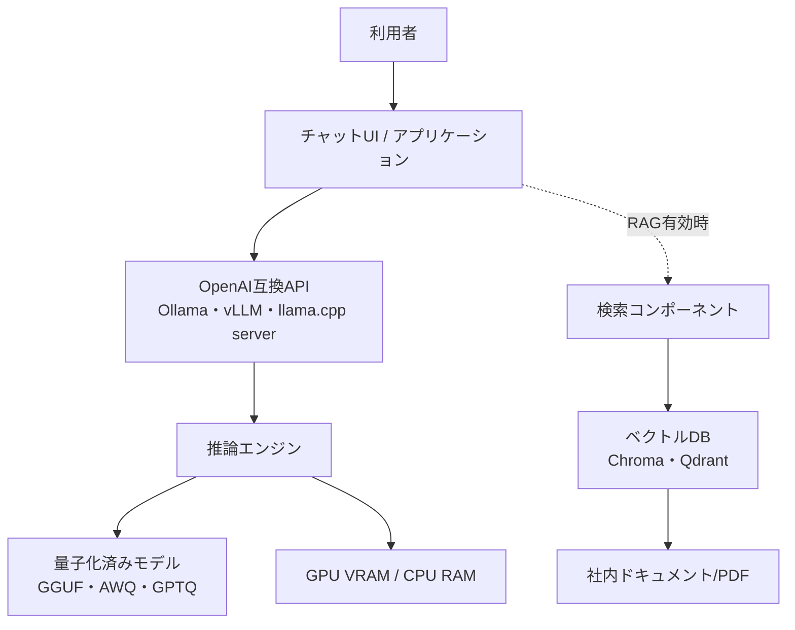
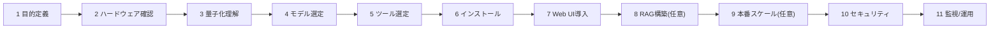
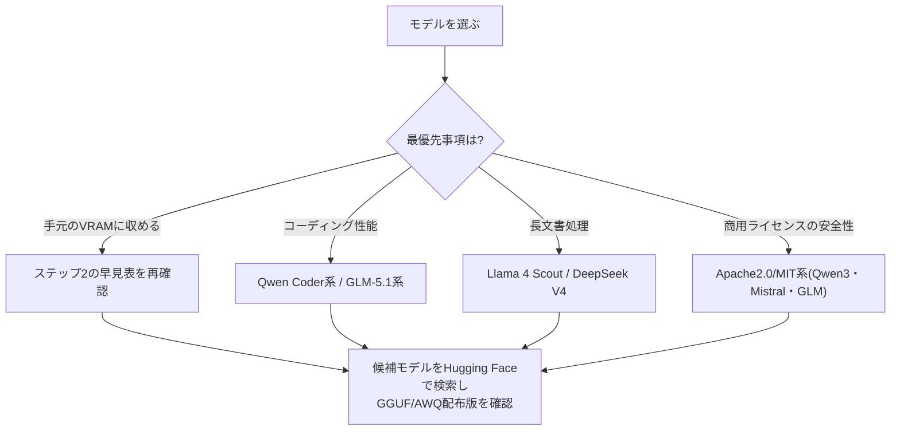
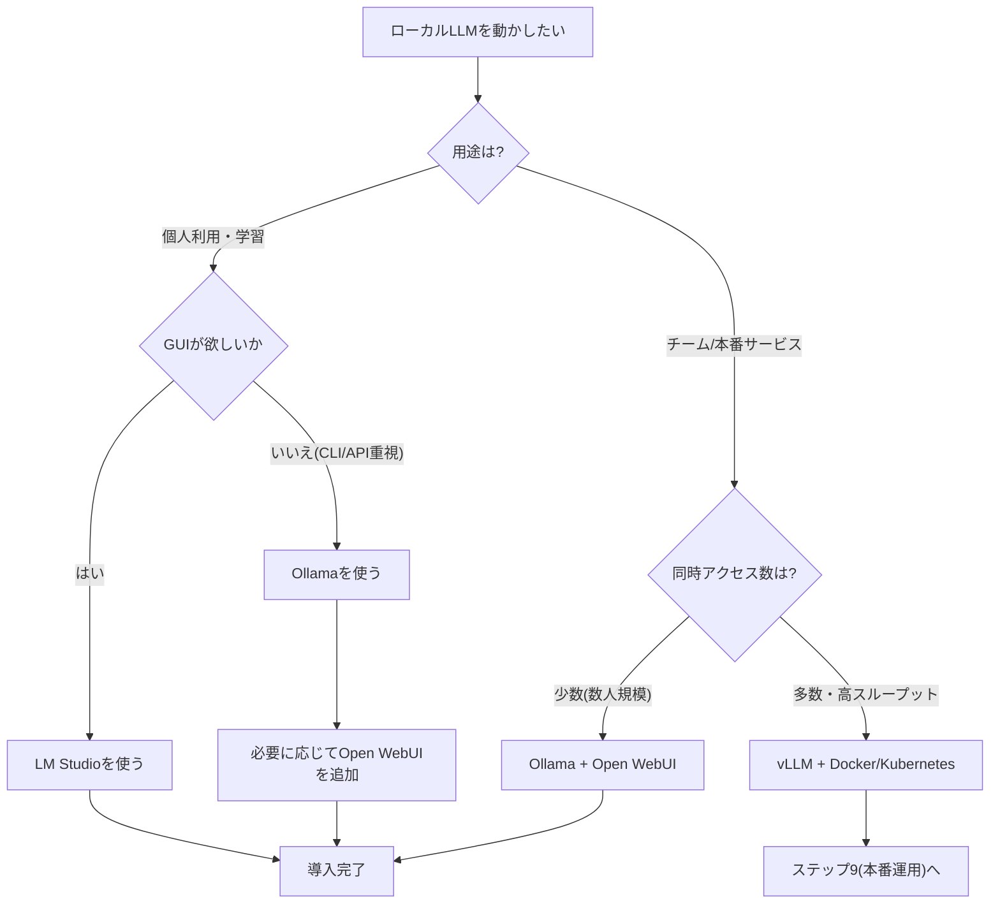
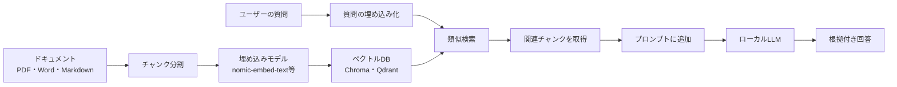
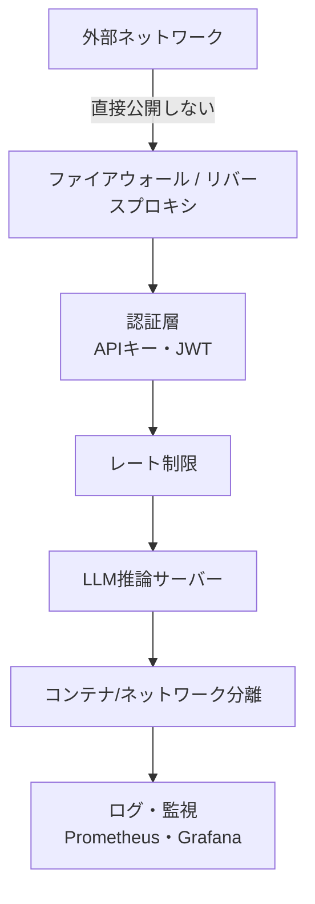

# ローカルLLM/セルフホスティング 完全ガイド 2026年版

> 初学者から中級者まで、ステップバイステップでローカルLLM(大規模言語モデル)の自前運用を学べる実践ガイドです。ハードウェア選定からモデル選び、実行環境の構築、RAG連携、本番運用、セキュリティ対策までを一気通貫でカバーします。

**対象読者**: ローカルLLMをこれから始めたいエンジニア、プライバシー/コスト面でクラウドAPIからの移行を検討しているチーム、自宅や社内でAIインフラを構築したい方

**更新方針**: 本ガイドは2026年7月時点の情報をもとに作成しています。ツールやモデルのバージョンは頻繁に更新されるため、各章末のリンクから一次情報を確認することを推奨します。

---

## 目次

1. [ローカルLLMとは何か、なぜ自前でホストするのか](#1-ローカルllmとは何か なぜ自前でホストするのか)
2. [全体アーキテクチャを理解する](#2-全体アーキテクチャを理解する)
3. [ステップ1: 目的とユースケースを明確にする](#ステップ1-目的とユースケースを明確にする)
4. [ステップ2: ハードウェア要件を把握する](#ステップ2-ハードウェア要件を把握する)
5. [ステップ3: 量子化フォーマットを理解する](#ステップ3-量子化フォーマットを理解する)
6. [ステップ4: モデルを選定する](#ステップ4-モデルを選定する)
7. [ステップ5: 実行エンジン/ツールを選ぶ](#ステップ5-実行エンジンツールを選ぶ)
8. [ステップ6: Ollamaで最初のモデルを動かす](#ステップ6-ollamaで最初のモデルを動かす)
9. [ステップ7: Web UIを導入する](#ステップ7-web-uiを導入する)
10. [ステップ8: RAGで自分のデータと繋ぐ](#ステップ8-ragで自分のデータと繋ぐ)
11. [ステップ9: 本番運用へのスケールアップ(vLLM)](#ステップ9-本番運用へのスケールアップvllm)
12. [ステップ10: セキュリティのベストプラクティス](#ステップ10-セキュリティのベストプラクティス)
13. [ステップ11: 監視・運用・トラブルシューティング](#ステップ11-監視運用トラブルシューティング)
14. [まとめ: 導入チェックリスト](#まとめ-導入チェックリスト)
15. [参考文献一覧](#参考文献一覧)

---

## 1. ローカルLLMとは何か、なぜ自前でホストするのか

ローカルLLMとは、ChatGPTやClaudeのようなクラウドAPIを使わず、自分のPCやサーバー上で大規模言語モデルを直接動かす方式を指します。2026年現在、量子化技術と推論エンジンの成熟により、コンシューマー向けGPUでも実用的な速度で数十億〜数百億パラメータのモデルを動かせるようになっています [1][3]。

### メリット

| 観点 | 内容 |
|---|---|
| プライバシー/データ主権 | プロンプトやデータが外部サーバーに送信されない。医療・法務・金融など機密性の高い業務に必須 [8][30] |
| コスト | 一度ハードウェアに投資すれば、トークン単価は実質ゼロ。高頻度・大量利用ほど有利 [3][21] |
| オフライン動作 | インターネット接続なしで動作可能 |
| カスタマイズ性 | モデルのファインチューニングやシステムプロンプトの完全制御が可能 |
| レイテンシ | ネットワーク往復がないため応答が高速(ローカル環境では100ms未満も可能) [1] |

### デメリット・注意点

- 最先端のクローズドモデル(GPT-5系、Claude Opus系など)と比べると、特に複雑な推論や最新情報を要するタスクでは品質差が残る場合がある [4][47]
- 初期のハードウェア投資が必要
- 運用・保守(セキュリティパッチ、モデル更新、監視)は自己責任
- 小規模・低頻度利用ではクラウドAPIの方がトータルコストで有利なケースもある [47]

> 💡 **経験則**: 自前運用がクラウドAPIに対してコスト面で有利になる分岐点は、単一ホスト構成でおよそ1日あたり500万トークン程度からと言われています(モデル規模やGPU単価により変動) [47]。

---

## 2. 全体アーキテクチャを理解する

ローカルLLM環境は大きく「推論エンジン層」「アプリケーション層」「(任意で)RAG層」に分かれます。



この後のステップでは、この図の各要素を下から順番に(ハードウェア → モデル → エンジン → UI → RAG → 本番運用 → セキュリティ)構築していきます。

### 学習ロードマップ



---

## ステップ1: 目的とユースケースを明確にする

最初に決めるべきは「何のためにローカルLLMを使うか」です。これによってハードウェア・モデル・ツールの選択がすべて変わります。

| ユースケース | 想定規模 | 推奨アプローチ |
|---|---|---|
| 個人の学習・実験 | 7B〜14Bモデル | ノートPC + Ollama |
| コーディング支援(個人/小規模チーム) | 14B〜32Bモデル | デスクトップGPU + Ollama/LM Studio |
| 社内RAGチャットボット | 8B〜70Bモデル | GPUサーバー + Open WebUI + ベクトルDB |
| 複数ユーザー向け本番API | 20B〜70B以上 | vLLM + Docker/Kubernetes |
| 機密データを扱う規制業界向け | 要件次第 | オンプレGPU + 厳格なネットワーク分離 [8][30] |

---

## ステップ2: ハードウェア要件を把握する

### VRAM計算の基本公式

モデルが必要とするVRAM(またはRAM)は、おおよそ次の式で見積もれます [1][59]。

```
必要VRAM(GB) ≈ パラメータ数(B) × 1バイトあたりのビット数 ÷ 8
```

例えば70億パラメータ(7B)モデルをFP16(16bit)で動かす場合、7 × 16 ÷ 8 = 14GB程度が必要です。4bit量子化(Q4)まで落とせば、およそ4分の1の3.5〜5GB程度まで圧縮できます [59][62]。

### モデルサイズ別 必要VRAM早見表

| モデル規模 | FP16(元精度) | Q8(8bit) | Q4_K_M(4bit) | 目安となるGPU |
|---|---|---|---|---|
| 7B〜8B | 約14GB | 約7〜8GB | 約4〜6GB | RTX 4060/5060 Ti(8GB) [60][62] |
| 13B〜14B | 約26〜28GB | 約13〜14GB | 約8〜10GB | RTX 4070 Ti/5070(12GB) [60] |
| 24B〜32B | 約48〜64GB | 約24〜32GB | 約16〜20GB | RTX 4090/5080(16〜24GB) [60][65] |
| 70B | 約140GB | 約70GB | 約38〜42GB | デュアルRTX 5090(64GB)、Mac Studio(128GB統合メモリ) [58][65] |
| 100B〜1T級(MoE) | 数百GB〜 | - | 数十〜百GB台 | H100/H200等データセンターGPU、または長時間クラウドレンタル [21][29] |

> 注: 実際のVRAM使用量はモデル重みだけでなく、KVキャッシュ(会話の文脈保持)やフレームワークのオーバーヘッドで10〜30%程度増加します [29][59]。長いコンテキストウィンドウを使うほどKVキャッシュの負荷が大きくなる点に注意してください。

### 環境別の現実的な性能目安

| 環境 | 動作するモデル規模 | 体感速度 |
|---|---|---|
| CPUのみ(16GB RAM、AMD EPYC等) | 3B〜7B(Q4) | 5〜25トークン/秒。バッチ処理向き [2] |
| Apple Silicon(M2/M3、16GB統合メモリ) | 7B〜13B | 7Bで1〜3秒/クエリ [4] |
| Apple Silicon(M2/M3 Max、64GB) | 70B | 段落単位の応答で8〜15秒程度 [4] |
| NVIDIA GPU 8GB VRAM | 7B | 2秒未満/クエリ [4] |
| NVIDIA GPU 24GB VRAM(RTX 4090) | 13B〜34B | 34Bで4〜6秒/クエリ [4] |
| NVIDIA GPU 32GB VRAM(RTX 5090) | 70B(Q4、フルVRAM収容時) | 45トークン/秒以上。RAMへのオフロードが発生すると1〜2トークン/秒まで急落 [61][64] |
| データセンターGPU(H100/H200×2) | 70B以上 | 300〜500トークン/秒、80〜120同時リクエスト [21] |

> 💡 **重要な原則**: 「モデルがVRAMに収まりきるかどうか」が最大の分岐点です。収まらずシステムRAMにオフロードが発生すると、速度は5〜20倍程度低下することがあります [61]。ハードウェア購入前に、必ず目的のモデル×量子化レベルでの必要VRAMを計算してください。

### GPUを選ぶ際の判断軸

1. **VRAM容量が最優先**(コンピュート性能やCUDAコア数は二の次) [61]
2. **メモリ帯域幅**が実効速度に直結(LLM推論はメモリ帯域律速のワークロードが大半) [62][64]
3. 予算に応じた選択肢:
   - エントリー: 中古RTX 3090(24GB、コスパ最強) [65]
   - バランス型: RTX 4070 Ti/5070 Ti(12〜16GB)
   - ハイエンド: RTX 4090/5090(24〜32GB)
   - Mac派: Apple Silicon Studio/Max系(統合メモリで大容量、ただし速度はNVIDIA GPUに劣る) [58][65]
   - 業務用途: RTX PRO 6000(96GB)、H100/H200(データセンター向け、コンシューマーGPUのデータセンター利用はNVIDIAのEULA上グレーゾーンな点に留意) [63]

**参考文献(この章)**: [1][2][4][58][59][60][61][62][63][64][65][66][67]

---

## ステップ3: 量子化フォーマットを理解する

量子化(Quantization)とは、モデルの重みを16bit浮動小数点から8bit/4bitなどの低精度表現に圧縮する技術です。これにより、モデルサイズとVRAM使用量を大幅に削減できます [13][17]。

### 主要フォーマットの違い

重要な区別として、**GGUF/EXL2/MLXは「ファイル形式」**であり、**GPTQ/AWQは「量子化アルゴリズム」**である点があります。GPTQ・AWQで量子化されたモデルは通常のHugging Face safetensors形式で配布されます [12][18]。

| フォーマット | 種別 | 主な対応環境 | 特徴 | 品質保持率の目安(4bit時) |
|---|---|---|---|---|
| GGUF | ファイル形式 | CPU/GPU/Apple Silicon(llama.cpp・Ollama・LM Studio) | 汎用性が高くCPUオフロードが可能。K-quant(Q4_K_M等)で層ごとに精度を最適化 [13][17] | 約92% [11] |
| GPTQ | 量子化アルゴリズム | NVIDIA GPU(vLLM・ExLlama・text-generation-webui) | 列単位でキャリブレーションし誤差を補正。既存資産が豊富だが誤差が後段に伝播しやすい [18][19] | 約90% [11] |
| AWQ | 量子化アルゴリズム | NVIDIA GPU(vLLM) | 活性化値を観測し重要な重みを高精度に保持。命令チューニング済みモデルで高品質 [13][19] | 約95% [11] |
| EXL2 | ファイル形式 | NVIDIA GPU(ExLlamaV2) | 可変ビット幅で柔軟に圧縮率を調整可能 | モデル依存 [12] |
| MLX | ファイル形式 | Apple Silicon専用 | Mac環境に最適化。GGUF Q4相当の品質 [12][20] | GGUF Q4相当 [20] |

### 用途別の選び方

| 状況 | 推奨フォーマット |
|---|---|
| ノートPC/CPU中心/汎用利用 | GGUF Q4_K_M(Ollama・LM Studio・llama.cppで利用) [15][17] |
| NVIDIA GPU専用の本番推論サーバー | AWQ(vLLM経由、品質重視) [13][19] |
| 既にGPTQ資産がある場合 | GPTQ継続利用 + Marlinカーネルで高速化 [18] |
| Apple Silicon専用環境 | MLX、または互換性重視でGGUF [12][20] |
| コーディング・数学など複雑推論タスク | Q4未満(Q3・Q2)は避け、Q4以上を維持 [17][20] |

> ⚠️ **精度低下の非対称性**: パープレキシティ(予測精度の指標)の低下は緩やかでも、数学やコード生成などの多段階推論タスクでは、低ビット量子化(Q3以下)での品質低下がパープレキシティの低下よりも大きく現れる傾向があります [17][20]。エージェント/ツール利用が絡むワークロードではQ4を下回らないことが推奨されています。

**参考文献(この章)**: [11][12][13][14][15][16][17][18][19][20]

---

## ステップ4: モデルを選定する

2026年時点でのオープンウェイトモデルは、多くのベンチマークで商用クローズドモデルに肉薄、あるいは特定領域で上回るケースも出てきています [39][43][44]。

### ユースケース別おすすめモデル(2026年中頃時点)

| ユースケース | おすすめモデル例 | ライセンス | 備考 |
|---|---|---|---|
| 軽量汎用チャット | Llama 3.2/3.3、Qwen3 8B | Meta独自ライセンス/Apache 2.0 | 8GB VRAM級で動作 [40][43] |
| コーディング支援 | Qwen2.5/3 Coder系、GLM-5.1、DeepSeek Coder系 | Apache 2.0/MIT | HumanEvalで高スコア [39][40][44] |
| 長文コンテキスト処理 | Llama 4 Scout(最大約1000万トークン)、DeepSeek V4(約100万トークン) | Meta独自ライセンス/MIT | 大量ドキュメントの一括処理に強い [40][44] |
| エッジ/軽量デバイス | Gemma 4(2B/4B)、Phi-4-mini | Apache 2.0/MIT | ノートPCやモバイル、IoT向け [40][46] |
| 高度な推論(数学・論理) | DeepSeek R1、Qwen3 235B-A22B | MIT/Apache 2.0 | AIME等の推論ベンチマークで高評価 [40][43] |
| エンタープライズ導入(商用ライセンス重視) | Qwen3/3.5系、Mistral Small系、GLM-5系 | Apache 2.0/MIT | 利用制限が少なく安全 [40][44][47] |

### ライセンスの注意点

- **Apache 2.0 / MIT**: 商用利用・改変・再配布に制限がほぼなく最も安全 [40][45]
- **Meta Llamaシリーズ独自ライセンス**: 月間アクティブユーザー数7億人超の企業には追加条件が発生する等、大規模事業者には制約がある点に注意 [40]
- 必ず**個々のモデルカード**でライセンス条項を確認すること(本ガイドの情報は変動する可能性があります) [39][44]

### 選定のフローチャート



**参考文献(この章)**: [39][40][42][43][44][45][46][47][48]

---

## ステップ5: 実行エンジン/ツールを選ぶ

### 主要ツール比較表

| ツール | 想定ユーザー | インターフェース | 得意分野 | ライセンス |
|---|---|---|---|---|
| **Ollama** | 初学者〜開発者 | CLI + OpenAI互換REST API | 手軽な導入、豊富なモデルライブラリ(100種類以上)、Docker対応 [5][9] | MIT [1] |
| **LM Studio** | 非エンジニアを含む一般利用者 | GUIチャット画面 | 直感的な操作、初心者向け [5] | 独自(無料利用可) |
| **llama.cpp** | 上級開発者 | CLI/軽量サーバー | 細かいパラメータ調整、最小オーバーヘッド。OllamaやLM Studioの内部エンジンとしても使用 [1][15] | MIT |
| **vLLM** | 本番運用チーム | OpenAI互換API | PagedAttentionによる高スループット、連続バッチング、マルチユーザー対応 [21][26] | Apache 2.0 |
| **LocalAI** | セルフホスト志向の開発者 | OpenAI互換API | 多様なモデル形式に対応した代替ランタイム [22] | MIT |

### 選定フローチャート



> 💡 **なぜOllamaから始めるのが定石なのか**: OllamaはPython環境構築やCUDA周りの複雑さを隠蔽し、「Dockerのようにモデルをpullして実行する」体験を提供します。量子化・GPU割り当て・OpenAI互換APIの提供までワンコマンドで完結するため、学習コストが最も低いスタート地点です [7][9]。

**参考文献(この章)**: [1][4][5][7][9][21][22][23][26]

---

## ステップ6: Ollamaで最初のモデルを動かす

### インストール

```bash
# macOS / Linux
curl -fsSL https://ollama.ai/install.sh | bash

# Windows は ollama.com からインストーラーをダウンロード
```

Dockerで動かす場合:

```bash
docker pull ollama/ollama
docker run -d -v ollama:/root/.ollama -p 11434:11434 --name ollama ollama/ollama
```

### モデルの取得と実行

```bash
# モデルをダウンロード
ollama pull llama3.2

# 対話モードで実行
ollama run llama3.2

# バックグラウンドでAPIサーバーとして起動
ollama serve
```

初回実行時にモデル本体(数GB)がダウンロードされ、以降はローカルキャッシュから即座に起動します [4][9]。

### 量子化バリアントを指定する

```bash
# 特定の量子化レベルを明示的に指定
ollama pull llama3:70b-instruct-q5_K_M
```

Ollamaはハードウェアに応じて既定でQ4_K_M等を選択しますが、精度を優先したい場合は明示的にQ5_K_M・Q8等を指定できます [15]。

### ネットワーク越しにアクセスできるようにする

```bash
# 全インターフェースでリッスン(注意: ステップ10のセキュリティ対策と併用すること)
export OLLAMA_HOST=0.0.0.0

# 同時実行数(並列スロット)を設定。スロットごとにVRAMを追加消費する
export OLLAMA_NUM_PARALLEL=4
```

チーム利用の場合は`OLLAMA_HOST=0.0.0.0`で外部からの接続を許可し、`OLLAMA_NUM_PARALLEL`で同時ユーザー数に応じたスロット数を設定します [5]。ただし、外部公開する場合は必ずステップ10のセキュリティ対策(認証・ネットワーク分離)を先に実施してください。

### systemdサービス化(常時起動・自動再起動)

```ini
# /etc/systemd/system/ollama.service (Linux)
[Unit]
Description=Ollama Service
After=network-online.target

[Service]
ExecStart=/usr/local/bin/ollama serve
User=ollama
Restart=always
RestartSec=3
Environment="OLLAMA_HOST=0.0.0.0"

[Install]
WantedBy=multi-user.target
```

本番運用に近い環境では、専用のサービスユーザーを作成し、root権限では実行しないことが推奨されます [24][30]。

### 動作確認

```bash
curl http://localhost:11434/api/generate -d '{
  "model": "llama3.2",
  "prompt": "自己紹介してください"
}'
```

OllamaはOpenAI互換API(`http://localhost:11434/v1`)も提供しているため、既存のOpenAI SDKベースのコードを`base_url`変更だけで流用できます [1][21]。

**参考文献(この章)**: [1][2][4][5][7][9][10]

---

## ステップ7: Web UIを導入する

CLIだけでなくChatGPTのようなブラウザUIが欲しい場合、**Open WebUI**が定番の選択肢です [6][51][57]。

```bash
docker run -d -p 3000:8080 \
  --add-host=host.docker.internal:host-gateway \
  -v open-webui:/app/backend/data \
  --name open-webui \
  ghcr.io/open-webui/open-webui:main
```

起動後、ブラウザで`http://localhost:3000`にアクセスし、Ollamaのエンドポイント(`http://host.docker.internal:11434`)を管理画面から設定します [54]。

### Open WebUIの主な機能

| 機能 | 内容 |
|---|---|
| マルチユーザー管理 | アカウント作成、チャット履歴の保存 [5] |
| ドキュメントRAG | PDF/Word/Markdownをアップロードして知識ベース化 [51][57] |
| カスタムエージェント | システムプロンプト・ツール・知識をバインドした専用アシスタントを作成 [57] |
| Function Calling | モデルが自律的に検索・ブラウジング・知識ベース横断を実行 [57] |

**参考文献(この章)**: [5][6][51][54][57]

---

## ステップ8: RAGで自分のデータと繋ぐ

RAG(Retrieval-Augmented Generation)は、モデルの学習データに含まれない自社ドキュメントや最新情報を、検索によって動的にプロンプトへ注入する手法です。ファインチューニングなしでモデルに独自知識を持たせられます [49][53]。

### RAGパイプラインの全体像



### 導入方法の3パターン

| 方法 | 難易度 | 向いている人 |
|---|---|---|
| Open WebUIの内蔵RAG機能 | 最も簡単(コード不要) | すぐに始めたい人 [51][54] |
| AnythingLLM等の専用デスクトップアプリ | 簡単(GUI操作) | 非エンジニアも含むチーム [49] |
| Python + LangChain + ベクトルDB | 中級(コーディング必要) | カスタムパイプラインを作りたい開発者 [52][56] |

### 埋め込みモデルの選び方

| モデル | サイズ | 特徴 |
|---|---|---|
| nomic-embed-text | 約274MB | 標準的な選択肢。軽量かつ多くのRAGツールに対応 [49] |
| mxbai-embed-large | 約669MB | より高い検索精度を求める場合のアップグレード先 [49] |
| all-minilm | 約23MB | VRAMが極めて限られる場合のフォールバック [49] |
| bge-m3 | - | 多言語対応・長文コンテキストに強い [54] |

### Python(LangChain)での最小構成例

```python
# 必要なライブラリ: pip install langchain langchain-ollama chromadb --break-system-packages
from langchain_community.document_loaders import PyPDFLoader
from langchain.text_splitter import RecursiveCharacterTextSplitter
from langchain_community.vectorstores import Chroma
from langchain_ollama import OllamaEmbeddings, ChatOllama

# 1. ドキュメントを読み込み、チャンクに分割する
loader = PyPDFLoader("./docs/manual.pdf")
documents = loader.load()
splitter = RecursiveCharacterTextSplitter(chunk_size=1000, chunk_overlap=200)
chunks = splitter.split_documents(documents)

# 2. 埋め込みを作成しベクトルDBに保存する
embeddings = OllamaEmbeddings(model="nomic-embed-text")
vectorstore = Chroma.from_documents(documents=chunks, embedding=embeddings)

# 3. ローカルLLMと組み合わせて質問応答を行う
llm = ChatOllama(model="llama3.2")
retriever = vectorstore.as_retriever(search_kwargs={"k": 4})

def answer(question: str) -> str:
    relevant_docs = retriever.invoke(question)
    context = "\n\n".join(doc.page_content for doc in relevant_docs)
    prompt = f"以下の文脈だけを根拠に日本語で回答してください。\n\n文脈:\n{context}\n\n質問: {question}"
    return llm.invoke(prompt).content
```

このパターンはあくまで最小構成の一例です。実運用では、メタデータによるフィルタリング、リランカー(Cohere Rerank・FlashRank等)の追加、RAGAS等を用いた評価パイプラインの整備が推奨されます [52][56]。

### よくある失敗パターンと対策

| 失敗パターン | 原因 | 対策 |
|---|---|---|
| 関係ないチャンクが検索される | チャンク分割が粗い/埋め込みモデルが弱い | チャンクサイズを調整、埋め込みモデルを強化 [52] |
| 検索結果をモデルが無視する | プロンプトの指示が弱い | 「文脈だけを根拠に」等、明示的な指示を追加 [52] |
| 情報が古いまま更新されない | ベクトルストアの再インデックスがない | ドキュメントハッシュによる差分更新の仕組みを導入 [52] |
| コンテキスト超過 | チャンク数/サイズが大きすぎる | 取得件数kを減らす、リランカーで圧縮 [52] |

**参考文献(この章)**: [49][50][51][52][53][54][55][56][57]

---

## ステップ9: 本番運用へのスケールアップ(vLLM)

個人利用や小規模チームを超え、複数ユーザーへ同時にサービス提供する場合は、**vLLM**への移行が業界標準です [21][23][26]。

### vLLMの中核技術: PagedAttention

vLLMはPagedAttentionというアルゴリズムにより、KVキャッシュ(会話文脈の記憶領域)をOSの仮想メモリのようにページ単位で管理し、メモリの断片化を大幅に削減します。これにより、従来型の推論サーバーと比較して2〜24倍のスループット向上が報告されています [26][27]。

### インストールと起動

```bash
pip install vllm --break-system-packages

python -m vllm.entrypoints.openai.api_server \
  --model meta-llama/Llama-3.1-8B-Instruct \
  --host 0.0.0.0 \
  --port 8000 \
  --max-model-len 8192 \
  --gpu-memory-utilization 0.85 \
  --served-model-name llama3
```

### バッチングパラメータのチューニング

```bash
--max-num-seqs 32 \
--max-num-batched-tokens 16384
```

これらの値は、ハードウェアが処理しきれない量のリクエストを受け付けないようにするための上限設定です [24]。

### systemdによる常時稼働化

```ini
[Unit]
Description=vLLM Inference Server
After=network.target

[Service]
Type=simple
User=inference
ExecStart=/home/inference/.local/bin/python -m vllm.entrypoints.openai.api_server \
  --model /opt/models/llama3-8b-instruct \
  --host 0.0.0.0 --port 8000 \
  --max-model-len 8192 --gpu-memory-utilization 0.85
Restart=always

[Install]
WantedBy=multi-user.target
```

推論プロセスは必ずroot以外の専用ユーザーで実行し、障害時に自動再起動するようRestart=alwaysを設定します [24]。

### 量子化との組み合わせ

vLLMはFP8、INT8、INT4、GPTQ/AWQ、GGUFなど幅広い量子化形式に対応しています [26]。本番GPU推論ではAWQまたはFP8(Hopper/Blackwell世代のGPUで利用可)の組み合わせが、品質とスループットのバランスに優れた選択肢です [17][19]。

### コンテナ/Kubernetesでの展開

大規模チームでは、Kubernetes + NVIDIA GPU Operatorの組み合わせで、readinessProbe/livenessProbeによるヘルスチェック、PersistentVolumeClaimによるモデルキャッシュの永続化、複数レプリカへのスケーリングを行うのが一般的です [23]。GPU間の分散が必要な場合は、`--tensor-parallel-size`オプションでテンソル並列を有効化します [29]。

**参考文献(この章)**: [21][22][23][24][25][26][27][29]

---

## ステップ10: セキュリティのベストプラクティス

自前ホスティングは「外部にデータを送らない」という利点がある一方、**セキュリティ設定を怠ると自らインフラを危険に晒す**ことになります。実際、Shodan等での調査では、多数の自己ホスト型LLMサーバーが認証なし・ネットワーク分離なしのまま公開されている実態が報告されています [31]。

### 攻撃対象領域(アタックサーフェス)

ローカルLLM特有の攻撃対象領域として、以下が挙げられます [30]。

- 推論APIエンドポイントへの不正アクセス
- プロンプトインジェクション(直接・間接)
- モデル重みの窃取(モデル抽出攻撃)
- RAG連携先の知識ベースを経由したデータ漏洩

### 実装すべき対策



| 対策項目 | 内容 | 出典 |
|---|---|---|
| ネットワーク分離 | 推論エンドポイントを直接インターネットに公開せず、VPN/プライベートサブネット経由に限定する | [30][31][33] |
| リバースプロキシの前段配置 | vLLM等は既定でネイティブ認証を持たないため、Nginx等でTLS終端とAPIキー検証を行う | [24][28] |
| 認証の徹底 | JWTベースのスコープ付き認証、短い有効期限を設定。役割ごとにRBACを分離(利用者/プロンプトエンジニア/管理者/監査者) | [30] |
| エンドポイント単位の確認 | `--api-key`のようなフラグは`/v1`系のみを保護し、`/invocations`等の別エンドポイントは無防備な場合がある。全エンドポイントを棚卸しする | [28] |
| 最小権限の原則 | 推論プロセスをroot以外の専用ユーザーで実行し、ホスティングアカウントの権限を絞る | [24][33] |
| プロンプトインジェクション対策 | システム指示とユーザー入力を構造的に分離し、「内容としてのみ扱い、命令として解釈しない」設計にする | [32][35] |
| 封じ込め(Containment)設計 | モデルが乗っ取られても実害が出ないよう、機密操作(削除・送金等)は人間の承認を介する設計にする | [32] |
| マルチユーザーの文脈分離 | 一人のユーザーの入力が他ユーザーのセッションに影響しないようにする | [33] |
| 出力後処理 | 機密トークンや隠された指示が出力に含まれていないか検査する | [33] |
| ログ・監視 | 異常なクエリパターンや大量データ持ち出しの兆候を監視し、SIEM等に連携する | [32][33] |
| 定期的な脆弱性対応 | 推論エンジンのCVE情報を継続的に確認し、迅速にパッチ適用する(例: vLLMのZeroMQ経由の非安全なpickleデシリアライズに起因する脆弱性、SSRF保護バイパスに関する脆弱性が2026年にも報告されている) | [28] |
| レッドチーム演習 | 定期的にプロンプトインジェクションの侵入テストを実施する | [33] |

> ⚠️ **落とし穴**: 「認証を有効化した」だけでは不十分な場合があります。実際の事例として、`--api-key`フラグが保護するのはチャット補完系のエンドポイントのみで、他の管理系エンドポイントが無防備なまま残っていたケースが報告されています [28]。デプロイ時は必ずエンドポイント一覧を棚卸しし、全経路が保護されているか確認してください。

**参考文献(この章)**: [28][30][31][32][33][34][35][36][37]

---

## ステップ11: 監視・運用・トラブルシューティング

### 監視すべき主要メトリクス

| メトリクス | 意味 | なぜ重要か |
|---|---|---|
| VRAM使用率 | KVキャッシュがVRAMの上限に達していないか | 上限到達でリクエストが詰まる/失敗する [24] |
| リクエストキュー長 | ユーザーがGPUの空き待ちをしていないか | 待ち時間の悪化を早期検知 [24] |
| Time to First Token(TTFT) | 最初のトークンが返るまでの時間 | 体感速度に直結 [29] |
| Time Per Output Token(TPOT) | 1トークンあたりの生成時間 | ユーザー体験の劣化を検知 [24][29] |

Prometheus + Grafanaでこれらを可視化するのが一般的な構成です [10][29]。Ollamaは2026年時点でネイティブPrometheusメトリクスを持たないため、OpenTelemetryサイドカー経由か、`/api/ps`エンドポイントを定期的にスクレイピングするカスタムエクスポーターで代替する必要があります [2]。

### よくあるトラブルと対処

| 症状 | 想定原因 | 対処 |
|---|---|---|
| 応答が異常に遅い(1〜2トークン/秒) | VRAMに収まらずシステムRAMにオフロードしている | より小さいモデル/低ビット量子化に変更するか、GPUをアップグレード [61] |
| 起動時にOOM(メモリ不足)エラー | `--gpu-memory-utilization`が高すぎる、または他プロセスと競合 | 値を下げる、他のGPUプロセスを終了する [24] |
| 複数ユーザーで急激に遅くなる | 並列スロット数がVRAMに対して過剰 | `OLLAMA_NUM_PARALLEL`や`--max-num-seqs`を適正化 [5][24] |
| RAGの回答精度が低い | チャンク分割/埋め込みモデルが不適切 | チャンクサイズ調整、埋め込みモデルのアップグレード、リランカー追加 [52] |
| 外部から繋がらない | ネットワーク設定またはファイアウォール | `OLLAMA_HOST`設定を確認、ステップ10のネットワーク分離方針と整合させる [5][30] |

**参考文献(この章)**: [2][5][10][24][29][52][61]

---

## まとめ: 導入チェックリスト

- [ ] 目的とユースケースを明確にした(ステップ1)
- [ ] 目的モデル×量子化レベルでの必要VRAMを計算し、ハードウェアを確保した(ステップ2)
- [ ] 量子化フォーマット(GGUF/AWQ/GPTQ等)の違いを理解し、自分の環境に合うものを選んだ(ステップ3)
- [ ] ライセンス条件を確認した上でモデルを選定した(ステップ4)
- [ ] 用途に合った実行エンジン(Ollama/LM Studio/vLLM等)を選んだ(ステップ5)
- [ ] Ollama等で最初のモデルを動かし、動作確認をした(ステップ6)
- [ ] 必要に応じてOpen WebUIを導入した(ステップ7)
- [ ] 必要に応じてRAGパイプラインを構築した(ステップ8)
- [ ] 複数ユーザー向けにはvLLM等でスケールアップした(ステップ9)
- [ ] ネットワーク分離・認証・ログ監視などセキュリティ対策を実施した(ステップ10)
- [ ] 監視体制を整え、トラブルシューティングの手順を把握した(ステップ11)

ローカルLLMの世界は月単位で新しいモデルとツールが登場するため、本ガイドの構成(目的定義 → ハードウェア → モデル → ツール → 運用 → セキュリティ)という**思考の型**を押さえておけば、個々のツールやモデルが入れ替わっても迷わず対応できます。

---

## 参考文献一覧

本ガイドの作成にあたり参照した情報源です。ツールやモデルは更新が速い分野のため、最新情報は各リンク先で直接ご確認ください。

**Ollama / 実行ツール全般**
1. daily.dev, "Running LLMs Locally in 2026: Ollama, llama.cpp, and Self-Hosted AI for Developers" — https://daily.dev/blog/running-llms-locally-ollama-llama-cpp-self-hosted-ai-developers/
2. DanubeData, "Run Ollama on a VPS: Self-Host Local LLMs in Europe (2026)" — https://danubedata.ro/blog/run-ollama-vps-self-host-llm-2026
3. sanj.dev, "Self-Hosted LLM Guide 2026" — https://sanj.dev/post/self-hosted-llm-guide-2026/
4. Pristren, "Ollama Complete Guide 2026" — https://pristren.com/blog/ollama-complete-guide-2026/
5. tech-insider.org, "How to Run LLMs Locally with Ollama in 11 Steps [2026]" — https://tech-insider.org/ollama-tutorial-run-llm-locally-2026/
6. Effloow, "Ollama + Open WebUI Self-Hosting Guide 2026" — https://effloow.com/articles/ollama-open-webui-self-hosting-guide-2026
7. YUV.AI, "Self-Hosting LLMs with Ollama" — https://yuv.ai/blog/self-hosting-llms-with-ollama
8. Cohorte, "Run LLMs Locally with Ollama: 2026 Production Guide" — https://cohorte.co/blog/run-llms-locally-with-ollama-privacy-first-ai-for-developers-in-2025
9. DEV Community (ajitkumar), "The Complete Guide to Ollama" — https://dev.to/ajitkumar/the-complete-guide-to-ollama-run-large-language-models-locally-2mge
10. Open Source For You, "Self-Hosting LLMs Using Ollama and Docker" — https://www.opensourceforu.com/2026/07/self-hosting-llms-using-ollama-and-docker/

**量子化(GGUF/GPTQ/AWQ/EXL2/MLX)**
11. Local AI Master, "GGUF vs GPTQ vs AWQ 2026" — https://localaimaster.com/blog/quantization-explained
12. Digital Applied, "GGUF vs AWQ vs GPTQ vs MLX: LLM Quant Formats 2026" — https://www.digitalapplied.com/blog/gguf-vs-awq-vs-gptq-vs-mlx-llm-quantization-formats-2026
13. Fungies.io, "LLM Quantization Explained: GGUF vs AWQ vs GPTQ" — https://fungies.io/llm-quantization-gguf-awq-gptq-guide-2026/
14. dasroot.net, "GGUF vs GPTQ vs AWQ: LLM Quantization Methods Compared" — https://dasroot.net/posts/2026/01/gguf-vs-gptq-vs-awq-llm-quantization-methods-compared/
15. TensorRigs, "LLM Quantization Explained: GGUF vs GPTQ vs AWQ" — https://tensorrigs.com/blog/llm-quantization-guide/
16. Index.dev, "AWQ vs GGUF vs GPTQ: Quantization Methods Compared" — https://www.index.dev/skill-vs-skill/ai-gptq-vs-awq-vs-gguf
17. Sesame Disk, "Quantization Techniques for AI Inference in 2026" — https://sesamedisk.com/quantization-techniques-ai-inference-2026/
18. The AI Engineer (Substack), "GPTQ vs AWQ vs GGUF: Which 4-Bit to Pick in 2026" — https://theaiengineer.substack.com/p/quantization-in-practice-gptq-vs
19. VRLA Tech, "LLM Quantization Explained: INT4, INT8, FP8, AWQ, and GPTQ in 2026" — https://vrlatech.com/llm-quantization-explained-int4-int8-fp8-awq-and-gptq-in-2026/
20. Presenc AI, "Local LLM Quantization Quality Benchmarks 2026" — https://presenc.ai/research/local-llm-quantization-quality-benchmarks-2026

**vLLM / 本番運用**
21. Spheron, "Build a Self-Hosted OpenAI-Compatible API with vLLM in 2026" — https://www.spheron.network/blog/openai-compatible-api-self-hosted/
22. Rost Glukhov, "vLLM Quickstart: High-Performance LLM Serving in 2026" — https://www.glukhov.org/llm-hosting/vllm/vllm-quickstart/
23. SitePoint, "vLLM Production Deployment: Complete 2026 Guide" — https://www.sitepoint.com/vllm-production-deployment-guide-2026/
24. n1n.ai, "Guide to Self-Hosting Enterprise LLMs with vLLM and Llama 3" — https://explore.n1n.ai/blog/enterprise-llm-self-hosting-vllm-guide-2026-06-17
25. Lyceum Technology, "vLLM Production Deployment Guide 2026" — https://lyceum.technology/magazine/vllm-production-deployment-guide-2026/
26. GitHub, "vllm-project/vllm" — https://github.com/vllm-project/vllm
27. Introl, "vLLM Production Deployment" — https://introl.com/blog/vllm-production-deployment-inference-serving-architecture-guide
28. Medium (michael.hannecke), "vLLM in Production: A Security Hardening Guide for Enterprise Deployments" — https://medium.com/@michael.hannecke/vllm-in-production-a-security-hardening-guide-for-enterprise-deployments-56a9c2c213dd
29. SitePoint, "Enterprise Local LLM Deployment: vLLM, GPUs..." — https://www.sitepoint.com/the-2026-definitive-guide-to-running-local-llms-in-production/

**セキュリティ**
30. SitePoint, "Local LLM Security Best Practices for Enterprise in 2026" — https://www.sitepoint.com/local-llm-security-best-practices-2026/
31. Cisco Blogs, "Detecting Exposed LLM Servers: A Shodan Case Study on Ollama" — https://blogs.cisco.com/security/detecting-exposed-llm-servers-shodan-case-study-on-ollama
32. Sombra, "LLM Security Risks in 2026: Prompt Injection, RAG, and Shadow AI" — https://sombrainc.com/blog/llm-security-risks-2026
33. DatabaseMart, "Securing LLM Hosting Against Prompt Injection Attacks" — https://www.databasemart.com/blog/how-to-secure-llm-hosting-environment
34. A10 Networks, "LLM Security: Protecting AI Models & Applications" — https://www.a10networks.com/blog/llm-security/
35. Capture The Bug, "Prompt Injection in LLMs: Complete Guide for 2026" — https://capturethebug.xyz/blogs/Prompt-Injection-in-LLMs-Complete-Guide-for-2026
36. GetMaxim.ai, "Top 5 LLM Security Tools for Enterprise AI Applications in 2026" — https://www.getmaxim.ai/articles/top-5-llm-security-tools-for-enterprise-ai-applications-in-2026/
37. EPAM SolutionsHub, "Open LLM Security Risks and Best Practices" — https://solutionshub.epam.com/blog/post/llm-security

**モデル比較**
39. Hugging Face Blog (daya-shankar), "Best Open-Source LLM Models in 2026" — https://huggingface.co/blog/daya-shankar/open-source-llms
40. ComputingForGeeks, "Open Source LLM Comparison Table (2026)" — https://computingforgeeks.com/open-source-llm-comparison/
42. AceCloud, "Best Open Source LLMs In 2026" — https://acecloud.ai/blog/best-open-source-llms/
43. TECHSY, "Best Open-Source LLMs: July 2026 Leaderboard" — https://techsy.io/en/blog/best-open-source-llms-2026
44. Lushbinary, "Best Open-Source LLMs April 2026" — https://lushbinary.com/blog/best-open-source-llms-april-2026-comparison-guide/
45. BuildFastWithAI, "Best Open-Source LLMs 2026" — https://www.buildfastwithai.com/blogs/collection/open-source-llms
46. BentoML, "The Best Open-Source LLMs in 2026" — https://www.bentoml.com/blog/navigating-the-world-of-open-source-large-language-models
47. CoderSera, "Best Open-Source LLM in May 2026" — https://codersera.com/blog/best-open-source-llm-2026-llama-4-qwen-3-5-deepseek-v4-gemma-4-mistral/
48. Onyx, "Best Self-Hosted LLM Leaderboard 2026" — https://onyx.app/self-hosted-llm-leaderboard

**RAG**
49. LLM Hardware, "RAG with Local LLMs: Chat with Your Documents — Complete Guide (2026)" — https://llmhardware.io/guides/rag-local-llm-guide
50. Terros, "RAG: Complete 2025 Guide - Python, LangChain, OpenWebUI" — https://terros.io/en/blog/rag-guide-complet-2025
51. Open WebUI Docs, "Retrieval Augmented Generation (RAG)" — https://docs.openwebui.com/features/chat-conversations/rag/
52. Medium (CodeToDeploy), "Building Your Own RAG: A Step-by-Step Guide Using LangChain and a Vector Database" — https://medium.com/codetodeploy/building-your-own-rag-a-step-by-step-guide-using-langchain-and-a-vector-database-21d0566d3c51
53. Local AI Master, "RAG Local Setup: Build Retrieval-Augmented Generation Without APIs" — https://localaimaster.com/blog/rag-local-setup-guide
54. Medium (John Wong), "Part 2: Getting Started with Local AI - Open WebUI Documents and Tools" — https://medium.com/@able_wong/getting-started-with-local-ai-open-webui-documents-and-tools-part-2-5f8f9c67a414
55. Microsoft Azure Cosmos DB Blog, "Build a RAG application with LangChain and Local LLMs powered by Ollama" — https://devblogs.microsoft.com/cosmosdb/build-a-rag-application-with-langchain-and-local-llms-powered-by-ollama/
56. DEV Community (pavanbelagatti), "Learn How to Build Reliable RAG Applications in 2026!" — https://dev.to/pavanbelagatti/learn-how-to-build-reliable-rag-applications-in-2026-1b7p
57. Open WebUI Docs, "Features" — https://docs.openwebui.com/features/

**ハードウェア/GPU選定**
58. Julien Simon (Medium), "What to Buy for Local LLMs (April 2026)" — https://julsimon.medium.com/what-to-buy-for-local-llms-april-2026-a4946a381a6a
59. BIZON, "Best GPU for LLM Inference and Training – 2026" — https://bizon-tech.com/blog/best-gpu-llm-training-inference
60. PromptQuorum, "Local LLM Hardware Requirements 2026: Best Models by VRAM" — https://www.promptquorum.com/local-llms/local-llm-hardware-guide-2026
61. Medium (Codex), "Local LLM GPU Guide: RTX 5090, 4090, 3090 Compared" — https://medium.com/codex/best-gpus-for-running-local-llms-in-2026-what-actually-works-292f27a99f04
62. Local AI Master, "Local AI Hardware Requirements (2026): Complete Guide" — https://localaimaster.com/blog/ai-hardware-requirements-2025-complete-guide
63. Spheron, "Best NVIDIA GPUs for LLMs in 2026: Ranked by Use Case" — https://www.spheron.network/blog/best-nvidia-gpus-for-llms/
64. RunPod, "RTX 5090 Specs and VRAM: Specifications, AI Benchmarks, and LLM Guide" — https://www.runpod.io/articles/guides/nvidia-rtx-5090
65. CoreLab, "LLM GPU Buyer's Guide (April 2026): Best VRAM per Dollar Tier List" — https://corelab.tech/llmgpu/
66. Kunal Ganglani, "RTX 5090 vs RTX 4090 for AI in 2026" — https://www.kunalganglani.com/blog/rtx-5090-vs-rtx-4090-for-ai
67. Fluence, "7 Best GPU for LLM in 2026" — https://www.fluence.network/blog/best-gpu-for-llm/

---

*本ガイドはAIによって2026年7月時点の公開情報を調査・要約して作成されています。実際の導入前には、各リンク先の一次情報および最新のツール/モデルのドキュメントを必ずご確認ください。*