# 🔁 Loop Engineering 完全ガイド
> 「プロンプトを書く人」から「ループを設計する人」へ ― 初学者のためのステップバイステップ解説

---

> 📅 **本ガイドについて**：「Loop Engineering（ループエンジニアリング）」は2026年6月頃にSNS上で急速に広まったばかりの新しい概念です。本ガイドはBoris Cherny氏（Claude Code開発者）、Peter Steinberger氏（OpenClaw開発者）、Addy Osmani氏（Google Chromeエンジニア）、Andrew Ng氏らの公開発言・記事をもとに、2026年7月時点の情報でまとめています。用語も実践も生まれたばかりで今後変化する可能性が高いため、実装する際は各ツールの公式ドキュメントを必ず確認してください。

---

## 📚 目次

1. [はじめに：なぜ今「Loop Engineering」なのか](#1-はじめになぜ今loop-engineeringなのか)
2. [用語の系譜：Prompt → Context → Harness → Loop](#2-用語の系譜prompt--context--harness--loop)
3. [Loop Engineeringとは何か（定義）](#3-loop-engineeringとは何か定義)
4. [Andrew Ngの3つの入れ子ループ](#4-andrew-ngの3つの入れ子ループ)
5. [ループの解剖学：1ターンを構成する5つの動き](#5-ループの解剖学1ターンを構成する5つの動き)
6. [ループを支える6つの部品](#6-ループを支える6つの部品)
7. [心臓部：GeneratorとVerifierの分離](#7-心臓部generatorとverifierの分離)
8. [原点：Ralph Wiggumテクニック](#8-原点ralph-wiggumテクニック)
9. [ステップバイステップ実践ガイド](#9-ステップバイステップ実践ガイド)
10. [具体例で理解する：朝のCIトリアージ・ループ](#10-具体例で理解する朝のciトリアージループ)
11. [Claude Codeで実際に組んでみる](#11-claude-codeで実際に組んでみる)
12. [リスクと注意点](#12-リスクと注意点)
13. [成熟度モデルと健全性チェック](#13-成熟度モデルと健全性チェック)
14. [まとめ](#14-まとめ)
15. [参考文献・出典一覧](#15-参考文献出典一覧)

---

## 1. はじめに：なぜ今「Loop Engineering」なのか

### 1.1 発端になった2つの発言

2026年6月、開発者向けSNS（X/Twitter）で「Loop Engineering」という言葉が一気に広まりました。きっかけは主に2人の発言です。

- **Boris Cherny氏**（AnthropicのClaude Code開発者）は、自分はもうClaudeに直接プロンプトを書いておらず、「ループ」を仕込んでおいて、それがClaudeに何をすべきか指示している、と語りました。彼はこの変化を、ソースコードからエージェントへの転換と同じくらい大きな一歩だと表現しています<sup>[1][2]</sup>。
- **Peter Steinberger氏**（個人アシスタントプロジェクトOpenClawの開発者）も同様に、もうコーディングエージェントに手でプロンプトを打つのはやめて、エージェントにプロンプトを送り続ける「ループ」自体を設計すべきだ、と投稿しました<sup>[3]</sup>。

この2つの発言がバズった直後、Google Chromeのエンジニアである**Addy Osmani氏**が2026年6月7日に自身のブログで「Loop Engineering」という言葉を正式に定義し、体系化しました<sup>[4][5]</sup>。さらに著名なAI研究者**Andrew Ng氏**が自身のニュースレター「The Batch」でこの流れを取り上げ、ソフトウェアづくり全体を貫く3つの入れ子のループとして整理しています<sup>[6][7]</sup>。

### 1.2 何が変わったのか：一言でいうと

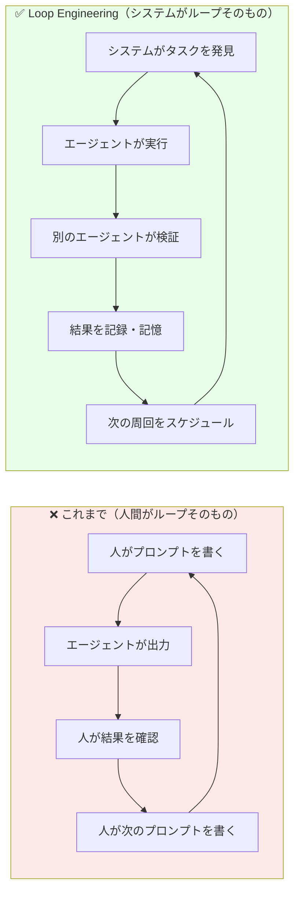

これまでの「プロンプトエンジニアリング」は、**人間自身がループの一部**でした。プロンプトを書く→結果を見る→次のプロンプトを書く、を延々と繰り返すのは人間の仕事だったのです。一日に人間が処理できるタスク量には限界があります。

Loop Engineeringでは、**その繰り返し処理自体をシステムに任せます**。人間はもう「実行者」ではなく、「その繰り返しの仕組み（ループ）を設計するアーキテクト」になる、という立場の転換です<sup>[4]</sup>。

> 💡 **初学者向けの例え**：これまでは「毎回自分でオーブンのタイマーをセットし、焼け具合を見て、次に何度で何分焼くか毎回自分で決めていた」状態でした。Loop Engineeringは「センサー付きの全自動オーブンを設計する」ことに相当します。人間はもう鍋の前に立ち続ける必要はなく、「どんな温度で焼き上がったら合格か」というレシピ（検証基準）を設計する役に回ります。

### 1.3 なぜ今可能になったのか

2025年後半から2026年にかけて、コーディングエージェント（Claude Codeなど）が数十分〜数時間単位でタスクを自律的に継続できるようになりました。Andrew Ng氏は自身の例として、週末に娘のタイピング練習アプリを作った際、コーディングエージェントがブラウザで動作確認をしながら約1時間ほぼ人手を介さずに作業を続けたと述べています<sup>[6]</sup>。

ボトルネックが「モデルの性能」から「その性能をどう繰り返し使わせるかという設計」へ移った、というのがLoop Engineeringが生まれた背景です<sup>[8]</sup>。

---

## 2. 用語の系譜：Prompt → Context → Harness → Loop

Addy Osmani氏はLoop Engineeringを、これまでの「〇〇エンジニアリング」の系譜の上に位置づけています<sup>[4][9]</sup>。

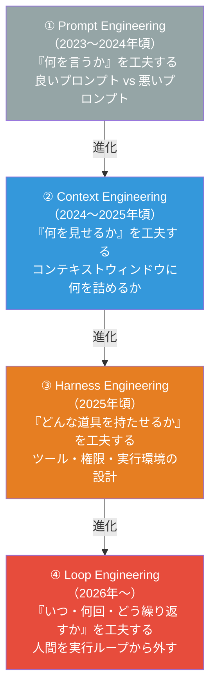

| # | 層 | 問いかけ | 人間の立ち位置 |
|---|------|-----------|----------------|
| ① | Prompt Engineering | 何と言えばAIは動くか？ | キーボードの前に座り、一言ずつ命令する |
| ② | Context Engineering | 何を見せればAIは正しく判断できるか？ | 背景情報・資料を用意する |
| ③ | Harness Engineering | どんな道具・権限を与えればAIは実行できるか？ | ツールと実行環境を組み立てる |
| ④ | **Loop Engineering** | いつ・どのくらいの頻度で・どう検証しながら繰り返すか？ | **仕組み（ループ）そのものを設計する** |

大事なポイントは、**下位の層（Prompt / Context / Harness）が不要になるわけではない**ということです。雑なプロンプトはループの中でも雑な結果しか生みません。Loop Engineeringは、それらすべての層を「自動的に何度も回すための制御構造」を新たに追加するものです<sup>[9]</sup>。

---

## 3. Loop Engineeringとは何か（定義）

Addy Osmani氏の定義をそのまま要約すると、Loop Engineeringとは**「あなた自身がエージェントにプロンプトを送る役目をやめ、代わりにその役目を担うシステムを設計すること」**です<sup>[4][10]</sup>。

もう少し噛み砕くと：

> **ループ（loop）＝ 目的（ゴール）を1つ定義し、AIがそれを達成するまで自律的に反復し続ける仕組み**

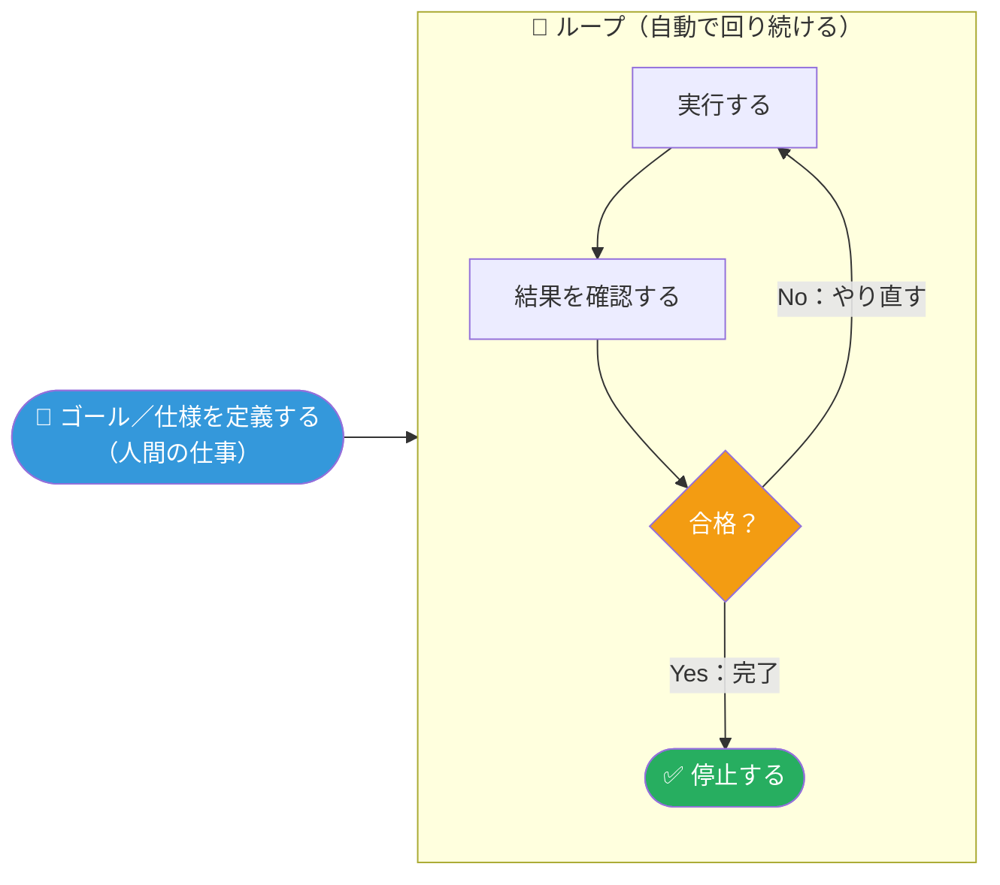

海外の開発者コミュニティでは、この考え方を一言で「**検証（チェック）のないタスクはただの願望にすぎない**」と表現することもあります<sup>[11]</sup>。ループの価値のほぼ半分は「うまく繰り返す設計」にあり、残り半分は「ノーと言える仕組み（検証）」にある、と指摘されています<sup>[12]</sup>。

### 3.1 プロンプトエンジニアリングとの違い

| 観点 | プロンプトエンジニアリング | Loop Engineering |
|------|--------------------------|-------------------|
| 人間の役割 | 毎回プロンプトを打つ実行者 | ループを設計するアーキテクト |
| 繰り返しの主体 | 人間 | システム（自動化） |
| 対応できる作業時間 | 人が張り付いている間だけ | 24時間365日（人が寝ていても） |
| 品質保証の方法 | 人間が目で見て確認 | 独立した検証ステップ（Verifier）が判定 |
| 典型的な失敗 | 疲れて雑になる、抜け漏れ | 検証が甘いまま暴走し、コストだけ膨らむ |

---

## 4. Andrew Ngの3つの入れ子ループ

Andrew Ng氏は、Loop Engineeringという言葉が指す「1つのループ」だけでなく、それを包み込むもっと大きな2つのループも含めて、**0→1でプロダクトを作るときの3つのループ**として整理しました<sup>[6][7]</sup>。それぞれ回転速度（サイクルタイム）が異なります。

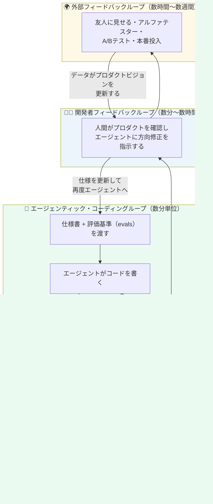

### 4.1 各ループの詳細

| ループ | 誰が回すか | 周期 | 何をするか |
|--------|-----------|------|-----------|
| **① エージェンティック・コーディングループ** | AIエージェント | 数分〜数十分ごと | 仕様書と評価データ（evals）をもとに、コードを書く→自分でテストする→仕様を満たすまで繰り返す<sup>[6]</sup> |
| **② 開発者フィードバックループ** | 人間（開発者） | 数十分〜数時間 | 出来上がったプロダクトを見て、エージェントの向かう方向を調整する。Ng氏はこれを「人間が持つコンテキストの優位性」と表現しています<sup>[6]</sup> |
| **③ 外部フィードバックループ** | ユーザー・市場 | 数時間〜数週間 | 友人へのヒアリング、アルファテスト、A/Bテスト、本番運用でのフィードバックを集める<sup>[6]</sup> |

Ng氏が強調しているのは、②の「開発者フィードバックループ」を自動化しきれない理由です。人間がAIの知らない情報（顧客の声、業界の常識、暗黙のセンス）を持っている限り、それをシステムに注入するために人間がループの中に残り続ける必要がある、という論点です<sup>[6]</sup>。俗に「センス（taste）」と呼ばれるこの人間の貢献を、Ng氏は「コンテキストの優位性」と呼び変えることで、AIをどう改善すればよいかの手がかりにできると説明しています。

### 4.2 「Loop Engineering」が指しているのはどのループ？

Boris Cherny氏やPeter Steinberger氏が話題にした「Loop Engineering」は、上記のうち主に**①エージェンティック・コーディングループ**、つまり最も内側の高速なループを自動化する技術を指しています<sup>[10][13]</sup>。本ガイドの残りの章では、この①のループをどう設計・実装するかに焦点を当てます。

---

## 5. ループの解剖学：1ターンを構成する5つの動き

Addy Osmani氏はループの1回転（1ターン）を、次の**5つの動き（moves）**に分解しています<sup>[4][5][14]</sup>。

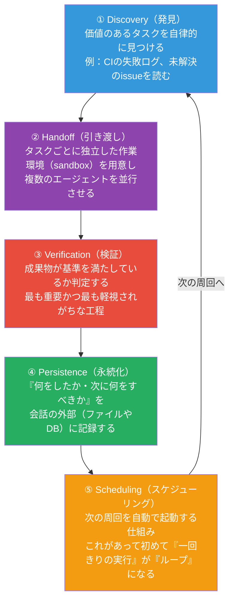

| 動き | 説明 | 具体例 |
|------|------|--------|
| **Discovery（発見）** | 「今どのタスクをやるべきか」を人間ではなくシステムが判断する | 昨日のCI失敗ログ、放置されているissue、直近のコミットを読んで優先順位をつける<sup>[14]</sup> |
| **Handoff（引き渡し）** | 見つけたタスクを独立した実行環境に渡し、他の作業に干渉させない | git worktreeで別の作業ディレクトリを切り、複数エージェントを並行実行する<sup>[15]</sup> |
| **Verification（検証）** | 成果物が「完了」の基準を満たしているかどうかを判定する | 別のエージェント（レビュー役）やテストスイートが結果を採点する。最も見落とされやすい工程<sup>[14][16]</sup> |
| **Persistence（永続化）** | 会話（コンテキストウィンドウ）の外側に進捗を書き残す | Markdownファイル、Linearボード、SQLite、TODO.mdなど<sup>[17]</sup> |
| **Scheduling（スケジューリング）** | 一定間隔・条件でループを自動起動する | cronジョブ、GitHub Actions、Claude Codeの `/loop` や `/schedule`<sup>[18]</sup> |

Osmani氏の実例では、朝になると自動でトリアージのタスクが起動し、昨日失敗したCIテストや未解決のissue、最近のコミットを読んで対応すべき項目をMarkdownやLinearボードに書き出し、対応が必要なものごとに独立したworktreeを立て、1体のエージェントが修正案を作り、別のエージェントがプロジェクトのルールとテストに照らしてレビューし、コネクタが自動でプルリクエストを開いてチケットを更新する、という流れが紹介されています。人間の手が必要なものだけ受信箱に残り、翌日はその続きから再開できるよう状態ファイルが保持されます<sup>[14]</sup>。

---

## 6. ループを支える6つの部品

「5つの動き」が**何が起きるか**だとすれば、それを実現するために手元に必要な**6つの部品（parts）**があります<sup>[14][19]</sup>。

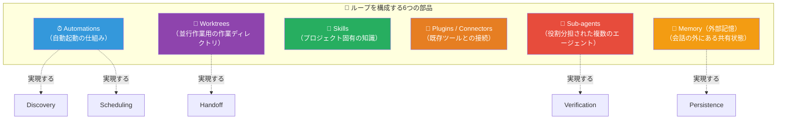

| 部品 | 役割 | もし無かったら |
|------|------|----------------|
| **Automations（自動起動）** | 決まったスケジュールやトリガーでループを起き上がらせる | 「一度きり実行した記録」であり、ループとは呼べない<sup>[14]</sup> |
| **Worktrees（作業木）** | Gitの機能を使い、1つのリポジトリに複数の独立した作業ディレクトリを用意する | 並行して動く複数のエージェントが同じファイルを取り合い、状態が壊れる<sup>[14]</sup> |
| **Skills（スキル）** | プロジェクト固有の知識・手順を、必要なときだけ読み込む形でまとめておく | エージェントが毎回推測に頼り、判断がぶれる<sup>[9]</sup> |
| **Plugins / Connectors（連携）** | Linear、Slack、GitHubなど既存ツールと繋ぐ | 発見した課題や成果物を人間の使う場所に届けられない<sup>[19]</sup> |
| **Sub-agents（サブエージェント）** | 「作る役」と「確認する役」を別のエージェント・別のモデルに分ける | 自分の仕事を自分で採点することになり、自己満足の評価になりやすい（次章参照）<sup>[19][20]</sup> |
| **Memory（外部記憶）** | 会話の外（ファイル・DB・チケット管理ツールなど）に状態を保存する | モデルは実行と実行の間の記憶を持たないため、前回何をしたか分からず同じ作業を繰り返したり、逆に必要な作業を見落としたりする<sup>[17]</sup> |

> ⚠️ **実体験からの教訓**：ある開発者が構築したブログ記事提案の自動ループは、前日に何を提案したか記録していなかったために、3日連続で同じテーマの記事を提案し続けてしまいました。「昨日までの提案一覧」をMarkdownファイルに書き出し、提案前にそれを検索して重複を除く処理を1行加えただけで、問題は即座に解決したと報告されています<sup>[17]</sup>。**状態はプロンプトの中ではなく、ループの外側に置く**というのが得られた教訓です。

---

## 7. 心臓部：GeneratorとVerifierの分離

Loop Engineeringに関する複数の技術解説が共通して強調しているのが、**「作る役（Generator）」と「確認する役（Verifier）」を分ける**という原則です<sup>[16][20]</sup>。

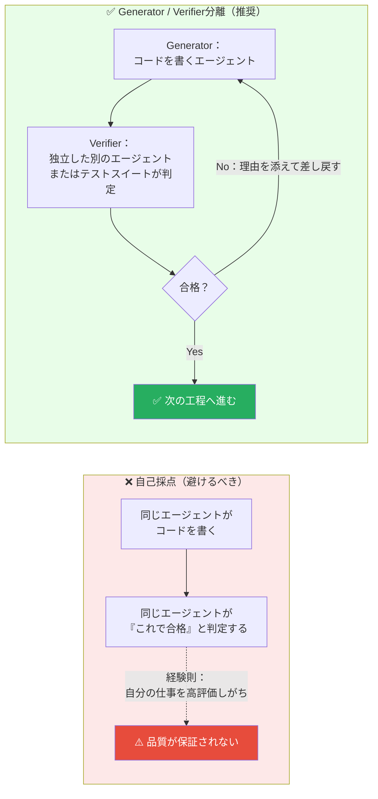

複数の解説記事が指摘している経験則は、**AIエージェントは自分自身の成果物を採点させると、甘く評価しがちである**という点です<sup>[16]</sup>。そのため、生成モデル自身に「批判的になれ」と指示するよりも、**独立した懐疑的な評価者（Verifier）を別途チューニングするほうがはるかに扱いやすい**とされています<sup>[16]</sup>。

Claude Codeの `/goal` コマンドも同じ発想で設計されており、タスクの完了判定を実行担当のモデル自身にさせるのではなく、まっさらな別のモデルインスタンスに判定させる、という「作る側」と「確認する側」を分離する仕組みになっています<sup>[19]</sup>。

### 7.1 Verifierに使える具体的な手段

Verifier（検証役）は必ずしもAIである必要はありません。むしろ**決定論的で機械的に判定できる手段ほど信頼性が高くなります**。

| Verifierの種類 | 具体例 | 信頼性 |
|----------------|--------|--------|
| 自動テスト（ユニット・統合・E2E） | pytest, Jest, Playwright | 🟢 高い（決定論的） |
| 静的解析・型チェック | ESLint, mypy, TypeScriptコンパイラ | 🟢 高い |
| ビルド／CI パイプライン | GitHub Actionsのビルド結果 | 🟢 高い |
| 独立したレビューエージェント（別モデル・別プロンプト） | code-reviewerサブエージェント | 🟡 中程度（AI判定なので過信は禁物） |
| 生成した本人のエージェントによる自己申告 | 「テストは通りました」という自己申告のみ | 🔴 低い（避けるべき） |

ここで、ソフトウェアテストの世界で長く使われてきた**テストピラミッド**の考え方が活きてきます。Martin Fowler氏が2012年に紹介したこの考え方は、実行が速く安定した**ユニットテストを土台に厚く積み、E2Eテストのような広く遅いテストは少数に絞る**というものです<sup>[21][22]</sup>。AIエージェントが自分の書いたコードを大量に生成する時代でも、この土台となる考え方は変わりません。むしろAIが書いたコード量が増えるほど、高速で信頼できる自動テストという「安全網」の重要性は増しています<sup>[23]</sup>。

なお、Martin Fowler氏自身も、LLMが「テストを削除・スキップすることでチェックを緑にしてしまう」ことがあると注意を促しています<sup>[24]</sup>。Verifierを設計する際は、**テストの本数や見かけ上のカバレッジだけでなく、そのテストが本当にバグを検出できるかどうか**まで意識する必要があります。

---

## 8. 原点：Ralph Wiggumテクニック

Loop Engineeringという言葉が生まれる約1年前、2025年半ばにソフトウェアエンジニアの**Geoffrey Huntley氏**が、ループの原始的な実装として「**Ralph（Ralph Wiggumテクニック）**」を発表していました<sup>[25][26]</sup>。名前はアニメ『ザ・シンプソンズ』に登場する、憎めないが不器用なキャラクターに由来します。

### 8.1 仕組みはたった1行のbashループ

```bash
# Ralphの核となる考え方（概念コード）
while :; do
  cat PROMPT.md | npx --yes @your-favorite-coding-agent
done
```

このループは、1つの固定されたプロンプトファイル（`PROMPT.md`）を繰り返しエージェントに読み込ませ、セッションが終わるたびに新しいセッションを即座に立ち上げます。前回のセッションで得られたエラーやログも次の回に引き継がれ、ディスク上のファイルを通じて作業が続いていきます<sup>[27]</sup>。

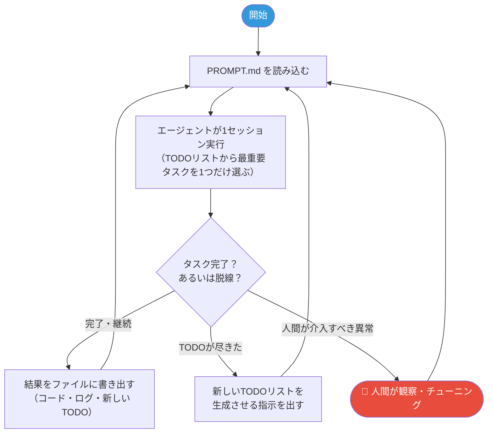

### 8.2 Ralphから学べる大事な教訓

| 教訓 | 内容 |
|------|------|
| **1ループ1タスク** | 複雑な多段階計画を事前に立てさせるより、「最も重要なタスクを1つだけ選んで実行する」ほうがコンテキストの消費を抑えられ、モデルは元々タスクの優先順位付けが得意だとHuntley氏は述べています<sup>[28]</sup> |
| **人間はループの中ではなく上に座る** | 人間の仕事は自分でコードを書くことではなく、Ralphが成功するための環境・プロンプト・ガードレールを整えることに変わる<sup>[29]</sup> |
| **プロンプトはギターのように調律する** | 失敗パターンを観察し、都度プロンプトに「注意書き」を追加していく。最初から完璧なプロンプトは存在しないという前提に立つ<sup>[29]</sup> |
| **コンテキストの圧縮（compaction）を警戒する** | コンテキストウィンドウが埋まってくると自動的に古い情報が圧縮・破棄される。重要な仕様がここで失われると、エージェントは自分の要約に頼るしかなくなり、目的からずれていく<sup>[30]</sup> |
| **向いている作業と向いていない作業がある** | 依存関係の一括移行や大規模リファクタリングなど、プログラム的に進捗と完了を検証できる作業には向く。UI/UXや曖昧な要件を含む作業では、進捗と正しさを継続的な人間の入力なしに定義しにくい<sup>[30]</sup> |

2026年に入り、Anthropicのエンジニアがこの技術を公式のClaude Codeプラグイン「ralph-wiggum」として整備しました。外部のbashループの代わりに、Claude Codeのセッション終了を止める「stop hook」という仕組みを使い、`/ralph-loop` のようなスラッシュコマンドで起動できるようになっています<sup>[31]</sup>。ただし考案者のHuntley氏自身は、公式プラグイン化によって「操作を放置しても大丈夫な製品」だと誤解されるリスクに注意を促しており、LLMはあくまで「操作者のスキルを増幅する道具」であり、ただ起動して放置するだけではうまくいかないと述べています<sup>[32]</sup>。

---

## 9. ステップバイステップ実践ガイド

ここからは、実際に自分の手でループを組み立てるための手順を、初心者でも迷わないよう順番に解説します。

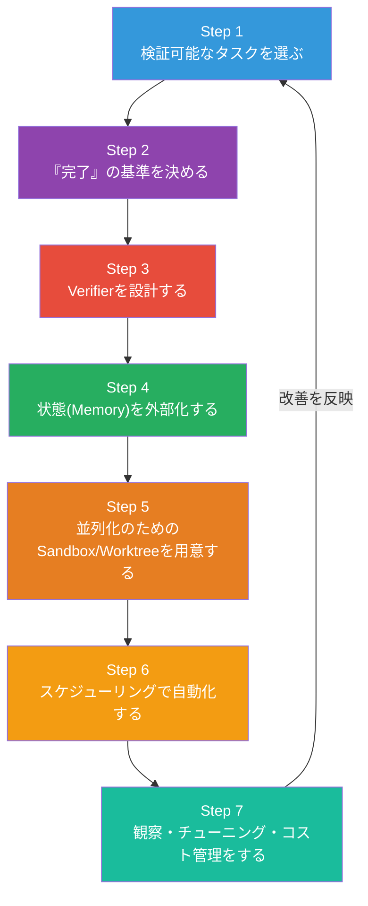

### Step 1：検証可能なタスクを選ぶ

すべてのタスクがループ向きなわけではありません。まずは「機械的に正解・不正解を判定できるタスク」から始めるのが鉄則です。

| ✅ ループ向きなタスク | ❌ ループ向きでないタスク |
|----------------------|---------------------------|
| 依存パッケージのバージョン移行 | まったく新しいUI/UXのデザイン |
| 型エラー・Lintエラーの一括修正 | ブランド戦略や事業方針の決定 |
| CIの失敗しているテストの修正 | 「良い雰囲気」など主観的な評価が必要な作業 |
| 既存パターンに沿ったテストコードの追加 | 一度きりの調査・意思決定 |
| ドキュメントとコードの同期 | 顧客に直接影響する重大な意思決定 |

判断に迷ったら、「この作業が終わったかどうかを、人間が目視確認せずプログラムだけで判定できるか？」と自問してください。できないなら、まず人間の判断基準を明文化するところから始める必要があります。

### Step 2：「完了」の基準（Stop Condition）を決める

ループ最大のリスクは「終わり時を決めずに走らせてしまうこと」です。始める前に、必ず次の3種類の停止条件を用意します。

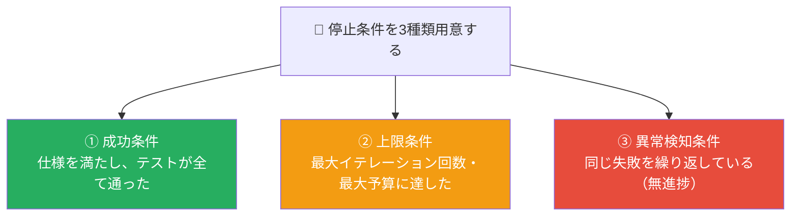

実務でよく使われる具体的な設定例：

| 条件の種類 | 設定例 |
|-----------|--------|
| 成功条件 | 「指定したテストスイートがすべてグリーンになる」「仕様書のチェックリストが全項目満たされる」 |
| 上限条件（回数） | 最大イテレーション回数を指定するオプション（例：`--max-iterations 20`） |
| 上限条件（コスト） | 1日あたり／1ジョブあたりのドル予算の上限を決めておく |
| 無進捗検知 | 直近N回のイテレーションで差分（diff）がほぼゼロ、または同じエラーメッセージが繰り返されている場合に停止する |

「停止条件を決めずにループを回す」ことは、根本的な設計ミスとされています。無人のループが検証の甘いまま走り続けると、失敗は静かに起こり、気づいたときには夜通しトークン代だけが積み上がっている、という指摘があります<sup>[12]</sup>。

### Step 3：Verifierを設計する

前章（7章）で述べたGenerator / Verifier分離の原則をここで実装に落とし込みます。

1. **既存の自動テストを土台にする**：ユニットテスト → 統合テスト → E2Eテストの順に、実行が速く数が多いものを優先します（テストピラミッドの考え方）<sup>[21]</sup>。
2. **レビュー役のサブエージェントを別途用意する**：コードを書くエージェントとは別のモデル・別のプロンプトで、プロジェクトのルール（コーディング規約やAGENTS.mdなど）に照らしてレビューさせます<sup>[19]</sup>。
3. **人間が確認すべき境界線を明文化する**：「テストが通れば自動マージしてよい変更」と「必ず人間の承認が必要な変更（例：認証まわり、課金まわり、削除操作）」を事前に切り分けます。

### Step 4：状態（Memory）をループの外に置く

AIモデルは実行と実行の間の記憶を持ちません。前回何をしたか、今何が終わっていて何が残っているかは、**会話の外側にある永続的な場所**に書き出す必要があります<sup>[17]</sup>。

代表的な選択肢：

| 保存先 | 向いている用途 |
|--------|----------------|
| `TODO.md` / `PROGRESS.md` などのMarkdownファイル | 小規模〜中規模のプロジェクト、個人利用 |
| Linear / Jira などのチケット管理ツール | チームで共有する必要がある場合 |
| SQLite / 軽量DB | 構造化されたログを蓄積・検索したい場合 |
| Git のコミット履歴そのもの | 「何がいつ変わったか」を追いたい場合 |

ここで重要なのは、**「今日提案する記事は何か」のような判断材料を、システムプロンプトに固定でハードコードしないこと**です。前述のブログ提案ループの失敗例のように、状態がプロンプトに埋め込まれていると更新が反映されず、重複や矛盾が発生します。エージェントに毎回外部の記憶を実際に読みに行かせる（例：ファイルを`ls`して`grep`する）ことで、この種の事故を防げます<sup>[17]</sup>。

### Step 5：並列化のためのSandbox / Worktreeを用意する

複数のタスクを同時に処理したい場合、それぞれのエージェントが互いのファイルを壊さないよう、**独立した作業環境**を用意します。

- **Git Worktree**：1つのリポジトリに対して複数の独立した作業ディレクトリを作れるGitの標準機能です。並行して動くエージェントが同じファイルを同時に触って壊す事故を防ぎます<sup>[15]</sup>。
- **サンドボックス環境**：ファイルシステムやネットワークへのアクセスを制限した隔離環境で実行し、意図しないコマンド実行の被害範囲を限定します。

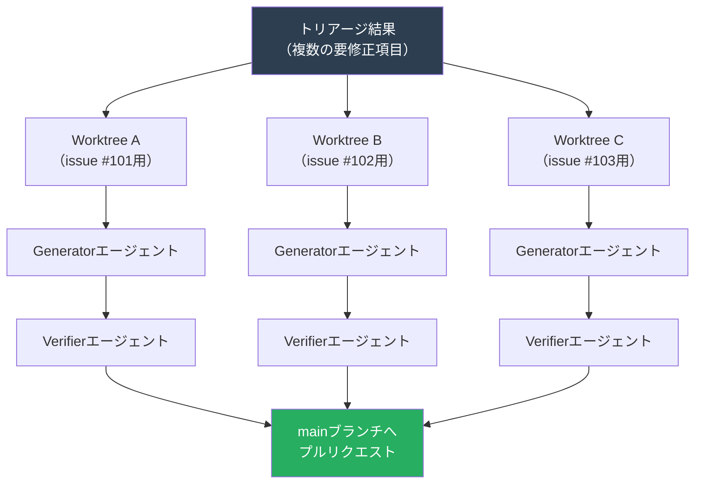

### Step 6：スケジューリングで自動化する

ここまでの部品が揃って初めて、「一度きりの実行」が本当の意味での「ループ」になります。トリガーの方法はいくつかあります。

| 方式 | 特徴 |
|------|------|
| ローカルのcronジョブ | シンプルだが、マシンの電源が入っている間しか動かない |
| クラウド上のスケジュールタスク | マシンを閉じても実行され、再起動をまたいで継続できる |
| CI/CD（GitHub Actionsなど）のスケジュールトリガー | 既存のCI基盤に統合しやすく、チームで共有しやすい |
| ツール内蔵のスケジューリング機能 | Claude Codeの `/loop`（セッション内の一定間隔実行）や `/schedule`（クラウド常駐のcronタスク）など（次章で詳述） |

### Step 7：観察・チューニング・コスト管理をする

ループを起動したら終わりではありません。運用しながら次の観点で継続的に見直します。

- **失敗パターンの記録**：エージェントが同じ間違いを繰り返す箇所があれば、プロンプトやAGENTS.md／CLAUDE.mdに「注意書き」として追記します（8.2節「ギターの調律」の教訓）。
- **トークン・コストの監視**：想定外にコストが跳ね上がっていないか、1日単位・1ジョブ単位で確認します（12章のリスクも参照）。
- **人間へのエスカレーション経路の確認**：ループが自力で解決できなかった項目が、きちんと人間の受信箱（Triage Inbox）に届いているかを確認します<sup>[14]</sup>。

---

## 10. 具体例で理解する：朝のCIトリアージ・ループ

Addy Osmani氏が紹介している「朝のトリアージ・ループ」の例を、これまでの用語と対応させて整理します<sup>[14]</sup>。

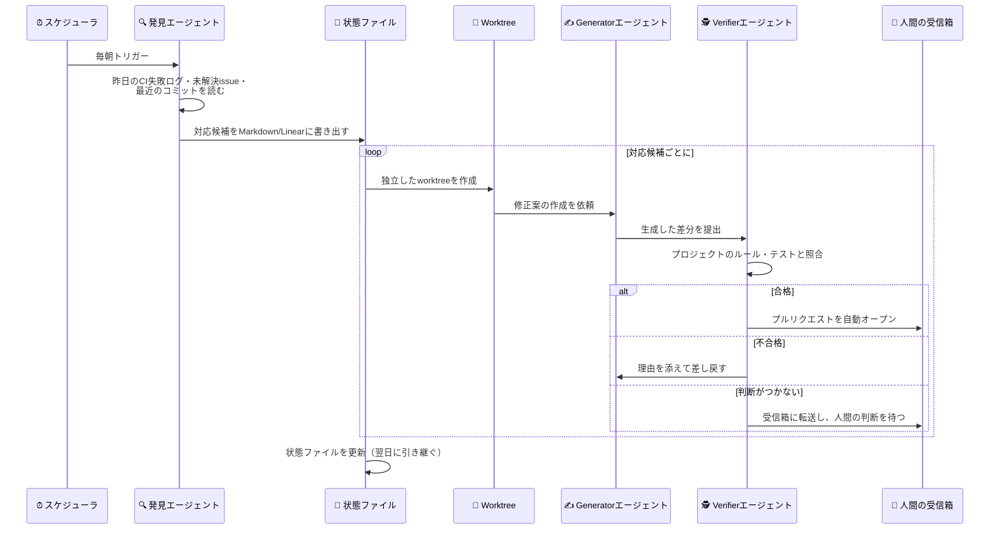

この例からわかる重要なポイントは、**「何も見つからなかった実行はそのまま自己完結して終わる」**ことです。対応が必要な項目が見つかったときだけ人間の元に届き、それ以外は静かに完了します。人間はループの中に張り付いている必要はありませんが、**必要な場所ではきちんと立ち止まって人間を待つ**設計になっています<sup>[14]</sup>。

---

## 11. Claude Codeで実際に組んでみる

Loop Engineeringに必要な部品は、2026年前半にかけてClaude Code（Anthropic）やOpenAI Codexといった主要なコーディングエージェント製品に標準搭載されるようになりました<sup>[4][19]</sup>。ここではClaude Codeを例に、代表的な機能と対応関係を紹介します。

> ⚠️ 以下はガイド執筆時点の情報を整理したものです。コマンド名や仕様は更新される可能性が高いため、実装前に必ずClaude Codeの公式ドキュメント（https://code.claude.com/docs/ ）を確認してください。

### 11.1 主な機能と5つの動きの対応

| Loop Engineeringの動き | Claude Codeでの対応機能 |
|------------------------|--------------------------|
| Discovery / Scheduling | `/loop`（セッション内で一定間隔ごとに再実行）、`/schedule` または `claude trigger create`（クラウド上のcronタスクとして永続実行）、Hooks（ライフサイクルの特定タイミングでシェルコマンドを発火）<sup>[18][33]</sup> |
| Handoff | Git Worktreeによる並列作業ディレクトリの分離、バックグラウンド実行（Ctrl+Bでサブエージェントを裏で動かしながら手元の作業を継続）<sup>[34]</sup> |
| Verification | サブエージェント（Subagents）に「コードレビュー専任」など役割を持たせ、実装担当とは別の文脈・別のモデルで検証させる<sup>[35]</sup> |
| Persistence | `CLAUDE.md` / `AGENTS.md`（プロジェクトの前提知識）、進捗ファイル、MCP経由でのLinear連携など<sup>[19][35]</sup> |
| （知識の注入） | Skills（`.claude/skills/`以下にまとめた、必要なときだけ読み込む手順書） |

### 11.2 スケジューリングの選び方

| 選択肢 | 永続性 | 向いている用途 |
|--------|--------|-----------------|
| `/loop <間隔> <コマンド>` | セッションが開いている間だけ | 「15分おきにサブエージェントの完了を確認する」など、今このセッション内で完結する短期の反復<sup>[33]</sup> |
| `/schedule` またはクラウドのスケジュールタスク | マシンの再起動・終了をまたいで継続 | 「毎週平日9時にCIダッシュボードを確認して要約する」など、長期的に繰り返す定型業務<sup>[33]</sup> |
| Hooks（`PreToolUse` / `PostToolUse` / `Stop` など） | イベント駆動（時間ではなく出来事に反応） | 「ファイル編集のたびにLintを走らせる」「セッション終了時に必ずテストを走らせてから終わらせる」など、確実に実行させたい処理<sup>[36]</sup> |
| 外部のCIツール（GitHub Actionsなど）からヘッドレス起動 | CI基盤に依存 | チーム共有の定型ワークフローに組み込みたい場合 |

### 11.3 Subagents（サブエージェント）の実装イメージ

サブエージェントは、それぞれ独自のシステムプロンプト・使用できるツール・独立したコンテキストウィンドウを持つ、専門特化したAIインスタンスです。例えば「コードレビュー専任」のサブエージェントは、次のように定義できます（概念例）<sup>[35]</sup>。

```yaml
---
name: code-reviewer
description: コード品質・セキュリティを専門にレビューする。実装直後に必ず使用する。
tools: Read, Grep, Glob, Bash
model: sonnet
---
あなたはコード品質とセキュリティを厳しくチェックするシニアレビュアーです。
実装を書いたエージェントとは独立した視点で、以下を確認してください：
- プロジェクトのルール（CLAUDE.md）に沿っているか
- テストが実際にバグを検出できる内容になっているか
- セキュリティ上の懸念（権限、入力値検証など）がないか
```

このように「作る役」と「確認する役」を別ファイル・別プロンプトとして明示的に分離しておくことが、7章で述べたGenerator / Verifier分離を実装レベルで実現する具体的な方法です。

### 11.4 まず動かしてみる最小構成（初学者向け）

複雑な仕組みを一気に組む前に、次のようなごく小さな構成から始めることをお勧めします。

1. すでにテストが整備されている小さなリポジトリを1つ用意する
2. 「失敗しているテストを1つ選んで直す」という単純な仕様書を用意する（Step 1・2）
3. 実装用のセッションとは別に、レビュー専用のサブエージェントを1つ定義する（Step 3、11.3節）
4. 進捗を`PROGRESS.md`に書き出すようエージェントに指示する（Step 4）
5. `/loop`を使い、短い間隔（例：数分おき）で「テストが全部通ったか確認して、通っていなければ続行」という指示を回してみる（Step 6）
6. 最大イテレーション回数を必ず設定し、最初は目の前で観察しながら動かす（Step 2・7）

慣れてきたら、Worktreeでの並列化やクラウドのスケジュールタスクへと段階的に拡張していきます。

---

## 12. リスクと注意点

Loop Engineeringは強力な一方、複数の実践者・批評家から具体的なリスクが指摘されています。導入前に必ず把握しておきましょう。

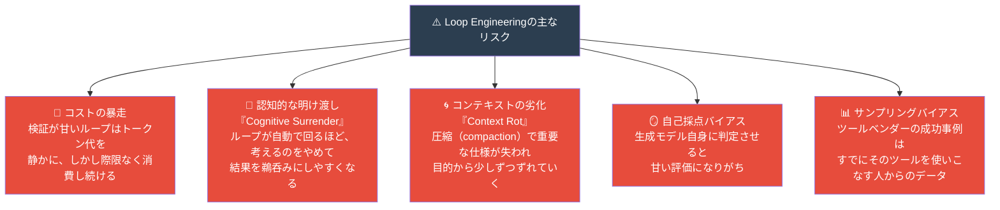

### 12.1 コストの暴走：実例

大手配車サービスUberでは、エンジニア一人あたりのエージェント関連ツール利用に月1,500ドルの上限を設けたと報じられています。これは、年間のAI予算をわずか4か月で使い切ってしまったことを受けた措置とされています<sup>[37]</sup>。**検証（Verifier）が弱いまま放置されたループは、派手に失敗するのではなく、トークン価格という形で一晩中静かに失敗し続ける**という指摘は、コスト管理の重要性を端的に表しています<sup>[37]</sup>。

### 12.2 「認知的な明け渡し」への警戒

Addy Osmani氏自身も、ループ設計が「思考停止への近道」になりうる危険性に言及しています。ループが自分で回り始めると、人間はつい思考を止めて、返ってくる結果をそのまま受け入れがちになる、という懸念です<sup>[9][38]</sup>。ソフトウェアエンジニアのArmin Ronacher氏も同様の懸念を共有しているとされています<sup>[9]</sup>。ループの設計は、判断力を働かせて行えば効果的な処方箋になり得る一方、考えることを避けるために行えば逆効果になる、というのがOsmani氏の立場です<sup>[9]</sup>。

### 12.3 コンテキストの劣化（Context Rot）とCompaction

長時間動き続けるループでは、コンテキストウィンドウが埋まるたびに古い情報が自動的に圧縮・破棄されます。Geoffrey Huntley氏はこれを「圧縮は悪魔だ」とまで表現しており、重要な仕様がこの過程で失われると、エージェントは自分自身の不完全な要約に頼らざるを得なくなり、当初の目的から少しずつずれていく（ドリフトする）と警告しています<sup>[30]</sup>。これを避けるための工夫が、8章・Step 4で述べた「状態を会話の外側（ディスク上のファイルなど）に持たせる」設計です。

### 12.4 このムーブメント自体への健全な懐疑

すべての意見が肯定一色というわけではありません。ある開発者は、Claude Codeのようなツールが「ソフトウェアを書く」という課題を解決していることは事実だとしつつも、それだけで「誰もがどうソフトウェア開発をすべきか」を再定義する根拠にはならないと指摘しています。理由は単純で、ベンダーが示すデータの多くは、すでにそのベンダーの製品を積極的に使っているユーザーから得られたものだからです<sup>[8]</sup>。この2つの見方――「本物の転換点である」ことと「証拠には偏りがある」こと――は両立しうる、という冷静な受け止め方が重要です<sup>[8]</sup>。

また別の視点として、ループをエージェント中心に設計すること自体への批判もあります。決定論的なロジック（プログラム）こそが土台であり、LLMはあくまでその土台の上で使われる部品にすぎない、という考え方です。ループを設計しただけで満足してしまい、その先に本当のユーザーがいなければ、それは思考停止を先延ばしにしているに過ぎない、という手厳しい指摘もあります<sup>[39]</sup>。ループが何を最適化すべきか、「完了」とは何を意味するのか、どこで処理を止めるべきかを最終的に決めるのは、依然として人間の役割です<sup>[39]</sup>。

### 12.5 リスクと対策のまとめ

| リスク | 対策 |
|--------|------|
| コストの暴走 | Step 2で必ず金額・回数の上限を設定する。日次・週次でコストダッシュボードを確認する |
| 認知的な明け渡し | Verifierの判定結果を定期的に人間が抜き打ちで確認する。「なぜ合格としたか」の理由をログに残させる |
| コンテキストの劣化 | 重要な仕様は会話の外（ファイル）に保存し、毎ターン読み直させる。圧縮が起きたタイミングをログで把握する |
| 自己採点バイアス | Generator（作る役）とVerifier（確認する役）を必ず別のプロンプト・可能なら別のモデルにする |
| サンプリングバイアスへの過信 | 自社の環境で小規模に試し、成功事例をそのまま鵜呑みにしない |

---

## 13. 成熟度モデルと健全性チェック

### 13.1 Loop Engineering成熟度モデル

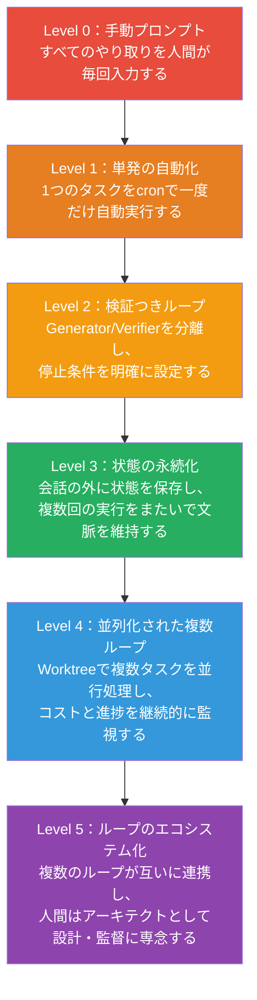

### 13.2 健全性チェックフロー

自分のループが健全かどうか、導入後に振り返るためのチェックリストです。

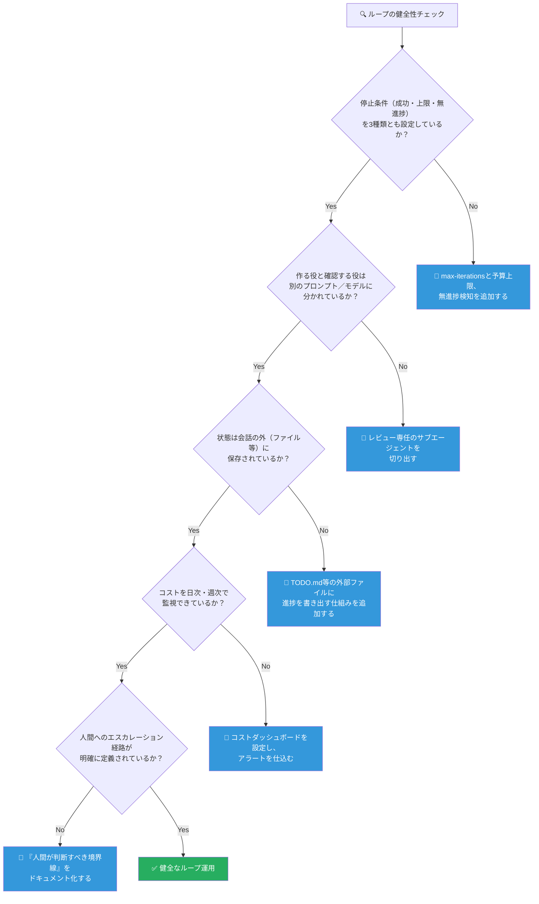

---

## 14. まとめ

- **Loop Engineering**とは、人間がAIエージェントに毎回プロンプトを打つ役目をやめ、その繰り返し処理を担うシステム自体を設計する考え方です<sup>[4]</sup>。
- 系譜としては、Prompt Engineering → Context Engineering → Harness Engineering に続く4番目の層として位置づけられています<sup>[9]</sup>。
- Andrew Ng氏は、この考え方をさらに大きな枠組みで捉え、**エージェンティック・コーディングループ（分単位）／開発者フィードバックループ（時間単位）／外部フィードバックループ（日〜週単位）**という3つの入れ子のループとして整理しています<sup>[6]</sup>。
- 1つのループは**Discovery・Handoff・Verification・Persistence・Scheduling**という5つの動きに分解でき、それを**Automations・Worktrees・Skills・Plugins/Connectors・Sub-agents・Memory**という6つの部品が実現します<sup>[14]</sup>。
- 成否を分ける最大のポイントは、**「作る役」と「確認する役」を分離すること**、そして**停止条件を必ず明示的に設計すること**です<sup>[16]</sup>。
- コストの暴走・認知的な明け渡し・コンテキストの劣化といったリスクが実例つきで報告されており、導入時には十分な注意とガードレールが必要です<sup>[9][30][37]</sup>。
- この分野はまだ生まれたばかりで急速に変化しています。実装の際は必ず各ツールの最新の公式ドキュメントを確認してください。

---

## 15. 参考文献・出典一覧

### 🐦 きっかけとなった発言・ニュースレター

| # | 出典 | URL |
|---|------|-----|
| [1] | Boris Cherny氏の発言を報じた記事（BigGo Finance） | https://finance.biggo.com/news/0be3d022-660e-4c74-9399-1e6f5cf70d24 |
| [2] | Boris Cherny氏「ループを書くのが仕事になった」に関する記事（Medium） | https://ai-engineering-trend.medium.com/claude-code-creator-boris-i-dont-write-prompts-anymore-i-write-loops-03540f440511 |
| [3] | Peter Steinberger氏の発言に関する記事（KuCoin News） | https://www.kucoin.com/news/flash/prompt-engineering-declines-as-loop-engineering-gains-momentum-in-silicon-valley |
| [6] | Andrew Ng氏のポスト「Loop engineering」（X / The Batch） | https://x.com/AndrewYNg/status/2071988145667928442 |
| [7] | Andrew Ngの3つのループに関する解説記事（explainx.ai） | https://explainx.ai/blog/andrew-ng-three-loops-0-to-1-products-2026 |
| — | Boris Cherny氏のポスト（X、ユーザー指定URL） | https://x.com/bcherny/status/2064426115255730578 |

### 📖 Loop Engineeringの定義・体系化

| # | 出典 | URL |
|---|------|-----|
| [4] | Addy Osmani「Loop Engineering」（本人ブログ） | https://addyosmani.com/blog/loop-engineering/ |
| [5] | 同上（Substack転載版） | https://addyo.substack.com/p/loop-engineering |
| [9] | 同上（O'Reilly Radar転載版） | https://www.oreilly.com/radar/loop-engineering/ |
| [10] | Loop Engineeringクラッシュコース（Panaversity Agent Factory） | https://agentfactory.panaversity.org/docs/loop-engineering-crash-course |
| [13] | Loop Engineeringガイド2026（AI Builder Club） | https://www.aibuilderclub.com/blog/loop-engineering-guide-2026 |
| [14] | 5つの構成要素の実例解説（Google Gate News） | https://www.gate.com/news/detail/google-engineer-loop-engineerings-five-building-blocks-let-ai-automatically-21751012 |
| [16] | Loop EngineeringのIEEE形式サマリー（HyperAI） | https://hyper.ai/en/papers/Loop-Engineering-IEEE |
| [19] | 実践フィールドガイド（DEV Community） | https://dev.to/truongpx396/the-agentic-loop-a-practical-field-guide-mnc |
| [20] | Loop Engineeringクラッシュコース（同上、Generator/Verifier分離） | https://agentfactory.panaversity.org/docs/loop-engineering-crash-course |

### 🔧 Ralph Wiggumテクニック

| # | 出典 | URL |
|---|------|-----|
| [25][26][29] | Geoffrey Huntley「Ralph Wiggum as a "software engineer"」（原典） | https://ghuntley.com/ralph/ |
| [28] | Dev Interrupted podcast「Inventing the Ralph Wiggum Loop」 | https://linearb.io/dev-interrupted/podcast/inventing-the-ralph-wiggum-loop |
| [30][37] | Ralph Wiggum流コーディングの解説（tessl.io） | https://tessl.io/blog/unpacking-the-unpossible-logic-of-ralph-wiggumstyle-ai-coding/ |
| [31] | Ralph Wiggum LoopとClaude Codeプラグイン化の経緯（Shiqi Mei） | https://shiqimei.github.io/posts/ralph-wiggum-loop-claude-code |
| [32] | Ralphの歴史（HumanLayer Blog） | https://www.humanlayer.dev/blog/brief-history-of-ralph |
| — | Ralph実践プレイブック（GitHub） | https://github.com/ghuntley/how-to-ralph-wiggum |
| — | Ralphループの経済性解説（LinearB Blog） | https://linearb.io/blog/ralph-loop-agentic-engineering-geoffrey-huntley |

### 🧪 ソフトウェアテスト関連（Verifier設計の参考）

| # | 出典 | URL |
|---|------|-----|
| [21] | Martin Fowler「The Practical Test Pyramid」 | https://martinfowler.com/articles/practical-test-pyramid.html |
| [22] | Martin Fowler「TestPyramid」（Bliki） | https://martinfowler.com/bliki/TestPyramid.html |
| — | Ministry of Testing「The Test Pyramid」解説 | https://www.ministryoftesting.com/software-testing-glossary/the-test-pyramid |
| [23] | AI時代におけるテストピラミッドの重要性（minware） | https://www.minware.com/blog/test-pyramid-ai-assisted-development |
| [24] | テストピラミッドは終わったのか（Augment Code、Martin Fowler氏への言及あり） | https://www.augmentcode.com/guides/is-the-test-pyramid-dead |

### 🛠️ Claude Code 実装関連（公式ドキュメント含む）

| # | 出典 | URL |
|---|------|-----|
| [33] | スケジュールタスク・Cronツールの解説（Panaversity Agent Factory） | https://agentfactory.panaversity.org/docs/General-Agents-Foundations/general-agents/scheduled-tasks-cron |
| [34] | Claude Codeの非同期・バックグラウンドエージェント解説 | https://claudefa.st/blog/guide/agents/async-workflows |
| [35] | Claude Code Hooks/Subagents/Skills完全ガイド | https://ofox.ai/blog/claude-code-hooks-subagents-skills-complete-guide-2026/ |
| [36] | Claude Code Hooksリファレンス（公式ドキュメント） | https://code.claude.com/docs/en/hooks |
| — | Claude Codeアーキテクチャ解説（Penligent） | https://www.penligent.ai/hackinglabs/inside-claude-code-the-architecture-behind-tools-memory-hooks-and-mcp/ |

### 📰 業界動向・背景解説

| # | 出典 | URL |
|---|------|-----|
| [8] | サンプリングバイアスへの指摘を含むフィールドガイド（DEV Community） | https://dev.to/truongpx396/the-agentic-loop-a-practical-field-guide-mnc |
| [12] | 「検証のないタスクは願望にすぎない」に関する実践ガイド（DEV Community） | https://dev.to/truongpx396/the-agentic-loop-a-practical-field-guide-mnc |
| [17] | Loop Engineeringの実践的教訓（個人ブログ、Gerald Chen） | https://chenguangliang.com/en/posts/blog191_loop-engineering-design-loops-prompt-agents/ |
| [38] | Loop Engineeringの日本語まとめ（note、MAKE A CHANGE, inc） | https://note.com/make_a_change/n/na8ae99b24c36?hl=en |
| [39] | ループ中心設計への批判「The Loop Is Not the Product」（DEV Community） | https://dev.to/dannwaneri/the-loop-is-not-the-product-466d |
| — | Jensen Huang氏の発言を含む業界動向解説（HTX Insights） | https://www.htx.com/news/jensen-huang-prompts-are-becoming-obsolete-loops-are-the-new-dqI2WOBl/ |
| — | DeepLearning.AI公式サイト（Andrew Ng氏のニュースレター元） | https://www.deeplearning.ai/ |

---

> ⚠️ **免責事項**：本ガイドで紹介した内容の多くは、2026年6月〜7月というごく最近の期間にSNS上で急速に広まった、まだ確立されていない実践知です。企業名・製品名・数値（コスト等）は各出典記事が報じた内容をそのまま紹介しており、筆者自身による検証を経たものではありません。実装前には必ず一次情報（各ツールの公式ドキュメント、原著者本人の発言）を確認することを強く推奨します。

*本ガイドは教育目的で作成されています。バージョン 1.0*