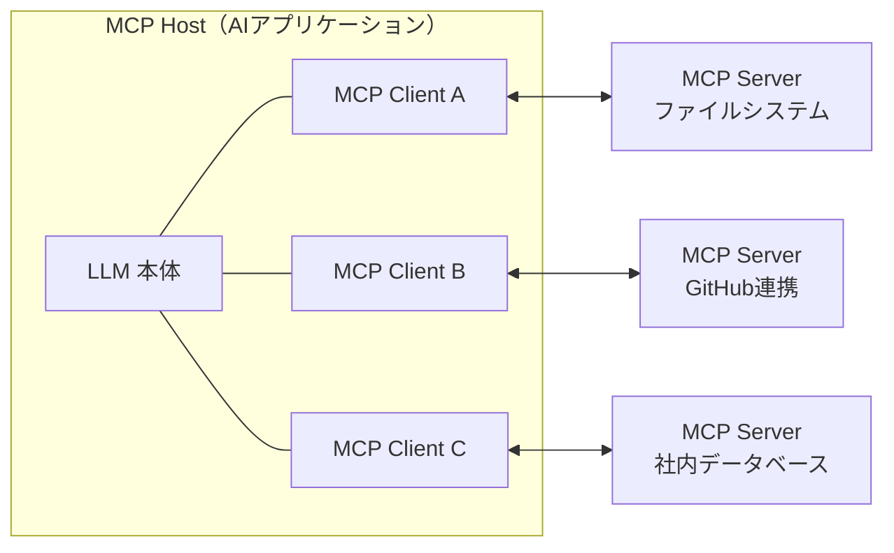
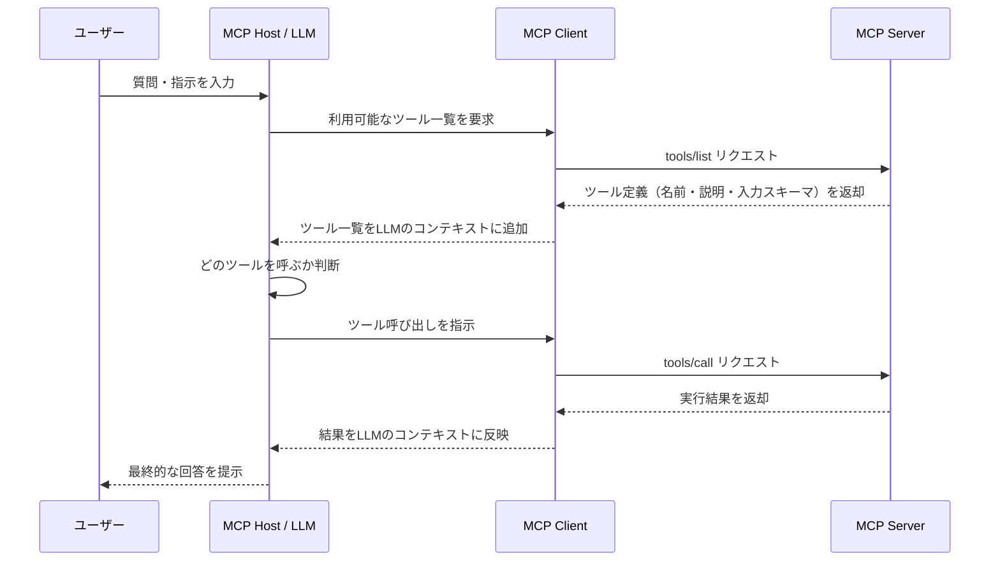
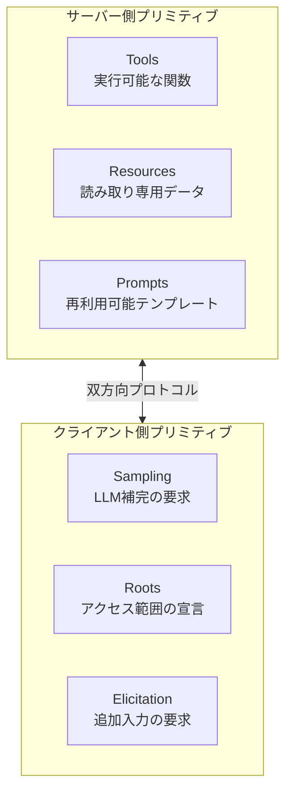
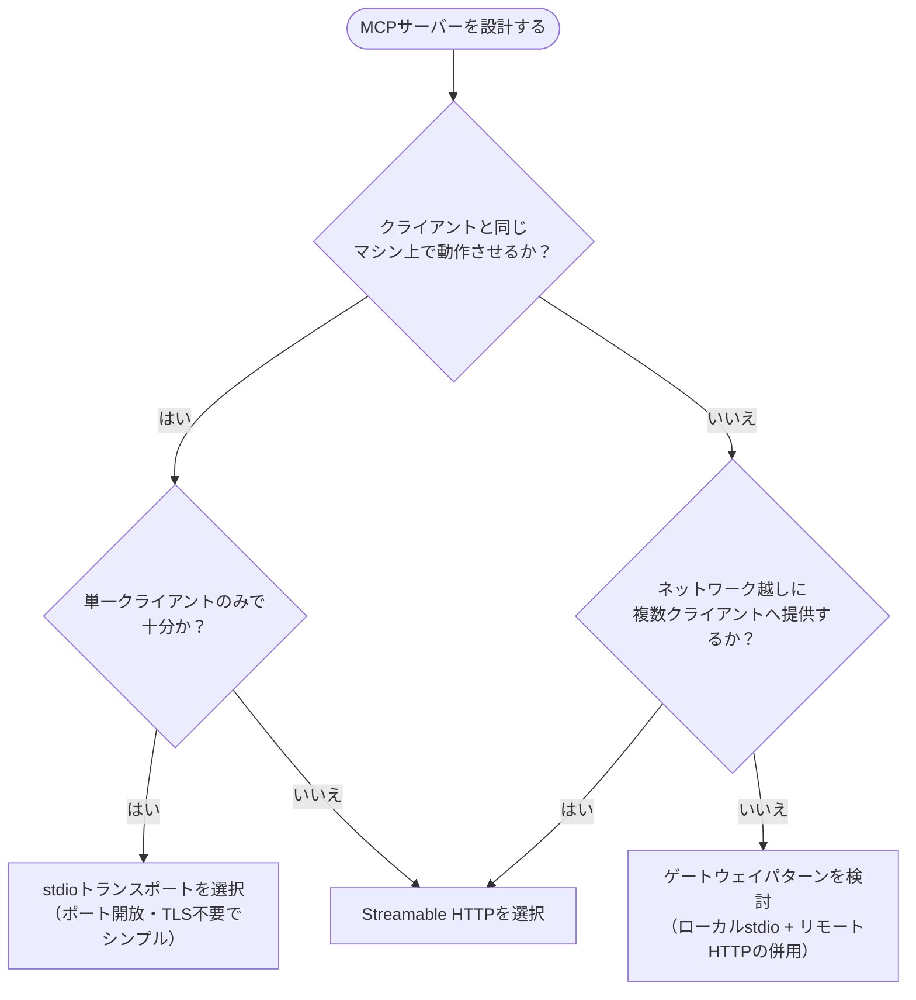
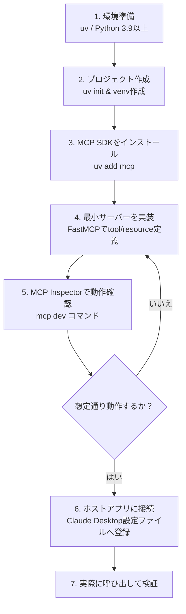
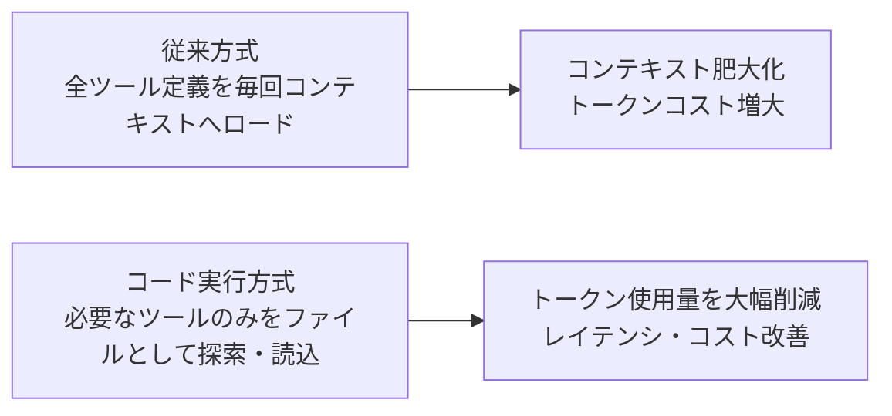
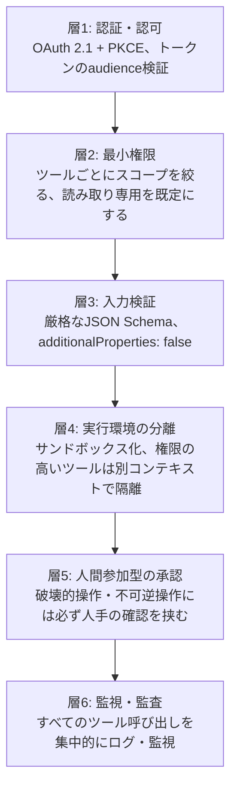
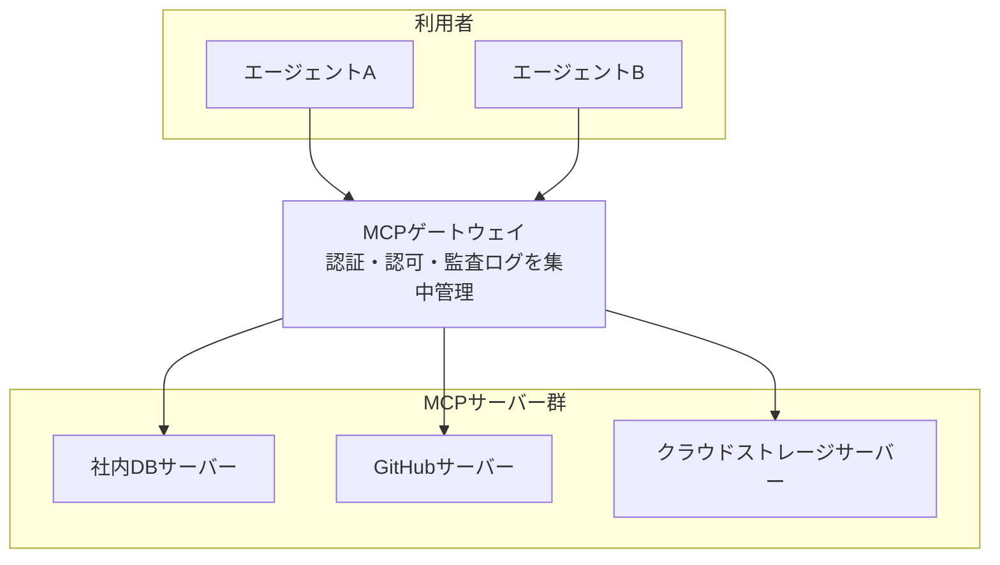

# Model Context Protocol (MCP) 実践ガイド
## 初学者のためのステップバイステップ・ベストプラクティス

> 最終更新日: 2026年7月7日時点の公開情報に基づく
> 対象読者: MCPをこれから学ぶソフトウェアエンジニア・QAエンジニア
> 前提知識: 基本的なプログラミング経験（Python/TypeScriptのいずれか）、REST APIやJSON-RPCの概念があると理解が早い

---

## この章の位置づけについて

MCP（Model Context Protocol）は2026年に入ってからも仕様改定が続いている、非常に変化の速い技術領域です。本ガイドは執筆時点で入手可能な一次情報（公式ドキュメント・公式ブログ・OWASPなどのセキュリティ団体の資料）を中心にまとめていますが、MCPは今後も仕様変更が見込まれるため、実装時は必ず公式ドキュメント（末尾の参考文献リンク）で最新情報を確認してください。特に2026年7月28日に大規模な仕様改定（ステートレス化・Extensions・Tasks機能など）が予定されているため、本ガイドの内容も今後変わる可能性があります。

---

## 目次

1. [MCPとは何か](#第1章-mcpとは何か)
2. [アーキテクチャの全体像](#第2章-アーキテクチャの全体像)
3. [プリミティブ（機能単位）を理解する](#第3章-プリミティブ機能単位を理解する)
4. [トランスポート層の選び方](#第4章-トランスポート層の選び方)
5. [ステップバイステップ：はじめてのMCPサーバーを作る](#第5章-ステップバイステップはじめてのmcpサーバーを作る)
6. [ツール設計のベストプラクティス](#第6章-ツール設計のベストプラクティス)
7. [セキュリティのベストプラクティス](#第7章-セキュリティのベストプラクティス)
8. [本番運用・デプロイのベストプラクティス](#第8章-本番運用デプロイのベストプラクティス)
9. [デバッグ・テスト・公開](#第9章-デバッグテスト公開)
10. [よくあるアンチパターンとその対策](#第10章-よくあるアンチパターンとその対策)
11. [まとめ：導入前チェックリスト](#第11章-まとめ導入前チェックリスト)
12. [参考文献一覧](#参考文献一覧)

---

## 第1章 MCPとは何か

### 1.1 一言で言うと

MCPは、AIアプリケーション（Claudeやその他のLLMアプリ）と外部システム（データベース、ファイル、SaaS、API等）を接続するためのオープンな標準プロトコルです。AnthropicはMCPを「AIアプリケーション用のUSB-C」に例えています。USB-Cが電子機器同士を統一的な方法で接続できるように、MCPはAIアプリケーションと外部システムを統一的な方法で接続します。

MCPを使うことで、たとえばAIエージェントは自分のGoogleカレンダーやNotionにアクセスして、よりパーソナライズされたアシスタントとして振る舞えるようになります。Claude CodeはFigmaのデザインからWebアプリ全体を生成できるようになり、企業向けチャットボットは組織内の複数のデータベースに接続してユーザーがチャットでデータ分析できるようになります。

### 1.2 なぜMCPが必要なのか（M×N問題）

MCP登場以前は、AIモデルと外部ツールを接続するたびに個別の統合コードを書く必要がありました。モデルの数をM、接続したいツールの数をNとすると、本来はM×N通りの組み合わせぶんの統合実装が必要になり、規模が大きくなるほど開発・保守コストが膨れ上がるという課題がありました。

MCPはこの問題を解消するために、各モデル（ホスト）がMCPを一度実装し、各ツール（サーバー）もMCPを一度実装すれば、あらゆる組み合わせで相互接続できるようにします。結果として組み合わせ数の課題はM＋N の実装で済むようになり、開発の重複を大幅に削減できます。

### 1.3 誕生の経緯と最新動向

MCPは2024年11月にAnthropicがオープンソースの標準として公開しました。仕様策定はThe Linux Foundation配下のオープンソースプロジェクトとして運営されており、Anthropic以外の企業やコミュニティからも広く貢献を受け付けています。

その後の主な採用状況として、2025年3月頃にOpenAIがAgents SDKおよびChatGPTデスクトップアプリでMCP対応を発表し、Google DeepMindもGeminiエコシステムへの統合を進めました。MicrosoftもCopilot Studioや開発者向けツールにMCP対応を追加しており、2026年時点ではエージェント型AIアプリケーションの事実上の標準的な接続プロトコルとして扱われています。

仕様バージョンの推移としては、2024年11月05日の初版から、2025年3月26日にStreamable HTTPトランスポートが導入され、2025年6月18日にOAuth 2.1ベースの認可の全面刷新が行われ、2025年11月25日版が現行の最新安定仕様です。さらに2026年7月28日には、ステートレスなプロトコルコア・Extensionsフレームワーク・Tasks（長時間実行タスク）・MCP Apps（サーバーレンダリングUI）・認可の強化・正式な廃止ポリシーを含む、これまでで最大規模の改定を控えているリリース候補が公開されています。学習・実装時は必ずこの改定状況を踏まえて、公式ドキュメントの最新版を参照してください。

### この章の参考資料

- MCP公式ドキュメント（イントロダクション）: https://modelcontextprotocol.io/docs/getting-started/intro
- MCP公式GitHub Organization: https://github.com/modelcontextprotocol
- Anthropic公式発表記事「Introducing the Model Context Protocol」: https://www.anthropic.com/news/model-context-protocol
- Wikipedia「Model Context Protocol」: https://en.wikipedia.org/wiki/Model_Context_Protocol
- MCP仕様・ドキュメントのソースリポジトリ: https://github.com/modelcontextprotocol/modelcontextprotocol
- 2026-07-28 仕様リリース候補について（MCP公式ブログ）: https://blog.modelcontextprotocol.io/posts/2026-07-28-release-candidate/
- 2026年MCPロードマップ（MCP公式ブログ）: https://blog.modelcontextprotocol.io/posts/2026-mcp-roadmap/
- MCP Cheat Sheet 2026（Webfuse）: https://www.webfuse.com/mcp-cheat-sheet
- MCP完全ガイド2026（SitePoint）: https://www.sitepoint.com/model-context-protocol-mcp/

---

## 第2章 アーキテクチャの全体像

### 2.1 三層構造：Host / Client / Server

MCPはホスト・クライアント・サーバーの三層構造から成るクライアントサーバー型アーキテクチャを採用しています。

| 役割 | 説明 | 具体例 |
|---|---|---|
| **MCP Host** | 1つ以上のMCPクライアントを調整・管理するAIアプリケーション本体 | Claude Desktop、Claude Code、VS Code、Cursor |
| **MCP Client** | 1つのMCPサーバーとの接続を専任で維持するコンポーネント。ホストが接続先サーバーごとに1つずつ生成する | ホスト内部に組み込まれるプロトコル層 |
| **MCP Server** | クライアントにコンテキスト（データや機能）を提供するプログラム | ファイルシステムサーバー、GitHub連携サーバー、社内DBサーバー |

ローカルで動作しstdioトランスポートを使うMCPサーバーは通常1つのクライアントのみにサービスを提供する一方、リモートで動作しStreamable HTTPトランスポートを使うMCPサーバーは複数のクライアントに同時にサービスを提供するのが一般的です。



### 2.2 基本的な通信の流れ

MCPの通信はすべてJSON-RPC 2.0形式のメッセージでやり取りされます。典型的なツール呼び出しの流れは次のとおりです。



この設計により、クライアントはサーバーに「どんなツール・リソース・プロンプトを提供できるか」を自然言語の説明付きで問い合わせ、その情報をLLMに渡します。LLMがツールの利用が必要だと判断すると、ホストは該当するクライアントにツール呼び出しを指示するという流れになります。

### この章の参考資料

- MCP公式ドキュメント「Architecture overview」: https://modelcontextprotocol.io/docs/learn/architecture
- Wikipedia「Model Context Protocol」（アーキテクチャ節）: https://en.wikipedia.org/wiki/Model_Context_Protocol
- MCP実践的技術解説（CodiLime）: https://codilime.com/blog/model-context-protocol-explained/

---

## 第3章 プリミティブ（機能単位）を理解する

MCPは「プリミティブ」と呼ばれる標準化された機能単位でサーバーとクライアントの能力を定義します。サーバー側の3つとクライアント側の3つ、合わせて6つの主要プリミティブを理解すると設計の見通しが良くなります。

| 区分 | プリミティブ | 制御主体 | 役割 |
|---|---|---|---|
| サーバー側 | **Tools（ツール）** | モデル制御 | LLMが呼び出せる実行可能な関数（DB検索、メール送信、API呼び出しなど） |
| サーバー側 | **Resources（リソース）** | アプリケーション制御 | LLMが読み取れるデータ（ファイル内容、APIレスポンス、設定情報など） |
| サーバー側 | **Prompts（プロンプト）** | ユーザー制御 | 再利用可能なプロンプトテンプレート |
| クライアント側 | **Sampling（サンプリング）** | クライアント制御 | サーバーがクライアント経由でLLM補完を要求できる仕組み |
| クライアント側 | **Roots（ルート）** | クライアント制御 | サーバーがアクセスしてよいファイルシステム範囲などをクライアントが明示する仕組み |
| クライアント側 | **Elicitation（要求聴取）** | クライアント制御 | サーバーが実行途中でユーザーへの追加入力をクライアント経由で要求する仕組み |

### 3.1 Tools・Resources・Promptsの使い分け

- **Tools**は「実行する」ためのもので、副作用（データの変更や外部呼び出し）を伴うことが多く、実行のたびにユーザー承認を必要とする設計が推奨されます。
- **Resources**は「読み込む」ためのもので、副作用を持たないデータ取得に使います。REST APIのGETエンドポイントに近い感覚です。
- **Prompts**はユーザーが明示的に選択して使う定型的な指示テンプレートで、オートコンプリートのような形でユーザー体験を高める用途に向いています。

### 3.2 Sampling・Roots・Elicitationの使い分け

これらはあまり知られていないものの、人間参加型（human-in-the-loop）の設計を実現するうえで重要なプリミティブです。

- **Sampling**を使うと、サーバー自身がLLMを呼び出す代わりに、クライアント側のLLM呼び出し機能を借りることができます。これによりコストやモデル選択をユーザー・クライアント側でコントロールでき、マルチテナント環境で特に有用です。
- **Roots**は、サーバーがアクセスしてよいファイルシステムの安全な境界を定義します。たとえば `file:///home/user/project` のようなルートをクライアントが明示することで、意図しない範囲へのファイルアクセスを防げます。
- **Elicitation**は、サーバーが処理の途中で「メールアドレスを教えてください」のような追加情報をユーザーに問い合わせる際に使う、構造化された入力要求の仕組みです。機密情報の聴取に使うべきではなく、どのサーバーが要求しているかがユーザーに見えるようにする必要があるとされています。



### この章の参考資料

- MCP実践的技術解説（CodiLime）: https://codilime.com/blog/model-context-protocol-explained/
- 「Unlocking MCP Primitives」（Glama）: https://glama.ai/blog/2025-07-10-exploring-mcps-hidden-primitives-prompts-resources-sampling-and-roots
- 「How to Use MCP Sampling, Roots, and Elicitation」（Chanl Blog）: https://www.channel.tel/blog/mcp-sampling-elicitation-patterns-builders-skip
- 「Understanding MCP features」（WorkOS）: https://workos.com/blog/mcp-features-guide
- 「MCP Client Concepts」（Medium / Puneetsharma）: https://medium.com/@puneetsharma41/mcp-client-concepts-how-elicitation-sampling-and-roots-make-ai-agents-responsible-5f02a0666d9a
- MCPの構造と概念の深掘り（HMS）: https://www.analytical-software.de/en/the-model-context-protocol-mcp-deep-dive-into-structure-and-concepts/
- Frontend Masters「Roots, Sampling, & Elicitation」: https://frontendmasters.com/courses/mcp/roots-sampling-elicitation/

---

## 第4章 トランスポート層の選び方

トランスポート層は、クライアントとサーバー間の通信チャネルを管理する層で、接続確立・メッセージフォーミング・認証を担当します。MCPは公式には2種類のトランスポートを定義しています。

| 項目 | stdio | Streamable HTTP |
|---|---|---|
| 通信方式 | 標準入出力（stdin/stdout） | HTTP POST + 任意でServer-Sent Eventsによるストリーミング |
| 想定用途 | ローカルプロセス間通信、開発者ツール | リモートサーバー、複数クライアントへの同時提供 |
| ネットワークオーバーヘッド | なし（同一マシン上のプロセス通信） | あり（ネットワーク越しの通信） |
| 認証の要否 | 通常は不要（ローカル実行前提） | OAuth 2.1などの標準的なHTTP認証手法が必要 |
| スケーラビリティ | 1クライアントに対して1サーバープロセス | ステートレスに設計すれば水平スケール（ロードバランサ配下に複数インスタンス配置）が可能 |
| 適した場面 | Claude Desktop、Claude Code、IDE拡張などローカル開発環境 | クラウドVM、コンテナ環境、多数のユーザーに提供するSaaS型MCPサーバー |

なお、初期のリモート通信方式であったHTTP+SSE（Server-Sent Events）トランスポートは2025年3月26日の仕様改定でStreamable HTTPに置き換えられ、現在はレガシー扱いです。新規実装ではStreamable HTTPを使うことが推奨されており、既存のSSEサーバーは後方互換性のガイドラインに沿って動作し続けますが、次にコードに手を入れる際にはStreamable HTTPへの移行が推奨されています。

### 4.1 トランスポート選定フローチャート



実運用では、ファイルシステムアクセスなどローカル処理を担当するstdioサーバーと、専門的なクラウド機能を提供するStreamable HTTPサーバーを組み合わせる「ゲートウェイパターン」もよく使われます。ローカルの操作は高速でネットワーク不要のまま保ちつつ、共有・高負荷な処理は集中管理されたサービスにルーティングできる構成です。

### この章の参考資料

- MCP公式ドキュメント「Architecture overview」（トランスポート節）: https://modelcontextprotocol.io/docs/learn/architecture
- MCPサーバートランスポート解説（SourceCraft）: https://sourcecraft.dev/portal/docs/en/code-assistant/operations/agent/mcp/server-transports
- MCP公式ドキュメント（旧）「Transports」: https://modelcontextprotocol.info/docs/concepts/transports/
- MCP Server Transports（Roo Code Documentation）: https://docs.roocode.com/features/mcp/server-transports
- 「Understanding MCP Server Transports」（DEV Community）: https://dev.to/zoricic/understanding-mcp-server-transports-stdio-sse-and-http-streamable-5b1p
- 「MCP Transport Protocols」（MCPcat）: https://mcpcat.io/guides/comparing-stdio-sse-streamablehttp/
- 「MCP Transports Explained」（DEV Community）: https://dev.to/jefe_cool/mcp-transports-explained-stdio-vs-streamable-http-and-when-to-use-each-3lco
- 「stdio vs Streamable HTTP」（Kirk Ryan）: https://kirkryan.co.uk/stdio-vs-streamable-http-choosing-the-right-mcp-transport/

---

## 第5章 ステップバイステップ：はじめてのMCPサーバーを作る

ここではPython SDKを例に、初めてMCPサーバーを構築する手順を追っていきます。



### 5.1 環境準備

Python向けの公式SDKでは、パッケージ管理ツールとして `uv` の利用が前提とされています。Python 3.9以上のインストールを確認したうえで、次の手順でプロジェクトを作成します。

```bash
# プロジェクトディレクトリを作成
uv init weather
cd weather

# 仮想環境を作成・有効化
uv venv
source .venv/bin/activate

# 依存パッケージを追加
uv add mcp httpx
```

### 5.2 最小サーバーの実装

MCP Python SDKに含まれる `FastMCP` を使うと、型ヒント付きのPython関数とdocstringだけでツール・リソース・プロンプトを定義できます。JSON Schemaを手書きする必要はなく、型ヒントがそのままスキーマとして扱われます。

```python
from mcp.server.fastmcp import FastMCP

mcp = FastMCP("Demo")

@mcp.tool()
def add(a: int, b: int) -> int:
    """2つの数値を加算する"""
    return a + b

@mcp.resource("greeting://{name}")
def get_greeting(name: str) -> str:
    """名前に応じた挨拶文を返す"""
    return f"Hello, {name}!"

@mcp.prompt()
def greet_user(name: str, style: str = "friendly") -> str:
    """挨拶文生成用のプロンプトテンプレートを返す"""
    return f"Write a {style} greeting for someone named {name}."

if __name__ == "__main__":
    mcp.run(transport="streamable-http")
```

この最小構成だけで、リクエストのパース・入力検証・プロトコルハンドリングといった煩雑な処理はすべてSDK側が担ってくれます。

### 5.3 MCP Inspectorで動作確認する

実装したサーバーが期待どおり動くかを確認するには、公式の「MCP Inspector」というブラウザベースのテストツールを使います。SDKに `cli` オプション付きでインストールしていれば、次のコマンドでInspectorが自動的に起動します。

```bash
uv add "mcp[cli]"
mcp dev server.py
```

これによりローカルにInspectorのWeb UIが起動し（デフォルトではポート6274）、ツール一覧の確認・任意パラメータでのツール呼び出し・リソースの中身確認などをブラウザ上で対話的に行えます。npm経由でも次のようにインストール不要で起動できます。

```bash
npx -y @modelcontextprotocol/inspector uvx <package-name> <args>
```

### 5.4 Claude Desktopなどホストアプリへの接続

動作確認ができたら、ホストアプリの設定ファイルにサーバー起動コマンドを登録します。Claude Desktopの場合は設定ファイル内の `mcpServers` オブジェクトに以下のようなエントリを追加します。

```json
{
  "mcpServers": {
    "weather": {
      "command": "uv",
      "args": [
        "--directory",
        "/absolute/path/to/weather",
        "run",
        "weather"
      ]
    }
  }
}
```

設定後にホストアプリを再起動すると、ツールアイコン（Claude Desktopの場合はハンマーアイコン）から登録したツールが認識されているかを確認できます。

### この章の参考資料

- MCP公式Python SDK（GitHub）: https://github.com/modelcontextprotocol/python-sdk
- MCP公式ドキュメント「Quickstart」: https://modelcontextprotocol.info/docs/quickstart/quickstart/
- MCP公式ドキュメント「Building MCP clients」: https://modelcontextprotocol.io/tutorials/building-a-client
- MCP Inspector公式ドキュメント: https://modelcontextprotocol.io/docs/tools/inspector
- MCP Inspector（GitHub）: https://github.com/modelcontextprotocol/inspector
- Python SDKパッケージ（PyPI）: https://pypi.org/project/mcp/
- Python SDKドキュメント: https://modelcontextprotocol.github.io/python-sdk/
- CodeSignal「Getting Started with FastMCP」: https://codesignal.com/learn/courses/developing-and-integrating-a-mcp-server-in-python/lessons/getting-started-with-fastmcp-running-your-first-mcp-server-with-stdio-and-sse
- 「How to use MCP Inspector」（Medium / Laurent Kubaski）: https://medium.com/@laurentkubaski/how-to-use-mcp-inspector-2748cd33faeb
- 「How to Use MCP Inspector」（BioErrorLog）: https://en.bioerrorlog.work/entry/how-to-use-mcp-inspector

---

## 第6章 ツール設計のベストプラクティス

ツール設計はMCPサーバー開発における最も重要な工程です。Anthropicのエンジニアリングブログでは、AIエージェント向けにツールを書く際の考え方を、人間の開発者向けAPI設計とは異なる観点から論じています。

### 6.1 良いツール設計の原則

- **ドメインごとの名前空間をつける**: `search_contacts` のように、機能ドメインを接頭辞やスコープとして持たせることで、ツールが増えてもスケールしやすくなります。
- **単一責任にする**: 複雑なロジックを1つの巨大なツールに詰め込まず、小さく明確な責務を持つツールに分割します。
- **一覧取得ではなく検索を優先する**: たとえば `list_contacts` のように全件返すツールよりも、`search_contacts` のように検索条件を絞り込めるツールのほうが、大量データによるコンテキスト圧迫を防げます。
- **パラメータは最小限にし、型を明確にする**: 不要なパラメータを減らし、可能な限り具体的なデータ型を指定します。
- **ツールの説明は具体的に書く**: 「データベースを操作する」のような曖昧な説明ではなく、「分析用データベースに対して読み取り専用のSELECTクエリを実行する」のように、期待される入出力・利用範囲を明示します。曖昧なツール説明は、モデルが誤ったツールを選んだり誤ったパラメータで実行してしまう最も多い原因とされています。
- **「使うべきでない場面」も明示する**: 想定される代替手段や適用外のケースを説明に含めることで、モデルの誤用を防ぎます。
- **エラーハンドリングを実装する**: エラーハンドリングが欠けていると、モデルに応答が返らずハルシネーションや処理停止を招く原因になります。
- **ツールアノテーションを活用する**: MCPのツールアノテーション機能を使うと、そのツールが外部世界に影響するオープンワールドアクセスを必要とするか、破壊的な変更を伴うかをクライアントに開示できます。

### 6.2 良い例・悪い例の比較

| 観点 | 悪い例 | 良い例 |
|---|---|---|
| ツール名 | `chat`, `get_conversation`（汎用的すぎる） | `conversation_search`（ドメインと目的が明確） |
| 説明文 | "Chat with the AI agent." | 応答形式・想定レスポンス時間・レート制限・代替ツールの案内まで含めた具体的な説明 |
| データ取得方法 | `list_contacts`（全件取得） | `search_contacts`（検索条件で絞り込み） |
| エラー処理 | 権限エラー時に何も返さない | 「どのユーザーに権限を依頼すべきか」まで含めたエラーメッセージを返す |

### 6.3 開発プロセスとしてのツール改善サイクル

Anthropicのガイダンスでは、ツールをまず簡易的なプロトタイプとしてローカルで動かし、次に包括的な評価（エバリュエーション）を実行して変更の効果を測定し、その評価結果を見ながらエージェントと協力してツールを改善していくという反復プロセスが推奨されています。ツールの説明文を少し改善するだけでもエラー率が大きく下がることがあり、Claudeの各種ベンチマークにおいてツール説明の精緻化が性能向上に直結した実例が報告されています。

### 6.4 大量のツールを扱う場合のトークン効率化

MCPサーバーの数が増えると、ツール定義や中間結果がコンテキストウィンドウを圧迫し、エージェントの速度とコストに悪影響を与える課題があります。この課題に対し、Anthropicは「コード実行によるMCP連携」というアプローチを提案しています。あらかじめすべてのツール定義をコンテキストに読み込むのではなく、接続済みMCPサーバーのツール群をコードとして探索可能なファイルツリーのように提示し、エージェントが必要なツールのファイルだけを読み込んで実行するという方式です。この手法により、あるケースではトークン使用量を15万トークンから2,000トークンへと大幅に削減できたと報告されています。同様の発想はCloudflareも「Code Mode」として発表しており、LLMがコードを書くことに長けている点を活用する共通の設計思想が背景にあります。



### この章の参考資料

- 「Writing effective tools for AI agents」（Anthropic Engineering）: https://www.anthropic.com/engineering/writing-tools-for-agents
- 「Code execution with MCP」（Anthropic Engineering）: https://www.anthropic.com/engineering/code-execution-with-mcp
- ADR: Anthropicツール設計ベストプラクティス適用例（GitHub）: https://github.com/vishnu2kmohan/mcp-server-langgraph/blob/main/adr/adr-0023-anthropic-tool-design-best-practices.md
- 「Understanding Anthropic's MCP」（LogRocket）: https://blog.logrocket.com/understanding-anthropic-model-context-protocol-mcp/
- 「Building with MCP」（Obot AI Learning Center）: https://obot.ai/resources/learning-center/mcp-anthropic/
- 「Structuring Agents, Skills, and MCPs」（Medium / Carlos E. Perez）: https://medium.com/intuitionmachine/structuring-agents-skills-and-mcps-best-practices-from-anthropic-9312849ccea6

---

## 第7章 セキュリティのベストプラクティス

MCPはAIエージェントに強力な実行権限を与える性質上、独自のセキュリティリスクを抱えています。複数のセキュリティ調査（Equixlyによる初期の報告や2026年の別調査など）では、公開されている多くの初期MCPサーバーにおいてコマンドインジェクションやパストラバーサル、SSRF（サーバーサイドリクエストフォージェリ）などの欠陥が報告されています。また、デフォルトで認証が設定されていなかったり、認証情報を安全に扱っていないサーバーも多数存在することが指摘されており、依然として本番運用に耐えるセキュリティ設計が十分に施されていないケースが多いのが実情です。

### 7.1 主要な脅威一覧

| 脅威 | 概要 |
|---|---|
| **Tool Poisoning（ツール汚染）** | ツールの説明・パラメータスキーマ・戻り値に隠された悪意ある指示を埋め込み、LLMの挙動を操作する攻撃 |
| **Rug Pull（ラグプル）** | ユーザーが一度承認したあとに、サーバー側がツール定義をひそかに変更し、信頼済みツールを悪意あるものへ変える攻撃 |
| **Tool Shadowing / Cross-Origin Escalation** | ある悪意あるサーバーのツール説明が、別の信頼できるサーバーのツールの挙動にまで影響を及ぼす攻撃 |
| **Confused Deputy（混乱した代理人問題）** | MCPサーバーがリクエスト元ユーザーではなく、サーバー自身の広範な権限で処理を実行してしまう問題 |
| **正規チャネル経由のデータ流出** | プロンプトインジェクションを利用して、検索クエリやメール件名など一見正常なツール呼び出しに機密情報を紛れ込ませて持ち出す攻撃 |
| **過剰な権限（Over-Scoped Tokens）** | 必要以上に広いOAuthスコープをMCPサーバーが要求し、複数サービスの権限が集約されることで被害が拡大するリスク |
| **Token Passthrough（トークンの素通し）** | 自分宛てに発行されていないトークンをそのまま受け入れてしまう問題 |
| **SSRF（OAuthディスカバリー経由を含む）** | LLMが生成したパラメータに基づいてURLを取得するツールが、クラウドのメタデータエンドポイント（例: `169.254.169.254`）など内部リソースへのアクセスに悪用される攻撃 |

実際の事例として、Invariant Labsはある調査で、WhatsApp用MCPサーバーと同じエージェントコンテキストに存在する別の悪意あるMCPサーバーが、ツール説明への汚染を通じてユーザーのメッセージ履歴全体を密かに外部へ送信できることを実証しています。この攻撃はネットワークレベルの脆弱性もユーザー操作ミスも必要とせず、ツールの説明文というLLMが暗黙的に信頼する領域を悪用する点が特徴です。

### 7.2 多層防御の考え方



### 7.3 具体的な実装上のポイント

- **OAuth 2.1ベースの認可プロファイルとPKCEの採用**: MCP仕様では、2025年6月18日の仕様改定において、策定中のOAuth 2.1ドラフト仕様に基づく認可プロファイルを採用しました。これにより、MCPサーバーを「OAuthリソースサーバー」として位置づけ、認可機能は専用の認可サーバーが担う設計に整理されています。標準化プロセスとしてのOAuth 2.1仕様の策定と、MCP仕様によるそのプロファイルの先行採用は分けて理解し、PKCE（Proof Key for Code Exchange）を必須として実装します。
- **トークンのaudience検証を行う**: 自分宛てに発行されたトークンであることをRFC 8707/9068などに基づいて検証し、クライアントから受け取ったトークンをそのまま上流APIへ受け渡す「トークンの素通し」を避けます。
- **セッションIDを認証に使わない**: MCPサーバーはセッションを認証の代替手段として使うべきではなく、推測されにくい安全な乱数ベースのセッションIDを使い、必要に応じてユーザー固有の情報とセッションIDを紐づけて検証します。
- **スコープは細かく絞る**: たとえばメール全操作権限ではなく読み取り専用スコープのように、機能ごとに必要最小限の権限だけを要求します。
- **ツール応答は構造化フォーマットを要求する**: 自由記述のテキストではなく、固定スキーマのJSONを要求し、期待する形式に一致しない応答は拒否することで、応答内へのプロンプトインジェクションを検知しやすくします。
- **権限の高いツールは隔離する**: ファイルアクセスやDB操作など高権限のツールは、外部の未検証MCPサーバーが到達できない、別のエージェントコンテキストで実行します。
- **承認済みサーバーの許可リストを維持する**: ユーザーが任意のサーバーURLへ自由に接続できる状態は避け、事前に精査・承認されたサーバーのみを許可します。
- **ツール定義の変更を検知する**: 暗号学的ハッシュでツール定義を固定し、変更があれば警告する仕組み（ラグプル対策）を導入します。
- **多層的なSSRF対策の実装**: LLMが生成したパラメータをもとにURLを取得するツールでは、厳格なドメイン許可リストによる検証に加えて、以下の対策を徹底します：
  - HTTPS接続の強制。
  - ループバック（`127.0.0.1`）、プライベート（`10.0.0.0/8`, `172.16.0.0/12`, `192.168.0.0/16`）、リンクローカル（`169.254.169.254`）などのローカル/内部IPアドレス宛リクエストの強制遮断。
  - リダイレクトが発生するたびの宛先再検証。
  - 名前解決後のIPに対して接続を行うことによる、DNS再解決（DNS Rebinding / TOCTOU）対策。
  - 必要に応じた分離された送信専用プロキシ（egress proxy）の利用。
- **シークレットの適切な管理**: ソースコードやリポジトリ管理下の設定ファイルへの資格情報（APIキーやOAuthトークン）のハードコードは禁止します。ただし、stdio接続を用いるローカルMCPサーバーなどにおいて、実行時の環境変数（runtime environment variables）を経由した認証情報の供給は許容されます。システムの脅威モデルに応じて、Google Cloud Secret ManagerやHashiCorp Vaultなどの専用シークレット管理サービスを利用するか、短命（short-lived）トークンを動的に注入する手法を推奨します。実行時環境変数での管理は容易ですが、ログや他プロセスから漏洩するリスク（トレードオフ）があることを認識して設計します。

### 7.4 やってはいけないことチェックリスト

| ✕ 避けるべき行為 |
|---|
| パラメータの詳細をユーザーに見せずにツール呼び出しを自動承認する |
| ツールの説明文を無条件に信頼する（説明文自体がプロンプトインジェクションの経路になり得る） |
| 複数のMCPサーバー間でOAuthトークンや認証情報を使い回す |
| MCPサーバーをホストへのフルアクセス権限や `*` 権限で実行する |
| 未検証の公開レジストリからレビューなしにMCPサーバーをインストールする |
| 「昨日承認したツールは今日も同じ」という前提を置く（ラグプル対策の欠如） |
| サーバー間の相互作用を無視する（Tool Shadowingは実在する脅威） |
| シークレットをMCPサーバーのコード・設定・環境変数に保存する |

### この章の参考資料

- MCP公式ドキュメント「Security Best Practices」: https://modelcontextprotocol.io/docs/tutorials/security/security_best_practices
- OWASP「MCP Security Cheat Sheet」: https://cheatsheetseries.owasp.org/cheatsheets/MCP_Security_Cheat_Sheet.html
- OWASP「MCP Tool Poisoning」: https://owasp.org/www-community/attacks/MCP_Tool_Poisoning
- 「How to Secure MCP Servers」（CodersEra）: https://codersera.com/blog/how-to-secure-mcp-servers-2026/
- Cloud Security Alliance「Agentic MCP Security Best Practices Guide」: https://labs.cloudsecurityalliance.org/agentic/agentic-mcp-security-best-practices-v1/
- SentinelOne「Model Context Protocol (MCP) Security」: https://www.sentinelone.com/cybersecurity-101/cybersecurity/mcp-security/
- Practical DevSecOps「MCP Security Best Practices」: https://www.practical-devsecops.com/mcp-security-best-practices/
- Checkmarx「MCP Security Risks, Best Practices, and Security Controls」: https://checkmarx.com/learn/mcp-security-risks-real-world-incidents-and-security-controls/
- Descope「MCP Server Security Best Practices」: https://www.descope.com/blog/post/mcp-server-security-best-practices
- TrueFoundry「MCP Security Risks & Best Practices」: https://www.truefoundry.com/blog/mcp-security-risks-best-practices

---

## 第8章 本番運用・デプロイのベストプラクティス

### 8.1 監視・ログ・監査

本番環境では、すべてのツール呼び出しに対してログと監視の仕組みを整備することが強く推奨されます。誰が（ユーザー）、どのクライアントが、どのサーバーの、どの引数で、どんな結果を得たかを記録することで、ある操作がユーザー起因なのか、モデル起因なのか、あるいはインジェクション攻撃起因なのかを事後的に追跡できるようになります。

### 8.2 バージョニングと後方互換性

MCPはまだ比較的新しく急速に進化しているプロトコルであるため、コアとなる概念は安定している一方で、サーバー・クライアントのバージョンアップに伴う後方互換性の課題がしばしば発生します。本番環境では、セマンティックバージョニングの採用やバージョン固定（ピン留め）を行い、仕様変更による予期しない破壊的変更の影響を最小限に抑えることが推奨されます。

### 8.3 デプロイアーキテクチャ：ゲートウェイパターン

複数のMCPサーバーを組織全体で運用する場合、個別にクレデンシャルを管理するのではなく、集中管理されたゲートウェイを介して構成を一元化するパターンがよく採用されます。



このパターンの利点は、1箇所の設定を複数のエージェントが共有できるため監査がしやすくスワップも容易になる点、また同じスキルセットや設定を対話モードとヘッダレスモードの両方に使い回せる点です。

### 8.4 開発環境と本番環境でのツール権限の使い分け

開発中のMCPサーバーはデータ投入やテスト用にやや広めのスコープを持たせることがあっても、本番環境では同じエージェントであっても書き込み操作は人手の承認を必須とし、既定では読み取り専用にとどめるといった、環境ごとの権限の切り替えが推奨されます。

### この章の参考資料

- 「Understanding Anthropic's MCP」（LogRocket、バージョニングに関する言及）: https://blog.logrocket.com/understanding-anthropic-model-context-protocol-mcp/
- 「Structuring Agents, Skills, and MCPs」（Medium）: https://medium.com/intuitionmachine/structuring-agents-skills-and-mcps-best-practices-from-anthropic-9312849ccea6
- Descope「MCP Server Security Best Practices」（環境ごとの権限に関する言及）: https://www.descope.com/blog/post/mcp-server-security-best-practices
- MCP公式ブログ「2026 MCP Roadmap」（エンタープライズ運用の課題に関する言及）: https://blog.modelcontextprotocol.io/posts/2026-mcp-roadmap/

---

## 第9章 デバッグ・テスト・公開

### 9.1 MCP Inspectorの活用

MCP Inspectorは公式が提供するブラウザベースの対話型テスト・デバッグツールです。主な構成要素は2つあります。

| コンポーネント | 役割 |
|---|---|
| MCP Inspector Client (MCPI) | Reactベースのウェブ画面で、ツール・リソース・プロンプトの一覧確認と実行を対話的に行える |
| MCP Proxy (MCPP) | Node.jsサーバーとして動作し、Web UIとMCPサーバーの間をstdio・SSE・streamable-httpなど様々なトランスポートで橋渡しする |

Inspectorは以下のようにインストール不要で起動できます。

```bash
npx -y @modelcontextprotocol/inspector node build/index.js
```

CLIモードも用意されており、スクリプトや自動化パイプライン、コーディングアシスタントとの統合にも向いています。

```bash
npx @modelcontextprotocol/inspector --cli node build/index.js
```

複数サーバーを扱う場合は設定ファイルを使って管理することもでき、`mcpServers` オブジェクトの中にサーバーごとの起動コマンドや接続方式をまとめて記述できます。

### 9.2 テストの観点

- 単一のホストアプリだけでなく、複数の異なるホストアプリケーションに対してサーバーを検証し、プロトコル準拠性を確認することが推奨されています。
- ツールの説明文やスキーマを変更した際は、必ず評価（エバリュエーション）を再実行して、モデルの挙動に悪影響がないかを確認します。
- エラーケース（不正な入力、権限不足、タイムアウトなど）についても、モデルが適切にフォールバックできるかをテストします。

### この章の参考資料

- MCP Inspector公式ドキュメント: https://modelcontextprotocol.io/docs/tools/inspector
- MCP Inspector（GitHub）: https://github.com/modelcontextprotocol/inspector
- 「How to use MCP Inspector」（Medium / Laurent Kubaski）: https://medium.com/@laurentkubaski/how-to-use-mcp-inspector-2748cd33faeb
- 「How to Use MCP Inspector」（BioErrorLog）: https://en.bioerrorlog.work/entry/how-to-use-mcp-inspector
- MCP完全ガイド2026（SitePoint、テストに関する言及）: https://www.sitepoint.com/model-context-protocol-mcp/

---

## 第10章 よくあるアンチパターンとその対策

| アンチパターン | 何が起きるか | 対策 |
|---|---|---|
| ツール名・説明文が汎用的すぎる | モデルが誤ったツールを選択したり、誤った引数で呼び出す | ドメインを明示した命名と、具体的で実行条件が分かる説明文を書く |
| 一覧取得系ツールしか用意しない | 大量データがコンテキストを圧迫し、応答が遅くなる | 検索・絞り込みができるツールを用意する |
| エラーハンドリングを省略する | モデルに応答が返らず、ハルシネーションや処理停止を招く | 失敗時に次のアクションが分かるエラーメッセージを設計する |
| ツールの説明文を無条件に信頼する | ツール汚染（プロンプトインジェクション）の被害を受ける | サーバー側で実行制御を行い、モデルの指示に権限判断を委ねない |
| 認証なしでリモートサーバーを公開する | 誰でも呼び出せる状態になり、機密情報や実行権限が漏洩する | OAuth 2.1 + PKCEなど標準的な認証・認可を必須にする |
| 開発時と同じ広い権限を本番でも使う | 一度の誤動作・侵害の被害範囲が広がる | 本番では読み取り専用を既定にし、書き込みは人手承認を必須にする |
| すべてのツール定義を毎回コンテキストに載せる | トークンコストとレイテンシが増大する | 必要なツールだけを動的に読み込む設計（コード実行方式など）を検討する |
| バージョン固定をせずに運用する | 仕様変更やSDK更新で突然動作しなくなる | セマンティックバージョニングやバージョンピン留めを採用する |

### この章の参考資料

- 「Writing effective tools for AI agents」（Anthropic Engineering）: https://www.anthropic.com/engineering/writing-tools-for-agents
- OWASP「MCP Tool Poisoning」: https://owasp.org/www-community/attacks/MCP_Tool_Poisoning
- 「Understanding Anthropic's MCP」（LogRocket）: https://blog.logrocket.com/understanding-anthropic-model-context-protocol-mcp/
- 「Code execution with MCP」（Anthropic Engineering）: https://www.anthropic.com/engineering/code-execution-with-mcp

---

## 第11章 まとめ：導入前チェックリスト

MCPサーバーを新規に開発・公開する前に、以下の項目を確認することをおすすめします。

| # | チェック項目 |
|---|---|
| 1 | サーバーが提供する各ツールの目的・入出力・利用範囲が明確に文書化されているか |
| 2 | ツールの説明文は具体的で、「使うべきでない場面」も含めて記載されているか |
| 3 | 一覧取得ではなく検索・絞り込みができるツール設計になっているか |
| 4 | すべてのツール呼び出しに対するログ・監視の仕組みが整っているか |
| 5 | リモート公開する場合、OAuth 2.1 + PKCEなど標準的な認証・認可が実装されているか |
| 6 | トークンのaudience検証を行い、素通し（passthrough）を防いでいるか |
| 7 | 破壊的・不可逆な操作には人手の承認フローが挟まれているか |
| 8 | ツール定義の変更（ラグプル）を検知する仕組みがあるか |
| 9 | 未検証のMCPサーバーを許可リストなしに接続できる状態になっていないか |
| 10 | 複数のホストアプリケーションに対してプロトコル準拠性を検証したか |
| 11 | レート制限・タイムアウトポリシーが設定され、暴走リクエストを防いでいるか |
| 12 | バージョン管理（セマンティックバージョニング・ピン留め）の方針が定まっているか |

---

## 参考文献一覧

以下は本ガイド全体で参照した情報源のURL一覧です（章ごとの参考資料と重複する項目を含みます）。

### 公式ドキュメント・公式ブログ

- https://modelcontextprotocol.io/docs/getting-started/intro
- https://modelcontextprotocol.io/docs/learn/architecture
- https://modelcontextprotocol.io/docs/tutorials/security/security_best_practices
- https://modelcontextprotocol.io/docs/tools/inspector
- https://modelcontextprotocol.io/tutorials/building-a-client
- https://modelcontextprotocol.info/docs/
- https://modelcontextprotocol.info/docs/quickstart/quickstart/
- https://modelcontextprotocol.info/docs/concepts/transports/
- https://github.com/modelcontextprotocol
- https://github.com/modelcontextprotocol/modelcontextprotocol
- https://github.com/modelcontextprotocol/python-sdk
- https://github.com/modelcontextprotocol/inspector
- https://modelcontextprotocol.github.io/python-sdk/
- https://pypi.org/project/mcp/
- https://blog.modelcontextprotocol.io/posts/2026-07-28-release-candidate/
- https://blog.modelcontextprotocol.io/posts/2026-mcp-roadmap/
- https://www.anthropic.com/news/model-context-protocol
- https://www.anthropic.com/engineering/writing-tools-for-agents
- https://www.anthropic.com/engineering/code-execution-with-mcp
- https://anthropic.skilljar.com/introduction-to-model-context-protocol

### セキュリティ関連資料

- https://cheatsheetseries.owasp.org/cheatsheets/MCP_Security_Cheat_Sheet.html
- https://owasp.org/www-community/attacks/MCP_Tool_Poisoning
- https://codersera.com/blog/how-to-secure-mcp-servers-2026/
- https://labs.cloudsecurityalliance.org/agentic/agentic-mcp-security-best-practices-v1/
- https://www.sentinelone.com/cybersecurity-101/cybersecurity/mcp-security/
- https://www.practical-devsecops.com/mcp-security-best-practices/
- https://checkmarx.com/learn/mcp-security-risks-real-world-incidents-and-security-controls/
- https://www.descope.com/blog/post/mcp-server-security-best-practices
- https://www.truefoundry.com/blog/mcp-security-risks-best-practices

### 解説記事・技術ブログ

- https://en.wikipedia.org/wiki/Model_Context_Protocol
- https://www.webfuse.com/mcp-cheat-sheet
- https://www.sitepoint.com/model-context-protocol-mcp/
- https://blog.logrocket.com/understanding-anthropic-model-context-protocol-mcp/
- https://www.aiforanything.io/blog/anthropic-mcp-model-context-protocol-explained-2026
- https://medium.com/intuitionmachine/structuring-agents-skills-and-mcps-best-practices-from-anthropic-9312849ccea6
- https://obot.ai/resources/learning-center/mcp-anthropic/
- https://github.com/vishnu2kmohan/mcp-server-langgraph/blob/main/adr/adr-0023-anthropic-tool-design-best-practices.md
- https://codesignal.com/learn/courses/developing-and-integrating-a-mcp-server-in-python/lessons/getting-started-with-fastmcp-running-your-first-mcp-server-with-stdio-and-sse
- https://medium.com/@laurentkubaski/how-to-use-mcp-inspector-2748cd33faeb
- https://en.bioerrorlog.work/entry/how-to-use-mcp-inspector
- https://sourcecraft.dev/portal/docs/en/code-assistant/operations/agent/mcp/server-transports
- https://docs.roocode.com/features/mcp/server-transports
- https://dev.to/zoricic/understanding-mcp-server-transports-stdio-sse-and-http-streamable-5b1p
- https://mcpcat.io/guides/comparing-stdio-sse-streamablehttp/
- https://dev.to/jefe_cool/mcp-transports-explained-stdio-vs-streamable-http-and-when-to-use-each-3lco
- https://kirkryan.co.uk/stdio-vs-streamable-http-choosing-the-right-mcp-transport/
- https://codilime.com/blog/model-context-protocol-explained/
- https://glama.ai/blog/2025-07-10-exploring-mcps-hidden-primitives-prompts-resources-sampling-and-roots
- https://www.channel.tel/blog/mcp-sampling-elicitation-patterns-builders-skip
- https://workos.com/blog/mcp-features-guide
- https://medium.com/@puneetsharma41/mcp-client-concepts-how-elicitation-sampling-and-roots-make-ai-agents-responsible-5f02a0666d9a
- https://www.analytical-software.de/en/the-model-context-protocol-mcp-deep-dive-into-structure-and-concepts/
- https://frontendmasters.com/courses/mcp/roots-sampling-elicitation/

---

*本ガイドはMitsuru向けに作成された学習・実装用の技術資料です。MCP仕様は現在も活発に改定が進んでいるため、実装前には必ず https://modelcontextprotocol.io の最新版ドキュメントを確認してください。*
