# MCP（Model Context Protocol）実践ベストプラクティスガイド
### 中級者〜上級者向け ステップバイステップ解説

> **対象読者**: すでにMCPサーバー／クライアントを1つ以上構築した経験があり、本番運用・セキュリティ・スケーラビリティを検討している開発者
> **最終更新時点の情報基準日**: 2026年7月
> **執筆方針**: ASCII図解は使用せず、すべての図はMermaid記法、一覧情報はすべてMarkdown表で統一しています。各セクション末尾に参照元URLを明記しています。

---

## 目次

1. [はじめに：MCPとは何か、なぜ今重要なのか](#1-はじめにmcpとは何かなぜ今重要なのか)
2. [アーキテクチャの基礎：Host / Client / Serverモデル](#2-アーキテクチャの基礎host--client--serverモデル)
3. [プロトコルのバージョンとライフサイクル管理](#3-プロトコルのバージョンとライフサイクル管理)
4. [トランスポート選定戦略：stdio vs Streamable HTTP vs SSE](#4-トランスポート選定戦略stdio-vs-streamable-http-vs-sse)
5. [コアプリミティブ設計：Tools・Resources・Prompts・Sampling・Elicitation・Roots](#5-コアプリミティブ設計toolsresourcespromptssamplingelicitationroots)
6. [ツール設計のベストプラクティス（Anthropic公式指針）](#6-ツール設計のベストプラクティスanthropic公式指針)
7. [コンテキスト管理とスケーラビリティ：ツール肥大化問題への対処](#7-コンテキスト管理とスケーラビリティツール肥大化問題への対処)
8. [認証・認可：OAuth 2.1によるセキュアなMCPサーバー](#8-認証認可oauth-21によるセキュアなmcpサーバー)
9. [セキュリティ脅威と対策：Tool Poisoning・Prompt Injection・Confused Deputy](#9-セキュリティ脅威と対策tool-poisoningprompt-injectionconfused-deputy)
10. [テストとデバッグ：MCP Inspectorの活用](#10-テストとデバッグmcp-inspectorの活用)
11. [エンタープライズアーキテクチャ：MCP Gatewayパターン](#11-エンタープライズアーキテクチャmcp-gatewayパターン)
12. [2026年ロードマップと今後の展望](#12-2026年ロードマップと今後の展望)
13. [ベストプラクティス総括チェックリスト](#13-ベストプラクティス総括チェックリスト)
14. [参考文献一覧（全URL）](#14-参考文献一覧全url)

---

## 1. はじめに：MCPとは何か、なぜ今重要なのか

Model Context Protocol（MCP）は、2024年11月にAnthropicが発表したオープンプロトコルで、LLMアプリケーション（ホスト）と外部のデータソース・ツールを標準化された方法で接続するための仕様です。しばしば「AIにとってのUSB-C」と例えられます。MCP登場以前は、LLMをPostgreSQL・GitHub・Slackなどと連携させるたびに個別の統合コードを書く必要があり、いわゆる「N×M問題」（N個のAIアプリケーションとM個のツールの組み合わせ爆発）が発生していました。MCPはサーバーを一度実装すれば、あらゆるMCP対応クライアントから利用できる「1回実装、どこでも利用」を実現します。

2025年3月にはOpenAIが、その後Google DeepMind、Microsoftなど主要プレイヤーが相次いでMCPを採用し、事実上の業界標準になりました。2026年に入り、MCPの公開レジストリは2025年第1四半期の約1,200件から2026年4月時点で9,400件超へと7倍以上に拡大しており、攻撃対象領域（アタックサーフェス）も同様に拡大しています。

本ガイドは、単なる「動くMCPサーバーの作り方」ではなく、**本番環境で安全かつスケーラブルに運用するための設計判断**に焦点を当てています。具体的には以下を扱います。

- アーキテクチャとプロトコルバージョンの理解
- トランスポート（通信方式）の適切な選定
- エージェントにとって「使いやすい」ツール設計
- コンテキストウィンドウの肥大化（トークン肥大化）への対処
- OAuth 2.1ベースの認証・認可
- Tool PoisoningやPrompt Injectionなど固有の脅威モデルへの対策
- テスト・デバッグ・本番監視のワークフロー
- エンタープライズ規模でのGatewayパターン

> **参考資料**
> - MCP公式サイト（仕様トップ）: https://modelcontextprotocol.io/specification/2025-11-25
> - Model Context Protocol - Wikipedia: https://en.wikipedia.org/wiki/Model_Context_Protocol
> - Model Context Protocol (MCP): The Standard That's Changing AI Integration in 2026: https://devstarsj.github.io/2026/03/18/model-context-protocol-mcp-complete-guide-2026/

---

## 2. アーキテクチャの基礎：Host / Client / Serverモデル

MCPは **Host（ホスト）・Client（クライアント）・Server（サーバー）** の3層構造を取ります。

| 役割 | 説明 | 具体例 |
|---|---|---|
| **Host** | ユーザーとの対話を管理し、複数のMCP Clientを統括するAIアプリケーション本体 | Claude Desktop, Claude Code, Cursor, VS Code (Copilot) |
| **Client** | 1つのMCP Serverと1対1で通信するプロトコルレベルのコンポーネント。Hostによってサーバーごとにインスタンス化される | Host内部のクライアントインスタンス |
| **Server** | ツール・リソース・プロンプトなどの「コンテキストと能力」を提供する独立したプロセスまたはサービス | GitHub MCP Server, Filesystem MCP Server, 自社DB MCP Server |

通信はすべて **JSON-RPC 2.0** メッセージに基づきます。この設計はLanguage Server Protocol（LSP）から着想を得ており、「プログラミング言語ごとの支援」を「AIアプリケーションごとの外部ツール連携」に置き換えたものと理解すると分かりやすいでしょう。

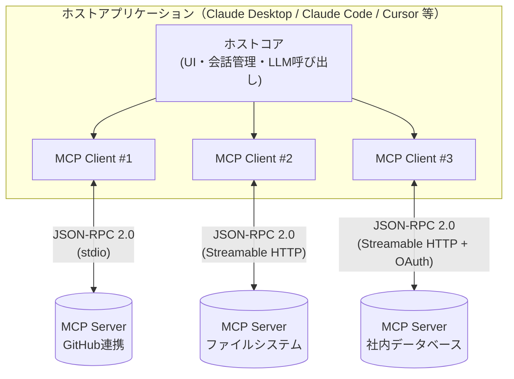

### 2.1 セッションライフサイクルとメッセージフロー

MCPのセッションは「初期化 → 運用 → 終了」の3フェーズで構成されます。クライアントは`initialize`リクエストでプロトコルバージョンと自身のケイパビリティ（sampling、elicitation、rootsのサポート有無など）を宣言し、サーバーは対応するプロトコルバージョンと自身のケイパビリティ（tools、resources、promptsのサポート有無）を返します。

以下は、ツール呼び出しが行われる際の典型的なメッセージフローです。

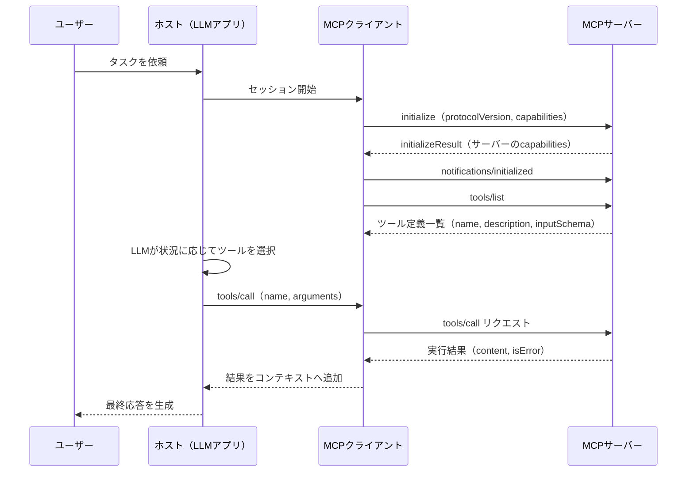

### 2.2 設計上の要点

- **サーバーは「信頼できない入力」を扱う前提で設計する**: サーバーが返すツールの説明文（description）やアノテーションは、たとえ正規のサーバーからのものであっても、クライアント側では「未検証の情報」として扱うべきとMCP仕様は明記しています。
- **1つのClientは1つのServerとのみ対話する**: 複数サーバーを束ねる場合はHost側で複数Clientインスタンスを管理するか、後述のGatewayパターンを採用します。
- **Toolsは「任意のコード実行」を意味する**: ツールはLLMの単なる関数呼び出しではなく、実際のシステム操作（ファイル削除、API呼び出し、DB更新など）に直結するため、相応の慎重さが求められます。

> **参考資料**
> - MCP Specification（アーキテクチャ全般）: https://modelcontextprotocol.io/specification/2025-11-25
> - Model Context Protocol (MCP) explained: A practical technical overview: https://codilime.com/blog/model-context-protocol-explained/
> - The Hitchhiker's Guide to Agentic AI（プリミティブ比較表の出典）: https://arxiv.org/pdf/2606.24937

---

## 3. プロトコルのバージョンとライフサイクル管理

MCPの仕様は日付形式（例: `2025-11-25`）でバージョニングされ、`initialize`時にクライアント・サーバー間でネゴシエーションされます。中級〜上級者が押さえるべき最大のポイントは、**どのバージョンがどの機能を持ち、どれが非推奨かを正確に把握すること**です。バージョン間の差分を知らずに実装すると、非推奨のSSEトランスポートを新規に採用してしまう、廃止済みの設計を前提にしてしまうといった事故が起きやすくなります。

### 3.1 バージョン履歴

| バージョン | リリース時期 | 主な変更点 |
|---|---|---|
| `2024-11-05` | 2024年11月 | 初版。stdioとHTTP+SSEの2トランスポート |
| `2025-03-26` | 2025年3月 | **Streamable HTTP** を導入し、HTTP+SSEを非推奨化 |
| `2025-06-18` | 2025年6月 | **OAuth 2.1** ベースの認可仕様を正式化（MCPサーバー＝リソースサーバー、外部認可サーバーへの分離を明確化） |
| `2025-11-25` | 2025年11月 | 現行の安定版。Tasksを実験的機能として導入 |
| `2026-07-28`（RC） | 2026年5月にRC公開、7月28日に確定予定 | プロトコル発足以来最大の改訂。**ステートレスコア化**（`initialize`ハンドシェイクとセッションIDの廃止）、**Extensionsフレームワーク**の導入、Feature Lifecycle Policy（Active/Deprecated/Removedの3段階、廃止から削除まで最低12か月）の制定 |

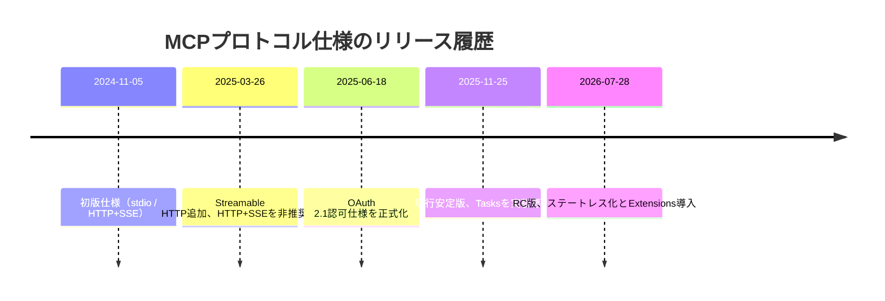

### 3.2 2026-07-28版で何が変わるのか

2026-07-28のリリース候補は、これまでの中で最大級の破壊的変更を含みます。

- **ステートレス化**: プロトコルバージョンやクライアント情報を毎回`_meta`に載せる方式に変更され、`Mcp-Session-Id`ヘッダーとセッション概念そのものが廃止されます。これにより、どのリクエストもどのサーバーインスタンスでも処理できるようになり、単純なラウンドロビン型ロードバランサーでスケールできるようになります。
- **Extensionsフレームワーク**: 逆引きDNS形式のIDで識別される拡張機能が、コア仕様とは独立したライフサイクルでリリースできるようになります。`MCP Apps`（サーバーがサンドボックス化されたiframe内でインタラクティブなUIを提供できる仕様）が最初の公式拡張として提供されます。
- **アプリ側の状態管理**: プロトコルレベルのセッションがなくなっても、アプリケーション側で`basket_id`のような明示的なハンドルをツール引数として受け渡しすることで、状態を維持する設計は引き続き可能です。

### 3.3 実務上の指針

1. **サーバーは複数のプロトコルバージョンをサポートする設計にする**: 少なくとも現行の安定版（`2025-11-25`）と、必要であれば1つ前のバージョンとの互換性を維持します。
2. **バージョン互換性マトリクスを文書化する**: どの機能がどのバージョンで動くかを一覧化しておくと、クライアント側の挙動差異によるバグ調査が格段に楽になります。
3. **SEP（Spec Enhancement Proposal）の動向を追う**: MCPは現在、Working Group主導の開発体制に移行しており、優先領域（トランスポートのスケーラビリティ、エージェント間通信、ガバナンス、エンタープライズ対応）に沿ったSEPほどレビューが早く進みます。

> **参考資料**
> - The 2026 MCP Roadmap: https://blog.modelcontextprotocol.io/posts/2026-mcp-roadmap/
> - The 2026-07-28 MCP Specification Release Candidate: https://blog.modelcontextprotocol.io/posts/2026-07-28-release-candidate/
> - Model Context Protocol Blog（トップページ）: https://blog.modelcontextprotocol.io/
> - GitHub Releases: https://github.com/modelcontextprotocol/modelcontextprotocol/releases
> - MCP Cheat Sheet (2026) - Webfuse: https://www.webfuse.com/mcp-cheat-sheet

---

## 4. トランスポート選定戦略：stdio vs Streamable HTTP vs SSE

MCPのトランスポート層は「データ層（tools/resources/promptsの定義）」とは独立したレイヤーです。2026年7月時点で現行かつ推奨されるトランスポートは **stdio** と **Streamable HTTP** の2つのみです。**HTTP+SSE（2024-11-05仕様）は2025-03-26で正式に非推奨化**されており、新規実装での採用は避けるべきです。

### 4.1 トランスポート比較表

| 項目 | stdio | Streamable HTTP（現行） | HTTP+SSE（非推奨・レガシー） |
|---|---|---|---|
| 用途 | ローカル・単一クライアント（IDE統合、CLIツール） | リモート・複数クライアント（本番サービス） | リモート（2025-03-26より非推奨） |
| 通信路 | 子プロセスの標準入出力（stdin/stdout） | 単一の`/mcp`エンドポイント（POST + GET、SSEへ任意アップグレード） | 2つの独立エンドポイント（GET /sse と POST /messages） |
| 認証 | ローカル環境変数・OSレベルの権限に依存 | OAuth 2.1 + Bearerトークン | 同左（ただし設計が複雑） |
| スケーラビリティ | 単一クライアントのみ、水平スケール不可 | ステートレス化により単純なロードバランサーで水平スケール可能 | セッション管理が煩雑でロードバランサー・サーバーレス基盤と相性が悪い |
| 典型的なレイテンシ | 極小（プロセス間通信） | ネットワーク往復分のオーバーヘッドあり | 同左 |
| 対応クライアント例 | Claude Desktop（設定ファイルはstdioのみ検証）, Claude Code | Claude Desktop（カスタムコネクタ）, Claude Code（`--transport http`） | 旧世代クライアントとの互換性維持のみ |
| 新規実装での推奨度 | ◎（ローカル用途） | ◎（リモート用途） | ×（非推奨。既存資産の移行を計画すべき） |

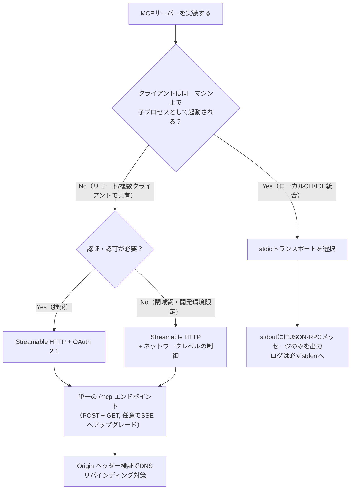

### 4.2 stdio実装時の落とし穴

stdioは仕組みとしては単純ですが、実務では次の1点が最大の事故原因になります。

> **鉄則**: サーバーは標準出力（stdout）に **有効なJSON-RPCメッセージ以外を一切書き込んではならない**。デバッグ用の`console.log`やライブラリの警告出力が1行でも混入すると、メッセージストリームが破損し、クライアントがハングまたは切断されます。ログ・デバッグ出力は必ず標準エラー出力（stderr）へ送ってください。

### 4.3 Streamable HTTP実装時の要点

- サーバーは単一のMCPエンドポイント（例: `https://example.com/mcp`）でPOSTとGETの両方をサポートする必要があります。
- レスポンスは通常のJSON、またはSSEストリームへのアップグレードのいずれかを選択できます。「Streamable」という名称は、この段階的なレスポンス配信能力を指しており、HTTP/2を必須とするものではありません（HTTP/1.1のchunked transfer encodingでも動作します）。
- **DNSリバインディング攻撃対策**として、受信するすべての接続で`Origin`ヘッダーを検証すること、ローカル実行時は`0.0.0.0`ではなく`127.0.0.1`にバインドすることが仕様上強く推奨されています。
- ローカル開発とリモート本番を1つのコードベースで両立させる場合、環境変数やCLIフラグでトランスポートを切り替える設計（ツールロジックは共通化し、トランスポート初期化のみ分岐）が一般的です。

### 4.4 移行時の注意点

既存のHTTP+SSEサーバーを運用中の場合、後方互換のために旧エンドポイント（`/sse`と`/messages`）を維持しつつ、新しい`/mcp`エンドポイントを並行提供するのが仕様が定める移行パスです。ただし、Keboola社は2026年4月1日、Atlassian Rovo社は2026年6月30日といった形で、主要プラットフォームがSSEサポートの打ち切り期限を相次いで発表しており、**移行は計画的に急ぐべき**フェーズに入っています。

> **参考資料**
> - MCP Specification - Transports（2025-03-26版）: https://modelcontextprotocol.io/specification/2025-03-26/basic/transports
> - MCP Server Transports - Roo Code Documentation: https://docs.roocode.com/features/mcp/server-transports
> - MCP Transport: Stdio vs Streamable HTTP — TrueFoundry: https://www.truefoundry.com/blog/mcp-stdio-vs-streamable-http-enterprise
> - MCP Transport Protocols: stdio vs SSE vs StreamableHTTP — MCPcat: https://mcpcat.io/guides/comparing-stdio-sse-streamablehttp/
> - MCP stdio vs HTTP vs SSE Transport: Which Should You Choose in 2026?: https://startdebugging.net/2026/07/mcp-stdio-vs-http-vs-sse-transport-which-to-choose/
> - MCP Transports Explained — ChatForest: https://chatforest.com/guides/mcp-transports-explained/
> - MCP SSE vs Stdio: Transport Options Explained (2026) — Apigene: https://apigene.ai/blog/mcp-sse-vs-stdio
> - MCP Transports: stdio vs SSE vs HTTP — RapidDev: https://www.rapidevelopers.com/mcp-tutorial/mcp-transport-stdio-vs-sse-vs-http
> - MCP Transport Mechanisms: STDIO vs Streamable HTTP — AWS Builder Center: https://builder.aws.com/content/35A0IphCeLvYzly9Sw40G1dVNzc/mcp-transport-mechanisms-stdio-vs-streamable-http
> - MCP Transports Compared: stdio vs SSE vs Streamable HTTP (2026) — rollbrains: https://rollbrains.com/mcp/mcp-transports-compared/

---

## 5. コアプリミティブ設計：Tools・Resources・Prompts・Sampling・Elicitation・Roots

MCPは6つの主要なプリミティブ（構成要素）を定義しています。サーバー側が提供するのが**Tools・Resources・Prompts**、クライアント側が提供するのが**Sampling・Elicitation・Roots**です。この非対称な設計こそが、MCPを単なる「関数呼び出しAPI」ではなく「双方向のプロトコル」たらしめている核心部分です。

### 5.1 プリミティブ一覧

| プリミティブ | 提供側 | 方向 | 制御主体 | 主な用途 |
|---|---|---|---|---|
| **Tools** | サーバー | クライアント→サーバー | モデル駆動（LLMが選択・実行） | 副作用のある操作（DB更新、API呼び出し、ファイル操作） |
| **Resources** | サーバー | クライアント→サーバー | アプリケーション駆動（ホストが読み込みを制御） | 読み取り専用データの提供（設定、ドキュメント、既存データ一覧） |
| **Prompts** | サーバー | クライアント→サーバー | ユーザー駆動（人が明示的に呼び出す） | 再利用可能なプロンプトテンプレート（例: 「コードレビュー」テンプレート） |
| **Sampling** | クライアント | サーバー→クライアント | ホストが可否を判断 | サーバーがクライアント側のLLMに推論を依頼する（要約生成など） |
| **Elicitation** | クライアント | サーバー→クライアント | ユーザーが応答 | サーバーが処理途中でユーザーに追加情報を確認する |
| **Roots** | クライアント | クライアント→サーバー | ホストが管理 | サーバーがアクセスしてよいファイルシステム範囲などを制限する |

### 5.2 プリミティブ間の連携フロー例

「最新の配送中の注文3件をメールで送って」というリクエストを例に、6つのプリミティブがどう連携するかを見てみましょう。

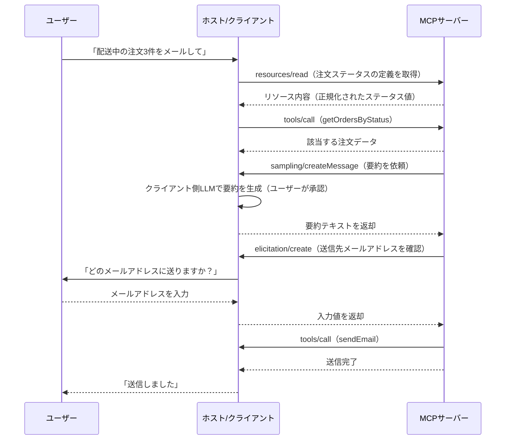

### 5.3 各プリミティブの設計指針

- **Tools**: 副作用（書き込み・削除・送信など）を伴う操作は必ずToolsとして実装し、ユーザーの明示的な承認フローに乗せます。
- **Resources**: 「一覧を返すだけ」の読み取り専用データはResourcesとして実装し、Toolsと混同しないようにします。ToolsとResourcesの境界を曖昧にすると、後述するコンテキスト肥大化の原因にもなります。
- **Prompts**: ドメイン知識をテンプレート化して配布したい場合（例: 「インシデント報告書生成」テンプレート）に活用します。あくまで「ユーザーが明示的に選ぶ」体験を想定した設計にします。
- **Sampling**: サーバー自身がLLM APIキーを持たずに、クライアント側のモデルを間接的に借用できる仕組みです。APIキーがサーバー側に漏れる心配がなく、ユーザーはどのモデル利用にも同意フローを経由します。
- **Elicitation**: 「危険な操作の前に必ず人に確認する」設計の中核です。ボタン選択式（accept/decline/cancel）などクライアントが解釈しやすい形式で要求するのが望ましいとされています。機微な情報を求める設計は避けます。
- **Roots**: ホスト側がサーバーに公開してよいディレクトリやリソース範囲を制限する仕組みで、最小権限の原則を実装レベルで担保します。

> **参考資料**
> - Understanding MCP features: Tools, Resources, Prompts, Sampling, Roots, and Elicitation — WorkOS: https://workos.com/blog/mcp-features-guide
> - What is MCP elicitation and sampling? — Stacktree: https://stacktr.ee/blog/what-is-mcp-elicitation
> - MCP Concepts: Sampling and Elicitation — Medium: https://medium.com/@__nagarajan__/mcp-concepts-sampling-and-elicitation-95c5c0c4df71
> - Memgraph MCP Experimental Server: Elicitation and Sampling Explained: https://memgraph.com/blog/memgraph-mcp-elicitation-and-sampling
> - MCP Client Concepts: How Elicitation, Sampling, and Roots Make AI Agents Responsible: https://medium.com/@puneetsharma41/mcp-client-concepts-how-elicitation-sampling-and-roots-make-ai-agents-responsible-5f02a0666d9a
> - Model Context Protocol (MCP): Deep dive into structure and concepts — HMS: https://www.analytical-software.de/en/the-model-context-protocol-mcp-deep-dive-into-structure-and-concepts/
> - Model Context Protocol (MCP) explained — CodiLime: https://codilime.com/blog/model-context-protocol-explained/

---

## 6. ツール設計のベストプラクティス（Anthropic公式指針）

Anthropicのエンジニアリングチームは "Writing effective tools for agents—using agents" と題した記事で、ツール設計に関する実証的な知見を公開しています。核心的な主張は、**開発者向けAPIの設計原則と、エージェント向けツールの設計原則は根本的に異なる**という点です。決定論的なシステム向けの設計思想（人間が仕様を読んで正しく呼び出す前提）を、非決定論的なエージェント向けにそのまま持ち込むと機能しません。

### 6.1 主要な設計原則

| 原則 | 内容 | Bad例 | Good例 |
|---|---|---|---|
| **高レバレッジなツールを選ぶ** | 既存APIの薄いラッパーではなく、エージェントの能力を実質的に拡張するツールを優先する | 既存REST APIを1エンドポイント=1ツールで機械的に変換 | 複数のAPI呼び出しをまとめた「意味のある業務単位」のツール |
| **名前空間で衝突を防ぐ** | ドメインごとにプレフィックスを付け、似た名前のツールが混在しないようにする | `search`, `get_status` のような汎用名 | `asana_search_tasks`, `github_get_pr_status` |
| **検索指向のツールを優先する** | `list_all`型ではなく`search`型のツールを用意し、大量データを一度に返さない | `list_contacts`（全件返却） | `search_contacts(query, limit)` |
| **人間が読める文脈を返す** | 生のID（`user_id: "8f3e..."`）ではなく、意味のあるフィールドを返す | `{"id": "usr_123", "status": 2}` | `{"user_name": "田中太郎", "status": "承認待ち"}` |
| **トークン効率を最適化する** | ページネーション・切り詰め（truncation）・フィルタリングを実装し、無制限のデータ返却を避ける | 数万行のCSVを丸ごと返す | `limit`/`offset`付きで必要な範囲のみ返す、詳細度（detail level）を選べるようにする |
| **明確な使用ガイダンスを含める** | 「いつ使うべきでないか」「トークン予算」「期待レスポンス時間」まで説明文に含める | `"チャットで質問する"` | `"質問・調査に利用。概要形式(~500トークン,2-5秒)/詳細形式(~2000トークン,5-10秒)。コード実行やWeb検索には専用ツールを使うこと。レート制限:60req/分"` |
| **エラーメッセージで行動を誘導する** | スタックトレースやエラーコードだけでなく、次に取るべき具体的な行動を提示する | `Error 403` | `"'thread_id'の編集権限がありません。所有者にアクセス権を依頼するか、別のthread_idを使用してください。"` |

### 6.2 評価駆動の反復改善

Anthropicが強調するもう1つの要点は、**ツール自体の評価（Evaluation）をシステム的に構築すること**です。手作業の勘に頼った改善ではなく、タスク成功率・トークン消費量・エラー率を定量的に測定できる評価セットを用意し、Claude Code自身にツール定義を最適化させる「自己改善ループ」を回す手法が紹介されています。実際に、ツールの説明文（description）を精密に調整するだけで、Claude Sonnet 3.5がSWE-bench Verifiedで大幅な性能向上を達成した事例が報告されています。

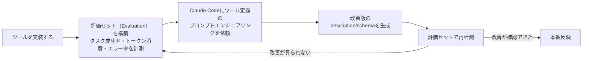

### 6.3 アノテーションによる意図の開示

MCP仕様では、ツールに`annotations`を付与し、そのツールが「オープンワールドアクセス（外部ネットワーク呼び出し等）を必要とするか」「破壊的変更（削除・上書き）を行うか」を宣言できます。これはUXレベルの安全対策であると同時に、後述するセキュリティ対策の土台にもなります。

### 6.4 実装レベルのチェックリスト

1. ツール名は`{ドメイン}_{動詞}_{対象}`のような一貫した命名規則に従っているか
2. `list_all`系ツールを`search`系に置き換えられないか再検討したか
3. レスポンスに生のIDだけでなく人間が読めるフィールドを含めているか
4. ページネーション・フィルタ・詳細度パラメータを用意しているか
5. エラーレスポンスは「次に取るべき行動」を明示しているか
6. 破壊的操作には`annotations`で明示し、確認フロー（Elicitation）を挟んでいるか
7. 評価セットを用意し、変更のたびに定量的な回帰確認をしているか

> **参考資料**
> - Writing effective tools for AI agents—using AI agents（Anthropic公式）: https://www.anthropic.com/engineering/writing-tools-for-agents
> - Writing Effective Tools for AI Agents: Lessons from Anthropic — Medium: https://laxmikumars.medium.com/writing-effective-tools-for-ai-agents-lessons-from-anthropic-25b85bf74f5d
> - Writing Effective Tools for AI Agents: Production Lessons from Anthropic — Medium: https://techwithibrahim.medium.com/writing-effective-tools-for-ai-agents-production-lessons-from-anthropic-99ea76a7fcf0
> - ADR-0023: Anthropic Tool Design Best Practices（実装事例）: https://github.com/vishnu2kmohan/mcp-server-langgraph/blob/main/adr/adr-0023-anthropic-tool-design-best-practices.md

---

## 7. コンテキスト管理とスケーラビリティ：ツール肥大化問題への対処

MCPが普及するにつれ、2026年に入って最も頻繁に報告されている実運用上の課題が **「コンテキスト肥大化（Context Bloat）」** です。複数のMCPサーバーを接続すると、各サーバーが持つツール定義（名前・説明文・パラメータスキーマ）がすべて起動時にモデルのコンテキストウィンドウへ読み込まれるため、会話が始まる前に大量のトークンを消費してしまいます。

### 7.1 問題の規模

実測例として、GitHub・Slack・Sentry・Grafana・Splunkの5サーバーを接続した構成では、約58個のツールでおよそ55,000トークンが会話開始前に消費されるという報告があります。別の事例では、GitHub・Playwright・IDE統合の3サーバーだけで20万トークンのウィンドウの72%（約14.3万トークン）が消費されたケースも報告されています。

| 指標 | 悪化の内容 |
|---|---|
| **トークンコスト** | ツール定義1個あたり200〜800トークン。50ツールで1万〜2.5万トークンが毎リクエスト消費される |
| **選択精度の低下** | ツール数が30〜50個を超えると選択精度が大きく低下する。RAG-MCP論文では、肥大化したツールセットで選択精度が43%から14%未満まで低下（約3分の1）したと報告 |
| **レイテンシ増加** | コンテキストが肥大化するほどモデルの処理時間が伸びる |
| **誤動作パターン** | 似た名前のツール（`get_status`/`fetch_status`/`query_status`）の混同、存在しないツール名のハルシネーション、選択不能によるフリーズ |

### 7.2 対処法の全体像

2026年に入り、この問題に対する複数のアプローチが実用段階に入りました。

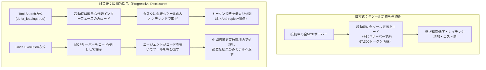

### 7.3 具体的な対策一覧

| 対策 | 概要 | 効果の目安 |
|---|---|---|
| **Tool Search（遅延ロード）** | ツール定義に`defer_loading: true`を付与し、起動時は検索インターフェースのみ提示、必要な時に個別スキーマを取得する | トークン消費を最大85%削減（Anthropic計測） |
| **Code Execution with MCP** | MCPサーバーをツール呼び出しの羅列ではなく「コードAPI」として提示し、エージェントがコードを書いて呼び出す。中間結果はコード実行環境内に留め、必要な部分のみモデルへ返す | 大規模API（例: Cloudflare API、2,500以上のエンドポイント）で入力トークンを99.9%削減した事例あり |
| **RAG-MCP（検索拡張ツール選択）** | 全ツールをベクトル空間に埋め込み、クエリに応じて意味的に近い上位ツールのみをコンテキストへ注入する | ツール選択精度が3倍以上、プロンプトトークンを50%以上削減 |
| **サーバーの分割（Server Decomposition）** | 1つの巨大なMCPサーバーではなく、ドメインごとに小さなサーバーへ分割し、必要なものだけ接続する | 実運用時のツール数そのものを削減 |
| **使わないサーバーを接続しない** | セッションごとに本当に必要なMCPサーバーのみ接続する、という最も単純だが効果の大きい対策 | 追加コスト・複雑さゼロで実施可能 |

### 7.4 実務上の指針

1. **接続するMCPサーバー数を「必要最小限」に絞る**運用ルールをチーム内で明文化する。
2. サーバー実装者側は、**既存APIをそのまま1対1でツール化しない**。前章のツール設計原則（検索指向、意味のある単位）を徹底することが、肥大化対策の第一歩になる。
3. クライアント/フレームワーク側がTool SearchやCode Executionパターンをサポートしている場合は、積極的に有効化する（Claude Codeでは`ENABLE_TOOL_SEARCH`環境変数などで制御可能）。
4. ツール出力自体の肥大化（生HTML・base64画像・巨大JSONをそのまま返す）にも注意し、サーバー側で出力の切り詰めやアーティファクト化（大きな結果を外部に保存し参照IDのみ返す）を検討する。

> **参考資料**
> - Code execution with MCP: building more efficient AI agents（Anthropic公式）: https://www.anthropic.com/engineering/code-execution-with-mcp
> - When too many tools become too much context — WRITER: https://writer.com/engineering/rag-mcp/
> - How to Prevent MCP Tool Overload and Build Faster, Safer AI Agents — Lunar.dev: https://www.lunar.dev/post/why-is-there-mcp-tool-overload-and-how-to-solve-it-for-your-ai-agents
> - MCP's Context Bloat Crisis — AgentMarketCap: https://agentmarketcap.ai/blog/2026/04/08/mcp-context-bloat-enterprise-scale-tool-definitions-agent-context-budget
> - MCP Context Bloat Fix 2026 (Tool Search) — MCP.Directory: https://mcp.directory/blog/mcp-context-bloat-fix-2026-tool-search-code-mode-progressive-disclosure
> - How to Reduce the Number of MCP Tools Claude Loads — Start Debugging: https://startdebugging.net/2026/05/how-to-reduce-the-number-of-mcp-tools-claude-loads/
> - 10 strategies to reduce MCP token bloat — The New Stack: https://thenewstack.io/how-to-reduce-mcp-token-bloat/
> - MCP Tools: What They Are and How to Build Them Right (2026) — Apigene: https://apigene.ai/blog/mcp-tools
> - Thousands of MCP Tools, Zero Context Left — AgentPMT: https://www.agentpmt.com/articles/thousands-of-mcp-tools-zero-context-left-the-bloat-tax-breaking-ai-agents

---

## 8. 認証・認可：OAuth 2.1によるセキュアなMCPサーバー

リモートのMCPサーバー（Streamable HTTPトランスポート）において、認可は「任意」とされていますが、ユーザー固有データ（メール、ドキュメント、DB）や管理操作を扱う場合は**強く推奨**されています。MCPは独自の認証方式を発明するのではなく、**OAuth 2.1の規約に従う**という設計判断をしています。

しかし現実には、2026年の監査でも依然として **MCPサーバーの40%が無認証のまま運用され、43%がコマンドインジェクション脆弱性を抱え、79%が認証情報を平文で扱っている** という報告があり、「仕様は健全だが実装が追いついていない」状態が続いています。実装のハードルの高さから、静的APIキーに頼るサーバーが53%に上るという調査結果も報告されています。

### 8.1 基本アーキテクチャ：責務の分離

2025-06-18仕様以降、**MCPサーバーはOAuthの「リソースサーバー」として、認可サーバー（Authorization Server）とは明確に分離**されることが公式に規定されました。以前のバージョンではMCPサーバーがリソースサーバーと認可サーバーを兼務する設計も許容されており、これが実装の複雑さの一因になっていました。

| コンポーネント | 役割 | 実装例 |
|---|---|---|
| **MCPサーバー（リソースサーバー）** | トークンを検証し、スコープに応じてツール実行を許可/拒否する。ログイン画面もトークン発行も行わない | 自作のMCPサーバー本体 |
| **認可サーバー（Authorization Server）** | ユーザー認証、同意画面の表示、トークンの発行・失効を担う | Keycloak, Auth0, WorkOS, Microsoft Entra ID |
| **MCPクライアント** | OAuth 2.1のクライアントとして振る舞い、PKCEを用いた認可コードフローでトークンを取得する | Claude Desktop, Claude Code, カスタムエージェント |

### 8.2 認可フローの全体像

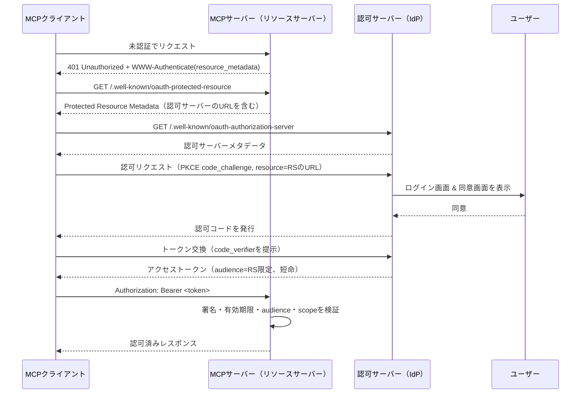

### 8.3 仕様が要求する主要コンポーネント

| 仕様要素 | 目的 |
|---|---|
| **PKCE（Proof Key for Code Exchange）** | 認可コード横取り攻撃を防ぐ。クライアント側で生成した`code_verifier`をトークン交換時に提示させ、公開クライアント（シークレットを安全に保持できないデスクトップアプリ等）でも安全に認証できるようにする |
| **Protected Resource Metadata（PRM, RFC 9728）** | MCPサーバーが`/.well-known/oauth-protected-resource`で自身に対応する認可サーバーの情報を公開する仕組み |
| **Resource Indicators（RFC 8707）** | トークンの`audience`を特定のMCPサーバーに限定し、あるサーバー用のトークンが別のサーバーで不正に再利用（リプレイ）されるのを防ぐ |
| **Dynamic Client Registration（DCR, RFC 7591）** | クライアントが事前調整なしに認可サーバーへ自己登録できる仕組み。無制限に許可すると悪用の余地があるため、信頼できるホストの許可リストなどの統制が必須 |
| **Client ID Metadata Documents（CIMD）** | DCRの課題（サーバー側が無制限のクライアントDBを管理する必要がある、自己申告のメタデータを信頼せざるを得ない）を解決するため、クライアントがHTTPS URL上に静的なJSONメタデータを公開する新しい方式。オープンなMCPエコシステム向けの推奨デフォルトとして採用が進んでいる |

### 8.4 実装ベストプラクティス

1. **トークン検証は自作しない**: 署名検証・スコープ判定などのロジックは、成熟した検証済みライブラリに任せる。MCP公式ドキュメントも「専門家でない限り自作するな」と明記しています。
2. **短命なアクセストークンを使う**: 長命トークンは、盗まれた場合の被害期間が長くなります。リフレッシュトークンと組み合わせ、短寿命（例: 数十分〜数時間）を基本とします。
3. **audience（対象者）を必ず検証する**: 自分のサーバー宛てに発行されたトークンかどうかをResource Indicatorsで確認し、他サーバー用トークンの使い回しを拒否します。
4. **realm/テナントを分離する**: マルチテナント運用でない限り、1つの認可レルムに固定し、同一の認可サーバー内であっても他レルムのトークンは拒否します。
5. **DCRを有効にする場合は統制をかける**: 無制限の匿名登録を許可せず、信頼できるホストの許可リストや審査プロセスを設ける。
6. **機微情報をログに残さない**: アクセストークン・認可コード・シークレット・Authorizationヘッダーの内容はログに出力しない。
7. **JWTのローカル検証とトークンイントロスペクションを使い分ける**: 通常の読み取り系ツールは署名検証+短いTTLのJWKSキャッシュ（例: 5分）で十分ですが、書き込み・PII・金銭取引を伴う高セキュリティなツールでは、トークン失効を即座に反映できるイントロスペクション方式を使う判断も検討します。
8. **ローカル（stdio）サーバーの認証**: stdioはOSレベルの信頼境界内で動作するため、環境変数や外部ライブラリが提供する資格情報を使うのが一般的です。OAuthのようなブラウザベースのフローは、リモートのHTTPベーストランスポート向けの設計であることを理解しておきます。

### 8.5 エンタープライズでの委譲パターン

大規模組織では、MCPサーバーが独自にOAuthサーバーを実装するのではなく、既存の企業IdP（Keycloak、Entra ID等）に認可を委譲するパターンが標準になりつつあります。MCPサーバーは「リソースサーバーとして振る舞い、スコープを強制するだけ」というシンプルな責務に留め、ログイン画面・トークン発行・クライアント登録といった重い処理はIdP側に任せます。これにより、企業のSSO・多要素認証（MFA）基盤をそのまま再利用できます。

> **参考資料**
> - Understanding Authorization in MCP（MCP公式）: https://modelcontextprotocol.io/docs/tutorials/security/authorization
> - MCP security: Implementing robust authentication and authorization — Red Hat: https://www.redhat.com/en/blog/mcp-security-implementing-robust-authentication-and-authorization
> - MCP Server Security: Auth Best Practices 2026: https://medium.com/data-science-collective/why-your-mcp-server-is-a-security-disaster-waiting-to-happen-660577d8077c
> - MCP OAuth 2.1 Authentication: Complete Developer Guide 2026 — RockB: https://baeseokjae.github.io/posts/mcp-oauth-authentication-guide-2026/
> - How MCP Authentication Works: Authorization, OAuth & Security — Obot: https://obot.ai/resources/learning-center/mcp-authentication/
> - How to Secure MCP Servers (2026 Guide): https://codersera.com/blog/how-to-secure-mcp-servers-2026/
> - The New MCP Authorization Specification: https://dasroot.net/posts/2026/04/mcp-authorization-specification-oauth-2-1-resource-indicators/
> - MCP Server Security Best Practices to Prevent Risk — Descope: https://www.descope.com/blog/post/mcp-server-security-best-practices
> - MCP server authentication in 2026: what practitioners need to know: https://nhimg.org/articles/mcp-server-authentication-in-2026-what-practitioners-need-to-know/
> - The best providers for MCP server authentication in 2026 — WorkOS: https://workos.com/blog/best-mcp-server-authentication-providers
> - Test MCP Server with MCP Inspector — Auth for MCP: https://auth0.com/ai/docs/mcp/guides/test-your-mcp-server-with-mcp-inspector

---

## 9. セキュリティ脅威と対策：Tool Poisoning・Prompt Injection・Confused Deputy

OAuthによる認証・認可を固めても、MCP特有の脅威モデルはそれだけではカバーできません。MCPの核心的なリスクは、**「ツールのメタデータや実行結果がそのままLLMのコンテキストに注入され、信頼できる指示として解釈されてしまう」**という構造そのものに起因します。

### 9.1 Tool Poisoning（ツールポイズニング）の仕組み

Tool Poisoningは間接的プロンプトインジェクションの一種で、悪意のあるMCPサーバーがツールの名前・説明文・パラメータスキーマ、あるいは実行結果の中に、ユーザーには見えないがLLMには読み取られる悪意ある指示を埋め込む攻撃です。

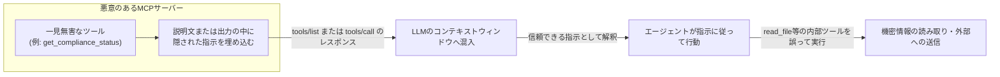

攻撃を特に厄介にしているのが「**Rug Pull（ラグプル）**」という手口です。ユーザーが一度レビュー・承認した正規のツールが、承認後にサーバー側の定義だけ静かに書き換えられ、悪意ある指示が追加されるというものです。一度承認したツールを再チェックする習慣は通常ないため、検知が非常に困難になります。

さらに研究では、**Full-Schema Poisoning（FSP）** として、説明文だけでなくパラメータ名・型・デフォルト値・enum値などスキーマ全体が攻撃対象になり得ること、また **Active Tool Poisoning Attack（ATPA）** として、ツールの出力（エラーメッセージも含む）が動的に悪意ある指示を生成するケースも報告されています。学術研究（MCPTox）では、20種のLLMエージェントに対して最大72.8%の攻撃成功率が観測され、最も拒否率が高かったClaude 3.7 Sonnetでも拒否率は3%未満だったと報告されています。

### 9.2 主要な脅威の一覧と対策

| 脅威 | 概要 | 主な対策 |
|---|---|---|
| **Tool Poisoning** | ツールのメタデータ（説明文・スキーマ）に悪意ある指示を埋め込む | 承認済みサーバーの許可リスト化、静的スキャンによる異常検知、ツールごとの最小権限設計 |
| **Rug Pull** | 承認後にツール定義を密かに書き換える | ツール定義のハッシュ値・バージョンを記録し、変更時は再承認を要求するゲートウェイ層の実装 |
| **間接的プロンプトインジェクション** | ツールの実行結果（外部データ）に悪意ある指示を混入させる | ツール応答を「信頼できないデータ」として扱い、構造化出力（固定スキーマのJSON）を要求、期待形状と一致しない応答は拒否する |
| **Confused Deputy（混乱した代理人）攻撃** | 高い権限を持つエージェントが、低権限のはずのリクエスト経由で意図しない高権限操作を実行してしまう | ツール実行層でアクセス制御を強制し、LLMの指示追従だけに依存しない |
| **Token Passthrough** | クライアントのトークンをそのまま下流APIへ転送してしまう | クライアントトークンをそのまま上流に渡さず、トークン交換（Token Exchange）で下流専用の権限に絞ったトークンへ変換する |
| **SSRF（サーバーサイドリクエストフォージェリ）** | ツールが任意のURLへのリクエストを許してしまい、内部ネットワークへの不正アクセスに悪用される | プライベートIPレンジへのアウトバウンド通信をブロックする許可リスト方式のネットワーク制御 |
| **コマンドインジェクション/パストラバーサル** | 入力値をサニタイズせずシェルコマンドやファイルパスに渡してしまう | すべての入力をスキーマで厳格に検証し、シェル呼び出しの代わりに安全なAPIを使う |

### 9.3 具体的な防御レイヤー

1. **信頼境界を明示的に設計する**: 「内部ツール」と「外部・未検証サーバーのツール」を同一の権限レベルで扱わない。外部サーバーからの応答が、内部の高権限ツール呼び出しを誘発できないようにアーキテクチャで分離します。
2. **許可リスト運用を徹底する**: ユーザーが任意のMCPサーバーへ自由に接続できる状態を避け、事前に審査・承認したサーバーのみ接続可能にします。
3. **破壊的操作の前には必ず人間の確認を挟む**: Elicitationプリミティブや明示的な承認ダイアログを使い、LLMコンテキスト外で（=プロンプトインジェクションで迂回できない経路で）承認を得ます。
4. **構造化出力を要求する**: 可能な限り、ツールの応答は自由形式テキストではなく固定スキーマのJSONを要求し、想定と異なる形状の応答は拒否します。
5. **ランタイム監査を行う**: すべてのツール呼び出しをログに記録し、「機密データへの予期しないアクセス」「エラー直後に発生する不審な連続ツール呼び出し」などの異常パターンを監視します。
6. **供給網（サプライチェーン）セキュリティ**: サードパーティ製MCPサーバーは、依存関係の透明性やコード署名の有無を確認し、信頼できる供給元からのみ導入します。

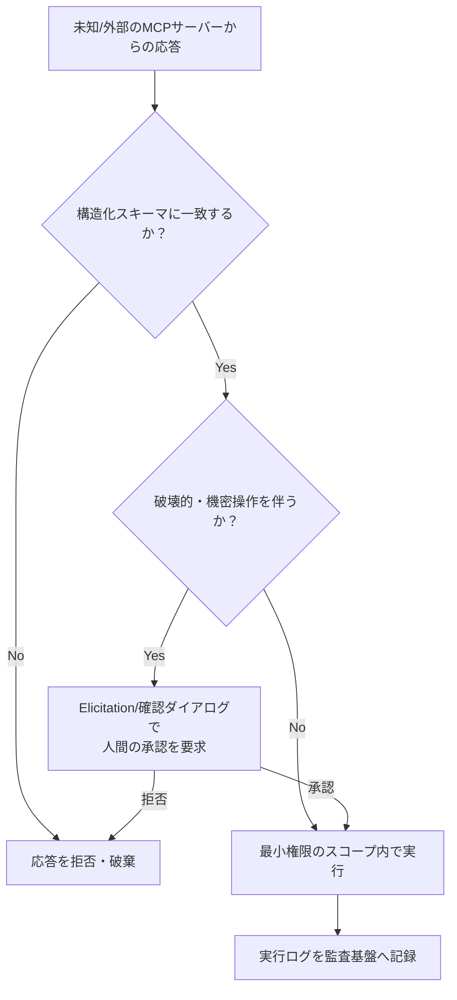

### 9.4 実務チェックリスト

- [ ] 接続可能なMCPサーバーの許可リストを運用しているか
- [ ] ツール定義のバージョン変更（Rug Pull）を検知する仕組みがあるか
- [ ] ツール応答を「信頼できないデータ」として扱い、構造検証をしているか
- [ ] 破壊的操作にはLLMコンテキスト外の承認フローを設けているか
- [ ] SSRF対策としてプライベートIPレンジへのアウトバウンド制御をしているか
- [ ] すべてのツール呼び出しを監査ログに記録し、異常検知の仕組みがあるか
- [ ] クライアントトークンを下流APIへそのまま転送していないか（トークン交換を使っているか）

> **参考資料**
> - MCP Tool Poisoning — OWASP Foundation: https://owasp.org/www-community/attacks/MCP_Tool_Poisoning
> - MCP Security Vulnerabilities: How to Prevent Prompt Injection and Tool Poisoning Attacks in 2026 — Practical DevSecOps: https://www.practical-devsecops.com/mcp-security-vulnerabilities/
> - Understanding MCP Tool Poisoning Attacks — Descope: https://www.descope.com/learn/post/mcp-tool-poisoning
> - Protecting against indirect prompt injection attacks in MCP — Microsoft for Developers: https://developer.microsoft.com/blog/protecting-against-indirect-injection-attacks-mcp
> - Prompt injection in MCP: how tool poisoning works — Aptible: https://www.aptible.com/mcp-security/mcp-prompt-injection
> - MCP Tool Poisoning - How It Works & How To Fight It — MCP Manager: https://mcpmanager.ai/blog/tool-poisoning/
> - Model Context Protocol Threat Modeling and Analyzing Vulnerabilities to Prompt Injection with Tool Poisoning（学術研究/MCPTox）: https://arxiv.org/html/2603.22489v1
> - Poison everywhere: No output from your MCP server is safe — CyberArk: https://www.cyberark.com/resources/threat-research-blog/poison-everywhere-no-output-from-your-mcp-server-is-safe
> - MCP security: How to prevent prompt injection and tool poisoning attacks — Security Boulevard: https://securityboulevard.com/2026/01/mcp-security-how-to-prevent-prompt-injection-and-tool-poisoning-attacks/
> - MCP Security: How to Stop Prompt Injection Attacks — Datadome: https://datadome.co/agent-trust-management/mcp-security-prompt-injection-prevention/
> - How to Secure MCP Servers (2026 Guide): https://codersera.com/blog/how-to-secure-mcp-servers-2026/

---

## 10. テストとデバッグ：MCP Inspectorの活用

MCPサーバーの開発では、標準的なprintデバッグやインタラクティブデバッガがそのままでは使いにくいという特有の課題があります。stdioトランスポートでは標準出力がプロトコルメッセージ専用のため、通常のログ出力すら破壊的な影響を及ぼしうるからです。この課題を解決するのが公式ツール **MCP Inspector** です。

### 10.1 MCP Inspectorの構成

MCP Inspectorは2つのコンポーネントで構成されます。

| コンポーネント | 役割 |
|---|---|
| **MCP Inspector Client (MCPI)** | React製のWebベースUI。ツール・リソース・プロンプトを対話的にテストできる |
| **MCP Proxy (MCPP)** | Node.js製のプロトコルブリッジ。Web UIとMCPサーバー間を、stdio・SSE・Streamable HTTPなど複数のトランスポートで橋渡しする |

```bash
# ローカルのMCPサーバー（stdio）をテスト
npx @modelcontextprotocol/inspector node build/index.js

# CLIモード（スクリプト・CI統合向け）
npx @modelcontextprotocol/inspector --cli node build/index.js
```

起動すると、既定で `http://localhost:6274` にWeb UIが立ち上がり、プロキシは `http://localhost:6277` で待ち受けます。両者は既定で`localhost`のみにバインドされ、ネットワーク外部からのアクセスは遮断されます（開発目的で全インターフェースにバインドする場合は`HOST`環境変数で明示的に上書きしますが、信頼できるネットワーク内でのみ行うべきです）。

### 10.2 テスト・デバッグのワークフロー

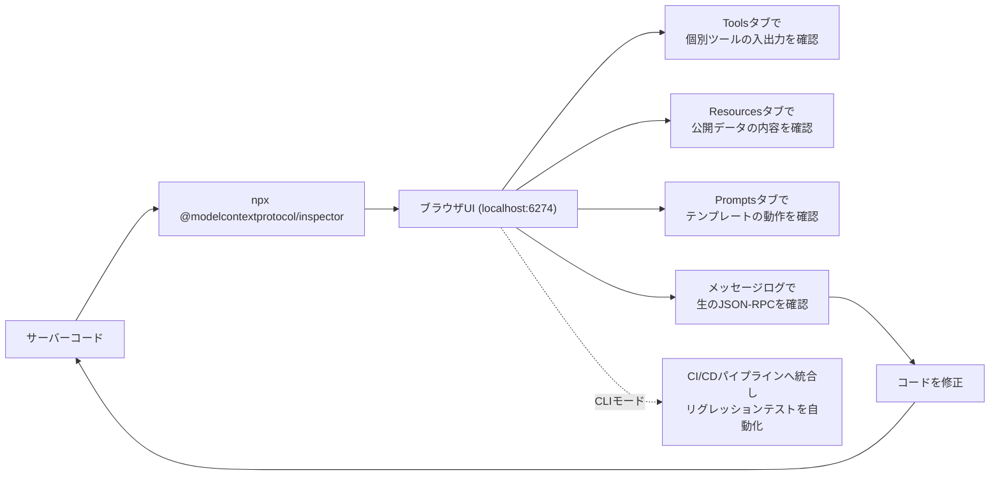

### 10.3 段階的なテスト戦略

信頼性の高いMCPサーバーを構築するには、単一の手法に頼らず、以下の3層でテストを組み合わせるのが実務上の定石です。

1. **インタラクティブテスト（MCP Inspector）**: 開発中の即時フィードバックに使う。ホストアプリケーション（Claude Desktopなど）を介さずに、プロトコルの生の挙動を直接確認できる。
2. **自動化された単体・結合テスト**: SDKが提供するインメモリトランスポートを使い、CI環境でも実行できるクライアント・サーバーのペアを構築する。stdioをサブプロセスとして起動しメッセージをやり取りする方式でもよい。テストフレームワークはpytestやJest/Vitestなど通常のものを利用できる。
3. **本番相当環境での結合テスト**: Inspector上で動いてもホストアプリ経由の実運用で失敗するケースの大半は、トランスポートや認証まわりに起因します。ロードバランサーやプロキシを経由する本番同等の経路まで含めて検証することが重要です。

### 10.4 よくある不具合と原因の切り分け

| 症状 | 主な原因 | 対処 |
|---|---|---|
| Inspectorに接続できない | ポート競合（6274/6277）、コマンドパスの誤り、ファイアウォール | ポート使用状況を確認し、コマンドパスを再検証する |
| JSONパースエラー（Unexpected token） | stdoutに非JSON-RPCの出力（console.logなど）が混入 | すべてのログ出力をstderrへリダイレクトする |
| ツールが見つからない/一覧に出ない | `initialize`応答でcapabilitiesの宣言漏れ | サーバーが`tools`ケイパビリティを正しく宣言しているか確認する |
| Inspectorでは動くが実エージェントで失敗する | トランスポートや認証の設定差異（Inspectorはローカルstdio、本番はHTTP/SSE経由でプロキシを通る） | 本番と同じトランスポート経路でエンドツーエンドの検証を行う |
| 環境変数起因の設定不備 | APIキー等がサーバープロセスに渡っていない | Inspectorの環境変数パネルで渡された値を確認する |

> **参考資料**
> - MCP Inspector（MCP公式ドキュメント）: https://modelcontextprotocol.io/docs/tools/inspector
> - GitHub - modelcontextprotocol/inspector: https://github.com/modelcontextprotocol/inspector
> - MCP Inspector – Testing and Debugging for MCP Servers — Stainless: https://www.stainless.com/mcp/mcp-inspector-testing-and-debugging-mcp-servers/
> - Error Handling And Debugging MCP Servers — Stainless: https://www.stainless.com/mcp/error-handling-and-debugging-mcp-servers/
> - Testing & Debugging MCP Servers (Inspector Tools Guide) — MCP Server Spot: https://www.mcpserverspot.com/learn/building/testing-debugging-mcp
> - Debugging | MCP Framework: https://www.mcp-framework.com/docs/debugging
> - Debugging Model Context Protocol (MCP) Servers: Tips and Best Practices — mcpevals.io: https://www.mcpevals.io/blog/debugging-mcp-servers-tips-and-best-practices
> - MCP Inspector Setup Guide — MCPcat: https://mcpcat.io/guides/setting-up-mcp-inspector-server-testing/
> - How to Test Your MCP Server: Validation, Debugging, and Scoring Impact — AgentHermes: https://agenthermes.ai/blog/testing-mcp-server-guide

---

## 11. エンタープライズアーキテクチャ：MCP Gatewayパターン

組織内で接続するAIエージェントとMCPサーバーの数がそれぞれ数個から数十・数百に増えると、「すべてのエージェントがすべてのサーバーに直接接続する」N×Mのメッシュ構造は、認証の重複、監査ログの分散、ポリシー適用の不統一といった運用上の破綻を招きます。これを解決するのが **MCP Gateway** です。

### 11.1 Gatewayの役割

MCP Gatewayは、AIエージェント群とMCPサーバー群の間に位置する集中型のプロキシ層で、以下を一括して提供します。

| 機能 | 内容 |
|---|---|
| **認証・認可** | どのエージェント/ユーザーがどのMCPサーバーにアクセスできるかを一元管理 |
| **ルーティング** | リクエストを適切なMCPサーバーへ振り分ける |
| **ポリシー適用** | 危険な操作をツール到達前にブロックする |
| **レート制限** | サーバーごと・エージェントごとの呼び出し頻度を制御 |
| **可観測性（Observability）** | すべてのツール呼び出しをフルコンテキスト付きでログ記録し、デバッグとコンプライアンス監査を支援 |
| **プロトコル変換** | 必要に応じてMCPと非MCP APIをブリッジする |

「N×Mのメッシュ」を「1対Nのハブ&スポーク」構造に変換することで、ガバナンスをスケーラブルにするのがGatewayパターンの本質です。

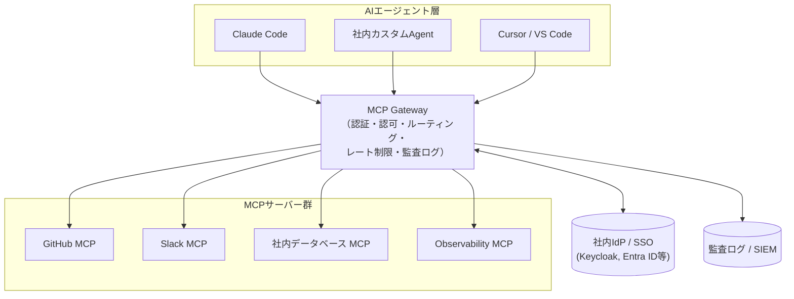

### 11.2 ID伝播（Identity Propagation）の設計選択

エージェントがGatewayに認証された後、その「身元」を下流のMCPサーバーへどう伝えるかには複数の方式があります。

| 方式 | 内容 | 適したケース |
|---|---|---|
| **トークン転送（Token Forwarding）** | エージェントの元トークンをそのまま下流サーバーへ渡す | サーバー側が同一の認可サーバーを信頼している場合 |
| **トークン交換（Token Exchange）** | Gatewayがエージェントのトークンを、サーバー固有の権限に絞ったトークンへ交換する | 最小権限の原則を厳密に守りたい場合（推奨） |
| **なりすまし（Impersonation）** | Gatewayがサービスアカウントを使いつつ、エージェントの身元をログに記録する | サーバー側がエージェント単位の認証をサポートしない場合 |

セキュリティの観点からは、クライアントのトークンをそのまま下流へ転送する「Token Passthrough」は前章で触れた脅威の一つでもあるため、可能な限り**トークン交換方式**を選ぶことが望ましいとされています。

### 11.3 可観測性・監査ログの設計

Gatewayは「AIエージェントが何をしているか」を可視化する絶好のポイントでもあります。最低限、以下の情報を不変な監査ログとして記録することが推奨されます。

- どのエージェント（身元）が
- どのツールを
- どのパラメータで呼び出し
- いつ、どのような結果（成功/失敗、レイテンシ）になったか

これらのログはPrometheus/Grafana、あるいはDatadog等の既存の可観測性基盤に統合し、ダッシュボードとアラートを構築します。ゲートウェイ自体のレイテンシ（p95/p99）も継続的に監視し、認証・ポリシー評価のオーバーヘッドが許容範囲内であることを確認します（健全なゲートウェイであれば、キャッシュヒット時のオーバーヘッドは数ミリ秒程度に収まるのが一般的です）。

### 11.4 導入判断の指針

Gatewayの構築・選定にあたっては、以下の観点で評価します。

1. **アクセス制御の粒度**: サーバー単位だけでなく、ツール単位・パラメータ単位でのポリシー適用ができるか
2. **監査証跡の完全性**: 改ざん不能な監査ログがあるか、コンプライアンス要件（SOC 2等）を満たせるか
3. **エコシステム統合**: 既存のIdP、既存の可観測性基盤（OpenTelemetry対応等）とスムーズに連携できるか
4. **オープンソース vs マネージドサービス**: 完全なデータ主権を求めるなら自己ホスト型（例: IBM ContextForge, Docker MCP Gateway）、迅速な導入を求めるならマネージドSaaS（例: MintMCP, WorkOS）を検討する

> **参考資料**
> - MCP Gateway: What It Is, Top Options — OpenObserve: https://openobserve.ai/blog/mcp-gateway-guide/
> - 7 top MCP gateways for enterprise AI infrastructure – 2026 — MintMCP: https://www.mintmcp.com/blog/enterprise-ai-infrastructure-mcp
> - 12 Best MCP Gateways for Engineering Teams (2026) — MCP Manager: https://mcpmanager.ai/blog/best-mcp-gateway-for-engineering/
> - 10 Best MCP Gateways In 2026 — TrueFoundry: https://www.truefoundry.com/blog/best-mcp-gateways
> - Best MCP Gateways and AI Agent Security Tools (2026) — Integrate.io: https://www.integrate.io/blog/best-mcp-gateways-and-ai-agent-security-tools/
> - 10 Best MCP Gateways for Developers in 2026 — Composio: https://composio.dev/content/best-mcp-gateway-for-developers
> - Best Open Source MCP Gateways 2026 — Lunar.dev: https://www.lunar.dev/post/the-best-open-source-mcp-gateways-in-2026
> - What Is an MCP Gateway? Why Every Enterprise AI Deployment Needs One: https://silentinfotech.com/blog/ai-9/mcp-gateway-every-enterprise-ai-deployment-needs-536
> - MCP Gateway: The Control Plane for Enterprise AI Agents — Tyk: https://tyk.io/learning-center/mcp-gateway-architecture-technical-guide/
> - Best MCP Gateways for SOC 2 Compliant Organizations 2026 — MintMCP: https://www.mintmcp.com/blog/mcp-gateways-soc2-compliant-organizations

---

## 12. 2026年ロードマップと今後の展望

MCPの開発体制は、少人数のコアメンテナーによるリリース単位の運営から、**Working Group主導・優先領域ベースの運営**へと移行しています。2026年のロードマップは、リリース日程ではなく「優先領域」を軸に構成されている点が過去との大きな違いです。

### 12.1 2026年の優先領域

| 優先領域 | 内容 |
|---|---|
| **トランスポートのスケーラビリティ** | ステートレス化により、水平スケール可能なStreamable HTTP基盤を確立する |
| **エージェント間通信** | Multi Round-Trip Requests（MRTR）など、サーバーからクライアントへの新しい相互作用パターンを整備する |
| **ガバナンスの成熟** | Feature Lifecycle Policy、Extensions Track、Conformance Suiteなど、破壊的変更を安全に導入する仕組みを整備する |
| **エンタープライズ対応** | 監査証跡、SSO統合認証、Gatewayの標準的な振る舞い、設定の可搬性 |

Anthropicはエンタープライズ対応の多くを**コア仕様ではなく拡張（Extension）として提供する**方針を明言しており、「基本プロトコルを万人向けに軽量に保ちつつ、企業固有のニーズは opt-in の拡張で満たす」という設計思想が貫かれています。

### 12.2 ガバナンスの変更点

- **Feature Lifecycle Policy**: すべての機能に Active → Deprecated → Removed の3段階のライフサイクルが定義され、廃止（Deprecated）から削除（Removed）までに最低12か月の猶予期間が設けられます。
- **Extensions Framework**: 新機能は逆引きDNS形式のIDを持つ拡張として、コア仕様とは独立したリポジトリ・独立したバージョニングでリリースされます。実験的機能から公式ステータスへ進むための「Extensions Track」が新設されました。
- **Conformance Suite（適合性スイート）**: Standard Track SEPは、対応するシナリオが適合性スイートに実装されるまでFinalステータスに到達できなくなり、SDK Tierシステム（公式SDKの実装網羅度を採点する仕組み）とも連動します。
- **SEPレビューの委任モデル**: これまで全てのSEPがコアメンテナーの全面レビューを必要としていたボトルネックを解消するため、信頼されたWorking Groupが自領域のSEPを承認できる委任モデルの導入が計画されています。

### 12.3 実務者が今取るべきアクション

1. **ステートレス化を見越したサーバー設計にしておく**: セッションIDに依存したステートフルな実装は、今後アプリケーションレベルでの明示的なハンドル管理（`basket_id`等）へ置き換えていく方針を検討する。
2. **MCP Apps拡張の動向を注視する**: サーバーがインタラクティブなHTML UIをサンドボックス化されたiframe内で提供できるようになるため、UIを伴うツール体験を計画している場合は仕様策定を追う。
3. **Deprecatedタグが付いた機能は計画的に移行する**: 最低12か月の猶予があるとはいえ、削除が確定してから移行に着手するのではなく、Deprecated化された時点で移行計画を立てる。

> **参考資料**
> - The 2026 MCP Roadmap（MCP公式ブログ）: https://blog.modelcontextprotocol.io/posts/2026-mcp-roadmap/
> - The 2026-07-28 MCP Specification Release Candidate: https://blog.modelcontextprotocol.io/posts/2026-07-28-release-candidate/
> - Model Context Protocol Blog: https://blog.modelcontextprotocol.io/
> - Model Context Protocol - Wikipedia（ガバナンス・普及動向）: https://en.wikipedia.org/wiki/Model_Context_Protocol

---

## 13. ベストプラクティス総括チェックリスト

本ガイドで扱った内容を、実装フェーズ別に整理した最終チェックリストです。

| フェーズ | チェック項目 |
|---|---|
| **設計** | Host/Client/Serverの責務が明確に分離されているか |
| 設計 | プロトコルバージョンの互換性マトリクスを文書化しているか |
| 設計 | トランスポート（stdio / Streamable HTTP）を用途に応じて正しく選定しているか |
| 設計 | Tools/Resources/Promptsの境界を正しく使い分けているか |
| **ツール実装** | ツール名にドメインの名前空間プレフィックスを付けているか |
| ツール実装 | `list_all`ではなく検索指向のツールを設計しているか |
| ツール実装 | レスポンスに人間が読める文脈を含めているか |
| ツール実装 | ページネーション・フィルタ・詳細度指定でトークン消費を抑えているか |
| ツール実装 | エラーメッセージが次の行動を具体的に示しているか |
| ツール実装 | 評価セット（Evaluation）を用意し定量的に改善しているか |
| **スケーラビリティ** | 接続するMCPサーバー数を必要最小限に絞っているか |
| スケーラビリティ | Tool Search / Code Executionなど遅延ロードの仕組みを活用しているか |
| **認証・認可** | MCPサーバーをリソースサーバーとして、認可サーバーと責務分離しているか |
| 認証・認可 | PKCE、Resource Indicators、短命トークンを実装しているか |
| 認証・認可 | トークン検証ロジックを自作せず、検証済みライブラリを使っているか |
| **セキュリティ** | 接続可能なMCPサーバーの許可リストを運用しているか |
| セキュリティ | ツール定義の変更（Rug Pull）を検知する仕組みがあるか |
| セキュリティ | 破壊的操作の前にLLMコンテキスト外での人間承認を挟んでいるか |
| セキュリティ | SSRF・コマンドインジェクション対策を実装しているか |
| **テスト** | MCP Inspectorによるインタラクティブテストを開発フローに組み込んでいるか |
| テスト | インメモリトランスポート等による自動テストをCIに統合しているか |
| テスト | stdoutにJSON-RPC以外を出力していないか（ログはstderrのみか） |
| **運用** | すべてのツール呼び出しを監査ログとして記録しているか |
| 運用 | 本番規模での接続にはGatewayパターンの採用を検討したか |
| 運用 | プロトコルの非推奨機能・Deprecatedタグを継続的に監視しているか |

---

## 14. 参考文献一覧（全URL）

本ガイド作成にあたり参照した情報源を、カテゴリ別に一覧化します（2026年7月時点でのアクセス確認済み）。

### 公式仕様・公式ブログ
- MCP Specification (2025-11-25): https://modelcontextprotocol.io/specification/2025-11-25
- MCP Specification - Transports (2025-03-26): https://modelcontextprotocol.io/specification/2025-03-26/basic/transports
- Understanding Authorization in MCP: https://modelcontextprotocol.io/docs/tutorials/security/authorization
- MCP Inspector（公式ドキュメント）: https://modelcontextprotocol.io/docs/tools/inspector
- GitHub - modelcontextprotocol/modelcontextprotocol: https://github.com/modelcontextprotocol/modelcontextprotocol
- GitHub Releases: https://github.com/modelcontextprotocol/modelcontextprotocol/releases
- GitHub - modelcontextprotocol/inspector: https://github.com/modelcontextprotocol/inspector
- The 2026 MCP Roadmap: https://blog.modelcontextprotocol.io/posts/2026-mcp-roadmap/
- The 2026-07-28 MCP Specification Release Candidate: https://blog.modelcontextprotocol.io/posts/2026-07-28-release-candidate/
- Model Context Protocol Blog: https://blog.modelcontextprotocol.io/
- Specification – Model Context Protocol（MCP Info）: https://modelcontextprotocol.info/specification/
- Writing effective tools for AI agents—using AI agents（Anthropic）: https://www.anthropic.com/engineering/writing-tools-for-agents
- Code execution with MCP: building more efficient AI agents（Anthropic）: https://www.anthropic.com/engineering/code-execution-with-mcp

### 概要・アーキテクチャ解説
- Model Context Protocol - Wikipedia: https://en.wikipedia.org/wiki/Model_Context_Protocol
- MCP Cheat Sheet (2026) — Webfuse: https://www.webfuse.com/mcp-cheat-sheet
- Model Context Protocol (MCP): The Standard That's Changing AI Integration in 2026: https://devstarsj.github.io/2026/03/18/model-context-protocol-mcp-complete-guide-2026/
- Model Context Protocol (MCP) explained — CodiLime: https://codilime.com/blog/model-context-protocol-explained/
- The Hitchhiker's Guide to Agentic AI: https://arxiv.org/pdf/2606.24937

### トランスポート
- MCP Server Transports — Roo Code: https://docs.roocode.com/features/mcp/server-transports
- MCP Transport: Stdio vs Streamable HTTP — TrueFoundry: https://www.truefoundry.com/blog/mcp-stdio-vs-streamable-http-enterprise
- MCP Transport Protocols: stdio vs SSE vs StreamableHTTP — MCPcat: https://mcpcat.io/guides/comparing-stdio-sse-streamablehttp/
- MCP stdio vs HTTP vs SSE Transport: Which Should You Choose in 2026? — Start Debugging: https://startdebugging.net/2026/07/mcp-stdio-vs-http-vs-sse-transport-which-to-choose/
- MCP Transports Explained — ChatForest: https://chatforest.com/guides/mcp-transports-explained/
- MCP SSE vs Stdio: Transport Options Explained (2026) — Apigene: https://apigene.ai/blog/mcp-sse-vs-stdio
- MCP Transports: stdio vs SSE vs HTTP — RapidDev: https://www.rapidevelopers.com/mcp-tutorial/mcp-transport-stdio-vs-sse-vs-http
- MCP Transport Mechanisms: STDIO vs Streamable HTTP — AWS Builder Center: https://builder.aws.com/content/35A0IphCeLvYzly9Sw40G1dVNzc/mcp-transport-mechanisms-stdio-vs-streamable-http
- MCP Transports Compared: stdio vs SSE vs Streamable HTTP (2026) — rollbrains: https://rollbrains.com/mcp/mcp-transports-compared/

### プリミティブ（Tools/Resources/Prompts/Sampling/Elicitation/Roots）
- Understanding MCP features — WorkOS: https://workos.com/blog/mcp-features-guide
- What is MCP elicitation and sampling? — Stacktree: https://stacktr.ee/blog/what-is-mcp-elicitation
- MCP Concepts: Sampling and Elicitation — Medium: https://medium.com/@__nagarajan__/mcp-concepts-sampling-and-elicitation-95c5c0c4df71
- Memgraph MCP Experimental Server: Elicitation and Sampling Explained: https://memgraph.com/blog/memgraph-mcp-elicitation-and-sampling
- MCP Client Concepts: How Elicitation, Sampling, and Roots Make AI Agents Responsible: https://medium.com/@puneetsharma41/mcp-client-concepts-how-elicitation-sampling-and-roots-make-ai-agents-responsible-5f02a0666d9a
- The Model Context Protocol (MCP): Deep dive into structure and concepts — HMS: https://www.analytical-software.de/en/the-model-context-protocol-mcp-deep-dive-into-structure-and-concepts/

### ツール設計ベストプラクティス
- Writing Effective Tools for AI Agents: Lessons from Anthropic — Medium: https://laxmikumars.medium.com/writing-effective-tools-for-ai-agents-lessons-from-anthropic-25b85bf74f5d
- Writing Effective Tools for AI Agents: Production Lessons from Anthropic — Medium: https://techwithibrahim.medium.com/writing-effective-tools-for-ai-agents-production-lessons-from-anthropic-99ea76a7fcf0
- ADR-0023: Anthropic Tool Design Best Practices: https://github.com/vishnu2kmohan/mcp-server-langgraph/blob/main/adr/adr-0023-anthropic-tool-design-best-practices.md

### コンテキスト管理・スケーラビリティ
- When too many tools become too much context — WRITER: https://writer.com/engineering/rag-mcp/
- How to Prevent MCP Tool Overload and Build Faster, Safer AI Agents — Lunar.dev: https://www.lunar.dev/post/why-is-there-mcp-tool-overload-and-how-to-solve-it-for-your-ai-agents
- MCP's Context Bloat Crisis — AgentMarketCap: https://agentmarketcap.ai/blog/2026/04/08/mcp-context-bloat-enterprise-scale-tool-definitions-agent-context-budget
- MCP Context Bloat Fix 2026 (Tool Search) — MCP.Directory: https://mcp.directory/blog/mcp-context-bloat-fix-2026-tool-search-code-mode-progressive-disclosure
- How to Reduce the Number of MCP Tools Claude Loads — Start Debugging: https://startdebugging.net/2026/05/how-to-reduce-the-number-of-mcp-tools-claude-loads/
- 10 strategies to reduce MCP token bloat — The New Stack: https://thenewstack.io/how-to-reduce-mcp-token-bloat/
- MCP Tools: What They Are and How to Build Them Right (2026) — Apigene: https://apigene.ai/blog/mcp-tools
- Thousands of MCP Tools, Zero Context Left — AgentPMT: https://www.agentpmt.com/articles/thousands-of-mcp-tools-zero-context-left-the-bloat-tax-breaking-ai-agents

### 認証・認可（OAuth 2.1）
- MCP security: Implementing robust authentication and authorization — Red Hat: https://www.redhat.com/en/blog/mcp-security-implementing-robust-authentication-and-authorization
- MCP Server Security: Auth Best Practices 2026 — Medium: https://medium.com/data-science-collective/why-your-mcp-server-is-a-security-disaster-waiting-to-happen-660577d8077c
- MCP OAuth 2.1 Authentication: Complete Developer Guide 2026 — RockB: https://baeseokjae.github.io/posts/mcp-oauth-authentication-guide-2026/
- How MCP Authentication Works: Authorization, OAuth & Security — Obot: https://obot.ai/resources/learning-center/mcp-authentication/
- How to Secure MCP Servers (2026 Guide): https://codersera.com/blog/how-to-secure-mcp-servers-2026/
- The New MCP Authorization Specification: https://dasroot.net/posts/2026/04/mcp-authorization-specification-oauth-2-1-resource-indicators/
- MCP Server Security Best Practices to Prevent Risk — Descope: https://www.descope.com/blog/post/mcp-server-security-best-practices
- MCP server authentication in 2026: what practitioners need to know: https://nhimg.org/articles/mcp-server-authentication-in-2026-what-practitioners-need-to-know/
- The best providers for MCP server authentication in 2026 — WorkOS: https://workos.com/blog/best-mcp-server-authentication-providers
- Test MCP Server with MCP Inspector — Auth for MCP: https://auth0.com/ai/docs/mcp/guides/test-your-mcp-server-with-mcp-inspector

### セキュリティ脅威（Tool Poisoning / Prompt Injection）
- MCP Tool Poisoning — OWASP Foundation: https://owasp.org/www-community/attacks/MCP_Tool_Poisoning
- MCP Security Vulnerabilities: How to Prevent Prompt Injection and Tool Poisoning Attacks in 2026 — Practical DevSecOps: https://www.practical-devsecops.com/mcp-security-vulnerabilities/
- Understanding MCP Tool Poisoning Attacks — Descope: https://www.descope.com/learn/post/mcp-tool-poisoning
- Protecting against indirect prompt injection attacks in MCP — Microsoft for Developers: https://developer.microsoft.com/blog/protecting-against-indirect-injection-attacks-mcp
- Prompt injection in MCP: how tool poisoning works — Aptible: https://www.aptible.com/mcp-security/mcp-prompt-injection
- MCP Tool Poisoning - How It Works & How To Fight It — MCP Manager: https://mcpmanager.ai/blog/tool-poisoning/
- Model Context Protocol Threat Modeling（MCPTox学術研究）: https://arxiv.org/html/2603.22489v1
- Poison everywhere: No output from your MCP server is safe — CyberArk: https://www.cyberark.com/resources/threat-research-blog/poison-everywhere-no-output-from-your-mcp-server-is-safe
- MCP security: How to prevent prompt injection and tool poisoning attacks — Security Boulevard: https://securityboulevard.com/2026/01/mcp-security-how-to-prevent-prompt-injection-and-tool-poisoning-attacks/
- MCP Security: How to Stop Prompt Injection Attacks — Datadome: https://datadome.co/agent-trust-management/mcp-security-prompt-injection-prevention/

### テスト・デバッグ
- MCP Inspector – Testing and Debugging for MCP Servers — Stainless: https://www.stainless.com/mcp/mcp-inspector-testing-and-debugging-mcp-servers/
- Error Handling And Debugging MCP Servers — Stainless: https://www.stainless.com/mcp/error-handling-and-debugging-mcp-servers/
- Testing & Debugging MCP Servers (Inspector Tools Guide) — MCP Server Spot: https://www.mcpserverspot.com/learn/building/testing-debugging-mcp
- Debugging | MCP Framework: https://www.mcp-framework.com/docs/debugging
- Debugging Model Context Protocol (MCP) Servers: Tips and Best Practices — mcpevals.io: https://www.mcpevals.io/blog/debugging-mcp-servers-tips-and-best-practices
- MCP Inspector Setup Guide — MCPcat: https://mcpcat.io/guides/setting-up-mcp-inspector-server-testing/
- How to Test Your MCP Server: Validation, Debugging, and Scoring Impact — AgentHermes: https://agenthermes.ai/blog/testing-mcp-server-guide

### エンタープライズアーキテクチャ・Gateway
- MCP Gateway: What It Is, Top Options — OpenObserve: https://openobserve.ai/blog/mcp-gateway-guide/
- 7 top MCP gateways for enterprise AI infrastructure – 2026 — MintMCP: https://www.mintmcp.com/blog/enterprise-ai-infrastructure-mcp
- 12 Best MCP Gateways for Engineering Teams (2026) — MCP Manager: https://mcpmanager.ai/blog/best-mcp-gateway-for-engineering/
- 10 Best MCP Gateways In 2026 — TrueFoundry: https://www.truefoundry.com/blog/best-mcp-gateways
- Best MCP Gateways and AI Agent Security Tools (2026) — Integrate.io: https://www.integrate.io/blog/best-mcp-gateways-and-ai-agent-security-tools/
- 10 Best MCP Gateways for Developers in 2026 — Composio: https://composio.dev/content/best-mcp-gateway-for-developers
- Best Open Source MCP Gateways 2026 — Lunar.dev: https://www.lunar.dev/post/the-best-open-source-mcp-gateways-in-2026
- What Is an MCP Gateway? Why Every Enterprise AI Deployment Needs One: https://silentinfotech.com/blog/ai-9/mcp-gateway-every-enterprise-ai-deployment-needs-536
- MCP Gateway: The Control Plane for Enterprise AI Agents — Tyk: https://tyk.io/learning-center/mcp-gateway-architecture-technical-guide/
- Best MCP Gateways for SOC 2 Compliant Organizations 2026 — MintMCP: https://www.mintmcp.com/blog/mcp-gateways-soc2-compliant-organizations

---

*本ドキュメントはWeb検索により収集した2026年7月時点の情報を基に作成されています。MCP仕様は活発に進化しているため、実装前に必ず公式サイト（https://modelcontextprotocol.io/ ）および公式ブログ（https://blog.modelcontextprotocol.io/ ）で最新情報をご確認ください。*
