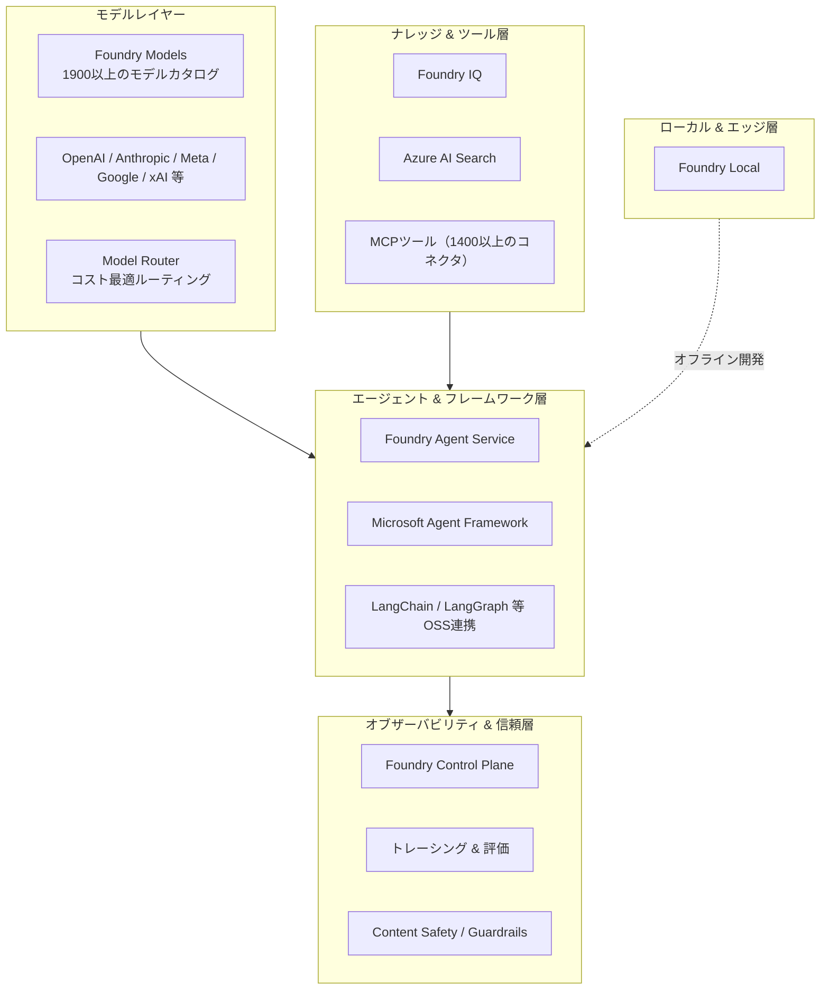
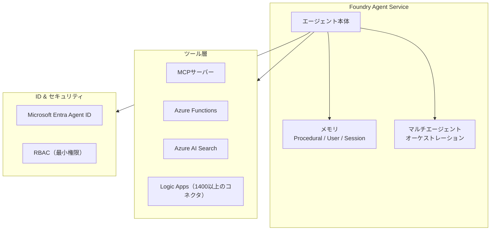
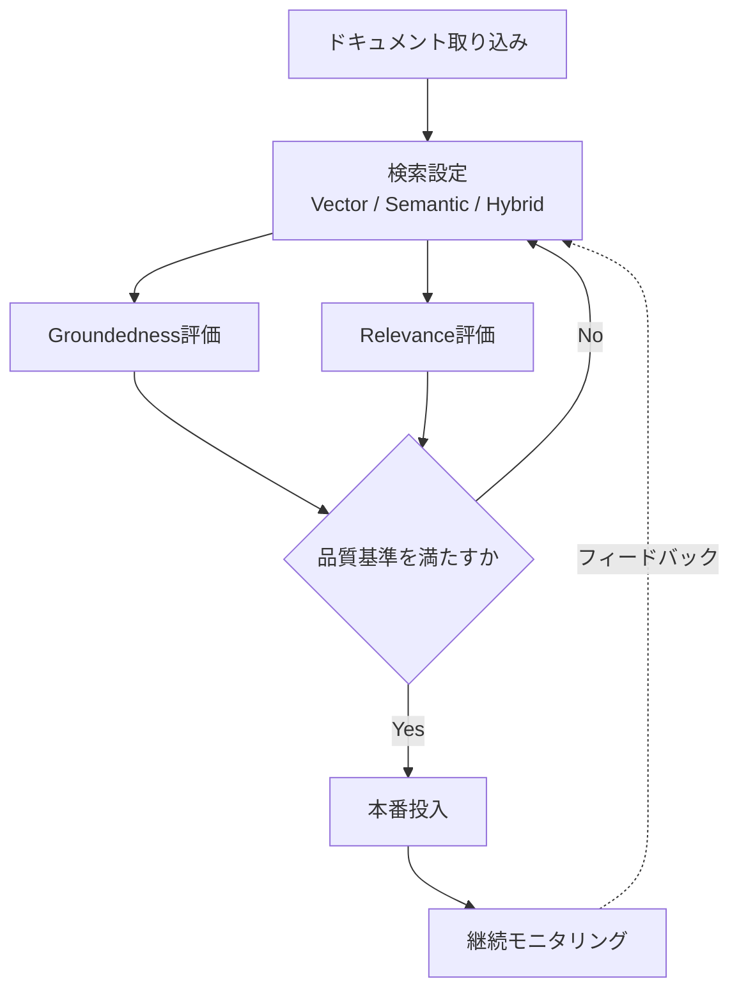
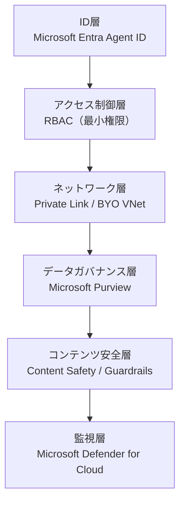
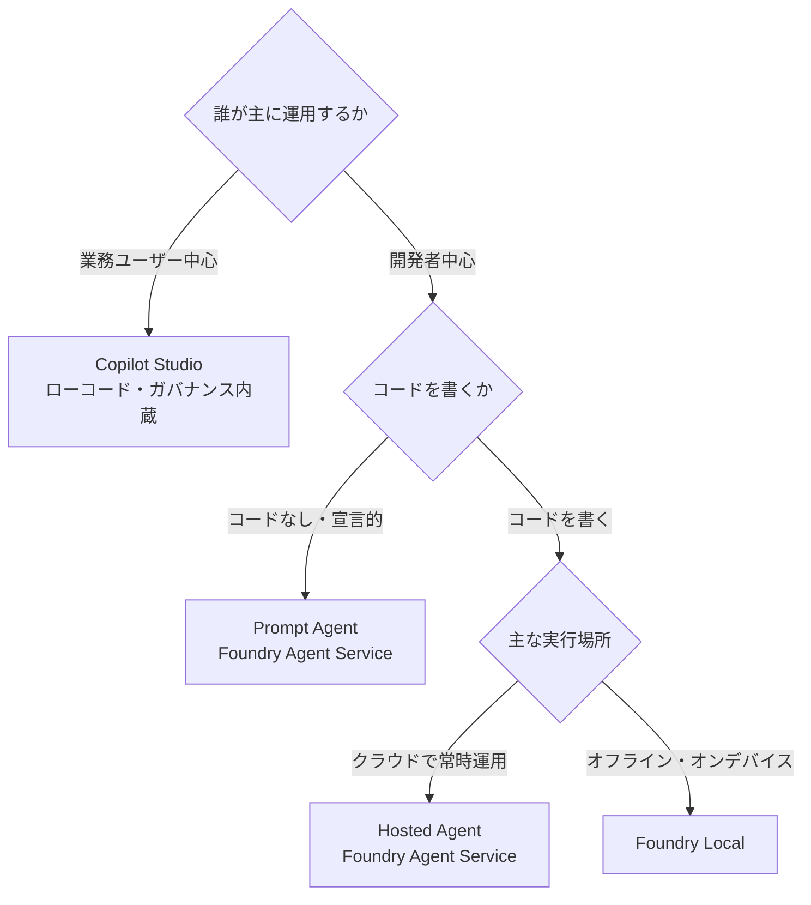

# Microsoft Foundry 活用ガイド — 初学者のためのステップバイステップ・ベストプラクティス

> 最終更新: 2026年7月18日時点の公開情報（Microsoft公式ドキュメント・公式ブログ・著名開発者の技術記事）をもとに作成しています。Microsoft Foundryは頻繁にアップデートされるプラットフォームのため、実装時は必ず [Microsoft Learn](https://learn.microsoft.com/en-us/azure/foundry/) の最新情報をご確認ください。

## 目次

1. [Microsoft Foundryとは何か](#1-microsoft-foundryとは何か)
2. [全体アーキテクチャを理解する](#2-全体アーキテクチャを理解する)
3. [Step 1: Azureアカウントとプロジェクトの準備](#step-1-azureアカウントとプロジェクトの準備)
4. [Step 2: モデルを選定してデプロイする](#step-2-モデルを選定してデプロイする)
5. [Step 3: 初めてのAPI呼び出し](#step-3-初めてのapi呼び出し)
6. [Step 4: エージェントを構築する](#step-4-エージェントを構築する)
7. [Step 5: ツールとナレッジを連携する（RAG / Foundry IQ）](#step-5-ツールとナレッジを連携するrag--foundry-iq)
8. [Step 6: 評価とオブザーバビリティを整備する](#step-6-評価とオブザーバビリティを整備する)
9. [Step 7: セキュリティとガバナンスを設計する](#step-7-セキュリティとガバナンスを設計する)
10. [Step 8: コストを最適化する](#step-8-コストを最適化する)
11. [Step 9: 責任あるAI（Responsible AI）とガードレール](#step-9-責任あるairesponsible-aiとガードレール)
12. [Step 10: ローカル開発から本番デプロイへ](#step-10-ローカル開発から本番デプロイへ)
13. [ベストプラクティス総合チェックリスト](#13-ベストプラクティス総合チェックリスト)
14. [補足: 海外の著名開発者・実務者による知見](#14-補足-海外の著名開発者実務者による知見)
15. [参考ソース一覧](#15-参考ソース一覧)

---

## 1. Microsoft Foundryとは何か

Microsoft Foundryは、旧称「Azure AI Studio」「Azure AI Foundry」を統合・刷新した、エンタープライズ向けのAIアプリ／エージェント開発プラットフォームです。モデルの選定からエージェントの構築、ナレッジ連携、監視、セキュリティ統制までを、単一の管理基盤（リソースプロバイダー名前空間）の上で一貫して扱えるようにすることを目的としています。

Microsoft公式ドキュメントによれば、Foundryはエンタープライズ規模のAI運用・モデル開発・アプリケーション開発を対象としたAzureのプラットフォームサービスであり、トレーシング・モニタリング・評価・エンタープライズ向けの構成機能を備え、統一されたRBAC・ネットワーク・ポリシー管理を1つのAzureリソースプロバイダーの下で提供します。

初学者がまず押さえておくべき用語の変化は以下の通りです（旧概念 → 現行概念）。

| 観点 | 旧称・旧概念 | 現行の名称・概念 |
| --- | --- | --- |
| ブランド名 | Azure AI Studio / Azure AI Foundry | Microsoft Foundry |
| サービス名 | Azure AI Services | Foundry Tools |
| ポータル | Foundry (classic) | Foundry（新ポータル） |
| エージェントAPI | Assistants API (Agents v0.5/v1) | Responses API (Agents v2) |
| リソースモデル | Hub + Azure OpenAI + Azure AI Services（複数リソース） | Foundryリソース（単一、プロジェクト内包） |
| SDK | 複数パッケージに分散 (`azure-ai-inference` 等) | 統一プロジェクトクライアント (`azure-ai-projects`) + `OpenAI()` |
| 用語 | Threads, Messages, Runs, Assistants | Conversations, Items, Responses, Agent Versions |

初学者への実務的な示唆として、これから新規に学習・実装する場合は「Foundry（新ポータル）」と「Responses API」を前提に学ぶのが最も効率的です。Azure OpenAIから移行する場合も、エンドポイントやAPIキー、既存の状態を保ったままFoundryリソースへアップグレードできる経路が用意されています。

---

## 2. 全体アーキテクチャを理解する

Foundryは大きく5つのレイヤーで構成されています。各レイヤーの役割を最初に俯瞰しておくと、以降のステップの位置づけが理解しやすくなります。



この図の要点は次の3つです。

- **モデルは交換可能な部品として扱う**: Foundryはモデル非依存（model-agnostic）を志向しており、OpenAI、Anthropic（Claude）、Meta、xAI、DeepSeek、Hugging Face、Microsoft自社のPhi/MAIなど、幅広いモデルを単一のプロジェクトエンドポイントから呼び出せます。
- **エージェントはモデル・ツール・メモリの合成物である**: Foundry Agent ServiceとMicrosoft Agent Frameworkが、モデル呼び出し・ツール実行・記憶（メモリ）・マルチエージェント連携を束ねます。
- **信頼レイヤーは後付けではなく前提**: トレーシング、評価、コンテンツセーフティは開発の初期段階から組み込むべき機能として設計されています。

---

## Step 1: Azureアカウントとプロジェクトの準備

### 1-1. 前提条件

- 有効なAzureサブスクリプション（無料トライアルでも開始可能）
- Foundryリソースを作成できるロール（Foundry Account Owner / Foundry Owner など、サブスクリプションまたはリソースグループスコープ）

### 1-2. 手順（ポータルの場合）

1. [Foundryポータル](https://ai.azure.com)にサインインする
2. 画面右上の「New Foundry」トグルがオンになっていることを確認する（新ポータル前提で本ガイドは解説します）
3. 左上のプロジェクト名部分から「Create new project」を選択する
4. プロジェクト名を入力し、リソースグループとリージョンを選択する（初学者は新規リソースグループを作成し、プロジェクトと関連リソースをまとめて管理するのが推奨されています）
5. 「Create」を選択し、プロジェクトが作成されるのを待つ

### 1-3. 手順（Azure CLIの場合）

CLIでの再現性のある構築を重視するチームは、以下のような流れでリソースグループとFoundryリソースを作成できます。

```bash
az login

az group create --name my-foundry-rg --location eastus

az cognitiveservices account create \
  --name my-foundry-resource \
  --resource-group my-foundry-rg \
  --kind AIServices \
  --sku S0 \
  --location eastus \
  --custom-domain my-foundry-resource \
  --allow-project-management true
```

### ベストプラクティス

- **初学者はまず専用のリソースグループを1つ作る**: プロジェクトと関連リソース（ストレージ、検索、Key Vaultなど）をひとまとめに管理でき、後片付けも容易になります。
- **チームメンバーの追加はEntraセキュリティグループ単位で行う**: 個別メールアドレスでの追加は管理コストが高くなるため、複数人を一括登録する場合はMicrosoft Entraのセキュリティグループを使うことが推奨されています。
- **サンドボックスと本番は最初から分離する**: 実験用プロジェクトと本番用プロジェクトを分けておくことで、後述するRBACやネットワーク分離の設計がシンプルになります。

---

## Step 2: モデルを選定してデプロイする

Foundryのモデルカタログには1,900以上のモデルが用意されており、GPT-5系列、Claude、Grok、Mistral、DeepSeek-R1、Phi-4、Meta Llamaなど多様な選択肢があります。初学者はまず用途別の「当たり」を知っておくと選定が早くなります。

| モデルファミリー | 得意とする用途 |
| --- | --- |
| GPT-5 | 複雑な推論・多段階タスク・マルチモーダル処理 |
| GPT-4.1 | 本番ワークロード向けの性能とコストのバランス |
| GPT-4.1 mini | 低遅延・高スループットが必要な場面 |
| Claude | 高度な推論、コード生成、マルチモーダルタスク |
| Grok | 推論、コーディング、データ抽出 |
| Mistral | コード生成、多言語対応、汎用チャット |
| DeepSeek-R1 | オープンウェイトでの大規模推論 |
| Phi-4 | オンデバイス・省リソース環境向け小型モデル |
| Meta Llama | カスタマイズ・ファインチューニング前提のオープンモデル |

### ベストプラクティス（モデル選定）

1. **モデルカタログを開く前に成功基準を定義する**: Microsoft Foundry開発者向けガイドでは、モデルの知名度に引きずられず、ワークロードの要件（精度・レイテンシ・コスト）を先に定義してから評価すべきだと述べられています。
2. **タスクごとにモデルを使い分ける**: 単純な分類タスク、RAG応答、長文脈の推論、多段階のエージェント処理は、それぞれ異なるモデル・デプロイ戦略を採用すべきとされています。すべてを最上位モデルで処理するのはプロトタイプ段階では許容できても、本番では破綻しやすいコスト構造になります。
3. **Model Router（インテリジェントルーティング）を活用する**: タスクの複雑さと予算に応じて、リアルタイムに最適なモデルへ自動的に振り分ける機能が提供されています。アプリの書き換えなしに性能とコストの最適化が可能です。
4. **迷ったら「GPT-5 vs GPT-4.1」のようなモデル選定ガイドを参照する**: Microsoft Learnにはモデル比較のための専用ガイドが用意されています。

---

## Step 3: 初めてのAPI呼び出し

プロジェクトとモデルデプロイが完了したら、まずは最小構成でAPIを呼び出して疎通確認を行います。以下はPythonでの例です。

```python
from azure.identity import DefaultAzureCredential
from azure.ai.projects import AIProjectClient

# 形式: "https://resource_name.ai.azure.com/api/projects/project_name"
PROJECT_ENDPOINT = "your_project_endpoint"

project = AIProjectClient(
    endpoint=PROJECT_ENDPOINT,
    credential=DefaultAzureCredential(),
)
openai = project.get_openai_client()

response = openai.responses.create(
    model="gpt-5-mini",
    input="日本の人口はおよそ何人ですか？",
)
print(response.output_text)
```

### ベストプラクティス

- **認証はAPIキーではなく`DefaultAzureCredential`（マネージドID）を優先する**: キーの管理・ローテーションの負担をなくし、シークレット漏えいのリスクを下げられます。
- **Responses APIを起点に学ぶ**: 旧Assistants APIからの移行者は用語（Threads→Conversations、Runs→Responsesなど）の対応関係を意識すると混乱が少なくなります。
- **環境変数でエンドポイントを管理する**: `PROJECT_ENDPOINT`のような値はコードに直書きせず、環境変数や設定ストアから読み込むようにします。

---

## Step 4: エージェントを構築する

Foundry Agent Serviceは、モデル・ツール・メモリ・マルチエージェント連携を統合的に扱う管理型ランタイムです。エージェントの実装スタイルは大きく2種類あります。

- **Prompt Agent（宣言的エージェント）**: FoundryポータルまたはSDK/RESTでプロンプトとツール構成を定義するだけで、実行基盤の管理が不要なタイプ。
- **Hosted Agent（ホスト型エージェント）**: Microsoft Agent Framework、LangGraph、OpenAI Agents SDK、Anthropic Agent SDK、GitHub Copilot SDKなど任意のフレームワークで書いたコードをコンテナ化し、Foundryが管理するランタイム上で実行するタイプ。セッションごとにハイパーバイザーレベルで分離されたサンドボックスが割り当てられます。



### ベストプラクティス

1. **まずPrompt Agentで要件を検証し、必要になったらHosted Agentへ移行する**: コードを書かずに始められるPrompt Agentで業務要件を素早く検証し、カスタムロジックや独自フレームワークが必要になった段階でHosted Agentへ移行する、という段階的なアプローチが推奨されています。
2. **メモリ機能は種類を理解してから有効化する**: Foundryのメモリには、実行を跨いでやり方を学習する「Procedural memory」、ユーザーの好みや事実を記憶する「User memory」、会話内の文脈を保持する「Session memory」の3種類があります。テストエージェントでメモリを有効化し、タスク成功率・ツール呼び出し回数・トークン消費量を比較検証することが推奨されています。
3. **フレームワーク非依存の設計を維持する**: Microsoft Agent Framework、LangGraph、OpenAI Agents SDK、GitHub Copilot SDKなど複数のSDKに対応しているため、特定フレームワークへのロックインを避けた設計にしておくと将来の変更コストを抑えられます。
4. **コンテナ化されたエージェントはセッションごとの分離を前提に設計する**: Hosted Agentは各セッションが独立したVM分離サンドボックスを持ち、ファイルシステムの状態もスケールゼロ後に復元されます。ステートフルな処理を前提にした設計が可能です。

---

## Step 5: ツールとナレッジを連携する（RAG / Foundry IQ）

エージェントに社内データや外部知識を根拠づけさせる（グラウンディングする）ことは、幻覚（ハルシネーション）を抑える上で最重要のステップです。Foundryでは、Foundry IQ（旧Azure AI Search発展形）を中心に、Agentic Retrieval APIによる高度な検索が提供されています。



### ベストプラクティス

1. **複数の検索アルゴリズムを比較評価してから決める**: テキスト検索、ベクトル検索、セマンティック検索、セマンティックハイブリッド検索など複数パターンを評価し、Groundedness（根拠性）・Relevance（関連性）評価指標で比較してから採用するパラメータを決定することがMicrosoftのRAG最適化ガイドで推奨されています。
2. **複雑な問い合わせにはAgentic Retrievalを使う**: 会話履歴を踏まえて複合的な質問をサブクエリに分解し、並列実行してから再ランキング・統合する「Agentic Retrieval API」は、複雑なクエリに対して従来手法よりも高い関連性を示す結果が報告されています。
3. **ツール呼び出しの決定則を明文化する**: 複数のツールが役割的に重複する場合（例: File SearchとWeb Search）、「社内コンテンツにはFile Searchを優先し、それで見つからない場合のみWeb Searchを使う」といった判断基準をエージェントの指示文に明記することが公式ドキュメントのツールベストプラクティスとして案内されています。
4. **ツールの出力は信頼しない（untrusted inputとして扱う）**: ツールから返る値は検証してから利用し、重要な値をそのままアクションに使わないこと。認証情報をプロンプトに含めず、トレースやログにも機密情報を残さないことが推奨されています。

---

## Step 6: 評価とオブザーバビリティを整備する

Foundryは、評価（Evaluators）、本番モニタリング、トレーシングの3本柱でAIアプリケーションのライフサイクル全体を可視化します。OpenTelemetryベースのトレーシングにより、エージェントの本番挙動をエンドツーエンドで記録できます。

| 評価カテゴリ | 代表的な評価指標 |
| --- | --- |
| 汎用品質 | Coherence（一貫性）、Fluency（流暢さ）、Relevance（関連性） |
| RAG特化 | Groundedness（根拠性）、Retrieval品質（XDCGなど） |
| 安全性・セキュリティ | Hate/Unfairness、Violence、Protected Material、Self-harm |
| エージェント特化 | Tool Call Accuracy（ツール呼び出し精度）、Task Completion（タスク完了率） |

### ベストプラクティス

1. **評価はチェックリストではなく継続的なシグナルとして扱う**: 評価と継続モニタリングをAzure Monitorに接続し、品質を「出荷前の一度きりのチェック」ではなく「本番の生きたシグナル」として扱うことが2026年のアップデートで強調されています。
2. **すべての観測データを一箇所に集約する**: 評価結果、トレース、レイテンシ、トークン使用量、品質指標をAzure Monitorに集約することで、他のAzureスタックとの横断的な相関分析が可能になります。
3. **Ask AIによるコスト・パフォーマンスの要約を活用する**: Foundry Control Plane上のAI搭載アシスタントに「特定エージェントのコストとパフォーマンス詳細を見せて」「モデル・デプロイ別のコスト内訳を出して」のように尋ねることで、コストスパイクの原因（トークン使用量の増加、応答長の増大、評価実行の頻度など）を素早く特定できます。
4. **Prompt Optimizer（プレビュー）で評価結果からプロンプトを自動改善する**: 評価結果に基づいてエージェントのプロンプトを自動的に改善する機能がプレビュー提供されています。

---

## Step 7: セキュリティとガバナンスを設計する

エージェントは「単なるプロンプト」ではなく、実世界のシステムに接続された権限を持つ主体として扱う必要があります。Foundryのセキュリティは、ID・アクセス制御・ネットワーク・データガバナンス・コンテンツ安全性という層構造で提供されています。



### ベストプラクティス

1. **エージェントごとに独立したIDを割り当てる**: 各エージェントにMicrosoft Entra IDに紐づく専用のマネージドIDを持たせ、モデル・ツール・データへのアクセスをAzure RBACで統制することで、共有APIキーや過剰権限エージェントを排除できます。例えば、RAGエージェントにはAzure AI SearchとBlob Storageへの読み取り専用権限のみを与え、アクション型エージェントにはCRM APIへのスコープ付き書き込み権限のみを与える、といった分離が実務例として紹介されています。
2. **RBACのスコープをハブ単位ではなくプロジェクト単位で絞る**: ハブスコープでの`Azure AI Developer`ロール付与は、そのハブ配下の全プロジェクト（他チームのプロジェクトを含む）への読み取りアクセスを許してしまう可能性があるため、プロジェクトリソースへスコープを絞ることが推奨されています。
3. **本番環境ではプライベートエンドポイントを既定にする**: パブリックネットワークアクセスを無効化し、Private Link / BYO VNetを用いてネットワーク境界を明確にすることが、機微なワークロードに対する推奨構成です。Azure AI Search・Azure Storage・Azure Cosmos DBへのプライベートエンドポイントは自動作成されないため、明示的な設定が必要です。
4. **APIキーではなくマネージドIDを使い、キーはKey Vaultで管理する**: キーを使わざるを得ない場合も、Azure Key Vaultに保管し、ソースコードやログ、クライアントアプリに直接埋め込まないようにします。
5. **MCPサーバー経由の操作には追加の注意が必要**: プレビュー段階のFoundry MCP Serverはネットワーク分離に対応しておらず、パブリックエンドポイントを介して接続されるため、リージョンをまたいだデータ処理の可能性や、Conditional Accessポリシーでのアクセス制御適用状況を事前に確認する必要があります。

---

## Step 8: コストを最適化する

Microsoft Foundry開発者ガイドでは、コストを「後から気にするもの」ではなく「最初から設計に組み込むアーキテクチャ上の関心事」として扱うべきだと明言されています。

| コスト最適化のレバー | 内容 |
| --- | --- |
| インテリジェントルーティング | タスクの複雑さと予算に応じて最適なモデルへ振り分ける |
| バッチ処理 | リアルタイム応答が不要なワークロードは非同期処理にまとめる |
| キャッシュ | 同一・類似リクエストへの重複課金を避ける |
| プロビジョンドスループット（PTU） | 予測可能な性能を専用キャパシティで確保する |
| クォータ管理 | クォータのティア分け、グローバル/データゾーンのクォータで予測可能にスケールする |
| モデル最適化 | 圧縮・ファインチューニング・蒸留を適材適所で使う |

### ベストプラクティス

1. **タスク種別ごとにコストをプロファイリングしてから最適化する**: ルーティングの意思決定はワークロード固有であり、画一的な最適化は成立しません。まずタスクごとのコスト構造を可視化してから手を打つべきとされています。
2. **本番運用では「デプロイ＝運用完了」ではないと理解する**: エンドポイントのデプロイ後も、システムの挙動理解、ポリシー適用、使用量とコストの監視、モデル変更の安全なテスト、品質劣化時のロールバックといった運用能力が必要です。
3. **コストデータのエクスポートを定期化する**: コストデータをストレージアカウントへ日次・週次・月次でエクスポートし、財務チームがExcelやPower BIで分析できるようにしておくことが推奨されています。
4. **軽量ワークロードには小型モデル・低コンピュートティアを使う**: 実験段階では小型モデルや低ティアのコンピュートを使い、本番スケール前にコストとパフォーマンスのトレードオフを検証するパイプラインを構築します。中断可能なジョブにはSpot VMの活用でコストを大幅に下げられる場合があります。

---

## Step 9: 責任あるAI（Responsible AI）とガードレール

FoundryはMicrosoftのResponsible AI原則に沿って、Discover（発見）・Protect（保護）・Govern（統制）の3段階でガードレールを提供しています。

- **Discover**: 敵対的プロンプトによるテストなど、デプロイ前後でエージェントの品質・安全性・セキュリティリスクを発見する。
- **Protect**: モデル出力レベルとエージェント実行時レベルの両方で、セキュリティリスク・望ましくない出力・安全でない行動から保護する。コンテンツフィルターとGuardrailsで有害な出力をユーザーに届く前にブロックする。
- **Govern**: トレーシング・モニタリングツールとコンプライアンス統合を通じてエージェントを統制し、本番環境での継続的モニタリングで異常な振る舞いを検知する。

### ベストプラクティス

1. **既定の安全設定を理解した上でチューニングする**: Azure OpenAI in Foundry Modelsには、Whisperなどの音声モデルを除くすべてのモデルに既定の安全ポリシー（コンテンツフィルタリング、ブロックリスト、プロンプト変換など）が適用されています。まずは既定（中程度のしきい値など）から始め、ブロック率を観察しながら調整していくアプローチが実務者から提案されています。
2. **Prompt Shieldsで直接・間接のプロンプトインジェクションに備える**: 直接的な指示上書きだけでなく、外部ドキュメントや検索結果に埋め込まれた間接的な攻撃も検知・軽減する仕組みが提供されています。
3. **Groundedness Detectionでハルシネーションを検出する**: モデル出力が実際に検索結果などの根拠に基づいているかを検証する機能を、RAGアプリケーションでは特に有効化すべきです。
4. **Red-teamingを自動化し、初期段階からシフトレフトする**: 既知のリスクを大規模に検出する自動スキャンや敵対的プロービングを導入し、事後対応ではなく開発の早い段階での安全性テストへ移行することが推奨されています。
5. **カスタムコンテンツフィルターと組み合わせる**: 業界固有の禁止コンテンツについては、独自の例を与えてカスタムカテゴリーを学習させることができます。

---

## Step 10: ローカル開発から本番デプロイへ

Microsoftの各種フィールドガイドは、エージェントの実行環境を「誰が運用するか」「コードを書くか」「どこで実行するか」という軸で整理することを提案しています。



| 選択肢 | 向いているケース | 特徴 |
| --- | --- | --- |
| Copilot Studio | 業務ユーザーがライフサイクルを所有し、速度重視で試作したい場合 | ローコード・オーケストレーション、ガバナンス内蔵 |
| Prompt Agent | カスタムランタイムコードなしでエージェントを素早く立ち上げたい場合 | スキーマ駆動、インフラ管理不要 |
| Hosted Agent | 独自フレームワークのコードをクラウドで常時運用したい場合 | セッションごとにハイパーバイザー分離、スケールゼロ課金、専用Entraエージェント識別情報 |
| Foundry Local | オフライン・プライバシー重視・エッジデバイスでの推論が必要な場合 | Azureサブスクリプション不要、デバイス上で完結 |

### ベストプラクティス

1. **ローカルで動かしたコードをそのまま本番に持ち込む**: Hosted Agentsは、ローカルで実行していたエージェント・ワークフローのコードをそのままコンテナ化して本番に持ち込める設計になっており、書き換えの必要が最小限に抑えられます。
2. **Foundry Localは「プライバシー・オフライン要件」がある場合の選択肢として検討する**: クラウド依存なしにデバイス上でモデルをダウンロードし推論できるため、機密性の高いローカル処理やネットワーク制約のある環境に向いています。ただし2026年時点でFoundry LocalからIChatClientへの公式ブリッジは提供されておらず、コミュニティ製アダプターの利用や自作が必要になる場合があります。
3. **スケールゼロ特性を前提にステート設計をする**: Hosted Agentのセッションはアイドル時に自動的にスケールダウンし、再開時にはファイルシステムの状態を保持したまま復元されるため、この特性を前提にした冪等な処理設計が有効です。
4. **段階的リリースの判断基準を事前に文書化しておく**: どのタイミングでPrompt AgentからHosted Agentへ移行するか、どの機能はプレビューのまま本番投入しないか、といった判断基準をチームで事前合意しておくと、機能追加のたびに議論をやり直さずに済みます。

---

## 13. ベストプラクティス総合チェックリスト

- [ ] プロジェクトは目的別（サンドボックス／本番）に分離されている
- [ ] チームメンバーの権限はEntraセキュリティグループ単位で管理されている
- [ ] モデル選定は成功基準（精度・レイテンシ・コスト）を先に定義してから行っている
- [ ] 認証はAPIキーではなくマネージドID（`DefaultAzureCredential`）を使っている
- [ ] エージェントの指示文にツール選択の判断基準を明記している
- [ ] ツールの出力は未検証の入力として扱い、機密情報をログ・トレースに残していない
- [ ] RAGの検索パラメータをGroundedness/Relevance評価で比較検証してから採用している
- [ ] 評価・トレース・監視データをAzure Monitorに集約している
- [ ] エージェントごとに独立したID（Microsoft Entra Agent ID）とRBACスコープを設計している
- [ ] 本番環境ではプライベートエンドポイント／BYO VNetを既定にしている
- [ ] コストをタスク種別ごとにプロファイリングし、ルーティング・バッチ・キャッシュ・PTUを使い分けている
- [ ] コンテンツフィルター・Prompt Shields・Groundedness Detectionを本番前に有効化している
- [ ] Red-teamingや敵対的テストを開発初期から実施している
- [ ] 実行環境（Copilot Studio／Prompt Agent／Hosted Agent／Foundry Local）の選択基準をチームで明文化している

---

## 14. 補足: 海外の著名開発者・実務者による知見

Microsoft公式ドキュメント・公式ブログに加え、以下のような海外の開発者・実務者の技術記事も参考になります。それぞれの要点を要約します。

- **El Bruno（Bruno Capuano、Microsoft MVP／.NET Community Standup登壇者）**: Foundry Localをローカル推論に使いつつ、Microsoft.Extensions.AI（MEAI）が期待する`IChatClient`抽象とのブリッジが公式には存在しないという実務上のギャップを指摘し、コミュニティ製アダプターを自作・公開しています。プロバイダー非依存のアプリコードを書きながらローカル推論を維持したいチームにとって参考になる知見です。
- **byteiota（技術ブログ）**: Foundry Agent ServiceのHosted AgentsがGAに至った経緯を整理し、セッションごとのVM分離（ハイパーバイザーレベルの境界）が単なる「使いやすいコンテナサービス」ではない点を強調しています。一方で、特定のサービスメッシュやカスタムTLS終端、特定の認証取得が必須な場合はAzure Kubernetes Serviceなど自己管理型の選択肢が依然として適切だと指摘しています。
- **Big Hat Group（エンタープライズIT向けブリーフィング)**: Copilot Studio、Microsoft 365 Copilotエージェント、Prompt Agent、Hosted Agent、In-processエージェントという5つの選択肢を「誰が運用するか」「コードを書くか」の軸で整理し、ガバナンス上の懸念からエージェントの本番投入を先送りしてきたIT部門向けに実践的な判断フレームワークを提示しています。
- **Savita Mittal（Medium）**: Foundryにおけるエージェント分離の実装を、ID分離・RBACによるデータ分離・ランタイム実行分離・オーケストレーションの4つの側面から具体例つきで解説しています。RAGエージェントには読み取り専用権限のみ、アクション型エージェントにはスコープ付き書き込み権限のみを与えるという最小権限設計の実例は、初学者がRBAC設計を考える際の良い出発点になります。
- **Jannik Reinhard（技術ブログ）**: Azure AI Content Safetyを「単純なフィルターから成熟したガードレールプラットフォームへ進化した」と評価し、まずは既定の中程度のしきい値から始めてブロック率を観察しながら調整するという、現場で扱いやすい導入手順を提案しています。

---

## 15. 参考ソース一覧

| # | タイトル | 発行元 / 著者 | URL |
| --- | --- | --- | --- |
| 1 | Microsoft Foundry（製品ページ） | Microsoft Azure（公式） | https://azure.microsoft.com/en-us/products/ai-foundry/ |
| 2 | What is Microsoft Foundry? | Microsoft Learn（公式） | https://learn.microsoft.com/en-us/azure/foundry/what-is-foundry?tabs=python |
| 3 | Tool best practices for Microsoft Foundry Agent Service | Microsoft Learn（公式） | https://learn.microsoft.com/en-us/azure/foundry/agents/concepts/tool-best-practice |
| 4 | Build and run agents at scale with Microsoft Foundry at Build 2026 | Microsoft Foundry Blog（公式） | https://devblogs.microsoft.com/foundry/agent-service-build2026/ |
| 5 | What's new in Microsoft Foundry, March 2026 | Microsoft Foundry Blog（公式） | https://devblogs.microsoft.com/foundry/whats-new-in-microsoft-foundry-mar-2026/ |
| 6 | What's new in Microsoft Foundry, Build Edition | Microsoft Foundry Blog（公式） | https://devblogs.microsoft.com/foundry/whats-new-in-microsoft-foundry-build-2026/ |
| 7 | What is Microsoft Foundry Agent Service? | Microsoft Learn（公式） | https://learn.microsoft.com/en-us/azure/foundry/agents/overview |
| 8 | Foundry Agent Service（製品ページ） | Microsoft Azure（公式） | https://azure.microsoft.com/en-us/products/ai-foundry/agent-service |
| 9 | Microsoft Foundry Agent Service Is GA: What Developers Need to Know | byteiota | https://byteiota.com/foundry-agent-service-ga/ |
| 10 | Microsoft Foundry Hosted Agents: What Enterprise IT Should Do Now | Big Hat Group Inc. | https://www.bighatgroup.com/blog/microsoft-foundry-hosted-agents-enterprise-guide-april-2026/ |
| 11 | Azure AI security best practices | Microsoft Learn（公式） | https://learn.microsoft.com/en-us/azure/security/fundamentals/ai-security-best-practices |
| 12 | Agent Isolation in Microsoft Foundry — How It's Implemented in Practice | Savita Mittal (Medium) | https://medium.com/@smazcloud/agent-isolation-in-microsoft-foundry-how-its-implemented-in-practice-66250eaaf96b |
| 13 | Explore Foundry MCP Server best practices and security guidance | Microsoft Learn（公式） | https://learn.microsoft.com/en-us/azure/foundry/mcp/security-best-practices |
| 14 | How to configure network isolation for Microsoft Foundry | Microsoft Learn（公式） | https://learn.microsoft.com/en-us/azure/foundry/how-to/configure-private-link |
| 15 | Role-Based Access Control for Microsoft Foundry: 2026 Azure AI Foundry RBAC Guide | IT trip | https://en.ittrip.xyz/ai/foundry-rbac-guide |
| 16 | Evaluating and Optimizing RAG Agents with Azure AI Foundry | Microsoft Tech Community（公式） | https://techcommunity.microsoft.com/blog/azure-ai-foundry-blog/the-future-of-ai-evaluating-and-optimizing-custom-rag-agents-using-azure-ai-foun/4455215 |
| 17 | How to debug and optimize RAG agents in Microsoft Foundry | Microsoft Foundry Blog（公式） | https://devblogs.microsoft.com/foundry/how-to-debug-and-optimize-rag-agents-in-azure-ai-foundry/ |
| 18 | Foundry observability concepts | Microsoft Learn（公式・GitHubソース） | https://github.com/MicrosoftDocs/azure-ai-docs/blob/main/articles/foundry/concepts/observability.md |
| 19 | Generally Available: Evaluations, Monitoring, and Tracing in Microsoft Foundry | Azure Feeds | https://azurefeeds.com/2026/03/17/generally-available-evaluations-monitoring-and-tracing-in-microsoft-foundry/ |
| 20 | A Developer's Guide to Managing Models, Cost and Quality in Microsoft Foundry | Microsoft Foundry Blog（公式） | https://devblogs.microsoft.com/foundry/build-2026-foundry-models/ |
| 21 | Optimize model cost and performance | Microsoft Learn（公式） | https://learn.microsoft.com/en-us/azure/foundry/control-plane/how-to-optimize-cost-performance |
| 22 | Cost Optimization of Azure AI Services | Microsoft Community Hub（公式） | https://techcommunity.microsoft.com/blog/azure-ai-foundry-blog/cost-optimization-of-azure-ai-services/4459100 |
| 23 | Plan and Manage Costs for Foundry | Microsoft Learn（公式） | https://learn.microsoft.com/en-us/azure/foundry/concepts/manage-costs |
| 24 | Local-first AI Agents in C#: Foundry Local, MEAI, and Microsoft Agent Framework | El Bruno（Bruno Capuano） | https://elbruno.com/2026/06/05/local-first-ai-agents-in-c-foundry-local-meai-and-microsoft-agent-framework/ |
| 25 | From Local to Production: Deploy Your Microsoft Agent Framework Agent with Foundry Hosted Agents | Microsoft Agent Framework Blog（公式） | https://devblogs.microsoft.com/agent-framework/from-local-to-production-deploy-your-microsoft-agent-framework-agent-with-foundry-hosted-agents/ |
| 26 | Build a real-world example with Microsoft Agent Framework, Microsoft Foundry, MCP and Aspire | Microsoft for Developers（公式） | https://developer.microsoft.com/blog/build-a-real-world-example-with-microsoft-agent-framework-microsoft-foundry-mcp-and-aspire |
| 27 | microsoft/agent-framework（GitHubリポジトリ） | Microsoft（公式OSS） | https://github.com/microsoft/agent-framework |
| 28 | Create a project | Microsoft Learn（公式） | https://learn.microsoft.com/en-us/azure/foundry/how-to/create-projects |
| 29 | Quickstart: Set up Microsoft Foundry resources | Microsoft Learn（公式） | https://learn.microsoft.com/en-us/azure/foundry/tutorials/quickstart-create-foundry-resources |
| 30 | Quickstart: Get started with Microsoft Foundry SDK | Microsoft Learn（公式） | https://learn.microsoft.com/en-us/azure/foundry/quickstarts/get-started-code |
| 31 | Get started with Foundry Local | Microsoft Learn（公式） | https://learn.microsoft.com/en-us/azure/foundry-local/get-started |
| 32 | Responsible AI for Microsoft Foundry | Microsoft Learn（公式） | https://learn.microsoft.com/en-us/azure/foundry/responsible-use-of-ai-overview |
| 33 | Content Safety in Foundry Control Plane（製品ページ） | Microsoft Azure（公式） | https://azure.microsoft.com/en-us/products/ai-services/ai-content-safety/ |
| 34 | Enhance AI security with Azure Prompt Shields and Azure AI Content Safety | Microsoft Azure Blog（公式） | https://azure.microsoft.com/en-us/blog/enhance-ai-security-with-azure-prompt-shields-and-azure-ai-content-safety/ |
| 35 | Default Guardrail policies for Azure OpenAI | Microsoft Learn（公式） | https://learn.microsoft.com/en-us/azure/foundry/openai/concepts/default-safety-policies |
| 36 | Azure AI Content Safety: 7 Essential Best Practices | Jannik Reinhard | https://jannikreinhard.com/2026/02/18/what-azure-ai-content-safety-does-and-why-it-matters/ |
| 37 | Microsoft Foundry Content Moderation & AI Governance | Princeton IT Services | https://princetonits.com/blog/ai-governance-responsible-ai/microsoft-foundry-content-moderation-ai-governance/ |

---

### このガイドの使い方についての補足

本ガイドは2026年7月18日時点の情報にもとづいています。Microsoft FoundryはPreview機能が短期間でGAへ移行する、あるいは名称や課金体系が変更されるなど変化が速いプラットフォームです。本番導入の意思決定を行う際は、必ず上記の参考ソース、特にMicrosoft Learn公式ドキュメントの該当ページで最新の状態を確認してください。
