# マルチエージェント・オーケストレーション実践ガイド
## 中級〜上級エンジニア向け ベストプラクティス徹底解説(2026年7月版)

> 本ガイドは2026年7月時点でWeb上に公開されている一次情報(Anthropic公式ブログ・各フレームワーク公式ドキュメント・査読前論文を含む学術論文・業界分析記事)を調査し、要点を整理したものです。各セクション末尾に参照元URLを明記しています。マルチエージェントの世界は変化が速いため、実装時は必ずリンク先の一次情報で最新仕様を確認してください。

---

## 目次

1. [なぜ今マルチエージェントか ― 期待と現実](#1-なぜ今マルチエージェントか--期待と現実)
2. [基礎: Anthropicの5つのワークフローパターン](#2-基礎-anthropicの5つのワークフローパターン)
3. [マルチエージェント・アーキテクチャ全カタログ](#3-マルチエージェントアーキテクチャ全カタログ)
4. [ディープダイブ: Anthropicのマルチエージェント・リサーチシステム](#4-ディープダイブ-anthropicのマルチエージェントリサーチシステム)
5. [コンテキスト・エンジニアリングと状態管理](#5-コンテキストエンジニアリングと状態管理)
6. [主要フレームワーク比較(2026年中期時点)](#6-主要フレームワーク比較2026年中期時点)
7. [相互運用性プロトコル: MCPとA2A](#7-相互運用性プロトコル-mcpとa2a)
8. [失敗モード分類(MAST)と対策](#8-失敗モード分類mastと対策)
9. [セキュリティとガードレール](#9-セキュリティとガードレール)
10. [可観測性(オブザーバビリティ)と評価](#10-可観測性オブザーバビリティと評価)
11. [コスト最適化とトークン管理](#11-コスト最適化とトークン管理)
12. [意思決定フレームワーク: いつマルチエージェントを使うべきか](#12-意思決定フレームワーク-いつマルチエージェントを使うべきか)
13. [ステップバイステップ実装ガイド](#13-ステップバイステップ実装ガイド)
14. [チェックリストとまとめ](#14-チェックリストとまとめ)
15. [参考文献一覧](#15-参考文献一覧)

---

## 1. なぜ今マルチエージェントか ― 期待と現実

2026年、マルチエージェント・オーケストレーションは「実験的な流行り物」から「本番アーキテクチャの選択肢の一つ」へと位置づけが変わりました。Gartnerの予測では、2026年末までに企業アプリケーションの40%がタスク特化型のAIエージェントを組み込むとされており、これは2025年時点の5%未満から急激な伸びです。

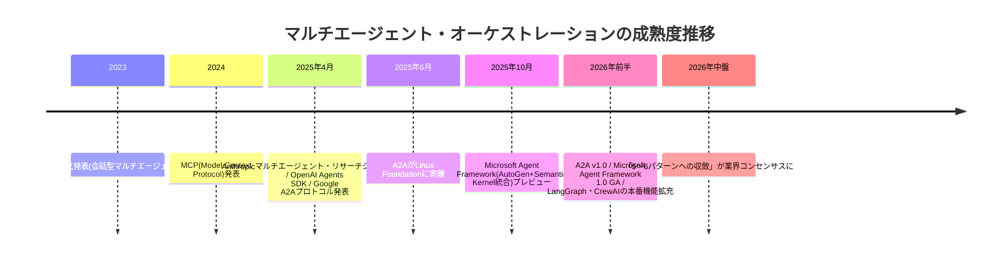

### 1.1 しかし「多いほど良い」わけではない

マルチエージェント導入を検討する前に必ず押さえておくべき事実があります。

- **Princeton NLPの検証**では、同じツール・同じコンテキストを与えた場合、単一エージェントが64%のベンチマークタスクでマルチエージェントシステムと同等かそれ以上の性能を示しました。マルチエージェント化によって得られる精度向上は平均2.1ポイント程度である一方、コストはおよそ2倍に跳ね上がります。
- Anthropic自身も「単一エージェントの方が優れているタスクに対し、チームが数か月かけて精巧なマルチエージェント・アーキテクチャを構築した結果、単一エージェントのプロンプト改善で同等の性能に到達してしまうケースを何度も見てきた」と明言しています。
- 学術的にも、MAST(Multi-Agent System Failure Taxonomy、後述)の著者らは「人気ベンチマークにおけるMASの性能向上は、単一エージェント方式と比較して依然として最小限にとどまっている」と述べています。

**結論**: マルチエージェントは「デフォルトの選択肢」ではなく、「単一エージェント+優れたプロンプト・ツール設計では解決できない、明確な理由がある場合にのみ採用するアーキテクチャ」として扱うべきです。この前提を念頭に置いた上で、以降のベストプラクティスを読み進めてください。

**参考文献:**
- [Multi-Agent Orchestration: 5 Patterns That Work in 2026 — Digital Applied](https://www.digitalapplied.com/blog/multi-agent-orchestration-5-patterns-that-work)
- [Which are the Best Multi-Agent Orchestration Tools in 2026? — TrueFoundry](https://www.truefoundry.com/blog/multi-agent-orchestration-tools)
- [6 Multi-Agent Orchestration Patterns for Production (2026) — Beam AI(Princeton NLP調査の言及)](https://beam.ai/agentic-insights/multi-agent-orchestration-patterns-production)
- [When to use multi-agent systems (and when not to) — Claude by Anthropic](https://claude.com/blog/building-multi-agent-systems-when-and-how-to-use-them)
- [Why Do Multi-Agent LLM Systems Fail? — arXiv:2503.13657](https://arxiv.org/abs/2503.13657)

---

## 2. 基礎: Anthropicの5つのワークフローパターン

マルチエージェント設計に入る前に、土台となる「エージェント的ワークフロー」の基本パターンを押さえる必要があります。Anthropicのエンジニアリングブログ *Building Effective Agents* は、最もシンプルで組み合わせ可能な5つのパターンを定義しており、これは2026年時点でも業界の共通言語として広く引用され続けています。

| # | パターン名 | 概要 | 適したユースケース |
|---|---|---|---|
| 1 | **Prompt Chaining(逐次連鎖)** | あるLLM呼び出しの出力を、次のLLM呼び出しの入力として順番に渡す | 明確に分解できる多段階の変換処理(文書生成→翻訳など) |
| 2 | **Routing(振り分け)** | 最初のLLM呼び出しが入力を分類し、適切なハンドラー/モデルに振り分ける | 簡単なタスクはHaiku、難しいタスクはSonnet/Opusに振り分けるなど、性質の異なるタスク群 |
| 3 | **Parallelization(並列化)** | タスクを分割して並列実行する。**Sectioning**(独立したサブタスクに分割)と**Voting**(同じタスクを複数回実行し多数決/合議)の2種類がある | 独立したサブタスク処理、コード脆弱性レビューの多重チェックなど |
| 4 | **Orchestrator-Workers(オーケストレーター・ワーカー)** | 中心となるLLMが動的にタスクを分解し、ワーカーLLMに委任し、結果を統合する | 事前にサブタスクを予測できない複雑なタスク(複数ソースを横断する検索など) |
| 5 | **Evaluator-Optimizer(評価・最適化ループ)** | 1つのモデルが生成し、別のモデルがループで評価・フィードバックする | 明確な評価基準があり、反復的な改善に価値があるタスク(コード生成→レビュー→修正) |

```mermaid
flowchart TB
    subgraph P1["① Prompt Chaining"]
        direction LR
        A1[LLM呼び出し1] --> A2[ゲート/検証] --> A3[LLM呼び出し2] --> A4[出力]
    end

    subgraph P2["② Routing"]
        direction LR
        B1[入力] --> B2{分類LLM}
        B2 -->|簡単| B3[軽量モデル]
        B2 -->|複雑| B4[高性能モデル]
    end

    subgraph P3["③ Parallelization"]
        direction LR
        C1[タスク] --> C2[分割]
        C2 --> C3a[並列LLM A]
        C2 --> C3b[並列LLM B]
        C2 --> C3c[並列LLM C]
        C3a --> C4[集約]
        C3b --> C4
        C3c --> C4
    end

    subgraph P4["④ Orchestrator-Workers"]
        direction LR
        D1[オーケストレーター] --> D2[タスク分解]
        D2 --> D3a[ワーカー1]
        D2 --> D3b[ワーカー2]
        D3a --> D4[統合]
        D3b --> D4
    end

    subgraph P5["⑤ Evaluator-Optimizer"]
        direction LR
        E1[生成モデル] --> E2[評価モデル]
        E2 -->|要修正| E1
        E2 -->|合格| E3[最終出力]
    end
```

### 2.1 マルチエージェントとの関係

重要なのは、④Orchestrator-Workersと③Parallelizationの2つが、この後説明する「マルチエージェント・アーキテクチャ」の理論的な起源になっているという点です。単一エージェントのワークフローパターンの延長線上に、自律性の高いマルチエージェントシステムが存在すると理解すると設計判断がしやすくなります。

**参考文献:**
- [Building effective agents — Anthropic Engineering](https://www.anthropic.com/engineering/building-effective-agents)
- [Building effective agents(要約と論評)— Simon Willison](https://simonwillison.net/2024/Dec/20/building-effective-agents/)
- [Agent Workflow Patterns — Beyond Anthropic's Playbook — Towards AI](https://pub.towardsai.net/agent-workflow-patterns-beyond-anthropics-playbook-1bd76a48d63d)
- [The Hitchhiker's Guide to Agentic AI: From Foundations to Systems — arXiv:2606.24937](https://arxiv.org/pdf/2606.24937)
- [Building Effective Agents with Spring AI — Baeldung](https://www.baeldung.com/spring-ai-building-effective-agents)

---

## 3. マルチエージェント・アーキテクチャ全カタログ

単一エージェントのワークフローパターンを踏まえた上で、複数の自律的エージェントが協調する際の代表的なトポロジー(構造パターン)を整理します。2026年時点の業界分析では「5〜6パターンへの収斂」がコンセンサスになりつつあります。

### 3.1 オーケストレーター・ワーカー型(Orchestrator-Worker / Hub-and-Spoke)

中心となる「リード(オーケストレーター)エージェント」がタスクを分解し、専門化された「サブエージェント(ワーカー)」に委任し、結果を統合するパターンです。ワーカー同士は直接会話しません。Anthropicのマルチエージェント・リサーチシステムがこの代表例であり、詳細は次章で深掘りします。

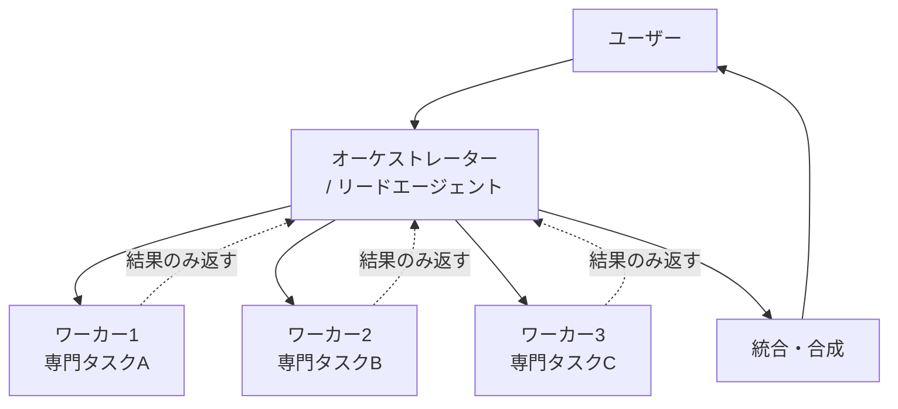

**特徴**: 制御フローが単純で追跡しやすく、失敗の切り分けが容易。単一障害点(オーケストレーターのダウン)がリスクとなる。

### 3.2 スーパーバイザー型(Supervisor)

LangGraphのドキュメントで定義される、オーケストレーター・ワーカー型の実装形態の一つ。中央のスーパーバイザーが実行時の状態を見ながら、動的にどのワーカーエージェントを呼び出すか判断し続ける点が特徴です。オーケストレーター・ワーカー型が「一度分解したら並列実行」であるのに対し、スーパーバイザー型は「一手ごとに次のエージェントを再選択する」会話的なループを想定しています。2026年時点でNative framework対応が最も広い(Claude Agent SDK、LangGraph、OpenAI Agents SDK、CrewAIの階層Processなど)ことから、実務上の出発点として推奨されています。

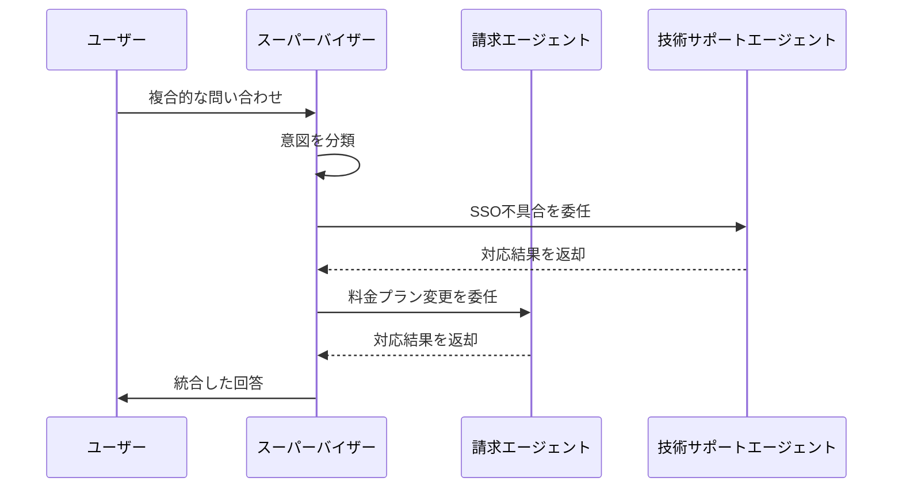

### 3.3 スウォーム型(Swarm / Peer-to-Peer)

中央のコーディネーターを置かず、エージェント同士が直接「ハンドオフ(制御の受け渡し)」を行う分散型パターンです。LangGraphの`langgraph-swarm`やOpenAI Agents SDKの`handoffs`機能がこれに該当します。レイテンシは低い(仲介者を挟まないため)反面、経路の追跡が難しく、完全連結型のスウォームでは、エージェント数の増加に伴い障害点の組み合わせが**組合せ的に爆発**します(4エージェントで6通り、10エージェントで45通りの相互作用パス)。8エージェントを超えると、この失敗表面積はEnd-to-Endテストでカバーしきれなくなるとされ、階層型オーケストレーションへの切り替えが信頼性上の要件になります。

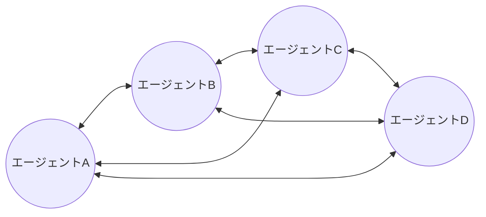

### 3.4 階層型マルチレベル・スーパーバイザー(Hierarchical Multi-Level Supervisor)

スーパーバイザーがさらに別のスーパーバイザーを管理する「スーパーバイザーのスーパーバイザー」構造です。LangGraphでは`create_supervisor`にサブチームを渡すことで多段階の階層システムを構築できます。大規模な組織構造を模した設計に適しており、責任の連鎖(chain of responsibility)が明確になる一方、末端のワーカーからトップレベルの意思決定までのレイテンシが積み重なります。

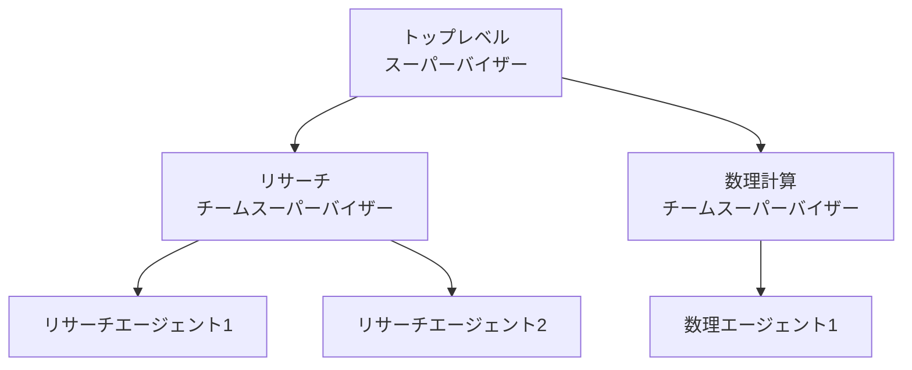

### 3.5 パイプライン型(Pipeline)

各エージェントの出力が次のエージェントの入力に順次流れ込む、最もシンプルな直列パターン。Prompt Chainingのマルチエージェント版と考えると理解しやすく、各段階で明確な受け渡し契約(スキーマ)を定義できるタスクに向いています。

### 3.6 ディベート型(Debate / Multi-Perspective)

複数のエージェントが同じ問題に対して独立した見解を出し、互いの見解を批評しあった上で合意形成する、あるいは審判(judge)役のエージェントが最終判断を下すパターンです。Evaluator-Optimizerのマルチエージェント拡張とも言えます。コストはおよそ2.5倍に跳ね上がりますが、多角的検証が必要な高stakesの意思決定(医療・法務・金融のリスク評価など)では投資対効果が見合います。

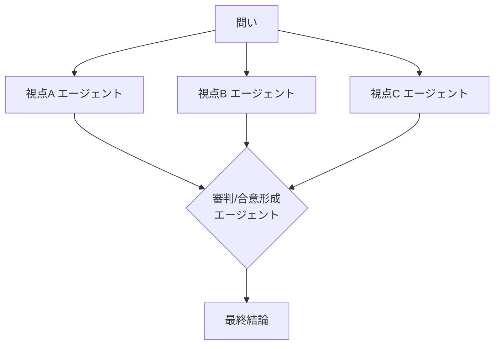

### 3.7 パターン比較表

| パターン | 制御フロー | コスト目安 | 主な失敗モード | 代表的な採用場面 |
|---|---|---|---|---|
| オーケストレーター・ワーカー | 中央集権・一括委任 | 中〜高(並列度に比例) | オーケストレーターの過剰委任(単純タスクへの過剰分解) | 独立した並列調査、幅優先(breadth-first)探索 |
| スーパーバイザー | 中央集権・逐次再選択 | 中(ルーティング呼び出し分の追加コスト) | ルーティング精度低下(8〜12往復以降で顕著) | カスタマーサポートの意図別振り分け |
| スウォーム | 分散・ピアツーピア | 低〜中(仲介者コストなし) | ハンドオフ連鎖の暴走、経路追跡困難 | エージェント数が少なく、専門領域の重複が少ないケース |
| 階層型マルチレベル | 多段階中央集権 | 高 | 階層間のレイテンシ蓄積 | 大規模組織を模した業務プロセス |
| パイプライン | 直列 | 低 | 上流の誤りが下流にそのまま伝播(検証なし) | 明確な段階分割が可能な変換処理 |
| ディベート | 並列+合意形成 | 非常に高(約2.5倍) | 少数意見の圧殺(同調圧力によるcollapse) | 高stakesな多角的検証 |

**参考文献:**
- [Multi-Agent Orchestration: 5 Patterns That Work in 2026 — Digital Applied](https://www.digitalapplied.com/blog/multi-agent-orchestration-5-patterns-that-work)
- [6 Multi-Agent Orchestration Patterns for Production (2026) — Beam AI](https://beam.ai/agentic-insights/multi-agent-orchestration-patterns-production)
- [Swarm vs. Supervisor: Multi-Agent Architecture Guide — Augment Code](https://www.augmentcode.com/guides/swarm-vs-supervisor)
- [LangGraph Advanced – Hierarchical Multi-Level Supervisor & Swarm Agents](https://lilys.ai/en/notes/langgraph-swarm-20260202/langgraph-hierarchical-supervisor-swarm-ai-agents)
- [Multi-Agent Orchestration in LangGraph: Supervisor vs Swarm — DEV Community](https://dev.to/focused_dot_io/multi-agent-orchestration-in-langgraph-supervisor-vs-swarm-tradeoffs-and-architecture-1b7e)
- [langgraph-supervisor · PyPI](https://pypi.org/project/langgraph-supervisor/)

---

## 4. ディープダイブ: Anthropicのマルチエージェント・リサーチシステム

Anthropicが公開した技術ブログ *How we built our multi-agent research system* は、オーケストレーター・ワーカーパターンの本番実装として、業界で最も詳細に語られている事例の一つです。Claude Researchの内部構造を教材として、実務に転用できる原則を抽出します。

### 4.1 全体アーキテクチャ

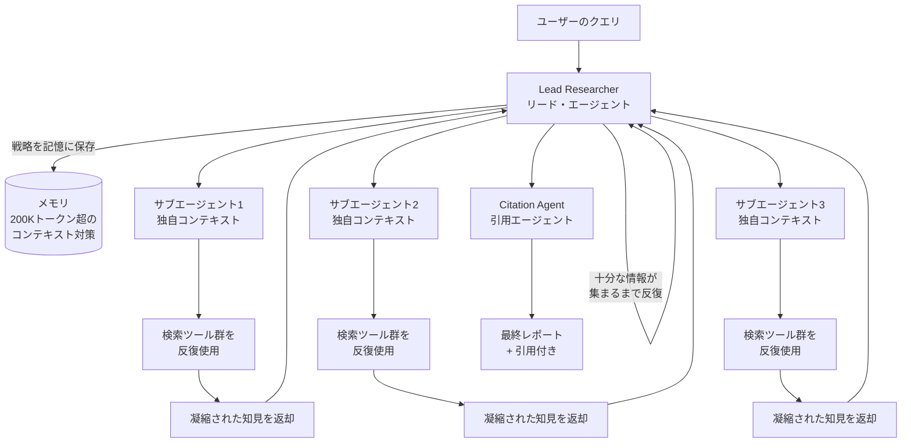

構成要素は3種類です。

- **Lead Researcher(リードエージェント)**: ユーザーのクエリを分析し、全体戦略を立て、その計画を記憶(メモリ)に保存します。大規模な調査タスクはモデルのコンテキストウィンドウを容易に超過するため、計画を外部化しておくことで、コンテキストが切り詰められても調査の軌道を見失わないようにしています。
- **サブエージェント**: リードエージェントによって生成される専門タスク担当。それぞれが独立したコンテキストウィンドウ・ツールセット・探索軌跡を持ち、並列に検索・評価・クエリの洗練を行います。「知的なフィルター」として機能し、大量の情報から重要なトークンだけを凝縮してリードエージェントに返します。
- **Citation Agent(引用エージェント)**: 集まった文書と調査レポートを処理し、すべての主張が出典に正しく紐づくよう引用箇所を特定する専用エージェント。

### 4.2 なぜ機能するのか: トークン経済性という視点

Anthropicの分析では、BrowseCompの内部評価においてトークン使用量だけで性能分散の**80%**を説明できるという結果が出ています(ツール呼び出し数とモデル選択が残りを説明)。つまり、マルチエージェント化の本質的な価値は「複数の独立したコンテキストウィンドウに計算資源(トークン)を分散させ、単一エージェントでは実現できない規模の推論を可能にすること」にあります。

一方でこの並列化にはコストが伴います。マルチエージェントシステムは通常のチャット対話のおよそ**15倍のトークン**を消費します。Opus 4をリードエージェント、Sonnet 4をサブエージェントとした構成では、単一エージェントのOpus 4と比較して調査タスクの内部評価で**90.2%の性能向上**を達成した一方、この15倍のコストは「アウトプットの価値がコストを上回る、高付加価値なタスク」でのみ正当化されると明言されています。

### 4.3 適用すべきでないドメイン

Anthropicのブログは非常に率直にこう述べています。

> 「すべてのエージェントが同じコンテキストを共有する必要がある、あるいはエージェント間に多くの依存関係があるドメインは、現状のマルチエージェントシステムには適していない」

コーディング、デバッグ、そしてほとんどのエージェント的ワークフローはこの条件に当てはまり、マルチエージェント化に不向きとされています。サブエージェントBがサブエージェントAの調査結果に依存する場合、並列化は「オーバーヘッド付きの高コストな直列実行」に退化してしまうためです。並列サブエージェントが機能するのは、サブタスクが**真に独立**している場合に限られます。

### 4.4 効果的な委任のためのプロンプト設計原則

Anthropicが試行錯誤の末にたどり着いた、マルチエージェント・プロンプトエンジニアリングの主要原則を整理します。

| 原則 | 内容 |
|---|---|
| **エージェントの思考をシミュレートする** | 同じプロンプト・ツールを使った簡易シミュレーションを構築し、エージェントの挙動をステップごとに観察する。これにより「早すぎる打ち切り」「冗長すぎる検索クエリ」「誤ったツール選択」などの失敗モードが即座に可視化される |
| **オーケストレーターに委任方法を教える** | 各サブエージェントには「明確な目的」「出力フォーマット」「使うべきツール・情報源のガイダンス」「タスクの境界線(何をやらないか)」の4点を明示する。これを欠くとサブエージェント同士が重複調査を行ってしまう(実例: 2021年の自動車用半導体不足を調査するサブエージェントと、2025年時点のサプライチェーンを調査する2つのサブエージェントが同じ話題を重複調査してしまった) |
| **努力量をタスクの複雑さにスケーリングさせる** | 単純な事実確認は1エージェント・3〜10回のツール呼び出し、直接比較は2〜4サブエージェント・10〜15回のツール呼び出し、複雑な調査には10以上のサブエージェントで明確に役割分担、という具体的なルールをプロンプトに埋め込む。これがないと初期システムでは「単純な質問に50個のサブエージェントを生成する」という過剰投資が発生した |
| **拡張思考(Extended Thinking)を制御可能なスクラッチパッドとして使う** | リードエージェントはツール選択やサブエージェント数を決める前に推論を書き出し、サブエージェントはツール出力受領後に「Interleaved Thinking」でギャップを特定し次のクエリを洗練する |
| **並列化を前提としたプロンプト設計に切り替える** | 初期システムは検索を逐次実行していたため低速だった。リードエージェントが複数のサブエージェントを同時生成し、各サブエージェントも複数ツールを並列使用するよう再設計した結果、複雑なクエリの調査時間を最大90%短縮した |
| **人間による評価は自動化では拾えないものを拾う** | 人間のテスターは、SEO最適化されたコンテンツファームを、学術PDFや個人ブログのような権威ある情報源より優先して選んでしまうという、初期システムのソース選定バイアスを発見した。これに基づき情報源の品質判断のヒューリスティックをプロンプトに追加した |

### 4.5 評価アプローチ

マルチエージェントワークフローには単一の「正解パス」が存在しないため、従来型のテストがそのまま通用しません。Anthropicは以下を組み合わせています。

- **LLM-as-judge評価**: 事実の正確性・引用・情報源の品質に関するルーブリックで自動評価
- **少数サンプルでの早期反復**: 大規模評価の前に小規模サンプルで素早く反復
- **人間評価者によるチェック**: 幻覚(hallucination)、システム障害、微妙なソース選定バイアスなど、自動評価が見逃す問題を検出

### 4.6 本番運用上の工学的課題

プロトタイプから本番システムへの移行では、プロンプト改善だけでなく以下のようなシステムエンジニアリング上の投資が必要でした。

- ツール呼び出し失敗をまたいだ**エージェント状態の永続化**
- 動的な挙動をデバッグするための**完全なトレーサビリティ**
- 中断のない**レインボーデプロイ**(段階的ロールアウトによる安全なアップデート)
- 現状は**同期的実行**がボトルネックであり、より高い並列性を実現する非同期アーキテクチャは開発中の課題として残っている

**参考文献:**
- [How we built our multi-agent research system — Anthropic Engineering(一次情報)](https://www.anthropic.com/engineering/multi-agent-research-system)
- [How Anthropic Built a Multi-Agent Research System — ByteByteGo](https://blog.bytebytego.com/p/how-anthropic-built-a-multi-agent)
- [Anthropic's Multi-Agent Research Architecture Explained — The AI Engineer](https://theaiengineer.substack.com/p/how-anthropic-built-multi-agent-deep)
- [When to use multi-agent systems (and when not to) — Claude by Anthropic](https://claude.com/blog/building-multi-agent-systems-when-and-how-to-use-them)
- [Anthropic's Multi-Agent Blueprint: What Production Adds — Fountain City](https://fountaincity.tech/resources/blog/anthropic-multi-agent-blueprint-production/)
- [Anthropic: Building a Multi-Agent Research System — ZenML LLMOps Database](https://www.zenml.io/llmops-database/building-a-multi-agent-research-system-for-complex-information-tasks)

---

## 5. コンテキスト・エンジニアリングと状態管理

マルチエージェントシステムの実装品質を分けるのは、突き詰めれば「各エージェントに何を、いつ見せるか」という**コンテキスト・エンジニアリング**の設計です。Anthropicのエンジニアリングブログ *Effective context engineering for AI agents* と、Claude Agent SDKのドキュメントに基づき、実装レベルの原則を整理します。

### 5.1 サブエージェントによるコンテキスト分離

サブエージェント・アーキテクチャは、コンテキストウィンドウの制約を回避するもう一つの手段です。1つのエージェントがプロジェクト全体の状態を維持し続けようとするのではなく、専門化されたサブエージェントがクリーンなコンテキストウィンドウで焦点を絞ったタスクを処理します。

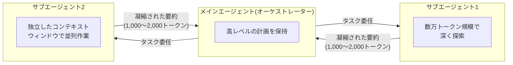

Claude Agent SDKでは、サブエージェントはデフォルトで以下の性質を持ちます。

- **並列化**: 複数のサブエージェントを異なるタスクに同時展開できる
- **コンテキスト管理**: 各サブエージェントは独立したコンテキストウィンドウを使い、オーケストレーターには「関連情報のみ」を返す。オーケストレーターが全文脈を見る必要はない

これにより、大量の情報をふるいにかける必要があるが、そのほとんどが最終的には不要になるようなタスク(ログ解析、大規模な文書横断検索など)に理想的な構造となります。

### 5.2 「ジャストインタイム」コンテキスト戦略

事前にすべての関連データを前処理してコンテキストに詰め込むのではなく、軽量な識別子(ファイルパス・保存済みクエリ・Webリンクなど)だけを維持し、実行時にツールを使って必要な部分だけを動的にロードするアプローチです。Claude Codeはこの方式で、`grep`や`tail`のようなBashコマンドを使い、巨大なデータベースやログファイルの全体をコンテキストに載せることなく、ターゲットを絞ったクエリで分析を行います。

エージェント的検索(agentic search)は、埋め込みベクトルによるセマンティック検索よりも透明性が高くメンテナンスしやすいため、まずはエージェント的検索から始め、より高速な結果や表現のバリエーションが必要になった場合にのみセマンティック検索を追加することが推奨されています。

### 5.3 4部構成のサブエージェント契約

Anthropicの実装知見から抽出される、サブエージェントへの委任プロンプトが必ず含むべき4要素です。このうちどれか一つでも欠けると、モデルの振る舞いが悪いからではなく、「完了とは何か」をオーケストレーターが十分に指定できていないために、サブエージェントの挙動がドリフト(逸脱)します。

1. **明確な目的(Objective)**
2. **出力フォーマット**
3. **使うべきツール・情報源のガイダンス**
4. **タスクの境界線**(何をやらないか、他のサブエージェントの担当範囲との切り分け)

### 5.4 アーティファクト・パターン(ファイルシステム経由の受け渡し)

サブエージェントが発見内容をチャット形式の長い文章でリードエージェントに返すのではなく、共有ファイルシステムに結果を書き込み、軽量な参照(ポインタ)だけを返す設計です。リードエージェントは詳細をすべて再読み込みするのではなく、必要なときにポインタから取得します。これにより、リードエージェントのトークン消費を大幅に削減できます。

### 5.5 メモリツールとコンパクション(圧縮)

- **メモリツール**: Claude Developer Platformで提供されるファイルベースのメモリ機構により、エージェントはコンテキストウィンドウの外側に知識ベースを構築し、セッションをまたいでプロジェクトの状態を維持し、過去の作業をコンテキストに残さずに参照できます。
- **コンパクション(compact機能)**: 長時間稼働するエージェントではコンテキストの維持管理が重要になります。Claude Agent SDKの`compact`機能は会話履歴を自動的に要約します。あるベンダーの実務分析では、名目上200,000トークンのウィンドウに対し、実効的な作業コンテキストは60,000〜80,000トークン程度に留めることが推奨されています。SDKは`PreCompact`フックを公開しており、圧縮イベントを検知して独自のロジックを挟むことも可能です。

**参考文献:**
- [Effective context engineering for AI agents — Anthropic Engineering(一次情報)](https://www.anthropic.com/engineering/effective-context-engineering-for-ai-agents)
- [Building agents with the Claude Agent SDK — Anthropic Engineering(一次情報)](https://www.anthropic.com/engineering/building-agents-with-the-claude-agent-sdk)
- [Subagents in the SDK — Claude API Docs(一次情報)](https://platform.claude.com/docs/en/agent-sdk/subagents)
- [Anthropic Agent SDK: What It Ships vs. What It Leaves to You — Augment Code](https://www.augmentcode.com/guides/anthropic-agent-sdk-what-ships-vs-what-you-build)
- [Context Engineering for Multi-Agent LLM Code Assistants — arXiv:2508.08322](https://arxiv.org/pdf/2508.08322)

---

## 6. 主要フレームワーク比較(2026年中期時点)

2025年後半〜2026年前半にかけて、マルチエージェント・フレームワークの勢力図は大きく動きました。特にMicrosoftがAutoGenとSemantic Kernelを単一の「Agent Framework」に統合したことは、本ガイド執筆時点(2026年7月)における最大の構造変化です。

### 6.1 フレームワーク一覧

| フレームワーク | 提供元 | オーケストレーションモデル | 相互運用性 | 得意領域 |
|---|---|---|---|---|
| **Claude Agent SDK** | Anthropic | サブエージェント委任・コンテキスト分離が組み込み | MCP標準対応 | Claudeネイティブの本番エージェント構築、コーディング系エージェント |
| **LangGraph** | LangChain | グラフベース(ノード/エッジ)。Supervisor・Swarmライブラリを別パッケージで提供 | MCP・カスタムツール対応 | 複雑な状態遷移・分岐を明示的に制御したい場合 |
| **CrewAI** | CrewAI Inc. | 「Crew(役割ベースの協調)」と「Flow(手続き的制御)」の2モデルを併用。階層的Process対応 | MCP対応 | 役割分担が明確なチーム型タスク、迅速なプロトタイピング |
| **OpenAI Agents SDK** | OpenAI | Agents(ツールとして子エージェントを保持)とHandoffs(制御を完全委譲)の2方式 | MCP対応 | OpenAIモデル中心のプロダクション実装 |
| **Microsoft Agent Framework** | Microsoft | AutoGenの実験的マルチエージェント研究機能とSemantic Kernelのエンタープライズ機能(状態管理・テレメトリ・セキュリティ)を統合 | MCP・A2A双方に標準対応 | .NETやAzureエコシステムでのエンタープライズ展開 |
| **Google Agent Development Kit (ADK)** | Google | モデル非依存のコード・ファーストなオーケストレーション | MCP・A2A双方に標準対応 | Google CloudおよびGeminiエコシステム、A2A採用初期の代表実装 |

### 6.2 Microsoft Agent Frameworkの統合(2025年10月プレビュー→2026年前半 GA)

MicrosoftはAutoGen(研究指向のマルチエージェント会話フレームワーク)とSemantic Kernel(エンタープライズ指向のSDK)を、単一の後継製品であるMicrosoft Agent Frameworkへ統合しました。これはAutoGenの実験的なマルチエージェントオーケストレーション機能と、Semantic Kernelの本番運用機能(スレッドベースの状態管理、テレメトリ、セキュリティフィルター)を一つ屋根の下に集約する取り組みです。.NETおよびPython向けに2026年前半に正式GA(Generally Available)がアナウンスされ、Microsoftは既存のAutoGen/Semantic Kernelプロジェクトからの移行ガイドを公式に提供しています。

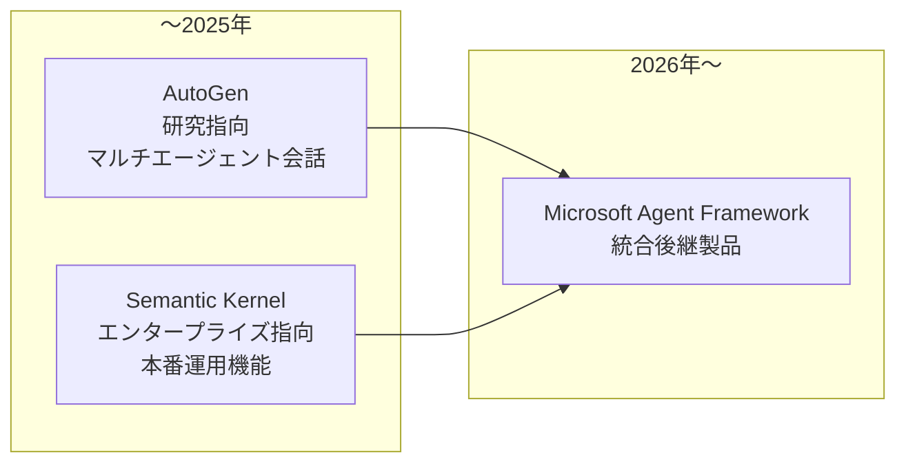

### 6.3 選定時の判断軸

- **既にどのモデルベンダーを主軸にしているか**: Claude中心ならClaude Agent SDK、Azure/.NETエコシステムならMicrosoft Agent Framework、マルチベンダー横断ならLangGraphやMCP/A2A標準準拠のADK
- **状態遷移の明示制御が必要か**: 複雑な条件分岐やループを可視化したい場合はLangGraphのグラフベースモデルが有利
- **役割ベースのチーム比喩が組織の意思決定に合うか**: CrewAIの「Crew」比喩はビジネスサイドとのコミュニケーションが取りやすい
- **相互運用性を最優先するか**: 他社エージェントとの相互接続を見据えるなら、MCP・A2Aの両対応が標準装備されているフレームワーク(Microsoft Agent Framework、Google ADK)が有利

**参考文献:**
- [Which are the Best Multi-Agent Orchestration Tools in 2026? — TrueFoundry](https://www.truefoundry.com/blog/multi-agent-orchestration-tools)
- [Top Multi-Agent Orchestration Frameworks for 2026 — TrueFoundry](https://www.truefoundry.com/blog/multi-agent-orchestration-frameworks)
- [Migrate your Semantic Kernel and AutoGen projects to Microsoft Agent Framework — Microsoft DevBlogs(一次情報)](https://devblogs.microsoft.com/agent-framework/migrate-your-semantic-kernel-and-autogen-projects-to-microsoft-agent-framework-release-candidate/)
- [Microsoft Ships Production-Ready Agent Framework 1.0 for .NET and Python — Visual Studio Magazine](https://visualstudiomagazine.com/articles/2026/04/06/microsoft-ships-production-ready-agent-framework-1-0-for-net-and-python.aspx)
- [Agent Framework overview — Microsoft Learn(一次情報)](https://learn.microsoft.com/en-us/agent-framework/overview/)
- [Multi-agent orchestration — OpenAI Agents SDK Docs(一次情報)](https://openai.github.io/openai-agents-python/multi_agent/)
- [Handoffs — OpenAI Agents SDK Docs(一次情報)](https://openai.github.io/openai-agents-python/handoffs/)

---

## 7. 相互運用性プロトコル: MCPとA2A

マルチエージェントシステムが複数の組織・ベンダーをまたぐようになるにつれ、「エージェントがツールとどう話すか」と「エージェントが別のエージェントとどう話すか」を分離して標準化する動きが加速しました。

### 7.1 2つのプロトコルの役割分担

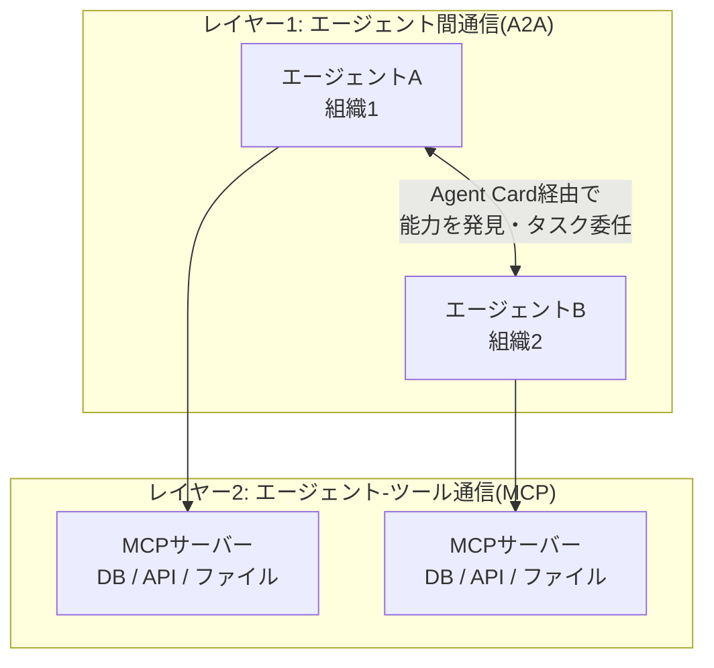

- **MCP(Model Context Protocol)**: エージェントが外部のツール・データソース・APIに接続するための標準規格。「エージェントとリソースの垂直的な接続」を担う。
- **A2A(Agent2Agent Protocol)**: 2025年4月にGoogleが50社以上のパートナーと共に提唱したオープンプロトコルで、異なるベンダー・異なるフレームワークで構築されたエージェント同士が、互いの内部実装を知らなくても発見・通信・協調できるようにする「エージェント間の水平的な接続」を担う。2025年6月にLinux Foundationへ寄贈され、ベンダー中立なガバナンス体制に移行しました。

両者は競合ではなく補完関係にあり、実務では「A2Aでエージェント同士がタスクを受け渡し、各エージェントの内部ではMCPでツールを呼び出す」という組み合わせが標準的な設計パターンになっています。

### 7.2 Agent Cardによる能力発見

A2Aプロトコルの中核機能の一つが**Agent Card**です。各エージェントは`/.well-known/agent-card.json`のような公開エンドポイントで自身の能力・認証要件・対応タスク種別を宣言し、他のエージェントはこれを読み取ることで「このエージェントに何を頼めるか」を実行時に判断できます。これにより、静的に事前登録された固定のエージェント一覧ではなく、動的なエージェントの発見と連携が可能になります。

### 7.3 2026年時点の普及状況

2026年前半の時点でA2Aの採用組織は150を超え、Microsoft・SAP・Salesforce・ServiceNowなど大手ベンダーが自社のエージェント基盤にA2A対応を組み込んでいます。A2A v1.0は2026年初頭に安定版として確定し、エンタープライズ導入における「マルチベンダー・エージェントメッシュ」構築の基盤として位置づけられています。

**参考文献:**
- [A2A: The Agent Interoperability Standard That's Reshaping 2026 — Programming Helper](https://www.programming-helper.com/tech/agent-to-agent-protocol-2026-google-a2a-standard)
- [What Is Google's Agent2Agent (A2A) Protocol? — Galileo AI](https://galileo.ai/blog/google-agent2agent-a2a-protocol-guide)
- [Agent-to-Agent Communication Protocols in 2026 — Zylos AI Research](https://zylos.ai/research/2026-02-15-agent-to-agent-communication-protocols/)
- [A2A Protocol Adoption in 2026 — Glukhov.org](https://www.glukhov.org/ai-systems/comparisons/a2a-protocol-2026-adoption)
- [What is Google's Agent2Agent Protocol (A2A)? — Atlan](https://atlan.com/know/google-a2a-protocol/)
- [Agent2Agent Protocol — IBM Think](https://www.ibm.com/think/topics/agent2agent-protocol)

---

## 8. 失敗モード分類(MAST)と対策

カリフォルニア大学バークレー校を含む研究チームが発表した論文 *Why Do Multi-Agent LLM Systems Fail?* は、7つの人気マルチエージェントフレームワーク・200件以上のタスクの軌跡(トレース)を分析し、**MAST(Multi-Agent System Failure Taxonomy)**という14種類の失敗モードを3つの大分類にまとめました。これは2026年時点でマルチエージェントの信頼性を議論する際の共通言語になっています。

### 8.1 3大分類と発生率

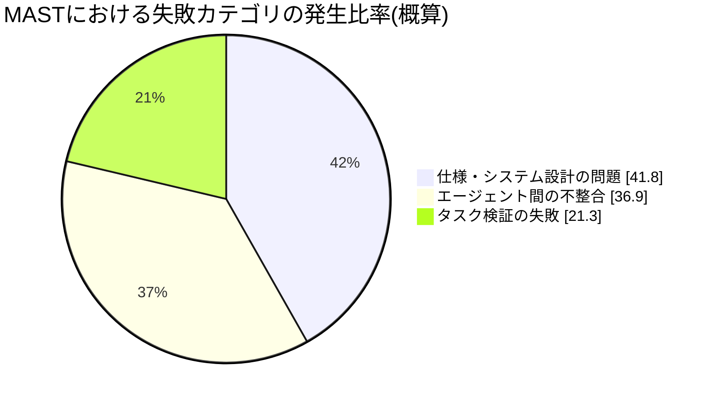

### 8.2 14の具体的な失敗モード

| カテゴリ | ID | 失敗モード名 | 説明 |
|---|---|---|---|
| **① 仕様・システム設計の問題**(約41.8%) | FM-1.1 | タスク仕様違反 | エージェントがタスクの要件・制約に従わない |
| | FM-1.2 | 役割仕様違反 | 割り当てられた役割・権限の範囲を逸脱する |
| | FM-1.3 | ステップの繰り返し | 同じ手順・行動を無意味に繰り返す |
| | FM-1.4 | 会話履歴の喪失 | 重要な文脈やこれまでのやり取りを見失う |
| | FM-1.5 | 終了条件の認識不足 | いつ処理を終えるべきかの判断基準を認識していない |
| **② エージェント間の不整合**(約36.9%) | FM-2.1 | 会話のリセット | 進行中の文脈を不必要に消去・再開してしまう |
| | FM-2.2 | 確認要求の欠如 | 曖昧な指示に対し、確認を取らずに進めてしまう |
| | FM-2.3 | タスクの逸脱 | 本来の目的から話がそれていく |
| | FM-2.4 | 情報の隠蔽 | 他エージェントに必要な情報を共有しない |
| | FM-2.5 | 他エージェントの入力の無視 | 他エージェントからのフィードバック・入力を反映しない |
| | FM-2.6 | 推論と行動の不一致 | 内部の推論結果と実際に取った行動が矛盾する |
| **③ タスク検証の失敗**(約21.3%) | FM-3.1 | 早すぎる終了 | タスクが未完了なのに完了したと判断してしまう |
| | FM-3.2 | 検証の欠如・不完全 | 結果の正しさを十分に検証しないまま次に進む |
| | FM-3.3 | 誤った検証 | 検証自体が誤っており、間違った結果を「正しい」と判定してしまう |

### 8.3 対策の方向性

MAST論文および後続の実務分析では、以下のような対策が提案されています。

- **FM-1系(仕様問題)への対策**: サブエージェント契約(5.3節)を厳密化し、役割・境界・終了条件を明文化する。曖昧な自然言語指示ではなく、構造化された(スキーマ化された)タスク定義を使う。
- **FM-2系(不整合)への対策**: エージェント間のハンドオフ回数を最小限に抑える設計(スウォームの過度な相互接続を避ける)。共有される状態(shared state/blackboard)を明示的なデータ構造として持たせ、暗黙の会話履歴だけに依存しない。
- **FM-3系(検証)への対策**: Evaluator-Optimizerパターンを要所に組み込み、専用の検証エージェントまたはルールベースのチェックを最終出力の前に必ず挟む。人間によるレビュー(Human-in-the-loop)を高stakesな意思決定の前段に置く。

論文の著者らは、既存の介入策(改善されたプロンプト設計・より明確な役割仕様など)がFM-1.1や検証関連の失敗を実質的に減らせることを示す一方で、**MASの性能向上は依然として人気ベンチマークにおいて最小限にとどまっている**とも指摘しており、「マルチエージェント化すれば自動的に賢くなる」という前提そのものへの警鐘となっています。

**参考文献:**
- [Why Do Multi-Agent LLM Systems Fail? — arXiv:2503.13657(一次情報/論文)](https://arxiv.org/abs/2503.13657)
- [Multi-Agent System Failure Taxonomy(詳細版PDF)— arXiv:2601.17915](https://arxiv.org/pdf/2601.17915)
- [Agent Failure Modes: A Practical Guide — Galileo AI](https://galileo.ai/blog/agent-failure-modes-guide)
- [Why Do Multi-Agent LLM Systems Fail?(要約と論評)— Future AGI](https://futureagi.substack.com/p/why-do-multi-agent-llm-systems-fail)

---

## 9. セキュリティとガードレール

マルチエージェントシステムは単一エージェントよりも攻撃対象領域(アタックサーフェス)が広がります。エージェント間のハンドオフやツール呼び出しの連鎖そのものが新たな脆弱性の経路になり得るためです。

### 9.1 マルチエージェント特有のリスク

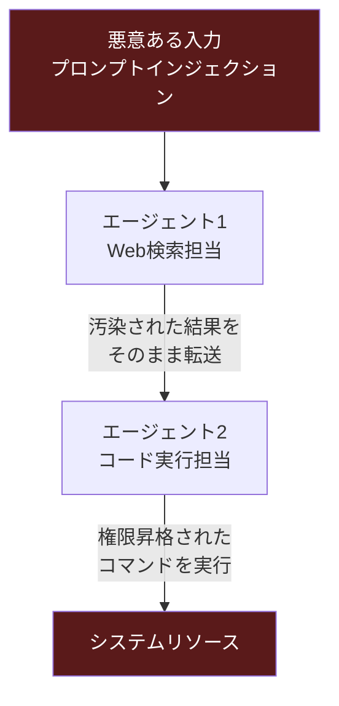

- **連鎖的プロンプトインジェクション**: あるエージェントが外部ソース(Webページ、ユーザー入力、他社のAPIレスポンスなど)から取り込んだ悪意ある指示が、そのままハンドオフ先のエージェントに伝播し、意図しないツール実行を引き起こすリスク。
- **権限のなし崩し的拡大**: サブエージェントが「親エージェントと同じ権限」をデフォルトで継承する設計だと、本来必要のない権限まで持ってしまう。
- **監査証跡の断片化**: エージェント間のやり取りが複数のログ・複数のプロセスに分散し、インシデント発生時の原因追跡が困難になる。

### 9.2 防御原則

| 原則 | 実装例 |
|---|---|
| **最小権限の原則(Least Privilege)** | 各サブエージェントには、そのタスク遂行に必要な最小限のツール・データアクセスのみを付与する。書き込み系ツールと読み取り専用ツールを明確に分離する |
| **入力のサニタイズとコンテキスト境界の明示** | 外部から取得したコンテンツ(Web検索結果など)を、明示的に「信頼できないデータ」としてタグ付けし、それ自体を実行可能な指示として扱わないようプロンプトで明示する |
| **ガードレールの多層防御** | 入力ガードレール(悪意あるプロンプトの検出)・出力ガードレール(機密情報の漏洩防止)・行動ガードレール(高リスクな操作の前の承認フロー)を組み合わせる |
| **人間承認ゲート(Human-in-the-loop)** | 金銭取引・本番環境へのデプロイ・外部への送信など、不可逆な操作の前には必ず人間の承認を挟む |
| **統一された監査ログ** | エージェント間のすべてのハンドオフ・ツール呼び出しを、単一のトレースIDに紐づけて記録し、事後追跡を可能にする(次章の可観測性と連動) |

### 9.3 業界標準への準拠

OWASP(Open Web Application Security Project)は生成AIアプリケーション向けに「LLM Top 10」を拡張し、エージェント的アプリケーション特有のリスク(プロンプトインジェクションの連鎖、過剰な自律性、不適切な出力の取り扱いなど)を明文化しています。マルチエージェントシステムの設計時には、これらの標準を参照しながら脅威モデリングを行うことが2026年時点のベストプラクティスとして定着しています。

**参考文献:**
- [AI App Security 2026: Prompt Injection & Guardrails — Webyot](https://webyot.in/learning/ai-app-security-2026-prompt-injection-guardrails.html)
- [The Complete AI Guardrails Implementation Guide for 2026 — Maxim AI](https://www.getmaxim.ai/articles/the-complete-ai-guardrails-implementation-guide-for-2026/)
- [Multi-Agent AI Security Risks, Compliance & Fixes — Augment Code](https://www.augmentcode.com/guides/multi-agent-ai-security-risks-compliance-fixes)

---

## 10. 可観測性(オブザーバビリティ)と評価

マルチエージェントシステムは非決定的(non-deterministic)であり、同じ入力でも実行のたびに異なる経路をたどることがあります。これにより、従来型のソフトウェアテストの発想だけでは不十分になり、専用の可観測性基盤が不可欠になります。

### 10.1 なぜ従来型のロギングでは不十分か

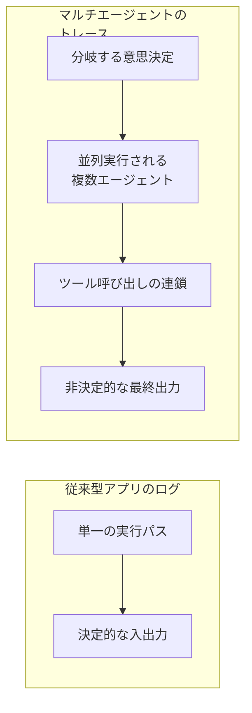

単一のログ行ではなく、「どのエージェントが」「どの時点で」「どのツールを」「どんな理由で」呼び出したかという**因果関係を含んだトレース**を記録する必要があります。

### 10.2 主要な可観測性ツール

| ツール | 特徴 |
|---|---|
| **LangSmith** | LangChain/LangGraphとのネイティブ統合。トレース・評価・データセット管理を一体化 |
| **Langfuse** | OSS(オープンソース)のLLM可観測性プラットフォーム。フレームワーク非依存でトレース・プロンプト管理・評価を提供 |
| **Arize Phoenix** | OpenTelemetryベースのトレーシングとエージェント評価に強み。ドリフト検知など運用監視機能も充実 |
| **OpenTelemetry(OTel)ベースの自作基盤** | ベンダーロックインを避けたい場合、OTel標準に沿ってスパン(span)を計装し、任意のバックエンド(Grafana, Datadogなど)に送る構成も広がっている |

### 10.3 評価(Evaluation)の観点

マルチエージェントの評価は、最終出力の正しさだけでなく、プロセスの質も対象にする必要があります。

- **タスク完了率**: エンドツーエンドでタスクが正しく完了したか
- **軌跡(トラジェクトリ)評価**: 正しい答えにたどり着いたとしても、非効率・冗長・危険な経路を通っていないか(MASTのFM系失敗モードの検出に直結)
- **LLM-as-judge**: ルーブリックに基づき、別のLLMが出力品質を採点する。人手評価よりスケールするが、判定バイアスに注意が必要
- **人間評価によるサンプリング**: 自動評価では拾えない微妙な問題(ソース選定バイアスなど、4.4節で触れたAnthropicの事例)を定期的にサンプルチェックする

**参考文献:**
- [Best AI Agent Observability Tools 2026 — Confident AI](https://www.confident-ai.com/knowledge-base/compare/best-ai-agent-observability-tools-2026)
- [Best LLM Observability Tools — Firecrawl](https://www.firecrawl.dev/blog/best-llm-observability-tools)
- [AI Agent Observability with Langfuse — Langfuse Blog(一次情報)](https://langfuse.com/blog/2024-07-ai-agent-observability-with-langfuse)

---

## 11. コスト最適化とトークン管理

4.2節で見た通り、マルチエージェントシステムは通常のチャット対話の**約15倍**のトークンを消費します。この経済性を無視した設計は、本番運用でのコスト超過に直結します。

### 11.1 コスト構造の可視化

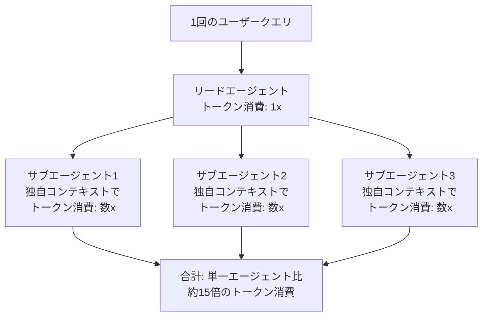

### 11.2 主要な最適化戦略

| 戦略 | 内容 |
|---|---|
| **モデルルーティング(Model Routing)** | すべてのエージェントに最高性能・最高コストのモデルを使うのではなく、タスクの難易度に応じてモデルを使い分ける。例: リードエージェント(戦略立案・統合)にはOpus/Sonnet級、定型的なサブタスク実行にはHaiku級の軽量モデルを割り当てる |
| **プロンプトキャッシング** | システムプロンプト・ツール定義・繰り返し参照される長いコンテキストをキャッシュし、同一プレフィックスの再計算コストを削減する |
| **並列度の上限設定** | 「複雑なタスクには10以上のサブエージェント」という原則(4.4節)を無制限に適用せず、タスクの価値に対してどこまでの並列度が経済的に見合うかを事前に見積もる |
| **早期終了条件の明確化** | 4.4節の「終了条件の認識不足」(FM-1.5)はコスト超過にも直結する。十分な情報が集まった時点で追加の探索を打ち切る基準をプロンプトに明示する |
| **トークン予算の強制(Budget Enforcement)** | セッションやタスク単位でトークン上限をシステム側で強制し、予算超過時には人間にエスカレーションする仕組みを組み込む |
| **コンテキストの圧縮・要約(5.5節参照)** | 名目上のコンテキストウィンドウを使い切るのではなく、実効コンテキストを絞り込むことで、単価の高い大規模モデルでもコストを抑える |

### 11.3 投資対効果の判断軸

Anthropicの事例(4.2節)が示すように、マルチエージェント化は「アウトプットの価値がコストを正当化できる高付加価値タスク」でのみ採用すべきです。実務的には以下の問いに答えられるかを事前に検証することが推奨されます。

- このタスクは本当に**独立した並列探索**を必要とするか(依存関係が強いタスクなら並列化のコストが正当化されない)
- 単一エージェント+優れたプロンプト設計で、同等の精度に近づける余地は本当にないか(1.1節のPrinceton NLPの知見)
- コスト増(約2〜15倍)に見合うビジネス価値(意思決定の重要度、エラーの許容コスト)があるか

**参考文献:**
- [AI Agent Cost Optimization & Token Economics — Zylos AI Research](https://zylos.ai/research/2026-02-19-ai-agent-cost-optimization-token-economics/)
- [Cost Optimization for Production AI Agents: Token Budgets, Model Selection, Caching — Harness Engineering Academy](https://harnessengineering.academy/blog/cost-optimization-production-ai-agents-token-budgets-model-selection-caching/)
- [AI Agent Cost Optimization: How to Cut LLM Spend by 80% with Routing — Requesty](https://www.requesty.ai/blog/ai-agent-cost-optimization-how-to-cut-llm-spend-by-80-percent-with-routing)
- [How we built our multi-agent research system — Anthropic Engineering(トークン経済性の一次情報)](https://www.anthropic.com/engineering/multi-agent-research-system)

---

## 12. 意思決定フレームワーク: いつマルチエージェントを使うべきか

ここまでの内容を統合し、実務で使える意思決定フローチャートとして整理します。

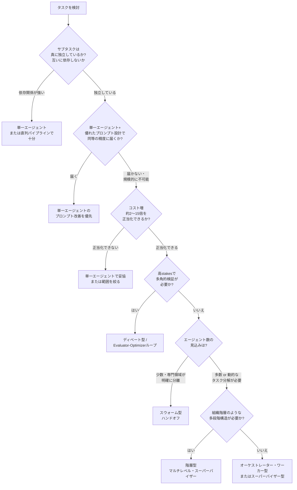

### 12.1 判断チェックリスト

- [ ] サブタスクの独立性を検証したか(依存関係グラフを一度書き出す)
- [ ] 単一エージェントのベースラインを必ず先に構築し、比較対象としたか
- [ ] コスト試算(トークン消費倍率 × 想定リクエスト数)を事前に見積もったか
- [ ] MASTの3大失敗カテゴリ(仕様・不整合・検証)に対する具体的な対策を設計に組み込んだか
- [ ] セキュリティのガードレール(最小権限・人間承認ゲート)を設計段階から組み込んだか
- [ ] 可観測性基盤(トレーシング)を本番導入前に用意したか

**参考文献:**
- [When to use multi-agent systems (and when not to) — Claude by Anthropic](https://claude.com/blog/building-multi-agent-systems-when-and-how-to-use-them)
- [6 Multi-Agent Orchestration Patterns for Production (2026) — Beam AI](https://beam.ai/agentic-insights/multi-agent-orchestration-patterns-production)

---

## 13. ステップバイステップ実装ガイド

ここでは、オーケストレーター・ワーカー型のマルチエージェントシステムを実装する際の標準的な進め方を、実務の順序に沿って解説します。

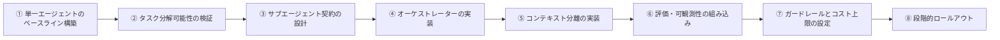

### ステップ① 単一エージェントのベースラインを必ず先に作る

マルチエージェント化の効果を測定する基準点として、まず単一エージェント+十分に練られたプロンプトでどこまでできるかを検証します。1.1節で見た通り、多くのケースでこれが最終解になります。

### ステップ② タスク分解可能性を検証する

対象タスクを依存関係グラフとして書き出し、本当に独立した並列サブタスクに分解できるかを確認します。依存が強い場合は4.3節の警告通り、マルチエージェント化は「オーバーヘッド付きの直列実行」に退化するため、パイプライン型や単一エージェントへの回帰を検討します。

### ステップ③ サブエージェント契約を設計する

5.3節の4部構成(目的・出力フォーマット・ツールガイダンス・タスク境界)に沿って、各サブエージェントへの委任テンプレートを作成します。以下はClaude Agent SDKスタイルの疑似コード例です。

```python
# サブエージェント定義の例(Claude Agent SDK的な構成をイメージした疑似コード)
subagent_contract = {
    "objective": "2025年〜2026年における半導体サプライチェーンの構造変化を調査する",
    "output_format": {
        "summary": "文字数600字以内の要約",
        "key_findings": "箇条書き5件以内",
        "sources": "出典URLのリスト",
    },
    "tool_guidance": [
        "web_search を優先し、一次情報(企業IR・政府統計)を web_fetch で深掘りする",
        "SEO最適化されたまとめサイトより、学術論文・公式発表を優先する",
    ],
    "boundaries": [
        "2021年の半導体不足の歴史的経緯には立ち入らない(別サブエージェントが担当)",
        "個別企業の株価予測は行わない",
    ],
}
```

### ステップ④ オーケストレーターを実装する

4.4節の「努力量をタスクの複雑さにスケーリングさせる」原則に沿って、オーケストレーターのシステムプロンプトに明確なルールを埋め込みます。

```python
orchestrator_scaling_rules = """
タスクの複雑さに応じて、生成するサブエージェント数とツール呼び出し回数を決定すること:
- 単純な事実確認: 1エージェント、3〜10回のツール呼び出し
- 直接比較(2〜3項目): 2〜4サブエージェント、各10〜15回のツール呼び出し
- 複雑な多面的調査: 10以上のサブエージェント、明確な役割分担を伴う
サブエージェントを生成する前に、まず拡張思考で分解計画を書き出すこと。
"""
```

### ステップ⑤ コンテキスト分離を実装する

各サブエージェントには独立したコンテキストウィンドウを割り当て、5.4節のアーティファクト・パターンに従い、詳細な調査結果はファイルシステム(または外部ストレージ)に書き込み、オーケストレーターには凝縮された要約(1,000〜2,000トークン程度)のみを返す設計にします。

### ステップ⑥ 評価と可観測性を組み込む

実装と並行して、10章で扱ったトレーシング基盤(Langfuse、LangSmithなど)を導入し、各サブエージェントの意思決定過程を後から追跡できるようにします。LLM-as-judgeによる自動評価と、少数サンプルの人間レビューを組み合わせます。

### ステップ⑦ ガードレールとコスト上限を設定する

9章の最小権限原則に基づき、サブエージェントごとにツールアクセスをスコープダウンします。同時に11章のトークン予算強制を実装し、想定外のコスト超過を防ぎます。

### ステップ⑧ 段階的ロールアウトを行う

4.6節でAnthropicが言及した「中断のないレインボーデプロイ」のように、本番トラフィックの一部だけに新しいエージェント構成を適用し、失敗率・コスト・レイテンシを監視しながら段階的に展開範囲を広げます。

**参考文献:**
- [Building agents with the Claude Agent SDK — Anthropic Engineering(一次情報)](https://www.anthropic.com/engineering/building-agents-with-the-claude-agent-sdk)
- [How we built our multi-agent research system — Anthropic Engineering(一次情報)](https://www.anthropic.com/engineering/multi-agent-research-system)

---

## 14. チェックリストとまとめ

### 14.1 本番導入前の最終チェックリスト

| 分類 | 確認項目 |
|---|---|
| **設計判断** | 単一エージェントのベースラインと比較し、マルチエージェント化の効果を定量的に確認したか |
| | サブタスクの独立性を依存関係グラフとして検証したか |
| | 採用したトポロジー(オーケストレーター・ワーカー/スーパーバイザー/スウォーム/階層型/パイプライン/ディベート)がタスク特性と一致しているか |
| **コンテキスト設計** | 各サブエージェントに4部構成の契約(目的・出力形式・ツールガイダンス・境界)を与えているか |
| | ジャストインタイムのコンテキストロードとアーティファクト・パターンを活用し、無駄なトークン消費を避けているか |
| | 長時間稼働セッション向けにコンパクション(圧縮)戦略を用意したか |
| **信頼性** | MASTの3大失敗カテゴリ(仕様・不整合・検証)それぞれに対する具体的な緩和策を実装したか |
| | 検証エージェントまたはルールベースの最終チェックを組み込んでいるか |
| **セキュリティ** | 最小権限の原則でツールアクセスをスコープダウンしたか |
| | 不可逆な操作の前に人間承認ゲートを設けたか |
| | OWASPのエージェント的アプリケーション向けリスク項目と照合したか |
| **可観測性・評価** | トレーシング基盤を導入し、因果関係を含むログを記録しているか |
| | LLM-as-judgeと人間レビューを組み合わせた評価パイプラインを用意したか |
| **コスト管理** | モデルルーティングとプロンプトキャッシングを実装したか |
| | トークン予算の上限とエスカレーションフローを設定したか |
| **相互運用性** | 将来的な他社エージェントとの連携を見据え、MCP・A2Aへの対応を検討したか |

### 14.2 まとめ

マルチエージェント・オーケストレーションは、2026年時点で「実験段階の技術」から「明確なトレードオフを伴う本番アーキテクチャの選択肢」へと成熟しました。しかし、その本質は依然として単純です。

1. **マルチエージェントはデフォルトではない**。単一エージェント+優れたプロンプト・ツール設計で解決できないか、まず検証する。
2. **効果があるのは「真に独立した並列タスク」**。依存関係が強いタスクへの適用は、コストだけが増える「見せかけの並列化」に終わる。
3. **トポロジーの選択は、制御の集中度とレイテンシ・コストのトレードオフである**。5〜6の代表パターンから、タスク特性に応じて選ぶ。
4. **失敗は「モデルの賢さ」ではなく「仕様と検証の設計」に起因することが多い**。MASTの14の失敗モードは、その大半がプロンプト設計・アーキテクチャ設計で予防可能であることを示している。
5. **コスト・セキュリティ・可観測性は、後付けではなく設計の最初から組み込む**。約15倍のトークン消費という現実を直視し、投資対効果を継続的に検証する。

---

## 15. 参考文献一覧

本ガイド全体で参照した一次情報・技術記事・学術論文のURLを集約します(セクションごとの参考文献と重複を含みます)。

**Anthropic公式(一次情報)**
- https://www.anthropic.com/engineering/multi-agent-research-system
- https://www.anthropic.com/engineering/building-effective-agents
- https://www.anthropic.com/engineering/effective-context-engineering-for-ai-agents
- https://www.anthropic.com/engineering/building-agents-with-the-claude-agent-sdk
- https://platform.claude.com/docs/en/agent-sdk/subagents
- https://claude.com/blog/building-multi-agent-systems-when-and-how-to-use-them

**学術論文**
- https://arxiv.org/abs/2503.13657 (MAST: Why Do Multi-Agent LLM Systems Fail?)
- https://arxiv.org/pdf/2601.17915 (MAST詳細版)
- https://arxiv.org/pdf/2606.24937 (The Hitchhiker's Guide to Agentic AI)
- https://arxiv.org/pdf/2508.08322 (Context Engineering for Multi-Agent LLM Code Assistants)

**フレームワーク公式ドキュメント**
- https://learn.microsoft.com/en-us/agent-framework/overview/
- https://devblogs.microsoft.com/agent-framework/migrate-your-semantic-kernel-and-autogen-projects-to-microsoft-agent-framework-release-candidate/
- https://openai.github.io/openai-agents-python/multi_agent/
- https://openai.github.io/openai-agents-python/handoffs/
- https://pypi.org/project/langgraph-supervisor/
- https://langfuse.com/blog/2024-07-ai-agent-observability-with-langfuse

**業界分析・技術ブログ**
- https://www.digitalapplied.com/blog/multi-agent-orchestration-5-patterns-that-work
- https://www.truefoundry.com/blog/multi-agent-orchestration-tools
- https://www.truefoundry.com/blog/multi-agent-orchestration-frameworks
- https://beam.ai/agentic-insights/multi-agent-orchestration-patterns-production
- https://www.augmentcode.com/guides/swarm-vs-supervisor
- https://www.augmentcode.com/guides/anthropic-agent-sdk-what-ships-vs-what-you-build
- https://www.augmentcode.com/guides/multi-agent-ai-security-risks-compliance-fixes
- https://lilys.ai/en/notes/langgraph-swarm-20260202/langgraph-hierarchical-supervisor-swarm-ai-agents
- https://dev.to/focused_dot_io/multi-agent-orchestration-in-langgraph-supervisor-vs-swarm-tradeoffs-and-architecture-1b7e
- https://blog.bytebytego.com/p/how-anthropic-built-a-multi-agent
- https://theaiengineer.substack.com/p/how-anthropic-built-multi-agent-deep
- https://fountaincity.tech/resources/blog/anthropic-multi-agent-blueprint-production/
- https://www.zenml.io/llmops-database/building-a-multi-agent-research-system-for-complex-information-tasks
- https://www.programming-helper.com/tech/agent-to-agent-protocol-2026-google-a2a-standard
- https://galileo.ai/blog/google-agent2agent-a2a-protocol-guide
- https://zylos.ai/research/2026-02-15-agent-to-agent-communication-protocols/
- https://www.glukhov.org/ai-systems/comparisons/a2a-protocol-2026-adoption
- https://atlan.com/know/google-a2a-protocol/
- https://www.ibm.com/think/topics/agent2agent-protocol
- https://galileo.ai/blog/agent-failure-modes-guide
- https://futureagi.substack.com/p/why-do-multi-agent-llm-systems-fail
- https://webyot.in/learning/ai-app-security-2026-prompt-injection-guardrails.html
- https://www.getmaxim.ai/articles/the-complete-ai-guardrails-implementation-guide-for-2026/
- https://www.confident-ai.com/knowledge-base/compare/best-ai-agent-observability-tools-2026
- https://www.firecrawl.dev/blog/best-llm-observability-tools
- https://zylos.ai/research/2026-02-19-ai-agent-cost-optimization-token-economics/
- https://harnessengineering.academy/blog/cost-optimization-production-ai-agents-token-budgets-model-selection-caching/
- https://www.requesty.ai/blog/ai-agent-cost-optimization-how-to-cut-llm-spend-by-80-percent-with-routing
- https://visualstudiomagazine.com/articles/2026/04/06/microsoft-ships-production-ready-agent-framework-1-0-for-net-and-python.aspx
- https://simonwillison.net/2024/Dec/20/building-effective-agents/
- https://pub.towardsai.net/agent-workflow-patterns-beyond-anthropics-playbook-1bd76a48d63d
- https://www.baeldung.com/spring-ai-building-effective-agents

> **免責事項**: 上記のうち一部の業界分析記事(TrueFoundry, Zylos AI Research, Beam AI, Augment Code など)は一次情報ではなく第三者による分析・まとめ記事です。実装の意思決定に用いる際は、可能な限りAnthropic公式ドキュメントや各フレームワークの公式リファレンス、および査読前論文の原文を優先して確認してください。
