# マルチエージェントオーケストレーション ベストプラクティスガイド(初学者向け・ステップバイステップ)

> 本ガイドは、複数のAIエージェント(LLMインスタンス)を協調させて動かす「マルチエージェントオーケストレーション(Multi-Agent Orchestration)」について、設計判断から実装パターン、通信プロトコル、セキュリティ、運用まで、実務でつまずきやすい順に整理したものです。各セクションの末尾に参照した一次情報のURLを記載しています(2026年7月時点の情報)。

---

## 目次

1. [マルチエージェントオーケストレーションとは](#1-マルチエージェントオーケストレーションとは)
2. [なぜ今マルチエージェントが注目されているのか](#2-なぜ今マルチエージェントが注目されているのか)
3. [Step 1: そもそもマルチエージェントが必要かを判断する](#step-1-そもそもマルチエージェントが必要かを判断する)
4. [Step 2: タスク分解の設計原則(Context-Centric Decomposition)](#step-2-タスク分解の設計原則context-centric-decomposition)
5. [Step 3: 協調パターン(Coordination Pattern)を選ぶ](#step-3-協調パターンcoordination-patternを選ぶ)
6. [Step 4: 検証エージェント(Verification Subagent)を組み込む](#step-4-検証エージェントverification-subagentを組み込む)
7. [Step 5: エージェント間通信プロトコルを設計する(MCPとA2A)](#step-5-エージェント間通信プロトコルを設計するmcpとa2a)
8. [Step 6: フレームワークを選定する](#step-6-フレームワークを選定する)
9. [Step 7: 状態管理とコンテキストエンジニアリング](#step-7-状態管理とコンテキストエンジニアリング)
10. [Step 8: エラーハンドリングと耐障害性](#step-8-エラーハンドリングと耐障害性)
11. [Step 9: セキュリティとガードレール](#step-9-セキュリティとガードレール)
12. [Step 10: 可観測性(Observability)と評価(Evaluation)](#step-10-可観測性observabilityと評価evaluation)
13. [Step 11: コストとレイテンシのマネジメント](#step-11-コストとレイテンシのマネジメント)
14. [よくあるアンチパターン](#よくあるアンチパターン)
15. [全体ワークフローまとめ](#全体ワークフローまとめ)
16. [参考文献一覧](#参考文献一覧)

---

## 1. マルチエージェントオーケストレーションとは

マルチエージェントオーケストレーションとは、**それぞれ独立した会話コンテキスト(context window)を持つ複数のLLMインスタンスを、コードによって協調動作させるアーキテクチャ**を指します。1つの巨大なプロンプトで1体のエージェントに全てをやらせるのではなく、タスクを役割ごとに分割し、専門化したエージェント同士が計画・実行・検証・統合を分担します。

オーケストレーション層は具体的には次を担います。

- タスクの割り当てとシーケンス制御
- エージェント間のハンドオフ(引き継ぎ)
- エラー発生時の再試行や復旧
- 各エージェントの出力の集約・統合
- 可観測性・セキュリティ・コストの管理

これは単なる「複数のプロンプトを並べる」こととは異なり、状態管理・再現性・障害復旧・監査ログまで含めた本番運用可能な設計を意味します。

> 参考: [Multi-Agent Orchestration Explained: Business Guide 2026 — Hubstic](https://www.hubstic.com/resources/blog/multi-agent-orchestration-guide)

---

## 2. なぜ今マルチエージェントが注目されているのか

業界調査では、企業向けアプリケーションのうちタスク特化型AIエージェントを組み込むものが2025年の5%未満から2026年には約40%まで拡大すると予測されています。この急速な普及に伴い、オーケストレーション層の設計はプラットフォームチームにとって重要なアーキテクチャ判断になっています。

一方で、Anthropic自身の実測では、**マルチエージェント構成はシングルエージェントに比べて同等のタスクで3〜10倍のトークンを消費する**ことが分かっており、Anthropicの内部リサーチシステムのような深いリサーチ用途ではその差が約15倍に達するケースもあります。つまり「マルチエージェント化すればするほど良い」わけではなく、**コストに見合う明確な理由がある場合にのみ採用すべき**というのが2026年時点の共通認識です。

実際、Princeton NLPのベンチマークでは、同じツールとコンテキストを与えた場合、シングルエージェントがマルチエージェント構成と同等かそれ以上の性能を出したタスクが64%に上ったという報告もあります。複雑な横断的タスクでは追加コストに見合う効果(平均+2.1ポイントの精度)がある一方、それ以外のタスクでは単純な単一エージェントの方が速く安価だという結論です。

> 参考:
> - [Which are the Best Multi-Agent Orchestration Tools in 2026? — TrueFoundry](https://www.truefoundry.com/blog/multi-agent-orchestration-tools)
> - [6 Multi-Agent Orchestration Patterns for Production (2026) — Beam.ai](https://beam.ai/agentic-insights/multi-agent-orchestration-patterns-production)
> - [Building multi-agent systems: When and how to use them — Claude by Anthropic](https://claude.com/blog/building-multi-agent-systems-when-and-how-to-use-them)

---

## Step 1: そもそもマルチエージェントが必要かを判断する

Anthropicのエンジニアリングチームは、数か月かけて計画・実行・レビュー・改善のためのエレガントなマルチエージェント構成を構築したものの、結局はシングルエージェントのプロンプト改善だけで同等の結果が得られたというチームの事例を報告しています。**まずシングルエージェントで始める**ことが2026年のベストプラクティスの出発点です。

マルチエージェント化が正当化されるのは、次の3つのシグナルのいずれかに該当する場合です。

### 1-1. コンテキスト保護(Context Protection)

1つのサブタスクの実行結果が数千トークン規模でコンテキストを汚染し、かつその情報が後続のタスクには不要な場合。たとえば注文履歴の参照が技術的な問い合わせ対応の妨げになるケースです。専用のサブエージェントに切り出し、要約だけをメインエージェントに返すことでコンテキストを清潔に保てます。

### 1-2. 並列化(Parallelization)

タスクが独立した複数の探索方向に分解でき、並列に処理することで探索空間を広げられる場合。Anthropicのリサーチ機能はこのパターンを採用しており、リード(Lead)エージェントがクエリを複数の観点に分解し、各サブエージェントが独立に探索した後、結果を統合します。ただし並列化は「速さ」より「網羅性」のためのトレードオフであり、トークン消費は増える点に注意が必要です。

### 1-3. 専門特化(Specialization)

1つのエージェントが20個以上のツールを持つと選択精度が落ちる、複数の無関係なドメイン(DB操作・API呼び出し・ファイル操作など)にまたがるとツールの取り違えが起きる、あるいは矛盾するシステムプロンプト(共感的なサポート対応 vs 厳格なコンプライアンスチェックなど)を1体に同居させると挙動が不安定になる、といった兆候が見られる場合です。

以下は判断フローです。

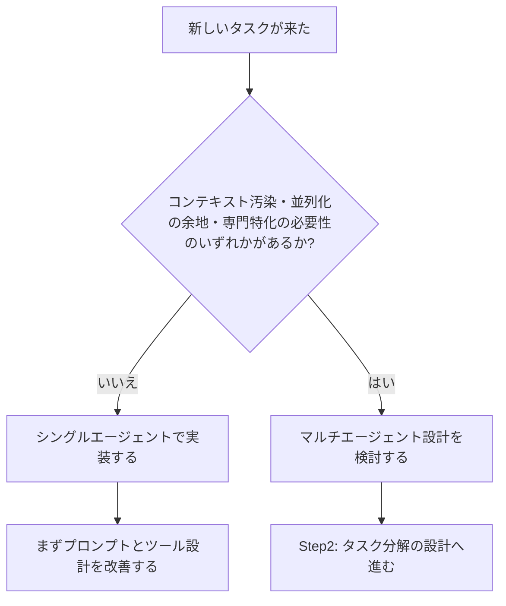

> 参考: [Building multi-agent systems: When and how to use them — Claude by Anthropic](https://claude.com/blog/building-multi-agent-systems-when-and-how-to-use-them)

---

## Step 2: タスク分解の設計原則(Context-Centric Decomposition)

マルチエージェント化を決めた後、最も重要な設計判断は「**どうやって作業をエージェント間に分割するか**」です。ここでチームが最も頻繁に間違える判断でもあります。

### 2-1. Problem-Centric(作業種別による分解)は非推奨

「実装担当」「テスト担当」「レビュー担当」のように**作業の種類**で分割すると、ハンドオフのたびにコンテキストが失われ、常に調整コストが発生します。実際にソフトウェア開発ロールごとにサブエージェントを分けた実験では、実作業よりも調整(coordination)にトークンを多く消費したという報告があります。

### 2-2. Context-Centric(コンテキスト境界による分解)が有効

「必要なコンテキストの境界」で分割するのが原則です。たとえば1つの機能を実装するエージェントは、そのテストも担当すべきです。すでに実装の背景知識を持っているためです。分割してよいのは、コンテキストが本当に独立している場合に限ります。

有効な分割境界の例:
- 独立したリサーチ経路(「アジア市場動向」と「欧州市場動向」は並行して進められる)
- 明確なAPI契約で結ばれた疎結合コンポーネント(フロントエンドとバックエンド)
- ブラックボックス検証(実装の背景を知らなくてもテストを実行し結果を報告できる検証者)

問題のある分割境界の例:
- 同じ機能の逐次フェーズ(計画・実装・テストは背景知識を共有しすぎている)
- 密結合なコンポーネント(頻繁なすり合わせが必要なものは1つのエージェントにまとめる)
- 共有状態を頻繁に同期する必要がある作業

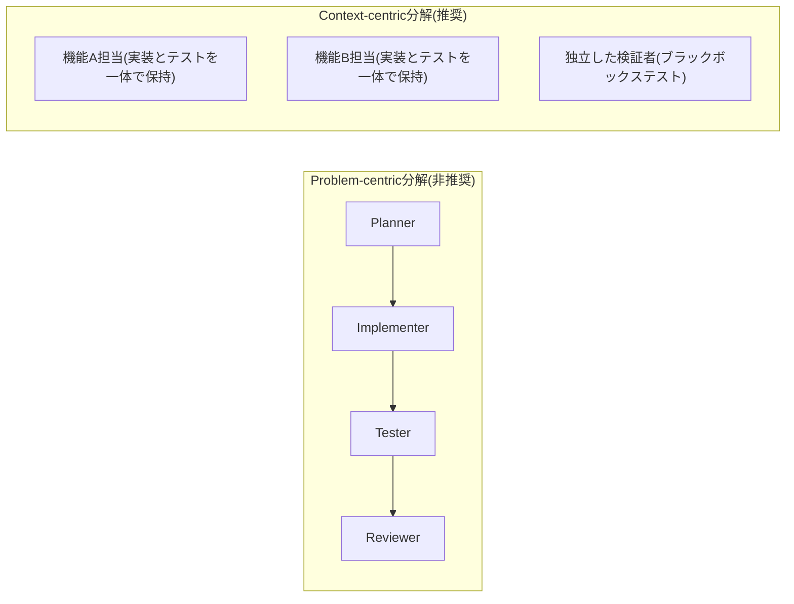

> 参考: [Building multi-agent systems: When and how to use them — Claude by Anthropic](https://claude.com/blog/building-multi-agent-systems-when-and-how-to-use-them)

---

## Step 3: 協調パターン(Coordination Pattern)を選ぶ

タスク分解の方針が決まったら、次に「エージェント同士がどう協調するか」というコーディネーションパターンを選びます。2026年4月にAnthropicが公開した整理では、以下の5つのパターンが実運用で定着しています。**最初はもっとも単純なパターンから始め、限界にぶつかったら次のパターンへ進化させる**のが推奨アプローチです。

### 3-1. Generator-Verifier(生成者-検証者)

最もシンプルで、最も広く導入されているパターンです。生成者(Generator)がタスクを受け取り初期出力を作成し、検証者(Verifier)がその出力を評価します。基準を満たせば完了、満たさなければ具体的なフィードバックとともに生成者へ差し戻します。

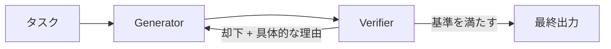

**向いている用途**: コード生成(1体が実装しもう1体がテストを実行する)、ファクトチェック、ルーブリック採点、コンプライアンス確認など、出力品質が重要で評価基準を明文化できる領域。

**弱点**: 検証者の基準が曖昧だと「とりあえずOK」を出す「お墨付き」問題が起きます。生成とレビューが同程度に難しいタスクでは、検証者が問題を確実に検出できない場合もあります。また収束しない場合に備えて最大反復回数とフォールバック(人間へのエスカレーション、注意書き付きでベスト出力を返すなど)を必ず設定します。

### 3-2. Orchestrator-Subagent(オーケストレーター-サブエージェント)

階層構造が特徴です。リード(Lead)エージェントが計画・委任・統合を行い、サブエージェントはリードから割り当てられた特定の責務のみを実行し結果を返します。

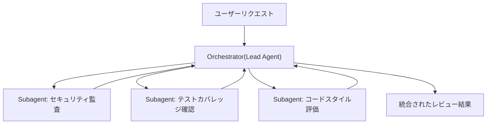

**向いている用途**: タスク分解が明確でサブタスク間の依存が少ない場合。たとえばプルリクエストのレビューで、セキュリティ・テストカバレッジ・スタイル・アーキテクチャ整合性をそれぞれ専門サブエージェントに割り当て、最後に統合するケース。Claude Codeのバックグラウンドサブエージェント機能もこのパターンを採用しています。

**弱点**: オーケストレーターが情報のボトルネックになります。あるサブエージェントの発見が別のサブエージェントの分析に関係する場合、その情報はオーケストレーターを経由しなければならず、何度もハンドオフを重ねるうちに重要な詳細が失われがちです。また明示的に並列化しない限り逐次実行になり、速度面のメリットを得られないままマルチエージェントのコストだけがかかることがあります。

### 3-3. Agent Teams(エージェントチーム)

サブタスクが長期間独立して並行進行できる場合に有効です。コーディネーターが複数のワーカーエージェントを独立プロセスとして起動し、ワーカーは共有キューからタスクを取得して自律的に複数ステップにわたり作業し、完了を通知します。

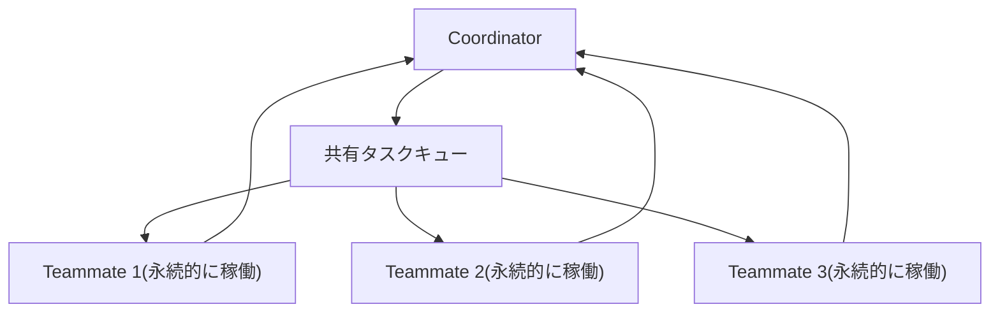

Orchestrator-Subagentとの違いは「ワーカーの永続性」です。オーケストレーターは1つの束縛されたサブタスクのためにサブエージェントを起動し、結果を返したら終了させますが、Agent Teamsのワーカーは多数の割り当てにまたがって稼働し続け、ドメイン知識を蓄積していきます。

**向いている用途**: 大規模なコードベースのフレームワーク移行のように、サービスごとに独立した依存関係・テストスイート・デプロイ設定を持つ場合。各ワーカーはその担当領域に習熟していきます。

**弱点**: 独立性が前提条件です。1つのワーカーの作業が別のワーカーに影響する場合、互いに気づけず、出力が衝突する可能性があります。完了検出も難しく(あるワーカーは2分で終わり、別のワーカーは20分かかるなど)、共有リソース(同じコードベースやDB)への同時書き込みには衝突解決の仕組みが必要です。

### 3-4. Message Bus(メッセージバス)

エージェント数が増え、相互作用が複雑になった場合に有効です。エージェントは共有の通信レイヤーを通じてイベントをpublish(発行)し、関心のあるトピックをsubscribe(購読)します。

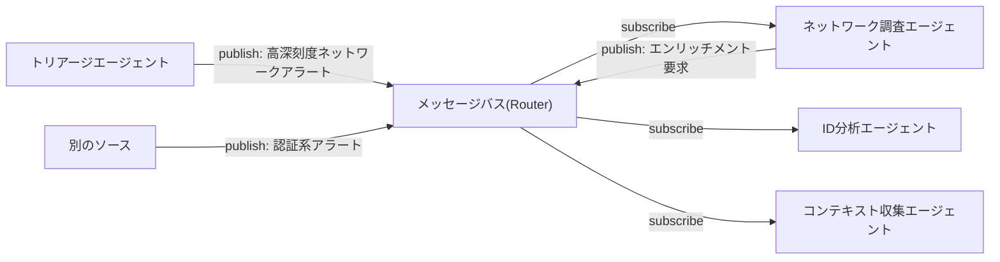

**向いている用途**: セキュリティオペレーションの自動化のように、ワークフローが決められたシーケンスではなくイベント発生に応じて動的に変化するパイプライン。新しいエージェント種別を後から追加しても既存の接続を書き換える必要がありません。

**弱点**: イベント駆動の柔軟性はトレーサビリティを犠牲にします。1つのアラートが5つのエージェントにまたがる連鎖を引き起こすと、何が起きたかを把握するには丁寧なログと相関分析が必要になります。ルーティングの精度も重要で、ルーターが誤分類・見落としをすると「サイレント障害(クラッシュせずに何も処理しない)」が起きます。

### 3-5. Shared State(共有ステート)

これまでのパターンはすべて中央の管理役(オーケストレーター、チームリード、ルーター)が情報の流れを管理していました。Shared Stateはその仲介者を排除し、全エージェントが直接読み書きできる永続ストアを通じて協調します。

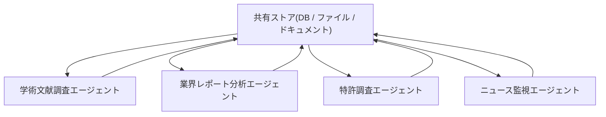

**向いている用途**: 複数のエージェントが複雑な問いの異なる側面を調査し、互いの発見が他の調査に影響するリサーチ統合システム。学術文献担当が発見した重要な研究者情報を、業界分析担当がすぐに参照できます。単一障害点(コーディネーターやルーターの停止)を排除できる点も利点です。

**弱点**: 明示的な調整がないため、重複作業や矛盾するアプローチが起きやすくなります。より深刻なのは「反応ループ」です。AがBへの気づきを書き込み、BがそれをもとにAへの追記を書き込み…と収束しない堂々巡りが起き、トークンを消費し続けます。重複書き込みにはロックやバージョニングといった技術的対策がありますが、反応ループには時間予算・収束閾値(N サイクル新しい発見がなければ終了)・十分な回答が揃ったかを判断する専任エージェントなど、**明示的な終了条件**を最初から設計する必要があります。

### 3-6. パターン選択の早見表

| 状況 | 推奨パターン |
| --- | --- |
| 品質が最重要で評価基準を明文化できる | Generator-Verifier |
| タスク分解が明確でサブタスクの依存が少ない | Orchestrator-Subagent |
| 独立して長時間並行できるワークロード | Agent Teams |
| イベント駆動で成長し続けるエージェントエコシステム | Message Bus |
| 共同リサーチで発見を共有し合う必要がある | Shared State |
| 単一障害点を排除したい | Shared State |

多くのケースでは、まず**Orchestrator-Subagent**から始めることが推奨されています。最も幅広い問題に対応でき、調整コストも最小限で済むためです。実際に困った箇所を観察してから、他のパターンへ進化させましょう。本番システムでは複数パターンの組み合わせもよく使われます(例: 全体はOrchestrator-Subagentで進め、協調が濃いサブタスクだけShared Stateにする)。

> 参考: [Multi-agent coordination patterns: Five approaches and when to use them — Claude by Anthropic](https://claude.com/blog/multi-agent-coordination-patterns)

---

## Step 4: 検証エージェント(Verification Subagent)を組み込む

ドメインを問わず一貫して機能するパターンが「検証サブエージェント」です。メインエージェントの作業をテスト・検証することだけを責務とする専用エージェントを配置します。検証は本質的に必要なコンテキスト量が少ないため、「伝言ゲーム」問題を回避できます。検証者は成果物がなぜそのように作られたかを理解する必要がなく、指定された基準を満たしているかどうかだけを判定すればよいからです。

なお、Claude Opus 4.5のようなより高性能なオーケストレーターモデルは、別建ての検証ステップなしでサブエージェントの作業を直接評価できるケースも増えています。ただし、より軽量なオーケストレーターを使う場合、専門的なツールでの検証が必要な場合、あるいはワークフローに明示的な検証チェックポイントを設けたい場合には、検証サブエージェントは依然として有効です。

### 早期合格(Early Victory)問題への対策

検証サブエージェント最大の失敗モードは、十分にテストせずに合格と判定してしまうことです。検証者が1〜2個のテストだけ実行して通過を確認し、成功と宣言してしまいます。対策は次の通りです。

- **具体的な基準を与える**: 「うまく動くか確認して」ではなく「テストスイート全体を実行し、すべての失敗を報告して」と指示する
- **網羅的なチェックを要求する**: 複数のシナリオとエッジケースのテストを義務付ける
- **ネガティブテストを含める**: 失敗すべき入力を試し、実際に失敗することを確認させる
- **明示的な指示を書く**: 「合格と判定する前に必ずテストスイート全体を実行しなければならない」という明文化された指示は必須です

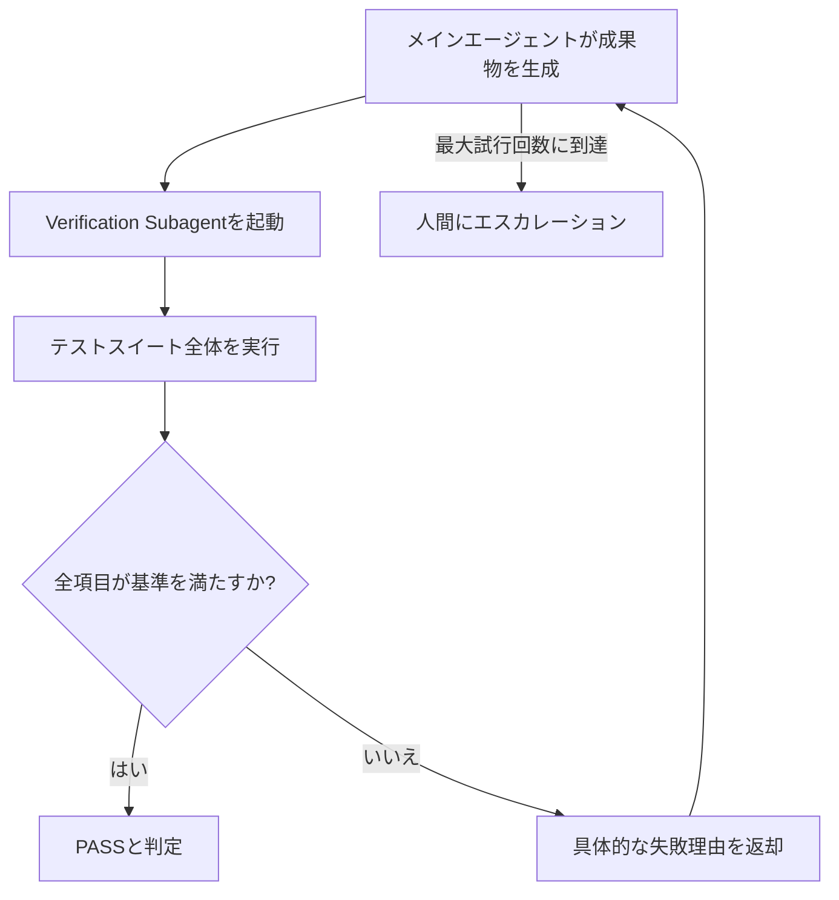

**適用領域**: 品質保証(テストスイート実行、Lint、スキーマ検証)、コンプライアンスチェック、出力バリデーション、生成コンテンツの事実検証など。

> 参考: [Building multi-agent systems: When and how to use them — Claude by Anthropic](https://claude.com/blog/building-multi-agent-systems-when-and-how-to-use-them)

---

## Step 5: エージェント間通信プロトコルを設計する(MCPとA2A)

エージェントを協調させるには、「ツールへのアクセス」と「エージェント同士の連携」という2つの異なるレイヤーの通信を標準化する必要があります。この2つを混同するのが2026年時点で最もよくある設計ミスの一つです。

- **MCP(Model Context Protocol)**: Anthropicが2024年11月に公開したオープン標準で、エージェントがツール・データソース・外部サービスにアクセスする方法を統一します。垂直方向(エージェント→外部世界)の接続を担います。
- **A2A(Agent2Agent Protocol)**: Googleが2025年4月に発表し、その後Linux Foundationに寄贈されたオープン標準で、異なるベンダー・異なるモデル基盤で構築されたエージェント同士が発見・通信・協調するための水平方向の接続を担います。各エージェントは自身の能力とエンドポイントを記述した「Agent Card」を公開し、他のエージェントがそれを参照して委任先を判断します。2026年1月にはバージョン1.0.0がリリースされ実験段階から本番運用レベルに移行し、署名付きAgent Cardによる暗号学的な検証も導入されました。なお、競合していたIBM主導のACP(Agent Communication Protocol)は2025年8月にA2Aへ統合され、2025年12月にはLinux Foundation傘下にAgentic AI Foundation(AAIF)が設立され、MCP・A2Aなどの中立的なガバナンス基盤となっています。

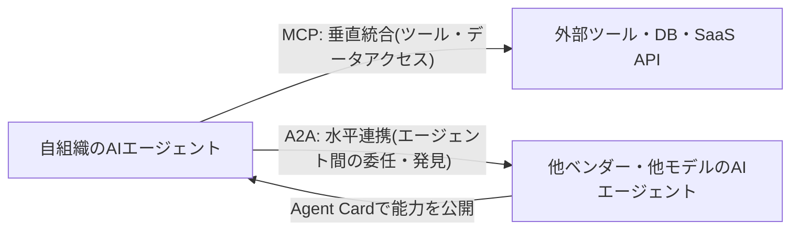

| 観点 | MCP | A2A |
| --- | --- | --- |
| 接続方向 | 垂直(エージェント→ツール/データ) | 水平(エージェント→エージェント) |
| 主な提唱者 | Anthropic(2024年11月公開) | Google(2025年4月公開、Linux Foundationへ寄贈) |
| 中心概念 | ツール定義・リソース・コンテキスト提供 | Agent Card・タスク委任・クライアント-リモートエージェントモデル |
| 想定シーン | DB接続、SaaS操作、ファイルアクセスなど | 異なるベンダー・フレームワーク間のエージェント連携 |
| 2026年の状態 | 本番運用の標準として定着 | v1.0系で本番運用グレードに到達、150以上の組織が支持 |

実務では**両方を併用する**のが一般的です。エージェント内部のツール呼び出しはMCPで、組織や基盤モデルをまたぐエージェント間の委任はA2Aで処理するハイブリッド構成が2026年の主流です。

> 参考:
> - [Agent2Agent vs MCP: 2 Protocols Your 2026 Stack Needs — Beam.ai](https://beam.ai/agentic-insights/agent2agent-vs-mcp-2026-ai-agent-stack)
> - [MCP, A2A, and Where ACP Went — Zuplo](https://zuplo.com/blog/agent-protocol-stack-mcp-a2a-acp-2026)
> - [MCP vs A2A: Protocols for Multi-Agent Collaboration 2026 — OneReach.ai](https://onereach.ai/blog/guide-choosing-mcp-vs-a2a-protocols/)

---

## Step 6: フレームワークを選定する

フレームワークは「エージェントがどう推論し、どうハンドオフし、どうエラーから回復し、どう負荷に耐えるか」を決めますが、「誰が何にアクセスできるか」「どうガバナンスするか」「本番でいくらかかるか」までは決めてくれません。それらはフレームワークの上位にあるインフラ/ガバナンス層の責務です。この前提を踏まえた上で、2026年時点で代表的なフレームワークを比較します。

| フレームワーク | 提供元 | 得意な協調パターン | 特徴 | 向いている用途 |
| --- | --- | --- | --- | --- |
| Claude Agent SDK | Anthropic | Orchestrator-Subagent | エージェントループ・並列ツール実行・フックを標準提供。Temporalと組み合わせて耐久実行を構築するのが定番構成 | コーディングエージェント、本番グレードの独自オーケストレーション |
| LangGraph | LangChain | 全パターン(グラフベースで柔軟) | ノードとエッジでワークフローを明示的にグラフ化。状態遷移の可視化に強い | 複雑な分岐・条件付きワークフロー |
| CrewAI | CrewAI | Orchestrator-Subagent(Hierarchical Process)/ Sequential | Role・Goal・Backstoryというロールベースの抽象化で素早く着手できる。ただし単純作業ではトークン消費が重くなりやすい | 業務ワークフロー自動化、コンテンツパイプライン |
| OpenAI Agents SDK | OpenAI | Orchestrator-Subagent | 実験的だったSwarmの後継となる本番運用パス | OpenAIモデル中心のエージェント構築 |
| Google ADK(Agent Development Kit) | Google | Sequential / Parallel / Loop / Custom | SequentialAgent・ParallelAgent・LoopAgentという組み込みのワークフローエージェントを提供し、コードファーストで制御できる。条件分岐が必要な場合はBaseAgentを継承したCustom Agentで対応 | Google Cloud中心の本番エージェント運用、決定的な制御が必要なワークフロー |
| AutoGen | Microsoft | Message Bus寄り(イベント駆動) | イベント駆動でスケーラブルな設計を志向 | 研究寄り・イベント駆動型の実験的構成 |

Google ADKは、決定的オーケストレーション(コードで明示的に流れを定義する)と動的委任(モデル自身がどのエージェントに処理させるか判断する)の2方式を提供している点が特徴です。`SequentialAgent`は子エージェントを固定順序で、`ParallelAgent`は同時に、`LoopAgent`は停止条件を満たすか最大反復回数に達するまで繰り返し実行します。これらの組み込みエージェントで表現しきれない条件分岐ロジックが必要な場合は、`BaseAgent`を継承したCustom Agentでコードとして制御フローを記述します。

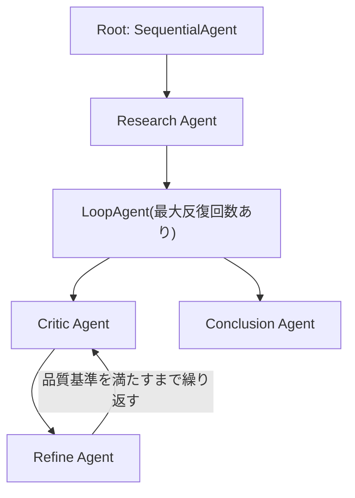

> 参考:
> - [Best Multi-agent Orchestration Frameworks in 2026 — TrueFoundry](https://www.truefoundry.com/blog/multi-agent-orchestration-frameworks)
> - [7 Multi-Agent Orchestration Platforms: Build vs Buy in 2026 — Augment Code](https://www.augmentcode.com/tools/multi-agent-orchestration-platforms-build-vs-buy)
> - [Developer's guide to multi-agent patterns in ADK — Google Developers Blog](https://developers.googleblog.com/developers-guide-to-multi-agent-patterns-in-adk/)
> - [Google ADK Explained: Building Multi-Agent Systems (Part 1) — The AI Practitioner](https://aipractitioner.substack.com/p/google-adk-explained-building-multi)

---

## Step 7: 状態管理とコンテキストエンジニアリング

Anthropicのリサーチシステムでは、リードエージェントが調査計画を記憶(Memory)システムに保存し続けることで、会話がモデルのコンテキストウィンドウの上限(20万トークン超)を超えても計画や発見を失わないようにしています。マルチエージェント設計では次の点を押さえておきましょう。

- **サブエージェントは要約だけを返す**: フルの調査結果ではなく、要点を凝縮した情報だけをオーケストレーターに返却し、メインのコンテキストを汚染しないようにします。
- **計画をメモリに永続化する**: 長時間稼働するタスクでは、コンテキストが切り詰められても計画を再構築できるよう、外部メモリに定期的に書き出します。
- **ツール数が15〜20を超えたら再検討する**: モデルがツール選択に多くの注意を割かれるようになったら、動的にツールを発見できる仕組み(Tool Search的な機構)の導入や、マルチエージェント化を検討するタイミングです。
- **コンテキスト圧縮(Compaction)を活用する**: 近年のコンテキスト管理技術の進歩により、単一エージェントでも長時間の会話履歴を維持しやすくなっており、マルチエージェント化の閾値は今後も変化していきます。

> 参考: [Building multi-agent systems: When and how to use them — Claude by Anthropic](https://claude.com/blog/building-multi-agent-systems-when-and-how-to-use-them)

---

## Step 8: エラーハンドリングと耐障害性

マルチエージェントシステムは非決定的に振る舞うため、ループに陥ったり、存在しない情報源を探し続けたり、不要なステータス更新でお互いを中断させ合ったりする失敗モードが起こり得ます。Anthropicのリサーチシステムでは、本番運用のために以下の仕組みを導入しています。

- **チェックポインティング**: 実行途中の状態を定期的に保存し、失敗時に最初からやり直すのではなく直前のチェックポイントから再開できるようにする
- **リトライロジック**: 一時的な失敗(APIタイムアウトなど)には自動再試行を設定するが、最大試行回数を設けて無限ループを防ぐ
- **レインボーデプロイメント(Rainbow Deployment)**: 新旧バージョンを並行稼働させ、進行中のセッションを壊さずに安全に切り替える

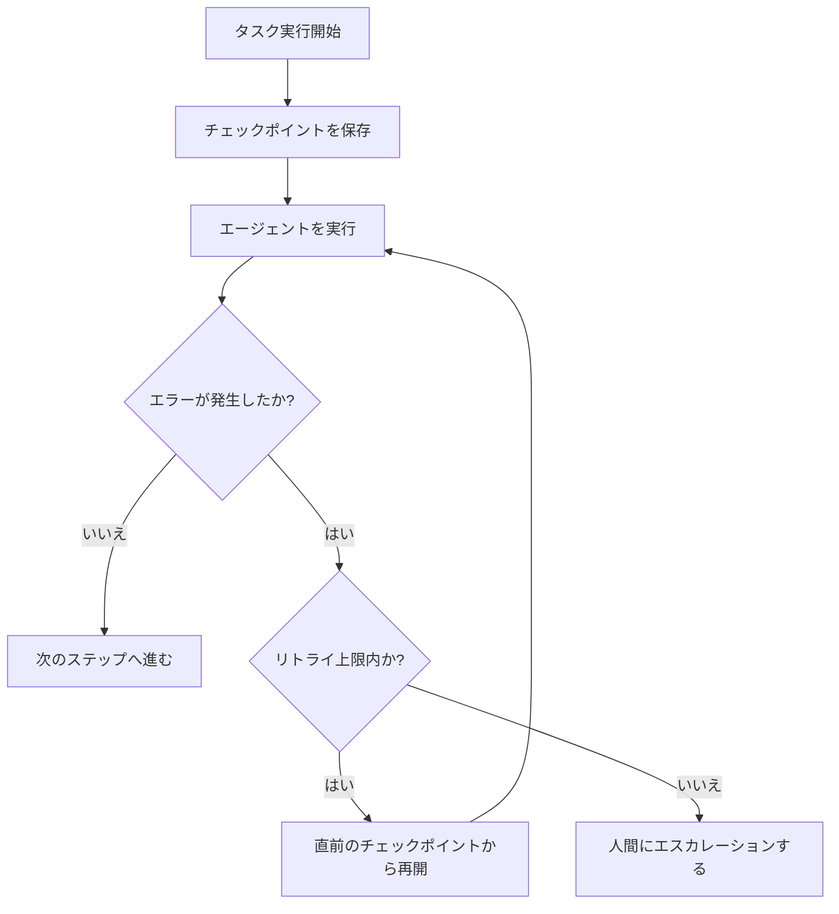

また、生成→検証ループや共有ステートパターンでは「収束しない」ことそのものが失敗モードになるため、**最大反復回数・時間予算・収束閾値(N回連続で新しい発見がない場合は終了)**を設計段階で必ず定義しておく必要があります。

> 参考:
> - [Anthropic's multi-agent research system raises the bar for open-ended AI reasoning — Centific](https://www.centific.com/blog/anthropic-s-multi-agent-research-system-raises-the-bar-for-open-ended-ai-reasoning)
> - [Multi-agent coordination patterns: Five approaches and when to use them — Claude by Anthropic](https://claude.com/blog/multi-agent-coordination-patterns)

---

## Step 9: セキュリティとガードレール

複数エージェントが連携するシステムは、単一エージェントのガードレールでは対処しきれないリスクを抱えます。OWASPが2026年に公開した「Top 10 for Agentic Applications(ASI)」では、エージェント特有のリスクが体系化されています。

主なリスクと、マルチエージェント特有の増幅要因は次の通りです。

- **プロンプトインジェクションの連鎖**: あるエージェントの出力が次のエージェントの入力になる構成では、1箇所で成功したインジェクションが後続のすべての層に伝播します。中間の「信頼された」エージェントが検出マーカーを取り除きつつ悪意ある指示を再フォーマットしてしまい、むしろ下流でより効果的になるケースも報告されており、「伝言ゲームで自然に弱まる」という直感は必ずしも正しくありません。
- **暗黙の相互信頼による権限昇格**: エージェント同士が互いを無条件に信頼すると、あるエージェントが乗っ取られた際に他のエージェントの権限まで悪用されるリスクがあります。
- **共有コンテキストによる越境的な情報漏洩**: 規制対象データがドメイン境界を越えて共有ステートやメッセージバスを通じて漏れる可能性があります。
- **サプライチェーンの脆弱性**: エージェントフレームワークが依存するパッケージ(LLMゲートウェイなど)が侵害されると、フレームワークを利用するすべてのエージェントに影響が及びます。

対策の基本方針は「Least Agency(最小権限の原則をエージェントに適用したもの)」です。

- **ツールのホワイトリスト化とエージェントごとのスコープ制御**: 各エージェントが必要最小限の権限だけを持つようにする
- **高リスク操作には人間の承認ステップを挟む**: 送金・アクセス権付与・データ削除などは自動実行させない
- **入出力フィルタリングと異常検知**: 想定外の出力長、外部ドメインへのリクエスト、想定していないコードスニペットの出現などを監視する
- **監査ログの整備**: エージェント間のやり取りを後から追跡・検証できるようにする
- **継続的なレッドチーミング**: 新しいインジェクション手法に対して定期的に防御をテストし更新する

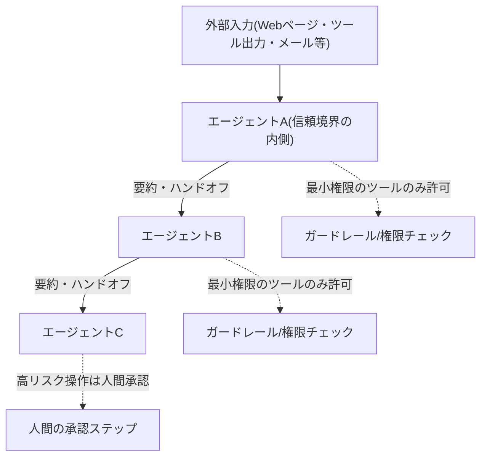

> 参考:
> - [Multi-Agent AI Security: Enterprise Risks, Compliance, and Mitigation — Augment Code](https://www.augmentcode.com/guides/multi-agent-ai-security-risks-compliance-fixes)
> - [OWASP Top 10 for Agentic Applications for 2026 — Practical DevSecOps](https://www.practical-devsecops.com/owasp-top-10-agentic-applications/)
> - [Prompt injection still drives most agentic AI security failures in production — Help Net Security](https://www.helpnetsecurity.com/2026/06/11/owasp-prompt-injection-ai-security-failures/)
> - [OWASP Top 10 for Agents 2026 — DeepTeam](https://www.trydeepteam.com/docs/frameworks-owasp-top-10-for-agentic-applications)

---

## Step 10: 可観測性(Observability)と評価(Evaluation)

マルチエージェントシステムは非決定的であるため、従来型アプリケーションのログ監視だけでは不十分です。「最終出力は間違っていたが、どのエージェントが原因で、どのツール呼び出しが不正な結果を返し、推論チェーンのどこで崩れたのか分からない」という状態を避けるための可観測性設計が不可欠です。

有効な可観測性スタックは、次の3本柱で構成されます。

1. **分散トレーシング**: エージェント間の呼び出しをまたいでスパン(span)を親子関係のまま記録し、どのエージェント・どのツール呼び出しが問題を起こしたかを再構築できるようにする
2. **評価フレームワーク(LLM-as-a-Judge)**: 高速・低コストなモデルを使い、正確性・関連性・忠実性などをリアルタイムでスコアリングする
3. **リアルタイムログ**: 即座のデバッグを可能にする

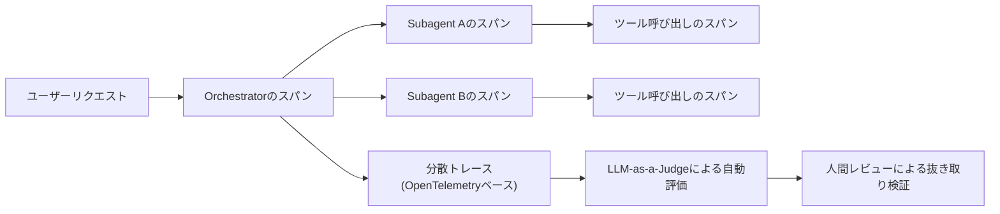

Anthropic自身も、リサーチシステムの評価にLLMによる自動評価と人間評価の両方を用いています。LLMは正確性やソースの質を評価するのに向いていますが、SEO最適化されたコンテンツへの過度な依存など微妙な問題は人間の評価者でなければ気づけないことがあるため、両者を組み合わせています。また、プロンプトやエージェントの挙動が時間とともにどう変化しているかを継続的に監視することも重要です。

代表的な可観測性ツールには、Arize Phoenix(OSS、忠実性・関連性・ハルシネーション検出などの評価指標を50種類以上内蔵)、Braintrust(本番トレースをそのまま評価用データセット化するTrace-to-Evalワークフローが特徴)、MLflow(マルチターン評価やプロンプト自動最適化を含む評価領域をカバー)、W&B Weave(既存のWeights & Biasesワークフローに統合しやすい)などがあります。

> 参考:
> - [Top 5 LLM and Agent Observability Tools in 2026 — MLflow](https://mlflow.org/top-5-agent-observability-tools/)
> - [Multi-Agent Tracing 2026: traceAI, OTel, Span Hierarchy — FutureAGI](https://futureagi.com/blog/trace-debug-multi-agent-systems-observability-guide/)
> - [Agent observability: The complete guide for 2026 — Braintrust](https://www.braintrust.dev/articles/agent-observability-complete-guide-2026)
> - [Agent Observability and Tracing — Arize](https://arize.com/ai-agents/agent-observability/)

---

## Step 11: コストとレイテンシのマネジメント

マルチエージェント化は品質・網羅性を高める一方で、必ずコストとレイテンシのトレードオフを伴います。設計段階で次の数値感を持っておくと判断がぶれません。

| 指標 | 目安 | 出典の要旨 |
| --- | --- | --- |
| 同等タスクでのトークン消費倍率 | シングルエージェント比で約3〜10倍 | エージェントごとに個別のコンテキストを持ち、調整メッセージのやり取りと結果要約のたびにコストが発生するため |
| 深いリサーチ用途でのトークン消費倍率 | 通常のチャット比で約15倍 | 網羅性を優先する設計のトレードオフとして意図的に許容されている |
| リード+並列サブエージェント構成の性能改善 | 単体エージェント比で約90.2%向上(Anthropic社内リサーチ評価) | Claude Opus 4をリード、Claude Sonnet 4をサブエージェントとした構成での実測値 |
| 単純なタスクでシングルエージェントが優位だった割合 | 約64%(Princeton NLPのベンチマーク) | 同じツール・コンテキストを与えた場合の比較 |
| 5ツール呼び出し規模のマルチエージェントワークフロー | 単一API呼び出し比で約5倍のトークン消費 | ワークフローの複雑さに比例してコストが増える傾向 |

コストを抑えるための実践的な対策としては、生成には高性能・高コストなモデルを、検証や単純作業には安価で高速なモデルを充てる「Maker-Checker」構成(生成担当は高性能モデル、チェック担当は軽量モデル)、逐次実行で消化できる部分は無理に並列化しない、ツール数が多いエージェントには動的なツール検索の仕組みを導入してトークン消費を抑える、といった方法が有効です。

> 参考:
> - [6 Multi-Agent Orchestration Patterns for Production (2026) — Beam.ai](https://beam.ai/agentic-insights/multi-agent-orchestration-patterns-production)
> - [Anthropic's Multi-Agent Blueprint: What Production Adds — Fountain City](https://fountaincity.tech/resources/blog/anthropic-multi-agent-blueprint-production/)
> - [Anthropic and OpenAI Agent Orchestration: Where the Giants Stand in 2026 — Flocker](https://flocker.md/blog/anthropic-openai-agent-orchestration/)
> - [7 Multi-Agent Orchestration Platforms: Build vs Buy in 2026 — Augment Code](https://www.augmentcode.com/tools/multi-agent-orchestration-platforms-build-vs-buy)

---

## よくあるアンチパターン

| アンチパターン | 何が起きるか | 対策 |
| --- | --- | --- |
| 見栄えの良さでパターンを選ぶ | 実際の問題に合わないパターンを採用し、不要な調整コストが発生する | 最もシンプルなパターンから始め、限界にぶつかってから次のパターンへ進化させる |
| Problem-centricな分解 | ハンドオフのたびにコンテキストが劣化する「伝言ゲーム」が起きる | Context-centricな分解に切り替える |
| 検証基準を明文化しない | 検証エージェントが「お墨付き」を出すだけになる(早期合格問題) | 具体的・網羅的・ネガティブテストを含む明示的な基準を与える |
| 反応ループの終了条件を設計しない(特にShared State) | 収束せずにトークンを消費し続ける | 時間予算・収束閾値・専任の終了判断エージェントを最初から設計する |
| ツールを1体のエージェントに詰め込みすぎる | ツール選択の精度が落ち、ドメイン混同が起きる | 15〜20個を超えたら専門特化やツール動的検索を検討する |
| エージェント間を無条件に信頼する | プロンプトインジェクションが連鎖的に伝播し、権限昇格につながる | 最小権限の原則、入出力フィルタリング、高リスク操作の人間承認を徹底する |
| 可観測性を後回しにする | 本番障害が起きた際にどのエージェント・どのツール呼び出しが原因か分からない | 初期段階から分散トレーシングと評価フレームワークを組み込む |
| コスト試算をせずにマルチエージェント化する | 3〜15倍のトークンコスト増加に後から気づく | 導入前にコストとレイテンシのトレードオフを見積もる |

> 参考: [Multi-agent coordination patterns: Five approaches and when to use them — Claude by Anthropic](https://claude.com/blog/multi-agent-coordination-patterns)

---

## 全体ワークフローまとめ

以下は、本ガイドで解説したステップを俯瞰したフローです。実際にはStep 3〜11を並行して検討しながら反復的に設計を洗練させていくことになります。

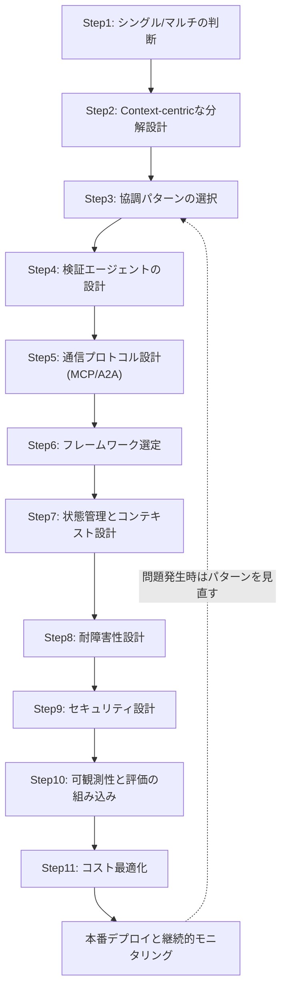

---

## まとめ

マルチエージェントオーケストレーションは強力ですが、あらゆる場面に適した万能解ではありません。設計に着手する前に、次の3点を必ず確認してください。

1. **本当に正当化される制約があるか**(コンテキスト限界・並列化の機会・専門特化の必要性)
2. **分解は作業種別ではなくコンテキスト境界に基づいているか**
3. **サブエージェントが完全なコンテキストなしで検証できる明確なポイントがあるか**

最もシンプルなアプローチから始め、根拠が積み上がってから複雑さを追加していくことが、2026年時点での最も確実なベストプラクティスです。

---

## 参考文献一覧

1. [Which are the Best Multi-Agent Orchestration Tools in 2026? — TrueFoundry](https://www.truefoundry.com/blog/multi-agent-orchestration-tools)
2. [6 Multi-Agent Orchestration Patterns for Production (2026) — Beam.ai](https://beam.ai/agentic-insights/multi-agent-orchestration-patterns-production)
3. [Multi-Agent Orchestration: 5 Patterns That Work in 2026 — Digital Applied](https://www.digitalapplied.com/blog/multi-agent-orchestration-5-patterns-that-work)
4. [Best Multi-agent Orchestration Frameworks in 2026 — TrueFoundry](https://www.truefoundry.com/blog/multi-agent-orchestration-frameworks)
5. [7 Multi-Agent Orchestration Platforms: Build vs Buy in 2026 — Augment Code](https://www.augmentcode.com/tools/multi-agent-orchestration-platforms-build-vs-buy)
6. [Multi-Agent AI Orchestration Guide & 2026 Updates — Codebridge](https://www.codebridge.tech/articles/mastering-multi-agent-orchestration-coordination-is-the-new-scale-frontier)
7. [Multi-Agent Orchestration Explained: Business Guide 2026 — Hubstic](https://www.hubstic.com/resources/blog/multi-agent-orchestration-guide)
8. [Building multi-agent systems: When and how to use them — Claude by Anthropic](https://claude.com/blog/building-multi-agent-systems-when-and-how-to-use-them)
9. [Multi-agent coordination patterns: Five approaches and when to use them — Claude by Anthropic](https://claude.com/blog/multi-agent-coordination-patterns)
10. [How we built our multi-agent research system — Anthropic Engineering](https://www.anthropic.com/engineering/multi-agent-research-system)
11. [Anthropic's multi-agent research system raises the bar for open-ended AI reasoning — Centific](https://www.centific.com/blog/anthropic-s-multi-agent-research-system-raises-the-bar-for-open-ended-ai-reasoning)
12. [Anthropic and OpenAI Agent Orchestration: Where the Giants Stand in 2026 — Flocker](https://flocker.md/blog/anthropic-openai-agent-orchestration/)
13. [Anthropic's Multi-Agent Blueprint: What Production Adds — Fountain City](https://fountaincity.tech/resources/blog/anthropic-multi-agent-blueprint-production/)
14. [Agent2Agent vs MCP: 2 Protocols Your 2026 Stack Needs — Beam.ai](https://beam.ai/agentic-insights/agent2agent-vs-mcp-2026-ai-agent-stack)
15. [MCP vs A2A: Protocols for Multi-Agent Collaboration 2026 — OneReach.ai](https://onereach.ai/blog/guide-choosing-mcp-vs-a2a-protocols/)
16. [MCP, A2A, and Where ACP Went — Zuplo](https://zuplo.com/blog/agent-protocol-stack-mcp-a2a-acp-2026)
17. [MCP vs A2A: The Complete Guide to AI Agent Protocols in 2026 — DEV Community](https://dev.to/pockit_tools/mcp-vs-a2a-the-complete-guide-to-ai-agent-protocols-in-2026-30li)
18. [Google ADK Explained: Building Multi-Agent Systems (Part 1) — The AI Practitioner](https://aipractitioner.substack.com/p/google-adk-explained-building-multi)
19. [Google ADK Multi-Agent Orchestration (Part 2) — The AI Practitioner](https://aipractitioner.substack.com/p/google-adk-multi-agent-orchestration)
20. [Developer's guide to multi-agent patterns in ADK — Google Developers Blog](https://developers.googleblog.com/developers-guide-to-multi-agent-patterns-in-adk/)
21. [Build Multi-Agent Systems with ADK — Google Codelabs](https://codelabs.developers.google.com/codelabs/production-ready-ai-with-gc/3-developing-agents/build-a-multi-agent-system-with-adk)
22. [7 Best Observability Stacks for Multi-Agent Systems (2026) — Fastio](https://fast.io/resources/best-observability-stacks-for-multi-agent-systems/)
23. [Multi-Agent Tracing 2026: traceAI, OTel, Span Hierarchy — FutureAGI](https://futureagi.com/blog/trace-debug-multi-agent-systems-observability-guide/)
24. [Top 5 LLM and Agent Observability Tools in 2026 — MLflow](https://mlflow.org/top-5-agent-observability-tools/)
25. [Agent observability: The complete guide for 2026 — Braintrust](https://www.braintrust.dev/articles/agent-observability-complete-guide-2026)
26. [Agent Observability and Tracing — Arize](https://arize.com/ai-agents/agent-observability/)
27. [Multi-Agent AI Security: Enterprise Risks, Compliance, and Mitigation — Augment Code](https://www.augmentcode.com/guides/multi-agent-ai-security-risks-compliance-fixes)
28. [OWASP Top 10 for Agentic Applications for 2026 — Practical DevSecOps](https://www.practical-devsecops.com/owasp-top-10-agentic-applications/)
29. [Prompt injection still drives most agentic AI security failures in production — Help Net Security](https://www.helpnetsecurity.com/2026/06/11/owasp-prompt-injection-ai-security-failures/)
30. [OWASP Top 10 for Agents 2026 — DeepTeam](https://www.trydeepteam.com/docs/frameworks-owasp-top-10-for-agentic-applications)