# マルチモーダルAI実践ガイド：画像・音声生成のベストプラクティス（2026年7月版）

> 対象読者：LLM/AIエンジニアリングの実務経験があり、画像生成・音声生成を本番システムに組み込みたい中級〜上級エンジニア
> 最終更新：2026年7月10日時点の公開情報にもとづく。モデル名・料金・仕様は変化が非常に速い領域のため、契約・実装前に必ず一次情報（各社公式ドキュメント）を確認してください。

---

## 目次

1. [はじめに：2026年のマルチモーダル生成AIをどう捉えるか](#1-はじめに2026年のマルチモーダル生成aiをどう捉えるか)
2. [技術基盤：画像生成モデルはどう動いているか](#2-技術基盤画像生成モデルはどう動いているか)
3. [画像生成モデルの選定（2026年7月版）](#3-画像生成モデルの選定2026年7月版)
4. [画像生成プロンプトエンジニアリングのベストプラクティス](#4-画像生成プロンプトエンジニアリングのベストプラクティス)
5. [制御性を高める技術：ControlNet・LoRA・ファインチューニング](#5-制御性を高める技術controlnetloraファインチューニング)
6. [画像生成の評価とQAパイプライン](#6-画像生成の評価とqaパイプライン)
7. [音声生成の技術基盤：TTSからネイティブ音声対話へ](#7-音声生成の技術基盤ttsからネイティブ音声対話へ)
8. [音声合成（TTS）モデルの選定（2026年7月版）](#8-音声合成ttsモデルの選定2026年7月版)
9. [音声生成のベストプラクティス](#9-音声生成のベストプラクティス)
10. [リアルタイム音声対話エージェントの設計](#10-リアルタイム音声対話エージェントの設計)
11. [音楽生成AIのベストプラクティスと著作権](#11-音楽生成aiのベストプラクティスと著作権)
12. [マルチモーダル統合アーキテクチャパターン](#12-マルチモーダル統合アーキテクチャパターン)
13. [安全性・コンテンツ来歴・法規制](#13-安全性コンテンツ来歴法規制)
14. [プロダクション運用のベストプラクティス](#14-プロダクション運用のベストプラクティス)
15. [まとめ：意思決定チェックリスト](#15-まとめ意思決定チェックリスト)
16. [参考文献・引用URL一覧](#16-参考文献引用url一覧)

---

## 1. はじめに：2026年のマルチモーダル生成AIをどう捉えるか

2024〜2025年は「テキスト生成AIにマルチモーダル入出力が追加される」フェーズでしたが、2026年に入り潮目が変わりました。画像・音声はもはや周辺機能ではなく、**推論（reasoning）を内蔵したネイティブ・マルチモーダルモデル**が主流になりつつあります。具体的には次の3つの潮流が同時並行で進んでいます。

- **画像生成の自己回帰化**：GPT Image 2 のように拡散モデルではなく自己回帰（Autoregressive）方式でテキストと同じ仕組みで画像を生成し、複雑な指示理解・世界知識の反映に強いモデルが台頭しています。<cite index="11-1">OpenAIの公開しているプロンプティングガイドでは、gpt-image-2が新規構築の推奨デフォルトとされ、画質・編集性能の向上とプロダクションワークフローへの広い対応が特徴として挙げられています</cite>。
- **音声のネイティブ音声対話（Audio-to-Audio）化**：音声認識→LLM推論→音声合成という「カスケード型」から、単一モデルが音声を直接理解し直接発話する方式への移行が進んでいます。<cite index="60-1">Gemini 3.1 Flash Liveは、従来の「文字起こし・推論・合成」という段階的スタックを単一のネイティブ音声対話プロセスへ統合し、レイテンシを大幅に削減しつつ、より自然なピッチ・間合いの認識を可能にしています</cite>。
- **「唯一の最強モデル」の消滅**：<cite index="2-1">2026年の画像生成AIモデル環境は変化が激しく、単一の最強モデルは存在せず、コンテンツの種類に応じて最適なモデルへルーティングするアーキテクチャが実務上の勝ち筋になっています</cite>。

本ガイドは、この前提に立ったうえで「どのモデルを、どう組み合わせ、どう安全に、どう運用するか」を実装レベルで解説します。

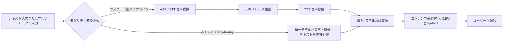

**アーキテクチャ選択の基本原則**：カスケード型は各コンポーネントを個別に差し替え・最適化できる柔軟性が強みですが、変換のたびに情報（抑揚・感情・視覚的ニュアンス）が失われ、レイテンシも積み上がります。ネイティブ方式は低レイテンシ・高い表現力を持ちますが特定ベンダーへの依存度が高くなり、細かいパラメータ制御は相対的に苦手です。この判断軸は本ガイド全体を通じて繰り返し登場します。

---

## 2. 技術基盤：画像生成モデルはどう動いているか

実装者としてモデルを選ぶ前に、内部で何が起きているかを理解しておくと、パラメータ調整・トラブルシューティング・コスト設計の精度が上がります。2026年時点で実務上押さえるべきアーキテクチャは大きく3系統です。

### 2.1 拡散モデル（Diffusion Model）

<cite index="9-1">拡散モデルは画像生成AIの基盤技術で、ランダムなノイズから、テキスト指示に合わせて少しずつノイズを除去（denoising）して画像を作り上げる手法であり、Stable Diffusion・FLUX・Midjourneyなど大半の画像生成ツールがこの仕組みを採用しています</cite>。学習時には実画像に段階的にノイズを加える「拡散過程」を学習し、推論時にはランダムノイズから逆方向にノイズを除去していく「逆拡散過程」を繰り返すことで画像を復元します。

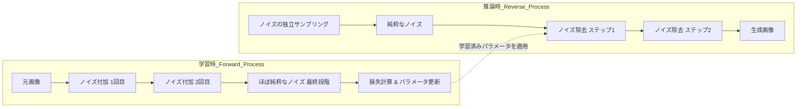

### 2.2 Flow Matching / Rectified Flow

FLUXやStable Diffusion 3系はFlow Matching（整流フロー）という拡散モデルの発展形を採用しています。ノイズと画像を結ぶ経路を直線（rectified）に近づけることで、少ないステップ数でも高品質な生成が可能になる点が拡散モデルとの実務上の違いです。近年はさらに、生成に必要な関数評価回数（NFE）を1〜数ステップまで削減する蒸留（Distillation）技術の研究が活発です。Consistency Model・Mean Flow Distillationなどの手法は、教師モデルの軌道（trajectory）を学習した生徒モデルが1ステップまたは数ステップで同等の品質を再現することを狙っています。プロダクションでは「SDXL-Lightning」のような蒸留済み高速モデルが、リアルタイム性が求められるUI（インタラクティブなプレビュー生成など）で採用されています。

> 実務上のポイント：ステップ数を減らす蒸留モデルは生成速度が数倍〜数十倍高速になりますが、細部のディテールやプロンプト忠実度がわずかに犠牲になる場合があります。プレビュー用途には蒸留モデル、最終納品用途にはフルステップモデルを使い分けるハイブリッド構成が定石です。

### 2.3 自己回帰型画像生成（Autoregressive Image Generation）

拡散モデルとは根本的に異なるアプローチとして、テキストトークンと同じように画像を「一部分ずつ順番に生成する」自己回帰方式があります。<cite index="16-1">4o Image Generation（image_gen）はChatGPTに組み込まれており、GPT-4oと同じ技術を使って画像を生成する点が特徴で、拡散方式ではなく単語を書くように少しずつ画像を生成していきます</cite>。

<cite index="2-1">注意点として、GPT Image系（自己回帰モデル）は拡散モデルではないため生成速度は遅く、1回のリクエストにつき1枚の出力となる一方で、複雑なシーン構成や指示理解では拡散モデル系を上回る場合があります</cite>。

### 2.4 3アーキテクチャの比較

| 観点 | 拡散モデル（Diffusion） | Flow Matching / 蒸留系 | 自己回帰型（Autoregressive） |
|---|---|---|---|
| 代表モデル 例 | Stable Diffusion 3.5, Midjourney V8 | FLUX.2, SDXL-Lightning | GPT Image 2, 4o Image Generation |
| 生成速度 | 中速（20〜50ステップが一般的） | 高速（1〜8ステップ） | 低速（トークンを逐次生成） |
| 得意分野 | フォトリアリズム、アート表現 | 高速プレビュー、リアルタイムUI | 複雑な指示理解、文字描画、編集の一貫性 |
| 弱点 | 文字描画が崩れやすい（改善中） | 蒸留による品質劣化のリスク | 生成速度が遅く、1回1枚が基本 |
| 制御手法 | ControlNet, LoRAが豊富 | ControlNet系は限定的 | 自然言語での対話的編集が中心 |

**技術選定の指針**：バッチで大量の画像を高速生成したい（広告バナー量産、ECサイトの商品画像量産など）場合は拡散モデル系＋蒸留モデルの組み合わせが有利です。逆に、複雑な指示理解・文字入りデザイン・対話的な反復編集が必要な場合は自己回帰型（GPT Image系）が有利という傾向が2026年7月時点で確認できます。

---

## 3. 画像生成モデルの選定（2026年7月版）

### 3.1 主要モデル比較表

2026年7月時点で実務上検討対象になる主要モデルを、モデル単位（サービス名ではなく）で整理します。<cite index="1-1">2026年はサービス名と中身のモデル名がねじれて分かりにくくなっており、ChatGPTの中身はGPT Image 2、GeminiはNano Banana 2であるなど、サービス名ではなくモデル単位で実態を把握することが重要です</cite>。

| モデル | 提供元 | アーキテクチャ | 得意分野 | モデルライセンス | API/サービス規約 | 生成物の商用利用条件 | 備考 |
|---|---|---|---|---|---|---|---|
| GPT Image 2 | OpenAI | 自己回帰 | 複雑な指示理解、文字描画、編集の一貫性 | クローズドソース（非公開） | OpenAI Terms of Use に準拠 [1](#ref-1) | 出力の所有権はユーザーに帰属（商用利用可能） [1](#ref-1) | <cite index="1-1">最大4K出力に対応し、日本語を含むCJK・ラテン文字で約99%の文字精度に達しています</cite> |
| Nano Banana 2 / Gemini 3.1 Flash Image | Google | 拡散＋Gemini統合 | 速度と汎用性のバランス、検索・Lens統合 | クローズドソース（非公開） | Google Terms of Service および Gemini API Terms [30](#ref-30) | 生成物の商業利用が明示的に許諾（出力の所有権はユーザー） | <cite index="1-1">2026年2月のアップデートでGemini 3の全モードに標準搭載されました</cite> |
| FLUX.2 | Black Forest Labs | Flow Matching | フォトリアリズム、デザイン寄りの描写 | Schnellは Apache 2.0、Devは非商用、Proはクローズド | API経由時はAPIプロバイダ規約に準拠。モデル自体の商用可否はバージョン依存 | 生成した画像はいずれのバージョン（Dev含む）でも商用利用可能 [1](#ref-1) | バージョンによりモデル自体の商用可否が異なるため要確認 |
| Midjourney V8 / V8.1 | Midjourney | 拡散 | アート性・写真的な質感の表現力 | クローズドソース | Midjourney Terms of Service。無料会員は商用不可、有料会員に商用利用権付与 | 有料プラン契約中の生成画像は商用利用可能。年間売上100万ドル超の企業はEnterpriseプラン必須 | <cite index="9-1">公式APIが提供されておらず、プログラムからの自動生成はできません</cite> |
| Ideogram V3 | Ideogram | 拡散 | タイポグラフィ・ロゴ・文字入りデザイン | クローズドソース | Ideogram Terms of Service。無料プランは生成物が公開されCC BY-NC 4.0等の制限あり | 有料プラン（Basic以上）の契約中に生成された画像は非公開かつ商用利用可能 | 文字描画精度の高さが差別化要因 |
| Seedream 5.0 | ByteDance | 拡散 | リアルタイムWeb検索統合、インフォグラフィック | クローズドソース | 火山エンジン（Volcengine）利用規約 | API契約に基づき商用利用可能 [2](#ref-2) | <cite index="2-1">時間的制約のあるニュース関連コンテンツで最新情報を取得して描画できる点が特徴的です</cite> |
| Qwen-Image 2.0 | Alibaba | 拡散 | 自前運用・完全商用フリー | モデルにより Apache 2.0 または独自の Qwen License Agreement（商用利用は要申請）と異なり、確認が必要 [60](#ref-60) | API利用時はAlibaba Cloud等の利用規約に準拠 [60](#ref-60) | モデルごとのライセンスおよび規約に準拠（公式根拠で「制限なしで完全に商用利用可能」と確認できないため要確認） [60](#ref-60) | HuggingFaceで配布、自前GPUでの運用が前提 |
| Adobe Firefly | Adobe | 拡散 | 商用安全性（学習データの権利処理が明示的） | クローズドソース | Adobe Terms of Use および Fireflyユーザー特約 | Creative CloudまたはFirefly個別契約に基づき商用利用可能（他者の権利侵害に対する免責補償制度あり） | 企業のブランドセーフティ要件に強い |
| Stable Diffusion 3.5 / XL | Stability AI | 拡散 | 完全なカスタマイズ性、ローカル運用 | SD 3.5 LargeはStability AI Community License [1](#ref-1) | 自前運用の場合はコミュニティライセンス等に準拠。API利用時はStability API規約 | 個人および年間売上100万ドル未満の企業は商用無料。それを超える企業はEnterpriseライセンス必須 | LoRA・ControlNetのエコシステムが最も充実 |

> 料金・仕様は変更が非常に速いため、契約前に必ず各社公式サイトの最新情報を確認してください。

### 3.2 用途別モデル選定フローチャート

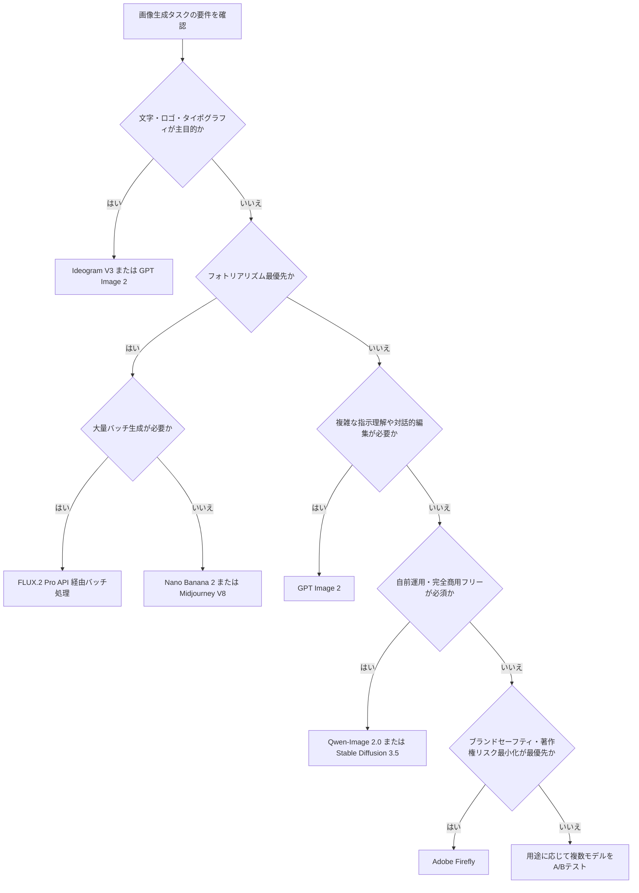

### 3.3 「マルチモデル・ルーティング」という実務パターン

<cite index="2-1">2026年にAI製品で成功する開発者は最強のモデルを1つ選ぶ人ではなく、タスクに応じて最適なモデルにルーティングできるモデル非依存のアーキテクチャを構築し、進化に合わせて柔軟に最適化し続ける人です</cite>。実装上は、以下のようなルーティング層を用意するのが定石です。

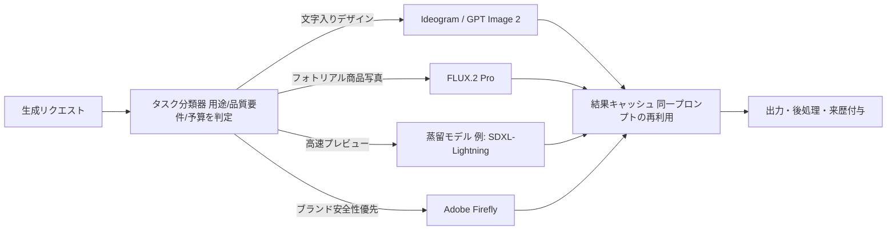

このパターンの利点は、単一ベンダーのAPI仕様変更・値上げ・提供終了（実際に2026年4月にDALL·Eが終了しGPT Image 2へ移行した例がありました）に対する耐性が高くなることです。

---

## 4. 画像生成プロンプトエンジニアリングのベストプラクティス

### 4.1 「マーケティングコピー」から「撮影指示書」への発想転換

最も重要な心構えの転換は、プロンプトを"魅力的な売り文句"として書くのをやめ、"撮影・編集の仕様書"として書くことです。<cite index="19-1">GPT Image 2は光源・レンズ・素材・何が変わってはいけないかを写真家やアートディレクターのように語ると精度良く応答しますが、「Stunning, cinematic, 8K, ultra-detailed」のような抽象的な誇張語は実質的にノイズとして無視されます</cite>。

<cite index="20-1">具体性を欠いた指示（例：「賑やかな街並み」）は雑然とした背景を生みがちなため、「被写界深度を浅く」「背景を大きくぼかしたソフトボケ」のような写真的な制約語を加えることで、主題と背景を明確に分離できます</cite>。

### 4.2 構造化プロンプトの基本フレーム（新規生成）

<cite index="17-1">OpenAIが公開したgpt-image系のプロンプティングガイドは、マーケティング的な美辞麗句ではなく、構造化されたプロンプト・明示的な不変条件・反復的な編集を重視する、仕様書に近い規律を提示しています</cite>。実務では次の5要素を明示的にプロンプトへ組み込むことを推奨します。

| 要素 | 内容 | 記述例 |
|---|---|---|
| 被写体 | 誰が・何が | 「夜明け前の市場で紅茶を注ぐ年配の茶売り」 |
| 環境・背景 | どこで、周囲に何があるか | 「湯気の立つやかん、ぼやけた野菜の屋台が背景に」 |
| カメラ・レンズ | 画角・被写界深度 | 「Fujifilm X100VI、自然なタングステン光」 |
| ライティング | 光源の種類・方向 | 「単一の吊り下げ作業灯からの光」 |
| スタイル・制約 | 何を避けるか | 「スタジオ照明なし、過度なレタッチなし、透かしなし」 |

<cite index="16-1">この最も重要なワークフロー習慣は、1要素だけを変えた3〜5個のバリエーションを作成することであり、これによって照明と構図のどちらが結果を改善したのかを切り分けられます</cite>。ランダムな試行錯誤ではなく、系統的な反復こそが専門性を育てます。

### 4.3 画像編集（Edit）のための「変更・維持・制約」パターン

対話的な画像編集では、次の3項目を毎回明示するパターンが定石です。<cite index="12-1">実務ではChange（変更点）・Preserve（顔・アイデンティティ・ポーズ・照明・構図・背景・ジオメトリ・文字・レイアウトなど維持すべき要素）・Constraints（余分な物体を追加しない、再デザインしない、ロゴをドリフトさせない、透かしを入れないなど）の3項目に分けて記述することが推奨されます</cite>。

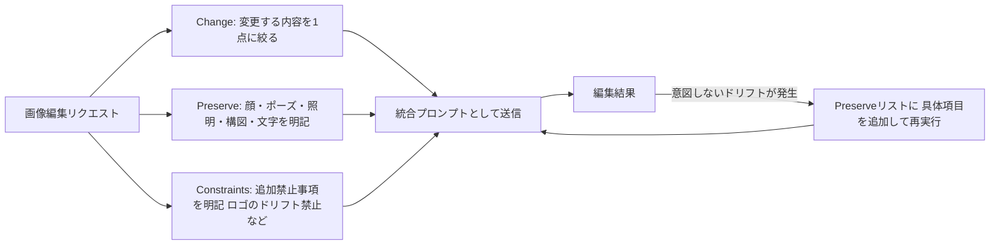

<cite index="13-1">複数回の編集を重ねるワークフローでは、反復のたびに「維持すべき不変条件」を明示的に再掲することが、ドリフト（意図しない変化の蓄積）を防ぐ鍵になります</cite>。参照画像を複数渡す場合は、<cite index="12-1">「画像1: 維持すべきベースシーン」「画像2: ジャケットの参照」「画像3: ブーツの参照」のように、各入力画像の役割にラベルを付けて指示の中で参照する</cite>とモデルの誤認識を防げます。

### 4.4 文字・タイポグラフィを正確に描画するコツ

<cite index="20-1">GPT Image系はタイポグラフィが得意ですが、注意しないとランダムな文字を追加することがあるため、正確な文言は必ずダブルクォートで囲み、厳密な配置指示と組み合わせるべきです</cite>。「ネオンサインを作って」ではなく「窓の上部中央に配置された、"Open"と表示される光るネオンサイン」のように具体化します。

### 4.5 ネガティブプロンプトが効かないモデルへの対処

<cite index="16-1">OpenAIの画像モデルには専用のネガティブプロンプト欄が存在しない</cite>ため、「〜を含めない」という否定形をConstraints欄に明示的に列挙する必要があります。一方、Stable Diffusion系やMidjourneyでは伝統的なネガティブプロンプト（`--no`構文や専用パラメータ）が引き続き有効です。モデルごとにネガティブプロンプトの扱いが異なる点はワークフロー設計上の重要な分岐点です。

### 4.6 UIモックアップ・インフォグラフィックなどの構造化ビジュアル

<cite index="13-1">UIモックアップは、その製品がすでに実在するかのように、レイアウト・階層・余白・実際のインターフェース要素を描写すると最も良い結果が得られ、コンセプトアート的な言い回しを避けることで、デザインスケッチではなく実際に出荷されたインターフェースのような仕上がりになります</cite>。

### 4.7 プロンプト管理のワークフロー

<cite index="16-1">プロンプトのバージョン管理には、スプレッドシートやNotionデータベース、Obsidianボールトのような構造化されたドキュメントを用い、何が効いて何が効かなかったかのメモや、改善のたびのプロンプトのバージョンを記録し、蓄積するたびに価値が増すクリエイティブ資産として扱うことが推奨されます</cite>。プロダクション環境では、これをプロンプトテンプレート＋変数注入の形でコードベースに落とし込み、A/Bテスト結果と紐づけて管理すると、モデル移行（例：gpt-image-1.5からgpt-image-2への移行）の際にも回帰テストが容易になります。

---

## 5. 制御性を高める技術：ControlNet・LoRA・ファインチューニング

プロンプトだけでは制御しきれない構図・ポーズ・ブランド固有のスタイルを扱う場合、拡散モデル系エコシステムには成熟した制御技術があります。

### 5.1 ControlNetの仕組み

<cite index="49-1">ControlNetは条件付き画像生成を実現する技術であり、既存のStable Diffusionなどのモデルに追加のネットワークとして接続し、参照画像から抽出した制御情報（エッジ・深度・ポーズなど）を基に画像生成を誘導することで、テキストプロンプトだけでは困難な構図・ポーズ・形状・エッジの具体的な制御を可能にします</cite>。

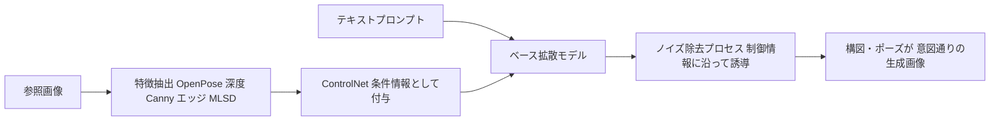

主要なControlNetモデルの使い分け：

| モデル | 抽出する情報 | 主な用途 |
|---|---|---|
| OpenPose | 人体の骨格・関節位置 | ポーズ指定、キャラクターの姿勢固定 |
| Canny / MLSD | エッジ・直線構造 | 建築物・プロダクトの構図固定 |
| Depth | 奥行き情報 | 立体感・空間配置の維持 |
| Tile | タイル状の高解像度情報 | アップスケーリング・高画質化 |
| Reference | 全体的な見た目の参照 | スタイル・色調の一貫性維持 |

### 5.2 LoRA（Low-Rank Adaptation）によるスタイル固定

<cite index="51-1">LoRAは既存のAIモデルに小さな部品（アダプター）だけを足して新しいスタイルやキャラクターを覚えさせる手法で、元のモデルはそのまま残し、その横に薄い「メモ帳」を挟むイメージであり、学習するパラメータ量が少なくGPU負荷も小さく、生成されるファイルも数MB〜数百MBと軽量です</cite>。<cite index="51-1">フルのファインチューニングの10%のコストで95%相当の性能を達成できるというデータも公開されています</cite>。

自社ブランドの世界観やキャラクターの一貫性が求められるプロダクトでは、以下のように制御手法を段階的に選択するのが実務的です。

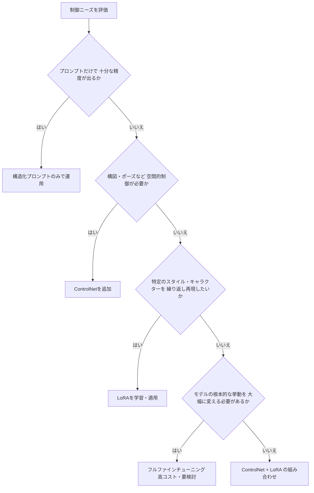

### 5.3 QLoRAと量子化によるコスト最適化

画像モデルに限らずLLM/マルチモーダルモデル全般で、<cite index="50-1">2026年時点では「QLoRA + Unsloth + DoRA」の組み合わせがコンシューマGPUでのファインチューニング実務標準になっています</cite>。自社データでのスタイル学習を検討する際は、フルパラメータ更新ではなくLoRA/QLoRAから着手し、効果が不十分な場合にのみフルファインチューニングを検討するのが費用対効果の高い進め方です。

> 実務上の注意：LoRAで学習した画風・キャラクターは、ベースモデルがバージョンアップされた際に互換性が失われることがあります。ベースモデルの更新頻度が高いクラウドAPI系（GPT Image、Nano Banana等）ではLoRAのような形の追加学習は提供されないことが多く、LoRAエコシステムは主にオープンウェイトモデル（Stable Diffusion、FLUX等）を自前運用する場合に有効な選択肢です。

---

## 6. 画像生成の評価とQAパイプライン

「良い画像かどうか」を定量化することは、モデル選定・A/Bテスト・回帰検知のいずれにおいても不可欠ですが、単一指標に依存すると評価と実感がずれるリスクがあります。

### 6.1 代表的な自動評価指標

| 指標 | 何を測るか | 値の解釈 | 限界 |
|---|---|---|---|
| FID（Fréchet Inception Distance） | <cite index="63-1">生成された画像と実データの特徴量分布の距離</cite> | <cite index="63-1">低いほど良い（実画像分布に近い）</cite> | <cite index="64-1">FIDの良さと人間が画像を本物らしいと判断するかどうかはあまり一致しないことが確認されています</cite> |
| IS（Inception Score） | 生成画像の多様性とクラス識別性 | 高いほど良い | 人間にとって本当にリアルかどうかは評価できない |
| CLIPScore | <cite index="67-1">テキストと生成画像の意味的な類似度</cite> | 高いほどテキストに忠実 | <cite index="66-1">CLIPが学習していない表現の評価が難しく、モデルの進化速度に対して指標がやや時代遅れになりつつあります</cite> |
| LPIPS | 知覚的な画像間の類似度 | 低いほど類似 | 主に画像編集・超解像タスクの評価向け |
| VLMベース評価（GPT-4V等） | 複雑な構図・文脈整合性の意味理解 | 定性的スコアリング | コストが高く、評価者側のバイアスも残る |

<cite index="68-1">私が実際に確認した例では、あるモデルが別のモデルより高いCLIP Scoreを達成したにもかかわらず、人間評価では明らかに後者が優秀と判定されるケースがあり、これは前者がCLIP空間での最適化を行っているためで、スコアと実際の品質が乖離する典型例です</cite>。

### 6.2 評価パイプラインの設計

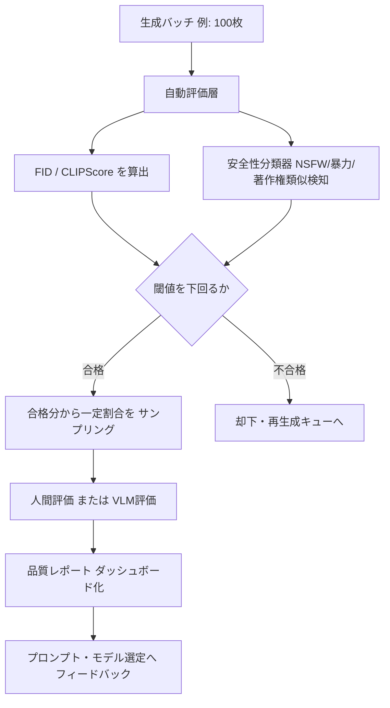

### 6.3 実務指針

- **単一指標に依存しない**：<cite index="68-1">定量指標の効率性と人間評価の感性を適切にバランスさせ、商用サービス・研究開発・アート制作など用途に最適化された指標の組み合わせを選ぶことが重要です</cite>。
- **人間評価のコスト最小化**：全数チェックではなく統計的サンプリング＋自動フィルタの組み合わせで、レビュー工数を現実的な範囲に抑えます。
- **プロンプト忠実度と美的品質は別軸で評価する**：CLIPScoreはプロンプト忠実度の代理指標であり、美的品質（構図・ライティング・ディテール）は別途VLMまたは人間評価で補完します。
- **著作権・商標類似性チェックを評価パイプラインに組み込む**：特に商用配信前には、既存の著名なキャラクター・ロゴ・アートワークとの類似性を検知するステップを安全性フィルタと並列で走らせることを推奨します。

---

## 7. 音声生成の技術基盤：TTSからネイティブ音声対話へ

### 7.1 音声生成技術の3世代

音声生成技術は大きく3つの世代に整理できます。

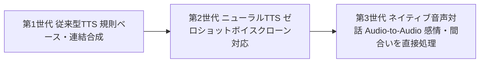

<cite index="60-1">従来の音声AIシステムは、音声認識（VAD→STT）・言語モデル推論・音声合成（TTS）という複数モデルを連結させる「待ち時間スタック」を持ち、AIが話し始める頃には人間はすでに話題を変えているという問題を抱えていました</cite>。第3世代のネイティブ音声対話モデルは、<cite index="60-1">この「文字起こし・推論・合成」というスタックを単一のネイティブ音声処理へ統合することでこの問題を解決します</cite>。

### 7.2 カスケード型 vs ネイティブAudio-to-Audio の詳細比較

<cite index="62-1">2026年4月時点で、半カスケード方式（ネイティブ音声入力処理とテキストベースの言語モデル推論・音声合成出力を組み合わせる方式）と、単一モデルが聞く・考える・話すをすべて1つのニューラルネットワーク内で行うネイティブ方式の2つのアプローチが存在します</cite>。

| 観点 | カスケード型（ASR→LLM→TTS） | ネイティブ Audio-to-Audio |
|---|---|---|
| レイテンシ | 各段の合計（積み上がる） | <cite index="62-1">1つのモデル内で完結するため理論上は低い</cite> |
| 感情・韻律の保持 | 変換のたびに失われやすい | 音声の特徴量を直接処理するため保持しやすい |
| コンポーネントの差し替え | 容易（STT/TTSを個別に最適化可能） | 困難（モデル全体がベンダーに依存） |
| 音声のカスタマイズ性 | 高い（専門TTSベンダーを選べる） | <cite index="62-1">限定的（統合TTS品質はElevenLabsなど専用モデルより劣ることが多い）</cite> |
| 代表モデル | Whisper＋LLM＋ElevenLabs等の組み合わせ | <cite index="62-1">Gemini 3.1 Flash Live, OpenAI Realtime API, Amazon Nova 2 Sonic</cite> |

### 7.3 実測レイテンシの目安（2026年4月時点）

<cite index="62-1">Time to First Token（発話終了からエージェント発話開始までの時間）は、xAI Grok Voice Agentが約0.78秒で最速、OpenAI gpt-realtime-1.5が約0.82秒、Amazon Nova 2 Sonicが約1.14秒、Gemini 3.1 Flash Liveが約2.98秒（Google自身の「リアルタイム」訴求より実測では遅い）という報告があり、人間の会話における応答レイテンシは平均約200ミリ秒とされています</cite>。この数値は測定条件や利用シーンによって変動するため、自社ワークロードでの実測が不可欠です。

> 実務上の注意：ベンダーのマーケティング上のレイテンシ訴求と、サードパーティによる実測ベンチマークには乖離が生じることがあります。SLAが必要な用途では必ず自社トラフィックパターンでの実測を行ってください。

---

## 8. 音声合成（TTS）モデルの選定（2026年7月版）

### 8.1 クラウドAPI主要モデル比較

| モデル | 提供元 | 強み | レイテンシ | 主な弱み |
|---|---|---|---|---|
| Eleven v3 | ElevenLabs | <cite index="23-1">感情表現に優れ、[whispers]・[laughs]・[excited]などのインラインオーディオタグに対応。長尺コンテンツ・オーディオブック向け</cite> | 標準的 | コストが比較的高い |
| Flash v2.5 | ElevenLabs | <cite index="23-1">32言語対応、エンドツーエンドで500ミリ秒未満の低遅延</cite> | <cite index="22-1">推論レイテンシ約75ミリ秒</cite> | 表現力はv3よりやや控えめ |
| gpt-4o-mini-tts | OpenAI | <cite index="22-1">テキストプロンプトで音声のトーン・感情・アクセント・速度を自由に制御可能</cite> | 低コスト・高速 | マルチスピーカー非対応 |
| Gemini TTS / Chirp3 HD | Google | ドラマティックな感情表現、SSML対応 | 標準的 | <cite index="21-1">チャンク分割後にトーンが揺れる場合がある</cite> |
| Cartesia Sonic | Cartesia | <cite index="28-1">40ミリ秒のTime-to-First-Audio、エンタープライズ向け自前ホスティング対応</cite> | 最速クラス | 日本語以外の言語での実績が中心 |
| Fish Audio | Fish Audio | 80以上の言語、50以上の感情制御、クロスリンガルなボイスクローン | 標準的 | ブランド認知度がまだ低い |

### 8.2 日本語特化・オープンソースモデル

| モデル | ライセンス | 特徴 |
|---|---|---|
| Style-BERT-VITS2 | オープンソース | <cite index="26-1">日本語品質で最高評価を獲得、ローカル実行でデータを外部送信しない</cite> |
| AivisSpeech | オープンソース | 感情豊かな日本語音声、GPU不要構成も可能 |
| VOICEVOX | オープンソース・キャラクターごとに規約あり | 完全無料、キャラクターボイス、YouTubeナレーションで広く利用 |
| Qwen3-TTS | Apache 2.0 | <cite index="26-1">ボイスクローンと10言語対応で急速にシェアを拡大</cite> |

### 8.3 選定フローチャート

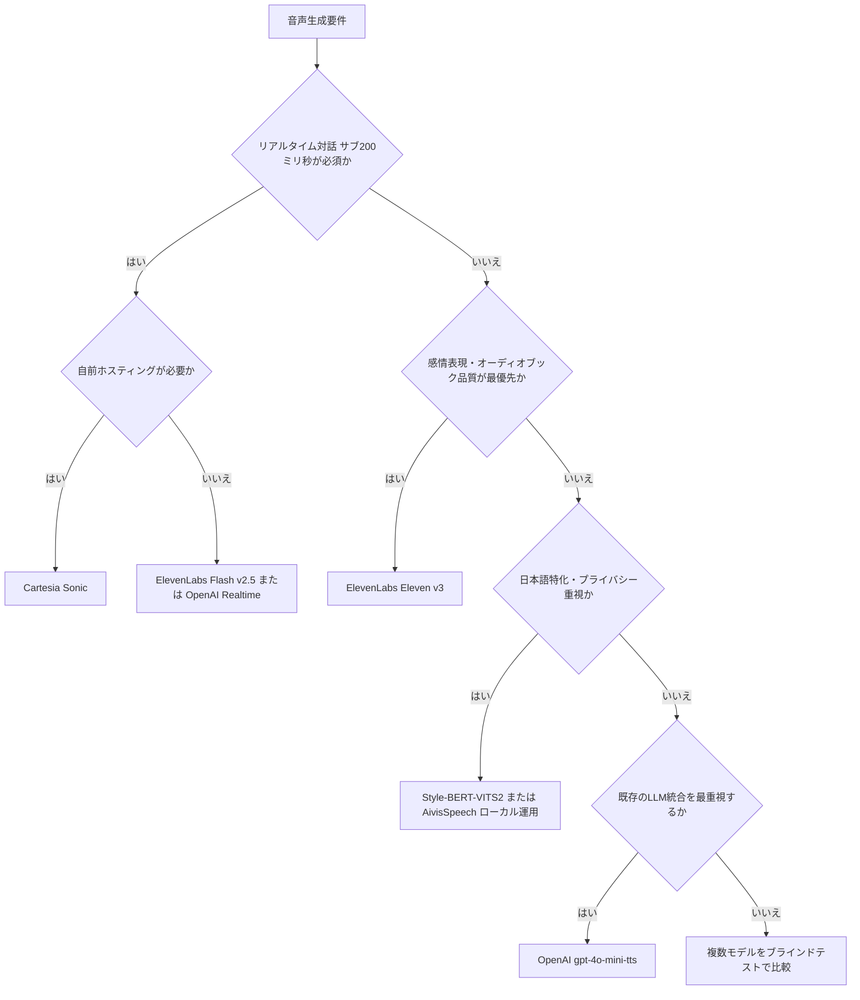

### 8.4 コストと日本語品質のトレードオフ

<cite index="26-1">クラウドAPIの日本語品質スコアは4サービスとも90点前後の僅差に収まる一方、ローカルOSSではStyle-BERT-VITS2とAivisSpeechが最高評価を獲得しています</cite>。<cite index="26-1">料金面では、ローカルOSSはGPU初期投資のみで追加課金ゼロ、クラウドAPIはOpenAIのgpt-4o-mini-ttsが低コストという構図になっており、月間の生成規模と品質要件のバランスで最適解が変わります</cite>。プライバシー要件が厳しい医療・法務系の用途では、外部送信を避けられるローカルOSSモデルが第一候補になります。

---

## 9. 音声生成のベストプラクティス

### 9.1 「何を音声にするか」より「どう読ませるか」

<cite index="21-1">TTSのAPIを叩くこと自体はそれほど難しくなく、本質的に難しいのは「何を音声にするか」と「どう読ませるか」です</cite>。テキストをそのまま流し込むのではなく、以下のような演出情報を明示的に設計に組み込む必要があります。

- **オーディオタグによる感情制御**：<cite index="23-1">[whispers]、[laughs]、[excited]のようなインラインオーディオタグを台本中に埋め込むことで、長尺コンテンツやドラマチックなボイスオーバーの表現力を制御できます</cite>。
- **Voice Direction（演出指示）**：抽象的な指示（「感情を込めて」）ではなく、「困惑した様子で、語尾を少し伸ばしながら」のような具体的な演出指示を与えることで、意図した抑揚に近づきます。
- **自然言語によるスタイル制御**：<cite index="22-1">gpt-4o-mini-ttsは、従来のtts-1/tts-1-hdモデルとは異なり、テキストプロンプトで音声のトーン・感情・アクセント・速度を自由に制御できます</cite>。

### 9.2 長文音声生成におけるチャンク分割とトーンの一貫性

長文をそのまま一括生成すると音質が不安定になりやすいため、実務では文章をチャンク（分割単位）に分けて逐次生成し、後で結合する手法が一般的です。しかし、これには固有の課題があります。

<cite index="21-1">チャンク分割後にElevenLabsは声のトーンが一貫していてつなぎ目の違和感がほとんどない一方、Gemini TTSではチャンク間でトーンが揺れる問題が顕著な差として現れることがあります</cite>。

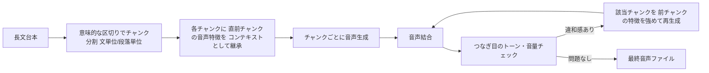

**実務上の対策**：チャンクの切れ目は文の途中ではなく、句点や段落の境界に合わせる。可能であれば「前のチャンクの音声を参照情報として次のチャンクの生成に渡す」機能を持つAPI（コンテキスト継承対応のモデル）を優先的に選定する。

### 9.3 SSML（Speech Synthesis Markup Language）の活用

Google Cloud TTSやAmazon Pollyなど一部のクラウドサービスはSSMLに対応しており、`<break time="500ms"/>` による間の制御、`<emphasis>` による強調、`<prosody rate="slow">` による速度制御など、プレーンテキストでは表現できない細かな演出が可能です。ネイティブ音声対話モデル（Gemini Live、GPT Realtime等）はSSMLではなく自然言語の指示（システムプロンプト）でスタイルを制御する設計思想に移行しつつある点は、実装時に混同しないよう注意が必要です。

### 9.4 音声クローンの倫理・同意管理

音声クローン技術は非常に強力な反面、なりすまし・詐欺・肖像権侵害のリスクを併せ持ちます。実務では以下を最低限のガードレールとして組み込むべきです。

- **本人の明示的な同意の取得と記録**：クローン対象者から書面または録音による同意を取得し、利用範囲（内部利用のみ／商用公開／広告掲載）を事前に合意する。
- **認証プロセスを備えたプラットフォームの利用**：<cite index="30-1">ElevenLabsやMicrosoft Custom Neural Voiceは本人認証プロセスを提供しており、これらを活用することが安全とされています。無断でのクローンは肖像権・パブリシティ権の侵害となるため避けるべきとされています</cite>。
- **音声ウォーターマークの付与**：<cite index="34-1">OpenAIはVoice Engineにおいて音声ウォーターマークを導入し、精度と信頼性に関する検証と研究を継続しています</cite>。自社で音声クローン機能を提供する場合、生成音声への来歴情報の埋め込みを検討してください。
- **なりすまし検知フローの整備**：カスタマーサポート等の重要な意思決定に音声認証を用いている場合、AI音声クローンによる突破を想定した多要素認証の併用を推奨します。

---

## 10. リアルタイム音声対話エージェントの設計

### 10.1 接続方式の選択：WebSocket / WebRTC / SIP

<cite index="58-1">WebSocketはサーバーとAPI間に永続的な接続を確立するプロトコルで、通常のHTTPが毎回接続を開閉するのに対し、会話全体の間チャンネルを開いたままにし、ユーザーの音声とモデルの音声という2つのストリームが同時に流れます。Node.jsやPythonのバックエンドで音声をサーバー側で処理するアーキテクチャに向いています</cite>。電話システムとの統合が必要な場合はSIP、ブラウザから直接低遅延で接続する場合はWebRTCが適しています。

### 10.2 Gemini Live API と GPT Realtime API の比較

| 観点 | Gemini 3.1 Flash Live | GPT Realtime（gpt-realtime-1.5 / 2） |
|---|---|---|
| アーキテクチャ | <cite index="58-1">Gemini 3 Proをベースにしたネイティブマルチモーダルモデルで、音声・映像・画像・テキストを同時に受け付ける</cite> | <cite index="58-1">音声専用（Audio-to-Audio）でありながら強力な推論能力を持つ</cite> |
| 映像入力 | <cite index="58-1">対応（ユーザーの画面や映像ストリームを見ながら会話できる）</cite> | 非対応 |
| 言語対応 | <cite index="57-1">200以上の言語をサポート</cite> | 対応言語はGeminiよりやや狭い |
| ツール呼び出しの信頼性 | <cite index="57-1">ComplexFuncBench Audioで90.8%を記録し、構造化・決定論的なツールチェーンに強い</cite> | <cite index="57-1">オープンエンドな推論チェーン（調査→要約→メール作成のような連鎖）に強い</cite> |
| MCP対応 | <cite index="57-1">ロードマップ上にあるが、2026年3月時点ではネイティブ対応なし</cite> | <cite index="57-1">ネイティブMCP対応済み</cite> |
| 電話（SIP）統合 | 限定的 | <cite index="57-1">ネイティブSIPダイヤル対応</cite> |
| コスト | <cite index="58-1">桁違いに安価</cite> | <cite index="58-1">複雑なエージェントシナリオ・長時間セッション（60分）で強み</cite> |

<cite index="57-1">Web起点のエージェントを新規構築する場合はまずGeminiで組み、電話統合やMCPツールサーバーが必要になった段階でOpenAIを追加する、というマルチプロバイダー構成が2026年の実務では現実的な出発点です</cite>。

### 10.3 レイテンシ予算の設計

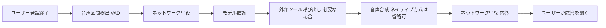

<cite index="62-1">Word Error Rate（WER）は文字起こしの誤認識率を測る指標であり、Time to First Token（TTFT）は発話終了からエージェント発話開始までの時間を測る指標です。両者を継続的に計測し、SLA違反の兆候を早期検知する体制が重要です</cite>。統合TTSの音質は専門TTSモデルに劣ることが多いため、音声品質を最優先する用途では、ネイティブAudio-to-Audioモデルの音声出力部分だけを専門TTS（ElevenLabs Conversational AI等）に差し替えるハイブリッド構成も検討に値します。

### 10.4 バージイン（割り込み）対応

<cite index="56-1">Proactive Audio（能動的な発話判断）は単純な音声区間検出（VAD）を超えた機能で、エージェントがいつ応答すべきか、いつ静かな聞き手であり続けるべきかを賢く判断できるよう設定でき、受動的な傾聴が求められる場面での不要な割り込みを防ぎます</cite>。ノイズの多い環境（工事現場・車内・イベント会場など）での運用を想定する場合は、この能動的判断機能の有無をモデル選定の評価軸に加えてください。

---

## 11. 音楽生成AIのベストプラクティスと著作権

### 11.1 主要プラットフォームの使い分け

| ツール | 強み | 商用利用時の留意点 |
|---|---|---|
| Suno | <cite index="41-1">歌モノ生成に万能、日本語歌詞対応</cite> | <cite index="44-1">Sony Musicとの訴訟が2026年6月時点で継続中。大規模商用案件では法務確認を推奨</cite> |
| Udio | <cite index="41-1">オーディオ品質で高評価</cite> | <cite index="37-1">2025〜2026年のライセンス移行期間中、ダウンロード機能が一時的に制限される場合がある</cite> |
| AIVA | <cite index="41-1">クラシック・オーケストラ、映画音楽に強くMIDI出力対応</cite> | 生成楽曲の著作権がユーザーに完全帰属し商業案件で安心感が高い |
| Soundraw | <cite index="41-1">ロイヤリティフリーで安心、YouTube向けBGMに最適</cite> | <cite index="39-1">オリジナル音源のみを学習データに使用しているため収益化トラブルが起きにくい構造</cite> |
| Stable Audio | ライセンス済みデータで学習 | API提供済みで開発者組み込みに現実的 |

### 11.2 著作権をめぐる2026年時点の状況

<cite index="44-1">2024年6月、全米レコード協会（RIAA）がUMG・Sony Music・Warner Music Groupの3大レーベルを代理し、AIモデルの学習データへの無断使用を争点にSunoとUdioを提訴しました</cite>。<cite index="38-1">その後「訴訟→和解→ライセンス契約」という流れが生まれ、WMGとSuno・Udioの提携がAI音楽正規化の最初の成功モデルとなっています</cite>。一方で、<cite index="44-1">Sony Musicとの訴訟は2026年6月時点でも継続中であり、判決次第でサービス内容・ポリシーが変わる可能性があります</cite>。

日本国内では、<cite index="37-1">JASRACが著作権法30条の4（情報解析目的の利用を適法とする規定）の見直しを文化庁へ要望しており、クリエイターが安心して創作に専念できる環境の確保を前提に、より厳格な要件の導入を求めています</cite>。

### 11.3 商用利用における実務チェックリスト

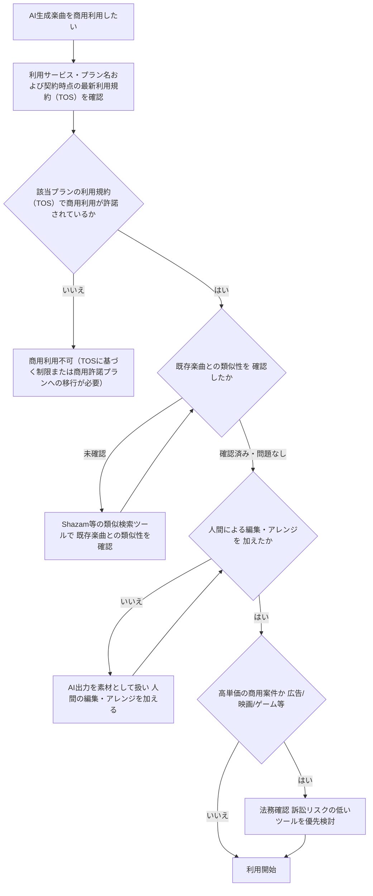

<cite index="42-1">実務上のリスクとして、AI生成曲が既存楽曲と偶然似てしまう可能性があるため、商用利用する場合はAI生成部分をそのまま使わず自分で編集・アレンジを加えることが強く推奨されます。AIを最終的な楽曲としてではなく「アイデアの種」「素材の一部」として活用し、最終的な楽曲は人間のクリエイティビティで仕上げるという姿勢が、現時点で最も安全かつクリエイティブなAI活用法です</cite>。

---

## 12. マルチモーダル統合アーキテクチャパターン

### 12.1 ネイティブAny-to-Anyモデルという選択肢

Gemini 3.1系やGPT-4o系のように、テキスト・画像・音声・動画を単一モデルで理解し出力できる「ネイティブAny-to-Any」モデルが実用段階に入っています。<cite index="56-1">音声・映像・テキストを組み合わせた「Multimodal Understanding」により、エージェントは顧客が見せている商品の状態を視覚的に確認しながら、同時に発話のトーンから不満や困惑を検知し、共感的な応答を返すといった統合的な対応が可能になります</cite>。

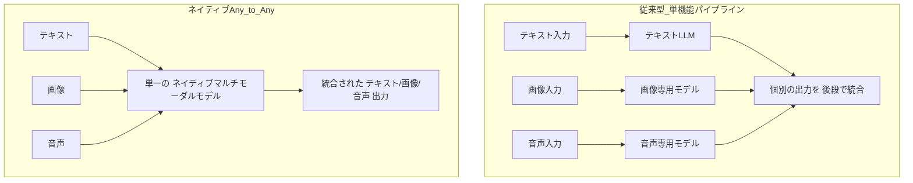

**トレードオフ**：ネイティブAny-to-Anyは統合の一貫性・レイテンシで優位ですが、個々のモダリティの専門特化度（画像ならFLUX、音声ならElevenLabsのような専用モデル）には及ばないことが多いのが2026年7月時点の実情です。「統合体験の一貫性」と「各モダリティでの最高品質」のどちらを優先するかは、プロダクトの提供価値によって判断が分かれます。

### 12.2 エージェント/MCPによるマルチモーダルツール連携

Claude・GPT・Geminiのようなオーケストレーター役のLLMが、画像生成・音声合成・音楽生成といった専門モデルをツールとして呼び出す構成は、2026年時点で最も実務的なマルチモーダル統合パターンです。Model Context Protocol（MCP）を用いることで、ツールの追加・差し替えが疎結合に行えます。

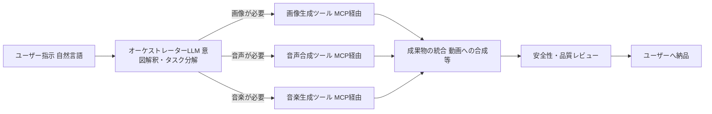

このパターンの利点は、モデル間のベンダーロックインを避けつつ、オーケストレーター側で予算・レイテンシ・品質要件に応じたルーティング判断を一元管理できる点です。

### 12.3 マルチモーダルRAG（検索拡張生成）

画像・音声を含むナレッジベースを検索対象に含める場合、テキスト埋め込みだけでなく画像埋め込み（CLIP系エンコーダ）・音声埋め込みを組み合わせたハイブリッド検索基盤が必要になります。実務での典型パターンは、画像・音声メタデータ（キャプション、文字起こし）をテキスト化してテキスト検索インデックスに統合しつつ、埋め込みベースの類似検索を並列で走らせ、両者のスコアを統合するハイブリッドリランキングです。マルチモーダルRAGは、生成AIが根拠として参照した画像・音声のソースを明示できるため、コンテンツ来歴の観点でも有利に働きます。

---

## 13. 安全性・コンテンツ来歴・法規制

### 13.1 C2PAとSynthIDの二層アーキテクチャ

<cite index="34-1">C2PAとSynthIDという2つの仕組みは相互に補完し合っており、C2PAはコンテンツに詳細な文脈情報を付与し、SynthIDはメタデータが保持されない場合でもシグナルを残す役割を果たします。ウォーターマークはスクリーンショットのような変換にも比較的強く、メタデータはウォーターマーク単体より多くの情報を提供できるため、両者を組み合わせることで来歴情報の耐久性を高められます</cite>。

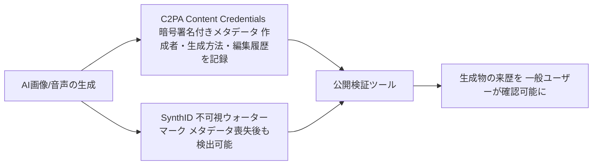

<cite index="35-1">OpenAIはサポートされた生成メディアにC2PAメタデータを追加し、2026年5月にSynthIDと組み合わせた多層的なアプローチを発表しました。Googleは画像・動画・音声のSynthID検証がGeminiで稼働しており、Search・Chromeへの拡大も進めています</cite>。

<cite index="32-1">C2PA（Coalition for Content Provenance and Authenticity）は2021年2月にAdobe・Arm・BBC・Intel・Microsoft・Truepicが設立したオープン標準であり、OpenAIは2026年5月にステアリングコミッティに参加しました</cite>。一方で、<cite index="33-1">SynthIDはGoogleのモデルで生成されたコンテンツにのみ適用され、Stable Diffusion・Midjourney・DALL-Eなど他社モデルで生成された画像は検出対象外であるため、業界全体で機能する標準規格としてC2PAが必要とされています</cite>。

### 13.2 検出技術の限界を理解する

<cite index="36-1">AIコンテンツ検出は、署名付き来歴証明（C2PA）・SynthIDのような視覚的ウォーターマーク・EXIFなどのメタデータフォレンジック・統計的パターンを識別する訓練済み分類器という4つの重なり合う技術層で構成され、各層に精度の上限があり、現行の一般向け検出ツールは実写真に対して5〜15%の偽陽性率を伴いながら70〜90%の真陽性率で稼働しています</cite>。この数値が示す通り、電子透かし・来歴証明は「絶対的な証拠」ではなく「確率的なシグナル」として扱うべきです。

### 13.3 法規制の動向

| 規制・ガイドライン | 適用範囲 | 内容 |
|---|---|---|
| EU AI Act 第50条 | EU域内（域外適用あり。AIシステムの提供者および一部のデプロイヤー） | 2026年8月2日から適用され、AI生成のテキスト、画像、音声、動画に機械可読な形式での表示が義務付けられます。ただし、2026年8月2日以前に市場投入されたシステムは2026年12月2日までの経過措置が適用されます。[58](#ref-58)[59](#ref-59) |
| 日本 AI事業者ガイドライン | 日本国内（努力義務） | <cite index="33-1">AI生成コンテンツであることの表示を推奨する努力義務であり、ディープフェイクによる権利侵害への対策を事業者に要請しています</cite> |
| 米国著作権局の方針 | 米国 | <cite index="6-1">AIが自律的に生成した画像は著作権保護の対象外と判断されています</cite> |

グローバルに展開するプロダクトでは、EU AI Act第50条のような域外適用のある規制を起点に、最も厳しい基準に合わせてコンテンツ来歴の実装を行うのが合理的です。

**EU AI Act第50条（透明性義務）の詳細**
- **対象コンテンツ**: AIによって生成・変更されたテキスト、画像、音声、動画（ディープフェイクを含む）。
- **対象主体**: AIシステムの提供者（Providers）および一部のデプロイヤー（Deployers、特にディープフェイクの制作者）。
- **例外**: 表現の自由、芸術、パロディ（適切な形式でAI生成物であることを開示する場合）、または公的機関による犯罪捜査・公共安全活動での利用など。
- **経過措置**:
  - 一般的な適用開始日は **2026年8月2日**。
  - **2026年8月2日以前に市場投入されたAIシステム**については、経過措置として **2026年12月2日** まで（一部の汎用AIモデル義務は適用開始日から最大36ヶ月の猶予があるが、透明性義務については2026年12月2日まで）に表示対応を完了させる扱いとなります。
- **根拠**: [EUR-Lex公式法令 (Regulation (EU) 2024/1689)](https://eur-lex.europa.eu/legal-content/EN/TXT/?uri=CELEX:32024R1689) および [欧州委員会 FAQ on the AI Act](https://digital-strategy.ec.europa.eu/en/policies/regulatory-framework-ai)

### 13.4 コンテンツモデレーションの実装

<cite index="15-1">画像生成APIでは、モデレーションがブロックされた場合、入力段階でのブロックかユーザーにプロンプトの修正を促すべきか、出力段階でのブロックか（生成結果自体の安全性ブロックとして区別してログに残すべきか）を明確に分岐させる実装が推奨されます。エラーコードが「moderation_blocked」であるかをまず確認し、moderation_detailsは補助的なコンテキストとして扱うべきです</cite>。<cite index="15-1">一時的な失敗（429エラーやサーバーエラー）はリトライが適切ですが、リクエスト内容の修正が必要なユーザーエラーに対してリトライを行うべきではありません</cite>。

### 13.5 ディープフェイク対策の実務チェックリスト

- 生成・編集APIの入力段階で、実在の公人・著名人の画像/音声を用いた合成物を検知するフィルタを設置する
- 音声クローン機能を提供する場合は、なりすまし目的での悪用を防ぐため本人認証プロセスを必須化する
- C2PA/SynthIDなどの来歴情報を可能な限り全ての生成物に付与し、検証手段をユーザーに提供する
- 選挙・公衆衛生など社会的影響の大きいトピックに関する生成物には、追加的な人間レビューのステップを設ける

---

## 14. プロダクション運用のベストプラクティス

### 14.1 品質とレイテンシ・コストのトレードオフ設計

<cite index="11-1">gpt-image-2の低品質設定はレイテンシに敏感なユースケースに特に有効であり、中・高品質設定は最大限の忠実度が求められる場合に適しています</cite>。プロダクションでは、用途ごとに品質パラメータを固定するのではなく、以下のような段階的な生成戦略が有効です。

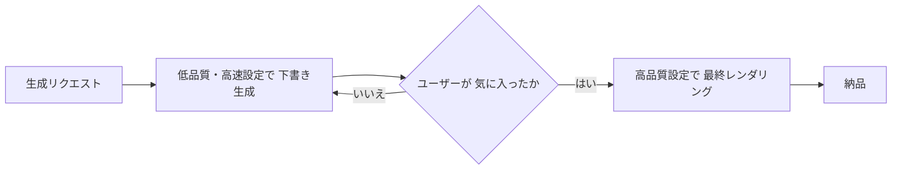

このパターンにより、ユーザーが何度も試行錯誤する初期段階のコストを抑えつつ、最終成果物の品質は担保できます。

### 14.2 キャッシングとバッチ処理

- **プロンプトキャッシング**：同一または類似のプロンプト・シード値の組み合わせに対しては生成結果をキャッシュし、重複生成を避ける。
- **バッチAPIの活用**：即時性が不要な大量生成（カタログ画像の一括生成等）では、バッチ処理APIを用いることでコストを抑えられる場合が多い。
- **モデルルーティング層でのキャッシュ共有**：第3章で示したルーティングアーキテクチャにおいて、キャッシュ層をモデル横断で共有することで、モデル切り替え時にも再利用可能な結果を活かせる。

### 14.3 モニタリングと評価ループ

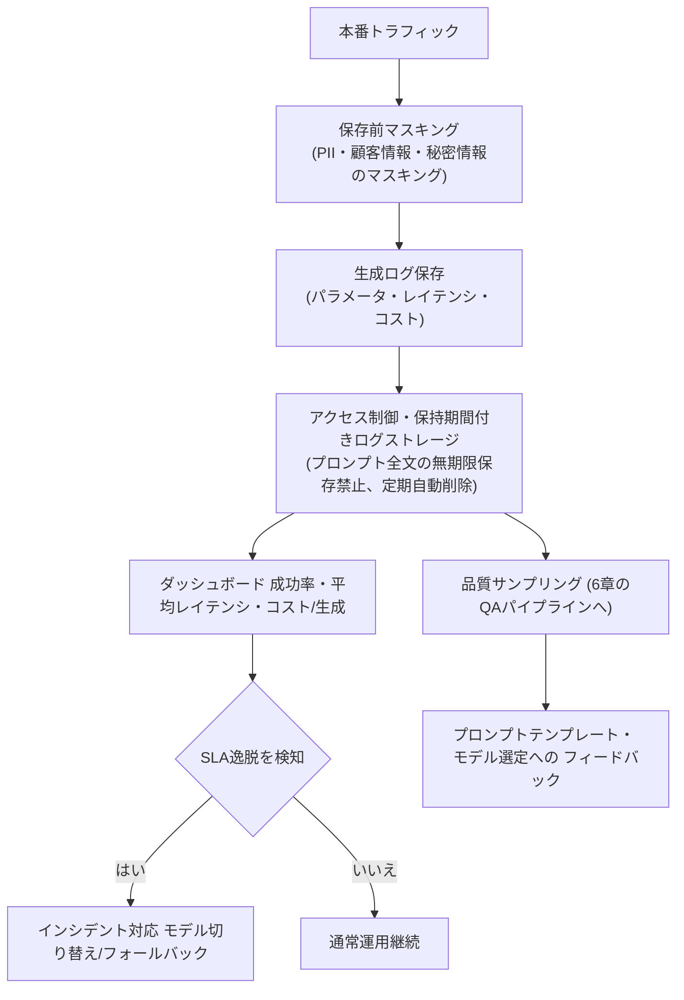

**生成ログの秘匿化とライフサイクル管理方針**
- **保存前のマスキング**: ユーザープロンプトや生成データに含まれうる個人情報（PII）、顧客情報、秘密情報は、ログ保存前に検知しマスキングまたは除外します。
- **全文の保存制限**: デバッグや評価に必要な場合を除き、プロンプト全文を無期限かつ無制限に保存しない方針を適用します。
- **ライフサイクルとアクセス制御**: 暗号化されたセキュアなログストレージにアクセス制御（IAM）を設定し、保存期間（例：30日間）を明確に定め、期間経過後は不要ログを自動削除する手順を実装します。

### 14.4 エラーハンドリングとフォールバック

音声・画像生成APIは、プロンプト起因のエラー（コンテンツポリシー違反など）とインフラ起因のエラー（レート制限、サーバーエラー）を明確に区別してハンドリングする必要があります。<cite index="15-1">同じエラーハンドリングパターンは画像生成リクエスト・画像編集・Responses APIのツール呼び出しのいずれにも適用され、リクエストIDをログに残しエラーコードガイドを参照することが推奨されます</cite>。

プロダクションでは、第一候補モデルが利用不可・レート制限に達した場合に自動的に第二候補モデルへフォールバックする冗長構成を組んでおくことで、単一ベンダー障害時の可用性を担保できます（第3章のマルチモデル・ルーティングパターンと同じ設計思想です）。

### 14.5 コスト管理の実務ポイント

- 料金体系（従量課金 vs 月額固定）はサービスごとに大きく異なるため、月間生成量の見込みから損益分岐点を試算した上でプラン選定を行う
- 画像・音声とも「無料」と「商用利用可能」は別の概念であり、契約前に必ず両方を確認する
- 為替・料金改定の影響を受けやすい領域のため、コスト試算は定期的に見直す運用フローを組み込む

---

## 15. まとめ：意思決定チェックリスト

本ガイドの内容を、実装前の意思決定チェックリストとして凝縮します。

### 画像生成

- [ ] 用途（文字入りデザイン／フォトリアル／大量バッチ／自前運用）に応じてモデルを選定したか（3章）
- [ ] 単一モデルではなく、タスク分類器によるルーティングアーキテクチャを検討したか（3.3節）
- [ ] プロンプトを「撮影指示書」として構造化し、Change/Preserve/Constraintsパターンで編集を行っているか（4章）
- [ ] 構図・ポーズ・ブランドスタイルの固定にControlNet/LoRAの活用余地がないか検討したか（5章）
- [ ] FID/CLIPScoreのような自動指標だけでなく人間評価・VLM評価を組み合わせたか（6章）

### 音声・音楽生成

- [ ] リアルタイム性が必要かどうかでカスケード型／ネイティブAudio-to-Audioを選び分けたか（7章）
- [ ] 用途（感情表現／低遅延／日本語特化／プライバシー）に応じてTTSモデルを選定したか（8章）
- [ ] 長文生成のチャンク分割によるトーンの揺れ対策を実装したか（9章）
- [ ] 音声クローンを使う場合、本人同意と認証プロセスを組み込んだか（9.4節）
- [ ] 音楽生成AIの商用利用条件・著作権訴訟の最新状況を確認したか（11章）

### 全体アーキテクチャ・安全性・運用

- [ ] マルチモーダル統合において、Any-to-Anyネイティブモデルとエージェント/MCP連携のどちらが適するか判断したか（12章）
- [ ] C2PA・SynthIDなどのコンテンツ来歴を生成物に付与しているか（13章）
- [ ] EU AI Act第50条・日本のAI事業者ガイドラインなど、対象市場の規制要件を満たしているか（13.3節）
- [ ] モデレーション・エラーハンドリングを入力/出力段階で明確に区別して実装したか（13.4節）
- [ ] 品質・レイテンシ・コストのトレードオフを段階的生成戦略で最適化しているか（14章）

---

## 16. 参考文献・引用URL一覧

以下は本ガイドの作成にあたって参照した情報源です。分野ごとに整理しています。各サービスの料金・仕様は変更が非常に速いため、実装・契約前に必ず最新のページを確認してください。

### 画像生成モデル・比較

- [1] OpenAI Terms of Use — https://openai.com/policies/terms-of-use/
- [2] 火山エンジン（Volcengine）サービス利用規約 — https://www.volcengine.com/terms
- [30] Google Terms of Service — https://policies.google.com/terms
- [60] Qwen-Image License (Alibaba Cloud / GitHub) — https://github.com/QwenLM/Qwen-Image/blob/main/LICENSE
- 画像生成AIの最新モデル６選（爆速開発部）: https://apptime.co.jp/media/%E7%94%BB%E5%83%8F%E7%94%9F%E6%88%90ai%E6%AF%94%E8%BC%832026%EF%BD%9C%E6%9C%80%E6%96%B0%E3%83%A2%E3%83%87%E3%83%AB6%E9%81%B8%E3%82%92%E5%BE%B9%E5%BA%95%E6%AF%94%E8%BC%83
- 2026年版：AI画像生成APIベストガイド（Atlas Cloud Blog）: https://www.atlascloud.ai/ja/blog/guides/best-ai-image-generation-apis-in-2026-complete-developer-guide
- 画像生成AI徹底比較（2026年6月最新）: https://genai-ai.co.jp/ai-kanri/blog/cc-image-gen-ai-compare/
- 画像生成AI比較｜Claude Codeユーザーが解説: https://genai-ai.co.jp/ai-kanri/blog/cc-image-generation-ai-comparison/
- 実出力比較：GPT-image-2 / Nano Banana 2 / Midjourney v8.1 / FLUX.2: https://smoothiestudio.co.jp/en/ai-video/column/ai-image-generator-guide
- AI画像生成ツール比較（MatrixFlow）: https://www.matrixflow.net/case-study/134/
- 画像生成AIおすすめランキング2026（romptn Magazine）: https://romptn.com/article/106698
- 画像生成AIツール比較｜主要8選: https://arte.itlibra.com/ja/articles/best-image-generation-ai-tools-2026
- 画像生成AIおすすめ比較（Claude Codeでの業務活用法）: https://genai-ai.co.jp/ai-kanri/blog/cc-image-gen-ai-comparison-2/
- 画像生成AIおすすめ比較（業務活用の最適解）: https://genai-ai.co.jp/ai-kanri/blog/cc-image-gen-ai-comparison-3/

### 画像生成プロンプトエンジニアリング（一次情報）

- GPT Image Generation Models Prompting Guide（OpenAI Cookbook）: https://developers.openai.com/cookbook/examples/multimodal/image-gen-models-prompting-guide
- GPT Image 2 Prompting Guide and Examples（fal）: https://fal.ai/learn/tools/prompting-gpt-image-2
- Gpt-image-1.5 Prompting Guide（OpenAI Cookbook）: https://developers.openai.com/cookbook/examples/multimodal/image-gen-1.5-prompting_guide
- Image generation（OpenAI API公式ドキュメント）: https://platform.openai.com/docs/guides/image-generation
- Best practices for prompt engineering with the OpenAI API（OpenAI Help Center）: https://help.openai.com/en/articles/6654000-best-practices-for-prompt-engineering-with-the-openai-api
- The Ultimate OpenAI (ChatGPT) Image Prompting Guide: https://www.freshtechtips.com/2026/05/openai-chatgpt-image-prompting-guide.html
- Prompting gpt-image-2 like a pro: https://www.i-scoop.eu/prompting-gpt-image-2-like-a-pro-guide/
- ChatGPT Images 2.0 API Prompting Guide（Medium）: https://medium.com/@amrstech/chatgpt-images-2-0-api-prompting-guide-47fbe5aeee3a
- GPT Image 2 Prompt Guide: Examples, Testing and How to Use: https://gptimg2ai.com/blogs/gpt-image-2-prompt-guide

### ControlNet・LoRA・ファインチューニング

- ControlNet完全ガイド: https://techotakulab.com/controlnet-guide-pose-composition-2026/
- Stable Diffusion Forge「LoRA」の使い方: https://ururuailab.com/sd-forge-lora-settings/
- LoRA（namaraii.com）: https://namaraii.com/notes/LoRA
- LoRA/QLoRA完全実装ガイド2026（renue）: https://renue.co.jp/posts/lora-qlora-peft-finetuning-implementation-guide-2026
- LoRAとは？画像生成を変える追加学習を初心者向けに解説: https://aipicks.jp/mag/lora-stable-diffusion-2026

### 画像生成の評価指標

- 【０から学ぶAI】第191回：画像生成の評価指標: https://service.ai-prompt.jp/article/ai365-191/
- クラウドソーシングを使った画像生成の評価（CVPR2023紹介）: https://cyberagent.ai/blog/research/computervision/18702/
- 画像生成モデルの比較（Zenn）: https://zenn.dev/d2c_mtech_blog/articles/76d4f03a78e098
- CyberAgentより、画像生成タスクにおける新たな評価指標の提案: https://note.com/te_ftef/n/nd7f2d7547c22
- 画像生成モデルのメジャーな評価指標: https://scrapbox.io/shoji-lab-survey/%E7%94%BB%E5%83%8F%E7%94%9F%E6%88%90%E3%83%A2%E3%83%87%E3%83%AB%E3%81%AE%E3%83%A1%E3%82%B8%E3%83%A3%E3%83%BC%E3%81%AA%E8%A9%95%E4%BE%A1%E6%8C%87%E6%A8%99
- 画像生成モデル評価手法完全ガイド（Re-BIRTH）: https://re-birth-ai.com/image-generation-model-evaluation-methods-complete-guide/

### 音声生成（TTS）・比較

- OpenAI・ElevenLabs・Geminiを使い比べてわかった違い: https://tech.gmogshd.com/ai-tts-comparison/
- AI音声生成ガイド2026（TechCreate）: https://techcreate.balubo.jp/articles/ai-voice-generation-tts-guide-2026
- AI音声読み上げ無料（ElevenLabs公式）: https://elevenlabs.io/ja/text-to-speech
- 【2026年最新比較】AITuber制作に最適な音声合成エンジン11選: https://note.com/aituberonair/n/n096cd23ce3ea
- Best TTS Model 2026: Top 9 AI Voice Generators Ranked: https://www.befreed.ai/blog/best-tts-model-2026
- 日本語TTSモデル徹底比較2026（Qiita）: https://qiita.com/0h-n0/items/8f78f7acd31000612d13
- おすすめの音声生成AIツール10選: http://walker-s.co.jp/ai/voice-generation-tool/
- TTS Showdown 2026: ElevenLabs vs. Cartesia vs. OpenAI vs. Sesame: https://www.callmissed.com/en/blog/tts-showdown-2026-elevenlabs-vs-cartesia-vs-openai-vs-sesame-the-ultimate-compar
- ElevenLabs vs OpenAI Voice vs Google TTS: https://www.solounicorn.club/blog/a-33
- ElevenLabs/HeyGen/Synthesia比較とビジネス活用10選: https://renue.co.jp/posts/ai-voice-generation-elevenlabs-heygen-synthesia-2026-guide

### コンテンツ来歴・電子透かし・規制

- [58] AI Act | Shaping Europe's digital future (European Commission) — https://digital-strategy.ec.europa.eu/en/policies/regulatory-framework-ai
- [59] Timeline for the Implementation of the EU AI Act (AI Act Service Desk) — https://ai-act-service-desk.ec.europa.eu/en/ai-act/timeline/timeline-implementation-eu-ai-act
- AIウォーターマークとは？C2PA・SynthIDの仕組み（renue）: https://renue.co.jp/posts/ai-watermark-c2pa-synthid-content-authenticity-guide-2026
- OpenAI C2PA×SynthID入門（Qiita）: https://qiita.com/kai_kou/items/1e7a5ed2ee470ebed394
- 電子透かしの技術全解剖（NanToo ブログ）: https://nandemo-tools.com/blog/digital-watermark-c2pa-ai-era
- より安全で透明性の高いAIエコシステムに向けて（OpenAI公式）: https://openai.com/ja-JP/index/advancing-content-provenance/
- C2PA Adoption Status 2026: https://www.eyesift.com/faq/c2pa-content-credentials-2026-cryptographic-provenance-adoption/
- AI Content Detection Tools 2026: C2PA, SynthID & Forensics: https://www.auditsocials.com/blog/ai-content-detection-technology-c2pa-watermarking-metadata-2026

### 音楽生成AI・著作権

- AI音楽生成ツール比較2026（TechCreate）: https://techcreate.balubo.jp/articles/10000578
- 音楽×生成AIの完全ガイド（MatrixFlow）: https://www.matrixflow.net/case-study/126/
- 音楽生成AIおすすめ完全ガイド: https://genai-ai.co.jp/ai-kanri/blog/cc-music-ai-tools/
- 音楽・音声生成AI 目的別おすすめ5選（天秤AIメディア byGMO）: https://tenbin.ai/media/generative_ai/ai-music-voice-2026-commercial-copyright
- AI音楽生成ツール比較（MatrixFlow）: https://www.matrixflow.net/case-study/137/
- AI作曲ツール比較2026（コアミュージックスクール）: https://core-ms.net/2026/03/23/dtm-ai-music-tools-2026/
- Suno AIの代替トップ5: https://niew.ai/ja/suno-alternatives
- Sunoとは？料金・機能・V5.5・著作権問題を完全解説: https://ai-revolution.co.jp/media/what-is-suno/
- Sunoレビュー2026（eesel AI）: https://www.eesel.ai/ja/blog/suno-review
- Suno AIの使い方・料金を完全解説: https://aipicks.jp/mag/suno-ai-guide-2026

### リアルタイム音声対話・ネイティブマルチモーダル

- Build real-time conversational agents with Gemini 3.1 Flash Live（Google公式）: https://blog.google/innovation-and-ai/technology/developers-tools/build-with-gemini-3-1-flash-live/
- Models | Gemini API（Google公式ドキュメント）: https://ai.google.dev/gemini-api/docs/models
- Gemini 3.1 Flash Live: Making audio AI more natural and reliable（Google公式）: https://blog.google/innovation-and-ai/models-and-research/gemini-models/gemini-3-1-flash-live/
- How to use Gemini Live API Native Audio in Vertex AI（Google Cloud Blog）: https://cloud.google.com/blog/topics/developers-practitioners/how-to-use-gemini-live-api-native-audio-in-vertex-ai
- Gemini 3.1 Flash Live vs GPT Realtime 1.5比較: https://flowtivity.ai/blog/gemini-3-1-flash-live-vs-gpt-realtime-1-5-voice-agent-comparison-2026/
- GPT-Realtime-2 vs Gemini Live API比較: https://webscraft.org/blog/gptrealtime2-vs-gemini-live-api-scho-obrati-dlya-golosovogo-agenta-u-2026-rotsi?lang=en
- Gemini 3.1 Flash Live: Google's Realtime Voice AI（Safina AI）: https://safina.ai/en/blog/gemini-3-1-flash-live-realtime-voice-ai/
- Google Releases Gemini 3.1 Flash Live（MarkTechPost）: https://www.marktechpost.com/2026/03/26/google-releases-gemini-3-1-flash-live-a-real-time-multimodal-voice-model-for-low-latency-audio-video-and-tool-use-for-ai-agents/
- Gemini Live API plugin（LiveKit Documentation）: https://docs.livekit.io/agents/models/realtime/plugins/gemini/
- Real-Time vs Turn-Based Voice Agents in 2026: https://softcery.com/lab/ai-voice-agents-real-time-vs-turn-based-tts-stt-architecture

---

*本ガイドは2026年7月10日時点でWeb検索により収集した公開情報にもとづき作成されています。生成AI分野は変化が非常に速いため、実装・契約の際は必ず各社公式ドキュメントの最新版をご確認ください。*
