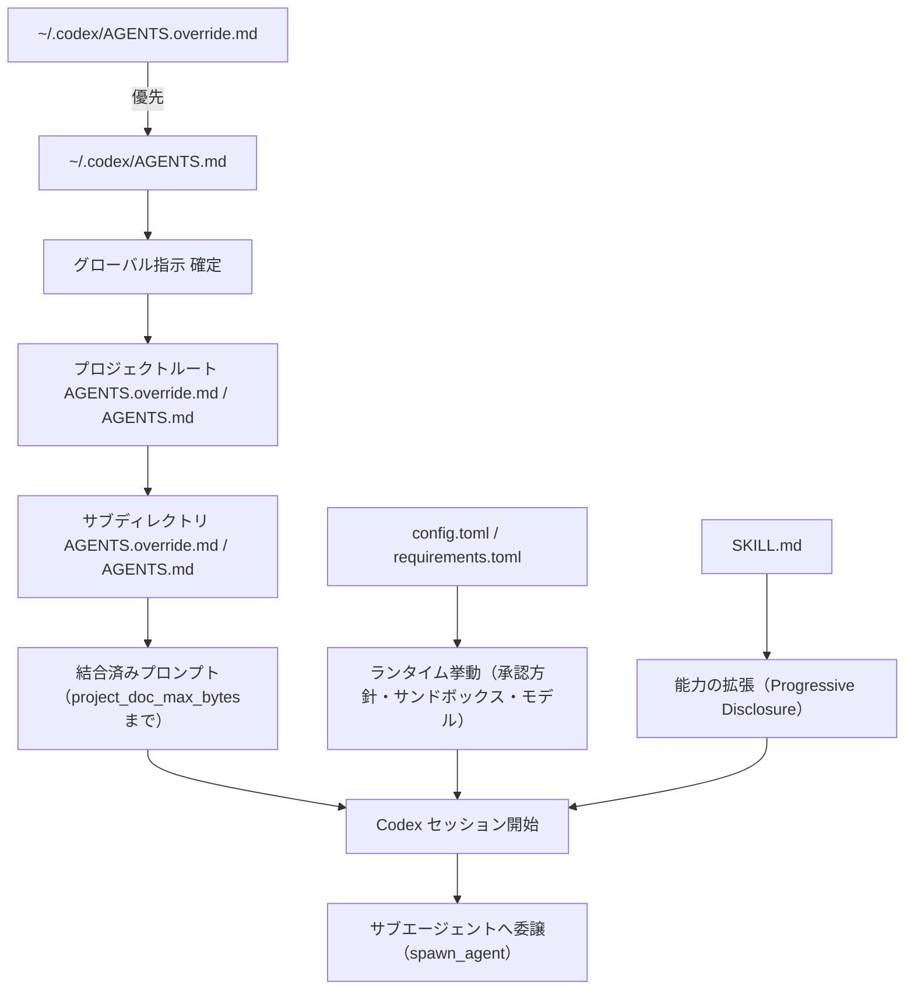
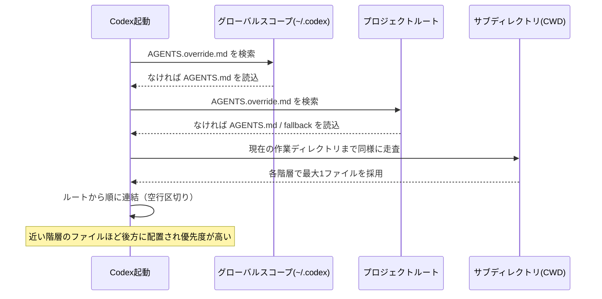
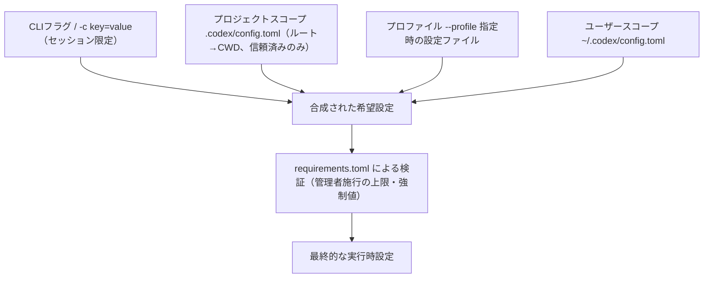
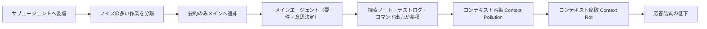
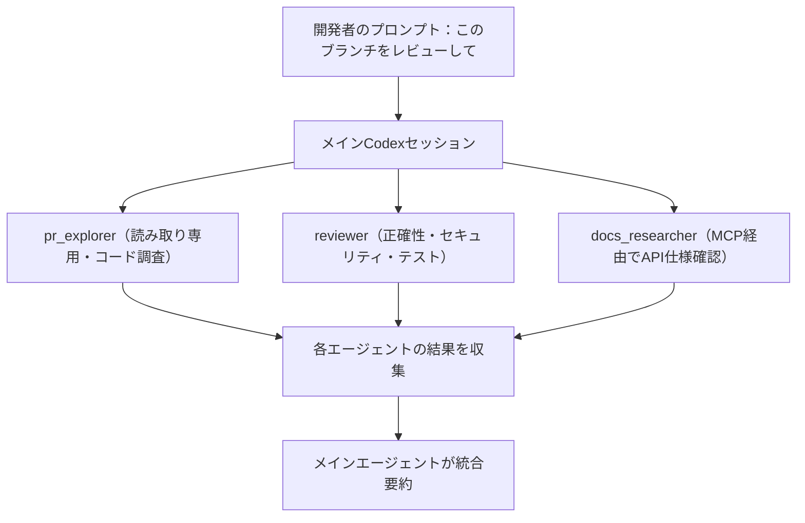
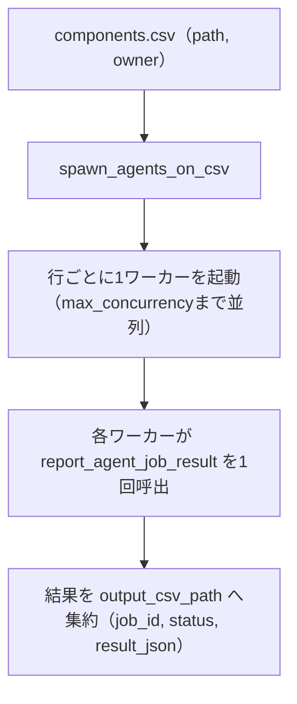
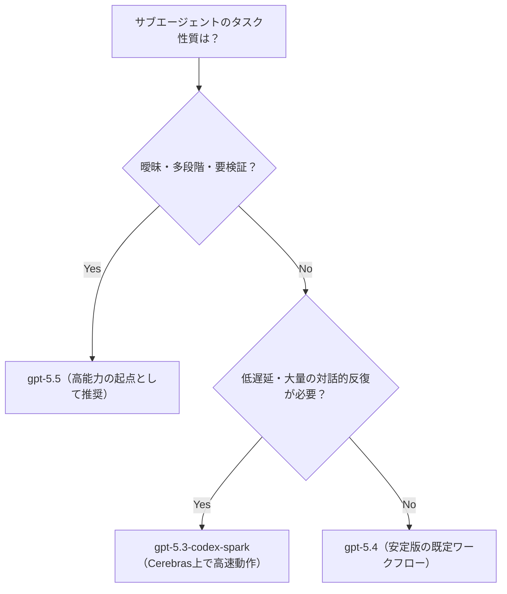

# OpenAI Codex サブエージェント開発ベストプラクティス完全ガイド

## AGENTS.md・AGENTS.override.md・SKILL.md・config.toml・requirements.toml で構築するマルチエージェントワークフロー

> 対象読者: Codex CLI / Codex Cloud を使ったチーム開発の経験がある中級〜上級エンジニア
> 最終更新: 2026年7月29日時点の公式ドキュメント・コミュニティ記事に基づく

---

## この記事の前提: 「REQUIREMENTS.md」について一点補足

ご依頼の中で `REQUIREMENTS.md` という名称が挙がっていますが、Codex エコシステムに実在するのは **`requirements.toml`**（Markdown ではなく TOML 形式の管理者施行ファイル）です。本ガイドでは実際の仕様に忠実に `requirements.toml` として解説します。名前は近いものの、役割・書式・配置場所はまったく別物なので、移行時に検索して見つからず戸惑わないよう最初に明記しておきます。

---

## 目次(ステップ構成)

1. Codex エコシステム全体像
2. AGENTS.md ― 基本のプロジェクト指示ファイル
3. AGENTS.override.md ― 一時的な上書きレイヤー
4. 発見順序とマージロジックの詳細
5. config.toml ― 階層構造とスコープ
6. config.toml の主要キーとスキーマ
7. requirements.toml ― 管理者施行の強制設定
8. SKILL.md ― Progressive Disclosure によるスキル拡張
9. Skills 運用のベストプラクティス
10. Subagents の概念 ― コンテキスト汚染とコンテキスト腐敗
11. カスタムサブエージェント定義ファイル
12. マルチエージェントワークフロー設計パターン①: PRレビューの3分割
13. マルチエージェントワークフロー設計パターン②: CSVファンアウト
14. モデル・reasoning effort の選定指針
15. Hooks と Rules(execpolicy) によるガバナンス
16. 実践チェックリスト
17. トラブルシューティング
18. まとめ
19. 参考文献

---

## Step 1. Codex エコシステム全体像

Codex の「設定・指示・能力拡張・実行制御」は、役割の異なる複数のファイル群によって階層的に構成されています。まず全体の関係を俯瞰します。

| ファイル | 役割 | 書式 | 主なスコープ |
|---|---|---|---|
| `AGENTS.md` | エージェントへの恒久的な指示(規約・ワークフロー) | Markdown | ユーザー / プロジェクト / サブディレクトリ |
| `AGENTS.override.md` | 同階層の `AGENTS.md` を完全に置き換える一時的な指示 | Markdown | 同上(各階層に1つだけ有効) |
| `SKILL.md` | 再利用可能な手順・スクリプト・参照資料をまとめた「スキル」 | Markdown + フォルダ | ユーザー / プロジェクト / プラグイン |
| `config.toml` | モデル・承認方針・サンドボックス・MCP・サブエージェントなどランタイム設定 | TOML | システム / ユーザー / プロジェクト / プロファイル |
| `requirements.toml` | 管理者が強制するセキュリティ上限(ユーザーは上書き不可) | TOML | 組織全体(MDM・クラウドポリシー・ファイルシステム配布) |

この5つは互いに独立した軸であり、「指示(何をすべきか)」「能力(何ができるか)」「実行制御(どこまで許可されるか)」の3層に分けて理解すると設計しやすくなります。

---

## Step 2. AGENTS.md ― 基本のプロジェクト指示ファイル

`AGENTS.md` はプロジェクトやチームの規約・コーディングスタイル・テスト方法などをエージェントに伝える、Codex 起動時に自動的に読み込まれる自然言語の指示ファイルです。特別なシステムAPIではなく、Codex が Markdown をそのままプロンプトの一部として注入する仕組みであるため、書き方は「新しいチームメンバー向けのオンボーディング資料」を書くのに近い感覚で構いません。

実務上のベストプラクティス:

- **短く、具体的に。** 一般論(「良いコードを書いてください」)ではなく、「このリポジトリでは `pnpm test` を実行する」「`src/legacy/` 配下は変更禁止」のように、検証可能な具体指示に寄せる。
- **強制力のあるインフラと組み合わせる。** `AGENTS.md` に書いたルールは pre-commit フック・リンター・型チェッカーと組み合わせることで、エージェントが同じミスを繰り返さないよう「システム側で気づける」ようにする。
- **グローバルとリポジトリで役割を分ける。** `~/.codex/AGENTS.md`(グローバル)はレビューのトーンや詳細度などエージェントとの対話スタイルに、リポジトリの `AGENTS.md` はチーム・コードベース固有の規約に専念させる。

---

## Step 3. AGENTS.override.md ― 一時的な上書きレイヤー

`AGENTS.override.md` は同じディレクトリにある `AGENTS.md` を**完全に置き換える**ための仕組みです。「一部だけ変更したい」場合の差分ファイルではなく、その階層で発見されると `AGENTS.md` は無視され、`override` ファイルの内容だけが採用されます。

典型的な使いどころ:

- 一時的な移行作業やインシデント対応中だけ、通常の規約(慎重な段階的コミットなど)を外して別の作業モードに切り替えたいとき
- CI 専用セッションや検証用ブランチなど、恒久的な `AGENTS.md` を書き換えずに一時的な挙動を注入したいとき
- 個人のローカル環境だけ挙動を変えたいが、リポジトリにコミットする `AGENTS.md` は触りたくないとき(`.gitignore` に `AGENTS.override.md` を加えて個人用に運用)

---

## Step 4. 発見順序とマージロジックの詳細

Codex は `CODEX_HOME`(既定 `~/.codex`)のグローバル階層から、プロジェクトルートを経て現在の作業ディレクトリ(CWD)まで、ディレクトリを1段ずつ辿りながら指示ファイルを探索します。

補足として押さえておきたい設定キー:

- **`project_doc_fallback_filenames`**: `AGENTS.md` が見つからない階層で代わりに読み込むファイル名のリストを指定可能。既存の `README` や社内規約ファイル名をそのまま流用したい場合に使う。
- **`project_doc_max_bytes`**: 連結後の指示テキストの合計サイズ上限。大きすぎる `AGENTS.md` 群は自動的に切り詰められるため、重要な指示ほどファイルの先頭近くに書く。
- **`model_instructions_file`**: `AGENTS.md` の自動読み込みそのものを別ファイルで完全に置き換えるための設定キー(旧名 `experimental_instructions_file` は非推奨、新設定への移行が必要)。階層探索ロジックごと差し替える強力なオプションなので、通常は `AGENTS.md`/`AGENTS.override.md` の組み合わせで足りることが多い。

---

## Step 5. config.toml ― 階層構造とスコープ

`config.toml` はモデル選択・承認ポリシー・サンドボックスモード・MCPサーバー・サブエージェント上限など、Codex の**振る舞い**を決めるランタイム設定です。指示ファイル(AGENTS.md系)とは異なるレイヤーで、以下の順に解決されます。

実務上のポイント:

- プロジェクト直下の `.codex/config.toml` は、そのプロジェクトを **trusted(信頼済み)** と判断した場合のみ読み込まれます。未信頼のプロジェクトでは、プロジェクトスコープの config・hooks・rules は一切ロードされず、ユーザー / システムスコープのみが有効です。
- 「プロジェクト設定が効かない」という相談の多くは、実は該当キーが**プロジェクトスコープでは無視される予約キー**(`model_provider`・`notify`・`profile` など、認証やテレメトリに関わるもの)であるケースです。これらはユーザースコープの `~/.codex/config.toml` で設定する必要があります。
- `--profile profile-name` を指定すると `~/.codex/profile-name.config.toml` を読み込みます。共通設定は `config.toml` に、環境差分だけをプロファイルファイルに分離するのが推奨構成です。
- ファイル冒頭に `#:schema https://developers.openai.com/codex/config-schema.json` を書いておくと、対応エディタでキー補完とバリデーションが効きます。

---

## Step 6. config.toml の主要キーとスキーマ

中級〜上級者が実際に触ることになる主要キーを機能別に整理します。

| カテゴリ | キー例 | 概要 |
|---|---|---|
| モデル | `model`, `review_model`, `model_reasoning_effort`, `model_reasoning_summary`, `model_verbosity` | 既定モデル・レビュー専用モデル・reasoning の強度や要約詳細度 |
| プロバイダ | `model_provider`, `model_providers.<id>` | 組み込み(`openai`/`ollama`/`lmstudio`)以外の独自プロバイダ定義 |
| 承認/サンドボックス | `approval_policy`, `sandbox_mode`, `approval_policy.granular.*` | `untrusted`/`on-request`/`never` などの承認方針と、`sandbox_approval`・`skill_approval`・`mcp_elicitations` の粒度別トグル |
| ネットワーク | `features.network_proxy`, `features.network_proxy.domains` | ドメイン単位の allow/deny を伴うネットワークプロキシ機能 |
| サブエージェント | `agents.<name>.config_file`, `agents.max_depth`, `agents.max_threads`, `features.multi_agent` | カスタムエージェント定義への参照、再帰の深さ・並列数の上限、マルチエージェント機能全体のオン/オフ |
| Hooks | `[hooks]`(インライン)または `hooks.json` | ライフサイクルフックの定義(後述) |
| MCP | `mcp_servers.<id>` | Model Context Protocol サーバーの登録 |
| その他 | `file_opener`, `request_max_retries`, `stream_max_retries`, `notify`, `otel` | エディタ連携・リトライ・通知・テレメトリ |

補足: `instructions` キーは将来のための予約で、実際には `model_instructions_file` または `AGENTS.md` を使うのが現行の正しい方法です。

---

## Step 7. requirements.toml ― 管理者施行の強制設定

`requirements.toml` は、個人やプロジェクトの `config.toml` では**上書きできない**、組織のセキュリティチームが強制する設定です。「ユーザーの利便性のための既定値」ではなく「絶対に譲れない下限・上限」を書く場所だと考えてください。

主な特徴:

- クラウドポリシー、macOS/Windows の MDM(Jamf・Kandji・Mosyle等)、あるいは単純なファイル配布の3経路で組織全体に配布可能。
- 例: `approval_policy = "never"` や `sandbox_mode = "danger-full-access"` を組織全体で禁止する、といった強制。
- 併用される **`managed_config.toml`** は「ソフトな既定値」を配布するためのファイルで、ユーザーが必要なら上書きできる点が `requirements.toml` との決定的な違いです。「ハードな制約は `requirements.toml`、ソフトな既定値は `managed_config.toml`」という役割分担で覚えると混同しません。
- `[features]` テーブルを使うことで、`config.toml` と同じキー名でフィーチャーフラグそのものを固定できます(省略したキーは制約なし)。
- `allow_managed_hooks_only = true` を設定すると、ユーザー・プロジェクト・セッション単位の hooks を無視し、管理レイヤーの hooks のみを有効にできます。
- ChatGPT Business/Enterprise では、ローカルファイルに加えてクラウド側から取得した requirements も適用されます(優先順位はセキュリティドキュメントで規定)。

---

## Step 8. SKILL.md ― Progressive Disclosure によるスキル拡張

Skill は「フォルダ + `SKILL.md`(メタデータ)+ 必要に応じたスクリプトや参照資料」という構成を取り、Codex に**再利用可能な手順**を教える仕組みです。ポイントは **Progressive Disclosure(段階的開示)** というロード方式です。

- Codex は起動時、各スキルの**説明(description)だけ**を読み込みます。
- タスクに関連しそうだと判断したスキルについてのみ、`SKILL.md` の本文やスクリプト・参照資料をその都度ロードします。
- これにより、大量のスキルを登録してもコンテキストウィンドウを圧迫しません。

配置場所と実行方式:

| 実行方式 | 概要 |
|---|---|
| ローカル実行(local shell) | インフラを自前管理したい場合に、実行をローカル環境に閉じ込める |
| ホスト型コンテナ実行 | Codex 側が用意するコンテナで実行。コンテナのライフサイクルに合わせてマウントしたファイルも保持・破棄される |

スキルが MCP サーバーに依存する場合は `agents/openai.yaml` にその依存関係を宣言しておくと、Codex が自動的にインストール・接続まで面倒を見てくれます。

---

## Step 9. Skills 運用のベストプラクティス

公式ガイダンスが強調しているのは「スキルは開発者が事前に検証してから配布する」という原則です。

- スキルは開発者がレビュー・統合したうえで、**特定のプロダクトワークフローに紐づけて**エンドユーザーに提供する。
- エンドユーザーが任意のスキルを自由に選べる状態を避ける(スコープを絞ったUX経由でのみ呼び出す)。
- 書き込みや影響範囲の大きい操作を行うスキルは、明示的な承認とポリシーチェックをゲートとして挟む。
- 「一度きりの手順」は AGENTS.md の指示で十分な場合が多く、「繰り返し使う複雑な手順・スクリプト・参照資料が伴うもの」こそスキル化する価値がある、という使い分けが実務的です。
- 社内で頻繁に使うスキルは**プラグイン**としてパッケージ化し、マーケットプレイス経由でチーム配布すると、hooks やスキルをまとめて一貫バージョンで展開できます。

---

## Step 10. Subagents の概念 ― コンテキスト汚染とコンテキスト腐敗

Subagents(サブエージェント)は 2026年3月16日に GA(一般提供)となった機能で、Codex は既定で `explorer`(調査系)・`worker`(バッチ処理系)・`default` という3種類の組み込みエージェントを持ちます。サブエージェントを使う最大の動機は、**メインスレッドのコンテキストを汚さないこと**です。

大きなタスクを1本のスレッドで処理し続けると、探索過程のログやコマンド出力が蓄積して**コンテキスト汚染**が起こり、それが進行すると関連情報が埋もれて応答品質が落ちる**コンテキスト腐敗(Context Rot)**につながります。サブエージェントは、ノイズの多い調査やバッチ作業を隔離したスレッドに切り出し、要約だけをメインへ返すことでこれを防ぎます。

ただし無料ではありません。公式ドキュメントも警告している通り、サブエージェントは同等の単一エージェント実行より**多くのトークンを消費**します。著名な開発者 Simon Willison 氏も、並列エージェント運用について「本当のボトルネックは自分がどれだけ速く結果をレビューできるかだ」という趣旨の指摘を自身のブログで行っており、オーケストレーションはタイピングの負荷をレビューの負荷に移すだけだと戒めています。設計時は「並列化すれば必ず速くなる」という前提を置かず、レビュー体制とセットで計画することが重要です。

---

## Step 11. カスタムサブエージェント定義ファイル

組み込みの3エージェントに加えて、`~/.codex/agents/` 配下に TOML ファイルを置くことで独自のサブエージェントを定義できます。名前を指定して呼び出せるほか、エージェントごとに異なるモデルを割り当てることも可能です(例: 高速性を優先するなら `gpt-5.3-codex-spark` を指定するなど)。

サブエージェントのオーケストレーションは Codex 本体が受け持ち、次のような操作を内部的に扱います。

| 操作 | 概要 |
|---|---|
| `spawn_agent` | 新しいサブエージェントスレッドを起動 |
| `send_input` | 起動済みのサブエージェントへ追加指示を送信 |
| `resume_agent` | 中断していたサブエージェントを再開 |
| `wait_agent` | サブエージェントの完了を待機 |
| `close_agent` | サブエージェントのスレッドを終了 |

`config.toml` 側では `agents.max_depth`(何段まで入れ子でサブエージェントを起動できるか)と `agents.max_threads`(同時並列数)で暴走を防ぎます。トリガーは特別なコマンドではなく自然言語で構いません。「レビュー観点ごとにエージェントを1つずつ立ち上げて、すべて完了したら結果をまとめて」と指示するだけで、Codex が複数スレッドを開いて集約します。

---

## Step 12. マルチエージェントワークフロー設計パターン①: PRレビューの3分割

実務でよく使われる型の一つが、プルリクエストのレビューをコード探索・レビュー・外部仕様確認の3系統に分ける並列パターンです。

設計のコツ:

- **役割ごとに読み書き権限を分ける。** コード調査担当は読み取り専用サンドボックスに固定し、変更を加える担当だけ書き込み権限を持たせる。
- **外部情報の検証は専任エージェントに。** MCP経由でドキュメントや実サービスの仕様を突き合わせる作業は、コードレビューと混ぜずに独立させると、メインの思考が汚れません。
- **集約は必ずメインエージェントが行う。** 各サブエージェントの結果をそのまま並べるのではなく、メインが矛盾点や優先度を踏まえて再統合することで、レビュー全体の一貫性を保ちます。

---

## Step 13. マルチエージェントワークフロー設計パターン②: CSVファンアウト

多数の小タスクを一括処理したい場合(例: リポジトリ内の全コンポーネントに同じ改修を適用する)は、CSVを起点にしたファンアウトパターンが有効です。

このパターンは `worker` 系エージェントが得意とする領域で、CSVの行数分だけワーカーを起動し、`max_concurrency` で同時実行数を絞りつつ、各ワーカーが結果を1回だけ報告して指定した出力CSVに集約させます。大量の定型タスクをレビュー可能な単位に分割したいときの定番構成です。

---

## Step 14. モデル・reasoning effort の選定指針

すべてのサブエージェントに同じモデルを割り当てる必要はありません。タスクの性質に応じて使い分けることで、コストと品質のバランスを取れます。

加えて `model_reasoning_effort`(例: `xhigh`)や `model_reasoning_summary`(`detailed` など)は、探索系のエージェントには高め、定型的なバッチワーカーには低めに設定するなど、エージェントごとの `config.toml` 参照(`agents.<name>.config_file`)で個別最適化するのが実務的です。モデル名やバリアントは頻繁に更新されるため、実際に指定する前に `codex models` や利用中のプロバイダのカタログで最新の識別子を確認してください。

---

## Step 15. Hooks と Rules(execpolicy) によるガバナンス

サブエージェントを増やすほど、「何を承認なしで実行してよいか」の統制が重要になります。Codex にはこれを扱う2つの仕組みがあります。

**Hooks**: `PermissionRequest` 型のフックでコマンド実行前に allow/deny を判定し、複数のフックが競合した場合は deny が優先されます。`PostToolUse` フックは Bash・`apply_patch`・MCPツール呼び出しの後に発火しますが、まだ全てのシェル呼び出しを捕捉できるわけではない点(新しい `unified_exec` 系統は途上)には注意が必要です。プロジェクトローカルの hooks は、そのプロジェクトが信頼済みの場合のみ読み込まれます。

**Rules(execpolicy)**: `.rules` ファイル(Starlark構文)で `prefix_rule(pattern=..., decision="allow"|"prompt"|"forbidden", justification="...")` を定義し、コマンドの引数列とパターンを照合します。複数ルールが一致した場合は最も制限の強い判定(`forbidden` > `prompt` > `allow`)が採用されます。`codex execpolicy check --rules <file> -- <command>` でルールの動作を事前検証できるため、大規模なサブエージェント運用を始める前にルールセットをテストしておくと安全です。管理者は `requirements.toml` から制限的な `prefix_rule` を強制することもできます。

---

## Step 16. 実践チェックリスト

- [ ] `AGENTS.md` は検証可能な具体的ルールになっているか(抽象的な精神論になっていないか)
- [ ] `AGENTS.override.md` を使う場合、それが「一時的な例外」であることをチーム内で共有できているか
- [ ] `project_doc_max_bytes` を超えていないか、重要な指示が末尾で切り詰められていないか確認したか
- [ ] `config.toml` の変更が想定のスコープ(ユーザー/プロジェクト/プロファイル)で効いているか、予約キーで無視されていないか
- [ ] 組織で譲れない制約(承認ポリシーやサンドボックスモードの下限)は `requirements.toml` に、単なる既定値は `managed_config.toml` に分離しているか
- [ ] スキルはエンドユーザーが任意選択できる状態になっていないか、書き込み系スキルに承認ゲートがあるか
- [ ] サブエージェントの並列度(`agents.max_threads`)と再帰深さ(`agents.max_depth`)に上限を設定しているか
- [ ] マルチエージェント運用のレビュー体制(誰が・どれだけの頻度で結果をレビューするか)を並列化前に決めているか
- [ ] `.rules` ファイルを `codex execpolicy check` で事前検証したか

---

## Step 17. トラブルシューティング

| 症状 | よくある原因 | 対処 |
|---|---|---|
| プロジェクトの `config.toml` が効かない | プロジェクトが untrusted 扱い、または予約キー(`model_provider`・`notify`・`profile` 等)を使っている | プロジェクトを信頼済みにする/該当キーはユーザースコープの `~/.codex/config.toml` に移す |
| `AGENTS.md` の指示が反映されない | 同階層に `AGENTS.override.md` が存在し、そちらが優先されている | override ファイルの有無を確認し、意図しないものであれば削除する |
| 指示の一部が無視されている | 連結後の合計サイズが `project_doc_max_bytes` を超えて切り詰められている | 重要な指示をファイル先頭に移動する、または上限を引き上げる |
| hooks が急に効かなくなった | `requirements.toml` の `allow_managed_hooks_only = true` により、管理外の hooks が無効化されている | 管理者に確認し、必要な hooks を管理レイヤー側で登録してもらう |
| サブエージェントがコストを消費しすぎる | 並列度・再帰深さの上限が未設定、またはモデル選定が一律で高コストなものになっている | `agents.max_threads`/`agents.max_depth` を設定し、探索系タスクには軽量なモデルを割り当てる |

---

## Step 18. まとめ

Codexのマルチエージェント開発は、「エージェントに何をすべきか教える層(AGENTS.md/override)」「繰り返し使える能力を教える層(SKILL.md)」「実行時の挙動を決める層(config.toml)」「組織として絶対に譲れない制約を敷く層(requirements.toml)」という4層構造で理解すると設計がぶれません。そのうえでサブエージェントは、コンテキスト汚染を防ぐための「隔離」の道具であり、並列化そのものが目的ではなく、レビュー体制とセットで初めて効果を発揮する点を忘れないことが、中級者から上級者へステップアップする際の分岐点になります。

---

## 参考文献

- AGENTS.md 発見順序・階層仕様: https://developers.openai.com/codex/guides/agents-md
- config.toml 基礎(階層・precedence): https://developers.openai.com/codex/config-basic
- config.toml 全キーリファレンス: https://developers.openai.com/codex/config-reference
- Advanced Configuration(予約キー・プロジェクトスコープの制約): https://learn.chatgpt.com/docs/config-file/config-advanced
- Subagents の概念(コンテキスト汚染・モデル選定指針): https://developers.openai.com/codex/concepts/subagents
- Subagents のセットアップとツール一覧: https://developers.openai.com/codex/subagents
- Skills(Progressive Disclosure・実行方式): https://developers.openai.com/codex/skills
- AGENTS.md と Skills / Subagents / MCP の使い分け: https://developers.openai.com/codex/concepts/customization
- Agent approvals & security(承認粒度・ネットワークプロキシ): https://developers.openai.com/codex/agent-approvals-security
- Rules / execpolicy: https://developers.openai.com/codex/rules
- execpolicy README(Starlarkルールのサンプル): https://github.com/openai/codex/blob/main/codex-rs/execpolicy/README.md
- Codex changelog(モデル世代・機能変遷): https://developers.openai.com/codex/changelog
- requirements.toml / managed_config.toml の実践解説(Codex Knowledge Base): https://codex.danielvaughan.com/2026/04/27/codex-cli-enterprise-managed-configuration-requirements-toml-admin-policies/
- Simon Willison「Use subagents and custom agents in Codex」(GA発表・組み込み3エージェント・カスタムTOML定義): https://simonwillison.net/2026/Mar/16/codex-subagents/
- Firecrawl「Multi-Agent Orchestration With Codex」(PRレビュー3分割パターン、レビュー負荷への言及): https://www.firecrawl.dev/blog/codex-multi-agent-orchestration
- Codex CLI config.toml 実践解説(150以上のキーの整理): https://ofox.ai/blog/codex-cli-config-toml-deep-dive/
- Codex(AI agent)の機能・モデル世代の変遷(背景情報): https://en.wikipedia.org/wiki/Codex_(AI_agent)
