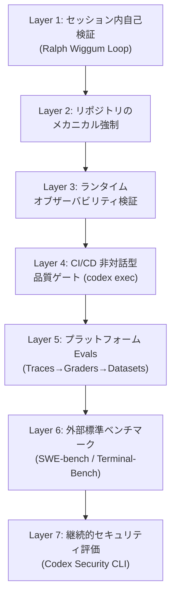
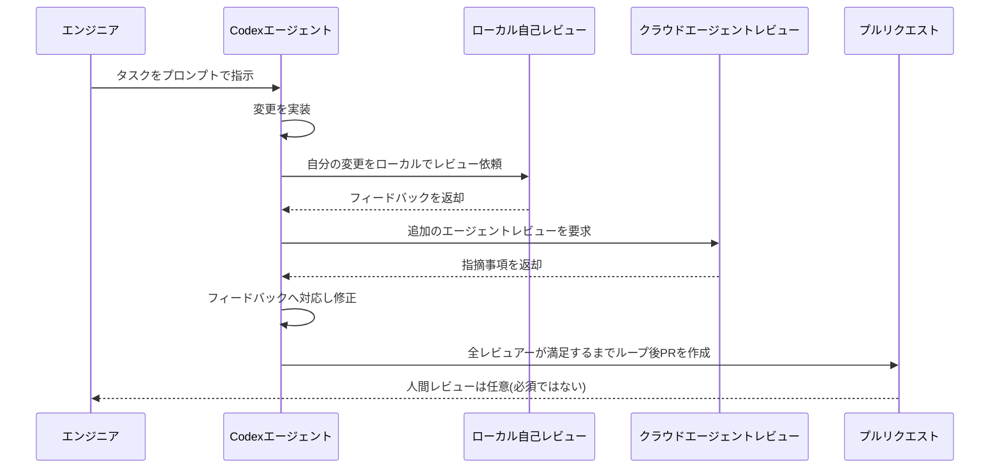
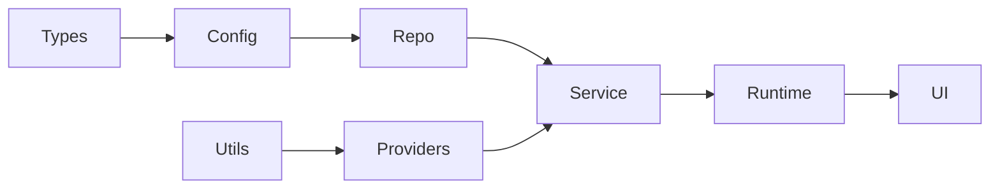
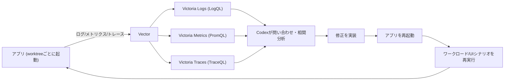
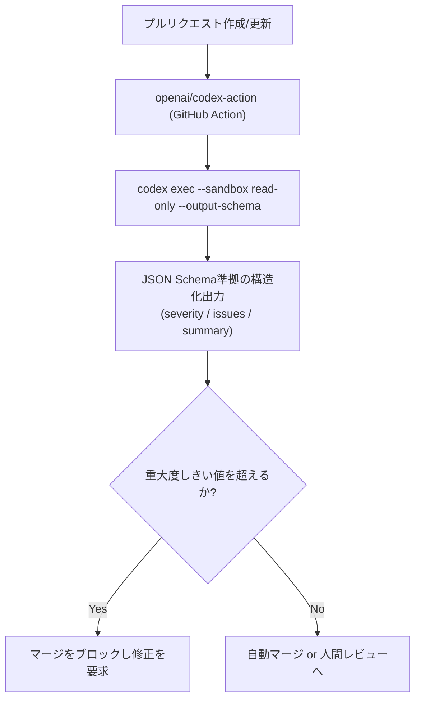
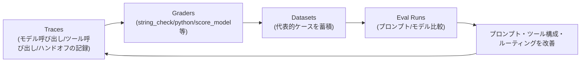
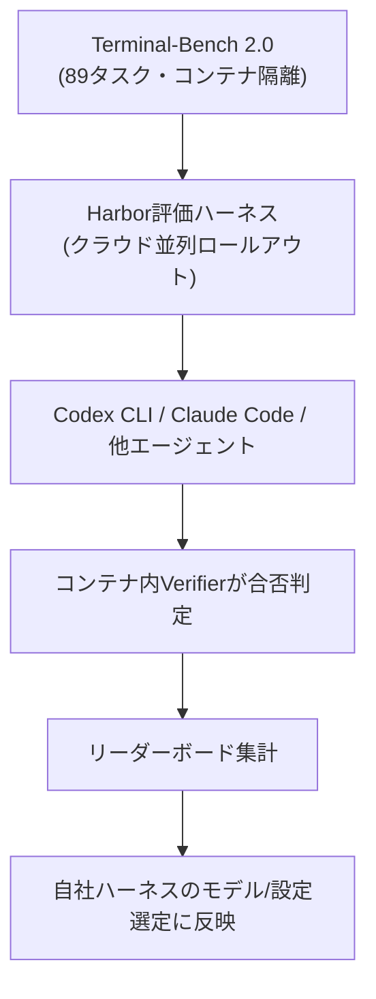

# OpenAI Codexにおけるハーネスエンジニアリング実践ガイド

AIエージェントの品質を自動・継続的に測定する評価基盤の設計

対象読者: Codex CLI / Codex cloud を用いたエージェント駆動開発に取り組む中級〜上級エンジニア

---

## 1. はじめに — なぜ「評価基盤」がハーネスエンジニアリングの核心なのか

2026年2月、OpenAIはエンジニアリングブログで「Harness engineering: leveraging Codex in an agent-first world」という記事を公開した。著者はOpenAIのRyan Lopopolo氏で、3人のエンジニアチームが5ヶ月間、**人間が一行もコードを書かずに**約100万行・1,500件のマージ済みプルリクエストからなる本番プロダクトを構築した実験の報告である。

この実験が示した最大の教訓は、エージェントの能力そのものよりも「エージェントを取り巻く環境設計」が開発速度と品質を決定づけるという点にある。人間エンジニアの役割は「コードを書くこと」から「環境を設計し、意図を仕様化し、フィードバックループを構築すること」へ移行した。この環境設計とフィードバックループの総体こそが「ハーネス」であり、それを専門的に設計・運用する営みが「ハーネスエンジニアリング」と呼ばれる。

そして、エージェントのスループットが人間のレビュー能力を軽々と超えていく状況では、**「良し悪しをどう機械的・継続的に判定するか」という評価基盤こそがハーネスの生命線になる**。人間が全PRを読んでレビューするモデルは、1エンジニアあたり1日3.5件のPRが生成される環境ではそもそも成立しない。したがって、ハーネスエンジニアリングの実務は、突き詰めれば「エージェントの出力品質を自動的・継続的に測定し、悪化を検知し、改善サイクルへ差し戻す仕組み」を組み立てる作業に等しい。本ガイドはこの評価基盤の部分に焦点を絞り、OpenAI Codexというプラットフォーム上でそれをどう実装するかをステップバイステップで解説する。

---

## 2. ハーネスエンジニアリングとは何か

### 2.1 コンテキストエンジニアリングとの違い

「コンテキストエンジニアリング」が問う問いは「エージェントに何を見せるべきか」であるのに対し、「ハーネスエンジニアリング」が問う問いは「システムは何を防ぎ、何を測定し、何を修正すべきか」である。前者がインプット側の設計だとすれば、後者はアウトプットの検証・強制・フィードバックの設計だと言える。

両者は排他的ではなく、実際には積層する関係にある。

この7層モデルは、評価がかかる範囲の「近さ」で並べたものである。Layer 1はエージェント自身がその場で行う自己採点、Layer 7は業界全体で共有される外部標準に基づく評価であり、下に行くほど客観性は増すがフィードバックは遅くなる。優れたハーネスは、この全レイヤーを同時に運用し、速いフィードバック(Layer 1〜2)で日々の逸脱を潰しながら、遅いフィードバック(Layer 5〜7)で長期的な方向性を検証する。

### 2.2 OpenAIの実証実験が示した構造

Ryan Lopopolo氏の報告によれば、2025年8月末に空のGitリポジトリへの最初のコミットが行われ、リポジトリ構造・CI設定・フォーマットルール・パッケージマネージャ設定・アプリケーションフレームワークに至るまで、初期スキャフォールド自体がCodex CLI(GPT-5使用)によって生成された。5ヶ月後、リポジトリは約100万行規模となり、3人だったチームは7人に拡大したが、1人あたりのPRスループットはむしろ増加した。同記事はこの体制を「Humans steer. Agents execute.」という一言で要約している。

重要なのは、エージェントが生成した成果物には「プロダクトコードとテスト」だけでなく、「CI設定とリリースツール」「内部開発者ツール」「ドキュメントと設計履歴」、そして本ガイドの主題である**「評価ハーネス(Evaluation harnesses)」自体**が含まれていたと明記されている点である。つまりOpenAI自身の実験においても、評価基盤はエージェントが自ら構築・改良する対象として扱われていた。

参考: [Harness engineering: leveraging Codex in an agent-first world (openai.com)](https://openai.com/index/harness-engineering/)

---

## 3. なぜ評価が「継続的」でなければならないのか

### 3.1 スループット増大とヒューマンQAのボトルネック化

コード生成のスループットが増えるほど、ボトルネックは「コードを書く速度」から「品質を確認する速度」へ移動する。OpenAIの実験では、これに対応するためにアプリケーションのUI・ログ・メトリクス自体をCodexが直接読み書きできる形にする「アプリケーションの可読化(legibility)」が進められた。git worktreeごとにアプリを起動できるようにし、Chrome DevTools ProtocolをエージェントランタイムにMCP経由で組み込むことで、Codexはバグを再現し、修正を検証し、UI挙動を自ら推論できるようになった。

### 3.2 エントロピーは自然に増大する

エージェントは既存パターンを模倣するため、リポジトリ内に不揃いな実装や最適でないパターンが一度でも紛れ込むと、それが複製され続けドリフトが蓄積する。OpenAIのチームは当初、毎週金曜日(稼働時間の20%)を「AIスロップ」の手作業クリーンアップに費やしていたが、これはスケールしないことが早々に判明した。最終的な解は「golden principles」と呼ぶ機械的なルール群をリポジトリに直接エンコードし、定期的なクリーンアップエージェントが逸脱をスキャンして品質グレードを更新し、的を絞ったリファクタリングPRを開くという、継続的な「ガベージコレクション」に相当する仕組みだった。技術的負債は複利で膨らむ高利子の借金に似ており、少しずつ返済し続ける方が、溜め込んで痛みを伴う形で一括処理するより常に有利だという整理である。

この「継続的に少しずつ検出・修正する」設計思想こそが、次章で扱う評価基盤の各レイヤーに共通する原則である。

---

## 4. 評価基盤の7層モデル — 詳細解説

### 4.1 Layer 1: セッション内自己検証ループ(Ralph Wiggum Loop)

もっとも速いフィードバックは、エージェント自身がその場で行う自己レビューである。OpenAIのハーネスでは、Codexに対して「自分の変更をローカルでレビューし、ローカル/クラウド双方で追加のエージェントレビューを要求し、人間またはエージェントからのフィードバックに対応し、すべてのレビュアーが満足するまでループする」ことを指示している。この反復パターンは、Geoffrey Huntley氏が命名した「Ralph Wiggum Loop」(単純な `while :; do cat PROMPT.md | agent; done` 型のループ)の一種として、OpenAIの記事内でも明示的に言及されている。

このレイヤーの評価基準は、人間が書いた固定チェックリストではなく、Codex自身が読み書きできる `gh` コマンド・ローカルスクリプト・リポジトリ埋め込みのSkillといった標準開発ツールを介して動的に決まる。人間がCLIへコピー&ペーストして文脈を渡す必要がない点が要である。

### 4.2 Layer 2: リポジトリレベルのメカニカル強制

Layer 1は「本人任せ」の評価だが、Layer 2は「構造そのものが逸脱を許さない」設計である。OpenAIのハーネスでは、各ビジネスドメインを固定の層(Types → Config → Repo → Providers → Service → Runtime → UI)に分割し、依存方向を厳格に制限している。横断的関心事(認証・コネクタ・テレメトリ・フィーチャーフラグ)は「Providers」という単一の明示的インターフェースを通じてのみ入り込める。

この依存方向は人間のレビューではなく、Codex自身が生成したカスタムLinterと構造テストによって機械的に強制される。構造化ロギングやスキーマ・型の命名規則、ファイルサイズ上限、プラットフォーム固有の信頼性要件も同様にカスタムLintでチェックされる。Lintのエラーメッセージには、その場でエージェントへ是正手順を注入できるよう、修復手順そのものが埋め込まれている点が実務上のポイントである。

さらに、リポジトリの `docs/` ディレクトリには `QUALITY_SCORE.md` のような「各プロダクトドメイン・各アーキテクチャ層を採点し、経時的なギャップを追跡する」文書が置かれ、これ自体がエージェントによって定期的に更新される。加えて「doc-gardening」エージェントが、実際のコード挙動と乖離した古いドキュメントをスキャンし、修正PRを自動的に開く。これらは、コードそのものではなく「リポジトリの整合性・鮮度」を継続測定する評価基盤の一形態である。

参考: [Harness engineering: leveraging Codex in an agent-first world (openai.com)](https://openai.com/index/harness-engineering/) / [Using PLANS.md for multi-hour problem solving (OpenAI Cookbook)](https://cookbook.openai.com/articles/codex_exec_plans)

### 4.3 Layer 3: ランタイム・オブザーバビリティによる実行時検証

静的な構造チェックだけでは「動くかどうか」は分からない。OpenAIのハーネスは、ログ・メトリクス・トレースをVectorで収集し、Victoria Logs / Victoria Metrics / Victoria Tracesへファンアウトするローカル観測可能性スタックを、git worktreeごとにエフェメラルに立ち上げている。Codexはこれを LogQL・PromQL・TraceQL で問い合わせ、相関分析を行った上で修正を実装し、アプリを再起動して同じワークロードやUIシナリオを再実行するというループを回す。

このレイヤーによって、「サービス起動を800ミリ秒未満で完了させる」「4つの重要なユーザージャーニーのどのスパンも2秒を超えない」といった、これまで自然言語では扱いにくかった性能要件がCodexにとって実行可能なタスクになる。あわせて、Chrome DevTools Protocolをランタイムに組み込み、DOMスナップショット・スクリーンショット・ナビゲーションを扱うSkillを用意することで、Codexはブラウザ操作を伴うUIバグの再現・修正検証も自律的に行えるようになる。単一のCodex実行が(人間が眠っている間に)6時間以上にわたり1つのタスクへ取り組み続けるケースも珍しくないという。

### 4.4 Layer 4: CI/CDにおける非対話型品質ゲート(codex exec)

ここからは、エージェントの実行そのものを人間の監督なしにパイプライン化するレイヤーである。Codex CLIには `codex exec` という非対話モードが用意されており、対話TUIを開かずにスクリプトやCIジョブから起動できる。実行結果は終了コードで成否を判定でき、`--json` フラグで各イベント(コマンド実行・ファイル変更・エージェントメッセージ)を構造化されたJSONLストリームとして取得できるため、下流ツールでの機械的な判定に使いやすい。

さらに `--output-schema` を指定すると、最終出力をJSON Schemaに準拠させることができる。たとえばPRレビューを「severity(重大度)」「issues(配列)」「summary(要約)」を持つ構造で返させれば、`jq` や後続のGitHub PRコメント投稿ツールへそのまま渡せる、採点可能なデータになる。

GitHub Actions環境では、CLIを自前でインストールしAPIキーを渡すよりも `openai/codex-action` を使う方が安全とされている。このアクションはCodex CLIのインストールとResponses APIプロキシの起動を代行し、リポジトリを直接チェックアウトするジョブに `OPENAI_API_KEY` をジョブレベル環境変数として置かないよう案内している(ビルドスクリプトやテスト、依存パッケージのライフサイクルフック経由でキーが読み取られる懸念があるため)。CI専用には `CODEX_API_KEY` という別名の環境変数を使うのが定石である。

| フラグ / 環境変数 | 用途 |
|---|---|
| `codex exec "<task>"` | 非対話モードでタスクを1回実行し、標準エラーへ進捗、標準出力へ最終メッセージを出す |
| `--json` | 各イベントを構造化JSONLとしてストリーム出力し、`jq` 等で機械的に解析する |
| `--output-schema <file>` | 最終出力をJSON Schemaに準拠させ、severityなどのフィールドで自動採点しやすくする |
| `--ephemeral` | セッションのrolloutファイルをディスクへ永続化しない(CIで推奨) |
| `--sandbox read-only / workspace-write` | エージェントに与える権限範囲を明示指定する |
| `CODEX_API_KEY` | CI専用の資格情報(`OPENAI_API_KEY` をジョブ環境変数に直接置くことは非推奨) |

参考: [Non-interactive mode (developers.openai.com)](https://developers.openai.com/codex/non-interactive-mode) / [Codex GitHub Action (developers.openai.com)](https://developers.openai.com/codex/github-action)

### 4.5 Layer 5: プラットフォームEvals — Traces・Graders・Datasets・Eval Runsのフライホイール

Codex自体のCI組み込みが「タスクが1件成功したか」を判定するのに対し、OpenAI PlatformのEvals機能群は「エージェントの振る舞いが時間軸・変更軸でどう変化しているか」を体系的に追跡するためのものである。公式ドキュメントは、この評価基盤を次の順序で育てていくことを推奨している。

1. **Trace grading(トレース評価)**: まだ挙動をデバッグしている段階では、1回の実行におけるモデル呼び出し・ツール呼び出し・ガードレール・ハンドオフの一連の記録である「トレース」を採取し、それをGraderで採点する。「正しいツールを選んだか」「ハンドオフは適切なタイミングで発生したか」「ワークフローが指示や安全ポリシーに違反していないか」といった問いに答えるのに向く。
2. **Datasets & Eval Runs(データセットと評価実行)**: 「良い」の基準が固まったら、個別トレースの確認から、再現可能なデータセットと評価実行(Eval Run)へ移行する。これにより、プロンプトやモデルの変更を継続的にベンチマークし、時系列で比較できるようになる。
3. **外部モデルとの比較やバッチ評価**など高度な機能が必要な場合は、Evals APIをデータセットと組み合わせて使う。

Graderには複数の型があり、判定したい品質の性質に応じて使い分ける。

| グレーダー種類 | 判定方法 | 適したケース | 出力 |
|---|---|---|---|
| `string_check` | `eq` / `ne` / `like` / `ilike` による文字列比較 | 決定的な正解文字列がある場合 | 0 または 1 |
| `text_similarity` | `fuzzy_match` / `bleu` / `rouge_l` などの類似度指標 | 表現ゆれはあるが意味的に近い正解がある場合 | 0.0〜1.0 |
| `python` (`PythonGrader`) | 任意のPythonコードを実行し `grade` 関数の戻り値を採点に使う | テスト実行結果・静的解析結果など機械的に判定できるもの | 浮動小数点値 |
| `score_model` (`ScoreModelGrader`) | LLMに0.0〜1.0のスコアを付けさせる | 文章のトーンや設計の妥当性など主観が絡む品質評価 | 0.0〜1.0 |
| `label_model` (`LabelModelGrader`) | LLMにカテゴリラベルを付与させ、合格ラベル集合と照合する | 合格/不合格、深刻度カテゴリなどの分類 | ラベル文字列 |
| `multi_grader` (`MultiGrader`) | 複数グレーダーの結果を計算式で合成する | 複数基準を重み付けして総合スコアにしたい場合 | 合成スコア |

なお、モデルグレーダーを使う際は「グレーダーハッキング(reward hacking)」に注意する必要がある。モデルが採点基準の弱点を学習してしまい、モデルグレーダーの評価では高得点でも、専門家による人手評価では低品質という乖離が生じることがある。これを検知するために、モデルグレーダーによる評価と専門家による人手評価の両方を定期的に突き合わせることが推奨されている。

参考: [Evaluate agent workflows (developers.openai.com)](https://developers.openai.com/api/docs/guides/agent-evals) / [Graders (developers.openai.com)](https://developers.openai.com/api/docs/guides/graders)

### 4.6 Layer 6: 外部標準ベンチマーク — SWE-bench VerifiedとTerminal-Bench 2.0 / Harbor

自社ハーネス内部の評価だけでは、「今使っているモデルやエージェント設定が業界の到達点に対してどの位置にあるか」は分からない。ここで外部の標準ベンチマークが役割を果たす。

**SWE-Bench Verified**は、実世界のGitHub issue解決能力を人手検証済みのタスクセットで測る、コーディングエージェント評価のデファクトスタンダードの一つである。著名な独立系のAI論評者であるSimon Willison氏は、2025年11月のGPT-5.1-Codex-Max発表時に、OpenAIが自己申告したSWE-Bench Verifiedスコアが reasoning effort「high」で76.5%、新設の「xhigh」で77.9%だったと報告しており、これはGemini 3 Pro(76.2%)やClaude Sonnet 4.5(77.2%)をわずかに上回る水準だったと分析している。

**Terminal-Bench 2.0**は、Stanford大学とLaude Instituteが主導し、Snorkel AIなどが貢献するオープンな端末操作エージェント評価ベンチマークである。89件のタスクがそれぞれ独立したDockerコンテナで実行され、シェルスクリプティング、システム管理、暗号、COBOLの現代化、科学技術系Pythonの移植など16カテゴリにまたがる難易度別タスクで構成される。同時にリリースされた**Harbor**は、クラウド上のコンテナへ並列にロールアウトを展開できる評価ハーネスで、Daytona・Modalなど複数プロバイダに対応し、任意のエージェントアーキテクチャに対して汎用的に使えるよう設計されている。VentureBeatの報道によれば、Terminal-Bench 2.0発表当初のリーダーボードではOpenAIのCodex CLIが49.6%のタスク成功率で首位に立っていた。Simon Willison氏も、GPT-5.1-Codex-MaxがTerminal Bench 2.0で58.1%を記録し、Gemini 3 Pro(54.2%)やSonnet 4.5(42.8%)を上回ったと報告している。

| ベンチマーク | 測定対象 | 特徴 | 参考スコア(2025年11月時点、自己申告含む) |
|---|---|---|---|
| SWE-Bench Verified | 実世界のGitHub issue解決 | 人手検証済みタスクセット | GPT-5.1-Codex-Max: high 76.5% / xhigh 77.9% |
| Terminal-Bench 2.0 | 端末操作タスク(89件・コンテナ隔離) | Harborによる並列コンテナ評価、milestone報酬 | GPT-5.1-Codex-Max: 58.1%(初期リーダーボードではCodex CLIが49.6%で首位) |
| HumanEval | 関数単位のコード生成 | pass@1 / pass@100 | 参考: 初代Codex 12Bモデルでpass@1 28.8% |

社内ハーネスの設計にこれらのベンチマークを組み込む実務上の意義は、単に「流行りの数字を追う」ことではない。むしろ、自社のタスク分布に近い公開ベンチマークのサブセットを定点観測し、モデルのバージョンアップやreasoning effortの変更が自社ワークロードにどう波及するかを、外部の再現可能な基準に照らして事前に把握することにある。

参考: [Simon Willison on gpt-codex](https://simonwillison.net/tags/gpt-codex/) / [Simon Willison on evals](https://simonwillison.net/tags/evals/) / [Terminal-Bench 2.0 launches alongside Harbor (VentureBeat)](https://venturebeat.com/ai/terminal-bench-2-0-launches-alongside-harbor-a-new-framework-for-testing) / [Introducing Terminal-Bench 2.0 and Harbor (tbench.ai)](https://www.tbench.ai/news/announcement-2-0)

### 4.7 Layer 7: 継続的セキュリティ評価(Codex Security CLI)

品質測定はコードの正しさだけでなく、セキュリティ面の継続監査も含む。OpenAIは2026年7月末、内部では「Aardvark」と呼ばれていたセキュリティレビュー機能を、Apache 2.0ライセンスのオープンソースCLIツール `@openai/codex-security` として公開した。このツールは単一リポジトリのスキャンだけでなく、GitHub上のリポジトリをまとめて検出する、あるいはCSVインベントリから再開可能なキャンペーンとして実行する「bulk-scan」に対応しており、組織全体のリポジトリ群を継続的に棚卸しする用途を想定している。

CI組み込みの観点では、プルリクエストの差分だけを対象にスキャンする `--diff` オプション、結果をSARIF形式でアップロードするサポート、重大度に基づくポリシー設定が提供されている。認証面では、対話的な利用ではChatGPTサインインが使われる一方、CIやJSON/JSONL出力など非対話コンテキストでは環境変数のAPIキーがデフォルトで使われるという振り分けになっている。スキャン結果は人間可読な `report.md` に加え、`findings.json` や `coverage.json` といった機械可読アーティファクトとしても出力されるため、Layer 4のCIゲートやLayer 5のダッシュボードへそのまま接続できる。

参考: [openai/codex-security (GitHub)](https://github.com/openai/codex-security) / [Codex Security (developers.openai.com)](https://developers.openai.com/codex/security) / [OpenAI open-sources Codex Security CLI (the-decoder.com)](https://the-decoder.com/openai-open-sources-codex-security-cli-to-help-developers-find-and-fix-vulnerabilities-from-the-command-line/)

---

## 5. ステップバイステップ実装ガイド

以下は、上記7層モデルを実際のリポジトリへ段階的に導入する際の推奨順序である。小さなプロジェクトであっても、Step 1〜4は初日から着手できる規模感で設計してある。

### Step 1: AGENTS.mdを「目次」として設計する

OpenAIのチームは当初「一つの巨大なAGENTS.md」を試みたが、これは失敗パターンだと結論づけている。理由は、コンテキストが希少資源であり巨大な指示ファイルがタスクやコードそのものを押し出してしまうこと、すべてが「重要」だと何も重要でなくなること、モノリシックなファイルは即座に陳腐化すること、そして単一の塊は機械的なチェック(網羅性・鮮度・所有者・相互リンク)になじまないことである。

そこでAGENTS.mdは百科事典ではなく「目次」として扱い、実体は `docs/design-docs/` `docs/exec-plans/` `docs/product-specs/` `docs/references/` といった構造化ディレクトリに置く。専用のLinterとCIジョブが、この知識ベースが最新で相互リンクされ正しく構造化されているかを検証し、実態と乖離した記述を検出する「doc-gardening」エージェントが定期的に修正PRを開く。これ自体が、リポジトリのドキュメント品質を継続測定する評価基盤の一部である。

### Step 2: PLANS.md(ExecPlans)で長時間タスクの検証可能性を担保する

複雑な機能追加やリファクタリングでは、単発のプロンプトではなく「ExecPlan」という生きた設計文書を使う。OpenAI Cookbookが公開しているテンプレートは、`Progress`(チェックリスト形式の進捗)・`Surprises & Discoveries`(想定外の発見)・`Decision Log`(意思決定記録)・`Outcomes & Retrospective`(成果の振り返り)という4つの必須セクションを持つことを要求する。これらのセクションは、7時間を超えるような長時間の単一エージェント実行であっても、途中経過と意思決定の根拠を後から検証可能にするための「監査ログ」として機能する。評価基盤の観点では、このExecPlanこそが「その変更が何を達成しようとしたか」という受け入れ基準(Acceptance)の一次情報源になる。

### Step 3: アーキテクチャをメカニカルに強制する

4.2節で述べたレイヤードアーキテクチャとカスタムLinterを整備する。ポイントは、実装の細部を規定するのではなく「不変条件(invariant)」だけを強制することである。境界でのデータ形状のパースを義務付けるが、それをZodで行うかどうかは指定しない、といった具合に、境界は厳格に・境界内の自由度は大きく保つのが基本方針である。

### Step 4: ローカルオブザーバビリティスタックを構築する

4.3節のVector→Victoria Logs/Metrics/Tracesのようなスタックをworktreeごとにエフェメラルに立ち上げられるようにする。最初から完璧な可観測性を目指す必要はなく、「サービス起動時間」や「重要ユーザージャーニーのレイテンシ」など、まず1〜2個の定量指標をCodexが自分で問い合わせられるようにするところから始めるのが現実的である。

### Step 5: codex execでCI/CDに非対話型の品質ゲートを組み込む

4.4節の `openai/codex-action` と `codex exec --output-schema` を使い、PRごとに構造化された品質レポートを生成する。最初のうちはブロッキングではなく「コメントを残すだけ」の緩いゲートから始め、誤検知率が十分下がった段階で重大度に応じたマージブロックへ昇格させると、開発フローへの摩擦を抑えられる。

### Step 6: OpenAI Evals APIでドメイン固有のグレーダーを構築する

Traceを最初は目視で確認し、「良い」の基準が言語化できたら、その基準を4.5節のグレーダー(string_check・python・score_model・label_modelなど)としてコード化し、DatasetとEval Runへ昇格させる。重要なのは、最初から巨大な評価スイートを作ろうとしないことである。1〜2個の高頻度な失敗モードに対応するグレーダーから始め、Eval Runの結果を見ながら段階的に拡張するのが、Traces→Graders→Datasets→Eval Runsというフライホイールの回し方として推奨されている進め方である。

### Step 7: 外部ベンチマークで継続的にモデル/設定を評価する

4.6節のSWE-Bench VerifiedやTerminal-Bench 2.0/Harborのような外部ベンチマークを、モデルのバージョンアップやreasoning effort変更のたびに(あるいは定期的に)自社のタスク分布に近いサブセットで再実行し、内部Eval Runの結果と突き合わせる。これにより、「モデルが賢くなった」という抽象的な期待と、「自社の具体的なワークロードでも実際に改善したか」という実測を切り分けられる。

### Step 8: Codex Security CLIで継続的セキュリティスキャンを組み込む

4.7節のツールをまずは非クリティカルな1つのサービスに対してローカル実行し、誤検知傾向を把握したうえで、PR差分スキャン(`--diff`)をCIに追加し、重大度「high」以上のみをブロック対象とするような段階的な導入が現実的である。組織全体のリポジトリ棚卸しにはbulk-scanを用いる。

### Step 9: エントロピー対策 — Golden PrinciplesとGarbage Collection

Step 1〜8がすべて機能しても、時間とともにパターンの不揃いは蓄積する。3.2節で述べた通り、これに対する解は人手による一括クリーンアップではなく、機械的なルール(golden principles)をリポジトリに明文化し、定期実行される背景タスクが逸脱をスキャンして品質グレードを更新し、小さなリファクタリングPRを自動的に開き続けることである。1分以内でレビューでき自動マージできる粒度に保つことが、このループが破綻しない鍵になる。

---

## 6. ハーネス成熟度チェックリスト

| 観点 | 未成熟な状態 | 成熟した状態 |
|---|---|---|
| 指示ファイル | AGENTS.mdが数千行の百科事典で常に陳腐化している | AGENTS.mdは目次に徹し、詳細は`docs/`配下でLintにより鮮度検証される |
| アーキテクチャ強制 | コードレビューでスタイルを都度指摘している | カスタムLinter/構造テストが依存方向を機械的にブロックする |
| 実行時検証 | 手元で目視確認してからデプロイする | worktreeごとの観測可能性スタックをCodexがLogQL/PromQL/TraceQLで自己検証する |
| CIゲート | 人間が全PRを読んでからマージする | `codex exec --output-schema`が構造化された合否判定をPRごとに返す |
| 品質評価 | 「なんとなく良さそう」で判断している | Traces→Graders→Datasets→Eval Runsのフライホイールで定量追跡している |
| モデル選定 | 発表時のベンチマーク数値だけで乗り換える | 自社タスク分布に近い外部ベンチマークのサブセットと内部Eval Runを突き合わせる |
| セキュリティ | 気づいたときに手動でレビューする | Codex Security CLIによる継続スキャンとSARIF連携がCIに組み込まれている |
| 技術的負債 | 定期的な一括クリーンアップ(週次の手作業日など) | Golden Principles + 背景クリーンアップエージェントによる日次の小さな返済 |

---

## 7. アンチパターン

- **巨大な単一AGENTS.md**: すべてを1ファイルに詰め込むと、コンテキストを圧迫しつつも即座に陳腐化し、機械的な検証もできなくなる。
- **人間レビューをボトルネックとして温存する**: エージェントのスループットが人間の目視レビュー速度を超えた段階で、全件人間レビューを維持しようとすると、せっかくの速度向上が失われる。
- **モデルグレーダーだけに依存する**: score_model/label_modelのようなモデルグレーダーのみに頼ると、グレーダーハッキング(reward hacking)によってモデルグレーダー上のスコアは高いのに実際の品質は低い、という乖離に気づけなくなる。定期的な人手評価との突き合わせが必要である。
- **発表ベンチマーク数値の鵜呑み**: SWE-Bench VerifiedやTerminal-Bench 2.0のスコアは自己申告や特定タスク分布に基づくものであり、自社ワークロードでの実測(内部Eval Run)と併せて解釈する必要がある。
- **CI/CDの資格情報をジョブ環境変数に直置きする**: リポジトリを直接チェックアウトするジョブに`OPENAI_API_KEY`をジョブレベル環境変数として設定すると、ビルドスクリプトや依存パッケージのライフサイクルフック経由で漏えいするリスクがある。CI専用の`CODEX_API_KEY`や、`openai/codex-action`が提供するプロキシ経由の運用が推奨される。
- **一括クリーンアップへの先送り**: 技術的負債の返済を「まとまった時間ができたら」に先送りすると、複利的に膨らんだ負債を痛みを伴う形で処理する羽目になる。小さく・頻繁に返済する設計の方が総コストは低い。

---

## 8. まとめ

OpenAI Codexにおけるハーネスエンジニアリングは、「エージェントに何を書かせるか」の設計から、「エージェントが書いたものをどう継続的に検証し、悪化をどう検知し、改善サイクルへどう差し戻すか」という評価基盤の設計へと重心を移す営みである。本ガイドで整理した7層モデル——セッション内自己検証、リポジトリのメカニカル強制、ランタイム・オブザーバビリティ、CI/CDの非対話型ゲート、プラットフォームEvals、外部標準ベンチマーク、継続的セキュリティ評価——は、それぞれフィードバック速度と客観性のトレードオフが異なる。単一のレイヤーに頼るのではなく、速いレイヤーで日々の逸脱を吸収しながら、遅いレイヤーで長期的な方向性を検証するという多層防御的な設計が、エージェントのスループットが人間の監督能力を上回る時代における現実的な解である。

---

## 9. 参考文献

- OpenAI. "Harness engineering: leveraging Codex in an agent-first world." (2026年2月11日) — https://openai.com/index/harness-engineering/
- OpenAI Developers. "Non-interactive mode." — https://developers.openai.com/codex/non-interactive-mode
- OpenAI Developers. "Codex GitHub Action." — https://developers.openai.com/codex/github-action
- OpenAI Cookbook. Aaron Friel. "Using PLANS.md for multi-hour problem solving." — https://cookbook.openai.com/articles/codex_exec_plans
- OpenAI Developers. "Evaluate agent workflows." — https://developers.openai.com/api/docs/guides/agent-evals
- OpenAI Developers. "Graders." — https://developers.openai.com/api/docs/guides/graders
- OpenAI. GitHub. "codex-security." — https://github.com/openai/codex-security
- OpenAI Developers. "Codex Security." — https://developers.openai.com/codex/security
- InfoQ. "OpenAI Introduces Harness Engineering: Codex Agents Power Large-Scale Software Development." — https://www.infoq.com/news/2026/02/openai-harness-engineering-codex/
- Milvus Blog. "What Is Harness Engineering for AI Agents?" — https://milvus.io/blog/harness-engineering-ai-agents.md
- Simon Willison. "Simon Willison on gpt-codex" (タグページ) — https://simonwillison.net/tags/gpt-codex/
- Simon Willison. "Simon Willison on evals" (タグページ) — https://simonwillison.net/tags/evals/
- Stanford University / Laude Institute. "Introducing Terminal-Bench 2.0 and Harbor." — https://www.tbench.ai/news/announcement-2-0
- VentureBeat. "Terminal-Bench 2.0 launches alongside Harbor, a new framework for testing agents in containers." — https://venturebeat.com/ai/terminal-bench-2-0-launches-alongside-harbor-a-new-framework-for-testing
- Snorkel AI. "Terminal-Bench 2.0: Raising the bar for AI agent evaluation." — https://snorkel.ai/blog/terminal-bench-2-0-raising-the-bar-for-ai-agent-evaluation/
- The Decoder. "OpenAI open-sources Codex Security CLI to help developers find and fix vulnerabilities from the command line." — https://the-decoder.com/openai-open-sources-codex-security-cli-to-help-developers-find-and-fix-vulnerabilities-from-the-command-line/
