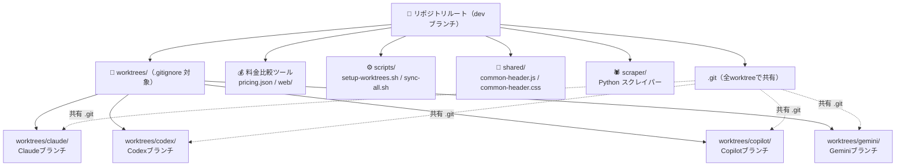
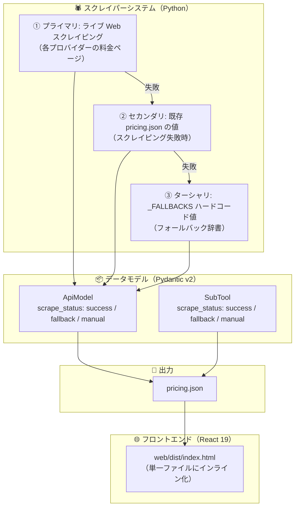
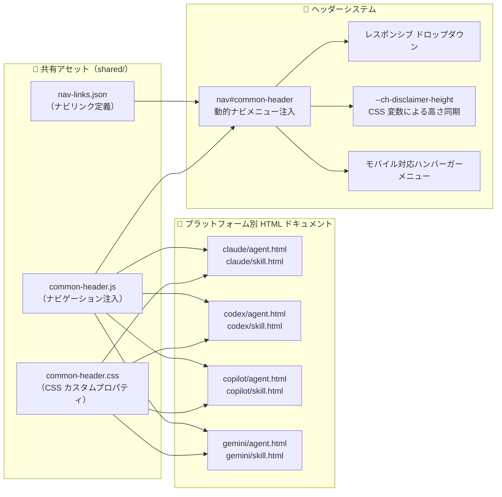
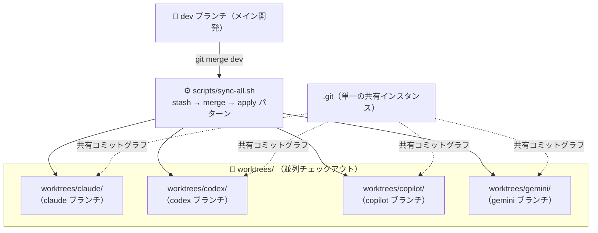
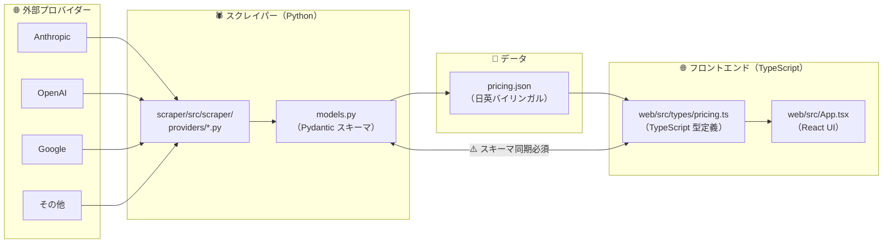
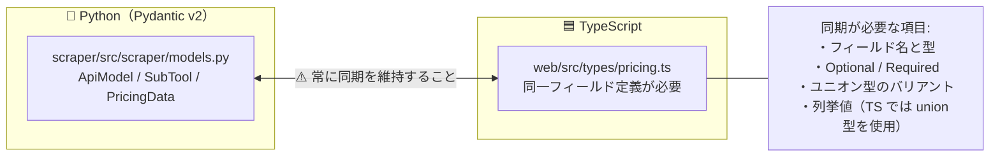

# 概要

**関連ソースファイル**: `CLAUDE.md` / `Gemini.md` / `git_worktree.html` / `web/index.html`

このドキュメントは、Comparison-of-LLMs リポジトリの構造・デュアルパーパース（二重目的）アーキテクチャ・主要サブシステムの概要を説明します。コードベースの構成と各コンポーネントの連携を理解するための出発点として機能します。

**スコープ**: このページではリポジトリの全体的な目的・ディレクトリ構造・アーキテクチャパターン・技術スタックを解説します。各サブシステムの詳細については以下を参照してください。

- Git worktree による並列開発システム → [Git Worktree Development System]
- 料金ツールの実装 → [LLM Pricing Comparison Tool]
- AI アシスタント設定ガイド → [AI Coding Assistant Documentation Guides]
- 共有コンポーネント → [Shared Infrastructure]

---

## リポジトリの目的

Comparison-of-LLMs リポジトリは、統合された単一コードベースの中で **2 つの異なる目的** を果たします。

| 目的 | 説明 | 主な成果物 |
|------|------|------------|
| **LLM 料金比較ツール** | AI モデルのコストをプロバイダー横断で計算・比較する Web アプリ | `pricing.json`, `web/dist/index.html` |
| **AI ドキュメントハブ** | Claude Code・OpenAI Codex・GitHub Copilot・Google Gemini/Antigravity の設定ガイド集 | `claude/*.html`, `gemini/*.html`, `codex/*.html`, `copilot/*.html`, `git_worktree.html` |

どちらの目的も、共有リソースを維持しながらプラットフォーム固有のドキュメントを同時並行で編集できる **git worktree ベースの並列開発アーキテクチャ** によって管理されています。

---

## リポジトリ構造



リポジトリルートには、全 worktree で共有される主 `.git` ディレクトリ、メイン開発ブランチ（`dev`）、料金ツール Web アプリが含まれます。`worktrees/` ディレクトリ（`.gitignore` で除外済み）は、プラットフォーム固有のドキュメント用フィーチャーブランチの並列チェックアウトを格納します。

---

## デュアルアーキテクチャの概要

### 料金比較ツールのアーキテクチャ

料金ツールは **3 段階フォールバック** を持つスクレイパー→フロントエンドのパイプラインを実装しています。



スクレイパーが使用する **3 段階フォールバック戦略**:

1. **プライマリ**: プロバイダーの料金ページからのライブ Web スクレイピング
2. **セカンダリ**: スクレイピング失敗時に既存の `pricing.json` の値を使用
3. **ターシャリ**: `_FALLBACKS` 辞書のハードコードされたフォールバック値

各 `ApiModel` および `SubTool` オブジェクトには、データの取得元を追跡する `scrape_status` フィールド（`"success"` / `"fallback"` / `"manual"`）が含まれます。

---

### ドキュメントシステムのアーキテクチャ



各ドキュメント HTML ファイルには手描き風 SVG 図が含まれており、相対パスで共有ヘッダーコンポーネントを参照します。ヘッダーシステムが提供する機能:

- `nav#common-header` 要素による動的ナビゲーションメニューの注入
- レスポンシブなドロップダウンメニュー
- CSS カスタムプロパティを使った免責事項の高さ同期
- モバイル対応ハンバーガーメニュー

---

## Git Worktree 並列開発システム

このリポジトリの最も特徴的なアーキテクチャが、**git worktree システム** です。リポジトリを複製することなく、4 つの AI プラットフォームドキュメントブランチで真の並列開発を可能にします。



**`git clone × 4` との比較**:

| 観点 | git clone × 4 | git worktree × 4 |
|------|--------------|-----------------|
| `.git` ディレクトリ | 4 つの独立したコピー | 1 つの共有インスタンス |
| ディスク使用量 | リポジトリサイズの約 4 倍 | 約 10% のオーバーヘッド |
| 共通変更の同期 | 4 箇所へ手動コピー | `git merge dev` で自動 |
| ブランチ切り替えコスト | N/A（独立リポジトリ） | ゼロ（全ブランチ常時チェックアウト） |
| スタッシュの共有 | 不可能 | サポート（共有 `.git`） |
| 履歴分岐リスク | 高い | 低い（共有コミットグラフ） |

`sync-all.sh` スクリプトは、コミットされていない作業を保護する **stash → merge → apply** パターンを使って、全 worktree に `dev` ブランチの更新を自動的にマージします。

---

## 技術スタック

### バックエンド（スクレイパーシステム）

| 技術 | 用途 | 主なファイル |
|------|------|------------|
| **Python 3.12+** | ランタイム環境 | `scraper/pyproject.toml` |
| **uv** | パッケージマネージャー | `scraper/.python-version` |
| **Pydantic v2** | データバリデーション / スキーマ定義 | `scraper/src/scraper/models.py` |
| **Playwright** | スクレイピング用ブラウザ自動化 | `scraper/src/scraper/browser.py` |
| **httpx** | HTTP クライアント | `scraper/src/scraper/providers/*.py` |
| **pytest** | テストフレームワーク | `scraper/tests/` |

### フロントエンド（Web アプリ）

| 技術 | 用途 | 主なファイル |
|------|------|------------|
| **React 19** | UI フレームワーク | `web/src/App.tsx` |
| **TypeScript** | 型安全性 | `web/tsconfig.json`, `web/tsconfig.app.json` |
| **Vite 7** | ビルドツール | `web/vite.config.ts` |
| **vite-plugin-singlefile** | アセットのインライン化（100MB 上限） | `web/vite.config.ts:9-12` |
| **Bun** | パッケージマネージャー & ランタイム | `web/package.json` |
| **Vitest** | テストフレームワーク | `web/package.json` |

### ドキュメントシステム

| 技術 | 用途 | 主なファイル |
|------|------|------------|
| **Mermaid v10** | 図のレンダリング | `git_worktree.html:7` |
| **SVG** | 手描き風ダイアグラム | `git_worktree.html:749-1244` |
| **Vanilla JS** | ヘッダー注入 | `shared/common-header.js` |
| **CSS カスタムプロパティ** | レスポンシブレイアウト | `shared/common-header.css` |

> **TypeScript 設定**: プロジェクトは `strict: true` と `erasableSyntaxOnly: true` を使用しており、TypeScript 5.5+ の要件に基づき **`enum` および `namespace` の使用が禁止** されています。

---

## 重要なデータフローと同期

### 料金データパイプライン



**重要な同期ポイント**:

1. **スキーマ同期**: `scraper/src/scraper/models.py`（Pydantic）と `web/src/types/pricing.ts`（TypeScript）は常に同一の構造を維持しなければなりません
2. **バイリンガルコンテンツ**: 全テキストフィールドは日英翻訳のために `*_ja` / `*_en` のペアを使用します
3. **ステータス追跡**: `scrape_status` フィールドでデータの取得元（`"success"` / `"fallback"` / `"manual"`）を追跡します

---

## エントリーポイントとコマンド

### クイックスタートコマンド

```bash
# フルパイプライン（スクレイピング + ビルド + コピー）
bash update.sh

# 為替レート更新のみ（スクレイピングをスキップ）
bash update.sh --no-scrape

# スクレイパーのみ実行
cd scraper && uv run python -m scraper.main --output ../pricing.json

# フロントエンド開発サーバー起動
cd web && bun run dev

# テスト実行
cd web && bun test
cd scraper && uv run pytest
```

### Worktree 管理

```bash
# 全 worktree を作成
bash scripts/setup-worktrees.sh

# dev の変更を全 worktree に同期
bash scripts/sync-all.sh

# 全 worktree を一覧表示
git worktree list
```

---

## ファイル構成パターン

| パターン | 配置場所 | 用途 |
|---------|---------|------|
| **プロバイダーモジュール** | `scraper/src/scraper/providers/<name>.py` | AI API 料金スクレイパー |
| **ツールモジュール** | `scraper/src/scraper/tools/<name>.py` | コーディングツールのサブスク料金スクレイパー |
| **React コンポーネント** | `web/src/components/` | UI ビルディングブロック |
| **プラットフォームドキュメント** | `<platform>/agent.html`, `<platform>/skill.html` | プラットフォーム固有ガイド（各約 1,500 行） |
| **Worktree チェックアウト** | `worktrees/<platform>/` | 独立ブランチチェックアウト（gitignore 対象） |
| **共有アセット** | `shared/` | 全 HTML から参照される共通ヘッダー JS/CSS |
| **自動化スクリプト** | `scripts/` | セットアップ・同期ユーティリティ |

**設定ファイル**:

- `.gitignore`: worktree の `.git` ファイルをネストリポジトリとして git が認識しないよう **`worktrees/` の記載が必須**
- `netlify.toml`: デプロイ設定（ビルドのみ実行、スクレイピングはスキップ）
- `pyproject.toml`: Python 依存関係とプロジェクトメタデータ
- `package.json`: フロントエンド依存関係とビルドスクリプト

---

## クロスシステムの統合ポイント

### 型システムの同期

最も重要な統合ポイントは、Python と TypeScript の **スキーマ同期** です。



> **重要**: `scraper/src/scraper/models.py` の `ApiModel`・`SubTool`・`PricingData` への変更は、`web/src/types/pricing.ts` に即座に反映しなければなりません。対象はフィールド名と型・Optional / Required の区別・ユニオン型のバリアント・列挙値（ただし TypeScript では `enum` キーワードは禁止のため union 型を使用）です。

### 共通ヘッダーの注入

全ドキュメント HTML ファイルは相対パスで共有ヘッダーアセットを参照します。

```html
<!-- 全ドキュメントファイルで使用されるパターン -->
<link rel="stylesheet" href="shared/common-header.css" />
<script src="shared/common-header.js" defer></script>
```

ヘッダーシステムの動作:

1. `nav#common-header` 要素を通じてナビゲーションを注入
2. `/nav-links.json` からナビリンクを読み込み（失敗時はハードコードされたデフォルトにフォールバック）
3. `--ch-disclaimer-height` CSS 変数で免責事項の高さを同期
4. `ResizeObserver` でレスポンシブな動作を制御

---

## AI エージェントによる変更ガイドライン

このリポジトリは AI 支援開発を前提として設計されています。全 AI エージェントは以下の制約を遵守してください。

### ❌ 禁止される操作

- ユーザーの明示的な指示なしにファイルを書き直すこと
- 依存関係のアップグレード
- ビルドツール設定ファイルの変更（`vite.config.ts`・`tsconfig.json`・`pyproject.toml`）
- `<div class="mermaid">` ブロック内の Mermaid 図コンテンツをインデントすること（構文エラーの原因）
- Mermaid のステートメントを 1 行に連結すること（改行による区切りが必要）
- ユーザーへの確認なしに AI モデルのバージョン番号をドキュメントに追記すること

### ✅ 許可される操作

- テストの追加（テストファイルが存在する場合またはユーザーが要求した場合）
- インポートの修正
- CI/CD ワークフローの修正
- 型の修正
- 既存コードのバグ修正

### コミット前の検証

コミット前に以下を確認してください。

1. `cd web && bun run build` が成功すること
2. `cd web && bun test` が通過すること
3. `cd scraper && uv run pytest` が通過すること
4. 意図しない設定ファイルの変更がないこと
5. `models.py` と `pricing.ts` のスキーマが同期されていること

---

## 次のステップ

このリポジトリをより深く理解するために、以下の各ドキュメントを参照してください。

- **[Git Worktree Development System]** — Worktree アーキテクチャの詳細
- **[LLM Pricing Comparison Tool]** — スクレイパーとフロントエンドの実装
- **[AI Coding Assistant Documentation Guides]** — プラットフォーム固有の設定
- **[Shared Infrastructure]** — 共通コンポーネントと自動化スクリプト
