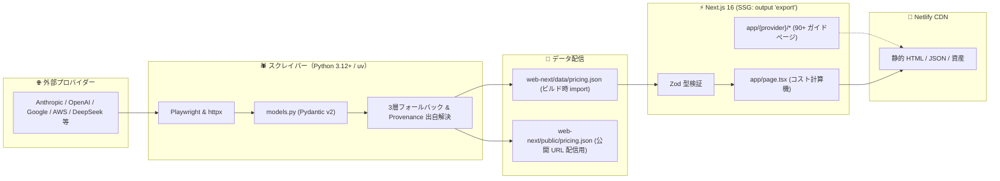

# LLM-Studies (AI Model Cost Calculator & AI Studies Hub)

最終更新日: 2026-09-18

[](https://nextjs.org/)
[](https://react.dev/)
[](https://www.python.org/)
[](https://vitest.dev/)
[](https://docs.pytest.org/)
[](LICENSE)

LLM-Studies（AI-Model-Cost-Calculator）は、**「AI モデル・コーディングツールの料金比較計算機」** と **「AI エンジニアリング・ガバナンス・実践ガイドハブ」** の 2 つの役割を統合した Web アプリケーション基盤です。

---

## 主な目的と機能

### 1. LLM / AI ツール料金計算機 (Cost Calculator)

- **マルチプロバイダー対応**: OpenAI, Anthropic, Google, AWS Bedrock, DeepSeek, xAI, Moonshot, Zhipu など主要 77 以上の最新 API モデルの価格を網羅。
- **コーディングツール・サブスク比較**: GitHub Copilot, Cursor, Windsurf, Claude Code, JetBrains, Codex, Antigravity など 33 以上の開発ツールの価格とプランを比較。
- **高精度なコスト試算**: 入力/出力トークン比率、キャッシュ利用、時間/日/月/年単位でのリアルタイム見積もり。
- **為替レート自動連動**: Frankfurter API から最新の USD/JPY 為替レートを取得し、日本円（JPY）換算表示。
- **3 層フォールバック & Provenance 追跡**: スクレイプ成功 → 履歴 provenance 値 → ハードコード定義による強固なデータ完全性。

### 2. AI エンジニアリング & ガバナンス ガイドハブ (Studies Hub)

- **90 以上の専門ガイド**: Claude Code, OpenAI Codex, GitHub Copilot, Google Gemini / Antigravity の活用法から、AI ガバナンス（ITIL AI Governance 等）、AI セキュリティ、RAG、マルチモーダル、コンテキストエンジニアリング、CI/CD 自動化、推薦書籍ガイドまでを網羅。
- **100% Faithful 完全移植**: 原本の章立て、詳細な表、コード例、Mermaid 図解、実践チェックリスト、参考文献リンクを完全再現。
- **快適な読書体験**: 目次スクロール追従（TOC Observer）、シンタックスハイライト、ワンクリックコードコピー、横断検索、What's New、RSS フィード対応。

---

## アーキテクチャ

```text
LLM-Studies/
├── scraper/              Python 3.12+ スクレイパー (uv, Pydantic v2, Playwright, httpx)
│   └── src/scraper/
│       ├── main.py            CLI エントリポイント
│       ├── models.py          PricingData / ApiModel / SubTool スキーマ (SSoT)
│       ├── provenance.py      出自管理・3層フォールバック解決
│       ├── exchange.py        為替レート取得
│       ├── providers/         API プロバイダー別スクレイパー (anthropic, openai, google, aws, etc.)
│       └── tools/             コーディングツール別スクレイパー (cursor, copilot, windsurf, etc.)
├── web-next/             Next.js 16 + React 19 + TypeScript + Tailwind CSS v4 (Bun)
│   ├── app/
│   │   ├── layout.tsx         ルートレイアウト (SiteHeader / DisclaimerBanner マウント)
│   │   ├── page.tsx           コスト計算機ホーム (Server Component + Zod 検証)
│   │   ├── {claude,google,codex,copilot,agent,security,governance,books,etc.}/  各分野のガイド群
│   │   ├── search/            横断検索機能
│   │   ├── whats-new/         新着・最近更新一覧
│   │   └── sitemap.ts         page-registry からの全ルート自動生成
│   ├── components/            React コンポーネント (ApiTable, SubTable, MermaidDiagram 等)
│   ├── lib/                   純粋関数・設定 (page-registry.ts, cost.ts, pricing.ts, etc.)
│   ├── types/                 TypeScript 型定義 (Pydantic models.py と厳格同期)
│   └── data/pricing.json      ビルド時インポート用データ
├── docs/                 プロジェクト仕様書・設計書・テスト進捗記録
├── archive/              移行元 HTML/Markdown の退避保存場所 (削除厳禁)
├── scripts/              Markdown 整形・原本照合監査スクリプト
├── docker-compose.yml    Docker 開発・実行環境定義
├── Makefile              共通運用コマンド
└── update.sh             データ更新オーケストレーター (scrape → copy → build)
```

---

## データフロー


```mermaid
flowchart LR
    subgraph PROVIDERS["🌐 外部プロバイダー"]
        P1["Anthropic / OpenAI / Google / AWS / DeepSeek 等"]
    end

    subgraph SCRAPER["🕷️ スクレイパー（Python 3.12+ / uv）"]
        SC["Playwright & httpx"]
        MODEL_PY["models.py (Pydantic v2)"]
        FALLBACK["3層フォールバック & Provenance 出自解決"]
    end

    subgraph DATA["📄 データ配信"]
        JSON_DATA["web-next/data/pricing.json (ビルド時 import)"]
        JSON_PUB["web-next/public/pricing.json (公開 URL 配信用)"]
    end

    subgraph FRONTEND["⚡ Next.js 16 (SSG: output 'export')"]
        ZOD["Zod 型検証"]
        HOME["app/page.tsx (コスト計算機)"]
        GUIDES["app/{provider}/* (90+ ガイドページ)"]
    end

    subgraph CDN["🚀 Netlify CDN"]
        OUT["静的 HTML / JSON / 資産"]
    end

    P1 --> SC --> MODEL_PY --> FALLBACK
    FALLBACK --> JSON_DATA
    FALLBACK --> JSON_PUB
    JSON_DATA --> ZOD --> HOME
    GUIDES -.-> OUT
    HOME --> OUT
```

1. **スクレイプ**: `scraper/` が各社料金ページから最新データを抽出。
2. **出自管理**: 失敗時は `provenance.py` の 3 層フォールバック機構により過去の確定値またはハードコード値を安全に採用。
3. **同期**: `update.sh` が `web-next/` 内の静的インポート用および配信用の 2 箇所へデータを同期。
4. **検証と静的出力**: Next.js ビルド時に Zod で厳格検証し、`output: 'export'` で純静的サイトとして `out/` を生成、Netlify へ配信。

---

## 技術スタック

| 分野 | 技術 | 用途 |
|---|---|---|
| **フロントエンド** | **Next.js 16 (App Router)** | SSG（静的エクスポート）フレームワーク |
| | **React 19** | UI ライブラリ |
| | **TypeScript** | 静的型検査 (`strict: true`, `erasableSyntaxOnly: true`) |
| | **Tailwind CSS v4** + CSS Modules | デザイントークン & コンポーネントスタイリング |
| | **Bun** | パッケージマネージャー & JS ランタイム |
| | **Vitest** | フロントエンド契約テスト・単体テスト (1638+ tests) |
| | **Biome** | 高速 Linter / Formatter |
| | **Zod** | 実行時データバリデーション |
| **バックエンド** | **Python 3.12+** | データ抽出ランタイム |
| | **uv** | 高速 Python パッケージ・仮想環境マネージャー |
| | **Pydantic v2** | スキーマ定義・型定義の Single Source of Truth (SSoT) |
| | **Playwright** | ヘッドレスブラウザによる動的コンテンツスクレイピング |
| | **httpx** | 非同期・同期 HTTP クライアント |
| | **pytest** | スクレイパー単体テスト・契約テスト (100 tests) |
| **インフラ** | **Netlify** | CDN 静的ホスティング |
| | **Docker / Compose** | コンテナ化された開発・ビルド環境 |

---

## クイックスタート

### 1. Docker を使用する場合（推奨）

Docker と Docker Compose がインストールされていれば、ローカル環境を汚さずに全機能を利用できます。

```bash
# 全 Docker イメージのビルド
make build-images

# 最新価格データのスクレイピング実行
make scrape

# 開発サーバー起動（http://localhost:3000）
make dev

# 静的サイトのビルド（web-next/out/ へエクスポート）
make build

# 全テストの実行（Vitest + Pytest）
make test
```

### 2. ネイティブ環境でセットアップする場合

#### 前提条件
- [Python 3.12+](https://www.python.org/)
- [uv](https://docs.astral.sh/uv/)
- [Bun](https://bun.sh/)

```bash
# 1. バックエンド（スクレイパー）のセットアップ
cd scraper
uv sync
uv run playwright install chromium
cd ..

# 2. フロントエンドのセットアップ
cd web-next
bun install
cd ..

# 3. データ取得とビルド
bash update.sh

# 4. 開発サーバーの起動
cd web-next
bun run dev
```

---

## 主要コマンド一覧

| 操作 | Docker (Makefile) | ネイティブコマンド |
|---|---|---|
| **開発サーバー** | `make dev` | `cd web-next && bun run dev` |
| **価格スクレイプ** | `make scrape` | `bash update.sh` |
| **為替のみ更新** | `make scrape-no-scrape` | `bash update.sh --no-scrape` |
| **静的ビルド** | `make build` | `cd web-next && bun run build` |
| **フロントエンドテスト** | `make test-web` | `cd web-next && bun run test` |
| **バックエンドテスト** | `make test-scraper` | `cd scraper && uv run pytest` |
| **型チェック** | `make typecheck` | `cd web-next && bun run typecheck` |
| **コードリント** | `make lint` | `cd web-next && bun run lint` |

---

## 品質保証とテスト方針

本リポジトリでは厳格なテスト駆動開発（TDD）と機械的検証を義務付けています。

1. **契約テスト (Contract Tests)**:
   - 全 90 以上のガイドページに対し、見出し順序の完全一致（`toEqual([...EXPECTED_H2])`）、リンク安全属性、Mermaid 図解描画、コードブロック要素の存在を検証。
2. **原本照合監査 (Source Parity Audit)**:
   - 原本 HTML/Markdown からの移植時、内容の脱落を防止するため照合監査スクリプトを実行し `exit code 0` を確認。
   ```bash
   bun .claude/skills/nextjs-page-migration/scripts/audit_source_parity.mjs <原本ファイル> <page.tsx>
   ```
3. **型パリティ検証**:
   - バックエンドの Pydantic モデル（`models.py`）とフロントエンドの TypeScript 型（`pricing.ts`）の型整合性をコンパイル時に検証。

---

## AI 支援開発規約

本プロジェクトは Claude Code, Gemini CLI, Antigravity, OpenAI Codex 等の AI エージェントとのペアプログラミングを前提に最適化されています。

エージェントが作業を開始する際は、以下のファイルを順に確認してください：
1. [`CODEX.md`](CODEX.md): 作業種別に対応するスキル・ルールの必読ルーティング表
2. [`CLAUDE.md`](CLAUDE.md) / [`GEMINI.md`](GEMINI.md) / [`AGENTS.md`](AGENTS.md): 全体の基本方針・禁止事項
3. [`docs/PROGRESS.md`](docs/PROGRESS.md): 最新の開発ステータスと再開手順

### 主な絶対遵守事項
- **要約・省略の禁止**: 原本からのドキュメント移行時は、一切の縮約や代表抽出を認めず、忠実に全要素を移植すること。
- **原本ファイルの削除禁止**: 移行済みの HTML/Markdown ファイルは削除せず、必ず `archive/` ディレクトリ配下に退避すること。
- **リポジトリ全体への一括自動フォーマット禁止**: `bun run lint:fix` や `biome check --write` は対象ファイル単位で実行すること。
- **PII / ローカル絶対パスのコミット禁止**: コミット差分に `/Users/johndoe/...` 等のユーザー名を含むローカルパスが含まれていないことを確認すること。

---

## 関連ドキュメント

- [`docs/PROGRESS.md`](docs/PROGRESS.md): 開発進捗・テスト件数・最新コミット記録
- [`docs/README.md`](docs/README.md): サブシステム・アーキテクチャ詳細解説
- [`docs/TESTING.md`](docs/TESTING.md): テスト戦略と実行ガイド
- [`docs/archive/`](docs/archive/): 移行計画書等のアーカイブ

---

## ライセンス

[MIT License](LICENSE)
