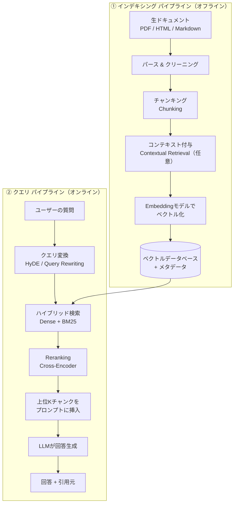
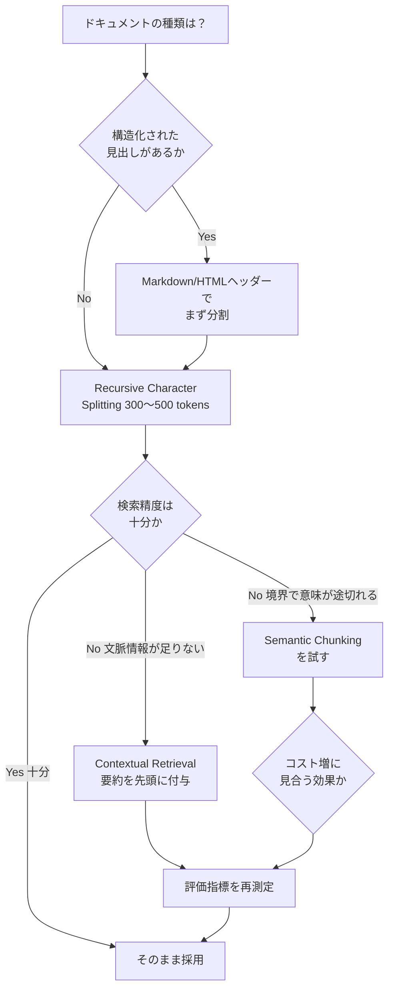
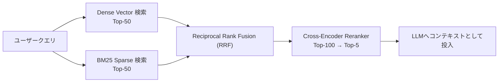
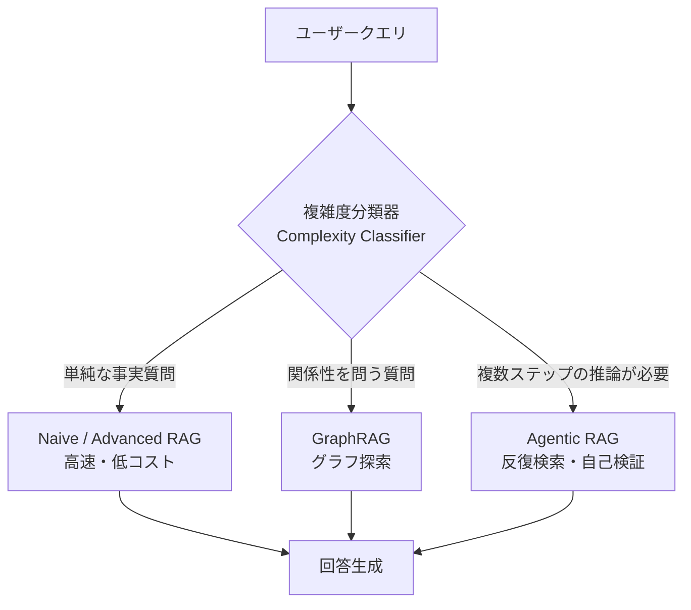

# RAG（Retrieval-Augmented Generation）と Embeddings 完全ガイド
### 初学者のためのステップバイステップ・ベストプラクティス（2026年版）

> 本ガイドは2026年7月時点の最新情報をもとに、RAG（検索拡張生成）と Embedding（埋め込み）について、ゼロから実務レベルまで理解できるように解説したものです。各セクションの末尾に参照した一次情報源のURLを記載しています。

---

## 目次

1. [はじめに：RAGとは何か](#1-はじめにragとは何か)
2. [RAGの全体アーキテクチャ](#2-ragの全体アーキテクチャ)
3. [Embeddings（埋め込み）の基礎知識](#3-embeddings埋め込みの基礎知識)
4. [ステップ1：ドキュメントの前処理とチャンキング戦略](#4-ステップ1ドキュメントの前処理とチャンキング戦略)
5. [ステップ2：Embeddingモデルの選定](#5-ステップ2embeddingモデルの選定)
6. [ステップ3：ベクトルデータベースの選択](#6-ステップ3ベクトルデータベースの選択)
7. [ステップ4：検索（Retrieval）の最適化](#7-ステップ4検索retrievalの最適化)
8. [ステップ5：生成（Generation）とプロンプト設計](#8-ステップ5生成generationとプロンプト設計)
9. [ステップ6：評価（Evaluation）](#9-ステップ6評価evaluation)
10. [発展的アーキテクチャ：Agentic RAG / GraphRAG / Adaptive RAG](#10-発展的アーキテクチャagentic-rag--graphrag--adaptive-rag)
11. [本番運用のベストプラクティス](#11-本番運用のベストプラクティス)
12. [よくある失敗パターンと対策](#12-よくある失敗パターンと対策)
13. [まとめ：実装チェックリスト](#13-まとめ実装チェックリスト)
14. [参考文献一覧（全URL）](#14-参考文献一覧全url)

---

## 1. はじめに：RAGとは何か

### 1.1 RAGの基本概念

RAG（Retrieval-Augmented Generation、検索拡張生成）は、LLM（大規模言語モデル）が回答を生成する前に、外部の知識ソース（社内ドキュメント、PDF、データベースなど）から関連情報を検索し、その情報を根拠として回答を組み立てるアーキテクチャです。

イメージとしては、LLM単体は「閉じた本の試験を受ける学生」、RAGを組み込んだLLMは「参考資料を持ち込める試験を受ける学生」に例えられます。学習データが固定された時点で凍結されているLLMに対し、RAGは社内文書・製品カタログ・規制文書などの参照資料を、回答を書く前に参照させることができます。

RAGという用語自体は、2020年にMeta AI（当時のFacebook AI Research）の Patrick Lewis らが NeurIPS で発表した論文で提案されました。この論文では、事前学習済みのretriever（検索器）とgenerator（生成器）を組み合わせることで、生成器単体よりも事実性・多様性・具体性に優れた回答が得られることが示されました。

### 1.2 なぜ2026年現在、RAGが「エンタープライズAIのデフォルト」なのか

2026年時点で、RAGはほぼすべてのチャットボット・社内ナレッジベース・AIアシスタントで採用される標準アーキテクチャになっています。理由は主に次の3点です。

- **ファインチューニングより安価・高速**：モデルを再学習させず、外部データを差し替えるだけで知識を更新できる
- **最新情報への対応**：LLMの学習データカットオフ以降の情報や、社内限定の非公開情報にも対応できる
- **引用・説明可能性**：どの文書のどの部分を根拠に回答したかを提示できるため、監査や検証がしやすい

一方で、素朴な（Naive）RAG実装は本番環境で失敗しやすいという指摘も多くのソースで一致しています。ある実務ガイドでは、RAGパイプラインが失敗する原因の約7割が生成（Generation）ではなく検索（Retrieval）段階にあると分析されています。つまり「LLMが賢く答えているように見えて、実は間違った文書を根拠にしている」というケースが最大の落とし穴です。

### 参照URL（セクション1）

- https://decodethefuture.org/en/rag/
- https://lushbinary.com/blog/rag-retrieval-augmented-generation-production-guide/
- https://www.techment.com/blogs/rag-in-2026/
- https://nerdleveltech.com/guides/rag-systems

---

## 2. RAGの全体アーキテクチャ

RAGシステムは大きく分けて **「インデキシング（indexing）パイプライン」（オフライン処理）** と **「クエリ（query）パイプライン」（オンライン処理）** の2つで構成されます。



### 2.1 各ステップの役割

| ステップ | 処理内容 | 本ガイドの該当章 |
|---|---|---|
| ① パース & クリーニング | PDF/HTML/Markdownからテキストを抽出し、ノイズ（ヘッダー・フッター・広告など）を除去 | 4章 |
| ② チャンキング | 長い文書を検索可能な単位（チャンク）に分割 | 4章 |
| ③ コンテキスト付与 | チャンクが文脈を失わないよう要約情報を付加（Contextual Retrieval） | 4章 |
| ④ ベクトル化 | Embeddingモデルでチャンクを数値ベクトルに変換 | 3章・5章 |
| ⑤ 保存 | ベクトルデータベースにベクトル＋メタデータを保存 | 6章 |
| ⑥ クエリ変換 | ユーザーの質問を検索に適した形に変換（HyDE等） | 7章 |
| ⑦ ハイブリッド検索 | Dense（意味検索）とBM25（キーワード検索）を組み合わせて候補を取得 | 7章 |
| ⑧ Reranking | 候補チャンクを精密に並べ替え、上位のみ抽出 | 7章 |
| ⑨ 生成 | LLMが検索結果を根拠に回答を生成 | 8章 |

複数のソースが共通して指摘しているのは、「単純な"埋め込み→ベクトルDB格納→上位k件取得→生成"という素朴な構成はデモでは動くが、本番では次の3つの理由で破綻しやすい」という点です。

1. **意味的ギャップ（Semantic gap）**：ユーザーの言葉と文書中の言葉が異なる（例：「解約したい」 vs 文書中の「アカウント終了ポリシー」）
2. **コンテキスト汚染**：本当に関連するチャンクが2件しかないのに10件取得すると、LLMが全体を平均化してしまい回答が曖昧になる
3. **チャンキングの副作用**：固定長分割によって文の途中・表の途中・コードの途中で切れてしまい、取得はできても実質的に使えないチャンクになる

### 参照URL（セクション2）

- https://lushbinary.com/blog/rag-retrieval-augmented-generation-production-guide/
- https://nerdleveltech.com/guides/rag-systems
- https://aiml.qa/vector-database-comparison-2026/

---

## 3. Embeddings（埋め込み）の基礎知識

### 3.1 Embeddingとは何か

Embedding（埋め込み）とは、テキスト・画像・音声などの非構造化データを、意味を保持したまま数値ベクトル（数字の配列）に変換したものです。ニューラルネットワークによって生成されたこのベクトルは、高次元の「意味空間」の中の1点として表現され、意味が近いテキスト同士は空間内でも近い位置に配置されます。

例えば「software engineer」と「developer」という単語は表記が異なりますが、Embeddingベクトル上では非常に近い位置に配置されます。これにより、キーワードが完全一致しなくても「意味的に近い」文書を検索できるようになります。

### 3.2 コサイン類似度（Cosine Similarity）

2つのベクトルがどれだけ近いか（＝意味的に似ているか）を測る最も一般的な指標がコサイン類似度です。2つのベクトルのなす角度の余弦（コサイン）を計算し、1に近いほど類似、0に近いほど無関係、-1に近いほど正反対の意味であることを示します。RAGの検索ステップでは、ユーザーの質問ベクトルと各チャンクのベクトルとの間でコサイン類似度（または内積・ユークリッド距離）を計算し、類似度が高い順に候補を取得します。

### 3.3 次元数（Dimensions）とMatryoshka Representation Learning（MRL）

Embeddingベクトルの次元数は、モデルによって256〜4096程度まで幅があります。次元数が大きいほど表現力は高まりますが、ストレージコストと検索速度に直接影響します。

2026年時点で主要なEmbeddingモデルのほとんどが採用しているのが **Matryoshka Representation Learning（MRL）** という学習手法です。これは「ロシアの入れ子人形（マトリョーシカ）」のように、1つのベクトルの前半部分だけを切り出しても、意味的に重要な情報が保持されるように学習する手法です。

MRLを使うと、例えば3072次元でEmbeddingを1回生成し、後から256次元・768次元などに切り詰める（truncateする）だけで、精度の劣化を最小限に抑えつつストレージコストを削減できます。実例として、OpenAIのtext-embedding-3-largeを256次元に切り詰めた場合でも、旧モデルのtext-embedding-ada-002をフル次元（1536次元）で使うより高い精度（MTEBベンチマーク）を示したという報告があります。Google の gemini-embedding-001 も同様にMRLを採用しており、3072次元から768次元まで、recall@10の劣化を1%未満に抑えながら縮小できるとされています。

### 3.4 MTEBベンチマークとは

**MTEB（Massive Text Embedding Benchmark）** は、Embeddingモデルの性能を測る業界標準のベンチマークで、検索（Retrieval）・分類（Classification）・クラスタリング（Clustering）・意味的類似度（STS）など複数のタスクにまたがる評価を行います。モデル選定の出発点として広く参照されていますが、複数の実務ガイドが「MTEBの総合スコアだけで選ぶのは危険」と警告しています。理由は、MTEBは平均的なタスク性能を示すものであり、法律文書・医療文献・多言語コーパスなど特定ドメインでの実際の検索精度とは乖離することがあるためです。実際の自社データ・自社クエリでのオフライン評価（後述するRAGAS等）と組み合わせて判断することが推奨されています。

### 3.5 Dense Embedding と Sparse Embedding

| 種類 | 説明 | 得意なこと | 代表例 |
|---|---|---|---|
| Dense Embedding | 各次元に意味情報を分散させた密なベクトル | 言い換え・同義語・意味的な近さの検出 | OpenAI text-embedding-3、Voyage、Cohere embed-v4、Gemini Embedding |
| Sparse Embedding | ほとんどの値が0で、特定の単語にのみ重みを持つベクトル（BM25等） | 型番・固有名詞・専門用語の完全一致検索 | BM25、SPLADE |

Dense（意味検索）だけでは、"SKU AZ-4471"のような型番や固有名詞の完全一致検索に弱いという弱点が繰り返し報告されています。これが後述する「ハイブリッド検索」が2026年の標準構成になっている理由です。

### 参照URL（セクション3）

- https://aimultiple.com/embedding-models
- https://www.mindstudio.ai/blog/what-is-matryoshka-representation-learning
- https://www.mindstudio.ai/blog/matryoshka-representation-learning-gemini-embedding-2
- https://modal.com/blog/mteb-leaderboard-article
- https://awesomeagents.ai/leaderboards/embedding-model-leaderboard-mteb-april-2026/
- https://aitechconnect.in/news/hybrid-search-rag-bm25-vector-production

---

## 4. ステップ1：ドキュメントの前処理とチャンキング戦略

### 4.1 なぜチャンキングが重要なのか

複数の2026年時点の実務ガイドが一致して指摘しているのは、「チャンクサイズは重要だが、多くのチームが思っているほど最重要のボトルネックではない」という点です。むしろ、古くなった・管理されていない・意味的に薄いソースデータの方が本番RAG失敗の根本原因になりやすいとされています。とはいえ、チャンキング戦略は依然として品質を左右する重要な4本柱の1つ（チャンキング・ハイブリッド検索・Reranker・ロングコンテキストとの使い分け）として扱われています。

### 4.2 チャンキング戦略の比較



| 戦略 | 概要 | 向いているケース | コスト・注意点 |
|---|---|---|---|
| 固定長分割（Fixed-size） | 文字数・トークン数で機械的に分割 | プロトタイプ、動作確認 | 文・表・コードの途中で切れやすい |
| Recursive Chunking | 段落→文の順に階層的に分割し、構造をなるべく保持 | ほとんどの実務用途のデフォルト | LangChain等の既定手法、300〜500トークン＋10〜20%オーバーラップが目安 |
| Semantic Chunking | 文ごとの埋め込み類似度を計算し、類似度が閾値を下回った箇所で新しいチャンクを開始 | ナレッジベース、技術文書など意味の切れ目が重要な文書 | 索引作成時にEmbedding計算が必要なため、トークンベース手法より大幅に低速（ベンチマークでは約14倍遅いという報告もある） |
| Late Chunking | 文書全体を先にトークンレベルで埋め込み、その後チャンク境界を適用（mean pooling） | 見出し・代名詞・相互参照などチャンク単体では意味が曖昧になる文書 | 長文コンテキスト対応のEmbeddingモデルが必要 |
| Contextual Retrieval | 各チャンクの先頭に、文書内でのそのチャンクの位置づけを説明する短い要約をLLMで生成し付加してから埋め込む | 財務報告書など、チャンク単体では主語や背景が欠落しやすい文書 | Anthropicが2024年に提案。Reranking併用でtop-20取得失敗率を最大67%削減したと報告されている |
| Agentic Chunking | LLMに意味的な境界を判断させてチャンクを決定 | 複雑な構造を持つ長文文書 | 処理コストが高く、大規模コーパスには不向き |
| Parent Document（Small-to-Large） | 小さい単位で検索し、実際にLLMへ渡す際は親チャンク（周辺の広い文脈）を使う | ピンポイントな検索と広い文脈理解の両方が必要なQ&A | 実装がやや複雑 |

### 4.3 チャンクサイズとオーバーラップの目安

複数の実務ガイドで共通する初期値は「300〜500トークン、10〜20%のオーバーラップ」です。ある2026年2月のベンダーベンチマークでは、7つの戦略のうち Recursive 512トークン分割が最も高いスコアを記録し、別のLlamaIndexの調査では1024トークン付近が忠実性（Faithfulness）のピークに近いとされています。512〜1024トークンの範囲が妥当な出発点と言えます。

一方で、オーバーラップの効果については意見が分かれています。オーバーラップは文の分断を緩和する一般的な手法として推奨される一方、2026年1月のある系統的分析（SPLADE検索＋Mistral-8Bを用いたNatural Questionsでの検証）では、オーバーラップに測定可能な効果が見られず、インデックス作成コストが増えるだけだったという結果も報告されています。自社データで実際に検証することが重要です。

### 4.4 メタデータの付与

チャンクには必ずメタデータ（ソース文書名、セクション見出し、ページ番号、親チャンクID等）を含めることが推奨されています。これにより、引用表示・フィルタリング・階層的検索が可能になります。

### 4.5 Contextual Retrieval の実装イメージ

Anthropicが提案したContextual Retrievalは、次のようなプロンプトで各チャンクに文脈を付与します（概念イメージ）。

```
<document>
{{文書全体}}
</document>
このチャンクを文書全体の中に位置づける、検索性能向上のための
簡潔な説明を生成してください。

<chunk>
{{対象チャンク}}
</chunk>
```

文書全体を毎回プロンプトに含めるとコストが増大しますが、Claudeのプロンプトキャッシュ機能を使うことで、キャッシュ対象トークンのコストを大幅に抑えられます。試算例として、800トークンのチャンク・8,000トークンの文書・50トークンの指示・100トークンの生成コンテキストという条件では、文書100万トークンあたり約1.02ドルという一時的なコストで実装可能とされています。

### 参照URL（セクション4）

- https://www.callmissed.com/en/blog/rag-best-practices-2026
- https://www.digitalapplied.com/blog/rag-chunking-strategies-2026-retrieval-quality-playbook
- https://langcopilot.com/posts/2025-10-11-document-chunking-for-rag-practical-guide
- https://www.firecrawl.dev/blog/best-chunking-strategies-rag
- https://atlan.com/know/chunking-strategies-rag/
- https://www.anthropic.com/news/contextual-retrieval
- https://simonwillison.net/2024/Sep/20/introducing-contextual-retrieval/
- https://lushbinary.com/blog/rag-retrieval-augmented-generation-production-guide/

---

## 5. ステップ2：Embeddingモデルの選定

### 5.1 選定の判断軸

2026年の実務ガイドで共通して挙げられている判断軸は次の3点です。

1. **モダリティ**：テキストのみか、画像・音声・動画も含む「マルチモーダル」対応が必要か
2. **保存場所とセルフホスト可否**：APIサービスを使うか、自社インフラで運用するか
3. **多言語対応の要否**：日本語を含む多言語コーパスかどうか

自己ホスティング（BGE-M3、Jina、Nomic等）とAPI型（OpenAI、Voyage、Cohere、Google）の損益分岐点は、月間の埋め込み処理件数がおおよそ1,000万〜5,000万件を超えるあたりにあるとされています。それ以下の規模ではAPIの運用負荷の低さが優位に働くケースが多いです。

### 5.2 主要Embeddingモデル比較（2026年中頃時点）

| モデル | 提供元 | 次元数（MRL対応） | 特徴 | 傾向 |
|---|---|---|---|---|
| text-embedding-3-large / small | OpenAI | 3072（256まで縮小可） | 総合的に安定した既定選択肢。MTEBの検索・分類タスクで高水準 | 汎用途のデフォルトとして選ばれることが多い |
| voyage-4 / voyage-3-large / voyage-3.5-lite | Voyage AI（MongoDB傘下） | 256〜2048 | RAG特化。"似ているが違う"ネガティブサンプルを用いた学習で誤マッチを抑制。Voyage 4はMoE構成で共有ベクトル空間を採用 | 検索品質を最優先する場合の候補として頻繁に挙げられる |
| embed-v4.0 | Cohere | 256〜1536 | 多言語・マルチモーダル対応。同社のRerank APIと組み合わせる設計思想 | Rerankとセットで使うと真価を発揮するとされる |
| gemini-embedding-001 / Gemini Embedding 2 | Google | 768〜3072 | MRL採用。Gemini Embedding 2はテキスト・画像・動画・音声のマルチモーダル対応 | Google Cloudエコシステムでの利用に適する |
| BGE-M3 | BAAI（オープンソース） | 1024 | 100言語以上対応、dense/sparse両方を1回の呼び出しで出力可能 | セルフホストでの多言語対応の定番 |
| Jina Embeddings v5 / v4 | Jina AI | 64〜1024 | 32Kトークンの長文コンテキスト対応、89言語対応 | 長文書やLate Chunkingとの相性が良い |
| Qwen3-Embedding-8B | Alibaba（オープンソース） | 可変 | MTEB多言語リーダーボードで上位。GPU必須 | 自前でGPUインフラを持つチーム向け |

> 注意：上記スコアや価格は情報源（ベンダー独自ベンチマークを含む）によって数値が食い違うことがあります。特にベンダー公表の比較（例：Voyage対OpenAI、Cohere対OpenAIなど）は「自社モデルが有利になる条件」で計測されている場合があるため、必ず自社データ・自社クエリでの検証を行ってください。

### 5.3 日本語・多言語での注意点

多言語対応が必要な場合、BGE-M3やCohereの多言語モデルが定番の選択肢として挙げられています。ただし、英語で高スコアのモデルが必ずしも他言語で同等の性能を出すとは限らない点には注意が必要です。実際、あるベンダー比較では「英語だけで収束しているように見えても、ウクライナ語を加えると精度差が大きく開く」という開発者コメントが紹介されており、対象言語での実測評価が推奨されています。

### 5.4 ドメイン特化モデル

コード検索にはVoyage code系やGemini Embedding 2（MTEB Codeスコアが高い）、法律文書・金融文書には専用にファインチューニングされたBGEやQwen3系モデルが候補として挙げられています。汎用モデルで自社の検索評価スコアが頭打ちになった場合にのみ、ファインチューニングやドメイン特化モデルへの切り替えを検討するのが現実的な順序です。

### 参照URL（セクション5）

- https://aimultiple.com/embedding-models
- https://pecollective.com/tools/best-embedding-models/
- https://www.buildmvpfast.com/blog/best-embedding-model-comparison-voyage-openai-cohere-2026
- https://mixpeek.com/curated-lists/best-embedding-models
- https://www.openxcell.com/blog/best-embedding-models/
- https://www.aitechboss.com/best-embedding-models-2026/
- https://tensoria.fr/en/blog/embedding-models-2026-guide
- https://christhomas.co.uk/blog/2025/10/31/match-embedding-dimensions-to-your-domain-not-defaults/

---

## 6. ステップ3：ベクトルデータベースの選択

### 6.1 ベクトルデータベースの役割

Embeddingモデルはベクトルを生成するだけであり、それを保存し高速に検索するには別途ベクトルデータベースが必要です。多くの製品はHNSW（Hierarchical Navigable Small World）というグラフベースのアルゴリズムを採用しており、対数的な計算量で近似最近傍探索（ANN）を実現します。

### 6.2 主要ベクトルデータベース比較

| データベース | タイプ | 得意なこと | 弱点・注意点 |
|---|---|---|---|
| pgvector | PostgreSQL拡張 | 既存のPostgres資産との統合、トランザクション整合性、運用のシンプルさ | 大規模（1億ベクトル超）ではチューニングが必要。pgvectorscale拡張で高スケールも可能とする報告あり |
| Pinecone | フルマネージド専用DB | ゼロ運用負荷、スケーラビリティ、SLA | クローズドソース、HNSWパラメータの詳細チューニング不可、コストが積み上がりやすい |
| Qdrant | OSS（Rust実装） | フィルタリング性能、レイテンシの低さ、無料枠の大きさ | エコシステムがPinecone/Weaviateより小さい |
| Weaviate | OSS（Java実装） | ネイティブなハイブリッド検索（BM25+Vector）、自動ベクトル化モジュール、マルチテナンシー | 自己ホスト時のリソース消費が大きい、GraphQL APIの学習コスト |
| Milvus | OSS（CNCF） | 10億ベクトル級のスケール、複数インデックスタイプ、マルチモーダル対応 | 運用の複雑さが高く、Kubernetes運用力が必要 |
| Chroma | OSS（組み込み型） | プロトタイピングのしやすさ、Python内で完結 | 本番運用向けの高可用性・監視機能が手薄 |

### 6.3 選び方の目安

複数の実務ガイドに共通する判断フレームワークをまとめると、以下のようになります。

- **すでにPostgresを使っており、ベクトル数が1,000万未満** → pgvectorが第一候補
- **運用チームを持たず、マネージドサービスを希望** → Pinecone
- **ハイブリッド検索（BM25＋Vector）をネイティブに使いたい** → WeaviateまたはQdrant
- **フィルタ付き検索の速度を最優先** → Qdrant
- **1億〜10億ベクトル級の規模** → MilvusまたはPinecone
- **マルチモーダル（画像・テキストを同じインデックスで検索）** → WeaviateまたはLanceDB

複数のベンチマークが一致して指摘しているのは、「ベクトルデータベースの選定よりも、チャンキング戦略とEmbeddingの品質の方が最終的な検索精度に与える影響が大きい」という点です。データベース選びに時間をかけすぎず、まずは手元の技術スタックに合う選択肢（Postgres利用ならpgvector等）から始めて、実運用で不足が見えてから移行する、という段階的アプローチが推奨されています。

### 参照URL（セクション6）

- https://encore.dev/articles/best-vector-databases
- https://www.firecrawl.dev/blog/best-vector-databases
- https://www.datacamp.com/blog/the-top-5-vector-databases
- https://iternal.ai/insights/best-vector-databases-2026
- https://medium.com/@pratik-rupareliya/top-15-vector-databases-in-2026-a-production-decision-guide-from-100-enterprise-deployments-dd58a04f51a5
- https://www.digitalapplied.com/blog/vector-databases-for-ai-agents-pinecone-qdrant-2026
- https://aiml.qa/vector-database-comparison-2026/
- https://medium.com/data-science-collective/pinecone-vs-weaviate-vs-qdrant-vs-milvus-66d5bfbcc460
- https://vecstore.app/blog/vector-database-performance-compared
- https://www.kalviumlabs.ai/blog/vector-databases-compared-pgvector-pinecone-qdrant-weaviate/

---

## 7. ステップ4：検索（Retrieval）の最適化

### 7.1 ハイブリッド検索（Hybrid Search）

Dense Embeddingによる意味検索は言い換えに強い一方、型番・固有名詞などの完全一致検索には弱いという弱点があります。逆にBM25のようなキーワード検索（Sparse）は完全一致には強いものの、言い換え表現を拾えません。この両者を組み合わせる**ハイブリッド検索**が2026年時点の実務標準になっています。

ある2026年のEACL採択論文（金融文書、23,088クエリ、7,318文書を対象とした10手法の比較）では、テキストと表が混在する金融文書においてBM25が多くの指標で最先端のDense検索を上回ったという結果も報告されており、「Denseだけに頼らない」ことの重要性を裏付けています。

### 7.2 Reciprocal Rank Fusion（RRF）

ハイブリッド検索でDense検索とBM25検索の結果を統合する際の代表的な手法がRRF（Reciprocal Rank Fusion）です。RRFはスコアそのものではなく「順位（rank）」に基づいて統合するため、Dense検索のスコアとBM25のスコアのスケールが違うという問題（スコア不整合問題）を回避できます。



あるEコマース向けベンチマーク（WANDSデータセット）では、チューニング済みのハイブリッド構成がNDCGで0.7497を記録し、BM25単体（0.6983）・Dense単体（0.6953）のいずれよりも約7.4%高い結果を示しました。BM25単体とDense単体の性能差は統計的にほぼ同等であり、「どちらか一方が常に優れている」わけではなく、組み合わせること自体に価値があるという点が重要です。

### 7.3 Reranking（リランキング）

一次検索（Dense/BM25/ハイブリッド）で候補を50〜100件程度に絞り込んだ後、**Cross-Encoder型のReranker**でクエリとチャンクの組み合わせをより精密にスコアリングし、最終的に上位5〜10件程度に絞り込むのが定石です。

| Reranker | 提供元 | 特徴 |
|---|---|---|
| Rerank 3.5 | Cohere | 幅広いドキュメントで安定した既定値として推奨されることが多い |
| rerank-2.5 | Voyage AI | 指示追従性能、より大きなコンテキスト長 |
| bge-reranker-v2-m3 | BAAI（オープンソース） | セルフホスト可能、コスト最適化に向く |

Rerankerは「一次検索のRecallは高いがPrecisionが低い」場合に効果を発揮します。逆に一次検索でそもそも正解チャンクが候補に入っていない（Recallが低い）場合は、Rerankerをいくら強化しても改善しません。したがって、RerankerをONにした場合／OFFにした場合の両方で、NDCG・Recallの変化・追加レイテンシの3点（通称「evalトライアングル」）を同じクエリセットで比較することが推奨されています。参考値として、Cohere Rerank 3.5は2,000トークン未満のチャンクでp50あたり約80〜150ミリ秒、3,000トークンを超えると p99で200ミリ秒以上のレイテンシが追加されると報告されています。

### 7.4 クエリ変換（Query Transformation）

ユーザーの質問をそのまま検索に使うのではなく、検索に適した形に変換する手法群です。

- **HyDE（Hypothetical Document Embeddings）**：LLMに「もし理想的な回答があったら、どんな文章になるか」という仮の文書を生成させ、その仮想文書のEmbeddingを使って検索する手法
- **Query Rewriting（クエリ書き換え）**：曖昧・省略の多い質問を、検索しやすい明確な形に言い換える
- **Query Decomposition（クエリ分解）**：複数の論点を含む質問を、単一の論点に分解してそれぞれ検索する

ある学術研究（TREC DL 2019/2020データセットでの検証）では、教師あり手法がもっとも高い性能を示し、HyDEとハイブリッド検索を組み合わせた構成が最高スコアを記録した一方、クエリの書き換えや分解単体では検索性能の向上に必ずしもつながらなかったとされています。性能とレイテンシのバランスを考えると、「ハイブリッド検索＋HyDE」がデフォルトの推奨構成として挙げられています。

### 参照URL（セクション7）

- https://www.digitalapplied.com/blog/hybrid-search-bm25-vector-reranking-reference-2026
- https://denser.ai/blog/hybrid-search-for-rag/
- https://appscale.blog/en/blog/hybrid-search-and-reranking-production-rag-bm25-dense-cross-encoder-2026
- https://towardsdatascience.com/hybrid-search-and-re-ranking-in-production-rag/
- https://aitechconnect.in/news/hybrid-search-rag-bm25-vector-production
- https://futureagi.com/blog/evaluating-cohere-rerank-rag-2026/
- https://arxiv.org/pdf/2407.01219

---

## 8. ステップ5：生成（Generation）とプロンプト設計

### 8.1 検索結果をどのようにプロンプトに組み込むか

検索した上位チャンクをそのままLLMに投げるのではなく、以下の点に注意して設計することが推奨されています。

- **件数を絞る**：関連性の低いチャンクを大量に含めると、LLMが情報を平均化してしまい回答の質が下がる（コンテキスト汚染）
- **出典情報を明示する**：各チャンクにメタデータ（文書名・セクション・URL等）を付与し、LLMに引用を促す
- **ロングコンテキストとの使い分け**：モデルのコンテキストウィンドウが広くても、コンテキスト長が伸びるほど回答品質が劣化する「コンテキスト崖（context cliff）」現象が指摘されており、ある分析では約2,500トークン付近を境に応答品質が下がり始めるとされています。むやみに全文を詰め込むのではなく、RAGで本当に必要な情報だけを絞り込むことに意味があります

### 8.2 ハルシネーション（幻覚）対策としてのグラウンディング

RAGの主な目的の1つは、LLMの回答を検索結果に「グラウンディング（根拠付け）」し、ハルシネーションを抑えることです。実務ガイドでは、ハルシネーションのほとんどのケースは「LLMが何もないところから作り話をしている」のではなく、「間違ったコンテキストを検索してしまった結果、それをもっともらしく説明している」ことが原因だと繰り返し指摘されています。つまり、生成部分をいくらプロンプトエンジニアリングで改善しても、検索（Retrieval）が壊れていれば根本解決にはなりません。

### 8.3 プロンプト設計の基本パターン

一般的に推奨されるプロンプト構成要素は以下の通りです。

1. **役割・目的の明示**：何のためのアシスタントかを明確にする
2. **検索結果の提示**：出典情報付きでチャンクを列挙する
3. **回答ルールの明示**：「検索結果に含まれない情報は答えない」「不明な場合は不明と答える」といった制約を明記する
4. **引用形式の指定**：どの文書のどの部分を根拠にしたか明示させる

### 参照URL（セクション8）

- https://www.firecrawl.dev/blog/best-chunking-strategies-rag
- https://nerdleveltech.com/guides/rag-systems
- https://lushbinary.com/blog/rag-retrieval-augmented-generation-production-guide/

---

## 9. ステップ6：評価（Evaluation）

### 9.1 なぜ評価基盤が必須なのか

「動いているように見える」ことと「実際に正しい」ことは別物です。2026年には新規RAGデプロイの60%が初日から体系的な評価を組み込んでいるという調査もあり、2025年初頭の30%未満から大きく増加しています。これは、業界全体がRAGを「作って終わり」ではなく「継続的に測定するもの」として扱うようになってきたことを示しています。

### 9.2 RAGAS（Retrieval Augmented Generation Assessment）の4大指標

RAGASは2026年時点で最も広く採用されているオープンソースのRAG評価フレームワークです。評価は大きく「検索段階の指標」と「生成段階の指標」に分かれます。

| 指標 | 問い | 段階 | 目安の合格ライン |
|---|---|---|---|
| Context Precision（文脈適合率） | 取得したチャンクは実際に関連しているか | 検索 | 0.7〜0.8以上 |
| Context Recall（文脈再現率） | 関連する情報をすべて取得できたか | 検索 | 0.8前後 |
| Faithfulness（忠実性） | 生成された回答は取得した文脈と矛盾していないか（ハルシネーションしていないか） | 生成 | 0.9以上を目標にすることが多い |
| Answer Relevancy（回答適合性） | 回答は質問に対して的確に答えているか | 生成 | 0.85前後 |

補助的な指標として、正解データ（ground truth）がある場合には **Answer Correctness（回答正確性）** を使い、事実の重なりと意味的類似度を組み合わせて生成回答と正解を直接比較することもあります。また、ラベル付きの正解文書がある場合はPrecision@k・Recall@k・MRR（Mean Reciprocal Rank）・NDCGといった伝統的な情報検索指標も併用されます。

### 9.3 診断の実例：「忠実性は高いのに実際は間違っている」ケース

ある事例（法律関連のRAG）では、オフライン評価でFaithfulness 0.91という高スコアを記録して本番稼働しましたが、3週間後にユーザーから「重要な条文が回答に含まれていない」という苦情が相次ぎました。ダッシュボードのFaithfulnessは依然として0.91のままでしたが、Context Recallを測定すると0.62まで落ち込んでいたことが判明しました。原因は、複数の条文にまたがる複雑な質問（multi-hop）に対して検索側が2つ目の条文を取りこぼしていたことで、生成側は取得できた部分的な文脈から一貫性のある回答を作ってしまっていた、というものです。この事例は「生成指標だけを見ていると検索の劣化を見逃す」という典型的な落とし穴を示しています。

### 9.4 評価ツールの使い分け

- **Ragas**：チャンキングやEmbeddingモデルをチューニングする際の、オフラインでの実験的評価に向く
- **DeepEval**：CI/CDパイプラインに組み込み、リリース前のゲート（品質基準を満たさない変更をブロックする）として使う
- **TruLens / LangSmith / Arize Phoenix**：本番環境での継続的なオブザーバビリティ（監視）として使う

多くの実務ガイドが推奨する出発点は、「50〜200件程度の代表的な質問と、人手で検証した理想的な回答（および可能であれば正解の出典文書）」から成るゴールデンデータセットを作成することです。まずこのデータセットでオフライン評価を行い、その後にLLM-as-judge（別のLLMが回答を採点する手法）を用いた継続的な本番監視へと発展させていく流れが一般的です。

### 参照URL（セクション9）

- https://qaskills.sh/blog/rag-evaluation-metrics-complete-2026
- https://futureagi.com/blog/rag-evaluation-metrics-2025/
- https://datavlab.ai/post/rag-evaluation-methods-metrics-2026-guide
- https://atlan.com/know/how-to-evaluate-rag-systems-explained/
- https://lushbinary.com/blog/rag-retrieval-augmented-generation-production-guide/
- https://blog.starmorph.com/blog/rag-techniques-compared-best-practices-guide

---

## 10. 発展的アーキテクチャ：Agentic RAG / GraphRAG / Adaptive RAG

基本のRAG（ハイブリッド検索＋Reranker）で対応できないケースに対して、2026年時点でよく使われる発展形が3つあります。

### 10.1 GraphRAG

GraphRAGは、文書チャンクをそのまま埋め込むのではなく、文書からエンティティ（人物・組織・製品など）と関係性を抽出してナレッジグラフを構築し、検索時にはベクトル検索に加えてグラフ探索（多段階のリレーション追跡）を行う手法です。Microsoftが2024年半ばにオープンソースとして公開し、2025年にかけて急速に普及しました。

GraphRAGが特に効果を発揮するのは、規制コンプライアンス分析・研究統合・競合分析・サプライチェーンの依存関係分析など、**複数文書をまたいだ関係性を問う質問（multi-hop）**です。単純な事実検索であれば通常のベクトルRAGの方が高速・低コストで同等以上の精度を出せるとされており、GraphRAGは「関係性を問う質問」に絞って導入するのが合理的です。構築・維持コストが高い点がトレードオフです。

### 10.2 Agentic RAG

Agentic RAGは、LLM自身が検索の主導権を持ち、質問をサブクエリに分解し、どの検索ツールを呼ぶか判断し、結果を評価し、必要なら再検索するというループを回す手法です。単純な検索器としてではなく、LLMを「推論しながら検索するエージェント」として使う点が特徴です。

複雑で曖昧な多段階質問に対してのみ品質向上分の価値があり、単純な事実質問に対して使うのは「無駄なコスト」だと位置づけられています。1回のクエリあたりLLM呼び出しが3〜10倍に増えるという試算もあり、コストとレイテンシの増加に見合うだけの複雑さがある質問に限定して適用することが推奨されています。

### 10.3 Adaptive RAG（適応型ルーティング）

2026年に登場している最新のベストプラクティスが、**Adaptive RAG**です。これは、クエリの複雑さを分類する「複雑度分類器」を最初に置き、質問の性質によって異なるパイプラインへルーティングする設計です。



この分類器は、数個の例を与えたシンプルなLLMプロンプトでも、専用に学習した分類モデルでも実装できます。実際のクエリの多数派を占める単純な質問には高速・低コストなパイプラインを、本当に複雑な推論が必要な少数派の質問にはコストの高いAgentic/GraphRAGを充てることで、コストと品質のバランスを最適化できます。

複数の実務ガイドが共通して述べているのは、「RAGにおける最も多い失敗は複雑さの過小設計ではなく、過剰設計である」という点です。まずハイブリッド検索＋Rerankerというシンプルな構成から始め、RAGASなどで検索品質を測定し、その指標が実際に不足を示した場合にのみクエリ変換・Agentic・GraphRAGといった複雑さを追加していく、という順序が推奨されています。

### 参照URL（セクション10）

- https://blog.starmorph.com/blog/rag-techniques-compared-best-practices-guide
- https://www.teacherandtask.com/blog/advanced-rag-patterns-2026-production-engineering-guide
- https://aithinkerlab.com/build-rag-systems-2026-architecture-patterns/
- https://ailearningguides.com/rag-production-patterns-2026/
- https://jobsbyculture.com/blog/agentic-rag-guide-2026
- https://www.agileinfoways.com/blog/building-production-ready-rag-systems-2026
- https://kuriko-iwai.com/research/rag-architectures-decision-path-guide
- https://www.techment.com/blogs/rag-architectures-enterprise-use-cases-2026/

---

## 11. 本番運用のベストプラクティス

### 11.1 段階的に複雑さを追加する

これまでの各章の内容を踏まえると、実装の優先順位は次のようになります。

1. Recursive Chunking（300〜500トークン、10〜20%オーバーラップ）で最初のパイプラインを作る
2. 定番のEmbeddingモデル（OpenAI text-embedding-3-large等）とpgvector/Qdrant等の使い慣れたベクトルDBで動かす
3. RAGASで50〜200件のゴールデンデータセットを使い、Faithfulness・Context Precision等を測定する
4. 指標が不足していれば、ハイブリッド検索（BM25＋Dense）とRerankerを追加する
5. それでも足りなければ、Contextual RetrievalやSemantic Chunkingなどチャンキングの高度化を検討する
6. 複雑な多段階質問や関係性クエリが多い場合にのみ、Agentic RAGやGraphRAGを検討する

### 11.2 マルチテナンシーとデータ分離

複数の顧客・部門にまたがってRAGシステムを提供する場合、テナント間でデータが漏洩しないような分離設計が必要です。実務では大きく3パターンに分類されます。

- **共有インフラ＋論理分離**：1つのインフラを共有しつつ、メタデータフィルタ（テナントID等）でアクセスを制御する
- **テナントごとの専用インフラ**：規制要件が厳しい業界（金融・医療等）で採用されることが多い
- **ハイブリッド**：両者を組み合わせる

Pinecone・Qdrant・Weaviateはそれぞれ異なる仕組み（namespace、インデックス済みペイロードフィールド、ネイティブなマルチテナンシー機構）でこれを実現しています。

### 11.3 セキュリティ：間接的なプロンプトインジェクション

Agentic RAGのようにLLMがツールを自律的に呼び出すパターンが増えるほど、検索対象の文書内に埋め込まれた悪意ある指示（間接的プロンプトインジェクション）による攻撃のリスクも増加します。実務ガイドでは「完全な防御は存在しない」という前提のもと、以下のような多層防御の考え方が推奨されています。

- アクセス制御（ACL）を検索層でも確実に適用する
- 構造的にプロンプトとデータを分離する（データを指示として解釈させない）
- 出力の検証（Output verification）を行う
- 異常検知・監視体制を整え、インシデント対応能力を持つ

### 11.4 コスト最適化

- Embeddingの次元数をMRLで必要最小限に切り詰める（ストレージ・検索コストの削減）
- ハイブリッド検索は一次候補を絞り込んだ上でRerankerを適用する（全件にRerankerをかけない）
- キャッシュ（プロンプトキャッシュ、検索結果キャッシュ）を活用する
- 単純なクエリにはAdaptive RAGで軽量パイプラインを割り当てる

### 参照URL（セクション11）

- https://ailearningguides.com/rag-production-patterns-2026/
- https://aiml.qa/vector-database-comparison-2026/
- https://blog.starmorph.com/blog/rag-techniques-compared-best-practices-guide
- https://www.agileinfoways.com/blog/building-production-ready-rag-systems-2026

---

## 12. よくある失敗パターンと対策

| 失敗パターン | 症状 | 主な原因 | 対策 |
|---|---|---|---|
| 意味的ギャップ | ユーザーの言葉と文書の言葉が違うため検索が当たらない | Dense検索のみに依存 | ハイブリッド検索の導入、HyDEの活用 |
| コンテキスト汚染 | 回答が曖昧・的外れになる | 関連性の低いチャンクを大量に投入 | Rerankerで上位のみ厳選、取得件数を絞る |
| チャンキングの副作用 | 取得はできるが実質使えないチャンク | 固定長分割で文・表・コードが分断 | Recursive/構造認識分割、Contextual Retrieval |
| コンテキスト崖 | コンテキストが長いほど回答品質が低下 | 不要な情報まで全文投入 | 本当に必要なチャンクのみ厳選、ロングコンテキストに頼りすぎない |
| 忠実性は高いが実は不十分 | ダッシュボード上は正常に見えるが実際は誤答 | 検索段階の指標（Context Recall等）を測っていない | 検索指標と生成指標の両方を継続的に監視 |
| 過剰設計 | コストと複雑さばかり増えて効果が薄い | 単純な質問にAgentic RAG/GraphRAGを一律適用 | Adaptive RAGで質問の複雑さに応じてルーティング |
| ハルシネーション | もっともらしいが誤った回答 | 検索結果が間違っている、またはグラウンディングが弱い | まず検索品質を疑う（生成側の修正は最後） |

### 参照URL（セクション12）

- https://lushbinary.com/blog/rag-retrieval-augmented-generation-production-guide/
- https://www.firecrawl.dev/blog/best-chunking-strategies-rag
- https://www.teacherandtask.com/blog/advanced-rag-patterns-2026-production-engineering-guide
- https://atlan.com/know/how-to-evaluate-rag-systems-explained/

---

## 13. まとめ：実装チェックリスト

- [ ] ドキュメントのパース・クリーニングを行い、ノイズを除去したか
- [ ] Recursive Chunking（300〜500トークン、10〜20%オーバーラップ）から始めたか
- [ ] チャンクにメタデータ（出典・見出し・ページ番号）を付与したか
- [ ] 自社のモダリティ・言語要件・セルフホスト可否に合ったEmbeddingモデルを選定したか
- [ ] 既存の技術スタックに合ったベクトルデータベースを選んだか（Postgres環境ならpgvectorから検討）
- [ ] ハイブリッド検索（Dense＋BM25、RRFで統合）を実装したか
- [ ] Reranker導入前後でNDCG・Recall・レイテンシを比較したか
- [ ] RAGAS等でゴールデンデータセット（50〜200件）による評価基盤を構築したか
- [ ] Faithfulness・Context Precision・Context Recall・Answer Relevancyを継続的に監視しているか
- [ ] 質問の複雑さに応じてAdaptive RAG的なルーティングを検討したか
- [ ] マルチテナンシー・アクセス制御・プロンプトインジェクション対策を設計したか
- [ ] コスト最適化（MRLによる次元削減、キャッシュ活用）を検討したか

---

## 14. 参考文献一覧（全URL）

### RAG全体・アーキテクチャ
- https://blog.starmorph.com/blog/rag-techniques-compared-best-practices-guide
- https://nerdleveltech.com/guides/rag-systems
- https://www.callmissed.com/en/blog/rag-best-practices-2026
- https://lushbinary.com/blog/rag-retrieval-augmented-generation-production-guide/
- https://decodethefuture.org/en/rag/
- https://www.techment.com/blogs/rag-in-2026/
- https://jobsbyculture.com/blog/rag-architecture-guide-2026

### Embeddingsの基礎・モデル比較
- https://aimultiple.com/embedding-models
- https://pecollective.com/tools/best-embedding-models/
- https://www.buildmvpfast.com/blog/best-embedding-model-comparison-voyage-openai-cohere-2026
- https://crazyrouter.com/en/blog/ai-embeddings-comparison-2026-guide
- https://mixpeek.com/curated-lists/best-embedding-models
- https://www.openxcell.com/blog/best-embedding-models/
- https://www.aitechboss.com/best-embedding-models-2026/
- https://reintech.io/blog/embedding-models-comparison-2026-openai-cohere-voyage-bge
- https://www.index.dev/skill-vs-skill/ai-openai-embed-vs-cohere-vs-voyage
- https://elephas.app/blog/best-embedding-models
- https://tensoria.fr/en/blog/embedding-models-2026-guide
- https://christhomas.co.uk/blog/2025/10/31/match-embedding-dimensions-to-your-domain-not-defaults/

### Matryoshka Representation Learning・MTEB
- https://www.mindstudio.ai/blog/what-is-matryoshka-representation-learning
- https://www.mindstudio.ai/blog/matryoshka-representation-learning-gemini-embedding-2
- https://modal.com/blog/mteb-leaderboard-article
- https://awesomeagents.ai/leaderboards/embedding-model-leaderboard-mteb-march-2026/
- https://awesomeagents.ai/leaderboards/embedding-model-leaderboard-mteb-april-2026/
- https://app.ailog.fr/en/blog/guides/choosing-embedding-models
- https://arxiv.org/pdf/2505.24581

### チャンキング戦略
- https://www.digitalapplied.com/blog/rag-chunking-strategies-2026-retrieval-quality-playbook
- https://langcopilot.com/posts/2025-10-11-document-chunking-for-rag-practical-guide
- https://www.firecrawl.dev/blog/best-chunking-strategies-rag
- https://atlan.com/know/chunking-strategies-rag/
- https://arxiv.org/pdf/2603.25333
- https://arxiv.org/pdf/2604.22861
- https://arxiv.org/pdf/2502.05589
- https://arxiv.org/pdf/2604.17677

### Contextual Retrieval（Anthropic）
- https://www.anthropic.com/news/contextual-retrieval
- https://simonwillison.net/2024/Sep/20/introducing-contextual-retrieval/
- https://m-ruminer.medium.com/anthropics-contextual-retrieval-11dbd16841b4
- https://www.plushcap.com/content/anthropic/blog/anthropic-contextual-retrieval
- https://www.engineering.fyi/article/introducing-contextual-retrieval

### ベクトルデータベース
- https://encore.dev/articles/best-vector-databases
- https://www.firecrawl.dev/blog/best-vector-databases
- https://www.datacamp.com/blog/the-top-5-vector-databases
- https://iternal.ai/insights/best-vector-databases-2026
- https://medium.com/@pratik-rupareliya/top-15-vector-databases-in-2026-a-production-decision-guide-from-100-enterprise-deployments-dd58a04f51a5
- https://www.digitalapplied.com/blog/vector-databases-for-ai-agents-pinecone-qdrant-2026
- https://aiml.qa/vector-database-comparison-2026/
- https://medium.com/data-science-collective/pinecone-vs-weaviate-vs-qdrant-vs-milvus-66d5bfbcc460
- https://vecstore.app/blog/vector-database-performance-compared
- https://www.kalviumlabs.ai/blog/vector-databases-compared-pgvector-pinecone-qdrant-weaviate/

### ハイブリッド検索・Reranking・クエリ変換
- https://www.digitalapplied.com/blog/hybrid-search-bm25-vector-reranking-reference-2026
- https://denser.ai/blog/hybrid-search-for-rag/
- https://appscale.blog/en/blog/hybrid-search-and-reranking-production-rag-bm25-dense-cross-encoder-2026
- https://towardsdatascience.com/hybrid-search-and-re-ranking-in-production-rag/
- https://aitechconnect.in/news/hybrid-search-rag-bm25-vector-production
- https://futureagi.com/blog/evaluating-cohere-rerank-rag-2026/
- https://arxiv.org/pdf/2407.01219
- https://arxiv.org/pdf/2603.24012
- https://arxiv.org/pdf/2506.23026

### 評価（Evaluation）
- https://qaskills.sh/blog/rag-evaluation-metrics-complete-2026
- https://futureagi.com/blog/rag-evaluation-metrics-2025/
- https://datavlab.ai/post/rag-evaluation-methods-metrics-2026-guide
- https://atlan.com/know/how-to-evaluate-rag-systems-explained/

### Agentic RAG・GraphRAG・Adaptive RAG
- https://www.teacherandtask.com/blog/advanced-rag-patterns-2026-production-engineering-guide
- https://aithinkerlab.com/build-rag-systems-2026-architecture-patterns/
- https://ailearningguides.com/rag-production-patterns-2026/
- https://jobsbyculture.com/blog/agentic-rag-guide-2026
- https://www.agileinfoways.com/blog/building-production-ready-rag-systems-2026
- https://kuriko-iwai.com/research/rag-architectures-decision-path-guide
- https://www.techment.com/blogs/rag-architectures-enterprise-use-cases-2026/
- https://medium.com/@elammarisoufiane/rag-in-2026-architecture-shifts-emerging-patterns-and-what-it-means-for-java-developers-6f2803e39787

---

*本ガイドは2026年7月時点の複数の一次情報源・技術ブログ・論文プレプリントをもとに作成しています。ベンダー独自のベンチマーク数値は情報源によって食い違うことがあるため、実運用前に必ず自社データでの検証を行ってください。*
