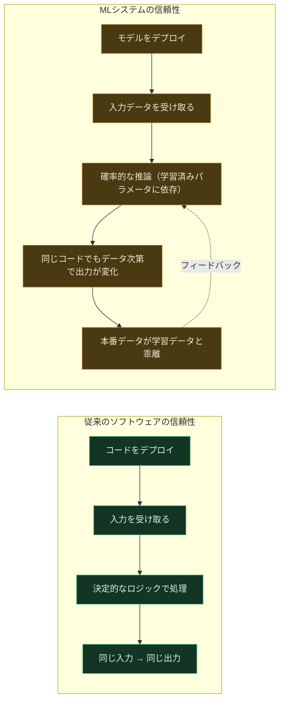
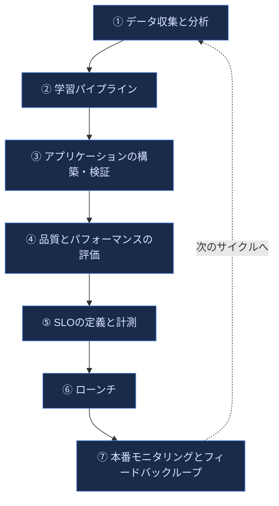
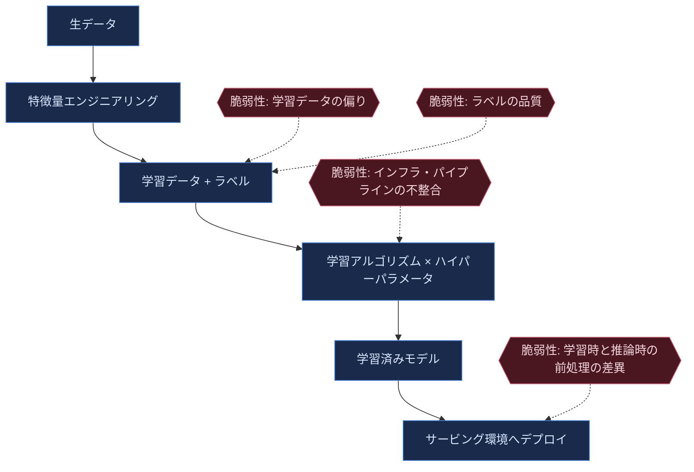
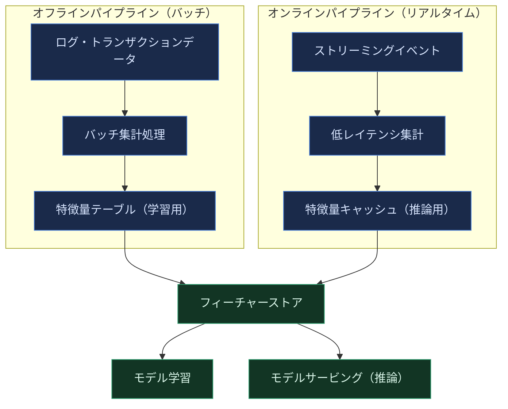
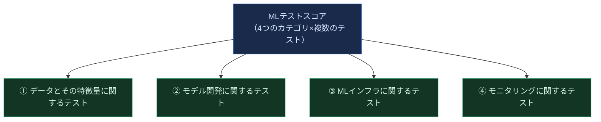
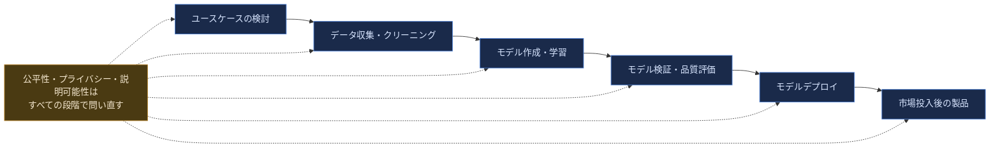
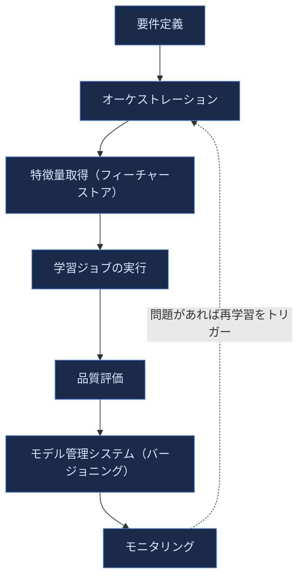
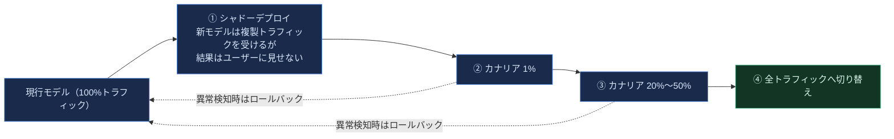
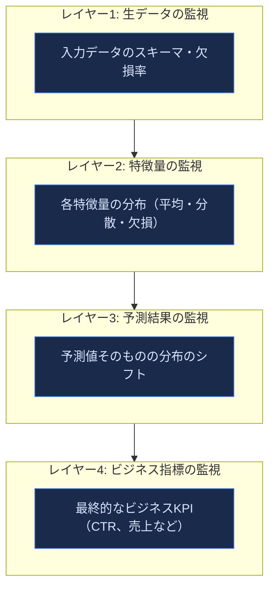
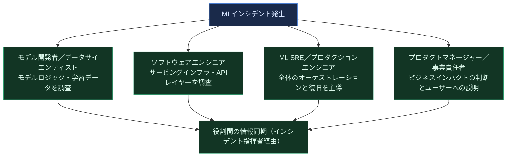

# Reliable Machine Learning ― SREの原則をML本番運用に適用する 初学者向け完全ガイド

> 本ガイドは、O'Reilly刊行の書籍 **"Reliable Machine Learning: Applying SRE Principles to ML in Production"**（著者: Cathy Chen, Niall Richard Murphy, Kranti Parisa, D. Sculley, Todd Underwood, 2022年9月刊）[1] の全15章にわたる構成・論点を土台としつつ、初めてMLOps/ML信頼性を学ぶエンジニアに向けて再構成した独自の全12章＋学習チェックリスト＋参考文献の構成です。書籍の記述に加え、著者らが所属・関与してきたGoogle SREの一次資料、Googleが公開している機械学習技術的負債に関する古典論文、Uber・実務ブログなど、国際的に著名なエンジニアの一次情報を参照し、それぞれの節末に出典番号（[N]）を付しています。書籍そのものの逐語的な再現は行っていません。

## この本の著者について

5人の著者は全員、Googleや大手テック企業でSRE（Site Reliability Engineering）とMLの両方に深く関わってきた実務家です。共著者のNiall Richard Murphyは、SREという分野を確立した名著『Site Reliability Engineering』（通称"SRE本"）の共著者でもあり、Cathy ChenはGoogleのSREチームに所属、D. Sculleyは後述する「隠れた技術的負債」論文の筆頭著者としてML工学分野で世界的に知られる研究者です[1][2]。つまりこの本は、「SREという学問がソフトウェアの信頼性にもたらした規律を、そのままMLシステムに輸入したらどうなるか」という問いに、その分野を作った当事者たちが答えた一冊だと言えます。

---

## 目次

1. [イントロダクション：なぜMLにSREの原則が必要なのか](#1-イントロダクションなぜmlにsreの原則が必要なのか)
2. [MLライフサイクルの全体像](#2-mlライフサイクルの全体像)
3. [データマネジメントの原則：データという名の負債](#3-データマネジメントの原則データという名の負債)
4. [モデルの基礎：モデルは何でできているのか](#4-モデルの基礎モデルは何でできているのか)
5. [特徴量とトレーニングデータのエンジニアリング](#5-特徴量とトレーニングデータのエンジニアリング)
6. [モデルの検証と品質評価](#6-モデルの検証と品質評価)
7. [公平性・プライバシー・責任あるML](#7-公平性プライバシー責任あるml)
8. [学習システムの信頼性設計](#8-学習システムの信頼性設計)
9. [モデルサービングのアーキテクチャと可用性](#9-モデルサービングのアーキテクチャと可用性)
10. [モニタリングと可観測性：サイレント障害を検知する](#10-モニタリングと可観測性サイレント障害を検知する)
11. [継続的MLとSLO・エラーバジェット設計](#11-継続的mlとsloエラーバジェット設計)
12. [インシデント対応と組織へのMLの統合（まとめ）](#12-インシデント対応と組織へのmlの統合まとめ)
13. [学習チェックリスト](#13-学習チェックリスト)
14. [参考文献](#14-参考文献)

---

## 1. イントロダクション：なぜMLにSREの原則が必要なのか

### 1.1 「動くML」と「本番で信頼できるML」は別物

ノートブックの中で高い精度を出したモデルと、何百万人ものユーザーに毎秒予測を返し続けるモデルの間には、大きな断絶があります。前者に必要なのはデータサイエンスのスキルですが、後者に必要なのは、可用性・レイテンシ・データ品質・障害対応・組織横断のコミュニケーションといった、従来のソフトウェアエンジニアリングやSREの世界で磨かれてきた規律です。書籍の序文はこの断絶を「MLのループを編む（Knit）」という比喩で説明しており、データ・モデル・プロダクト・運用という複数の糸を一つに織り上げる作業こそがML運用の本質だとしています[1]。

### 1.2 従来ソフトウェアの信頼性 vs MLシステムの信頼性

SREはこれまで「デプロイされたコードは、入力が同じなら出力も同じ」という前提のもとで、可用性・レイテンシ・スループットを守る規律を磨いてきました。しかしMLシステムでは、コード自体は変えていなくても、**データが変わるだけで挙動が変わる**という性質があります。これがML特有の難しさであり、D. Sculleyらが2015年に発表した論文「Hidden Technical Debt in Machine Learning Systems」で指摘した通り、実際のMLシステムにおいて純粋な学習アルゴリズムのコードが占める割合はごく一部に過ぎず、データ収集・検証・特徴量抽出・サービングインフラ・監視といった周辺部分が大部分を占めます[2]。

この図が示す通り、MLシステムの信頼性は「コードのバグを潰す」だけでは達成できません。データの品質・鮮度・分布の変化までを継続的に監視し、対応する体制が必要になります。これは従来のSREが得意としてきた「変化を制御し、リスクを定量化する」考え方の延長線上にありますが、対象が「コード」から「コード＋データ＋モデル」に広がった分、監視すべき対象も対応すべき障害の種類も増えます。

### 1.3 本ガイドのゴール

このガイドを最後まで読むと、以下のことができるようになります。

- MLシステムのライフサイクル全体を俯瞰し、どこに信頼性のリスクが潜みやすいかを説明できる
- データ・モデル・サービング・監視のそれぞれの層で「何をテストし、何を監視すべきか」を具体的に列挙できる
- SREの中核概念（SLO、エラーバジェット、ポストモーテム）をMLシステムに適用する際の考え方を理解する
- MLに特有のインシデント（サイレントな精度劣化、フィードバックループ、データドリフトなど）に対応する初動を組み立てられる

---

## 2. MLライフサイクルの全体像

### 2.1 ループとしてのML

書籍の第1章は、MLシステムの開発を「一直線のパイプライン」ではなく「継続的に回り続けるループ」として描いています。データ収集・分析から始まり、学習パイプライン、アプリケーションの構築と検証、品質とパフォーマンスの評価、SLOの定義と計測、ローンチ、そして本番でのモニタリングとフィードバックという流れが、また次のデータ収集へとつながっていきます[1]。

このループが従来のソフトウェア開発ライフサイクル（設計→実装→テスト→リリース→運用）と決定的に違うのは、**⑦の結果が①に直接影響を与える**という点です。本番でユーザーがモデルの予測にどう反応したか（クリックした、購入した、無視した）自体が新しい学習データになり得るため、モデルが自分自身の未来の学習データに影響を与える「フィードバックループ」が常に存在します。これは11章で改めて掘り下げます。

### 2.2 各段階でSREが問うべき質問

| 段階 | 主な問い | 典型的な信頼性リスク |
|---|---|---|
| データ収集と分析 | データはどこから来て、どれだけ信頼できるか | 欠損・偏り・プライバシー侵害 |
| 学習パイプライン | 再現可能な形でモデルを作れているか | 非決定的な学習、依存関係の未固定 |
| 構築・検証 | アプリケーションはモデルの出力を正しく扱えるか | 学習時と推論時の前処理の不一致（training-serving skew） |
| 品質・性能評価 | オフライン評価は本番の状況を代表しているか | 評価データの偏り、過学習の見落とし |
| SLOの定義 | 「良い」とは何かを数値で合意できているか | ビジネス指標とML指標のズレ |
| ローンチ | 段階的に安全にロールアウトできているか | 一斉切り替えによる大規模障害 |
| モニタリング | 静かな劣化を検知できているか | サイレント障害、データドリフト |

この表に挙げた「典型的な信頼性リスク」こそが、本ガイドの3章以降で一つずつ深掘りしていくテーマです。

---

## 3. データマネジメントの原則：データという名の負債

### 3.1 「データは資産ではなく負債である」という視点

書籍第2章は、データを単純に「資産」として扱う従来的な発想に対し、「データは負債（liability）でもある」という視点を強く打ち出しています[1]。データを保持すればするほど、ストレージコスト・プライバシーリスク・コンプライアンス対応・データ品質の維持コストが積み上がっていくためです。特にMLパイプラインは大量の個人データや機微なデータを扱うことが多く、そのセンシティビティを正しく評価しないまま蓄積を続けると、後になって重大なプライバシー・法務リスクに直面します。

### 3.2 データのライフサイクル：6つのフェーズ

それぞれのフェーズで問われるべき問いは異なります。「作成」の段階ではデータの出所と収集方法の妥当性、「取り込み」ではスキーマの検証、「処理」では変換ロジックの再現性、「保存」では暗号化とアクセス制御、「管理」ではライフサイクルポリシー（いつ削除するか）、「分析・可視化」では統計的な誤読を防ぐ仕組みが重要になります。

### 3.3 データの信頼性を構成する9つの次元

書籍は「データの信頼性（Data Reliability）」を単一の概念としてではなく、複数の独立した次元の組み合わせとして定義しています[1]。以下はそれぞれの次元を初学者向けに要約した表です。

| 次元 | 定義 | 具体例 |
|---|---|---|
| Durability（耐久性） | データが失われず永続的に保持されるか | バックアップ・レプリケーション |
| Consistency（一貫性） | 複数のコピー間でデータが矛盾しないか | 分散ストレージ間の整合性 |
| Version Control（バージョン管理） | どの時点のデータで学習したか追跡できるか | データセットのスナップショット管理 |
| Performance（性能） | 必要な速度でデータを読み書きできるか | 学習ジョブのI/Oボトルネック |
| Availability（可用性） | 必要な時にデータへアクセスできるか | パイプライン障害時のフォールバック |
| Data Integrity（完全性） | データが意図せず破損・改変されていないか | チェックサム・スキーマバリデーション |
| Security（セキュリティ） | 不正アクセスから保護されているか | アクセス制御・暗号化 |
| Privacy（プライバシー） | 個人情報が適切に扱われているか | 匿名化・同意管理 |
| Policy and Compliance（方針と法令順守） | 業界規制や社内ポリシーに準拠しているか | GDPR・業界規制への対応 |

> **ベストプラクティス**：これらの次元は独立してトレードオフの関係にあることが多く、「すべてを100点にする」ことは現実的ではありません。SREが可用性についてSLOで妥協点を決めるのと同様に、データについても「どの次元を優先し、どこまでのリスクを許容するか」をチームで明示的に合意しておくことが、後々のインシデント対応を大きく楽にします。

---

## 4. モデルの基礎：モデルは何でできているのか

### 4.1 「モデル」という言葉の3つの意味

初学者がまず混乱しやすいのが、「モデル」という言葉が文脈によって3つの異なるものを指す点です。書籍はこれを明確に区別しています[1]。

| 用語 | 意味 |
|---|---|
| モデルアーキテクチャ（Model Architecture） | ニューラルネットワークの層構成など、学習可能なパラメータの「型」そのもの |
| モデル定義（Model Definition） | アーキテクチャ＋ハイパーパラメータ＋学習方法など、学習を始める前の設計図全体 |
| 学習済みモデル（Trained Model） | 実際のデータで学習が終わり、具体的な重み（パラメータ値）を持った成果物 |

本番運用でインシデントが起きたとき、「モデルが壊れた」という報告だけでは原因の特定にほとんど役立ちません。アーキテクチャに問題があるのか、学習方法に問題があるのか、それとも特定の学習済みバージョンだけに問題があるのかを切り分けるために、この3つの区別を関係者全員が共有しておく必要があります。

### 4.2 モデル作成のワークフローと脆弱性ポイント

書籍は、モデルの脆弱性を検討する際に問うべき「有用な質問集」を提示しています[1]。初学者はこれをそのままチェックリストとして使うと良いでしょう。

- このモデルの学習データはどこから来て、どのように収集されたか？
- ラベルは誰が、どのような基準で付けたか？
- 学習に使ったコードとインフラは、本番のサービング環境と何が違うか？
- このモデルはどのプラットフォーム（バッチ、リアルタイム、エッジなど）で動くことを想定しているか？
- モデルを更新・修正する際、影響範囲をどう把握するか？

### 4.3 具体例：ECサイトのクリック予測モデル

書籍は「YarnIt（毛糸のECサイト）」という架空の事例を通して、これらの概念を具体的に説明しています[1]。あるクリック予測モデルは、ユーザーの閲覧履歴・検索キーワード・商品の特徴量をもとに「この商品がクリックされる確率」を予測しますが、季節性（編み物の需要は冬に増える）や新商品のコールドスタート問題など、ECサイト特有の落とし穴が存在します。このような具体例を自分のドメインに置き換えて考える習慣が、脆弱性の発見に役立ちます。

---

## 5. 特徴量とトレーニングデータのエンジニアリング

### 5.1 特徴量のライフサイクルとフィーチャーストア

特徴量（Feature）とは、モデルが予測を行うために使う入力データの各項目です。書籍は特徴量の選択・エンジニアリング・ライフサイクル管理を独立した専門領域として扱っており、特に「フィーチャーシステム（Feature Systems）」という、特徴量を一元管理する基盤の重要性を強調しています[1]。

この考え方を実際に大規模に実装した代表例が、Uberが公開している機械学習プラットフォーム「Michelangelo」です。Uberのエンジニアリングブログによれば、Michelangeloの中核には「フィーチャーストア（Feature Store）」と呼ばれる仕組みがあり、複数のチームが特徴量を共有・発見・再利用できるようにすることで、同じ特徴量をチームごとに何度も作り直す無駄を防いでいます[10]。さらに、バッチ処理由来のオフライン特徴量とリアルタイムに生成されるオンライン特徴量の両方を扱う「ハイブリッドな」設計が必要になる点も、実運用ならではの難しさとして報告されています[11]。

> **ベストプラクティス**：学習時に使う特徴量の計算ロジックと、推論時に使う特徴量の計算ロジックが微妙に異なっていると、「training-serving skew（学習時と推論時のズレ）」と呼ばれる、発見が非常に困難なバグの温床になります。フィーチャーストアの最大の価値は、この2つの経路で**同じ計算ロジックを再利用できる**ようにする点にあります。

### 5.2 ラベルとアノテーション

教師あり学習では、正解ラベルの品質がモデルの品質の上限を決めます。書籍は人間が付与するラベル（Human-Generated Labels）について、アノテーション作業者のプラットフォーム設計、品質測定手法、アクティブラーニングによるAI支援ラベリング、そしてラベラーへのドキュメント整備とトレーニングまで、一連の実務プロセスとして扱っています[1]。

| 要素 | 初学者が押さえるべきポイント |
|---|---|
| アノテーションワークフォース | 誰が、どんな基準で、どんなツールでラベルを付けるか |
| ラベル品質の測定 | 複数人の一致率（inter-annotator agreement）などで品質を定量化する |
| アクティブラーニング | モデルが自信のないデータを優先的に人間に確認してもらう手法 |
| ラベラー向けドキュメント | 曖昧なケースの判断基準を明文化し、ラベルのブレを減らす |

### 5.3 メタデータシステム

データセット・特徴量・ラベル・パイプラインそれぞれについて「いつ、誰が、どのバージョンで作ったか」を記録するメタデータシステムは、障害調査（「なぜこのモデルは先月と違う挙動をするのか」を追跡する）において決定的に重要です。メタデータが整備されていないと、インシデント発生時に原因の切り分けだけで数日を要することもあります。

---

## 6. モデルの検証と品質評価

### 6.1 「妥当性」と「品質」は別の問い

書籍は「モデルの妥当性を評価すること（Evaluating Model Validity）」と「モデルの品質を評価すること（Evaluating Model Quality）」を意図的に区別しています[1]。妥当性は「そもそもこのモデルは正しく機能する状態にあるか（学習が収束したか、期待通りの入出力形式か）」という基礎的な問いであり、品質は「そのモデルはどれだけ良い予測をするか」というより高次の問いです。妥当性を確認しないまま品質を議論しても意味がありません。

### 6.2 オフライン評価とその限界

オフライン評価（本番に出す前に、保留しておいたデータで性能を測ること）は不可欠なステップですが、評価データの分布が本番トラフィックの分布と異なっていれば、オフラインで良いスコアが出ても本番で機能しないことがあります。書籍はこれを「Evaluation Distributions（評価分布）」という概念で扱い、評価に使うデータセットが実際のユーザー母集団を代表しているかどうかを常に問うべきだとしています[1]。

### 6.3 MLテストスコア：本番準備度を定量化する

Googleの研究者Eric Breckらが2017年に発表した論文「The ML Test Score」は、MLシステムの本番準備度（production readiness）を28項目のテスト・監視項目に分解し、チェックリスト形式でスコア化する手法を提案しました[4]。これは書籍の「検証と評価の運用化（Operationalizing Verification and Evaluation）」の節とも強く関連する、実務で広く参照されているフレームワークです。

| カテゴリ | 代表的なテスト項目の例 |
|---|---|
| データとその特徴量 | 特徴量の期待される分布から外れていないかを検証する／特徴量にコストとメリットの見合わないものが含まれていないか確認する |
| モデル開発 | すべてのモデル仕様がコードレビューされ、バージョン管理下にある／モデルの新しいバージョンがオフラインでの品質を落としていないかを確認する前に本番に出さない |
| MLインフラ | 学習が再現可能である／モデルのロールバックが素早くできる |
| モニタリング | 本番のデータがサービング時にも学習時と同じ統計的性質を保っているかを監視する／モデルが古くなっていないかを監視する |

> **ベストプラクティス**：28項目すべてをいきなり満たそうとする必要はありません。論文自体が「スコアの低いチームがまず取り組むべきなのは、最も基本的なテスト（学習が再現できるか、ロールバックできるか）から」と示唆しています[4]。まずは自分たちのシステムが4つのカテゴリのどこに弱点を抱えているかを棚卸しすることから始めましょう。

---

## 7. 公平性・プライバシー・責任あるML

### 7.1 公平性は「エンドポイント」ではなく「プロセス」

書籍第6章は、公平性（Fairness）について複数の定義が存在し、それらがしばしば互いにトレードオフの関係にあることを説明した上で、「公平性はゴールとして一度達成して終わりにするものではなく、継続的なプロセスとして扱うべきだ」という立場を明確に打ち出しています[1]。これはGoogleが公開している開発者向けの公平性ガイドとも一致する考え方で、公平な評価データセットの構築、過小評価されているグループの特定、モデルが特定グループに対してより強い予測力を持つ特徴量に依存していないかの確認などが、継続的な実践として推奨されています[13]。

### 7.2 プライバシーを守る手法

書籍はプライバシーについても「一度きりの法務チェック」ではなく、パイプライン全体に組み込むべき技術的な実践として扱っています[1]。差分プライバシー、データの匿名化・仮名化、アクセス制御の最小権限原則などが代表的な手法です。

### 7.3 責任あるAI（Responsible AI）をパイプライン全体に組み込む

書籍は責任あるAIを、説明可能性（Explanation）・有効性（Effectiveness）・社会的/文化的な適切さ（Social and Cultural Appropriateness）という3つの軸で捉え、これをMLパイプラインの各段階（ユースケースの検討、データ収集・クリーニング、モデル作成・学習、モデル検証・品質評価、モデルデプロイ、市場投入後の製品）に対応づけて実践する枠組みを提示しています[1]。Google自身も、責任あるAIの原則を開発パイプライン全体に埋め込むための実践ガイドを公開しており、モデルが相関関係を因果関係と誤認させるような使われ方を避けること、モデルの能力と限界をユーザーに伝えることなどを推奨しています[15]。

> **ベストプラクティス**：公平性やプライバシーへの配慮を「モデルが完成した後にチェックする項目」として最後に回すと、根本的な設計変更が必要になった際の手戻りコストが非常に大きくなります。ユースケースを検討する最初の段階から、「このモデルの誤りは誰に、どのような不利益をもたらし得るか」を問う習慣をチームに根付かせることが重要です[14]。

---

## 8. 学習システムの信頼性設計

### 8.1 学習システムを構成するコンポーネント

書籍第7章は、モデルを学習させるシステム自体を、特徴量・フィーチャーストア・モデル管理システム・オーケストレーション・品質評価・モニタリングという複数のコンポーネントからなる一つの「システム」として設計すべきだと説いています[1]。

### 8.2 一般的な信頼性の原則

書籍は学習システムに関する「一般的な信頼性の原則」を、やや逆説的な短いフレーズの形で列挙しています[1]。初学者にとってはこれらのフレーズ自体が「思い込みを疑うためのチェックリスト」として機能します。

| 原則 | 意味 |
|---|---|
| ほとんどの障害はML障害ではない | 実際には設定ミスやインフラ障害など、通常のソフトウェア障害であることが多い |
| モデルは再学習され続ける | 「一度作って終わり」ではなく再学習が前提の設計が必要 |
| モデルは同時に複数バージョン存在する | ロールバックや段階的移行のために複数バージョンの共存を前提に設計する |
| 良いモデルもいずれ悪くなる | データやユーザー行動の変化により、性能は放置すると劣化する |
| データは利用できなくなることがある | 上流の障害でデータが欠損する事態を常に想定する |
| モデルは改善可能であるべき | 硬直的な設計は将来の改善を妨げる |
| 特徴量は追加・変更され続ける | スキーマの進化を前提とした設計が必要 |
| モデルは学習が速すぎることもある | 十分な検証をスキップして高速に学習が回ることが、逆にリスクになる場合がある |
| リソース利用率は重要である | 学習ジョブのコストとリソース消費を継続的に把握する |
| 利用率 ≠ 効率 | リソースを使い切っていることと、効率よく使っていることは別物 |
| 障害からの回復もダウンタイムに含まれる | 検知だけでなく、回復にかかる時間まで含めて信頼性を評価する |

### 8.3 学習の再現性という落とし穴

書籍が挙げる「よくある学習の信頼性問題」の中でも、特に初学者がつまずきやすいのが再現性（Reproducibility）の問題です[1]。同じコード・同じデータのはずなのに、学習を再実行すると異なる結果になる――このような状態では、本番障害の原因調査そのものが成立しません。乱数シードの固定、依存ライブラリのバージョン固定、分散学習における実行順序の非決定性への対処などが、再現性確保の基本的な対策になります。

---

## 9. モデルサービングのアーキテクチャと可用性

### 9.1 サービング設計で問うべき6つの質問

書籍第8章は、モデルサービングを設計する前に答えるべき質問を具体的に列挙しています[1]。

1. このモデルへの負荷（トラフィック量）はどの程度か？
2. 予測のレイテンシ要件はどれくらい厳しいか？
3. モデルはどこで動く必要があるか（クラウド、オンプレ、エッジ）？
4. モデルにはどのようなハードウェア要件があるか（GPU/TPUの要否）？
5. サービング用のモデルはどのように保存・ロード・バージョニング・更新されるか？
6. サービング用の特徴量パイプラインはどのような形になるか？

### 9.2 サービングアーキテクチャの比較

| アーキテクチャ | 特徴 | 向いているケース |
|---|---|---|
| オフラインサービング（バッチ推論） | 事前にまとめて予測を計算し、結果を保存しておく | リアルタイム性が不要な大量データのスコアリング |
| オンラインサービング | リクエストごとにリアルタイムで推論する | チャットボット、不正検知など即時応答が必要な場合 |
| Model as a Service | モデルを独立したサービスとして公開し、複数のクライアントから呼び出す | 複数チームが同じモデルを共有利用する場合 |
| エッジでのサービング | デバイス側でモデルを実行する | 低レイテンシ・オフライン動作が必要なモバイル/IoT |

### 9.3 安全なロールアウト：シャドーデプロイとカナリアリリース

書籍自体はローンチの安全性を強調していますが、それを具体的な運用手順に落とし込んだ実践として広く参照されているのが、シャドーデプロイとカナリアリリースという2段階の手法です。MLOps分野で著名な実務者Bartosz Mikulskiの解説によれば、まず新しいモデルを「シャドーモード」で稼働させ、本番トラフィックを複製して新モデルにも流しつつ、その予測結果はユーザーには一切見せずログに記録して評価します。この段階で問題がなければ、次に実際のトラフィックの一部（例えば1%）だけを新モデルに振り分け、問題がなければ徐々に比率を上げていく「カナリアリリース」に進みます[12]。

> **ベストプラクティス**：カナリアリリースの各段階では、レイテンシやエラー率といった従来のSRE的指標に加えて、予測結果の分布（例えば「クリック確率」の平均値が急に大きく変化していないか）のようなML特有の指標も監視対象に含める必要があります。従来の指標だけを見ていると、「エラーは出ていないのに予測が明後日の方向を向いている」というML特有のサイレント障害を見逃します[12]。

### 9.4 精度か、それとも可用性か

書籍は「サービングにおいて、正確さとレジリエンス（頑健性）のどちらを優先するか」という、SREにとって馴染み深いトレードオフの議論をMLに応用しています[1]。例えば、特徴量取得サービスが一時的に落ちた場合、リクエスト全体を失敗させる（可用性を犠牲にする）べきか、それとも欠損した特徴量をデフォルト値で埋めて低品質でも予測を返す（精度を犠牲にする）べきか。この判断は、そのモデルがビジネス上どのような役割を果たしているかによって変わるため、事前にチームで方針を合意しておく必要があります。

---

## 10. モニタリングと可観測性：サイレント障害を検知する

### 10.1 なぜML特有のモニタリングが必要か

従来のソフトウェアシステムでは、「クラッシュした」「レイテンシが跳ね上がった」といった障害はシステムのオペレーション上の指標（エラー率、レイテンシなど）に明確に現れます。しかし、MLシステムの性能劣化はしばしば**エラーを一切出さないまま**静かに進行します。モデルは相変わらず「正常に」推論を返し続けますが、その予測の質が徐々に、あるいは突然悪化しているのです。書籍第9章はこの違いを、開発時のモニタリングとサービング時のモニタリングの難しさの違いとして詳細に論じています[1]。

### 10.2 データ分布シフトの3つの型

この「サイレントな劣化」の主要な原因の一つがデータ分布シフト（Data Distribution Shift）です。スタンフォード大学の講義資料として公開され、後に書籍『Designing Machine Learning Systems』に発展したChip Huyenの解説では、データ分布シフトが起こる典型的なパターンとして、入力データの分布が変わる「covariate shift」、正解ラベルの分布自体が変わる「label shift」、そして入力とラベルの関係性そのものが変わる「concept drift」が整理されています[8]。

| ドリフトの型 | 何が変わるか | 検知の手がかり |
|---|---|---|
| Covariate shift | 入力データ $P(X)$ の分布 | 特徴量の統計量（平均・分位点）の変化 |
| Label shift | 正解ラベル $P(Y)$ の分布 | クラス比率の変化（例：不正利用の発生率） |
| Concept drift | 入力とラベルの関係 $P(Y \mid X)$ そのもの | 同じ入力に対する正解が時間とともに変わる |

### 10.3 モデルモニタリングのベストプラクティス

書籍は、サービング前（Pre-serving）の一般的な推奨事項から、学習・再学習時、モデル検証（ロールアウト前）、サービング時まで、フェーズごとにモニタリングすべき項目を整理しています[1]。

- **学習・再学習時**：学習データの統計的性質が過去のバージョンと比べて大きく変化していないかを確認する
- **モデル検証（ロールアウト前）**：新バージョンがオフライン評価で旧バージョンより明確に劣化していないかをゲートとして設ける
- **サービング時**：予測分布・特徴量分布・レイテンシ・エラー率をリアルタイムで継続監視し、しきい値を超えたらアラートを発報する

> **ベストプラクティス**：モニタリングの設計で陥りがちな失敗は、「精度」そのものを常時監視しようとすることです。多くの本番システムでは、正解ラベルがすぐには手に入らない（例えばユーザーが実際に商品を購入したかどうかは数日後にしかわからない）ため、精度を即座に測ることはできません。その代替として、予測値や入力特徴量の分布シフトのような「ラベル不要で即座に計算できる指標」を先行指標として監視する設計が実務上重要です[8]。

---

## 11. 継続的MLとSLO・エラーバジェット設計

### 11.1 継続的MLシステムの解剖

書籍第10章は、モデルを継続的に更新し続けるシステム（Continuous ML）の内部構造を、学習用データ・学習用ラベル・不良データのフィルタリング・フィーチャーストアとデータ管理・モデルの更新・更新済みモデルのサービングへのプッシュという一連の要素に分解しています[1]。

このループには、以下のような特有の観察事項が伴います[1]。

- 外部世界の出来事（ニュース、季節性、突発的なトレンド）がシステムに影響を与え得る
- モデル自身が、自分の将来の学習データに影響を与え得る（フィードバックループ）
- 時間的な影響は複数の時間スケール（分単位から年単位まで）で同時に発生し得る
- 緊急対応はリアルタイムで行う必要がある
- 新しいローンチには段階的なランプアップと安定したベースラインが必要
- モデルは「一度出荷して終わり」ではなく「継続的に管理」されるべきものである

### 11.2 MLシステムのためのSLO設計

書籍第1章は「SLOの定義と計測（Defining and Measuring SLOs）」を、MLライフサイクルの中の独立した重要なステップとして位置づけています[1]。ここでGoogleのSREブックが確立した「サービスレベル目標（SLO）」と「エラーバジェット」という考え方が直接応用できます。SREブックの定義によれば、エラーバジェットとは、あるサービスレベル目標（例：可用性99.9%）に対して「ユーザーが不満を感じ始める前に許容できる失敗の量」であり、これを使い切っていない限りチームは新機能のリリースを進めてよい、使い切ったらリリースを止めて信頼性の改善に専念する、という運用ルールを組み立てるための仕組みです[5][6]。

MLシステムにこの考え方を適用する際は、可用性やレイテンシに加えて、ML特有のSLI（サービスレベル指標）を追加する必要があります。

| SLIの種類 | 定義の例 | 従来のSREとの違い |
|---|---|---|
| 可用性 | 予測APIが正常にレスポンスを返した割合 | 従来のSREとほぼ同じ考え方 |
| レイテンシ | 予測が一定時間内に返る割合（p95, p99など） | 従来のSREとほぼ同じ考え方 |
| データ鮮度（Freshness） | 学習に使われたデータが何時間／何日以内のものか | MLに固有の指標 |
| 予測カバレッジ | 十分な情報がある入力に対して予測を返せた割合（欠損によるフォールバックを除く） | MLに固有の指標 |
| モデル品質 | オフライン評価またはプロキシ指標によるモデル精度の下限 | ラベル取得の遅延を考慮する必要がある |

> **ベストプラクティス**：ML特有のSLI（データ鮮度やモデル品質）は、従来の可用性・レイテンシのSLIと違って「即座に」計測できないことが多い点に注意が必要です。ラベルの取得に数日かかる場合、SLOの違反を検知するまでにタイムラグが生じることを前提に、より早く検知できる代理指標（プロキシメトリクス、例えば予測分布のシフト）を組み合わせた多層的なアラート設計が必要になります[7][8]。

---

## 12. インシデント対応と組織へのMLの統合（まとめ）

### 12.1 MLに特有のインシデントの解剖

書籍第11章は、インシデント管理の基本（インシデントのライフサイクル、対応時の役割分担）を確認した上で、「MLを中心としたアウテージ（ML-Centric Outage）」に特有の構造を分析しています[1]。ここで重要なのは、「モデル（Model）」という言葉が、学習済みの重みファイルだけでなく、前処理コード・特徴量パイプライン・サービングインフラを含む広い意味で使われる場面があるという、用語の再確認です。これを怠ると、インシデント対応の関係者間で「モデルを直す」という言葉の指す範囲が食い違い、対応が混乱します。

### 12.2 役割ごとのインシデント対応責務

| 役割 | インシデント時の主な責務 |
|---|---|
| モデル開発者／データサイエンティスト | モデルのロジック、学習データの品質、特徴量の妥当性を調査する |
| ソフトウェアエンジニア | サービングインフラ、API層、データパイプラインのソフトウェア的な障害を調査する |
| ML SRE／プロダクションエンジニア | 全体の状況を俯瞰し、ロールバックや緩和策の実行を主導する |
| プロダクトマネージャー／事業責任者 | ビジネスへの影響度を判断し、必要に応じて関係者やユーザーへの説明を行う |

書籍はこの章の特別なトピックとして「倫理的なオンコールエンジニアの心得（The Ethical On-Call Engineer Manifesto）」にも触れており、インシデント対応において技術的な復旧だけでなく、公平性や倫理面への影響についても常に配慮すべきだという姿勢を示しています[1]。これは7章で扱った「公平性はプロセスである」という考え方が、平時の設計だけでなく緊急時の対応にも一貫して適用されるべきだという主張の表れです。

### 12.3 プロダクトとMLの関係、そして組織への統合

書籍後半（第12〜14章）は視点をエンジニアリングから一段引いて、MLプロジェクトがプロダクト開発フェーズ（発見・定義、ビジネス目標設定、MVP構築・検証、モデルとプロダクトの開発、デプロイ、サポート・保守）とどう噛み合うか、モデルや基盤を自社で作るか外部から調達するか（Build vs. Buy）の判断、そして組織のどこにMLチームを位置づけるか（中央集権型、分散型、ハイブリッド型）という、より組織的なテーマを扱っています[1]。これらは個々のエンジニアが日々直接手を動かす領域ではないかもしれませんが、「なぜこのSLOがこの水準に設定されているのか」「なぜこの再学習パイプラインへの投資が承認されたのか」といった意思決定の背景を理解する上で、知っておく価値のある文脈です。

### 12.4 このガイド全体のまとめ

このガイドを通して見てきたように、「MLシステムを信頼できるものにする」という課題は、単一のツールや手法で解決できるものではありません。データの信頼性、モデルの検証、公平性への配慮、学習システムとサービングインフラの設計、モニタリング、そしてSLOに基づくインシデント対応まで、SREが従来のソフトウェアシステムに対して培ってきた規律を、MLというデータ駆動で確率的に振る舞うシステムに合わせて拡張し続けることが、この分野の本質だと言えます。

---

## 13. 学習チェックリスト

以下は、このガイドで扱った内容を実務に落とし込む際の出発点として使えるチェックリストです。

- [ ] 自分たちのMLシステムにおける「データ」「モデル」「学習済みモデル」の違いをチーム内で共通言語として説明できるか
- [ ] 学習に使うデータのライフサイクル（作成〜分析・可視化）の各段階で、責任者と品質チェックが明確になっているか
- [ ] MLテストスコアの4カテゴリ（データ、モデル開発、インフラ、モニタリング）のうち、自分たちが最も弱いカテゴリを特定できているか
- [ ] 公平性・プライバシーへの配慮を、モデル完成後ではなくユースケース検討の最初の段階から組み込んでいるか
- [ ] 新しいモデルをシャドーデプロイやカナリアリリースといった段階的な手順でロールアウトできる仕組みがあるか
- [ ] 予測分布や特徴量分布など、ラベルなしで即座に計算できる「先行指標」を監視できているか
- [ ] 可用性・レイテンシに加えて、データ鮮度やモデル品質を含むML特有のSLIを定義しているか
- [ ] MLインシデント発生時に、モデル開発者・ソフトウェアエンジニア・ML SRE・プロダクトマネージャーの役割分担が明確になっているか
- [ ] インシデント対応において、技術的な復旧だけでなく公平性・倫理面への影響も確認する手順があるか
- [ ] 学習パイプラインが再現可能であり、問題発生時に迅速にロールバックできる状態を保っているか

---

## 14. 参考文献

**書籍**

- **[1]** Cathy Chen, Niall Richard Murphy, Kranti Parisa, D. Sculley, Todd Underwood, *Reliable Machine Learning: Applying SRE Principles to ML in Production*, O'Reilly Media, 2022年9月刊。全15章の構成、目次、概要を参照 — https://www.oreilly.com/library/view/reliable-machine-learning/9781098106218/

**学術論文**

- **[2]** D. Sculley, Gary Holt, Daniel Golovin, Eugene Davydov, Todd Phillips, Dietmar Ebner, Vinay Chaudhary, Michael Young, Jean-François Crespo, Dan Dennison, "Hidden Technical Debt in Machine Learning Systems", *NeurIPS 2015* — https://papers.nips.cc/paper/5656-hidden-technical-debt-in-machine-learning-systems
- **[4]** Eric Breck, Shanqing Cai, Eric Nielsen, Michael Salib, D. Sculley, "The ML Test Score: A Rubric for ML Production Readiness and Technical Debt Reduction", Google Research, *IEEE Big Data 2017* — https://research.google/pubs/the-ml-test-score-a-rubric-for-ml-production-readiness-and-technical-debt-reduction/

**公式ドキュメント・企業ブログ（Google／Uber）**

- **[3]** Martin Zinkevich, "Rules of Machine Learning: Best Practices for ML Engineering", Google for Developers — https://developers.google.com/machine-learning/guides/rules-of-ml
- **[5]** Google SRE Book, "Embracing Risk"（エラーバジェットの考え方）— https://sre.google/sre-book/embracing-risk/
- **[6]** Google SRE Book, "Service Best Practices"（エラーバジェットの運用）— https://sre.google/sre-book/service-best-practices/
- **[7]** Google SRE Workbook, "Implementing SLOs" — https://sre.google/workbook/implementing-slos/
- **[9]** Google Cloud, "MLOps: Continuous delivery and automation pipelines in machine learning" — https://docs.cloud.google.com/architecture/mlops-continuous-delivery-and-automation-pipelines-in-machine-learning
- **[10]** Mike Del Balso, Jeremy Hermann, "Meet Michelangelo: Uber's Machine Learning Platform", Uber Engineering Blog — https://www.uber.com/en-CA/blog/michelangelo-machine-learning-platform/
- **[11]** "Scaling Machine Learning at Uber with Michelangelo", Uber Engineering Blog — https://www.uber.com/us/en/blog/scaling-michelangelo/
- **[13]** "Fairness", Google for Developers（責任あるAIガイド）— https://developers.google.com/machine-learning/guides/intro-responsible-ai/fairness
- **[14]** "AI and ML ethics and safety", Google for Developers — https://developers.google.com/machine-learning/managing-ml-projects/ethics
- **[15]** "Responsible AI practices", Google AI — https://ai.google/responsibilities/responsible-ai-practices/

**著名エンジニアの技術ブログ**

- **[8]** Chip Huyen, "Data Distribution Shifts and Monitoring"（後に書籍『Designing Machine Learning Systems』（O'Reilly, 2022）に発展）— https://huyenchip.com/2022/02/07/data-distribution-shifts-and-monitoring.html
- **[12]** Bartosz Mikulski, "Shadow deployment vs. canary release of machine learning models" — https://mikulskibartosz.name/shadow-deployment-vs-canary-release

[1]: https://www.oreilly.com/library/view/reliable-machine-learning/9781098106218/
[2]: https://papers.nips.cc/paper/5656-hidden-technical-debt-in-machine-learning-systems
[3]: https://developers.google.com/machine-learning/guides/rules-of-ml
[4]: https://research.google/pubs/the-ml-test-score-a-rubric-for-ml-production-readiness-and-technical-debt-reduction/
[5]: https://sre.google/sre-book/embracing-risk/
[6]: https://sre.google/sre-book/service-best-practices/
[7]: https://sre.google/workbook/implementing-slos/
[8]: https://huyenchip.com/2022/02/07/data-distribution-shifts-and-monitoring.html
[9]: https://docs.cloud.google.com/architecture/mlops-continuous-delivery-and-automation-pipelines-in-machine-learning
[10]: https://www.uber.com/en-CA/blog/michelangelo-machine-learning-platform/
[11]: https://www.uber.com/us/en/blog/scaling-michelangelo/
[12]: https://mikulskibartosz.name/shadow-deployment-vs-canary-release
[13]: https://developers.google.com/machine-learning/guides/intro-responsible-ai/fairness
[14]: https://developers.google.com/machine-learning/managing-ml-projects/ethics
[15]: https://ai.google/responsibilities/responsible-ai-practices/

---

*本ガイドは教育目的の要約・再構成であり、原著書籍の内容を逐語的に複製したものではありません。より詳細な内容は原著書籍および上記の一次情報源を直接ご参照ください。*
