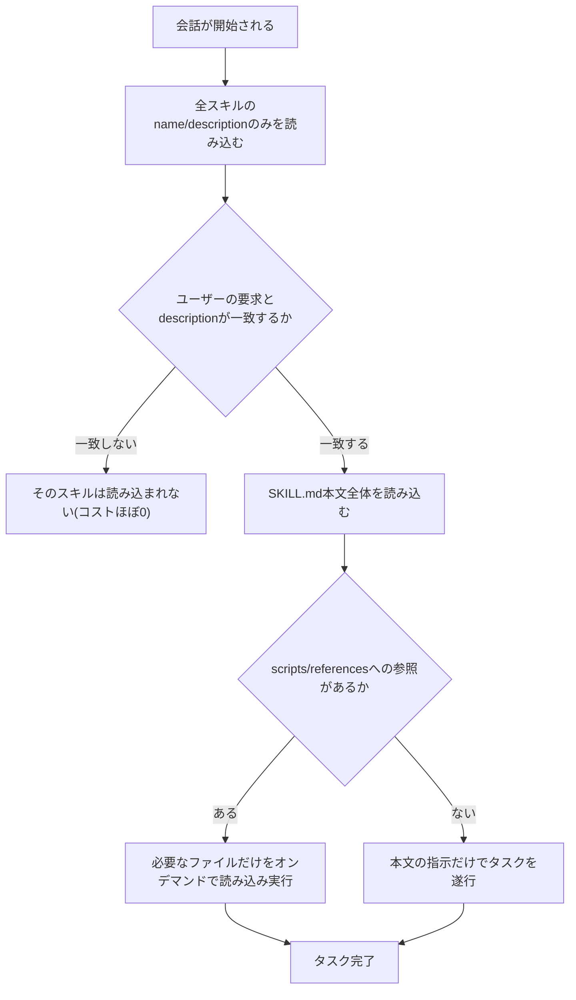
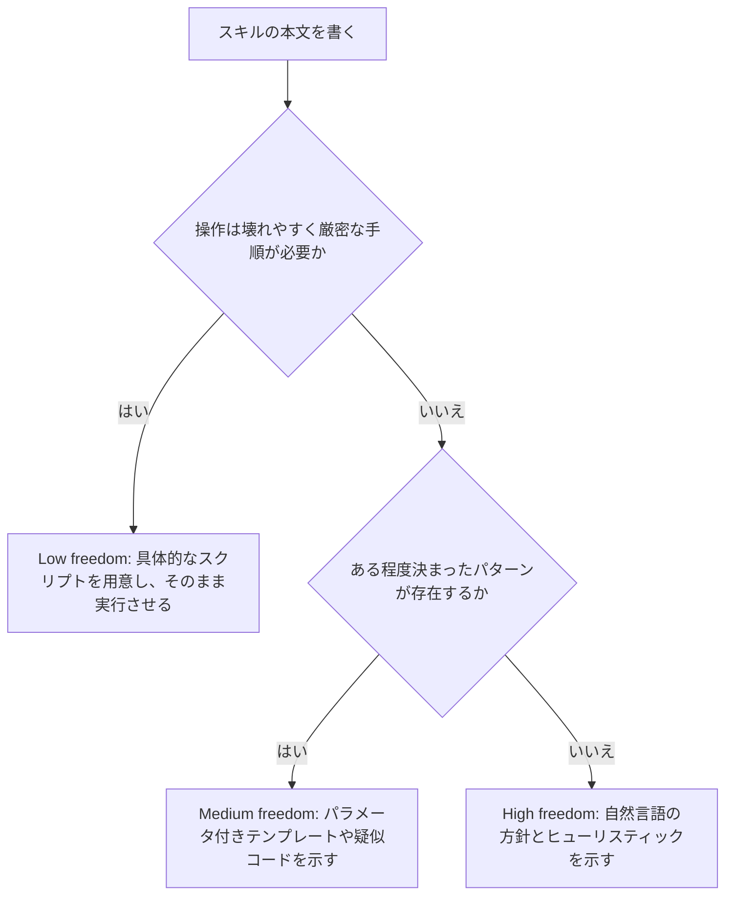

# SKILL.md 実践ベストプラクティスガイド(Google Antigravity 対応版)

> 対象読者: AIエージェント開発の初学者〜中級者
> 最終確認日: 2026年7月26日時点のウェブ情報に基づく
> 用語について: SKILL.md、description、YAML frontmatter など、業界標準として定着している英語の技術用語はそのまま使用しています。

---

## 目次

1. [そもそも Agent Skills / SKILL.md とは何か](#1-そもそも-agent-skills--skillmd-とは何か)
2. [なぜ重要なのか: プログレッシブ・ディスクロージャーという設計思想](#2-なぜ重要なのか-プログレッシブディスクロージャーという設計思想)
3. [Google Antigravity におけるスキルシステム](#3-google-antigravity-におけるスキルシステム)
4. [SKILL.md の基本構造](#4-skillmd-の基本構造)
5. [ステップバイステップ実装ガイド](#5-ステップバイステップ実装ガイド)
6. [スキルのライフサイクル(フローチャート)](#6-スキルのライフサイクルフローチャート)
7. [「指示文 vs スクリプト」判断フローチャート](#7-指示文-vs-スクリプト判断フローチャート)
8. [Claude Skills と Antigravity Skills の違い(比較表)](#8-claude-skills-と-antigravity-skills-の違い比較表)
9. [よくあるアンチパターン](#9-よくあるアンチパターン)
10. [実践チェックリスト](#10-実践チェックリスト)
11. [まとめ](#11-まとめ)
12. [参考文献・引用ソース](#12-参考文献引用ソース)

---

## 1. そもそも Agent Skills / SKILL.md とは何か

**Agent Skills** は、AIコーディングエージェントに「特定タスクのやり方」を教えるための、軽量かつオープンなファイルフォーマットです。もともと Anthropic が Claude 向けに設計・公開した仕組みですが、現在は特定企業に閉じない**オープンスタンダード**として整備されており、公式サイト agentskills.io にはこの仕様のリファレンス実装が置かれています。

一言で言えば、**スキルとは「フォルダ」** です。そのフォルダの中に必ず `SKILL.md` というファイルが1つ存在し、そこに以下の情報が書かれています。

- **メタデータ**(`name` と `description`): エージェントがこのスキルを「いつ使うべきか」を判断するための情報
- **本文の指示(Instructions)**: 実際にタスクをどう進めるかの手順書
- **(任意)付属リソース**: `scripts/`(実行スクリプト)、`references/`(参考資料)、`assets/`(テンプレートや画像)などのサブフォルダ

重要なのは、SKILL.md は「システムプロンプトの一部を丸ごと常駐させる」方式とは違い、**必要なときだけオンデマンドで読み込まれる**という点です。この仕組みにより、エージェントは数十〜数百個のスキルを持っていても、コンテキストウィンドウ(会話が使える情報量の上限)を圧迫せずに済みます。

著名なソフトウェア技術者であり Django フレームワークの共同開発者でもある Simon Willison氏は、自身のブログでこの仕組みについて「概念としては極めて単純」であり、トークン効率の良さの観点から Model Context Protocol(MCP)に匹敵する、あるいはそれ以上のインパクトを持つ可能性があると評しています。実際、氏が紹介した `obra/superpowers` のようなコミュニティ製スキル集は、この仕組みの実用性を示す代表例として知られています。

Google はこの Agent Skills フォーマットをそのまま採用し、自社のエージェント開発プラットフォーム **Google Antigravity** の拡張機構として組み込みました。つまり、Anthropic 向けに書いた SKILL.md の知識は、ほぼそのまま Antigravity にも応用できます。これが本ガイドで「Antigravity 対応版」と銘打っている理由です。

---

## 2. なぜ重要なのか: プログレッシブ・ディスクロージャーという設計思想

SKILL.md の価値を理解する鍵は **progressive disclosure(段階的開示)** という考え方です。エージェントは以下の3段階でスキルの情報を読み込みます。

| 段階 | 名称 | 読み込まれるタイミング | おおよそのトークンコスト | 内容 |
|---|---|---|---|---|
| Level 1 | メタデータ | 常に(会話開始時) | 1スキルあたり約100トークン | `name` と `description` のみ |
| Level 2 | 本文の指示 | そのスキルが「関連あり」と判定された時 | 5,000トークン未満が目安 | SKILL.md 本文全体 |
| Level 3 | 付属リソース | 本文が実際にそのファイルを参照した時 | アクセスされるまで0 | scripts / references / assets 配下のファイル |

このおかげで、たとえば100個のスキルを用意していても、起動時のコストは「100個分の name + description」だけで済み、実際に使われるスキルの本文だけが会話に読み込まれます。逆に言えば、**「description の質」がスキルの発見精度(=正しい場面で正しく起動するかどうか)を左右する最重要ポイント**だということです。この点は本ガイドのステップ4で詳しく扱います。

---

## 3. Google Antigravity におけるスキルシステム

Google Antigravity は「エージェントが実際に行動できる開発プラットフォーム」として設計されており、公式ドキュメントでは Skills を「エージェントの能力をオンデマンドで拡張する仕組み」と定義しています。Antigravity 側の特徴を整理すると次のとおりです。

### 3-1. スキルの配置場所(スコープ)

| 配置パス | スコープ | 主な用途 |
|---|---|---|
| `.agents/skills/<skill-folder>/` | ワークスペース(プロジェクト)固有 | チームのデプロイ手順、テスト規約など、そのリポジトリだけで使う知識 |
| `~/.gemini/config/skills/<skill-folder>/` | グローバル(全プロジェクト共通) | 個人的によく使うユーティリティや汎用ツール |

補足として、Antigravity は現在 `.agents/skills` をデフォルトとしていますが、旧パスである `.agent/skills`(単数形)も後方互換のためにサポートされています。新規に作る場合は複数形の `.agents/skills` を使うのが安全です。

### 3-2. Antigravity 独自のフロー

Antigravity の公式ドキュメントによれば、スキルは以下の3工程で処理されます。

1. **Discovery(発見)**: 会話開始時に、利用可能な全スキルの name と description の一覧をエージェントが把握する
2. **Activation(発動)**: タスクに関連すると判断したスキルについて、SKILL.md 本文全体を読み込む
3. **Execution(実行)**: 読み込んだ指示に従ってタスクを遂行する

ユーザー側からスキル名を明示的に指定する必要はなく、エージェントが文脈から自動判断しますが、確実に使わせたい場合はスキル名をプロンプト内で名指しすることも可能です。

### 3-3. モデルに依存しないオープンフォーマットという強み

Antigravity のデフォルトモデルは Gemini 3 系列ですが、SKILL.md フォーマット自体はモデルに依存しません。同じ SKILL.md ファイルは、Claude Code、Cursor、Gemini CLI、GitHub Copilot、VS Code、OpenAI Codex など、agentskills.io のクライアント一覧に掲載されている数多くのエージェントツールでそのまま利用可能です。つまり、**一度書けば複数のツールで使い回せる**という移植性が、このフォーマットの大きな価値になっています。

---

## 4. SKILL.md の基本構造

### 4-1. 最小構成

スキルフォルダに必須なのは `SKILL.md` ファイル1つだけです。付属リソースはすべて任意です。

- `my-skill/SKILL.md` — 必須。メタデータと本文指示
- `my-skill/scripts/` — 任意。Python・Bash・Node.js などの実行スクリプト
- `my-skill/references/` — 任意。詳細ドキュメントやAPIリファレンス
- `my-skill/assets/` (または `examples/`, `resources/`) — 任意。テンプレートや画像、参考実装

### 4-2. YAML frontmatter の主要フィールド

SKILL.md ファイルの冒頭には、`---` で囲まれた YAML frontmatter を記述します。

| フィールド | Antigravity での扱い | Claude Platform(Anthropic公式)での扱い |
|---|---|---|
| `name` | 任意。省略時はフォルダ名がそのまま使われる | 任意。省略時は親ディレクトリ名にフォールバック。明示する場合は最大64文字、小文字英数字とハイフンのみ、`anthropic` や `claude` などの予約語は使用不可 |
| `description` | 必須。何をするスキルで、いつ使うべきかを明記 | 任意。省略時は本文の最初の段落から自動生成。明示する場合は最大1,024文字、空文字不可、XMLタグ不可 |

**実務上のポイント**: Claude Platform では `name` と `description` はどちらも省略でき、それぞれ親ディレクトリ名と本文の最初の段落から補完されます。ただし、複数のツール間でスキルを使い回す(移植性を確保する)場合は、Antigravity との互換性とツール間で一貫した発見性を保つため、両方を明示するのが安全です。`name` は Claude Platform 側の命名規則(64文字以内・小文字とハイフンのみ・予約語禁止)にも合わせてください。

### 4-3. 本文の基本テンプレート

```
---
name: my-skill
description: 何をするスキルで、いつ使うべきかを明記する
---

# My Skill

## When to use this skill

- こういう場面で使う
- こういう条件に該当する場合に役立つ

## How to use it

タスクの進め方、規約、パターンをステップバイステップで記述する
```

---

## 5. ステップバイステップ実装ガイド

### Step 1: 配置場所を決める

まず、そのスキルが「特定のプロジェクトだけのもの」か「あらゆるプロジェクトで使う汎用的なもの」かを判断します。前者なら `.agents/skills/<skill-folder>/`、後者なら `~/.gemini/config/skills/<skill-folder>/` に置きます。判断に迷ったら、最初はワークスペース側に置き、複数プロジェクトで使い回したくなった時点でグローバル側へ移動するのが安全です。

### Step 2: フォルダと SKILL.md を作成する

スキル名を決め、そのままフォルダ名にします。命名は **動名詞形(gerund, 動詞+ing)** または名詞句が推奨されており、例として `processing-pdfs`、`generating-unit-tests`、`reviewing-code` のような形が挙げられます。`helper` や `utils` のような曖昧な名前は、後から見返したときに何のスキルか分からなくなるため避けます。

### Step 3: description を磨き上げる

description はスキル発見(discovery)の生命線です。以下のルールを守ります。

- **三人称で書く**: 「〜を処理する」「〜を生成する」という客観的な書き方にする。「私が〜します」「あなたは〜に使えます」のような一人称・二人称は、system prompt に注入された際に発見精度を下げる要因になるため避ける
- **「何をするか」と「いつ使うか」の両方を書く**: 片方だけでは不十分
- **トリガーとなるキーワードを具体的に含める**: ユーザーが実際に使いそうな単語を想定する
- **曖昧な表現を避ける**: 「ドキュメントを助ける」「データを処理する」のような抽象的すぎる description は、他の類似スキルとの区別がつかず、正しく発動しない原因になる

良い例と悪い例を比較すると分かりやすくなります。

| 種類 | description |
|---|---|
| 良い例 | PDFファイルからテキストと表を抽出し、フォームへの入力や複数ファイルの結合を行う。PDF、フォーム、文書抽出に関する依頼で使用する |
| 悪い例 | ドキュメントの処理を手伝います |

さらにコミュニティのベストプラクティスとして、`description` の中に「どういう場合には使わないか(Do not use)」を明記しておくと、似たスキル同士が競合して誤発動する事態を防げます。これは特にスキル数が増えてきたプロジェクトで効果を発揮します。

### Step 4: 本文(Instructions)を設計する

**「Claudeやエージェントはすでに賢い」という前提**に立ち、当たり前の説明を省くことが最初のコツです。たとえば「PDFとは何か」「ライブラリの使い方一般」のような一般常識の解説は不要で、実際に使うコード片や手順だけを書けば十分です。

本文設計では、以下の3つの分量ルールを意識します。

1. **SKILL.md 本文は500行以内に収める**。それを超える情報は別ファイル(`references/xxx.md` など)に切り出し、本文からリンクする
2. **参照は SKILL.md から1階層だけ**にとどめる。SKILL.md → A.md → B.md のような多段参照は、エージェントが `head -100` のような部分読み込みで済ませてしまい、情報を取りこぼす原因になる。すべての参照ファイルは SKILL.md から直接リンクする
3. **100行を超える参照ファイルには目次を付ける**。部分読み込みされた場合でも、ファイル全体にどんな情報があるかをエージェントが把握できるようにするため

また、タスクの自由度(degrees of freedom)を意識して指示の書き方を変えることも重要です。

| 自由度 | 使う場面 | 書き方 |
|---|---|---|
| High freedom | 複数の妥当な進め方がある、状況次第で判断が変わる | 自然言語での大まかな方針とヒューリスティック |
| Medium freedom | ある程度決まったパターンがあるが、多少の変動を許容する | パラメータ付きのテンプレートや疑似コード |
| Low freedom | 操作が壊れやすく、一連の手順を厳密に守る必要がある | 具体的なスクリプトをそのまま実行させ、コマンドの変更を禁止する |

これは「崖のある狭い橋(唯一の安全な進み方しかない)なら具体的な手すりを与え、何もない野原(どう進んでも成功する)なら大まかな方向だけ示して任せる」という例えでよく説明されます。

### Step 5: スクリプト・リソースを追加する

複雑な処理や、間違えると致命的な処理(データベースの移行、フォーム一括更新など)には、Claude/エージェントに都度コードを書かせるのではなく、**事前に用意したスクリプトを実行させる**方が信頼性が高くなります。理由は次のとおりです。

- 生成コードよりも動作が安定する
- スクリプトのコード自体はコンテキストに読み込まれず、実行結果(出力)だけが消費される
- 毎回同じ挙動が保証される

スクリプトを書く際は「動的に判断させず、エラーを解決してしまう(solve, don't defer)」設計が推奨されています。たとえばファイルが存在しない場合に単に例外を投げるのではなく、デフォルト値を作成して処理を継続する、といった具合です。また、タイムアウト秒数やリトライ回数のような設定値には、なぜその数値なのかという根拠をコメントで残します(いわゆる「マジックナンバー」を避ける)。

さらに、Antigravity のコミュニティ実践では、スクリプトの中身を毎回読み込ませるのではなく「まず `--help` を実行させてから使わせる」という、スクリプトをブラックボックスとして扱うパターンも推奨されています。これにより、エージェントの注意がタスク本体に集中しやすくなります。

### Step 6: セキュリティとガバナンスを組み込む

スキルは「指示とコードを通じてエージェントに新しい能力を与える」仕組みであるため、悪意あるスキルは意図しないツール呼び出しやコード実行を引き起こす可能性があります。Anthropic 公式ドキュメントでも次の点が強調されています。

- **信頼できる提供元(自作、または公式配布)のスキルのみを使う**
- SKILL.md 本文だけでなく、同梱されたスクリプトや画像などすべてのファイルを監査する
- 外部URLからデータを取得するタイプのスキルは特にリスクが高い(取得したコンテンツに悪意ある指示が混入する可能性がある)
- 機密データへのアクセス権を持つ本番環境にスキルを組み込む際は、ソフトウェアのインストールと同程度の慎重さで扱う

Antigravity 環境では、ターミナルコマンドの実行許可を `Settings → Security → Terminal Command Policy` から制御できます。ターミナル操作やインフラ変更を提案するスキルには、コミュニティの実践に倣って本文中に **Safety セクション**を設け、想定されるリスクと安全策を明記しておくと安心です。

### Step 7: テストと反復

スキルは一度書いて終わりではなく、実際の利用を通じて磨き込みます。Anthropic が推奨する開発フローは、**評価(evaluation)を先に作ってから文書化する**という順序です。

1. スキルなしで代表的なタスクをエージェントにやらせ、どこでつまずくかを観察する
2. そのつまずきを再現する評価シナリオを3つ程度作る
3. スキルなしでの性能をベースラインとして記録する
4. ギャップを埋める最小限の指示だけを SKILL.md に書く
5. 評価を実行し、ベースラインと比較しながら改善を繰り返す

また、**1つのエージェントインスタンス(仮に「エージェントA」)にスキルの原案を書かせ、別の新しいインスタンス(「エージェントB」)にそのスキルを実際のタスクで試させる**という二者間の反復パターンも有効です。エージェントBが情報を見つけられなかった箇所や、ルールを守れなかった箇所を観察し、その具体例をエージェントAに持ち帰って改善する、というサイクルを回します。

最後に、複数のモデル(軽量モデル・バランス型モデル・高性能モデルなど)で動作確認することも欠かせません。高性能なモデル向けには過剰な説明が冗長になりがちで、逆に軽量モデル向けにはガイダンス不足になりがちなため、対象とするモデルすべてで挙動を確認します。

---

## 6. スキルのライフサイクル(フローチャート)

スキルが会話の中でどう扱われるかを、discovery → activation → execution の3段階で図示します。



---

## 7. 「指示文 vs スクリプト」判断フローチャート

Step 4で紹介した自由度(degrees of freedom)の考え方を、意思決定フローとして整理すると以下のようになります。



---

## 8. Claude Skills と Antigravity Skills の違い(比較表)

同じ SKILL.md フォーマットを使っていても、プラットフォームごとに細かな実装差があります。移植性の高いスキルを書くうえで押さえておきたい違いを整理します。

| 観点 | Claude(Anthropic公式) | Google Antigravity |
|---|---|---|
| `name` の必須性 | 任意(省略時は親ディレクトリ名を使用。明示時は64文字以内、小文字+ハイフン、予約語禁止) | 任意(省略時はフォルダ名を使用) |
| `description` の必須性 | 任意(省略時は本文の最初の段落から自動生成。明示時は1,024文字以内) | 必須 |
| 主な配置場所 | `~/.claude/skills/`(個人用)、`.claude/skills/`(プロジェクト用) | `~/.gemini/config/skills/<skill-folder>/`(グローバル)、`.agents/skills/<skill-folder>/`(ワークスペース) |
| フォーマットの立ち位置 | オリジナル策定元 | オープンスタンダードを採用した実装の1つ |
| デフォルトの実行モデル | Claude(Opus/Sonnet/Haikuなど) | Gemini 3系列(モデル非依存の設計) |
| 実行環境 | サンドボックス化されたコード実行コンテナ(製品により制約が異なる) | エージェントのローカル/リモート実行環境 |

移植性を最優先するなら、両方の制約の「厳しい方」に合わせておくのが実務上もっとも安全です。具体的には、`name` は省略せずに明示し、Anthropic側の文字数・命名規則をそのまま満たしておく、という方針になります。

---

## 9. よくあるアンチパターン

初学者がつまずきやすいポイントを、公式ドキュメントとコミュニティの知見からまとめます。

- **description が曖昧すぎる**: 「データを処理します」のような description は、他の類似スキルと区別がつかず正しく発動しない
- **参照が深すぎる**: SKILL.md → 中間ファイル → さらに別ファイル、という多段参照は情報の取りこぼしを招く
- **選択肢を提示しすぎる**: 「ライブラリAでもBでもCでも使える」のように並べるのではなく、デフォルトの1つを明示し、例外条件だけ補足する
- **時間依存の情報を書く**: 「2025年8月より前はこの方法、以降は別の方法」のような記述は将来的に陳腐化するため、「現行の方法」と「旧方式(折りたたみ表示)」という構成に分けておく
- **Windows形式のパス区切りを使う**: `scripts\helper.py` のようなバックスラッシュ区切りはUnix系環境でエラーの原因になるため、常にスラッシュ区切り(`scripts/helper.py`)を使う
- **マジックナンバーを放置する**: タイムアウトやリトライ回数などの設定値に根拠のコメントを付けない
- **未検証のまま信頼できないスキルを導入する**: 出所不明のスキルは、SKILL.md本文だけでなく同梱スクリプトまで含めて監査してから使う

---

## 10. 実践チェックリスト

公開・共有する前に、以下の項目を確認します。

- [ ] `description` は「何をするか」と「いつ使うか」の両方を含んでいる
- [ ] `description` は三人称で書かれている
- [ ] SKILL.md 本文は500行以内に収まっている(超える場合は別ファイルに分離済み)
- [ ] 参照ファイルは SKILL.md から1階層以内でリンクされている
- [ ] 100行を超える参照ファイルには目次がある
- [ ] 時間依存の情報は「現行の方法」と「旧方式」に分けて整理されている
- [ ] 用語(API endpoint / field / extract など)の表記が本文全体で統一されている
- [ ] スクリプトはエラーを解決する設計になっており、Claude/エージェント任せにしていない
- [ ] 設定値(タイムアウト・リトライ回数など)に根拠のコメントがある
- [ ] パス区切りはすべてスラッシュ(`/`)である
- [ ] ターミナル操作やインフラ変更を伴うスキルには Safety セクションがある
- [ ] 少なくとも3つの評価シナリオでテスト済みである
- [ ] 複数のモデル(軽量・標準・高性能)で動作確認済みである
- [ ] 移植性が必要な場合、`name` を明示し Anthropic 側の命名規則も満たしている

---

## 11. まとめ

SKILL.md は「フォルダ1つで完結する、オープンでモデル非依存の知識パッケージ」です。設計の核心は progressive disclosure にあり、`description` の書き方ひとつでスキルの発見精度が大きく変わります。Google Antigravity はこのフォーマットをそのまま採用しているため、Anthropic 公式が積み上げてきたベストプラクティス(簡潔さ、自由度の使い分け、1階層参照、評価駆動の反復開発など)は、ほぼそのまま Antigravity でも通用します。逆に、Antigravity 固有の配置ルール(`.agents/skills/` とグローバルスコープの使い分け)やセキュリティ設定(Terminal Command Policy)は、Antigravity を使う開発者が個別に押さえておくべきポイントです。

まずは小さく、単一の目的を持つスキルを1つ作り、実際のタスクで試しながら育てていくのが、遠回りのようで最も確実な近道です。

---

## 12. 参考文献・引用ソース

本ガイドは以下の一次情報(公式ドキュメント)および著名な開発者・コミュニティの発信を基に、2026年7月26日時点で確認できる情報として構成しています。

**公式ドキュメント**

- Google Antigravity Docs — Skills: https://antigravity.google/docs/ide/skills
- Anthropic Claude Platform Docs — Agent Skills Overview: https://platform.claude.com/docs/en/agents-and-tools/agent-skills/overview
- Anthropic Claude Platform Docs — Skill authoring best practices: https://platform.claude.com/docs/en/agents-and-tools/agent-skills/best-practices
- Anthropic Engineering Blog — Equipping agents for the real world with Agent Skills: https://www.anthropic.com/engineering/equipping-agents-for-the-real-world-with-agent-skills
- Agent Skills オープンスタンダード公式サイト: https://agentskills.io/home
- Anthropic 公式 Agent Skills リポジトリ(GitHub): https://github.com/anthropics/skills

**Google Codelabs / Google Cloud コミュニティ**

- Google Codelabs — Authoring Google Antigravity Skills: https://codelabs.developers.google.com/getting-started-with-antigravity-skills
- Google Codelabs — Getting Started with Google Antigravity: https://codelabs.developers.google.com/getting-started-google-antigravity
- Google Cloud Community(Medium)— How to Build Custom Skills in Google Antigravity: 5 Practical Examples: https://medium.com/google-cloud/tutorial-getting-started-with-antigravity-skills-864041811e0d

**著名な開発者・コミュニティの発信**

- Simon Willison(Django共同開発者)によるSkillsに関する一連の考察: https://simonwillison.net/tags/skills/
- obra/superpowers — Skills作成のベストプラクティスをまとめたコミュニティリポジトリ(Simon Willisonのブログでも紹介): https://github.com/obra/superpowers/blob/main/skills/writing-skills/anthropic-best-practices.md
- rmyndharis/antigravity-skills — Antigravity Skillsのコミュニティ製コレクションと実践的な運用ルール(narrow description、Do not use、Safetyセクション、CI検証など): https://github.com/rmyndharis/antigravity-skills

> 注記: 本ガイドの内容は2026年7月26日前後にウェブ検索で確認できた情報に基づいています。Google Antigravity・Claude Platform ともに機能追加や仕様変更が続いている領域のため、実装前には上記の公式ドキュメントで最新情報を確認することを推奨します。
