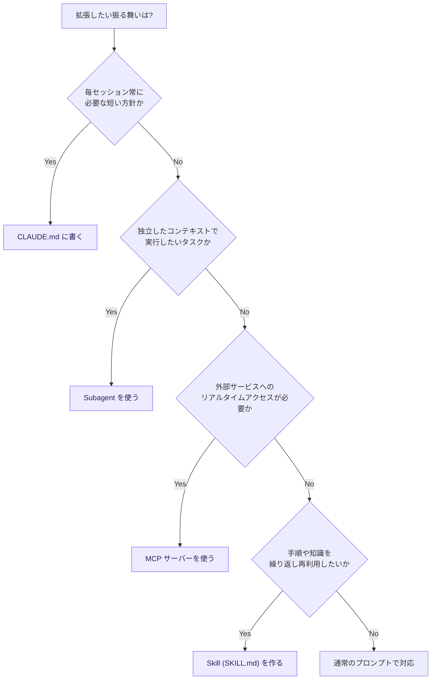
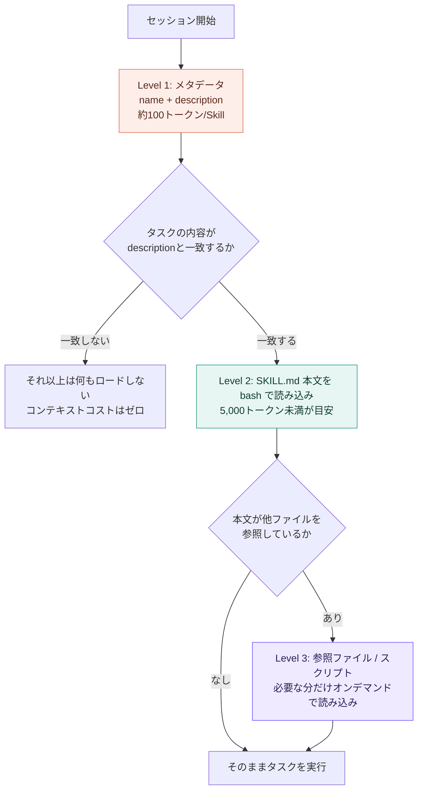
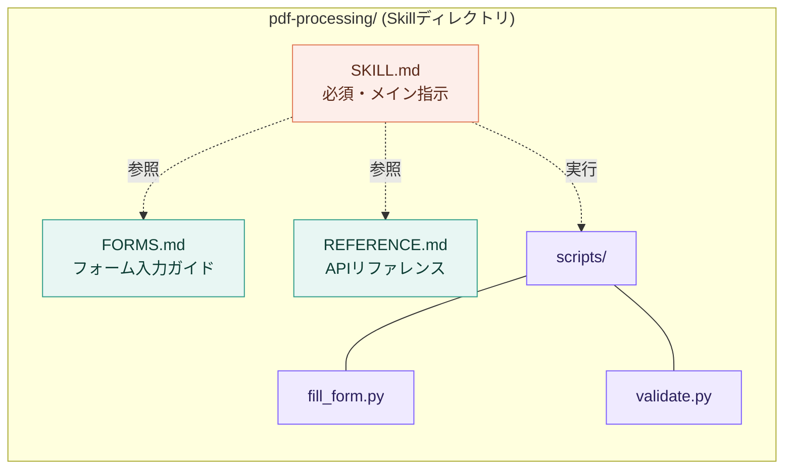
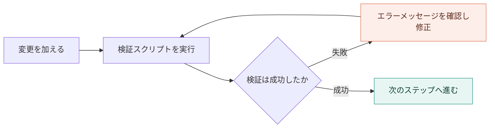

# SKILL.md 実践ガイド — Claude Code / Agent Skills のベストプラクティス

> 対象読者: Claude Code を業務で使い込んでいる中級者〜上級者
> スコープ: `SKILL.md` の設計思想、書き方、Claude Code 固有のフロントマター、評価・運用フローまで
> 情報基準日: 2026年7月26日時点の公式ドキュメントおよび著名開発者の一次情報

---

## はじめに — なぜ今 SKILL.md なのか

Claude Code における「振る舞いの拡張」には CLAUDE.md、Skills、Subagents、MCP という複数の選択肢があります。この中で Skills（`SKILL.md`）は、2025年10月の発表以降、コミュニティで急速に採用が広がっている仕組みです。Django の共同開発者として知られる著名開発者 Simon Willison は、発表当日に「Claude Skills はすごい。MCP より大きなインパクトを持つかもしれない」という趣旨の考察を公開し、その理由として「SKILL.md はMarkdownファイル+YAMLフロントマターというだけの、概念的に極めてシンプルな仕組みでありながら、トークン効率が非常に高い」という点を挙げています（出典は末尾参照）。

このガイドでは、公式ドキュメントの内容を土台にしながら、実務で `SKILL.md` を設計・運用するための手順を段階的に解説します。

### CLAUDE.md / Skills / Subagents / MCP の使い分け

| 選択肢 | 読み込まれるタイミング | 向いている用途 |
|---|---|---|
| **CLAUDE.md** | 毎セッション常時 | プロジェクト全体に関わる短い方針・規約 |
| **Skills (SKILL.md)** | 関連タスク検出時にオンデマンド | 再利用したい手順・ワークフロー・ドメイン知識 |
| **Subagents** | 明示的に委譲したとき | 独立したコンテキストで動かしたい専門タスク |
| **MCP** | ツール呼び出し時 | 外部サービスへのライブ・双方向アクセス |

以下の判断フローで、今から作ろうとしている振る舞いがどれに当たるかを確認できます。



---

## 1. Skill のアーキテクチャを理解する — Progressive Disclosure

Skills を正しく設計する上で最も重要な前提は、**すべての情報が常にコンテキストに乗るわけではない**という点です。Claude Code は Skill の内容を3段階（Progressive Disclosure）で読み込みます。



| レベル | 読み込まれるタイミング | トークンコストの目安 | 内容 |
|---|---|---|---|
| Level 1: メタデータ | 常時（起動時） | 1 Skillあたり約100トークン | YAMLフロントマターの `name` と `description` |
| Level 2: 本文 | Skillが発火した時 | 5,000トークン未満を推奨 | `SKILL.md` のMarkdown本体（手順・ガイダンス） |
| Level 3: 参照 / コード | 必要になった時のみ | 参照されるまで0 | 追加のMarkdownファイル、テンプレート、実行スクリプト |

この設計の要点は、**スクリプトのコード自体はコンテキストに載らず、実行結果だけがトークンを消費する**ことです。したがって、Skillフォルダにどれだけ大量の参照資料やスクリプトを同梱しても、実際に読まれない限りコストはかかりません。これにより「数十個のSkillを常駐させても劣化しない」という設計が成立しています。Simon Willison はこの点を「非常にトークン効率が良い」設計と評しています。

---

## ステップバイステップ実装ガイド

### Step 1 — ギャップを特定する（評価駆動開発から始める）

公式のベストプラクティスは「ドキュメントを書く前に評価（eval）を作れ」という原則を強調しています。手順は次の通りです。

1. Skillなしで、Claude（Claude A と呼ぶ）に代表的なタスクを実施させ、具体的にどこで失敗するか・何度も同じ指示を与えているかを観察する
2. その失敗パターンをカバーする3つ程度のテストシナリオを作る
3. Skillなしでのベースライン挙動を記録する
4. ギャップを埋める最小限の指示だけを `SKILL.md` に書く
5. 評価を実行し、ベースラインと比較しながら改善する

「想像上の要件」ではなく「実際に発生した失敗」を出発点にすることで、無駄に長いドキュメントを避けられます。

### Step 2 — ディレクトリ構成を設計する

Skillは1つのディレクトリで、`SKILL.md` だけが必須です。それ以外は用途に応じて自由に追加できます。



配置場所によって、そのSkillが誰から見えるかが決まります。

| 配置場所 | パス | 適用範囲 |
|---|---|---|
| Enterprise | 管理設定（managed settings）経由 | 組織内の全ユーザー |
| Personal | `~/.claude/skills/<skill-name>/SKILL.md` | 自分の全プロジェクト |
| Project | `.claude/skills/<skill-name>/SKILL.md` | このプロジェクトのみ |
| Plugin | `<plugin>/skills/<skill-name>/SKILL.md` | プラグインが有効な範囲 |

同名のSkillが複数レベルに存在する場合は、Enterprise > Personal > Project の順で優先されます。また、モノレポでは `packages/frontend/.claude/skills/` のようにネストした場所にもSkillを置け、その配下のファイルを扱っているときだけ自動的に読み込まれます。

### Step 3 — YAMLフロントマターを書く

`SKILL.md` の `name` と `description` は推奨される任意フィールドです。省略時、`name` にはディレクトリ名または同等の識別子が使われ、`description` には本文の最初の段落が使われます。指定する場合のバリデーションルールは以下の通りです。

| フィールド | 要件 |
|---|---|
| `name` | 任意。指定する場合は最大64文字、小文字英数字とハイフンのみ、XMLタグ不可、予約語（`anthropic`, `claude`）不可 |
| `description` | 任意。指定する場合は空文字不可、最大1,024文字（Claude Code上の一覧表示では `when_to_use` と合算で1,536文字が上限）、XMLタグ不可 |

以下は推奨される記述例です。命名規則は「動名詞（-ing形）」が推奨されています。

```yaml
---
name: processing-pdfs
description: PDFファイルからテキストや表を抽出し、フォーム入力やドキュメント結合を行う。PDF、フォーム、ドキュメント抽出についてユーザーが言及した場合に使用する。
---
```

避けるべき命名の例: `helper` / `utils` / `tools` のような曖昧な名前、`documents` / `data` のような汎用すぎる名前。

### Step 4 — 発見可能性を高める description の書き方

`description` はClaudeが「このSkillを今使うべきか」を判断する唯一の材料です。以下の原則を守ります。

- **必ず三人称で書く**（`description` はシステムプロンプトに注入されるため、視点が一貫しないと発見精度が落ちる）
- **「何をするか」と「いつ使うか」の両方を書く**
- **具体的なトリガーワードを含める**

| 良い例 | 避けるべき例 |
|---|---|
| `Excelファイルを解析し、ピボットテーブルを作成し、チャートを含むレポートを生成する。Excelファイル、スプレッドシート、表形式データ、.xlsxファイルを扱う際に使用する。` | `ドキュメントを助けます` |
| `git diffを解析してわかりやすいコミットメッセージを生成する。ユーザーがコミットメッセージ作成やステージ済み変更のレビューを依頼した際に使用する。` | `データを処理します` |

### Step 5 — 本文（Level 2）を簡潔に書く

Level 2 に読み込まれた本文は、会話履歴や他のコンテキストと同じ枠を奪い合います。公式ガイドの前提は「Claudeはすでに十分賢い」であり、Claudeがすでに知っていることの説明を書かないことが核心です。

例えば、PDFの説明から入るのではなく、いきなり具体的なコードとライブラリ名を示す方が良い、という考え方です。「なぜpdfplumberが良いか」を長々と説明する必要はなく、「pdfplumberを使う」と書いてコード例を1つ示せば十分、というのが公式の姿勢です。

また、指示の自由度（degrees of freedom）はタスクの性質に応じて調整します。

| 自由度 | 適するケース | 書き方 |
|---|---|---|
| **高（自由度が高い）** | 複数のアプローチが有効、状況に応じた判断が必要 | 「コードレビューでは構造を分析し、バグを確認し…」のような方針ベースの文章 |
| **中** | 好ましいパターンはあるが多少のばらつきは許容 | パラメータ付きの疑似コードやテンプレート関数 |
| **低（自由度が低い）** | 操作が壊れやすく再現性が最重要 | 「このスクリプトを一字一句そのまま実行せよ」という具体的コマンド |

公式ドキュメントの比喩がわかりやすく、「両側が崖の細い橋」なら低自由度（DBマイグレーションのように失敗が許されない）、「障害物のない野原」なら高自由度（コードレビューのように多様な正解がある）と例えられています。

### Step 6 — Progressive Disclosure のパターンを設計する

本文が長くなりそうな場合、以下の3パターンのいずれかで分割します。共通ルールは「参照は `SKILL.md` から1階層のみ」にすることです。ネストした参照（`SKILL.md` → `advanced.md` → `details.md`）は、Claudeが `head -100` のような部分読み込みで済ませてしまい、情報が欠落するリスクがあります。

| パターン | 使いどころ | 構成イメージ |
|---|---|---|
| **概要+参照型** | クイックスタートと詳細ガイドを分離したい | `SKILL.md` に基本、`FORMS.md` / `REFERENCE.md` / `EXAMPLES.md` に詳細 |
| **ドメイン別分割型** | 複数の業務領域を扱うSkill（BigQueryの財務/営業/プロダクト等） | `reference/finance.md` のようにドメインごとにファイル分割 |
| **条件分岐型** | 基本操作と高度な操作で必要な知識が大きく異なる | 基本はSKILL.mdに直接、高度な操作は別ファイルへリンク |

100行を超える参照ファイルには目次を付け、Claudeが部分読み込みでも全体像を把握できるようにします。

### Step 7 — ワークフローとフィードバックループを組み込む

複雑な操作は明確なステップに分解し、複雑なワークフローには「コピーしてチェックを付けていけるチェックリスト」を用意すると、手順の飛ばしを防げます。

さらに効果が高いのが「検証→修正→再検証」のフィードバックループです。



このパターンはコード実行を伴うSkillだけでなく、「STYLE_GUIDE.mdと照合してレビューする」のようなコードなしのSkillにも適用できます。

### Step 8 — Claude Code 固有のフロントマターを使いこなす

Claude Code は Agent Skills のオープン標準を拡張し、`name` / `description` 以外にも多数のフロントマターフィールドをサポートしています（すべて任意項目です）。

| フィールド | 役割 |
|---|---|
| `when_to_use` | 発火条件の補足（`description` と合算で1,536文字上限） |
| `argument-hint` | オートコンプリート時に表示される引数のヒント（例: `[issue-number]`） |
| `arguments` | `$name` 形式で参照できる名前付き引数のリスト |
| `disable-model-invocation` | `true` にするとClaudeによる自動発火を禁止し、`/name` での手動実行のみに限定 |
| `user-invocable` | `false` にすると `/` メニューから隠し、Claude専用の背景知識として扱う |
| `allowed-tools` | そのSkillが発火したターンに限り、確認なしで使えるツールを許可 |
| `disallowed-tools` | そのターンの間、特定ツールを利用不可にする |
| `model` / `effort` | Skill実行中だけモデルや推論の強度を上書き |
| `context: fork` | 独立したサブエージェントのコンテキストで実行 |
| `agent` | `context: fork` 時に使うサブエージェントの種類 |
| `paths` | 特定のファイルパターンを扱っている時だけ自動発火させる |

`disable-model-invocation` と `user-invocable` の組み合わせで、誰が呼び出せるかが変わります。

| フロントマター | ユーザーが呼べるか | Claudeが呼べるか | コンテキストへの影響 |
|---|---|---|---|
| （デフォルト） | 可 | 可 | 説明は常時コンテキストにあり、発火時に本文がロードされる |
| `disable-model-invocation: true` | 可 | 不可 | 説明はコンテキストに出ず、手動実行時のみ本文がロードされる |
| `user-invocable: false` | 不可 | 可 | 説明は常時コンテキストにあり、発火時に本文がロードされる |

副作用を伴う操作（`/deploy` や `/commit` のような操作）には `disable-model-invocation: true` を付け、Claudeが自律的に実行してしまわないようにするのが定石です。

### Step 9 — 実行コードを含むSkillのベストプラクティス

スクリプトを同梱するSkillでは、以下の原則が実務上とくに効いてきます。

- **Claudeに委ねず、スクリプト側でエラーを処理する**（ファイルが無ければ作る、権限エラーなら代替値を返す、など）
- **マジックナンバーを避ける**（`TIMEOUT = 30  # HTTPリクエストは通常30秒以内に完了する` のように理由をコメントで示す）
- **実行するのか参照として読ませるのか、指示を明確にする**（「`analyze_form.py` を実行せよ」と「`analyze_form.py` の抽出アルゴリズムを参照せよ」は別の指示）
- **破壊的な操作や大量更新には「計画ファイルを作成→検証→実行」のパターンを使う**（例: 50件のPDFフォーム更新を一気に適用する前に `changes.json` を検証する）

実行環境はSurfaceによって制約が異なるため、依存パッケージを明記する前提で設計する必要があります。

| Surface | ネットワークアクセス | パッケージインストール |
|---|---|---|
| claude.ai | 設定により全面/部分/なし | npm・PyPI・GitHubから可能 |
| Claude API | なし | 不可（事前インストール済みのもののみ） |
| Claude Code | フルアクセス（ローカル環境と同等） | 可能だがグローバルインストールは非推奨 |

### Step 10 — セキュリティを考慮する

Skillはコードを実行し、ツールを呼び出す能力を持つため、公式ドキュメントは「信頼できる作成元（自作またはAnthropic提供）のSkillのみを使う」ことを強く推奨しています。信頼できない出どころのSkillを使わざるを得ない場合は、以下を確認します。

- `SKILL.md` 本文・スクリプト・画像などバンドルされた全ファイルを監査する
- 想定外のネットワーク呼び出しやファイルアクセスパターンがないか確認する
- 外部URLから動的にコンテンツを取得するSkillは特にリスクが高い（取得内容に悪意ある指示が混入し得る）
- 機微データへのアクセス権を持つ本番環境に組み込む際は、ソフトウェアのインストールと同じ慎重さで扱う

Simon Willison も自身の記事の中で「Skillは任意のコードを実行できる」点に触れており、信頼できる出どころのものだけを使うことが強調されています。

### Step 11 — テスト・評価・イテレーション

公式の推奨フローは「Claude A（Skillを設計する側）」と「Claude B（実際にSkillを使ってタスクをこなす側）」を役割分担させ、観察に基づいて改善を回すというものです。


Claude Code には `skill-creator` プラグインが用意されており、テストケースを `evals/evals.json` に保存し、Skillあり/なしの合格率・トークン数・実行時間を自動比較できます。バージョン間のブラインドA/B比較や、発火条件（description）のチューニング支援機能も含まれています。

観察すべき兆候は次の3つです。

- **想定外の探索経路**: Claudeが意図しない順序でファイルを読んでいないか（構造がわかりにくいサイン）
- **参照の見落とし**: 重要な参照ファイルへのリンクをClaudeが辿っていないか（リンクをより明示的にする必要がある）
- **偏った利用**: 同じファイルばかり読まれる場合はメイン本文への統合を検討し、逆に一度も読まれないファイルは不要か、誘導が弱い可能性がある

---

## アンチパターン集

| アンチパターン | なぜ問題か | 代わりにすべきこと |
|---|---|---|
| Windowsスタイルのパス（`scripts\helper.py`） | Unix環境でエラーになる | 常にスラッシュ区切り（`scripts/helper.py`） |
| 選択肢を並べすぎる（「pypdfでもpdfplumberでもPyMuPDFでも…」） | Claudeが判断に迷う | デフォルトを1つ提示し、例外時の代替案だけ添える |
| 参照の多段ネスト（`SKILL.md`→`advanced.md`→`details.md`） | 部分読み込みで情報が欠落しやすい | 参照は `SKILL.md` から1階層のみに保つ |
| 時限的な情報をそのまま書く（「2025年8月以前はこのAPIを使う」） | いずれ内容が古くなる | 「現在の方法」セクションと「旧パターン（折りたたみ）」セクションに分ける |
| 用語の揺れ（「APIエンドポイント」「URL」「APIルート」を混在） | Claudeの解釈が不安定になる | 用語を1つに統一する |
| スクリプトがエラーをClaudeに丸投げする | 再現性が下がる | スクリプト側で例外処理を書き切る |
| MCPツール名を短縮して書く | 複数MCPサーバーがある場合に見つからない | `ServerName:tool_name` の完全修飾名を使う |

---

## SKILL.md チェックリスト

公開・共有する前に、以下を確認します（公式チェックリストを基に整理）。

**基本品質**
- [ ] `description` が具体的で、鍵となる語句を含んでいる
- [ ] `description` に「何をするか」と「いつ使うか」の両方がある
- [ ] `SKILL.md` 本文が500行未満に収まっている
- [ ] 詳細情報は必要に応じて別ファイルに分離されている
- [ ] 時限的な情報が「旧パターン」セクションに隔離されている
- [ ] 用語が一貫している
- [ ] 例が抽象的でなく具体的である
- [ ] ファイル参照が1階層に保たれている

**コードとスクリプト**
- [ ] スクリプトがClaudeに丸投げせず問題を解決している
- [ ] エラー処理が明示的で分かりやすい
- [ ] マジックナンバーがなく、値の根拠が示されている
- [ ] 必要なパッケージが明記され、利用可能性が確認されている
- [ ] Windowsスタイルのパスが使われていない

**テスト**
- [ ] 最低3つの評価シナリオが用意されている
- [ ] Haiku / Sonnet / Opus など複数モデルでテスト済みである
- [ ] 実運用に近いシナリオでテスト済みである

---

## まとめ

`SKILL.md` の設計は、突き詰めると「Claudeはすでに賢い」という前提のもとで、**足りていない情報だけを、必要なタイミングでだけ渡す**という一点に集約されます。Progressive Disclosureのアーキテクチャを理解し、評価駆動で本文を磨き、Claude Code固有のフロントマター（`disable-model-invocation` や `allowed-tools` など）で発火・権限を制御することで、コンテキストを圧迫せずに再利用可能な専門知識を積み上げていくことができます。

---

## 参考文献・ソース

**Anthropic 公式ドキュメント**
- Agent Skills 概要: https://platform.claude.com/docs/en/agents-and-tools/agent-skills/overview
- Skill authoring best practices（本ガイドの中心的な出典）: https://platform.claude.com/docs/en/agents-and-tools/agent-skills/best-practices
- Claude Code — Extend Claude with skills（フロントマター詳細・運用機能）: https://code.claude.com/docs/en/skills
- Claude Code ドキュメントマップ: https://docs.anthropic.com/en/docs/claude-code/claude_code_docs_map.md

**Anthropic Engineering Blog**
- Equipping agents for the real world with Agent Skills（Barry Zhang, Keith Lazuka, Mahesh Murag 著、アーキテクチャ設計の背景解説）: https://www.anthropic.com/engineering/equipping-agents-for-the-real-world-with-agent-skills

**著名開発者による一次情報**
- Simon Willison（Django共同開発者）「Claude Skills are awesome, maybe a bigger deal than MCP」: https://simonwillison.net/2025/Oct/16/claude-skills/
- Simon Willison, Skillsタグ一覧（Jesse Vincent氏によるSuperpowersプラグイン等コミュニティ動向の記録）: https://simonwillison.net/tags/skills/

**公式スキルリポジトリ / コミュニティ**
- anthropics/skills（公式オープンソースSkillsリポジトリ）: https://github.com/anthropics/skills
- travisvn/awesome-claude-skills（コミュニティによるキュレーションリスト）: https://github.com/travisvn/awesome-claude-skills

> 注: Claude Codeのフロントマターフィールドや挙動はバージョンにより追加・変更されることがあります。本ガイドは2026年7月26日時点の公式ドキュメントに基づいており、最新の詳細は上記リンク（特に `code.claude.com/docs/en/skills`）を直接参照してください。
