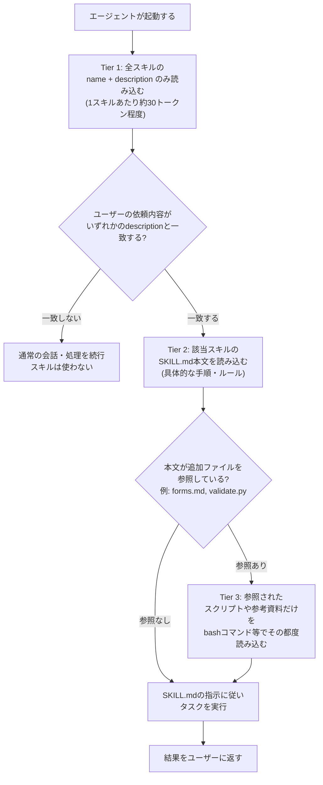
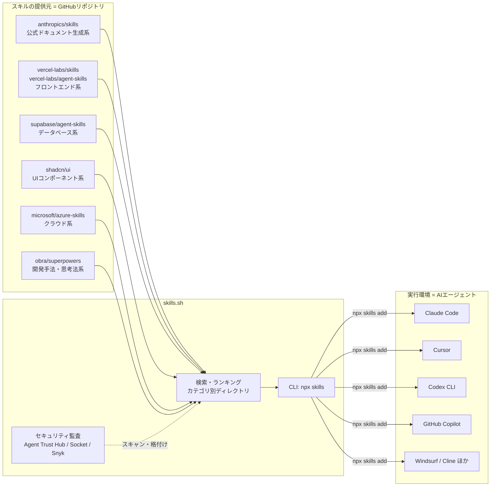
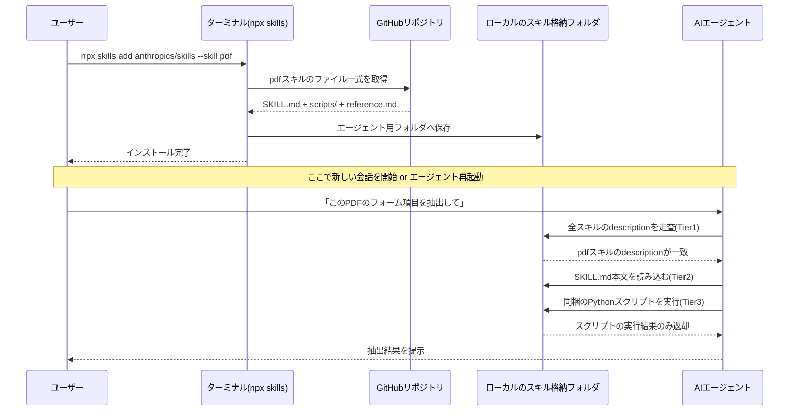
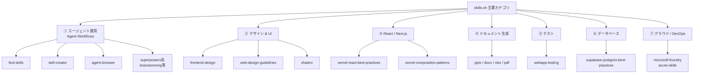
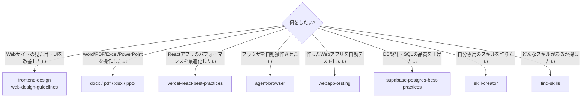
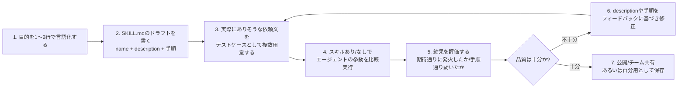
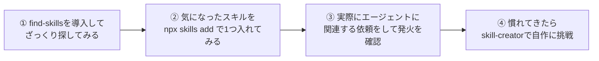

# skills.sh 完全ガイド ― AIエージェントを賢くする「Agent Skills」入門

> 対象読者: Claude Code / Cursor / Codex / GitHub Copilot などのAIコーディングエージェントを使っていて、「Agent Skills」や「skills.sh」という言葉を聞いたことはあるが仕組みがよくわからない、という初学者。
> 本ガイドのゴール: skills.sh を実際に使ってスキルを検索・インストールし、主要スキルを使いこなせるようになること。

---

## 目次

1. [skills.sh とは何か](#1-skillssh-とは何か)
2. [そもそも「Agent Skills」とは何か](#2-そもそもagent-skillsとは何か)
3. [SKILL.md のフォーマットを理解する](#3-skillmd-のフォーマットを理解する)
4. [skills.sh エコシステムの全体像](#4-skillssh-エコシステムの全体像)
5. [CLI のインストールと使い方(ステップバイステップ)](#5-cli-のインストールと使い方ステップバイステップ)
6. [主要スキル カテゴリ別マップ](#6-主要スキル-カテゴリ別マップ)
7. [主要スキル 徹底解説](#7-主要スキル-徹底解説)
8. [対応しているAIエージェント](#8-対応しているaiエージェント)
9. [セキュリティと監査の仕組み](#9-セキュリティと監査の仕組み)
10. [自分だけのスキルを作る(skill-creator活用法)](#10-自分だけのスキルを作るskill-creator活用法)
11. [まとめ:今日から始める3ステップ](#11-まとめ今日から始める3ステップ)
12. [参考URL一覧](#12-参考url一覧)

---

## 1. skills.sh とは何か

**skills.sh** は、AIエージェント(Claude Code、Cursor、Codex CLI、GitHub Copilot など)に「専門知識」を追加で持たせるための拡張パッケージ=**Agent Skills** を検索・比較・インストールできる、GitHubリポジトリ横断型のディレクトリ(登録・検索サイト)です。

npm(JavaScriptのパッケージ)における npmjs.com のような立ち位置を、AIエージェント向けの「スキル」というパッケージ種別で提供していると考えるとイメージしやすいです。

skills.sh が提供する主な機能は次の4つです。

| 機能 | 内容 |
|---|---|
| **検索・発見** | カテゴリ別・ランキング別にスキルを閲覧し、キーワードで検索できる |
| **CLI配布** | `npx skills` コマンド一発でGitHub上のスキルをローカルにインストールできる |
| **セキュリティ監査** | 主要スキルに対し、複数の第三者機関によるコード監査結果を掲示している |
| **ドキュメント** | Agent Skills仕様の使い方、CLIリファレンス、FAQなどを提供 |

skills.sh自体がスキルを作っているわけではなく、**GitHub上に公開された各社・各個人のスキルリポジトリ(Anthropic公式、Vercel、Supabase、Microsoft、個人開発者など)を横断的に集約・可視化している「ハブ」**である、という点が最初の重要なポイントです。

---

## 2. そもそも「Agent Skills」とは何か

### 2-1. 一言で言うと

Agent Skills は、**「指示書・スクリプト・参考資料をまとめたフォルダ」** です。中身は基本的に `SKILL.md` という1つのMarkdownファイルと、必要に応じて付随するスクリプトや資料ファイルです。

Anthropicのエンジニアリングブログでは、スキルを作ることは「新しく入社したベテラン社員に渡すオンボーディング資料を作ること」に例えられています。エージェント自身(モデル)は再学習・ファインチューニングされるわけではなく、汎用的な能力を保ったまま、**特定のタスクに対する「やり方」だけを外部から差し込む**、という考え方です。

### 2-2. なぜ生まれたのか

- 会話のたびに同じ手順・同じ社内ルールを説明し直すのは非効率
- かといって、すべてのツール定義やルールを常にプロンプトに詰め込むとコンテキストウィンドウ(トークン)を圧迫する
- そこでAnthropicは「必要になったときだけ、必要な分だけ読み込む」= **段階的開示(Progressive Disclosure)** という設計を採用したスキル形式を考案しました

この形式は現在、Anthropicだけでなく OpenAI の Codex CLI や Microsoft の GitHub Copilot などでも採用が進んでいる、いわば**オープンな業界標準**になりつつあります。

### 2-3. 段階的開示(Progressive Disclosure)の仕組み

Agent Skillsの最大の特徴は、スキルの中身を **3つの層(Tier)** に分けて、必要な層だけを順番に読み込む点です。



| 層(Tier) | 読み込まれる内容 | タイミング | 目安コスト |
|---|---|---|---|
| **Tier 1** | YAML frontmatterの `name` と `description` | エージェント起動時に**常に** | スキル1つあたり約30トークン |
| **Tier 2** | `SKILL.md` の本文(手順・ルール・注意点) | ユーザーの依頼がTier1のdescriptionと一致した時 | 数百〜数千トークン |
| **Tier 3** | 同梱スクリプト・追加のMarkdown資料・テンプレート | Tier2の指示が「このファイルを読め」「このスクリプトを実行しろ」と示した時のみ | 必要な分だけ(スクリプト自体のコードはコンテキストに載らず、実行結果だけが返る) |

ポイントは、**エージェントがフォルダの中身をあらかじめ全部覚えているわけではなく、Linuxのファイルシステムを操作するのと同じ感覚で、必要なファイルだけをその場で `cat` や `bash` で読みに行く**、という設計になっていることです。これにより、数百個のスキルをインストールしていても、使わないスキルはほぼゼロコストで放置できます。

---

## 3. SKILL.md のフォーマットを理解する

すべてのスキルは、最低限これだけの構造を持ちます。

```markdown
---
name: my-skill-name
description: このスキルが何をするか、どんな時に使うべきかを明確に書く。
             エージェントはこの文章だけを見てスキルを使うか判断するため、
             ここの品質がスキルの「発火率」を左右する最重要項目。
---

# My Skill Name

## 概要
このスキルの目的を1〜2段落で説明する。

## 手順
1. まず〇〇を確認する
2. 次に△△を実行する
3. 最後に□□を検証する

## 注意点
- こういうケースでは✕✕をしてはいけない
```

### 3-1. 必須フィールド

| フィールド | 役割 |
|---|---|
| `name` | スキルの一意な識別子(ケバブケース推奨、例: `pdf-form-filler`) |
| `description` | **最重要。** エージェントがTier1の段階で読む唯一の情報。「何をするか」だけでなく「いつ使うべきか」までトリガーとなる言葉を具体的に書く必要がある |

### 3-2. 本文(Markdown部分)の書き方のコツ

- 手順は箇条書き・番号付きリストで明確に
- SKILL.md自体が長くなりすぎる場合は、別ファイル(例: `forms.md`, `reference.md`)に分割し、本文からリンクで参照する(= Tier 3として遅延読み込みされる)
- 「コードとして実行させたいスクリプト」と「読み込ませて理解させたいドキュメント」を明確に区別して書く(実行 vs 参照)

### 3-3. フォルダ構成の例

```
my-skill/
├── SKILL.md          ← 必須。エントリーポイント
├── reference.md       ← 任意。詳細な参考資料(Tier 3)
├── scripts/
│   └── validate.py    ← 任意。エージェントがbashで実行するスクリプト
└── templates/
    └── example.docx   ← 任意。生成物のひな形など
```

---

## 4. skills.sh エコシステムの全体像

skills.sh を中心に、「どこでスキルが作られ」「どこに集約され」「どこで実行されるか」を図にすると次のようになります。



重要なのは、**skills.sh はあくまで「入口」であり、実体(コード)は各GitHubリポジトリ側にある**という点です。インストール時にCLIがGitHubから直接ファイルを取得します。

---

## 5. CLI のインストールと使い方(ステップバイステップ)

### ステップ 1: 前提環境を確認する

Node.js が入っていれば追加インストール不要です(`npx` はnpmに同梱)。

```bash
node -v
npx --version
```

### ステップ 2: 気になるスキルをインストールする

skills.sh の各スキル詳細ページには、そのままコピペできるインストールコマンドが表示されています。基本形は次の2パターンです。

```bash
# パターンA: リポジトリ全体(複数スキルをまとめて配布している場合)をインストール
npx skills add <owner>/<repo>

# パターンB: リポジトリの中から特定の1スキルだけをインストール(最も一般的)
npx skills add <owner>/<repo> --skill <skill-name>
```

具体例(本ガイドで扱う `frontend-design` スキルの場合):

```bash
npx skills add anthropics/skills --skill frontend-design
```

フルURL形式で指定することもできます(スキル詳細ページに表示される正式な形式です)。

```bash
npx skills add https://github.com/anthropics/skills --skill frontend-design
```

### ステップ 3: スキルを探す(名前がわからない場合)

`find-skills` スキルを導入すると、エージェントに自然文で頼むだけでキーワード検索・インストールまで自動化できます。

```bash
npx skills add https://github.com/vercel-labs/skills --skill find-skills
```

導入後は、Claude Codeなどのチャットで以下のように話しかけるだけで完結します。

```
「Reactのパフォーマンスを改善するスキルを探してインストールして」
```

### ステップ 4: エージェントに認識させる

インストールが完了すると、CLIはエージェントが参照するローカルのスキル格納フォルダ(エージェントの種類によって配置場所は異なります)に `SKILL.md` 一式をコピーします。多くの場合、**エージェントを再起動する、または新しい会話を始めるだけ**で自動的にTier1(name/description)がスキャンされ、以降のリクエストに応じて自動発火するようになります。

Claude Code の場合はプラグイン形式での導入にも対応しており、次のようなコマンドでマーケットプレイス経由の一括インストールも可能です(Anthropic公式スキルの場合)。

```bash
/plugin install document-skills@anthropic-agent-skills
```

### ステップ 5: 匿名テレメトリを無効化したい場合(任意)

CLIはデフォルトでインストール状況などの匿名利用統計をskills.shへ送信します。送信したくない場合は環境変数で無効化できます。

```bash
DISABLE_TELEMETRY=1 npx skills add anthropics/skills --skill pdf
```

### インストールから実行までの流れ(全体シーケンス)



---

## 6. 主要スキル カテゴリ別マップ

skills.sh に登録されているスキルは膨大な数がありますが、初学者がまず押さえておくべき代表的なものを7カテゴリに整理しました。



### どのスキルを選べばいいか迷ったときの早見表



---

## 7. 主要スキル 徹底解説

ここからは、実際にskills.shのランキング上位・代表格となっているスキルを1つずつ、**「何をするか」「いつ使うか」「インストール方法」**の3点セットで解説します。

### 7-1. find-skills(スキルを探すためのスキル)

| 項目 | 内容 |
|---|---|
| 提供元 | `vercel-labs/skills` |
| カテゴリ | エージェント運用 |
| できること | ユーザーの自然文の依頼から必要なスキルをキーワード検索し、その場でインストールまで行う、いわば「メタスキル」 |
| こんな時に使う | 「〇〇をしたいけど、どのスキルを入れればいいかわからない」という入り口の段階 |

```bash
npx skills add https://github.com/vercel-labs/skills --skill find-skills
```

導入後は、エージェントに「〇〇のためのスキルを探して」と話しかけるだけで、検索からインストールまでを自動化できます。他のすべてのスキルの入り口として、最初に入れておくと便利な1本です。

### 7-2. skill-creator(スキルを作るためのスキル)

| 項目 | 内容 |
|---|---|
| 提供元 | `anthropics/skills` |
| カテゴリ | エージェント運用 |
| できること | Anthropicのベストプラクティスに沿った `SKILL.md` の雛形生成、トリガー精度(description)の評価、反復改善までを支援 |
| こんな時に使う | 社内ルールや個人のワークフローを、自分専用のスキルとして固定化・再利用したいとき |

```bash
npx skills add anthropics/skills --skill skill-creator
```

詳しい使い方は本ガイドの「[10. 自分だけのスキルを作る](#10-自分だけのスキルを作るskill-creator活用法)」で解説します。

### 7-3. frontend-design(フロントエンドの意匠設計)

| 項目 | 内容 |
|---|---|
| 提供元 | `anthropics/skills` |
| カテゴリ | デザイン & UI |
| できること | 新規UIを作る、または既存UIを作り直す際に、「テンプレート感の出ない」意図的なビジュアル方向性・タイポグラフィ・配色などの判断基準をエージェントに与える |
| こんな時に使う | 「なんとなくAIっぽい/量産型に見えるUI」から脱却し、独自性のあるデザインをコーディングエージェントに作らせたいとき |

```bash
npx skills add anthropics/skills --skill frontend-design
```

### 7-4. web-design-guidelines(Webデザインの一般原則)

| 項目 | 内容 |
|---|---|
| 提供元 | `vercel-labs/agent-skills` |
| カテゴリ | デザイン & UI |
| できること | 余白・階層構造・可読性・アクセシビリティなど、Webデザインの普遍的な原則をチェックリストとしてエージェントに参照させる |
| こんな時に使う | frontend-designと組み合わせて、デザインの「独自性」だけでなく「基本品質」も担保したいとき |

```bash
npx skills add https://github.com/vercel-labs/agent-skills --skill web-design-guidelines
```

### 7-5. shadcn(UIコンポーネントライブラリ連携)

| 項目 | 内容 |
|---|---|
| 提供元 | `shadcn/ui` |
| カテゴリ | デザイン & UI / React |
| できること | shadcn/ui のコンポーネント(Button, Dialog, Formなど)を正しい作法でエージェントに導入・カスタマイズさせる |
| こんな時に使う | Reactプロジェクトでshadcn/uiベースのUIを構築・拡張したいとき |

```bash
npx skills add shadcn/ui --skill shadcn
```

### 7-6. vercel-react-best-practices / vercel-composition-patterns(React/Next.js最適化)

| 項目 | 内容 |
|---|---|
| 提供元 | `vercel-labs/agent-skills` |
| カテゴリ | React / Next.js |
| できること | 不要な再レンダリングの回避、Server Components/Client Componentsの適切な使い分け、コンポーネント分割パターンなど、Vercelが推奨するReact設計指針をエージェントに適用させる |
| こんな時に使う | Next.js/Reactアプリのコードレビューやリファクタリングをエージェントに任せるとき |

```bash
npx skills add https://github.com/vercel-labs/agent-skills --skill vercel-react-best-practices
npx skills add https://github.com/vercel-labs/agent-skills --skill vercel-composition-patterns
```

### 7-7. agent-browser(ブラウザ自動操作)

| 項目 | 内容 |
|---|---|
| 提供元 | `vercel-labs/agent-browser` |
| カテゴリ | エージェント運用 / テスト |
| できること | エージェントに実ブラウザを操作させ、画面のクリック・入力・スクリーンショット取得・動作確認などを行わせる |
| こんな時に使う | 作ったWebアプリを実際にブラウザで動かして目視確認・デバッグさせたいとき |

```bash
npx skills add https://github.com/vercel-labs/agent-browser --skill agent-browser
```

### 7-8. Anthropic公式ドキュメント生成スキル群(pptx / docx / xlsx / pdf)

| 項目 | 内容 |
|---|---|
| 提供元 | `anthropics/skills` |
| カテゴリ | ドキュメント生成 |
| できること | PowerPoint・Word・Excel・PDFファイルの**実際に開けるバイナリファイル**を、テキスト説明ではなく生成物として作成・編集する |
| こんな時に使う | 「報告書をWordで」「決算資料をExcelで」といった、成果物がオフィス文書そのものであるとき |

```bash
npx skills add anthropics/skills --skill pptx
npx skills add anthropics/skills --skill docx
npx skills add anthropics/skills --skill xlsx
npx skills add anthropics/skills --skill pdf
```

> 補足: Claude.aiの有料プランでは、これらのドキュメント生成スキルは追加インストールなしで既定で使えるようになっています。

### 7-9. webapp-testing(Webアプリの自動テスト)

| 項目 | 内容 |
|---|---|
| 提供元 | `anthropics/skills` |
| カテゴリ | テスト |
| できること | 実装したWebアプリに対して、実ブラウザ相当の環境で動作確認・回帰テストのシナリオを組み立てて実行させる |
| こんな時に使う | 実装が完了した機能について、「ちゃんと動くか」をエージェント自身に検証させたいとき |

```bash
npx skills add anthropics/skills --skill webapp-testing
```

### 7-10. supabase-postgres-best-practices(DB設計・SQL品質)

| 項目 | 内容 |
|---|---|
| 提供元 | `supabase/agent-skills` |
| カテゴリ | データベース |
| できること | PostgreSQL(Supabase)のスキーマ設計、インデックス設計、Row Level Security(RLS)などのベストプラクティスをエージェントに適用させる |
| こんな時に使う | Supabase/PostgreSQLベースのバックエンド設計・マイグレーションをエージェントにレビューさせたいとき |

```bash
npx skills add https://github.com/supabase/agent-skills --skill supabase-postgres-best-practices
```

### 7-11. superpowers系(開発方法論・思考の型)

| 項目 | 内容 |
|---|---|
| 提供元 | `obra/superpowers` |
| カテゴリ | エージェント運用 |
| できること | `brainstorming`(発散的思考の型)、`systematic-debugging`(体系的なデバッグ手順)など、特定の技術領域ではなく「進め方・考え方」そのものをスキル化したもの |
| こんな時に使う | 個別ツールの使い方ではなく、エージェントの思考プロセス自体をより体系立てたいとき |

```bash
npx skills add obra/superpowers --skill brainstorming
npx skills add obra/superpowers --skill systematic-debugging
```

### 7-12. microsoft-foundry / azure-skills(クラウド・エンタープライズ)

| 項目 | 内容 |
|---|---|
| 提供元 | `microsoft/azure-skills` |
| カテゴリ | クラウド / DevOps |
| できること | Microsoft Foundry(Azure上のAnthropicホスティング環境)を利用する際の設定・デプロイ手順をエージェントに適用させる |
| こんな時に使う | Azure環境でClaudeベースのエージェントを構築・運用するとき |

```bash
npx skills add microsoft/azure-skills --skill microsoft-foundry
```

---

## 8. 対応しているAIエージェント

Agent Skills はオープンな仕様であるため、Claude系だけでなく複数のエージェント/IDEで利用が広がっています。skills.sh 上では、エージェントごとの対応状況ページも用意されています。

| エージェント | タイプ |
|---|---|
| Claude Code | CLI型コーディングエージェント(Anthropic) |
| Cursor | IDE統合型エージェント |
| Codex CLI | OpenAIのコーディングエージェント |
| GitHub Copilot | IDE統合型エージェント(Microsoft) |
| Windsurf | IDE統合型エージェント |
| Cline | VS Code拡張型エージェント |
| Gemini CLI | Googleのコーディングエージェント |
| OpenCode / Roo / Trae / Zed など | その他のオープンソース/独立系エージェント |

> 注意点: エージェントの種類によって「スキルフォルダの配置場所」や「発見(discovery)の仕組み」に細かな違いがあります。同じ `SKILL.md` を複数のエージェントで使い回せることが「オープン標準」としての強みですが、導入時は各エージェントの公式ドキュメントで配置パスを確認するのが確実です。

---

## 9. セキュリティと監査の仕組み

スキルは「指示書」であると同時に、**スクリプトを実行する権限をエージェントに与えるもの**でもあります。裏を返せば、悪意あるスキルを不用意にインストールすると、想定外のコマンド実行やデータの持ち出し(exfiltration)につながるリスクがあります。

### 9-1. skills.sh が提供する監査情報

skills.sh には `/audits` ページがあり、登録されている主要スキルについて、複数の第三者セキュリティ機関による静的スキャン結果(安全度のレーティング)を確認できます。監査は継続的に実施されており、既知の危険パターン(不審なネットワーク呼び出し、認証情報へのアクセスなど)を機械的にチェックしています。

### 9-2. Anthropic公式が推奨する自衛策

Anthropicのプラットフォームドキュメントでは、次のような原則が明記されています。

- **信頼できる提供元のスキルだけを使う**(自作、またはAnthropic公式)
- 出所不明のスキルを使う場合は、`SKILL.md` 本文・同梱スクリプト・画像・参考資料まで**すべて目視で確認**する
- 想定外のネットワーク呼び出しや、スキルの説明と矛盾する挙動(ファイルアクセスパターンなど)がないか確認する
- 本番環境で使う場合は特に、機密データの取り扱いに注意する

### 9-3. 実務でのチェックリスト

| チェック項目 | 確認方法 |
|---|---|
| 提供元は信頼できるか | 公式組織(Anthropic/Vercel/Supabaseなど)か、実績のある個人か |
| skills.shの監査結果は良好か | `/audits` ページのレーティングを確認 |
| SKILL.md本文を読んだか | 指示内容が説明(description)と矛盾していないか |
| 同梱スクリプトを読んだか | 外部通信・認証情報アクセスの有無を確認 |
| インストール数・更新頻度は妥当か | 極端に新しい/更新が止まっているものは慎重に |

---

## 10. 自分だけのスキルを作る(skill-creator活用法)

既存スキルに満足できない、あるいは社内独自のルールをスキル化したい場合は `skill-creator` を使います。基本的な進め方は次のループです。



### 導入コマンド

```bash
npx skills add anthropics/skills --skill skill-creator
```

### 作成時のベストプラクティス(Anthropic公式ブログより要約)

1. **評価から始める**: まず既存のエージェントに代表的なタスクをやらせてみて、どこで詰まるか・情報不足になるかを observe する
2. **description に全力を注ぐ**: Tier1で読まれるのはこの一文だけなので、「何を」「いつ」使うかが明確に伝わる書き方をする
3. **肥大化したら分割する**: SKILL.md本文が長くなりすぎたら、参考資料を別ファイルに切り出し、Tier3として遅延読み込みさせる
4. **実行させたいのか読ませたいのか区別する**: 決定的な処理(ソートやバリデーションなど)はスクリプトとして実行させ、判断が必要な部分だけを自然文の指示にする
5. **他のスキルとの共存を前提にする**: 1つのタスクに複数のスキルが同時に有効な場合もあるため、自分のスキルだけが動くことを前提に書かない

---

## 11. まとめ:今日から始める3ステップ



```bash
# ステップ1: 検索用スキルを入れる
npx skills add https://github.com/vercel-labs/skills --skill find-skills

# ステップ2: 興味のあるスキルを1つ入れてみる(例: フロントエンド設計)
npx skills add anthropics/skills --skill frontend-design

# ステップ3: エージェントに関連の依頼をして、実際に使われるか確認する
```

Agent Skills は「モデルを賢くする」のではなく、**「エージェントに正しい手順書を渡す」**ための仕組みです。まずは自分の日常業務で繰り返している作業を1つ思い浮かべ、それに近いスキルをskills.shで探すところから始めるのが、最も理解が早い入り口です。

---

## 12. 参考URL一覧

### skills.sh 本体

- skills.sh トップページ: https://www.skills.sh/
- ドキュメント: https://www.skills.sh/docs
- CLIリファレンス: https://www.skills.sh/docs/cli
- FAQ: https://www.skills.sh/docs/faq
- セキュリティ監査ページ: https://www.skills.sh/audits

### 本ガイドで扱った主要スキルの詳細ページ

- find-skills: https://www.skills.sh/vercel-labs/skills/find-skills
- skill-creator: https://www.skills.sh/anthropics/skills/skill-creator
- frontend-design: https://www.skills.sh/anthropics/skills/frontend-design
- web-design-guidelines: https://www.skills.sh/vercel-labs/agent-skills/web-design-guidelines
- shadcn: https://www.skills.sh/shadcn/ui/shadcn
- agent-browser: https://www.skills.sh/vercel-labs/agent-browser/agent-browser
- supabase-postgres-best-practices: https://www.skills.sh/supabase/agent-skills/supabase-postgres-best-practices

### 元となるGitHubリポジトリ

- anthropics/skills: https://github.com/anthropics/skills
- vercel-labs/skills: https://github.com/vercel-labs/skills

### Anthropic公式ドキュメント・エンジニアリングブログ

- Agent Skillsの設計思想(エンジニアリングブログ): https://www.anthropic.com/engineering/equipping-agents-for-the-real-world-with-agent-skills
- Agent Skills 公式ドキュメント(Claude Platform Docs): https://platform.claude.com/docs/en/agents-and-tools/agent-skills/overview

---

*本ガイドは2026年7月時点でskills.shおよび関連公式ドキュメントを参照して作成しました。エコシステムは急速に拡大しているため、最新のスキル一覧・カテゴリ構成は都度 skills.sh 本体でご確認ください。*