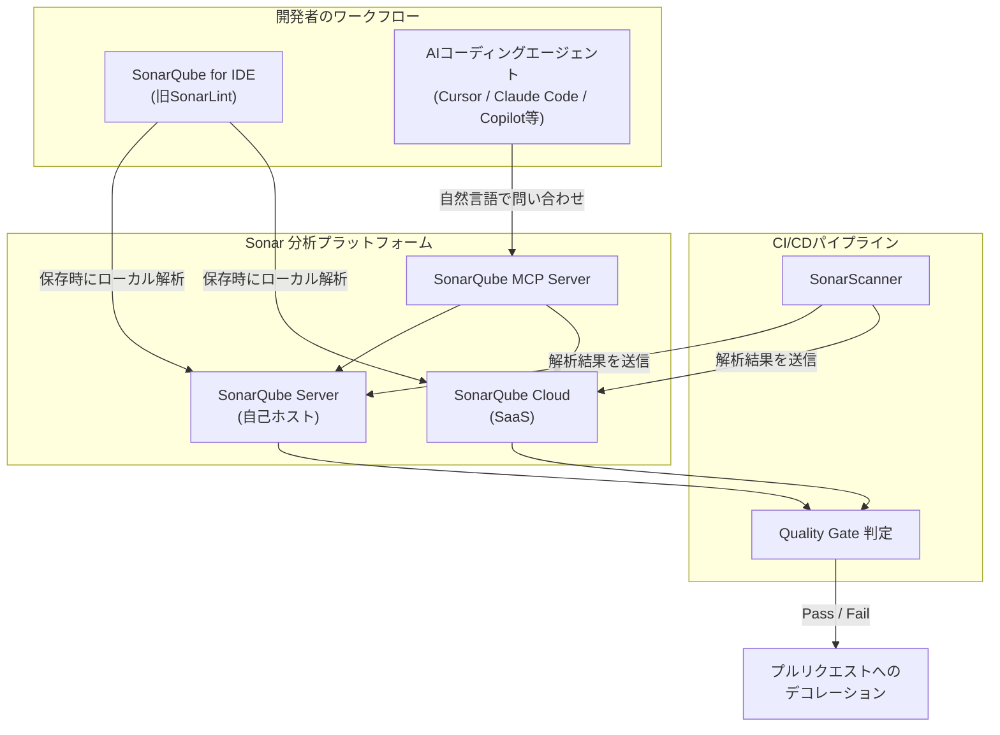
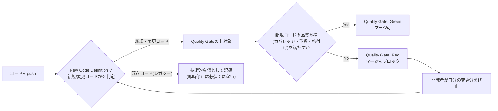
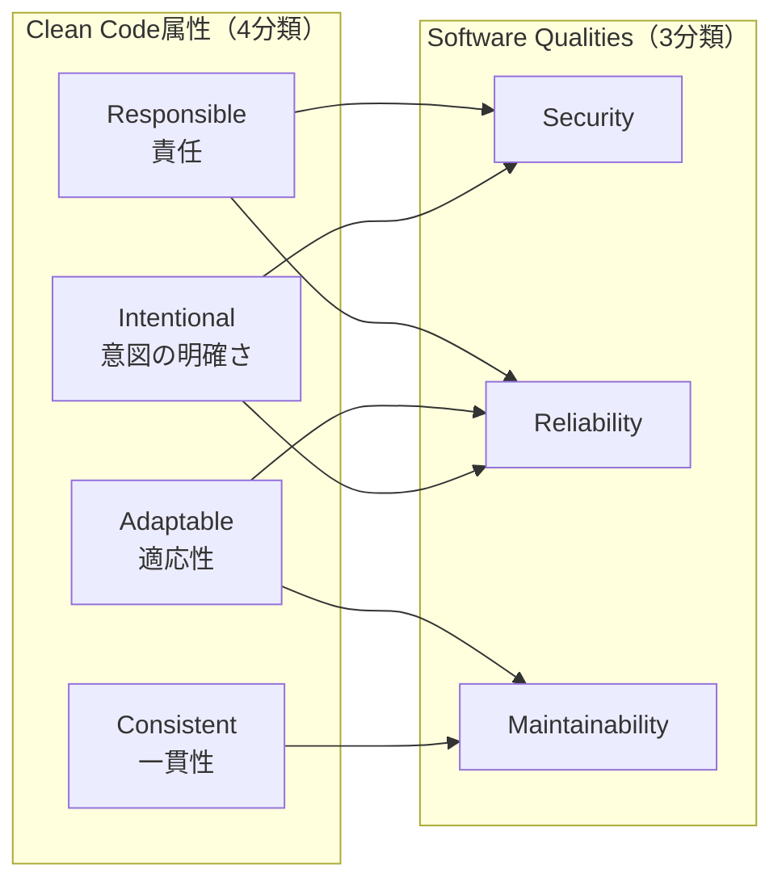
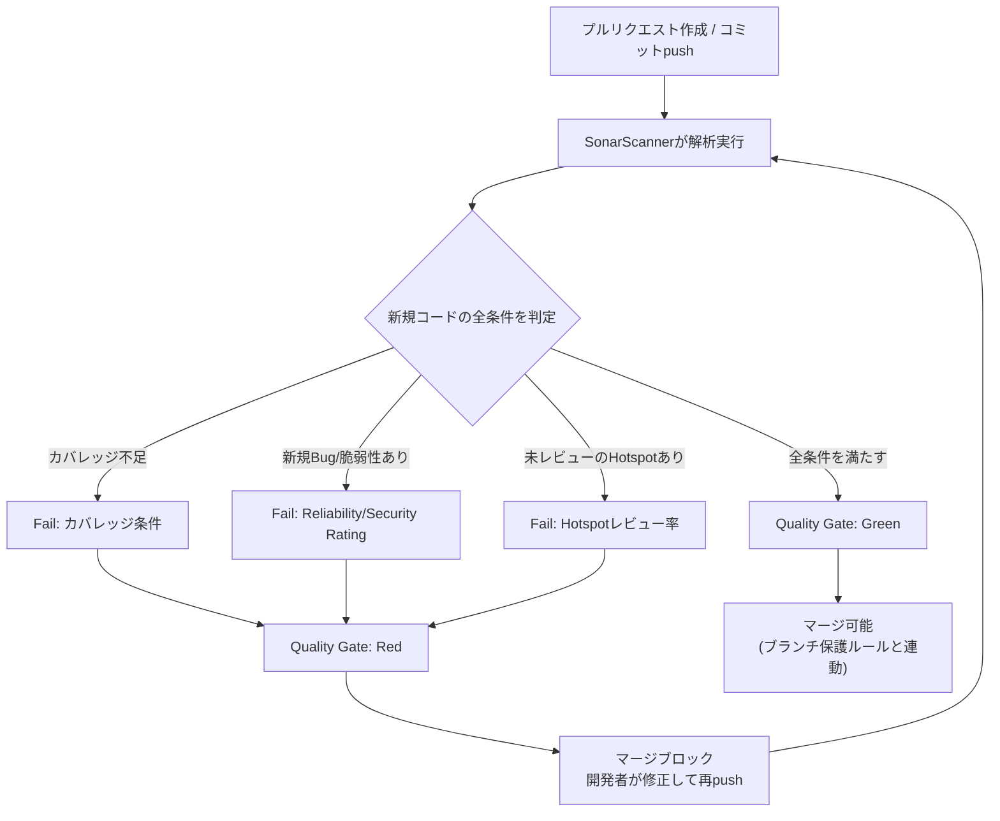
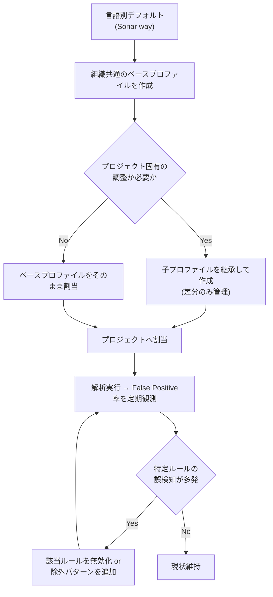
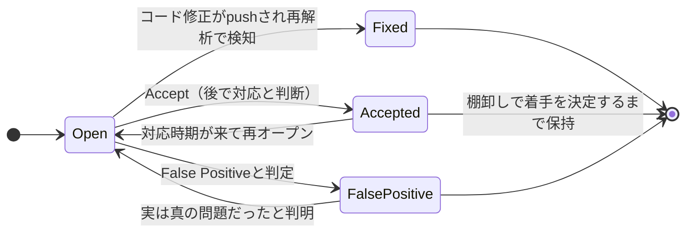
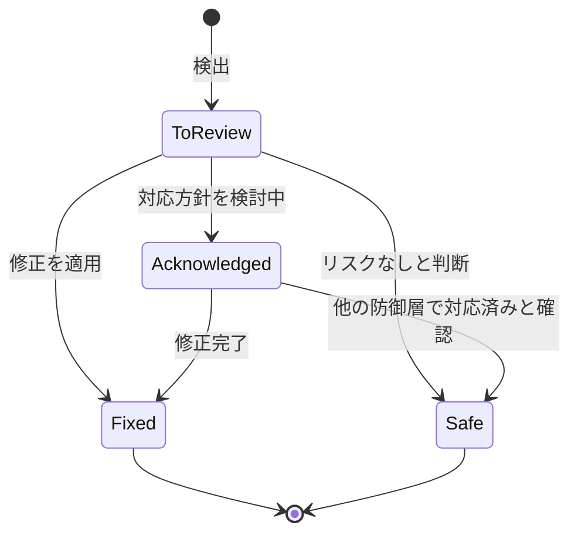
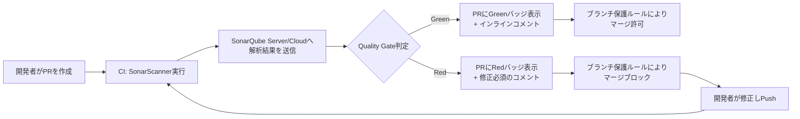
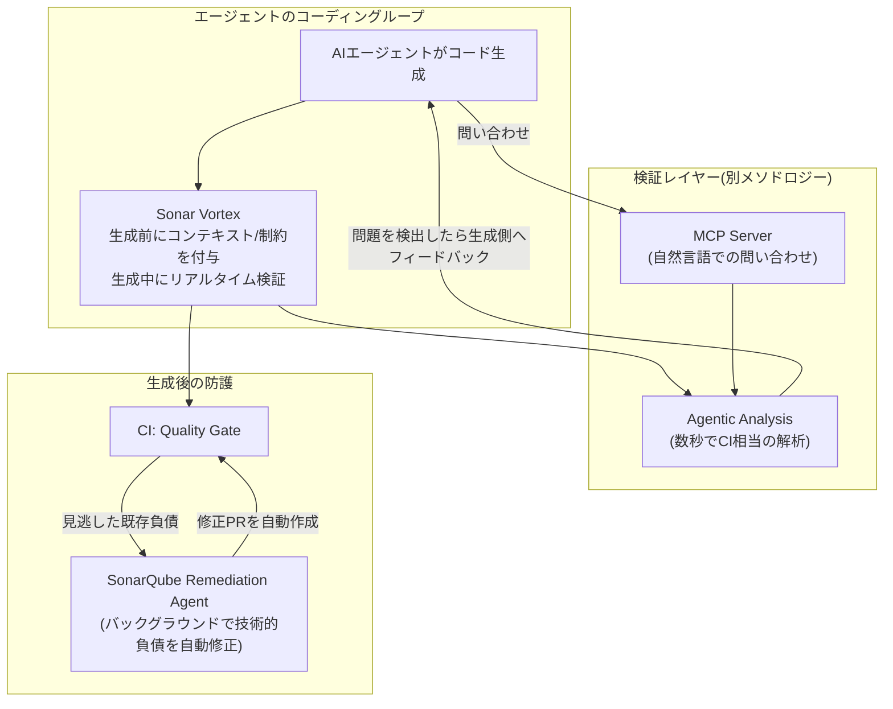
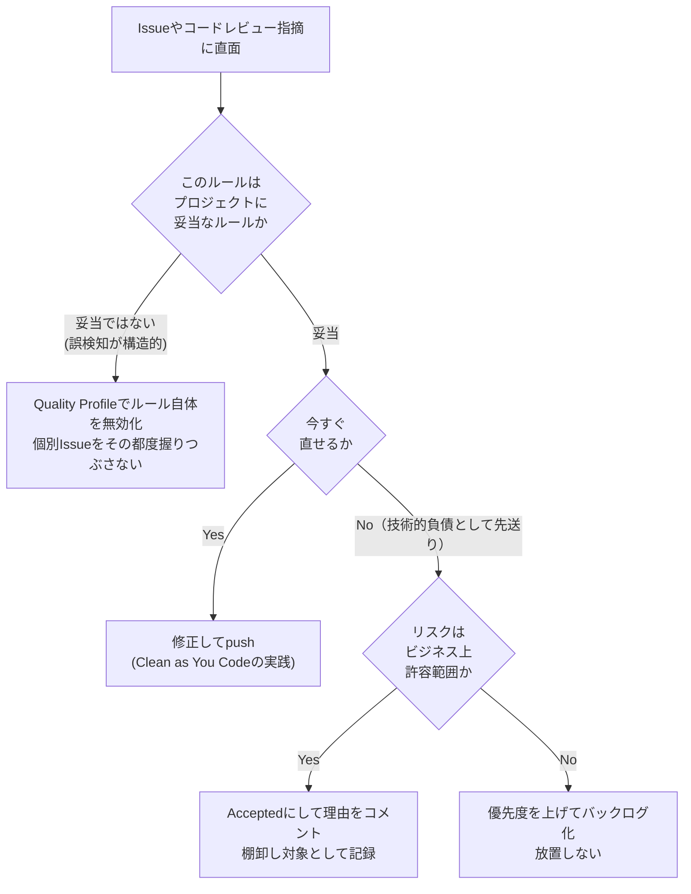

# SonarQubeコードレビュー実践ガイド ― 中級者〜上級者のためのベストプラクティス

> 対象読者: SonarQubeを導入済み、または導入検討中で、Quality Gate設計・Issueトリアージ・CI/CD統合・AI時代のコードレビュー運用まで踏み込みたいエンジニア・テックリード・QAエンジニア向け。
> 情報基準日: 2026年8月2日時点のSonar公式ドキュメント（docs.sonarsource.com）および業界動向をもとに構成。バージョン名・機能名は執筆時点のものであり、Sonarの高頻度リリースにより変更される可能性がある点に留意してください。

## 目次

1. [SonarQubeの現在地：2026年の全体像](#1-sonarqubeの現在地2026年の全体像)
2. [エディション選定：Community BuildからData Centerまで](#2-エディション選定community-buildからdata-centerまで)
3. [Clean as You Code：新規コードにフォーカスする哲学](#3-clean-as-you-code新規コードにフォーカスする哲学)
4. [Clean Code Taxonomyと3つのSoftware Qualities](#4-clean-code-taxonomyと3つのsoftware-qualities)
5. [Quality Gate設計のベストプラクティス](#5-quality-gate設計のベストプラクティス)
6. [Quality Profileとルールチューニング](#6-quality-profileとルールチューニング)
7. [Issueライフサイクル管理とトリアージ](#7-issueライフサイクル管理とトリアージ)
8. [Security Hotspotレビューワークフロー](#8-security-hotspotレビューワークフロー)
9. [シフトレフト：SonarQube for IDEとローカル解析](#9-シフトレフトsonarqube-for-ideとローカル解析)
10. [CI/CDパイプライン統合とプルリクエストデコレーション](#10-cicdパイプライン統合とプルリクエストデコレーション)
11. [AIネイティブ時代のコードレビュー：AC/DCとSonar Vortex](#11-aiネイティブ時代のコードレビューacdcとsonar-vortex)
12. [他のAIレビューツールとの併用戦略](#12-他のaiレビューツールとの併用戦略)
13. [よくあるアンチパターンと対策](#13-よくあるアンチパターンと対策)
14. [導入〜運用チェックリスト](#14-導入運用チェックリスト)
15. [まとめ](#15-まとめ)
16. [参考文献・出典](#16-参考文献出典)

---

## 1. SonarQubeの現在地：2026年の全体像

SonarQube（開発元: Sonar社）は2006年の登場以来、静的解析（SAST）とコード品質管理の業界標準的ポジションを維持してきたプラットフォームです。7,000万行規模のコードベースから個人開発まで、40以上の言語・フレームワーク・IaC技術に対応し、7,000,000人以上の開発者、400,000以上の組織で利用されています。

2024年10月29日、Sonar社はプロダクトブランドを大きく整理しました。これは中級者以上のエンジニアが混乱しやすいポイントなので、最初に整理しておきます。

| 旧名称 | 新名称（2026年時点） | 位置づけ |
|---|---|---|
| SonarQube（自己ホスト型） | **SonarQube Server** | オンプレミス／プライベートクラウドで運用する本体 |
| SonarQube Community Edition | **SonarQube Community Build** | 無料・OSSビルド。毎月リリースされる独自のバージョニング体系 |
| SonarCloud | **SonarQube Cloud** | Sonar社がホストするSaaS版 |
| SonarLint | **SonarQube for IDE** | VS Code、IntelliJ、Eclipse、Visual Studio、Cursor、Windsurf向けの無料IDE拡張 |

さらに2025年には、SonarQube ServerとSonarQube Cloudのバージョニングがカレンダーバージョニング（例: `2026.1`、`2026.2`）に統一され、年1回のLong-Term Active（LTA）リリース（2026年は`2026.1`）を軸に運用する体制に移行しました。Community Buildは`YY.M.0.BuildNumber`形式で毎月リリースされ、LTAの概念を持たない点がServerとの大きな違いです。

この章の要点を、開発者のワークフローとSonarの各コンポーネントがどう繋がるかという観点で図解します。



ポイントは、SonarQube for IDEとMCP Serverがどちらも「同じルールセット・同じ解析エンジン」をローカルとCIの両方で共有していることです。IDEで指摘されなかった問題がCIで初めて出る、という状況を減らすことが、中級以上のチームがまず押さえるべき設計原則になります。

---

## 2. エディション選定：Community BuildからData Centerまで

「どのエディションを選ぶか」は、ブランチ解析・プルリクエストデコレーションを使うかどうかでほぼ決まります。Community Buildはメインブランチ解析のみに制限されており、フィーチャーブランチ運用が主流の2026年のチームには実用上の制約が大きい、という指摘が複数の実務者レビューで共通して挙がっています。

| エディション | ブランチ解析/PRデコレーション | 主な追加機能 | 想定チーム規模 |
|---|---|---|---|
| SonarQube Community Build | 不可（メインブランチのみ） | 20言語以上、基本Quality Gate、CI/CD連携 | 個人開発、小規模OSS |
| SonarQube Server Developer Edition | 可 | ブランチ解析、PRデコレーション、34言語以上 | 小〜中規模チーム |
| SonarQube Server Enterprise Edition | 可 | テイント解析、ポートフォリオ管理、コンプライアンスレポート | 複数チーム・複数プロジェクトの大規模組織 |
| SonarQube Server Data Center Edition | 可 | 高可用性、水平スケーリング、ゼロダウンタイムアップグレード | ミッションクリティカルな大規模基盤 |
| SonarQube Cloud（Free/Team/Enterprise） | Freeから可（5万行まで） | インフラ管理不要、GitHub/GitLab/Bitbucket/Azure DevOps連携 | インフラ運用を持ちたくない全規模のチーム |

実務上の判断基準は次の3つに集約されます。

- **PRベースの開発フローを使うか** → 使うなら最低でもDeveloper EditionかSonarQube Cloud（Free可）が必須ライン
- **データ主権・エアギャップ要件があるか** → あれば自己ホストのServer系一択
- **コードベース規模とライセンス費用のバランス** → 自己ホストは行数(LOC)ベース課金、Cloudはより単純な階層課金

なお、SonarQube Advanced Security（2025年提供開始）はEnterprise Edition／Enterprise Cloud向けのアドオンで、依存関係の脆弱性検出（SCA）、悪意あるパッケージ検出、ライセンスコンプライアンス、CycloneDX/SPDX形式でのSBOM生成をカバーします。単なるコード品質ツールから、サプライチェーンセキュリティまで含む「検証プラットフォーム」へと役割が広がっている点は、エディション選定時に加味すべきポイントです。

---

## 3. Clean as You Code：新規コードにフォーカスする哲学

SonarQubeのコードレビュー運用を理解するうえで最重要のコンセプトが **Clean as You Code** です。これは「既存コード全体の品質を一度に引き上げる」のではなく、「今日書いている新規・変更コードの品質に責任を持つ」という考え方です。

従来型の「プロジェクト全体の品質スコアで合否判定する」アプローチには、次のような課題がありました。

- 数年分のレガシーコードの技術的負債を前に、Quality Gateが恒久的に赤のまま形骸化する
- 新しく書いたコードが高品質でも、既存コードの負債に埋もれて評価されない
- 「誰が悪いのか」が不明確になり、チームの当事者意識が薄れる

Clean as You Codeでは、**New Code Definition（新規コード定義）** という基準点を設定し、その基準点以降に追加・変更された行だけをQuality Gateの主対象にします。New Code Definitionはグローバル・プロジェクト単位に加え、Developer Edition以上ではブランチ単位でも設定可能です。代表的な定義方法は以下の通りです。

- **Previous version**：直近リリースバージョンからの差分
- **Number of days**：指定日数（例: 30日）以内の変更
- **Reference branch**：指定ブランチ（通常は`main`）との差分。プルリクエスト運用ではこれが事実上の標準

新規コードで問題が発生した場合、SonarQubeはその問題を自動的に変更を加えた開発者にアサインします。これにより「自分が書いたコードの品質に自分で責任を持つ」という文化が、ツールのワークフローレベルで強制されます。



Clean as You Codeの潜在的な弱点として、公式ドキュメントも「厳しすぎるQuality Gateの副作用」に言及しています。新規コードの基準を過度に厳格にすると、小さな修正のたびに無関係な既存コードのリファクタリングを強いられ、開発速度を落とすリスクがあります。運用初期は組み込みの `Sonar way` Quality Gateから始め、チームの実態に合わせて段階的にカスタマイズすることが推奨されます。

---

## 4. Clean Code Taxonomyと3つのSoftware Qualities

SonarQubeは2023年以降、旧来の「Bug / Vulnerability / Code Smell」という3分類の課題モデルから、**Clean Code Taxonomy** という、より構造化された分類体系へ段階的に移行しています。中級者以上が押さえておくべきは、この分類が「コードの属性（なぜ問題か）」と「ソフトウェアの品質特性（何に影響するか）」を明確に分けている点です。

**Clean Code属性（4分類）**は、コードがクリーンであるための特性です。

| 属性 | 意味 | 具体例 |
|---|---|---|
| Consistent（一貫性） | フォーマット・命名規則・言語慣習が統一されている | インデント、命名規則、言語イディオムの遵守 |
| Intentional（意図の明確さ） | コードが意図通りに、明確・論理的・完全・効率的に動く | 冗長なロジックの排除、明確な制御フロー |
| Adaptable（適応性） | 単一責任・重複排除・モジュール化・テストがされている | 高凝集な関数、重複コードの排除、十分なテストカバレッジ |
| Responsible（責任） | ライセンス・機密情報・差別的表現に配慮している | シークレットのハードコード禁止、ライセンス遵守 |

これらの属性に問題があると、最終的に **Software Qualities（3つの品質特性）** に影響します。

| Software Quality | 意味 |
|---|---|
| Security | 不正アクセス・利用・破壊からの保護 |
| Reliability | 定められた条件下で性能を維持し続ける能力 |
| Maintainability | 修復・改善・理解のしやすさ |

各Issueには、この4属性×3品質特性のマッピングに基づき、影響度が **Low / Medium / High** の3段階（旧来のBlocker/Critical/Major/Minor/Infoという5段階の重要度モデルに代わるもの）で表示されます。プロジェクト全体・新規コードそれぞれについてのReliability Rating・Security Rating・Maintainability RatingはA〜Eの格付けとして引き続きQuality Gateの条件に利用されます。



実務上のインパクトは、レビューコメントを書くときの「言葉」が変わることです。「これはCode Smellです」ではなく「このコードはAdaptable属性を損ねており、Maintainabilityに影響します」という説明のほうが、レビュー相手（特にジュニアエンジニア）への納得感が高い、というのが多くの実務者の共通見解です。

---

## 5. Quality Gate設計のベストプラクティス

Quality Gateは「このプロジェクトはリリース可能か」という一つの問いに答えるための、条件のセットです。組み込みの `Sonar way` Quality Gateは、SonarSourceによって提供・維持される読み取り専用のゲートで、Clean as You Codeを体現するベストプラクティスとして機能します。

**Sonar wayが新規コードに設定する代表的な条件例:**

| 指標 | 推奨しきい値の例 |
|---|---|
| 新規コードのカバレッジ | 80%以上 |
| 新規コードの重複行率 | 3%未満 |
| 新規コードのMaintainability Rating | A |
| 新規コードのReliability Rating | A |
| 新規コードのSecurity Rating | A |
| 新規コードのSecurity Hotspotレビュー率 | 100% |

カスタムQuality Gateを設計する際のベストプラクティスは次の通りです。

- **新規コード条件を中心に据える**：全体コードに対する条件を追加することは、公式ドキュメントでも非推奨とされています。新規コードにフォーカスしたほうが、レガシーコードの重みに引きずられずレビューの摩擦を最小化できます。
- **プロジェクトの性質ごとにゲートを分ける**：Webアプリとバッチ処理、あるいは言語が異なるプロジェクト間でカバレッジ基準を同一にする必要はありません。
- **プルリクエスト解析とデコレーションを組み合わせる**：マージ前にQuality Gateの結果をSonarQubeのUIとDevOpsプラットフォーム（GitHub/GitLab/Azure DevOps）の両方で可視化します。
- **段階導入**：既存の大規模レガシープロジェクトにいきなり厳格なゲートを適用すると形骸化・回避行動（無視する文化）を招きます。まずは「新規コードのみ」「重大度Highのみ」といった限定的な条件から始め、チームの成熟度に応じて厳格化するのが現実的です。



---

## 6. Quality Profileとルールチューニング

Quality Profileは、言語ごとに「どのルールを有効化するか」「重要度をどう設定するか」を定義する設定セットです。SonarQubeは6,500以上の決定論的ルールを提供しており、これを無調整のまま大規模プロジェクトに適用すると、初回スキャンだけで数千件のIssueが検出されることも珍しくありません。

**ルールチューニングの実践ステップ:**

1. **組み込みの言語別デフォルトプロファイル（例: `Sonar way`）から開始する**：ゼロから設計するのではなく、SonarSourceが継続的にメンテナンスするデフォルトを土台にする
2. **プロジェクトの技術スタックに合わせてカスタムプロファイルを作成する**：フレームワーク固有の警告（例: 特定のテストフレームワークでは誤検知になりやすいルール）を無効化する
3. **誤検知率の高いルールを可視化する**：False Positiveとしてマークされた件数が多いルールは、そのルール自体がプロジェクトに適合していないシグナルです。ルールを無効化するか、対象スコープ（除外パターン）を見直します
4. **重要度（Impact）のカスタマイズは慎重に行う**：デフォルトの重要度づけはSonarSourceの分析に基づいているため、安易な引き下げは品質基準の空洞化を招きます
5. **プロファイルの継承構造を活用する**：組織共通のベースプロファイルを作り、プロジェクトごとの差分だけを子プロファイルで管理すると、ルール変更の伝播が容易になります



---

## 7. Issueライフサイクル管理とトリアージ

検出されたIssueをどう扱うかは、チームのコードレビュー文化そのものを反映します。SonarQubeのIssueステータスモデルは近年整理され、`Confirmed`（確認済み）や`Resolve as Fixed`（手動での修正済みマーク）といった旧アクションは非推奨となり、以下のシンプルなモデルに統一されています。

| ステータス | 意味 | 品質レポート・格付けへの影響 |
|---|---|---|
| Open | デフォルトの初期状態 | 集計対象 |
| Accepted | 「妥当な指摘だが今は直さない」と判断 | 集計から除外（技術的負債として記録は残る） |
| False Positive | 「解析結果自体が誤り」と判断 | 集計から完全に除外 |
| Fixed | 後続の解析でコードが修正されたことを自動検知 | 30日後にパージ |

**トリアージ運用のベストプラクティス:**

- **定期的なトリアージの時間を確保する**：スプリントや週次のタイミングで、新規に発生したIssueを見直す時間をルーティン化する
- **False Positiveは「権限を持つ人」が判断する**：SonarQubeではFalse Positiveへの変更に`Administer Issues`権限が必要です。誰でも自己判断で握りつぶせない設計になっている点を、チーム運用でも尊重するべきです
- **特定ルールでFalse Positiveが頻発する場合はプロファイル側を見直す**：個別のIssueを握りつぶすのではなく、ルール自体が自分たちのプロジェクトに合っていないというシグナルとして扱う
- **Acceptedは「先送りの言い訳」にしない**：技術的負債として可視化されたままになるため、定期的にAccepted一覧を棚卸しし、本当に着手しないままでよいかを再確認する



---

## 8. Security Hotspotレビューワークフロー

Security HotspotはVulnerability（脆弱性）とは異なる概念です。Vulnerabilityは「ほぼ確実に問題があるコード」を指すのに対し、Security Hotspotは「セキュリティ上注意が必要だが、実際にリスクになるかは文脈次第のコード」を指します。多層防御（Defense in Depth）の考え方に近く、「他の防御層が既にあるため実質的に安全」というケースも多く含まれます。

Security Hotspotのレビューは次のステータスで管理されます。

| ステータス | 意味 |
|---|---|
| To Review | 検出直後のデフォルト状態。レビューが必要 |
| Acknowledged | レビュー済みだが対応方針・修正が保留中 |
| Fixed | レビューの結果、修正を適用した |
| Safe | レビューの結果、他の防御層により対応不要と判断した |

レビュー時にSonarQubeが提示する3つの観点（What's the risk / Are you at risk / How can you fix it）に沿って判断するのが標準的な手順です。

1. **What's the risk?** タブでそのHotspotがなぜ検出されたかを理解する
2. **Are you at risk?** タブの「Ask Yourself Whether」の質問リストに沿って、自分たちのコンテキストで本当にリスクがあるかを判定する
3. リスクがあると判断した場合、**How can you fix it?** タブの推奨されるセキュアコーディングプラクティスに沿って修正する
4. 最終的にFixed（修正済み）またはSafe（対応不要）のステータスを設定する



Quality Gateの条件に「新規コードのSecurity Hotspotレビュー率100%」を含めるのがSonar wayのデフォルトです。これにより、「未レビューのHotspotを放置したままリリースする」という事態を構造的に防止できます。レビュー優先度は高い順に並べ替えられるため、まずは高優先度のHotspotから着手するのが定石です。

---

## 9. シフトレフト：SonarQube for IDEとローカル解析

CI/CDでの検出だけに頼ると、フィードバックループが遅く、開発者はコンテキストスイッチのコストを払うことになります。**SonarQube for IDE**（旧SonarLint）は、コードを書いている最中にローカルでルールを適用し、CIに到達する前に問題を発見できるようにする無料のIDE拡張です。

シフトレフトを機能させる実務上のポイント:

- **Connected Modeを使う**：SonarQube for IDEをSonarQube Server／Cloudに接続すると、サーバー側のQuality Profile設定がIDEにも同期され、「IDEでは指摘されなかったのにCIで落ちた」というギャップを防げます
- **AI CodeFixと組み合わせる**：IDE上で検出された問題に対し、LLMによる修正提案（AI CodeFix、後述）をワンクリックで適用できるため、修正の心理的ハードルが下がります
- **エディタ非依存の拡張性**：Eclipse、Visual Studio、VS Code、IntelliJ IDEAに加え、Cursor・Windsurfなど「AIネイティブ」なエディタにも対応が広がっている点は、AIエージェント併用時代のシフトレフト戦略として重要です

---

## 10. CI/CDパイプライン統合とプルリクエストデコレーション

プルリクエストデコレーションは、SonarQubeの解析結果をレビュープロセスに組み込む上で最も投資対効果の高い設定の一つです。マージ前にインラインコメントとQuality Gateのステータスチェックが表示されるため、「後から見つかる」から「マージ前に防ぐ」へと運用が変わります。

以下はGitHub Actionsを使った代表的な構成例です（`sonarqube-scan-action` v5系以降の構成に準拠）。

```yaml
name: SonarQube Analysis

on:
  push:
    branches: [main]
  pull_request:
    types: [opened, synchronize, reopened]

jobs:
  sonarqube:
    runs-on: ubuntu-latest
    steps:
      - uses: actions/checkout@v4
        with:
          fetch-depth: 0   # blame情報を正確にするため全履歴を取得

      - name: SonarQube Scan
        uses: SonarSource/sonarqube-scan-action@v5
        env:
          SONAR_TOKEN: ${{ secrets.SONAR_TOKEN }}
          SONAR_HOST_URL: ${{ secrets.SONAR_HOST_URL }}

      - name: SonarQube Quality Gate check
        uses: SonarSource/sonarqube-quality-gate-action@master
        timeout-minutes: 5
        env:
          SONAR_TOKEN: ${{ secrets.SONAR_TOKEN }}
```

設定時のベストプラクティス:

- **`fetch-depth: 0`を必ず設定する**：浅いクローンのままだとSCM blame情報（誰がどの行を書いたか）が不正確になり、Issueの自動アサインが機能しません
- **`sonar.qualitygate.wait=true`は乱用しない**：このパラメータをつけるとスキャナーがQuality Gate判定を待ってから終了するためワークフロー時間が伸びます。デプロイをブロックする用途以外では、プルリクエストデコレーション（自動で表示される）に任せるのが推奨です
- **Quality Gate Check Actionを別ステップに分離する**：スキャン自体の成否とQuality Gateの合否を分けることで、失敗原因の切り分けが容易になります
- **モノレポの場合はパスフィルタで対象を絞る**：変更のあったサービスのみをスキャンすることで、CI時間とライセンス消費（LOCベース課金）の両方を抑制できます
- **ブランチ保護ルールと連動させる**：Quality Gateのステータスチェックを必須チェックに指定し、Redのままではマージできないようにする



---

## 11. AIネイティブ時代のコードレビュー：AC/DCとSonar Vortex

2026年のSonarは、単なる静的解析ツールから「AIコーディングエージェントの信頼レイヤー」へと明確にポジションを移しています。Sonarはこの一連の機能群を **Agent Centric Development Cycle（AC/DC）** というフレームワークで整理しています。中級者以上のエンジニアが押さえておくべき主要コンポーネントは以下の通りです。

| 機能 | 概要 | 提供段階（2026年時点） |
|---|---|---|
| AI CodeFix | 検出されたIssueに対し、LLMによる修正案を自動生成 | GA（一般提供）。Enterprise/Data Center、SonarQube CloudのTeam/Enterprise向け |
| AI Code Assurance | AI生成コードを含むプロジェクトにラベル付けし、より厳格なQuality Gateを自動適用 | 提供中 |
| SonarQube MCP Server | AIコーディングエージェント（Cursor、Claude Code等）がSonarQubeに自然言語で問い合わせできるようにする無料の統合レイヤー | GA |
| Agentic Analysis | エージェントがコード生成の最中に、CIと同等精度の解析を数秒で受けられる仕組み | Beta（SonarQube CloudのTeam/Enterprise向け） |
| Sonar Vortex | エージェントのコーディングループの内側で、コード生成前にコンテキストと制約を与え、生成過程をリアルタイム検証する新製品 | 提供開始 |
| SonarQube Remediation Agent | バックグラウンドで自律的に技術的負債を検出・修正するエージェント | GA |

このアーキテクチャの核心は、著名なエンジニアリングブロガーであるAddy Osmani氏（Google Chrome関連のエンジニアリングリーダーとして知られる）が指摘する **「maker-checker split（作る側と検証する側を分離する）」** という原則です。同氏は2026年6月、「無人で回り続けるループは、無人でミスを重ねるループでもある」という趣旨の指摘をしており、Sonarはこれを引用する形で、コードを生成するモデルと、それを検証する仕組みを意図的に分離する設計思想（同社はこれを「ゼロトラスト」なコード検証と呼んでいます）を採用しています。

Addy Osmani氏は自身のブログでも、2026年に入り上級エンジニアの3割以上が「主にAI生成コードを出荷している」と報告している調査に触れつつ、AIはロジック・セキュリティ・エッジケースの実装で誤りを起こしやすいと指摘しています。同氏の要点は次の3つに整理できます。

- 個人開発では、テストスイートを安全網としながら高速に検証するワークフローが現実的
- チーム開発では、複数人が関わる分コードの寿命とミスのコストが上がるため、人間によるレビューは「AIが見落とすもの」（ロードマップとの整合性、組織的な意思決定）に焦点を移しつつ、なくならない
- いずれにせよ「自分の目で動作を確認していないコードは、動いているとは言えない」という原則はAI時代でも変わらない



このAC/DCモデルの実務的な意味は、「コードレビューはCIの1ステップではなく、エージェントのコーディングループ全体に埋め込まれたプロセスになる」という点です。中級以上のチームは、AI CodeFixやMCP Serverの導入を「便利機能の追加」ではなく、「検証責任をどこに置くか」というアーキテクチャ上の意思決定として捉える必要があります。

---

## 12. 他のAIレビューツールとの併用戦略

2026年の実務者コミュニティでは、SonarQubeを「唯一のレビューツール」として使うのではなく、**決定論的な静的解析（SonarQube）とコンテキスト重視のAIレビュー（CodeRabbit、GitHub Copilot Code Reviewなど）を併用する**運用が主流になりつつあります。これは複数の独立レビュー記事で共通して指摘されているパターンです。

| 観点 | SonarQubeが得意 | AIネイティブレビューツールが得意 |
|---|---|---|
| 判定の一貫性・再現性 | ◎（決定論的ルールベース） | △（LLMの応答は文脈依存でばらつく） |
| 監査可能性・コンプライアンス報告 | ◎ | △ |
| ビジネスロジック・要件との整合性チェック | △ | ◎（自然言語での文脈理解） |
| 新規パターン・言語イディオムの機微な指摘 | △ | ◎ |
| セットアップ・運用コスト | 自己ホストは重め、Cloudは軽量 | 概ね軽量 |

併用時の実務パターンとしては、次のような役割分担が現実的です。

1. **SonarQube（+ Quality Gate）を必須のマージゲートとして固定する**：決定論的でぶれない基準は「絶対に守るライン」として機能させる
2. **AIレビューツールをコンテキストレビューの補助として並走させる**：ビジネスロジックの妥当性やレビューコメントの自然言語での要約などは、AI側の得意領域に任せる
3. **重複ノイズを避けるため、どちらが何を指摘する役割かをチームで明文化する**：両方が同じ種類の指摘（フォーマットなど）をコメントすると、レビュー体験がかえって悪化します

SonarQube自身もこの流れを踏まえ、SonarQube MCP Serverを通じてCursorやClaude Code、Copilotなど外部のAIコーディングツールと直接連携する方向に舵を切っており、「競合するツール」というより「検証レイヤーとして下支えするツール」という位置づけを強めています。

---

## 13. よくあるアンチパターンと対策

中級〜上級チームでも陥りやすい代表的なアンチパターンを、判断フローの形で整理します。



**特に注意すべきアンチパターン:**

- **既存コード全体にQuality Gate条件を適用する**：Clean as You Codeの思想に反し、レガシー資産の重みで新規コードの評価まで歪める。新規コード条件を中心に据える
- **False Positiveの濫用**：本当は妥当な指摘を「面倒だから」という理由でFalse Positiveにする運用が常態化すると、指標が形骸化する。権限管理とコメント必須化で歯止めをかける
- **Quality Gateを一度作ったら放置する**：プロジェクトの成熟度や技術スタックの変化に合わせて定期的に見直さないと、厳しすぎる／緩すぎるゲートのまま固定化する
- **CI側だけに解析を任せてIDE統合を怠る**：フィードバックが遅く、修正コストが跳ね上がる。シフトレフトを組織のデフォルトにする
- **AIレビューツールとの役割分担を決めないまま両方導入する**：同じ種類の指摘が重複し、レビューのノイズが増えて開発者の信頼を失う
- **Security Hotspotを「Issueより優先度が低い」と誤解して放置する**：レビュー率100%をQuality Gate条件に含めることで、構造的に防止する

---

## 14. 導入〜運用チェックリスト

- [ ] エディション（Community Build / Developer / Enterprise / Data Center / Cloud）をブランチ運用の要件から選定した
- [ ] New Code Definitionを`Reference branch`（例: `main`）ベースで設定した
- [ ] `Sonar way`を土台にQuality Gateを設計し、全体コードではなく新規コード条件を中心に据えた
- [ ] Quality Profileを組織共通のベースから継承する形で運用し、プロジェクト差分だけを子プロファイルで管理している
- [ ] Issueトリアージ（Accepted / False Positive判定）のレビュー時間をスプリントに組み込んだ
- [ ] Security Hotspotのレビュー率100%をQuality Gate条件に含めた
- [ ] SonarQube for IDEをConnected Modeでチーム全体に展開した
- [ ] CI/CDにプルリクエストデコレーション＋ブランチ保護ルールを設定し、Quality Gate Redでマージ不可にした
- [ ] `fetch-depth: 0`など、SCM blame情報が正しく取得できるCI設定を確認した
- [ ] AI CodeFix / AI Code Assurance / MCP Serverなど、AI関連機能の要否をチームのAI活用度に応じて評価した
- [ ] 他のAIレビューツールと併用する場合、役割分担をドキュメント化した
- [ ] 半年〜1年に一度、Quality Gate・Quality Profileの妥当性を棚卸しする運用を定めた

---

## 15. まとめ

SonarQubeを使ったコードレビューのベストプラクティスは、突き詰めると次の3つの原則に集約されます。

1. **新規コードにフォーカスする**（Clean as You Code）ことで、レガシー資産の重みに埋もれず、開発者一人ひとりの当事者意識を維持する
2. **決定論的な解析を「絶対に守るライン」、AIレビューを「文脈理解の補助」として役割分担する**ことで、監査可能性と柔軟性を両立する
3. **レビューをCIの1ステップに閉じ込めず、IDEでのシフトレフトからAIエージェントのコーディングループの内側まで、開発フロー全体に埋め込む**

2026年のSonarQubeは、AC/DC（Agent Centric Development Cycle）というフレームワークの下でAI CodeFix、Agentic Analysis、Sonar Vortex、Remediation Agentといった機能群を急速に拡張しており、「静的解析ツール」から「AI生成コードを含むあらゆるコードの検証プラットフォーム」への転換の途上にあります。ツールの機能を追いかけるだけでなく、Clean as You CodeとClean Code Taxonomyという不変の設計思想を理解しておくことが、この変化の速い領域で判断を誤らないための土台になります。

---

## 16. 参考文献・出典

**公式ドキュメント（docs.sonarsource.com）**

- Sonar Documentation トップページ: https://docs.sonarsource.com/
- Clean as You Code（SonarQube Server 10.5）: https://docs.sonarsource.com/sonarqube-server/10.5/user-guide/clean-as-you-code
- Clean Code definition（SonarQube Server 10.4）: https://docs.sonarsource.com/sonarqube-server/10.4/user-guide/clean-code/definition
- Clean Code benefits: the software qualities（SonarQube Server 10.8）: https://docs.sonarsource.com/sonarqube-server/10.8/core-concepts/clean-code/software-qualities
- Quality gates（SonarQube Server 8.9）: https://docs.sonarsource.com/sonarqube-server/8.9/user-guide/quality-gates/
- Managing Security Hotspots（SonarQube Server）: https://docs.sonarsource.com/sonarqube-server/user-guide/security-hotspots
- Reviewing security hotspots（SonarQube Cloud）: https://docs.sonarsource.com/sonarqube-cloud/managing-your-projects/issues/reviewing-security-hotspots
- Editing issues（SonarQube Server 10.8）: https://docs.sonarsource.com/sonarqube-server/10.8/user-guide/issues/managing
- Issue management solution（SonarQube Cloud）: https://docs.sonarsource.com/sonarqube-cloud/managing-your-projects/issues/solution-overview
- AI Code Assurance（AC/DC）: https://docs.sonarsource.com/agent-centric-development-cycle/ai-code-standards/ai-code-assurance
- AI CodeFix（SonarQube Server）: https://docs.sonarsource.com/sonarqube-server/ai-capabilities/ai-codefix
- Agentic Analysis（AC/DC）: https://docs.sonarsource.com/agent-centric-development-cycle/features/agentic-analysis
- GitHub Actions連携（SonarQube Server）: https://docs.sonarsource.com/sonarqube-server/analyzing-source-code/ci-integration/github-actions
- GitHub Actions連携（SonarQube Cloud）: https://docs.sonarsource.com/sonarqube-cloud/analyzing-source-code/ci-based-analysis/github-actions-for-sonarcloud

**Sonar社公式ブログ・プレスリリース**

- Sonar Streamlines Product Naming（ブランド統合の発表, 2024年10月）: https://www.sonarsource.com/company/press-releases/sonar-streamlines-product-naming-to-reflect-core-mission-of-code-quality-and-security/
- Announcing SonarQube MCP Server: https://www.sonarsource.com/blog/announcing-sonarqube-mcp-server/
- MCP Server製品ページ: https://www.sonarsource.com/products/sonarqube/mcp-server/
- Introducing Sonar Vortex and the SonarQube Remediation Agent（Addy Osmani氏の言及を含む, 2026年6月）: https://www.sonarsource.com/blog/introducing-sonar-vortex/
- What is Code Quality?（Clean Code Taxonomyの解説）: https://www.sonarsource.com/blog/what-is-clean-code/

**著名開発者・独立系メディアの分析**

- Addy Osmani「Code Review in the Age of AI」（2026年1月）: https://addyo.substack.com/p/code-review-in-the-age-of-ai
- SonarQube Agentic Analysis: Verify AI code as it is generated（Security Boulevard, 2026年3月）: https://securityboulevard.com/2026/03/sonarqube-agentic-analysis-verify-ai-code-as-it-is-generated/
- AI Code Review 2026: SonarQube vs CodeRabbit vs Copilot Compared（Lushbinary, 実務比較記事）: https://lushbinary.com/blog/ai-code-review-tools-comparison-automated-pr-review/
- SonarQube Community vs Enterprise比較（DEV Community）: https://dev.to/rahulxsingh/sonarqube-community-vs-enterprise-comparison-2j0d
- SonarQube Review 2026（Pricing, Tiers & Honest Pros/Cons）: https://appsecsanta.com/sonarqube
- SonarQube（Wikipedia、エディション構成の概観）: https://en.wikipedia.org/wiki/SonarQube

> **注記**: 本ガイドはSonar社のドキュメント更新頻度が高いこと、また一部の機能（Agentic Analysis、Sonar Vortexなど）がBetaないし提供開始直後であることを踏まえ、実際の導入前には必ず `docs.sonarsource.com` の最新情報を確認してください。価格・LOC課金の具体的な数値は第三者レビューサイトの情報であり、正式な見積もりはSonarSourceへの直接確認を推奨します。
