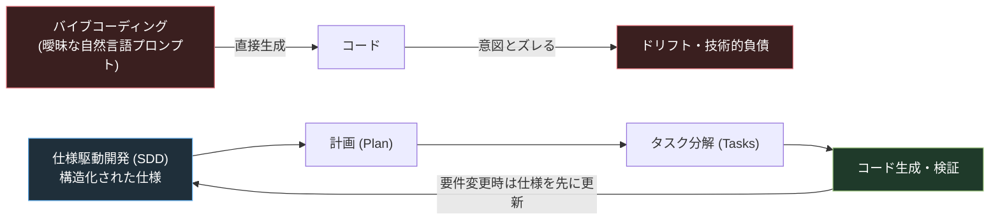
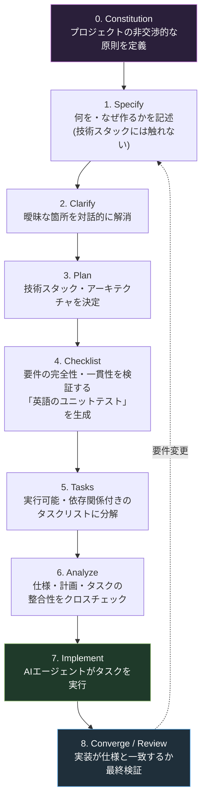
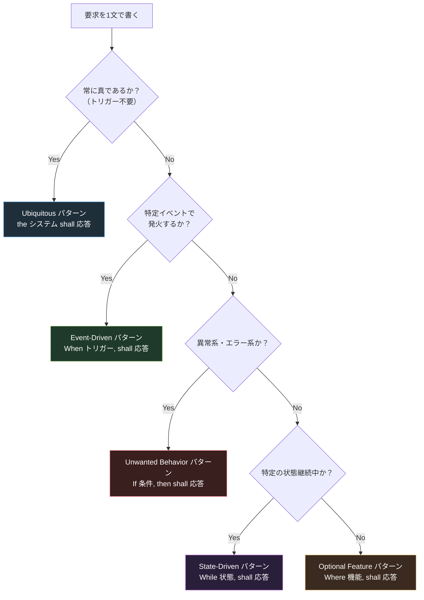
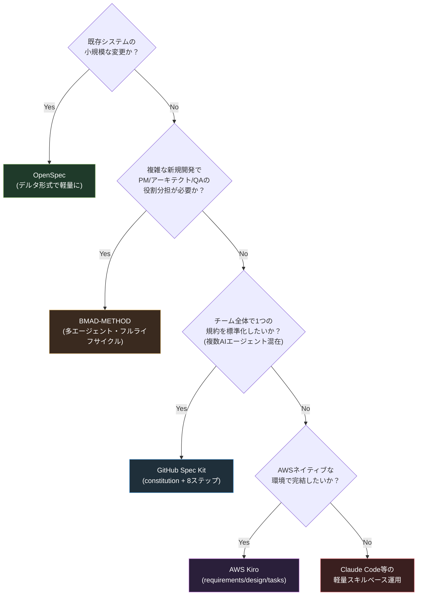
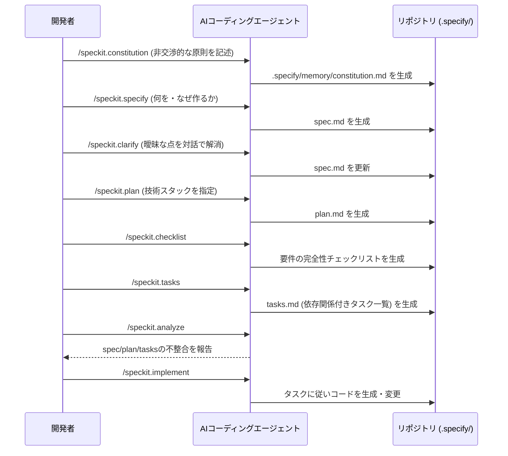
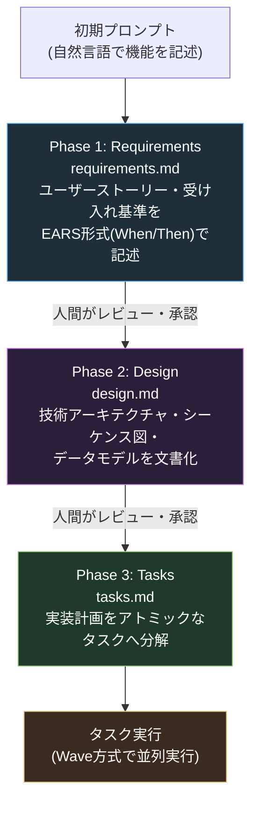
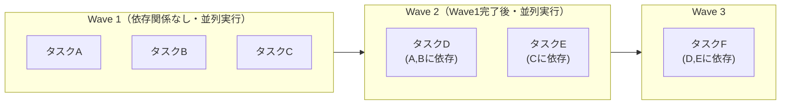
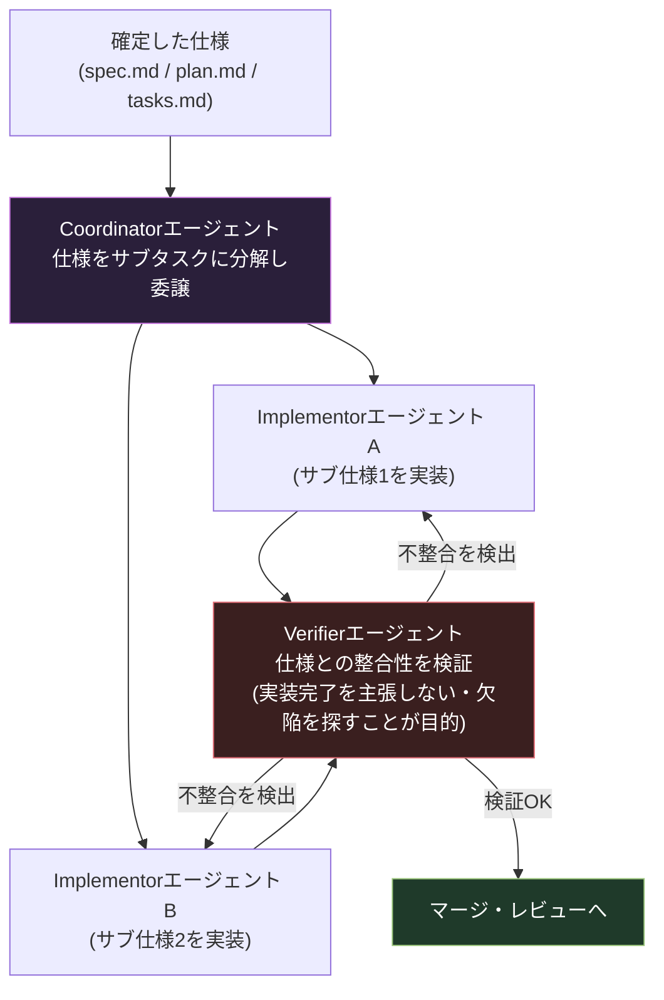
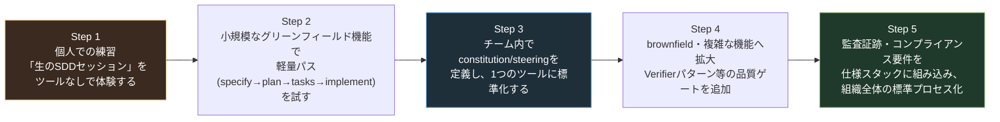

# 仕様駆動開発（Spec-Driven Development, SDD）実践ガイド
### 中級〜上級エンジニア向け ベストプラクティス徹底解説（2026年版）

> 本ガイドは2026年7月時点で公開されている一次情報（公式ドキュメント、GitHub リポジトリ、AWS/Microsoft公式ブログ、arXiv論文、Thoughtworks Technology Radar等）に基づいて作成しています。各章末に参照URLを明記していますので、実装前に必ず一次情報も確認してください。

---

## 目次

1. [SDDとは何か ― なぜ2026年に主流になったのか](#1-sddとは何か--なぜ2026年に主流になったのか)
2. [基本原則：仕様を「真実の源（Source of Truth）」にする](#2-基本原則仕様を真実の源source-of-truthにする)
3. [成熟度モデル：Spec-First / Spec-Anchored / Spec-as-Source](#3-成熟度モデルspec-first--spec-anchored--spec-as-source)
4. [TDD・BDD・ウォーターフォールとの違い](#4-tddbddウォーターフォールとの違い)
5. [標準ワークフロー全体像](#5-標準ワークフロー全体像)
6. [要求定義のベストプラクティス：EARS記法](#6-要求定義のベストプラクティスears記法)
7. [主要ツールの選定基準と比較](#7-主要ツールの選定基準と比較)
8. [実践編①：GitHub Spec Kit ワークフロー](#8-実践編githubspec-kit-ワークフロー)
9. [実践編②：AWS Kiro ワークフロー](#9-実践編aws-kiro-ワークフロー)
10. [マルチエージェント検証パターン（Verifier Pattern）](#10-マルチエージェント検証パターンverifier-pattern)
11. [ベストプラクティス集（12項目）](#11-ベストプラクティス集12項目)
12. [アンチパターンと落とし穴](#12-アンチパターンと落とし穴)
13. [セキュリティ・コンプライアンスの実証データ](#13-セキュリティコンプライアンスの実証データ)
14. [組織導入ロードマップ](#14-組織導入ロードマップ)
15. [まとめチェックリスト](#15-まとめチェックリスト)
16. [参考文献・出典一覧](#16-参考文献出典一覧)

---

## 1. SDDとは何か ― なぜ2026年に主流になったのか

仕様駆動開発（Spec-Driven Development, SDD）とは、**コードではなく、実行可能でバージョン管理された「仕様（Spec）」を単一の真実の源（Single Source of Truth）とする開発手法**です。開発チーム、あるいはAIコーディングエージェントは、まず「何を作るか」を詳細な仕様として書き下し、そこから実装計画を導出し、計画をアトミックなタスクに分解し、その後で初めてコードを生成します。要件が変わった場合は、コードではなく仕様を先に編集し、関連するコードを再生成するというサイクルを回します。

### 1.1 なぜ今、SDDが必要とされているのか

2025年前半に Andrej Karpathy が広めた「バイブコーディング（Vibe Coding）」という言葉は、AIエージェントに自然言語で緩くプロンプトを与え、出てきたコードをそのまま受け入れるワークフローを指します。プロトタイプや使い捨てスクリプトには有効ですが、本番運用が前提のソフトウェアでは、次のような失敗モードが顕在化することが指摘されています。

- **意図のドリフト（Intent Drift）**：会話を重ねるうちに、AIエージェントの出力が当初の意図から徐々にずれていく
- **アーキテクチャの不整合**：一貫した設計判断がされないまま機能が積み重なる
- **技術的負債の蓄積**：要件未達のコードを都度手直しすることで負債が増える
- **API・仕様のハルシネーション**：存在しないAPIやパラメータをAIが生成する

SDDはこの「バイブコーディング」への直接的な対抗策として2025年に登場し、2026年には GitHub Spec Kit、AWS Kiro、Claude Code、Cursor、OpenSpec、BMAD-METHOD、Tessl、Google Antigravity といった主要なAIコーディングツールがそれぞれ独自のSDD実装を提供するに至っています。DeepLearning.AI が2025年後半に「Spec-Driven Development with Coding Agents」という専門コースを開講したことも、この手法が実験段階から主流へ移行した一つのシグナルとされています。

### 1.2 一言でいうと

> 「仕様がプロンプトである（The spec is the prompt）」という表現が、2025〜2026年のGitHubやAWSのブログ記事で繰り返し使われています。曖昧な会話ではなく、構造化された仕様書がAIエージェントへの入力となることで、再現性と検証可能性を確保するという考え方です。



### 出典（第1章）

- [Spec-Driven Development (SDD): The Definitive 2026 Guide - BCMS](https://thebcms.com/blog/spec-driven-development)
- [Spec-Driven Development (SDD) — best practices (so far) - Allegro Tech](https://blog.allegro.tech/2026/06/spec-driven-development-best-practices.html)
- [Spec-Driven Development in 2026: What It Is, the Tooling - DEV Community](https://dev.to/krlz/spec-driven-development-in-2026-what-it-is-the-tooling-and-how-teams-actually-use-it-2fk2)
- [Thoughtworks Technology Radar Highlights The Rapid Evolution of AI Assistance in 2025 (PR Newswire)](https://www.prnewswire.com/news-releases/thoughtworks-technology-radar-highlights-the-rapid-evolution-of-ai-assistance-in-2025-302600950.html)

---

## 2. 基本原則：仕様を「真実の源（Source of Truth）」にする

SDDにおける「仕様（Spec）」は、従来のPRDや設計ドキュメントとは本質的に異なります。両者の違いを理解することが、SDD導入の第一歩です。

| 観点 | 従来のPRD・設計ドキュメント | SDDにおける仕様（Spec） |
|---|---|---|
| 読み手 | 人間（曖昧さを文脈から補完できる） | 人間 **と** AIエージェント（曖昧さを補完できない） |
| 更新タイミング | 実装後に更新されないことが多い | 実装前・変更のたびに更新される「生きた」文書 |
| 検証方法 | レビューによる目視確認 | BDDシナリオ、APIコントラクトテスト、モデルシミュレーションとして実行可能 |
| 位置づけ | 参考資料 | 実行のための契約（Contract） |

Augment Code社のガイドおよびarXiv論文（Piskala, 2026）が指摘するように、SDD仕様は「実行される検証ゲート」として機能する点が最大の違いです。PRDは人間が解釈して穴を埋めますが、SDD仕様はAIエージェントに対して明示的な目標・制約・受け入れ基準を与える必要があります。

### 2.1 SDDが解決する具体的な問題

- **セキュリティ**：LLMが生成するコードの脆弱性混入率はベンチマークによって9.8%〜42.1%と報告されており（詳細は第13章）、実行可能な仕様がこれに対する検証ゲートとして機能します。
- **コンプライアンス**：仕様が監査証跡（audit trail）として機能し、規制業界での証跡要件を満たします。
- **チーム間の整合性**：PM、エンジニア、AIエージェント、レビュアーの間で「仕様」という共通言語を持つことで、役割間の解釈のズレを減らします。

### 出典（第2章）

- [What Is Spec-Driven Development? A Complete Guide - Augment Code](https://www.augmentcode.com/guides/what-is-spec-driven-development)
- [Spec-Driven Development: From Code to Contract in the Age of AI Coding Assistants (arXiv:2602.00180) - Piskala, 2026](https://arxiv.org/abs/2602.00180)
- [Spec-Driven Development: A Spec-First Approach to AI-Native Engineering - Microsoft for Developers](https://developer.microsoft.com/blog/spec-driven-development-ai-native-engineering)

---

## 3. 成熟度モデル：Spec-First / Spec-Anchored / Spec-as-Source

Thoughtworksのテクノロジーコンサルタント Birgitta Böckeler が提唱し、Piskalaのfarއ論文（arXiv, 2026）でも採用されている3段階の成熟度モデルが、実務上もっとも参照される分類です。

```mermaid
flowchart LR
    subgraph L1["Level 1: Spec-First"]
        direction TB
        A1["仕様を先に書く"] --> A2["実装後は<br/>仕様を放置しがち"]
    end
    subgraph L2["Level 2: Spec-Anchored"]
        direction TB
        B1["仕様を先に書く"] --> B2["タスク完了後も<br/>仕様を保持・更新"]
        B2 --> B3["機能の進化・保守に<br/>継続利用"]
    end
    subgraph L3["Level 3: Spec-as-Source"]
        direction TB
        C1["仕様がメインの<br/>ソースファイル"] --> C2["人間は仕様のみ編集"]
        C2 --> C3["コードは常に<br/>再生成される"]
    end
    L1 -->|成熟度が上がる| L2 -->|成熟度が上がる| L3

    style L1 fill:#2a1f1f,stroke:#e5c07b
    style L2 fill:#1f2a1f,stroke:#98c379
    style L3 fill:#1f1f2a,stroke:#61afef
```



| レベル | 定義 | 向いているケース | リスク |
|---|---|---|---|
| **Spec-First** | 仕様をよく考えて先に書き、その後のAI支援開発フローで使う | 小規模機能、探索的な開発 | 実装が進むにつれ仕様が「置き去り」になりやすい |
| **Spec-Anchored** | タスク完了後も仕様を保持し、機能の進化・保守のために使い続ける | 本番運用が前提の機能、チーム開発、監査要件がある場合 | 仕様更新を怠るとドリフトが発生 |
| **Spec-as-Source** | 仕様がメインのソースファイルであり、人間は仕様のみを編集し、コードには触れない | 高度に定型化された領域（API定義、契約駆動開発など） | 現時点ではツール・エージェントの成熟度に依存し、リスクが大きい |

2026年のフィールドガイド（DEV Community）では、実務上の落とし所として「Spec-as-Sourceではなく、Spec-Anchoredを目標にすべき」という提言がなされています。これは、コードを最終的な真実の源として保持しつつ、テストを強制力として使い、仕様は最も重要な人間の成果物として扱うという現実的なアプローチです。

Claude Codeでの実践例を報告したHeeki Park氏も、実際にはプロジェクトが進むにつれてSpec-Firstのつもりが「Spec-Once（一度きりの仕様）」に陥りやすいと率直に振り返っています。

### 出典（第3章）

- [Using spec-driven development with Claude Code - Heeki Park (Medium)](https://heeki.medium.com/using-spec-driven-development-with-claude-code-4a1ebe5d9f29)
- [What Is Spec-Driven Development? A Complete Guide - Augment Code](https://www.augmentcode.com/guides/what-is-spec-driven-development)
- [Spec-Driven Development in 2026: What It Is, the Tooling - DEV Community](https://dev.to/krlz/spec-driven-development-in-2026-what-it-is-the-tooling-and-how-teams-actually-use-it-2fk2)
- [Spec-Driven Development: From Code to Contract (arXiv:2602.00180)](https://arxiv.org/abs/2602.00180)

---

## 4. TDD・BDD・ウォーターフォールとの違い

| 手法 | 主たる成果物 | サイクル | 対象範囲 | AIエージェントとの親和性 |
|---|---|---|---|---|
| **ウォーターフォール** | 仕様書（フェーズ開始時に固定） | 一方向・変更を前提としない | プロジェクト全体 | 低い（変更に対して硬直的） |
| **TDD（テスト駆動開発）** | 失敗するユニットテスト | テスト→実装→リファクタの短いループ | 関数・クラス単位 | 中（人間開発者の思考ループ） |
| **BDD（振る舞い駆動開発）** | Gherkin形式のシナリオ | シナリオ→実装→検証 | ユーザーの振る舞い単位 | 中〜高（自然言語に近い） |
| **SDD（仕様駆動開発）** | 実行可能でバージョン管理された仕様一式 | Spec→Plan→Tasks→Implement→（仕様へ差し戻し） | アーキテクチャ・非機能要件を含むシステム全体 | 高い（AIエージェント実行を前提に設計） |

BCMSのガイドやPiskalaの論文で共通して強調されているポイントは、**SDDはTDDより対象範囲が広い**という点です。TDDは開発者だけの厳格なループであるのに対し、SDDはアーキテクチャ・非機能要件・制約を含み、AIエージェントによる実行を前提としています。多くのSDDワークフローは、最終的にTDDスタイルのテストを成果物の一つとして生成します。

またウォーターフォールとの違いとして、ウォーターフォールは仕様を数ヶ月単位のフェーズの冒頭で固定し、変更を歓迎しないのに対し、SDDでは仕様は「生きた」文書として継続的に更新される点が決定的に異なります。

Augment Code社は、単体テストは個々の関数を検証できても、複数サービスにまたがるアーキテクチャ違反・APIコントラクトのドリフト・セキュリティのアンチパターンは捕捉できないと指摘し、SDDの仕様はシステムレベルで動作するためこれらの欠陥クラスを構造的に検出できるとしています。

### 出典（第4章）

- [Spec-Driven Development (SDD): The Definitive 2026 Guide - BCMS](https://thebcms.com/blog/spec-driven-development)
- [What Is Spec-Driven Development? A Complete Guide - Augment Code](https://www.augmentcode.com/guides/what-is-spec-driven-development)
- [Spec-Driven Development: From Code to Contract (arXiv:2602.00180)](https://arxiv.org/abs/2602.00180)

---

## 5. 標準ワークフロー全体像

ツールによって命名は異なりますが、2026年時点で業界標準となりつつあるSDDワークフローは、おおむね次の8〜9ステップに集約されます（GitHub Spec Kitの公式Quick Startドキュメントの構成をベースに一般化）。



重要なのは、**すべてのステップが必須ではない**という点です。GitHub Spec Kitの公式ドキュメントでも、簡単な検証であれば `specify → plan → tasks → implement` の4ステップの「軽量パス」で十分とされ、本番機能や曖昧さが残る作業に対してのみ `clarify` `checklist` `analyze` を品質ゲートとして追加することが推奨されています。

### 5.1 各ステップの目的（要点整理）

| ステップ | 目的 | 実施しないとどうなるか |
|---|---|---|
| Constitution | チーム/プロジェクト共通の非交渉的な原則（言語、アーキテクチャ、品質基準）を固定 | 機能ごとに矛盾した技術判断がなされる |
| Specify | 「何を」「なぜ」作るかを明確化（技術スタックは後回し） | 実装の前提がAIエージェント任せになり手戻りが発生 |
| Clarify | 要件の穴（権限、エラー処理、永続化要否など）を対話で埋める | Plan/Tasks段階で誤った前提のまま進む |
| Plan | 技術スタック・アーキテクチャ・依存関係を決定 | 実装がその場しのぎのアーキテクチャ判断に流れる |
| Checklist | 要件の完全性・明確性・一貫性を検証するチェックリストを生成 | 要件の欠落に気づかないまま実装に入る |
| Tasks | 実行可能で依存関係が明示された単位に分解 | 巨大なタスクをAIエージェントに丸投げしレビュー不能になる |
| Analyze | 仕様・計画・タスクの整合性をクロス検証 | 実装後に不整合が発覚し手戻りコストが増大 |
| Implement | 確定した文書に基づきAIエージェントが実装 | — |
| Converge/Review | 実装が仕様どおりであることを最終確認 | ドリフトが未検出のままマージされる |

### 出典（第5章）

- [Quick Start Guide - Spec Kit Documentation](https://github.github.com/spec-kit/quickstart.html)
- [GitHub - github/spec-kit](https://github.com/github/spec-kit)
- [Meet GitHub Spec-Kit - MarkTechPost](https://www.marktechpost.com/2026/05/08/meet-github-spec-kit-an-open-source-toolkit-for-spec-driven-development-with-ai-coding-agents/)
- [Spec-Driven Development: A Spec-First Approach to AI-Native Engineering - Microsoft for Developers](https://developer.microsoft.com/blog/spec-driven-development-ai-native-engineering)

---

## 6. 要求定義のベストプラクティス：EARS記法

SDDにおける「仕様」の質は、要求（Requirements）の書き方に大きく依存します。ここで業界標準になりつつあるのが **EARS（Easy Approach to Requirements Syntax）** 記法です。AWS Kiroもこの記法を`requirements.md`の標準フォーマットとして採用しています。

### 6.1 EARSの背景

EARSは2009年にRolls-Royce社のAlistair Mavin氏らのチームが、航空機エンジン制御システムの耐空性規制を分析する過程で開発し、同年のIEEE Requirements Engineering会議（RE'09）で発表されました。自然言語で書かれる要求は本質的に曖昧になりがちであるという問題意識から、少数のキーワードとシンプルなルールセットで自然言語要求を緩やかに制約する手法として設計されました。Airbus、Bosch、Dyson、Honeywell、Intel、NASA、Rolls-Royce、Siemensなど多くの企業で採用されている実績があります。

### 6.2 EARSの基本構文

```
While <任意の事前条件>, When <任意のトリガー>, the <システム名> shall <システムの応答>
```

ルールとして、事前条件は0個以上、トリガーは0個または1個、システム名は1つ、システム応答は1つ以上を持つことができます。

### 6.3 EARSの5つのパターン

| パターン名 | キーワード | 用途 | 例 |
|---|---|---|---|
| **Ubiquitous（普遍要求）** | なし | 常に真である基本的な性質を記述 | 「本システムはすべてのユーザー入力を検証しなければならない (shall)」 |
| **Event-Driven（イベント駆動）** | When | 特定のイベント発生時のみ有効 | 「決済が完了した時 (When)、本システムは通知を送信しなければならない」 |
| **Unwanted Behavior（望まない振る舞い）** | If / Then | エラー・故障・異常系を扱う | 「パスワードが誤って入力された場合 (If)、本システムはエラーメッセージを表示しなければならない」 |
| **State-Driven（状態駆動）** | While | 特定の状態が継続している間有効 | 「決済処理中である間 (While)、本システムはキャンセルボタンを無効化しなければならない」 |
| **Optional Feature（オプション機能）** | Where | 特定のオプション機能が存在する場合のみ有効 | 「多要素認証機能が有効な場合 (Where)、本システムは確認コードを要求しなければならない」 |

複数のキーワードを組み合わせた「複合要求（Complex requirements）」も定義されています。例えば「While the aircraft is on ground, when reverse thrust is commanded, the engine control system shall enable reverse thrust.（航空機が地上にある間、逆推力が指令された時、エンジン制御システムは逆推力を有効化しなければならない）」のように、事前条件とトリガーを両方含む形です。



### 6.4 実務上のポイント

- EARSは「何を書くか」ではなく「どう書くか」の迷いをなくすことが目的であり、その分、要求の**意味（何を実現したいか）**に思考リソースを割けるようになります。
- AWS Kiroの`requirements.md`は、ユーザーストーリーと受け入れ基準をEARS形式（特にWhen/Then構文）で記述する運用が公式に案内されています。
- INCOSE Requirements Working Groupなどの専門家コミュニティは、EARSはあくまで「文の型（テンプレート）」であり、適格な要求（well-formed requirements）にするにはINCOSEの要求記述ガイドなど、上位のルールセットと併用すべきだと指摘しています。EARSだけで要求の質がすべて保証されるわけではない点に注意してください。

### 出典（第6章）

- [Alistair Mavin - EARS: Easy Approach to Requirements Syntax | Official Guide](https://alistairmavin.com/ears/)
- [EARS: The Easy Approach to Requirements Syntax - DEV Community](https://dev.to/sebastian_dingler/ears-the-easy-approach-to-requirements-syntax-39a5)
- [Adopting the EARS Notation to Improve Requirements Engineering - Jama Software](https://www.jamasoftware.com/requirements-management-guide/writing-requirements/adopting-the-ears-notation-to-improve-requirements-engineering/)
- [Easy Approach to Requirements Syntax (EARS) - IEEE Xplore](https://ieeexplore.ieee.org/document/5328509/)
- [(PDF) Easy approach to requirements syntax (EARS) - ResearchGate](https://www.researchgate.net/publication/224079416_Easy_approach_to_requirements_syntax_EARS)
- [Easy Approach to Requirements Syntax (EARS) with ChatGPT - LinkedIn (Rob Black)](https://www.linkedin.com/pulse/easy-approach-requirements-syntax-ears-chatgpt-rob-black)
- [Specs - IDE - Docs - Kiro](https://kiro.dev/docs/specs/)
- [👻 Kiro Agentic AI IDE - AWS re:Post](https://repost.aws/articles/AROjWKtr5RTjy6T2HbFJD_Mw/%F0%9F%91%BB-kiro-agentic-ai-ide-beyond-a-coding-assistant-full-stack-software-development-with-spec-driven-ai)

---

## 7. 主要ツールの選定基準と比較

2026年半ば時点で、SDDを実践するための代表的なツール／フレームワークは以下の通りです。それぞれ「仕様のライフサイクル（生きた資産か、静的文書か）」「オーケストレーションの範囲（ワークスペース単位か組織単位か）」という2軸で性格が大きく異なります。

| ツール | 提供元 | 仕様ライフサイクル | 得意な状況 | 特徴 |
|---|---|---|---|---|
| **GitHub Spec Kit** | GitHub/Microsoft（OSS・MITライセンス） | 静的（specify→plan→tasksの文書一式） | チーム全体で1つのAIコーディング規約を標準化したい | `specify` CLI、30以上のAIエージェント統合、constitution機構、70以上のコミュニティ拡張 |
| **AWS Kiro** | Amazon Web Services | 静的〜準生きた文書（steering filesで補完） | AWSネイティブな環境で構造化された要求管理をしたい | requirements.md/design.md/tasks.mdの三点セット、EARS採用、タスクの並列実行（Wave実行） |
| **OpenSpec** | OSS | デルタ形式（ADDED/MODIFIED/REMOVED） | 既存システムの改修（ブラウンフィールド） | 変更提案ごとに差分を明示。フルの仕様書き直しが不要で軽量 |
| **BMAD-METHOD** | OSS | フルライフサイクル・多エージェント | 複雑なグリーンフィールド開発 | Analyst/PM/Architect/Developer/QA等12以上のペルソナで擬似的なアジャイルチームを構成 |
| **Claude Code (SDDスキル/cc-sdd等)** | Anthropic系エコシステム | プロジェクトにより柔軟 | Claude Codeを中心にした開発フロー | CLAUDE.md・スキル・サブエージェントと組み合わせて運用 |
| **Cursor (.cursor/rules)** | Cursor | 軽量な規約ベース | IDE内で軽量にAI出力を制御したい | Plan Modeでプランは生成するが、承認ゲートや版管理された仕様の強制はない |

Augment Code社の比較検証（グリーンフィールドAPI、ブラウンフィールドのExpress.js機能追加、4マイクロサービスのリファクタという3シナリオでテスト）によれば、静的な仕様ツールは数時間で実装と乖離し始めるため、まず「仕様のライフサイクル」を最初に問うべきだとされています。

### 7.1 意思決定のためのフローチャート



### 7.2 併用パターン

複数の比較記事（Reenbit社、Reinvently社）は、プロジェクトのフェーズによってツールを乗り換える実例を報告しています。例えば、ブラウンフィールドの改修（OpenSpec）が軌道に乗り新規機能を積み上げる段階になると、OpenSpecのデルフォーマットだけでは薄く感じられるようになり、アーカイブ済みの仕様をBMADのArchitectエージェントへの入力として引き継ぐ、といった移行が語られています。また、スタートアップがシリーズAを迎えPMを初採用したタイミングで、Spec KitのconstitutionをBMADのマスターエージェントプロンプトへ移す、という移行パターンも紹介されています。

### 出典（第7章）

- [6 Best Spec-Driven Development Tools for AI Coding in 2026 - Augment Code](https://www.augmentcode.com/tools/best-spec-driven-development-tools)
- [GitHub - cameronsjo/spec-compare](https://github.com/cameronsjo/spec-compare)
- [9 Best AI Tools for Spec-Driven Development in 2026 - MarkTechPost](https://www.marktechpost.com/2026/05/08/9-best-ai-tools-for-spec-driven-development-in-2026-kiro-bmad-gsd-and-more-compare/)
- [BMAD vs Spec Kit vs OpenSpec: Choosing Your Spec-Driven AI Framework - Reenbit](https://reenbit.com/bmad-vs-spec-kit-vs-openspec-choosing-your-spec-driven-ai-framework/)
- [GSD, BMAD, OpenSpec, or GitHub Spec Kit - Reinvently](https://reinvently.co.uk/blog/ai-dev-workflow-frameworks-gsd-bmad-openspec-speckit/)
- [Spec-Driven Development: OpenSpec vs Spec-Kit vs BMAD - Nosam](https://www.nosam.com/spec-driven-development-openspec-vs-spec-kit-vs-bmad-which-ones-actually-worth-your-time/)
- [What Is Spec-Driven Development (SDD)? BMAD vs spec-kit vs OpenSpec vs PromptX](https://redreamality.com/blog/-sddbmad-vs-spec-kit-vs-openspec-vs-promptx/)

---

## 8. 実践編①：GitHub Spec Kit ワークフロー

GitHub Spec Kitは、GitHubがOSS（MITライセンス）として提供する`specify`という名前のCLIツールで、2026年時点でもっとも広く採用されているSDDツールの一つです（報告によりスター数の数字に幅がありますが、2026年前半時点でおよそ88,000〜110,000以上のGitHubスターを獲得しています）。Claude Code、GitHub Copilot、Gemini CLI、Cursorなど30以上のAIエージェント統合をサポートしています。

### 8.1 インストールと初期化

`uv`パッケージマネージャーを使い、`uv tool install specify-cli --from git+https://github.com/github/spec-kit.git`のようにインストールし、`specify init <project> --ai claude`（あるいは`copilot`/`gemini`/`cursor`など）でプロジェクトを初期化します。Claude CodeやCodex CLIなどではスラッシュコマンドではなく、`.claude/skills/`配下に配置されるスキルベースの統合形式が使われる点に注意してください。

### 8.2 コマンドの実行シーケンス



### 8.3 constitutionの役割

constitutionは、そのプロジェクトにおいて**AIエージェントがどんな理由があっても逸脱してはならない制約**を定義するものです。例えば「TypeScriptのみ・strictモード」「外部の状態管理ライブラリを使わない」「すべての機能に結合テストを持たせる」「WCAG 2.1 AA準拠」「明示的なオプトインなしのテレメトリ禁止」といった原則を1回定義すれば、以降のすべてのspec/plan/tasksがこの原則に照らしてチェックされます。

### 8.4 実務上の注意点

- 公式のガイダンスでは、`/speckit.specify`の段階では技術スタックにできるだけ触れず、「何を」「なぜ」作るのかを先に明確にすることが推奨されています。
- `/speckit.analyze`は実装前の最後の防衛線であり、要件が複数箇所に異なる表現で重複していないか、要件同士が矛盾していないかを検出します。
- 実務者のブログ（Den Delimarsky氏）は、30タスクのリストをいきなり無人で`/speckit.implement`させず、まず3〜5タスクから始めてレビューし、constitutionを調整してからスケールアップすることを推奨しています。
- Spec Kitは頻繁にCLIの仕様が変更されており（例えばv0.10.0で`--ai`フラグ体系が`--integration`方式に置き換えられた）、2026年6月以前のチュートリアルのコマンドが動作しない場合があるため、常に公式ドキュメントを確認する必要があります。
- Spec Kit自体が「実験的（experimental）」と位置づけられており、グリーンフィールドの新規開発や大規模な機能追加に最も適しており、小さなバグ修正には仕様のオーバーヘッドが見合わないとされています。

### 出典（第8章）

- [Quick Start Guide - Spec Kit Documentation](https://github.github.com/spec-kit/quickstart.html)
- [GitHub - github/spec-kit](https://github.com/github/spec-kit)
- [What's The Deal With GitHub Spec Kit - Den Delimarsky](https://den.dev/blog/github-spec-kit/)
- [What Is GitHub Spec Kit? - knightli.com](https://knightli.com/en/2026/05/25/github-spec-kit-spec-driven-development/)
- [Meet GitHub Spec-Kit - MarkTechPost](https://www.marktechpost.com/2026/05/08/meet-github-spec-kit-an-open-source-toolkit-for-spec-driven-development-with-ai-coding-agents/)
- [Exploring spec-driven development with the new GitHub Spec Kit - LogRocket Blog](https://blog.logrocket.com/github-spec-kit/)
- [GitHub Spec Kit: The 2026 Spec-Driven Development Guide - funDesk](https://www.fundesk.io/spec-driven-development-github-spec-kit-guide)
- [GitHub Spec Kit - Ry Walker Research](https://rywalker.com/research/github-spec-kit)
- [Creating my portfolio website using GitHub's Spec-kit - DEV Community](https://dev.to/daveu1983/creating-my-portfolio-website-using-githubs-spec-kit-5g40)

---

## 9. 実践編②：AWS Kiro ワークフロー

AWS Kiroは、Amazon Q Developerの後継として登場したエージェント型IDEで、コード生成前に`requirements.md`・`design.md`・`tasks.md`の3文書を必須とする「spec mandate（仕様の義務化）」を特徴とします。

### 9.1 3フェーズのワークフロー



各フェーズの後、人間によるレビューと承認を経てから次のフェーズへ進む「人間参加型（human-in-the-loop）」の設計になっている点がAWS Kiroの特徴です。requirements.mdは「何を」「なぜ」作るかをビジネス用語で捉え、design.mdは技術アーキテクチャ・実装アプローチ・統合ポイントを記述し、tasks.mdは詳細な実装計画を追跡可能な単位で提供します。

### 9.2 Wave方式によるタスク並列実行

Kiroの特徴的な機能として、`tasks.md`内のタスクの依存関係グラフを自動構築し、依存関係のないタスクを同じ「Wave（波）」としてグループ化し、Wave内は並列実行、Wave間は順次実行するという方式があります。



### 9.3 Steering Filesとの役割分担

`requirements.md`が「何を作るか」、`design.md`が「どう作るか」を定義するのに対し、**Steering Files**は機能を横断してすべてのビルドに適用される制約（コーディング規約、セキュリティポリシーなど）を定義します。規制業界向けには、AWS GovCloudデプロイでコンプライアンス制約が事前設定されたSteering Filesを使う運用も紹介されています。

### 9.4 実際の事例：3週間での創薬エージェント構築

AWSの公式ブログでは、ライフサイエンス業界向けにKiroのspec駆動アプローチを用いた事例が報告されています。3名のソリューションアーキテクトが、他の会議やワークショップと並行しながら3週間で本番稼働するシステムを構築し、Kiroがビジネスロジックコードの95%以上を生成、開発時間にして80時間以上を節約したと報告されています。Agent Hooksによりコード変更時に自動でREADME.mdドキュメントを更新する仕組みも活用されました。同ブログの提言として「仕様に前もって投資することはすぐに元が取れる（Invest in Specifications Upfront—It Pays Off Fast）」という原則が挙げられています。

### 9.5 実務上の注意点

- 実践者の報告では、Kiroが生成するdesign.mdにはエラーハンドリングとテスト戦略が含まれるため、実装ステップでの検証・許可のやり取りが増え、想定より時間がかかることがあると指摘されています。素早く動くものを見たい場合は、テストとエラーハンドリングの量を減らし、後から追加する運用も選択肢です。
- Kiro技術レビューの中には、要求された仕様の詳細度を「過剰仕様（over-specification）」と評する声もありますが、実践者側の反論としては「AIエージェントが信頼できる出力をするためにはこの詳細度がちょうど良い」という立場もあり、仕様作成フェーズ自体が本質的な作業であるという認識転換が必要だとされています。
- Kiroは既存コードベース（ブラウンフィールド）向けに、新規開発前に`structure.md`（コードベースのアーキテクチャ）・`tech.md`（技術スタックとパターン）・`product.md`（ビジネス文脈）の3文書を自動生成し、ベースラインの理解を確立する機能も持っています。

### 出典（第9章）

- [From spec to production: a three-week drug discovery agent using Kiro - AWS for Industries](https://aws.amazon.com/blogs/industries/from-spec-to-production-a-three-week-drug-discovery-agent-using-kiro/)
- [Specs - IDE - Docs - Kiro](https://kiro.dev/docs/specs/)
- [Getting Started with Spec-driven Development Using Kiro - AWS Builder Center](https://builder.aws.com/content/36nn9PbSZuKJiWWoO2UWmFaaCHs/getting-started-with-spec-driven-development-using-kiro)
- [AWS Kiro — Amazon's Spec-First Bet on Agentic Development - SoftwareSeni](https://www.softwareseni.com/aws-kiro-amazons-spec-first-bet-on-agentic-development/)
- [Experience with Kiro's spec driven development methodology - AWS Builder Center](https://builder.aws.com/content/3ARqetAlGRTpUYC0R7X24Avy2Wf/experience-with-kiros-spec-driven-development-methodology)
- [👻 Kiro Agentic AI IDE: Beyond a Coding Assistant - AWS re:Post](https://repost.aws/articles/AROjWKtr5RTjy6T2HbFJD_Mw/%F0%9F%91%BB-kiro-agentic-ai-ide-beyond-a-coding-assistant-full-stack-software-development-with-spec-driven-ai)
- [What Is Spec-Driven Development and How to Implement It with Kiro - Carlos Biagolini (AWS in Plain English)](https://aws.plainenglish.io/what-is-spec-driven-development-and-how-to-implement-it-with-kiro-b5846bd55869)
- [Kiro Documentation - AWS](https://aws.amazon.com/documentation-overview/kiro/)

---

## 10. マルチエージェント検証パターン（Verifier Pattern）

Augment Code社のガイドで「もっとも活用されていないパターン」として紹介されているのが、**実装を行うエージェント自身に自己検証させるのではなく、別のエージェントに検証させる**というパターンです。



このパターンの本質は、**ImplementorとVerifierが対立する目標を持つ**ことです。Implementorはタスクの完了を最適化しようとするため、自分の出力に対して楽観的になりがちです。一方Verifierは欠陥を見つけることを目的とするエージェントとして設計することで、健全な緊張関係が生まれます。

Thoughtworks Technology Radarも、この考え方を「フィードバックセンサー（feedback sensors for coding agents）」という概念で捉えています。これは、コンパイラ・リンター・型チェッカー・テストスイートといった決定論的な品質ゲートをエージェントのワークフローに直接組み込み、失敗があれば人間のレビュー前に自動修正のループへ入るというアプローチです。

またarXivの「Bootstrapping Coding Agents: The Specification Is the Program」という論文では、産業スケールの実例として、3〜7名のエンジニアチームが5ヶ月かけて100万行規模のコードベースを、Codexを使い一切人手でコードを書かずに構築した事例が紹介されています。このチームは構造化された`docs/`ディレクトリを参照システムとして扱い、コードそのものではなく仕様を安定した成果物として位置づけています。

### 出典（第10章）

- [What Is Spec-Driven Development? A Complete Guide - Augment Code](https://www.augmentcode.com/guides/what-is-spec-driven-development)
- [Technology Radar | Thoughtworks](https://www.thoughtworks.com/radar)
- [Bootstrapping Coding Agents: The Specification Is the Program (arXiv)](https://arxiv.org/html/2603.17399v1)

---

## 11. ベストプラクティス集（12項目）

1. **仕様の粒度は「annoyance test」で判断する**：AIエージェントに意図と違う解釈をされたら困る場合は仕様を書く。ワンショットの追加プロンプトで直せる程度なら仕様のオーバーヘッドは正当化されない、という実務上の判断基準がAugment Code社のガイドで紹介されています。
2. **Constitution（原則）を最初に一度だけ固める**：機能ごとの原則ではなく、プロジェクト全体・チーム全体の非交渉的な原則として1回定義し、以降のすべての仕様・計画・タスクをこれに照らしてチェックします。
3. **Clarifyフェーズを飛ばさない**：曖昧さが残る本番機能では、必ず対話的な明確化フェーズを設け、権限・エラー処理・永続化要否などの穴を実装前に埋めます。
4. **技術スタックの決定は「何を」の後にする**：仕様定義の初期段階では技術スタックに触れず、まず「何を」「なぜ」作るかを明確にしてから、計画フェーズで技術的な意思決定を行います。
5. **成熟度はSpec-Anchoredを目標にする**：Spec-as-Sourceは魅力的に見えますが、2026年時点ではツール・エージェントの成熟度がまだ追いついていないという指摘が複数あり、コードを真実の源として保持しつつ仕様を最重要の成果物として扱うSpec-Anchoredが現実的な落とし所です。
6. **タスクは小さく・段階的に実装する**：巨大なタスクリストをいきなり無人実行させず、3〜5タスク程度から始めてレビューし、constitutionや仕様を調整してからスケールさせます。
7. **別エージェントによる検証を組み込む**：実装エージェントの自己申告に頼らず、Coordinator/Implementor/Verifierのように役割を分離し、対立する目標を持つエージェントに相互チェックさせます。
8. **仕様は「生きた文書」として運用する**：バグ修正や仕様変更が発生した際は、コードより先に仕様を更新する習慣を徹底します。実務者の報告では、エージェントが変更と同じ手間で仕様を更新できるため、これは追加の負担にはならないとされています。
9. **仕様のドリフトは「バグ」として同じ運用で扱う**：エージェントが仕様と異なるコードを生成した場合、それは新しい問題ではなく、従来のバグ管理と同じ扱いで直す。レビュー・テストで検出し、ガードレールがなぜ機能しなかったかを分析して再発防止に努めます。
10. **ブラウンフィールドとグリーンフィールドでツールを使い分ける**：既存システムの小規模な改修にはOpenSpecのような軽量なデルタ形式を、複雑な新規開発にはBMAD-METHODのような多エージェント・フルライフサイクル型を使うなど、状況に応じてツールを選定・併用します。
11. **監査証跡・ガバナンスが必要な場合は仕様をバージョン管理する**：規制業界やコンプライアンス要件がある場合、仕様スタックをコードと一緒にバージョン管理へ含めることで、後から「なぜこの変更をしたか」を人間が読める形で追跡できるようにします。
12. **API呼び出し量の増加を織り込む**：SDDワークフローでは、エージェントが毎ターン仕様・計画・タスクを再読み込みするため、バイブコーディングと比較して概ね20〜40%程度APIコストが増加するという実務上の目安が報告されています。予算計画に織り込んでおきましょう。

### 出典（第11章）

- [What Is Spec-Driven Development? A Complete Guide - Augment Code](https://www.augmentcode.com/guides/what-is-spec-driven-development)
- [Spec-Driven Development, What I Wish I Knew Before I Started - Josphine Job (Medium)](https://medium.com/@tojosphine/spec-driven-development-what-i-wish-i-knew-before-i-started-1213d485a244)
- [Spec-Driven Development (SDD) — best practices (so far) - Allegro Tech](https://blog.allegro.tech/2026/06/spec-driven-development-best-practices.html)
- [What's The Deal With GitHub Spec Kit - Den Delimarsky](https://den.dev/blog/github-spec-kit/)
- [GitHub Spec Kit: The 2026 Spec-Driven Development Guide - funDesk](https://www.fundesk.io/spec-driven-development-github-spec-kit-guide)
- [From spec to production: a three-week drug discovery agent using Kiro - AWS for Industries](https://aws.amazon.com/blogs/industries/from-spec-to-production-a-three-week-drug-discovery-agent-using-kiro/)

---

## 12. アンチパターンと落とし穴

Thoughtworks Technology Radar（Volume 33, 2025年11月発行）は、SDDを「Assess（試してみる価値はあるが、まだ本格採用の段階ではない）」リングに位置づけ、次のようなアンチパターンへの警戒を促しています。

| アンチパターン | 内容 | 対策 |
|---|---|---|
| **過剰仕様（Over-specification）** | 「良いAI生成体験を得るため」という理由で、開発着手前にアプリケーションのあらゆる側面を定義しようとし、管理不能なほど大量のファイルが生まれる | 仕様の粒度は必要最小限に留め、annoyance test（第11章1項）で都度判断する |
| **ビッグバンリリースへの偏り** | 重厚な事前仕様化と、一括での大規模リリースに偏りがちになる | 小さなタスク単位での段階的実装・レビューを徹底する（第11章6項） |
| **AI生成コードへの慢心（complacency）** | 仕様に基づいて生成されたコードだからと過信し、人間のレビューを省略してしまう | Verifierパターン（第10章）やAnalyzeステップでの機械的検証と、人間レビューを併用する |
| **セマンティック拡散（Semantic diffusion）** | 「spec-driven development」「harness engineering」といった新語が定義の定まらないまま広まり、成熟したエンジニアリング手法なのか、単なる日常的なAIツール利用の言い換えなのかの境界が曖昧になる | 自チーム内で用語の定義（例えば本ガイドの成熟度モデル）を明文化し、共通認識を持つ |
| **ツールのAPI・CLI変更への追従漏れ** | Spec Kitのようなツールは頻繁にCLI仕様が変更されており、古いチュートリアルのコマンドが動作しなくなることがある | 常に公式ドキュメントを一次情報として参照し、バージョン変更履歴を確認する |
| **ブラウンフィールドでの過負荷** | 複雑な既存システムに重厚な仕様駆動ツール（Kiro/BMAD）を適用すると、「くるみを割るのに大槌を使う」ような過剰投資になりがちである | 小規模な改修にはOpenSpecのようなデルタ形式の軽量ツールを選ぶ |

Thoughtworksのポッドキャストでも、SDDが「テスト駆動開発と同じように良さそうに見える」一方で、実際には「アプリケーションのすべてを事前に定義すればAIが完璧に生成してくれる」という誤解のもとに運用されると、かえって解決しようとした複雑さより深い層の複雑さ（ヤクの毛刈りの比喩）に踏み込んでしまう、という懸念が語られています。

### 出典（第12章）

- [Spec-driven development | Technology Radar | Thoughtworks](https://www.thoughtworks.com/en-us/radar/techniques/spec-driven-development)
- [Technology Radar | Thoughtworks](https://www.thoughtworks.com/radar)
- [Themes from Technology Radar Vol.33 - Thoughtworks (Podcast)](https://www.thoughtworks.com/insights/podcasts/technology-podcasts/themes-technology-radar-33)
- [GitHub Spec Kit - Ry Walker Research](https://rywalker.com/research/github-spec-kit)
- [What Is Spec-Driven Development? A Complete Guide - Augment Code](https://www.augmentcode.com/guides/what-is-spec-driven-development)

---

## 13. セキュリティ・コンプライアンスの実証データ

SDDが単なる開発生産性の手法ではなく、セキュリティ上のリスク低減策としても位置づけられている背景には、以下の実証データがあります。

| 指標 | 数値 | 出典 |
|---|---|---|
| LLMが生成するコードの脆弱性混入率 | ベンチマークにより **9.8%〜42.1%** の幅 | Yan et al., 2025（Augment Code社ガイド経由） |
| AIコード生成ツール3種類にまたがるCWE（共通脆弱性タイプ）のカタログ化数 | **43種類のCWE** | Fu et al., ACM TOSEM, 2025（同上） |
| 本番リポジトリに残存するAI起因の欠陥数（2026年2月時点の大規模実証研究） | **11万件以上** | arXiv, 2026（同上） |

これらのデータを踏まえ、Augment Code社のガイドでは「SDDの仕様は、まさにこうした失敗に対する実行可能な検証ゲートとして機能する」と位置づけています。同ガイドはさらに、いわゆる「Constitutional SDD」という発展系のアプローチにも言及しており、ガバナンス層・憲法的制約・監督チェックポイントを仕様駆動開発に追加するパターンとして、規制業界の監査要件、複数チームにまたがるサービス連携、AIが生成したコードに人間の承認を必須とする場面などで採用が進んでいるとされています（具体的なCWE脆弱性マッピングを伴う形式化については、2026年2月付のarXiv論文で提案されていると同ガイドは紹介しています）。

### 13.1 コンプライアンスの観点

- 仕様がバージョン管理された監査証跡として機能するため、規制要件がコンプライアンスの「証拠」として仕様を扱うようになりつつあります。
- Kiroの事例のように、規制業界向けにはSteering Filesへコンプライアンス制約を事前設定する運用が有効です（第9章参照）。
- ただし、脆弱性混入率や欠陥残存数の数値はベンチマークや対象リポジトリによって幅があるため、自組織のコードベースにそのまま当てはめず、自組織での計測（第14章参照）を行うことが推奨されます。

### 出典（第13章）

- [What Is Spec-Driven Development? A Complete Guide - Augment Code](https://www.augmentcode.com/guides/what-is-spec-driven-development)

---

## 14. 組織導入ロードマップ

SDDを組織へ導入する際は、いきなり全社標準化を狙うのではなく、段階的なロードマップを描くことが推奨されます。



Allegro Tech社のブログでは、外部ツールなしでもLLMとの対話だけで「今からSDD手法で機能Xを実装したい。ブラウンフィールド／グリーンフィールドかを踏まえ、どんなフェーズでどんな文書を作るべきか」と明示的に伝えるだけで練習セッションが始められるとしており、まずは道具に頼らずSDDの型を体で覚えることを勧めています。同社は社内実装として`PRODUCT-SPEC.md`（技術非依存のビジネス要求）と`TECHNICAL-SPEC.md`（技術・非機能要求）を分離する独自運用も紹介しています。

導入判断の参考として、2026年1月のJetBrains AI Pulse Survey（11,000人の開発者対象）では、90%が業務でAIを使用している一方、SDLC全体でAIを活用しているのはわずか13%にとどまるという調査結果が示されています。またStack Overflowの2025年調査では、84%の開発者がAIツールを利用中または利用予定である一方、その正確性を信頼しているのは33%にとどまり、ポジティブな感情は2023〜2024年の70%超から2025年には60%まで低下したと報告されています。これらのデータは、**導入のボトルネックはツールの有無ではなく、AIエージェントの出力に対する「信頼」である**ことを示唆しており、SDDはこの信頼のギャップを埋めるための検証可能な仕組みとして位置づけられます。

### 出典（第14章）

- [Spec-Driven Development (SDD) — best practices (so far) - Allegro Tech](https://blog.allegro.tech/2026/06/spec-driven-development-best-practices.html)
- [6 Best Spec-Driven Development Tools for AI Coding in 2026 - Augment Code](https://www.augmentcode.com/tools/best-spec-driven-development-tools)
- [From spec to production: a three-week drug discovery agent using Kiro - AWS for Industries](https://aws.amazon.com/blogs/industries/from-spec-to-production-a-three-week-drug-discovery-agent-using-kiro/)

---

## 15. まとめチェックリスト

導入・実践の際に確認すべきチェックリストとして整理します。

- [ ] プロジェクト／チーム共通の **constitution（原則）** を1つ定義したか
- [ ] 仕様定義の初期段階で、技術スタックに触れず「何を」「なぜ」を明確化したか
- [ ] 曖昧な要件は **clarify** フェーズで対話的に解消したか
- [ ] 要求は **EARS記法**（Ubiquitous / Event-Driven / Unwanted Behavior / State-Driven / Optional Feature）で書かれているか
- [ ] 成熟度モデルとして **Spec-Anchored** を目標に据えているか（Spec-as-Sourceに性急に飛びついていないか）
- [ ] タスクは小さく分解され、段階的に実装・レビューされているか
- [ ] 実装エージェントとは別に **検証（Verifier）** の仕組みがあるか
- [ ] 仕様は実装より先に更新される「生きた文書」として運用されているか
- [ ] ブラウンフィールド／グリーンフィールドに応じてツール（OpenSpec/BMAD/Spec Kit/Kiro等）を使い分けているか
- [ ] 監査証跡が必要な場合、仕様一式がバージョン管理下に置かれているか
- [ ] APIコスト増加（目安20〜40%）を予算計画に織り込んでいるか
- [ ] 過剰仕様・ビッグバンリリース・AI生成コードへの慢心といったアンチパターンを定期的にレビューしているか

---

## 16. 参考文献・出典一覧

本ガイド全体で参照した情報源を、初出順に一覧化します（2026年7月時点でアクセス可能なURLです）。

1. [Spec-Driven Development (SDD): The Definitive 2026 Guide - BCMS](https://thebcms.com/blog/spec-driven-development)
2. [Spec-Driven Development (SDD) — best practices (so far) - Allegro Tech](https://blog.allegro.tech/2026/06/spec-driven-development-best-practices.html)
3. [What Is Spec-Driven Development? A Complete Guide - Augment Code](https://www.augmentcode.com/guides/what-is-spec-driven-development)
4. [6 Best Spec-Driven Development Tools for AI Coding in 2026 - Augment Code](https://www.augmentcode.com/tools/best-spec-driven-development-tools)
5. [Spec-Driven Development, What I Wish I Knew Before I Started - Josphine Job (Medium)](https://medium.com/@tojosphine/spec-driven-development-what-i-wish-i-knew-before-i-started-1213d485a244)
6. [Spec-Driven Development: A Spec-First Approach to AI-Native Engineering - Microsoft for Developers](https://developer.microsoft.com/blog/spec-driven-development-ai-native-engineering)
7. [Using spec-driven development with Claude Code - Heeki Park (Medium)](https://heeki.medium.com/using-spec-driven-development-with-claude-code-4a1ebe5d9f29)
8. [Spec Driven Development [2026]: What It Is & How to Use It - Evangelist Software](https://evangelistsoftware.com/blog/spec-driven-development-guide/)
9. [Spec-Driven Development in 2026: What It Is, the Tooling, and How Teams Actually Use It - DEV Community](https://dev.to/krlz/spec-driven-development-in-2026-what-it-is-the-tooling-and-how-teams-actually-use-it-2fk2)
10. [Spec-Driven Development Explained: How to Build Reliable Software with AI - Setronica](https://setronica.com/media/blog/what-is-spec-driven-development-implementation-framework-best-practices/)
11. [Quick Start Guide - Spec Kit Documentation](https://github.github.com/spec-kit/quickstart.html)
12. [GitHub - github/spec-kit](https://github.com/github/spec-kit)
13. [GitHub Spec Kit: The 2026 Spec-Driven Development Guide - funDesk](https://www.fundesk.io/spec-driven-development-github-spec-kit-guide)
14. [What's The Deal With GitHub Spec Kit - Den Delimarsky](https://den.dev/blog/github-spec-kit/)
15. [What Is GitHub Spec Kit? Using Spec-Driven Development to Tame AI Coding - knightli.com](https://knightli.com/en/2026/05/25/github-spec-kit-spec-driven-development/)
16. [Meet GitHub Spec-Kit: An Open Source Toolkit for Spec-Driven Development with AI Coding Agents - MarkTechPost](https://www.marktechpost.com/2026/05/08/meet-github-spec-kit-an-open-source-toolkit-for-spec-driven-development-with-ai-coding-agents/)
17. [Exploring spec-driven development with the new GitHub Spec Kit - LogRocket Blog](https://blog.logrocket.com/github-spec-kit/)
18. [GitHub Spec Kit - Ry Walker Research](https://rywalker.com/research/github-spec-kit)
19. [Creating my portfolio website using GitHub's Spec-kit - DEV Community](https://dev.to/daveu1983/creating-my-portfolio-website-using-githubs-spec-kit-5g40)
20. [Alistair Mavin - EARS: Easy Approach to Requirements Syntax | Official Guide](https://alistairmavin.com/ears/)
21. [EARS: The Easy Approach to Requirements Syntax - Oguz Senna (Medium)](https://medium.com/paramtech/ears-the-easy-approach-to-requirements-syntax-b09597aae31d)
22. [EARS: The Easy Approach to Requirements Syntax - DEV Community](https://dev.to/sebastian_dingler/ears-the-easy-approach-to-requirements-syntax-39a5)
23. [Adopting the EARS Notation to Improve Requirements Engineering - Jama Software](https://www.jamasoftware.com/requirements-management-guide/writing-requirements/adopting-the-ears-notation-to-improve-requirements-engineering/)
24. [Easy Approach to Requirements Syntax (EARS) - IEEE Xplore](https://ieeexplore.ieee.org/document/5328509/)
25. [(PDF) Easy approach to requirements syntax (EARS) - ResearchGate](https://www.researchgate.net/publication/224079416_Easy_approach_to_requirements_syntax_EARS)
26. [EARS: The Easy Approach to Requirements Syntax Version 1.0 - Intel/IARIA Tutorial](https://www.iaria.org/conferences2013/filesICCGI13/ICCGI_2013_Tutorial_Terzakis.pdf)
27. [Easy Approach to Requirements Syntax (EARS) with ChatGPT - Rob Black (LinkedIn)](https://www.linkedin.com/pulse/easy-approach-requirements-syntax-ears-chatgpt-rob-black)
28. [Easy Approach to Requirements Syntax (EARS) - IET EngX](https://engx.theiet.org/f/discussions/27493/easy-approach-to-requirements-syntax-ears-by-alistair-mavin-requirements-specialist-at-rolls-royce-plc)
29. [From spec to production: a three-week drug discovery agent using Kiro - AWS for Industries](https://aws.amazon.com/blogs/industries/from-spec-to-production-a-three-week-drug-discovery-agent-using-kiro/)
30. [Specs - IDE - Docs - Kiro](https://kiro.dev/docs/specs/)
31. [Getting Started with Spec-driven Development Using Kiro - AWS Builder Center](https://builder.aws.com/content/36nn9PbSZuKJiWWoO2UWmFaaCHs/getting-started-with-spec-driven-development-using-kiro)
32. [AWS Kiro — Amazon's Spec-First Bet on Agentic Development - SoftwareSeni](https://www.softwareseni.com/aws-kiro-amazons-spec-first-bet-on-agentic-development/)
33. [Kiro Project Init: Automated Spec-Driven Development Setup - AWS Startups](https://aws.amazon.com/startups/prompt-library/kiro-project-init?lang=en-US)
34. [Experience with Kiro's spec driven development methodology - AWS Builder Center](https://builder.aws.com/content/3ARqetAlGRTpUYC0R7X24Avy2Wf/experience-with-kiros-spec-driven-development-methodology)
35. [👻 Kiro Agentic AI IDE: Beyond a Coding Assistant - AWS re:Post](https://repost.aws/articles/AROjWKtr5RTjy6T2HbFJD_Mw/%F0%9F%91%BB-kiro-agentic-ai-ide-beyond-a-coding-assistant-full-stack-software-development-with-spec-driven-ai)
36. [Getting Started with Spec-driven Development Using Kiro - DEV Community](https://dev.to/aws-heroes/getting-started-with-spec-driven-development-using-kiro-400l)
37. [What Is Spec-Driven Development and How to Implement It with Kiro - Carlos Biagolini (AWS in Plain English)](https://aws.plainenglish.io/what-is-spec-driven-development-and-how-to-implement-it-with-kiro-b5846bd55869)
38. [Kiro Documentation - AWS](https://aws.amazon.com/documentation-overview/kiro/)
39. [Thoughtworks Technology Radar Volume 33 (PDF)](https://www.thoughtworks.com/content/dam/thoughtworks/documents/radar/2025/11/tr_technology_radar_vol_33_en.pdf)
40. [Technology Radar | Guide to technology landscape | Thoughtworks](https://www.thoughtworks.com/radar)
41. [Spec-driven development | Technology Radar | Thoughtworks United States](https://www.thoughtworks.com/en-us/radar/techniques/spec-driven-development)
42. [Thoughtworks Technology Radar Volume 33 - Peter Warnock](https://peterwarnock.com/blog/posts/thoughtworks-tech-radar-33/)
43. [Themes from Technology Radar Vol.33 - Thoughtworks (Podcast)](https://www.thoughtworks.com/insights/podcasts/technology-podcasts/themes-technology-radar-33)
44. [Thoughtworks Technology Radar Highlights The Rapid Evolution of AI Assistance in 2025 - Thoughtworks](https://www.thoughtworks.com/about-us/news/2025/thoughtworks-tech-radar-33-rapid-ai)
45. [Thoughtworks Technology Radar Highlights The Rapid Evolution of AI Assistance in 2025 - PR Newswire](https://www.prnewswire.com/news-releases/thoughtworks-technology-radar-highlights-the-rapid-evolution-of-ai-assistance-in-2025-302600950.html)
46. [GitHub - cameronsjo/spec-compare](https://github.com/cameronsjo/spec-compare)
47. [9 Best AI Tools for Spec-Driven Development in 2026 - MarkTechPost](https://www.marktechpost.com/2026/05/08/9-best-ai-tools-for-spec-driven-development-in-2026-kiro-bmad-gsd-and-more-compare/)
48. [What Is Spec-Driven Development (SDD)? BMAD vs spec-kit vs OpenSpec vs PromptX - redreamality](https://redreamality.com/blog/-sddbmad-vs-spec-kit-vs-openspec-vs-promptx/)
49. [BMAD vs Spec Kit vs OpenSpec: Choosing Your Spec-Driven AI Framework - Reenbit](https://reenbit.com/bmad-vs-spec-kit-vs-openspec-choosing-your-spec-driven-ai-framework/)
50. [GSD, BMAD, OpenSpec, or GitHub Spec Kit - Reinvently](https://reinvently.co.uk/blog/ai-dev-workflow-frameworks-gsd-bmad-openspec-speckit/)
51. [Spec-Driven Development: OpenSpec vs Spec-Kit vs BMAD - Nosam](https://www.nosam.com/spec-driven-development-openspec-vs-spec-kit-vs-bmad-which-ones-actually-worth-your-time/)
52. [BMAD vs Spec Kit vs OpenSpec: Choosing Your Spec-Driven AI Framework in 2026 - Reenbit (Medium)](https://medium.com/@reenbit/bmad-vs-spec-kit-vs-openspec-choosing-your-spec-driven-ai-framework-in-2026-a6996b3ebb8d)
53. [Bootstrapping Coding Agents: The Specification Is the Program (arXiv)](https://arxiv.org/html/2603.17399v1)
54. [(PDF) Spec-Driven Development: From Code to Contract in the Age of AI Coding Assistants - ResearchGate](https://www.researchgate.net/publication/400370399_Spec-Driven_DevelopmentFrom_Code_to_Contract_in_the_Age_of_AI_Coding_Assistants)
55. [[2602.00180] Spec-Driven Development: From Code to Contract in the Age of AI Coding Assistants - arXiv](https://arxiv.org/abs/2602.00180)
56. [Spec-Driven Development: From Code to Contract in the Age of AI Coding Assistants (HTML版) - arXiv](https://arxiv.org/html/2602.00180v1)
57. [Paper page - Spec-Driven Development: From Code to Contract - Hugging Face](https://huggingface.co/papers/2602.00180)

---

*本ガイドはAI検索によって収集した2026年7月時点の一次情報を基に作成していますが、各ツールの仕様やコマンド体系は非常に速いペースで更新されています。実装の前には必ず各ツールの公式ドキュメントで最新の仕様を確認してください。*