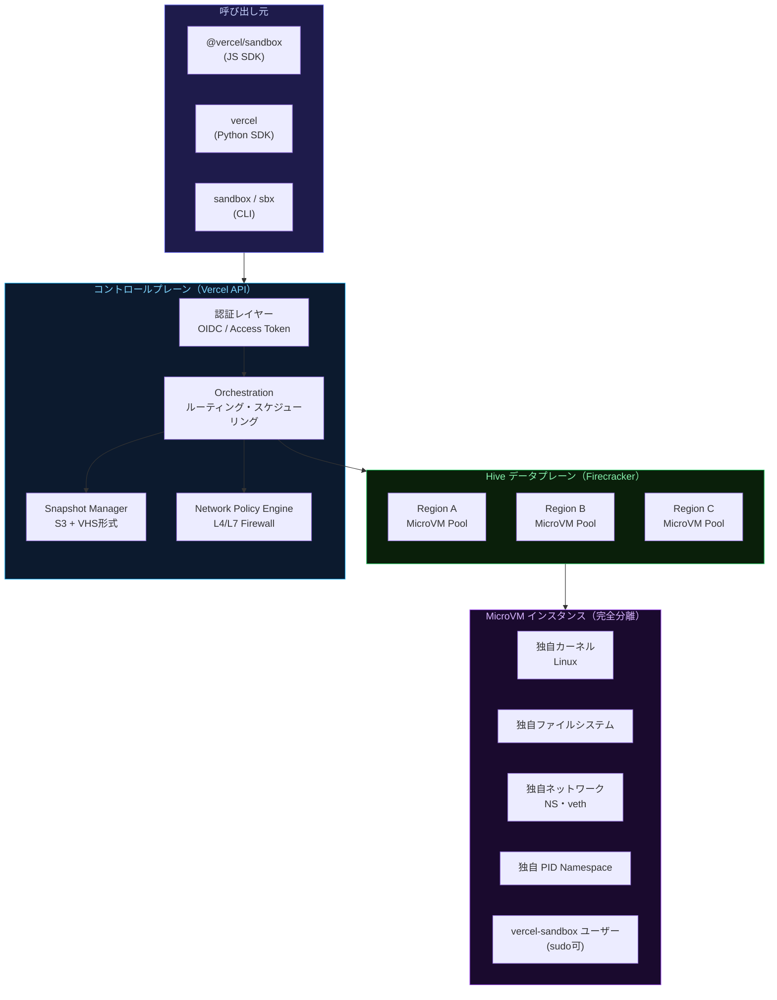
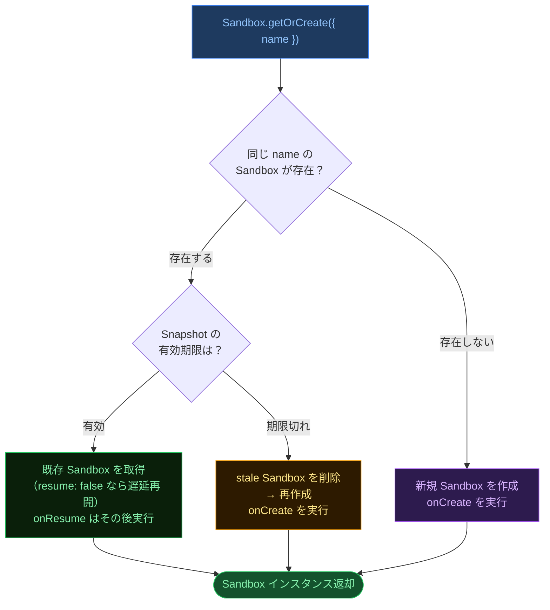
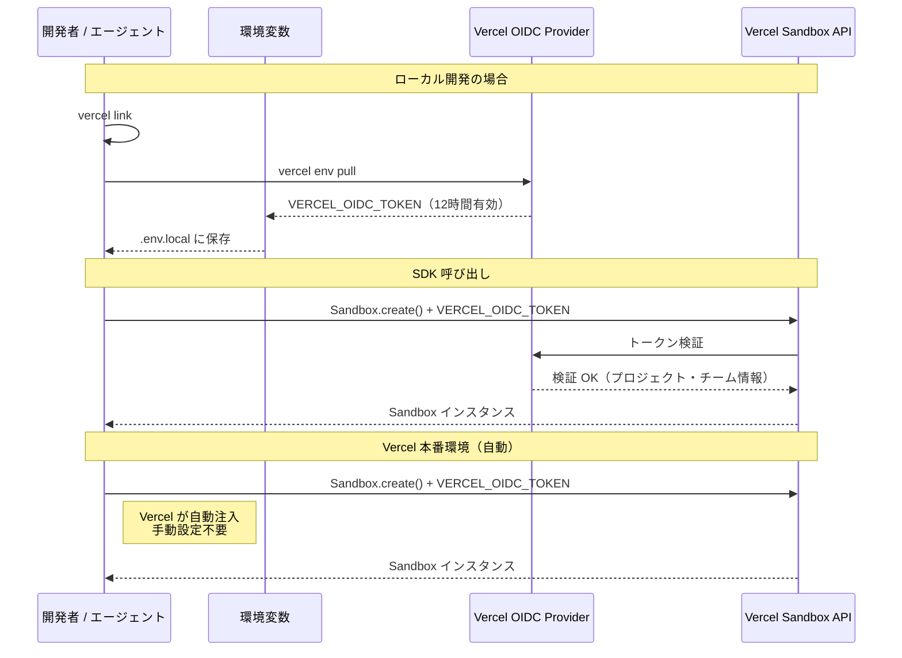
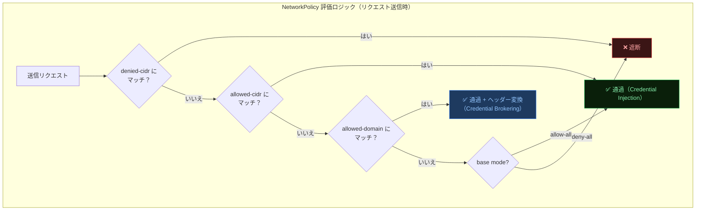
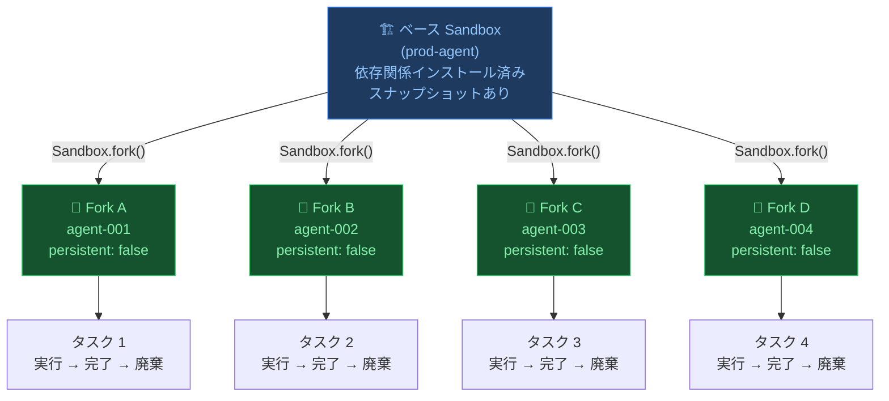
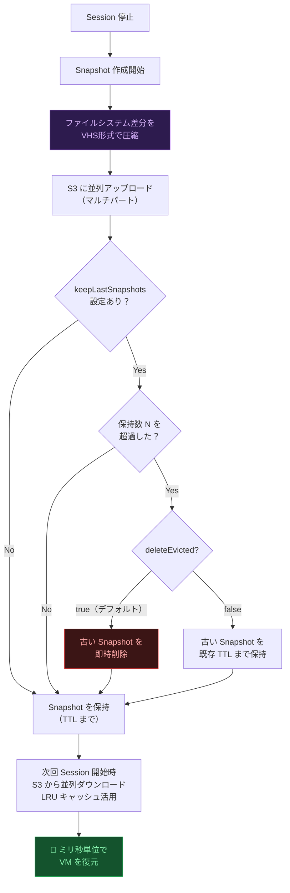
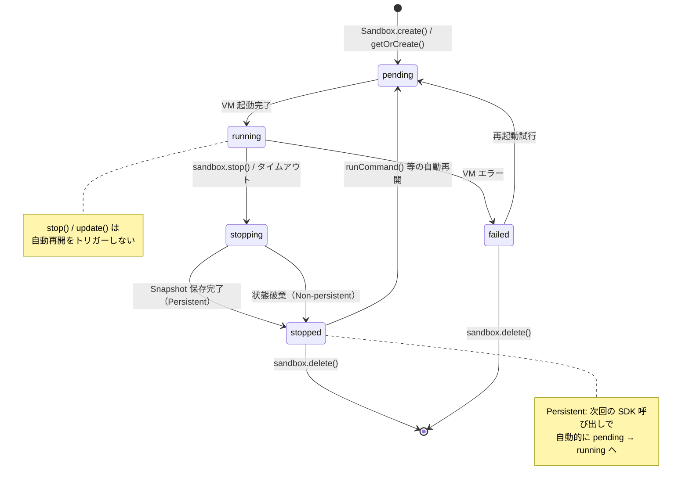
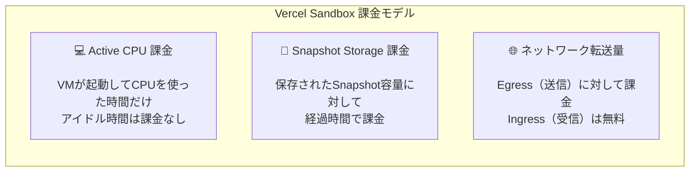
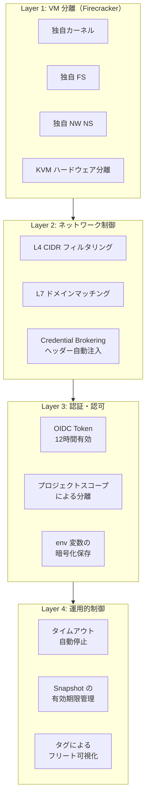

# Vercel Sandbox 実践・上級者ガイド
### 〜 アーキテクチャ・API 完全リファレンス・プロダクション運用・セキュリティ 〜

> **対象読者:** Vercel Sandbox の基本を把握済みで、本番投入・高度な機能活用・内部構造の理解を目指す方  
> **最終更新:** 2026年6月 | **対象バージョン:** Vercel Sandbox GA v2（`@vercel/sandbox@2`）

---

## 📑 目次

1. [Hive アーキテクチャ深掘り](#1-hive-アーキテクチャ深掘り)
2. [JS SDK 完全 API リファレンス](#2-js-sdk-完全-api-リファレンス)
3. [認証の詳細設計](#3-認証の詳細設計)
4. [ネットワークポリシー高度設定](#4-ネットワークポリシー高度設定)
5. [Sandbox.fork() — 並列エージェントフリート](#5-sandboxfork--並列エージェントフリート)
6. [スナップショット内部実装と最適化](#6-スナップショット内部実装と最適化)
7. [永続サンドボックスの高度なライフサイクル設計](#7-永続サンドボックスの高度なライフサイクル設計)
8. [コスト最適化と課金モデル](#8-コスト最適化と課金モデル)
9. [セキュリティアーキテクチャ](#9-セキュリティアーキテクチャ)
10. [AbortController による操作キャンセル](#10-abortcontroller-による操作キャンセル)
11. [Session クラスと Snapshot クラス](#11-session-クラスと-snapshot-クラス)
12. [CLI 完全リファレンス（上級オプション）](#12-cli-完全リファレンス上級オプション)
13. [プロダクション事例](#13-プロダクション事例)
14. [v1 → v2 移行ガイド](#14-v1--v2-移行ガイド)
15. [トラブルシューティング](#15-トラブルシューティング)
16. [参考ソース・公式リンク集](#16-参考ソース--公式リンク集)

---

## 1. Hive アーキテクチャ深掘り

### 全体構造

Vercel の内部コンピュートプラットフォーム「**Hive**」は、毎日 270万件以上のデプロイを処理する実績のある基盤上に Sandbox を構築しています。



### Firecracker MicroVM の分離モデル

各 Sandbox は **独立した Linux カーネル** を持つ Firecracker MicroVM として起動します。  
コンテナ（名前空間共有）ではなく、真の VM レベルの分離が保証されます。

| 分離レイヤー | 詳細 |
|---|---|
| **カーネル** | 各 VM が独自の Linux カーネルを保有（ホストと共有しない） |
| **ファイルシステム** | VM ごとに独立（他の VM のファイルに一切アクセス不可） |
| **ネットワーク** | 独自 Network Namespace、veth ペア、ルーティングテーブル |
| **プロセス** | 独自 PID Namespace（ホストから VM 内プロセスを直接参照不可） |
| **メモリ** | ハードウェアレベルの分離（KVM ベース） |

### システム仕様（詳細）

| 項目 | 仕様 |
|---|---|
| **OS** | Amazon Linux 2023 |
| **ランタイム** | `node26`, `node24`（デフォルト）, `node22`, `python3.13` |
| **デフォルト作業ディレクトリ** | `/vercel/sandbox` |
| **実行ユーザー** | `vercel-sandbox`（`sudo` アクセス可） |
| **vCPU** | デフォルト 2、最大 8 |
| **メモリ** | 2048 MB × vCPU 数（自動スケール） |
| **最大公開ポート数** | 15 |
| **最大タグ数** | 5 key-value ペア |
| **タイムアウト上限（Hobby）** | 45 分 |
| **タイムアウト上限（Pro/Enterprise）** | 5 時間 |
| **プリインストールツール** | `git`, `tar`, `gzip`, `unzip`, `curl`, `openssl`, `procps`, `findutils`, `which` |

---

## 2. JS SDK 完全 API リファレンス

### コアクラス一覧

| クラス | 役割 |
|---|---|
| `Sandbox` | MicroVM 環境の作成・管理・ライフサイクル制御 |
| `Session` | Sandbox 内の単一 VM 起動インスタンス |
| `FileSystem` | `node:fs/promises` 互換 API（`sandbox.fs.*`） |
| `Command` | 実行中コマンドのハンドル（detached 時） |
| `CommandFinished` | コマンド完了後の結果（exitCode, stdout, stderr） |
| `NetworkPolicy` | Sandbox の送信ファイアウォールルール |
| `Snapshot` | 保存された Sandbox 状態 |

### 2-1. Sandbox クラス — 静的メソッド全覧

#### `Sandbox.create()` — 全パラメータ

```typescript
import { Sandbox } from "@vercel/sandbox";

const sandbox = await Sandbox.create({
  // ── 識別・ランタイム ──────────────────────────────────
  name: "prod-agent-001",        // プロジェクト内一意（変更不可）
  runtime: "node24",             // node26 | node24 | node22 | python3.13

  // ── ソース（初期ファイルシステム） ─────────────────────
  source: {
    type: "git",
    url: "https://github.com/your/repo.git",
    depth: 1,                    // shallow clone
    revision: "main",            // ブランチ | タグ | コミットSHA
    username: "git",
    password: process.env.GH_PAT,
  },
  // または: source: { type: "snapshot", snapshotId: "snap_xxx" }
  // または: source: { type: "tarball", url: "https://..." }

  // ── リソース ──────────────────────────────────────────
  resources: { vcpus: 4 },       // 4 vCPU = 8192 MB RAM
  ports: [3000, 8080],           // 公開ポート（最大 15 個）
  timeout: 30 * 60 * 1000,       // タイムアウト（ms）

  // ── 環境変数 ──────────────────────────────────────────
  env: {
    NODE_ENV: "production",
    API_BASE_URL: "https://api.example.com",
  },

  // ── ネットワーク ───────────────────────────────────────
  networkPolicy: "deny-all",     // allow-all | deny-all | カスタムオブジェクト

  // ── タグ ──────────────────────────────────────────────
  tags: {
    env: "production",
    team: "backend",             // 最大 5 key-value
  },

  // ── 永続性・スナップショット ─────────────────────────────
  persistent: true,              // デフォルト true（false で non-persistent）
  snapshotExpiration: 7 * 24 * 60 * 60 * 1000,  // 7日
  keepLastSnapshots: {
    count: 1,                    // 最新 N 件のみ保持（1〜10）
    expiration: 14 * 24 * 60 * 60 * 1000,       // 保持スナップショットのTTL
    deleteEvicted: true,         // 古いものを即時削除
  },

  // ── ライフサイクルフック ───────────────────────────────
  onResume: async (sbx) => {     // セッション再開のたびに実行
    await sbx.runCommand({ cmd: "npm", args: ["run", "dev"], detached: true });
  },

  // ── キャンセル ────────────────────────────────────────
  signal: controller.signal,     // AbortController でキャンセル可能
});
```

#### `Sandbox.get()` — 停止中サンドボックスの取得

```typescript
// resume: true（デフォルト）: 取得と同時に再開を開始
const sandbox = await Sandbox.get({
  name: "prod-agent-001",
  resume: true,                  // false の場合、次の SDK 呼び出し時に遅延再開
  onResume: async (sbx) => {     // 再開時フック
    await sbx.runCommand({ cmd: "redis-server", detached: true });
  },
});
```

#### `Sandbox.getOrCreate()` — 冪等なサンドボックス取得（推奨パターン）

`getOrCreate` の **動作ロジック** は 3 分岐あります：



```typescript
const sandbox = await Sandbox.getOrCreate({
  name: "agent-workspace",
  runtime: "node24",
  resume: true,                  // true: onResume を getOrCreate 解決前に await
                                 // false（デフォルト）: 次の SDK 呼び出し時に遅延

  onCreate: async (sbx) => {
    // 初回作成時のみ（重い初期化）
    await sbx.runCommand("git", ["clone", repoUrl, "."]);
    await sbx.runCommand("npm", ["install"]);
  },

  onResume: async (sbx) => {
    // 毎回の再開時（軽量な再起動）
    await sbx.runCommand({ cmd: "npm", args: ["run", "dev"], detached: true });
  },
});
```

### 2-2. Sandbox クラス — インスタンスメソッド全覧

#### `sandbox.runCommand()` — 全パラメータ

```typescript
// 書式 A: シンプル文字列（blocking）
const finished = await sandbox.runCommand("node", ["--version"]);
console.log(finished.exitCode);            // 0
console.log(await finished.stdout());      // "v24.x.x\n"
console.log(await finished.stderr());      // ""

// 書式 B: オブジェクト形式（全パラメータ制御）
const cmd = await sandbox.runCommand({
  cmd: "npm",
  args: ["run", "build"],
  cwd: "/vercel/sandbox/packages/app",    // 作業ディレクトリ
  env: {
    NODE_ENV: "production",
    BUILD_ID: buildId,
  },
  sudo: false,                            // sudo で実行
  detached: false,                        // true: ノンブロッキング（Command 返却）
  stdout: process.stdout,                 // Writable にストリーミング
  stderr: process.stderr,
  signal: controller.signal,             // AbortController でキャンセル
});
```

**detached モードの活用パターン：**

```typescript
// バックグラウンドサービスを起動してコマンド ID を保存
const serverCmd = await sandbox.runCommand({
  cmd: "node",
  args: ["server.js"],
  detached: true,                         // Promise<Command> を返す
});
console.log("Command ID:", serverCmd.cmdId);

// 後でログを取得
const retrieved = await sandbox.getCommand(serverCmd.cmdId);
console.log(await retrieved.stdout());
```

#### `sandbox.writeFiles()` — ファイル書き込み

```typescript
await sandbox.writeFiles([
  // 通常ファイル
  {
    path: "/vercel/sandbox/src/index.ts",
    content: Buffer.from(`export const hello = () => "world";`),
    mode: 0o644,                          // デフォルト
  },
  // 実行可能スクリプト
  {
    path: "/vercel/sandbox/scripts/run.sh",
    content: Buffer.from("#!/bin/bash\nnpm run build && npm start"),
    mode: 0o755,                          // 実行権限付与
  },
]);
```

#### `sandbox.readFileToBuffer()` / `sandbox.downloadFile()`

```typescript
// メモリに読み込む（小さなファイル向け）
const buf = await sandbox.readFileToBuffer({
  path: "dist/output.js",
  cwd: "/vercel/sandbox",                 // パスの基準ディレクトリ
});
if (buf) console.log(buf.toString());

// ローカルにダウンロード（大きなファイル向け）
const localPath = await sandbox.downloadFile(
  { path: "coverage/lcov.info", cwd: "/vercel/sandbox" },
  { path: "coverage/lcov.info", cwd: "./reports", mkdirRecursive: true }
);
```

#### `sandbox.update()` — 動的設定変更

```typescript
// 実行中でも設定を変更できる（停止不要）
await sandbox.update({
  resources: { vcpus: 8 },                        // vCPU を増やす
  timeout: 5 * 60 * 60 * 1000,                   // タイムアウトを 5 時間に
  persistent: true,
  snapshotExpiration: 14 * 24 * 60 * 60 * 1000,
  keepLastSnapshots: { count: 1, deleteEvicted: true },
  networkPolicy: "deny-all",                      // ネットワーク遮断
  ports: [3000, 8080],                            // ポートリストを完全置換
  tags: { env: "production" },
  currentSnapshotId: "snap_abc123",               // 特定 Snapshot にロールバック
});
```

> ⚠️ **`ports` は完全置換:** 現在のポートリストは `update()` 時の `ports` 配列で**上書き**されます。既存ポートを残したい場合は明示的に含める必要があります。

#### `sandbox.stop()` — 停止と返却値の活用

```typescript
const result = await sandbox.stop();

// Persistent の場合: スナップショット情報を取得
console.log(result.snapshot?.id);           // "snap_xyz789"
console.log(result.snapshot?.sizeBytes);    // スナップショットサイズ
console.log(result.snapshot?.expiresAt);    // 有効期限タイムスタンプ

// 課金情報
console.log(result.activeCpuUsageMs);       // このセッションの Active CPU 時間（ms）
console.log(result.networkTransfer.ingress); // 受信バイト数
console.log(result.networkTransfer.egress);  // 送信バイト数
```

#### `sandbox.extendTimeout()` — タイムアウト延長

```typescript
// 残り時間を確認してから延長
console.log("Remaining timeout:", sandbox.timeout, "ms");

if (sandbox.timeout < 5 * 60 * 1000) {     // 5 分未満なら延長
  await sandbox.extendTimeout(30 * 60 * 1000); // 30 分延長
}
```

#### `sandbox.domain()` — 公開 URL 取得

```typescript
// ポートを公開して Dev サーバーを起動
const sandbox = await Sandbox.create({
  name: "preview-env",
  ports: [3000],
});

await sandbox.runCommand({ cmd: "npm", args: ["run", "dev"], detached: true });

// 公開 URL を取得
const url = sandbox.domain(3000);
// => "https://xxxxxxxx-3000.sandbox.vercel.app"
console.log("Preview:", url);
```

### 2-3. Sandbox クラス — アクセサー一覧

| アクセサー | 型 | 説明 |
|---|---|---|
| `sandbox.name` | `string` | プロジェクト内一意の識別子 |
| `sandbox.persistent` | `boolean` | 永続モードかどうか |
| `sandbox.status` | `"pending"\|"running"\|"stopping"\|"stopped"\|"failed"` | 現在の VM 状態 |
| `sandbox.timeout` | `number` | 残りタイムアウト（ms） |
| `sandbox.tags` | `Record<string,string> \| undefined` | タグ |
| `sandbox.vcpus` | `number \| undefined` | vCPU 数 |
| `sandbox.memory` | `number \| undefined` | メモリ（MB） |
| `sandbox.runtime` | `string \| undefined` | ランタイム識別子 |
| `sandbox.region` | `string \| undefined` | 稼働リージョン |
| `sandbox.createdAt` | `Date` | 作成タイムスタンプ |
| `sandbox.updatedAt` | `Date` | 最終更新タイムスタンプ |
| `sandbox.currentSnapshotId` | `string \| undefined` | 次回再開時に使用される Snapshot ID |
| `sandbox.snapshotExpiration` | `number \| undefined` | デフォルト Snapshot TTL（ms） |
| `sandbox.keepLastSnapshots` | `object \| undefined` | Snapshot 保持ポリシー |
| `sandbox.activeCpuUsageMs` | `number \| undefined` | 最新セッションの Active CPU 時間 |
| `sandbox.networkTransfer` | `{ingress, egress} \| undefined` | 最新セッションのネットワーク転送量 |
| `sandbox.totalDurationMs` | `number \| undefined` | 全セッション合計稼働時間 |
| `sandbox.totalActiveCpuDurationMs` | `number \| undefined` | 全セッション合計 Active CPU 時間 |
| `sandbox.totalIngressBytes` | `number \| undefined` | 全セッション合計受信バイト |
| `sandbox.totalEgressBytes` | `number \| undefined` | 全セッション合計送信バイト |

### 2-4. ページネーション — `Sandbox.list()` の活用パターン

```typescript
// パターン A: 非同期イテレータで全件自動取得（推奨）
const result = await Sandbox.list({
  namePrefix: "agent-",           // sortBy: "name" を強制
  sortBy: "name",
  sortOrder: "asc",
  tags: { env: "production" },
});

for await (const sandbox of result) {
  console.log(sandbox.name, sandbox.status);
}

// パターン B: ページ単位で処理
for await (const page of result.pages()) {
  console.log(`Page: ${page.sandboxes.length} items`);
  console.log(`Next cursor: ${page.pagination.next}`);
}

// パターン C: 全件配列化
const all = await result.toArray();
console.log(`Total: ${all.length}`);

// パターン D: セッション一覧
const sessions = await sandbox.listSessions({ sortOrder: "desc" });
for await (const session of sessions) {
  console.log(session.id, session.status, session.activeCpuUsageMs);
}

// パターン E: スナップショット一覧
const snapshots = await sandbox.listSnapshots({ limit: 10 });
for await (const snap of snapshots) {
  console.log(snap.id, snap.sizeBytes, snap.expiresAt);
}
```

---

## 3. 認証の詳細設計

### 認証フロー全体像



### 認証方式の比較

| 項目 | OIDC Token（推奨） | Access Token |
|---|---|---|
| **有効期限** | **12時間**（自動ローテーション） | 長期間（手動管理） |
| **設定方法** | `vercel link && vercel env pull` | Dashboard で手動生成 |
| **Vercel 本番** | ✅ 自動注入（設定不要） | ❌ 手動で Env Var 設定 |
| **外部 CI/CD** | ⚠️ 12時間ごとに pull が必要 | ✅ 適切 |
| **セキュリティ** | ◎（短命・自動ローテーション） | ○（長期有効のため管理注意） |
| **env 変数名** | `VERCEL_OIDC_TOKEN` | `VERCEL_TOKEN` |

### 外部 CI/CD（GitHub Actions）での認証設定

```yaml
# .github/workflows/agent.yml
name: Agent Task
on: [workflow_dispatch]

jobs:
  run-agent:
    runs-on: ubuntu-latest
    steps:
      - uses: actions/checkout@v4
      - uses: actions/setup-node@v4
        with:
          node-version: "24"

      - name: Run Agent in Sandbox
        env:
          VERCEL_TOKEN: ${{ secrets.VERCEL_TOKEN }}    # Access Token を使用
          VERCEL_PROJECT_ID: ${{ vars.VERCEL_PROJECT_ID }}
          VERCEL_TEAM_ID: ${{ vars.VERCEL_TEAM_ID }}
        run: |
          npm ci
          node scripts/run-agent.ts
```

---

## 4. ネットワークポリシー高度設定

### ポリシーの内部構造



### ポリシー設定の全パターン

```typescript
// パターン 1: すべて許可（デフォルト）
await sandbox.update({ networkPolicy: "allow-all" });

// パターン 2: すべて遮断
await sandbox.update({ networkPolicy: "deny-all" });

// パターン 3: カスタム（ドメイン単位）
await sandbox.update({
  networkPolicy: {
    allow: [
      "ai-gateway.vercel.sh",          // 完全一致
      "*.vercel.app",                  // ワイルドカード（サブドメイン）
      "api.github.com",
    ],
  },
});

// パターン 4: CIDR 単位のルール
await sandbox.update({
  networkPolicy: {
    subnets: {
      allow: ["10.0.0.0/8"],           // プライベートネットワーク許可
      deny: ["192.168.0.0/16"],        // 特定レンジを遮断
    },
  },
});

// パターン 5: ドメイン + CIDR の組み合わせ
await sandbox.update({
  networkPolicy: {
    allow: ["api.example.com"],
    subnets: {
      deny: ["10.0.0.0/8"],            // プライベートネットワーク遮断
    },
  },
});
```

### Credential Brokering（クレデンシャルブローカリング）

> 🔐 **上級機能:** AI エージェントの LLM リクエストに API キーを**自動注入**できます。コード内に API キーを持ち込まずに済むため、セキュリティが大幅に向上します。

```typescript
// AI ゲートウェイへのリクエストに x-api-key を自動注入
await sandbox.update({
  networkPolicy: {
    allow: {
      "ai-gateway.vercel.sh": [
        {
          transform: [
            {
              headers: {
                "x-api-key": process.env.OPENAI_API_KEY!,
                // ヘッダーはサーバー側で暗号化保存
                // env は fork 時にもコピーされない
              },
            },
          ],
        },
      ],
    },
  },
});

// エージェント内では x-api-key を意識せず呼び出せる
// ネットワーク層で自動的にヘッダーが付与される
```

### 動的なポリシー変更（データ収集後に遮断）

```typescript
const sandbox = await Sandbox.create({ name: "data-agent" });

// Phase 1: データ収集（外部 API 許可）
await sandbox.runCommand("npm", ["run", "fetch-data"]);

// Phase 2: 外部通信を遮断してから untrusted code を実行
await sandbox.update({ networkPolicy: "deny-all" });

// untrusted code は外部にデータを送信できない
await sandbox.runCommand("node", ["untrusted-script.js"]);

await sandbox.stop();
```

---

## 5. Sandbox.fork() — 並列エージェントフリート

### fork の仕組み



### fork の重要な挙動

| 項目 | 挙動 |
|---|---|
| **ソース指定** | `sourceSandbox` にベース Sandbox の名前を指定 |
| **設定継承** | ソースの設定をほぼすべて継承（オーバーライド可能） |
| **`env` の扱い** | **コピーされない**（サーバー側で暗号化保存のため）→ 明示的に渡す |
| **`runtime` の扱い** | オーバーライド不可（Snapshot から継承） |
| **Snapshot なし時** | ソースの `runtime` で新規作成にフォールバック |
| **`name`** | 省略するとランダム名が生成される |

### 並列エージェントフリートの実装例

```typescript
import { Sandbox } from "@vercel/sandbox";

async function runParallelAgents(tasks: string[]): Promise<void> {
  // Step 1: ベース環境を準備（共通依存関係のインストール）
  const base = await Sandbox.getOrCreate({
    name: "agent-base",
    runtime: "node24",
    keepLastSnapshots: { count: 1, deleteEvicted: true },
    onCreate: async (sbx) => {
      await sbx.runCommand("git", ["clone", repoUrl, "."]);
      await sbx.runCommand("npm", ["install"]);
      console.log("ベース環境セットアップ完了");
    },
  });

  // Step 2: ベース環境を停止してスナップショットを確定
  await base.stop();

  // Step 3: タスクごとにフォークして並列実行
  const results = await Promise.all(
    tasks.map(async (task, i) => {
      const fork = await Sandbox.fork({
        sourceSandbox: "agent-base",
        name: `agent-task-${i}-${Date.now()}`,
        persistent: false,           // タスク完了後に破棄
        resources: { vcpus: 2 },
        env: {
          OPENAI_API_KEY: process.env.OPENAI_API_KEY!,  // 明示的に渡す
          TASK_PAYLOAD: task,
        },
        timeout: 15 * 60 * 1000,    // 15 分
      });

      try {
        const result = await fork.runCommand({
          cmd: "node",
          args: ["agent.js"],
          env: { TASK: task },
        });
        return { task, exitCode: result.exitCode };
      } finally {
        await fork.stop();
      }
    })
  );

  console.log("全タスク完了:", results);
}
```

### A/B テスト・実験的並列実行

```typescript
// 同じコードベースで設定違い A/B を同時実行
const [variantA, variantB] = await Promise.all([
  Sandbox.fork({
    sourceSandbox: "experiment-base",
    name: "variant-a",
    env: { OPENAI_MODEL: "gpt-4o" },
  }),
  Sandbox.fork({
    sourceSandbox: "experiment-base",
    name: "variant-b",
    env: { OPENAI_MODEL: "claude-sonnet-4-6" },
  }),
]);

const [resultA, resultB] = await Promise.all([
  variantA.runCommand("node", ["benchmark.js"]),
  variantB.runCommand("node", ["benchmark.js"]),
]);

// 比較後に両方削除
await Promise.all([variantA.delete(), variantB.delete()]);
```

---

## 6. スナップショット内部実装と最適化

### スナップショットのライフサイクル



### 手動スナップショットの活用

```typescript
import { Sandbox } from "@vercel/sandbox";

// ── パターン 1: 明示的なポイントインタイムスナップショット ──────
const sandbox = await Sandbox.create({ runtime: "node24" });

await sandbox.writeFiles([
  { path: "config.json", content: Buffer.from('{"env":"prod"}') },
]);
await sandbox.runCommand("npm", ["install"]);

// 手動スナップショット（sandbox は自動停止される）
const snapshot = await sandbox.snapshot({
  expiration: 14 * 24 * 60 * 60 * 1000, // 14日
  // expiration: 0,                       // 無期限
});
console.log("Snapshot ID:", snapshot.snapshotId);

// ── パターン 2: スナップショットから別の Sandbox を起動 ─────────
const restored = await Sandbox.create({
  source: { type: "snapshot", snapshotId: snapshot.snapshotId },
  timeout: 120_000,
});

const result = await restored.runCommand("cat", ["config.json"]);
console.log(await result.stdout()); // '{"env":"prod"}'
await restored.stop();

// ── パターン 3: ロールバック（特定 Snapshot に戻す）─────────────
const snapshots = await sandbox.listSnapshots({ sortOrder: "desc" });
const previous = (await snapshots.toArray())[1]; // 2番目に新しいもの

await sandbox.update({ currentSnapshotId: previous.id });
// 次回の Session 起動時に previous から再開する
```

### スナップショット保持ポリシーの詳細

| パラメータ | 説明 | 推奨値 |
|---|---|---|
| `snapshotExpiration` | Snapshot のデフォルト TTL（ms）| `7 * 24 * 60 * 60 * 1000`（7日） |
| `keepLastSnapshots.count` | 保持する最大件数（1〜10）| `1`（最新のみ） |
| `keepLastSnapshots.expiration` | 保持 Snapshot の TTL（上書き）| `0`（無期限）or `30d` |
| `keepLastSnapshots.deleteEvicted` | 超過した Snapshot を即時削除 | `true` |

```typescript
// ✅ コストを最小化する推奨設定
const sandbox = await Sandbox.create({
  name: "cost-optimized",
  snapshotExpiration: 7 * 24 * 60 * 60 * 1000,   // デフォルト 7日
  keepLastSnapshots: {
    count: 1,               // 最新 1 件のみ保持
    expiration: 0,          // 保持する 1 件は無期限
    deleteEvicted: true,    // 古いものは即座に削除
  },
});
```

---

## 7. 永続サンドボックスの高度なライフサイクル設計

### 完全なライフサイクル状態遷移



### 自動再開の対象・非対象メソッド

| メソッド | 停止中の Sandbox を自動再開するか |
|---|---|
| `sandbox.runCommand()` | ✅ 自動再開 |
| `sandbox.writeFiles()` | ✅ 自動再開 |
| `sandbox.readFileToBuffer()` | ✅ 自動再開 |
| `sandbox.readFile()` | ✅ 自動再開 |
| `sandbox.downloadFile()` | ✅ 自動再開 |
| `sandbox.mkDir()` | ✅ 自動再開 |
| `sandbox.domain()` | ✅ 自動再開 |
| `sandbox.stop()` | ❌ **自動再開しない**（停止中なら no-op） |
| `sandbox.update()` | ❌ **自動再開しない**（停止中に設定変更のみ） |
| `sandbox.delete()` | ❌ 再開せず削除 |
| `sandbox.snapshot()` | ❌ 実行中が必要 |

### resume: false の使い所

```typescript
// resume: false を使うと「取得はするが起動は遅延」できる
const sandbox = await Sandbox.get({
  name: "heavy-setup-box",
  resume: false,                // VM はまだ起動しない
  onResume: async (sbx) => {   // 実際に再開した時に実行
    await sbx.runCommand({ cmd: "redis-server", detached: true });
  },
});

// ─ ここで VM は起動していない ─
const metadata = sandbox.name; // メタデータ参照は OK

// ─ この呼び出しで初めて VM が起動 → onResume が実行される ─
await sandbox.runCommand("echo", ["resumed!"]);
```

---

## 8. コスト最適化と課金モデル

### 課金の仕組み



### 課金モデル詳細

| 課金項目 | 課金タイミング | 最小化の方法 |
|---|---|---|
| **Active CPU** | VM が CPU を使用している時間 | 処理後は即座に `stop()` |
| **Snapshot Storage** | Snapshot ファイルが存在する間ずっと | `keepLastSnapshots: { count: 1 }` |
| **Egress** | Sandbox からの送信バイト数 | `deny-all` + 必要なドメインのみ許可 |

### コスト最適化パターン集

**パターン 1: 処理後は必ず停止する（Active CPU 最小化）**

```typescript
const sandbox = await Sandbox.create({ name: "task-agent" });

try {
  await sandbox.runCommand("npm", ["run", "task"]);
} finally {
  // 成功・失敗どちらでも停止する
  await sandbox.stop();
}
```

**パターン 2: 一時タスクは Non-persistent（Snapshot 課金ゼロ）**

```typescript
// CI/CD タスクには persistent: false
const sandbox = await Sandbox.create({
  persistent: false,             // Snapshot を作らない → Storage 課金なし
  timeout: 10 * 60 * 1000,
});
```

**パターン 3: Snapshot 保持ポリシーを必ず設定**

```typescript
// 長期利用 Sandbox はデフォルト設定のままにしない
const sandbox = await Sandbox.create({
  name: "long-lived",
  snapshotExpiration: 7 * 24 * 60 * 60 * 1000,  // 7日
  keepLastSnapshots: {
    count: 1,           // 最新 1 件のみ（蓄積を防ぐ）
    deleteEvicted: true,
  },
});
```

**パターン 4: `activeCpuUsageMs` で実際のコストを監視**

```typescript
const result = await sandbox.stop();

// セッションごとの Active CPU 時間をログに記録
const cpuSec = (result.activeCpuUsageMs / 1000).toFixed(2);
console.log(`Session CPU: ${cpuSec}s`);
console.log(`Egress: ${result.networkTransfer.egress} bytes`);

// 累計（長期 Sandbox の場合）
console.log(`Total CPU: ${(sandbox.totalActiveCpuDurationMs ?? 0) / 1000}s`);
```

**パターン 5: 未使用 Sandbox を定期削除（フリート管理）**

```typescript
// 14日以上更新されていない Sandbox を自動削除するメンテナンスジョブ
async function cleanupStale(): Promise<void> {
  const cutoff = Date.now() - 14 * 24 * 60 * 60 * 1000;

  const result = await Sandbox.list({
    sortBy: "statusUpdatedAt",
    sortOrder: "asc",
  });

  for await (const sandbox of result) {
    if (sandbox.updatedAt.getTime() < cutoff) {
      console.log(`Deleting stale: ${sandbox.name}`);
      await sandbox.delete();
    }
  }
}
```

---

## 9. セキュリティアーキテクチャ

### 多層防御モデル



### セキュリティベストプラクティス

**BP-S1: 信頼できないコードは必ず `deny-all` + 最小権限で実行**

```typescript
const sandbox = await Sandbox.create({
  name: `user-${userId}-executor`,
  persistent: false,              // 状態を残さない
  networkPolicy: {
    allow: ["api.your-service.com"],  // 自分のサービス API のみ許可
  },
  timeout: 5 * 60 * 1000,        // 5 分で強制終了
  env: {
    // API キーはネットワーク層（Credential Brokering）で注入
    // ここには渡さない
  },
});
```

**BP-S2: Credential Brokering でコード内の秘密情報をゼロに**

```typescript
// ❌ 悪い例: env 変数で API キーを渡すと LLM が読める可能性
await sandbox.runCommand({ cmd: "node", args: ["agent.js"],
  env: { OPENAI_API_KEY: process.env.OPENAI_API_KEY } });

// ✅ 良い例: ネットワーク層でヘッダーを注入（コードからは見えない）
await sandbox.update({
  networkPolicy: {
    allow: {
      "ai-gateway.vercel.sh": [{
        transform: [{ headers: { "x-api-key": process.env.OPENAI_API_KEY! } }]
      }]
    }
  }
});
// エージェントコードは x-api-key を意識せず ai-gateway.vercel.sh を呼ぶだけ
```

**BP-S3: プロンプトインジェクション対策（データ収集後にネットワーク遮断）**

```typescript
// LLM エージェントが外部データを取得したら、即座にネットワーク遮断
const sandbox = await Sandbox.create({ name: "safe-agent" });

// Phase 1: 外部データを取得（ネットワーク許可）
await sandbox.runCommand("node", ["fetch-context.js"]);

// Phase 2: ネットワークを遮断してからエージェントを実行
// → 仮にプロンプトインジェクションで外部送信を試みても遮断される
await sandbox.update({ networkPolicy: "deny-all" });
await sandbox.runCommand("node", ["agent.js"]);
```

**BP-S4: env は fork 時にコピーされない仕様を活用**

```typescript
// fork 元の env は自動コピーされない → 明示的に渡すことで追跡可能
const fork = await Sandbox.fork({
  sourceSandbox: "base-agent",
  env: {
    // この fork 専用のスコープ付きトークン
    TASK_TOKEN: generateScopedToken(taskId),
  },
});
```

---

## 10. AbortController による操作キャンセル

すべての非同期 SDK 操作は `signal` パラメータでキャンセルできます。

```typescript
const controller = new AbortController();

// 30 秒後に自動キャンセル
const timer = setTimeout(() => controller.abort(), 30_000);

try {
  const sandbox = await Sandbox.create({
    name: "cancellable-task",
    signal: controller.signal,
  });

  const result = await sandbox.runCommand({
    cmd: "npm",
    args: ["run", "long-task"],
    signal: controller.signal,    // コマンドのキャンセルも同じ signal で
    stdout: process.stdout,
  });

} catch (err) {
  if (err instanceof Error && err.name === "AbortError") {
    console.log("操作がキャンセルされました");
  } else {
    throw err;
  }
} finally {
  clearTimeout(timer);
}
```

---

## 11. Session クラスと Snapshot クラス

### Session クラスのアクセサー

`sandbox.currentSession()` または `sandbox.listSessions()` から取得できます。

| アクセサー | 型 | 説明 |
|---|---|---|
| `session.sessionId` | `string` | セッションの一意 ID |
| `session.status` | `string` | `"pending" \| "running" \| "stopped" \| "failed"` |
| `session.activeCpuUsageMs` | `number \| undefined` | このセッションの Active CPU 時間 |
| `session.networkTransfer` | `object \| undefined` | `{ ingress, egress }` バイト |
| `session.startedAt` | `number \| undefined` | 起動タイムスタンプ（UNIX ms） |
| `session.stoppedAt` | `number \| undefined` | 停止タイムスタンプ（UNIX ms） |

```typescript
// セッション履歴を監査ログとして記録
const sessions = await sandbox.listSessions({ sortOrder: "desc" });
for await (const session of sessions) {
  const duration = session.stoppedAt && session.startedAt
    ? (session.stoppedAt - session.startedAt) / 1000
    : null;
  console.log({
    id: session.id,
    status: session.status,
    durationSec: duration,
    cpuMs: session.activeCpuUsageMs,
  });
}
```

### Snapshot クラスのアクセサー

`sandbox.listSnapshots()` または `sandbox.snapshot()` から取得できます。

| アクセサー | 型 | 説明 |
|---|---|---|
| `snapshot.id` / `snapshot.snapshotId` | `string` | スナップショット ID |
| `snapshot.status` | `string` | `"created" \| "deleted" \| "failed"` |
| `snapshot.sizeBytes` | `number \| undefined` | スナップショットサイズ（bytes） |
| `snapshot.createdAt` | `number \| undefined` | 作成タイムスタンプ（UNIX ms） |
| `snapshot.expiresAt` | `number \| undefined` | 有効期限タイムスタンプ |
| `snapshot.parentId` | `string \| undefined` | 親スナップショット ID |

---

## 12. CLI 完全リファレンス（上級オプション）

### `sandbox fork` — ベースイメージ戦略

```bash
# ベース Sandbox を作成（一度だけ）
sandbox create --name agent-base \
  --snapshot-expiration none \         # スナップショットを永続化
  --keep-last-snapshots 1

# git clone + npm install（初回のみ）
sandbox exec agent-base -- bash -c "
  git clone https://github.com/your/repo .
  npm install
"
sandbox stop agent-base               # 自動スナップショット

# タスクごとにフォーク（非永続）
sandbox fork agent-base \
  --name agent-task-001 \
  --non-persistent \
  --vcpus 4 \
  --env TASK_ID=001 \
  --connect                           # フォーク後にインタラクティブ接続
```

### `sandbox run` — 停止中でも実行

```bash
# run は停止中の Sandbox を自動再開してコマンドを実行
sandbox run --name my-sandbox -- npm test

# 環境変数 + 作業ディレクトリ + 実行後停止
sandbox run \
  --name my-sandbox \
  --env NODE_ENV=test \
  --workdir /vercel/sandbox/packages/app \
  --stop \
  -- npm run test:coverage
```

### `sandbox exec` の上級オプション

```bash
# インタラクティブ TTY（vim 等を使いたい場合）
sandbox exec --interactive --tty my-sandbox -- vim /etc/config.yaml

# sudo でシステムパッケージをインストール
sandbox exec --sudo my-sandbox -- dnf install -y postgresql-client

# 実行後に Session を停止（Snapshot 保存してから停止）
sandbox exec --stop my-sandbox -- npm run build
```

### `sandbox config` — 全サブコマンド

```bash
# ── 現在設定を確認 ─────────────────────────────────────────
sandbox config list my-sandbox

# ── リソース変更 ────────────────────────────────────────────
sandbox config vcpus my-sandbox 4          # 4 vCPU (= 8 GB RAM)
sandbox config timeout my-sandbox 2h       # タイムアウト 2 時間

# ── 永続性制御 ──────────────────────────────────────────────
sandbox config persistent my-sandbox false # Non-persistent に変更
sandbox config snapshot-expiration my-sandbox 14d

# ── スナップショット保持 ────────────────────────────────────
sandbox config keep-last-snapshots my-sandbox 1
sandbox config keep-last-snapshots-for my-sandbox none   # 無期限
sandbox config delete-evicted-snapshots my-sandbox true

# ── スナップショットロールバック ────────────────────────────
sandbox config current-snapshot my-sandbox snap_abc123

# ── ネットワーク動的変更 ────────────────────────────────────
sandbox config network-policy my-sandbox --mode deny-all
sandbox config network-policy my-sandbox \
  --allowed-domain ai-gateway.vercel.sh \
  --allowed-domain api.github.com \
  --denied-cidr 192.168.0.0/16

# ── ポート変更（完全置換）──────────────────────────────────
sandbox config ports my-sandbox -p 3000 -p 8080
sandbox config ports my-sandbox              # 全ポートをクリア

# ── タグ ────────────────────────────────────────────────────
sandbox config tags my-sandbox --tag env=production --tag team=backend
sandbox config tags my-sandbox               # 全タグをクリア
```

### `sandbox sessions` / `sandbox snapshots`

```bash
# セッション一覧（監査ログ）
sandbox sessions list my-sandbox

# スナップショット一覧
sandbox snapshots list my-sandbox

# 手動スナップショット（現在の状態を保存）
sandbox snapshot my-sandbox
```

### フリート管理コマンドパターン

```bash
# 特定プレフィックスの Sandbox を一括停止
sandbox list --name-prefix ci- --all | \
  awk '{print $1}' | \
  xargs -I {} sandbox stop {}

# staging タグの Sandbox を一覧表示
sandbox list --tag env=staging --all

# 複数 Sandbox を同時削除
sandbox remove sandbox-a sandbox-b sandbox-c
```

---

## 13. プロダクション事例

### Roo Code — AI コーディングエージェント

Roo Code は Slack・Linear・GitHub 等と連携する AI コーディングエージェントです。

**活用ポイント:**
- Sandbox でエージェントが依存関係インストール済みの状態をスナップショット
- 次回タスク開始時はスナップショットから瞬時に再開（clone・install をスキップ）
- 複数エージェントが並列に独立した Sandbox で動作

> 「スナップショットでエージェントをステートレスなワーカーから永続的なコラボレーターへ変えられた。月曜にタスクを開始してスナップショット、木曜にステークホルダーのレビューで再開、並行して 2 つのアプローチを同時試行できる」  
> — Matt Rubens, CEO of Roo Code

### Blackbox AI — エージェントオーケストレーション

複数の AI コーディングエージェントを統合する Agents HQ プラットフォームです。

**活用ポイント:**
- 高ボリュームの並列タスクをそれぞれ独立した Sandbox で実行
- **サブ秒の起動時間**が大量タスクの低レイテンシ分散に直結
- リソース競合なしに水平スケール

> 「サブ秒のサンドボックス初期化時間により、タスク分散の高速化とエンドツーエンドの実行レイテンシ削減が実現できた。これはプロダクショングレードのエージェントオーケストレーションに不可欠だった」  
> — Robert Rizk, CEO of Blackbox AI

### Vercel v0 — AI アプリビルダー

v0 は Vercel Sandbox 上で生成コードを実行し、リアルタイムプレビュー URL を発行します。

**活用ポイント:**
- ポートを公開して Dev サーバーを起動 → プレビュー URL をユーザーに提示
- セッション終了まで Sandbox を維持し、ユーザーが繰り返し操作できる環境を提供

---

## 14. v1 → v2 移行ガイド

### 変更点まとめ

```mermaid
flowchart LR
    subgraph V1["v1（旧）"]
        direction TB
        A1["識別子: sandboxId\n（sbx_xxx 形式）"]
        A2["デフォルト: ephemeral\n（スナップショットなし）"]
        A3["ページネーション: since/until"]
        A4["停止中のコマンドはエラー"]
        A5["updateNetworkPolicy()"]
        A6["Sandbox.get({ sandboxId })"]
    end

    subgraph V2["v2（現在）"]
        direction TB
        B1["識別子: name\n（ユーザー定義文字列）"]
        B2["デフォルト: persistent\n（自動スナップショット）"]
        B3["ページネーション: cursor ベース\n（async-iterable）"]
        B4["停止中は自動再開して実行"]
        B5["sandbox.update({ networkPolicy })"]
        B6["Sandbox.get({ name })"]
    end

    V1 -- "移行" --> V2
```



### コードの移行手順

```typescript
// ─── Step 1: 識別子の変更 ─────────────────────────────────
// Before (v1)
const sandbox = await Sandbox.get({ sandboxId: "sbx_123" });

// After (v2)
// v1 の sandboxId は v2 では name として backfill される
const sandbox = await Sandbox.get({ name: "sbx_123" });

// ─── Step 2: デフォルト永続性への対応 ─────────────────────
// v2 ではデフォルトで persistent = true
// CI/CD などで状態を残したくない場合は明示的に指定
const ciSandbox = await Sandbox.create({
  persistent: false,  // v1 と同じ ephemeral 挙動
});

// ─── Step 3: ページネーションの移行 ────────────────────────
// Before (v1): since/until パラメータ
const v1result = await Sandbox.list({ since: "2026-01-01" });

// After (v2): cursor ベース + async-iterable
const v2result = await Sandbox.list({ sortBy: "createdAt", sortOrder: "desc" });
for await (const sandbox of v2result) { /* ... */ }

// ─── Step 4: updateNetworkPolicy の移行 ─────────────────────
// Before (v1): 専用メソッド（deprecated）
await sandbox.updateNetworkPolicy("deny-all");

// After (v2): sandbox.update() に統一
await sandbox.update({ networkPolicy: "deny-all" });
```

### 移行チェックリスト

| 項目 | 確認内容 |
|---|---|
| `@vercel/sandbox` バージョン | `npm ls @vercel/sandbox` で v2 以降を確認 |
| `sandboxId` の参照箇所 | `name` に変更（値は backfill 済み） |
| `persistent: false` の追加 | ephemeral を期待しているコードに明示的に追加 |
| `updateNetworkPolicy()` の置換 | `sandbox.update({ networkPolicy })` に変更 |
| ページネーションの移行 | `since`/`until` → `cursor` + async-iterable |
| スナップショットコスト確認 | 永続化により Snapshot Storage コスト発生に注意 |

---

## 15. トラブルシューティング

### よくある問題と対処法

| 症状 | 原因候補 | 対処法 |
|---|---|---|
| `VERCEL_OIDC_TOKEN` が見つからない | `vercel link` / `vercel env pull` 未実行 | `vercel link && vercel env pull` を再実行 |
| OIDC Token が期限切れ | 12 時間で失効 | `vercel env pull` を再実行して更新 |
| Sandbox が `failed` 状態 | VM エラー | `sandbox.delete()` して再作成 |
| 期待したスナップショットから再開しない | `currentSnapshotId` が古い | `sandbox.update({ currentSnapshotId: 'snap_xxx' })` |
| `fork` 後に `env` 変数がない | `env` はフォーク時にコピーされない | `Sandbox.fork()` の `env` パラメータに明示的に渡す |
| `runCommand` が失敗する（stopped 状態） | 自動再開の対象外のケース | `Sandbox.get({ name, resume: true })` で明示的に再開 |
| コスト予想外に高い | Snapshot 蓄積 | `keepLastSnapshots: { count: 1, deleteEvicted: true }` を設定 |
| `update()` の `ports` で既存ポートが消える | `ports` は完全置換仕様 | 残したいポートも含めて全ポートを配列に渡す |
| `snapshot()` がタイムアウト | VM が停止状態 | `sandbox.snapshot()` は実行中の VM にのみ呼び出し可能 |

### デバッグコマンド

```bash
# セッション履歴の確認
sandbox sessions list my-sandbox

# スナップショットの確認
sandbox snapshots list my-sandbox

# 現在の設定を確認
sandbox config list my-sandbox

# インタラクティブにデバッグ
sandbox connect my-sandbox

# ログをローカルに持ってくる
sandbox copy my-sandbox:/vercel/sandbox/logs/ ./debug-logs/
```

---

## 16. 参考ソース / 公式リンク集

### 公式ドキュメント（最重要）

| リソース | URL |
|---|---|
| Vercel Sandbox 概要 | https://vercel.com/docs/sandbox |
| **JS SDK 完全リファレンス** | https://vercel.com/docs/sandbox/sdk-reference |
| Python SDK リファレンス | https://vercel.com/docs/sandbox/python-sdk-reference |
| **CLI 完全リファレンス** | https://vercel.com/docs/sandbox/cli-reference |
| **永続サンドボックス** | https://vercel.com/docs/sandbox/concepts/persistent-sandboxes |
| スナップショットコンセプト | https://vercel.com/docs/sandbox/concepts/snapshots |
| ネットワークポリシー（Firewall） | https://vercel.com/docs/sandbox/concepts/firewall |
| 認証設定 | https://vercel.com/docs/sandbox/concepts/authentication |
| タグ | https://vercel.com/docs/sandbox/concepts/tags |
| システム仕様 | https://vercel.com/docs/sandbox/system-specifications |
| Working with Sandbox（実践ガイド） | https://vercel.com/docs/sandbox/working-with-sandbox |
| 料金・プラン | https://vercel.com/docs/sandbox/pricing |
| クイックスタート | https://vercel.com/docs/sandbox/quickstart |

### OSS・ブログ

| リソース | URL |
|---|---|
| GitHub リポジトリ（CLI + SDK OSS） | https://github.com/vercel/sandbox |
| GA 発表ブログ（2026/01/30） | https://vercel.com/blog/vercel-sandbox-is-now-generally-available |
| Sandbox Persistence GA（2026/05/26） | https://vercel.com/changelog/sandbox-persistence-is-now-ga |
| Hive インフラ詳細ブログ | https://vercel.com/blog/a-deep-dive-into-hive-vercels-builds-infrastructure |

### npm パッケージ

| パッケージ | URL |
|---|---|
| `@vercel/sandbox`（JS SDK） | https://www.npmjs.com/package/@vercel/sandbox |
| `sandbox`（CLI） | https://www.npmjs.com/package/sandbox |

---

> 📝 **Note:** 本ガイドは 2026年6月時点の公式ドキュメント（`sdk-reference` 最終更新: 2026/05/29・`cli-reference` 最終更新: 2026/05/29）に基づいています。仕様・料金は変更される場合があります。最新情報は [Vercel Docs](https://vercel.com/docs/sandbox) および [GitHub リポジトリ](https://github.com/vercel/sandbox) を参照してください。
