# Vercel Sandbox 完全入門ガイド
### 〜 初学者でもわかるステップバイステップ解説・ベストプラクティス付き 〜

> **対象読者:** Vercel Sandbox を初めて触る方、基本を体系的に学びたい方  
> **最終更新:** 2026年6月 | **対象バージョン:** Vercel Sandbox GA (v2)

---

## 📑 目次

1. [Vercel Sandbox とは？](#1-vercel-sandbox-とは)
2. [全体アーキテクチャを理解する](#2-全体アーキテクチャを理解する)
3. [主なユースケース](#3-主なユースケース)
4. [セットアップ手順（Step-by-Step）](#4-セットアップ手順step-by-step)
5. [コアコンセプト：Sandbox と Session](#5-コアコンセプトsandbox-と-session)
6. [永続的 vs 一時的サンドボックス](#6-永続的-vs-一時的サンドボックス)
7. [はじめてのサンドボックスを作る](#7-はじめてのサンドボックスを作る)
8. [JS SDK 実践ガイド](#8-js-sdk-実践ガイド)
9. [CLI 完全リファレンス](#9-cli-完全リファレンス)
10. [永続的サンドボックスの詳細](#10-永続的サンドボックスの詳細)
11. [スナップショット管理](#11-スナップショット管理)
12. [ネットワークポリシー](#12-ネットワークポリシー)
13. [タグによる管理](#13-タグによる管理)
14. [ベストプラクティス集](#14-ベストプラクティス集)
15. [参考ソース・公式リンク集](#15-参考ソース--公式リンク集)

---

## 1. Vercel Sandbox とは？

**Vercel Sandbox** は、AI エージェントのコード・ユーザー入力・外部スクリプトなど、**信頼できないコードを安全に実行するための隔離された Linux マイクロVM** です。

2026年1月30日に **GA（一般公開）** となり、CLI・SDK はオープンソース化されました。

> 💡 **一言で言うと:**  
> 「コードを安全に動かせる使い捨ての Linux マシン」を**数ミリ秒**で用意できるサービスです。

### Vercel Sandbox が解決する課題

| 従来インフラの問題 | Vercel Sandbox の解決策 |
|---|---|
| 環境準備に数分かかる | **ミリ秒単位で起動（サブ秒）** |
| 実行環境が共有されリスクが高い | **Firecracker マイクロVM による完全分離** |
| 一時的なタスクにもコストがかかる | **Active CPU 時間のみ課金** |
| 状態の引き継ぎが困難 | **自動スナップショットで状態を保存・復元** |
| 本番環境への影響リスク | **完全に分離された VM のため影響ゼロ** |

---

## 2. 全体アーキテクチャを理解する

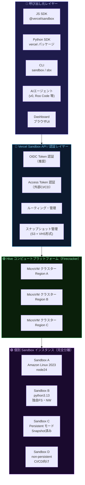

### システム仕様

| 項目 | 詳細 |
|---|---|
| **ベース OS** | Amazon Linux 2023 |
| **利用可能ランタイム** | `node26`, `node24`（デフォルト）, `node22`, `python3.13` |
| **デフォルト作業ディレクトリ** | `/vercel/sandbox` |
| **実行ユーザー** | `vercel-sandbox`（sudo アクセス可） |
| **仮想化技術** | Firecracker MicroVM（各 VM が独自カーネルを保有） |
| **起動速度** | **ミリ秒単位**（サブ秒） |
| **最大 vCPU** | 8 vCPU（各 vCPU に 2048 MB RAM） |
| **最大タイムアウト** | Hobby: 45分 / Pro・Enterprise: 5時間 |

---

## 3. 主なユースケース

| ユースケース | 具体例 | 推奨モード |
|---|---|---|
| 🤖 **AI エージェントのコード実行** | LLM が生成したコードを安全に実行（v0, Roo Code 等） | Persistent |
| 🧪 **コードプレイグラウンド・IDE** | ユーザーがリアルタイムにコードを書いて実行 | Persistent |
| 🔍 **CI/CD・テスト分離実行** | ユーザー投稿コードを本番と切り離してテスト | Non-persistent |
| 🚀 **開発サーバー起動 / ライブプレビュー** | Dev Server 起動 → プレビュー URL 発行 | Persistent |
| 🔒 **信頼できないコードの隔離実行** | サードパーティスクリプトの安全な実行 | Non-persistent |

---

## 4. セットアップ手順（Step-by-Step）

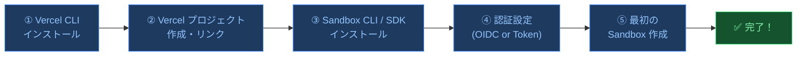

### Step 1 — Vercel CLI のインストール

```bash
npm install -g vercel
```

### Step 2 — プロジェクトのリンク（認証の準備）

```bash
# 新しいディレクトリを作成（既存プロジェクトでも OK）
mkdir my-sandbox-project && cd my-sandbox-project

# Vercel にリンク（これで OIDC トークン認証が使えるようになる）
vercel link

# 環境変数を取得（VERCEL_OIDC_TOKEN が .env.local に保存される）
vercel env pull
```

> ⚠️ **ポイント:** OIDC トークンは **12時間で失効** します。長時間の開発では `vercel env pull` を再実行してください。

### Step 3 — Sandbox CLI / SDK のインストール

```bash
# CLI のインストール（グローバル）
npm install -g sandbox

# または npx で直接使用（インストール不要）
npx sandbox --help

# JS SDK のインストール（プロジェクトに追加）
npm install @vercel/sandbox

# Python SDK の場合
pip install vercel
```

### Step 4 — 認証方法の選択

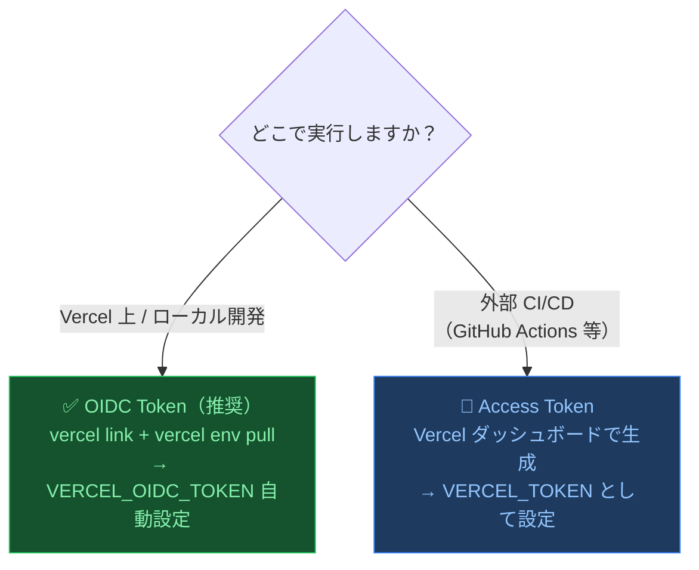

| 認証方法 | 使用環境 | セキュリティ | 設定コマンド |
|---|---|---|---|
| **OIDC Token（推奨）** | Vercel 上・ローカル開発 | ◎（自動ローテーション） | `vercel link && vercel env pull` |
| **Access Token** | 外部 CI/CD・非 Vercel 環境 | ○（長期間有効） | Dashboard で手動生成 |

---

## 5. コアコンセプト：Sandbox と Session

### Sandbox（永続的な実体）と Session（単一の VM 起動）の違い

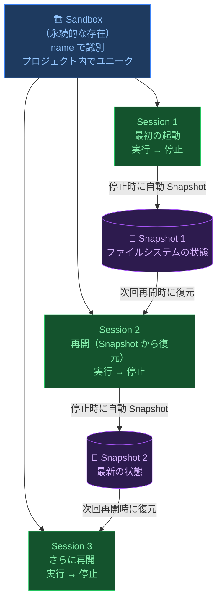

**まとめると：**

| 概念 | 説明 | ライフタイム |
|---|---|---|
| **Sandbox** | `name` で識別される長期的な存在。設定・スナップショットを保持 | プロジェクト存在する限り |
| **Session** | Sandbox 内で起動する単一の VM インスタンス | コマンド実行中〜停止まで |
| **Snapshot** | Session 停止時に自動保存されるファイルシステムの状態 | 設定した有効期限まで |

---

## 6. 永続的 vs 一時的サンドボックス

| 観点 | Persistent（デフォルト） | Non-persistent |
|---|---|---|
| **停止時の挙動** | ✅ 自動スナップショット保存 | ❌ 状態は破棄 |
| **再開方法** | `Sandbox.get({ name })` で自動再開 | 不可（新規作成のみ） |
| **スナップショット管理** | 自動（手動管理不要） | なし |
| **ストレージ課金** | Snapshot Storage が発生 | 発生しない |
| **主な用途** | 開発環境・エージェントワークスペース・長期ジョブ | CI/CD・ビルド専用・使い捨てタスク |
| **作成時の指定** | デフォルト（省略可） | `persistent: false` または `--non-persistent` |

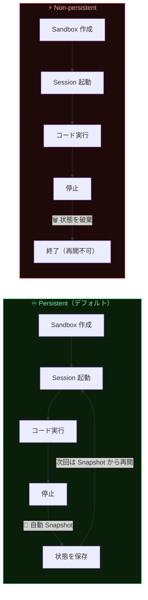

---

## 7. はじめてのサンドボックスを作る

### CLI で最速スタート（1コマンド）

```bash
# サンドボックスを作成してインタラクティブシェルに接続
npx sandbox create --connect

# 名前を指定して作成
sandbox create --name my-first-sandbox --connect
```

### JS SDK で最小コード

```typescript
import { Sandbox } from "@vercel/sandbox";

async function main() {
  // 1. サンドボックスを作成（persistent がデフォルト）
  const sandbox = await Sandbox.create({
    name: "my-first-sandbox",   // 省略するとランダム名が生成される
    runtime: "node24",           // デフォルトは node24
    timeout: 5 * 60 * 1000,     // タイムアウト: 5分（ミリ秒単位）
  });

  // 2. コマンドを実行
  const result = await sandbox.runCommand("node", [
    "-e",
    'console.log("Hello from Vercel Sandbox!")',
  ]);
  console.log("Exit code:", result.exitCode);           // 0
  console.log("Output:", await result.stdout());        // Hello from...

  // 3. 停止（persistent なので自動スナップショット保存）
  await sandbox.stop();
}

main();
```

### はじめての作成〜実行フロー

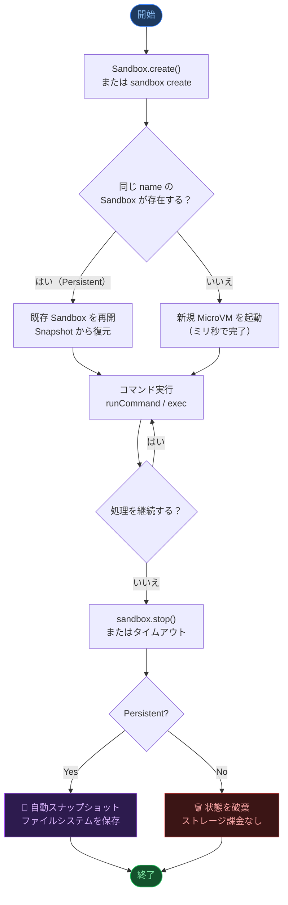

---

## 8. JS SDK 実践ガイド

### 8-1. Sandbox クラスの主要メソッド一覧

| メソッド | 用途 | 戻り値 |
|---|---|---|
| `Sandbox.create()` | 新規 Sandbox を作成 | `Promise<Sandbox>` |
| `Sandbox.get()` | 既存 Sandbox を名前で取得 | `Promise<Sandbox>` |
| `Sandbox.getOrCreate()` | あれば再開・なければ作成（推奨） | `Promise<Sandbox>` |
| `Sandbox.fork()` | 既存 Sandbox をフォーク | `Promise<Sandbox>` |
| `Sandbox.list()` | Sandbox 一覧を取得 | `Promise<Paginated>` |
| `sandbox.runCommand()` | コマンドを実行 | `Promise<CommandFinished>` |
| `sandbox.writeFiles()` | ファイルを書き込む | `Promise<void>` |
| `sandbox.readFileToBuffer()` | ファイルを読み込む | `Promise<Buffer\|null>` |
| `sandbox.domain()` | 公開 URL を取得 | `string` |
| `sandbox.stop()` | Sandbox を停止 | `Promise<...>` |
| `sandbox.update()` | 設定を更新 | `Promise<void>` |
| `sandbox.delete()` | 完全削除 | `Promise<void>` |
| `sandbox.snapshot()` | 手動スナップショット | `Promise<Snapshot>` |
| `sandbox.extendTimeout()` | タイムアウト延長 | `Promise<void>` |

### 8-2. パターン A：毎回新規作成（一時タスク向け）

```typescript
import { Sandbox } from "@vercel/sandbox";

// CI/CD のような使い捨てタスクに最適
const sandbox = await Sandbox.create({
  persistent: false,            // 停止後に状態を破棄（スナップショット課金なし）
  timeout: 15 * 60 * 1000,     // 15分
});

try {
  await sandbox.runCommand("npm", ["test"]);
} finally {
  await sandbox.stop();         // 停止（状態は破棄される）
}
```

### 8-3. パターン B：getOrCreate（長期利用・最推奨）

```typescript
import { Sandbox } from "@vercel/sandbox";

const sandbox = await Sandbox.getOrCreate({
  name: "dev-environment",
  runtime: "node24",

  // 🔴 初回作成時のみ実行（リポジトリクローン・依存関係インストール）
  onCreate: async (sbx) => {
    await sbx.runCommand("git", ["clone", "https://github.com/your/repo", "."]);
    await sbx.runCommand("npm", ["install"]);
    console.log("初回セットアップ完了！（次回から skip される）");
  },

  // 🔵 再開のたびに実行（バックグラウンドサービスの再起動等）
  onResume: async (sbx) => {
    await sbx.runCommand({
      cmd: "npm",
      args: ["run", "dev"],
      detached: true,           // バックグラウンドで実行
    });
    console.log("Dev サーバー起動！");
  },
});
```

**`getOrCreate` の動作フロー：**

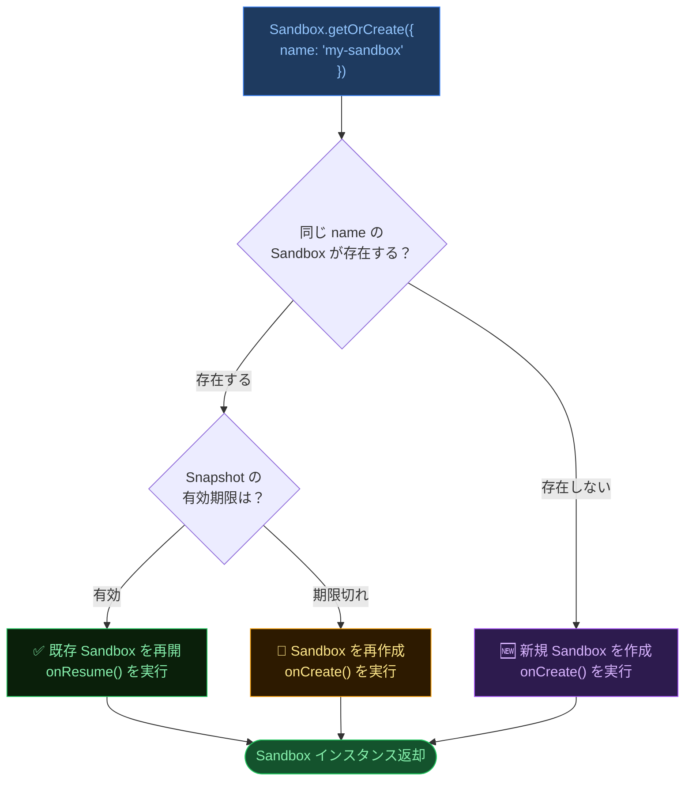

### 8-4. ファイル操作

```typescript
// ファイルの書き込み（複数ファイルをまとめて）
await sandbox.writeFiles([
  {
    path: "/vercel/sandbox/index.js",
    content: Buffer.from(`console.log("Hello World!");`),
  },
  {
    path: "/vercel/sandbox/package.json",
    content: Buffer.from(JSON.stringify({ name: "my-app", version: "1.0.0" })),
  },
  {
    path: "/vercel/sandbox/run.sh",
    content: Buffer.from("#!/bin/bash\necho 'Running!'"),
    mode: 0o755,                // 実行権限を付与（chmod +x 相当）
  },
]);

// ファイルの読み込み
const buffer = await sandbox.readFileToBuffer({
  path: "/vercel/sandbox/index.js",
});
console.log(buffer?.toString());

// ファイルをローカルにダウンロード
await sandbox.downloadFile(
  { path: "/vercel/sandbox/output.log" },
  { path: "./local-output.log" }
);
```

### 8-5. ポート公開（開発サーバーのプレビュー URL）

```typescript
const sandbox = await Sandbox.create({
  name: "web-preview",
  ports: [3000, 8080],           // 公開するポート番号（最大 15 個）
});

// Dev サーバーをバックグラウンドで起動
await sandbox.runCommand({
  cmd: "npm",
  args: ["run", "dev"],
  detached: true,
});

// 公開 URL を取得（ポート番号を指定）
const previewUrl = sandbox.domain(3000);
console.log("プレビュー URL:", previewUrl);
// 例: https://xxxxxxxx-3000.sandbox.vercel.app
```

### 8-6. サンドボックスの設定変更

```typescript
// 実行中でも設定を動的に変更できる
await sandbox.update({
  resources: { vcpus: 4 },                        // 4 vCPU（= 8 GB RAM）
  timeout: 30 * 60 * 1000,                        // タイムアウト: 30分
  persistent: true,
  snapshotExpiration: 7 * 24 * 60 * 60 * 1000,   // Snapshot 有効期限: 7日
  keepLastSnapshots: { count: 1 },                // 最新 Snapshot のみ保持
  networkPolicy: "deny-all",                      // ネット接続を遮断
  ports: [3000, 8000],
  tags: { env: "production", team: "backend" },
});
```

---

## 9. CLI 完全リファレンス

### コマンド全体マップ

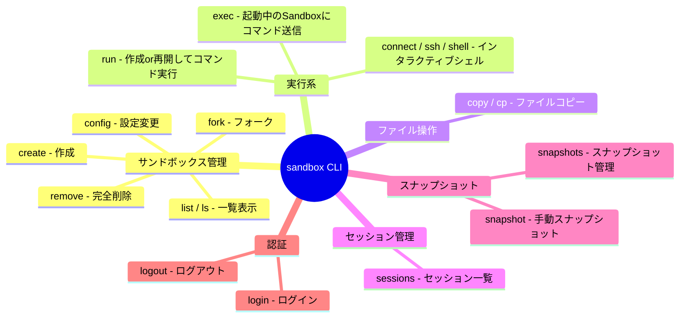

### よく使うコマンド実例

```bash
# ─── 作成 ──────────────────────────────────────────────────
# 基本（Node.js 24、デフォルト）
sandbox create --name my-sandbox

# Python ランタイムで 1 時間タイムアウト
sandbox create --runtime python3.13 --timeout 1h --name py-box

# 作成と同時にインタラクティブシェルに接続
sandbox create --name dev-box --connect

# ポートを公開して作成（Dev サーバー向け）
sandbox create --name web-app --publish-port 3000

# 非永続（一時）サンドボックス
sandbox create --name ci-task --non-persistent

# Snapshot 7日保持 + 最新1件のみ
sandbox create --name long-lived \
  --snapshot-expiration 7d \
  --keep-last-snapshots 1

# ─── コマンド実行 ───────────────────────────────────────────
# 停止中でも自動再開してからコマンドを実行
sandbox run --name my-sandbox -- npm test

# 起動中の Sandbox にコマンドを送信
sandbox exec my-sandbox -- node script.js

# sudo でコマンドを実行
sandbox exec --sudo my-sandbox -- dnf install -y curl

# 特定ディレクトリで実行
sandbox exec --workdir /app my-sandbox -- python main.py

# インタラクティブシェルに接続
sandbox connect my-sandbox

# ─── ファイル操作 ──────────────────────────────────────────
# ローカル → Sandbox
sandbox copy ./local.txt my-sandbox:/vercel/sandbox/remote.txt

# Sandbox → ローカル
sandbox copy my-sandbox:/vercel/sandbox/output.log ./logs/

# ─── 設定確認・変更 ────────────────────────────────────────
# 現在の設定を確認
sandbox config list my-sandbox

# vCPU 数を変更
sandbox config vcpus my-sandbox 4

# タイムアウトを変更
sandbox config timeout my-sandbox 30m

# タグを設定（既存タグは上書き）
sandbox config tags my-sandbox --tag env=staging --tag team=backend

# 特定 Snapshot に巻き戻し
sandbox config current-snapshot my-sandbox snap_abc123

# ─── 停止・削除 ────────────────────────────────────────────
# 停止（Persistent なら Snapshot 保存して保持）
sandbox stop my-sandbox

# 完全削除（Snapshot も全消去・不可逆）
sandbox remove my-sandbox
```

### `run` vs `exec` の違い

| コマンド | 対象 Sandbox の状態 | 動作 |
|---|---|---|
| `sandbox run` | 停止中・起動中どちらでも OK | 停止中なら **自動的に再開** してから実行 |
| `sandbox exec` | **起動中のみ** | 停止中の場合はエラー |

---

## 10. 永続的サンドボックスの詳細

### ライフサイクル全体フロー

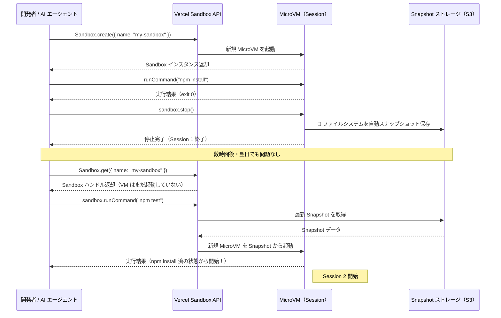

### ライフサイクルフック（`onCreate` と `onResume`）

| フック | 実行タイミング | 用途 |
|---|---|---|
| `onCreate` | Sandbox が**初回作成されたとき**のみ | 重い初期化（git clone、npm install 等） |
| `onResume` | **毎回の再開時**（自動再開も含む） | バックグラウンドサービスの再起動、キャッシュの再読み込み |

```typescript
const sandbox = await Sandbox.getOrCreate({
  name: "agent-workspace",

  // ✅ 初回のみ（重い処理はここで）
  onCreate: async (sbx) => {
    await sbx.runCommand("git", ["clone", repoUrl, "."]);
    await sbx.runCommand("npm", ["install"]);
    await sbx.runCommand("pip", ["install", "-r", "requirements.txt"]);
  },

  // ✅ 毎回の再開時（軽量な再起動）
  onResume: async (sbx) => {
    await sbx.runCommand({ cmd: "redis-server", detached: true });
    await sbx.runCommand({ cmd: "npm", args: ["run", "dev"], detached: true });
  },
});
```

---

## 11. スナップショット管理

### スナップショット作成〜保持ポリシーのフロー

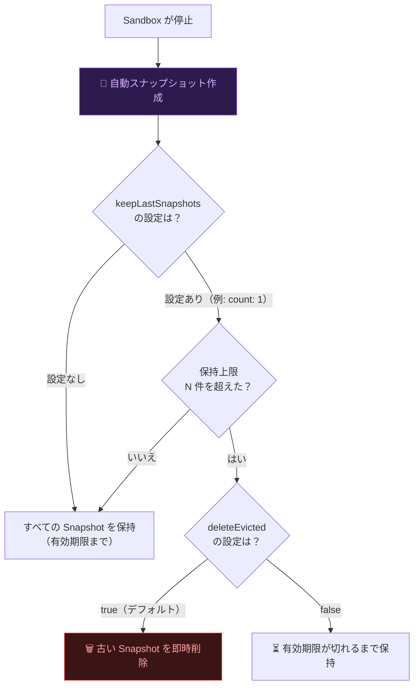

### スナップショット保持オプション

| オプション | 説明 | 推奨設定 |
|---|---|---|
| `snapshotExpiration` | Snapshot の TTL（ミリ秒） | 7日（`7 * 24 * 60 * 60 * 1000`） |
| `keepLastSnapshots.count` | 保持する Snapshot の最大件数（1〜10） | `1`（最新のみ） |
| `keepLastSnapshots.deleteEvicted` | 上限超過した古い Snapshot の処理 | `true`（即時削除） |

```typescript
// ✅ 推奨設定：最新 1 件のみ保持
const sandbox = await Sandbox.create({
  name: "my-sandbox",
  snapshotExpiration: 7 * 24 * 60 * 60 * 1000,  // 7日
  keepLastSnapshots: {
    count: 1,               // 最新 1 件のみ
    deleteEvicted: true,    // 古いものは即座に削除
  },
});
```

### スナップショット操作コマンド

```bash
# 手動でスナップショットを作成
sandbox snapshot my-sandbox

# スナップショット一覧を表示
sandbox snapshots list my-sandbox

# 特定スナップショットに巻き戻し
sandbox config current-snapshot my-sandbox snap_abc123

# 特定スナップショットから新規 Sandbox を作成
sandbox create --name forked-sandbox --snapshot snap_abc123

# 既存 Sandbox をフォーク（スナップショットを継承）
sandbox fork my-sandbox --name my-fork
```

---

## 12. ネットワークポリシー

### 3 種類のポリシー

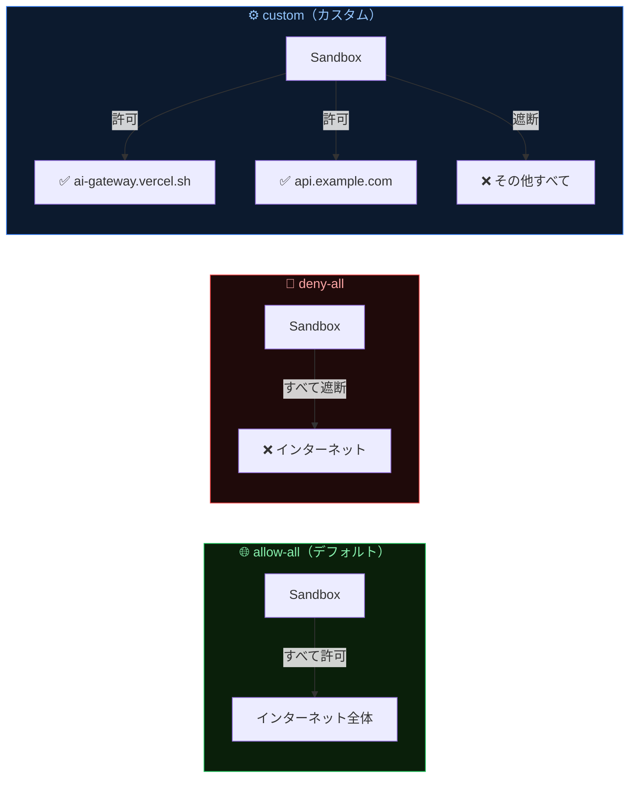

| ポリシー | 説明 | 用途 |
|---|---|---|
| `allow-all` | すべての通信を許可（**デフォルト**） | 開発・テスト |
| `deny-all` | すべての通信を遮断 | 最高セキュリティが必要な実行 |
| `custom` | ドメイン / CIDR を個別指定 | 特定 API のみ許可 |

### ネットワークポリシーの設定例

```bash
# すべて遮断（最もセキュア）
sandbox create --name secure-box --network-policy deny-all

# Vercel AI ゲートウェイのみ許可
sandbox create --name ai-box \
  --allowed-domain ai-gateway.vercel.sh

# ワイルドカードでサブドメインを許可
sandbox create --name api-box \
  --allowed-domain "*.vercel.app" \
  --allowed-domain api.example.com

# 実行後に設定変更（動的に変更可能）
sandbox config network-policy my-sandbox \
  --allowed-domain vercel.com \
  --denied-cidr 192.168.0.0/16
```

```typescript
// SDK でのカスタムポリシー
await sandbox.update({
  networkPolicy: {
    allow: ["ai-gateway.vercel.sh", "api.github.com"],
    subnets: {
      deny: ["10.0.0.0/8"],   // プライベートネットワークを遮断
    },
  },
});
```

---

## 13. タグによる管理

タグ（Tags）は Sandbox を **環境・チーム・用途** などで分類するためのキーバリューペアです（最大 5 個）。

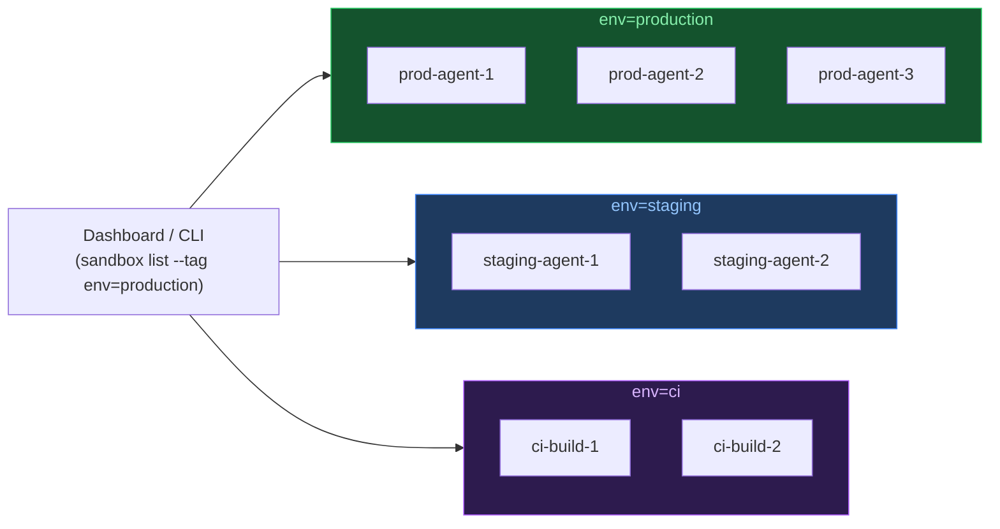

```bash
# 作成時にタグを付与
sandbox create --name prod-sandbox \
  --tag env=production \
  --tag team=backend \
  --tag version=2.0

# タグでフィルタして一覧表示
sandbox list --tag env=staging

# タグを更新（既存タグはすべて置き換え）
sandbox config tags my-sandbox \
  --tag env=production \
  --tag team=platform

# タグをすべてクリア
sandbox config tags my-sandbox
```

---

## 14. ベストプラクティス集

### ベストプラクティスの全体像

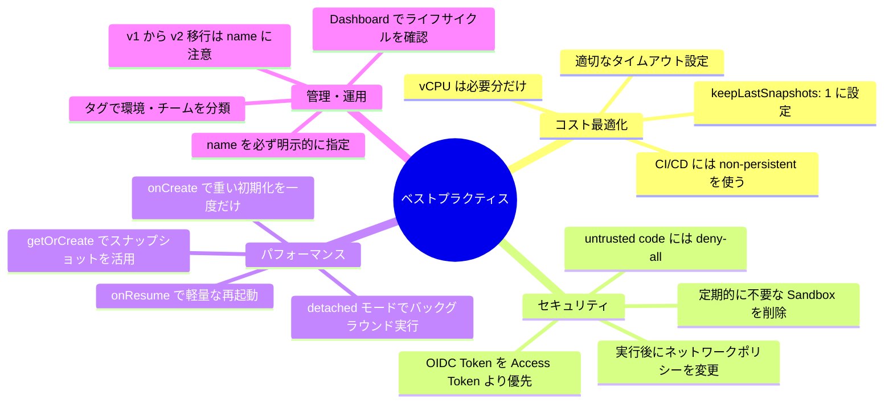

### ✅ BP-1：コスト最適化 — Snapshot は最新 1 件のみ

```typescript
// ❌ 悪い例：Snapshot が無制限に蓄積されてコスト増大
await Sandbox.create({ name: "my-sandbox" });

// ✅ 良い例：最新 1 件のみ保持してストレージコストを最小化
await Sandbox.create({
  name: "my-sandbox",
  snapshotExpiration: 7 * 24 * 60 * 60 * 1000,  // 7日
  keepLastSnapshots: {
    count: 1,
    deleteEvicted: true,
  },
});
```

### ✅ BP-2：CI/CD の使い捨てタスクは non-persistent

```typescript
// ❌ 悪い例：CI で永続モードを使うと不要な Snapshot 課金が発生
await Sandbox.create({ name: "ci-run-123" });

// ✅ 良い例：non-persistent で課金ゼロ
await Sandbox.create({
  name: "ci-run-123",
  persistent: false,          // 停止後に状態は破棄
  timeout: 15 * 60 * 1000,   // 15分
});
```

### ✅ BP-3：`getOrCreate` で冪等性を確保

```typescript
// ❌ 悪い例：毎回 create すると同名 Sandbox が既に存在した場合エラー
const sandbox = await Sandbox.create({ name: "dev" });

// ✅ 良い例：「あれば再開・なければ作成」で常に安全
const sandbox = await Sandbox.getOrCreate({ name: "dev" });
```

### ✅ BP-4：セキュリティ — 最小権限のネットワーク設定

```typescript
// ❌ 悪い例：信頼できないコードをネット全開のまま実行
await Sandbox.create({ name: "untrusted-code" });

// ✅ 良い例：deny-all から始めて必要なドメインのみ許可
await Sandbox.create({
  name: "untrusted-code",
  networkPolicy: {
    allow: ["api.example.com"],  // 許可する API のみ指定
  },
});
```

### ✅ BP-5：name は必ず明示的に指定する

```typescript
// ❌ 悪い例：name 省略（ランダム名は管理が困難）
await Sandbox.create();

// ✅ 良い例：ユーザー ID 等を含めた意味のある名前を指定
await Sandbox.create({
  name: `user-${userId}-workspace`,   // 後で識別・管理しやすい
  tags: { userId, env: "development" },
});
```

### ✅ BP-6：タイムアウトを用途に合わせて設定

| 用途 | 推奨タイムアウト | 設定例 |
|---|---|---|
| インタラクティブ開発 | 長め（1時間） | `--timeout 1h` |
| AI エージェントのタスク | 中程度（30分） | `--timeout 30m` |
| CI/CD ビルド | 短め（15分） | `--timeout 15m` |
| デフォルト | 5分 | 省略可 |

### ✅ BP-7：v1 → v2 への移行チェックリスト

| 変更点 | v1（旧） | v2（現在） |
|---|---|---|
| **識別子** | `sandboxId` (`sbx_xxx`) | `name`（ユーザー定義） |
| **取得方法** | `Sandbox.get({ sandboxId })` | `Sandbox.get({ name })` |
| **デフォルト永続性** | 非永続（要手動管理） | **永続（自動 Snapshot）** |
| **ページネーション** | `since` / `until` | `cursor` ベース |
| **停止時挙動** | コマンドは失敗 | **自動再開** |
| **ネットワーク設定** | `updateNetworkPolicy()` | `sandbox.update({ networkPolicy })` |

---

## 15. 参考ソース / 公式リンク集

### 公式ドキュメント

| リソース名 | URL |
|---|---|
| Vercel Sandbox ランディングページ | https://vercel.com/sandbox |
| Vercel Sandbox ドキュメント（概要） | https://vercel.com/docs/sandbox |
| CLI リファレンス | https://vercel.com/docs/sandbox/cli-reference |
| JS SDK リファレンス | https://vercel.com/docs/sandbox/sdk-reference |
| Python SDK リファレンス | https://vercel.com/docs/sandbox/python-sdk-reference |
| 永続的サンドボックス | https://vercel.com/docs/sandbox/concepts/persistent-sandboxes |
| スナップショット | https://vercel.com/docs/sandbox/concepts/snapshots |
| 認証設定 | https://vercel.com/docs/sandbox/concepts/authentication |
| システム仕様 | https://vercel.com/docs/sandbox/system-specifications |
| タグ | https://vercel.com/docs/sandbox/concepts/tags |
| クイックスタート | https://vercel.com/docs/sandbox/quickstart |
| 料金・プラン | https://vercel.com/docs/sandbox/pricing |

### OSS・ブログ

| リソース名 | URL |
|---|---|
| GitHub リポジトリ（CLI + SDK オープンソース） | https://github.com/vercel/sandbox |
| GA 発表ブログ（2026/01/30） | https://vercel.com/blog/vercel-sandbox-is-now-generally-available |
| Snapshot 最適化の技術ブログ | https://vercel.com/blog/optimizing-vercel-sandbox-snapshots |
| Hive インフラの詳細 | https://vercel.com/blog/a-deep-dive-into-hive-vercels-builds-infrastructure |
| Notion Workers の事例 | https://vercel.com/blog/notion-workers-vercel-sandbox |

### npm パッケージ

| パッケージ | URL |
|---|---|
| `@vercel/sandbox`（JS SDK） | https://www.npmjs.com/package/@vercel/sandbox |
| `sandbox`（CLI） | https://www.npmjs.com/package/sandbox |

---

> 📝 **Note:** 本ガイドは 2026年6月時点の公式ドキュメント・ブログ・GitHub リポジトリに基づいて作成されています。機能・料金・仕様は変更される場合があります。最新情報は必ず [Vercel 公式ドキュメント](https://vercel.com/docs/sandbox) をご確認ください。
