# xAI Grok API 実践ベストプラクティスガイド
### 中級〜上級エンジニア向け：モデル選定からエージェント運用・コスト最適化まで

> 最終更新: 2026年7月15日時点の xAI 公式ドキュメント（[docs.x.ai](https://docs.x.ai/overview)）および [grok.com](https://grok.com/) の情報をもとに作成。xAI のドキュメントは非常に高頻度で更新されるため、本番投入前に必ず各セクション末尾の参照 URL で最新情報を確認してください。

---

## この記事の対象読者

- Grok API（xAI API）をすでに触ったことがあり、`chat.completions` 止まりから一歩進んだ実装をしたいエンジニア
- Function Calling / Structured Outputs / エージェント型ツール / マルチエージェントリサーチなど、Grok 特有の機能を本番品質で使いこなしたい方
- レート制限・コスト・キャッシュ戦略まで含めて設計したいバックエンド/プラットフォームエンジニア

前提知識として OpenAI 互換 API（Chat Completions / Responses API）の基本的な使い方は既知として進めます。

---

## 目次

1. [xAI モデルラインナップとモデル選定](#1-xai-モデルラインナップとモデル選定)
2. [全体アーキテクチャを理解する](#2-全体アーキテクチャを理解する)
3. [セットアップと認証](#3-セットアップと認証)
4. [Reasoning（推論）モデルの制御](#4-reasoning推論モデルの制御)
5. [Structured Outputs で型安全な出力を得る](#5-structured-outputs-で型安全な出力を得る)
6. [Function Calling（関数呼び出し）](#6-function-calling関数呼び出し)
7. [組み込みエージェント型ツール](#7-組み込みエージェント型ツール)
8. [Realtime Multi-agent Research](#8-realtime-multi-agent-research)
9. [Prompt Caching によるコスト・レイテンシ最適化](#9-prompt-caching-によるコストレイテンシ最適化)
10. [Context Compaction による長時間会話の管理](#10-context-compaction-による長時間会話の管理)
11. [レート制限とエラーハンドリング](#11-レート制限とエラーハンドリング)
12. [コスト最適化戦略](#12-コスト最適化戦略)
13. [セキュリティと運用上の注意点](#13-セキュリティと運用上の注意点)
14. [本番導入前チェックリスト](#14-本番導入前チェックリスト)
15. [参考文献一覧](#15-参考文献一覧)

---

## 1. xAI モデルラインナップとモデル選定

### 1.1 現行モデル体系

2026年7月時点で、コード生成・チャット・汎用タスクの旗艦モデルは **`grok-4.5`** です。xAI は「画像・動画・音声には専用モデル、それ以外はすべて Grok 4.5」という方針を明示しています。

| 用途 | 推奨モデル |
|---|---|
| コード生成 | `grok-4.5` |
| チャット・汎用対話 | `grok-4.5` |
| 画像生成 | Grok Imagine API（`grok-imagine-image` / `grok-imagine-image-quality`） |
| 動画生成 | Grok Imagine API（`grok-imagine-video` / `grok-imagine-video-1.5`） |
| 音声 | Grok Voice API |
| マルチエージェント・ディープリサーチ | `grok-4.20-multi-agent`（ベータ） |

出典: [Models | xAI Docs](https://docs.x.ai/developers/models)

### 1.2 モデル比較表（2026年7月時点）

| モデル | コンテキスト長 | Input（$/1M tok） | Cached Input（$/1M tok） | Output（$/1M tok） | 特記事項 |
|---|---|---|---|---|---|
| `grok-4.5` | 500k | $2.00 | $0.50 | $6.00 | 旗艦モデル。`reasoning_effort` 対応、知識カットオフ 2026年2月1日 |
| `grok-4.3` | 1M | $1.25 | $0.20 | $2.50 | 長文脈・低コスト志向 |
| `grok-4.20-multi-agent-0309` | 1M | $1.25 | $0.20 | $2.50 | マルチエージェント専用（ベータ） |
| `grok-4.20-0309-reasoning` | 1M | $1.25 | $0.20 | $2.50 | 旧世代 reasoning |
| `grok-4.20-0309-non-reasoning` | 1M | $1.25 | $0.20 | $2.50 | 旧世代 non-reasoning |
| `grok-build-0.1`（コード専用） | 256k | $1.00 | $0.20 | $2.00 | Grok Build（エージェント型コーディング）向け |

出典: [Pricing | xAI Docs](https://docs.x.ai/developers/pricing), [Models | xAI Docs](https://docs.x.ai/developers/models)

> **ベストプラクティス**: 迷ったら `grok-4.5`（エイリアス）を使う。`grok-4.5-latest` は最新版に自動追従、`grok-4.5-<日付>` は特定バージョン固定用。本番環境で挙動の一貫性を優先するなら日付固定版、最新機能を優先するなら `-latest` を使い分けます。

### 1.3 モデル選定フローチャート

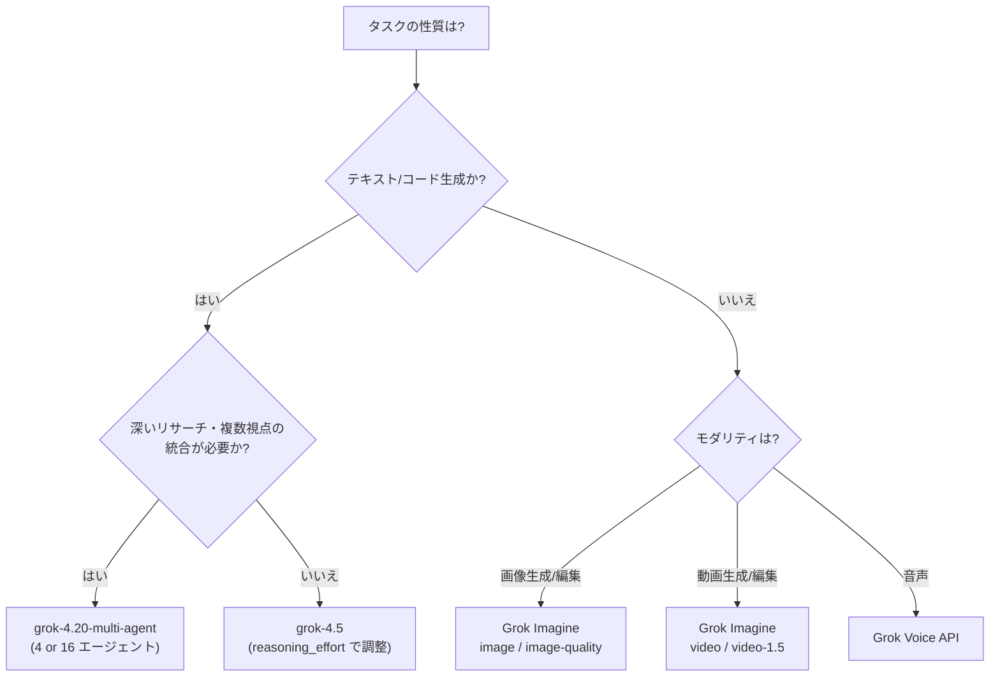

### 1.4 重要な仕様上の注意点

- **リアルタイム情報へのアクセス不可**: Grok は学習データ以降のイベントを知らないため、最新情報が必要な場合は必ず Web Search / X Search ツールを有効化する必要があります。
- **`logprobs` / `top_logprobs` 非対応**: `grok-4.20` 以降のモデルではこれらのフィールドは無視されます（エラーにはならず黙って無視される点に注意）。
- **画像入力**: 最大 20 MiB / 枚、`jpg`・`png` のみ対応、枚数上限なし。
- **`presencePenalty` / `frequencyPenalty` / `stop`** は reasoning モデルでは使用不可（エラーになります）。

出典: [Models | xAI Docs](https://docs.x.ai/developers/models), [Reasoning | xAI Docs](https://docs.x.ai/developers/model-capabilities/text/reasoning)

---

## 2. 全体アーキテクチャを理解する

xAI API は OpenAI 互換の **Responses API**（`/v1/responses`）を主軸としつつ、xAI ネイティブの Python/gRPC SDK（`xai-sdk`）も提供しています。レガシーな Chat Completions（`/v1/chat/completions`）も引き続き利用可能ですが、新規実装では Responses API が推奨です。

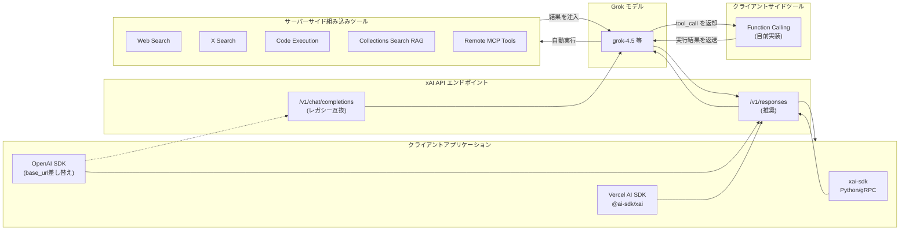

**ポイント**: サーバーサイドツール（Web Search・X Search・Code Execution・Remote MCP）は xAI 側で自動実行され応答に組み込まれますが、Function Calling（クライアントサイドツール）は必ず一度ターンが「一時停止」し、開発者側で実行して結果を返す必要があります。この二つを混在させる際の制御フローの違いを理解することが、エージェント設計の第一歩です。

出典: [Overview | xAI Docs](https://docs.x.ai/overview), [Function Calling | xAI Docs](https://docs.x.ai/developers/tools/function-calling), [Tools Overview | xAI Docs](https://docs.x.ai/developers/tools/overview)

---

## 3. セットアップと認証

### 3.1 手順

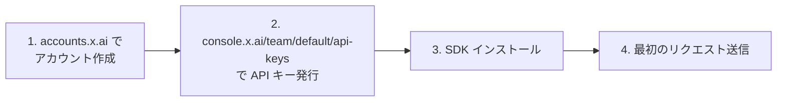

### 3.2 環境変数の設定

```bash
export XAI_API_KEY="your_api_key"
```

### 3.3 SDK インストール

```bash
# xAI ネイティブ SDK（Python）
pip install xai-sdk

# OpenAI SDK 経由（base_url を差し替えるだけで利用可能）
pip install openai

# Vercel AI SDK（TypeScript/JavaScript）
npm install ai @ai-sdk/xai zod

# OpenAI SDK（Node.js）
npm install openai
```

### 3.4 最小リクエスト例（Responses API）

```bash
curl https://api.x.ai/v1/responses \
  -H "Authorization: Bearer $XAI_API_KEY" \
  -H "Content-Type: application/json" \
  -d '{
    "model": "grok-4.5",
    "input": "Fix this function and explain the bug: function median(a){a.sort();return a[a.length/2]}"
  }'
```

```python
import os
from xai_sdk import Client
from xai_sdk.chat import user

client = Client(api_key=os.getenv("XAI_API_KEY"))
chat = client.chat.create(model="grok-4.5")
chat.append(user("Fix this function and explain the bug: function median(a){a.sort();return a[a.length/2]}"))

print(chat.sample().content)
```

出典: [Quickstart | xAI Docs](https://docs.x.ai/developers/quickstart)

---

## 4. Reasoning（推論）モデルの制御

### 4.1 `reasoning_effort` パラメータ

`grok-4.5` は `reasoning_effort` パラメータで思考の深さを制御できます。**指定しない場合はデフォルトで `"high"` になり、reasoning 自体を無効化することはできません**（これは他社の reasoning モデルとの大きな違いです）。

| 設定値 | 説明 | 向いている用途 |
|---|---|---|
| `"low"` | 一部の reasoning トークンのみ使用。高速 | レイテンシ重視のエージェント処理、単純なツール呼び出し |
| `"medium"` | ある程度の思考時間を許容 | 複雑なデータ分析、長文脈の推論 |
| `"high"`（デフォルト） | 最大限の思考トークンを使用 | 難解な数学・多段階ロジック・競技プログラミング級のタスク |

出典: [Reasoning | xAI Docs](https://docs.x.ai/developers/model-capabilities/text/reasoning)

### 4.2 設定フローチャート

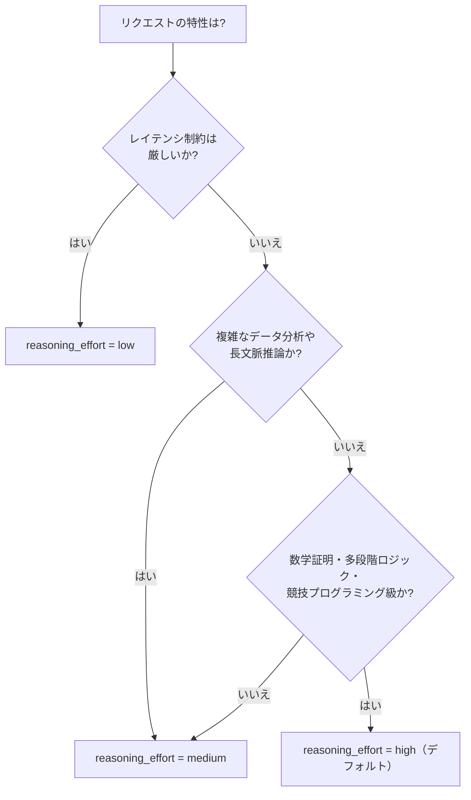

### 4.3 実装例

```python
import os
from xai_sdk import Client
from xai_sdk.chat import system, user

client = Client(api_key=os.getenv("XAI_API_KEY"), timeout=3600)  # reasoning は長時間化しうるためタイムアウトを延長

chat = client.chat.create(
    model="grok-4.5",
    reasoning_effort="high",
    messages=[system("You are a highly intelligent AI assistant.")],
)
chat.append(user("Find all prime numbers p such that p^2 + 2 is also prime. Prove your answer."))

response = chat.sample()
print(response.content)
```

> **注意**: reasoning モデルでは `presencePenalty` / `frequencyPenalty` / `stop` を指定するとエラーになります。また reasoning トークンは通常のトークンと同様に課金対象です。

### 4.4 Encrypted Reasoning Content（推論内容の暗号化保持）

マルチターン会話で前回ターンの推論内容をモデルに引き継がせたい場合は、`include: ["reasoning.encrypted_content"]` を指定します。Vercel AI SDK では `store: false` を指定しない限り自動的に有効化されます。

### 4.5 Summarized Reasoning（要約された推論のストリーミング）

`grok-4.5` はモデル内部の思考過程の要約を `reasoning_content`（xAI SDK）または `response.reasoning_text.delta` / `response.reasoning_summary_text.delta`（Responses API）としてストリーミングで取得できます。デバッグやユーザー向け「thinking…」表示に活用できます。

```python
for response, chunk in chat.stream():
    if chunk.reasoning_content:
        print(chunk.reasoning_content, end="", flush=True)
```

### 4.6 マルチエージェントモデルにおける意味の違い

`grok-4.20-multi-agent` では `reasoning.effort` は「思考の深さ」ではなく **「何体のエージェントが協調するか」** を制御します（詳細は第8章）。

| モデル | `reasoning` パラメータ | 挙動 |
|---|---|---|
| `grok-4.5` | `"low"` / `"medium"` / `"high"`（デフォルト） | 推論の深さを制御（無効化不可） |
| `grok-4.20-multi-agent` | `"low"` / `"medium"` / `"high"` / `"xhigh"` | エージェント数を制御（4体 or 16体） |

出典: [Reasoning | xAI Docs](https://docs.x.ai/developers/model-capabilities/text/reasoning)

---

## 5. Structured Outputs で型安全な出力を得る

### 5.1 2つのアプローチ

1. **`response_format` パラメータ**: `type: "json_schema"` を指定し、Pydantic（Python）や Zod（TypeScript）で定義したスキーマに準拠した JSON を「保証」して取得。
2. **Tool Calling 経由**: ツール定義を行うと、xAI モデルは常に厳密にスキーマに準拠した引数を生成します（`strict` フラグは暗黙的に常に `true`）。

出典: [Structured Outputs | xAI Docs](https://docs.x.ai/developers/model-capabilities/text/structured-outputs)

### 5.2 サポートされる JSON Schema の範囲

Draft 2020-12 を主対象とし、Draft-07 も受け付けます。

| カテゴリ | 対応内容 |
|---|---|
| 基本型 | `string` / `number` / `integer` / `boolean` / `null` / `enum` / `const` / `array` / `object` |
| 結合 | `anyOf`（`oneOf` は `anyOf` と同一挙動）/ `allOf`（単一サブスキーマのみ完全保証） |
| 参照 | `$ref` / `$defs`（循環参照不可） |
| 文字列フォーマット（強制） | `date` / `time` / `date-time` / `email` / `uuid` / `ipv4` / `ipv6` / `uri` |

### 5.3 制約の上限（保証される範囲）

| キーワード | 保証される上限 |
|---|---|
| `minimum` / `maximum` / `exclusiveMinimum` / `exclusiveMaximum` | 上限なし |
| `minLength` / `maxLength` | 2,048 |
| `minItems` / `maxItems` | 256 |
| `minProperties` / `maxProperties` | 64 |

> **ベストプラクティス**: `not` / `if-then-else` / 複数の `allOf` / 未サポートの `format` は「ベストエフォート」扱いで保証されません。厳密な準拠が必要な場合はアプリケーション側でも検証してください。また `additionalProperties` はデフォルト `false` のため、意図的に許可したい場合は明示的に `true` を指定する必要があります。

### 5.4 却下されるスキーマ（400 エラー）

- `enum` / `anyOf` の variant が 0 個
- プロパティのスキーマが `true` または `false`
- `maxContains` / `minContains`
- `items` を配列として指定（タプル検証には `prefixItems` を使用）

### 5.5 正規表現（`pattern`）サポート範囲

ECMAScript 正規表現の実用的なサブセットに対応。**未対応**: 後方参照、Unicode プロパティエスケープ（`\p{L}`）、単語境界（`\b`）、先読み/後読み、インライン修飾子。また `^` `$` は暗黙的に付与される（パターンは常に文字列全体にマッチ）点に注意してください。

### 5.6 実装例：請求書のパース

```python
from datetime import date
from enum import Enum
from pydantic import BaseModel, Field
from xai_sdk import Client
from xai_sdk.chat import system, user

class Currency(str, Enum):
    USD = "USD"; EUR = "EUR"; GBP = "GBP"

class LineItem(BaseModel):
    description: str
    quantity: int = Field(ge=1)
    unit_price: float = Field(ge=0)

class Invoice(BaseModel):
    vendor_name: str
    invoice_number: str
    invoice_date: date
    line_items: list[LineItem]
    total_amount: float = Field(ge=0)
    currency: Currency

client = Client(api_key="...")
chat = client.chat.create(model="grok-4.5")
chat.append(system("Given a raw invoice, extract the invoice data into JSON format."))
chat.append(user("Vendor: Acme Corp ... Total: $80.00 USD"))

response, invoice = chat.parse(Invoice)
print(invoice.vendor_name, invoice.total_amount, invoice.currency)
```

### 5.7 Structured Outputs × ツール呼び出しの組み合わせ

`grok-4` ファミリーの対応モデルでは、**Web Search 等のエージェント型ツールでリサーチを行い、その結果を型安全な JSON として返す**ことが可能です。

```python
from pydantic import BaseModel, Field
from xai_sdk.tools import web_search

class ProofInfo(BaseModel):
    name: str
    authors: str
    year: str
    summary: str

chat = client.chat.create(model="grok-4.5", tools=[web_search()])
chat.append(user("Find the latest machine-checked proof of the four color theorem."))
response, proof = chat.parse(ProofInfo)
```

出典: [Structured Outputs | xAI Docs](https://docs.x.ai/developers/model-capabilities/text/structured-outputs)

---

## 6. Function Calling（関数呼び出し）

### 6.1 全体フロー

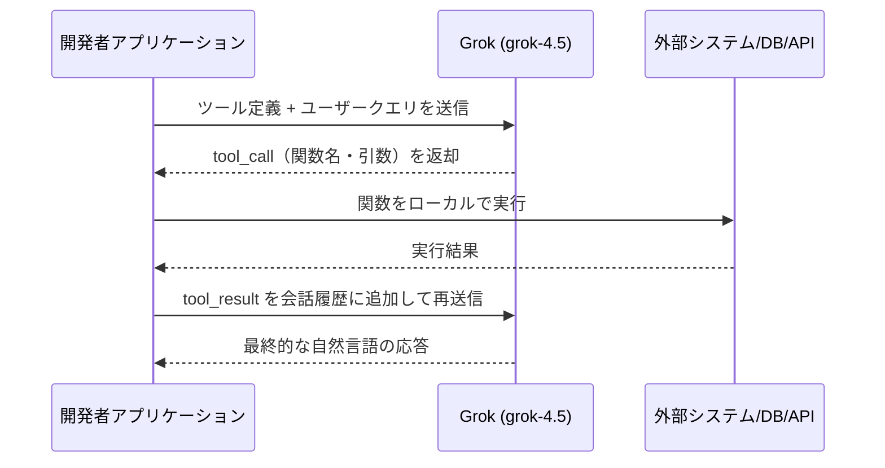

### 6.2 基本実装（xAI SDK）

```python
import os, json
from xai_sdk import Client
from xai_sdk.chat import user, tool, tool_result

client = Client(api_key=os.getenv("XAI_API_KEY"))

tools = [
    tool(
        name="get_temperature",
        description="Get current temperature for a location",
        parameters={
            "type": "object",
            "properties": {
                "location": {"type": "string", "description": "City name"},
                "unit": {"type": "string", "enum": ["celsius", "fahrenheit"], "default": "fahrenheit"}
            },
            "required": ["location"]
        },
    ),
]

chat = client.chat.create(model="grok-4.5", tools=tools)
chat.append(user("What is the temperature in San Francisco?"))
response = chat.sample()

if response.tool_calls:
    chat.append(response)
    for tc in response.tool_calls:
        args = json.loads(tc.function.arguments)
        result = {"location": args["location"], "temperature": 59, "unit": args.get("unit", "fahrenheit")}
        chat.append(tool_result(json.dumps(result)))
    response = chat.sample()

print(response.content)
```

### 6.3 Pydantic によるスキーマ定義（型安全性の担保）

```python
from typing import Literal
from pydantic import BaseModel, Field
from xai_sdk.chat import tool

class TemperatureRequest(BaseModel):
    location: str = Field(description="City and state, e.g. San Francisco, CA")
    unit: Literal["celsius", "fahrenheit"] = Field("fahrenheit")

tools = [
    tool(
        name="get_temperature",
        description="Get current temperature for a location",
        parameters=TemperatureRequest.model_json_schema(),
    ),
]
```

### 6.4 Tool Choice（ツール使用の制御）

| 値 | 挙動 |
|---|---|
| `"auto"`（デフォルト） | モデルがツールを使うか自律的に判断 |
| `"required"` | 必ず1つ以上のツールを呼び出す |
| `"none"` | ツール呼び出しを無効化 |
| `{"type": "function", "function": {"name": "..."}}` | 特定のツールを強制的に呼び出す |

### 6.5 並列関数呼び出し

デフォルトで有効。1回の応答で複数の `tool_call` が返る場合があるため、**すべて処理してから**次のターンに進む必要があります。無効化する場合は `parallel_tool_calls: false` を指定します。

### 6.6 ツールスキーマの制約

| 項目 | 必須 | 説明 |
|---|---|---|
| `name` | ✅ | 一意な識別子（1リクエストあたり最大200ツール） |
| `description` | ✅ | モデルがいつ使うべきかを判断する材料になる |
| `parameters` | ✅ | JSON Schema。**ルートは必ず `object`**（または `object` のみからなる `oneOf`/`anyOf`）でなければならず、スカラーや配列をルートにすると `400` エラーになる |

### 6.7 組み込みツールとの併用

Function Calling は Web Search・X Search などのサーバーサイドツールと共存できます。**サーバーサイドツールは自動実行、カスタムツールは実行が一時停止して開発者に制御が戻る**という違いを必ず意識してください。

```python
from xai_sdk.tools import web_search, x_search
from xai_sdk.chat import tool

tools = [
    web_search(),   # サーバーサイドで自動実行
    x_search(),     # サーバーサイドで自動実行
    tool(           # クライアントサイド：開発者が実行
        name="save_to_database",
        description="Save research results to the database",
        parameters={"type": "object", "properties": {"data": {"type": "string"}}, "required": ["data"]},
    ),
]
```

出典: [Function Calling | xAI Docs](https://docs.x.ai/developers/tools/function-calling), [Advanced Usage | xAI Docs](https://docs.x.ai/docs/guides/tools/advanced-usage)

---

## 7. 組み込みエージェント型ツール

xAI API は4種類の代表的なサーバーサイドツールを提供します。いずれも `tools` 配列に追加するだけで、xAI 側が自律的に呼び出しループを実行します。

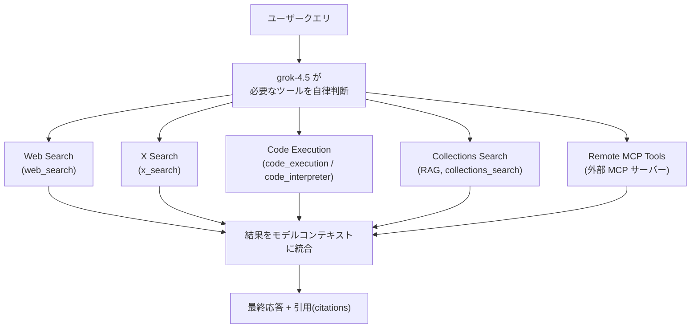

### 7.1 Web Search

リアルタイムでウェブ検索・ページ閲覧を行い、最新情報を回答に統合します。

| パラメータ | 説明 |
|---|---|
| `allowed_domains` | 検索対象を特定ドメインに限定（最大5件、`excluded_domains` と併用不可） |
| `excluded_domains` | 特定ドメインを検索対象から除外（最大5件） |
| `enable_image_understanding` | 閲覧中に見つけた画像を解析可能にする（`view_image` ツールが有効化される） |
| `enable_image_search` | 画像検索結果を Markdown 画像埋め込み（``）として応答に含める |

```python
from xai_sdk.tools import web_search

chat = client.chat.create(
    model="grok-4.5",
    tools=[web_search(allowed_domains=["example.com"])],
)
```

> `enable_image_understanding` を Web Search で有効にすると、リクエストに X Search も含まれている場合は X Search 側の画像理解も同時に有効化されます。

出典: [Web Search | xAI Docs](https://docs.x.ai/developers/tools/web-search)

### 7.2 X Search

X（旧 Twitter）上のキーワード検索・セマンティック検索・ユーザー検索・スレッド取得を行います。リアルタイムの世論・トレンド分析に有用です。

```python
from xai_sdk.tools import x_search

chat = client.chat.create(model="grok-4.5", tools=[x_search()])
chat.append(user("What are people saying about xAI on X?"))
```

> Web Search と X Search は同時に有効化でき、モデルが状況に応じてどちらを使うか（あるいは両方使うか）を自律的に判断します。旧来の `search_parameters` を使う Live Search API は 2026年1月12日に廃止済みのため、Responses API の `tools` パラメータへの移行が必須です。

出典: [X Search | xAI Docs](https://docs.x.ai/developers/tools/x-search), [Tools Overview | xAI Docs](https://docs.x.ai/docs/guides/tools/overview)

### 7.3 Code Execution

サンドボックス化された Python 環境でコードを実行し、正確な数値計算・データ分析・統計処理・シミュレーションを行います。

**主要ユースケース**:
- 金融モデリング（複利計算、シャープレシオ、オプション価格）
- 統計分析（t検定、回帰分析、確率分布）
- 科学計算（微分方程式の数値解法）

```python
from xai_sdk.tools import code_execution

chat = client.chat.create(model="grok-4.3", tools=[code_execution()])
chat.append(user("Calculate the compound interest for $10,000 at 5% annually for 10 years"))
```

**ベストプラクティス**:
1. 曖昧な指示（「このデータを分析して」）ではなく、「相関行列を計算し 0.7 以上の相関をハイライトして」のように具体的に指示する。
2. データフォーマットと制約を明示する。
3. 数値計算では `temperature` を低め（0.0〜0.3）に設定する。

**制約**: 実行環境はネットワーク・外部ファイルシステムへのアクセス不可、リクエスト間で状態は保持されない（ステートレス）、NumPy/Pandas/Matplotlib/SciPy 等の主要ライブラリのみ利用可能。

出典: [Code Execution Tool | xAI Docs](https://docs.x.ai/developers/tools/code-execution)

### 7.4 Remote MCP Tools（Model Context Protocol）

外部の MCP サーバーに接続し、サードパーティ製・自社製のカスタムツール群を Grok に与えることができます。xAI 側が接続・実行を代行します。

| パラメータ | 必須 | 説明 |
|---|---|---|
| `server_url` | ✅ | MCP サーバーの URL（Streaming HTTP / SSE のみ対応） |
| `server_label` | ✅ | サーバーを識別するラベル（ツール呼び出しのプレフィックスに使用） |
| `server_description` | — | サーバーの説明（複数サーバー使用時にモデルの判断材料になる） |
| `allowed_tools`（xAI SDK: `allowed_tool_names`） | — | 許可する特定ツール名のリスト（省略時は全ツール許可） |
| `authorization` | — | MCP サーバーへのリクエストに付与するトークン |
| `headers`（xAI SDK: `extra_headers`） | — | 追加ヘッダー |

```python
from xai_sdk.tools import mcp

chat = client.chat.create(
    model="grok-4.3",
    tools=[
        mcp(server_url="https://mcp.deepwiki.com/mcp", server_label="deepwiki"),
        mcp(
            server_url="https://your-custom-tools.com/mcp",
            server_label="custom",
            allowed_tool_names=["search_database", "format_data"],  # 読み取り専用に限定するなど
        ),
    ],
)
```

**ベストプラクティス**:
- `allowed_tools` で必要最小限のツールに絞り、コンテキスト消費とリスク（意図しない書き込み操作など）を抑える。
- 複数の MCP サーバーを使う場合は `server_label` / `server_description` を明確に設定する。
- 常に HTTPS + 適切な認証を使用する。

なお xAI 自身も **Docs MCP**（`https://docs.x.ai/api/mcp`）を公開しており、Cursor / Zed / Windsurf / OpenCode などのエディタから直接 xAI ドキュメントを参照できます。

出典: [Remote MCP Tools | xAI Docs](https://docs.x.ai/developers/tools/remote-mcp), [Docs MCP | xAI Docs](https://docs.x.ai/developers/docs-mcp)

### 7.5 ツール課金体系（概要）

| ツール | 呼び出し単価 |
|---|---|
| Web Search | $5 / 1,000 回 |
| X Search | $5 / 1,000 回 |
| Code Execution | $5 / 1,000 回 |
| File Attachments 検索 | $10 / 1,000 回 |
| Collections Search（RAG） | $2.50 / 1,000 回 |
| Image / X Video Understanding | トークン課金 |
| Remote MCP Tools | 呼び出し自体は無料、トークンのみ課金 |

詳細は第12章で解説します。出典: [Pricing | xAI Docs](https://docs.x.ai/developers/pricing)

---

## 8. Realtime Multi-agent Research

### 8.1 概要（ベータ機能）

`grok-4.20-multi-agent` は、複数の AI エージェントがリアルタイムに協調してディープリサーチを行う機能です。各エージェントが検索・分析・統合など役割を分担し、**リーダーエージェント**が議論を統合して最終回答を生成します。

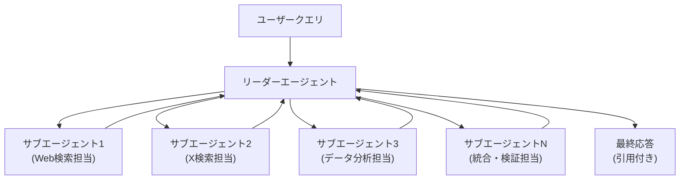

**重要な制約**:
- ユーザーに返るのは **リーダーエージェントのツール呼び出しと最終回答のみ**。サブエージェントの中間状態は暗号化され、`use_encrypted_content=True` 指定時のみマルチターン用に保持されます。
- **クライアントサイドのカスタムツール（Function Calling）は非対応**。Web Search / X Search などの組み込みツールと Remote MCP のみ利用可能。
- **Chat Completions API 非対応**。xAI SDK か Responses API を使用すること。
- **`max_tokens` 非対応**。

出典: [Multi Agent | xAI Docs](https://docs.x.ai/developers/model-capabilities/text/multi-agent)

### 8.2 エージェント数の制御

| SDK/API | パラメータ | 4エージェント | 16エージェント |
|---|---|---|---|
| xAI SDK | `agent_count` | `4` | `16` |
| OpenAI SDK / REST | `reasoning.effort` | `"low"` / `"medium"` | `"high"` / `"xhigh"` |
| Vercel AI SDK | `reasoningEffort` | `"low"` / `"medium"` | `"high"` / `"xhigh"` |

```python
from xai_sdk import Client
from xai_sdk.chat import user

client = Client(api_key="...")
chat = client.chat.create(model="grok-4.20-multi-agent", agent_count=4)
chat.append(user("What are the key differences between TCP and UDP?"))
```

**使い分け**: 4エージェント＝素早く焦点を絞ったリサーチ、16エージェント＝深い多角的分析（トークン消費・レイテンシは大幅増）。

### 8.3 プロンプト設計のベストプラクティス

| パターン | ❌ 避けるべき例 | ✅ 推奨される例 |
|---|---|---|
| 範囲と深さを明示する | "Tell me about electric vehicles." | "Compare the top 3 EV manufacturers by battery technology, range, charging infrastructure, and 2025 sales projections." |
| 構造化出力を要求する | — | "Present your findings as a comparison table with categories: scalability, complexity, deployment, team size." |
| ソースや観点を指定する | — | "Cite recent academic papers and industry reports from 2024-2025." |
| 複雑な調査は会話で分割する | 1発の巨大プロンプトに全部詰め込む | Turn 1 で概観 → Turn 2 で深掘り → Turn 3 で個別課題を掘り下げる |
| 前提条件（コンテキスト）を与える | — | "I'm building a fintech app targeting Southeast Asia. Research the regulatory requirements in Singapore, Indonesia, and the Philippines." |

出典: [Multi Agent | xAI Docs](https://docs.x.ai/developers/model-capabilities/text/multi-agent)

### 8.4 課金の考え方

リーダーエージェントとサブエージェント**双方**のトークン（input/output/reasoning）が課金対象になります。並列に動く複数エージェントがそれぞれツールを呼び出し得るため、単一エージェント方式に比べてトークン消費・ツール呼び出し回数が大幅に増える可能性があります。`usage` と `server_side_tool_usage` を必ずモニタリングしてください。

---

## 9. Prompt Caching によるコスト・レイテンシ最適化

### 9.1 動作原理

xAI API はプロンプトキャッシュを**自動的に**行います。リクエストが届くと、メッセージ配列の先頭からどこまで前回のリクエストと一致するかをチェックし、一致した「プレフィックス」部分をキャッシュから再利用します。

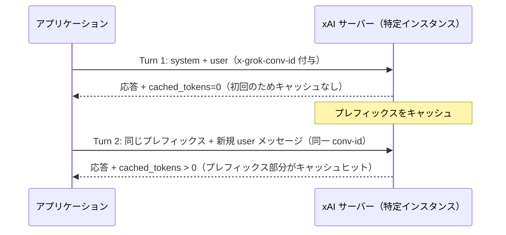

### 9.2 キャッシュヒット率を最大化する

| 手法 | 説明 |
|---|---|
| `x-grok-conv-id` ヘッダー（Chat Completions） | 同一会話 ID のリクエストを同一サーバーにルーティングし、キャッシュ再利用率を高める |
| `prompt_cache_key`（Responses API） | `x-grok-conv-id` と同等の効果。安定した UUID やセッション ID を使う |
| 先頭メッセージを変更しない | 既存メッセージの編集・削除・並べ替えは即座にキャッシュを破棄させる。**新規メッセージは必ず末尾に追記** |
| 静的コンテンツを前方に配置する | システムプロンプト・Few-shot例・参照ドキュメントは会話の先頭に置き、安定したプレフィックスを形成する |

```bash
curl https://api.x.ai/v1/chat/completions \
  -H "Content-Type: application/json" \
  -H "Authorization: Bearer $XAI_API_KEY" \
  -H "x-grok-conv-id: conv_abc123" \
  -d '{
    "model": "grok-4.5",
    "messages": [
      {"role": "system", "content": "You are Grok, a helpful and truthful AI assistant built by xAI."},
      {"role": "user", "content": "What is prompt caching?"}
    ]
  }'
```

```python
response = client.responses.create(
    model="grok-4.5",
    input="What is prompt caching?",
    extra_body={"prompt_cache_key": "b79ad29b-b3f9-463c-bca6-041d5058d366"},
)
print(f"Cached tokens: {response.usage.input_tokens_details.cached_tokens}")
```

### 9.3 何がキャッシュを壊すか

- 過去のメッセージ内容の編集・削除・並べ替え（**新規メッセージの追記のみ**が安全）
- 異なる `x-grok-conv-id`（または未指定）による別サーバーへのルーティング

### 9.4 課金と可観測性

キャッシュされたトークンは通常より低い単価で課金されます（モデルにより単価が異なる。第12章参照）。`cached_tokens` が常に `0` の場合は、会話 ID の設定漏れやメッセージ改変を疑ってください。

```json
{
  "usage": {
    "prompt_tokens": 125,
    "completion_tokens": 48,
    "prompt_tokens_details": { "cached_tokens": 98 }
  }
}
```

### 9.5 FAQ（要点）

- キャッシュは出力内容に影響しない（プロンプト処理フェーズの高速化のみ）。
- キャッシュエントリはサーバー負荷等でいつでも破棄され得る。100%保証ではない。
- ストリーミング・非ストリーミング両方で機能する。
- ツール呼び出し結果を含むメッセージまでがキャッシュ可能プレフィックスに含まれる。

出典: [Prompt Caching | xAI Docs](https://docs.x.ai/developers/advanced-api-usage/prompt-caching), [How It Works](https://docs.x.ai/developers/advanced-api-usage/prompt-caching/how-it-works), [Maximizing Cache Hits](https://docs.x.ai/developers/advanced-api-usage/prompt-caching/maximizing-cache-hits), [What Breaks Caching](https://docs.x.ai/developers/advanced-api-usage/prompt-caching/multi-turn), [Best Practices & FAQ](https://docs.x.ai/developers/advanced-api-usage/prompt-caching/best-practices), [Usage & Pricing](https://docs.x.ai/developers/advanced-api-usage/prompt-caching/usage-and-pricing)

---

## 10. Context Compaction による長時間会話の管理

### 10.1 課題と解決策

会話が数千トークンを超えて成長すると、フォローアップのたびに全メッセージを再送信し続けることになり、入力コストとレイテンシが増大します。**Context Compaction** は、会話を「システムプロンプト・添付ファイル・過去の推論・要約された会話記録」を保持したまま、**単一の不透明（opaque）なアイテム**に圧縮する機能です。

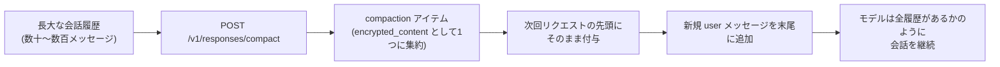

### 10.2 いつ圧縮すべきか

以下の**すべて**が真の場合に圧縮を検討します。

- 各呼び出しの `input_tokens` がコスト・レイテンシを圧迫している
- それでも過去のターンをモデルに覚えていてほしい（そうでなければ単に新規会話を始めればよい）
- 現在の会話がまだモデルのコンテキスト上限に収まっている（**圧縮は「縮小」であり、すでに上限超過したリクエストを救済することはできない**）

### 10.3 実装例

```python
import os
from xai_sdk import Client
from xai_sdk.chat import system, user

client = Client(api_key=os.environ["XAI_API_KEY"])

# use_encrypted_content=True は reasoning モデルで推論内容を保持するために推奨
chat = client.chat.create(model="grok-4.3", use_encrypted_content=True)
chat.append(system("You are a helpful assistant. Keep answers brief."))

compact_every = 5
for turn in range(1, 100):
    chat.append(user(input("You: ")))
    response = chat.sample()
    chat.append(response)

    if turn % compact_every == 0:
        before = len(chat.messages)
        compact = chat.compact()  # in-place で圧縮
        print(f"[compacted {before} -> {len(chat.messages)} messages | "
              f"dropped {compact.dropped_message_count} | tokens: {compact.usage.total_tokens}]")
```

### 10.4 制約と注意点

- 1リクエストにつき圧縮は1パスのみ。
- `encrypted_content` は**不透明**として扱い、パース・編集・手動マージをしてはならない。常に `output` 配列全体をそのまま次のリクエストに渡す。
- 圧縮済み会話を**再度圧縮すること自体は問題ない**（会話がさらに伸びた場合など）。
- 圧縮呼び出し自体もトークンを消費するため、頻繁に行う場合は軽量・高速なモデルの使用を検討する。

出典: [Context Compaction | xAI Docs](https://docs.x.ai/developers/advanced-api-usage/context-compaction)

---

## 11. レート制限とエラーハンドリング

### 11.1 レート制限の仕組み

各チームは **RPS（Requests Per Second）** と **TPM（Tokens Per Minute）** の2軸でモデルごとの上限を持ちます。上限は 2026年1月1日以降の累積課金額に基づく「Tier」によって段階的に引き上げられ、一度到達した Tier は永続的に維持されます（降格なし）。

| Tier | 累積課金額の閾値 |
|---|---|
| Tier 0 | $0（デフォルト） |
| Tier 1 | $50 |
| Tier 2 | $250 |
| Tier 3 | $1,000 |
| Tier 4 | $5,000 |
| Enterprise | 個別相談 |

### 11.2 `grok-4.5` のレート制限例（Tier別）

| Tier | RPS | TPM |
|---|---|---|
| T0 | 150 | 50M |
| T1 | 172 | 53M |
| T2 | 208 | 60M |
| T3 | 312 | 74M |
| T4 | 500 | 100M |

> TPM にはプロンプトトークン・出力トークン・**推論トークン**・**キャッシュされたトークン**（割引単価でも TPM 自体にはカウントされる点に注意）すべてが含まれます。

出典: [Rate Limits | xAI Docs](https://docs.x.ai/developers/rate-limits)

### 11.3 エラーハンドリング設計

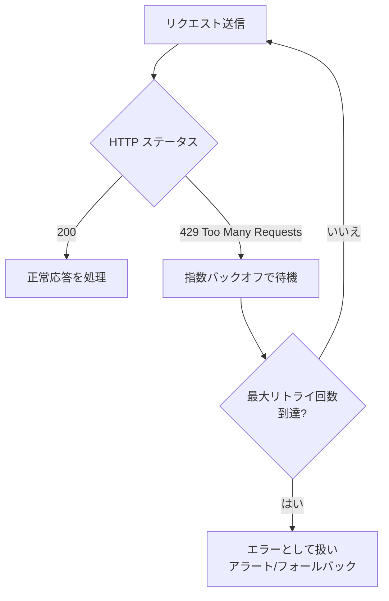

```python
import os, time
from openai import OpenAI, RateLimitError

client = OpenAI(base_url="https://api.x.ai/v1", api_key=os.getenv("XAI_API_KEY"))

def request_with_backoff(messages, max_retries=5):
    for attempt in range(max_retries):
        try:
            return client.chat.completions.create(model="grok-4.5", messages=messages)
        except RateLimitError:
            time.sleep(2 ** attempt)
    raise RateLimitError("Max retries exceeded")
```

### 11.4 上限を引き上げる方法

1. **累積課金額を増やす**（自動的に Tier アップ、追加作業不要）
2. **xAI Console から増枠申請**（追加課金なしで上限緩和を希望する場合）
3. **エンタープライズ営業へ問い合わせ**（`sales@x.ai`、大規模利用向け）

出典: [Rate Limits | xAI Docs](https://docs.x.ai/developers/rate-limits)

---

## 12. コスト最適化戦略

### 12.1 基本トークン単価（2026年7月時点、$/1M tokens）

| モデル | コンテキスト | Input | Cached Input | Output |
|---|---|---|---|---|
| `grok-4.5` | 500k | $2.00 | $0.50 | $6.00 |
| `grok-4.3` | 1M | $1.25 | $0.20 | $2.50 |
| `grok-4.20-multi-agent-0309` | 1M | $1.25 | $0.20 | $2.50 |
| `grok-build-0.1` | 256k | $1.00 | $0.20 | $2.00 |

### 12.2 ツール呼び出し課金

| ツール | 単価 |
|---|---|
| Web Search / X Search / Code Execution | $5 / 1,000 回 |
| File Attachments 検索 | $10 / 1,000 回 |
| Collections Search（RAG） | $2.50 / 1,000 回 |
| Remote MCP Tools | 呼び出し無料、トークンのみ課金 |

### 12.3 Batch API（非同期処理割引）

リアルタイム性が不要な大量処理は Batch API で最大 **20%** の割引を受けられます（対象モデル: `grok-4.3`, `grok-4.20-0309-reasoning`, `grok-4.20-0309-non-reasoning`, `grok-4.20-multi-agent-0309`。それ以外のモデルは割引なし）。

| 項目 | リアルタイム API | Batch API |
|---|---|---|
| トークン単価 | 標準料金 | モデルにより最大20%割引 |
| 応答時間 | 即時（秒単位） | 通常24時間以内 |
| レート制限 | 適用される | カウントされない |

### 12.4 Priority Processing（優先処理）

低レイテンシが必要なリクエストは Priority Processing で標準料金の **2倍** を支払うことで優先スケジューリングを受けられます。レスポンスの `service_tier` が `"priority"` になっている場合のみ優先料金が課金される点に注意（それ以外は標準料金のまま）。画像/動画生成・Batch API には非対応です。

### 12.5 コスト最適化の実践チェックリスト

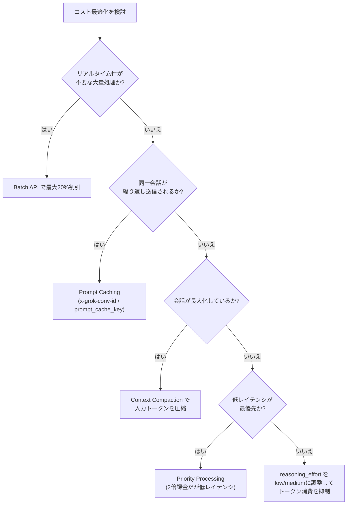

出典: [Pricing | xAI Docs](https://docs.x.ai/developers/pricing)

---

## 13. セキュリティと運用上の注意点

### 13.1 Remote MCP Tools のリスク管理

- **`allowed_tools` で最小権限化**: MCP サーバーが多数のツールを公開している場合、必要なものだけを許可することで「意図しない書き込み操作」のリスクとコンテキスト消費を同時に削減できます。
- **HTTPS + 認証必須**: 自社 MCP サーバーを公開する場合は必ず HTTPS を使用し、`authorization` トークンで適切に認証すること。
- **サードパーティ MCP サーバーの信頼性評価**: 外部が公開する MCP サーバーに接続する際は、提供元の信頼性とツールの権限範囲を事前に確認する。

### 13.2 Code Execution のセキュリティモデル

- 実行はサンドボックス化された隔離環境で行われ、外部ネットワーク・ファイルシステムへのアクセスは不可。
- 実行コンテキストはリクエスト間で永続化されない（ステートレス）ため、機密データを「保持させ続ける」設計は不可能。

### 13.3 Function Calling 実装時の防御的プログラミング

- モデルが生成した引数（`tc.function.arguments`）は**信頼できない入力**として扱い、実行前にバリデーションする。
- ツール名が想定外の場合はエラーを返す実装にする（`tools_map` に存在しない関数名を弾く）。
- SQL 実行・ファイル書き込み・外部 API 呼び出しなど副作用のあるツールには、権限スコープを最小化した専用の認証情報を使う。

### 13.4 使用ガイドライン違反時の課金に注意

xAI のシステムが利用ガイドライン違反と判定したリクエストは、生成前に検出された場合でも **$0.05 の違反手数料** が課金されます。プロダクション環境ではコンテンツフィルタリングやプロンプト設計の見直しでこれを回避してください。

出典: [Remote MCP Tools | xAI Docs](https://docs.x.ai/developers/tools/remote-mcp), [Code Execution Tool | xAI Docs](https://docs.x.ai/developers/tools/code-execution), [Pricing | xAI Docs](https://docs.x.ai/developers/pricing)

---

## 14. 本番導入前チェックリスト

- [ ] モデル選定: `grok-4.5`（汎用）/ `grok-4.3`（長文脈・低コスト）/ `grok-4.20-multi-agent`（ディープリサーチ）を用途で使い分けたか
- [ ] `reasoning_effort` をタスクの複雑さに応じて明示的に設定したか（reasoning は無効化不可な点に注意）
- [ ] Structured Outputs のスキーマ制約（`minLength`/`maxItems` 等の保証上限、非対応の正規表現機能）を把握し、必要なら二重検証を実装したか
- [ ] Function Calling のツール引数をアプリケーション側でバリデーションしているか
- [ ] Web Search / X Search の `allowed_domains` / `excluded_domains` でスコープを制限しているか
- [ ] Remote MCP Tools に `allowed_tools` で最小権限を設定したか
- [ ] `x-grok-conv-id` または `prompt_cache_key` を設定し、Prompt Caching が効いているか `cached_tokens` で確認したか
- [ ] 長時間会話に対して Context Compaction の導入を検討したか
- [ ] 429 エラーに対する指数バックオフを実装したか
- [ ] チームの Rate Limit Tier と RPS/TPM 上限を把握し、ピーク時の負荷試験を行ったか
- [ ] Batch API / Priority Processing の使い分け基準をワークロードごとに定義したか
- [ ] コスト監視: `usage` フィールド（reasoning_tokens 含む）と `server_side_tool_usage` を継続的にロギングしているか

---

## 15. 参考文献一覧

本ガイドの内容はすべて以下の xAI 公式ドキュメント（2026年7月時点）および公式サイトを参照して作成しています。

- Grok 公式サイト: [https://grok.com/](https://grok.com/)
- xAI Docs トップ: [https://docs.x.ai/overview](https://docs.x.ai/overview)
- Quickstart: [https://docs.x.ai/developers/quickstart](https://docs.x.ai/developers/quickstart)
- Models: [https://docs.x.ai/developers/models](https://docs.x.ai/developers/models)
- Pricing: [https://docs.x.ai/developers/pricing](https://docs.x.ai/developers/pricing)
- Reasoning: [https://docs.x.ai/developers/model-capabilities/text/reasoning](https://docs.x.ai/developers/model-capabilities/text/reasoning)
- Structured Outputs: [https://docs.x.ai/developers/model-capabilities/text/structured-outputs](https://docs.x.ai/developers/model-capabilities/text/structured-outputs)
- Multi Agent: [https://docs.x.ai/developers/model-capabilities/text/multi-agent](https://docs.x.ai/developers/model-capabilities/text/multi-agent)
- Function Calling: [https://docs.x.ai/developers/tools/function-calling](https://docs.x.ai/developers/tools/function-calling)
- Tools Overview: [https://docs.x.ai/docs/guides/tools/overview](https://docs.x.ai/docs/guides/tools/overview)
- Advanced Tool Usage: [https://docs.x.ai/docs/guides/tools/advanced-usage](https://docs.x.ai/docs/guides/tools/advanced-usage)
- Web Search: [https://docs.x.ai/developers/tools/web-search](https://docs.x.ai/developers/tools/web-search)
- X Search: [https://docs.x.ai/developers/tools/x-search](https://docs.x.ai/developers/tools/x-search)
- Code Execution: [https://docs.x.ai/developers/tools/code-execution](https://docs.x.ai/developers/tools/code-execution)
- Remote MCP Tools: [https://docs.x.ai/developers/tools/remote-mcp](https://docs.x.ai/developers/tools/remote-mcp)
- Docs MCP: [https://docs.x.ai/developers/docs-mcp](https://docs.x.ai/developers/docs-mcp)
- Prompt Caching（総論）: [https://docs.x.ai/developers/advanced-api-usage/prompt-caching](https://docs.x.ai/developers/advanced-api-usage/prompt-caching)
- Prompt Caching — How It Works: [https://docs.x.ai/developers/advanced-api-usage/prompt-caching/how-it-works](https://docs.x.ai/developers/advanced-api-usage/prompt-caching/how-it-works)
- Prompt Caching — Maximizing Cache Hits: [https://docs.x.ai/developers/advanced-api-usage/prompt-caching/maximizing-cache-hits](https://docs.x.ai/developers/advanced-api-usage/prompt-caching/maximizing-cache-hits)
- Prompt Caching — What Breaks Caching: [https://docs.x.ai/developers/advanced-api-usage/prompt-caching/multi-turn](https://docs.x.ai/developers/advanced-api-usage/prompt-caching/multi-turn)
- Prompt Caching — Best Practices & FAQ: [https://docs.x.ai/developers/advanced-api-usage/prompt-caching/best-practices](https://docs.x.ai/developers/advanced-api-usage/prompt-caching/best-practices)
- Prompt Caching — Usage & Pricing: [https://docs.x.ai/developers/advanced-api-usage/prompt-caching/usage-and-pricing](https://docs.x.ai/developers/advanced-api-usage/prompt-caching/usage-and-pricing)
- Context Compaction: [https://docs.x.ai/developers/advanced-api-usage/context-compaction](https://docs.x.ai/developers/advanced-api-usage/context-compaction)
- Rate Limits: [https://docs.x.ai/developers/rate-limits](https://docs.x.ai/developers/rate-limits)

> xAI のドキュメントは頻繁に更新されます（本ガイド作成時点でも「Last updated」が各ページで異なります）。本番導入前には必ず上記リンクから最新版をご確認ください。
