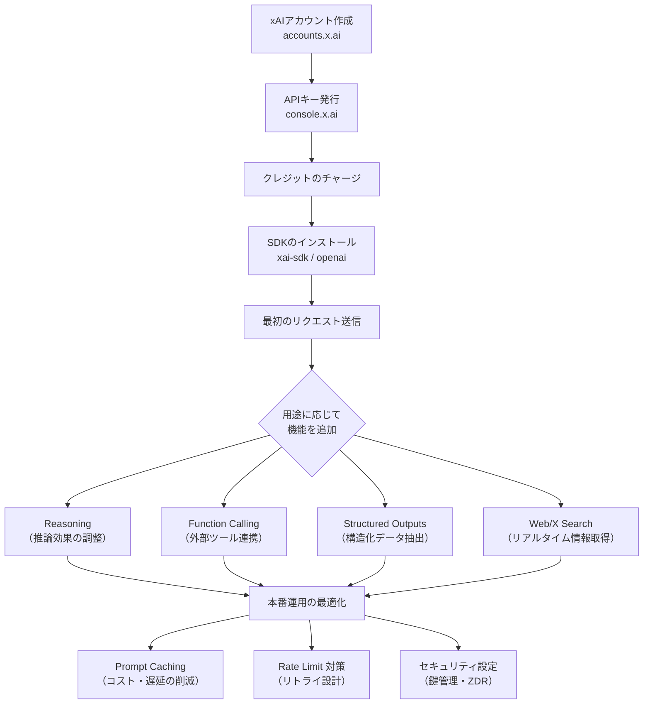
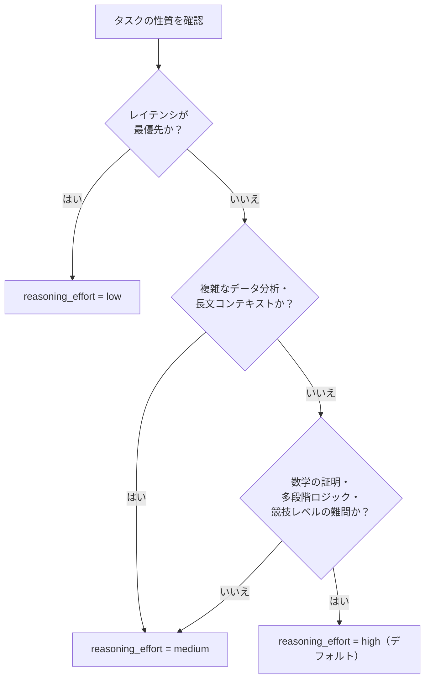
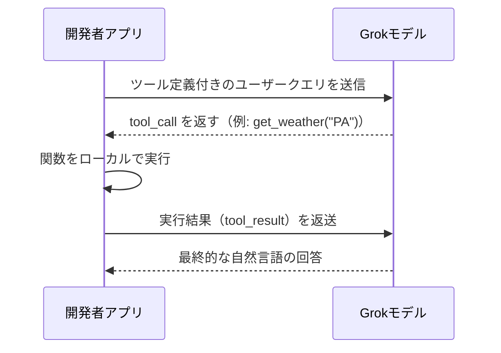
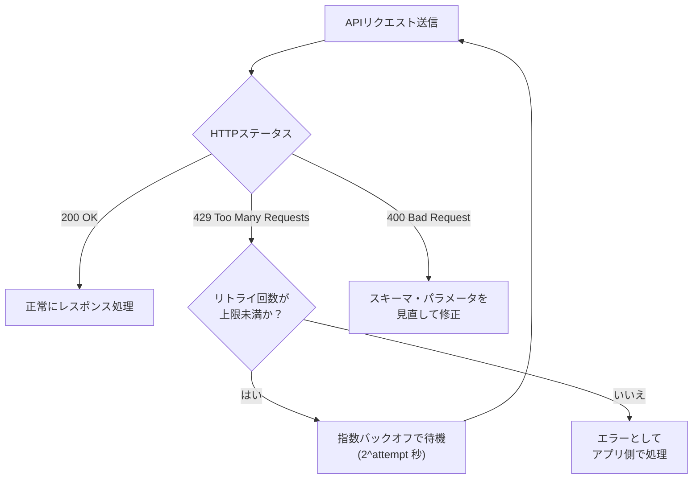
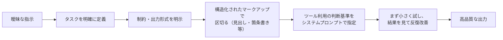

# xAI の LLM（Grok）完全ガイド ― 初学者のためのベストプラクティス

> **対象読者**: xAI API（Grok モデル群）をこれから使い始めるエンジニア・QAエンジニア
> **情報時点**: 2026年7月15日（各セクションに出典ドキュメントの最終更新日を明記）
> **前提知識**: REST API の基本、Python または JavaScript の基礎

---

## 0. このガイドについて

xAI は Grok シリーズの LLM（大規模言語モデル）を開発する企業です。2026年7月時点で、公式ドキュメントサイト（docs.x.ai）上のブランド表記は **「SpaceXAI」** となっています（ドメインや API エンドポイント自体は引き続き `x.ai` / `api.x.ai` のままです）。本ガイドでは実務上の表記に合わせて「xAI」「Grok」と記載します。

xAI が提供する主な製品は次の3つです。

| 製品 | 用途 | URL |
|---|---|---|
| **Grok（コンシューマーアプリ）** | チャット・画像生成・リアルタイム検索を行うエンドユーザー向けアシスタント | [grok.com](https://grok.com/) |
| **xAI API** | 開発者が自分のアプリケーションに Grok モデルを組み込むための REST / gRPC API | [docs.x.ai](https://docs.x.ai/overview) |
| **Grok Build** | ターミナル・IDE 上で動く自律型コーディングエージェント（CLI） | [docs.x.ai/build/overview](https://docs.x.ai/build/overview) |

本ガイドは主に **xAI API** を使ってアプリケーションに Grok を組み込む開発者を対象に、ステップバイステップでベストプラクティスを解説します。

---

## 1. 全体像を掴む：利用開始までのワークフロー

初めて xAI API に触れる場合、以下の流れで進めます。細かい各ステップは後述のセクションで解説します。



出典: [Quickstart | xAI Docs](https://docs.x.ai/developers/quickstart)（最終更新 2026年7月3日）

---

## 2. ステップ1：モデルを選ぶ

xAI は用途別に複数のモデルファミリーを提供しています。「何でも Grok 4.5 を使えばよい」という単純な整理がされているのが大きな特徴です。

### 2.1 テキスト（チャット・コード）モデル比較表

| モデル | コンテキスト長 | 入力 (1Mトークンあたり) | キャッシュ入力 | 出力 (1Mトークンあたり) | 特徴 |
|---|---|---|---|---|---|
| **grok-4.5**（フラッグシップ・最新） | 500k トークン | $2.00 | $0.50 | $6.00 | エージェント型ツール呼び出し、幻覚が少ない、推論強度を調整可能 |
| grok-4.3 | 1M トークン | $1.25 | $0.20 | $2.50 | 長文コンテキスト向け |
| grok-4.20-0309-reasoning / non-reasoning | 1M トークン | $1.25 | $0.20 | $2.50 | 推論あり／なしを選択可能 |
| grok-4.20-multi-agent-0309 | 1M トークン | $1.25 | $0.20 | $2.50 | 複数エージェント（4体 or 16体）が協調して回答を生成 |
| grok-build-0.1（Code API） | 256k トークン | $1.00 | $0.20 | $2.00 | エージェント的コーディング専用 |

出典: [Models | xAI Docs](https://docs.x.ai/developers/models)（最終更新 2026年7月9日）、[Pricing | xAI Docs](https://docs.x.ai/developers/pricing)（最終更新 2026年7月3日）

### 2.2 用途別モデル選定ガイド

| 用途 | 推奨モデル |
|---|---|
| コード生成・デバッグ | grok-4.5 |
| 一般的なチャット・質問応答 | grok-4.5 |
| 画像生成 | Grok Imagine API（grok-imagine-image / grok-imagine-image-quality） |
| 動画生成 | Grok Imagine API（grok-imagine-video / grok-imagine-video-1.5） |
| 音声（リアルタイム会話・TTS・STT） | Grok Voice API |

出典: [Models | xAI Docs — Which model should I choose?](https://docs.x.ai/developers/models#which-model-should-i-choose)

### 2.3 モデル利用時の重要な注意点（初学者が特に見落としやすいポイント）

- **リアルタイム情報にはアクセスできない**：Grok は学習データ以降の出来事を知りません。最新情報が必要な場合は Web Search / X Search ツールを有効化する必要があります。
- **grok-4.5 の知識カットオフは 2026年2月1日** です。
- 画像入力は最大 **20MiB**、対応形式は `jpg/jpeg` または `png`。画像枚数の上限はありません。
- `grok-4.20` 以降のモデルでは `logprobs` / `top_logprobs` パラメータは無視されます（エラーにはならず黙って無視される点に注意）。
- モデル名には3種類のエイリアスがあります。`<modelname>` は最新安定版、`<modelname>-latest` は最新版全般、`<modelname>-<date>` は特定リリースに固定されます。**再現性が必要なワークフローでは日付付きエイリアスを使う**のがベストプラクティスです。

出典: [Models | xAI Docs — Additional Information](https://docs.x.ai/developers/models#additional-information-regarding-models)、[Model Aliases](https://docs.x.ai/developers/models#model-aliases)

---

## 3. ステップ2：アカウント作成と API キー発行

1. [accounts.x.ai](https://accounts.x.ai/sign-up?redirect=cloud-console) でアカウントを作成し、クレジットをチャージします。
2. [console.x.ai の API Keys ページ](https://console.x.ai/team/default/api-keys) で API キーを発行します。
3. 環境変数として設定します。

```bash
export XAI_API_KEY="your_api_key"
```

または `.env` ファイルに記載します。

```bash
XAI_API_KEY=your_api_key
```

> ⚠️ **セキュリティ上の注意**：API キーはパスワードやクレジットカード情報と同様に機密情報として扱ってください。チームメンバー間でキーを共有せず、環境変数やシークレット管理ツールで安全に保管し、公開リポジトリにコミットしないようにしてください（詳細はセクション9参照）。

出典: [Quickstart | xAI Docs — Step 1〜2](https://docs.x.ai/developers/quickstart)

---

## 4. ステップ3：SDK インストールと最初のリクエスト

xAI API は独自の `xai-sdk` に加えて、**OpenAI SDK 互換**のエンドポイント（`base_url` を `https://api.x.ai/v1` に変更するだけ）も提供しています。既存の OpenAI 向けコードベースがある場合、この互換性は大きなメリットです。

### 4.1 SDK インストール

```bash
# Python (xAI公式SDK)
pip install xai-sdk

# Python (OpenAI互換)
pip install openai

# JavaScript (Vercel AI SDK)
npm install ai @ai-sdk/xai zod

# JavaScript (OpenAI互換)
npm install openai
```

### 4.2 最初のリクエスト（Python / xai-sdk）

```python
import os
from xai_sdk import Client
from xai_sdk.chat import user

client = Client(api_key=os.getenv("XAI_API_KEY"))

chat = client.chat.create(model="grok-4.5")
chat.append(user("Fix this function and explain the bug: function median(a){a.sort();return a[a.length/2]}"))

print(chat.sample().content)
```

### 4.3 最初のリクエスト（OpenAI 互換 SDK）

```python
from openai import OpenAI

client = OpenAI(
    api_key="<YOUR_XAI_API_KEY_HERE>",
    base_url="https://api.x.ai/v1",
)

response = client.responses.create(
    model="grok-4.5",
    input="Fix this function and explain the bug: function median(a){a.sort();return a[a.length/2]}",
)

print(response.output_text)
```

### 4.4 最初のリクエスト（cURL）

```bash
curl https://api.x.ai/v1/responses \
  -H "Authorization: Bearer $XAI_API_KEY" \
  -H "Content-Type: application/json" \
  -d '{
    "model": "grok-4.5",
    "input": "Fix this function and explain the bug: function median(a){a.sort();return a[a.length/2]}"
  }'
```

> 💡 **ベストプラクティス**：新規プロジェクトでは `/v1/responses`（Responses API）の利用が推奨されています。Chat Completions（レガシー）からの移行ガイドも用意されています。

出典: [Quickstart | xAI Docs — Step 3〜4](https://docs.x.ai/developers/quickstart)、[Migrating to Responses API](https://docs.x.ai/developers/model-capabilities/text/comparison)

---

## 5. ステップ4：Reasoning（推論）モデルを使いこなす

grok-4.5 は回答前に「考える」推論モデルです。数学・論理パズル・複雑な分析タスクに強みがあります。

### 5.1 `reasoning_effort` パラメータ

推論にどれだけ計算リソースを使うかを制御します。**指定しない場合のデフォルトは `"high"`** で、推論そのものを完全に無効化することはできません。

| 設定値 | 説明 | 最適な用途 |
|---|---|---|
| `"low"` | 推論トークンを一部使用しつつ高速 | レイテンシ重視のエージェント処理、シンプルなツール呼び出し |
| `"medium"` | レイテンシに寛容な用途向けにより多く思考 | 複雑なデータ分析、長文コンテキストでの推論 |
| `"high"`（デフォルト） | 深い思考のため推論トークンを多く使用 | 非常に難しい問題、複雑な数学、多段階のロジック |

> ⚠️ **注意**：推論モデルでは `presencePenalty`、`frequencyPenalty`、`stop` パラメータは使用できません（指定するとエラーになります）。

### 5.2 選択フローチャート



### 5.3 コード例

```python
import os
from xai_sdk import Client
from xai_sdk.chat import system, user

client = Client(
    api_key=os.getenv("XAI_API_KEY"),
    timeout=3600,  # 推論モデルは長時間タイムアウトを推奨
)

chat = client.chat.create(
    model="grok-4.5",
    reasoning_effort="high",
    messages=[system("You are a highly intelligent AI assistant.")],
)
chat.append(user("Find all prime numbers p such that p^2 + 2 is also prime. Prove your answer."))

response = chat.sample()
print(response.content)
```

### 5.4 推論トレースの活用

- `reasoning_tokens` として使用量メトリクスに公開されます（**課金対象**です）。
- `include: ["reasoning.encrypted_content"]` を指定すると暗号化された推論内容を取得でき、後続の会話に文脈として渡すことができます。
- grok-4.5 では推論内容の要約（Summarized Reasoning Content）をストリーミングで取得できます。

> 💡 **タイムアウトのベストプラクティス**：推論モデルは応答生成に時間がかかることがあるため、HTTP クライアントのタイムアウトを長め（例：3600秒）に設定することが公式に推奨されています。

出典: [Reasoning | xAI Docs](https://docs.x.ai/developers/model-capabilities/text/reasoning)（最終更新 2026年7月9日）

---

## 6. ステップ5：Function Calling（関数呼び出し）のベストプラクティス

Function Calling を使うと、モデルがデータベースや外部 API など任意のシステムと連携できます。

### 6.1 動作の流れ



### 6.2 ツール定義の基本パターン

```python
import os
import json
from xai_sdk import Client
from xai_sdk.chat import user, tool, tool_result

client = Client(api_key=os.getenv("XAI_API_KEY"))

tools = [
    tool(
        name="get_temperature",
        description="Get current temperature for a location",
        parameters={
            "type": "object",
            "properties": {
                "location": {"type": "string", "description": "City name"},
                "unit": {"type": "string", "enum": ["celsius", "fahrenheit"], "default": "fahrenheit"}
            },
            "required": ["location"]
        },
    ),
]

chat = client.chat.create(model="grok-4.5", tools=tools)
chat.append(user("What is the temperature in San Francisco?"))
response = chat.sample()

if response.tool_calls:
    chat.append(response)
    for tc in response.tool_calls:
        args = json.loads(tc.function.arguments)
        result = {"location": args["location"], "temperature": 59, "unit": args.get("unit", "fahrenheit")}
        chat.append(tool_result(json.dumps(result)))
    response = chat.sample()

print(response.content)
```

### 6.3 ツール選択の制御（`tool_choice`）

| 値 | 動作 |
|---|---|
| `"auto"`（デフォルト） | モデルがツールを呼ぶかどうかを自律的に判断 |
| `"required"` | 少なくとも1つのツール呼び出しを強制 |
| `"none"` | ツール呼び出しを無効化 |
| `{"type": "function", "function": {"name": "..."}}` | 特定のツールを強制的に呼ばせる |

### 6.4 ベストプラクティス

- **並列関数呼び出しはデフォルトで有効**です。1回のレスポンスに複数の `tool_call` が含まれる可能性があるため、必ず全件をループ処理してください。無効化したい場合は `parallel_tool_calls: false` を指定します。
- **1リクエストあたり最大200個**のツールを定義できます。
- ツール定義の `description` フィールドは、モデルが「いつこのツールを使うべきか」を判断する材料になるため、**曖昧さを排除した明確な説明**を書くことが品質に直結します。
- **Pydantic（Python）や Zod（JavaScript）でスキーマを定義**すると、型安全性を保ちながら JSON Schema を自動生成できます。
- `parameters` のルートは必ず `object` 型（または全分岐が object の `oneOf`/`anyOf`）である必要があります。スカラー値や配列をルートに置くと `400` エラーになります。
- **組み込みツール（Web Search・X Search など）とカスタム関数は併用可能**です。組み込みツールは xAI のサーバー側で自動実行され、カスタムツールは呼び出し時に実行が一時停止し、開発者側の処理待ちになります。

出典: [Function Calling | xAI Docs](https://docs.x.ai/developers/tools/function-calling)（最終更新 2026年6月24日）

---

## 7. ステップ6：Structured Outputs（構造化出力）を活用する

自由形式のテキストではなく、あらかじめ定義した JSON スキーマに**確実に一致する**出力を得られる機能です。文書解析・エンティティ抽出・レポート生成に有効です。

### 7.1 2つの利用方法

1. **`response_format` パラメータ**：`type` を `"json_schema"` にしてスキーマを指定（最も柔軟）。`"json_object"`（任意の整形済みJSON）や `"text"`（デフォルト、自由形式）も選択可能。
2. **Function Calling 経由**：ツールの引数は常にスキーマに厳密準拠して生成されます（`strict` は暗黙的に常に `true`）。

### 7.2 対応している JSON Schema の範囲

| 対応済み型 | 備考 |
|---|---|
| `string` / `number` / `integer` / `boolean` / `null` | 基本型 |
| `enum` / `const` | 列挙・定数 |
| `array` / `object` | コレクション型 |
| `anyOf` / `oneOf`（`anyOf` と同一挙動） | 直和型 |
| `allOf`（単一サブスキーマのみ） | 複数指定は「ベストエフォート」扱い |
| `$ref` / `$defs`（非循環参照のみ） | 再利用可能な定義 |

`additionalProperties` は**デフォルトで `false`**（明示的に `true` を指定しない限り追加プロパティ不可）。

### 7.3 制約の保証範囲

| キーワード | 保証される上限 |
|---|---|
| `minimum` / `maximum` / `exclusiveMinimum` / `exclusiveMaximum` | 上限なし（完全保証） |
| `minLength` / `maxLength` | 2,048 まで |
| `minItems` / `maxItems` | 256 まで |
| `minProperties` / `maxProperties` | 64 まで |

`not`、`if`/`then`/`else`、複数の `allOf`、上記表にない `format` 値は「ベストエフォート」（モデルが概ね守るが厳密には保証されない）扱いです。**厳密な準拠が必要な場合はアプリ側でバリデーションを行うことが推奨されています。**

### 7.4 実装例：請求書（Invoice）データの抽出

```python
from datetime import date
from enum import Enum
from pydantic import BaseModel, Field

class Currency(str, Enum):
    USD = "USD"
    EUR = "EUR"
    GBP = "GBP"

class LineItem(BaseModel):
    description: str = Field(description="Description of the item or service")
    quantity: int = Field(description="Number of units", ge=1)
    unit_price: float = Field(description="Price per unit", ge=0)

class Invoice(BaseModel):
    vendor_name: str
    invoice_number: str
    invoice_date: date
    line_items: list[LineItem]
    total_amount: float = Field(ge=0)
    currency: Currency

# response, invoice のタプルを取得（自動パース）
response, invoice = chat.parse(Invoice)
print(invoice.vendor_name, invoice.total_amount, invoice.currency)
```

### 7.5 ツールと構造化出力の組み合わせ

Web Search などのエージェント型ツールでも、カスタム関数呼び出しでも、**最終出力を型安全なスキーマに強制する**ことができます（Grok 4 系モデルで対応）。これにより「ツールで情報収集 → 決まった形式で返す」というワークフローが実現します。

出典: [Structured Outputs | xAI Docs](https://docs.x.ai/developers/model-capabilities/text/structured-outputs)（最終更新 2026年5月12日）

---

## 8. ステップ7：Web検索・X検索ツールでリアルタイム性を確保する

Grok モデルは学習データ以降の情報を持たないため、最新情報が必要な場合は必ず Web Search / X Search ツールを有効化します。

```python
from xai_sdk.tools import web_search

chat = client.chat.create(
    model="grok-4.5",
    tools=[web_search()],
)
chat.append(user("What is xAI?"))
```

### 8.1 主なパラメータ

| パラメータ | 説明 |
|---|---|
| `allowed_domains` | 検索対象を特定ドメインに限定（最大5件） |
| `excluded_domains` | 特定ドメインを検索対象から除外（最大5件、`allowed_domains` と同時指定不可） |
| `enable_image_understanding` | 検索中に発見した画像を解析可能にする |
| `enable_image_search` | 画像検索結果を Markdown 画像として応答に埋め込む |

出典: [Web Search | xAI Docs](https://docs.x.ai/developers/tools/web-search)（最終更新 2026年5月27日）

---

## 9. ステップ8：Prompt Caching（プロンプトキャッシュ）でコストと遅延を削減する

同じプレフィックス（システムプロンプトや会話履歴の先頭部分）を繰り返し送信する場合、キャッシュを活用することで**入力トークンのコストと初回応答までの遅延（レイテンシ）を大幅に削減**できます。これは公式ドキュメントが明示的に「ベストプラクティス」として列挙している数少ないセクションです。

### 9.1 公式ベストプラクティス（原文に基づく要約）

1. **`x-grok-conv-id`（Chat Completions）または `prompt_cache_key`（Responses API）を必ず設定する** — 同一サーバーにリクエストをルーティングし、キャッシュヒット率を最大化します。
2. **安定した会話IDを使う** — UUID やアプリケーションのセッションIDが適しています。
3. **過去のメッセージを変更しない** — 新しいメッセージの追記のみに留めます。編集・削除・並べ替えを行うとキャッシュが破棄されます。
4. **静的コンテンツを先頭に配置する** — システムプロンプト、Few-shot 例、参照ドキュメントを会話の先頭に置き、安定したプレフィックスを形成します。
5. **`cached_tokens` を監視する** — 常に0であれば、会話ID設定やメッセージ順序に問題がある可能性があります。
6. **キャッシュミスを前提に設計する** — サーバーの負荷や再起動によりキャッシュはいつでも失効し得ます。キャッシュなしでも正常に動作するようアプリを設計してください。

### 9.2 よくある質問（FAQ）

| 質問 | 回答 |
|---|---|
| キャッシュは出力品質に影響するか？ | いいえ。プロンプト処理フェーズを高速化するだけで、モデルの出力はキャッシュの有無に関わらず同一です。 |
| キャッシュはどれくらい保持されるか？ | サーバー負荷や再起動でいつでも失効し得ます。`x-grok-conv-id` を使うことで保持率を高められます。 |
| 意図的にキャッシュミスを起こせるか？ | 可能です。異なる `x-grok-conv-id` を使うか、ヘッダーを省略します。 |
| ストリーミングでもキャッシュは効くか？ | はい。ストリームの最初の空トークンがキャッシュ検索とプリフィル処理に対応します。 |
| ツール呼び出しでもキャッシュは効くか？ | はい。ツール呼び出し結果を含む全メッセージまでがキャッシュ可能なプレフィックスです。 |

出典: [Prompt Caching: Best Practices & FAQ | xAI Docs](https://docs.x.ai/developers/advanced-api-usage/prompt-caching/best-practices)（最終更新 2026年3月16日）

> 💡 **grok-4.5 固有の推奨事項**：公式ドキュメントは「`prompt_cache_key` を設定しない場合、キャッシュが冷えたサーバーに当たり、フル価格の入力トークン料金を支払うことが多い」と明記しています。

出典: [grok-4.5 | xAI Docs — Important details](https://docs.x.ai/developers/grok-4-5#important-details)（最終更新 2026年7月8日）

---

## 10. ステップ9：長時間のエージェントループと Context Compaction

数千トークンを超える長い会話では、フォローアップのたびに過去の全メッセージを再送信することになり、入力トークンのコストが膨らみます。**Context Compaction（コンテキスト圧縮）** を使うと、会話を1つの不透明な（opaque）圧縮アイテムに変換し、システムプロンプトや添付ファイル、直前の推論内容などの要点を保持したまま冗長なツール出力を削減できます。

### 10.1 圧縮すべきタイミング（すべて満たす場合）

- 会話が大きくなり、各呼び出しの `input_tokens` がコストやレイテンシを悪化させている
- モデルに過去のやり取りを覚えていてほしい（覚えなくてよいなら新規会話を始めるだけでよい）
- 現在のウィンドウがまだモデルのコンテキスト上限に収まっている（圧縮は既に上限超過したリクエストを救済できません）

### 10.2 実装パターン（エージェントループ内で N ターンごとに圧縮）

```python
compact_every = 5
for turn in range(1, 100):
    chat.append(user(input("You: ")))
    response = chat.sample()
    chat.append(response)

    if turn % compact_every == 0:
        compact = chat.compact()
        print(f"[dropped {compact.dropped_message_count} messages, "
              f"tokens used: {compact.usage.total_tokens}]")
```

### 10.3 制約と注意点

- **既にコンテキスト上限を超えている会話は圧縮できません**（圧縮前にプルーニングや分割が必要）。
- **1リクエストにつき圧縮は1回まで**。
- `encrypted_content` は**不透明なブロブとして扱う**こと。パース・編集・手動マージをしてはいけません。
- **再圧縮は可能**です。圧縮後さらに会話が長くなった場合、再度圧縮できます。
- 圧縮処理自体もトークンを消費するため、頻繁に圧縮する場合は**小型・高速なモデルを圧縮専用に選ぶ**ことが推奨されています。
- 推論モデルを使う場合は `use_encrypted_content=True` を設定すると、過去ターンの推論内容も圧縮を通じて保持されます。

出典: [Context Compaction | xAI Docs](https://docs.x.ai/developers/advanced-api-usage/context-compaction)（最終更新 2026年5月21日）

---

## 11. ステップ10：レート制限とエラーハンドリング

### 11.1 レート制限の仕組み

xAI API は **RPS（1秒あたりのリクエスト数）** と **TPM（1分あたりのトークン数）** の2軸で制限されます。制限値はチーム累計支出額に基づく「Tier（階層）」によって自動的に引き上げられます。

| Tier | 累計支出のしきい値 |
|---|---|
| Tier 0 | $0（デフォルト） |
| Tier 1 | $50 |
| Tier 2 | $250 |
| Tier 3 | $1,000 |
| Tier 4 | $5,000 |
| Enterprise | 要問い合わせ |

一度到達した Tier は永続します（ダウングレードしません）。

### 11.2 grok-4.5 のレート制限例（Tier別 RPS / TPM）

| Tier | RPS | TPM |
|---|---|---|
| Tier 0 | 150 | 50M |
| Tier 1 | 172 | 53M |
| Tier 2 | 208 | 60M |
| Tier 3 | 312 | 74M |
| Tier 4 | 500 | 100M |

**TPM にカウントされるもの**：プロンプトトークン（テキスト・画像・音声）、完了トークン、推論トークン、そして**キャッシュされたプロンプトトークンも含まれます**（課金は割引されますが TPM 消費としてはカウントされる点に注意）。

### 11.3 429エラーへの対処（指数バックオフ）

```python
import os
import time
from openai import OpenAI, RateLimitError

client = OpenAI(base_url="https://api.x.ai/v1", api_key=os.getenv("XAI_API_KEY"))

def request_with_backoff(messages, max_retries=5):
    for attempt in range(max_retries):
        try:
            return client.chat.completions.create(model="grok-4.5", messages=messages)
        except RateLimitError:
            wait = 2 ** attempt
            time.sleep(wait)
    raise RateLimitError("Max retries exceeded")
```

### 11.4 エラーハンドリングのフロー



### 11.5 制限を引き上げる方法

- **支出を増やす**：累計支出に応じて Tier は自動的に引き上げられます。
- **引き上げをリクエストする**：追加支出なしで制限を引き上げたい場合や Tier 4 を超える制限が必要な場合、[xAI Console](https://console.x.ai/team/default/rate-limits) から申請できます。
- **セールスに問い合わせる**：エンタープライズ規模のキャパシティが必要な場合は `sales@x.ai` へ連絡します。

出典: [Rate Limits | xAI Docs](https://docs.x.ai/developers/rate-limits)（最終更新 2026年6月20日）

---

## 12. ステップ11：料金体系を理解する

### 12.1 Chat API（テキストモデル）

| モデル | コンテキスト | 入力 | キャッシュ入力 | 出力 |
|---|---|---|---|---|
| grok-4.5 | 500k | $2.00 | $0.50 | $6.00 |
| grok-4.3 | 1M | $1.25 | $0.20 | $2.50 |
| grok-4.20 系（reasoning/non-reasoning/multi-agent） | 1M | $1.25 | $0.20 | $2.50 |

### 12.2 サーバー側ツールの呼び出し料金

| ツール | ツール名 | 料金（1,000回あたり） |
|---|---|---|
| Web Search | `web_search` | $5 |
| X Search | `x_search` | $5 |
| Code Execution | `code_execution` / `code_interpreter` | $5 |
| File Attachments | `attachment_search` | $10 |
| Collections Search（RAG） | `collections_search` / `file_search` | $2.50 |
| Image / X Video Understanding | `view_image` / `view_x_video` | トークン課金 |
| Remote MCP Tools | サーバーごとに異なる | ツール呼び出し自体は無料、トークンのみ課金 |

> 💡 エージェントが自律的にツール回数を決めるため、**クエリの複雑さに比例してコストが変動する**点に注意してください。

### 12.3 Batch API（非同期・割引あり）

大量のリクエストを非同期でまとめて処理すると、標準料金より割引されます（多くの場合24時間以内に完了）。

| 項目 | リアルタイム API | Batch API |
|---|---|---|
| 料金 | 標準レート | モデルにより最大20%割引 |
| 応答時間 | 即時（数秒） | 通常24時間以内 |
| レート制限 | 分単位の制限が適用 | レート制限にカウントされない |

grok-4.3・grok-4.20系は**20%割引**、それ以外のモデルは割引対象外です。

### 12.4 Priority Processing（優先処理）

低レイテンシが必要なテキストリクエストに対し、標準料金の **2倍** でスケジューリング優先度を引き上げられます。実際に優先処理されたかは、レスポンス内の `"service_tier": "priority"` で確認できます（優先されなかった場合は標準料金のまま課金）。

### 12.5 その他の料金

| 項目 | 料金 |
|---|---|
| ファイルストレージ | $0.025 / GiB / 日 |
| コレクション（RAG）ストレージ | $0.10 / GiB / 日 |
| ファイル・コレクションのダウンロード | $0.20 / GiB |

出典: [Pricing | xAI Docs](https://docs.x.ai/developers/pricing)（最終更新 2026年7月3日）

---

## 13. セキュリティとデータプライバシーのベストプラクティス

AIエンジニアリングにおいてガバナンス・セキュリティ要件を考慮することは重要です。xAI API のデータ取り扱いポリシーを正確に把握しておきましょう。

### 13.1 データ保持ポリシー

- **xAI はユーザーの明示的な許可なしに API の入出力データを学習に使用しません。**
- API のリクエスト・レスポンスは、不正利用の監査目的で **30日間** サーバーに一時保存された後、自動的に削除されます。

### 13.2 Zero Data Retention（ZDR）

エンタープライズアカウント限定の機能で、有効化するとリクエスト・レスポンスデータが一切保存されません（応答が返された時点で記録が残りません）。

- モデレーション（安全性チェック）はリアルタイムで実施されますが、結果は保存されません。
- 全レスポンスに `x-zero-data-retention` ヘッダー（`"true"` / `"false"`）が付与され、プログラム的に ZDR の有効性を確認できます。
- ZDR 環境下では `previous_response_id` によるサーバー側の会話継続機能が使えないため、**クライアント側で会話状態を管理する必要があります**（`use_encrypted_content` の活用が推奨）。

### 13.3 コンプライアンス

| 項目 | 状況 |
|---|---|
| HIPAA（医療情報） | BAA（Business Associate Agreement）締結の問い合わせフォームあり |
| GDPR / SOC 2 | **SOC 2 Type 2 準拠**。NDA締結済み顧客は Trust Center で証明書類を確認可能 |
| 監査ログ | チーム管理者は xAI Console の Audit Log でユーザー操作の全履歴を確認可能（イベントID・説明・ユーザーで絞り込み可） |

### 13.4 API キー管理のベストプラクティス

- APIキーはパスワードやクレジットカード情報と同様の機密情報として扱う
- チームメンバー間でキーを共有しない
- 環境変数やシークレット管理ツールで安全に保管する
- 公開リポジトリへのコミットを避ける
- 定期的にキーをローテーションする
- 侵害が疑われる場合は xAI Console から即座にキーを無効化し、新規キーを発行する

> 💡 xAI は GitHub の Secret Scanning プログラムと連携しており、漏洩したキーが検出されると自動的に無効化され、メールで通知が届きます。

出典: [FAQ - xAI API Security | xAI Docs](https://docs.x.ai/developers/faq/security)（最終更新 2026年5月9日）

---

## 14. プロンプト設計のベストプラクティス

Grok に限らず LLM 全般に通じる原則ですが、xAI API をエージェント的（ツール呼び出し・多段階タスク）に使う場合には以下が特に重要になります。



### 14.1 5つの原則

1. **タスクを明示的にスコープする**：「説明して」ではなく「〇〇について、△△字以内で、□□向けに、具体例を1つ含めて説明して」のように、タスク・分量・対象読者・出力形式を具体化する。
2. **長い・複雑な指示は構造化する**：Markdown の見出しや箇条書き（あるいは XML タグ）でタスク・制約・コンテキストを分離すると、モデルの情報抽出精度が上がります。
3. **エビデンス・根拠を要求する**：「〇〇について説明して」だけでなく「引用元・時系列・比較表を含めて」のように明示的に要求しないと、自信ありげだが検証不能な回答になりがちです。
4. **ツール利用の指針をシステムプロンプトに書く**：「どのサブタスクにどのツールを使うか」「ツール結果をどう連鎖させるか」を明示すると、ループや不完全な応答を防げます。
5. **一発で完璧を目指さず、素早く試して反復する**：最初から時間をかけて「完璧な」プロンプトを作るより、まず短いプロンプトを送り、結果を見て具体的な修正指示を追加する方が、多くの場合、結果的に早く良い出力にたどり着きます。

### 14.2 タスクが複数のサブゴールに分かれる場合の例

```text
System:
You are a senior backend engineer with access to web search and code execution tools.
When solving problems:
1. State your reasoning plan before taking any action
2. Use search to verify external facts, library versions, or API specs before assuming
3. Execute and test code — don't just write it
4. If a test fails, diagnose and fix before moving on
5. Rate your final output 1-10 and flag any remaining uncertainties

User:
Build a Python function that fetches the current USD/EUR exchange rate from a
public API, caches it locally for 5 minutes, and returns it.
```

このようにシステムプロンプトで「思考の型」を明示することで、モデルが根拠のないAPIエンドポイントを想定してしまう、といった典型的な失敗を減らせます。

出典: [Function Calling | xAI Docs](https://docs.x.ai/developers/tools/function-calling)、[Reasoning | xAI Docs](https://docs.x.ai/developers/model-capabilities/text/reasoning)（プロンプト設計の一般原則は、公式ドキュメントの実装例パターンに基づき整理したもの）

---

## 15. よくある落とし穴（アンチパターン）チェックリスト

| # | アンチパターン | 何が起きるか | 対策 |
|---|---|---|---|
| 1 | 会話IDを設定せずに繰り返しリクエスト | 毎回キャッシュがコールドヒットし、フル価格の入力トークン料金がかかる | `prompt_cache_key` / `x-grok-conv-id` を必ず設定 |
| 2 | 過去メッセージを編集・並び替え | プロンプトキャッシュが破棄される | 新しいメッセージは常に追記のみ |
| 3 | 最新情報が必要なのに検索ツールを付けない | 学習データ以降の出来事について誤った／古い回答をする | Web Search / X Search を有効化 |
| 4 | 推論モデルにデフォルトのタイムアウト（数十秒）を使う | 応答が完了する前にタイムアウトエラーになる | タイムアウトを長め（例：3600秒）に設定 |
| 5 | ツールの `description` が曖昧 | モデルがいつツールを使うべきか判断できず、誤った呼び出しや無視が発生 | 具体的で明確な説明文を書く |
| 6 | レート制限エラーへの再試行ロジックがない | 429エラーでアプリが即座にクラッシュする | 指数バックオフを実装する |
| 7 | 長大な会話をそのまま送り続ける | 入力トークンコストとレイテンシが増大し続ける | Context Compaction を定期的に実行 |
| 8 | Structured Outputs で保証範囲外の制約（`minLength` 2,048超など）に依存する | 出力が制約を満たさない場合がある | アプリ側でも追加バリデーションを行う |
| 9 | APIキーをコードにハードコーディングする | 漏洩リスク、不正利用による高額請求 | 環境変数・シークレット管理ツールを使用 |
| 10 | 圧縮済みコンテキスト（`encrypted_content`）を手動で編集・パースしようとする | 圧縮チェーンが壊れ、会話の継続に失敗する | 常に不透明なブロブとしてそのまま渡す |

---

## 16. まとめ：ベストプラクティス チェックリスト

- [ ] 用途に応じて適切なモデル（基本は grok-4.5）を選定した
- [ ] APIキーを環境変数で管理し、コードにハードコーディングしていない
- [ ] タスクの難易度に応じて `reasoning_effort` を調整している
- [ ] ツールの `description` を具体的に記述し、並列呼び出しに対応している
- [ ] 型安全性が必要な場面で Structured Outputs（Pydantic/Zod）を使っている
- [ ] リアルタイム情報が必要な場合は Web Search / X Search を有効化している
- [ ] `prompt_cache_key`（または `x-grok-conv-id`）を設定し、静的コンテンツを先頭に配置している
- [ ] 長時間のエージェントループでは Context Compaction を活用している
- [ ] 429エラーに対する指数バックオフのリトライロジックを実装している
- [ ] コスト最適化のため、バッチ処理が可能なワークロードは Batch API を検討している
- [ ] 機密性の高いデータを扱う場合は ZDR やコンプライアンス要件（SOC 2 / HIPAA BAA）を確認している

---

## 17. 参考資料・出典URL一覧

本ガイドの各セクションは、以下の一次情報源（xAI公式ドキュメント）を参照して作成しました（すべて2026年7月15日時点でアクセス可能な内容）。

| セクション | ドキュメント | URL | 最終更新日 |
|---|---|---|---|
| 全体像・製品概要 | Overview | https://docs.x.ai/overview | — |
| Grok コンシューマーアプリ | Grok | https://grok.com/ | — |
| モデル選定 | Models | https://docs.x.ai/developers/models | 2026年7月9日 |
| クイックスタート | Quickstart | https://docs.x.ai/developers/quickstart | 2026年7月3日 |
| grok-4.5 詳細 | grok-4.5 | https://docs.x.ai/developers/grok-4-5 | 2026年7月8日 |
| Reasoning（推論） | Reasoning | https://docs.x.ai/developers/model-capabilities/text/reasoning | 2026年7月9日 |
| Function Calling | Function Calling | https://docs.x.ai/developers/tools/function-calling | 2026年6月24日 |
| Structured Outputs | Structured Outputs | https://docs.x.ai/developers/model-capabilities/text/structured-outputs | 2026年5月12日 |
| Web Search | Web Search | https://docs.x.ai/developers/tools/web-search | 2026年5月27日 |
| Prompt Caching ベストプラクティス | Best Practices & FAQ | https://docs.x.ai/developers/advanced-api-usage/prompt-caching/best-practices | 2026年3月16日 |
| Context Compaction | Context Compaction | https://docs.x.ai/developers/advanced-api-usage/context-compaction | 2026年5月21日 |
| レート制限 | Rate Limits | https://docs.x.ai/developers/rate-limits | 2026年6月20日 |
| 料金体系 | Pricing | https://docs.x.ai/developers/pricing | 2026年7月3日 |
| セキュリティ・データプライバシー | FAQ - xAI API Security | https://docs.x.ai/developers/faq/security | 2026年5月9日 |

> 📌 本ガイドは執筆時点（2026年7月15日）の情報に基づいています。xAI は頻繁にモデルやAPI機能を更新するため、本番導入前に必ず [docs.x.ai](https://docs.x.ai/) の最新情報をご確認ください。ドキュメントページ右上の「View as Markdown」リンクや `/llms.txt`（https://docs.x.ai/llms.txt）を使うと、LLM向けに整形された最新ドキュメントを取得できます。
