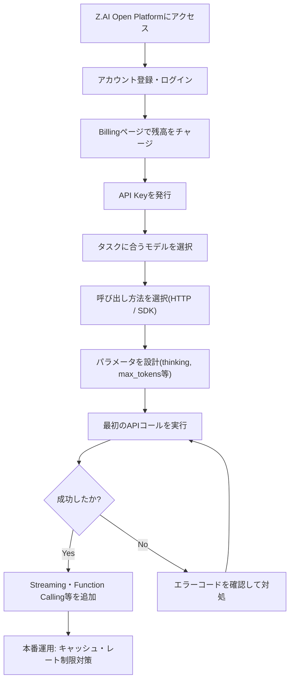
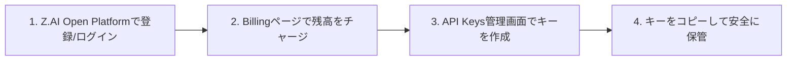
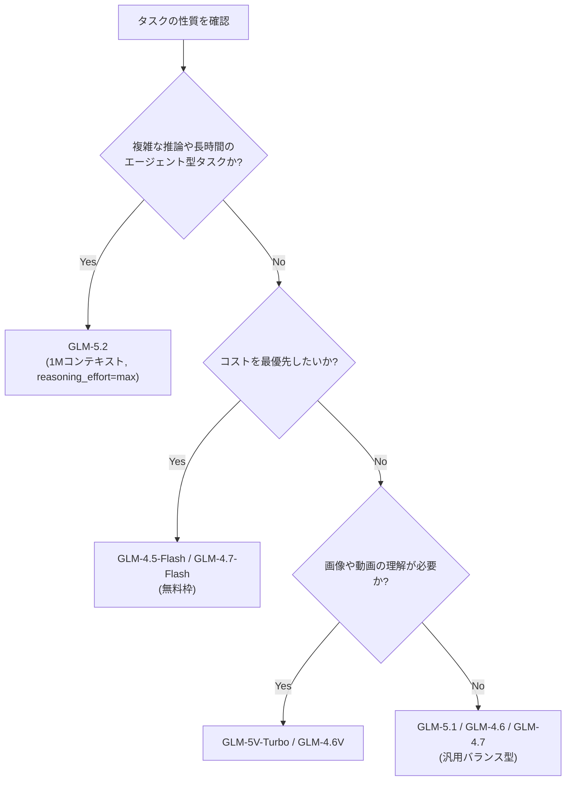
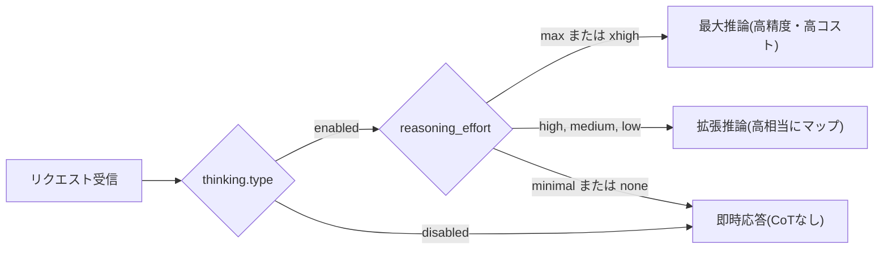
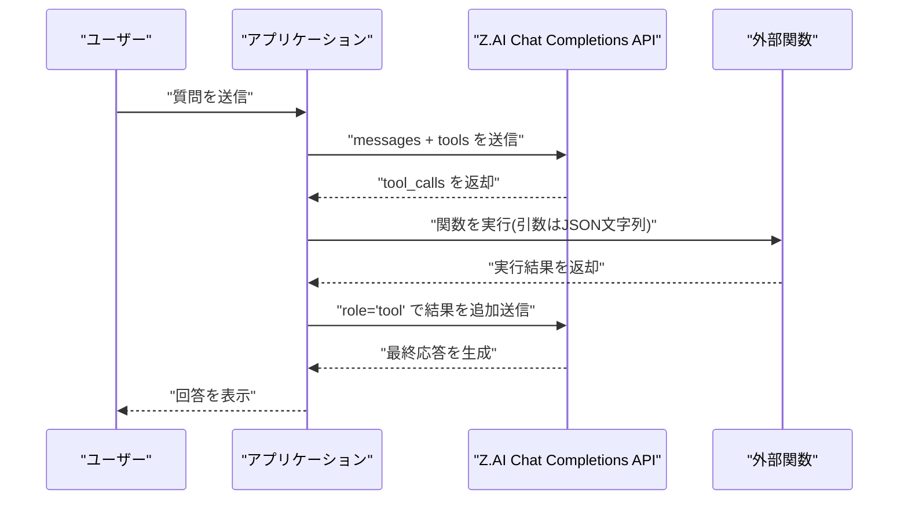
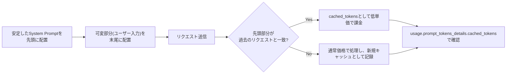
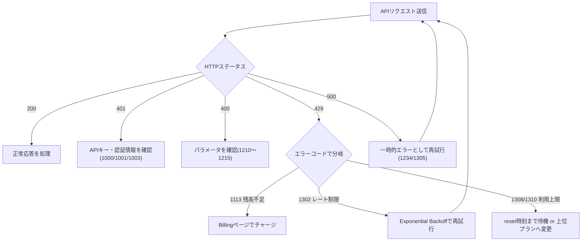
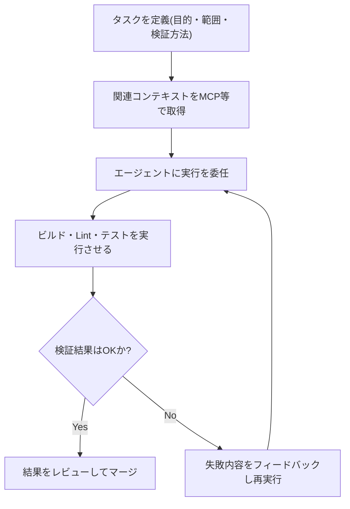

# Z.ai(GLM)LLM ベストプラクティスガイド ― 初学者向けステップバイステップ解説

> 対象読者: これから Z.ai の GLM モデル API を触り始めるエンジニア
> 最終更新の基準日: 2026年7月15日(本ガイドの記述はこの時点で公開されている Z.ai 公式ドキュメントに基づく)

---

## 目次

1. [Z.aiとGLMモデルファミリーの概要](#1-zaiとglmモデルファミリーの概要)
2. [ステップ1: アカウント作成とAPIキー発行](#2-ステップ1-アカウント作成とapiキー発行)
3. [ステップ2: モデルを選ぶ](#3-ステップ2-モデルを選ぶ)
4. [ステップ3: 呼び出し方法(SDK/HTTP)を選ぶ](#4-ステップ3-呼び出し方法sdkhttpを選ぶ)
5. [ステップ4: 最初のAPIコール](#5-ステップ4-最初のapiコール)
6. [コアパラメータのベストプラクティス](#6-コアパラメータのベストプラクティス)
7. [Deep Thinking(推論モード)の使い分け](#7-deep-thinking推論モードの使い分け)
8. [Streaming(ストリーミング応答)](#8-streamingストリーミング応答)
9. [Function Calling(関数呼び出し)](#9-function-calling関数呼び出し)
10. [Structured Output(構造化出力/JSONモード)](#10-structured-output構造化出力jsonモード)
11. [Context Caching(コンテキストキャッシュ)](#11-context-cachingコンテキストキャッシュ)
12. [エラーハンドリングとレート制限対応](#12-エラーハンドリングとレート制限対応)
13. [料金体系とコスト最適化](#13-料金体系とコスト最適化)
14. [GLM Coding Plan とコーディングエージェント運用](#14-glm-coding-plan-とコーディングエージェント運用)
15. [セキュリティ上の注意点](#15-セキュリティ上の注意点)
16. [ベストプラクティス チェックリスト](#16-ベストプラクティス-チェックリスト)
17. [参考URLまとめ](#17-参考urlまとめ)

---

## 1. Z.aiとGLMモデルファミリーの概要

Z.ai(旧 Zhipu AI)は、GLM(General Language Model)シリーズを開発・提供する中国のAI企業で、Chat向けのコンシューマー製品(Z Chat)と、開発者向けの **Z.AI Open Platform**(API基盤)の両方を展開している。2026年7月時点の旗艦モデルは **GLM-5.2** であり、1M(100万)トークンという実用レベルのコンテキスト長と、長時間タスク(long-horizon task)を安定して遂行できる点を最大の特徴として打ち出している。

GLMファミリーには用途別に複数のモデルが存在する。

| モデル | 位置づけ | コンテキスト長 | 最大出力 |
|---|---|---|---|
| GLM-5.2 | 最新の旗艦モデル。長時間タスク・エージェント型コーディングに最適化 | 1M トークン | 128K トークン |
| GLM-5.1 / GLM-5 / GLM-5-Turbo | 汎用の上位モデル群 | 〜128K程度 | 最大131,072 |
| GLM-4.7 / GLM-4.6 / GLM-4.5系 | バランス型の実用モデル | 〜128K | 65,536〜131,072 |
| GLM-4.5-Flash / GLM-4.7-Flash | 無料枠モデル。軽量タスク・プロトタイピング向け | - | - |
| GLM-5V-Turbo / GLM-4.6V / GLM-4.5V | ビジョン(画像・動画理解)モデル | - | - |
| GLM-OCR | 文書レイアウト解析・OCR特化 | - | - |

> 参考: [Z.AI Open Platform トップページ](https://z.ai/model-api) / [GLM-5.2 モデルガイド](https://docs.z.ai/guides/llm/glm-5.2) / [クイックスタート](https://docs.z.ai/guides/overview/quick-start)

以下は、これから解説する開発フロー全体を俯瞰したフローチャートである。



---

## 2. ステップ1: アカウント作成とAPIキー発行

Z.ai公式クイックスタートに沿った手順は次の4段階である。



1. **[Z.AI Open Platform](https://z.ai/model-api)** にアクセスし、登録またはログインする。
2. 必要に応じて **[Billingページ](https://z.ai/manage-apikey/billing)** で残高をチャージする(従量課金のため、事前チャージが必要な場合がある)。
3. **[API Keys管理ページ](https://z.ai/manage-apikey/apikey-list)** で新しいAPIキーを作成する。
4. 発行されたキーをコピーし、環境変数や秘密情報管理サービスに保存する(コードに直書きしない)。

**ベストプラクティス**: APIキーはリポジトリにコミットせず、`.env` ファイルや `Z_AI_API_KEY` のような環境変数として管理する。これはZ.ai公式が推奨する方法ではなく一般的なセキュリティ慣行だが、後述の「セキュリティ上の注意点」でも重要度が高い項目である。

> 参考: [クイックスタート: Get API Key](https://docs.z.ai/guides/overview/quick-start)

---

## 3. ステップ2: モデルを選ぶ

タスクの性質によって最適なモデルは異なる。以下の判断フローを目安にするとよい。



GLM-5.2 は、プロジェクト全体のコードベース理解、長期リファクタリング、モバイル実機デバッグ、研究論文の再現実装など、複数ステップにわたる開発ワークフローを1タスクで完結させることを想定して設計されている。一方で軽量なQ&Aや定型処理では、無料枠の Flash 系モデルや廉価な GLM-4.5-Air / GLM-4.7-FlashX の方がコスト効率が良い。

**ベストプラクティス**:
- まずは廉価モデルで動作検証し、精度が不足する場合のみ上位モデルへ切り替える「段階的アップグレード」が費用対効果に優れる。
- ビジョン系タスク(画像・動画・OCR)は専用のVLM(Vision-Language Model)を使う。テキスト専用モデルに画像を渡しても処理できない。

> 参考: [GLM-5.2 モデルガイド](https://docs.z.ai/guides/llm/glm-5.2) / [Pricing(モデル一覧)](https://docs.z.ai/guides/overview/pricing) / [Migrate to GLM-5.2](https://docs.z.ai/guides/overview/migrate-to-glm-new)

---

## 4. ステップ3: 呼び出し方法(SDK/HTTP)を選ぶ

Z.ai は複数の統合方法を公式に提供している。既存のスタックに合わせて選択する。

| 方式 | 特徴 | 向いているケース |
|---|---|---|
| HTTP API(REST) | 言語非依存。`curl` や任意のHTTPクライアントから利用可能 | 言語を問わない汎用統合、簡易検証 |
| 公式 Python SDK(`zai-sdk`) | 型ヒント完備、async対応 | Pythonでの本格開発 |
| 公式 Java SDK(`zai-sdk`) | 高並列・高可用性設計 | Javaでの本格開発 |
| OpenAI互換 SDK(Python/Node.js) | 既存のOpenAI用コードを`base_url`変更のみで移行可能 | OpenAI SDKから移行したい場合 |

### エンドポイントの使い分け

Z.aiには用途別に2種類のベースURLが存在する点に注意が必要である。

| API種別 | ベースURL | 用途 |
|---|---|---|
| 一般API(Pay-as-you-go) | `https://api.z.ai/api/paas/v4/` | 通常のアプリケーション開発 |
| GLM Coding Plan専用API | `https://api.z.ai/api/coding/paas/v4/` | Claude Code / Cline などのコーディングエージェント連携 |

一般APIのキーを Coding Plan 用エンドポイントに向けてしまう、あるいはその逆といった設定ミスは、実運用でよく見られる接続エラーの原因である。契約しているプランに応じて正しいベースURLを選ぶこと。

> 参考: [クイックスタート: Choose the Calling Method](https://docs.z.ai/guides/overview/quick-start) / [Python SDK GitHub](https://github.com/zai-org/z-ai-sdk-python) / [OpenAI Python SDK連携](https://docs.z.ai/guides/develop/openai/python)

---

## 5. ステップ4: 最初のAPIコール

以下は Python の公式SDK(`zai-sdk`)を使った最小構成の例である。

```bash
pip install zai-sdk
```

```python
from zai import ZaiClient

client = ZaiClient(api_key="YOUR_API_KEY")

response = client.chat.completions.create(
    model="glm-5.2",
    messages=[
        {"role": "system", "content": "あなたは有能なアシスタントです。"},
        {"role": "user", "content": "自己紹介をしてください。"},
    ],
)

print(response.choices[0].message.content)
```

OpenAI SDKからの移行を考えているなら、次のように `base_url` を変更するだけで既存コードをほぼ流用できる。

```python
from openai import OpenAI

client = OpenAI(
    api_key="YOUR_ZAI_API_KEY",
    base_url="https://api.z.ai/api/paas/v4/",
)

completion = client.chat.completions.create(
    model="glm-5.2",
    messages=[{"role": "user", "content": "こんにちは"}],
)
print(completion.choices[0].message.content)
```

**ベストプラクティス**:
- 本番運用ではタイムアウトとリトライ回数を明示的に設定する(`timeout`, `max_retries` など)。デフォルト値のまま長時間ジョブを投げると、ネットワーク瞬断で処理全体が失敗するリスクがある。
- 例外処理では、SDKが提供する `APIStatusError` / `APITimeoutError` を個別にキャッチし、後述のエラーコード表と対応させてハンドリングする。

> 参考: [クイックスタート: Make API Call](https://docs.z.ai/guides/overview/quick-start) / [GLM-5.2 Quick Start](https://docs.z.ai/guides/llm/glm-5.2) / [Python SDK GitHub](https://github.com/zai-org/z-ai-sdk-python)

---

## 6. コアパラメータのベストプラクティス

GLMモデルの出力品質・コスト・速度は、以下のパラメータの組み合わせで大きく変わる。

| パラメータ | 型 | デフォルト | 役割 |
|---|---|---|---|
| `do_sample` | Boolean | `true` | サンプリングの有無。`false`で決定論的出力 |
| `temperature` | Float | モデル依存 | 出力のランダム性。低いほど堅実、高いほど多様 |
| `top_p` | Float | モデル依存 | Nucleus samplingによる多様性制御 |
| `max_tokens` | Integer | モデル依存 | 1回の応答で生成する最大トークン数 |
| `stream` | Boolean | `false` | ストリーミング出力の有効化 |
| `thinking` | Object | `{"type": "enabled"}` | Chain-of-Thought(深い推論)の有効/無効 |

**ベストプラクティス**:
- 事実確認や厳密な回答が必要な場面(要約、抽出、コード生成など)では `temperature` を低め(0.2前後)に設定する。逆に創作・ブレインストーミングでは高め(0.8前後)にする。
- `temperature` と `top_p` は同時に調整しない。片方だけを動かす方が挙動を予測しやすい。
- チャットボットやコード生成のようなインタラクティブ用途では `stream=true` を強く推奨する。体感レイテンシが大幅に改善される。
- `max_tokens` は用途に応じて最小限に設定する。短い応答で十分な場合に大きすぎる値を設定すると、応答が冗長になりコストも増える。

### モデル別 max_tokens の目安

| モデルコード | デフォルト max_tokens | 最大 max_tokens |
|---|---|---|
| glm-5.2 / glm-5.1 / glm-5-turbo / glm-5 | 65,536 | 131,072 |
| glm-4.7 / glm-4.6 | 65,536 | 131,072 |
| glm-4.5 / glm-4.5-air / glm-4.5-x / glm-4.5-airx / glm-4.5-flash | 65,536 | 98,304 |
| glm-4.6v / glm-4.6v-flash / glm-4.6v-flashx | 16,384 | 32,768 |
| glm-4.5v | 16,384 | 16,384 |
| glm-4-32b-0414-128k | 16,384 | 16,384 |

> 参考: [Core Parameters](https://docs.z.ai/guides/overview/concept-param)

---

## 7. Deep Thinking(推論モード)の使い分け

GLM-4.5以降のモデルは、回答前に内部で段階的な思考(Chain-of-Thought)を行う「Deep Thinking」機能を備えている。`thinking.type` で有効/無効を切り替え、GLM-5.2以降ではさらに `reasoning_effort` で思考の深さを段階的に制御できる。

| `reasoning_effort` の値 | 挙動 |
|---|---|
| `max`(デフォルト・推奨) | 最も深い推論。精度重視、コストと遅延は最大 |
| `xhigh` | 内部的に `max` として扱われる |
| `high` | 拡張推論。精度とコストのバランス型 |
| `medium` / `low` | 内部的に `high` として扱われる |
| `minimal` / `none` | 思考をスキップし、即座に応答を生成 |



**ベストプラクティス**:
- 複雑な設計判断・数学的推論・長期のコーディングタスクには `thinking: {"type": "enabled"}` と `reasoning_effort: "max"` を組み合わせる。
- 単純なFAQ応答や定型フォーマット変換のような軽量タスクでは `thinking: {"type": "disabled"}` にして応答速度とコストを最適化する。
- ストリーミング時は `delta.reasoning_content` と `delta.content` が別フィールドとして返るため、UI側で「思考中」と「回答」を分けて表示すると体験が向上する。
- 深い思考ほど出力トークン数(=課金対象)が増える点に注意する。`max` は `high` に比べて出力トークンが大幅に増える傾向があるため、精度が本当に必要な場面に限定して使うとコストを抑えられる。

> 参考: [Deep Thinking](https://docs.z.ai/guides/capabilities/thinking) / [Thinking Mode(Core Parameters内)](https://docs.z.ai/guides/overview/concept-param)

---

## 8. Streaming(ストリーミング応答)

ストリーミングは、生成が完了するのを待たずに逐次コンテンツを受け取る仕組みで、Server-Sent Events(SSE)形式で送信される。チャットボットやコード生成のようなリアルタイム性が求められるUXでは必須の機能である。

```python
response = client.chat.completions.create(
    model="glm-5.2",
    messages=[{"role": "user", "content": "春をテーマにした短い文章を書いて"}],
    stream=True,
)

full_content = ""
for chunk in response:
    if not chunk.choices:
        continue
    delta = chunk.choices[0].delta
    if getattr(delta, "content", None):
        full_content += delta.content
        print(delta.content, end="", flush=True)
    if chunk.choices[0].finish_reason:
        print(f"\n完了理由: {chunk.choices[0].finish_reason}")
```

**ベストプラクティス**:
- 各チャンクの `choices[0].delta.content` を都度連結してUIに反映する。最後のチャンクにのみ `finish_reason` と `usage`(トークン使用量)が含まれる点に注意する。
- ストリーミング中にAPIが異常終了した場合、通常のエラーコードではなく `finish_reason` フィールドに理由が格納される。ストリーミング処理では `finish_reason` の監視を必ず実装する。
- Deep Thinkingと併用する場合は `delta.reasoning_content` も同時に監視し、UIで思考過程と最終回答を区別する。

> 参考: [Streaming Messages](https://docs.z.ai/guides/capabilities/streaming)

---

## 9. Function Calling(関数呼び出し)

Function CallingはAIモデルが外部関数・APIを呼び出せるようにする仕組みで、天気取得・DB検索・計算・外部サービス連携などエージェント的な振る舞いを実現する基盤になる。



基本的な実装パターンは以下の通り。

```python
import json
from zai import ZaiClient

client = ZaiClient(api_key="YOUR_API_KEY")

tools = [{
    "type": "function",
    "function": {
        "name": "get_weather",
        "description": "指定した都市の現在の天気情報を取得する",
        "parameters": {
            "type": "object",
            "properties": {
                "city": {"type": "string", "description": "都市名。例: 東京、大阪"}
            },
            "required": ["city"],
        },
    },
}]

messages = [{"role": "user", "content": "東京の天気は?"}]
response = client.chat.completions.create(
    model="glm-5.2", messages=messages, tools=tools, tool_choice="auto"
)

message = response.choices[0].message
messages.append(message.model_dump())

if message.tool_calls:
    for call in message.tool_calls:
        args = json.loads(call.function.arguments)
        result = {"city": args["city"], "temperature": "22°C", "condition": "晴れ"}
        messages.append({
            "role": "tool",
            "content": json.dumps(result, ensure_ascii=False),
            "tool_call_id": call.id,
        })
    final = client.chat.completions.create(model="glm-5.2", messages=messages, tools=tools)
    print(final.choices[0].message.content)
```

**ベストプラクティス**:
- **単一責任の原則**: 1つの関数には1つの役割のみを持たせる。
- **明確な命名と詳細な説明**: 関数名・パラメータ名・descriptionは、モデルが誤解なく解釈できるよう具体的に書く(例: 都市名の記入例を`examples`として与える)。
- **入力検証を必ず行う**: 関数呼び出しはコード実行を伴うため、SQLインジェクションや危険な文字列のフィルタリングなど、通常のバックエンド開発と同等のセキュリティ対策を実施する。
- **権限制御**: 関数がDB操作やファイル操作を行う場合、呼び出し元ユーザーの権限チェックを関数内部で行う。
- **エラーを構造化して返す**: 関数内部で例外が起きた場合も、`{"success": false, "error": "...", "error_code": "..."}` のような一貫した形式で返すと、モデルが後続の応答生成でエラー内容を適切に扱える。
- `tool_choice` は現状 `auto` のみのサポートである点に留意する。

> 参考: [Function Calling](https://docs.z.ai/guides/capabilities/function-calling)

---

## 10. Structured Output(構造化出力/JSONモード)

`response_format: {"type": "json_object"}` を指定すると、モデルは自由文ではなく事前定義した構造に沿ったJSONを返すようになる。感情分析、情報抽出、レポート整形など、後続システムでパースする前提の処理に向いている。

```python
import json
from zai import ZaiClient

client = ZaiClient(api_key="YOUR_API_KEY")

schema_prompt = """
以下のJSON形式で感情分析結果を返してください:
{
  "sentiment": "positive/negative/neutral",
  "confidence": 0.95,
  "keywords": ["キーワード1", "キーワード2"]
}
"""

response = client.chat.completions.create(
    model="glm-5.2",
    messages=[
        {"role": "system", "content": schema_prompt},
        {"role": "user", "content": "今日は天気が良くて気分がいい!"},
    ],
    response_format={"type": "json_object"},
)

result = json.loads(response.choices[0].message.content)
print(result["sentiment"], result["confidence"])
```

より厳密な検証が必要な場合は、`jsonschema` ライブラリでスキーマバリデーションを組み合わせるとよい。

```python
from jsonschema import validate

schema = {
    "type": "object",
    "properties": {
        "sentiment": {"type": "string", "enum": ["positive", "negative", "neutral"]},
        "confidence": {"type": "number", "minimum": 0, "maximum": 1},
    },
    "required": ["sentiment", "confidence"],
}

validate(instance=result, schema=schema)
```

**ベストプラクティス**:
- スキーマは最初はシンプルに設計し、必要に応じて段階的に複雑化する。
- 各フィールドに具体例(examples)や制約(enum, minimum/maximumなど)を明記すると、モデルの出力精度が上がる。
- モデル出力を必ず `json.loads` 等でパースし、失敗時・スキーマ不一致時のフォールバック処理(簡易スキーマへの切り替え、再試行など)を用意する。
- 情報量が多すぎるJSON構造を一度に要求すると、モデルの追従性が落ちる場合がある。抽出対象が多い場合は複数回のリクエストに分割することも検討する。

> 参考: [Structured Output](https://docs.z.ai/guides/capabilities/struct-output)

---

## 11. Context Caching(コンテキストキャッシュ)

Context Cachingは、システムプロンプトや会話履歴など繰り返し送信される内容を自動的に検知し、再計算を省略することでレイテンシとコストを削減する機能である。Z.aiでは**追加設定なしの暗黙的キャッシュ(Implicit Caching)**として実装されており、キャッシュヒット状況は応答の `usage.prompt_tokens_details.cached_tokens` フィールドで確認できる。



**ベストプラクティス**:
- **安定したプレフィックスを先頭に置く**: システムプロンプトや長文ドキュメントなど変化しない部分をメッセージの先頭に、ユーザーごとに変わる質問文を末尾に配置する。キャッシュは先頭からの一致度で判定されるため、この順序が極めて重要である。
- **同一システムプロンプトの使い回し**: マルチターン会話や、同じ指示文で複数タスクを処理するバッチ処理では、システムプロンプトを変更せず固定することでキャッシュ効率が最大化する。
- **長文ドキュメントをシステムメッセージ化**: 同じ文書に対して複数の質問を行う場合、文書内容をシステムメッセージとして固定し、質問部分だけをユーザーメッセージとして変える設計にすると、文書部分がキャッシュされ大幅なコスト削減になる。
- キャッシュされたトークンは通常価格より大幅に安い単価で課金される(具体的な単価は次章の料金表を参照)。

> 参考: [Context Caching](https://docs.z.ai/guides/capabilities/cache)

---

## 12. エラーハンドリングとレート制限対応

Z.aiのAPIエラーは「外側のHTTPステータスコード」と「内側のビジネスエラーコード」の二層構造になっている。

```json
{
  "error": {
    "code": "1214",
    "message": "Parameter `${field}` is invalid. Please check the documentation."
  }
}
```

### 主要なエラーコード一覧

| コード | HTTPステータス | 内容 |
|---|---|---|
| - | 500 | Internal Error(内部エラー) |
| 1000 | 401 | 認証失敗 |
| 1001 | 401 | Header内に認証パラメータがなく認証不可 |
| 1003 | 401 | 認証トークンの期限切れ。再発行が必要 |
| 1005 | 401 | 二要素認証が必要 |
| 1113 | 429 | 残高不足またはリソースパッケージ未購入 |
| 1210 | 400 | APIパラメータが不正 |
| 1211 | 400 | 不明なモデル(モデルコードを要確認) |
| 1212 | 400 | 現在のモデルはこの呼び出し方法に非対応 |
| 1213 | 400 | 必須パラメータが未指定 |
| 1214 | 400 | パラメータの値が不正 |
| 1215 | 400 | 同時指定できないパラメータの組み合わせ |
| 1220 | 403 | 該当APIへのアクセス権限なし |
| 1221 / 1222 | 400 | APIが廃止済み/存在しない |
| 1234 | 500 | ネットワークエラー(一時的なもの) |
| 1261 | 400 | プロンプトが長すぎる |
| 1301 | 400 | 入力または生成内容に安全性上の懸念を検知 |
| 1302 | 429 | リクエストのレート制限に到達 |
| 1305 | 429 | サービス側が一時的に過負荷状態 |
| 1308 / 1310 | 429 | 利用上限到達(リセット時刻まで待機が必要) |
| 1309 | 429 | GLM Coding Planの契約期限切れ |
| 1311 | 429 | 現在のプランでは当該モデルに未対応 |
| 1313 | 429 | Fair Usage Policy違反によるレート制限 |

### エラーハンドリングのフロー



**ベストプラクティス**:
- **Exponential Backoff(指数バックオフ)を実装する**: 429(レート制限)や500系エラーに対しては、即座に再試行せず待機時間を段階的に延ばしながらリトライする。Pythonでは `tenacity` ライブラリなどが利用しやすい。
- **エラーコードごとに分岐処理を実装する**: 401系は認証情報の再確認、400系はリクエスト内容の見直し、429系は待機またはプラン変更、500系は一時的リトライ、というように対応を分ける。
- **ストリーミング時は `finish_reason` を監視する**: SSE接続中に異常終了した場合は通常のエラーオブジェクトが返らず、`finish_reason` に理由が入る点を前章と合わせて再確認する。
- **一般APIとCoding Plan APIのエンドポイント取り違えに注意**: 契約プランと異なるベースURLにリクエストすると、認証エラーや接続エラー(タイムアウト・切断)が発生しやすい。

> 参考: [Errors(エラーコード一覧)](https://docs.z.ai/api-reference/api-code)

---

## 13. 料金体系とコスト最適化

Z.aiの料金は100万トークンあたりの単価で設定されており、入力・キャッシュ入力・出力でそれぞれ異なる単価が設定されている。以下は公式Pricingページに掲載されている主要テキストモデルの料金(2026年7月時点、単位: USD/1Mトークン)である。

| モデル | 入力 | キャッシュ入力 | 出力 |
|---|---|---|---|
| GLM-5.1 | $1.4 | $0.26 | $4.4 |
| GLM-5 | $1.0 | $0.2 | $3.2 |
| GLM-5-Turbo | $1.2 | $0.24 | $4.0 |
| GLM-4.7 | $0.6 | $0.11 | $2.2 |
| GLM-4.7-FlashX | $0.07 | $0.01 | $0.4 |
| GLM-4.6 | $0.6 | $0.11 | $2.2 |
| GLM-4.5 | $0.6 | $0.11 | $2.2 |
| GLM-4.5-X | $2.2 | $0.45 | $8.9 |
| GLM-4.5-Air | $0.2 | $0.03 | $1.1 |
| GLM-4.5-AirX | $1.1 | $0.22 | $4.5 |
| GLM-4-32B-0414-128K | $0.1 | - | $0.1 |
| GLM-4.7-Flash / GLM-4.5-Flash | 無料 | 無料 | 無料 |

> 注記: 本ガイド執筆時点で公式Pricingページには GLM-5.2 単体の行がまだ明記されていなかったが、複数の第三者価格トラッカー(OpenRouter、Requesty、AI Pricing Guru等)は GLM-5.2 の標準API価格を **入力 $1.40 / キャッシュ入力 $0.26 / 出力 $4.40(100万トークンあたり)** と一致して報告しており、GLM-5.1と同水準の価格帯である。正式な単価は必ず公式Pricingページで最新情報を確認すること。

ビジョンモデル・画像/動画生成モデル・組み込みツール(Web Search: $0.01/回)にもそれぞれ料金が設定されている。詳細は公式ページを参照。

**コスト最適化のベストプラクティス**:
- **タスクの複雑さに応じたモデル選定**: すべてのリクエストに旗艦モデルを使うのではなく、軽量タスクにはFlash系無料モデルやGLM-4.5-Airのような廉価モデルを割り当てる「モデルルーティング」を行う。
- **出力トークンの単価は入力の2〜4倍程度高い**ため、`max_tokens` を適切に絞り、不要に長い応答を避ける。
- **Context Cachingを活用する**(第11章参照): 固定プロンプト部分をキャッシュヒットさせることで入力コストを大幅に下げられる。
- **reasoning_effortを用途に応じて下げる**(第7章参照): `max` は精度が高い分、出力トークン数が大きく増えるため課金額も増える。要求精度に見合った設定にする。
- **無料枠モデル(Flash系)でプロトタイピングし、精度検証後に有料モデルへ移行する**段階的な検証フローがコスト面で有利である。

> 参考: [Pricing](https://docs.z.ai/guides/overview/pricing)

---

## 14. GLM Coding Plan とコーディングエージェント運用

Z.aiは、Claude Code・Cline・OpenCode・Kilo Codeなど主要なコーディングエージェントツールと連携できる **GLM Coding Plan** というサブスクリプション型プランを提供している。通常のPay-as-you-go APIとは別のエンドポイント(`https://api.z.ai/api/coding/paas/v4`)を使用する点に注意する。

コーディングエージェントを効果的に運用するための一般的な考え方として、Z.ai公式のBest Practiceガイドは以下を挙げている。

- **タスクコンテキストを丁寧に設計する**: 単発の質問応答として使うのではなく、目的・変更範囲・リスク境界・検証方法を明示したタスク記述を与えることで、エージェントの成果物の質が安定する。
- **Skill(再利用可能なワークフローテンプレート)を活用する**: 繰り返し使う定型作業(コードレビュー観点、デプロイ前チェックなど)は、都度プロンプトで説明するのではなく、構造化されたSkillとして登録し一貫した挙動を得る。
- **MCP(Model Context Protocol)で外部ツールと接続する**: コードホスティング、データベース、社内ツールなどをMCP経由で接続することで、エージェントが常に最新のコンテキストを取得できるようにする。
- **セッションを目的ごとに分離する**: 無関係なタスクを同一セッションに詰め込むと、コンテキストが肥大化し精度が落ちる。タスクの単位でセッションを区切る。



> 参考: [GLM Coding Plan Overview](https://docs.z.ai/devpack/overview) / [Best Practice(コーディングエージェント運用)](https://docs.z.ai/devpack/resources/best-practice) / [Coding Plan Quick Start](https://docs.z.ai/devpack/quick-start)

---

## 15. セキュリティ上の注意点

- **APIキーの管理**: キーはソースコードに直書きせず、環境変数やシークレットマネージャーで管理する。クライアントサイド(ブラウザ)にキーを露出させない。
- **Function Callingの安全性**: 外部関数がDB操作・ファイル操作・シェルコマンド実行などを行う場合、入力バリデーション・権限チェック・実行ログの記録を必ず実装する(第9章参照)。
- **入力コンテンツの安全性**: 機微・有害となりうるコンテンツを扱うプロンプトは、エラーコード1301(安全性検知によるブロック)の対象となりうる。想定される入力パターンを事前にテストしておく。
- **プロンプトインジェクション対策**: 外部から取得したドキュメントやWeb検索結果をそのままシステムプロンプトに混入させず、ユーザー入力と信頼できる指示を明確に分離する設計を心がける。

> 参考: [Function Calling: Security Considerations](https://docs.z.ai/guides/capabilities/function-calling) / [Errors](https://docs.z.ai/api-reference/api-code)

---

## 16. ベストプラクティス チェックリスト

| チェック項目 | 対応章 |
|---|---|
| APIキーを環境変数で管理し、コードに直書きしていないか | 2, 15 |
| タスクの複雑さに応じてモデルを使い分けているか(旗艦モデルの乱用を避けているか) | 3, 13 |
| 契約プランに合ったベースURL(一般API / Coding Plan API)を使用しているか | 4, 12 |
| チャット・生成系UXで `stream=true` を活用しているか | 8 |
| 複雑な推論タスクでのみ `reasoning_effort=max` を使い、軽量タスクではthinkingを無効化しているか | 7, 13 |
| Function Callingで入力検証・権限制御・エラーの構造化を行っているか | 9, 15 |
| JSONモード利用時にスキーマバリデーションとフォールバックを用意しているか | 10 |
| システムプロンプトを先頭固定にしてContext Cachingを活用しているか | 11 |
| 429/500系エラーに対してExponential Backoffを実装しているか | 12 |
| ストリーミング時に `finish_reason` を監視しているか | 8, 12 |

---

## 17. 参考URLまとめ

| カテゴリ | URL |
|---|---|
| Z.AI Open Platform(API起点) | https://z.ai/model-api |
| クイックスタート | https://docs.z.ai/guides/overview/quick-start |
| ドキュメント総合インデックス | https://docs.z.ai/llms.txt |
| GLM-5.2 モデルガイド | https://docs.z.ai/guides/llm/glm-5.2 |
| Migrate to GLM-5.2 | https://docs.z.ai/guides/overview/migrate-to-glm-new |
| Core Parameters(パラメータ詳細) | https://docs.z.ai/guides/overview/concept-param |
| Deep Thinking(推論モード) | https://docs.z.ai/guides/capabilities/thinking |
| Streaming Messages | https://docs.z.ai/guides/capabilities/streaming |
| Function Calling | https://docs.z.ai/guides/capabilities/function-calling |
| Structured Output | https://docs.z.ai/guides/capabilities/struct-output |
| Context Caching | https://docs.z.ai/guides/capabilities/cache |
| Errors(エラーコード一覧) | https://docs.z.ai/api-reference/api-code |
| Pricing(料金表) | https://docs.z.ai/guides/overview/pricing |
| GLM Coding Plan Overview | https://docs.z.ai/devpack/overview |
| Coding Plan Quick Start | https://docs.z.ai/devpack/quick-start |
| Best Practice(コーディングエージェント運用) | https://docs.z.ai/devpack/resources/best-practice |
| API Reference(全体) | https://docs.z.ai/api-reference/introduction |
| Python SDK(GitHub) | https://github.com/zai-org/z-ai-sdk-python |
| Java SDK(GitHub) | https://github.com/zai-org/z-ai-sdk-java |
| OpenAI互換 Python SDK連携ガイド | https://docs.z.ai/guides/develop/openai/python |
| FAQ | https://docs.z.ai/help/faq |

---

*本ガイドはZ.ai公式ドキュメント(docs.z.ai / z.ai)を一次情報源として作成しているが、GLM-5.2の単価など公式Pricingページに未反映の情報については、OpenRouter・Requesty・AI Pricing Guru等の第三者価格トラッカーを補助的に参照し、その旨を本文中に明記した。API仕様・料金・モデルラインナップは頻繁に更新されるため、実装前に必ず公式ドキュメントの最新版を確認すること。*
