# Gemini CLI / Antigravity CLI スラッシュコマンド 完全ガイド

> **対象バージョン**
> - Gemini CLI: **v0.44.1** (2026-05-28 リリース)
> - Antigravity CLI: **1.0.3**
> - Antigravity IDE コミット: **2.0.3**
>
> **対象読者**: Gemini CLI / Antigravity CLI を使い始めたばかりの初学者
> **最終更新**: 2026年5月31日
>
> ⚠️ **重要なお知らせ**: Gemini CLI は 2026年6月18日より、無料ユーザー・Google One ユーザー向けに **Antigravity CLI** へ移行されます。有料ユーザー（Google AI Pro / Ultra）は引き続き Gemini CLI を利用できます。
> 参照: [公式ブログ](https://developers.googleblog.com/an-important-update-transitioning-gemini-cli-to-antigravity-cli)

---

## 目次

1. [コマンドプレフィックスの3種類](#1-コマンドプレフィックスの3種類)
2. [スラッシュコマンド全体マップ](#2-スラッシュコマンド全体マップ)
3. [セッション管理コマンド](#3-セッション管理コマンド)
4. [コンテキスト・メモリ管理コマンド](#4-コンテキストメモリ管理コマンド)
5. [ツール・設定確認コマンド](#5-ツール設定確認コマンド)
6. [UIカスタマイズコマンド](#6-uiカスタマイズコマンド)
7. [Plan Mode — 安全な計画立案](#7-plan-mode--安全な計画立案)
8. [カスタムコマンド (TOML形式)](#8-カスタムコマンド-toml形式)
9. [@コマンドと!コマンド](#9-コマンドとコマンド)
10. [コマンド選択フローチャート](#10-コマンド選択フローチャート)
11. [ベストプラクティス 10 則](#11-ベストプラクティス-10-則)
12. [よくあるミスと解決策](#12-よくあるミスと解決策)
13. [クイックリファレンスカード](#13-クイックリファレンスカード)
14. [参考ソース一覧](#14-参考ソース一覧)

---

## 1. コマンドプレフィックスの3種類

Gemini CLI / Antigravity CLI には **3種類のコマンドプレフィックス** があります。

| プレフィックス | 役割 | 例 |
|---|---|---|
| `/` スラッシュ | CLI 自体の動作を制御する「メタコマンド」 | `/memory show` |
| `@` アットマーク | ファイル・ディレクトリの内容をプロンプトに埋め込む | `@src/main.ts を説明して` |
| `!` エクスクラメーション | シェルコマンドを直接実行する | `!git status` |

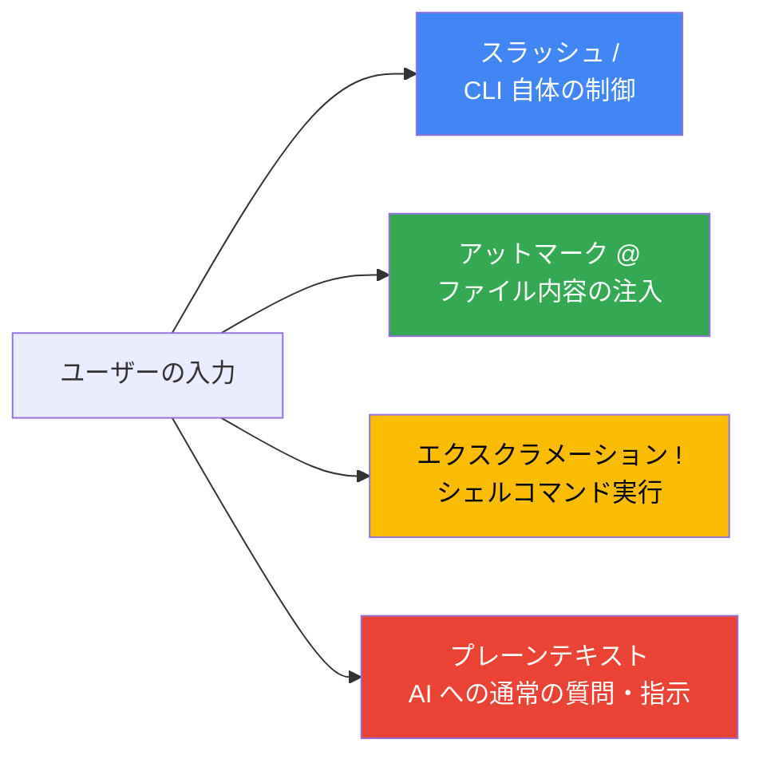

---

## 2. スラッシュコマンド全体マップ

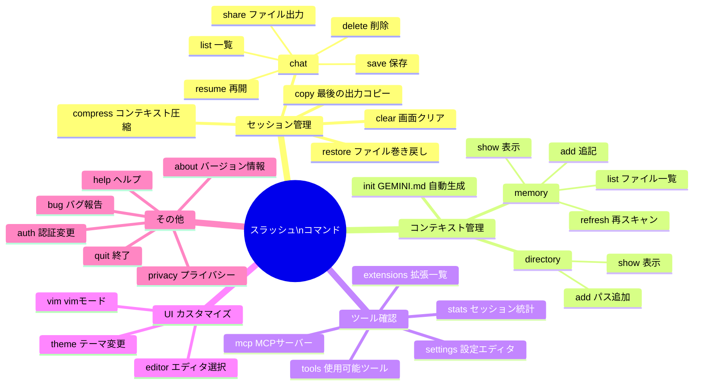

---

## 3. セッション管理コマンド

### 3.1 `/chat` — 会話の保存と再開

**目的**: 会話状態を保存・再開・共有するセッション管理機能

> **v0.44.x での変更点**: 以前の `/rewind` によるファイル変更の巻き戻し機能は **`/restore`** に統合されました。`/chat` はセッションの保存・再開専用です。

#### サブコマンド一覧

| コマンド | 説明 | 使用例 |
|---|---|---|
| `/chat save <タグ>` | 現在の会話をタグ付きで保存 | `/chat save feature-auth` |
| `/chat resume <タグ>` | 保存した会話を再開 | `/chat resume feature-auth` |
| `/chat list` | 保存済み会話の一覧表示 | `/chat list` |
| `/chat delete <タグ>` | 保存済み会話を削除 | `/chat delete old-session` |
| `/chat share <ファイル名>` | 会話を Markdown / JSON ファイルに書き出し | `/chat share report.md` |

#### チェックポイントの保存場所

| OS | 保存先パス |
|---|---|
| Linux / macOS | `~/.gemini/tmp/<project_hash>/` |
| Windows | `C:\Users\<ユーザー名>\.gemini\tmp\<project_hash>\` |

#### 使い方ステップバイステップ

**Step 1**: 作業の区切りで会話を保存する

```
/chat save before-refactor
```

**Step 2**: 翌日・別ターミナルから再開する

```
/chat resume before-refactor
```

**Step 3**: 保存済みの会話を確認する

```
/chat list
```

**Step 4**: 会話をチームに共有する

```
/chat share review-2026-05-31.md
```

> **使いどころ**: 長期的なタスクを複数セッションにまたいで進めるとき、`/chat save` でマイルストーンを刻んでおくと安全です。

---

### 3.2 `/clear` — 画面クリア

**目的**: ターミナル画面の表示をクリアする

```
/clear
```

キーボードショートカット: **Ctrl+L**

> **注意**: 表示がクリアされますが、セッションデータ（履歴・コンテキスト）は保持されます。

---

### 3.3 `/compress` — コンテキスト圧縮

**目的**: チャット全体のコンテキストを要約に置き換えてトークンを節約する

```
/compress
```


> **使いどころ**: 長時間の作業でレスポンスが遅くなってきたと感じたとき、`/compress` で圧縮してから続けると応答が速くなります。

---

### 3.4 `/restore` — ファイル変更の巻き戻し

**目的**: ツール実行前の状態にプロジェクトファイルを復元する

> ⚠️ **前提条件**: `--checkpointing` オプション付きで起動するか、`.gemini/settings.json` でチェックポインティングを有効化している必要があります。

```
/restore
```

特定のツール呼び出しまで戻る場合はIDを指定します。

```
/restore <tool_call_id>
```

#### `/restore` と `/chat resume` の違い

| 機能 | `/restore` | `/chat resume` |
|---|---|---|
| 対象 | **ファイルの変更**を元に戻す | **会話の状態**を再開する |
| 用途 | エージェントが誤ってファイルを変更したとき | 別セッションから作業を続けるとき |
| 前提 | チェックポインティング有効化が必要 | `/chat save` で事前保存が必要 |

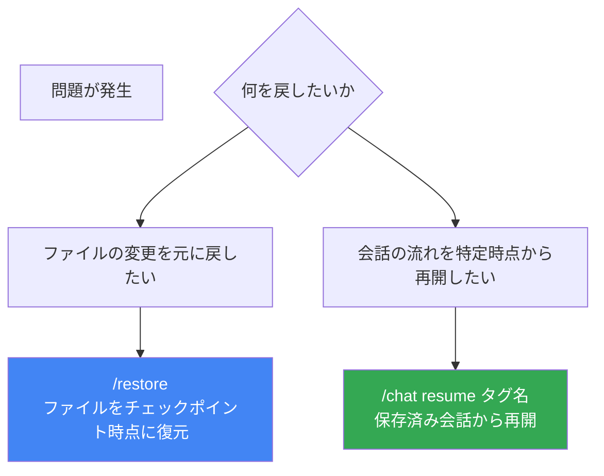

---

### 3.5 `/copy` — 最後の出力をコピー

**目的**: AI の最後の出力をクリップボードにコピーする

```
/copy
```

| OS | 必要なツール |
|---|---|
| Linux | `xclip` または `xsel`（要インストール） |
| macOS | `pbcopy`（プリインストール済み） |
| Windows | `clip`（プリインストール済み） |

---

## 4. コンテキスト・メモリ管理コマンド

### 4.1 `/memory` — GEMINI.md 管理

**目的**: GEMINI.md ファイルから読み込まれた階層型メモリを管理する

#### サブコマンド一覧

| コマンド | 説明 | 使用例 |
|---|---|---|
| `/memory show` | 現在ロードされているコンテキスト全体を表示 | `/memory show` |
| `/memory refresh` | 全 GEMINI.md を再スキャンして更新 | `/memory refresh` |
| `/memory add <テキスト>` | メモリにテキストを即時追記 | `/memory add "本番 DB への DELETE 禁止"` |
| `/memory list` | 使用中の GEMINI.md ファイルのパス一覧 | `/memory list` |

#### 使い方ステップバイステップ

**Step 1**: 現在エージェントが何を知っているか確認する

```
/memory show
```

**Step 2**: GEMINI.md を編集した後、変更を即座に反映させる

```
/memory refresh
```

**Step 3**: 作業中に発見した重要な知識を永続化する

```
/memory add "Cloud SQL の接続は /cloudsql/{conn-name} を使うこと"
```

**Step 4**: どのファイルが読み込まれているか確認する

```
/memory list
```

#### コンテキストの階層構造と優先順位

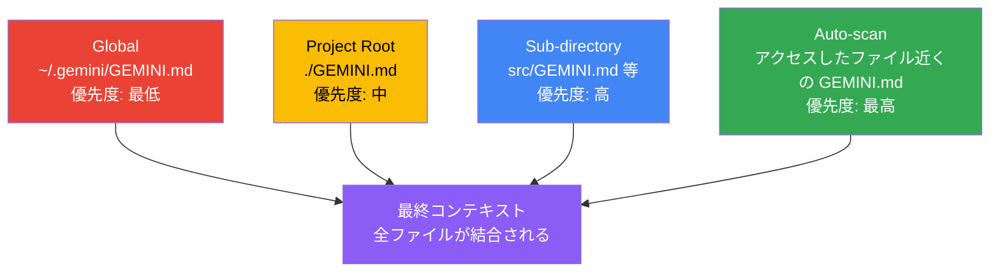

> **ポイント**: すべての GEMINI.md が**結合**されてモデルに送られます。より深い階層のファイルの内容が優先されます。

---

### 4.2 `/directory` — ワークスペース管理

**目的**: 複数ディレクトリのサポートのためにワークスペースにディレクトリを追加・確認する

| コマンド | 説明 | 使用例 |
|---|---|---|
| `/directory add <パス>` | ワークスペースにディレクトリを追加 | `/dir add ../shared-lib` |
| `/directory show` | 追加済みディレクトリを表示 | `/dir show` |

> **ショートカット**: `/dir` は `/directory` の省略形として使えます。
> **注意**: 制限的なサンドボックスプロファイル使用時は無効です。

---

### 4.3 `/init` — GEMINI.md 自動生成

**目的**: 現在のディレクトリを分析して、プロジェクト専用の GEMINI.md を自動生成する

```
/init
```

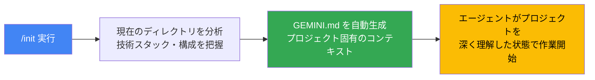

> **初回セットアップに最適**: 新しいプロジェクトを始めるとき、まず `/init` を実行することで、エージェントにプロジェクトの文脈を即座に伝えられます。

---

## 5. ツール・設定確認コマンド

### 5.1 `/mcp` — MCP サーバー確認

**目的**: 設定済みの MCP (Model Context Protocol) サーバーの状態と利用可能なツールを確認する

| コマンド | 説明 |
|---|---|
| `/mcp` | MCP サーバーの一覧・接続状態・ツール表示 |
| `/mcp desc` | MCP サーバーとツールの詳細説明を表示 |
| `/mcp nodesc` | ツール名のみ表示（説明を非表示） |
| `/mcp schema` | ツールの JSON スキーマを表示 |

キーボードショートカット: **Ctrl+T** でツール説明の表示/非表示を切り替え

---

### 5.2 `/tools` — 使用可能ツール一覧

**目的**: 現在のセッションで利用できるツールを一覧表示する

| コマンド | 説明 |
|---|---|
| `/tools` | ツール名の一覧を表示 |
| `/tools desc` | 各ツールの詳細説明を表示 |
| `/tools nodesc` | ツール名のみ表示 |

---

### 5.3 `/settings` — 設定エディタ

**目的**: Gemini CLI の設定を確認・変更する GUI 設定エディタを開く

```
/settings
```

> `.gemini/settings.json` を直接編集するより安全です。バリデーション付きの UI で設定を変更できます。一部の設定は即時反映、一部は再起動が必要です。

---

### 5.4 `/stats` — セッション統計

**目的**: 現在のセッションのトークン使用量・キャッシュ節約量・セッション時間を表示する

```
/stats
```

> **注意**: キャッシュトークン情報は API キー認証時のみ表示されます。OAuth 認証（Google アカウント）では現時点では表示されません。

---

## 6. UIカスタマイズコマンド

### 6.1 `/theme` — テーマ変更

**目的**: Gemini CLI の視覚テーマを変更するダイアログを開く

```
/theme
```

v0.40.0 以降、GitHub スタイルの色覚多様性対応テーマも追加されました。

---

### 6.2 `/editor` — エディタ選択

**目的**: 対応エディタを選択するダイアログを開く

```
/editor
```

---

### 6.3 `/vim` — vim モード切り替え

**目的**: 入力エリアで vim スタイルのナビゲーションを有効化/無効化する

```
/vim
```

| モード | 表示 | 主な操作 |
|---|---|---|
| NORMAL | フッターに `[NORMAL]` 表示 | `h/j/k/l` 移動、`w/b` 単語移動、`dd` 行削除 等 |
| INSERT | フッターに `[INSERT]` 表示 | 通常のテキスト入力 |

設定は `~/.gemini/settings.json` に保存され、セッション間で保持されます。

---

## 7. Plan Mode — 安全な計画立案

Plan Mode は **コードを一切変更せず** に、変更計画だけを安全に立案できる read-only モードです。

> **v0.44.x での起動方法**: Plan Mode は独立したスラッシュコマンドではなく、**`/settings`** から切り替えるか、起動時フラグで有効化します。

### Plan Mode の起動方法

```bash
# 起動時に Plan Mode で開始する
gemini --plan

# または /settings から手動で切り替える
/settings
```

### Plan Mode の動作フロー

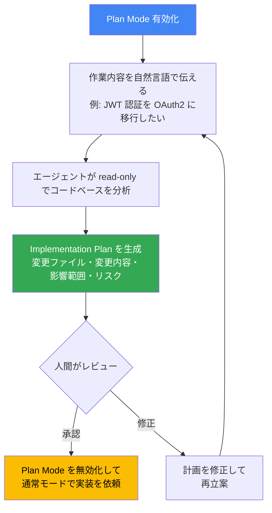

### Plan Mode でできること・できないこと

| 操作 | Plan Mode | 通常モード |
|---|---|---|
| ファイルの読み取り・分析 | できる | できる |
| コードの計画立案・提案 | できる | できる |
| ファイルの書き込み・変更 | できない | できる |
| シェルコマンドの実行 | できない | できる |

---

## 8. カスタムコマンド (TOML形式)

> **⚠️ v0.44.1 での重要な仕様変更**
>
> カスタムコマンドは **TOML 形式** (`.toml` 拡張子) で定義します。
> 保存場所は **`.gemini/commands/`** ディレクトリです。
> 旧バージョンの Markdown 形式 `.agent/workflows/*.md` は使用しません。

### ファイルの配置場所と優先度

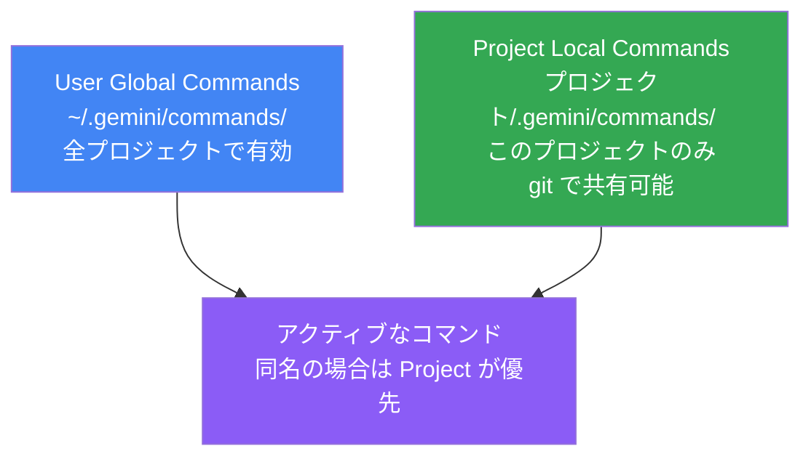

### 基本的な TOML ファイルの書き方

**ファイル**: `<project>/.gemini/commands/review.toml`

```toml
# /review コマンドとして登録される（ファイル名 = コマンド名）

description = "コードレビューを実施してレポートを生成する"

prompt = """
以下の観点でコードレビューを実施してください:

1. セキュリティ: SQL インジェクション・XSS・認証漏れ
2. パフォーマンス: N+1 クエリ・不要なループ
3. 設計: 単一責任原則・依存方向

問題があれば重大度 (P0=致命的 / P1=重要 / P2=軽微) 付きでリストアップしてください。
"""
```

### 引数を受け取るコマンド

`<args>` プレースホルダーを使ってユーザーの入力を受け取れます。

**ファイル**: `<project>/.gemini/commands/git/fix.toml`

```toml
# /git:fix コマンドとして登録される
# ディレクトリ名/ファイル名 → コロン区切りのコマンド名になる
# 呼び出し例: /git:fix "ボタンの位置がずれている"

description = "指定された問題のコード修正案を生成する"

prompt = "以下の問題に対するコード修正案を提供してください: <args>"
```

### シェルコマンドの結果を埋め込む

`!{シェルコマンド}` 構文でシェルの出力をプロンプトに注入できます。

**ファイル**: `<project>/.gemini/commands/git/commit.toml`

```toml
# /git:commit コマンドとして登録される
# 呼び出し例: /git:commit

description = "ステージ済みの変更から Git コミットメッセージを生成する"

prompt = """
以下の git diff に基づいて Conventional Commits 形式のコミットメッセージを生成してください:

```diff
!{git diff --staged}
```

"""

```

### ファイル内容を埋め込む

`@{ファイルパス}` 構文でファイルの内容をプロンプトに注入できます。

**ファイル**: `<project>/.gemini/commands/review-strict.toml`

```toml
# /review-strict コマンドとして登録される
# 呼び出し例: /review-strict src/UserService.ts

description = "ベストプラクティスガイドを参照してコードを厳格にレビューする"

prompt = """
以下のコードをレビューしてください: <args>

以下のベストプラクティスに従ってレビューすること:

@{docs/best-practices.md}
"""
```

### 名前空間（ディレクトリ構造 → コロン区切り）

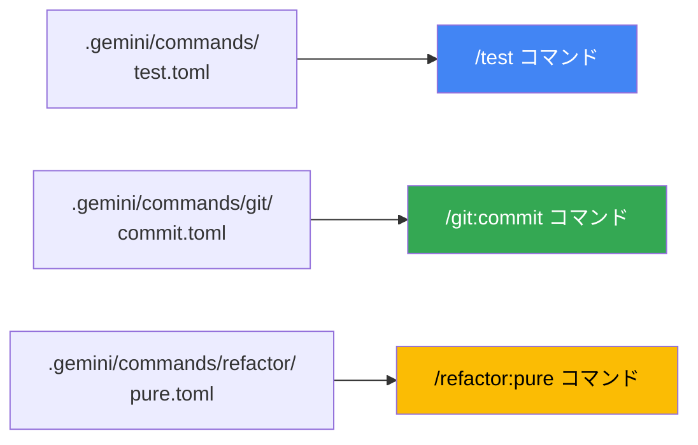

### カスタムコマンド作成 ステップバイステップ

**Step 1**: プロジェクト用のコマンドディレクトリを作成する

```bash
mkdir -p .gemini/commands
```

**Step 2**: TOML ファイルを作成する（ファイル名 = コマンド名）

```bash
touch .gemini/commands/deploy.toml
```

**Step 3**: TOML ファイルを記述する

```toml
description = "ステージング環境にデプロイする"

prompt = """
以下の手順でデプロイを実行してください:

現在の git の状態: !{git status}

1. 未コミットのファイルがある場合は停止してユーザーに報告する
2. テストを全件実行して PASS を確認する
3. ビルドを実行する
4. ステージング環境にデプロイする
5. ヘルスチェックで動作確認する
6. デプロイサマリーを出力する
"""
```

**Step 4**: チャットでコマンドを実行する

```
/deploy
```

**Step 5**: チームで共有するために git にコミットする

```bash
git add .gemini/commands/
git commit -m "feat: チーム共用デプロイコマンドを追加"
```

---

## 9. `@`コマンドと`!`コマンド

### `@` — ファイル・ディレクトリ内容の注入

```
@src/UserService.ts このファイルの問題点を指摘して
```

```
@src/components/ このディレクトリのコンポーネント設計を評価して
```

> **特徴**: `.gitignore` / `.geminiignore` で除外されているファイルは自動でスキップされます。

### `!` — シェルコマンドの直接実行

```bash
# 単発実行
!git log --oneline -10

# ! だけ入力するとシェルモードに切り替わる
!
# → シェルモードに入る。exit で CLI に戻る
```

> ⚠️ **注意**: `!` で実行したコマンドはターミナルで直接実行したのと同等の権限・影響があります。実行前に内容をよく確認してください。

---

## 10. コマンド選択フローチャート

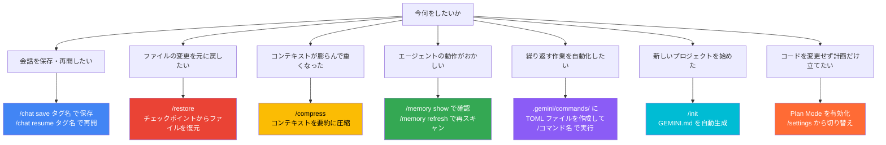

---

## 11. ベストプラクティス 10 則

### Rule 1: 新しいプロジェクトは `/init` から始める

プロジェクト開始時に `/init` を実行して GEMINI.md を自動生成しましょう。エージェントがプロジェクトの技術スタックや構成を即座に把握できます。

---

### Rule 2: 実装前は Plan Mode を活用する

大きな変更や影響範囲が不明な修正は、Plan Mode で計画を立ててから着手しましょう。


---

### Rule 3: `/chat save` で定期的にチェックポイントを作る

長い作業セッションでは節目ごとに保存しましょう。

```
/chat save phase-1-complete
```

作業が思わぬ方向に進んでも `/chat resume` で安全な状態に戻れます。

---

### Rule 4: `/compress` でコンテキストを定期的に軽量化する

長時間の作業でレスポンスが遅くなってきたら `/compress` でコンテキストを圧縮しましょう。高レベルの要約が保持されるため、作業の文脈は失われません。

---

### Rule 5: カスタムコマンドには `description` を必ず書く

```toml
description = "ステージング環境にデプロイする (テスト→ビルド→デプロイ→ヘルスチェック)"
```

`/help` メニューでの表示やチームメンバーの理解に不可欠です。

---

### Rule 6: シェル埋め込みコマンドは内容を明示する

`!{...}` を使ったカスタムコマンドは実行前に確認ダイアログが表示されます。これはセキュリティ機能です。チームに共有するコマンドでは、実行されるシェルコマンドを `description` や `prompt` 内に明示して透明性を保ちましょう。

---

### Rule 7: カスタムコマンドは名前空間で整理する

コマンドが増えてきたらディレクトリで整理しましょう。

```
.gemini/commands/
├── git/
│   ├── commit.toml    → /git:commit
│   └── fix.toml       → /git:fix
├── refactor/
│   └── pure.toml      → /refactor:pure
└── deploy.toml        → /deploy
```

---

### Rule 8: プロジェクト用コマンドは git で共有する

`.gemini/commands/` をリポジトリにコミットすることで、チーム全員が同じカスタムコマンドを使えます。

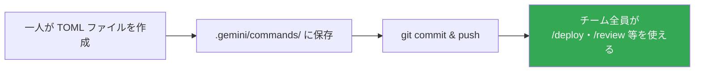

---

### Rule 9: `/memory show` でエージェントの「認識」を定期的に確認する

エージェントが期待どおりに動かないとき、まず `/memory show` で何が読み込まれているか確認しましょう。意図しない GEMINI.md が読み込まれていることがよくあります。

---

### Rule 10: Plan Mode → 実装 → `/review` → `/deploy` のサイクルを習慣化する

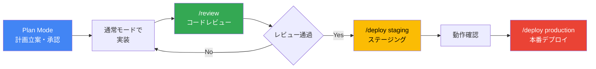

---

## 12. よくあるミスと解決策

| よくあるミス | 原因 | 解決策 |
|---|---|---|
| カスタムコマンドが認識されない | `.md` 形式・場所が違う | `.gemini/commands/` に `.toml` 形式で作成する |
| `/restore` が使えない | チェックポインティング未設定 | `--checkpointing` フラグで起動するか `settings.json` で有効化する |
| `/memory show` で GEMINI.md が表示されない | ファイルの場所が違う | `~/.gemini/GEMINI.md` または `./GEMINI.md` に配置する |
| `!{...}` コマンドが実行されない | 確認ダイアログでキャンセルした | セキュリティ確認は正常な動作。内容を確認して承認する |
| `/chat resume` で会話が見つからない | タグ名を間違えた | `/chat list` で保存済みタグを確認する |
| カスタムコマンドで引数が反映されない | `<args>` プレースホルダーがない | `prompt` 内に `<args>` を記述する |
| `@ファイルパス` でファイルが読まれない | `.geminiignore` で除外されている | `.geminiignore` の設定を確認する |
| Plan Mode が解除できない | 設定の戻し方が分からない | `/settings` を開いて Plan Mode を OFF にする |

---

## 13. クイックリファレンスカード

### 組み込みスラッシュコマンド早見表

| コマンド | 用途 |
|---|---|
| `/chat save <タグ>` | 会話をタグ付きで保存 |
| `/chat resume <タグ>` | 保存済み会話を再開 |
| `/chat list` | 保存済み会話の一覧 |
| `/chat share <ファイル>` | 会話をファイルに出力 |
| `/clear` | 画面クリア（Ctrl+L） |
| `/compress` | コンテキストを圧縮 |
| `/copy` | 最後の出力をコピー |
| `/restore [tool_call_id]` | ファイル変更を巻き戻し |
| `/memory show` | コンテキスト全体を表示 |
| `/memory refresh` | GEMINI.md を再スキャン |
| `/memory add <テキスト>` | メモリに即時追記 |
| `/memory list` | GEMINI.md ファイル一覧 |
| `/directory add <パス>` | ワークスペースにディレクトリ追加 |
| `/directory show` | ワークスペース一覧表示 |
| `/init` | GEMINI.md を自動生成 |
| `/mcp` | MCP サーバー確認 |
| `/tools` | 使用可能ツール一覧 |
| `/settings` | 設定エディタを開く |
| `/stats` | セッション統計表示 |
| `/extensions` | アクティブな拡張一覧 |
| `/theme` | テーマ変更 |
| `/editor` | エディタ選択 |
| `/vim` | vim モード切り替え |
| `/auth` | 認証方法変更 |
| `/about` | バージョン情報 |
| `/help` または `/?` | ヘルプ表示 |
| `/bug <内容>` | バグ報告 |
| `/privacy` | プライバシー設定 |
| `/quit` または `/exit` | 終了 |

### カスタムコマンド (TOML) 書き方早見表

| 機能 | 構文 |
|---|---|
| 基本定義 | `description = "説明"` + `prompt = "..."` |
| 引数受け取り | `prompt` 内に `<args>` を記述 |
| シェル出力埋め込み | `prompt` 内に `!{シェルコマンド}` |
| ファイル内容埋め込み | `prompt` 内に `@{ファイルパス}` |
| 名前空間 | `サブディレクトリ名/ファイル名.toml` → `/サブディレクトリ名:ファイル名` |
| グローバルコマンド | `~/.gemini/commands/` に配置 |
| プロジェクトコマンド | `<project>/.gemini/commands/` に配置 |

---

## 14. 参考ソース一覧

| # | タイトル | URL |
|---|---|---|
| 1 | **Gemini CLI Release Notes** — 公式リリースノート | https://geminicli.com/docs/changelogs/ |
| 2 | **Custom Commands** — カスタムコマンド公式ドキュメント | https://geminicli.com/docs/cli/custom-commands/ |
| 3 | **Plan Mode** — Plan Mode 公式ドキュメント | https://geminicli.com/docs/cli/plan-mode/ |
| 4 | **Manage context and memory** — コンテキスト管理チュートリアル | https://geminicli.com/docs/cli/tutorials/memory-management/ |
| 5 | **Manage sessions and history** — セッション管理チュートリアル | https://geminicli.com/docs/cli/tutorials/session-management/ |
| 6 | **Automate tasks** — タスク自動化チュートリアル | https://geminicli.com/docs/cli/tutorials/automation/ |
| 7 | **Checkpointing** — チェックポインティング公式ドキュメント | https://geminicli.com/docs/cli/checkpointing/ |
| 8 | **Project Context (GEMINI.md)** — GEMINI.md 公式ドキュメント | https://geminicli.com/docs/cli/gemini-md/ |
| 9 | **Command Reference** — 全コマンドリファレンス | https://geminicli.com/docs/reference/commands/ |
| 10 | **Keyboard Shortcuts** — キーボードショートカット一覧 | https://geminicli.com/docs/reference/keyboard-shortcuts/ |
| 11 | **Rewind** — Rewind 公式ドキュメント | https://geminicli.com/docs/cli/rewind/ |
| 12 | **Gemini CLI v0.44.1** — GitHub リリース | https://github.com/google-gemini/gemini-cli/releases/tag/v0.44.1 |
| 13 | **Gemini CLI → Antigravity CLI 移行のお知らせ** — Google Developers Blog | https://developers.googleblog.com/an-important-update-transitioning-gemini-cli-to-antigravity-cli |
| 14 | **Agent Skills** — Agent Skills 公式ドキュメント | https://geminicli.com/docs/cli/skills/ |

---

*本ドキュメントは Gemini CLI v0.44.1 / Antigravity CLI 1.0.3 / Antigravity IDE 2.0.3（2026-05-31 時点）の公式ドキュメントを基に作成しています。最新情報は [geminicli.com/docs](https://geminicli.com/docs) を参照してください。*
