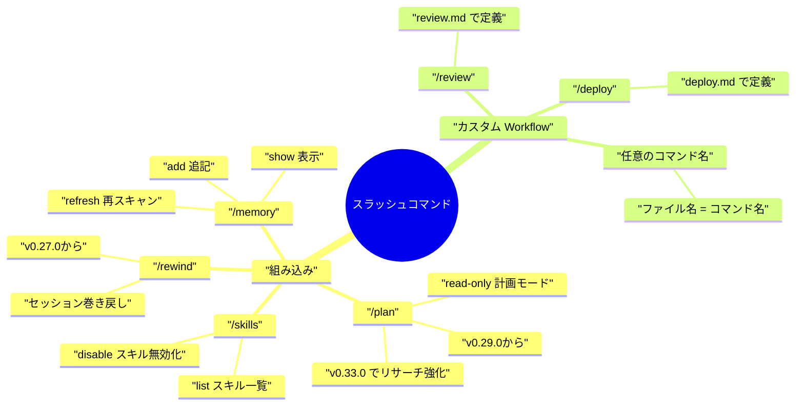
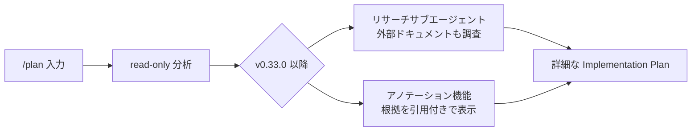
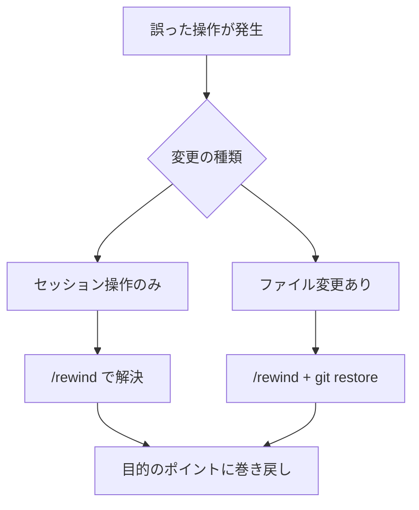
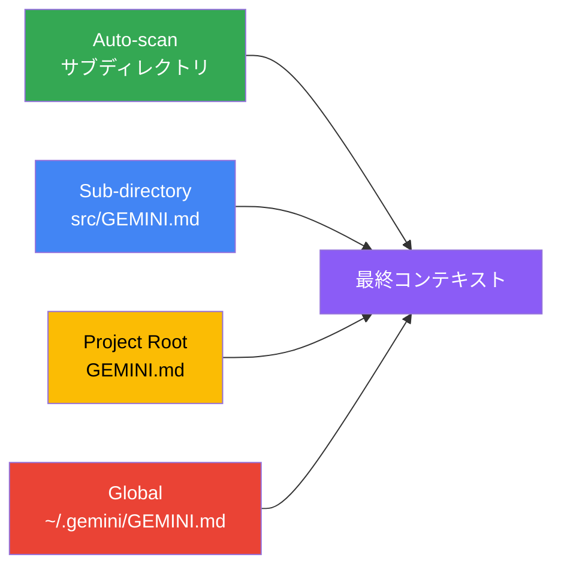
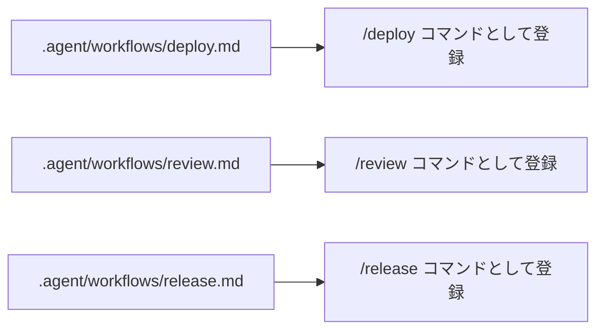
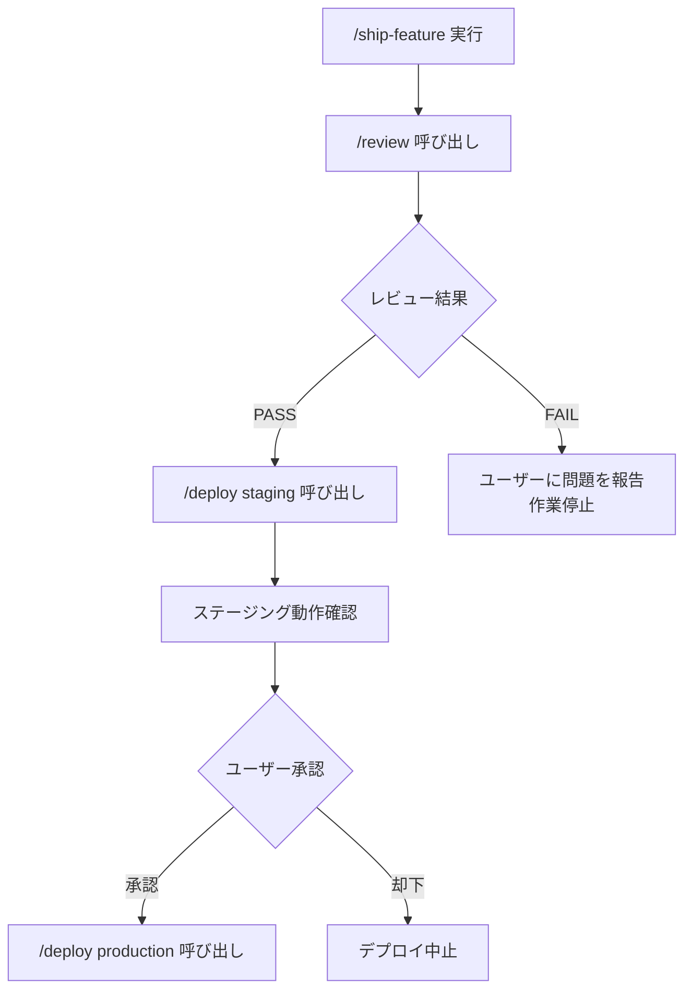
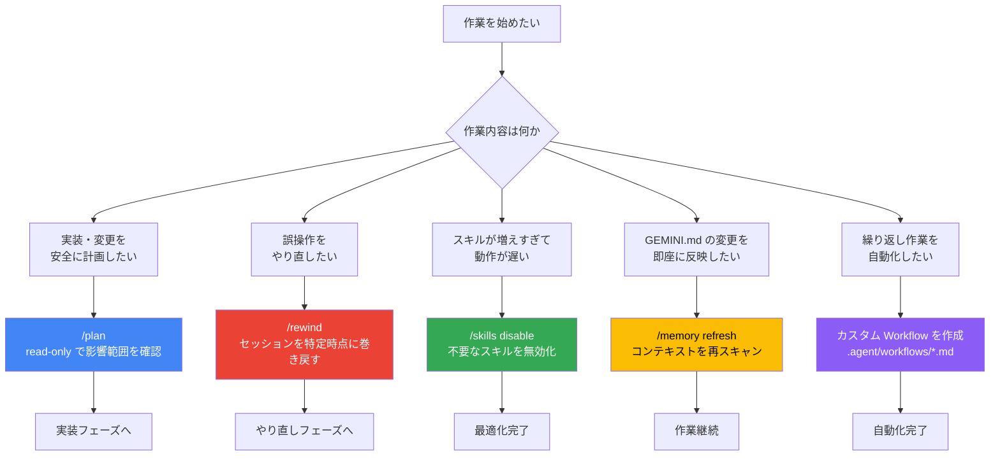
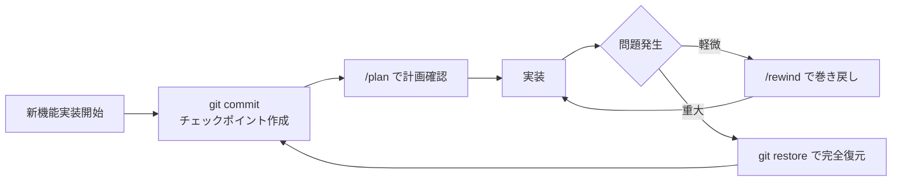
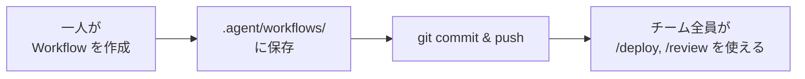
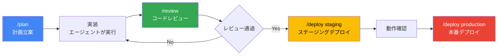

# Google Antigravity CLI スラッシュコマンド 完全ガイド

> **対象**: Google Antigravity v1.20.3 / Gemini CLI v0.34.0  
> **対象読者**: Antigravity を使い始めたばかりの初学者  
> **最終更新**: 2026年5月31日

---

## 目次

1. [スラッシュコマンドとは何か](#1-スラッシュコマンドとは何か)
2. [コマンド全体マップ](#2-コマンド全体マップ)
3. [組み込みコマンド詳細](#3-組み込みコマンド詳細)
   - [/plan — 安全な計画立案モード](#31-plan--安全な計画立案モード)
   - [/rewind — セッション巻き戻し](#32-rewind--セッション巻き戻し)
   - [/skills — スキル管理](#33-skills--スキル管理)
   - [/memory — コンテキスト管理](#34-memory--コンテキスト管理)
4. [カスタム Workflow コマンド](#4-カスタム-workflow-コマンド)
5. [コマンド選択フローチャート](#5-コマンド選択フローチャート)
6. [ベストプラクティス 10 則](#6-ベストプラクティス-10-則)
7. [よくあるミスと解決策](#7-よくあるミスと解決策)
8. [参考ソース一覧](#8-参考ソース一覧)

---

## 1. スラッシュコマンドとは何か

Antigravity / Gemini CLI のチャット画面で `/` から始まる入力をすると、あらかじめ定義された**処理を一発で呼び出せる仕組み**がスラッシュコマンドです。

### なぜスラッシュコマンドを使うのか

毎回「テストを走らせてからステージングにデプロイして、ヘルスチェックまで確認して」と文章で指示するのは非効率です。スラッシュコマンドを使えば `/deploy staging` の一言で完結します。

### 2 種類のスラッシュコマンド

| 種類 | 説明 | 定義場所 |
|------|------|---------|
| **組み込みコマンド** | Antigravity / Gemini CLI に最初から入っている | ツール本体 |
| **カスタム Workflow コマンド** | 自分でMarkdownファイルを作って定義する | `.agent/workflows/*.md` |

---

## 2. コマンド全体マップ



---

## 3. 組み込みコマンド詳細

### 3.1 `/plan` — 安全な計画立案モード

**バージョン**: Gemini CLI v0.29.0〜 / Antigravity 対応済み  
**目的**: コードを一切変更せずに、変更計画だけを安全に立案する「read-only モード」

#### どんなときに使うか

- 大規模リファクタリングの前に影響範囲を確認したい
- 本番コードを誤って変更するリスクを排除したい
- 「何を変えるべきか」を実装前にチームに共有したい

#### 使い方ステップバイステップ

**Step 1**: チャットに `/plan` と入力して Plan Mode に入る

```
/plan
```

**Step 2**: 計画したい作業を自然言語で伝える

```
UserService の認証ロジックを JWT から OAuth2 に移行したい
```

**Step 3**: エージェントが read-only でコードベースを分析し、以下を生成する

- 変更が必要なファイルの一覧
- 各ファイルで何を変更するかの説明
- 依存関係と影響範囲のマップ
- 推定工数・リスク評価

**Step 4**: 生成された Implementation Plan を人間がレビューする

**Step 5**: 承認したら通常モードで実装を依頼する

#### v0.33.0 の強化点

v0.33.0 以降、`/plan` にリサーチサブエージェントとアノテーション機能が追加されました。



#### ベストプラクティス

> **「本番コードを触る前に必ず `/plan` を実行する」**  
> コスト0でリスクを大幅に削減できます。5分の確認が数時間のバグ修正を防ぎます。

---

### 3.2 `/rewind` — セッション巻き戻し

**バージョン**: Gemini CLI v0.27.0〜  
**目的**: セッション履歴を遡り、誤った操作をロールバックする

#### どんなときに使うか

- エージェントが意図しないファイルを変更してしまった
- 途中まで進んだが方針を変えたい
- 作業を特定の状態に戻してやり直したい

#### 使い方ステップバイステップ

**Step 1**: チャットに `/rewind` と入力する

```
/rewind
```

**Step 2**: 履歴のリストが表示される。戻りたいポイントを選択する

**Step 3**: 選択したポイント以降の操作が取り消され、その状態から再開できる

#### 注意事項

| 項目 | 説明 |
|------|------|
| **対象** | セッション内の操作履歴 |
| **ファイル変更** | 一部の変更は git で管理されているため、`/rewind` だけでは元に戻らない場合がある |
| **推奨** | 大きな変更前には `git commit` でチェックポイントを作っておく |



---

### 3.3 `/skills` — スキル管理

**バージョン**: Gemini CLI 全バージョン対応  
**目的**: インストール済みスキルの有効化・無効化・一覧表示

#### サブコマンド一覧

| コマンド | 説明 | 使用例 |
|---------|------|--------|
| `/skills list` | インストール済みスキルを一覧表示 | `/skills list` |
| `/skills disable <番号>` | 特定のスキルをセッション中に無効化 | `/skills disable 3` |

#### 使い方ステップバイステップ

**Step 1**: 現在のスキル一覧を確認する

```
/skills list
```

出力例:

```
1. git-commit-formatter  ← コミットメッセージを整形するスキル
2. db-migrator           ← DBマイグレーションスキル
3. security-auditor      ← セキュリティ監査スキル (有効)
4. frontend-reviewer     ← フロントエンドレビュースキル
```

**Step 2**: 不要なスキルを無効化してパフォーマンスを最適化する

```
/skills disable 2
```

> **なぜ無効化するのか**: アクティブスキルが増えすぎると AI が混乱し精度が低下します。**目安は 10〜15 個以内**です。

#### スキル数とパフォーマンスの目安

| アクティブスキル数 | 精度・速度 | 推奨 |
|-----------------|-----------|------|
| 1〜5 個 | 普通 | 少なすぎる |
| 6〜15 個 | **最適** | **推奨** |
| 16〜25 個 | やや低下 | 要整理 |
| 26 個以上 | 大幅低下 | 非推奨 |

---

### 3.4 `/memory` — コンテキスト管理

**バージョン**: Gemini CLI 全バージョン対応  
**目的**: GEMINI.md などのコンテキストファイルを動的に管理する

#### サブコマンド一覧

| コマンド | 説明 | 使用例 |
|---------|------|--------|
| `/memory show` | 現在ロードされているコンテキストを全表示 | `/memory show` |
| `/memory refresh` | コンテキストファイルを再スキャン | `/memory refresh` |
| `/memory add <テキスト>` | グローバル GEMINI.md に即時追記 | `/memory add "このプロジェクトはTDDを採用"` |

#### 使い方ステップバイステップ

**Step 1**: 現在のコンテキストを確認する

```
/memory show
```

GEMINI.md の内容・読み込まれているルール・スキルのメタデータが表示されます。

**Step 2**: GEMINI.md を編集した後、変更を即座に反映させる

```
/memory refresh
```

**Step 3**: セッション中に気づいたことを永続化する

```
/memory add "Cloud SQL の Unix socket 接続は /cloudsql/{conn-name} を使う"
```

これにより次回セッションでもこの知識がエージェントに伝わります。

#### コンテキスト読み込みの優先順位



> **読み込み優先度**: Auto-scan（最高）> Sub-directory > Project Root > Global（最低）  
> より具体的なファイルが優先されます。

---

## 4. カスタム Workflow コマンド

カスタムコマンドは `.agent/workflows/` ディレクトリに Markdown ファイルを作るだけで定義できます。**ファイル名がそのままコマンド名**になります。

### 仕組み



### カスタム Workflow ファイルの書き方

**ファイル**: `.agent/workflows/deploy.md`

```markdown
# Deploy Workflow
# トリガー: `/deploy staging` または `/deploy production` で起動

## 引数
- `$ENV`: ターゲット環境 (staging | production)

## 手順
1. `git status` でコミット漏れがないことを確認する
2. テストを全件実行: `pnpm test`
3. テストが失敗した場合は即座に停止してユーザーに報告する
4. ビルドを実行: `pnpm build`
5. $ENV 環境にデプロイ:
   - staging: `vercel --env staging`
   - production: ユーザーに確認を求めてから実行すること
6. ヘルスチェック: `curl https://$ENV.myapp.com/health`
7. デプロイサマリーの Artifact を生成してユーザーに提示する
```

### 呼び出し方

```
/deploy staging
```

または

```
/deploy production
```

### カスタムコマンド作成 ステップバイステップ

**Step 1**: `.agent/workflows/` ディレクトリを作成する

```bash
mkdir -p .agent/workflows
```

**Step 2**: Markdown ファイルを作成する（ファイル名 = コマンド名）

```bash
touch .agent/workflows/review.md
```

**Step 3**: Workflow の内容を記述する

```markdown
# Code Review Workflow

## 手順
1. `git diff main` で変更差分を取得する
2. 以下の観点でコードレビューを実施:
   - セキュリティ: SQLi・XSS・認証漏れ
   - パフォーマンス: N+1クエリ・不要なループ
   - 設計: SRP・依存方向
3. 問題があれば重大度 (P0/P1/P2) 付きでリストアップ
4. `docs/tasks.md` に未対応課題として追記する
5. レビュー結果を Artifact として出力する
```

**Step 4**: チャットでコマンドを実行する

```
/review
```

### Workflow のチェーン化

Workflow 内から別の Workflow を呼び出すことができます。

```markdown
# Ship Feature Workflow

## 手順
1. /review を実行してレビューが通ることを確認する
2. レビューが PASS したら /deploy staging を実行する
3. ステージングの動作確認後、ユーザーに本番デプロイの確認を求める
4. 承認されたら /deploy production を実行する
```



---

## 5. コマンド選択フローチャート

「今どのコマンドを使うべきか」の判断フローです。



---

## 6. ベストプラクティス 10 則

### Rule 1: 実装前は必ず `/plan` を実行する

本番コードへの影響が不明な変更は、まず `/plan` で影響範囲を把握してから着手します。

> **根拠**: Antigravityの設計思想「Task ListやImplementation Planは必ずレビューする。ここで設計ミスを検出することがバグコスト最小化の鍵」

---

### Rule 2: 大きな変更前に `git commit` でチェックポイントを作る

`/rewind` はセッション操作を巻き戻せますが、ファイル変更まで完全に元に戻せるわけではありません。Git のコミットと組み合わせることで確実なセーフティネットになります。



---

### Rule 3: スキルは 15 個以内に絞り `/skills disable` を活用する

| 状況 | 対処 |
|------|------|
| スキルが 15 個を超えた | `/skills disable` で使っていないスキルを無効化 |
| 特定のプロジェクト専用スキルが不要になった | ワークスペーススキルを削除 |
| AI の応答が遅い・精度が低い | まずスキル数を確認・削減 |

---

### Rule 4: `/memory show` でコンテキストを定期的に確認する

エージェントが「なぜこういう動作をするのか分からない」ときは `/memory show` で現在のコンテキストを確認します。意図しないルールが読み込まれていることがよくあります。

---

### Rule 5: カスタム Workflow は「Why」を書く

手順だけでなく「なぜその手順か」をコメントで記述すると、エージェントの判断精度が上がります。

```markdown
## 手順
# なぜ Step 1 でテストを実行するか:
# デプロイ失敗の 70% はテスト漏れが原因のため。早期検出でロールバックコストを下げる。
1. `pnpm test` を実行してすべてのテストが PASS することを確認する
```

---

### Rule 6: Workflow には引数を定義する

環境名やバージョンなどを引数化することで、同じ Workflow を複数の用途に使い回せます。

```markdown
## 引数
- `$ENV`: 環境名 (dev | staging | production)
- `$VERSION`: デプロイバージョン (例: v1.2.3)
```

呼び出し: `/deploy production v1.2.3`

---

### Rule 7: Workflow の最後には必ず Artifact を生成させる

実行結果をエビデンスとして残すことで、後から「何をしたか」を追跡できます。

```markdown
## 手順の最後
7. 以下を含むデプロイサマリー Artifact を生成する:
   - デプロイ日時・環境・バージョン
   - テスト結果サマリー
   - ヘルスチェック結果
```

---

### Rule 8: `/memory add` で作業中に発見した知識を即座に記録する

```
/memory add "Supabase の Row Level Security は anon ロールに明示的にポリシーを設定しないとアクセス不可"
```

次回セッションでもこの知識が引き継がれます。

---

### Rule 9: カスタム Workflow は Git でチーム共有する

`.agent/workflows/` ディレクトリはリポジトリにコミットすることで、チーム全員が同じコマンドを使えます。



---

### Rule 10: `/plan` → 実装 → `/review` → `/deploy` のサイクルを習慣化する



---

## 7. よくあるミスと解決策

| よくあるミス | 原因 | 解決策 |
|------------|------|--------|
| `/plan` をスキップして実装を依頼した | 計画なしに実装させた | 大きな変更前は必ず `/plan` を先に実行 |
| カスタムコマンドが認識されない | Workflow ファイルの場所が違う | `.agent/workflows/` に配置されているか確認 |
| `/skills disable` しても効かない | セッションをまたいで設定したかった | `disable` はセッション限定。永続化は `skills list` から削除 |
| `/rewind` で戻りすぎた | 戻りたいポイントを誤選択 | git のコミット履歴を使って特定状態に復元 |
| `/memory refresh` 後もコンテキストが古い | キャッシュが残っている | Antigravity IDE を再起動する |
| Workflow が途中で止まる | 手順に曖昧な指示がある | 「確認を求めること」「停止すること」を明示的に記述 |

---

## 8. 参考ソース一覧

| # | タイトル | URL |
|---|---------|-----|
| 1 | **Getting Started with Google Antigravity** — Google Codelabs | https://codelabs.developers.google.com/getting-started-google-antigravity |
| 2 | **Authoring Google Antigravity Skills** — Google Codelabs | https://codelabs.developers.google.com/getting-started-with-antigravity-skills |
| 3 | **Advanced Tips for Mastering Google Antigravity** — Amulya Bhatia | https://iamulya.one/posts/advanced-tips-for-mastering-google-antigravity/ |
| 4 | **Agent Skills \| Gemini CLI 公式ドキュメント** | https://geminicli.com/docs/cli/skills/ |
| 5 | **Plan Mode 公式ドキュメント** — Gemini CLI | https://geminicli.com/docs/plan-mode |
| 6 | **Gemini CLI /rewind コマンド** (v0.27.0〜) | https://geminicli.com/docs/rewind |
| 7 | **Gemini CLI 全リリース履歴** — GitHub | https://github.com/google-gemini/gemini-cli/releases |
| 8 | **Build with Google Antigravity** — Google Developers Blog | https://developers.googleblog.com/build-with-google-antigravity-our-new-agentic-development-platform/ |
| 9 | **How Google Antigravity is changing spec-driven development** — Google Cloud Medium | https://medium.com/google-cloud/benefits-and-challenges-of-spec-driven-development-and-how-antigravity-is-changing-the-game-3343a6942330 |
| 10 | **Google Antigravity Review 2026 (v1.20.3 Updated)** — AI Tool Analysis | https://aitoolanalysis.com/google-antigravity-review/ |
| 11 | **Gemini CLI Changelog** | https://geminicli.com/docs/changelogs/ |
| 12 | **Skills + Hooks + Plan Mode 解説** — DEV Community | https://dev.to/googleai/unlocking-gemini-cli-with-skills-hooks-plan-mode-2bgf |
| 13 | **Gemini 3.1 Pro リリースアナウンス** — Google Blog | https://blog.google/innovation-and-ai/models-and-research/gemini-models/gemini-3-1-pro/ |
| 14 | **antigravity-awesome-skills** — GitHub コミュニティ | https://github.com/sickn33/antigravity-awesome-skills |

---

## クイックリファレンスカード

| コマンド | 用途 | バージョン |
|---------|------|-----------|
| `/plan` | read-only で変更計画を安全に立案 | v0.29.0〜 |
| `/rewind` | セッションを特定ポイントに巻き戻す | v0.27.0〜 |
| `/skills list` | インストール済みスキル一覧を表示 | 全バージョン |
| `/skills disable <番号>` | 指定スキルをセッション中に無効化 | 全バージョン |
| `/memory show` | 現在のコンテキスト全体を表示 | 全バージョン |
| `/memory refresh` | コンテキストファイルを再スキャン | 全バージョン |
| `/memory add <テキスト>` | GEMINI.md に知識を即時追記 | 全バージョン |
| `/<workflow名>` | カスタム Workflow を実行 | 全バージョン |

---

*本ドキュメントは Google Antigravity v1.20.3 / Gemini CLI v0.34.0 時点の情報を基に作成しています。最新情報は [geminicli.com/docs](https://geminicli.com/docs) および [antigravity.google](https://antigravity.google) を参照してください。*
