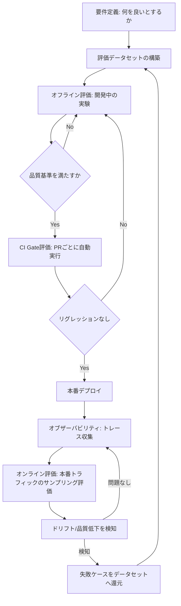
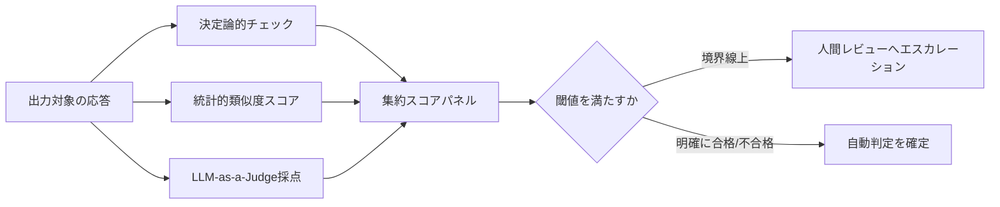
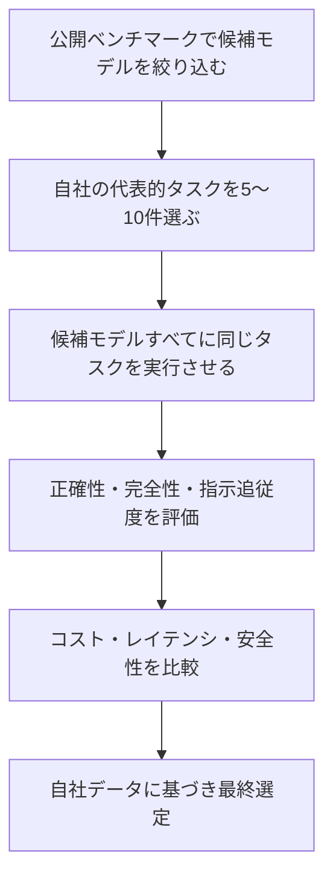
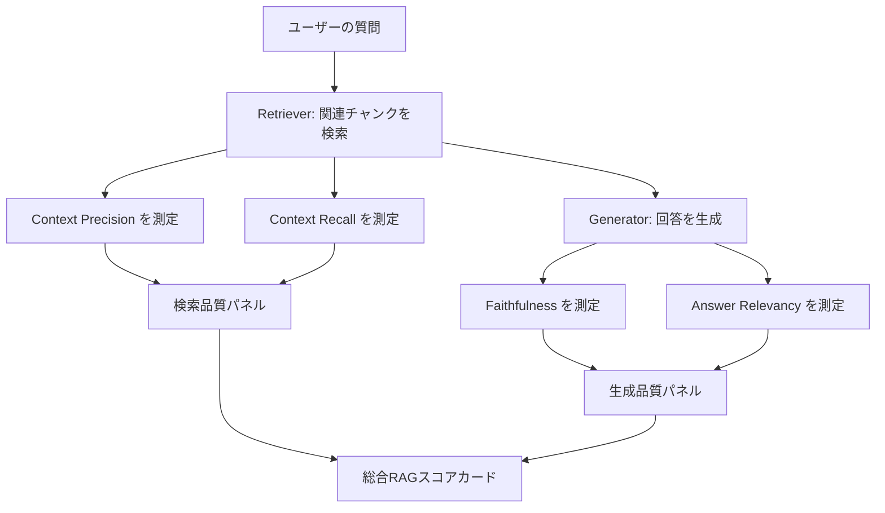
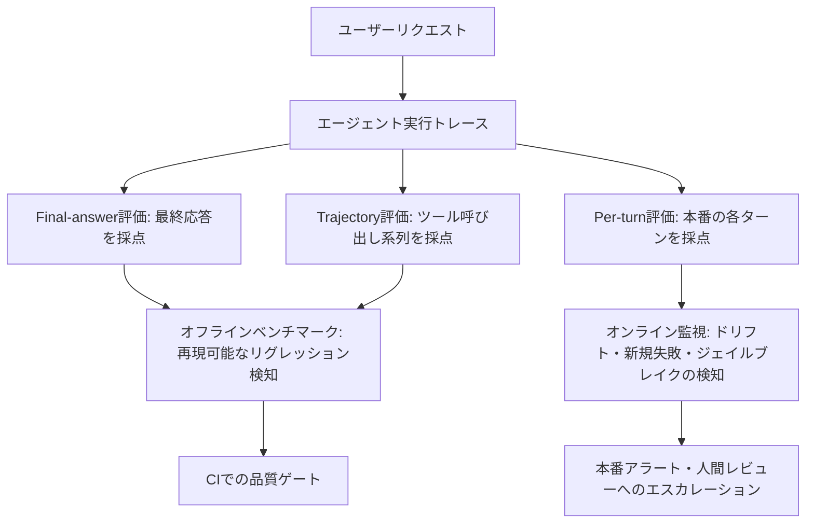
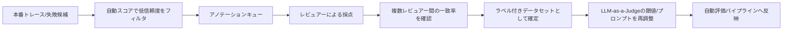
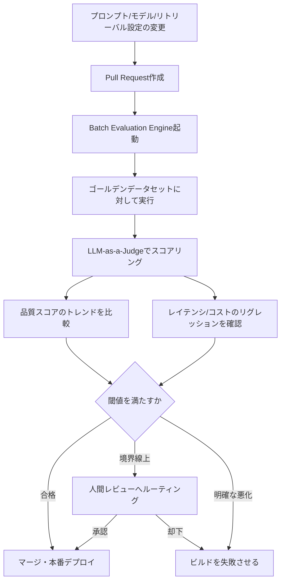
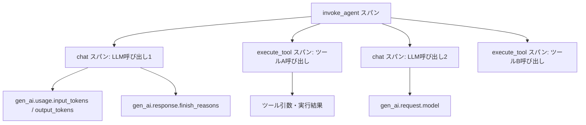
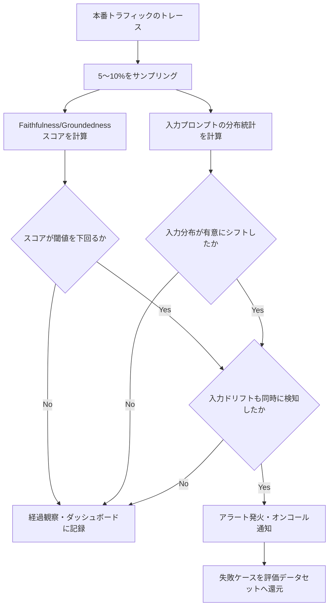
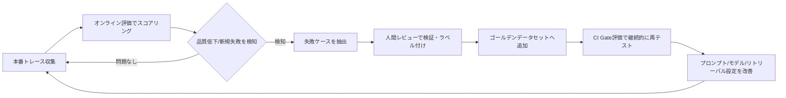

# LLM評価・ベンチマーク & オブザーバビリティ ベストプラクティスガイド(2026年版)

> 対象読者:AI/MLエンジニア、ソフトウェアアーキテクト、QAエンジニアで、LLM(Large Language Model)アプリケーションの品質評価(Evaluation)、公開ベンチマーク(Benchmarking)の読み方、そして本番環境でのオブザーバビリティ(Observability)を体系的に学びたい初学者〜中級者。
>
> 本ガイドは2026年7月時点で参照可能な一次情報・業界レポートに基づいて作成しています。LLMエコシステムは変化が非常に速い領域のため、ツールのバージョンや料金体系は必ず公式サイトで最新情報を確認してください。

## 目次

1. [はじめに:なぜ評価とオブザーバビリティが必要なのか](#section1)
2. [全体像:Evaluation・Benchmarking・Observabilityの関係](#section2)
3. [ステップ1:評価戦略を3層で設計する](#section3)
4. [ステップ2:評価指標(メトリクス)の分類を理解する](#section4)
5. [ステップ3:公開ベンチマーク/リーダーボードの正しい読み方](#section5)
6. [ステップ4:RAGシステムの評価(Ragas 4大メトリクス)](#section6)
7. [ステップ5:AIエージェントの評価(3層評価モデル)](#section7)
8. [ステップ6:LLM-as-a-Judgeを正しく使う](#section8)
9. [ステップ7:Human-in-the-Loop評価ワークフロー](#section9)
10. [ステップ8:CI/CDへの評価組み込み(Evaluation Gate)](#section10)
11. [ステップ9:オブザーバビリティ基盤 — OpenTelemetry GenAI Semantic Conventions](#section11)
12. [ステップ10:本番監視 — ドリフト検知とハルシネーション検知](#section12)
13. [ステップ11:コスト・レイテンシ監視](#section13)
14. [ステップ12:ツール選定ガイド(比較表)](#section14)
15. [ステップ13:継続的改善のフィードバックループ(Data Flywheel)](#section15)
16. [実践チェックリスト](#section16)
17. [まとめ](#section17)
18. [総合参考資料一覧](#section18)

---

<a id="section1"></a>
## 1. はじめに:なぜ評価とオブザーバビリティが必要なのか

LLMを使ったアプリケーションには、従来のソフトウェアテストが前提としてきた「同じ入力には同じ出力が返る」という決定論的な性質がありません。プロンプトを1単語変えただけでも出力の質が大きく変わり、ある不具合を直しても別の不具合が静かに生まれることがあります。さらに深刻なのは、LLMが失敗しても例外(Exception)は発生せず、HTTPステータスコードは200のまま、もっともらしい誤った回答(ハルシネーション)を返す点です。この「静かな失敗」こそが、評価(Evaluation)とオブザーバビリティ(Observability)という2つの規律が2026年のLLMOpsにおいて中核的な実践になっている理由です。

実務上のリスクも具体化しています。大手メディアがAI生成記事の誤りで訂正を余儀なくされたり、大手テック企業がAIニュース要約機能を一時停止した事例が報告されており、評価を怠ることは「シートベルトなしで運転する」ことに例えられています。さらにEU AI Actのような規制は2026年8月2日から本格施行され、リスクベースでの評価証跡の保存が義務化される領域が拡大しています。

- 評価(Evaluation):LLMの出力を品質・安全性・コスト・レイテンシといった複数の観点でスコアリングする行為そのもの。
- ベンチマーク(Benchmarking):公開データセットや標準化されたタスク集合を使い、モデル同士を横並びで比較する行為。
- オブザーバビリティ(Observability):本番環境で実際に何が起きているかを、トレース・メトリクス・ログとして可視化し続ける仕組み。

この3つは独立した活動ではなく、開発から本番運用まで続く1本のライフサイクルの異なる段階を担っています。

**参考資料**
- What is LLM Evaluation: Best Frameworks, Metrics, Tools & Practices in 2026 — https://gogloby.com/insights/llm-evaluation/
- LLM Evaluation: Frameworks, Metrics, and Best Practices (2026 Edition) — https://medium.com/@future_agi/llm-evaluation-frameworks-metrics-and-best-practices-2026-edition-162790f831f4
- LLM Evaluation: Metrics, Frameworks & Best Practices(EU AI Act施行時期) — https://techsy.io/en/blog/llm-evals-guide

---

<a id="section2"></a>
## 2. 全体像:Evaluation・Benchmarking・Observabilityの関係

2026年時点のベストプラクティスでは、評価は「開発が終わった後の後付け作業」ではなく、プロンプト・データセット・ポリシーをコードと同様にバージョン管理された一級市民(first-class, versioned assets)として扱う考え方が定着しています。評価とトレースをモデルバージョンに紐付けることで、すべての出力に明確な系譜(lineage)を持たせられます。

評価は開発ライフサイクルの3つの地点で実行されます。

1. **オフライン評価**:キュレーションされたデータセットに対して実行(開発中・リリース前)
2. **CI Gate評価**:プロンプトやモデルを変更するたびにCI上で自動実行(マージ前)
3. **オンライン評価**:実際の本番トラフィックに対して継続的に実行(リリース後)

これら3層をどうつなげるかを示したのが以下の図です。



この図が示す通り、オブザーバビリティで収集したトレースは、次の評価データセットの材料(=データフライホイール)として還元され続けます。これが単発のテストと2026年のLLM評価の最大の違いです。

**参考資料**
- The best LLM evaluation tools of 2026 — https://medium.com/online-inference/the-best-llm-evaluation-tools-of-2026-40fd9b654dce
- Best LLM Evaluation Frameworks in 2026: Ranked for Production — https://futureagi.com/blog/llm-evaluation-frameworks-metrics-best-practices/

---

<a id="section3"></a>
## 3. ステップ1:評価戦略を3層で設計する

評価を始める前に、まず「何を良い出力とするか」を定義する必要があります。ベストプラクティスとして繰り返し挙げられるのが以下の4点です。

1. **本番を代表するデータセットを使う**:ベンチマーク用の綺麗な質問だけでなく、実際のユーザーの入力(表記揺れ、不完全な質問、業界固有の用語など)を反映させる。ベンチマークプロンプトで好成績でも、実際のサポート対応では誤字や省略形に弱いというケースは典型的な失敗パターンです。
2. **自動評価と人手評価を組み合わせる**:単一の評価手法だけでは不十分であるため、決定論的メトリクス・統計的メトリクス・LLM-as-a-Judgeを併用します(詳細は次章)。
3. **継続的に評価する**:一度きりの品質チェックではなく、CIとオンライン監視の両方で継続的に実行する。
4. **失敗を定期的にレビューする**:失敗事例を単なるバグ修正で終わらせず、評価データセットへ組み込むプロセスを設計する。

データセットの出どころとしては、本番ログから抽出した実際のユーザークエリ、既知の失敗ケース、意図的に作られたエッジケースが最も価値が高いとされています。合成データだけに頼ると、実運用との乖離(いわゆる「テストのための勉強」問題)が生じやすくなります。

**参考資料**
- What is LLM Evaluation: Best Frameworks, Metrics, Tools & Practices in 2026 — https://gogloby.com/insights/llm-evaluation/
- Best LLM Evaluation Frameworks in 2026: Ranked for Production — https://futureagi.com/blog/llm-evaluation-frameworks-metrics-best-practices/
- LLM Evaluation and Benchmarking 2026 | Zylos Research — https://zylos.ai/research/2026-01-16-llm-evaluation-benchmarking/

---

<a id="section4"></a>
## 4. ステップ2:評価指標(メトリクス)の分類を理解する

評価指標は大きく3種類に分類できます。それぞれ得意なことと苦手なことが異なるため、単独ではなく組み合わせて使うのが2026年の標準的なアプローチです。

| 分類 | 説明 | 代表例 | 長所 | 短所 |
|---|---|---|---|---|
| 決定論的(Deterministic) | ルールベースの厳密一致・正規表現・スキーマ検証 | 完全一致、JSON/XMLスキーマ検証、正規表現によるフォーマットチェック | 高速・低コスト・再現性が高い | 意味的な誤り(セマンティックリグレッション)を検出できない |
| 統計的(Statistical) | 単語やベクトルの類似度に基づくスコア | BLEU、ROUGE、埋め込み(Embedding)コサイン類似度 | 計算コストが低い | 表層的な文字列類似度に依存し、事実の正しさを保証しない |
| LLM-as-a-Judge | 別のLLMに出力を採点させる手法 | G-Eval、DAGMetric、pairwise比較 | 人間の判断との一致率が高い(80〜90%程度と報告)、柔軟にカスタム基準を定義できる | コストとレイテンシが増える、判定側LLM自体にバイアスや不安定性がある |

LLM-as-a-Judgeは、人間による評価と比べて500〜5,000倍程度低コストで、80〜90%の一致率を達成できると報告されており、量産評価の主軸になっています。ただし、人間の判断を完全に置き換えるものではなく、「自動評価で全件をスクリーニングし、フラグが立ったケースだけを人間がレビューする」という補完関係で使うのがベストプラクティスとされています。

実務でよく使われるLLM-as-a-Judgeの実装パターンは以下の通りです。

- **criteria(基準)ベース**:新しいメトリクスを試作する初期段階で使う、自然言語による大まかな評価基準。
- **evaluation_steps(手順)ベース**:メトリクスがCI/CDや本番監視で重要になった段階で、採点手順を明示的なステップに分解する。
- **GEval(参照ベース)**:evaluation_paramsに正解(reference)を含めることで、正解との比較を伴う採点に発展させる。
- **DAGMetric**:複数ステップの厳密な採点ロジックを有向非巡回グラフ(DAG)としてモデル化する手法。
- **ArenaGEval**:プロンプトやモデルのバージョン同士をペアで比較する手法。



**参考資料**
- LLM-as-a-Judge in 2026: Top evaluation techniques and best practices | DeepEval — https://deepeval.com/blog/llm-as-a-judge
- LLM Evaluation and Benchmarking 2026 | Zylos Research — https://zylos.ai/research/2026-01-16-llm-evaluation-benchmarking/
- LLM-as-a-judge vs human-in-the-loop evals: When to use each | Braintrust — https://www.braintrust.dev/articles/llm-as-a-judge-vs-human-in-the-loop-evals

---

<a id="section5"></a>
## 5. ステップ3:公開ベンチマーク/リーダーボードの正しい読み方

公開ベンチマークは「業界全体でモデルを比較するための共通言語」として重要ですが、2026年時点では多くの伝統的ベンチマークが飽和(Saturation)しており、単独のスコアだけで判断するのは危険です。

MMLU(57分野にまたがる知識テスト)は、2020年の登場時点では平均32%だったフロンティアモデルのスコアが、2026年には平均92%前後まで上昇し、上位モデルが88〜94%の範囲に密集するようになりました。この結果、モデル間の実力差を見分ける指標としての価値が大きく低下しています。HellaSwag(常識推論)も同様に95%以上で飽和状態にあると報告されています。

この飽和を受けて、業界はより難易度の高いベンチマークに軸足を移しています。

| ベンチマーク | 主な目的 | 2026年時点の特徴 |
|---|---|---|
| MMLU | 57分野の知識網羅性 | 飽和(88〜94%)。継続性のため報告はされるが差別化指標としての価値は低下 |
| GPQA Diamond | 大学院レベルの科学推論(生物・化学・物理) | 専門家でも正答率が低い難問設計。60〜90%台でモデル間の差が明確に出る |
| SWE-bench Verified | 実際のソフトウェアバグの自動修正能力 | コーディングエージェントの実力評価で重視 |
| Humanity's Last Exam (HLE) | 最難関の推論タスク | 最上位モデルでも正答率が数十%台にとどまる |
| ARC-AGI-2 | 抽象的推論・汎化能力 | パターン学習では解けない設計 |
| LMSYS Chatbot Arena(Arena Elo) | 人間による盲検A/B比較に基づく総合的な「人間らしさ」評価 | 2026年半ばで600万票超、360以上のモデルを比較。Eloレーティングで順位付け |
| AgentBench / GAIA / τ-bench | エージェントのツール利用・計画・タスク遂行能力 | ブラウザ操作やファイル検索などのマルチステップタスクを評価 |

Arena形式のブラインドA/Bバトルは、モデル名を伏せて2つの応答を人間に比較させ、勝敗をEloレーティングに変換する仕組みで、自動採点よりもスコアの水増しに強いとされています。一方、ベンチマークにも共通の弱点があります。

- **データ汚染(Data Contamination)**:モデルが学習データの中に、ベンチマークの問題そのもの(またはよく似た問題)を含んでいる可能性がある。
- **自社ユースケースを代表しない**:公開リーダーボードは、あなた自身のプロンプト形式・ツールスキーマ・言語・レイテンシ予算での挙動を予測できない。

したがって実務的な結論は次の通りです。「リーダーボードはモデル選定の一次スクリーニングに使い、最終判断は必ず自社データでの評価(オフライン評価)で行う」。



**参考資料**
- LLM Leaderboard Explained 2026: Arena, MMLU, GPQA, SWE-bench — https://futureagi.com/blog/llm-leaderboard-explained/
- AI Model Benchmarks: 92% MMLU, SWE-bench, 2026 — https://valueaddvc.com/blog/ai-model-benchmarks-explained-mmlu-humaneval-lmsys-arena-and-what-they-actually-measure
- LLM Benchmarks Compared: MMLU, HumanEval, GSM8K and More (2026) — https://www.lxt.ai/blog/llm-benchmarks/
- LLM Comparison 2026: 30+ Models Benchmarked & Ranked — https://iternal.ai/llm-selection-guide
- LLM Benchmarks Explained: MMLU, Chatbot Arena & SWE-bench Leaderboard (2026) — https://mysummit.school/blog/en/how-llm-benchmarks-work-2026/

---

<a id="section6"></a>
## 6. ステップ4:RAGシステムの評価(Ragas 4大メトリクス)

RAG(Retrieval-Augmented Generation)は2026年時点で本番LLMシステムの主流パターンとなっており、専用の評価アプローチが確立されています。RAGの評価は「検索(Retrieval)の質」と「生成(Generation)の質」という2つの独立した失敗モードに分解して考えるのが鉄則です。

Ragas(オープンソースのRAG評価フレームワーク)を軸に、業界で最も広く使われている4つのコアメトリクスは以下の通りです。

| メトリクス | 測定対象 | 何を検出するか |
|---|---|---|
| Faithfulness(忠実性) | 生成 | 回答が検索されたコンテキストに基づいているか(根拠のない主張=ハルシネーションがないか) |
| Answer Relevancy(回答の関連性) | 生成 | 回答がユーザーの質問に実際に答えているか |
| Context Precision(コンテキスト精度) | 検索 | 検索されたチャンクが質問に関連しているか |
| Context Recall(コンテキスト再現率) | 検索 | 正解を導くために必要な情報が検索結果に含まれているか |

このほか、Context Entity Recall、Answer Correctness、Answer Similarity、Aspect Critiqueといった拡張メトリクスも用意されています。

実務上重要な教訓として、「Faithfulnessが高い(=検索結果に忠実)」ことは「正しい回答である」ことを保証しません。ある法律系RAGシステムの事例では、オフライン評価でFaithfulness 0.91という高スコアを記録していたにもかかわらず、本番稼働後に「複数ホップの質問で重要な条文が回答から漏れる」という不具合が報告されました。原因を調査するとContext Recallはわずか0.62しかなく、検索側が2つ目の条文を取得できていなかったことが判明しました。生成モデルは取得できた部分的なコンテキストに忠実に(つまりFaithfulness高く)回答していたため、生成品質だけを見るダッシュボードでは検知できなかったのです。この事例は、検索側と生成側の両方を独立して測定する重要性を示しています。



Ragasの実装は、LLM-as-a-Judgeの考え方を使い、回答を原子的な主張(atomic claim)に分解し、それぞれの主張を検索されたコンテキストと突き合わせて0〜1の連続値スコアを返します。文字列の完全一致を求める従来のユニットテストとは異なり、このスコアは時系列で追跡したり、CIでゲートしたり、質問の種類ごとにスライスして分析することができます。

実践フローとしては、まず50〜200件程度の代表的なクエリからなる「ゴールデンデータセット」を用意し、可能であれば手動で検証した理想的な回答と情報源の文書を紐づけます。最初はFaithfulnessとContext Recallの2つから計測を始め、CIに組み込んで閾値を設定し、その後アプリケーションの進化に合わせてメトリクスとデータセットを拡張していくアプローチが推奨されています。

なお、標準的な4メトリクスは「検索インデックス自体が信頼できる」ことを前提にしている点に注意が必要です。検索対象のドキュメントが古い、所有者が不明、正規のソースと食い違っているといった場合、Faithfulnessスコアが高くてもビジネス上誤った回答を返すことがあります。これは「コンテキストの信頼性」という第5の評価軸として指摘されており、データのリネージ管理と合わせて考える必要があります。

**参考資料**
- Ragas RAG Evaluation Metrics Complete Guide 2026 — https://qaskills.sh/blog/ragas-rag-evaluation-metrics-complete-guide
- RAG Evaluation Metrics in 2026: Faithfulness & More — https://futureagi.com/blog/rag-evaluation-metrics-2025/
- RAG Evaluation: Metrics, Tools, and the Context Gap (2026) — https://atlan.com/know/how-to-evaluate-rag-systems-explained/
- RAG Evaluation 2026: Methods, Metrics, Frameworks — https://datavlab.ai/post/rag-evaluation-methods-metrics-2026-guide
- RAG Evaluation Metrics 2026: The Complete Guide — https://qaskills.sh/blog/rag-evaluation-metrics-complete-2026

---

<a id="section7"></a>
## 7. ステップ5:AIエージェントの評価(3層評価モデル)

AIエージェント(複数ステップでツール呼び出しや計画立案を行うシステム)は、単発の応答を評価するだけでは不十分です。エージェントは「すべてのツール呼び出しは正しいのに、最終的なタスクは失敗している」というケースが起こり得るためです。2026年のベストプラクティスでは、評価を3つの層に分けて考えます。

1. **Final-answer評価(最終出力評価)**:最後のメッセージを期待される結果と比較する。ほとんどのベンチマークやチュートリアルが対象とする層。
2. **Trajectory評価(実行軌跡評価)**:ステップの並びとツール呼び出しの系列を評価する。正しい手順を踏んだか、無駄なループがなかったかを見る。
3. **Per-turn評価(ターンごとの評価)**:本番環境の各ターンの意味を評価する。オフラインでは再現できない、実際のユーザーとのやり取りの品質を捉える。

held-outタスクに対する最終回答の正解率だけを見る評価は、「ループしてから答えたか」「間違ったツールを呼んで後から回復したか」「途中で推論過程を漏洩したか」「3ターン目でユーザーが苛立っていたか」といった、本番トラフィックでしか見えない失敗をほとんど検出できません。

主なエージェント評価メトリクスは以下の通りです。

| メトリクス | 内容 |
|---|---|
| Task Completion(タスク完了率) | ユーザーが与えたタスクをエージェントが完了できたかどうか。「完了」の定義はタスクごとに異なる |
| Tool Call Accuracy(ツール呼び出し精度) | 正しいツールを、正しい順序で、正しい引数で呼び出せたか |
| Trajectory Match(軌跡一致度) | 期待される実行系列とどれだけ一致しているか |
| Reasoning(推論の一貫性) | 各ステップの判断がゴールに対して妥当か、思考の連鎖が一貫しているか |
| Step/Loop Count(ステップ数・ループ回数) | 無駄な繰り返しや暴走ループがないか |
| Cost per Successful Task(成功1件あたりのコスト) | タスク完了に要したトークン・API費用 |

代表的な公開エージェントベンチマークとしては、AgentBench(LLMのエージェントとしての行動能力を評価する先駆的なベンチマーク)、GAIA(ブラウザ操作・ファイル検索・ツール利用を要する現実的なタスク)、τ-bench(プリンストン大学とSierra社が開発した、実務的なカスタマーサービスタスクでの評価)などがあります。



エージェントは非決定的であるため、同じ入力でも実行のたびに異なるツールを選んだり、異なるコンテキストを検索したりします。評価はこの変動性を許容しつつ、一定の品質基準を強制する設計にする必要があります。オフライン評価は既知タスクの固定データセットに対してCIで再現性高く実行し、オンライン評価は実際のトラフィックに対してドリフトや未知の失敗、ジェイルブレイクの試行を検知する、という役割分担が基本です。

**参考資料**
- LLM Agent Evaluation Metrics in 2026 | Confident AI — https://www.confident-ai.com/blog/llm-agent-evaluation-complete-guide
- AI Agent Evaluation (2026): Metrics, Frameworks, and Production Failures — https://www.morphllm.com/ai-agent-evaluation
- Top 5 AI Agent Evaluation Platforms in 2026 — https://www.getmaxim.ai/articles/top-5-ai-agent-evaluation-platforms-in-2026/
- Best LLM Evaluation Tools for AI Agents in 2026 | Confident AI — https://www.confident-ai.com/knowledge-base/compare/best-llm-evaluation-tools-for-ai-agents

---

<a id="section8"></a>
## 8. ステップ6:LLM-as-a-Judgeを正しく使う

LLM-as-a-Judgeは強力な手法ですが、判定側LLM自体が一貫性を欠いたりバイアスを持ったりすることが学術研究でも指摘されています。実務で安定した運用をするためのポイントは以下の通りです。

- **temperatureを0に固定する**:自動パイプラインでLLM-as-a-Judgeを実行する際は、再現性のあるスコアリングのためにtemperatureを0に設定するのが推奨されています。
- **pairwise比較を活用する**:単一応答への絶対スコアよりも、2つの応答を比較させる(ペアワイズ)方が、判定の一貫性が高くなる傾向があります。
- **判定プロンプトのバージョン管理**:判定プロンプト(Judgeプロンプト)を変更した場合、過去のスコアとの比較は無効になります。判定プロンプトが変わった時点でベースラインを再計測し、リグレッション追跡上の境界としてタグ付けする必要があります。
- **人間によるキャリブレーション**:自動採点の信頼性を担保するため、定期的に人間のレビューとの一致率を確認し、判定プロンプトを調整します。
- **バイアスと一貫性の分析**:同じ入力を複数回判定させて分散を見る、判定順序を入れ替えて位置バイアスがないか確認するといった手法で、自動採点システムの信頼性そのものを検証します。

LLM-as-a-Judgeは自動採点の量産化に不可欠な一方、人間の判断を完全に置き換えるものではなく、「自動評価で全件をスクリーニングし、境界線上や重要なケースだけを人間がレビューする」というハイブリッド運用が2026年の標準的な考え方です。

**参考資料**
- LLM-as-a-Judge in 2026: Top evaluation techniques and best practices | DeepEval — https://deepeval.com/blog/llm-as-a-judge
- Automated LLM Evaluation: Building a CI/CD quality gate that actually runs | Galtea — https://galtea.ai/blog/automated-llm-evaluation-building-a-ci-cd-quality-gate-that-actually-runs
- Ultimate Guide to CI/CD for LLM Evaluation | Latitude — https://latitude.so/blog/ultimate-ci-cd-llm-evaluation-guide

---

<a id="section9"></a>
## 9. ステップ7:Human-in-the-Loop評価ワークフロー

自動評価だけでは捉えきれない品質次元(トーン、ポリシー遵守、ドメイン固有の妥当性など)を扱うために、人間によるレビュー(Human-in-the-Loop, HITL)は依然として不可欠です。効果的なHITLワークフローを構築するための実践ポイントは以下の通りです。

1. **明確な採点基準を先に定義する**:「5点」が何を意味するのか(事実の正確性か、トーンか、タスク完了か、ポリシー遵守か)を、レビューを始める前に定義します。
2. **単純な尺度から始め、キャリブレーションセッションを行う**:1〜5点の有用性評価のようなシンプルな尺度から始め、複数のレビュアーが同じ会話セットを採点し、解釈をすり合わせるキャリブレーションセッションを実施します。
3. **エンドユーザーとレビュアーの役割を分ける**:エンドユーザーには「この応答は役に立ったか」という可視化された結果についてフィードバックを求め、検索・ツール呼び出し・ガードレールといった内部の仕組み(スパン)についてはドメインエキスパートやQAレビュアーが評価します。
4. **信頼度ベースの選択的レビュー**:LLMがすべての項目にラベルを付け、信頼度スコアが低いものだけを人間の再レビューに回すことで、コストを50〜96%程度削減できたという報告があります。ただし、この方式には自動化バイアス(人間がLLMの提案に無批判に追従してしまう傾向)のリスクがあるため注意が必要です。
5. **失敗を評価データセットに還元する**:レビュアーがツール呼び出しの誤りや微妙な推論エラーを発見した場合、その事例をテストスイートに追加し、将来のすべての更新で自動的に採点されるようにします。

学術研究では、LLMを評価者として使う場合の一貫性・バイアスに関する課題(位置バイアス、冗長性バイアスなど)が報告されており、自動化された判定と人間の判断を組み合わせた「五層の監督スタック」(自動チェック、LLM採点、人間レビュー、人間による監視、フィードバックループ)が最も高い信頼性を実現するという指摘もあります。



**参考資料**
- Human-in-the-Loop Review Workflows for LLM Applications & Agents | Comet — https://www.comet.com/site/blog/human-in-the-loop/
- LLM-as-a-judge vs human-in-the-loop evals | Braintrust — https://www.braintrust.dev/articles/llm-as-a-judge-vs-human-in-the-loop-evals
- Human-in-the-Loop Workflows for AI Agent Evaluation | Confident AI — https://www.confident-ai.com/blog/human-in-the-loop-ai-agent-evaluation
- Human-in-the-Loop, Human-on-the-Loop, and LLM-as-a-Judge for Validating AI Outputs | Kili Technology — https://kili-technology.com/blog/human-in-the-loop-human-on-the-loop-and-llm-as-a-judge-for-validating-ai-outputs

---

<a id="section10"></a>
## 10. ステップ8:CI/CDへの評価組み込み(Evaluation Gate)

プロンプトはコードではありませんが、デプロイ対象の成果物(deployment artifact)のように振る舞います。本番のプロンプトを変更することは、アプリケーションの挙動そのものを変えることであり、コードの変更と同じレベルの厳格さが必要です。

CI/CDに評価を組み込む際に、すべてのコード変更が評価トリガーになるわけではありません。以下の3種類の変更が評価実行のトリガーになるべきとされています。

1. **モデルバージョン/モデル設定の変更**:モデルプロバイダーがモデル名を変えずに内部モデルを更新することがあるため、モデルやプロバイダーの切り替え時は必ず全量評価を実行する。
2. **プロンプトの変更**:システムプロンプトやテンプレートの変更。
3. **リトリーバル設定の変更**:チャンク分割戦略や埋め込みモデルの変更など、RAGの検索側の設定変更。

CI/CDゲートの評価パイプラインは、以下の要素で構成されます。

- **Batch Evaluation Engine**:新しいプロンプトバージョンをテストデータセットに対して実行し、各出力をLLM-as-a-Judgeに送ってスコアリングする。
- **品質だけでなく性能も見る**:レイテンシスパイクやコスト超過を検知し、閾値を超えたらビルドを失敗させるアラートを組み込む。
- **スコアの傾向を追跡する**:単一のポイントスコアではなく、トレンドとして追跡し、集団としてのリグレッションを検知する(1件だけの失敗をハードブロックにしない)。
- **境界線上のケースは人間レビューへ**:自動判定で白黒つけがたいケースは、ハードブロックにせず人間レビューへルーティングする。



なお、LLM評価はソフトウェアテストとは本質的に異なる点に注意が必要です。従来のテストでは入力はスペックで固定されますが、LLM評価では、失敗モードが新たに発見されるたびに、あるいは製品スコープが変わるたびに、ゴールデンデータセット自体が変化していきます。つまりデータセット管理自体を「バックグラウンドの雑務」ではなく、第一級のエンジニアリング課題として扱う必要があります。

**参考資料**
- Automated Prompt Regression Testing with LLM-as-a-Judge and CI/CD | Traceloop — https://www.traceloop.com/blog/automated-prompt-regression-testing-with-llm-as-a-judge-and-ci-cd
- Automated LLM Evaluation: Building a CI/CD quality gate that actually runs | Galtea — https://galtea.ai/blog/automated-llm-evaluation-building-a-ci-cd-quality-gate-that-actually-runs
- CI/CD Integration for LLM Eval and Security | Promptfoo — https://www.promptfoo.dev/docs/integrations/ci-cd/
- CI/CD for LLM Prompts: How to Build a Prompt Deployment Pipeline | Agenta — https://agenta.ai/blog/cicd-for-llm-prompts
- Best AI Eval Tools for CI/CD Pipelines (2026 Review) | Braintrust — https://www.braintrust.dev/articles/best-ai-evals-tools-cicd-2025

---

<a id="section11"></a>
## 11. ステップ9:オブザーバビリティ基盤 — OpenTelemetry GenAI Semantic Conventions

従来のマイクロサービス向けオブザーバビリティは、LLMアプリケーションにはそのまま使えません。LLM呼び出しは通常のHTTPリクエストよりもはるかに多くのテレメトリを生成し、プロンプトや補完結果は巨大なテキストの塊であり、ツール呼び出しのパラメータは毎回異なる構造を取り、エージェントの多段階推論は固定スキーマに収まりません。さらに「どのモデルが呼ばれ、どれくらいの時間がかかったか」だけでなく、消費トークン数・コスト・回答の品質まで把握する必要があります。

こうした課題に対応するため、2024年4月にOpenTelemetryの中にGenAI Special Interest Group(GenAI SIG)が発足し、LLM/エージェント向けのテレメトリを標準化する意味論的規約(Semantic Conventions)の策定を進めています。CNCF(Cloud Native Computing Foundation)がバックアップするこの規約は、Google Cloud、AWS、Azure、Datadogなど主要な観測プラットフォームに採用されつつあります。

### 主要な属性(gen_ai.*)

| 属性 | 説明 |
|---|---|
| `gen_ai.provider.name` | プロバイダー識別子(例:`openai`、`anthropic`、`aws.bedrock`) |
| `gen_ai.request.model` | リクエスト先のモデル名 |
| `gen_ai.response.model` | 実際に応答を生成したモデル名 |
| `gen_ai.usage.input_tokens` / `gen_ai.usage.output_tokens` | 入力/出力トークン数 |
| `gen_ai.response.finish_reasons` | 生成が終了した理由(例:`stop`、`tool_calls`) |
| `gen_ai.operation.name` | 操作の種別(例:`chat`、`text_completion`、`execute_tool`) |
| `gen_ai.input.messages` / `gen_ai.output.messages` | プロンプト・応答の内容(コンテンツ記録がオプトインされた場合のみ) |

規約は「クライアントスパン」「エージェントスパン」「MCP(Model Context Protocol)ツール呼び出し」「イベント(コンテンツ記録用)」「メトリクス」「プロバイダー固有の規約」という6つの層をカバーしています。エージェントがLLMを呼び出す際は、トップレベルの`invoke_agent`スパンの下に、各LLM呼び出しに対応する`chat`スパンと、各ツール呼び出しに対応する`execute_tool`スパンが子として連なるスパンツリーが形成されます。



### メトリクス

`gen_ai.client.operation.duration`(LLM呼び出しのレイテンシのヒストグラム)や`gen_ai.client.token.usage`(トークン消費量のヒストグラム、`gen_ai.token.type`で入力/出力を区別)といったメトリクスにより、モデルごとのコスト推定、レイテンシ回帰の検知、モデル横断的な利用パターンの監視が可能になります。

### 現状の成熟度と注意点

2026年前半時点で、規約は正式には「Development(開発中)」ステータスにあり、多くの`gen_ai.*`属性は依然として実験的(Experimental)扱いです。属性名は将来的に変更される可能性があるため、既存のインストルメンテーションを使うチームは`OTEL_SEMCONV_STABILITY_OPT_IN`環境変数によって、旧バージョンと最新実験版のどちらを出力するか制御できます。OpenAI Python SDKのインストルメンテーションが最も成熟しており、Anthropic・Cohere・AWS Bedrockなどはコミュニティライブラリ(OpenLLMetryなど)経由でカバーされています。Datadog・Honeycomb・New Relicといった主要ベンダーは既にこの規約をネイティブサポートしています。

### プライバシーと3段階のコンテンツ記録モデル

プロンプトや補完結果の全文をスパンに記録することはデバッグに強力ですが、顧客データやPIIを含む可能性があるため、データガバナンス上のリスクにもなります。デフォルトではプロンプトの内容やツール引数は記録されず、モデル名・トークン数・所要時間といったメタデータのみが含まれます。コンテンツ記録を有効にする場合は、サンプリング・レダクション(機微情報のマスキング)・保持期間ポリシーを事前に整備することが強く推奨されています。

```
# 環境変数の例(コンテンツ記録を有効化する場合の設定イメージ)
OTEL_INSTRUMENTATION_GENAI_CAPTURE_MESSAGE_CONTENT=true
# 推奨: 機微情報をエクスポート前にレダクションするコレクタープロセッサーと併用する
```

OpenTelemetryはあくまで「何が起きたか」を記録するテレメトリの土台であり、「その結果が良かったかどうか」の評価(忠実性・毒性・ポリシー遵守など)は担いません。これはテレメトリと評価の間にある根本的な境界線であり、実務では両者を組み合わせたアーキテクチャ(OTelをデータプレーンとし、専用の評価レイヤーをその上に重ねる構成)が推奨されています。

**参考資料**
- Semantic conventions for generative client AI spans | OpenTelemetry(公式仕様) — https://opentelemetry.io/docs/specs/semconv/gen-ai/gen-ai-spans/
- Generative AI semantic conventions | OpenTelemetry(公式ドキュメント入口) — https://opentelemetry.io/docs/specs/semconv/gen-ai/
- Inside the LLM Call: GenAI Observability with OpenTelemetry | OpenTelemetry公式ブログ — https://opentelemetry.io/blog/2026/genai-observability/
- How OpenTelemetry Traces LLM Calls, Agent Reasoning, and MCP Tools | Greptime — https://greptime.com/blogs/2026-05-09-opentelemetry-genai-semantic-conventions
- OpenTelemetry for AI Observability: What It Covers and Where It Stops | Fiddler AI — https://www.fiddler.ai/blog/opentelemetry-ai-observability-guide
- OpenTelemetry GenAI Semantic Conventions | MLflow AI Platform — https://mlflow.org/docs/latest/genai/tracing/opentelemetry/genai-semconv/

---

<a id="section12"></a>
## 12. ステップ10:本番監視 — ドリフト検知とハルシネーション検知

本番のLLMシステムは、ローンチ時にうまく機能していても、数ヶ月かけて静かに劣化していくことがあります。これを引き起こすメカニズムが「ドリフト(Drift)」です。

### モデルドリフトとデータドリフトの違い

- **モデルドリフト**:デプロイされたモデルの性能が、学習/評価時点の前提条件から世界が変化したことで劣化する現象。従来の機械学習では精度・AUC・RMSEといった指標で捉えますが、LLM/エージェントシステムでは忠実性(Faithfulness)、グラウンデッドネス(Groundedness)、タスク成功率、ツール呼び出し精度、下流のコンバージョン率が相当する指標になります。
- **データドリフト(プロンプト分布ドリフト)**:実際のユーザーが送る入力の分布が時間とともに変化する現象。平均プロンプト長、語彙、話題の分布の変化を監視します。

2026年時点で多くのチームは自社モデルを学習しておらず、ゲートウェイの背後でGPT系・Claude系・Gemini系・オープンソースのLlama系モデルを切り替えて使っています。プロバイダー側がモデル名を変えずに内部モデルを更新することもあるため、ガバナンス上の注意が必要です。

代表的なドリフト検知手法は以下の通りです。

| 手法 | 概要 |
|---|---|
| PSI(Population Stability Index) | 入力/出力分布の変化を数値化する統計指標 |
| KS検定(Kolmogorov-Smirnov test) | 2つの分布が同一かどうかを検定する統計的手法 |
| 埋め込み(Embedding)コサイン類似度 | プロンプトや応答をベクトル化し、時間経過による意味的な変化を捉える |
| オートエンコーダによる再構成誤差 | 埋め込みの再構成損失を使い、セマンティックドリフトを検知する |

2026年のベストプラクティスとして、ドリフト監視はトレース・評価スコア・ガードレール判定と同じ観測ストリームに統合し、単一のアラート体系にまとめることが推奨されています。入力側のドリフトだけでは誤検知(false alarm)になりやすいため、「入力分布の変化」と「評価スコアの低下」が同時に発生した場合にアラートを発火させる、という条件付きの設計が実務的です。

### ハルシネーション検知の3つのアプローチ

1. **検索グラウンディングチェック(RAGシステム向け)**:応答を検索されたコンテキストチャンクと照合し、根拠のない主張がないかを採点する。Faithfulnessスコアが0.7を下回った場合にアラートを出す、という具体的な閾値運用も報告されています。
2. **自動LLM-as-a-Judge評価**:本番トレースの5〜10%程度をサンプリングし、評価用モデルに通してハルシネーションリスクスコアを追跡し、統計的に有意な増加が見られた場合にアラートを出す。
3. **グラウンデッドネスチェック(ルールベース)**:事実・価格・日付を引用する応答について、既知の商品名や価格帯・日付といった正規表現ベースのチェックを行う。計算コストが低く、一定割合のハルシネーションを検出できるとされています。

より高度な手法として、応答全体に単一のスコアを付けるのではなく、文単位でハルシネーションの有無を判定する「スパンレベルのハルシネーション検知」も報告されており、長文コンテンツで部分的な誤りが全体の信頼性評価を歪めるのを防ぐのに有効です。



**参考資料**
- Model Drift vs Data Drift in 2026: Detection & Mitigation Guide | FutureAGI — https://futureagi.com/blog/model-vs-data-drift-how-to-identify-and-handle-it/
- AI Monitoring in Production 2026: LLM Observability & Drift Detection — https://valuestreamai.com/blog/ai-monitoring-in-production-guide-2026
- LLM Monitoring Best Practices: Complete Guide for 2026 | OpenObserve — https://openobserve.ai/blog/llm-monitoring-best-practices/
- How to Detect Hallucinations in Your LLM Applications | Maxim AI — https://www.getmaxim.ai/articles/how-to-detect-hallucinations-in-your-llm-applications/
- 9 Best LLM Drift Monitoring Platforms in 2026 | Galileo — https://galileo.ai/blog/best-llm-output-drift-monitoring-platforms

---

<a id="section13"></a>
## 13. ステップ11:コスト・レイテンシ監視

LLM APIはトークン単位で課金されるため、コストは容易に制御不能な規模に膨らみます。コストを一級の監視対象として扱うためのポイントは以下の通りです。

- **ユーザー単位・テナント単位・機能単位で予算を設定する**:ハードリミット(強制停止)とソフトアラート(警告通知)の両方を設定する。
- **会話単位・タスク成功単位のコストを追跡する**:単純なAPIコール数ではなく、「タスクを1件成功させるのに何円かかったか」を追う。
- **プロンプト長のトレンドを監視する**:プロンプトの肥大化(prompt bloat)はコスト超過の典型的な原因です。
- **タスクに応じて安価なモデルにA/Bテストする**:品質要件が許す範囲でモデルをダウングレードし、コストを最適化する。
- **キャッシュを活用する**:FAQ的な繰り返し質問に対しては、共通する応答をキャッシュして冗長なAPI呼び出しを削減する。

レイテンシについては、平均値(p50)だけでなくp95・p99のテール(裾野)レイテンシに注目することが重要です。ユーザーが実際に体感するのはテールレイテンシであり、これを最適化すれば平均値も自然に改善するという指摘があります。プロバイダーが提供するダッシュボードは集計済みのトークン使用量とコストしか見せないことが多く、ユーザー単位・機能単位のコスト内訳、品質スコア、ドリフト指標、それらの相関関係までは可視化されません。このギャップを埋めるのが、専用のLLMオブザーバビリティ層の役割です。

**参考資料**
- LLM Monitoring Best Practices: Complete Guide for 2026 | OpenObserve — https://openobserve.ai/blog/llm-monitoring-best-practices/
- AI Monitoring in Production 2026: LLM Observability & Drift Detection — https://valuestreamai.com/blog/ai-monitoring-in-production-guide-2026
- OpenTelemetry GenAI Conventions: April 2026 State of Play Guide(テールレイテンシの重要性) — https://opentelemetry.io/blog/2026/genai-observability/

---

<a id="section14"></a>
## 14. ステップ12:ツール選定ガイド(比較表)

2026年のLLM評価・オブザーバビリティ市場は非常に多くのツールで賑わっています。以下は代表的なオープンソース/商用ツールを、主な役割・ホスティング形態・ライセンスで整理した比較表です(価格やバージョンは変化が速いため、必ず各公式サイトで最新情報を確認してください)。

| ツール | 主な役割 | ライセンス/形態 | 得意領域 |
|---|---|---|---|
| Langfuse | トレーシング + 評価 + プロンプト管理 | MIT、セルフホスト/クラウド両対応 | データ主権要件、フレームワーク非依存の柔軟性、コスト効率 |
| Arize Phoenix / Arize AX | 観測 + RAG評価 + ドリフト監視 | Phoenix: Elastic License 2.0(OSS)、AX: 商用SaaS | RAG評価の深さ、ML/LLM混在ワークロードの統合監視、金融系コンプライアンス(AX) |
| LangSmith | トレーシング + 評価 | 商用、無料枠あり | LangChain/LangGraphへの深い統合、エージェントIDE |
| Weights & Biases Weave | トレーシング + 評価(実験管理由来) | 一部OSS、商用 | 既存のW&B ML実験管理基盤との統合 |
| Helicone | プロキシ型ログ収集 + コスト管理 | Apache 2.0 | URL/ヘッダー変更のみで導入できる手軽さ、キャッシュ機能 |
| DeepEval | 評価フレームワーク(CI/CD向け) | オープンソース | Pytestネイティブ統合、G-Eval/DAGMetricなど豊富な組み込みメトリクス |
| Ragas | RAG評価フレームワーク | オープンソース | RAGの検索/生成メトリクスの標準実装 |
| Braintrust | 評価 + 人間レビュー + CI/CD | 商用、無料枠あり | 評価回帰テストに特化、人間レビューと自動評価の統合 |
| Confident AI | 評価 + 監視 + アラート | 商用(DeepEvalの商用版) | 本番トレース全件への自動評価、品質低下時のアラート連携 |
| MLflow | ML実験管理 + LLMトレーシング | Apache 2.0 | 既存のML実験管理基盤の延長としてのLLMトレーシング、OTel GenAI規約のネイティブ対応 |

選定の目安として、よく紹介される組み合わせパターンは以下の通りです。

- **Langfuse + Arize Phoenix**:Langfuseが運用テレメトリ(トークンコスト・レイテンシ・プロンプト・リクエストトレース)を担当し、PhoenixがRAG観測(忠実性スコアリング・ハルシネーション検知・検索評価)を担当する構成。両者ともOpenTelemetryスタイルのワークフローをサポートするため統合しやすい。
- **LangSmith + W&B Weave**:LangChainに深く依存し、実験重視のワークフローを持つチーム向け。LangSmithがLangGraphの詳細なトレーシングとプロンプトデバッグを担当し、Weaveが実験管理・データセットバージョニング・評価管理を追加する構成。
- **ゲートウェイ + 評価ツール**:Helicone/Portkeyのようなプロキシゲートウェイでコストトラッキングとルーティングを行い、Phoenix/TruLensのような評価ツールで品質メトリクスを測定する構成。

いずれの場合も、OpenTelemetry(またはOpenInferenceのようなOTel準拠の規約)を採用しているツールを選んでおくと、将来的にバックエンドを乗り換える際にアプリケーションコードの変更(再インストルメンテーション)を避けられるという利点があります。

**参考資料**
- The LLM Observability & Eval Index (2026) | Aiprosol — https://aiprosol.com/llm-observability
- Best LLM Observability Tools in 2026 | Firecrawl — https://www.firecrawl.dev/blog/best-llm-observability-tools
- Top 5 LLM Observability Platforms 2026 | Deepak Gupta — https://guptadeepak.com/tools/top-5-llm-observability-platforms-2026/
- LLMOps Observability: LangSmith vs Arize vs Langfuse vs W&B | Kanerika — https://medium.com/@kanerika/llmops-observability-langsmith-vs-arize-vs-langfuse-vs-w-b-f1baeabd1bbf
- Arize AX Alternative? Langfuse vs. Arize AI and Arize Phoenix | Langfuse公式 — https://langfuse.com/faq/all/best-phoenix-arize-alternatives
- 10 LLM Observability Tools to Evaluate & Monitor AI in 2026 | Confident AI — https://www.confident-ai.com/knowledge-base/compare/10-llm-observability-tools-to-evaluate-and-monitor-ai-2026

---

<a id="section15"></a>
## 15. ステップ13:継続的改善のフィードバックループ(Data Flywheel)

評価とオブザーバビリティの最終的な価値は、「本番で起きた失敗が、次の評価データセットを強化する」という循環(データフライホイール)を作り出すことにあります。開発データをログに残すことで、エッジケースを特定し、より一貫したLLM-as-a-Judgeスコアリングのためのペアワイズ比較を用い、失敗したトレースを価値ある新しいテストデータセットに変えるフィードバックループを構築できます。この「データフライホイール」が、評価を単発の作業から継続的な改善サイクルへと変えます。

このフィードバックループを支えるのが「プロンプト・データセット・ポリシーを、コードと同様にバージョン管理された一級市民として扱う」という考え方です。評価結果とトレースをモデルバージョンに紐付けて管理することで、どの出力がどのプロンプトバージョン・どのモデルバージョンで生成されたのかという系譜を、組織全体で一貫した形で追跡できます。



**参考資料**
- LLM Evaluation: Frameworks, Metrics, and Best Practices (2026 Edition) | Future AGI — https://medium.com/@future_agi/llm-evaluation-frameworks-metrics-and-best-practices-2026-edition-162790f831f4
- The best LLM evaluation tools of 2026 — https://medium.com/online-inference/the-best-llm-evaluation-tools-of-2026-40fd9b654dce

---

<a id="section16"></a>
## 16. 実践チェックリスト

導入の優先順位に迷った場合は、以下の順序で着手することが推奨されています。

1. ログとレイテンシの記録から始める。
2. 品質評価(Evaluation)を追加する。
3. システムが成熟するにつれて、安全性評価とドリフト監視を段階的に重ねていく。

目標は「すべてを一度に監視すること」ではなく、「常に何が起きていて、なぜ起きているかを把握し続けること」です。

- [ ] 本番ログから抽出した代表的なクエリで、50〜200件規模のゴールデンデータセットを用意した
- [ ] 決定論的・統計的・LLM-as-a-Judgeの3種類のメトリクスを組み合わせている
- [ ] RAGを使う場合、Faithfulness/Answer Relevancy/Context Precision/Context Recallの4指標を計測している
- [ ] エージェントを使う場合、Final-answer/Trajectory/Per-turnの3層評価を設計している
- [ ] プロンプト・モデル・リトリーバル設定の変更時にCI Gate評価が自動実行される
- [ ] LLM-as-a-Judgeのtemperatureを0に固定し、判定プロンプトをバージョン管理している
- [ ] 境界線上のケースを人間レビューにルーティングする仕組みがある
- [ ] OpenTelemetry GenAI Semantic Conventions(またはOTel準拠の規約)でトレースを収集している
- [ ] コンテンツ記録を有効化する前に、サンプリング・レダクション・保持期間ポリシーを整備した
- [ ] 入力分布ドリフトと評価スコア低下を組み合わせたアラート条件を設定している
- [ ] ユーザー単位・機能単位でコスト予算とアラートを設定している
- [ ] 本番の失敗ケースがゴールデンデータセットへ還元される仕組み(データフライホイール)がある

---

<a id="section17"></a>
## 17. まとめ

LLM評価・ベンチマーク・オブザーバビリティは、2026年時点でLLMOpsの中核をなす一体の規律です。ベンチマークは業界横断でモデルを比較するための一次スクリーニングとして使い、最終判断は自社データに基づくオフライン評価で行います。評価は決定論的・統計的・LLM-as-a-Judgeを組み合わせ、境界線上のケースは人間レビューにエスカレーションします。RAGでは検索と生成を分けて測定し、エージェントでは最終出力・実行軌跡・ターンごとの3層で評価します。CI/CDへの評価ゲート組み込みによってリグレッションをリリース前に検知し、OpenTelemetry GenAI Semantic Conventionsを基盤としたオブザーバビリティによって本番の挙動を可視化し、ドリフトとハルシネーションを継続的に監視します。そして最も重要なのは、本番で見つかった失敗を次の評価データセットへ還元し続けるフィードバックループ(データフライホイール)を組織として維持することです。

---

<a id="section18"></a>
## 18. 総合参考資料一覧

### 評価の基礎・ベストプラクティス全般
- The best LLM evaluation tools of 2026 — https://medium.com/online-inference/the-best-llm-evaluation-tools-of-2026-40fd9b654dce
- What is LLM Evaluation: Best Frameworks, Metrics, Tools & Practices in 2026 | GoGloby — https://gogloby.com/insights/llm-evaluation/
- LLM Evaluation and Benchmarking 2026 | Zylos Research — https://zylos.ai/research/2026-01-16-llm-evaluation-benchmarking/
- LLM Evaluation: Frameworks, Metrics, and Best Practices (2026 Edition) | Future AGI — https://medium.com/@future_agi/llm-evaluation-frameworks-metrics-and-best-practices-2026-edition-162790f831f4
- Best LLM Evaluation Frameworks in 2026: Ranked for Production — https://futureagi.com/blog/llm-evaluation-frameworks-metrics-best-practices/
- LLM Evaluation: Metrics, Frameworks & Best Practices — https://techsy.io/en/blog/llm-evals-guide
- LLM-as-a-Judge in 2026: Top evaluation techniques and best practices | DeepEval — https://deepeval.com/blog/llm-as-a-judge

### オブザーバビリティ / OpenTelemetry GenAI
- Semantic conventions for generative client AI spans | OpenTelemetry(公式仕様) — https://opentelemetry.io/docs/specs/semconv/gen-ai/gen-ai-spans/
- Generative AI semantic conventions | OpenTelemetry(公式) — https://opentelemetry.io/docs/specs/semconv/gen-ai/
- Inside the LLM Call: GenAI Observability with OpenTelemetry | OpenTelemetry公式ブログ — https://opentelemetry.io/blog/2026/genai-observability/
- How OpenTelemetry Traces LLM Calls, Agent Reasoning, and MCP Tools | Greptime — https://greptime.com/blogs/2026-05-09-opentelemetry-genai-semantic-conventions
- OpenTelemetry for AI Observability: What It Covers and Where It Stops | Fiddler AI — https://www.fiddler.ai/blog/opentelemetry-ai-observability-guide
- AI Agent Observability 2026: Tracing & Monitoring Stack — https://www.digitalapplied.com/blog/ai-agent-observability-2026-tracing-monitoring-stack-guide
- OpenTelemetry GenAI Semantic Conventions | MLflow AI Platform — https://mlflow.org/docs/latest/genai/tracing/opentelemetry/genai-semconv/
- OpenTelemetry for AI Agents: Observability, Tracing, and the GenAI Semantic Conventions | Zylos Research — https://zylos.ai/research/2026-02-28-opentelemetry-ai-agent-observability

### 公開ベンチマーク / リーダーボード
- LLM Leaderboard Explained 2026: Arena, MMLU, GPQA, SWE-bench | Future AGI — https://futureagi.com/blog/llm-leaderboard-explained/
- LLM Leaderboard 2026: Best AI Models Benchmark & Ranking — https://www.clickrank.ai/llm-leaderboard/
- AI Model Benchmarks: 92% MMLU, SWE-bench, 2026 — https://valueaddvc.com/blog/ai-model-benchmarks-explained-mmlu-humaneval-lmsys-arena-and-what-they-actually-measure
- LLM Benchmarks Compared: MMLU, HumanEval, GSM8K and More (2026) — https://www.lxt.ai/blog/llm-benchmarks/
- LLM Comparison 2026: 30+ Models Benchmarked & Ranked — https://iternal.ai/llm-selection-guide
- LLM Benchmarks Explained: MMLU, Chatbot Arena & SWE-bench Leaderboard (2026) — https://mysummit.school/blog/en/how-llm-benchmarks-work-2026/
- AI Benchmarks 2026 - MMLU, GPQA, SWE-bench, MATH — https://lmmarketcap.com/benchmarks

### RAG評価
- Ragas RAG Evaluation Metrics Complete Guide 2026 — https://qaskills.sh/blog/ragas-rag-evaluation-metrics-complete-guide
- RAG Evaluation Metrics in 2026: Faithfulness & More | Future AGI — https://futureagi.com/blog/rag-evaluation-metrics-2025/
- RAG Evaluation 2026: Methods, Metrics, Frameworks — https://datavlab.ai/post/rag-evaluation-methods-metrics-2026-guide
- RAG Evaluation Metrics 2026: The Complete Guide — https://qaskills.sh/blog/rag-evaluation-metrics-complete-2026
- RAG Evaluation: Metrics, Tools, and the Context Gap (2026) | Atlan — https://atlan.com/know/how-to-evaluate-rag-systems-explained/
- Ragas Faithfulness & Answer Relevancy: 2026 Guide — https://qaskills.sh/blog/ragas-faithfulness-answer-relevancy-guide

### エージェント評価
- LLM Agent Evaluation Metrics in 2026 | Confident AI — https://www.confident-ai.com/blog/llm-agent-evaluation-complete-guide
- AI Agent Evaluation (2026): Metrics, Frameworks, and Production Failures — https://www.morphllm.com/ai-agent-evaluation
- AI Agent Benchmarks: The 2026 Enterprise Evaluation Guide | Automation Anywhere — https://www.automationanywhere.com/company/blog/product-insights/ai-agent-benchmark
- Top 5 AI Agent Evaluation Platforms in 2026 | Maxim AI — https://www.getmaxim.ai/articles/top-5-ai-agent-evaluation-platforms-in-2026/
- Best LLM Evaluation Tools for AI Agents in 2026 | Confident AI — https://www.confident-ai.com/knowledge-base/compare/best-llm-evaluation-tools-for-ai-agents
- Top Tools to Evaluate and Benchmark AI Agent Performance in 2026 | Dr. Randal S. Olson — https://www.randalolson.com/2026/03/06/top-tools-to-evaluate-and-benchmark-ai-agent-performance-2026/

### Human-in-the-Loop
- Human-in-the-Loop Review Workflows for LLM Applications & Agents | Comet — https://www.comet.com/site/blog/human-in-the-loop/
- LLM-as-a-judge vs human-in-the-loop evals: When to use each | Braintrust — https://www.braintrust.dev/articles/llm-as-a-judge-vs-human-in-the-loop-evals
- 8 best human-in-the-loop LLM evaluation platforms in 2026 | Braintrust — https://www.braintrust.dev/articles/best-human-in-the-loop-llm-evaluation-platforms-2026
- Human-in-the-Loop Workflows for AI Agent Evaluation | Confident AI — https://www.confident-ai.com/blog/human-in-the-loop-ai-agent-evaluation
- Human-in-the-Loop, Human-on-the-Loop, and LLM-as-a-Judge for Validating AI Outputs | Kili Technology — https://kili-technology.com/blog/human-in-the-loop-human-on-the-loop-and-llm-as-a-judge-for-validating-ai-outputs

### CI/CD統合
- Automated Prompt Regression Testing with LLM-as-a-Judge and CI/CD | Traceloop — https://www.traceloop.com/blog/automated-prompt-regression-testing-with-llm-as-a-judge-and-ci-cd
- Best AI Eval Tools for CI/CD Pipelines (2026 Review) | Braintrust — https://www.braintrust.dev/articles/best-ai-evals-tools-cicd-2025
- Automated LLM Evaluation: Building a CI/CD quality gate that actually runs | Galtea — https://galtea.ai/blog/automated-llm-evaluation-building-a-ci-cd-quality-gate-that-actually-runs
- CI/CD Integration for LLM Eval and Security | Promptfoo — https://www.promptfoo.dev/docs/integrations/ci-cd/
- Ultimate Guide to CI/CD for LLM Evaluation | Latitude — https://latitude.so/blog/ultimate-ci-cd-llm-evaluation-guide
- CI/CD for LLM Prompts: How to Build a Prompt Deployment Pipeline | Agenta — https://agenta.ai/blog/cicd-for-llm-prompts
- Top 7 CI/CD Tools for AI Applications in 2026 | Confident AI — https://www.confident-ai.com/knowledge-base/compare/best-ci-cd-tools-ai-applications-2026

### ドリフト・ハルシネーション・本番監視
- LLM Monitoring Best Practices: Complete Guide for 2026 | OpenObserve — https://openobserve.ai/blog/llm-monitoring-best-practices/
- Model Drift vs Data Drift in 2026: Detection & Mitigation Guide | Future AGI — https://futureagi.com/blog/model-vs-data-drift-how-to-identify-and-handle-it/
- AI Monitoring in Production 2026: LLM Observability & Drift Detection — https://valuestreamai.com/blog/ai-monitoring-in-production-guide-2026
- How to Detect Hallucinations in Your LLM Applications | Maxim AI — https://www.getmaxim.ai/articles/how-to-detect-hallucinations-in-your-llm-applications/
- 9 Best LLM Drift Monitoring Platforms in 2026 | Galileo — https://galileo.ai/blog/best-llm-output-drift-monitoring-platforms
- Top 5 Tools for Monitoring LLM Applications in 2026 | Confident AI — https://www.confident-ai.com/knowledge-base/compare/top-5-llm-monitoring-tools-for-ai

### 観測/評価プラットフォーム比較
- The LLM Observability & Eval Index (2026) | Aiprosol — https://aiprosol.com/llm-observability
- Best LLM Observability Tools in 2026 | Firecrawl — https://www.firecrawl.dev/blog/best-llm-observability-tools
- Top 5 LLM Observability Platforms 2026 | Deepak Gupta — https://guptadeepak.com/tools/top-5-llm-observability-platforms-2026/
- LLMOps Observability: LangSmith vs Arize vs Langfuse vs W&B | Kanerika — https://medium.com/@kanerika/llmops-observability-langsmith-vs-arize-vs-langfuse-vs-w-b-f1baeabd1bbf
- Arize AX Alternative? Langfuse vs. Arize AI and Arize Phoenix | Langfuse公式 — https://langfuse.com/faq/all/best-phoenix-arize-alternatives
- 10 LLM Observability Tools to Evaluate & Monitor AI in 2026 | Confident AI — https://www.confident-ai.com/knowledge-base/compare/10-llm-observability-tools-to-evaluate-and-monitor-ai-2026
- Langfuse Alternatives 2026: 7 Top Picks for Agent Observability | Laminar — https://laminar.sh/article/langfuse-alternatives-2026
- Arize Phoenix Alternatives 2026: Top 7 for Agent Observability | Laminar — https://laminar.sh/article/arize-phoenix-alternatives-2026
- 15 AI Agent Observability Tools in 2026 | AIMultiple — https://aimultiple.com/agentic-monitoring
- Best AI Observability Tools in 2026 | Confident AI — https://www.confident-ai.com/knowledge-base/compare/best-ai-observability-tools-2026

---

*本ガイドはMarkdown形式です。標準ダークテーマHTML版(サイドバーナビゲーション付き)への変換が必要な場合は、お気軽にお申し付けください。*
