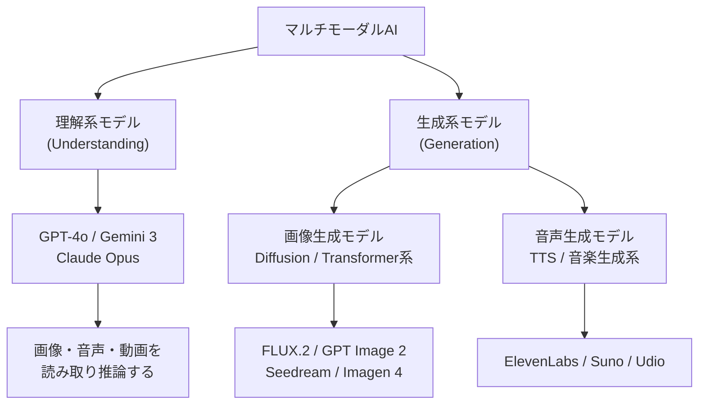
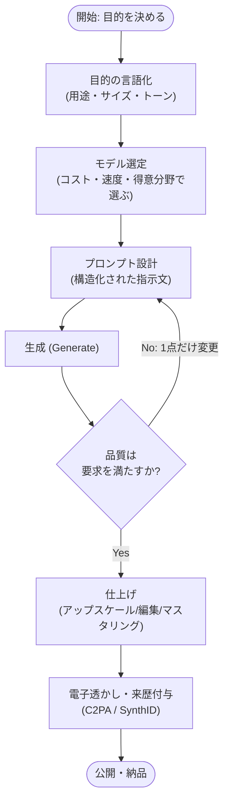
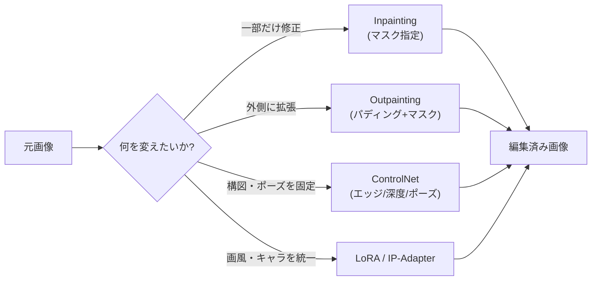
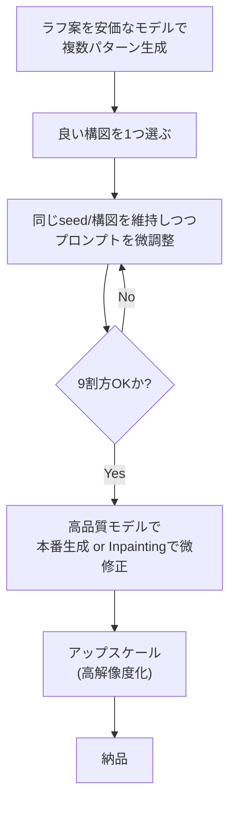
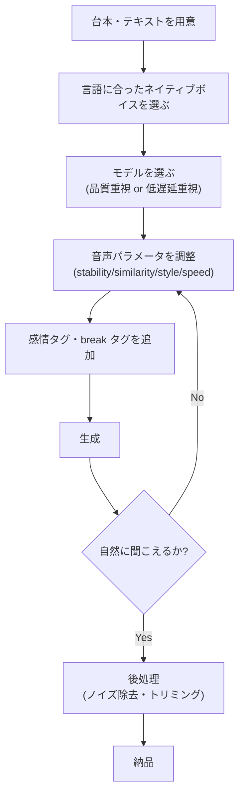
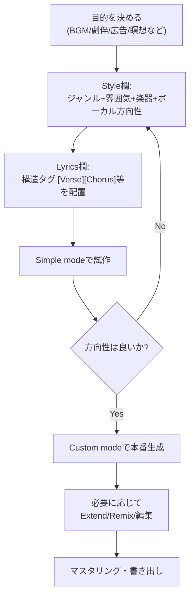
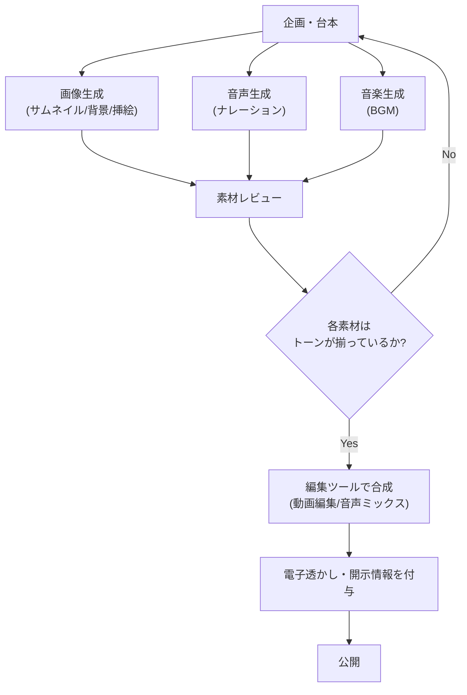
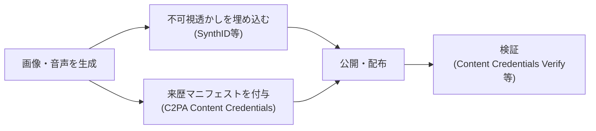

# マルチモーダルAI(画像・音声生成)ベストプラクティスガイド 2026

> 初学者向け・ステップバイステップ解説 / Multimodal AI (Image & Audio Generation) Best Practices Guide
> 最終更新: 2026年7月

---

## 目次

1. [はじめに](#1-はじめに)
2. [マルチモーダルAIとは](#2-マルチモーダルaiとは)
3. [全体ワークフロー(共通プロセス)](#3-全体ワークフローcommon-workflow)
4. [画像生成 (Image Generation) のベストプラクティス](#4-画像生成-image-generation-のベストプラクティス)
5. [音声生成 (Audio Generation) のベストプラクティス](#5-音声生成-audio-generation-のベストプラクティス)
6. [マルチモーダル統合ワークフロー](#6-マルチモーダル統合ワークフロー)
7. [品質管理・レビューのベストプラクティス](#7-品質管理レビューのベストプラクティス)
8. [倫理・法律・安全性 (Ethics, Law & Safety)](#8-倫理法律安全性-ethics-law--safety)
9. [ベストプラクティス チェックリスト](#9-ベストプラクティス-チェックリスト)
10. [参考文献 (References / URL一覧)](#10-参考文献-references--url一覧)

---

## 1. はじめに

生成AI (Generative AI) は、2023年頃までの「テキスト生成中心」の時代から、画像・音声・動画を統合的に扱う「マルチモーダル (Multimodal)」の時代へと移行しました。2026年現在、画像生成では GPT Image 2、Nano Banana Pro (Gemini系)、FLUX.2、Seedream 4.5/5、Midjourney v7 などが実務レベルの品質に到達し、音声生成では ElevenLabs、Suno、Udio といったツールがナレーション・音楽制作の現場で標準的に使われるようになっています。

本ガイドは、これから画像・音声生成AIを学ぶ初学者を対象に、以下の3点を重視して解説します。

- **再現可能な手順**: 「なんとなく上手くいった」ではなく、次も同じ品質を出せる手順を示す
- **モデル横断の普遍原則 + モデル固有のコツ**: プロンプト設計の共通原則と、主要ツールごとの違いを分けて説明
- **安全性と法令遵守**: 著作権・電子透かし・開示義務など、2026年時点で実務上避けて通れない論点を含める

なお、本ガイドは動画生成 (Sora, Veo, Kling等) を主題としませんが、画像生成・音声生成の技術は動画パイプラインの基礎にもなるため、随所で関連に触れます。

---

## 2. マルチモーダルAIとは

マルチモーダルAI (Multimodal AI) とは、テキスト・画像・音声・動画といった複数の「モダリティ (modality, データ種別)」を単一のモデルまたはパイプラインで処理・生成できるAIシステムを指します。大きく分けて2つの潮流があります。

### 2.1 ネイティブ・マルチモーダル基盤モデル (Native Multimodal Foundation Models)

GPT-4o のように、画像・音声・テキストを最初から単一のアーキテクチャで学習し、モダリティ変換用の別モデル(アダプタ)を介さずに理解・生成まで行うタイプです。GPT-4oはOpenAIの主力オムニモーダルモデルで、テキスト・画像・音声・動画を統一されたアーキテクチャの中で処理・推論できます。従来モデルと異なり、モダリティ固有のアダプタに頼らずネイティブなマルチモーダル理解を実現し、視覚・言語・音声を横断したシームレスな統合を可能にしています。 Google の Gemini も同様の思想で設計されており、画像とテキストのペアを土台からまとめて学習させることで、グラフや地図の解釈のような精密な空間推論を要するタスクに強みを持ちます。

2026年の評価軸は「画像を理解できるか」という単純な指標では差がつかなくなっており、MMMU-Proのような主要な画像理解ベンチマークは飽和状態に達し、GPT-5.5・Gemini 3・Claude Opus 4.7・Qwen 3.5 Ominiがいずれも81〜83%前後に収束しています。 そのため実務上は、動画理解ではGemini 3、長文書のOCRではClaude、グラフ・図表の読解ではGPT-5.5が優位という形で、モデルごとの得意領域で使い分けるのが現実的です。

### 2.2 生成特化モデル (Generation-Specialized Models)

一方、画像・音声そのものを「生成」するタスクは、拡散モデル (Diffusion Model) や専用の音声合成モデルなど、理解モデルとは別系統のアーキテクチャが主流です。

本ガイドが扱うのは主に **C. 生成系モデル** の実践的な使い方です。

---

## 3. 全体ワークフロー(Common Workflow)

画像でも音声でも、良い結果を安定して得るための基本サイクルは共通しています。「思いついたまま1回だけ生成する」のではなく、以下のような反復プロセスとして捉えることが、初学者が最初に身につけるべき最大のコツです。

このサイクルにおける重要な原則は次の3つです。

1. **安いモデルで試作し、高いモデルで仕上げる (Draft cheap, finish expensive)**: 構図やアイデアの検討は低コストなモデル(例: Z-Image TurboやFlux 2 Flash)で行い、方向性が固まった段階で高品質・高コストなモデルに切り替えるという原則は、コストと品質のバランスを取る上で有効です。
2. **一度に1つの変数だけを変える**: 色、カメラ距離、ポーズ、背景など、変更点を1つに絞って再生成することで、何が結果を変えたのかを把握できます。生成後は小さな単位で反復し、1ラウンドにつき1つの要素(色・カメラ距離・ポーズ・背景など)だけを変えるという進め方が推奨されています。
3. **やり直すより編集する**: 結果が9割方良ければ、もう一度ガチャを引くよりも画像編集機能で部分修正するほうが安価で効率的です。

---

## 4. 画像生成 (Image Generation) のベストプラクティス

### 4.1 プロンプトの基本構造(6要素アナトミー)

優れた画像プロンプトは、思いつきの羅列ではなく構造を持っています。高い成果を出すチームは、まず画像の「目的」を明確にし、そこに媒体(medium)・照明(lighting)・構図(framing)・雰囲気(mood)・色調(palette)を重ねていくという共通のプラクティスを持っています。

| # | 要素 | 説明 | 記入例 |
|---|------|------|--------|
| 1 | Subject(主題) | 画像の中心となる被写体 | オレンジ色の猫 |
| 2 | Context / Use case(用途・文脈) | 何のための画像か | ECサイトの商品ページ用ヒーロー画像 |
| 3 | Medium(媒体・技法) | 写真・イラスト・3DCG等 | 実写風写真、水彩画、ベクターイラスト |
| 4 | Lighting(照明) | 光源・時間帯・質感 | 柔らかい窓光、シネマティックなリムライト |
| 5 | Framing / Composition(構図) | アングル・距離・比率 | ワイドショット、俯瞰、16:9 |
| 6 | Mood & Palette(雰囲気・配色) | 感情・トーン・色調 | ノスタルジック、パステルカラー |

この6要素をそれぞれ短いフレーズとして書き出し、目的を1行で述べたうえで4〜6個の高シグナルな詳細を追加するという組み立て方が、多くのモデルで安定した結果を生みます。

写真的なリアリズムを狙う場合は、カメラ用語を積極的に使うのがコツです。レンズプロファイル(35mmレンズ、85mmポートレート単焦点など)を明示し、肌のキメや埃の粒子といった表面のディテール、光の自然な散乱を描写することで、被写界深度や自然な陰影を再現しやすくなります。 具体的には「85mmレンズ、f/1.8、特定のフィルムストック、シネマティックなリムライト」のように、レンズ・絞り・フィルム・照明を具体的に指定する手法が写真的リアリズムの鍵とされています。

> **初学者向けTip**: 「photorealistic」「ultra-realistic」のような抽象的なバズワードだけに頼ると、AIらしいのっぺりした質感(いわゆる"plastic"な仕上がり)になりがちです。抽象的な流行語ではなく、質感を伴う具体的な物理的要素を描写することが、写真的リアリズムを実現するコツです。

### 4.2 モデル別プロンプト最適化

2026年の画像生成は「1つのプロンプト構文がすべてのモデルで通用する」わけではありません。ChatGPT(GPT Image系)は段落形式かつ複数ターンでの編集に強く、Midjourney v7は参照画像を伴う短く高シグナルなフレーズを好み、Stable Diffusion 3.5は構造化された重み付きキーワードで力を発揮し、Ideogramはタイポグラフィ(文字表現)に強いという傾向があります。

| モデル | プロンプトの傾向 | 得意分野 |
|--------|------------------|----------|
| GPT Image 2(ChatGPT) | 会話的・物語的な文章。空間関係の明示に強い | 複雑な指示の忠実な再現、テキストレンダリング、反復編集DALL-E系はバックエンドのLLMによる会話的言語の解釈に長け、正確なテキスト表現と複雑なシーン構成に強みがあります。 |
| Midjourney v7 | 短く高シグナルなキーワード句 + パラメータ(`--ar`, `--stylize`) | 芸術的な構図・美的センスMidjourneyは写真的な用語による具体的な照明・カメラ制約の指定に優れて反応し、`--ar 16:9`のようなアスペクト比指定や`--stylize 250`のようなスタイル強度指定に対応します。 |
| FLUX.2 / FLUX Pro | 技術寄り・カメラ物理特性の明示 | 写実性、色精度、オープンウェイトでの自己ホスト |
| Seedream 4.5/5 | 短く簡潔なプロンプト | 4K出力、複数画像の合成、文字表現、商品撮影 |
| Ideogram | 表示したい文字列を明示 | ポスター・パッケージ等、画像内テキストの正確な表示 |
| Stable Diffusion 3.5 | 構造化・重み付きキーワード(オープンソース) | ローカル実行、カスタマイズ、ControlNet/LoRAとの併用 |

### 4.3 ネガティブプロンプト (Negative Prompt)

ネガティブプロンプトは「生成してほしくない要素」を明示する手法で、Stable Diffusion系や一部のモデルで利用できます。写実性のための代表的なネガティブプロンプトの例として、「ぼやけ・歪んだ手・余分な手足・低解像度・平坦な照明・透かし・署名・漫画調・3Dレンダリング」といった要素を除外する指定が使われます。

ただし使いすぎには注意が必要です。Flux・Midjourney・Veo・Imagenを横断したテストでは、ネガティブプロンプトは3〜5個程度の具体的な語句で最も効果的に機能し、5個を超えると過剰な制約がかかって無機質な出力になったり、逆に除外したいはずの特徴が強調されてしまう現象が確認されています。

### 4.4 パラメータ制御

プロンプト本文以外にも、生成品質を左右する技術パラメータがあります。

| パラメータ | 役割 | 実務上のポイント |
|-----------|------|------------------|
| CFG Scale | プロンプトへの忠実度を制御 | 高すぎると不自然に、低すぎると指示を無視した結果になりやすい |
| Seed | 乱数の初期値。同じseedなら再現性が高い | 気に入った構図のseedを固定し、プロンプトだけを微調整すると効率的 |
| Aspect Ratio(アスペクト比) | 出力の縦横比 | 生成前にアスペクト比(正方形、16:9、4:5など)を決めておくことが推奨されます。 |

### 4.5 高度な編集技術

プロンプトだけでは制御しきれない構図・一貫性を扱うために、以下の技術が実務で使われます。

| 技術 | 概要 | 主な用途 |
|------|------|----------|
| ControlNet | エッジ・深度・ポーズなど「構造ガイド画像」を条件として生成を誘導するControlNetはエッジ・深度マップなどの外部条件マップを用いて拡散モデルの生成を制御する技術です。 | ポーズ指定、レイアウト固定、線画からの着色 |
| LoRA (Low-Rank Adaptation) | 軽量なアダプタをベースモデルに追加し、特定のスタイル・キャラクターを再現する | 画風の再現、高速サンプリングLoRAアダプタを読み込んで融合することで、少ないステップ数での高速サンプリングを実現できます。 |
| Inpainting(部分修正) | マスクで指定した領域だけを再生成するマスクで指定した部分を高いdenoising strength(ノイズ除去強度)で再生成しても、全体の一貫性を保てるのがInpainting専用チェックポイントモデルの利点です。 | 顔の修正、服装の変更、不要物の除去 |
| Outpainting(画像拡張) | 画像の外側を推測して描き足し、キャンバスを拡張するOutpaintingは元画像の外側に「フレームの外に何があるか」をAIに推測させてキャンバスを拡張する技術で、縦長画像からのワイド化やパノラマ合成に特に有効です。 | アスペクト比変更、シーン拡張、バナー化 |
| IP-Adapter | 参照画像からスタイル・構図を転送する | 一貫したキャラクター/ブランドイメージの維持 |

初学者はまず ComfyUI や各種WebUIの **テンプレート** から始めるのが近道です。初心者はまずシンプルなText-to-ImageやImg2Img、Inpaint、Outpaint、LoRAのテンプレートから始めるのが良く、本番運用ではControlNet・IPAdapter・アップスケール・動画生成を組み合わせたより大規模なワークフローが使われます。

### 4.6 反復ワークフロー(実践フロー)

### 4.7 主要画像生成モデル比較(2026年7月時点)

| モデル | 提供元 | 得意分野 | 特徴 |
|--------|--------|----------|------|
| GPT Image 2 | OpenAI | 世界知識に基づく複雑な指示理解、文字表現 | 「光合成を説明する図解を1960年代の教科書風に」のような、内容そのものを推論する必要があるプロンプトでも一貫性のある結果を出せる。生成は他の拡散系モデルよりやや低速・高コスト。 |
| Nano Banana Pro(Gemini系) | Google | 編集の一貫性、キャラクター同一性維持、物理的に正確な質感 | 「この部分だけ変えて」という自然言語での編集要求に強く、レイアウト制御と長文の可読なテキスト生成、スタジオ品質の一貫性を提供する。 |
| FLUX.2(Black Forest Labs) | Black Forest Labs | 写実性、カメラ物理特性の再現、オープンウェイト | 被写界深度・レンズ歪み・色収差・フィルムグレインといった光学的効果をシミュレーションではなく光学的精度で再現する。 |
| Seedream 4.5/5(ByteDance) | ByteDance | 文字表現、4K出力、商品撮影 | ほぼ全モデルの中で最も文字を正確にレンダリングでき、ネイティブ4K出力と商品・商業写真的な仕上がりに強い。 |
| Midjourney v7 | Midjourney | 芸術的な美的センス、コンセプトアート | 画像の「意図的に見える」構成センスにおいて他の追随を許さない。ただし画像内テキストの精度は弱点。 |
| Ideogram 3 | Ideogram | タイポグラフィ・読める文字 | ポスターや商品パッケージなど、文字を正確に表示したい用途に強い |
| Adobe Firefly | Adobe | 商用利用の法的安全性 | ライセンス済みデータで学習されており、著作権面での安全性を重視する商用案件向き |
| Stable Diffusion 3.5 | Stability AI | オープンソース、自己ホスト、カスタマイズ性 | ローカル環境でのControlNet/LoRA併用に最適。無料 |

> **モデル選びの実務原則**: 単一のモデルがすべてのカテゴリで勝つことはなく、ランキングは数ヶ月ごとに入れ替わるため、複数モデルを併用する「アグリゲーター」的な運用がプロの現場では主流になっています。

---

## 5. 音声生成 (Audio Generation) のベストプラクティス

音声生成は大きく「音声合成 (Text-to-Speech / TTS)・音声クローニング」と「音楽生成 (Music Generation)」の2系統に分かれます。

### 5.1 TTS (Text-to-Speech) の基本ステップ

言語適性は非常に重要です。特定の言語で音声を生成する際は、その言語をネイティブに話すVoice Libraryの音声を使うか、正しいアクセントでその言語を話す音声をクローニングするのが最も良い結果につながります。英語ネイティブの音声でフランス語を生成すると、フランス語の内容が英語なまりで出力される可能性があります。

### 5.2 音声パラメータの調整(ElevenLabsを例に)

| パラメータ | 役割 | 推奨レンジと注意点 |
|-----------|------|---------------------|
| Stability(安定性) | 声の一貫性とランダム性の度合い | 長文のナレーションでは単調さを避けるため35〜40%程度を維持しつつ、不安定化を防ぐため30%を下回らないようにするのが目安です。 |
| Similarity(類似度) | 元の声への忠実度・明瞭さ | 75〜80%程度以下に保つのが目安で、それ以上に上げるとアーティファクト(音の歪み)が生じやすくなります。 |
| Style(スタイル強調) | 表現力・感情の強さ | 値を低くすると生成が速く、高くするとドラマチックな表現が加わります。多くのナレーションでは10〜50%程度が扱いやすい範囲です。 |
| Speed(速度) | 話速の調整 | デフォルトは1.0で、0.7〜1.2の範囲で調整可能。極端な値は品質低下を招く場合があります。 |

> **初学者向けTip**: 各設定は「固定値で毎回同じ結果になる」わけではありません。AIは非決定的であり、スライダーの値は同じ結果を保証するものではなく、生成ごとのランダム性の幅を決める役割に近いものです。

### 5.3 感情表現とタグ制御

自然な感情表現を得るには、テキスト自体に文脈を持たせる方法とタグを使う方法があります。物語的な文脈やセリフのタグを通じて感情を伝えることで、AIがどのようなトーン・感情を再現すべきか理解しやすくなります。明示的なダイアログタグは、文脈だけに頼るよりも予測可能な結果を生みますが、モデルは感情の指示語そのものも読み上げてしまうことがあるため、不要な場合は後処理で除去します。

タグはキャラクターの性格に合わせることが重要です。タグは声のキャラクターや学習データに合わせるべきで、真面目でプロフェッショナルな声には[giggles](くすくす笑い)や[mischievously](いたずらっぽく)のような遊び心のあるタグはうまく機能しない場合があります。

間(ま)の制御にも注意が必要です。breakタグを使いすぎると不安定化を招き、AIが早口になったり余計なノイズが混入したりすることがあります。短い間の代替としてダッシュ(-や—)、ためらいを表す間の代替として省略記号(…)を使う方法もありますが、一貫性はbreakタグほど高くありません。

### 5.4 発音制御(音声記号)

固有名詞や専門用語の読み方を制御したい場合、音声記号を使う方法があります。

| 方式 | 概要 | 使い所 |
|------|------|--------|
| IPA(国際音声記号) | 最新モデルはXMLタグを使わずスラッシュで囲んだIPA記号をテキスト内に直接記述することで、単語・フレーズの発音を精密に制御できます。 | 多言語対応、精密な発音指定 |
| CMU Arpabet | 英語の音声記号による発音辞書を用いる方式。 | 英語の発音矯正 |

### 5.5 音楽生成 (Music Generation) のベストプラクティス

Suno・Udio といったツールでは、テキストプロンプトから完結した楽曲を生成できます。プロンプトはジャンル・雰囲気(mood)・楽器編成・ボーカルの4要素で構成され、4〜7個程度の記述語が最適なバランスとされています。少なすぎると平凡な結果に、多すぎるとAIが混乱します。

**Style欄の作り方**: 具体例として「lo-fi hip hop, melancholic, dusty vinyl texture, soft piano, muted trumpet, gentle rain ambience, 75 BPM, no vocals」のように、ジャンル・感情・質感・楽器・BPM(テンポ)・ボーカル有無を明示する構成が効果的です。

**構造タグ(メタタグ)**: Sunoは`[Intro]` `[Verse 1]` `[Pre-Chorus]` `[Chorus]` `[Bridge]` `[Outro]`のような標準的な曲構成タグを認識し、これを歌詞欄に入れることで自動的にアレンジが調整されます。

**細かい実務上のコツ**:
- 「instrumental(ボーカルなし)」を指定したい場合は、タグの最後尾に配置しないとボーカルが生成されてしまう確率が上がります。
- コーラス(サビ)の行数が多すぎるとメロディが平板になりやすいため、2〜3行程度に絞ると強いフックが生まれやすくなります。また、最も伝えたい歌詞は各セクションの最初の行に置くのが効果的です。
- ボーカルの感情演出をしたい場合は、`(whispered)` `(belted)`のようなボーカルキューを、該当セクションの直前に単独の行として配置します。インラインで歌詞に埋め込むと無視されやすくなります。
- 著作権保護のため、実在アーティスト名を直接プロンプトに書くことはできません。代わりに、そのアーティストに近い音楽性を表す一般的なスタイル記述語(ジャンル・年代・質感など)を使うのが一般的な回避策です。

**Suno と Udio の使い分け**: Sunoはボーカルの表現力(息づかいや感情の"揺れ")の再現に強く、SNS向けのすぐ使える音源作りに向く一方、Udioは楽器の分離感が高くミックスが専門的で、さらなる編集を前提とした高品質素材を必要とする制作者に向いています。

### 5.6 ボイスクローニングと倫理

音声クローンは強力な技術である一方、なりすまし・詐欺に悪用されるリスクを伴います。実務上は以下を徹底してください。

- クローンする音声の**本人からの明示的な同意**を得る(自分の声、または権利者が許諾した声のみを使用する)
- 実在の公人・有名人の声を無断で模倣・生成しない
- 生成した音声が実在人物の発言であるかのように誤認させる使い方をしない
- プラットフォームの利用規約・年齢制限・地域法(後述の開示義務)を確認する

### 5.7 主要音声生成ツール比較

| ツール | 得意分野 | 特徴 |
|--------|----------|------|
| ElevenLabs | TTS・音声クローン・多言語ナレーション | TTSに加えて音声認識(STT)、Voice Library、Instant/Professional Voice Cloning、リアルタイムエージェント向けの低遅延生成まで、幅広い音声ワークフローをカバーする総合プラットフォームに発展している。 |
| Suno | ボーカル入り楽曲の高速生成 | 感情のこもったボーカル表現に強く、ラジオ品質の44.1kHz出力でSNS投稿にすぐ使える。 |
| Udio | 高忠実度のインストゥルメンタル制作 | 48kHz出力で楽器分離が明瞭、さらなる編集を前提とした高品質アセット向き。 |
| Amazon Polly | 低コスト・大量処理 | 表現力はElevenLabsに劣るが、大量のテキストを低コストで安定的に処理できる |

---

## 6. マルチモーダル統合ワークフロー

画像生成・音声生成は、単体でも役立ちますが、実務では組み合わせて使うことが多くあります。代表例は「ナレーション付きスライド動画」「AIポッドキャストの表紙+音声」「SNS向けショート動画の背景画像+BGM」などです。

統合時のポイントは「**トーンの一貫性**」です。画像のmood(雰囲気)と音声のstyle(表現)、音楽のmood(ジャンル・感情)がバラバラだと、視聴者に違和感を与えます。プロンプト設計の段階で、共通のキーワード(例: 「ノスタルジック」「シネマティック」「ミニマル」)を画像・音声・音楽すべてのプロンプトに含めておくと一貫性を保ちやすくなります。

---

## 7. 品質管理・レビューのベストプラクティス

- **プロンプトライブラリを作る**: 効果的だったプロンプト・使用モデル・添付した参照画像・生成結果を記録しておくことで、時間をかけて再利用可能なブランド視覚システムとして蓄積できます。
- **ブラインドでの多モデル比較**: 同じプロンプトを複数モデルに投げて、どのモデルが最も意図を汲み取るかを比較する。この「マルチモデル反復」というワークフローは、どのモデルを使うべきかという勘に頼るのではなく、実際の出力を経験的に比較する方法へと置き換えるものです。
- **失敗モードに応じたモデル切り替え**: 文字が崩れる場合はSeedreamやIdeogramへ、顔が生成ごとにブレる場合はNano Bananaへ、肌の質感がのっぺりする場合はFLUXやImagenへ切り替えるといった対応関係を持っておく。
- **最終確認前のチェック項目**: 解像度・アスペクト比、意図しないテキストの誤表示、手や顔の破綻、著作権上のリスク(実在の人物・ブランド・キャラクターの無断使用がないか)、音声の発音ミス、BGMと音量バランス

---

## 8. 倫理・法律・安全性 (Ethics, Law & Safety)

### 8.1 著作権

- 実在のアーティスト名・キャラクター名・ブランド名をそのままプロンプトに入れることは、多くのプラットフォームの利用規約違反または著作権侵害リスクになります。Sunoでは実在アーティスト名の入力自体が禁止されており、近い音楽性を表す一般的なスタイル記述に置き換える必要があります。
- 学習データのライセンスが不透明なモデルを商用利用する際はリスクを理解した上で判断する(Adobe Fireflyのようにライセンス済みデータのみで学習されたモデルは、商用安全性の観点で選ばれることが多い)。

### 8.2 電子透かしと来歴 (Watermarking & Provenance)

2026年時点で、AI生成コンテンツには技術的な「透かし」と「来歴情報」を付与するのが業界標準になりつつあります。

| 方式 | 概要 | 特性 |
|------|------|------|
| SynthID | 画素やテキストのトークン選択に不可視の統計的パターンを埋め込む | スクリーンショットや再エンコード後もある程度検出可能な「持続性」が最大の強みだが、モデル側の協力が必須で、生成後に事後的に付与することはできない。 |
| C2PA(コンテンツ来歴マニフェスト) | 暗号署名付きのメタデータとして「いつ・どのモデルで・誰が生成したか」を記録する | ファイル形式を問わず適用できる利点があるが、メタデータが失われると検証情報も失われる(耐性がSynthIDより低い)。 |

2026年のベストプラクティスは、同一コンテンツに両方式を併用する「二重実装」です。メタデータが失われてもSynthIDが生き残り、C2PAが改ざん検知可能な検証済みの来歴を提供するという相互補完関係になります。

普及状況は急速に進んでいます。C2PA連合には Google・Microsoft・Adobe・Meta・OpenAI・Sony・BBC・Amazonなど6,000以上の企業・団体が参加しており、Googleは200億枚以上の画像にSynthIDを付与、TikTokは13億本以上の動画にAI来歴ラベルを付けています。 ただし万能ではありません。MicrosoftやEUの報告書も認めている通り、C2PAの来歴情報・透かし・フィンガープリンティングのいずれの手法単独でも、あらゆる偽装や来歴情報の削除を完全に防ぐことはできないのが現実です。

### 8.3 開示義務(法規制)

主要国・地域でAI生成コンテンツの開示が法的義務になりつつあります。

| 規制 | 対象地域 | 概要 |
|------|----------|------|
| EU AI Act 第50条 | EU | 合成音声・画像・動画・テキストを生成するシステムの提供者は、技術的に可能な場合、出力を機械可読な形式でマーキングし、人工的に生成・改変されたものと検出可能にする義務を負う。 この透明性義務は2026年8月2日から適用が開始される。 |
| California SB 942 | 米国カリフォルニア州 | 施行日：2026年8月2日。対象：カリフォルニア州で月間100万ユーザーを超える公開GenAIシステムの提供者に対し、AI生成コンテンツの開示が義務付けられる。 |
| プラットフォーム独自ポリシー | 各SNS | TikTokとYouTubeはクリエイターに開示を義務付けC2PAからの自動ラベル付けを行う一方、Metaは「AI Info」タグを使用し、Xは開示を強制せずアップロード時に来歴情報を削除してしまう、というようにプラットフォームごとに対応が大きく異なる。 |

> **実務上の指針**: 2026年初頭のEdelman Trust Barometerの調査では、消費者の67%が「AI生成コンテンツを見ているときにそれを知りたい」と回答しています。法的義務の有無にかかわらず、先回りした開示は信頼構築の観点でもプラスに働きます。

---

## 9. ベストプラクティス チェックリスト

| カテゴリ | チェック項目 |
|----------|--------------|
| 企画 | 目的・用途・トーンを1行で言語化したか |
| 画像プロンプト | Subject / Medium / Lighting / Framing / Mood / Paletteの6要素を含めたか |
| 画像プロンプト | 使用モデルに合わせた文体(段落 vs 短句)になっているか |
| 画像パラメータ | アスペクト比・seed・ネガティブプロンプト(3〜5語以内)を設定したか |
| 画像編集 | 部分修正はInpainting、拡張はOutpainting、構図固定はControlNetを使い分けたか |
| 音声 | 対象言語のネイティブボイスを選んでいるか |
| 音声パラメータ | Stability / Similarity / Style / Speedを用途に合わせて調整したか |
| 音声演出 | 感情タグ・breakタグを声のキャラクターに合わせて過不足なく使ったか |
| 音楽 | ジャンル+雰囲気+楽器+ボーカルの4要素、構造タグを整理したか |
| 一貫性 | 画像・音声・音楽のトーン(mood)を統一したか |
| 権利処理 | 実在人物・アーティスト・ブランド・キャラクターを無断使用していないか |
| ボイスクローン | 本人または権利者の同意を得ているか |
| 開示 | 電子透かし(SynthID等)・来歴情報(C2PA)を付与したか |
| 開示 | 対象地域の開示義務(EU AI Act, California SB 942等)を満たしているか |

---

## 10. 参考文献 (References / URL一覧)

### 画像生成 / プロンプトエンジニアリング
- How to write AI image prompts like a pro [2026] — https://letsenhance.io/blog/article/ai-text-prompt-guide/
- Best Prompts for Image Generation in 2026 — AIML Insights — https://aimlinsights.com/prompts-for-image-generation/
- Prompt Engineering for AI Image Generation: The Complete 2026 Guide — https://insights.vanikya.ai/prompt-engineering-ai-image-generation-2026/
- Mastering Image Generation AI Prompts: The Complete 2026 Guide — ImprovePrompt — https://www.improveprompt.ai/learn/how-to-improve-image-generation-prompts
- AI Prompt Engineering for Images & Video (2026) — Cliprise — https://www.cliprise.app/learn/guides/best-practices/ai-prompt-engineering-complete-guide-2026
- Prompt Engineering in 2026: Top Trends, Tools, and Techniques — Promptitude.io — https://www.promptitude.io/post/the-complete-guide-to-prompt-engineering-in-2026-trends-tools-and-best-practices
- Image prompt engineering techniques — Microsoft Foundry / Microsoft Learn — https://learn.microsoft.com/en-us/azure/foundry/openai/concepts/gpt-4-v-prompt-engineering
- The Ultimate Guide to Prompt Engineering in 2026 — Lakera — https://www.lakera.ai/blog/prompt-engineering-guide
- Prompt Engineering in 2026: Tips + Best Practices — orq.ai — https://orq.ai/blog/what-is-the-best-way-to-think-of-prompt-engineering
- The 2026 Guide to Prompt Engineering — IBM — https://www.ibm.com/think/prompt-engineering

### 画像生成モデル比較
- AI Image Generation Models: The Complete 2026 Guide — Morphed — https://morphed.app/blog/best-ai-image-generation-models
- Best AI Image Models 2026 — Melies — https://melies.co/compare/ai-image-models
- Best AI Image Models 2026 — TeamDay.ai — https://www.teamday.ai/blog/best-ai-image-models-2026
- Best AI Image Generators in 2026: Complete Comparison Guide — WaveSpeedAI (Medium) — https://medium.com/@social_18794/best-ai-image-generators-in-2026-complete-comparison-guide-e5399ba7eae5
- 8 Best AI Image Generators in 2026 (Tested) — XainFlow — https://www.xainflow.com/blog/best-ai-image-generators-2026-comparison
- Best AI for Image Generation in 2026 — Ranked by Blind Human Votes — llm-stats.com — https://llm-stats.com/leaderboards/best-ai-for-image-generation
- The 9 Best AI Image Generation Models in 2026 — https://www.gradually.ai/en/ai-image-models/
- Best AI Image Generators in 2026: Grok Imagine, Midjourney, FLUX and DALL-E Compared — DIY AI — https://diyai.io/ai-tools/image-generation/best-ai-image-tools/
- Best AI Image Generators (2026): A Honest Test & Review — getimg.ai — https://getimg.ai/blog/best-ai-image-generator
- Best AI Image Generator 2026: I Tested 10 Tools to Find Out — Alici.AI — https://alici.ai/blog/best-ai-image-generators-2026

### 画像編集技術 (ControlNet / LoRA / Inpainting / Outpainting)
- High-Quality Image Generation with HuggingFace Diffusers: ControlNet, LoRA, and Inpainting Explained — UBOS — https://ubos.tech/news/high%e2%80%91quality-image-generation-with-huggingface-diffusers-controlnet-lora-and-inpainting-explained/
- A Coding Guide to High-Quality Image Generation, Control, and Editing Using HuggingFace Diffusers — MarkTechPost — https://www.marktechpost.com/2026/02/20/a-coding-guide-to-high-quality-image-generation-control-and-editing-using-huggingface-diffusers/
- Inpainting: A complete guide — Stable Diffusion Art — https://stable-diffusion-art.com/inpainting/
- How to Create AI Art: Complete Style & Workflow 2026 — NeuraPulse — https://neuraplus-ai.github.io/blog/how-to-create-ai-art.html
- SDXL Inpainting Workflow with LoRA, ControlNet and IP-Adapter — Neura Market — https://www.neura.market/directories/stable-diffusion/guides/sdxl-inpainting-workflow-lora-controlnet-ip-adapter
- SDXL Inpainting Workflow with Lora, ControlNet, and IPAdapter — OpenArt — https://openart.ai/workflows/terrier_delectable_76/sdxl-inpainting-workflow-with-lora-controlnet-and-ipadapter/Jhj7nRJwi5c8UuWguhvD
- Outpainting I - Controlnet version — Hugging Face Blog (OzzyGT) — https://huggingface.co/blog/OzzyGT/outpainting-controlnet
- Best ComfyUI Workflows: Templates, Examples, and Downloads — Beam — https://www.beam.cloud/blog/top-comfyui-workflows
- destitech/controlnet-inpaint-dreamer-sdxl — Hugging Face — https://huggingface.co/destitech/controlnet-inpaint-dreamer-sdxl
- ComfyUI Outpainting Workflow — RunComfy — https://www.runcomfy.com/comfyui-workflows/comfyui-image-outpainting-workflow

### 音声生成 (TTS / ElevenLabs)
- Text to Speech (product guide) — ElevenLabs Documentation — https://elevenlabs.io/docs/eleven-creative/playground/text-to-speech
- Best practices — ElevenLabs Documentation — https://elevenlabs.io/docs/overview/capabilities/text-to-speech/best-practices
- Text to Speech — ElevenLabs Documentation — https://elevenlabs.io/docs/overview/capabilities/text-to-speech
- ElevenLabs Cheat Sheet (2026) — Webfuse — https://www.webfuse.com/elevenlabs-cheat-sheet
- Free AI Voice Generator & Voice Agents Platform — ElevenLabs — https://elevenlabs.io/
- ElevenLabs Complete Guide 2026 — AI Tools DevPro — https://aitoolsdevpro.com/ai-tools/elevenlabs-guide/
- Voice Design — ElevenLabs Documentation — https://elevenlabs.io/docs/eleven-creative/voices/voice-design
- ElevenLabs AI (2026): Voice Generator, Text to Speech & Pricing — gptprompts.ai — https://gptprompts.ai/elevenlabs-ai
- How to Use ElevenLabs in 2026 — fahimai.com — https://www.fahimai.com/how-to-use-elevenlabs
- ElevenLabs Review 2026 — Nerdynav — https://nerdynav.com/elevenlabs-review/

### 音楽生成 (Suno / Udio)
- Complete List of Prompts & Styles for Suno AI Music (2026) — Medium (Travis Nicholson) — https://travisnicholson.medium.com/complete-list-of-prompts-styles-for-suno-ai-music-2024-33ecee85f180
- Suno Prompts: 100+ Examples & Complete Guide to Better AI Music (2026) — Musci.io — https://musci.io/blog/suno-prompts
- Best Suno AI Prompts 2026: What Actually Works and Why — Jack Righteous — https://jackrighteous.com/en-us/blogs/guides-using-suno-ai-music-creation/best-prompts-for-suno-ai-2026-guide-to-better-results
- Complete List of Prompts & Styles for Suno AI Music (2026) — Roo (beehiiv) — https://roo.beehiiv.com/p/complete-list-of-prompts-styles-for-suno-ai-music-2026
- The Best Ways To Create Music With AI Using Suno [2026] — Suno Hub — https://suno.com/hub/create-music-with-ai
- How to Write Effective Prompts for Suno Music: A Complete Guide for 2026 — Soundverse — https://www.soundverse.ai/blog/article/how-to-write-effective-prompts-for-suno-music-1128
- Suno AI Prompt Guide 2026: 10 Tips + Copy-Paste Templates — SunoMV Blog — https://suno.bi/en/blog/suno-prompt-tips-guide
- How to Structure Prompts for Suno AI Music Generation — Soundverse — https://www.soundverse.ai/blog/article/how-to-structure-prompts-for-suno-ai-music-generation-0402
- 100+ Best Suno AI Prompts List Download (2026 Guide) — Medium (Seven Sky Writes) — https://medium.com/write-your-world/100-best-suno-ai-prompts-list-download-2026-guide-11195b1dc6b5
- AI Music Generator Comparison 2026: Suno vs Udio vs Stable Audio — Song AI Farm — https://www.songaifarm.com/blog/ai-music-generator-comparison-2026-suno-vs-udio-vs-stable-audio-414

### マルチモーダル基盤モデル
- Multimodal AI 2026: Claude vs GPT-4V vs Gemini Vision Compared — Claude 5 Hub — https://claude5.com/news/multimodal-ai-2026-vision-documents-real-world-applications
- Multimodal AI Face-Off: Claude, GPT-4V, and Gemini in 2026 — Claude 5 Hub — https://claude5.com/news/multimodal-ai-face-off-claude-gpt-4v-and-gemini-in-2026
- Claude 4 vs GPT-5 vs Gemini 3: Pick the Right AI Model (2026) — https://ofox.ai/blog/claude-vs-gpt-vs-gemini-model-comparison-guide-2026/
- Dissecting Embodied Abilities in Multimodal Language Models (arXiv) — https://arxiv.org/pdf/2510.08759
- Best Multimodal AI Models 2026: Vision, Audio, Video, and Agents — https://aimodelbenchmarks.com/blog/2026-02-13-multimodal-ai-models/
- Multimodal AI Benchmarks 2026: Vision, Audio, Code — https://www.digitalapplied.com/blog/multimodal-ai-benchmarks-2026-vision-audio-code
- GPT-4o vs. Gemini 1.5 Pro vs. Claude 3 Opus — Encord — https://encord.com/blog/gpt-4o-vs-gemini-vs-claude-3-opus/
- Comparing Foundation Models: GPT-4, Claude, Gemini, Llama, and Mistral — CallSphere — https://callsphere.ai/blog/comparing-foundation-models-gpt4-claude-gemini-llama-mistral
- Multimodal AI: The Best Open-Source Vision Language Models in 2026 — BentoML — https://www.bentoml.com/blog/multimodal-ai-a-guide-to-open-source-vision-language-models

### 電子透かし・来歴・法規制・倫理
- AI Watermarking Standards 2026 — SynthID vs C2PA vs IPTC vs ISCC Comparison — Eyesift — https://www.eyesift.com/faq/ai-watermarking-standards-2026-synthid-c2pa-iptc-iscc-comparison/
- AI Content Provenance and Watermarking: The PM's Guide to C2PA and SynthID — Institute PM — https://www.institutepm.com/knowledge-hub/ai-content-provenance-watermarking
- AI Watermark Detection 2026: C2PA vs SynthID vs Metadata — Eyesift — https://www.eyesift.com/faq/ai-watermark-detection-2026-c2pa-content-credentials-google-synthid-meta-watermarking-policy-comparison/
- C2PA and Global Watermarking mandates for AI video in 2026 — Magiclight.AI — https://magiclight.ai/news/c2pa-and-global-watermarking-mandates-for-ai-video-in-2026/
- AI Watermarking 2026: C2PA, Metadata and Fingerprinting — AI Buzz — https://aibuzz.blog/ai-watermarking-vs-metadata-vs-fingerprinting/
- AI Disclosure Compliance 2026: C2PA & EU AI Act Guide — AI Video Bootcamp — https://aivideobootcamp.com/blog/ai-disclosure-compliance-2026-c2pa-eu-ai-act/
- FTC AI Content Disclosure Rules (2026): What Brands Must Say — ppl.studio — https://ppl.studio/blog/ai-generated-content-disclosure-ftc-guidelines
- AI Content Provenance in 2026: C2PA, Watermarking, and EU AI Act — Sesame Disk — https://sesamedisk.com/ai-content-provenance-2026-c2pa-watermarking/

---

*本ガイドはWeb検索により取得した2026年時点の情報に基づいて作成されています。生成AIツール・モデル・法規制は変化が速い分野のため、実務での利用前に各公式ドキュメント・最新の法令情報を必ず確認してください。*
