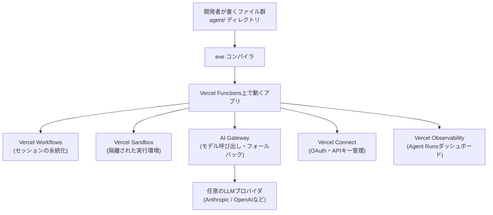
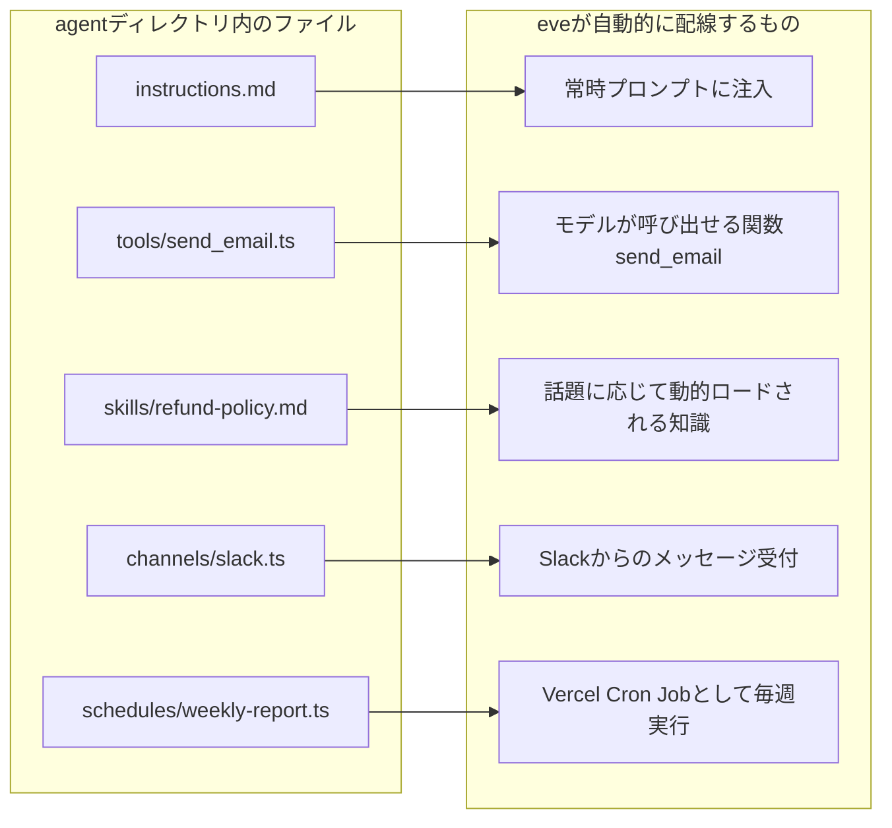
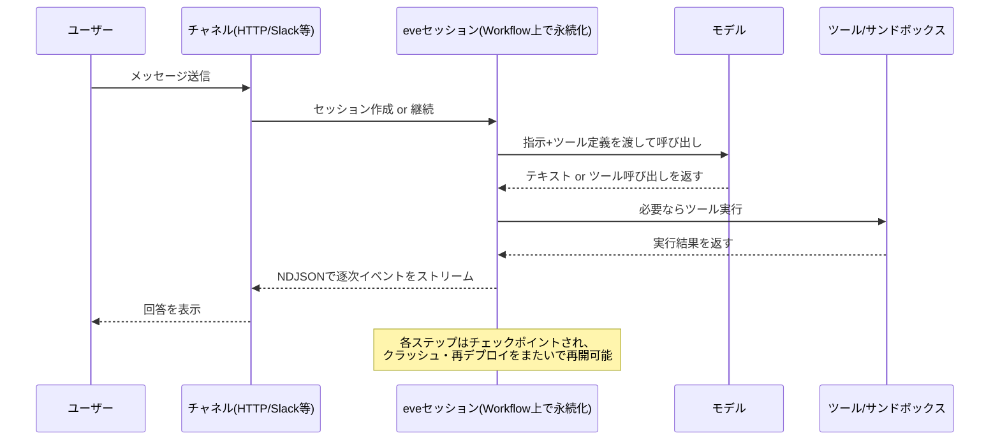
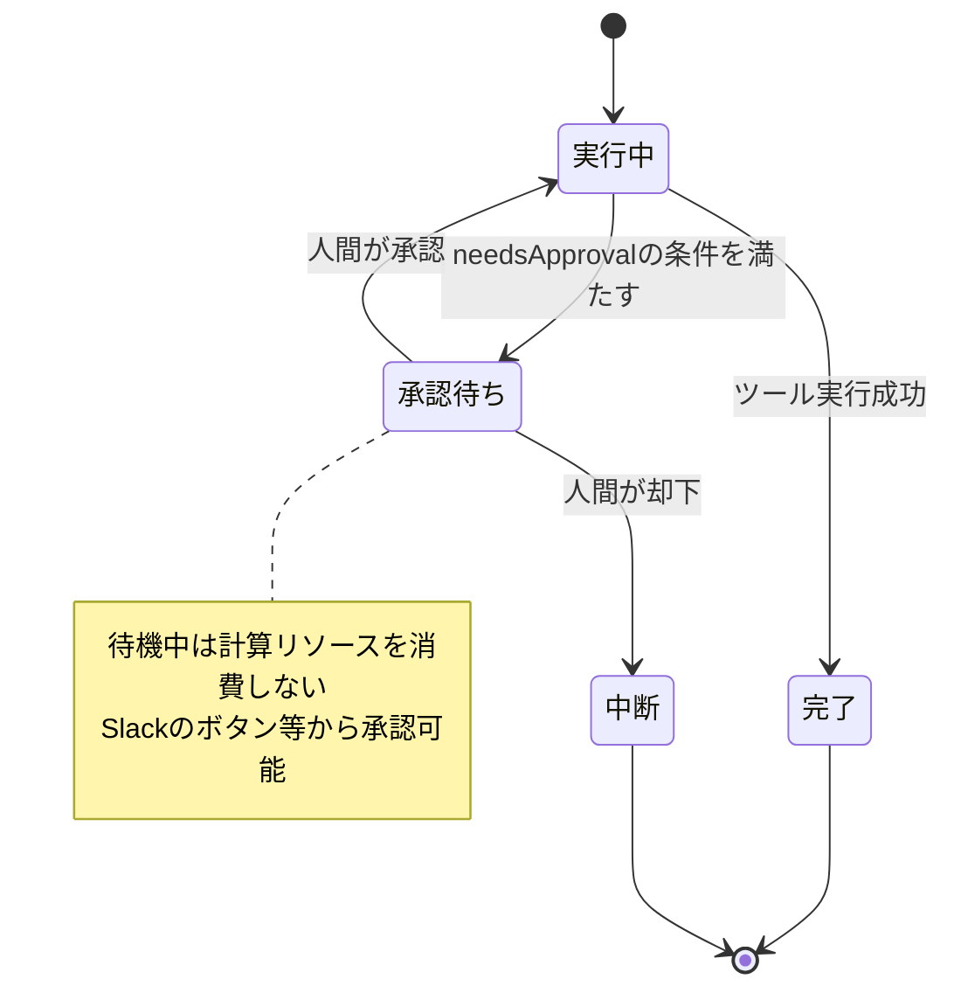
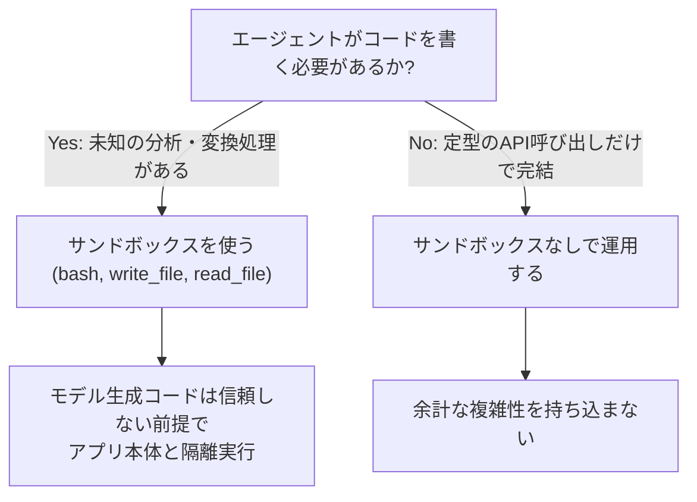
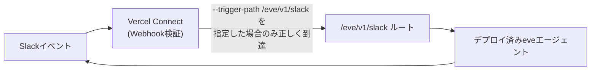
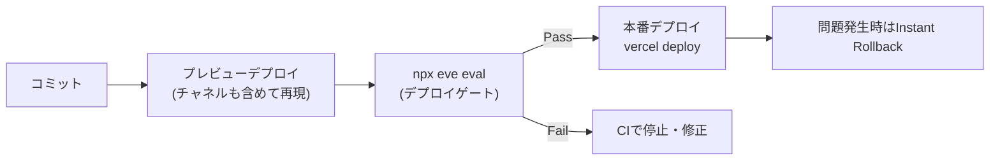
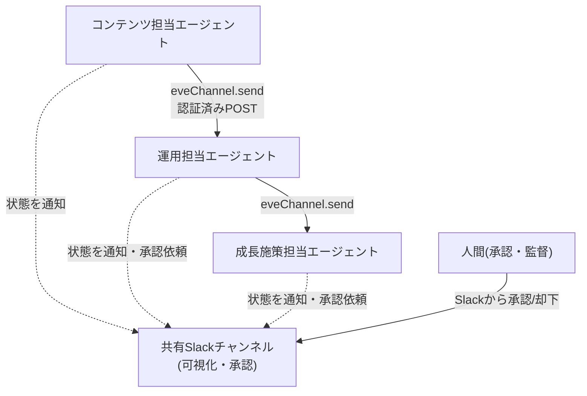

# Vercel eve 完全ガイド：初学者のためのステップバイステップ・ベストプラクティス

> 対象読者：TypeScript の基礎知識があり、Vercel でのデプロイ経験が多少ある「AI エージェント開発初学者」
> 執筆時点：2026年7月17日
> 対象バージョン：eve（パブリックベータ、Apache 2.0 ライセンス）

---

## この記事について

本ガイドは、Vercel が2026年6月17日にロンドンで開催した「Ship 26」カンファレンスで発表したオープンソースのエージェントフレームワーク **eve** について、公式ドキュメント（vercel.com/eve、vercel.com/docs/eve）の内容と、実際に本番運用している海外エンジニアの一次情報をもとに、初学者が最短距離でベストプラクティスに到達できるようにまとめたものです。

eve はまだパブリックベータであり、API や挙動は正式リリース（GA）までに変更される可能性があります。本ガイドの内容も今後のアップデートで一部古くなる可能性がある点にご留意ください。

---

## 目次

1. [eveとは何か](#1-eveとは何か)
2. [コアコンセプト：エージェントはディレクトリである](#2-コアコンセプトエージェントはディレクトリである)
3. [ステップバイステップ：最初のエージェントを作る](#3-ステップバイステップ最初のエージェントを作る)
4. [発展編：本番品質のエージェントへ](#4-発展編本番品質のエージェントへ)
5. [マルチエージェント構成のベストプラクティス](#5-マルチエージェント構成のベストプラクティス)
6. [実運用から得られたベストプラクティス集](#6-実運用から得られたベストプラクティス集)
7. [アンチパターンと落とし穴](#7-アンチパターンと落とし穴)
8. [eve と他のエージェントフレームワークの比較](#8-eveと他のエージェントフレームワークの比較)
9. [料金とリソース制限の考え方](#9-料金とリソース制限の考え方)
10. [まとめ：eveを選ぶべきか](#10-まとめeveを選ぶべきか)
11. [参考ソース一覧](#11-参考ソース一覧)

---

## 1. eveとは何か

eve は、AIエージェントの「本番運用に必要なインフラ」をあらかじめ内蔵した、ファイルシステム・ファーストのオープンソースフレームワークです。Vercel は eve を「エージェントのための Next.js」と表現しています。Next.js がフォルダ構造だけで Web アプリのルーティングを解決したように、eve はディレクトリ内のファイル配置だけでエージェントの振る舞い（モデル、指示、ツール、知識、委譲先、チャネル、実行スケジュール）を定義します。

Vercel がこのフレームワークを作った背景には、社内で「コーディングエージェントの普及によって誰もがエージェントを作れるようになったが、どのチームも同じ配管（永続化、サンドボックス、承認フロー、監視）を毎回一から組み立て直していた」という課題がありました。eve はその「配管」を標準化し、開発者が「エージェントが何をするか」だけに集中できるようにすることを目指しています。

### 1-1. eve の基本ステータス

| 項目 | 内容 |
|---|---|
| 発表日 | 2026年6月17日（Vercel Ship 26、ロンドン） |
| ライセンス | Apache 2.0（オープンソース） |
| npm パッケージ名 | `eve` |
| GitHubリポジトリ | `vercel/eve` |
| 現在のステータス | パブリックベータ（Vercel Beta Terms 適用、GA前に破壊的変更の可能性あり） |
| 主な用途 | 永続実行が必要なバックエンドAIエージェント（チャットボット、SDR、サポート、データ分析、社内自動化など） |
| デプロイ先 | Vercel Functions（他プラットフォーム向けアダプタは開発中） |

Vercel の CEO である Guillermo Rauch 氏は、eve のローンチにあたり「エージェントによるデプロイは現在 Vercel 上の全デプロイの約 29%（1年前は3%未満だったものが急増、将来的に半分に達すると予想）を占めるようになった」と述べており、eve はこの急増するエージェント開発を「使い捨てのプロトタイプ」から「保守可能な本番システム」に引き上げるための基盤という位置づけです。

### 1-2. eve が標準搭載する6つの本番機能

| 機能 | 何を解決するか | 裏側の技術 |
|---|---|---|
| Durable Execution（永続実行） | 長時間・数日にまたがる会話の状態を保持し、クラッシュやデプロイをまたいで再開する | Vercel Workflows（OSSの Workflow SDK） |
| Sandboxed Compute（サンドボックス） | モデルが生成したコードを、アプリ本体と隔離された環境で安全に実行する | Vercel Sandbox（本番）／Docker・microsandbox・just-bash（ローカル） |
| Human-in-the-loop Approvals（人間による承認） | 破壊的・不可逆な操作の前に人間の承認を挟み、無期限に待機できる | eveのランタイム（`needsApproval`） |
| Subagents（サブエージェント） | 焦点を絞ったタスクを、独立したコンテキストを持つ子エージェントに委譲する | eveのエージェントループ |
| Tracing & Evals（トレースと評価） | 各ターンで何が起きたかを再現可能にし、回帰をCIで検知する | OpenTelemetry / eve Evals |
| Connections（外部接続） | 資格情報をコードから切り離し、MCPサーバーやOpenAPI互換APIに安全に接続する | Vercel Connect / AI Gateway |

### 1-3. 全体アーキテクチャ



---

## 2. コアコンセプト：エージェントはディレクトリである

eve における「エージェント」とは、`agent/` ディレクトリ配下に置かれたファイル群のことです。ファイルの**置き場所**そのものが設定になっており、明示的な登録処理（レジストリへの追加など）は一切不要です。

### 2-1. ディレクトリ構成一覧

| パス | 役割 | 必須/任意 |
|---|---|---|
| `agent/instructions.md` | 常時有効なシステムプロンプト（人格・行動規範） | 必須 |
| `agent/agent.ts` | 使用モデルなどのランタイム設定（`defineAgent`） | 任意（省略時デフォルトあり） |
| `agent/tools/*.ts` | 1ファイル＝1ツール。ファイル名がツール名になる | 任意 |
| `agent/skills/*.md` | 必要な時だけ読み込まれる手続き知識・ドメイン知識 | 任意 |
| `agent/subagents/*/` | 特定タスクに特化した子エージェント | 任意 |
| `agent/channels/*.ts` | HTTP・Slack・Discord等、エージェントへの入口 | 任意（HTTPはデフォルトで有効） |
| `agent/connections/*.ts` | MCPサーバーやOpenAPI互換APIとの型付き接続 | 任意 |
| `agent/schedules/*.ts` または `*.md` | cron式による自律実行タスク | 任意 |
| `agent/sandbox/` | エージェント専用の隔離実行環境の設定 | 任意 |
| `agent/instrumentation.ts` | 外部OpenTelemetryバックエンドへのエクスポート設定 | 任意 |
| `evals/*.eval.ts` | 振る舞いを検証するスコア付きテストスイート | 任意（推奨） |

### 2-2. ファイル配置がそのまま機能になる仕組み



このモデルの利点は、Roboto Studio の Jono Alford 氏がブログで指摘しているとおり「振る舞いを説明する（describe）だけで済み、実行ループの配線を書く必要がない」ことにあります。ツールを1本追加する行為が「ファイルを1本追加する」行為と等しくなるため、レビューの単位も Git のコミット単位と一致します。

---

## 3. ステップバイステップ：最初のエージェントを作る

### Step 0. 前提条件を整える

- Node.js（最新のLTS推奨）とパッケージマネージャ（npm / pnpm）
- Vercelアカウント（デプロイ時に必要。ローカル開発だけなら必須ではない）
- LLMプロバイダの利用資格（Vercel上ではAI Gateway経由でOIDC認証されるため、個別のAPIキー管理は基本的に不要）

### Step 1. プロジェクトを作成する

CLIを`npx`経由で叩くだけで、依存関係のインストール・Gitの初期化・開発サーバーの起動まで自動で行われます。

```bash
npx eve@latest init support-agent
```

既存のアプリにeveを組み込みたい場合は、パッケージを追加するだけです。

```bash
npm install eve@0.1.2
```

### Step 2. 最小構成を理解する

eveのエージェントは、必須ファイルである `agent/instructions.md` の**1ファイルだけ**で最小構成として動作します。

`agent/instructions.md`（必須：人格・行動規範）：

```markdown
あなたは丁寧で簡潔なカスタマーサポート担当者です。
ツールが使える場面では、推測せず必ずツールを使って確認してください。
```

（任意設定例）`agent/agent.ts`（モデルやツールのカスタム設定）：

```ts
import { defineAgent } from 'eve';

export default defineAgent({
  model: 'anthropic/claude-sonnet-5',
});
```

モデル文字列は AI Gateway を通じて解決されるため、Vercel上にデプロイする際はプロバイダのAPIキーを個別に管理する必要がなく、Vercel OIDCによる認証だけで済みます。

### Step 3. 最初のツールを追加する

`agent/tools/` 配下の1ファイルが1つのツールになり、**ファイル名がそのままモデルに見えるツール名**になります。

`agent/tools/lookup_order.ts`：

```ts
import { defineTool } from 'eve/tools';
import { z } from 'zod';

export default defineTool({
  description: '注文番号から配送ステータスを取得する',
  inputSchema: z.object({
    orderId: z.string().describe('例: ORD-10234'),
  }),
  async execute({ orderId }) {
    // 実際には社内APIやDBを呼び出す
    return { orderId, status: '発送済み', carrier: 'ヤマト運輸' };
  },
});
```

### Step 4. ローカルで対話する

eveの開発ループは、Next.jsの `localhost:3000` を眺める感覚とは異なります。ターミナルUI（TUI）にドロップされ、**エージェントと会話しながら**開発を進めるのが基本形です。

```bash
npx eve dev
```

コーディングエージェント（Claude Codeなど）に開発を任せる場合は、ヘッドレスモードが便利です。

```bash
npx eve dev --no-ui
```

### Step 5. HTTP経由でセッションを直接操作する

TUIの裏側では、標準のHTTP APIが動いています。セッションを作成すると `continuationToken` と `x-eve-session-id` ヘッダーが返り、これを使って会話を継続したり、ストリームに接続したりできます。

```bash
curl -X POST http://127.0.0.1:3000/eve/v1/session \
  -H 'content-type: application/json' \
  -d '{"message":"注文ORD-10234の配送状況を教えて"}'
```

```bash
curl http://127.0.0.1:3000/eve/v1/session/<sessionId>/stream
```

セッション・ターン・ストリームの関係を図解すると次のようになります。



---

## 4. 発展編：本番品質のエージェントへ

### Step 6. スキル（skills/）で手続き知識を分離する

「常に守るべきルール」は `instructions.md` に、「特定の話題の時だけ必要な手順書」は `skills/` に分離します。こうすることで、システムプロンプトが肥大化してコンテキストを圧迫するのを防げます。

`agent/skills/refund-policy.md`：

```markdown
---
description: 返金対応に関するフロー。返金の話題が出たら必ず読み込むこと。
---

- 購入から30日以内かつ未開封の場合のみ全額返金の対象とする。
- 返金額が5万円を超える場合は必ず人間の承認を得る。
- 返金の判断根拠（購入日・条件）を必ず本文中に明記する。
```

Roboto Studio の事例では、「週次のSEO監査」のような手順は指示文に埋め込まず、独立したスキルとして切り出すことで、常時消費されるコンテキストを最小限に保っています。

### Step 7. 承認フロー（needsApproval）で安全性を確保する

破壊的・不可逆・対外公開を伴う操作には、ツール1つにつき1行の設定を加えるだけで人間の承認ゲートを設けられます。承認されるまでセッションは計算リソースを消費せず待機し続けます。

```ts
import { defineTool } from 'eve/tools';
import { z } from 'zod';

export default defineTool({
  description: '返金を実行する',
  inputSchema: z.object({
    orderId: z.string(),
  }),
  needsApproval: () => true,
  async execute({ orderId }) {
    // クライアント指定の返金額をそのまま信頼せず、サーバー側で注文IDと返金適格性・金額を再検証
    const order = await fetchOrderFromDatabase(orderId);
    if (!order || !order.isEligibleForRefund) {
      throw new Error('返金対象外の注文です');
    }
    const refundAmount = order.eligibleAmountJpy;
    // 実際の返金処理
    return { orderId, refunded: refundAmount };
  },
});
```

承認フローの状態遷移は次のとおりです。



Zachary Proser 氏（WorkOS、元Pinecone/Cloudflare）は自身の運用ノウハウとして「**可逆な操作はエージェントに自由にやらせ、公開・不可逆な操作（キャンペーン送信、PRのマージ、記事の公開など）はすべて人間の承認待ちにする**」という単純なルールを徹底することで、エージェント群を安心して自律稼働させられると述べています。

### Step 8. サブエージェントに委譲する

サブエージェントは「スキル」と違い、**独立した会話履歴と状態を持つ別のエージェント**です。並列作業、専門特化、権限の絞り込みに向いています。

`agent/subagents/researcher/agent.ts`：

```ts
import { defineAgent } from 'eve';

export default defineAgent({
  description: '問い合わせ内容の背景調査に特化し、親エージェントに要約を返す',
  model: 'anthropic/claude-opus-4.8',
});
```

> ⚠️ 注意：`schedules/` から実行されたタスク（cron起動）は、サブエージェント呼び出しで「一時停止して再開を待つ」ことができない場合があります。この制約はRoboto Studioの実運用で確認されており、`Cannot park: no continuation token` のようなエラーになることがあるため、スケジュール実行の中でサブエージェントに処理を委譲する設計は避け、処理をインラインで完結させるか、ハンドラ形式に変更することが推奨されます。

### Step 9. サンドボックスの使いどころを見極める

すべてのエージェントに1つずつ、独立したbashスタイルの実行環境（サンドボックス）が用意されます。本番ではVercel Sandbox（マイクロVM）、ローカルではDockerなどが使われます。



Roboto Studio の事例では、コンテンツ運用エージェントは「ページを読み、APIを叩き、REST経由でコミットするだけ」なのでサンドボックスを一切使っておらず、逆に自社のバックグラウンドコーディングエージェント（Satoru）はリポジトリのクローンとコード実行を行うためサンドボックスが必須、という明確な使い分けをしています。**「カタログに載っているから」という理由だけでサンドボックスのような重い機能を導入しない**ことが、実務上のアンチパターン回避として重要です。

### Step 10. コネクション（connections/）で外部サービスと繋ぐ

コネクションは、MCPサーバーやOpenAPI互換APIへの「型付きの窓口」です。認証情報はコード内に埋め込まず、実行時に解決します。

`agent/connections/linear.ts`：

```ts
import { defineMcpClientConnection } from 'eve/connections';

export default defineMcpClientConnection({
  url: 'https://mcp.linear.app/sse',
  description: '自社Linearワークスペース：課題・プロジェクト・サイクル・コメント',
  auth: {
    getToken: async () => ({ token: process.env.LINEAR_API_TOKEN! }),
  },
});
```

eveはリモートツールを自動的に発見してモデルに渡し、認証を仲介します。モデル自身は接続先のURLや資格情報を一切目にしません。ローンチ時点でSlack、GitHub、Snowflake、Salesforce、Notion、Linearなどへの接続がサポートされています。

### Step 11. チャンネル（channels/）でSlack等に公開する

チャンネルはエージェントへの「入口」です。CLIで1コマンド実行するだけで、Slack用のチャンネルファイルが生成されます。

```bash
npx eve channels add slack
```

Slackとの接続は Vercel Connect 経由で行います。

```bash
vercel connect create slack --name support-agent --triggers
vercel connect attach slack/support-agent --triggers \
  --trigger-path /eve/v1/slack
```

> 🚨 **最重要の落とし穴**：`--trigger-path /eve/v1/slack` を付け忘れると、Vercel Connectはデフォルトのパスにイベントを送り続けますが、eveはそのパスを待ち受けていないため、**404もエラーバナーも一切出ないまま、Slackイベントが静かに失われます**。Agent Runsダッシュボードにも記録が一切残らないため、原因究明が非常に困難です。Zachary Proser氏はこの問題を「ボットが静かに沈黙する」と表現し、Slack連携直後にボットが応答しない場合は、まずコード側ではなくトリガーパスの設定を疑うべきだと強調しています。

チャンネル間の連携イメージ：



さらに、Vercelの Deployment Protection がデフォルトでSlackのWebhookを401で拒否することがあるため、Slack連携を有効化する際はプレビュー保護のバイパス設定も併せて確認する必要があります。

### Step 12. スケジュール（schedules/）で自律実行させる

cron式とハンドラを書いた1ファイルが、自動的にVercel Cron Jobとしてデプロイされます。

`agent/schedules/weekly-report.ts`：

```ts
import { defineSchedule } from 'eve/schedules';
import slack from '../channels/slack.js';

export default defineSchedule({
  cron: '0 9 * * 1', // 毎週月曜9:00 UTC
  async run({ receive, waitUntil, appAuth }) {
    waitUntil(
      receive(slack, {
        message: '先週の問い合わせ件数と主要トピックをまとめて投稿して',
        target: { channelId: 'C0123ABC' },
        auth: appAuth,
      }),
    );
  },
});
```

> ⚠️ Hobbyプランではcronの実行間隔が「1日1回」までに制限されており、それより頻繁な実行にはProプラン以上が必要です。

### Step 13. Evalsでテストする

Evalsは、ソフトウェアの単体テストと同じ感覚でエージェントの振る舞いを検証する仕組みです。

`evals/refund.eval.ts`：

```ts
import { defineEval } from 'eve/evals';
import { includes } from 'eve/evals/expect';

export default defineEval({
  description: '高額返金は必ず承認待ちになり、判断根拠を提示する',
  async test(t) {
    await t.send('注文ORD-99の8万円を返金して');
    t.calledTool('process_refund');
    t.check(t.reply, includes('承認'));
  },
});
```

```bash
npx eve eval
```

CIにこのコマンドを組み込むことで、プロンプトやモデルの変更が本番に届く前に回帰を検知できます。

### Step 14. デプロイする

eveのエージェントは「普通のVercelプロジェクト」であるため、デプロイは他のフロントエンド／バックエンドと同じコマンドで完結します。

```bash
vercel deploy
```

デプロイの最中でも、実行中のセッションは中断されず、開始時点のバージョンのまま処理を終えてから新バージョンに切り替わります。コミットごとにプレビュー環境も自動生成されるため、次バージョンのSlackボットを本番に反映する前にチームで試すことができます。問題が起きた場合は、Vercelの Instant Rollback で即座に前バージョンへ戻せます。



### Step 15. 可観測性を確認する

デプロイ後、Vercelダッシュボードの **Agent Runs** タブで、追加設定なしにセッション・ターン・ツール呼び出し・トークン使用量を確認できます。開発者向けの詳細モード（生のツール名・JSON）と、非エンジニア向けの平易なモード（人間向け要約）を切り替えられるのも特徴です。

外部のトレーシング基盤（Braintrust、Datadog、Honeycomb、Jaegerなど）にも送りたい場合は、`agent/instrumentation.ts` を追加するだけでOpenTelemetryのエクスポートが有効になります。

```ts
import { BraintrustExporter } from '@braintrust/otel';
import { defineInstrumentation } from 'eve/instrumentation';
import { registerOTel } from '@vercel/otel';

export default defineInstrumentation({
  setup: ({ agentName }) =>
    registerOTel({
      serviceName: agentName,
      traceExporter: new BraintrustExporter({
        parent: `project_name:${agentName}`,
        filterAISpans: true,
      }),
    }),
});
```

---

## 5. マルチエージェント構成のベストプラクティス

複数のエージェントを組み合わせて「小さなチーム」を作る際の設計原則です。

### 5-1. 「1エージェント＝1リポジトリ＝1責務」

Zachary Proser氏は自身のWebサイト運営で、コンテンツ担当・運用担当・成長施策担当という3つのボットをそれぞれ**別リポジトリ・別デプロイ・別シークレットストア**として構築しました。これは「課金サービスと認証サービスを同じプロセスに詰め込まない」のと同じ理由です。ある担当ボットの改修が、別の担当ボットの挙動に影響しない「壁」を作ることが、システムが育つほど重要になります。

### 5-2. エージェント間のハンドオフ

エージェント同士の連携は、片方のエージェントがもう片方の認証済みエンドポイントにPOSTするだけのシンプルな仕組みで実現できます。共有データベースや自前のキューは不要です。

```ts
import { eveChannel } from 'eve';

// 記事公開エージェントが、公開直後に運用エージェントへ通知する
await eveChannel.send({
  to: 'ops-agent',
  type: 'article.published',
  payload: { slug: 'new-feature-announcement' },
});
```

### 5-3. マルチエージェント構成図



この構成では、機械同士のハンドオフはHTTP POSTのレーン、人間の監督はSlackのレーンという2つの経路が明確に分かれており、どちらか一方に処理が集中しない設計になっています。

---

## 6. 実運用から得られたベストプラクティス集

実際にeveで本番エージェントを運用しているエンジニア（Zachary Proser氏＝WorkOS、Jono Alford氏＝Roboto Studio）の一次情報と、Vercel公式ドキュメントの記述をもとにまとめた実践知です。

| # | ベストプラクティス | 理由・背景 | 出典 |
|---|---|---|---|
| 1 | 1エージェント＝1リポジトリ＝1責務を徹底する | 責務が分離されていれば、新機能追加が既存の挙動を退行させない | Zachary Proser氏のブログ |
| 2 | モデルに直接「公開物」を書かせず、決定的なゲート（ガードレールエンジン）を通す | モデルは「慎重に」とは指示できても構造的な安全性は保証できない。ソースの信頼度階層でしか通さない検証層をコードで実装する | Roboto Studio社ブログ |
| 3 | `needsApproval` は「不可逆・公開・破壊的」操作にのみ設定し、可逆な操作は自由に実行させる | 過剰な承認ゲートは自律性を殺し、過少だと事故につながる。線引きの基準を明文化する | Zachary Proser氏のブログ |
| 4 | ベータ期間中は `eve`・`@ai-sdk`・`@vercel/connect` のバージョンをピン留めし、lockfileをコミットする | クリーンインストールでCANARYビルドが混入し、型検証エラーで実行が壊れた実例がある | Zachary Proser氏のブログ |
| 5 | SlackなどのチャネルをVercel Connectで接続する際は `--trigger-path` を必ず指定する | 指定漏れは404すら出ない「サイレント障害」になり、デバッグが極めて困難になる | Zachary Proser氏のブログ |
| 6 | サンドボックスは「モデルにコードを書かせる必要がある」場合にのみ使う | 定型API呼び出しだけのエージェントにサンドボックスは不要な複雑性を持ち込む | Roboto Studio社ブログ |
| 7 | 判断の難しいタスクには強いモデルを、機械的なタスクには軽量モデルを充てる | ガードレールは「安全でない変更」は防げても「よく調べられているが微妙に間違っている変更」は防げない。判断が必要な部分にモデル性能を投資する | Roboto Studio社ブログ |
| 8 | 資格情報はコネクションの定義に閉じ込め、モデルやツール本体には一切持たせない | 認証情報の漏洩経路を構造的に断つ | Vercel公式ドキュメント / Roboto Studio社ブログ |
| 9 | コーディングエージェントにeveを実装させる際は、必ず`eve.dev/docs`や`node_modules/eve/docs`を読ませてから着手させる | eveはリリース直後で学習データに存在しないため、放置すると古い（実際には存在しない）パターンで実装してしまう | Roboto Studio社ブログ |
| 10 | スケジュール（cron）からサブエージェントへ処理を委譲する設計は避ける | task modeでは一時停止・再開に必要なcontinuation tokenが存在せず、実行時エラーになる場合がある | Roboto Studio社ブログ |
| 11 | Evalsをデプロイゲートとして CI に組み込む | プロンプト変更やモデル変更による回帰を、本番投入前にスコアで検知できる | Vercel公式ブログ |
| 12 | Agent Runsの「開発者モード／ビジネスモード」を使い分ける | エンジニアはツール名やJSONで原因調査し、非エンジニアの関係者には平易な要約を見せる | Vercel公式ドキュメント |

---

## 7. アンチパターンと落とし穴

| 落とし穴 | 症状 | 回避策 |
|---|---|---|
| Slack Connectの`--trigger-path`未指定 | イベントが静かに失われ、Agent Runsにも記録が残らない | 接続時に必ず `--trigger-path /eve/v1/slack` を指定する |
| Vercel Deployment Protection | SlackなどのWebhookが401で拒否される | プレビュー保護のバイパス設定、または本番ドメインでの接続を確認する |
| ベータ版の依存関係ドリフト | `@ai-sdk`のCANARYビルド混入によるツールループの型検証エラー | バージョンをピン留めし、lockfileをコミットする |
| Hobbyプランでの高頻度cron | 1日1回より高頻度のスケジュールが動かない | Proプラン以上へアップグレードする |
| 「カタログにあるから」という理由でのサンドボックス導入 | 不要な複雑性・攻撃対象領域の増加 | コード実行が本当に必要かをタスクごとに判断する |
| スケジュール内でサブエージェントに委譲 | `Cannot park: no continuation token`のような実行時エラー | 処理をインラインで完結させるか、ハンドラ形式に変更する |
| モデルに直接、公開コンテンツやデータを編集させる | 誤情報の公開、取り消し不能な事故 | 決定的なガードレール層（ソース階層による検証など）を挟む |
| eveをよく知らないコーディングエージェントに丸投げする | 学習データにない新フレームワークのため、存在しないAPIで実装してしまう | 実装前に公式ドキュメントを読み込ませ、要件をドキュメントの記述と突き合わせる |

---

## 8. eveと他のエージェントフレームワークの比較

| 観点 | eve（Vercel） | Mastra | 自前実装（フルスクラッチ） |
|---|---|---|---|
| 設計思想 | Convention over Configuration（ディレクトリ規約） | TypeScriptライブラリとしてのエージェント/ツール/ワークフロー | 完全に自由 |
| 永続実行 | 標準搭載（Vercel Workflows） | 別途ワークフロー機構が必要な場合がある | 自前で実装 |
| サンドボックス | 標準搭載（Vercel Sandbox / Docker等アダプタ） | 別途統合が必要 | 自前で実装 |
| ポータビリティ（マルチクラウド／セルフホスト） | 現時点ではVercelに強く結合（他プラットフォームアダプタは開発中） | クラウド非依存で自己ホスト・マルチクラウドが可能 | 完全に自由（その分すべて自前） |
| 学習コスト | 低い（規約に従うだけ） | 中程度 | 高い |
| 向いているチーム | すでにVercel/AI SDKを使っている個人〜チーム | マルチクラウド・自己ホストが要件のチーム | フレームワークの内部を理解したい学習目的、または特殊要件 |

Zachary Proser氏は「**すでにVercelとAI SDKで生活しているなら、eveはそのスタックにファイルシステムとデプロイボタンを与えてくれたような感覚になる**。一方、マルチクラウドや自己ホストが要件なら、eveのVercelネイティブな前提はメリットよりコストの方が大きい」と結論づけています。判断基準は「エージェントがすでにどこで動いているか」に尽きるという指摘です。

---

## 9. 料金とリソース制限の考え方

eve自体に専用の課金体系があるわけではなく、**利用したVercelのリソースと、モデル・サードパーティサービスの利用量**に応じて課金されます。

| 課金要因 | 影響する範囲 |
|---|---|
| セッション／ターン数 | Functionsの起動回数、Workflowのイベント数 |
| モデル利用量 | プロンプト長、ツール結果、推論、キャッシュ済みトークン、出力長 |
| ツール呼び出し | 外部API呼び出しによるFunction実行時間・Workflowイベント数・サードパーティ利用量の増加 |
| ストリーミング | Workflowによって永続化されるストリーム書き込み量 |
| サンドボックス利用 | コマンド実行、確保リソース、ネットワーク転送、スナップショット保存 |

制限についても、eve固有の上限というより「土台となっているVercelプロダクトの上限」をそのまま継承します（Functionsの実行時間・メモリ・並行数、Workflowのリプレイ時間・ペイロードサイズ、Sandboxのランタイム・vCPU、モデル側のコンテキストウィンドウ・レート制限など）。非常に大きい、あるいは長時間にわたるジョブは、複数の小さなセッションやサブエージェントに分割することが推奨されています。本番運用では Spend Management（予算アラート）の設定も忘れずに行いましょう。

---

## 10. まとめ：eveを選ぶべきか

| あなたの状況 | 推奨 |
|---|---|
| すでにVercel／AI SDKでチャットボットや自動化を作っている | 強く推奨。当日中にデプロイまで到達できる |
| マルチクラウド・セルフホストが要件 | 現時点では推奨しない。Mastraのようなポータブルなフレームワークを検討する |
| エージェント基盤の内部動作を学びたい | eveより先に、永続実行・サンドボックス・承認フローを自作して仕組みを理解するのも有益 |
| 今四半期に本番導入したい | バージョンを厳密にピン留めし、パイロット運用してから本格導入する |

eveはまだパブリックベータであり、API・挙動ともにGA（正式リリース）までに変更される可能性があります。特にSlack Connectのトリガーパス設定や依存関係のバージョン管理には、実運用者が共通して時間を溶かしていることが複数の一次情報から確認できるため、本ガイドの「6. 実運用から得られたベストプラクティス集」「7. アンチパターンと落とし穴」を先に一読してから着手することを強くおすすめします。

---

## 11. 参考ソース一覧

### Vercel公式ドキュメント・ブログ

- eve トップページ（製品ページ）: https://vercel.com/eve
- eve 公式ドキュメント（Getting Started）: https://vercel.com/docs/eve
- eve Concepts（アーキテクチャ詳細）: https://vercel.com/docs/eve/concepts
- eve Pricing and Limits: https://vercel.com/docs/eve/pricing
- eve Observability: https://vercel.com/docs/eve/observability
- 公式ローンチブログ「Introducing eve」: https://vercel.com/blog/introducing-eve
- Changelog「Introducing eve, an open-source agent framework」: https://vercel.com/changelog/introducing-eve-an-open-source-agent-framework
- Changelog「Trace and debug eve agent sessions with Vercel Observability」: https://vercel.com/changelog/eve-agent-observability
- GitHubリポジトリ: https://github.com/vercel/eve

### 実運用エンジニアによる一次情報（国際的な開発者の投稿）

- Zachary Proser（WorkOS、元Pinecone/Cloudflare/Gruntwork）「Reviewing Vercel's eve agent framework by hiring my website three AI employees」: https://zackproser.com/blog/reviewing-vercels-eve-agent-framework
- Zachary Proser「Vercel's eve agentic framework review. Is eve worth it?」: https://zackproser.com/blog/is-vercel-eve-worth-it-agent-framework-review
- Roboto Studio（Jono Alford氏）「What we've built with eve so far」: https://robotostudio.com/blog/building-agents-on-eve

### 業界メディアの報道・解説

- The New Stack「Vercel launches eve, an open-source framework that treats agents as directories」: https://thenewstack.io/vercel-launches-eve-an-open-source-framework-that-treats-agents-as-directories/
- InfoQ「Vercel Introduces Eve, an Open-Source Framework for Building AI Agents」: https://www.infoq.com/news/2026/06/vercel-eve-agents/
- MarkTechPost「Vercel Releases Eve: An Open-Source AI Agent Framework Where Each Agent is a Directory of Files Mapped to Capabilities」: https://www.marktechpost.com/2026/06/17/vercel-releases-eve/
- TechTimes「Vercel Eve Launches as Open-Source Agent Framework Backed by Its Own Production Fleet」: https://www.techtimes.com/articles/318642/20260618/vercel-eve-launches-open-source-agent-framework-backed-its-own-production-fleet.htm
- Developers Digest「Vercel eve: The Framework for Building AI Agents」: https://www.developersdigest.tech/blog/vercel-eve-framework-for-building-ai-agents
- DevClass「Vercel debuts eve open source agent framework, tries to fix shadow AI with Passport」: https://www.devclass.com/devops/2026/06/23/vercel-debuts-eve-open-source-agent-framework-tries-to-fix-shadow-ai-with-passport/5260169

---

*本ガイドはeveがパブリックベータの時点（2026年7月17日）の情報に基づいています。eveはGA（正式リリース）に向けて仕様が変わる可能性があるため、実装前に必ず公式ドキュメント（https://vercel.com/docs/eve ／ https://eve.dev/docs ）の最新版を確認してください。*
