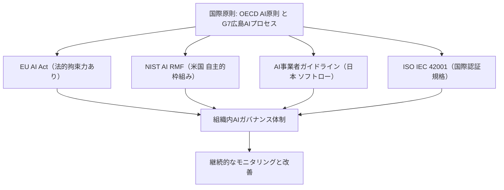
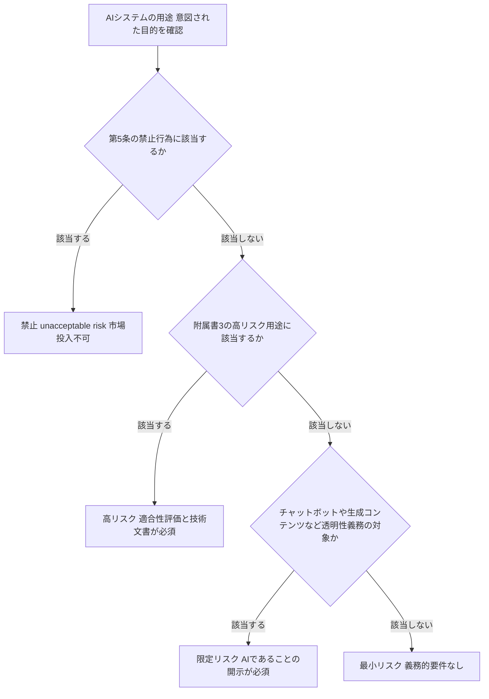
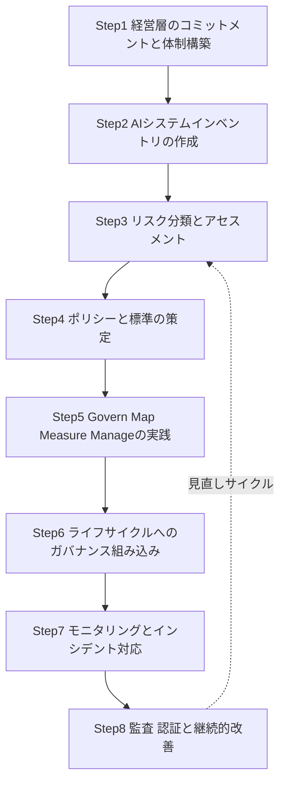
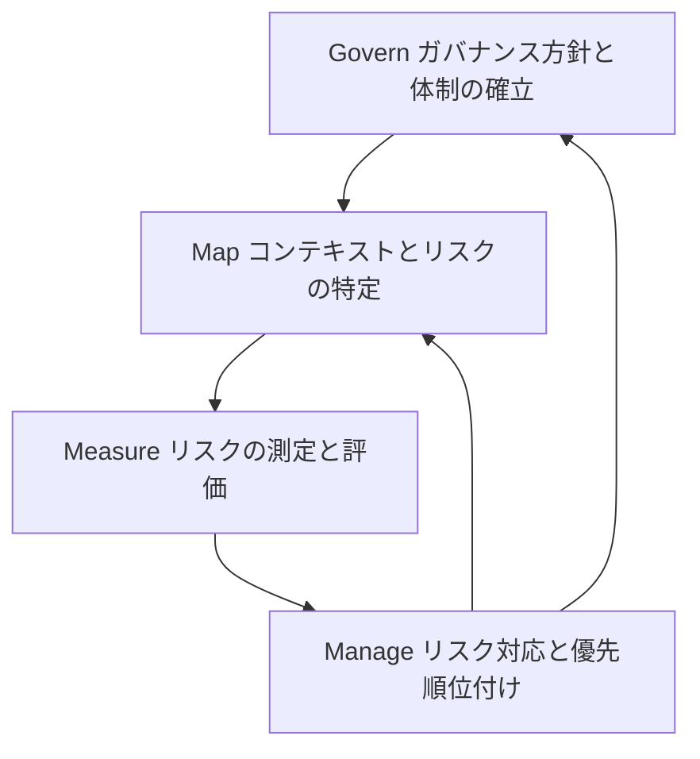
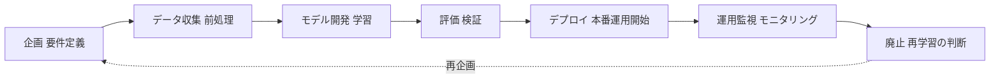

# AIガバナンス実践ガイド：初学者のためのステップバイステップ解説

> 本ガイドは、AIガバナンスを初めて学ぶ方向けに、世界的な規制・標準の動向と、組織内で実際にガバナンス体制を構築するための手順を、ステップバイステップで解説するものです。2026年7月時点で公開されている一次情報・専門機関の解説記事をもとに作成していますが、AIガバナンスの規制環境は非常に速いスピードで変化しているため、重要な意思決定を行う際は必ず各章末に記載した参照URLから最新の一次情報をご確認ください。

## 目次

1. [はじめに：AIガバナンスとは何か](#はじめにaiガバナンスとは何か)
2. [第1章 なぜ今AIガバナンスが必要なのか](#第1章-なぜ今aiガバナンスが必要なのか)
3. [第2章 主要な国際フレームワークを理解する](#第2章-主要な国際フレームワークを理解する)
4. [第3章 AIガバナンスをステップバイステップで構築する](#第3章-aiガバナンスをステップバイステップで構築する)
5. [第4章 役割分担とRACIマトリクス](#第4章-役割分担とraciマトリクス)
6. [第5章 実践チェックリスト](#第5章-実践チェックリスト)
7. [まとめ](#まとめ)
8. [参考文献・引用URL一覧](#参考文献引用url一覧)

---

## はじめに：AIガバナンスとは何か

AIガバナンス（AI Governance）とは、組織がAIシステムを企画・開発・提供・利用する全過程において、リスクを適切に管理しながら、安全性・公平性・透明性・アカウンタビリティ（説明責任）を確保するための、方針・体制・プロセス・技術的コントロールの総体を指します。単なる「コンプライアンスのためのチェックリスト」ではなく、AIが生み出す価値とリスクのバランスを取りながら、組織が継続的に学習・改善していくための「生きた経営管理システム」として捉えることが重要です。

AIガバナンスが対象とする主なリスク領域は次のとおりです。

- **技術的リスク**：モデルの誤動作、バイアス（偏り）、ハルシネーション（誤った出力）、頑健性（ロバスト性）の欠如
- **法的・規制リスク**：EU AI Actなどの域外適用を含む法規制違反、著作権・個人情報保護法違反
- **倫理的リスク**：差別的な意思決定、人権侵害、透明性の欠如
- **セキュリティリスク**：プロンプトインジェクション、モデルの窃取、サプライチェーン上の脆弱性
- **レピュテーションリスク**：AIの誤用・悪用による社会的信用の毀損

---

## 第1章 なぜ今AIガバナンスが必要なのか

生成AIやAIエージェントの急速な普及により、AIの利用範囲は組織のあらゆる業務プロセスに広がっています。それに伴い、ガバナンスが追いついていない組織ほどインシデントのリスクが高まっているというデータが複数の調査で示されています。

McKinseyのTechnology Trends Outlookでは、AI企業に対する信頼度が2019年の61%から2025年には53%まで低下したと報告されています。また、Infosysの調査では、企業幹部の95%が生成AIの利用に関連する何らかの問題インシデントを経験したと回答しています。Gartnerの2025年のリスク管理調査でも、2024年に本番環境で重大な障害を経験したAIプロジェクトの74%が、導入時点で正式なAIリスク管理プロセスを持っていなかったことが明らかになっています。

一方で、ガバナンス体制が整っている組織は明確な優位性を持ちます。McKinseyの2026年AI信頼調査によれば、AIガバナンスの役割が明確に割り当てられている組織の成熟度スコアは平均2.6であるのに対し、割り当てられていない組織は1.8にとどまり、この差はガバナンス上の失敗の減少、承認プロセスの迅速化、規制上のリスク低減に直結しています。

つまりAIガバナンスは「AI活用にブレーキをかけるもの」ではなく、「安全に、かつ迅速にAIを本番展開するためのアクセル」として機能するという理解が、2026年時点でのグローバルな共通認識になりつつあります。

**参照URL**
- NeuralTrust「The Complete Guide to AI Governance」 https://neuraltrust.ai/blog/ai-governance-complete-guide
- OneReach「AI Governance Frameworks & Best Practices for Enterprises 2026」 https://onereach.ai/blog/ai-governance-frameworks-best-practices/
- Diligent「AI governance: A guide for boards, risk and audit leaders」 https://www.diligent.com/resources/blog/ai-governance

---

## 第2章 主要な国際フレームワークを理解する

AIガバナンスを実践するうえで土台となる、代表的な国際フレームワーク・規制・ガイドラインを解説します。それぞれの関係性を俯瞰すると、次のような階層構造として理解できます。

### 2-1 NIST AI RMF（米国国立標準技術研究所 AIリスクマネジメントフレームワーク）

NIST AI RMF（正式名称：NIST AI 100-1）は、2023年1月に公開された、AIのライフサイクル全体にわたるリスク管理のための自主的な枠組みです。特定の業種や技術に限定されない汎用的な設計になっており、Govern（統治）・Map（特定）・Measure（測定）・Manage（対応）という4つの中核機能で構成されています。Governはリスク管理の文化と体制全体を対象とし、Map・Measure・Manageは個々のAIシステムやユースケースごとに適用されます。

2025年から2026年にかけて、NISTはこの枠組みを大きく拡張しています。生成AI固有のリスクに対応する「Generative AI Profile（NIST AI 600-1）」が2024年7月に公開されたほか、2025年12月にはサイバーセキュリティフレームワークとAIリスク管理を橋渡しする「Cyber AI Profile（NIST IR 8596）」の予備ドラフトが発表されました。さらに2026年2月には、AIエージェント（自律的に判断・行動するAI）を対象とした「AI Agent Standards Initiative」が開始されており、2026年第4四半期にはAIエージェントの相互運用性に関するプロファイルの公開が予定されています。NISTはAI RMF自体を法的拘束力のある基準にするのではなく、こうした業種別・技術別のプロファイルを積み重ねることで、実務での運用性を高める方向に舵を切っています。

**参照URL**
- NIST公式「AI Risk Management Framework」 https://www.nist.gov/itl/ai-risk-management-framework
- NIST AI Resource Center「AI RMF」 https://airc.nist.gov/airmf-resources/airmf/
- NIST AI 100-1 原文PDF https://nvlpubs.nist.gov/nistpubs/ai/nist.ai.100-1.pdf
- NIST「Draft NIST Guidelines Rethink Cybersecurity for the AI Era」 https://www.nist.gov/news-events/news/2025/12/draft-nist-guidelines-rethink-cybersecurity-ai-era
- GAICC「NIST AI Risk Management Framework: A Complete Guide」 https://gaicc.org/blog/nist-ai-risk-management-framework/

### 2-2 EU AI Act（EU AI規則）

EU AI Actは2024年8月1日に発効した、世界初の包括的なAI法規制です。すべてのAIシステムを一律に規制するのではなく、リスクの大きさに応じて4段階に分類し、それぞれ異なる義務を課す「リスクベースアプローチ」を採用している点が最大の特徴です。禁止行為やAIリテラシーに関する義務は2025年2月から、汎用AI（GPAI）モデル提供者に対する義務は2025年8月から、それぞれ適用が開始されています。

2026年に入り、高リスクAIシステムに関する義務の適用時期をめぐって「デジタル・オムニバス（Digital Omnibus on AI）」という簡素化パッケージの交渉が続けられてきました。2026年5月7日に欧州理事会・欧州議会・欧州委員会の間で暫定合意（Provisional Agreement）に達しており、現在は正式承認および欧州連合官報（Official Journal）への掲載手続きを待つ段階です。この暫定合意により、単独型（Annex III）の高リスクAIシステムに関する義務は当初予定の2026年8月2日から2027年12月2日へ、機械・医療機器等に組み込まれた製品規制型（Annex I）の高リスクAIシステムは2027年8月2日から2028年8月2日へ、それぞれ延期される見通しです。ただし、このスケジュールは確定した法的決定ではなく、最終的な官報公布状況を必ず一次情報で確認する必要があります。あわせて、非同意の性的コンテンツ生成AI（いわゆる「ヌーディファイアー」）や児童性的虐待コンテンツを生成するAIシステムを禁止する新条項が、2026年12月2日から適用される予定です。

### AIシステムのリスク分類

| リスク区分 | 具体例 | 主な義務 |
|---|---|---|
| 禁止（unacceptable risk） | 政府によるソーシャルスコアリング、公共空間でのリアルタイム遠隔生体認証、サブリミナルな行動操作 | EU市場での提供・使用そのものが禁止 |
| 高リスク（high risk） | 採用選考、信用スコアリング、重要インフラ制御、法執行、教育評価 | 適合性評価、技術文書、EUデータベース登録、人によるオーバーサイト |
| 限定リスク（limited risk） | チャットボット、ディープフェイク、生成AIコンテンツ | AIであることの開示、生成物のラベリング |
| 最小リスク（minimal risk） | スパムフィルター、ゲーム内AI、基本的なレコメンドエンジン | 義務的要件なし（自主的な行動規範の適用は可） |

**参照URL**
- EU公式「AI Act」欧州委員会 Digital Strategy https://digital-strategy.ec.europa.eu/en/policies/regulatory-framework-ai
- artificialintelligenceact.eu「Implementation Timeline」 https://artificialintelligenceact.eu/implementation-timeline/
- artificialintelligenceact.eu「High-level summary of the AI Act」 https://artificialintelligenceact.eu/high-level-summary/
- 欧州理事会（Consilium）プレスリリース https://www.consilium.europa.eu/en/press/press-releases/2026/05/07/artificial-intelligence-council-and-parliament-agree-to-simplify-and-streamline-rules/
- Gibson Dunn「EU AI Act Omnibus Agreement」 https://www.gibsondunn.com/eu-ai-act-omnibus-agreement-postponed-high-risk-deadlines-and-other-key-changes/
- Scytale「EU AI Act Risk Categories Explained」 https://scytale.ai/resources/eu-ai-act-risk-categories/

### 2-3 ISO/IEC 42001（AIマネジメントシステム規格）

ISO/IEC 42001は、2023年12月にISOとIECが共同で発行した、世界初のAI専用マネジメントシステム規格です。ISO 27001（情報セキュリティ）やISO 9001（品質管理）と同じ「マネジメントシステム」の考え方をAIに適用したもので、組織内にAIマネジメントシステム（AIMS）を確立・実装・維持・継続的に改善するための要求事項とガイダンスを提供します。

この規格の大きな特徴は「認証可能（certifiable）」である点です。第三者機関による審査を経て正式な認証を取得できるため、取引先や規制当局に対して「責任あるAI運用を行っている」ことを客観的に証明する手段として活用できます。関連規格として、AI固有のリスクマネジメントの手引きを示す非認証型のISO/IEC 23894や、個々のAIシステムが人・社会・環境に与える影響を評価する手法を示すISO/IEC 42005もあり、42001を中核としたAI標準のエコシステムが形成されつつあります。

**参照URL**
- ISO公式「ISO/IEC 42001:2023 - AI management systems」 https://www.iso.org/standard/42001
- ISO「ISO 42001 explained」 https://www.iso.org/home/insights-news/resources/iso-42001-explained-what-it-is.html
- BSI「ISO 42001 - AI Management System」 https://www.bsigroup.com/en-US/products-and-services/standards/iso-42001-ai-management-system/
- Microsoft Learn「ISO/IEC 42001:2023 Artificial Intelligence Management System Standards」 https://learn.microsoft.com/en-us/compliance/regulatory/offering-iso-42001

### 2-4 OECD AI原則とG7広島AIプロセス

OECD AI原則は、2019年5月にOECD加盟国によって採択された、政府間レベルでの責任あるAIに関する基礎的な政策枠組みです。「包摂的成長と持続可能な発展」「人間中心の価値観と公平性」「透明性と説明可能性」「頑健性・セキュリティ・安全性」「アカウンタビリティ」という5つの価値ベースの原則から構成され、2024年に改訂されています。この原則は法的拘束力を持ちませんが、EU AI Actをはじめとする後続の多くの拘束力あるフレームワークの設計に影響を与えた「グローバルな共通基盤」として位置づけられています。

2023年5月、日本のG7議長国のもとで開始された「G7広島AIプロセス」では、OECD AI原則を土台とした「先進AIシステムを開発する組織のための国際指針」と「国際行動規範（Code of Conduct）」が策定されました。2024年にはイタリアのG7議長国のもとでOECDと協力し、組織が自社のAIリスク管理の取り組みを自主的に報告する「HAIP Reporting Framework」が構築され、2025年4月15日を最初の提出期限として運用が開始されています。Amazon、Anthropic、Google、Microsoft、OpenAIなど主要なAI開発企業も、この枠組みへの参加を表明しています。

**参照URL**
- 総務省「Hiroshima AI Process 公式文書一覧」 https://www.soumu.go.jp/hiroshimaaiprocess/en/documents.html
- OECD.AI「HAIP Reporting Framework」 https://transparency.oecd.ai/about
- OECDプレスリリース「OECD launches global framework to monitor application of G7 Hiroshima AI Code of Conduct」 https://www.oecd.org/en/about/news/press-releases/2025/02/oecd-launches-global-framework-to-monitor-application-of-g7-hiroshima-ai-code-of-conduct.html

### 2-5 日本のAI事業者ガイドライン（経済産業省・総務省）

日本では、経済産業省と総務省が共同で「AI事業者ガイドライン」を策定・公表しています。これはAIの開発者・提供者・利用者という3つの主体それぞれに向けた、法的拘束力を持たない「ソフトロー」として位置づけられており、2024年4月の第1.0版公表後、2025年3月の第1.1版、2026年3月31日の第1.2版へと、生きた文書（Living Document）として継続的に更新されています。

第1.2版では、生成AIの社会実装が一段と進んだ実情を踏まえ、AIエージェント（自律的に判断・行動するAI）やフィジカルAI（実世界で動作するロボットや自動運転車など）に関するリスクと対策が新たに追記されました。また、2026年4月には「AI利活用における民事責任の解釈適用に関する手引き」が経済産業省から公表され、AIによる不適切な出力で第三者に損害が生じた際の責任分担を実務に落とし込むための補完文書として、第1.2版とセットで参照されることが想定されています。ガイドライン自体は努力義務に近い位置づけですが、これを満たしていない事実は、訴訟等の場面で「相当の注意を払っていたか」を判断する材料として用いられうる点に留意が必要です。

**参照URL**
- 経済産業省「AI事業者ガイドライン」 https://www.meti.go.jp/shingikai/mono_info_service/ai_shakai_jisso/20260331_report.html
- 経済産業省「AI事業者ガイドライン検討会」 https://www.meti.go.jp/shingikai/mono_info_service/ai_shakai_jisso/index.html
- IPA「AI事業者ガイドライン検討会」 https://www.ipa.go.jp/disc/committee/expert-group-on-aigfb.html
- PwC Japan「AI事業者ガイドライン（第1.2版）改定のポイント」 https://www.pwc.com/jp/ja/knowledge/column/ai-governance/ai-guideline-03.html

### 2-6 フレームワーク比較表

| フレームワーク | 発行主体 | 性質 | 対象範囲 | 認証の有無 |
|---|---|---|---|---|
| NIST AI RMF | 米国国立標準技術研究所 | 自主的・任意 | 業種横断・技術横断 | 認証なし（自己適合） |
| EU AI Act | 欧州連合 | 法的拘束力あり | EU市場に提供・影響するAI全般 | 高リスクは適合性評価が必須 |
| ISO/IEC 42001 | ISO / IEC | 国際規格 | AIを開発・提供・利用する組織全般 | 第三者認証が可能 |
| OECD AI原則 / G7広島プロセス | OECD加盟国 / G7 | 政府間の政策原則 | 政策設計の基礎、企業の自主報告 | 認証なし（自主報告） |
| AI事業者ガイドライン | 経済産業省・総務省 | ソフトロー | 日本国内でAIに関わる開発者・提供者・利用者 | 認証なし（自主的取組み） |

---

## 第3章 AIガバナンスをステップバイステップで構築する

ここからは、組織内で実際にAIガバナンス体制を構築していくための8つのステップを解説します。全体の流れは以下のとおりです。

### Step 1：経営層のコミットメントとガバナンス体制の構築

最初のステップは、AIガバナンスの「オーナーシップ」を明確にすることです。エグゼクティブスポンサー（多くの場合CIOやCOO、あるいはCAIOと呼ばれるChief AI Officer）を任命し、AIガバナンス委員会（AI Governance Committee）を設置します。この委員会には、法務・コンプライアンス・情報セキュリティ（CISO）・データ部門・事業部門の代表者など、部門横断的なメンバーを集めることが重要です。

委員会には大きく2つの役割があります。1つは「戦略的な方向性とリソース配分」を担うステアリングコミッティとしての役割、もう1つは「ポリシー・リスク・コンプライアンスの監督」を担うガバナンスコミッティとしての役割です。組織規模が小さいうちはこの2つを1つの委員会に統合することが一般的ですが、AI活用が拡大するにつれて機能を分離していくケースが多く見られます。

**参照URL**
- Trustible「How to Establish an Effective AI Governance Committee in 2026」 https://trustible.ai/post/how-to-establish-an-effective-ai-governance-committee-in-2026/
- Liminal「Enterprise AI Governance: Complete Implementation Guide」 https://www.liminal.ai/blog/enterprise-ai-governance-guide
- OneTrust「Establishing an AI Governance Committee」 https://www.onetrust.com/blog/establishing-an-ai-governance-committee-an-inside-look-at-onetrusts-process/

### Step 2：AIシステムインベントリの作成

次に、組織内で稼働中・開発中・パイロット中のすべてのAIシステムを棚卸しし、一元的な台帳（インベントリ）を作成します。ここで重要なのは、IT部門が正式に把握していない「シャドーAI」（現場が独自に導入した生成AIツールなど）まで含めて洗い出すことです。各AIシステムについて、利用目的・使用データ・依存関係・想定されるリスクレベルを記録し、後続のリスク分類の土台とします。

**参照URL**
- IS Partners「NIST AI RMF 2025–2026 Updates」 https://www.ispartnersllc.com/blog/nist-ai-rmf-2025-2026-updates-what-you-need-to-know-about-the-latest-framework-changes/
- NeuralTrust「The Complete Guide to AI Governance」 https://neuraltrust.ai/blog/ai-governance-complete-guide

### Step 3：リスク分類とアセスメント

インベントリ化したAIシステムを、リスクの大きさに応じて分類します。第2章で紹介したEU AI Actの4段階リスク分類（禁止・高リスク・限定リスク・最小リスク）は、社内独自のリスクアセスメントを行う際の判断軸としても非常に有用です。特に高リスクに分類されるシステム（採用選考、与信審査、医療診断支援など）については、導入前に必ずガバナンス委員会によるレビューを経るプロセスを設けることが推奨されます。

NIST AI RMFの「Map」機能では、AIシステムの意図された目的・想定される利用シーン・影響を受けるステークホルダー・代替手段と比較した際のベネフィット・起こりうる影響の大きさと発生可能性を、体系的に文書化することが求められています。このプロセスを経て初めて、開発・展開を進めるかどうかの判断（go / no-go判断）を下すための十分な情報が揃うとされています。

**参照URL**
- GAICC「NIST AI Risk Management Framework: A Complete Guide」 https://gaicc.org/blog/nist-ai-risk-management-framework/
- GDPR Local「AI Risk Classification: Guide to EU AI Act Risk Categories」 https://gdprlocal.com/ai-risk-classification/

### Step 4：ポリシーと標準の策定

ガバナンスの原則を、実際に運用可能な社内ポリシーに落とし込みます。具体的には、AI利用に関する許容利用ポリシー（Acceptable Use Policy）、モデルの文書化要件、公平性・透明性に関する基準などを策定します。これらのポリシーはNIST AI RMFやISO/IEC 42001といった外部フレームワークを参照点とし、規制条文への対応関係（マッピング）を明記しておくことで、監査対応やコンプライアンス証明が容易になります。ポリシー案は法務・セキュリティ・事業部門など関係者からのレビューを経て、経営層の承認を得たうえで正式に公開します。

**参照URL**
- Liminal「Enterprise AI Governance: Complete Implementation Guide」 https://www.liminal.ai/blog/enterprise-ai-governance-guide
- Arthur.ai「How to Build an AI Governance Framework: 10-Step Guide」 https://www.arthur.ai/column/ai-governance-framework-guide

### Step 5：Govern・Map・Measure・Manageの実践

NIST AI RMFの4つの中核機能を、社内プロセスとして具体的に運用します。

- **Govern（統治）**：全社的なAIリスク管理の方針・文化・体制を確立する機能です。リスク管理チームの多様性（ダイバーシティ）を確保することも、見落とされがちなリスクを減らす観点から重視されています。
- **Map（特定）**：個々のAIシステムが置かれている文脈やリスクを特定する機能です。
- **Measure（測定）**：特定されたリスクを定量的・定性的に測定し、モデルの性能や公平性を評価する機能です。
- **Manage（対応）**：測定結果に基づいてリスクへの対応策を実施し、優先順位をつけて継続的に管理する機能です。

**参照URL**
- NIST AI Resource Center「AI RMF」 https://airc.nist.gov/airmf-resources/airmf/
- NIST AI 100-1 原文PDF https://nvlpubs.nist.gov/nistpubs/ai/nist.ai.100-1.pdf

### Step 6：AIライフサイクル全体へのガバナンス組み込み

ガバナンスは開発が完了した後に一度だけ行うものではなく、企画段階から廃止・再学習に至るまで、ライフサイクル全体に組み込む必要があります。

各フェーズでの主なガバナンスチェックポイントは次のとおりです。

| フェーズ | 主なガバナンスチェックポイント |
|---|---|
| 企画・要件定義 | 利用目的の妥当性審査、リスク分類の初期判定 |
| データ収集・前処理 | データの出所・権利関係の確認、個人情報の取り扱い方針との整合性 |
| モデル開発・学習 | バイアス検知、学習データの品質確認 |
| 評価・検証 | レッドチーム演習、公平性・頑健性のテスト |
| デプロイ・本番運用開始 | 人によるオーバーサイト（human oversight）の設計、EUデータベース登録等の法定手続き |
| 運用監視・モニタリング | ドリフト検知、インシデントの記録と報告 |
| 廃止・再学習の判断 | ログの保管、廃止に伴う影響評価 |

**参照URL**
- NIST AI 100-1 原文PDF（AIライフサイクルの記述） https://nvlpubs.nist.gov/nistpubs/ai/nist.ai.100-1.pdf
- Orca Security「NIST AI Risk Management Framework (AI RMF) Explained」 https://orca.security/resources/blog/nist-ai-risk-management-framework-ai-rmf/

### Step 7：モニタリング・インシデント対応

本番運用開始後も、AIシステムの挙動を継続的にモニタリングする体制が不可欠です。特にAIエージェントのような自律的なシステムについては、稼働状況（アップタイム）だけでなく、機能面・運用面・セキュリティ面・コンプライアンス面・人的要因といった複数の観点から監視する必要があるとNISTも指摘しています。インシデントが発生した際に迅速に検知・報告・是正できるよう、インシデント対応計画（Incident Response Plan）をあらかじめ策定し、定期的に訓練しておくことが推奨されます。

**参照URL**
- Cloud Security Alliance「NIST AI Risk Management Framework: Agentic Profile」 https://labs.cloudsecurityalliance.org/agentic/agentic-nist-ai-rmf-profile-v1/
- Arthur.ai「How to Build an AI Governance Framework: 10-Step Guide」 https://www.arthur.ai/column/ai-governance-framework-guide

### Step 8：監査・認証と継続的改善

最後のステップとして、構築したガバナンス体制が実際に機能しているかを定期的に監査します。ISO/IEC 42001の第三者認証取得を目指す場合、監査の時点で初めてガバナンスの記録を用意するのではなく、日常的な運用の中で証跡（エビデンス）を継続的に蓄積しておくことが極めて重要です。監査結果や新たに顕在化したリスクを踏まえてポリシーを見直し、Step 3のリスクアセスメントに戻ることで、ガバナンス全体を継続的な改善サイクルとして回し続けます。

**参照URL**
- LogicGate「What is ISO 42001? Your Guide to AI Management Systems」 https://www.logicgate.com/blog/what-is-iso-42001-your-guide-to-ai-management-systems/
- NeuralTrust「The Complete Guide to AI Governance」 https://neuraltrust.ai/blog/ai-governance-complete-guide

---

## 第4章 役割分担とRACIマトリクス

AIガバナンスを機能させるためには、「誰が何に責任を持つか」を明確にする必要があります。RACI（Responsible：実行責任者、Accountable：説明責任者、Consulted：協議先、Informed：報告先）の考え方を用いると、部門横断的な役割分担を整理しやすくなります。

| 活動 | エグゼクティブスポンサー | AIガバナンスリード | 法務・コンプライアンス | CISO / セキュリティ | 事業部門・モデルオーナー |
|---|---|---|---|---|---|
| ガバナンス方針の承認 | Accountable | Responsible | Consulted | Consulted | Informed |
| AIインベントリの維持 | Informed | Accountable | Informed | Consulted | Responsible |
| リスクアセスメントの実施 | Informed | Consulted | Consulted | Responsible | Accountable |
| 高リスクAIの導入承認 | Accountable | Responsible | Responsible | Consulted | Informed |
| インシデント対応 | Informed | Accountable | Consulted | Responsible | Consulted |
| 監査・認証対応 | Informed | Responsible | Accountable | Consulted | Consulted |

代表的な役割の定義は次のとおりです。

- **エグゼクティブスポンサー**：ガバナンスの権限と予算の裏付けを提供し、取締役会への報告責任を負う
- **AIガバナンスリード**：日常的なプログラム運営、ポリシー策定、部門間調整を担う
- **モデルオーナー**：個々のAIシステムの性能・コンプライアンス状況・ライフサイクル全体にわたるリスク管理に責任を持つ
- **AIチャンピオン**：各事業部門にガバナンスの実践を浸透させ、現場との橋渡し役を担う

**参照URL**
- Liminal「Enterprise AI Governance: Complete Implementation Guide」 https://www.liminal.ai/blog/enterprise-ai-governance-guide
- aiassemblylines「How Do Companies Structure an AI Governance Framework?」 https://aiassemblylines.com/post/ai-governance-framework-enterprise-guide-2026
- Arthur.ai「How to Build an AI Governance Framework: 10-Step Guide」 https://www.arthur.ai/column/ai-governance-framework-guide

---

## 第5章 実践チェックリスト

組織でAIガバナンスの取組みを始める際に確認しておきたい項目を、初学者向けにまとめました。

| # | チェック項目 | 状態 |
|---|---|---|
| 1 | エグゼクティブスポンサーとAIガバナンス委員会が任命されているか | ☐ |
| 2 | シャドーAIを含む全AIシステムのインベントリが存在するか | ☐ |
| 3 | 各AIシステムにリスクレベル（禁止・高・限定・最小など）が割り当てられているか | ☐ |
| 4 | 許容利用ポリシーなど、社内向けのAIガバナンスポリシーが文書化されているか | ☐ |
| 5 | NIST AI RMFやISO/IEC 42001など、参照する外部フレームワークが決まっているか | ☐ |
| 6 | 高リスクAIシステムの導入前レビュープロセスが定義されているか | ☐ |
| 7 | AIインシデント対応計画が策定され、訓練されているか | ☐ |
| 8 | 定期的な監査・見直しサイクルが運用されているか | ☐ |
| 9 | 該当する場合、EU AI Actの適用範囲・時期を把握しているか | ☐ |
| 10 | 日本国内向けに、AI事業者ガイドラインの該当箇所を確認しているか | ☐ |

---

## まとめ

AIガバナンスは、NIST AI RMF・EU AI Act・ISO/IEC 42001・OECD AI原則・各国のソフトローといった複数のフレームワークが互いに補完し合いながら形成される、複層的なエコシステムです。初学者がまず押さえるべきポイントは次の3点に集約されます。

1. **体制がなければ何も始まらない**：エグゼクティブスポンサーとガバナンス委員会の設置が全ての出発点になります。
2. **リスクベースで考える**：すべてのAIシステムを一律に扱うのではなく、リスクの大きさに応じてメリハリをつけて管理することが、規制対応とイノベーションのバランスを取る鍵になります。
3. **ガバナンスは一度きりの作業ではない**：AI技術・規制環境ともに急速に変化し続けるため、継続的なモニタリングと改善サイクルを組み込むことが不可欠です。

規制環境は今後も変化していくため、本ガイドの内容は定期的に一次情報と突き合わせて更新していくことをお勧めします。

---

## 参考文献・引用URL一覧

**NIST AI RMF関連**
- NIST公式「AI Risk Management Framework」 https://www.nist.gov/itl/ai-risk-management-framework
- NIST AI Resource Center（AIRC）「AI RMF」 https://airc.nist.gov/airmf-resources/airmf/
- NIST AI 100-1 原文PDF https://nvlpubs.nist.gov/nistpubs/ai/nist.ai.100-1.pdf
- NIST「Draft NIST Guidelines Rethink Cybersecurity for the AI Era」 https://www.nist.gov/news-events/news/2025/12/draft-nist-guidelines-rethink-cybersecurity-ai-era
- GAICC「NIST AI Risk Management Framework: A Complete Guide for US Organisations」 https://gaicc.org/blog/nist-ai-risk-management-framework/
- IS Partners「NIST AI RMF 2025–2026 Updates」 https://www.ispartnersllc.com/blog/nist-ai-rmf-2025-2026-updates-what-you-need-to-know-about-the-latest-framework-changes/
- Orca Security「NIST AI Risk Management Framework (AI RMF) Explained」 https://orca.security/resources/blog/nist-ai-risk-management-framework-ai-rmf/
- Cloud Security Alliance「NIST AI Risk Management Framework: Agentic Profile」 https://labs.cloudsecurityalliance.org/agentic/agentic-nist-ai-rmf-profile-v1/

**EU AI Act関連**
- 欧州委員会 Digital Strategy「AI Act」 https://digital-strategy.ec.europa.eu/en/policies/regulatory-framework-ai
- artificialintelligenceact.eu「Implementation Timeline」 https://artificialintelligenceact.eu/implementation-timeline/
- artificialintelligenceact.eu「High-level summary of the AI Act」 https://artificialintelligenceact.eu/high-level-summary/
- 欧州理事会（Consilium）プレスリリース https://www.consilium.europa.eu/en/press/press-releases/2026/05/07/artificial-intelligence-council-and-parliament-agree-to-simplify-and-streamline-rules/
- Gibson Dunn「EU AI Act Omnibus Agreement」 https://www.gibsondunn.com/eu-ai-act-omnibus-agreement-postponed-high-risk-deadlines-and-other-key-changes/
- Kennedys Law「The EU AI Act implementation timeline」 https://www.kennedyslaw.com/en/thought-leadership/article/2026/the-eu-ai-act-implementation-timeline-understanding-the-next-deadline-for-compliance/
- GDPR Local「AI Risk Classification: Guide to EU AI Act Risk Categories」 https://gdprlocal.com/ai-risk-classification/
- Scytale「EU AI Act Risk Categories Explained」 https://scytale.ai/resources/eu-ai-act-risk-categories/

**ISO/IEC 42001関連**
- ISO公式「ISO/IEC 42001:2023 - AI management systems」 https://www.iso.org/standard/42001
- ISO「ISO 42001 explained」 https://www.iso.org/home/insights-news/resources/iso-42001-explained-what-it-is.html
- BSI「ISO 42001 - AI Management System」 https://www.bsigroup.com/en-US/products-and-services/standards/iso-42001-ai-management-system/
- Microsoft Learn「ISO/IEC 42001:2023 Artificial Intelligence Management System Standards」 https://learn.microsoft.com/en-us/compliance/regulatory/offering-iso-42001
- LogicGate「What is ISO 42001? Your Guide to AI Management Systems」 https://www.logicgate.com/blog/what-is-iso-42001-your-guide-to-ai-management-systems/

**OECD / G7広島AIプロセス関連**
- 総務省「Hiroshima AI Process 公式文書一覧」 https://www.soumu.go.jp/hiroshimaaiprocess/en/documents.html
- OECD.AI「HAIP Reporting Framework」 https://transparency.oecd.ai/about
- OECDプレスリリース「OECD launches global framework to monitor application of G7 Hiroshima AI Code of Conduct」 https://www.oecd.org/en/about/news/press-releases/2025/02/oecd-launches-global-framework-to-monitor-application-of-g7-hiroshima-ai-code-of-conduct.html

**日本のAI事業者ガイドライン関連**
- 経済産業省「AI事業者ガイドライン」 https://www.meti.go.jp/shingikai/mono_info_service/ai_shakai_jisso/20260331_report.html
- 経済産業省「AI事業者ガイドライン検討会」 https://www.meti.go.jp/shingikai/mono_info_service/ai_shakai_jisso/index.html
- IPA「AI事業者ガイドライン検討会」 https://www.ipa.go.jp/disc/committee/expert-group-on-aigfb.html
- PwC Japan「AI事業者ガイドライン（第1.2版）改定のポイントと事業者への期待」 https://www.pwc.com/jp/ja/knowledge/column/ai-governance/ai-guideline-03.html

**企業内AIガバナンス体制・実装ガイド関連**
- Trustible「How to Establish an Effective AI Governance Committee in 2026」 https://trustible.ai/post/how-to-establish-an-effective-ai-governance-committee-in-2026/
- aiassemblylines「How Do Companies Structure an AI Governance Framework? A 2026 Enterprise Guide」 https://aiassemblylines.com/post/ai-governance-framework-enterprise-guide-2026
- Liminal「Enterprise AI Governance: Complete Implementation Guide (2026)」 https://www.liminal.ai/blog/enterprise-ai-governance-guide
- OneTrust「Establishing an AI Governance Committee」 https://www.onetrust.com/blog/establishing-an-ai-governance-committee-an-inside-look-at-onetrusts-process/
- NeuralTrust「The Complete Guide to AI Governance」 https://neuraltrust.ai/blog/ai-governance-complete-guide
- Arthur.ai「How to Build an AI Governance Framework: 10-Step Guide」 https://www.arthur.ai/column/ai-governance-framework-guide
- Diligent「AI governance: A guide for boards, risk and audit leaders」 https://www.diligent.com/resources/blog/ai-governance
- OneReach「AI Governance Frameworks & Best Practices for Enterprises 2026」 https://onereach.ai/blog/ai-governance-frameworks-best-practices/