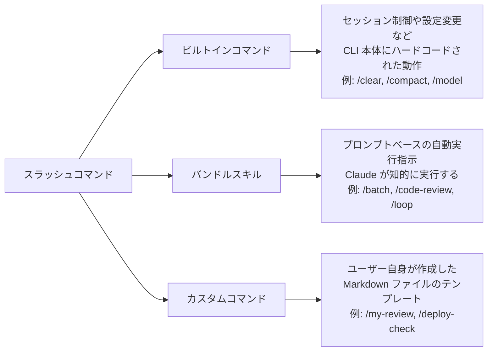
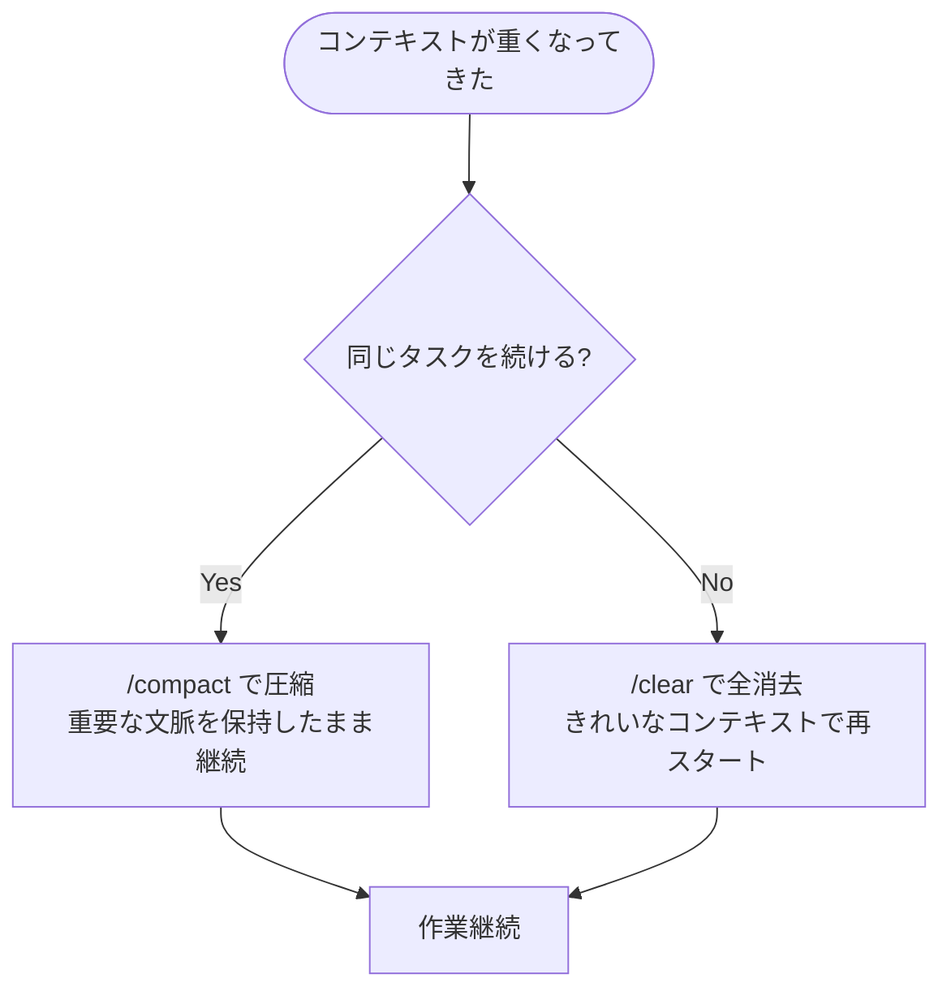
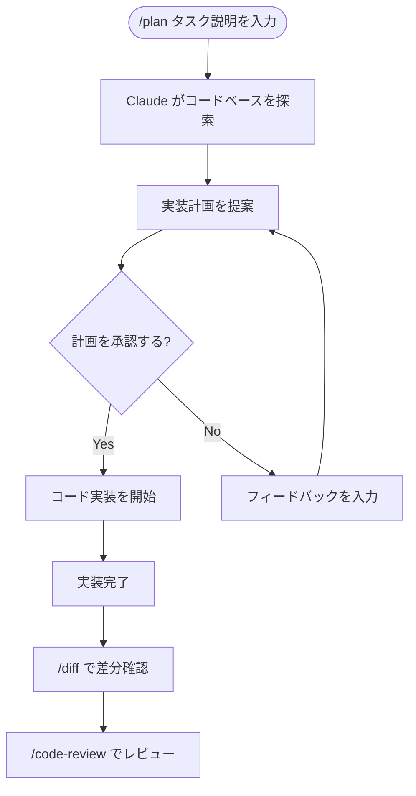
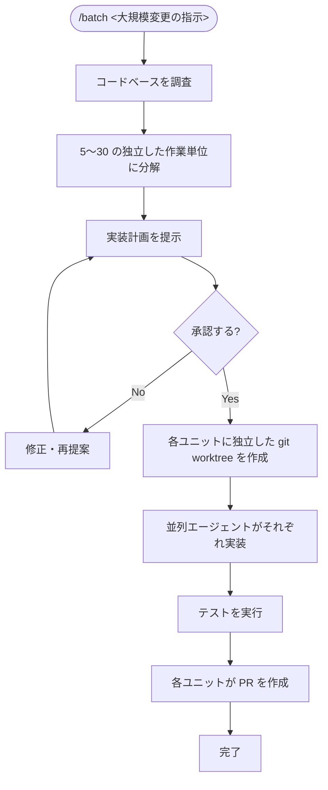
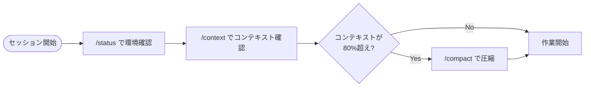
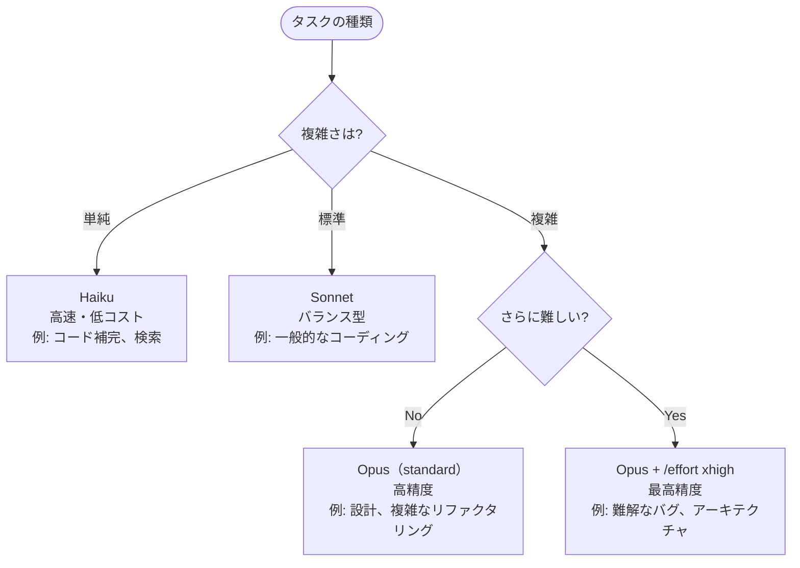
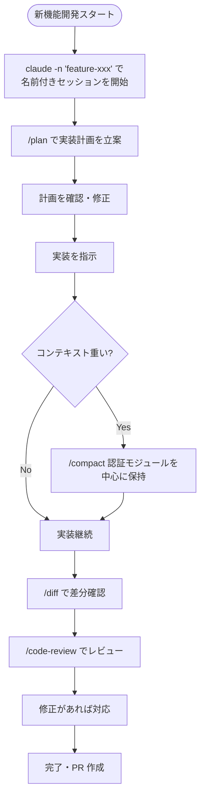

# Claude Code スラッシュコマンド完全ガイド

> **対象バージョン:** Claude Code v2.1.150 / 2026年5月31日時点
> **対象読者:** Claude Code を使い始めたばかりの初学者〜中級者

---

## 目次

1. [スラッシュコマンドとは何か](#1-スラッシュコマンドとは何か)
2. [インストールと起動](#2-インストールと起動)
3. [コマンドの種類と分類](#3-コマンドの種類と分類)
4. [セッション・コンテキスト管理](#4-セッションコンテキスト管理)
5. [モデルとパフォーマンス設定](#5-モデルとパフォーマンス設定)
6. [プロジェクト設定・環境](#6-プロジェクト設定環境)
7. [コーディング・レビュー](#7-コーディングレビュー)
8. [エージェント・スキル・プラグイン](#8-エージェントスキルプラグイン)
9. [MCP インテグレーション](#9-mcp-インテグレーション)
10. [カスタムコマンド・スキルの作り方](#10-カスタムコマンドスキルの作り方)
11. [ベストプラクティス集](#11-ベストプラクティス集)
12. [実践ワークフロー](#12-実践ワークフロー)
13. [参考ソース](#13-参考ソース)

---

## 1. スラッシュコマンドとは何か

### 基本概念

Claude Code のスラッシュコマンドは、**セッション自体を制御するためのショートカット**です。通常のプロンプト（Claude に「何をするか」を伝えるもの）とは異なり、スラッシュコマンドは「**どう振る舞うか**」や「**セッションそのものへのアクション**」を実行します。

```text
通常のプロンプト : "この関数をリファクタリングして"  →  Claude への指示
スラッシュコマンド: /compact                        →  セッション状態の操作
```

### コマンドを表示する方法

Claude Code のセッション内で `/` を入力すると、オートコンプリートメニューが表示されます。さらに文字を入力してフィルタリングができます。

```text
/          →  全コマンド一覧を表示
/comp      →  "comp" を含むコマンドを絞り込み表示
/help      →  ヘルプを表示
```

---

## 2. インストールと起動

### インストール方法（推奨順）

```bash
# 方法 1: ネイティブバイナリ（推奨）
curl -fsSL https://claude.ai/install.sh | bash

# 方法 2: Homebrew（macOS のみ）
brew install --cask claude-code

# 方法 3: npm（非推奨・旧来の方法）
npm install -g @anthropic-ai/claude-code
```

### 起動後の基本コマンド（CLI フラグ）

| フラグ | 説明 | 例 |
|--------|------|-----|
| `claude` | 新規インタラクティブセッションを開始 | `claude` |
| `claude -p "..."` | 1回だけ実行して終了（プリントモード） | `claude -p "TODO を列挙して"` |
| `claude -c` | 直近のセッションを継続 | `claude -c` |
| `claude -r "名前"` | 指定した名前のセッションを再開 | `claude -r "auth-refactor"` |
| `claude --model opus` | モデルを指定して起動 | `claude --model opus` |
| `claude --init` | CLAUDE.md を作成して起動 | `claude --init` |
| `claude --debug` | デバッグログを有効にして起動 | `claude --debug` |

### セッション開始フロー

```mermaid
flowchart TD
    A([ターミナルを開く]) --> B{プロジェクト済み?}
    B -- No --> C[cd your-project]
    B -- Yes --> D[claude を実行]
    C --> D
    D --> E{CLAUDE.md ある?}
    E -- No --> F[/init を実行]
    E -- Yes --> G[セッション開始]
    F --> G
    G --> H[/ でコマンド一覧を確認]
    H --> I[作業開始]
```

---

## 3. コマンドの種類と分類

### 3 種類のスラッシュコマンド



| 種類 | 場所 | 特徴 | 例 |
|------|------|------|-----|
| ビルトインコマンド | CLI 本体 | 固定ロジック、高速 | `/clear`, `/compact`, `/model` |
| バンドルスキル | CLI に同梱 | プロンプトベース、Claude が実行 | `/batch`, `/code-review` |
| カスタムコマンド | `.claude/commands/` | ユーザー定義の Markdown テンプレート | `/my-review` |

> **2026年の変更点:** カスタムコマンド (`.claude/commands/`) とスキル (`.claude/skills/`) が統合されました。既存のコマンドファイルはそのまま動作しますが、スキル形式が推奨されます。

---

## 4. セッション・コンテキスト管理

最も頻繁に使うカテゴリです。コンテキスト管理が Claude Code の出力品質を左右する最大要因です。

### 主要コマンド一覧

| コマンド | 説明 | 使いどき |
|----------|------|----------|
| `/clear` | 会話履歴を全消去してコンテキストを解放 | 新しいタスクに切り替えるとき |
| `/compact [フォーカス指示]` | 会話を要約して圧縮（コンテキスト節約） | 長いセッションで続けたいとき |
| `/context` | コンテキストウィンドウの使用状況を表示 | 限界に近づいていないか確認 |
| `/rewind` | 以前のチェックポイントに巻き戻す | Claude が間違った方向に進んだとき |
| `/resume [名前]` | 以前のセッションを再開 | 昨日の作業を引き継ぐとき |
| `/rename [名前]` | 現在のセッションに名前をつける | 複数セッションを管理するとき |
| `/branch [名前]` | 会話を分岐させて並行探索 | リスクのある変更を試したいとき |
| `/export [ファイル名]` | 会話をエクスポート（Markdown 等） | ログを残したいとき |
| `/diff` | インタラクティブな差分ビューワーを開く | 変更内容を確認するとき |
| `/copy [N]` | 最新または N番目の回答をコピー | コードをクリップボードにコピー |
| `/goal [条件]` | 完了条件を設定して自動継続 | 複数ターンにまたがる作業 |

### `/compact` の使い方（詳細）

```bash
# 基本: そのまま圧縮
/compact

# フォーカスを指定して圧縮（重要情報を優先的に保持）
/compact 認証モジュールと現在のテスト失敗を中心に保持して

# API の設計決定だけ残す
/compact API の設計決定のみ保持
```

### `/clear` vs `/compact` の使い分け



### `/goal` コマンド（v2.1.139+）

複数ターンにまたがる複雑なタスクに使います。Claude が条件を満たすまで自律的に作業を続けます。

```bash
# 全てのユニットテストが通過するまで修正を続ける
/goal 全ユニットテストが PASS になるまで

# 経過時間・ターン数・トークン数のオーバーレイが表示される
```

---

## 5. モデルとパフォーマンス設定

### モデル切り替え

```bash
# モデルを切り替える（即座に反映）
/model opus    → Claude Opus 4.8（高精度・重タスク向け）
/model sonnet  → Claude Sonnet 4.6（バランス型・日常タスク向け）
/model haiku   → Claude Haiku 4.5（高速・軽量タスク向け）

# オプション: モデルピッカー UI を開く
/model
```

> **v2.1.153 以降:** モデルピッカーで選択したモデルは、以降の新しいセッションのデフォルトとして保存されます。現在のセッションだけに適用したい場合は `s` キーを押します。

### エフォートレベル（推論の深さ）の設定

| レベル | 説明 | 適したタスク |
|--------|------|--------------|
| `low` | 軽量な推論 | 簡単なコード補完、検索 |
| `medium` | 標準推論 | 一般的なコーディングタスク |
| `high` | 深い推論 | 複雑なリファクタリング、設計 |
| `xhigh` | 最高レベル（Opus 4.8 推奨） | 難解なバグ修正、アーキテクチャ設計 |
| `auto` | モデルデフォルトに戻す | リセットしたいとき |

```bash
# エフォートを設定
/effort high

# インタラクティブスライダーを開く（引数なし）
/effort
```

### ファストモード

```bash
# 素早い・簡潔な回答に切り替え
/fast on

# 通常モードに戻す
/fast off
```

---

## 6. プロジェクト設定・環境

### 最重要コマンド: `/init`

プロジェクトの初期設定を行う最初のステップです。

```bash
# CLAUDE.md を生成（プロジェクトの説明・ルールを記述するファイル）
/init

# 対話式フローで初期化（スキル・フック・メモリファイルも設定）
# 環境変数で有効化
CLAUDE_CODE_NEW_INIT=1 claude
```

**CLAUDE.md に書く内容の例:**

```markdown
# プロジェクト概要
- TypeScript + Next.js のフルスタックアプリ
- テストフレームワーク: Vitest

# コーディング規約
- 関数はすべて JSDoc コメントを書く
- コミットメッセージは Conventional Commits に従う

# 禁止事項
- `console.log` を本番コードに残さない
```

### 設定・環境コマンド一覧

| コマンド | 説明 | 備考 |
|----------|------|------|
| `/init` | `CLAUDE.md` を作成 | 最初に実行すべき重要コマンド |
| `/config` | Claude Code の設定を開く | Vim モード、ワークフローキーワードなど |
| `/memory` | メモリファイルを開く・編集 | `CLAUDE.md` のワークフロー管理 |
| `/permissions` | 権限設定を管理 | コマンドがブロックされたときに確認 |
| `/hooks` | フックスクリプトを管理 | `PreToolUse`、`SessionStart` などのイベント |
| `/doctor` | 診断を実行 | インストール後や更新後に実行。`f` で自動修正 |
| `/terminal-setup` | ターミナル統合を設定 | VS Code / Cursor での文字化けを防ぐ |
| `/sandbox` | サンドボックス制御を開く | 実行権限の確認 |
| `/add-dir <パス>` | 作業スコープにディレクトリを追加 | モノレポや隣接プロジェクト向け |
| `/keybindings` | キーボードショートカットをカスタマイズ | `~/.claude/keybindings.json` を編集 |
| `/theme` | テーマを変更・作成 | `~/.claude/themes/` に JSON を置く |
| `/team-onboarding` | チームメンバー向けガイドを生成 | v2.1.101 以降 |
| `/status` | 現在のセッション・環境状態を表示 | 最初に確認するコマンド |
| `/login` | Claude Code にサインイン | |
| `/logout` | サインアウト | |

### キーボードショートカット（インタラクティブモード）

| ショートカット | 動作 |
|---------------|------|
| `Shift+Tab` | モード切替（通常 → 自動承認 → プランモード） |
| `Esc` × 2 | 直前の状態に巻き戻す（`/rewind` と同じ） |
| `Ctrl+A` | 全プロジェクトのセッション一覧を表示 |

---

## 7. コーディング・レビュー

### コーディング系コマンド

| コマンド | 説明 | 使い方 |
|----------|------|--------|
| `/plan [説明]` | プランモードに入る。コードを書く前に実装計画を立案 | `/plan 認証モジュールをリファクタリング` |
| `/diff` | インタラクティブな差分ビューワー | 左右矢印でターン別差分を切替 |
| `/code-review [effort]` | バグ・セキュリティ問題の検出（v2.1.147 で `/simplify` から改名） | `/code-review high` |
| `/security-review` | セキュリティ脆弱性の分析 | PR マージ前に必ず実行 |
| `/autofix-pr [説明]` | PR の問題を自動修正するエージェントを起動 | |
| `/ultrareview` | 超詳細なコードレビュー（v2.1.x 以降） | 重要な PR に使用 |

### `/plan` モードのフロー



### セキュリティレビューのベストプラクティス

```bash
# セキュリティに関わるコードを変更した後は必ず実行
/security-review

# チェック項目（自動的に確認される）:
# - SQL インジェクションリスク
# - XSS 脆弱性
# - 認証・認可の問題
# - クレデンシャルの露出
# - 安全でない設定
```

---

## 8. エージェント・スキル・プラグイン

### エージェント系コマンド

| コマンド | 説明 | 備考 |
|----------|------|------|
| `/batch <指示>` | 大規模変更を並列エージェントに分散実行 | `gh` CLI が必要 |
| `/agents` | サブエージェントを管理 | |
| `/tasks` | バックグラウンドエージェントを一覧表示 | |
| `/bashes` | バックグラウンドの bash タスクを一覧 | |
| `/loop [間隔] [プロンプト]` | 定期的にプロンプトを繰り返し実行 | 監視・メンテナンス用 |
| `/skills` | インストール済みスキルを一覧表示（v2.1.121+） | フィルター検索対応 |
| `/plugins` | プラグインを管理 | MCP サーバー定義等を含む |

### `/batch` の仕組み



**使用例:**

```bash
# 全ファイルのエラーハンドリングを統一する
/batch 全 API エンドポイントのエラーハンドリングを統一して型安全な Result 型を返すようにリファクタリング

# テストカバレッジを向上させる
/batch テストカバレッジが 50% 以下のモジュールに対してユニットテストを追加
```

### `/loop` コマンドの使い方

```bash
# 5 分ごとにプロンプトを実行
/loop 5m テスト結果を確認して失敗しているテストを修正

# 間隔を省略すると Claude が自分でペースを決定
/loop ログを監視してエラーが出たら通知

# プロンプトを省略すると自律的なメンテナンスモードに
/loop
```

---

## 9. MCP インテグレーション

MCP（Model Context Protocol）サーバーを通じて、外部サービスと連携できます。

| コマンド | 説明 |
|----------|------|
| `/mcp` | MCP サーバーを設定・管理 |
| `/mcp enable` | MCP サーバーを有効化 |
| `/mcp disable` | MCP サーバーを無効化 |

```bash
# MCP サーバーの状態を確認
/mcp

# 有効化
/mcp enable github

# 無効化
/mcp disable github
```

---

## 10. カスタムコマンド・スキルの作り方

### ステップ 1: ディレクトリを作成

```bash
# プロジェクトスコープ（Git で共有される）
mkdir -p .claude/commands

# 個人スコープ（全プロジェクトで使える）
mkdir -p ~/.claude/commands
```

### ステップ 2: Markdown ファイルを作成

ファイル名がコマンド名になります。

```bash
# /optimize コマンドを作成
cat > .claude/commands/optimize.md << 'EOF'
このコードのパフォーマンス問題を分析してください：

$ARGUMENTS

各問題について以下を提示してください：
1. 問題の説明
2. 影響度（高/中/低）
3. 具体的な修正案とサンプルコード
EOF
```

**使い方:**

```bash
/optimize src/api/users.ts
```

### ステップ 3: YAML フロントマターで設定（オプション）

```yaml
---
description: セキュリティ脆弱性スキャンを実行
allowed-tools: Read, Grep, Glob, Bash, WebFetch
model: claude-opus-4-7
argument-hint: "[ブランチ名またはファイルパス]"
---
以下のコードを次の観点でセキュリティ監査してください：
- SQL インジェクションのリスク
- XSS 脆弱性
- 認証・認可の問題
- クレデンシャルの露出

対象: $ARGUMENTS
```

### カスタムコマンドの設定オプション

| フロントマターキー | 説明 | 例 |
|-------------------|------|-----|
| `description` | コマンドの説明（`/` メニューに表示） | `"セキュリティレビューを実行"` |
| `allowed-tools` | 使用を許可するツール | `Read, Grep, Glob, Bash` |
| `model` | 使用するモデルを固定 | `claude-opus-4-7` |
| `argument-hint` | 引数のヒント表示 | `"[ファイルパス]"` |
| `context` | コンテキストの扱い | `fork`（分岐）など |

### スキル形式への移行（2026年推奨）

```text
従来:  .claude/commands/review.md    → /review
推奨:  .claude/skills/review/SKILL.md → /review
```

スキルはディレクトリ形式で、複数のファイルやスクリプトを含められます。スキルとコマンドが同名の場合、スキルが優先されます。

---

## 11. ベストプラクティス集

### ベストプラクティス 1: セッション開始時の儀式



### ベストプラクティス 2: コンテキスト管理の黄金ルール

| 状況 | 推奨コマンド | 理由 |
|------|-------------|------|
| 新しいタスクを始める | `/clear` | 前の作業が干渉しないようにする |
| 長いセッションを続ける | `/compact` | 重要な文脈を残しながらトークンを節約 |
| コンテキスト使用量を確認 | `/context` | 上限に達する前に行動できる |
| 作業が迷走したとき | `/rewind` | 正しい状態に素早く戻れる |

### ベストプラクティス 3: `CLAUDE.md` を充実させる

```markdown
# プロジェクト名

## コンテキスト
- 使用言語・フレームワーク
- アーキテクチャの概要

## 開発規約
- コーディングスタイル
- テストの書き方
- コミットメッセージの形式

## 禁止事項
- 本番コードに残してはいけないもの
- 使用禁止のライブラリ

## よく使うコマンド
- ビルド: `npm run build`
- テスト: `npm test`
- デプロイ: `npm run deploy`
```

### ベストプラクティス 4: モデルの使い分け



### ベストプラクティス 5: PR 前の必須チェックリスト

```bash
# ステップ 1: 差分を確認
/diff

# ステップ 2: コードレビュー
/code-review

# ステップ 3: セキュリティ関連の変更がある場合
/security-review

# ステップ 4: テストを確認
# (通常のプロンプトで)
"全テストを実行して結果を報告して"
```

### ベストプラクティス 6: 大規模変更は `/batch` を活用

```text
100 ファイル以上の変更 → /batch を使う
理由: 並列エージェントが独立した worktree で作業するため
     コンフリクトが少なく、各ユニットに PR が作られ、レビューが容易
```

---

## 12. 実践ワークフロー

### ワークフロー A: 新機能開発



### ワークフロー B: バグ修正

```bash
# 1. バグのある PR と紐づけてセッション開始
claude --from-pr 456

# 2. バグを分析
"このエラーの原因を調査して: TypeError: Cannot read property 'id' of undefined"

# 3. 修正
"修正案を実装して"

# 4. テスト
"関連するテストを実行して確認して"

# 5. セキュリティ確認
/security-review
```

### ワークフロー C: 大規模リファクタリング

```bash
# 1. 現状の把握
/context

# 2. 計画立案
/plan 全 API エンドポイントを Express から Hono に移行

# 3. 並列エージェントで実装
/batch 全 API エンドポイントを Express から Hono に移行。各エンドポイントは独立して変換し、元の動作を保証するテストを書いて

# 4. 進捗確認
/tasks

# 5. 結果確認
/agents
```

### ワークフロー D: 定期的な品質監視

```bash
# CI/CD パイプラインでの自動レビュー（ノンインタラクティブ）
claude -p "/code-review" --max-turns 5 --output-format json

# 定期実行（セッション内で）
/loop 30m テストを実行してカバレッジレポートを更新
```

---

## 13. 参考ソース

以下のソースをもとにこのガイドを作成しました。最新情報は公式ドキュメントを参照してください。

| ソース | URL | 確認日 |
|--------|-----|--------|
| Anthropic 公式 リリースノート | https://docs.anthropic.com/en/release-notes/claude-code | 2026-05-31 |
| Claude Agent SDK 公式ドキュメント | https://code.claude.com/docs/en/agent-sdk/slash-commands | 2026-05-31 |
| Blake Crosley's Claude Code Cheat Sheet (v2.1.150) | https://blakecrosley.com/guides/claude-code-cheatsheet | 2026-05-24 |
| ScriptByAI: Claude Code Commands Cheat Sheet | https://www.scriptbyai.com/claude-code-commands-cheat-sheet/ | 2026-05-30 |
| Emrah Kondur (Medium): Complete Guide to Claude Code Slash Commands | https://medium.com/@ekondur/the-complete-guide-to-claude-code-slash-commands-may-2026-48a127aef832 | 2026-05-07 |
| AiOps School: Master Tutorial Every Claude Code Slash Command | https://aiopsschool.com/blog/the-master-tutorial-every-claude-code-slash-command-explained-april-2026-edition/ | 2026-04-25 |
| Tim Dietrich: Complete Developer's Guide to Claude Code Commands | https://timdietrich.me/blog/claude-code-commands-guide/ | 2026-03-02 |
| Hidekazu Konishi: Claude Code Features and Settings Reference | https://hidekazu-konishi.com/entry/claude_code_features_settings_reference_2026.html | 2026-05-16 |
| SmartScope: Claude Code Complete Command Reference | https://smartscope.blog/en/generative-ai/claude/claude-code-reference-guide/ | 2026-04-22 |
| luongnv89/claude-howto (GitHub) | https://github.com/luongnv89/claude-howto/blob/main/01-slash-commands/README.md | 2026-05-31 |

---

> **更新について:** Claude Code は頻繁にアップデートされます。セッション内で `/help` を実行し、最新のコマンド一覧を確認することを推奨します。
