# Claude Managed Agents 完全ガイド

> **対象読者:** AIエージェント開発初学者  
> **最終更新:** 2026-05-30  
> **ベータヘッダー:** `managed-agents-2026-04-01`

---

## 目次

1. [Managed Agentsとは何か](#1-managed-agentsとは何か)
2. [Messages API との違い](#2-messages-api-との違い)
3. [4つのコアコンセプト](#3-4つのコアコンセプト)
4. [全体アーキテクチャ](#4-全体アーキテクチャ)
5. [Step-by-Step セットアップガイド](#5-step-by-step-セットアップガイド)
6. [組み込みツール一覧](#6-組み込みツール一覧)
7. [環境設定のベストプラクティス](#7-環境設定のベストプラクティス)
8. [セッション管理とイベントストリーム](#8-セッション管理とイベントストリーム)
9. [マルチエージェント設計パターン](#9-マルチエージェント設計パターン)
10. [Agent Skills の活用](#10-agent-skills-の活用)
11. [よくあるミスと対策](#11-よくあるミスと対策)
12. [参考ソース](#12-参考ソース)

---

## 1. Managed Agentsとは何か

Claude Managed Agentsは、Anthropicが提供する**フルマネージド型AIエージェント実行基盤**です。

開発者が自前でエージェントループ、ツール実行環境、ランタイムを構築する必要がなく、以下がすぐに使えます。

- ファイル読み書き
- bashコマンド実行
- Webブラウジング
- コード実行

ハーネスはビルトインのプロンプトキャッシング、コンテキスト圧縮（compaction）、その他のパフォーマンス最適化を内包しており、高品質で効率的なエージェント出力を実現します。

**向いているワークロード:**

| ユースケース | 説明 |
|---|---|
| 長時間実行タスク | 数分〜数時間かかる多ステップ処理 |
| クラウドインフラ活用 | 事前構成済みパッケージ・ネットワーク付きセキュアサンドボックス |
| セルフホスト実行 | コンプライアンス・データ居住要件への対応 |
| インフラ最小化 | エージェントループ・サンドボックス不要 |
| ステートフルセッション | 複数インタラクションにまたがる永続ファイルシステムと会話履歴 |

---

## 2. Messages API との違い

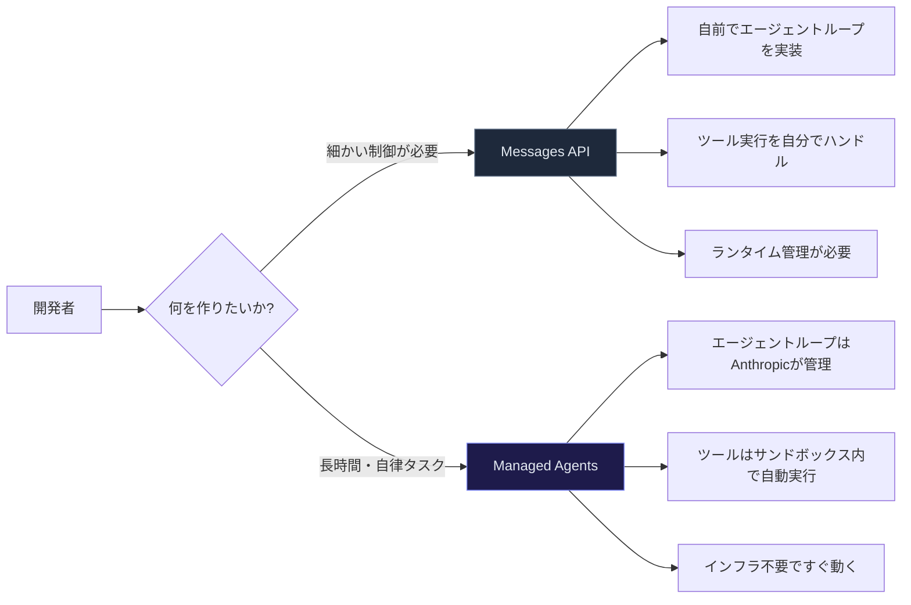

| 比較項目 | Messages API | Claude Managed Agents |
|---|---|---|
| **概要** | モデルへの直接プロンプトアクセス | 事前構成済みエージェントハーネス（マネージドインフラ上で動作） |
| **向いている用途** | カスタムエージェントループ・細粒度制御 | 長時間タスク・非同期ワーク |
| **インフラ** | 自前構築が必要 | Anthropicが管理 |
| **ツール実行** | 開発者がハンドル | サンドボックス内で自動実行 |

---

## 3. 4つのコアコンセプト

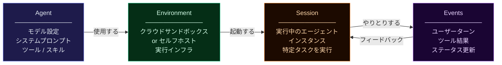

| コンセプト | 説明 | 例 |
|---|---|---|
| **Agent** | モデル・システムプロンプト・ツール・MCPサーバー・スキルの定義体 | `Coding Assistant` |
| **Environment** | エージェントが動くコンテナ設定（クラウドまたはセルフホスト） | `cloud` / `self-hosted` |
| **Session** | 環境内で特定タスクを実行する実行中エージェントインスタンス | 1タスク = 1セッション |
| **Events** | アプリとエージェント間でやりとりするメッセージ群 | ユーザーターン・ツール結果 |

---

## 4. 全体アーキテクチャ

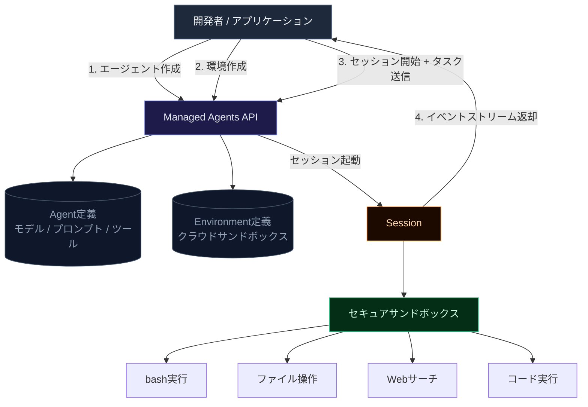

---

## 5. Step-by-Step セットアップガイド

### ステップ 0: 前提条件を確認する

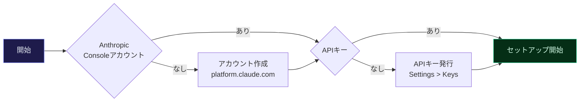

必要なもの:
- Anthropic Console アカウント（`platform.claude.com`）
- APIキー（`Settings > Keys`から発行）

---

### ステップ 1: CLIとSDKをインストールする

**CLI（`ant`コマンド）のインストール:**

```bash
# macOS (Homebrew)
brew install anthropic/tap/ant

# Linux / WSL (curl)
curl -fsSL https://cli.anthropic.com/install.sh | sh

# インストール確認
ant --version
```

**SDKのインストール（Pythonの例）:**

```bash
pip install anthropic
```

**APIキーの設定:**

```bash
export ANTHROPIC_API_KEY="your-api-key-here"
```

> **ベストプラクティス:** APIキーは`.env`ファイルで管理し、`.gitignore`に追加すること。ハードコードは厳禁。

---

### ステップ 2: エージェントを作成する

エージェントは**一度作成してIDを保存**し、複数セッションで使い回します。

```bash
# CLIで作成
ant beta:agents create \
  --name "Coding Assistant" \
  --model '{id: claude-opus-4-7}' \
  --system "You are a helpful coding assistant. Write clean, well-documented code." \
  --tool '{type: agent_toolset_20260401}'
```

**Pythonで作成する場合:**

```python
import anthropic

client = anthropic.Anthropic()

agent = client.beta.agents.create(
    name="Coding Assistant",
    model={"id": "claude-opus-4-7"},
    system="You are a helpful coding assistant. Write clean, well-documented code.",
    tools=[{"type": "agent_toolset_20260401"}],
    betas=["managed-agents-2026-04-01"],
)

print(f"Agent ID: {agent.id}")  # このIDを保存する
```

> **`agent_toolset_20260401`とは?**  
> bash・ファイル操作・Webサーチ・コード実行などのビルトインツールセット全体を有効にするショートカットです。個別ツールを指定することも可能です。

---

### ステップ 3: 環境（Environment）を作成する

```bash
# クラウド環境を作成
ant beta:environments create \
  --name "quickstart-env" \
  --config '{type: cloud, network: {internet_access: true}}'
```

```python
# Pythonで作成
env = client.beta.environments.create(
    name="quickstart-env",
    config={
        "type": "cloud",
        "network": {"internet_access": True}
    },
    betas=["managed-agents-2026-04-01"],
)
print(f"Environment ID: {env.id}")
```

**環境タイプの選び方:**

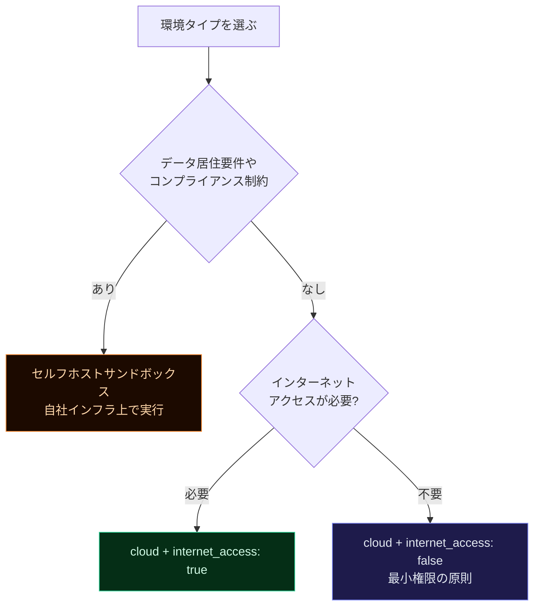

---

### ステップ 4: セッションを開始してタスクを送信する

```python
import anthropic

client = anthropic.Anthropic()

AGENT_ID = "agent_xxxxxxxxxxxxxxxx"   # ステップ2で取得
ENV_ID   = "env_xxxxxxxxxxxxxxxx"     # ステップ3で取得

# セッション作成 + タスク送信（ストリーミング）
with client.beta.sessions.stream(
    agent_id=AGENT_ID,
    environment_id=ENV_ID,
    user_event={
        "type": "user",
        "content": "フィボナッチ数列の最初の20個をfibonacci.txtに書き出してください"
    },
    betas=["managed-agents-2026-04-01"],
) as stream:
    for event in stream:
        print(event)
```

---

### ステップ 5: イベントを受信して処理する

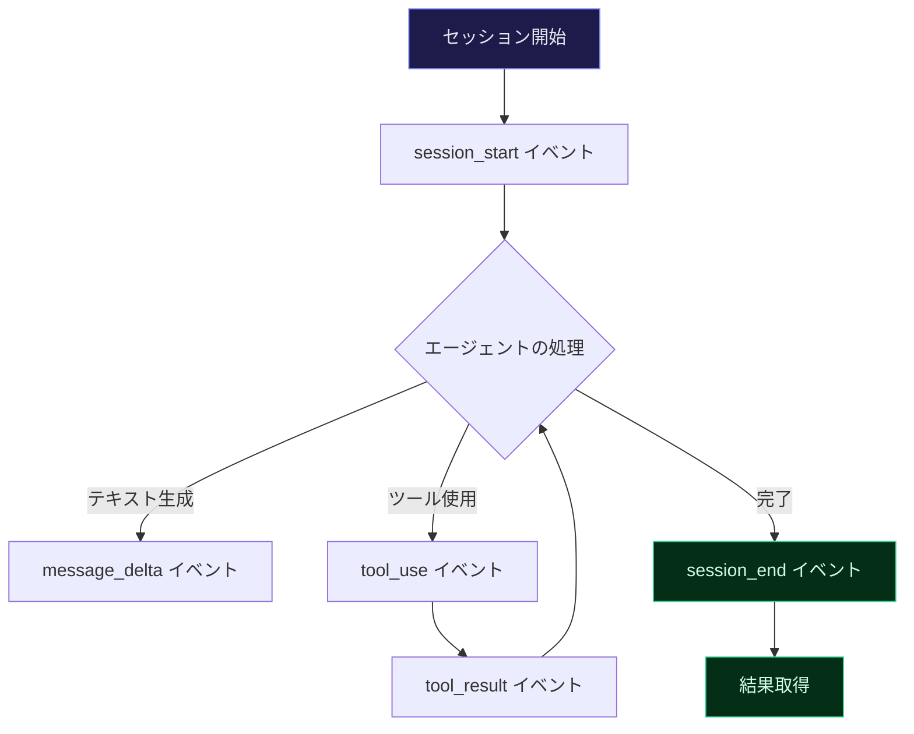

---

## 6. 組み込みツール一覧

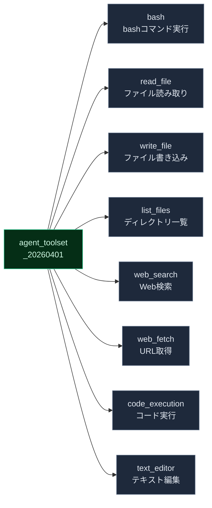

`agent_toolset_20260401`を指定すると以下のツールが**デフォルトで全て有効**になります。

| ツール名 | 説明 | 注意点 |
|---|---|---|
| `bash` | bashコマンドをシェルで実行 | 本番では権限ポリシーを必ず設定 |
| `read_file` | ファイルコンテンツ読み取り | バイナリも対応 |
| `write_file` | ファイル書き込み | 上書き注意 |
| `list_files` | ディレクトリ内のファイル一覧 | |
| `web_search` | Web検索 | `internet_access: true`が必要 |
| `web_fetch` | 指定URLのコンテンツ取得 | `internet_access: true`が必要 |
| `code_execution` | コードをサンドボックスで実行 | |
| `text_editor` | テキストファイルの精密編集 | diff形式で変更を管理 |

> **ベストプラクティス:** 最小権限の原則に従い、タスクに不要なツールは無効化する。`default_config.permission_policy`で制御可能。

---

## 7. 環境設定のベストプラクティス

### 権限ポリシーの設定

```python
# ツールの権限を細かく制御する例
agent = client.beta.agents.create(
    name="Safe Agent",
    model={"id": "claude-opus-4-7"},
    system="...",
    tools=[{
        "type": "agent_toolset_20260401",
        "default_config": {
            "permission_policy": {
                "type": "always_allow"  # or "always_deny", "ask_human"
            }
        }
    }],
    betas=["managed-agents-2026-04-01"],
)
```

### 権限ポリシーの選び方

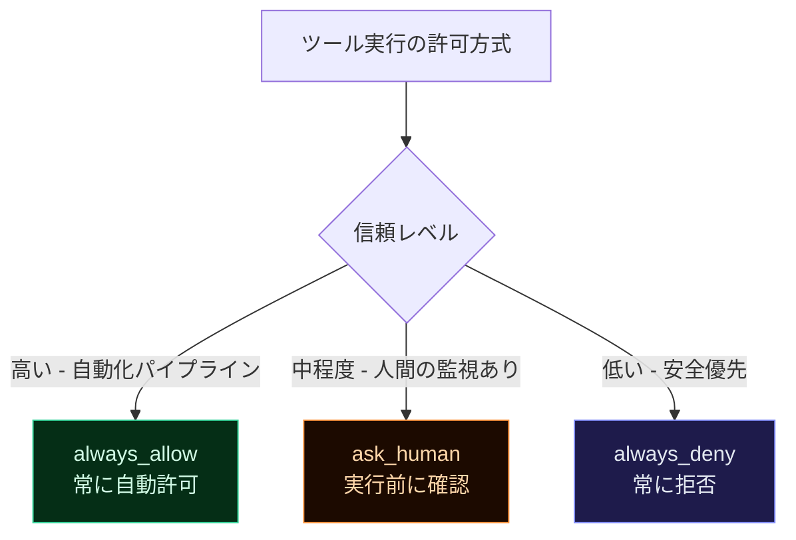

---

## 8. セッション管理とイベントストリーム

### ミッドセッション介入（Mid-session interruption）

タスク実行中にエージェントの方向を変えることができます。

```python
# 追加のユーザーイベントを送信して方向を変える
session.send_event({
    "type": "user",
    "content": "計画を変更してください。テストも追加で書いてください"
})
```

### Webhookでの非同期処理

長時間タスクはWebhookで結果を受け取るのがベストプラクティスです。

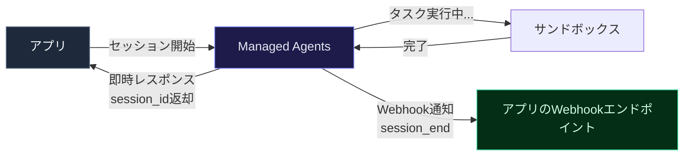

```python
# Webhook付きセッション作成
session = client.beta.sessions.create(
    agent_id=AGENT_ID,
    environment_id=ENV_ID,
    webhook={"url": "https://your-app.example.com/webhook/session"},
    betas=["managed-agents-2026-04-01"],
)
```

---

## 9. マルチエージェント設計パターン

複数のエージェントが協調して複雑なタスクをこなせます。全エージェントは**同じサンドボックスとファイルシステムを共有**しますが、**それぞれ独立したコンテキスト（会話履歴）**を持ちます。

### パターン1: 並列化（Parallelization）

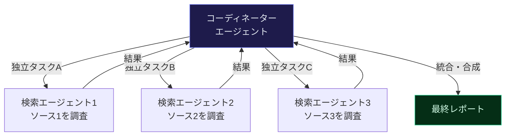

### パターン2: 専門化（Specialization）

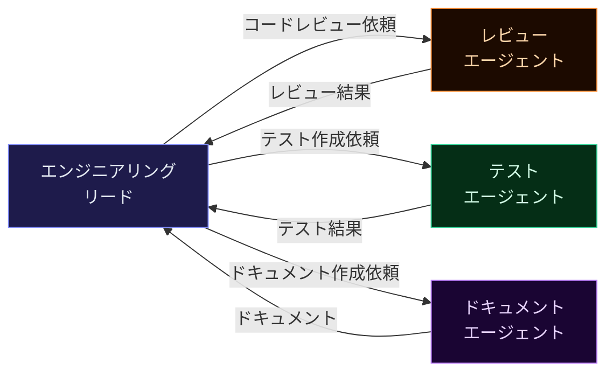

### マルチエージェントの設定コード

```python
# コーディネーターエージェントの作成
coordinator = client.beta.agents.create(
    name="Engineering Lead",
    model={"id": "claude-opus-4-7"},
    system="You coordinate engineering work. Delegate to specialist agents.",
    tools=[{"type": "agent_toolset_20260401"}],
    multiagent={
        "type": "coordinator",
        "agents": [
            {"type": "agent", "id": REVIEWER_AGENT_ID},
            {"type": "agent", "id": TEST_WRITER_AGENT_ID},
        ]
    },
    betas=["managed-agents-2026-04-01"],
)
```

**マルチエージェントの制約:**

| 制約 | 内容 |
|---|---|
| 深さ制限 | コーディネーターからサブエージェントへの委譲は1階層のみ |
| エージェント上限 | `multiagent.agents`に指定できるユニークエージェントは最大20個 |
| スキル上限 | セッション全体で最大20スキル（全エージェント合算） |
| コンテキスト | 各エージェントは独立したコンテキストを持つ（共有しない） |

---

## 10. Agent Skills の活用

Agent Skillsは、Claudeの機能を拡張する**モジュール型の追加能力**です。

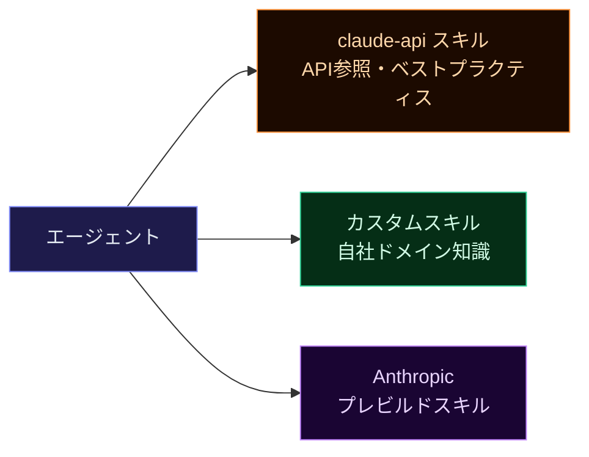

### スキルのアタッチ

```python
agent = client.beta.agents.create(
    name="API Builder",
    model={"id": "claude-opus-4-7"},
    system="You help developers build applications.",
    tools=[{"type": "agent_toolset_20260401"}],
    skills=[
        {
            "type": "skill_version",
            "skill_version_id": "SKILL_VERSION_ID"
        }
    ],
    betas=["managed-agents-2026-04-01"],
)
```

### カスタムスキルの作成

スキルはMarkdown + YAMLフロントマターで定義します。

```markdown
---
name: financial-analyzer
description: >
  財務データを分析するスキル。
  売上・コスト・利益率の計算と可視化を行う。
  財務レポートの作成時に使用する。
---

# Financial Analyzer

## Instructions

1. まずデータのフォーマットを確認する
2. 欠損値を処理する
3. 主要指標（売上・利益率・前年比）を計算する
4. 結果をレポートとして整形する

## Examples

- "Q3の売上データを分析して" → データ読み込み → 指標計算 → レポート出力
```

---

## 11. よくあるミスと対策

| よくあるミス | 問題 | 正しい対処法 |
|---|---|---|
| ベータヘッダーを忘れる | `managed-agents-2026-04-01`を付け忘れてAPIエラー | SDK使用時は自動付与される。curl使用時はヘッダーを明示的に追加する |
| Agent IDを保存しない | 毎回エージェントを作成してコストと時間を無駄にする | IDを環境変数やDBに保存する。エージェントは一度作れば使い回せる |
| 全ツールを常に有効にする | 不要なツールがセキュリティリスクになる | 最小権限の原則を適用し、タスクに必要なツールのみを有効化する |
| 長時間タスクを同期で待つ | 接続タイムアウトで失敗する | Webhookを使った非同期処理に切り替える |
| システムプロンプトが曖昧 | エージェントが意図と異なる動作をする | 役割・制約・出力形式を具体的に明記する |
| 環境タイプを深く考えずに選ぶ | コンプライアンス違反やデータ漏洩リスク | データ居住要件がある場合はセルフホストを選ぶ |

### セットアップチェックリスト

```markdown
## 初回セットアップ
- [ ] Anthropic Consoleアカウントを作成した
- [ ] APIキーを発行し、環境変数に設定した
- [ ] `ant` CLIをインストールし、バージョン確認した
- [ ] SDKをインストールした（pip / npm）

## エージェント作成時
- [ ] モデルIDを明示的に指定した
- [ ] システムプロンプトでエージェントの役割を明確に定義した
- [ ] 必要なツールのみを有効化した
- [ ] agent.idを安全な場所に保存した

## 環境設定時
- [ ] クラウド vs セルフホストを要件に基づいて選んだ
- [ ] インターネットアクセスの必要性を確認した
- [ ] environment.idを保存した

## 本番運用前
- [ ] 権限ポリシーを適切に設定した
- [ ] Webhookエンドポイントを設定した（長時間タスク）
- [ ] エラーハンドリングを実装した
- [ ] コスト管理のためのレート制限を設定した
```

---

## 12. 参考ソース

公式ドキュメントを参照することを強く推奨します。本ガイドの内容は以下のソースに基づいています。

| ドキュメント | URL |
|---|---|
| Managed Agents 概要 | https://platform.claude.com/docs/en/managed-agents/overview |
| クイックスタート | https://platform.claude.com/docs/en/managed-agents/quickstart |
| エージェント設定 | https://platform.claude.com/docs/en/managed-agents/agent-setup |
| ツール一覧 | https://platform.claude.com/docs/en/managed-agents/tools |
| 環境設定 | https://platform.claude.com/docs/en/managed-agents/environments |
| セッション管理 | https://platform.claude.com/docs/en/managed-agents/sessions |
| イベントストリーム | https://platform.claude.com/docs/en/managed-agents/events-and-streaming |
| Webhooks | https://platform.claude.com/docs/en/managed-agents/webhooks |
| マルチエージェント | https://platform.claude.com/docs/en/managed-agents/multi-agent |
| Agent Skills 概要 | https://platform.claude.com/docs/en/agents-and-tools/agent-skills/overview |
| Agent Skills ベストプラクティス | https://platform.claude.com/docs/en/agents-and-tools/agent-skills/best-practices |
| 権限ポリシー | https://platform.claude.com/docs/en/managed-agents/permission-policies |
| Anthropic Engineering Blog | https://www.anthropic.com/engineering/managed-agents |
| claude-api スキル | https://platform.claude.com/docs/en/agents-and-tools/agent-skills/claude-api-skill |

---

> **インタラクティブなチュートリアルを試したい場合:**  
> Claude Codeで以下を実行すると、対話形式でManaged Agentsのセットアップをガイドしてもらえます。
>
> ```
> /claude-api managed-agents-onboard
> ```
