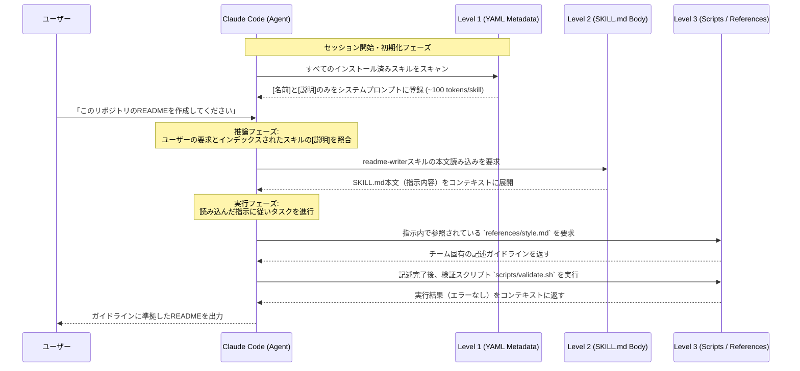

# *最終更新: 2026年3月 | Claude Code v2.1.76 対応*

## **1. ソフトウェア開発におけるエージェント指向パラダイムとClaude Codeの台頭**

現代のソフトウェアエンジニアリングにおいて、AI支援ツールは単なる「次行のコード補完（Autocompletion）」を行うパッシブな存在から、リポジトリ全体の文脈を理解し、自律的にタスクを完遂する「エージェント（Agent）」へと劇的な進化を遂げている。このパラダイムシフトの最前線に位置するツールがClaude Codeである。ターミナルや統合開発環境（IDE）、さらにはデスクトップアプリやブラウザから直接アクセス可能なこのツールは、コードベースの読み込み、ファイルの編集、テストの実行、ツールの統合を自律的に行う能力を備えている 。

Claude Codeの真価を最大限に引き出すためには、システムを構成する中核的な概念とその役割分担を正確に理解することが不可欠である。初学者がClaude Codeを導入した際、多岐にわたる設定ファイルや用語に圧倒されるケースが散見されるが、本質的にはプロジェクトのコンテキストを管理する仕組みと、エージェントに特定の振る舞いを教える仕組みの組み合わせによって成り立っている 。

プロジェクトの根幹となるドキュメントは`CLAUDE.md`である。これはプロジェクト固有の記憶領域として機能し、アーキテクチャの概要、コーディング規約、ディレクトリ構造、頻繁に使用されるビルドコマンドなどをエージェントに提供する 。一方で、エージェントに対して「特定のタスクをどのように実行すべきか」という動的な手続きや専門知識を教え込むための仕組みが「Agent Skills（エージェント・スキル）」であり、その中核を担うのが`SKILL.md`ファイルである 。

過去のバージョンにおいて個別に存在していたカスタムのスラッシュコマンド（`/commands`）は、現在すべてこのスキル機能に統合されている。これにより、ユーザーが手動で`/skill-name`のように明示的に呼び出す（Explicit invocation）運用と、Claudeが会話の文脈からユーザーの意図を汲み取り、必要なスキルを自動的に推論して呼び出す（Implicit invocation）運用の両方がシームレスに実現されるようになった 。本レポートでは、この`SKILL.md`の根底にある設計思想から、具体的な作成手順、高度な引数処理、デバッグ手法、そして組織規模での展開に至るまで、初学者にも理解しやすいようステップバイステップで網羅的に詳解する。

## **2. トークン経済と「プログレッシブ・ディスクロージャー」アーキテクチャ**

`SKILL.md`の具体的な記述方法を学ぶ前に、なぜAnthropic社が単一の巨大なプロンプトではなく、ディレクトリとファイル群による階層的な構造を採用したのか、その根底にあるシステムアーキテクチャを理解することが極めて重要である。

大規模言語モデル（LLM）の推論能力は、コンテキストウィンドウ（一度に処理できる情報の量）に大きく依存している。しかし、コンテキストエンジニアリングの観点から見ると、情報を無秩序に詰め込むことは「アテンション・バジェット（注意力の予算）」の枯渇を招き、結果としてモデルの推論精度を著しく低下させる 。不要な情報がノイズとなり、会話の進行とともに文脈が劣化（Degradation of conversational state）していく現象を防ぐため、Agent Skillsは「プログレッシブ・ディスクロージャー（段階的開示）」という高度な情報管理アーキテクチャを採用している 。

このプログレッシブ・ディスクロージャーは、情報を必要とされるタイミングでのみ段階的にコンテキストにロードする仕組みであり、システムリソースの最適化と推論精度の向上を両立させる。このメカニズムは以下の3つのレベルで構成されている 。

| **読み込みレベル** | **構成要素とトークン消費量** | **システム上の挙動と役割** |
| --- | --- | --- |
| **Level 1: メタデータ（常時読み込み）** | `SKILL.md`上部のYAMLフロントマター（名前と説明文）。1スキルあたり約100トークン。 | Claude Codeの起動時、インストールされているすべてのスキルの基本情報のみがシステムプロンプトにインデックスされる。これにより、数百のスキルを導入してもアイドリング時のコンテキストペナルティが実質ゼロとなる。 |
| **Level 2: インストラクション（トリガー時読み込み）** | `SKILL.md`のマークダウン本文。公式推奨で500行（約5000トークン）未満。 | ユーザーの要求とLevel 1の「説明文」が合致し、エージェントがそのスキルを使用すると決定した瞬間に、Bashコマンド経由で本文全体がコンテキストに読み込まれる。 |
| **Level 3: 参照ファイルとスクリプト（オンデマンド読み込み）** | 外部ドキュメント（`references/`）や実行可能スクリプト（`scripts/`）。トークン上限は実質無制限。 | インストラクション内で指定された外部ファイルやスクリプトは、エージェントが必要と判断したタイミングでのみ読み込まれる。スクリプトの場合はコードそのものではなく、実行された出力結果のみがコンテキストに返される。 |

以下のMermaid図は、実際のユーザーリクエストに対して、この3層アーキテクチャがどのように機能し、トークン消費を最小限に抑えながら専門的なタスクを完遂するかを視覚化したシーケンス図である。



このアーキテクチャの最大の利点は、スケーラビリティの確保である。プロジェクトの成長に伴い、ドキュメント生成、UI最適化、データ分析といった多様な専門知識をスキルとして追加し続けても、それがトリガーされない限りメインの会話コンテキストを圧迫することはない 。

## **3. ステップバイステップ：初めてのSKILL.mdを構築する**

アーキテクチャの理論的背景を理解した上で、実際にゼロからスキルを構築するプロセスを解説する。スキルは単一のテキストファイルとして存在するのではなく、複数のリソースを内包可能な「ディレクトリ」として管理される点が特徴である 。

スキルの保存場所には、その適用範囲（スコープ）に応じていくつかの選択肢が用意されている。開発者のローカル環境全体で横断的に使用できる個人用スキル、特定のプロジェクトリポジトリ内に限定され、チームメンバーとGit経由で共有されるプロジェクト用スキル、そして特定のプラグインが有効化されている環境下でのみ動作するプラグイン用スキルが存在する 。初学者が学習を進めるにあたっては、まず個人用のスキルディレクトリを作成することが推奨される。

| **スコープ (適用範囲)** | **ディレクトリパス** | **推奨されるユースケース** |
| --- | --- | --- |
| **Personal (個人)** | `~/.claude/skills/<skill-name>/` | 開発者個人の好みに合わせたコード解説、汎用的なリファクタリング、個人的な自動化タスク。すべてのプロジェクトで利用可能。 |
| **Project (プロジェクト)** | `.claude/skills/<skill-name>/` | チーム共有のデプロイ手順、プロジェクト固有のアーキテクチャレビュー基準、社内APIの利用ガイドライン。 |
| **Plugin (プラグイン)** | `<plugin>/skills/<skill-name>/` | サードパーティ製のツールチェーンや特定の拡張機能に依存する高度なワークフロー。 |

例として、複雑なコードの動作を視覚的な図解と比喩を用いて解説するスキルを構築する。ターミナル環境において、個人用のスキルディレクトリを生成する 。

```bash
mkdir -p ~/.claude/skills/explain-code
```

ディレクトリを作成した後、その直下に中核となる`SKILL.md`ファイルを配置する。このファイルは、YAMLフロントマターと呼ばれるメタデータ領域と、マークダウン本文によるインストラクション領域の二つに厳密に分かれている 。

ファイルの最上部に記述されるYAMLフロントマターは、前述の「Level 1」としてシステムプロンプトに常時読み込まれる極めて重要な領域である。ここには最低限、スキルの`name`（名前）と`description`（説明文）を定義しなければならない 。

```yaml
---
name: explain-code
description: コードの動作を視覚的な図解（Mermaid）と適切な比喩を用いて解説する。ユーザーが「このコードはどう動くか？」と尋ねた場合や、複雑なアルゴリズムの解説を求めた場合に自動的に使用する。
---
```

このメタデータには厳格な制約が存在する。`name`フィールドは最大64文字の制限があり、小文字のアルファベット、数字、およびハイフンのみで構成されなければならない。また、XMLタグや「anthropic」「claude」といったシステム予約語の使用は禁止されている。命名規則としては、「PDFの処理」を示す`processing-pdfs`のように、動名詞（gerund forms）を用いた一貫したパターンが公式に推奨されている 。

さらに重要なのが`description`フィールドである。このフィールドは最大1024文字の制限があり、XMLタグを含めることはできない。記述の際は必ず「Excelファイルを処理する」といった三人称視点で記述し、システムプロンプト内での語りの一貫性を維持する必要がある 。この説明文は、エージェントが数百のスキルの中から「いつ、どのスキルを起動すべきか」を判断する唯一の手がかりとなるため、スキルが実行する内容だけでなく、それを起動すべき具体的なトリガー条件（ユーザーの発話キーワードなど）を詳細に含めることが成功の鍵となる 。

特定のユースケースにおいては、自動発動を制御したり、権限を制限したりするための高度なフィールドをYAMLフロントマターに追加することも可能である。例えば、本番環境へのデプロイメントのように、ユーザーが明示的にコマンドを入力した時のみ実行させたい破壊的なスキルには、`disable-model-invocation: true`を付与することで、意図しない自動トリガーを完全に防ぐことができる 。また、`allowed-tools`フィールドを使用することで、スキル実行中にエージェントがアクセスできるツールセットを制限し、ファイルの読み取りのみを許可するセーフモード（`allowed-tools: Read, Grep, Glob`）を構築することも可能である 。さらに、`dependencies`フィールドを用いて、スキルの実行に不可欠なソフトウェアパッケージ（例：`python>=3.8`）を明示することもサポートされている 。

YAMLフロントマターの直下には、エージェントに対する具体的な指示を記述したマークダウン本文を配置する。これが「Level 2」として機能するインストラクション領域である 。

## **コード解説プロトコル**

## **指示 (Instructions)**

提供されたコード、または指定されたファイル内のコードについて、以下のステップに従って厳密に解説を生成すること。

1. **全体像の要約:** コードの目的と主要な機能を1〜2行で簡潔に要約する。
2. **比喩を用いた概念化:** 技術的なバックグラウンドが浅い読者でも直感的に理解できるよう、日常的な事象に例えた比喩（アナロジー）を1つ提示する。
3. **図解の生成:** コードの制御フローやデータの流れを可視化するMermaid図（フローチャートまたはシーケンス図）を作成する。
4. **ステップバイステップの解析:** 主要な関数やループ処理について、行番号や変数名を参照しながら詳細に解説する。

## **重要なルール (Critical Rules)**

- 専門用語を使用する場合は、初出時に必ず簡単な定義を添えること。
- Mermaid図の構文エラーがないか、出力前に必ず自己検証プロセスを実行すること。

## **例 (Examples)**

**入力:** `def fibonacci(n):...`

**出力のトーン:** 「フィボナッチ数列を生成するこの関数は、例えるなら『前の2人の身長を足して、次の人の身長を決める整列ゲーム』のようなものです...」

インストラクションを記述する上で、最も重要なベストプラクティスは「自由度（Degrees of Freedom）」の適切な制御である。タスクの脆さ（脆弱性）に応じて、エージェントに与える裁量の幅を調整しなければならない 。テキストの要約やコードレビューのように、複数のアプローチが許容されるタスクにおいては、高レベルなテキストベースのガイドラインを与え、エージェントの推論能力を最大限に活用する（High Freedom）。一方、定型的なレポート生成など、好ましいフォーマットが存在するタスクでは、具体的なテンプレートやパラメータ化された擬似コードを提供する（Medium Freedom）。そして、データベースのマイグレーションのように、わずかなミスが致命的な結果を招くタスクにおいては、判断の余地を与えず、厳密な実行スクリプトと検証ガードレールのみを提供する（Low Freedom）アプローチが求められる 。

また、情報量の管理も極めて重要である。`SKILL.md`の本文は、トークン消費を抑え、エージェントの処理負荷を軽減するために500行未満に収めることが公式ドキュメントで強く推奨されている 。もしスキルが詳細なAPI仕様書、長大な参照テーブル、あるいは膨大なユースケース例を必要とする場合は、それらを`SKILL.md`内にすべて記述するのではなく、同ディレクトリ内に専用のサブディレクトリ（例：`references/api-spec.md`）を作成してそこに切り出すべきである。そして、`SKILL.md`からは「詳細なAPI仕様については `references/api-spec.md` を参照せよ」とだけ指示する。これにより、エージェントは必要な時にのみBashコマンドを経由して当該ファイルを読み込み、無駄なコンテキストの肥大化を防ぐことができる 。ただし、このファイル参照は必ず「1階層（One level deep）」にとどめる必要がある。深くネストされた参照構造（`SKILL.md`がAを参照し、AがBを参照するような構造）は、エージェントがプレビュー読み込みを行った際に情報が不完全になるリスクを伴うため、避けるべきである。100行を超えるような長大な参照ファイルを作成する場合は、ファイルの冒頭に目次（Table of Contents）を設置することで、エージェントがファイル全体のスコープを正確に把握できるよう支援することがベストプラクティスとされている 。

## **4. 動的コンテキストと高度な引数処理メカニズム**

Agent Skillsは、静的なドキュメントを生成するだけの一方通行の仕組みではない。ユーザーから動的な入力値を受け取ったり、実行前にシステムの最新状態をシェルスクリプトを通じて取得したりする高度な処理メカニズムを備えている。この機能により、スキルは環境の変化に適応し、より複雑な実務要件に応えることが可能となる。

ユーザーがターミナル上で `/explain-code src/main.py` のようにスキルを明示的に呼び出した際、`src/main.py` という文字列は引数としてスキル内部に渡される。この引数を捕捉し、インストラクション内で動的に展開するためのプレースホルダーとして、`$ARGUMENTS`変数が提供されている。この変数は、スキル呼び出し時に渡されたすべての引数を一つの文字列として包含する 。

さらに、シェルスクリプトのプログラミングモデルと同様に、複数の引数を個別に処理するための位置パラメータ（Positional parameters）もサポートされている。`$1`, `$2`, `$3` といった記法、あるいはより明示的な `$ARGUMENTS` といった配列形式の記法を用いることで、特定の引数のみを抽出して指示に組み込むことが可能である 。

この引数処理以上に強力な機能が、感嘆符とバッククォート（`! \`command``）を組み合わせた動的コンテキストの事前注入構文である。通常のスキル実行プロセスでは、エージェントが本文を読み込んだ後に、必要に応じてツールを用いてシステムの状態を調査する。しかし、このバッククォート構文を使用すると、エージェントが`SKILL.md`の内容を認識する「前」のプリプロセッシング段階で指定されたシェルコマンドが即座に実行され、その出力結果がテキストとして`SKILL.md`内に直接レンダリングされる 。

## **実行コンテキストの動的取得**

以下の情報は、このスキルが呼び出された瞬間の実際のシステムリソースとGitの状態である。エージェントは自らコマンドを実行して調査するのではなく、以下の確定したデータに基づいて分析を開始すること。

現在のオペレーティングシステム情報:
! `uname -a`

最新のコミットログ:
! `git log -1 --oneline`

解析対象のファイル: $1

このメカニズムは、エージェントに対する「コマンドを実行して調べてください」という指示と、それに伴う推論ステップ、およびツール呼び出しのレイテンシを完全に排除する。実際のPull Requestのデータ、システムの稼働ログ、現在のタイムスタンプなど、分析の前提となる生データを最初から確定した状態でプロンプトに注入できるため、実行速度と精度の両面において劇的な向上をもたらす 。

## **5. 自動生成とコンテキストの分離：Subagentsとの境界線**

`SKILL.md`を手動で綿密に設計・構築する手法を解説してきたが、Claude Codeのエコシステムには、このスキル作成プロセス自体を自動化する強力な組み込みツールや、スキルの実行環境を高度に分離するためのメカニズムが存在する。

Anthropicは、スキルを生成するためのメタスキルである `/skill-creator` を組み込みツールとして提供している 。開発者がゼロからYAMLの構文やMarkdownの構造を記述する代わりに、Claude Code上で自然言語によるプロンプトを投げるだけで、高品質なスキルの雛形を対話的に生成できる。例えば、「`/skill-creator` を使用して、プロジェクトのUIデザインを最適化し、修正後にブラウザでレンダリング結果を検証するワークフローを自動化するスキルを作成してほしい」と要求することで、このツールは公式のベストプラクティス（500行未満の制限、プログレッシブ・ディスクロージャーの適用、三人称視点での`description`記述など）を自動的に遵守したディレクトリ構造とファイル群を出力する 。このメタスキルは、開発者が自身の暗黙知を迅速に形式知化し、エージェントの挙動として定着させるための強力な触媒となる。

スキルが複雑化し、実行に伴うログや推論の過程が膨大になると、メインの会話コンテキスト（履歴）がノイズで汚染されるという問題が生じる。これを防ぐための仕組みとして、YAMLフロントマターにおける `context: fork` ディレクティブと、全く別のアプローチであるSubagents機能が提供されている。両者は「メインのコンテキストを保護しつつ高度なタスクを実行する」という目的は共通しているものの、その用途と根底にあるアーキテクチャは明確に異なる 。

| 比較項目 | `context: fork` を用いたスキル機能 | カスタムSubagents (`.claude/agents/*.md`) |
| --- | --- | --- |
| **設計思想と主な用途** | 既存の会話の流れを維持したまま、明確に定義された特定の手順（ワークフロー）を、一時的に分離された環境で安全に実行させたい場合に用いる。 | 独立して並行稼働させる、自律性の高いワークフローをゼロから定義し、オーケストレーションしたい場合に用いる。 |
| **タスク定義と実行プロセス** | `SKILL.md`の内容そのものが、変更されることなく「実行すべきタスクの指示書」として直接扱われる。 | メインのClaudeエージェントが、Subagentのシステムプロンプトに基づいて「委譲メッセージ（Delegation message）」をその都度動的に生成し、タスクを依頼する。 |
| **コンテキストの引き継ぎ** | 親（メイン）の会話コンテキストをスナップショットとしてそのまま引き継いで実行を開始する。 | 完全にクリーンな初期状態から開始される。必要な情報はすべて委譲メッセージに含める必要がある。 |
| **予測可能性とデバッグの容易性** | 高い。入力内容と指示が固定されているため、エラー発生時の原因究明が容易である。 | 低い。状況に応じて委譲メッセージの内容が変化するため、挙動に揺らぎが出やすく、デバッグが困難になる傾向がある。 |
| **柔軟性と自律性** | 低い。指示された手順を愚直に実行するバッチ処理的な性質が強い。 | 高い。与えられたコンテキストとツール群を用いて、自律的に判断し実行経路を動的に構築する。 |

`context: fork` を使用する場合、YAMLフロントマターに以下のような記述を追加する。

```yaml
---
name: security-audit
description: プロジェクト全体のセキュリティ監査をバックグラウンドで実行する
context: fork
agent: Explore
---
```

この設定が施された `/security-audit` スキルをユーザーが実行した際、Claudeは現在の会話状態をスナップショットとして保持したまま、指定されたタイプ（この場合はコードベースの探索に特化したExploreエージェント）の分離された新しいコンテキストを生成し、そこで監査タスクを完遂させる。タスクが終了すると、膨大な調査プロセスや途中経過の推論ログは破棄され、最終的な監査結果のみがクリーンな状態でメインの会話コンテキストに返却される。これにより、ユーザーは認知負荷を高めることなく、高度な分析結果のみをシームレスに受け取ることができるのである 。

## **6. スキルのテスト、デバッグ、および反復的なチューニング手法**

構築されたスキルが初期の段階から完璧に動作することは稀である。スキルはコードのように静的なものではなく、実際のユースケースやエージェントの推論の揺らぎに適応させるために、継続的に進化させるべき「生きているドキュメント（Living documents）」として捉える必要がある。期待通りに動作しない場合、その原因は大きく分けて「トリガーフェーズの不具合」と「実行フェーズの不具合」の二つに分類され、それぞれに対するアプローチが異なる 。

### **トリガーフェーズの不具合と最適化**

ClaudeはYAMLフロントマターの `description` のみを評価基準としてスキルを自動発動させるため、この説明文のチューニングが極めて重要である。公式ドキュメントでは、エージェントは総じてスキルを起動したがらない傾向にあるため、トリガー条件を「やや強引（pushy）」に記述することが推奨されている 。

トリガーの不具合は、以下の二つの相反する症状として現れる。

1. **アンダートリガー（Undertriggering：発動すべき状況での不発）**
    - **症状:** 本来スキルによって処理されるべき要求に対して、エージェントが通常の推論と基本的なツールのみで対処しようとし、結果としてタスクに失敗する。ユーザーは仕方なく手動で `/skill-name` を入力して強制実行しなければならない。
    - **根本原因:** 説明文が曖昧であるか、ユーザーの発話に含まれるキーワードとの語彙的な乖離が存在する。
    - **解決策:** `description` に対して、より詳細なニュアンスや、タスクに関連する技術的な専門用語、ユーザーが自然言語で入力しそうな同義語をキーワードとして追加する 。単に「デプロイメントのチェックリストを生成する」と記述するのではなく、「デプロイメントのチェックリストを生成する。ユーザーが『デプロイ』『ローンチ』『本番環境へ反映』『リリースの準備ができたか』などに言及した場合、明確にチェックリストを要求されていなくても、必ずこのスキルを自動的に使用して検証プロセスを開始すること」と、具体的な発動条件を明記することで劇的に改善される 。
2. **オーバートリガー（Overtriggering：無関係な文脈での誤発動）**
    - **症状:** 全く関係のない質問やタスクに対して意図せずスキルが読み込まれてしまい、会話の文脈が破壊される。ユーザーが煩わしさを感じてスキル自体を無効化してしまう原因となる。
    - **根本原因:** 説明文が広範すぎる、あるいは一般的すぎる単語が含まれている。
    - **解決策:** トリガー条件をより厳密に絞り込むとともに、「〜の機能に関する一般的な質問の場合は使用しないこと」といったネガティブトリガー（否定的な制約条件）を追加し、エージェントの誤認を防ぐ 。

### **実行フェーズの不具合と高度なCLIデバッグ**

スキルが適切にトリガーされたにも関わらず、出力結果が不安定であったり、内部で呼び出されるAPIがエラーを吐いたりする場合は、マークダウン本文のインストラクション自体に欠陥がある。このような実行フェーズの問題を解決するためには、インストラクション内にエラーハンドリングのロジックや、フィードバックループ（実行 → エラーの検証 → 再修正のプロセス）を明示的に組み込むことが有効である 。

さらに、システムレベルで何が起きているかを調査するために、Claude Codeのコマンドライン・インターフェース（CLI）には強力なデバッグフラグ群が用意されている 。これらのフラグを駆使することで、エージェントのブラックボックス化された推論過程を可視化できる。

| **CLIフラグ / コマンド** | **詳細な挙動とシステム上の説明** | **主なデバッグのユースケース** |
| --- | --- | --- |
| `claude --debug` | システム全体のデバッグモードを有効化する。エージェントがバックグラウンドでどのスキルを評価し、どのツールを呼び出し、どのようなプロンプトを構築しているかの詳細な生ログをターミナルにストリーミング出力する。 | スキルがトリガーされない原因や、スクリプト実行時に発生している隠れたエラーコードの特定。 |
| `claude --debug "api,hooks"` | 出力されるデバッグログを特定のカテゴリ（この場合はAPI通信とフック処理）のみにフィルタリングして表示する。`!statsig` のように感嘆符を用いて特定のログを除外することも可能である。 | ネットワーク起因のエラーや、スキル実行前後の動的コンテキスト注入（`!` バッククォート構文など）の挙動調査。 |
| `claude --disable-slash-commands` | 現在のセッションにおいて、すべてのスキルとスラッシュコマンドを強制的に無効化する。 | 導入した特定のスキルが過剰に干渉し、ピュアなLLMとしての対話や基本的なコード解析が妨げられている場合の一時的な回避策および切り分け。 |
| `claude --disallowedTools` | 指定したツールをモデルのコンテキストから完全に削除し、使用不能な状態にする。 | テスト環境において、特定の破壊的コマンド（例：`Bash(git push *)` や `Edit`）をエージェントに絶対に実行させないようにするための強力なセーフティネットの構築。 |

また、公式のCLI機能に加えて、活発なオープンソースコミュニティからも優れたデバッグツールが提供されている。例えば、Go言語で開発されたTUI（テキストユーザーインターフェース）ツールである `claude-esp` を使用すると、メインのターミナルセッションを妨げることなく、エージェントの隠された出力（推論プロセス、ツール呼び出し、サブエージェントの動向）を別のターミナルウィンドウでリアルタイムにストリーミング監視することが可能となる。これは、複雑に絡み合った複数のスキルがどのようにオーケストレーションされているかを理解する上で非常に強力な手段となる 。さらに、AST（抽象構文木）ベースの解析を用いて安全なBashコマンドのみを自動承認し、破壊的な操作の直前でプロンプトを一時停止させる `Dippy` のようなツールも、スキル開発中の安全性を飛躍的に高めるエコシステムの一部として機能している 。

## **7. エンタープライズ展開と組織規模でのプロビジョニング**

個人レベルで構築・洗練された強力なスキルは、チームや組織全体に共有されることでその価値を何倍にも増幅させる。Anthropicが提供するTeamプランおよびEnterpriseプランでは、管理者が検証済みのワークフローや専門的な機能を持つスキルを全社に一括展開（プロビジョニング）するための高度な管理機能が提供されている 。このプロビジョニングプロセスを実行するためには、セキュリティとコンプライアンスの観点から、組織レベルで「コード実行とファイル作成（Code execution and file creation）」機能が明示的に有効化されていることが絶対的な前提条件となる 。組織の管理者は、ネットワークのイグレス（外部通信）設定を細かく制御することが可能であり、完全なオフライン環境、特定のパッケージマネージャ（npm, PyPI等）のみへのアクセス許可、あるいは指定したドメインリストのみを許可するといった厳密なサンドボックス環境上でスキルを稼働させることができる 。

組織へのプロビジョニングは、以下の明確な手順に従って実施される。

1. **スキルのパッケージ化と要件の確認:** 管理者は、完成したスキルのディレクトリ（必須である`SKILL.md`と、関連するスクリプトやリソースファイルを含む）を、ディレクトリ名と完全に一致する名前のZIPファイルとして圧縮する。この際、ZIPアーカイブのルート階層が直接ファイル群ではなく、スキル名のディレクトリ自体であることを確認しなければならない（例：`team-reviewer.zip` を解凍した結果が `team-reviewer/SKILL.md` となる構造） 。
2. **アップロードと展開プロセスの実行:** 管理者権限を持つユーザーが、Claudeのインターフェースから「Organization settings > Skills」へナビゲートし、「Organization skills」セクションから作成したZIPファイルをアップロードする。この操作により、スキルは即座に組織内の全ユーザーの環境にプロビジョニングされる 。
3. **デフォルトステータスの戦略的設定:** プロビジョニングを行う際、管理者はそのスキルを全ユーザーに対して「デフォルトで有効（Enabled by default）」として展開するか、あるいはリストには表示されるが「デフォルトで無効（Disabled by default）」として展開するかを選択できる。チーム全体に適用される標準的なコーディング規約チェッカーや議事録フォーマッターなどはデフォルトで有効にし、一部のインフラエンジニアのみが使用するような専門的かつ破壊的な権限を持つスキルはデフォルトで無効にし、必要なユーザーのみが手動でオン（User Control）にするという運用戦略がベストプラクティスとして推奨されている 。

このプロビジョニング機能により、大規模な開発チームにおいても、ドキュメントの生成フォーマット（ExcelやPowerPoint出力などを含む）の統一、アーキテクチャレビュー基準の標準化、データ分析手法の共有が、個々人の環境設定に依存することなくトップダウンで自動的かつ確実に適用されるようになる 。

## **8. エコシステムと関連リソース・公式URLの統合データ**

Agent Skillsのアーキテクチャは、Anthropic社が提供する単一のツールに閉じ込めたプロプライエタリな技術ではない。これは、Claude Code、Cursor、GitHub Copilot、VS Code、さらにはGoogle Gemini CLI（Antigravity）など、競合する複数の主要なAIコーディングアシスタントやエージェントツール間で相互運用可能な「オープンスタンダード（Open Standard）」として設計・公開されている 。仕様の詳細なプロトコルは `agentskills.io` においてコミュニティ主導で策定・保守されている 。

この互換性とオープンな性質により、世界中の有志の開発者コミュニティや企業が多種多様なスキルを開発し、マーケットプレイスやGitHubを通じて共有する巨大なエコシステムが形成されている。本レポートの構成にあたり、理論的背景から実践的なコマンドまで、すべての情報を裏付けるために参照した公式ドキュメント、リファレンス実装、およびコミュニティリソースのURL群を以下のテーブルに統合して提示する。これらのリソースは、開発者が自身のプロジェクトにスキルを導入し、さらに高度なカスタマイズを行うための不可欠な情報源として機能する。

| 分類 | リソースの名称 | URL |
| --- | --- | --- |
| **公式プロトコルとオープン仕様** | Agent Skills 公式仕様書（コミュニティ） | <https://agentskills.io/home> |
| **公式ドキュメント（Anthropic）** | Claude Code Skills 公式ドキュメント | <https://docs.anthropic.com/en/docs/claude-code/skills> |
| **公式ドキュメント（Anthropic）** | Agent Teams 公式ドキュメント | <https://docs.anthropic.com/en/docs/claude-code/agent-teams> |
| **公式アーキテクチャ・ベストプラクティス** | Agent Skills Overview（Claude API） | <https://platform.claude.com/docs/en/agents-and-tools/agent-skills/overview> |
| **公式アーキテクチャ・ベストプラクティス** | Agent Skills Best Practices | <https://platform.claude.com/docs/en/agents-and-tools/agent-skills/best-practices> |
| **公式アーキテクチャ・ベストプラクティス** | The Complete Guide to Building Skills for Claude（PDF） | <https://resources.anthropic.com/hubfs/The-Complete-Guide-to-Building-Skill-for-Claude.pdf> |
| **公式アーキテクチャ・ベストプラクティス** | The Complete Guide to Building Skills for Claude（Scribd） | <https://www.scribd.com/document/994413493/The-Complete-Guide-to-Building-Skill-for-Claude> |
| **Claude Code 公式マニュアル** | Claude Code Overview | <https://code.claude.com/docs/en/overview> |
| **Claude Code 公式マニュアル** | Features Overview | <https://code.claude.com/docs/en/features-overview> |
| **Claude Code 公式マニュアル** | Skills Documentation | <https://code.claude.com/docs/en/skills> |
| **Claude Code 公式マニュアル** | CLI Reference | <https://code.claude.com/docs/en/cli-reference> |
| **公式サンプル実装とプラグイン** | Anthropics Skills Repository | <https://github.com/anthropics/skills> |
| **公式サンプル実装とプラグイン** | Skills サンプル集 | <https://github.com/anthropics/skills/tree/main/skills> |
| **管理およびプロビジョニング** | How to create custom Skills | <https://support.claude.com/en/articles/12512198-how-to-create-custom-skills> |
| **管理およびプロビジョニング** | Create and edit files with Claude | <https://support.claude.com/en/articles/12111783-create-and-edit-files-with-claude#h_1c99382190> |
| **管理およびプロビジョニング** | Provisioning and managing skills for your organization | <https://support.claude.com/en/articles/13119606-provisioning-and-managing-skills-for-your-organization> |
| **管理およびプロビジョニング** | Claude Customize Skills | <https://claude.ai/customize/skills> |
| **管理およびプロビジョニング** | Use Skills in Claude | <https://support.claude.com/en/articles/12512180-use-skills-in-claude> |
| **コミュニティ・有識者の分析** | awesome-claude-code（GitHub） | <https://github.com/hesreallyhim/awesome-claude-code> |
| **コミュニティ・有識者の分析** | Claude Code Explained（Medium） | <https://avinashselvam.medium.com/claude-code-explained-claude-md-command-skill-md-hooks-subagents-e38e0815b59b> |
| **コミュニティ・有識者の分析** | The SKILL.md Pattern（Medium） | <https://bibek-poudel.medium.com/the-skill-md-pattern-how-to-write-ai-agent-skills-that-actually-work-72a3169dd7ee> |
| **コミュニティ・有識者の分析** | Building Agent Skills with skill-creator（Google Cloud） | <https://medium.com/google-cloud/building-agent-skills-with-skill-creator-855f18e785cf> |
| **コミュニティ・有識者の分析** | How to Write Skills for Claude Code and Cowork | <https://sherlock.xyz/post/how-to-write-skills-for-claude-code-and-cowork> |
| **コミュニティ・有識者の分析** | Skill context:fork vs. Sub-agent skills Field（Zenn） | <https://zenn.dev/trust_delta/articles/claude-code-skills-subagents-approaches?locale=en> |
| **コミュニティ・有識者の分析** | A Mental Model for Claude Code（Medium） | <https://levelup.gitconnected.com/a-mental-model-for-claude-code-skills-subagents-and-plugins-3dea9924bf05> |

実務環境においてこれらのリソースを活用する際、Claude Codeのターミナルから直接 `/plugin marketplace add anthropics/skills` といったコマンドを実行することで、プラグインマーケットプレイスをブラウズし、検証済みのスキルをシームレスにインストールすることが可能である 。

## **9. 結論と未来の展望：自己改善するエージェントへ向けて**

Claude Codeにおける `SKILL.md` の真の価値は、単なる「便利なプロンプトの保存場所」という枠を超え、エージェントの推論能力をプロジェクト固有のドメイン知識へと適応させるための「外部記憶および手続きの拡張モジュール」として機能する点にある。限られたシステムリソース（Attention Budget）を極限まで最適化するプログレッシブ・ディスクロージャーの設計思想のもと、メタデータによる軽量なインデキシング、必要な瞬間にのみ展開されるインストラクション、そしてスクリプトを用いた動的コンテキストのオンデマンド注入という3層構造を巧みに組み合わせることで、スケーラブルかつ高精度な自律型ワークフローが実現されている 。

開発者はこのアーキテクチャを深く理解し、`$ARGUMENTS`変数やバッククォート構文を用いたシステム情報の事前注入を駆使することで、エージェントの推論のブレを抑制し、確実なデータに基づく分析を行わせることができる 。また、会話の履歴を汚染することなくタスクを遂行する `context: fork` のメカニズムを適用することで、認知負荷の低いクリーンな開発体験を維持することが可能である 。

スキルの運用における最先端のアプローチとして、コミュニティでは「自己改善型スキル（Self-Improving Skills）」の概念がすでに実践され始めている 。通常の大規模言語モデルは、セッション間でユーザーからの訂正（例：「このプロジェクトではこの命名規則は使用しない」など）を記憶しないため、ユーザーは同じ指摘を繰り返すという非効率性に直面する。しかし、特定のタスクが完了した後に「リフレクション（反省）スキル」を実行し、直前のセッションのGitログやエラー履歴を分析させ、エージェント自身に自らの `SKILL.md` を書き換えさせてアップデートさせるというループを構築することで、この問題は根本的に解決される 。自然言語による指示の集まりである `SKILL.md` は、プログラムコードの修正と異なり、コンパイルエラーや複雑な依存関係の破壊を気にすることなく、数行の文章を追加するだけで安全かつ容易にエージェントの振る舞いを進化させることができるという、極めて強力な特性を持っている 。

初学者がこのエコシステムに参入する際の最も確実なステップは、自身の日常業務の中から「入力と出力の形式が決まっており、かつ反復的なタスク」を一つ特定し、組み込みツールである `/skill-creator` を用いて最初のスキルを自動生成することである 。その後、実際の業務運用を通じてアンダートリガーやオーバートリガーの挙動を観察し 、エラー処理やガードレールを継続的に書き加えながら反復的にチューニングを行っていく。このプロセスを数回繰り返すだけで、エージェントの振る舞いは手動による作業をはるかに凌駕する高品質な自動化ワークフローへと変貌を遂げるであろう 。Agent Skillsという相互運用可能なオープンスタンダードの普及は、ソフトウェアエンジニアリングにおける「AIへの指示」のあり方を根本から再定義し、今後の開発エコシステムにおける最も重要なパラダイムとして定着していくことは疑いようがない。

2026年3月のv2.1.76リリースは、スキルを取り巻くインタラクションパラダイムそのものを複数の軸で拡張した。第一に、`/loop`コマンドの導入により、特定のスキルをcron的な指定間隔で自動反復実行するワークフローが実現された。これにより、ビルド検証スキルや定期モニタリングスキルを人間の介在なしに継続稼働させることが可能となり、スキルのユースケースは単発の対話的実行から持続的な自律タスクへと大きく拡張されている。第二に、`/effort`コマンドおよびプロンプト内の`ultrathink`キーワードにより、Opus 4.6使用時における思考深度（Thinking Budget）をセッション単位で動的に制御できるようになった。アーキテクチャ設計や複雑なデバッグを担うスキルにおいては、フロントマターへの`effort: high`明示によって最大31,999トークンの思考バジェットを恒常的に確保し、推論品質を最大化させることが可能である。なお`ultrathink`キーワードは次のターンのみ高負荷思考を適用する一過性の制御機構として位置づけられ、両者の使い分けが運用コストの最適化に直結する。第三に、Voice Mode（プッシュ・トゥ・トーク音声入力）の導入は、スキルの呼び出しインターフェースをテキスト入力に限定されない音声駆動型へと変容させた。ユーザーの自然発話がdescriptionのトリガーワード照合エンジンを経由してスキルを起動する経路が確立されたことで、ターミナルから手を離した状態でのスキル呼び出しが実用的に機能するようになった。第四に、Agent Teamsとの統合パターンが体系化されたことで、複数のClaude Codeインスタンスが共有タスクリストと直接メッセージングを介して協調する新たなオーケストレーション層において、個々のスキルが各テイムメイトの専門的知識ライブラリとして機能するアーキテクチャが確立された 。テイムメイトが起動時にCLAUDE.mdおよびスキル群を自動ロードする仕組みにより、チーム全体のベストプラクティスが一元管理されたスキルセットを通じて瞬時に共有されるという、組織的スケールでのナレッジ拡散が初めて実現可能となっている 。

### 参考リンク

- [Claude Code overview - Claude Code Docs](https://code.claude.com/docs/en/overview)
- [Claude Code Explained: CLAUDE.md, /command, SKILL.md, hooks, subagents](https://avinashselvam.medium.com/claude-code-explained-claude-md-command-skill-md-hooks-subagents-e38e0815b59b)
- [anthropics/skills: Public repository for Agent Skills - GitHub](https://github.com/anthropics/skills)
- [The SKILL.md Pattern: How to Write AI Agent Skills That Actually Work](https://bibek-poudel.medium.com/the-skill-md-pattern-how-to-write-ai-agent-skills-that-actually-work-72a3169dd7ee)
- [Extend Claude with skills - Claude Code Docs](https://code.claude.com/docs/en/skills)
- [The Complete Guide to Claude Code V2: CLAUDE.md, MCP, Commands, Skills & Hooks](https://www.reddit.com/r/ClaudeAI/comments/1qcwckg/the_complete_guide_to_claude_code_v2_claudemd_mcp/)
- [Create Your First SKILL.md File (Make AI Agents Do Exactly What You Want)](https://www.youtube.com/watch?v=Fh-aBKrG5CI)
- [Agent Skills - Claude API Docs](https://platform.claude.com/docs/en/agents-and-tools/agent-skills/overview)
- [Building Agent Skills with skill-creator](https://medium.com/google-cloud/building-agent-skills-with-skill-creator-855f18e785cf)
- [The Complete Guide to Building Skills for Claude | Anthropic](https://resources.anthropic.com/hubfs/The-Complete-Guide-to-Building-Skill-for-Claude.pdf)
- [How to create custom Skills | Claude Help Center](https://support.claude.com/en/articles/12512198-how-to-create-custom-skills)
- [Use Skills in Claude | Claude Help Center](https://support.claude.com/en/articles/12512180-use-skills-in-claude)
- [How you can build a Claude skill in 10 minutes](https://www.reddit.com/r/ClaudeCode/comments/1rqnk1k/how_you_can_build_a_claude_skill_in_10_minutes/)
- [How to Write Skills for Claude Code and Cowork - Sherlock](https://sherlock.xyz/post/how-to-write-skills-for-claude-code-and-cowork)
- [Clarify support for positional arguments in Agent Skills #19355](https://github.com/anthropics/claude-code/issues/19355)
- [How to Set Up Claude Skills in <15 Minutes (for Non-Technical People)](https://www.reddit.com/r/ClaudeAI/comments/1onjxs9/how_to_set_up_claude_skills_in_15_minutes_for/)
- [Claude Code: Skill context:fork vs. Sub-agent skills Field](https://zenn.dev/trust_delta/articles/claude-code-skills-subagents-approaches?locale=en)
- [Forkable Skills vs Subagents?](https://www.reddit.com/r/ClaudeAI/comments/1qua2lz/forkable_skills_vs_subagents/)
- [Extend Claude Code - Claude Code Docs](https://code.claude.com/docs/en/features-overview)
- [A Mental Model for Claude Code: Skills, Subagents, and Plugins](https://levelup.gitconnected.com/a-mental-model-for-claude-code-skills-subagents-and-plugins-3dea9924bf05)
- [Complete guide to building Skills for Claude (Gist)](https://gist.github.com/joyrexus/ff71917b4fc0a2cbc84974212da34a4a)
- [The-Complete-Guide-to-Building-Skill-for-Claude.md (Gist)](https://gist.github.com/YangSiJun528/fa5d9cd0eb41d6f545c78121d620080c)
- [The Complete Guide to Building Skill for Claude | PDF](https://www.scribd.com/document/994413493/The-Complete-Guide-to-Building-Skill-for-Claude)
- [CLI reference - Claude Code Docs](https://code.claude.com/docs/en/cli-reference)
- [hesreallyhim/awesome-claude-code - GitHub](https://github.com/hesreallyhim/awesome-claude-code)
- [Introduction to Claude Skills](https://platform.claude.com/cookbook/skills-notebooks-01-skills-introduction)
- [Claude Code Skills & skills.sh - Crash Course](https://www.youtube.com/watch?v=rcRS8-7OgBo)
- [Learning how Claude Skills work in Claude Code](https://www.reddit.com/r/ClaudeAI/comments/1p1590v/learning_how_claude_skills_work_in_claude_code/)
- [How I structure Claude Code projects (CLAUDE.md, Skills, MCP)](https://www.reddit.com/r/ClaudeAI/comments/1r66oo0/how_i_structure_claude_code_projects_claudemd/)
- [Anthropic Released 32 Page Detailed Guide on Building Claude Skills](https://www.reddit.com/r/ClaudeAI/comments/1r3hr40/anthropic_released_32_page_detailed_guide_on/)
- [30+ skills collection for Claude Code](https://www.reddit.com/r/ClaudeAI/comments/1qjaq92/30_skills_collection_for_claude_code_dev_planning/)
- [I tested 30+ community Claude Skills for a week](https://www.reddit.com/r/ClaudeAI/comments/1ok9v3d/i_tested_30_community_claude_skills_for_a_week/)
- [Master 95% of Claude Code in 15 Mins (as a beginner)](https://www.youtube.com/watch?v=7q4pJ-834rY)
- [Claude Skills Explained - Step-by-Step Tutorial for Beginners](https://www.youtube.com/watch?v=wO8EboopboU)
- [Claude Code Skills - The Only Tutorial You Need](https://www.youtube.com/watch?v=vIUJ4Hd7be0)
- [How to Build Custom Claude Skills! (Step by Step)](https://www.youtube.com/watch?v=Qo6UveKgvHU)
- [Self-Improving Skills in Claude Code](https://www.youtube.com/watch?v=-4nUCaMNBR8)
