# 🧠 Claude Code の SKILL.md 完全解説ガイド

> **対象読者**: Claude Code を使い始めたばかりの初学者  
> **目標**: SKILL.md の概念・構造・活用方法をゼロから理解する

---

## 📌 目次

1. [SKILL.md とは何か？](#1-skillmd-とは何か)
2. [Claude Code の全体構造を理解する](#2-claude-code-の全体構造を理解する)
3. [SKILL.md の基本構造](#3-skillmd-の基本構造)
4. [ディレクトリ構造と優先順位](#4-ディレクトリ構造と優先順位)
5. [スキルが呼び出される仕組み](#5-スキルが呼び出される仕組み)
6. [CLAUDE.md との違い](#6-claudemd-との違い)
7. [ステップバイステップ: 最初のスキルを作る](#7-ステップバイステップ-最初のスキルを作る)
8. [応用: リソースファイルのバンドル](#8-応用-リソースファイルのバンドル)
9. [YAML フロントマター 全フィールド解説](#9-yaml-フロントマター-全フィールド解説)
10. [ベストプラクティス](#10-ベストプラクティス)
11. [よくあるミスと対処法](#11-よくあるミスと対処法)
12. [参考リンク](#12-参考リンク)

---

## 1. SKILL.md とは何か？

**SKILL.md** は、Claude Code に「専門的なスキル（能力）」を追加するための設定ファイルです。

ひとことで言うと：

> 🎯 **「Claudeに特定のタスクのプロの手順書を渡す仕組み」**

### なぜ必要なのか？

Claude Code はセッションをまたいで記憶を保持しません。毎回「このプロジェクトでは PDF はこう作る」「コードレビューはこの観点でやる」と説明し直すのは非効率です。

SKILL.md を使うと：

- ✅ 一度書けば何度でも再利用できる
- ✅ Claude が状況に応じて自動的にスキルを読み込む
- ✅ スクリプトやテンプレートをバンドルできる
- ✅ チームで共有できる（オープンスタンダード対応）

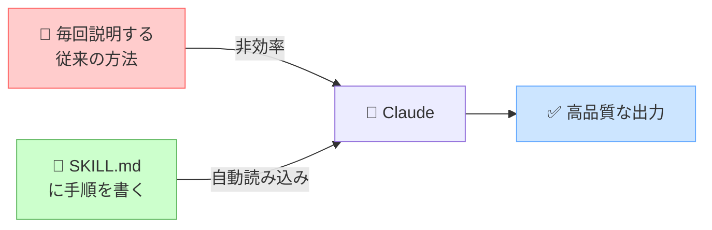

---

## 2. Claude Code の全体構造を理解する

SKILL.md を理解するには、まず Claude Code の「記憶・拡張システム」全体像を把握しましょう。

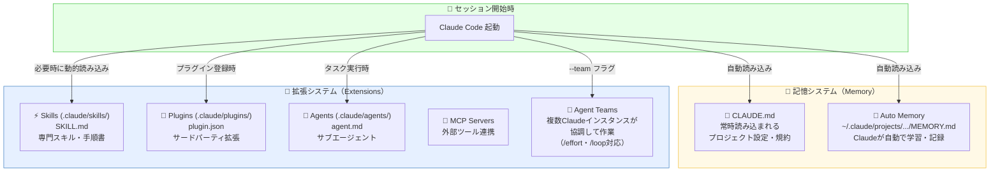

### 各要素の役割比較

| 機能 | ファイル | 誰が呼び出す | 用途 |
| ------ | --------- | ------------ | ------ |
| **CLAUDE.md** | `CLAUDE.md` | 自動（常時） | プロジェクト規約・コーディングスタイル |
| **SKILL.md** | `skills/xxx/SKILL.md` | Claude が自動 or `/コマンド` | 専門タスクの手順書 |
| **Plugin** | `plugins/xxx/plugin.json` | `/plugin install` で登録 | サードパーティ機能拡張 |
| **Agent** | `agents/xxx.md` | タスク実行時 | サブエージェントの役割定義 |
| **Agent Teams** | `settings.json` + `--team` | `claude --team` で起動 | 複数 Claude インスタンスの協調作業・`/effort`・`/loop` 対応 |

> **Note**: 旧バージョンの `.claude/commands/` によるスラッシュコマンドは現在 `skills/` に統合されています。`invocation: explicit` を指定することで同等の手動呼び出し動作が得られます。

---

## 3. SKILL.md の基本構造

SKILL.md は **2つのパート** で構成されます。

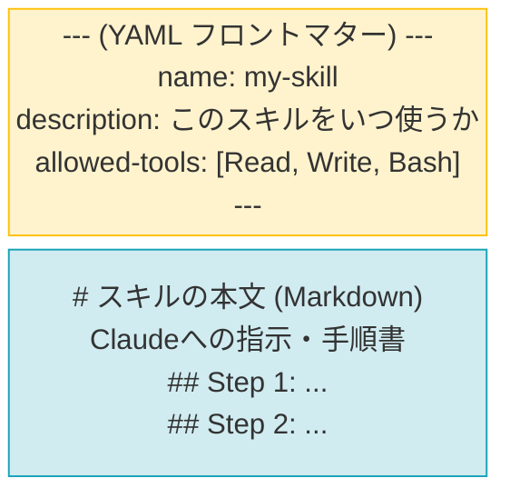

### 実際のファイル例

```yaml
---
name: code-review
description: >
  コードのセキュリティ・バグ・パフォーマンス・スタイルを
  レビューする。ユーザーが「レビューして」「確認して」
  「チェックして」と言ったときに使用する。
allowed-tools: [Read, Grep, Glob]
---

# コードレビュースキル

## レビュー観点

1. **セキュリティ**: SQLインジェクション、XSS、認証漏れをチェック
2. **バグ**: NULL参照、境界値、例外処理を確認
3. **パフォーマンス**: N+1クエリ、不要なループを検出
4. **スタイル**: プロジェクトの命名規則に従っているか確認

## 出力フォーマット

問題を見つけた場合は以下の形式で報告する：
- 🔴 重大: すぐに修正が必要
- 🟡 警告: できれば修正を推奨
- 🟢 提案: コード品質向上のヒント
```

---

## 4. ディレクトリ構造と優先順位

### スキルを置く場所は3種類

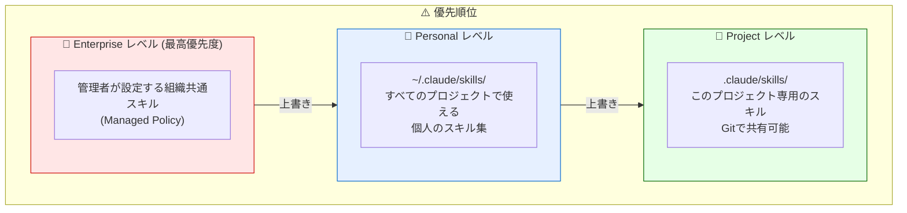

### 実際のフォルダ構造

```text
~/.claude/                      ← ホームディレクトリ（個人用）
├── CLAUDE.md                   ← 全プロジェクト共通設定
└── skills/                     ← 個人スキル
    ├── code-review/
    │   ├── SKILL.md            ← ← これが主役！
    │   ├── checklist.md        ← 補助ファイル
    │   └── scripts/
    │       └── lint.sh         ← バンドルされたスクリプト
    └── deploy/
        └── SKILL.md

your-project/                   ← プロジェクトルート
├── CLAUDE.md                   ← プロジェクト設定
└── .claude/
    ├── skills/                 ← プロジェクト専用スキル
    │   └── api-docs/
    │       └── SKILL.md
    └── plugins/                ← プラグイン（サードパーティ拡張）
        └── my-plugin/
```

---

## 5. スキルが呼び出される仕組み

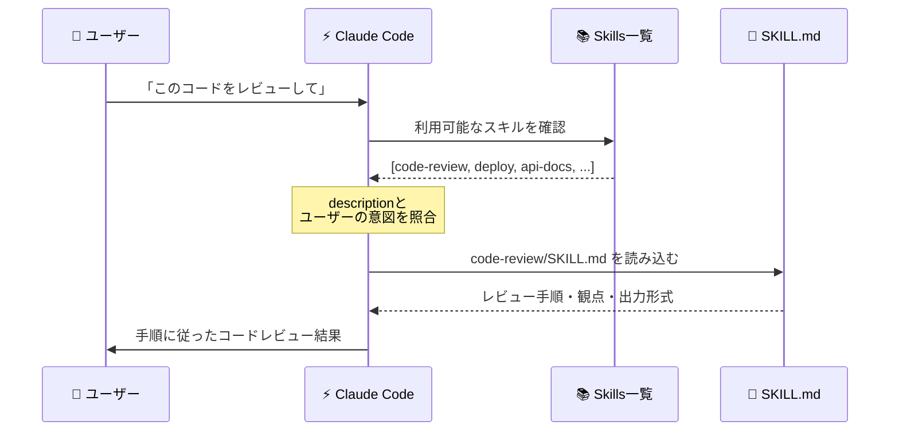

### 2つの呼び出し方

#### 方法①: Claude が自動判断（推奨）

```text
ユーザー: 「このPDFを解析して要約してくれ」
Claude:   (自動でpdfスキルを検出・実行)
```

#### 方法②: スラッシュコマンドで手動呼び出し

```text
ユーザー: /code-review src/auth/login.ts
Claude:   (code-reviewスキルを直接実行)
```

#### invocation フィールドで制御する

```yaml
---
name: deploy
invocation: explicit        # ユーザーが /deploy と入力したときのみ実行
---
```

```yaml
---
name: code-analyzer
invocation: automatic       # Claude が自動判断で実行（デフォルト）
---
```

---

## 6. CLAUDE.md との違い

初学者が最も混乱するのがこの違いです。

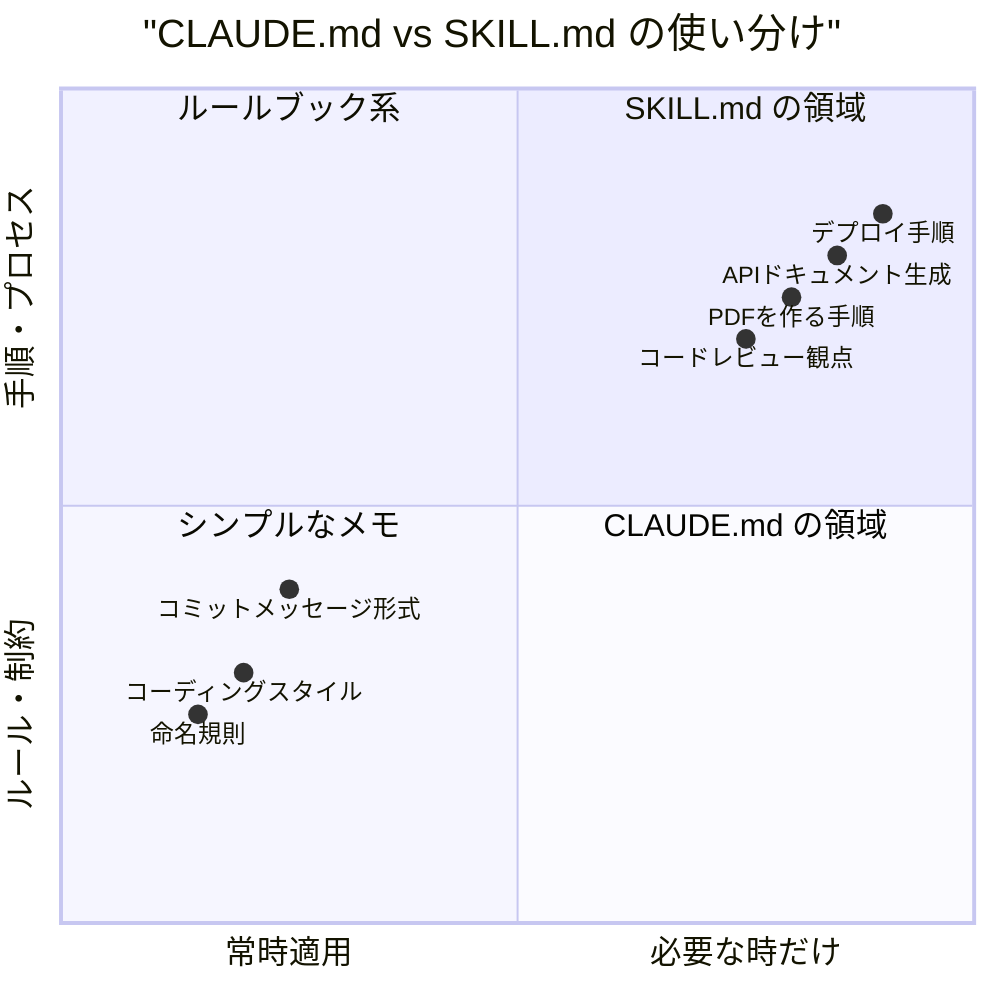

| 観点 | CLAUDE.md | SKILL.md |
| ------ | ----------- | ---------- |
| **読み込みタイミング** | セッション開始時・常時 | 必要なときだけ（オンデマンド） |
| **内容** | 常に守るべきルール・制約・コンテキスト | 特定タスクの詳細な手順書 |
| **コンテキスト消費** | 毎回消費する | 必要時のみ消費（効率的） |
| **スクリプト同梱** | ❌ できない | ✅ できる |
| **推奨行数** | 20〜200行 | 手順書として必要な分だけ |

### 黄金ルール

```text
「常に守るルール」→ CLAUDE.md
「特定のタスクの詳しい手順」→ SKILL.md
```

---

## 7. ステップバイステップ: 最初のスキルを作る

「コードを分かりやすく説明する」スキルを作ってみましょう。

### Step 1: ディレクトリを作成する

```bash
# 個人スキルとして作成（全プロジェクトで使える）
mkdir -p ~/.claude/skills/explain-code
```

### Step 2: SKILL.md を作成する

```bash
# ファイルを作成
touch ~/.claude/skills/explain-code/SKILL.md
```

### Step 3: フロントマターを書く

```yaml
---
name: explain-code
description: >
  コードの動作をビジュアル図解と例えを使って説明する。
  「どうやって動いてる？」「わかりやすく説明して」
  「教えて」と言われたときに使用する。
---
```

### Step 4: 本文（指示書）を書く

````markdown
# コード説明スキル

コードを説明するとき、必ず以下を含める：

## 1. アナロジー（例え話）で始める
日常生活の何かに例えてから説明する。
例：「このコードは郵便局のようなもので...」

## 2. 図を描く（ASCII アート）
コードの流れ・構造・関係性を視覚化する：
```
入力データ → [処理A] → [処理B] → 出力
```

## 3. ステップバイステップで解説する
コードを上から順に、何が起きているか説明する。

## 4. 「落とし穴」を1つ挙げる
よくある誤解や注意すべき点を1つ教える。

説明は会話的なトーンで行う。難しい概念は複数の例えを使う。
````

### Step 5: 動作確認する

```bash
# Claude Code を起動
claude

# 自動呼び出しをテスト
> 「このコードはどうやって動いているの？」

# または直接呼び出し
> /explain-code src/utils/parser.ts
```

### Step 6: 完成したディレクトリ構造

```text
~/.claude/skills/explain-code/
└── SKILL.md     ✅ 完成！
```

---

## 8. 応用: リソースファイルのバンドル

スキルには、指示書（SKILL.md）だけでなく、スクリプトや参考資料もまとめられます。

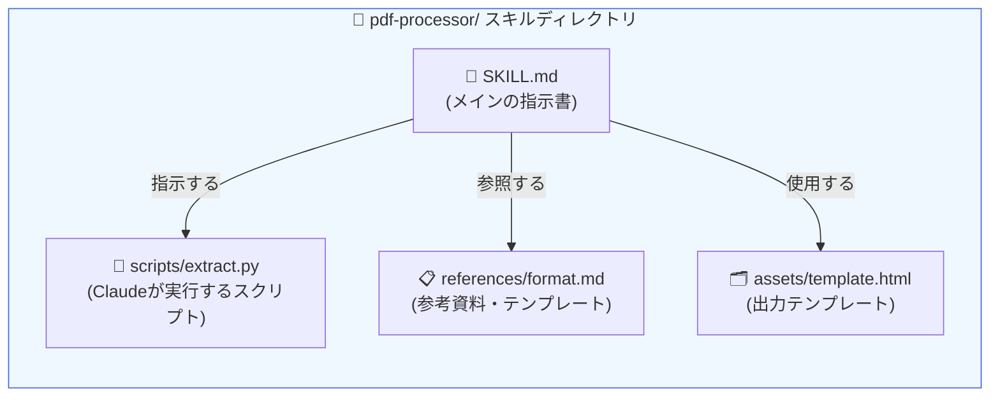

### 実践例: PDF処理スキル

```text
~/.claude/skills/pdf-processor/
├── SKILL.md              ← 指示書
├── scripts/
│   ├── extract_text.py   ← テキスト抽出スクリプト
│   └── summarize.py      ← 要約スクリプト
├── references/
│   └── output_format.md  ← 出力形式の仕様書
└── assets/
    └── report_template.html  ← レポートテンプレート
```

### SKILL.md でスクリプトを参照する書き方

```yaml
---
name: pdf-processor
description: PDFファイルを処理して要約・抽出を行う。
allowed-tools: [Bash, Read, Write]
---

# PDF処理スキル

## 処理手順

1. `scripts/extract_text.py` を実行してテキストを抽出する
2. `references/output_format.md` の形式に従って結果を整理する
3. `assets/report_template.html` を使ってレポートを生成する

## 重要な注意事項

- 大きなPDFは分割して処理する（1回あたり最大50ページ）
- 画像が含まれる場合は OCR の精度について言及する
```

---

## 9. YAML フロントマター 全フィールド解説

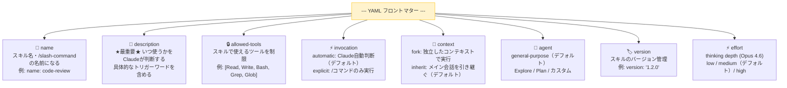

### フロントマター記述例

```yaml
---
name: security-audit               # /security-audit コマンドになる
description: >
  コードのセキュリティ監査を行う。
  「セキュリティをチェックして」「脆弱性を探して」
  「セキュリティ監査して」と言われたときに使用する。
  OWASP Top 10 の観点でレビューする。
allowed-tools:                     # 使えるツールを制限（セキュリティ上推奨）
  - Read
  - Grep
  - Glob
invocation: automatic              # Claude が自動判断
context: fork                      # メインのコンテキストを汚染しない
agent: general-purpose             # デフォルトのエージェントを使用
version: "1.0.0"                   # バージョン管理
---
```

### `context: fork` の具体的な使用例

`context: fork` を指定すると、メイン会話のコンテキストをスナップショットとして保持したまま、独立した環境でスキルを実行します。完了後は**最終結果だけ**がメインに返却され、途中経過のログやツール呼び出し履歴はメインのコンテキストを汚染しません。

```yaml
---
name: full-codebase-audit
description: >
  コードベース全体のセキュリティ監査を実行する。
  監査結果はメインの会話に汚染を与えない独立環境で処理する。
context: fork          # ← 独立コンテキスト: 監査ログをメインに返さない
agent: Explore         # ← コードベース探索に特化したサブエージェント
invocation: explicit   # ← /full-codebase-audit で手動実行のみ
allowed-tools:
  - Read
  - Grep
  - Glob
---

# コードベース全体監査

現在のGitログ:
! `git log --since="1 week ago" --oneline`

## 監査手順

1. OWASP Top 10 の各カテゴリに従ってコードをスキャン
2. 重大度を評価（Critical / Warning / Info）
3. 結果を Markdown テーブル形式でメインに返却する
```

**`context: fork` が特に有効なシーン:**

| シーン | 理由 |
| ------ | ------ |
| セキュリティ監査・静的解析 | 大量の読み取りログがメイン会話を圧迫しない |
| ドキュメント自動生成 | 生成過程の試行錯誤をメインに残さない |
| データ変換・バッチ処理 | 中間成果物をコンテキストから除外できる |
| リファクタリング調査 | 探索的コード読み取りを独立させる |

### `context: fork` vs サブエージェント の使い分け

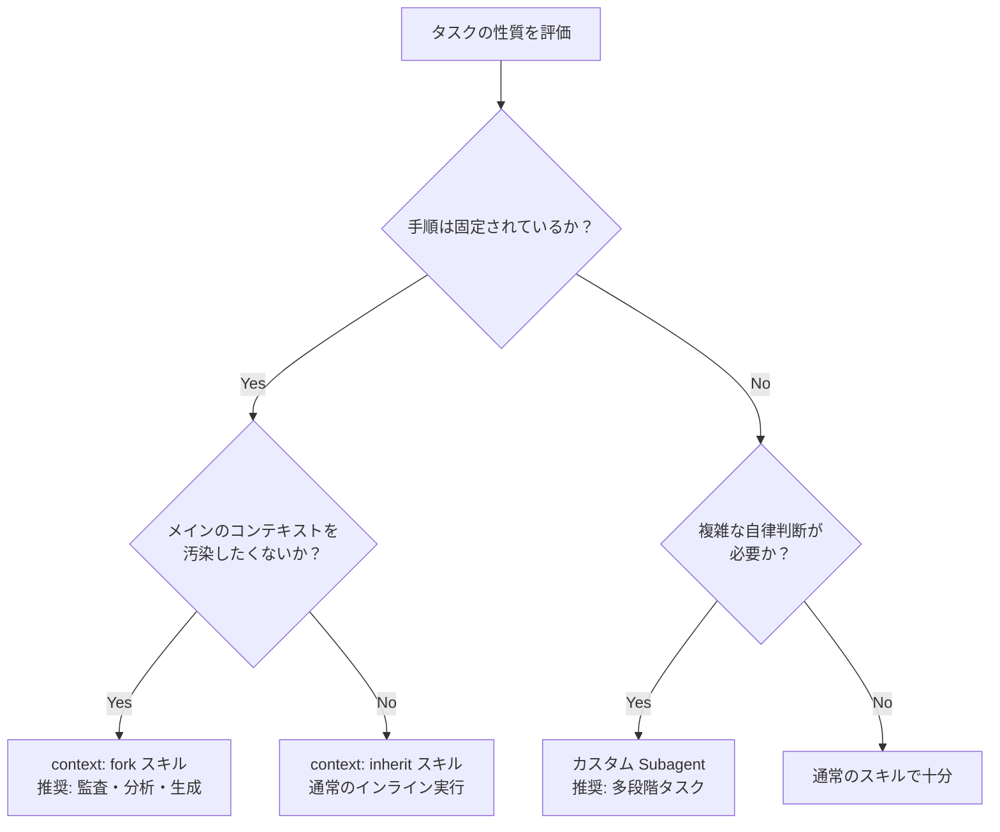

### `/skill-creator` コマンドでスキルを自動生成する

Claude Code には `/skill-creator` という組み込みメタスキルが付属しています。
ゼロから YAML を手書きする代わりに、自然言語で要件を伝えるだけで公式ベストプラクティスに準拠したスキルの雛形を生成できます。

```bash
# Claude Code のターミナルで実行
/skill-creator

# または自然言語で依頼
> "/skill-creator を使って、プロジェクトの UI デザインを最適化し、
>  ブラウザでレンダリング結果を検証するスキルを作成して"
```

`/skill-creator` が自動で遵守する事項：

- `SKILL.md` 本文は **上限: 500行**（推奨: 150行以内）に収める
- `description` はトリガーワードを含む三人称記述
- `allowed-tools` は最小権限の原則に従う
- `context: fork` が適切かどうかを判断して設定

> 💡 **Tip**: Agent Teams (`--team`) 利用時は `/effort` コマンドで思考深度を `low`・`medium`・`high` から選択できます。スキル内に `effort: high` を frontmatter で指定することも可能です（Opus 4.6 使用時のみ有効）。`/loop` コマンドを使えばスキルを定期的に繰り返し実行させることもできます。

---

## 10. ベストプラクティス

### ✅ description の書き方が最重要

Claude がスキルを自動的に選択するかどうかは、`description` の質で決まります。

```yaml
# ❌ 悪い例（曖昧すぎる）
description: コードに関する作業をする

# ✅ 良い例（具体的なトリガーワードを含む）
description: >
  コードのセキュリティ・パフォーマンス・バグを包括的にレビューする。
  「レビューして」「確認して」「チェックして」「監査して」
  「問題点を探して」という言葉をトリガーに使用する。
  Pull Request のレビューにも使用する。
```

### ✅ SKILL.md の適切なサイズ

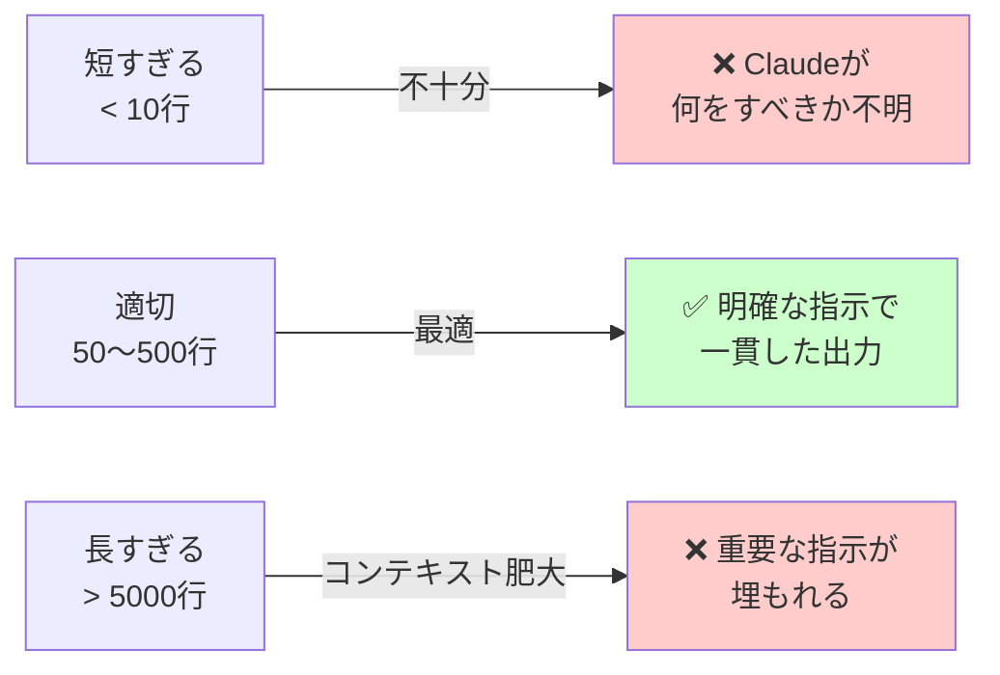

### ✅ 構造化された指示を書く

```markdown
# スキル名

## いつ使うか（Claudeへの呼び出し条件）
...

## 手順
1. まず〇〇をする
2. 次に〇〇をする
3. 最後に〇〇をする

## 出力フォーマット
...

## 注意事項
...
```

### ✅ チェックリスト

| 確認項目 | 説明 |
| --------- | ------ |
| `description` は具体的か | トリガーとなる言葉・状況を含める |
| 手順は番号付きリストか | 箇条書きより番号付きリストが指示に従いやすい |
| 出力形式は明示されているか | 何を出力すべきか明確にする |
| `allowed-tools` は必要最小限か | 不要な権限は与えない（セキュリティ） |
| 推奨 150行以内（上限 500行）か | 冗長な説明は `references/` に分離 |

---

## 11. よくあるミスと対処法

### ミス① スキルが自動で呼ばれない

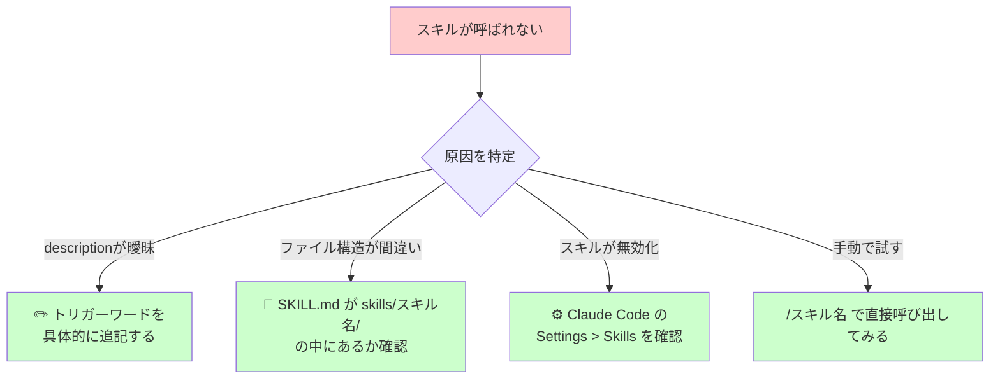

### ミス② 同名スキルの競合

```text
~/.claude/skills/deploy/SKILL.md     ← 個人スキル
.claude/skills/deploy/SKILL.md       ← プロジェクトスキル（こちらが優先）
```

**解決策**: 優先順位は `enterprise > personal > project`。  
意図的に上書きしたい場合は問題ないが、意図しない場合は名前を変更する。

### ミス③ コンテキストを使いすぎる

```yaml
# ❌ 毎回ロードされて重くなる
# CLAUDE.md に詳細な手順書を書いてしまっている...

# ✅ 手順書は SKILL.md に移動する
# CLAUDE.md には短い参照だけ書く
# 詳細は skills/my-procedure/SKILL.md に書く
```

---

## 12. 参考リンク

以下の公式・コミュニティリソースを参照してこのガイドを作成しました。

### 📚 公式ドキュメント

| リソース | URL |
| --------- | ----- |
| Claude Code Skills 公式ドキュメント | <https://docs.anthropic.com/en/docs/claude-code/skills> |
| Agent Skills 概要（Claude API） | <https://platform.claude.com/docs/en/agents-and-tools/agent-skills/overview> |
| Claude Code Memory システム | <https://docs.anthropic.com/en/docs/claude-code/memory> |
| Claude Code Skills ヘルプ（claude.ai） | <https://support.claude.com/en/articles/12512180-use-skills-in-claude> |
| Agent Teams 公式ドキュメント | <https://docs.anthropic.com/en/docs/claude-code/agent-teams> |
| Claude Code Hooks（HTTP hooks 含む） | <https://docs.anthropic.com/en/docs/claude-code/hooks> |

### 🌐 コミュニティリソース

| リソース | URL |
| --------- | ----- |
| Skills vs Workflows vs Agents の使い分け | <https://danielmiessler.com/blog/when-to-use-skills-vs-commands-vs-agents> |
| Claude Code カスタマイズ完全ガイド | <https://alexop.dev/posts/claude-code-customization-guide-claudemd-skills-subagents/> |
| Claude Code メモリシステム詳解 | <https://joseparreogarcia.substack.com/p/claude-code-memory-explained> |
| CLAUDE.md メモリ階層（DeepWiki） | <https://deepwiki.com/FlorianBruniaux/claude-code-ultimate-guide/4.1-claude.md-files-and-memory-hierarchy> |
| Agent Skills ディープダイブ | <https://leehanchung.github.io/blogs/2025/10/26/claude-skills-deep-dive/> |
| Claude Code ベストプラクティス集（GitHub） | <https://github.com/shanraisshan/claude-code-best-practice> |
| Claude Code ガイド（自動更新・GitHub） | <https://github.com/Cranot/claude-code-guide> |
| Skills マーケットプレイス | <https://skillsmp.com> |
| SFEIR Institute CLAUDE.md チュートリアル | <https://institute.sfeir.com/en/claude-code/claude-code-memory-system-claude-md/tutorial/> |

---

## 📎 まとめ

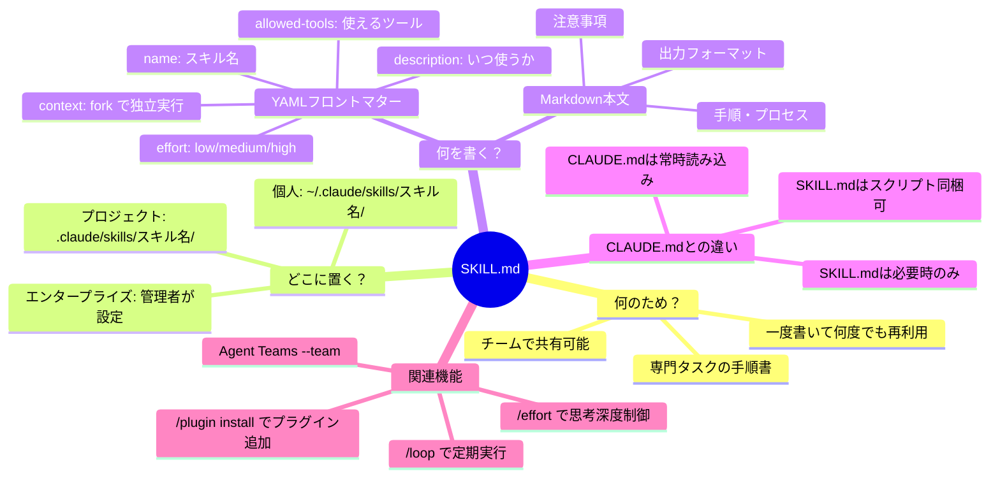

> 💡 **最重要ポイント**:  
> `description` を丁寧に書くことが、スキルが自動で正しく呼び出されるかどうかを左右する最重要事項です。  
> 「どんな言葉・状況でこのスキルを使うべきか」を具体的に書きましょう。

---

## 詳細ガイド

さらに詳しい技術的解説は以下のドキュメントをご覧ください：

- **[Claude Code SKILL.md 詳細ガイド（deep-dive）](./skill-guide-deep-dive.md)**  
  プログレッシブ・ディスクロージャーのアーキテクチャ、トークン経済、動的コンテキスト注入、`context: fork`、エンタープライズプロビジョニング、エコシステムとの統合など、SKILL.md の高度な設計思想と実装パターンを網羅的に解説しています。

---
