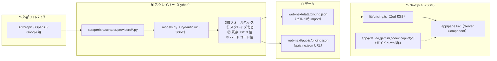

# 概要

**関連ソースファイル**: `CLAUDE.md` / `AGENTS.md` / `GEMINI.md` / `web-next/` / `scraper/`

このドキュメントは、LLM-Studies リポジトリの構造・アーキテクチャ・主要サブシステムの概要を説明します。コードベースの構成と各コンポーネントの連携を理解するための出発点として機能します。

**スコープ**: リポジトリの全体的な目的・ディレクトリ構造・アーキテクチャパターン・技術スタックを解説します。

---

## リポジトリの目的

LLM-Studies リポジトリは、統合された単一コードベースの中で **2 つの異なる目的** を果たします。

| 目的 | 説明 | 主な成果物 |
|------|------|------------|
| **LLM 料金比較ツール** | AI モデルのコストをプロバイダー横断で計算・比較する Web アプリ | `pricing.json`, `web-next/out/` |
| **AI ドキュメントハブ** | Claude Code・OpenAI Codex・GitHub Copilot・Google Gemini/Antigravity の設定ガイド集 | `web-next/app/{claude,gemini,codex,copilot,git-worktree}/` |

---

## リポジトリ構造

```text
LLM-Studies/
├── scraper/            Python 3.12+ スクレイパー (uv, Pydantic v2, Playwright)
│   └── src/scraper/
│       ├── main.py              CLI エントリポイント
│       ├── models.py            PricingData / ApiModel / SubTool スキーマ (SSoT)
│       ├── providers/           API プロバイダー別スクレイパー
│       └── tools/               コーディングツール別スクレイパー
├── web-next/           Next.js 16 + React 19 + TypeScript + Tailwind v4 (bun)
│   ├── app/
│   │   ├── layout.tsx           ルートレイアウト (SiteHeader / DisclaimerBanner)
│   │   ├── page.tsx             コスト計算機ホーム (Server Component)
│   │   ├── globals.css          Tailwind v4 + design tokens
│   │   └── {claude,gemini,codex,copilot}/{skill,agent,*}/  ガイドページ群
│   ├── components/
│   │   ├── site/                SiteHeader / SiteHeaderClient / DisclaimerBanner
│   │   ├── docs/                MermaidDiagram 等のドキュメント用コンポーネント
│   │   └── *.tsx                料金計算機 UI コンポーネント
│   ├── lib/
│   │   ├── cost.ts              純粋関数 (calcApiCost / calcSubCost / fmtUSD / fmtJPY)
│   │   ├── pricing.ts           Zod スキーマ + コンパイル時パリティアサート
│   │   └── i18n.tsx             T オブジェクト + t() + tRich()
│   ├── types/pricing.ts         Pydantic 同期型定義 (手動ミラー)
│   └── data/pricing.json        ビルド時 static import 用
├── netlify.toml        Netlify デプロイ設定 (base=web-next, publish=out)
├── update.sh           オーケストレーター (scrape → copy)
├── legacy/             旧 Vite/HTML 資産 (.gitignore 済、ローカル参照専用)
└── docs/               仕様書・ガイド群（本ファイル）
```

---

## データフロー



1. `scraper/` が各社ページをスクレイプ → `pricing.json` 生成
2. `update.sh` が `web-next/data/` と `web-next/public/` の 2 箇所へコピー
3. `web-next/` がビルド時に `data/pricing.json` を import し Zod で検証
4. Next.js が `output: 'export'` で静的 HTML を `out/` へ生成 → Netlify CDN 配信

---

## 技術スタック

### バックエンド（スクレイパー）

| 技術 | 用途 | 主なファイル |
|------|------|------------|
| **Python 3.12+** | ランタイム | `scraper/pyproject.toml` |
| **uv** | パッケージマネージャー | `scraper/.python-version` |
| **Pydantic v2** | スキーマ定義・バリデーション | `scraper/src/scraper/models.py` |
| **Playwright** | ブラウザ自動化スクレイピング | `scraper/src/scraper/browser.py` |
| **httpx** | HTTP クライアント | `scraper/src/scraper/providers/*.py` |
| **pytest** | テストフレームワーク | `scraper/tests/` |

### フロントエンド（Web アプリ）

| 技術 | 用途 | 主なファイル |
|------|------|------------|
| **Next.js 16 App Router** | フレームワーク (SSG) | `web-next/next.config.ts` |
| **React 19** | UI ライブラリ | `web-next/app/` |
| **TypeScript** | 型安全性 (`strict: true`) | `web-next/tsconfig.json` |
| **Tailwind CSS v4** | スタイリング | `web-next/app/globals.css` |
| **Bun** | パッケージマネージャー & ランタイム | `web-next/package.json` |
| **Biome** | Lint / Format | `web-next/biome.json` |
| **Vitest** | テストフレームワーク | `web-next/vitest.config.ts` |
| **Zod** | ランタイム型検証 | `web-next/lib/pricing.ts` |

---

## 重要な設計判断

| # | 判断 | 詳細 |
|---|------|------|
| 1 | **SSG 採用** | `output: 'export'` による純静的エクスポート → Netlify CDN。`@netlify/plugin-nextjs` 不要 |
| 2 | **型の同期** | `models.py`（Pydantic）が SSoT、`types/pricing.ts` が手動ミラー、`_AssertParity` でコンパイル時検証 |
| 3 | **3層フォールバック** | スクレイプ成功 → 既存 JSON → ハードコード。`scrape_status` で出自を追跡 |
| 4 | **XSS 対策** | 生 HTML 文字列挿入 API は一切使わない。`tRich()` で React 要素として合成 |
| 5 | **i18n** | next-intl 不採用。既存 `T` オブジェクト + `t()` / `tRich()` を継続 |
| 6 | **enum 禁止** | `erasableSyntaxOnly: true` により enum / namespace 使用不可 |

---

## Docker クイックスタート（推奨）

Docker Compose + Makefile を使うとローカル環境構築なしで動作します。

```bash
# 1. イメージをビルド（初回 or Dockerfile 変更時）
make build-images

# 2. pricing.json を最新化
make scrape         # フルスクレイプ（Playwright 使用）
make scrape-no-scrape  # 為替レートのみ（Playwright スキップ）

# 3. 開発サーバー起動
make dev            # → http://localhost:3000

# その他の操作
make build          # 静的エクスポート → web-next/out/
make test           # 全テスト（vitest + pytest）
make typecheck      # TypeScript 型チェック
make lint           # Biome リント
make help           # 全コマンド一覧
```

## ネイティブクイックスタート

```bash
# スクレイパーセットアップ
cd scraper && uv sync && uv run playwright install chromium

# フロントエンドセットアップ
cd web-next && bun install

# 全体更新（scrape → copy → build）
bash update.sh

# フロントエンド開発サーバー
cd web-next && bun run dev

# テスト
cd web-next && bun run test
cd scraper && uv run pytest
```

---

## AI エージェントによる変更ガイドライン

このリポジトリは AI 支援開発を前提として設計されています。全 AI エージェントは `CLAUDE.md`（または `AGENTS.md` / `GEMINI.md`）の制約を遵守してください。

### ❌ 禁止される操作

- ファイル全体の書き直し（明示的な指示がない限り）
- 依存関係のアップグレード
- ビルドツール設定の変更（`next.config.ts`・`tsconfig.json`・`biome.json`・`pyproject.toml`）
- `legacy/` 配下の編集（凍結済み）
- リポジトリ全体の自動フォーマット（`bun run lint:fix` 等）
- `any` 型・`var` 宣言・非 null アサーション（`!`）の乱用

### ✅ 許可される操作

- テストの追加
- インポートの修正
- CI 修正
- 小規模な型修正・バグ修正

### コミット前の検証

```bash
cd web-next && bun run build      # 全ルートが ○ (Static)
cd web-next && bun run typecheck  # 型エラーゼロ
cd web-next && bun run test       # 全件 pass
cd web-next && bun run lint       # 新規違反ゼロ
cd scraper && uv run pytest       # 5/5 passed
```
